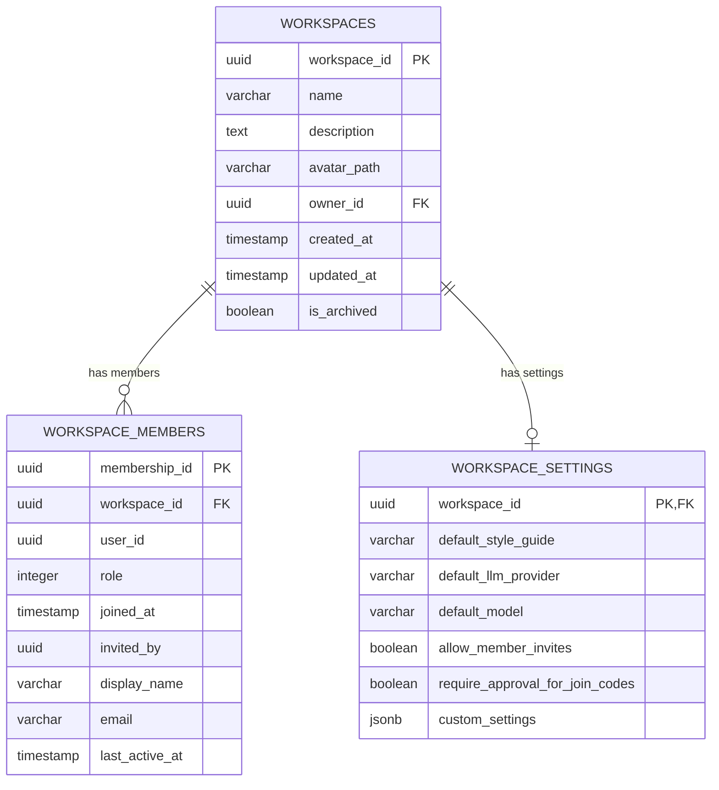

# LCS-DES-091a: Design Specification — Workspace Schema

## 1. Metadata & Categorization

| Field | Value | Description |
| :--- | :--- | :--- |
| **Feature ID** | `COL-091a` | Sub-part of COL-091 |
| **Feature Name** | `Workspace Schema` | Data models and persistence |
| **Target Version** | `v0.9.1a` | First sub-part of v0.9.1 |
| **Module Scope** | `Lexichord.Modules.Collaboration` | Collaboration module |
| **Swimlane** | `Collaboration` | Team features vertical |
| **License Tier** | `Teams` | Requires Teams license |
| **Feature Gate Key** | `team_workspaces` | License feature key |
| **Author** | Lead Architect | |
| **Status** | `Draft` | |
| **Last Updated** | `2026-01-27` | |
| **Parent Document** | [LCS-DES-091-INDEX](./LCS-DES-091-INDEX.md) | |
| **Scope Breakdown** | [LCS-SBD-091 Section 3.1](./LCS-SBD-091.md#31-v091a-workspace-schema) | |

---

## 2. Executive Summary

### 2.1 The Requirement

Lexichord needs persistent data structures to represent team workspaces and their membership relationships. Without a well-designed schema:

- No way to group users into collaborative teams
- Cannot associate resources (Lexicons, Voice Profiles) with workspaces
- No foundation for role-based access control
- Cannot track workspace settings and preferences

> **Goal:** Define the foundational data models that represent workspaces, memberships, and settings, with efficient database schema and repository patterns.

### 2.2 The Proposed Solution

Implement a comprehensive workspace schema that:

1. Defines `Workspace` entity with identity, metadata, and ownership
2. Creates `WorkspaceMember` join table linking users to workspaces with roles
3. Stores workspace-specific settings in `WorkspaceSettings`
4. Provides `IWorkspaceRepository` for all data access operations
5. Uses Dapper for efficient, type-safe database queries

---

## 3. Architecture & Modular Strategy

### 3.1 Dependencies

#### 3.1.1 Required Services

| Interface | Source Version | Purpose |
| :--- | :--- | :--- |
| `IDbConnectionFactory` | v0.0.5a | PostgreSQL connection management |
| `IConfigurationService` | v0.0.3d | Connection string retrieval |
| `Serilog.ILogger` | v0.0.3b | Operation logging |

#### 3.1.2 NuGet Packages

| Package | Version | Purpose |
| :--- | :--- | :--- |
| `Dapper` | 2.x | Micro-ORM for data access |
| `Npgsql` | 8.x | PostgreSQL ADO.NET provider |

### 3.2 Licensing Behavior

Workspace schema itself has no license checks. License verification occurs at the service layer (v0.9.1c) when creating workspaces. The repository layer is permission-agnostic.

---

## 4. Data Contract (The API)

### 4.1 Core Entities

```csharp
namespace Lexichord.Modules.Collaboration.Models;

/// <summary>
/// Represents a team workspace for collaborative writing projects.
/// </summary>
public record Workspace
{
    /// <summary>
    /// Unique identifier for the workspace.
    /// </summary>
    public Guid WorkspaceId { get; init; }

    /// <summary>
    /// Display name of the workspace.
    /// </summary>
    /// <remarks>Must be unique per owner, 1-255 characters.</remarks>
    public required string Name { get; init; }

    /// <summary>
    /// Optional description of the workspace purpose.
    /// </summary>
    public string? Description { get; init; }

    /// <summary>
    /// Path to workspace avatar image.
    /// </summary>
    public string? AvatarPath { get; init; }

    /// <summary>
    /// User ID of the workspace creator and primary owner.
    /// </summary>
    public Guid OwnerId { get; init; }

    /// <summary>
    /// When the workspace was created.
    /// </summary>
    public DateTime CreatedAt { get; init; }

    /// <summary>
    /// When the workspace was last modified.
    /// </summary>
    public DateTime UpdatedAt { get; init; }

    /// <summary>
    /// Whether the workspace is archived (hidden but not deleted).
    /// </summary>
    public bool IsArchived { get; init; }

    /// <summary>
    /// Workspace-specific configuration.
    /// </summary>
    public WorkspaceSettings? Settings { get; init; }

    /// <summary>
    /// Members of this workspace (populated when requested).
    /// </summary>
    public IReadOnlyList<WorkspaceMember>? Members { get; init; }
}

/// <summary>
/// Represents a user's membership in a workspace.
/// </summary>
public record WorkspaceMember
{
    /// <summary>
    /// Unique identifier for this membership record.
    /// </summary>
    public Guid MembershipId { get; init; }

    /// <summary>
    /// The workspace this membership belongs to.
    /// </summary>
    public Guid WorkspaceId { get; init; }

    /// <summary>
    /// The user who is a member.
    /// </summary>
    public Guid UserId { get; init; }

    /// <summary>
    /// The user's role within the workspace.
    /// </summary>
    public WorkspaceRole Role { get; init; }

    /// <summary>
    /// When the user joined the workspace.
    /// </summary>
    public DateTime JoinedAt { get; init; }

    /// <summary>
    /// User who invited this member (null if original owner).
    /// </summary>
    public Guid? InvitedBy { get; init; }

    /// <summary>
    /// Display name shown in workspace member lists.
    /// </summary>
    public string? DisplayName { get; init; }

    /// <summary>
    /// Email address for the member.
    /// </summary>
    public string? Email { get; init; }

    /// <summary>
    /// When the member was last active in this workspace.
    /// </summary>
    public DateTime? LastActiveAt { get; init; }
}

/// <summary>
/// Roles that can be assigned to workspace members.
/// </summary>
public enum WorkspaceRole
{
    /// <summary>
    /// View-only access to workspace resources.
    /// </summary>
    Viewer = 0,

    /// <summary>
    /// Can view and edit Lexicons, Voice Profiles, and documents.
    /// </summary>
    Editor = 1,

    /// <summary>
    /// Full control including member management and workspace settings.
    /// </summary>
    Owner = 2
}

/// <summary>
/// Workspace-specific settings and configuration.
/// </summary>
public record WorkspaceSettings
{
    /// <summary>
    /// The workspace these settings belong to.
    /// </summary>
    public Guid WorkspaceId { get; init; }

    /// <summary>
    /// Default style guide for new documents in this workspace.
    /// </summary>
    public string? DefaultStyleGuide { get; init; }

    /// <summary>
    /// Default LLM provider for this workspace.
    /// </summary>
    public string? DefaultLLMProvider { get; init; }

    /// <summary>
    /// Default model for this workspace.
    /// </summary>
    public string? DefaultModel { get; init; }

    /// <summary>
    /// Whether Editors can invite new members.
    /// </summary>
    public bool AllowMemberInvites { get; init; }

    /// <summary>
    /// Whether join code users need Owner approval.
    /// </summary>
    public bool RequireApprovalForJoinCodes { get; init; }

    /// <summary>
    /// Custom key-value settings for extensibility.
    /// </summary>
    public IReadOnlyDictionary<string, string>? CustomSettings { get; init; }
}
```

### 4.2 Repository Interface

```csharp
namespace Lexichord.Abstractions.Contracts;

/// <summary>
/// Repository interface for workspace data access operations.
/// </summary>
public interface IWorkspaceRepository
{
    #region Workspace CRUD

    /// <summary>
    /// Gets a workspace by its unique identifier.
    /// </summary>
    /// <param name="workspaceId">The workspace ID.</param>
    /// <param name="includeMembers">Whether to load members.</param>
    /// <param name="ct">Cancellation token.</param>
    /// <returns>The workspace or null if not found.</returns>
    Task<Workspace?> GetByIdAsync(
        Guid workspaceId,
        bool includeMembers = false,
        CancellationToken ct = default);

    /// <summary>
    /// Gets all workspaces a user is a member of.
    /// </summary>
    /// <param name="userId">The user ID.</param>
    /// <param name="includeArchived">Whether to include archived workspaces.</param>
    /// <param name="ct">Cancellation token.</param>
    /// <returns>List of workspaces the user can access.</returns>
    Task<IReadOnlyList<Workspace>> GetByUserIdAsync(
        Guid userId,
        bool includeArchived = false,
        CancellationToken ct = default);

    /// <summary>
    /// Creates a new workspace.
    /// </summary>
    /// <param name="workspace">The workspace to create.</param>
    /// <param name="ct">Cancellation token.</param>
    /// <returns>The created workspace with generated ID.</returns>
    Task<Workspace> CreateAsync(
        Workspace workspace,
        CancellationToken ct = default);

    /// <summary>
    /// Updates an existing workspace.
    /// </summary>
    /// <param name="workspace">The workspace with updated values.</param>
    /// <param name="ct">Cancellation token.</param>
    /// <returns>The updated workspace.</returns>
    Task<Workspace> UpdateAsync(
        Workspace workspace,
        CancellationToken ct = default);

    /// <summary>
    /// Permanently deletes a workspace and all associated data.
    /// </summary>
    /// <param name="workspaceId">The workspace to delete.</param>
    /// <param name="ct">Cancellation token.</param>
    Task DeleteAsync(
        Guid workspaceId,
        CancellationToken ct = default);

    /// <summary>
    /// Archives a workspace (soft delete).
    /// </summary>
    /// <param name="workspaceId">The workspace to archive.</param>
    /// <param name="ct">Cancellation token.</param>
    Task ArchiveAsync(
        Guid workspaceId,
        CancellationToken ct = default);

    /// <summary>
    /// Restores an archived workspace.
    /// </summary>
    /// <param name="workspaceId">The workspace to restore.</param>
    /// <param name="ct">Cancellation token.</param>
    Task RestoreAsync(
        Guid workspaceId,
        CancellationToken ct = default);

    #endregion

    #region Member Operations

    /// <summary>
    /// Gets all members of a workspace.
    /// </summary>
    /// <param name="workspaceId">The workspace ID.</param>
    /// <param name="ct">Cancellation token.</param>
    /// <returns>List of workspace members.</returns>
    Task<IReadOnlyList<WorkspaceMember>> GetMembersAsync(
        Guid workspaceId,
        CancellationToken ct = default);

    /// <summary>
    /// Gets a specific user's membership in a workspace.
    /// </summary>
    /// <param name="workspaceId">The workspace ID.</param>
    /// <param name="userId">The user ID.</param>
    /// <param name="ct">Cancellation token.</param>
    /// <returns>The membership or null if not a member.</returns>
    Task<WorkspaceMember?> GetMembershipAsync(
        Guid workspaceId,
        Guid userId,
        CancellationToken ct = default);

    /// <summary>
    /// Adds a new member to a workspace.
    /// </summary>
    /// <param name="member">The membership to create.</param>
    /// <param name="ct">Cancellation token.</param>
    /// <returns>The created membership.</returns>
    Task<WorkspaceMember> AddMemberAsync(
        WorkspaceMember member,
        CancellationToken ct = default);

    /// <summary>
    /// Updates a member's role or other details.
    /// </summary>
    /// <param name="member">The membership with updated values.</param>
    /// <param name="ct">Cancellation token.</param>
    /// <returns>The updated membership.</returns>
    Task<WorkspaceMember> UpdateMemberAsync(
        WorkspaceMember member,
        CancellationToken ct = default);

    /// <summary>
    /// Removes a member from a workspace.
    /// </summary>
    /// <param name="workspaceId">The workspace ID.</param>
    /// <param name="userId">The user to remove.</param>
    /// <param name="ct">Cancellation token.</param>
    Task RemoveMemberAsync(
        Guid workspaceId,
        Guid userId,
        CancellationToken ct = default);

    /// <summary>
    /// Gets the count of members in a workspace.
    /// </summary>
    /// <param name="workspaceId">The workspace ID.</param>
    /// <param name="ct">Cancellation token.</param>
    /// <returns>Number of members.</returns>
    Task<int> GetMemberCountAsync(
        Guid workspaceId,
        CancellationToken ct = default);

    /// <summary>
    /// Checks if a user is a member of a workspace.
    /// </summary>
    /// <param name="workspaceId">The workspace ID.</param>
    /// <param name="userId">The user ID.</param>
    /// <param name="ct">Cancellation token.</param>
    /// <returns>True if the user is a member.</returns>
    Task<bool> IsMemberAsync(
        Guid workspaceId,
        Guid userId,
        CancellationToken ct = default);

    #endregion

    #region Settings Operations

    /// <summary>
    /// Gets settings for a workspace.
    /// </summary>
    /// <param name="workspaceId">The workspace ID.</param>
    /// <param name="ct">Cancellation token.</param>
    /// <returns>The workspace settings or null.</returns>
    Task<WorkspaceSettings?> GetSettingsAsync(
        Guid workspaceId,
        CancellationToken ct = default);

    /// <summary>
    /// Updates workspace settings.
    /// </summary>
    /// <param name="settings">The settings to save.</param>
    /// <param name="ct">Cancellation token.</param>
    /// <returns>The updated settings.</returns>
    Task<WorkspaceSettings> SaveSettingsAsync(
        WorkspaceSettings settings,
        CancellationToken ct = default);

    #endregion
}
```

---

## 5. Implementation Logic

### 5.1 Database Schema

```sql
-- ═══════════════════════════════════════════════════════════════════════════
-- Migration_091_TeamWorkspaces.cs
-- ═══════════════════════════════════════════════════════════════════════════

-- Workspaces table
CREATE TABLE IF NOT EXISTS workspaces (
    workspace_id UUID PRIMARY KEY DEFAULT gen_random_uuid(),
    name VARCHAR(255) NOT NULL,
    description TEXT,
    avatar_path VARCHAR(512),
    owner_id UUID NOT NULL,
    created_at TIMESTAMP WITH TIME ZONE NOT NULL DEFAULT NOW(),
    updated_at TIMESTAMP WITH TIME ZONE NOT NULL DEFAULT NOW(),
    is_archived BOOLEAN NOT NULL DEFAULT FALSE,

    -- Constraints
    CONSTRAINT chk_workspace_name_length CHECK (LENGTH(name) >= 1)
);

-- Workspace members junction table
CREATE TABLE IF NOT EXISTS workspace_members (
    membership_id UUID PRIMARY KEY DEFAULT gen_random_uuid(),
    workspace_id UUID NOT NULL,
    user_id UUID NOT NULL,
    role INTEGER NOT NULL DEFAULT 0,
    joined_at TIMESTAMP WITH TIME ZONE NOT NULL DEFAULT NOW(),
    invited_by UUID,
    display_name VARCHAR(255),
    email VARCHAR(255),
    last_active_at TIMESTAMP WITH TIME ZONE,

    -- Foreign keys
    CONSTRAINT fk_workspace_members_workspace
        FOREIGN KEY (workspace_id)
        REFERENCES workspaces(workspace_id)
        ON DELETE CASCADE,

    -- Unique constraint: one membership per user per workspace
    CONSTRAINT uq_workspace_members_user
        UNIQUE (workspace_id, user_id)
);

-- Workspace settings table
CREATE TABLE IF NOT EXISTS workspace_settings (
    workspace_id UUID PRIMARY KEY,
    default_style_guide VARCHAR(255),
    default_llm_provider VARCHAR(100),
    default_model VARCHAR(100),
    allow_member_invites BOOLEAN NOT NULL DEFAULT FALSE,
    require_approval_for_join_codes BOOLEAN NOT NULL DEFAULT FALSE,
    custom_settings JSONB,

    -- Foreign key
    CONSTRAINT fk_workspace_settings_workspace
        FOREIGN KEY (workspace_id)
        REFERENCES workspaces(workspace_id)
        ON DELETE CASCADE
);

-- ═══════════════════════════════════════════════════════════════════════════
-- Indexes for performance
-- ═══════════════════════════════════════════════════════════════════════════

-- Find workspaces by owner
CREATE INDEX IF NOT EXISTS idx_workspaces_owner
    ON workspaces(owner_id);

-- Find non-archived workspaces
CREATE INDEX IF NOT EXISTS idx_workspaces_active
    ON workspaces(is_archived)
    WHERE is_archived = FALSE;

-- Find members by workspace
CREATE INDEX IF NOT EXISTS idx_workspace_members_workspace
    ON workspace_members(workspace_id);

-- Find workspaces by user
CREATE INDEX IF NOT EXISTS idx_workspace_members_user
    ON workspace_members(user_id);

-- Find members by role (for counting owners, etc.)
CREATE INDEX IF NOT EXISTS idx_workspace_members_role
    ON workspace_members(workspace_id, role);

-- ═══════════════════════════════════════════════════════════════════════════
-- Triggers for updated_at
-- ═══════════════════════════════════════════════════════════════════════════

CREATE OR REPLACE FUNCTION update_workspace_timestamp()
RETURNS TRIGGER AS $$
BEGIN
    NEW.updated_at = NOW();
    RETURN NEW;
END;
$$ LANGUAGE plpgsql;

CREATE TRIGGER trg_workspaces_updated_at
    BEFORE UPDATE ON workspaces
    FOR EACH ROW
    EXECUTE FUNCTION update_workspace_timestamp();
```

### 5.2 Repository Implementation

```csharp
namespace Lexichord.Modules.Collaboration.Repositories;

/// <summary>
/// Dapper implementation of IWorkspaceRepository.
/// </summary>
public class WorkspaceRepository(
    IDbConnectionFactory connectionFactory,
    ILogger<WorkspaceRepository> logger) : IWorkspaceRepository
{
    #region Workspace CRUD

    public async Task<Workspace?> GetByIdAsync(
        Guid workspaceId,
        bool includeMembers = false,
        CancellationToken ct = default)
    {
        logger.LogDebug("Getting workspace {WorkspaceId}", workspaceId);

        await using var conn = await connectionFactory.OpenAsync(ct);

        const string sql = """
            SELECT
                workspace_id AS WorkspaceId,
                name AS Name,
                description AS Description,
                avatar_path AS AvatarPath,
                owner_id AS OwnerId,
                created_at AS CreatedAt,
                updated_at AS UpdatedAt,
                is_archived AS IsArchived
            FROM workspaces
            WHERE workspace_id = @workspaceId
            """;

        var workspace = await conn.QuerySingleOrDefaultAsync<Workspace>(
            sql, new { workspaceId });

        if (workspace is null) return null;

        // Load settings
        workspace = workspace with
        {
            Settings = await GetSettingsAsync(workspaceId, ct)
        };

        // Optionally load members
        if (includeMembers)
        {
            var members = await GetMembersAsync(workspaceId, ct);
            workspace = workspace with { Members = members };
        }

        return workspace;
    }

    public async Task<IReadOnlyList<Workspace>> GetByUserIdAsync(
        Guid userId,
        bool includeArchived = false,
        CancellationToken ct = default)
    {
        logger.LogDebug("Getting workspaces for user {UserId}", userId);

        await using var conn = await connectionFactory.OpenAsync(ct);

        var sql = """
            SELECT
                w.workspace_id AS WorkspaceId,
                w.name AS Name,
                w.description AS Description,
                w.avatar_path AS AvatarPath,
                w.owner_id AS OwnerId,
                w.created_at AS CreatedAt,
                w.updated_at AS UpdatedAt,
                w.is_archived AS IsArchived
            FROM workspaces w
            INNER JOIN workspace_members wm ON w.workspace_id = wm.workspace_id
            WHERE wm.user_id = @userId
            """;

        if (!includeArchived)
        {
            sql += " AND w.is_archived = FALSE";
        }

        sql += " ORDER BY w.name ASC";

        var workspaces = await conn.QueryAsync<Workspace>(sql, new { userId });
        return workspaces.ToList();
    }

    public async Task<Workspace> CreateAsync(
        Workspace workspace,
        CancellationToken ct = default)
    {
        logger.LogInformation("Creating workspace: {Name} for owner {OwnerId}",
            workspace.Name, workspace.OwnerId);

        await using var conn = await connectionFactory.OpenAsync(ct);

        const string sql = """
            INSERT INTO workspaces (
                workspace_id, name, description, avatar_path, owner_id,
                created_at, updated_at, is_archived
            ) VALUES (
                @WorkspaceId, @Name, @Description, @AvatarPath, @OwnerId,
                @CreatedAt, @UpdatedAt, @IsArchived
            )
            RETURNING workspace_id AS WorkspaceId
            """;

        var newWorkspace = workspace with
        {
            WorkspaceId = workspace.WorkspaceId == Guid.Empty
                ? Guid.NewGuid()
                : workspace.WorkspaceId,
            CreatedAt = DateTime.UtcNow,
            UpdatedAt = DateTime.UtcNow
        };

        await conn.ExecuteAsync(sql, newWorkspace);

        return newWorkspace;
    }

    public async Task<Workspace> UpdateAsync(
        Workspace workspace,
        CancellationToken ct = default)
    {
        logger.LogInformation("Updating workspace: {WorkspaceId}", workspace.WorkspaceId);

        await using var conn = await connectionFactory.OpenAsync(ct);

        const string sql = """
            UPDATE workspaces SET
                name = @Name,
                description = @Description,
                avatar_path = @AvatarPath,
                is_archived = @IsArchived,
                updated_at = NOW()
            WHERE workspace_id = @WorkspaceId
            """;

        var rows = await conn.ExecuteAsync(sql, workspace);

        if (rows == 0)
        {
            throw new InvalidOperationException(
                $"Workspace {workspace.WorkspaceId} not found");
        }

        return workspace with { UpdatedAt = DateTime.UtcNow };
    }

    public async Task DeleteAsync(Guid workspaceId, CancellationToken ct = default)
    {
        logger.LogWarning("Permanently deleting workspace: {WorkspaceId}", workspaceId);

        await using var conn = await connectionFactory.OpenAsync(ct);

        const string sql = "DELETE FROM workspaces WHERE workspace_id = @workspaceId";
        await conn.ExecuteAsync(sql, new { workspaceId });
    }

    public async Task ArchiveAsync(Guid workspaceId, CancellationToken ct = default)
    {
        logger.LogInformation("Archiving workspace: {WorkspaceId}", workspaceId);

        await using var conn = await connectionFactory.OpenAsync(ct);

        const string sql = """
            UPDATE workspaces SET
                is_archived = TRUE,
                updated_at = NOW()
            WHERE workspace_id = @workspaceId
            """;

        await conn.ExecuteAsync(sql, new { workspaceId });
    }

    public async Task RestoreAsync(Guid workspaceId, CancellationToken ct = default)
    {
        logger.LogInformation("Restoring workspace: {WorkspaceId}", workspaceId);

        await using var conn = await connectionFactory.OpenAsync(ct);

        const string sql = """
            UPDATE workspaces SET
                is_archived = FALSE,
                updated_at = NOW()
            WHERE workspace_id = @workspaceId
            """;

        await conn.ExecuteAsync(sql, new { workspaceId });
    }

    #endregion

    #region Member Operations

    public async Task<IReadOnlyList<WorkspaceMember>> GetMembersAsync(
        Guid workspaceId,
        CancellationToken ct = default)
    {
        logger.LogDebug("Getting members for workspace {WorkspaceId}", workspaceId);

        await using var conn = await connectionFactory.OpenAsync(ct);

        const string sql = """
            SELECT
                membership_id AS MembershipId,
                workspace_id AS WorkspaceId,
                user_id AS UserId,
                role AS Role,
                joined_at AS JoinedAt,
                invited_by AS InvitedBy,
                display_name AS DisplayName,
                email AS Email,
                last_active_at AS LastActiveAt
            FROM workspace_members
            WHERE workspace_id = @workspaceId
            ORDER BY role DESC, joined_at ASC
            """;

        var members = await conn.QueryAsync<WorkspaceMember>(sql, new { workspaceId });
        return members.ToList();
    }

    public async Task<WorkspaceMember?> GetMembershipAsync(
        Guid workspaceId,
        Guid userId,
        CancellationToken ct = default)
    {
        await using var conn = await connectionFactory.OpenAsync(ct);

        const string sql = """
            SELECT
                membership_id AS MembershipId,
                workspace_id AS WorkspaceId,
                user_id AS UserId,
                role AS Role,
                joined_at AS JoinedAt,
                invited_by AS InvitedBy,
                display_name AS DisplayName,
                email AS Email,
                last_active_at AS LastActiveAt
            FROM workspace_members
            WHERE workspace_id = @workspaceId AND user_id = @userId
            """;

        return await conn.QuerySingleOrDefaultAsync<WorkspaceMember>(
            sql, new { workspaceId, userId });
    }

    public async Task<WorkspaceMember> AddMemberAsync(
        WorkspaceMember member,
        CancellationToken ct = default)
    {
        logger.LogInformation(
            "Adding member {UserId} to workspace {WorkspaceId} as {Role}",
            member.UserId, member.WorkspaceId, member.Role);

        await using var conn = await connectionFactory.OpenAsync(ct);

        const string sql = """
            INSERT INTO workspace_members (
                membership_id, workspace_id, user_id, role,
                joined_at, invited_by, display_name, email
            ) VALUES (
                @MembershipId, @WorkspaceId, @UserId, @Role,
                @JoinedAt, @InvitedBy, @DisplayName, @Email
            )
            """;

        var newMember = member with
        {
            MembershipId = member.MembershipId == Guid.Empty
                ? Guid.NewGuid()
                : member.MembershipId,
            JoinedAt = DateTime.UtcNow
        };

        await conn.ExecuteAsync(sql, newMember);

        return newMember;
    }

    public async Task<WorkspaceMember> UpdateMemberAsync(
        WorkspaceMember member,
        CancellationToken ct = default)
    {
        logger.LogInformation(
            "Updating member {UserId} in workspace {WorkspaceId}",
            member.UserId, member.WorkspaceId);

        await using var conn = await connectionFactory.OpenAsync(ct);

        const string sql = """
            UPDATE workspace_members SET
                role = @Role,
                display_name = @DisplayName,
                email = @Email,
                last_active_at = @LastActiveAt
            WHERE workspace_id = @WorkspaceId AND user_id = @UserId
            """;

        await conn.ExecuteAsync(sql, member);

        return member;
    }

    public async Task RemoveMemberAsync(
        Guid workspaceId,
        Guid userId,
        CancellationToken ct = default)
    {
        logger.LogInformation(
            "Removing member {UserId} from workspace {WorkspaceId}",
            userId, workspaceId);

        await using var conn = await connectionFactory.OpenAsync(ct);

        const string sql = """
            DELETE FROM workspace_members
            WHERE workspace_id = @workspaceId AND user_id = @userId
            """;

        await conn.ExecuteAsync(sql, new { workspaceId, userId });
    }

    public async Task<int> GetMemberCountAsync(
        Guid workspaceId,
        CancellationToken ct = default)
    {
        await using var conn = await connectionFactory.OpenAsync(ct);

        const string sql = """
            SELECT COUNT(*) FROM workspace_members
            WHERE workspace_id = @workspaceId
            """;

        return await conn.ExecuteScalarAsync<int>(sql, new { workspaceId });
    }

    public async Task<bool> IsMemberAsync(
        Guid workspaceId,
        Guid userId,
        CancellationToken ct = default)
    {
        await using var conn = await connectionFactory.OpenAsync(ct);

        const string sql = """
            SELECT EXISTS(
                SELECT 1 FROM workspace_members
                WHERE workspace_id = @workspaceId AND user_id = @userId
            )
            """;

        return await conn.ExecuteScalarAsync<bool>(sql, new { workspaceId, userId });
    }

    #endregion

    #region Settings Operations

    public async Task<WorkspaceSettings?> GetSettingsAsync(
        Guid workspaceId,
        CancellationToken ct = default)
    {
        await using var conn = await connectionFactory.OpenAsync(ct);

        const string sql = """
            SELECT
                workspace_id AS WorkspaceId,
                default_style_guide AS DefaultStyleGuide,
                default_llm_provider AS DefaultLLMProvider,
                default_model AS DefaultModel,
                allow_member_invites AS AllowMemberInvites,
                require_approval_for_join_codes AS RequireApprovalForJoinCodes,
                custom_settings AS CustomSettings
            FROM workspace_settings
            WHERE workspace_id = @workspaceId
            """;

        return await conn.QuerySingleOrDefaultAsync<WorkspaceSettings>(
            sql, new { workspaceId });
    }

    public async Task<WorkspaceSettings> SaveSettingsAsync(
        WorkspaceSettings settings,
        CancellationToken ct = default)
    {
        logger.LogInformation(
            "Saving settings for workspace {WorkspaceId}",
            settings.WorkspaceId);

        await using var conn = await connectionFactory.OpenAsync(ct);

        const string sql = """
            INSERT INTO workspace_settings (
                workspace_id, default_style_guide, default_llm_provider,
                default_model, allow_member_invites, require_approval_for_join_codes,
                custom_settings
            ) VALUES (
                @WorkspaceId, @DefaultStyleGuide, @DefaultLLMProvider,
                @DefaultModel, @AllowMemberInvites, @RequireApprovalForJoinCodes,
                @CustomSettings::jsonb
            )
            ON CONFLICT (workspace_id) DO UPDATE SET
                default_style_guide = EXCLUDED.default_style_guide,
                default_llm_provider = EXCLUDED.default_llm_provider,
                default_model = EXCLUDED.default_model,
                allow_member_invites = EXCLUDED.allow_member_invites,
                require_approval_for_join_codes = EXCLUDED.require_approval_for_join_codes,
                custom_settings = EXCLUDED.custom_settings
            """;

        var customSettingsJson = settings.CustomSettings is not null
            ? System.Text.Json.JsonSerializer.Serialize(settings.CustomSettings)
            : null;

        await conn.ExecuteAsync(sql, new
        {
            settings.WorkspaceId,
            settings.DefaultStyleGuide,
            settings.DefaultLLMProvider,
            settings.DefaultModel,
            settings.AllowMemberInvites,
            settings.RequireApprovalForJoinCodes,
            CustomSettings = customSettingsJson
        });

        return settings;
    }

    #endregion
}
```

### 5.3 Entity Relationship Diagram



---

## 6. Test Scenarios

### 6.1 WorkspaceRepository Tests

```csharp
namespace Lexichord.Tests.Collaboration;

[Trait("Category", "Unit")]
[Trait("Version", "v0.9.1a")]
public class WorkspaceRepositoryTests : IAsyncLifetime
{
    private readonly TestDbConnectionFactory _connectionFactory;
    private readonly WorkspaceRepository _sut;

    public WorkspaceRepositoryTests()
    {
        _connectionFactory = new TestDbConnectionFactory();
        _sut = new WorkspaceRepository(
            _connectionFactory,
            NullLogger<WorkspaceRepository>.Instance);
    }

    public async Task InitializeAsync()
    {
        await _connectionFactory.InitializeAsync();
    }

    public async Task DisposeAsync()
    {
        await _connectionFactory.DisposeAsync();
    }

    #region Create Tests

    [Fact]
    public async Task CreateAsync_ValidWorkspace_ReturnsWithGeneratedId()
    {
        // Arrange
        var workspace = new Workspace
        {
            Name = "Test Workspace",
            Description = "A test workspace",
            OwnerId = Guid.NewGuid()
        };

        // Act
        var result = await _sut.CreateAsync(workspace);

        // Assert
        result.WorkspaceId.Should().NotBeEmpty();
        result.Name.Should().Be("Test Workspace");
        result.Description.Should().Be("A test workspace");
        result.CreatedAt.Should().BeCloseTo(DateTime.UtcNow, TimeSpan.FromSeconds(1));
        result.IsArchived.Should().BeFalse();
    }

    [Fact]
    public async Task CreateAsync_ProvidedId_UsesProvidedId()
    {
        // Arrange
        var workspaceId = Guid.NewGuid();
        var workspace = new Workspace
        {
            WorkspaceId = workspaceId,
            Name = "Test Workspace",
            OwnerId = Guid.NewGuid()
        };

        // Act
        var result = await _sut.CreateAsync(workspace);

        // Assert
        result.WorkspaceId.Should().Be(workspaceId);
    }

    #endregion

    #region Get Tests

    [Fact]
    public async Task GetByIdAsync_ExistingWorkspace_ReturnsWorkspace()
    {
        // Arrange
        var created = await CreateTestWorkspace();

        // Act
        var result = await _sut.GetByIdAsync(created.WorkspaceId);

        // Assert
        result.Should().NotBeNull();
        result!.WorkspaceId.Should().Be(created.WorkspaceId);
        result.Name.Should().Be(created.Name);
    }

    [Fact]
    public async Task GetByIdAsync_NonExistent_ReturnsNull()
    {
        // Act
        var result = await _sut.GetByIdAsync(Guid.NewGuid());

        // Assert
        result.Should().BeNull();
    }

    [Fact]
    public async Task GetByIdAsync_WithMembers_IncludesMembers()
    {
        // Arrange
        var workspace = await CreateTestWorkspace();
        await AddTestMember(workspace.WorkspaceId, Guid.NewGuid(), WorkspaceRole.Editor);

        // Act
        var result = await _sut.GetByIdAsync(workspace.WorkspaceId, includeMembers: true);

        // Assert
        result.Should().NotBeNull();
        result!.Members.Should().NotBeNull();
        result.Members.Should().HaveCount(1);
    }

    [Fact]
    public async Task GetByUserIdAsync_MemberOfMultiple_ReturnsAll()
    {
        // Arrange
        var userId = Guid.NewGuid();
        await CreateTestWorkspaceWithMember(userId);
        await CreateTestWorkspaceWithMember(userId);
        await CreateTestWorkspaceWithMember(userId);

        // Act
        var result = await _sut.GetByUserIdAsync(userId);

        // Assert
        result.Should().HaveCount(3);
    }

    [Fact]
    public async Task GetByUserIdAsync_ExcludesArchived_ByDefault()
    {
        // Arrange
        var userId = Guid.NewGuid();
        var activeWorkspace = await CreateTestWorkspaceWithMember(userId);
        var archivedWorkspace = await CreateTestWorkspaceWithMember(userId);
        await _sut.ArchiveAsync(archivedWorkspace.WorkspaceId);

        // Act
        var result = await _sut.GetByUserIdAsync(userId);

        // Assert
        result.Should().HaveCount(1);
        result.Should().Contain(w => w.WorkspaceId == activeWorkspace.WorkspaceId);
    }

    [Fact]
    public async Task GetByUserIdAsync_IncludesArchived_WhenRequested()
    {
        // Arrange
        var userId = Guid.NewGuid();
        await CreateTestWorkspaceWithMember(userId);
        var archivedWorkspace = await CreateTestWorkspaceWithMember(userId);
        await _sut.ArchiveAsync(archivedWorkspace.WorkspaceId);

        // Act
        var result = await _sut.GetByUserIdAsync(userId, includeArchived: true);

        // Assert
        result.Should().HaveCount(2);
    }

    #endregion

    #region Member Tests

    [Fact]
    public async Task AddMemberAsync_ValidMember_CreatesMembership()
    {
        // Arrange
        var workspace = await CreateTestWorkspace();
        var userId = Guid.NewGuid();
        var member = new WorkspaceMember
        {
            WorkspaceId = workspace.WorkspaceId,
            UserId = userId,
            Role = WorkspaceRole.Editor,
            DisplayName = "Test User",
            Email = "test@example.com"
        };

        // Act
        var result = await _sut.AddMemberAsync(member);

        // Assert
        result.MembershipId.Should().NotBeEmpty();
        result.Role.Should().Be(WorkspaceRole.Editor);
        result.JoinedAt.Should().BeCloseTo(DateTime.UtcNow, TimeSpan.FromSeconds(1));
    }

    [Fact]
    public async Task AddMemberAsync_DuplicateUser_ThrowsException()
    {
        // Arrange
        var workspace = await CreateTestWorkspace();
        var userId = Guid.NewGuid();
        await AddTestMember(workspace.WorkspaceId, userId, WorkspaceRole.Editor);

        var duplicateMember = new WorkspaceMember
        {
            WorkspaceId = workspace.WorkspaceId,
            UserId = userId,
            Role = WorkspaceRole.Viewer
        };

        // Act
        var act = () => _sut.AddMemberAsync(duplicateMember);

        // Assert
        await act.Should().ThrowAsync<PostgresException>();
    }

    [Fact]
    public async Task GetMembersAsync_ReturnsOrderedByRoleThenJoinDate()
    {
        // Arrange
        var workspace = await CreateTestWorkspace();
        var viewer = await AddTestMember(workspace.WorkspaceId, Guid.NewGuid(), WorkspaceRole.Viewer);
        var owner = await AddTestMember(workspace.WorkspaceId, Guid.NewGuid(), WorkspaceRole.Owner);
        var editor = await AddTestMember(workspace.WorkspaceId, Guid.NewGuid(), WorkspaceRole.Editor);

        // Act
        var result = await _sut.GetMembersAsync(workspace.WorkspaceId);

        // Assert
        result.Should().HaveCount(3);
        result[0].Role.Should().Be(WorkspaceRole.Owner);
        result[1].Role.Should().Be(WorkspaceRole.Editor);
        result[2].Role.Should().Be(WorkspaceRole.Viewer);
    }

    [Fact]
    public async Task UpdateMemberAsync_ChangesRole()
    {
        // Arrange
        var workspace = await CreateTestWorkspace();
        var member = await AddTestMember(workspace.WorkspaceId, Guid.NewGuid(), WorkspaceRole.Viewer);

        // Act
        var updated = member with { Role = WorkspaceRole.Editor };
        await _sut.UpdateMemberAsync(updated);

        // Assert
        var result = await _sut.GetMembershipAsync(workspace.WorkspaceId, member.UserId);
        result!.Role.Should().Be(WorkspaceRole.Editor);
    }

    [Fact]
    public async Task RemoveMemberAsync_DeletesMembership()
    {
        // Arrange
        var workspace = await CreateTestWorkspace();
        var member = await AddTestMember(workspace.WorkspaceId, Guid.NewGuid(), WorkspaceRole.Editor);

        // Act
        await _sut.RemoveMemberAsync(workspace.WorkspaceId, member.UserId);

        // Assert
        var result = await _sut.IsMemberAsync(workspace.WorkspaceId, member.UserId);
        result.Should().BeFalse();
    }

    [Fact]
    public async Task GetMemberCountAsync_ReturnsCorrectCount()
    {
        // Arrange
        var workspace = await CreateTestWorkspace();
        await AddTestMember(workspace.WorkspaceId, Guid.NewGuid(), WorkspaceRole.Editor);
        await AddTestMember(workspace.WorkspaceId, Guid.NewGuid(), WorkspaceRole.Viewer);
        await AddTestMember(workspace.WorkspaceId, Guid.NewGuid(), WorkspaceRole.Viewer);

        // Act
        var result = await _sut.GetMemberCountAsync(workspace.WorkspaceId);

        // Assert
        result.Should().Be(3);
    }

    #endregion

    #region Settings Tests

    [Fact]
    public async Task SaveSettingsAsync_NewSettings_CreatesRecord()
    {
        // Arrange
        var workspace = await CreateTestWorkspace();
        var settings = new WorkspaceSettings
        {
            WorkspaceId = workspace.WorkspaceId,
            DefaultStyleGuide = "AP Style",
            AllowMemberInvites = true
        };

        // Act
        await _sut.SaveSettingsAsync(settings);

        // Assert
        var result = await _sut.GetSettingsAsync(workspace.WorkspaceId);
        result.Should().NotBeNull();
        result!.DefaultStyleGuide.Should().Be("AP Style");
        result.AllowMemberInvites.Should().BeTrue();
    }

    [Fact]
    public async Task SaveSettingsAsync_ExistingSettings_UpdatesRecord()
    {
        // Arrange
        var workspace = await CreateTestWorkspace();
        var initial = new WorkspaceSettings
        {
            WorkspaceId = workspace.WorkspaceId,
            DefaultStyleGuide = "AP Style"
        };
        await _sut.SaveSettingsAsync(initial);

        // Act
        var updated = initial with { DefaultStyleGuide = "Chicago Style" };
        await _sut.SaveSettingsAsync(updated);

        // Assert
        var result = await _sut.GetSettingsAsync(workspace.WorkspaceId);
        result!.DefaultStyleGuide.Should().Be("Chicago Style");
    }

    #endregion

    #region Helper Methods

    private async Task<Workspace> CreateTestWorkspace()
    {
        return await _sut.CreateAsync(new Workspace
        {
            Name = $"Test Workspace {Guid.NewGuid():N}",
            OwnerId = Guid.NewGuid()
        });
    }

    private async Task<Workspace> CreateTestWorkspaceWithMember(Guid userId)
    {
        var workspace = await CreateTestWorkspace();
        await AddTestMember(workspace.WorkspaceId, userId, WorkspaceRole.Editor);
        return workspace;
    }

    private async Task<WorkspaceMember> AddTestMember(
        Guid workspaceId, Guid userId, WorkspaceRole role)
    {
        return await _sut.AddMemberAsync(new WorkspaceMember
        {
            WorkspaceId = workspaceId,
            UserId = userId,
            Role = role
        });
    }

    #endregion
}
```

---

## 7. UI/UX Specifications

**Not applicable.** This is a data layer specification with no user-facing UI components.

---

## 8. Observability & Logging

| Level | Message Template |
| :--- | :--- |
| Debug | `"Getting workspace {WorkspaceId}"` |
| Debug | `"Getting workspaces for user {UserId}"` |
| Debug | `"Getting members for workspace {WorkspaceId}"` |
| Info | `"Creating workspace: {Name} for owner {OwnerId}"` |
| Info | `"Updating workspace: {WorkspaceId}"` |
| Info | `"Adding member {UserId} to workspace {WorkspaceId} as {Role}"` |
| Info | `"Updating member {UserId} in workspace {WorkspaceId}"` |
| Info | `"Removing member {UserId} from workspace {WorkspaceId}"` |
| Info | `"Archiving workspace: {WorkspaceId}"` |
| Info | `"Restoring workspace: {WorkspaceId}"` |
| Info | `"Saving settings for workspace {WorkspaceId}"` |
| Warning | `"Permanently deleting workspace: {WorkspaceId}"` |

---

## 9. Security & Safety

| Risk | Level | Mitigation |
| :--- | :--- | :--- |
| SQL injection | Low | Parameterized queries via Dapper |
| Data leakage | Medium | Repository layer is permission-agnostic; authorization in service layer |
| Orphaned data | Low | CASCADE deletes on foreign keys |
| Concurrent updates | Low | Optimistic concurrency with UpdatedAt checks |

---

## 10. Acceptance Criteria

### 10.1 Functional Criteria

| # | Given | When | Then |
| :--- | :--- | :--- | :--- |
| 1 | Valid workspace data | CreateAsync called | Workspace created with generated ID |
| 2 | Existing workspace ID | GetByIdAsync called | Workspace returned with all fields |
| 3 | Non-existent ID | GetByIdAsync called | Null returned |
| 4 | User is member of 3 workspaces | GetByUserIdAsync called | All 3 workspaces returned |
| 5 | One workspace archived | GetByUserIdAsync (no archive flag) | Only active workspaces returned |
| 6 | Valid member data | AddMemberAsync called | Membership created |
| 7 | Duplicate user in workspace | AddMemberAsync called | Exception thrown |
| 8 | Existing membership | UpdateMemberAsync with new role | Role updated |
| 9 | Existing membership | RemoveMemberAsync called | Membership deleted |
| 10 | Workspace with members | DeleteAsync called | Workspace and members deleted (cascade) |

### 10.2 Performance Criteria

| # | Operation | Dataset | Target |
| :--- | :--- | :--- | :--- |
| 11 | GetByIdAsync | Single workspace | < 10ms |
| 12 | GetByUserIdAsync | User with 10 workspaces | < 50ms |
| 13 | GetMembersAsync | Workspace with 100 members | < 100ms |
| 14 | CreateAsync | Single workspace | < 50ms |
| 15 | AddMemberAsync | Single member | < 20ms |

---

## 11. Deliverable Checklist

| # | Deliverable | Status |
| :--- | :--- | :--- |
| 1 | `Workspace.cs` record | [ ] |
| 2 | `WorkspaceMember.cs` record | [ ] |
| 3 | `WorkspaceRole.cs` enum | [ ] |
| 4 | `WorkspaceSettings.cs` record | [ ] |
| 5 | `IWorkspaceRepository.cs` interface | [ ] |
| 6 | `WorkspaceRepository.cs` implementation | [ ] |
| 7 | `Migration_091_TeamWorkspaces.cs` | [ ] |
| 8 | `WorkspaceRepositoryTests.cs` | [ ] |

---

## 12. Verification Commands

```bash
# ═══════════════════════════════════════════════════════════════════════════
# v0.9.1a Verification
# ═══════════════════════════════════════════════════════════════════════════

# 1. Create migration
dotnet ef migrations add Migration_091_TeamWorkspaces \
    --project src/Lexichord.Host

# 2. Apply migration
dotnet ef database update --project src/Lexichord.Host

# 3. Verify tables exist
psql -U lexichord -d lexichord -c "\dt workspace*"

# 4. Run unit tests
dotnet test --filter "Version=v0.9.1a" --logger "console;verbosity=detailed"

# 5. Run with coverage
dotnet test --filter "Version=v0.9.1a" --collect:"XPlat Code Coverage"
```

---

## Document History

| Version | Date | Author | Changes |
| :--- | :--- | :--- | :--- |
| 1.0 | 2026-01-27 | Lead Architect | Initial draft |
