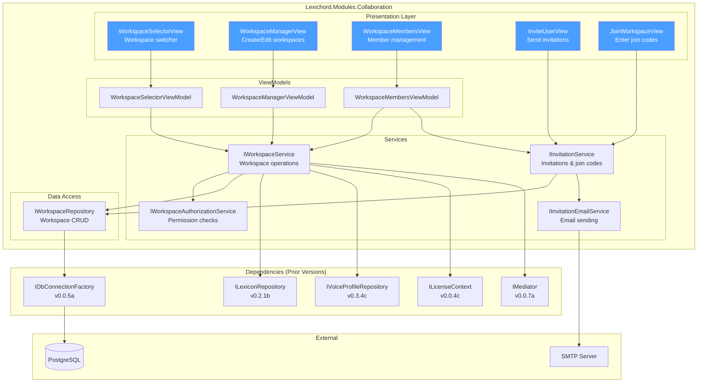
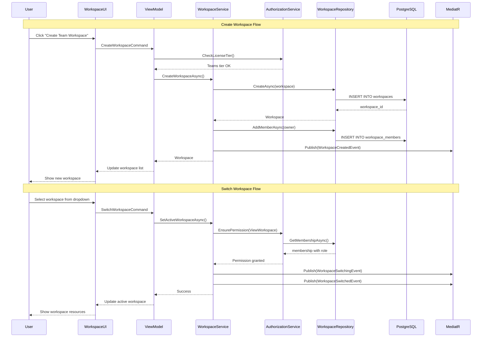

# LCS-SBD-091: Scope Breakdown — Team Workspace

## Document Control

| Field            | Value                                    |
| :--------------- | :--------------------------------------- |
| **Document ID**  | LCS-SBD-091                              |
| **Version**      | v0.9.1                                   |
| **Codename**     | Team Workspace (The Rehearsal Hall)      |
| **Status**       | Draft                                    |
| **Last Updated** | 2026-01-27                               |
| **Owner**        | Lead Architect                           |
| **Depends On**   | v0.8.x (Publisher), v0.6.x (AI Agents), v0.2.x (Lexicon), v0.3.x (Voice Profiler) |

---

## 1. Executive Summary

### 1.1 The Vision

**v0.9.1** delivers the **Team Workspace** — shared collaborative environments where writing teams can work together on projects with shared Lexicons, Voice Profiles, and style guides. This release transforms Lexichord from a single-user writing assistant into a team collaboration platform, enabling organizations to maintain consistent voice and terminology across multiple writers.

The Rehearsal Hall metaphor captures the essence of this feature: a shared space where writers can practice, refine, and harmonize their voices before the final performance. Team members can contribute to shared terminology databases, collaborate on voice profiles, and maintain organizational style consistency while preserving individual creative autonomy.

### 1.2 Business Value

- **Team Collaboration:** Multiple writers can work within shared workspaces with synchronized resources.
- **Brand Consistency:** Organizations can enforce terminology and voice standards across their entire content team.
- **Role-Based Access:** Granular permissions (Owner, Editor, Viewer) protect sensitive content while enabling collaboration.
- **Flexible Onboarding:** Email invites and join codes enable rapid team expansion without IT overhead.
- **Enterprise Foundation:** Team workspaces lay the groundwork for enterprise SSO, audit logging, and compliance features.
- **Competitive Advantage:** Differentiates Lexichord in the market as a team-ready writing platform.

### 1.3 Success Criteria

This release succeeds when:

1. Users can create team workspaces with unique names and descriptions.
2. Workspace owners can invite members via email or shareable join codes.
3. Members can be assigned Owner, Editor, or Viewer roles with appropriate permissions.
4. Shared Lexicons and Voice Profiles synchronize across all workspace members.
5. Users can seamlessly switch between personal and team workspaces via the UI.
6. All workspace operations respect license tier restrictions (Teams+ required).

### 1.4 License Gating

The Team Workspace is a **Teams** tier feature. Lower tiers will see:

- "Create Team Workspace" button disabled with "[Upgrade to Teams]" tooltip
- Read-only access to workspaces they've been invited to (if workspace owner has Teams license)
- Invitation features hidden for non-Teams users
- Personal workspace functionality remains fully available

---

## 2. Dependencies on Prior Versions

| Component                | Source Version | Usage in v0.9.1                          |
| :----------------------- | :------------- | :--------------------------------------- |
| `ILexiconRepository`     | v0.2.1b        | Associate Lexicons with workspaces       |
| `VoiceProfile`           | v0.3.4a        | Share Voice Profiles within workspaces   |
| `ISecureVault`           | v0.0.6a        | Store workspace API keys and secrets     |
| `ILicenseContext`        | v0.0.4c        | Verify Teams tier for feature access     |
| `IMediator`              | v0.0.7a        | Publish workspace events                 |
| `ISettingsService`       | v0.1.6a        | Store workspace-specific settings        |
| `IDbConnectionFactory`   | v0.0.5a        | Database operations for workspace data   |
| `IConfigurationService`  | v0.0.3d        | Workspace configuration storage          |
| `Serilog`                | v0.0.3b        | Logging workspace operations             |
| `MediatR`                | v0.0.7a        | Event-driven workspace notifications     |

---

## 3. Sub-Part Specifications

### 3.1 v0.9.1a: Workspace Schema

| Field            | Value                                     |
| :--------------- | :---------------------------------------- |
| **Sub-Part ID**  | COL-091a                                  |
| **Title**        | Workspace Schema                          |
| **Module**       | `Lexichord.Modules.Collaboration`         |
| **License Tier** | Teams                                     |

**Goal:** Define the data structures for team workspaces, including workspace entities, membership records, and permission models.

**Key Deliverables:**

- `Workspace` entity with unique ID, name, description, and metadata
- `WorkspaceMember` entity linking users to workspaces with roles
- `WorkspacePermission` flags defining granular access controls
- `WorkspaceSettings` record for workspace-specific configuration
- PostgreSQL migration `Migration_091_TeamWorkspaces.cs`
- `IWorkspaceRepository` interface for data access
- `WorkspaceRepository` implementation using Dapper
- Unit tests for all repository operations

**Key Interfaces:**

```csharp
namespace Lexichord.Modules.Collaboration.Models;

/// <summary>
/// Represents a team workspace for collaborative writing.
/// </summary>
public record Workspace
{
    public Guid WorkspaceId { get; init; }
    public required string Name { get; init; }
    public string? Description { get; init; }
    public string? AvatarPath { get; init; }
    public Guid OwnerId { get; init; }
    public DateTime CreatedAt { get; init; }
    public DateTime UpdatedAt { get; init; }
    public bool IsArchived { get; init; }
    public WorkspaceSettings? Settings { get; init; }
}

/// <summary>
/// Links a user to a workspace with a specific role.
/// </summary>
public record WorkspaceMember
{
    public Guid MembershipId { get; init; }
    public Guid WorkspaceId { get; init; }
    public Guid UserId { get; init; }
    public WorkspaceRole Role { get; init; }
    public DateTime JoinedAt { get; init; }
    public Guid? InvitedBy { get; init; }
    public string? DisplayName { get; init; }
    public string? Email { get; init; }
}

/// <summary>
/// User roles within a workspace.
/// </summary>
public enum WorkspaceRole
{
    /// <summary>View-only access to workspace resources.</summary>
    Viewer = 0,

    /// <summary>Can edit Lexicons, Voice Profiles, and documents.</summary>
    Editor = 1,

    /// <summary>Full control including member management and settings.</summary>
    Owner = 2
}

/// <summary>
/// Workspace-specific settings and configuration.
/// </summary>
public record WorkspaceSettings
{
    public Guid WorkspaceId { get; init; }
    public string? DefaultStyleGuide { get; init; }
    public string? DefaultLLMProvider { get; init; }
    public string? DefaultModel { get; init; }
    public bool AllowMemberInvites { get; init; } = false;
    public bool RequireApprovalForJoinCodes { get; init; } = false;
    public IReadOnlyDictionary<string, string>? CustomSettings { get; init; }
}

namespace Lexichord.Abstractions.Contracts;

/// <summary>
/// Repository for workspace data access.
/// </summary>
public interface IWorkspaceRepository
{
    Task<Workspace?> GetByIdAsync(Guid workspaceId, CancellationToken ct = default);
    Task<IReadOnlyList<Workspace>> GetByUserIdAsync(Guid userId, CancellationToken ct = default);
    Task<Workspace> CreateAsync(Workspace workspace, CancellationToken ct = default);
    Task<Workspace> UpdateAsync(Workspace workspace, CancellationToken ct = default);
    Task DeleteAsync(Guid workspaceId, CancellationToken ct = default);
    Task<IReadOnlyList<WorkspaceMember>> GetMembersAsync(Guid workspaceId, CancellationToken ct = default);
    Task<WorkspaceMember?> GetMembershipAsync(Guid workspaceId, Guid userId, CancellationToken ct = default);
    Task<WorkspaceMember> AddMemberAsync(WorkspaceMember member, CancellationToken ct = default);
    Task<WorkspaceMember> UpdateMemberAsync(WorkspaceMember member, CancellationToken ct = default);
    Task RemoveMemberAsync(Guid workspaceId, Guid userId, CancellationToken ct = default);
}
```

**Database Schema:**

```sql
-- Migration_091_TeamWorkspaces.cs
CREATE TABLE workspaces (
    workspace_id UUID PRIMARY KEY DEFAULT gen_random_uuid(),
    name VARCHAR(255) NOT NULL,
    description TEXT,
    avatar_path VARCHAR(512),
    owner_id UUID NOT NULL,
    created_at TIMESTAMP WITH TIME ZONE DEFAULT NOW(),
    updated_at TIMESTAMP WITH TIME ZONE DEFAULT NOW(),
    is_archived BOOLEAN DEFAULT FALSE
);

CREATE TABLE workspace_members (
    membership_id UUID PRIMARY KEY DEFAULT gen_random_uuid(),
    workspace_id UUID NOT NULL REFERENCES workspaces(workspace_id) ON DELETE CASCADE,
    user_id UUID NOT NULL,
    role INTEGER NOT NULL DEFAULT 0,
    joined_at TIMESTAMP WITH TIME ZONE DEFAULT NOW(),
    invited_by UUID,
    display_name VARCHAR(255),
    email VARCHAR(255),
    UNIQUE(workspace_id, user_id)
);

CREATE TABLE workspace_settings (
    workspace_id UUID PRIMARY KEY REFERENCES workspaces(workspace_id) ON DELETE CASCADE,
    default_style_guide VARCHAR(255),
    default_llm_provider VARCHAR(100),
    default_model VARCHAR(100),
    allow_member_invites BOOLEAN DEFAULT FALSE,
    require_approval_for_join_codes BOOLEAN DEFAULT FALSE,
    custom_settings JSONB
);

CREATE INDEX idx_workspace_members_workspace ON workspace_members(workspace_id);
CREATE INDEX idx_workspace_members_user ON workspace_members(user_id);
CREATE INDEX idx_workspaces_owner ON workspaces(owner_id);
```

**Dependencies:**

- v0.0.5a: `IDbConnectionFactory` (database access)
- v0.0.3d: `IConfigurationService` (connection strings)

---

### 3.2 v0.9.1b: User Roles

| Field            | Value                                     |
| :--------------- | :---------------------------------------- |
| **Sub-Part ID**  | COL-091b                                  |
| **Title**        | User Roles                                |
| **Module**       | `Lexichord.Modules.Collaboration`         |
| **License Tier** | Teams                                     |

**Goal:** Implement the role-based access control system for workspaces, defining what actions each role (Owner, Editor, Viewer) can perform.

**Key Deliverables:**

- `IWorkspaceAuthorizationService` for permission checks
- `WorkspacePermission` flags enum for granular permissions
- `WorkspaceAuthorizationService` implementation
- Permission check decorators/attributes for service methods
- `WorkspaceAccessDeniedException` for unauthorized operations
- Role change notifications via MediatR
- Unit tests for all permission scenarios

**Key Interfaces:**

```csharp
namespace Lexichord.Modules.Collaboration.Services;

/// <summary>
/// Flags representing specific workspace permissions.
/// </summary>
[Flags]
public enum WorkspacePermission
{
    None = 0,

    // Resource viewing
    ViewWorkspace = 1 << 0,
    ViewLexicons = 1 << 1,
    ViewVoiceProfiles = 1 << 2,
    ViewDocuments = 1 << 3,
    ViewMembers = 1 << 4,

    // Resource editing
    EditLexicons = 1 << 5,
    EditVoiceProfiles = 1 << 6,
    EditDocuments = 1 << 7,

    // Resource creation/deletion
    CreateLexicons = 1 << 8,
    CreateVoiceProfiles = 1 << 9,
    DeleteLexicons = 1 << 10,
    DeleteVoiceProfiles = 1 << 11,

    // Member management
    InviteMembers = 1 << 12,
    RemoveMembers = 1 << 13,
    ChangeRoles = 1 << 14,

    // Workspace management
    EditWorkspaceSettings = 1 << 15,
    DeleteWorkspace = 1 << 16,
    TransferOwnership = 1 << 17,

    // Composite permissions for roles
    ViewerPermissions = ViewWorkspace | ViewLexicons | ViewVoiceProfiles | ViewDocuments | ViewMembers,

    EditorPermissions = ViewerPermissions | EditLexicons | EditVoiceProfiles | EditDocuments |
                        CreateLexicons | CreateVoiceProfiles,

    OwnerPermissions = EditorPermissions | DeleteLexicons | DeleteVoiceProfiles |
                       InviteMembers | RemoveMembers | ChangeRoles |
                       EditWorkspaceSettings | DeleteWorkspace | TransferOwnership
}

/// <summary>
/// Service for checking workspace permissions.
/// </summary>
public interface IWorkspaceAuthorizationService
{
    /// <summary>
    /// Gets the permissions for a user in a workspace.
    /// </summary>
    Task<WorkspacePermission> GetPermissionsAsync(Guid workspaceId, Guid userId, CancellationToken ct = default);

    /// <summary>
    /// Checks if a user has a specific permission in a workspace.
    /// </summary>
    Task<bool> HasPermissionAsync(Guid workspaceId, Guid userId, WorkspacePermission permission, CancellationToken ct = default);

    /// <summary>
    /// Ensures a user has a specific permission, throwing if not.
    /// </summary>
    Task EnsurePermissionAsync(Guid workspaceId, Guid userId, WorkspacePermission permission, CancellationToken ct = default);

    /// <summary>
    /// Gets the role for a user in a workspace.
    /// </summary>
    Task<WorkspaceRole?> GetRoleAsync(Guid workspaceId, Guid userId, CancellationToken ct = default);

    /// <summary>
    /// Changes a member's role in a workspace.
    /// </summary>
    Task ChangeRoleAsync(Guid workspaceId, Guid userId, WorkspaceRole newRole, Guid changedBy, CancellationToken ct = default);
}

/// <summary>
/// Exception thrown when a user lacks required workspace permissions.
/// </summary>
public class WorkspaceAccessDeniedException : Exception
{
    public Guid WorkspaceId { get; }
    public Guid UserId { get; }
    public WorkspacePermission RequiredPermission { get; }

    public WorkspaceAccessDeniedException(Guid workspaceId, Guid userId, WorkspacePermission requiredPermission)
        : base($"User {userId} lacks permission {requiredPermission} in workspace {workspaceId}")
    {
        WorkspaceId = workspaceId;
        UserId = userId;
        RequiredPermission = requiredPermission;
    }
}
```

**Permission Matrix:**

```text
PERMISSION MATRIX:
┌──────────────────────────┬────────┬────────┬────────┐
│ Permission               │ Viewer │ Editor │ Owner  │
├──────────────────────────┼────────┼────────┼────────┤
│ View Workspace           │   ✓    │   ✓    │   ✓    │
│ View Lexicons            │   ✓    │   ✓    │   ✓    │
│ View Voice Profiles      │   ✓    │   ✓    │   ✓    │
│ View Documents           │   ✓    │   ✓    │   ✓    │
│ View Members             │   ✓    │   ✓    │   ✓    │
├──────────────────────────┼────────┼────────┼────────┤
│ Edit Lexicons            │   ✗    │   ✓    │   ✓    │
│ Edit Voice Profiles      │   ✗    │   ✓    │   ✓    │
│ Edit Documents           │   ✗    │   ✓    │   ✓    │
├──────────────────────────┼────────┼────────┼────────┤
│ Create Lexicons          │   ✗    │   ✓    │   ✓    │
│ Create Voice Profiles    │   ✗    │   ✓    │   ✓    │
│ Delete Lexicons          │   ✗    │   ✗    │   ✓    │
│ Delete Voice Profiles    │   ✗    │   ✗    │   ✓    │
├──────────────────────────┼────────┼────────┼────────┤
│ Invite Members           │   ✗    │   ✗    │   ✓    │
│ Remove Members           │   ✗    │   ✗    │   ✓    │
│ Change Roles             │   ✗    │   ✗    │   ✓    │
├──────────────────────────┼────────┼────────┼────────┤
│ Edit Workspace Settings  │   ✗    │   ✗    │   ✓    │
│ Delete Workspace         │   ✗    │   ✗    │   ✓    │
│ Transfer Ownership       │   ✗    │   ✗    │   ✓    │
└──────────────────────────┴────────┴────────┴────────┘

* Editors may be granted InviteMembers if workspace.AllowMemberInvites = true
```

**Dependencies:**

- v0.9.1a: `IWorkspaceRepository` (membership data)
- v0.0.7a: `IMediator` (role change events)

---

### 3.3 v0.9.1c: Workspace UI

| Field            | Value                                     |
| :--------------- | :---------------------------------------- |
| **Sub-Part ID**  | COL-091c                                  |
| **Title**        | Workspace UI                              |
| **Module**       | `Lexichord.Modules.Collaboration`         |
| **License Tier** | Teams                                     |

**Goal:** Create the user interface for switching between personal and team workspaces, managing workspace settings, and viewing team members.

**Key Deliverables:**

- `WorkspaceSelectorView.axaml` dropdown in title bar
- `WorkspaceSelectorViewModel` with workspace switching logic
- `WorkspaceManagerView.axaml` dialog for creating/editing workspaces
- `WorkspaceManagerViewModel` with CRUD operations
- `WorkspaceMembersView.axaml` panel for member management
- `WorkspaceMembersViewModel` with member listing and role changes
- `WorkspaceSettingsView.axaml` for workspace configuration
- Workspace-aware navigation that updates when switching
- License gate UI elements (disabled buttons, upgrade prompts)
- Unit tests for all ViewModels

**Key UI Components:**

```text
WORKSPACE SELECTOR (Title Bar):
┌──────────────────────────────────────────────────────────────────────────┐
│  [Avatar] Workspace Name ▼  │  Lexichord - Document.md        [?] [_] [x]│
└──────────────────────────────────────────────────────────────────────────┘
         │
         ▼ (Dropdown on click)
┌─────────────────────────────────┐
│  ◉ Personal Workspace           │
│  ○ Acme Writing Team            │
│  ○ Marketing Department         │
│ ─────────────────────────────── │
│  [+ Create Team Workspace]      │  ← Disabled if not Teams tier
│  [⚙ Manage Workspaces...]       │
└─────────────────────────────────┘

WORKSPACE MANAGER DIALOG:
┌──────────────────────────────────────────────────────────────────────────┐
│  Manage Workspaces                                              [x]      │
├──────────────────────────────────────────────────────────────────────────┤
│  [+ New Workspace]                                                       │
│ ──────────────────────────────────────────────────────────────────────── │
│  ┌─────────────────────────────────────────────────────────────────────┐ │
│  │ [A] Acme Writing Team                          Owner    [⚙] [🗑]   │ │
│  │     5 members · Last active: 2 hours ago                           │ │
│  ├─────────────────────────────────────────────────────────────────────┤ │
│  │ [M] Marketing Department                       Editor   [⚙]        │ │
│  │     12 members · Last active: Yesterday                            │ │
│  └─────────────────────────────────────────────────────────────────────┘ │
│                                                                          │
│                                              [Cancel]  [Done]            │
└──────────────────────────────────────────────────────────────────────────┘

WORKSPACE MEMBERS PANEL:
┌──────────────────────────────────────────────────────────────────────────┐
│  Team Members (5)                           [Invite Member] [Share Code] │
├──────────────────────────────────────────────────────────────────────────┤
│  Name                     │ Role          │ Joined        │ Actions      │
│ ─────────────────────────────────────────────────────────────────────────│
│  [👤] Alice Smith         │ Owner         │ Jan 15, 2026  │              │
│  [👤] Bob Johnson         │ Editor  ▼     │ Jan 20, 2026  │ [Remove]     │
│  [👤] Carol Williams      │ Viewer  ▼     │ Jan 22, 2026  │ [Remove]     │
│  [👤] pending@email.com   │ Pending...    │ Invited       │ [Resend][x]  │
└──────────────────────────────────────────────────────────────────────────┘
```

**Key Interfaces:**

```csharp
namespace Lexichord.Modules.Collaboration.ViewModels;

public partial class WorkspaceSelectorViewModel : ObservableObject
{
    [ObservableProperty] private Workspace? _activeWorkspace;
    [ObservableProperty] private ObservableCollection<Workspace> _workspaces = [];
    [ObservableProperty] private bool _isTeamsLicensed;

    [RelayCommand]
    private async Task SwitchWorkspaceAsync(Guid workspaceId);

    [RelayCommand]
    private async Task LoadWorkspacesAsync();

    [RelayCommand]
    private void OpenWorkspaceManager();

    [RelayCommand]
    private async Task CreateWorkspaceAsync();
}

public partial class WorkspaceManagerViewModel : ObservableObject
{
    [ObservableProperty] private Workspace? _selectedWorkspace;
    [ObservableProperty] private ObservableCollection<Workspace> _workspaces = [];
    [ObservableProperty] private bool _isCreating;

    // Create workspace form
    [ObservableProperty] private string _newWorkspaceName = "";
    [ObservableProperty] private string _newWorkspaceDescription = "";

    [RelayCommand]
    private async Task CreateWorkspaceAsync();

    [RelayCommand]
    private async Task DeleteWorkspaceAsync(Guid workspaceId);

    [RelayCommand]
    private void EditWorkspace(Workspace workspace);

    [RelayCommand]
    private async Task SaveWorkspaceAsync();
}

public partial class WorkspaceMembersViewModel : ObservableObject
{
    [ObservableProperty] private Workspace? _workspace;
    [ObservableProperty] private ObservableCollection<WorkspaceMemberDisplay> _members = [];
    [ObservableProperty] private bool _canManageMembers;

    [RelayCommand]
    private async Task LoadMembersAsync();

    [RelayCommand]
    private async Task ChangeRoleAsync(WorkspaceMemberDisplay member, WorkspaceRole newRole);

    [RelayCommand]
    private async Task RemoveMemberAsync(WorkspaceMemberDisplay member);

    [RelayCommand]
    private void OpenInviteDialog();

    [RelayCommand]
    private async Task GenerateJoinCodeAsync();
}

public record WorkspaceMemberDisplay(
    Guid MembershipId,
    Guid UserId,
    string DisplayName,
    string? Email,
    WorkspaceRole Role,
    DateTime JoinedAt,
    bool IsPending,
    bool CanEdit
);
```

**Dependencies:**

- v0.9.1a: `Workspace`, `WorkspaceMember` (data models)
- v0.9.1b: `IWorkspaceAuthorizationService` (permission checks)
- v0.0.4c: `ILicenseContext` (Teams tier verification)
- v0.1.1b: `IRegionManager` (navigation updates)

---

### 3.4 v0.9.1d: Invitation System

| Field            | Value                                     |
| :--------------- | :---------------------------------------- |
| **Sub-Part ID**  | COL-091d                                  |
| **Title**        | Invitation System                         |
| **Module**       | `Lexichord.Modules.Collaboration`         |
| **License Tier** | Teams                                     |

**Goal:** Implement email invitations and shareable join codes for adding members to workspaces.

**Key Deliverables:**

- `WorkspaceInvitation` entity for tracking pending invites
- `WorkspaceJoinCode` entity for shareable codes
- `IInvitationService` interface for invitation operations
- `InvitationService` implementation
- Email template for workspace invitations
- Join code generation with configurable expiration
- `InviteUserView.axaml` dialog for sending invitations
- `JoinWorkspaceView.axaml` dialog for entering join codes
- Deep link handling for invitation URLs
- Invitation acceptance/rejection flow
- Unit tests for invitation workflows

**Key Interfaces:**

```csharp
namespace Lexichord.Modules.Collaboration.Models;

/// <summary>
/// Represents a pending invitation to join a workspace.
/// </summary>
public record WorkspaceInvitation
{
    public Guid InvitationId { get; init; }
    public Guid WorkspaceId { get; init; }
    public required string Email { get; init; }
    public WorkspaceRole Role { get; init; }
    public Guid InvitedBy { get; init; }
    public DateTime CreatedAt { get; init; }
    public DateTime ExpiresAt { get; init; }
    public InvitationStatus Status { get; init; }
    public string? Token { get; init; }
}

public enum InvitationStatus
{
    Pending = 0,
    Accepted = 1,
    Declined = 2,
    Expired = 3,
    Revoked = 4
}

/// <summary>
/// Represents a shareable join code for a workspace.
/// </summary>
public record WorkspaceJoinCode
{
    public Guid JoinCodeId { get; init; }
    public Guid WorkspaceId { get; init; }
    public required string Code { get; init; }
    public WorkspaceRole DefaultRole { get; init; }
    public Guid CreatedBy { get; init; }
    public DateTime CreatedAt { get; init; }
    public DateTime? ExpiresAt { get; init; }
    public int? MaxUses { get; init; }
    public int UseCount { get; init; }
    public bool IsActive { get; init; }
}

namespace Lexichord.Modules.Collaboration.Services;

/// <summary>
/// Service for managing workspace invitations and join codes.
/// </summary>
public interface IInvitationService
{
    // Email invitations
    Task<WorkspaceInvitation> InviteByEmailAsync(
        Guid workspaceId,
        string email,
        WorkspaceRole role,
        Guid invitedBy,
        CancellationToken ct = default);

    Task<IReadOnlyList<WorkspaceInvitation>> GetPendingInvitationsAsync(
        Guid workspaceId,
        CancellationToken ct = default);

    Task<WorkspaceInvitation?> GetInvitationByTokenAsync(
        string token,
        CancellationToken ct = default);

    Task<WorkspaceMember> AcceptInvitationAsync(
        string token,
        Guid userId,
        CancellationToken ct = default);

    Task DeclineInvitationAsync(
        string token,
        CancellationToken ct = default);

    Task RevokeInvitationAsync(
        Guid invitationId,
        CancellationToken ct = default);

    Task ResendInvitationAsync(
        Guid invitationId,
        CancellationToken ct = default);

    // Join codes
    Task<WorkspaceJoinCode> CreateJoinCodeAsync(
        Guid workspaceId,
        WorkspaceRole defaultRole,
        Guid createdBy,
        TimeSpan? expiresIn = null,
        int? maxUses = null,
        CancellationToken ct = default);

    Task<IReadOnlyList<WorkspaceJoinCode>> GetActiveJoinCodesAsync(
        Guid workspaceId,
        CancellationToken ct = default);

    Task<WorkspaceJoinCode?> GetJoinCodeAsync(
        string code,
        CancellationToken ct = default);

    Task<WorkspaceMember> JoinWithCodeAsync(
        string code,
        Guid userId,
        CancellationToken ct = default);

    Task DeactivateJoinCodeAsync(
        Guid joinCodeId,
        CancellationToken ct = default);
}

/// <summary>
/// Service for sending invitation emails.
/// </summary>
public interface IInvitationEmailService
{
    Task SendInvitationEmailAsync(
        WorkspaceInvitation invitation,
        Workspace workspace,
        string inviterName,
        CancellationToken ct = default);
}
```

**Database Schema Extension:**

```sql
-- Migration_091_TeamWorkspaces.cs (continued)
CREATE TABLE workspace_invitations (
    invitation_id UUID PRIMARY KEY DEFAULT gen_random_uuid(),
    workspace_id UUID NOT NULL REFERENCES workspaces(workspace_id) ON DELETE CASCADE,
    email VARCHAR(255) NOT NULL,
    role INTEGER NOT NULL DEFAULT 0,
    invited_by UUID NOT NULL,
    created_at TIMESTAMP WITH TIME ZONE DEFAULT NOW(),
    expires_at TIMESTAMP WITH TIME ZONE NOT NULL,
    status INTEGER NOT NULL DEFAULT 0,
    token VARCHAR(128) UNIQUE NOT NULL
);

CREATE TABLE workspace_join_codes (
    join_code_id UUID PRIMARY KEY DEFAULT gen_random_uuid(),
    workspace_id UUID NOT NULL REFERENCES workspaces(workspace_id) ON DELETE CASCADE,
    code VARCHAR(20) UNIQUE NOT NULL,
    default_role INTEGER NOT NULL DEFAULT 0,
    created_by UUID NOT NULL,
    created_at TIMESTAMP WITH TIME ZONE DEFAULT NOW(),
    expires_at TIMESTAMP WITH TIME ZONE,
    max_uses INTEGER,
    use_count INTEGER DEFAULT 0,
    is_active BOOLEAN DEFAULT TRUE
);

CREATE INDEX idx_invitations_workspace ON workspace_invitations(workspace_id);
CREATE INDEX idx_invitations_email ON workspace_invitations(email);
CREATE INDEX idx_invitations_token ON workspace_invitations(token);
CREATE INDEX idx_join_codes_workspace ON workspace_join_codes(workspace_id);
CREATE INDEX idx_join_codes_code ON workspace_join_codes(code);
```

**Invitation Flow:**

```text
EMAIL INVITATION FLOW:
┌─────────┐    ┌─────────────┐    ┌─────────────┐    ┌──────────┐
│  Owner  │───▶│ Invite User │───▶│ Send Email  │───▶│ Invitee  │
└─────────┘    └─────────────┘    └─────────────┘    └──────────┘
                     │                                     │
                     ▼                                     ▼
              ┌─────────────┐                       ┌──────────────┐
              │  Create     │                       │ Click Link / │
              │  Invitation │                       │ Enter Token  │
              └─────────────┘                       └──────────────┘
                     │                                     │
                     ▼                                     ▼
              ┌─────────────┐                       ┌──────────────┐
              │  Store      │◀──────────────────────│ Validate     │
              │  Record     │                       │ Token        │
              └─────────────┘                       └──────────────┘
                                                           │
                                                           ▼
                                                    ┌──────────────┐
                                                    │ Create       │
                                                    │ Membership   │
                                                    └──────────────┘

JOIN CODE FLOW:
┌─────────┐    ┌─────────────┐    ┌─────────────┐
│  Owner  │───▶│ Generate    │───▶│ Share Code  │
└─────────┘    │ Join Code   │    │ (e.g. ABC123)│
               └─────────────┘    └─────────────┘
                                         │
                                         ▼ (Share via any channel)
                                  ┌─────────────┐
                                  │  New User   │
                                  └─────────────┘
                                         │
                                         ▼
                                  ┌─────────────┐
                                  │ Enter Code  │
                                  │ in App      │
                                  └─────────────┘
                                         │
                                         ▼
                                  ┌─────────────┐
                                  │ Validate &  │
                                  │ Join        │
                                  └─────────────┘
```

**Dependencies:**

- v0.9.1a: `IWorkspaceRepository` (membership creation)
- v0.9.1b: `IWorkspaceAuthorizationService` (permission to invite)
- v0.0.7a: `IMediator` (invitation events)

---

## 4. Implementation Checklist

| #  | Sub-Part | Task                                                      | Est. Hours |
| :- | :------- | :-------------------------------------------------------- | :--------- |
| 1  | v0.9.1a  | Create `Workspace` and `WorkspaceMember` records          | 1          |
| 2  | v0.9.1a  | Create `WorkspaceSettings` record                         | 0.5        |
| 3  | v0.9.1a  | Create `Migration_091_TeamWorkspaces.cs`                  | 2          |
| 4  | v0.9.1a  | Implement `IWorkspaceRepository` interface                | 1          |
| 5  | v0.9.1a  | Implement `WorkspaceRepository` with Dapper               | 3          |
| 6  | v0.9.1a  | Unit tests for `WorkspaceRepository`                      | 2          |
| 7  | v0.9.1b  | Define `WorkspacePermission` flags enum                   | 0.5        |
| 8  | v0.9.1b  | Implement `IWorkspaceAuthorizationService` interface      | 1          |
| 9  | v0.9.1b  | Implement `WorkspaceAuthorizationService`                 | 2          |
| 10 | v0.9.1b  | Create `WorkspaceAccessDeniedException`                   | 0.5        |
| 11 | v0.9.1b  | Add MediatR events for role changes                       | 1          |
| 12 | v0.9.1b  | Unit tests for authorization service                      | 2          |
| 13 | v0.9.1c  | Create `WorkspaceSelectorView.axaml`                      | 2          |
| 14 | v0.9.1c  | Implement `WorkspaceSelectorViewModel`                    | 2          |
| 15 | v0.9.1c  | Create `WorkspaceManagerView.axaml`                       | 3          |
| 16 | v0.9.1c  | Implement `WorkspaceManagerViewModel`                     | 2          |
| 17 | v0.9.1c  | Create `WorkspaceMembersView.axaml`                       | 2          |
| 18 | v0.9.1c  | Implement `WorkspaceMembersViewModel`                     | 2          |
| 19 | v0.9.1c  | Create `WorkspaceSettingsView.axaml`                      | 1.5        |
| 20 | v0.9.1c  | Implement license gating UI (disabled buttons, tooltips)  | 1          |
| 21 | v0.9.1c  | Unit tests for ViewModels                                 | 2          |
| 22 | v0.9.1d  | Create `WorkspaceInvitation` and `WorkspaceJoinCode` records | 1       |
| 23 | v0.9.1d  | Extend migration with invitation/join code tables         | 1          |
| 24 | v0.9.1d  | Implement `IInvitationService` interface                  | 1          |
| 25 | v0.9.1d  | Implement `InvitationService`                             | 3          |
| 26 | v0.9.1d  | Create email templates for invitations                    | 1          |
| 27 | v0.9.1d  | Implement `IInvitationEmailService`                       | 1.5        |
| 28 | v0.9.1d  | Create `InviteUserView.axaml` dialog                      | 1.5        |
| 29 | v0.9.1d  | Create `JoinWorkspaceView.axaml` dialog                   | 1.5        |
| 30 | v0.9.1d  | Implement deep link handling for invitation URLs          | 2          |
| 31 | v0.9.1d  | Unit tests for invitation service                         | 2          |
| 32 | All      | Integration tests for full workspace flows                | 3          |
| 33 | All      | DI registration in `CollaborationModule.cs`               | 1          |
| **Total** |   |                                                           | **50 hours** |

---

## 5. Dependency Matrix

### 5.1 Required Interfaces (from earlier versions)

| Interface                | Source Version | Purpose                              |
| :----------------------- | :------------- | :----------------------------------- |
| `ILexiconRepository`     | v0.2.1b        | Link Lexicons to workspaces          |
| `IVoiceProfileRepository`| v0.3.4c        | Link Voice Profiles to workspaces    |
| `ISecureVault`           | v0.0.6a        | Secure storage for workspace secrets |
| `ILicenseContext`        | v0.0.4c        | Teams tier verification              |
| `IMediator`              | v0.0.7a        | Event publishing                     |
| `IDbConnectionFactory`   | v0.0.5a        | Database connections                 |
| `IRegionManager`         | v0.1.1b        | UI navigation updates                |

### 5.2 New Interfaces (defined in v0.9.1)

| Interface                       | Defined In | Module           | Purpose                    |
| :------------------------------ | :--------- | :--------------- | :------------------------- |
| `IWorkspaceRepository`          | v0.9.1a    | Collaboration    | Workspace data access      |
| `IWorkspaceAuthorizationService`| v0.9.1b    | Collaboration    | Permission checking        |
| `IWorkspaceService`             | v0.9.1c    | Collaboration    | Workspace operations       |
| `IInvitationService`            | v0.9.1d    | Collaboration    | Invitation management      |
| `IInvitationEmailService`       | v0.9.1d    | Collaboration    | Email sending              |

### 5.3 New Records/DTOs (defined in v0.9.1)

| Record                   | Defined In | Purpose                                |
| :----------------------- | :--------- | :------------------------------------- |
| `Workspace`              | v0.9.1a    | Team workspace entity                  |
| `WorkspaceMember`        | v0.9.1a    | Workspace membership                   |
| `WorkspaceSettings`      | v0.9.1a    | Workspace configuration                |
| `WorkspaceInvitation`    | v0.9.1d    | Pending invitation                     |
| `WorkspaceJoinCode`      | v0.9.1d    | Shareable join code                    |

### 5.4 NuGet Packages

| Package           | Version | Purpose                    | New/Existing |
| :---------------- | :------ | :------------------------- | :----------- |
| `Dapper`          | 2.x     | Database access            | Existing     |
| `Npgsql`          | 8.x     | PostgreSQL driver          | Existing     |
| `MediatR`         | 12.x    | Event publishing           | Existing     |
| `FluentEmail`     | 3.x     | Email sending              | **New**      |

---

## 6. Architecture Diagram



---

## 7. Data Flow Diagram



---

## 8. Risks & Mitigations

| Risk | Impact | Probability | Mitigation |
| :--- | :----- | :---------- | :--------- |
| Data isolation failure (users see other workspaces' data) | High | Low | Rigorous permission checks on all queries; row-level security in PostgreSQL |
| Email delivery failures | Medium | Medium | Implement retry logic; provide manual join code fallback |
| Join code enumeration attacks | Medium | Low | Use cryptographically random codes; rate limit join attempts |
| Workspace orphan (owner leaves) | Medium | Low | Require ownership transfer before leaving; auto-promote oldest editor |
| Performance with many members | Medium | Low | Paginate member lists; cache frequently accessed membership data |
| License downgrade loses access | Medium | Medium | Grace period for license changes; clear messaging about feature loss |

---

## 9. Success Metrics

| Metric | Target | Measurement |
| :----- | :----- | :---------- |
| Workspace creation time | < 500ms | Stopwatch timing |
| Workspace switch time | < 200ms | UI response measurement |
| Invitation delivery rate | > 95% | Email service metrics |
| Join code acceptance time | < 300ms | End-to-end timing |
| Member list load (100 members) | < 500ms | Query timing |
| Permission check latency | < 10ms | Service instrumentation |

---

## 10. What This Enables

After v0.9.1, Lexichord will support:

- **v0.9.2:** Shared Lexicons and Voice Profiles within workspaces
- **v0.9.3:** Real-time collaboration notifications
- **v0.9.4:** Workspace activity feeds and audit logs
- **v0.10.x (Enterprise):** SSO integration, advanced admin controls, compliance features
- **Future:** Cross-workspace resource sharing, workspace templates

---

## 11. Decision Trees

### 11.1 Can User Access Workspace?

```text
START: "Can user access workspace?"
│
├── Is user a member of the workspace?
│   ├── NO → DENY ACCESS
│   └── YES → Continue
│
├── Is user's membership active (not revoked)?
│   ├── NO → DENY ACCESS
│   └── YES → Continue
│
├── Does user have ViewWorkspace permission?
│   ├── NO → DENY ACCESS (shouldn't happen)
│   └── YES → GRANT ACCESS
```

### 11.2 Can User Perform Action?

```text
START: "Can user perform action X in workspace?"
│
├── Is user a workspace member?
│   ├── NO → DENY
│   └── YES → Continue
│
├── Get user's role (Owner/Editor/Viewer)
│
├── Does role include permission for X?
│   ├── YES → ALLOW
│   └── NO → Continue
│
├── Is X = InviteMembers AND workspace.AllowMemberInvites = true?
│   ├── YES AND role >= Editor → ALLOW
│   └── NO → DENY
│
└── DEFAULT: DENY
```

---

## 12. User Stories

| ID    | Role            | Story                                                                                | Acceptance Criteria                    |
| :---- | :-------------- | :----------------------------------------------------------------------------------- | :------------------------------------- |
| US-01 | Team Lead       | As a team lead, I want to create a team workspace so my writers can collaborate.     | Workspace created with me as owner.    |
| US-02 | Team Lead       | As a team lead, I want to invite writers by email so they can join my workspace.     | Email sent with join link.             |
| US-03 | Team Lead       | As a team lead, I want to generate a join code to share in our Slack channel.        | 6-character code generated.            |
| US-04 | Writer          | As a writer, I want to switch between my personal and team workspaces easily.        | Dropdown shows all my workspaces.      |
| US-05 | Writer          | As a writer, I want to see shared Lexicons when I'm in a team workspace.             | Workspace Lexicons visible in sidebar. |
| US-06 | Editor          | As an editor, I want to add terms to the team Lexicon so everyone uses them.         | Term added, visible to all members.    |
| US-07 | Viewer          | As a viewer, I want to see the team's style guide without editing it.                | View-only access to resources.         |
| US-08 | Team Lead       | As a team lead, I want to change a member's role if their responsibilities change.   | Role updated immediately.              |
| US-09 | Team Lead       | As a team lead, I want to remove a member who has left the company.                  | Member removed from workspace.         |
| US-10 | Core User       | As a Core user, I want to see what Teams features I'm missing.                       | Upgrade prompts on locked features.    |

---

## 13. Use Cases

### UC-01: Create Team Workspace

**Preconditions:**

- User has Teams license tier
- User is logged in

**Flow:**

1. User clicks workspace selector dropdown.
2. User clicks "Create Team Workspace".
3. System shows workspace creation dialog.
4. User enters workspace name and description.
5. User clicks "Create".
6. System creates workspace with user as Owner.
7. System switches to new workspace.
8. System shows workspace dashboard.

**Postconditions:**

- Workspace exists in database
- User is Owner member
- UI shows new workspace as active

### UC-02: Join Workspace via Code

**Preconditions:**

- User is logged in
- User has a valid join code

**Flow:**

1. User navigates to "Join Workspace" option.
2. User enters 6-character join code.
3. System validates code exists and is active.
4. System checks code hasn't exceeded max uses.
5. System creates membership with default role.
6. System switches to joined workspace.
7. System shows welcome message.

**Postconditions:**

- User is member of workspace
- Join code use count incremented
- User can see workspace resources

---

## 14. Unit Testing Requirements

### 14.1 WorkspaceRepository Tests

```csharp
[Trait("Category", "Unit")]
[Trait("Version", "v0.9.1a")]
public class WorkspaceRepositoryTests
{
    [Fact]
    public async Task CreateAsync_ValidWorkspace_ReturnsWithId()
    {
        // Arrange
        var sut = CreateRepository();
        var workspace = new Workspace
        {
            Name = "Test Workspace",
            OwnerId = Guid.NewGuid()
        };

        // Act
        var result = await sut.CreateAsync(workspace);

        // Assert
        result.WorkspaceId.Should().NotBeEmpty();
        result.Name.Should().Be("Test Workspace");
    }

    [Fact]
    public async Task GetByUserIdAsync_MemberOfMultiple_ReturnsAll()
    {
        // Arrange
        var userId = Guid.NewGuid();
        var sut = CreateRepository();
        await CreateWorkspaceWithMember(sut, userId);
        await CreateWorkspaceWithMember(sut, userId);

        // Act
        var result = await sut.GetByUserIdAsync(userId);

        // Assert
        result.Should().HaveCount(2);
    }
}
```

### 14.2 WorkspaceAuthorizationService Tests

```csharp
[Trait("Category", "Unit")]
[Trait("Version", "v0.9.1b")]
public class WorkspaceAuthorizationServiceTests
{
    [Theory]
    [InlineData(WorkspaceRole.Owner, WorkspacePermission.DeleteWorkspace, true)]
    [InlineData(WorkspaceRole.Editor, WorkspacePermission.DeleteWorkspace, false)]
    [InlineData(WorkspaceRole.Viewer, WorkspacePermission.DeleteWorkspace, false)]
    [InlineData(WorkspaceRole.Owner, WorkspacePermission.EditLexicons, true)]
    [InlineData(WorkspaceRole.Editor, WorkspacePermission.EditLexicons, true)]
    [InlineData(WorkspaceRole.Viewer, WorkspacePermission.EditLexicons, false)]
    public async Task HasPermissionAsync_RoleAndPermission_ReturnsExpected(
        WorkspaceRole role, WorkspacePermission permission, bool expected)
    {
        // Arrange
        var sut = CreateService();
        var workspaceId = await CreateWorkspaceWithMember(role);

        // Act
        var result = await sut.HasPermissionAsync(workspaceId, _userId, permission);

        // Assert
        result.Should().Be(expected);
    }
}
```

---

## 15. Observability & Logging

| Level   | Source              | Message Template                                                       |
| :------ | :------------------ | :--------------------------------------------------------------------- |
| Info    | WorkspaceService    | `"Workspace created: {WorkspaceId} by {UserId}"`                       |
| Info    | WorkspaceService    | `"User {UserId} switched to workspace {WorkspaceId}"`                  |
| Info    | InvitationService   | `"Invitation sent to {Email} for workspace {WorkspaceId}"`             |
| Info    | InvitationService   | `"User {UserId} joined workspace {WorkspaceId} via code"`              |
| Warning | AuthorizationService| `"Permission denied: {UserId} lacks {Permission} in {WorkspaceId}"`    |
| Error   | InvitationService   | `"Failed to send invitation email to {Email}: {Error}"`                |
| Debug   | WorkspaceRepository | `"Querying workspaces for user {UserId}"`                              |

---

## 16. UI/UX Specifications

### 16.1 Workspace Selector Layout

```text
┌──────────────────────────────────────────────────────────────────────────┐
│  [Avatar] Current Workspace Name ▼  │  Lexichord               [?][_][x]│
└──────────────────────────────────────────────────────────────────────────┘

Dropdown (expanded):
┌─────────────────────────────────────┐
│ PERSONAL                            │
│   ◉ My Workspace                    │
│ ──────────────────────────────────  │
│ TEAMS                               │
│   ○ Acme Writing Team      (Owner)  │
│   ○ Marketing Dept         (Editor) │
│   ○ Product Documentation  (Viewer) │
│ ──────────────────────────────────  │
│   [+ Create Team Workspace]         │  ← Requires Teams license
│   [⚙ Manage Workspaces...]          │
└─────────────────────────────────────┘
```

### 16.2 Component Styling Requirements

| Component           | Theme Resource             | Notes                            |
| :------------------ | :------------------------- | :------------------------------- |
| Workspace Avatar    | `Brush.Avatar.Background`  | 32x32px, rounded corners         |
| Dropdown            | `LexDropdownTheme`         | Standard dropdown styling        |
| Role Badge          | `Brush.Badge.*`            | Color-coded by role              |
| Disabled Button     | `LexButtonDisabled`        | 50% opacity, no hover            |
| Upgrade Tooltip     | `LexTooltipUpgrade`        | Yellow accent color              |

---

## 17. Acceptance Criteria (QA)

| #   | Category            | Criterion                                                                    |
| :-- | :------------------ | :--------------------------------------------------------------------------- |
| 1   | **Workspace**       | User can create a workspace with name and description.                       |
| 2   | **Workspace**       | Workspace appears in user's workspace list immediately.                      |
| 3   | **Switching**       | User can switch between personal and team workspaces.                        |
| 4   | **Switching**       | Resources (Lexicons, Profiles) update when switching workspaces.             |
| 5   | **Roles**           | Owner can perform all actions (invite, remove, edit settings).               |
| 6   | **Roles**           | Editor can edit resources but not manage members.                            |
| 7   | **Roles**           | Viewer can only view resources, all edit buttons disabled.                   |
| 8   | **Invitations**     | Email invitation arrives with valid join link.                               |
| 9   | **Invitations**     | Clicking join link adds user to workspace.                                   |
| 10  | **Join Codes**      | Generated code is 6 characters, alphanumeric.                                |
| 11  | **Join Codes**      | Code expires after configured time or uses.                                  |
| 12  | **License Gate**    | Core users see disabled "Create Team Workspace" with upgrade prompt.         |
| 13  | **License Gate**    | Core users can join workspaces as viewers if owner has Teams license.        |
| 14  | **Performance**     | Workspace switch completes in under 200ms.                                   |

---

## 18. Verification Commands

```bash
# ═══════════════════════════════════════════════════════════════════════════
# v0.9.1 Verification
# ═══════════════════════════════════════════════════════════════════════════

# 1. Verify database migration
dotnet ef migrations list --project src/Lexichord.Host | grep "091_TeamWorkspaces"

# 2. Apply migration
dotnet ef database update --project src/Lexichord.Host

# 3. Build solution
dotnet build

# 4. Run unit tests for v0.9.1 components
dotnet test --filter "Version=v0.9.1" --logger "console;verbosity=detailed"

# 5. Run integration tests
dotnet test --filter "Category=Integration&Version~v0.9.1"

# 6. Manual verification:
# a) Create a team workspace (requires Teams license)
# b) Generate a join code and share with test user
# c) Test user joins via code
# d) Verify role permissions for each action
# e) Switch between personal and team workspaces
# f) Verify Core user sees upgrade prompts
```

---

## 19. Deliverable Checklist

| #  | Deliverable                                                    | Status |
| :- | :------------------------------------------------------------- | :----- |
| 1  | `Workspace.cs` record                                          | [ ]    |
| 2  | `WorkspaceMember.cs` record                                    | [ ]    |
| 3  | `WorkspaceSettings.cs` record                                  | [ ]    |
| 4  | `WorkspaceRole.cs` enum                                        | [ ]    |
| 5  | `WorkspacePermission.cs` flags enum                            | [ ]    |
| 6  | `Migration_091_TeamWorkspaces.cs`                              | [ ]    |
| 7  | `IWorkspaceRepository.cs` interface                            | [ ]    |
| 8  | `WorkspaceRepository.cs` implementation                        | [ ]    |
| 9  | `IWorkspaceAuthorizationService.cs` interface                  | [ ]    |
| 10 | `WorkspaceAuthorizationService.cs` implementation              | [ ]    |
| 11 | `WorkspaceAccessDeniedException.cs`                            | [ ]    |
| 12 | `WorkspaceSelectorView.axaml` and ViewModel                    | [ ]    |
| 13 | `WorkspaceManagerView.axaml` and ViewModel                     | [ ]    |
| 14 | `WorkspaceMembersView.axaml` and ViewModel                     | [ ]    |
| 15 | `WorkspaceInvitation.cs` record                                | [ ]    |
| 16 | `WorkspaceJoinCode.cs` record                                  | [ ]    |
| 17 | `IInvitationService.cs` interface                              | [ ]    |
| 18 | `InvitationService.cs` implementation                          | [ ]    |
| 19 | `InviteUserView.axaml` dialog                                  | [ ]    |
| 20 | `JoinWorkspaceView.axaml` dialog                               | [ ]    |
| 21 | Email templates for invitations                                | [ ]    |
| 22 | Unit tests for all services                                    | [ ]    |
| 23 | Integration tests for workspace flows                          | [ ]    |
| 24 | DI registration in `CollaborationModule.cs`                    | [ ]    |

---

## 20. Code Examples

### 20.1 Workspace Service Implementation

```csharp
namespace Lexichord.Modules.Collaboration.Services;

/// <summary>
/// Service for workspace management operations.
/// </summary>
public class WorkspaceService(
    IWorkspaceRepository repository,
    IWorkspaceAuthorizationService authorization,
    ILicenseContext licenseContext,
    IMediator mediator,
    ILogger<WorkspaceService> logger) : IWorkspaceService
{
    public async Task<Workspace> CreateWorkspaceAsync(
        CreateWorkspaceRequest request,
        Guid userId,
        CancellationToken ct = default)
    {
        // Verify Teams license
        if (!licenseContext.HasFeature("team_workspaces"))
        {
            throw new LicenseFeatureRequiredException("team_workspaces", LicenseTier.Teams);
        }

        var workspace = new Workspace
        {
            WorkspaceId = Guid.NewGuid(),
            Name = request.Name,
            Description = request.Description,
            OwnerId = userId,
            CreatedAt = DateTime.UtcNow,
            UpdatedAt = DateTime.UtcNow
        };

        workspace = await repository.CreateAsync(workspace, ct);
        logger.LogInformation("Workspace created: {WorkspaceId} by {UserId}",
            workspace.WorkspaceId, userId);

        // Add creator as Owner
        var membership = new WorkspaceMember
        {
            MembershipId = Guid.NewGuid(),
            WorkspaceId = workspace.WorkspaceId,
            UserId = userId,
            Role = WorkspaceRole.Owner,
            JoinedAt = DateTime.UtcNow
        };
        await repository.AddMemberAsync(membership, ct);

        await mediator.Publish(new WorkspaceCreatedEvent(workspace), ct);

        return workspace;
    }

    public async Task<IReadOnlyList<Workspace>> GetUserWorkspacesAsync(
        Guid userId,
        CancellationToken ct = default)
    {
        return await repository.GetByUserIdAsync(userId, ct);
    }

    public async Task SetActiveWorkspaceAsync(
        Guid workspaceId,
        Guid userId,
        CancellationToken ct = default)
    {
        await authorization.EnsurePermissionAsync(
            workspaceId, userId, WorkspacePermission.ViewWorkspace, ct);

        await mediator.Publish(new WorkspaceSwitchingEvent(workspaceId, userId), ct);

        // Update user's active workspace setting
        // ... settings update logic ...

        await mediator.Publish(new WorkspaceSwitchedEvent(workspaceId, userId), ct);

        logger.LogInformation("User {UserId} switched to workspace {WorkspaceId}",
            userId, workspaceId);
    }
}
```

### 20.2 MediatR Events

```csharp
namespace Lexichord.Modules.Collaboration.Events;

/// <summary>
/// Published when a new workspace is created.
/// </summary>
public record WorkspaceCreatedEvent(Workspace Workspace) : INotification;

/// <summary>
/// Published before switching workspaces (for state saving).
/// </summary>
public record WorkspaceSwitchingEvent(Guid WorkspaceId, Guid UserId) : INotification;

/// <summary>
/// Published after workspace switch completes.
/// </summary>
public record WorkspaceSwitchedEvent(Guid WorkspaceId, Guid UserId) : INotification;

/// <summary>
/// Published when a member joins a workspace.
/// </summary>
public record WorkspaceMemberJoinedEvent(
    Guid WorkspaceId,
    Guid UserId,
    WorkspaceRole Role,
    JoinMethod Method) : INotification;

public enum JoinMethod { Invitation, JoinCode, DirectAdd }

/// <summary>
/// Published when a member's role changes.
/// </summary>
public record WorkspaceMemberRoleChangedEvent(
    Guid WorkspaceId,
    Guid UserId,
    WorkspaceRole OldRole,
    WorkspaceRole NewRole,
    Guid ChangedBy) : INotification;

/// <summary>
/// Published when a member is removed from a workspace.
/// </summary>
public record WorkspaceMemberRemovedEvent(
    Guid WorkspaceId,
    Guid UserId,
    Guid RemovedBy) : INotification;
```

---

## 21. Deferred Features

| Feature                      | Deferred To | Reason                                         |
| :--------------------------- | :---------- | :--------------------------------------------- |
| Real-time collaboration      | v0.9.3      | Requires WebSocket infrastructure              |
| Workspace activity feed      | v0.9.4      | Depends on event history tracking              |
| Cross-workspace sharing      | v0.10.x     | Enterprise feature complexity                  |
| SSO integration              | v0.10.x     | Enterprise authentication requirements         |
| Workspace templates          | v0.10.x     | Requires template system design                |
| Audit logging                | v0.10.x     | Compliance feature for Enterprise tier         |

---

## 22. Changelog Entry

Upon completion of v0.9.1, the following entry will be added to `CHANGELOG.md`:

```markdown
## [0.9.1] - 2026-XX-XX

### Added

- **Team Workspaces**: Create shared workspaces for writing teams
- **Workspace Roles**: Owner, Editor, and Viewer roles with granular permissions
- **Email Invitations**: Invite team members via email with secure join links
- **Join Codes**: Generate shareable codes for easy team onboarding
- **Workspace Switcher**: Seamlessly switch between personal and team workspaces
- **Member Management**: View, add, remove, and change roles for workspace members

### Technical

- `Workspace`, `WorkspaceMember`, `WorkspaceSettings` entities
- `IWorkspaceRepository` for workspace data access
- `IWorkspaceAuthorizationService` for role-based permission checking
- `IInvitationService` for managing invitations and join codes
- `WorkspaceSelectorViewModel` for workspace switching UI
- PostgreSQL migration `Migration_091_TeamWorkspaces`

### Dependencies

- Added: FluentEmail 3.x for invitation emails

### License

- Team Workspace features require **Teams** tier license
```
