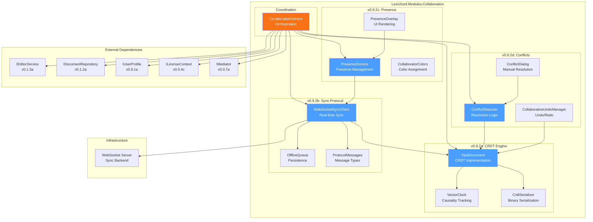
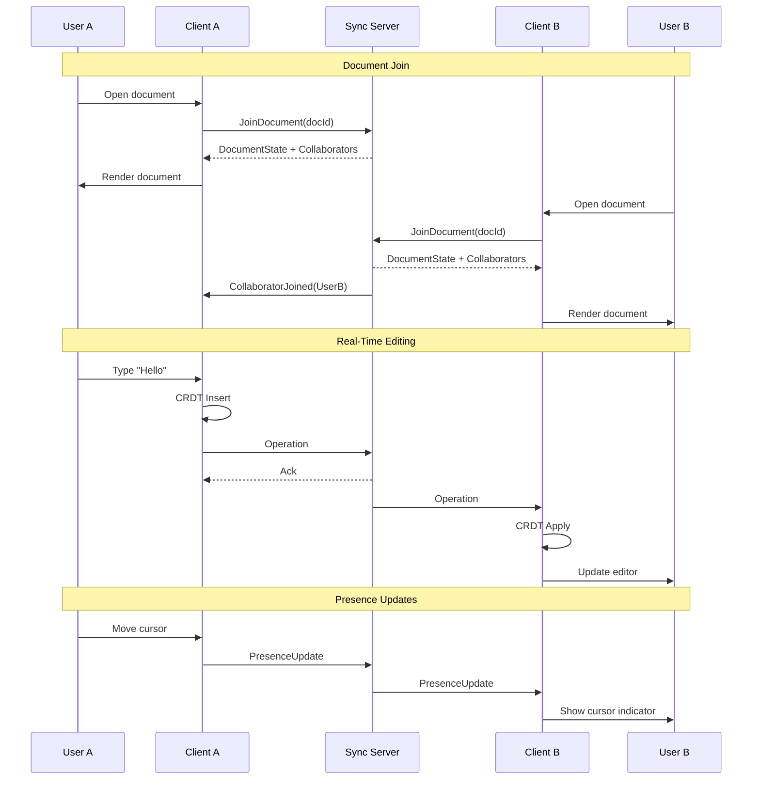

# LCS-DES-092: Design Specification Index — Real-Time Sync

## Document Control

| Field | Value |
| :--- | :--- |
| **Document ID** | LCS-DES-092-INDEX |
| **Feature ID** | COL-092 |
| **Feature Name** | Real-Time Sync (The Live Orchestra) |
| **Target Version** | v0.9.2 |
| **Module Scope** | Lexichord.Modules.Collaboration |
| **Swimlane** | Collaboration |
| **License Tier** | Teams |
| **Feature Gate Key** | `Collaboration.RealTimeSync` |
| **Status** | Draft |
| **Last Updated** | 2026-01-27 |

---

## 1. Executive Summary

**v0.9.2** delivers **Real-Time Sync** — The Live Orchestra. This release transforms Lexichord into a collaborative writing platform where multiple users can edit the same document simultaneously, with changes appearing instantly across all connected clients.

### 1.1 The Problem

Modern writing teams need to collaborate in real-time, but traditional document editing creates version conflicts, requires manual merging, and lacks visibility into who is working on what. Writers waste time coordinating access, resolving conflicts, and reconciling divergent versions.

### 1.2 The Solution

Implement a complete real-time collaboration system built on four pillars:

1. **CRDT Engine** — Conflict-free Replicated Data Types ensure all edits merge correctly without coordination
2. **Sync Protocol** — WebSocket-based real-time communication with offline support
3. **Presence Indicators** — Visual feedback showing collaborators' cursors and selections
4. **Conflict Resolution** — Intelligent merge strategies for edge cases

### 1.3 Business Value

| Value | Description |
| :--- | :--- |
| **Collaboration** | Multiple users edit simultaneously without conflicts |
| **Productivity** | No more waiting for others to finish or manual merging |
| **Awareness** | See who is editing what in real-time |
| **Reliability** | Offline edits sync seamlessly when reconnected |
| **Enterprise Ready** | Teams feature for professional workflows |

---

## 2. Related Documents

### 2.1 Scope Breakdown Document

The detailed scope breakdown for v0.9.2, including all sub-parts, implementation checklists, user stories, and acceptance criteria:

| Document | Description |
| :--- | :--- |
| **[LCS-SBD-092](./LCS-SBD-092.md)** | Scope Breakdown — Real-Time Sync |

### 2.2 Sub-Part Design Specifications

Each sub-part has its own detailed design specification following the LDS-01 template:

| Sub-Part | Document | Title | Description |
| :--- | :--- | :--- | :--- |
| v0.9.2a | **[LCS-DES-092a](./LCS-DES-092a.md)** | CRDT Engine | Conflict-free Replicated Data Types for document state |
| v0.9.2b | **[LCS-DES-092b](./LCS-DES-092b.md)** | Sync Protocol | WebSocket-based real-time synchronization |
| v0.9.2c | **[LCS-DES-092c](./LCS-DES-092c.md)** | Presence Indicators | Collaborator cursors and selections |
| v0.9.2d | **[LCS-DES-092d](./LCS-DES-092d.md)** | Conflict Resolution | Merge strategies and manual resolution |

---

## 3. Architecture Overview

### 3.1 Component Diagram



### 3.2 Collaboration Flow



---

## 4. Dependencies

### 4.1 Upstream Dependencies

| Interface | Source Version | Purpose |
| :--- | :--- | :--- |
| `IMediator` | v0.0.7a | Event publication |
| `IEditorService` | v0.1.3a | Editor integration |
| `IDocumentRepository` | v0.1.2a | Document persistence |
| `IUserProfile` | v0.9.1a | Collaborator identity |
| `ISecureVault` | v0.0.6a | Auth token storage |
| `ILicenseContext` | v0.0.4c | Feature gating |
| `ISettingsService` | v0.1.6a | User preferences |

### 4.2 NuGet Packages

| Package | Version | Purpose |
| :--- | :--- | :--- |
| `System.Net.WebSockets` | 9.0.x | WebSocket client |
| `MessagePack` | 2.x | Binary serialization (NEW) |
| `System.Reactive` | 6.x | Observable streams |
| `Polly` | 8.x | Retry policies |
| `LiteDB` | 5.x | Offline queue storage (NEW) |

### 4.3 Downstream Consumers (Future)

| Version | Feature | Uses From v0.9.2 |
| :--- | :--- | :--- |
| v0.9.3 | Collaborative Comments | Sync infrastructure |
| v0.9.4 | Shared AI Co-pilot | Presence system |
| v0.9.5 | Team Workspaces | Collaboration module |

---

## 5. License Gating Strategy

Real-Time Sync is a **Teams** tier feature.

### 5.1 Gated Features

| Feature | Core | Writer | WriterPro | Teams | Enterprise |
| :--- | :--- | :--- | :--- | :--- | :--- |
| Single-user editing | Y | Y | Y | Y | Y |
| Share document link | - | - | - | Y | Y |
| Real-time collaboration | - | - | - | Y | Y |
| Presence indicators | - | - | - | Y | Y |
| Conflict resolution | - | - | - | Y | Y |
| Collaboration history | - | - | - | - | Y |

### 5.2 UI Behavior for Gated Users

```text
Lower Tier User Actions:
┌─────────────────────────────────────────────────────────────┐
│ [Share] button clicked by Core/Writer/WriterPro user        │
├─────────────────────────────────────────────────────────────┤
│                                                             │
│  ┌─────────────────────────────────────────────────────┐   │
│  │  Real-Time Collaboration                            │   │
│  │                                                     │   │
│  │  Work together with your team in real-time.        │   │
│  │  See cursors, resolve conflicts automatically,      │   │
│  │  and stay in sync.                                  │   │
│  │                                                     │   │
│  │  This feature requires a Teams subscription.        │   │
│  │                                                     │   │
│  │         [Learn More]  [Upgrade to Teams]           │   │
│  └─────────────────────────────────────────────────────┘   │
│                                                             │
└─────────────────────────────────────────────────────────────┘
```

---

## 6. Key Interfaces Summary

### 6.1 CRDT Engine (v0.9.2a)

```csharp
public interface ICrdtEngine
{
    string GetText();
    RichTextDocument GetDocument();
    InsertOperation Insert(int position, string content, TextAttributes? attributes = null);
    DeleteOperation Delete(int position, int length);
    FormatOperation Format(int start, int end, TextAttributes attributes);
    void ApplyRemote(CrdtOperation operation);
    IReadOnlyList<CrdtOperation> GetOperationsSince(VectorClock since);
    VectorClock GetClock();
    event EventHandler<CrdtOperationEventArgs> LocalOperationGenerated;
    event EventHandler<CrdtOperationEventArgs> RemoteOperationApplied;
}
```

### 6.2 Sync Client (v0.9.2b)

```csharp
public interface ISyncClient : IAsyncDisposable
{
    SyncConnectionState ConnectionState { get; }
    Guid ClientId { get; }
    Task<bool> ConnectAsync(string serverUrl, string authToken, CancellationToken ct = default);
    Task DisconnectAsync(CancellationToken ct = default);
    Task<DocumentStateMessage> JoinDocumentAsync(Guid documentId, VectorClock localClock, CancellationToken ct = default);
    Task SendOperationAsync(Guid documentId, CrdtOperation operation, CancellationToken ct = default);
    Task UpdatePresenceAsync(Guid documentId, PresenceInfo presence, CancellationToken ct = default);
    event EventHandler<RemoteOperationEventArgs> RemoteOperationReceived;
    event EventHandler<PresenceUpdateEventArgs> PresenceUpdated;
}
```

### 6.3 Presence Service (v0.9.2c)

```csharp
public interface IPresenceService
{
    IObservable<IReadOnlyList<CollaboratorPresence>> ObservePresence(Guid documentId);
    Task UpdateLocalPresenceAsync(Guid documentId, int? cursorPosition, SelectionRange? selection, CancellationToken ct = default);
    Task SetPresenceStateAsync(Guid documentId, PresenceState state, CancellationToken ct = default);
    string GetUserColor(Guid userId);
    event EventHandler<PresenceChangedEventArgs> PresenceChanged;
}
```

### 6.4 Conflict Resolver (v0.9.2d)

```csharp
public interface IConflictResolver
{
    ConflictResolutionStrategy DefaultStrategy { get; }
    IReadOnlyList<Conflict> DetectConflicts(IEnumerable<CrdtOperation> localOps, IEnumerable<CrdtOperation> remoteOps);
    Task<ConflictResolution> ResolveAsync(Conflict conflict, ConflictResolutionStrategy strategy, CancellationToken ct = default);
    Task<ConflictResolution> ResolveManuallyAsync(Conflict conflict, IEnumerable<CrdtOperation> resolvedOperations, CancellationToken ct = default);
    event EventHandler<ConflictDetectedEventArgs> ConflictDetected;
}
```

---

## 7. Key Test Scenarios Summary

### 7.1 CRDT Engine (v0.9.2a)

| Scenario | Input | Expected |
| :--- | :--- | :--- |
| Sequential inserts | Insert "Hello", Insert " World" | "Hello World" |
| Concurrent inserts (different positions) | A inserts at 0, B inserts at 10 | Both preserved |
| Concurrent inserts (same position) | A and B both insert at position 5 | Deterministic order by client ID |
| Delete after insert | Insert "Hello", Delete(0, 2) | "llo" |
| Concurrent delete and insert | A deletes, B inserts in same range | Both operations applied |

### 7.2 Sync Protocol (v0.9.2b)

| Scenario | Input | Expected |
| :--- | :--- | :--- |
| Connect | Valid credentials | Connected state |
| Join document | Document ID | Receive state and collaborator list |
| Send operation | Insert operation | Server acknowledgment |
| Offline queue | Disconnect, edit, reconnect | Operations synced |
| Reconnection | Network drop | Auto-reconnect within 5s |

### 7.3 Presence (v0.9.2c)

| Scenario | Input | Expected |
| :--- | :--- | :--- |
| Cursor update | Move cursor to position 10 | Remote clients see cursor at 10 |
| Selection update | Select characters 5-15 | Remote clients see selection highlight |
| Collaborator join | New user joins | Collaborator list updated |
| Collaborator leave | User disconnects | Collaborator removed, cursor hidden |

### 7.4 Conflict Resolution (v0.9.2d)

| Scenario | Strategy | Expected |
| :--- | :--- | :--- |
| Same-position edit | PreserveAll | Both changes interleaved |
| Same-position edit | LastWriterWins | Later change wins |
| Delete-edit conflict | Manual | Dialog shown to user |

---

## 8. Implementation Checklist Summary

| Sub-Part | Tasks | Est. Hours |
| :--- | :--- | :--- |
| v0.9.2a | CRDT Engine | 27 |
| v0.9.2b | Sync Protocol | 23 |
| v0.9.2c | Presence Indicators | 16 |
| v0.9.2d | Conflict Resolution | 21 |
| Integration | Tests, DI, License gating | 8 |
| **Total** | | **95 hours** |

See [LCS-SBD-092](./LCS-SBD-092.md) Section 4 for the detailed task breakdown.

---

## 9. Success Criteria Summary

| Category | Criterion | Target |
| :--- | :--- | :--- |
| **Sync Latency** | Operation sync time | < 100ms |
| **Join Time** | Time to first render | < 2s |
| **Reconnection** | Time to reconnect | < 5s |
| **Presence** | Cursor update latency | < 60ms |
| **Conflicts** | Auto-resolution rate | > 95% |
| **Memory** | Usage with 10 collaborators | < 50MB |
| **Offline** | Queue capacity | 1000 operations |

See [LCS-SBD-092](./LCS-SBD-092.md) Section 9 for full success metrics.

---

## 10. MediatR Events Introduced

| Event | Publisher | Description |
| :--- | :--- | :--- |
| `DocumentJoinedEvent` | CollaborationService | User joined collaborative document |
| `DocumentLeftEvent` | CollaborationService | User left collaborative document |
| `CollaboratorJoinedEvent` | SyncClient | Remote collaborator joined |
| `CollaboratorLeftEvent` | SyncClient | Remote collaborator left |
| `SyncStateChangedEvent` | SyncClient | Connection state changed |
| `ConflictDetectedEvent` | ConflictResolver | Editing conflict detected |
| `ConflictResolvedEvent` | ConflictResolver | Conflict resolved |
| `PresenceChangedEvent` | PresenceService | Collaborator presence changed |

---

## 11. What This Enables

| Version | Feature | Uses From v0.9.2 |
| :--- | :--- | :--- |
| v0.9.3 | Collaborative Comments | CRDT types for comments, sync infrastructure |
| v0.9.4 | Shared AI Co-pilot | Presence for AI visibility, sync for prompts |
| v0.9.5 | Team Workspaces | Collaboration module, permissions |
| v1.0 | Production Launch | Full collaborative platform |

---

## Document History

| Version | Date | Author | Changes |
| :--- | :--- | :--- | :--- |
| 1.0 | 2026-01-27 | Lead Architect | Initial draft |
