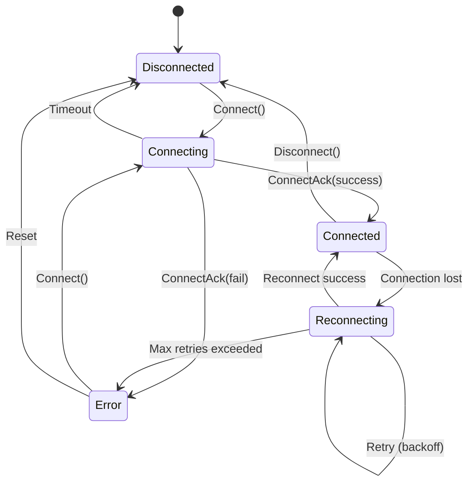

# LCS-DES-092b: Design Specification — Sync Protocol

## 1. Metadata & Categorization

| Field | Value | Description |
| :--- | :--- | :--- |
| **Feature ID** | `COL-092b` | Sub-part of COL-092 |
| **Feature Name** | `Sync Protocol (WebSocket-based)` | Real-time synchronization |
| **Target Version** | `v0.9.2b` | Second sub-part of v0.9.2 |
| **Module Scope** | `Lexichord.Modules.Collaboration` | Collaboration module |
| **Swimlane** | `Collaboration` | Part of collaboration vertical |
| **License Tier** | `Teams` | Teams and above |
| **Feature Gate Key** | `Collaboration.RealTimeSync` | License gate key |
| **Author** | Lead Architect | |
| **Status** | `Draft` | |
| **Last Updated** | `2026-01-27` | |
| **Parent Document** | [LCS-DES-092-INDEX](./LCS-DES-092-INDEX.md) | |
| **Scope Breakdown** | [LCS-SBD-092 S3.2](./LCS-SBD-092.md#32-v092b-sync-protocol) | |

---

## 2. Executive Summary

### 2.1 The Requirement

The CRDT engine provides conflict-free data structures, but these structures need a reliable transport mechanism to synchronize across clients. The sync protocol must:

- Transmit operations in real-time with minimal latency
- Handle network failures gracefully with automatic reconnection
- Support offline operation with a persistent queue
- Efficiently batch and compress operations
- Manage document sessions and collaborator lists

> **Goal:** Implement a WebSocket-based synchronization protocol that transmits CRDT operations between clients with < 100ms latency, supports offline editing, and automatically reconnects after network failures.

### 2.2 The Proposed Solution

Implement a layered sync protocol:

1. **Transport Layer** — WebSocket connection with automatic reconnection
2. **Protocol Layer** — Typed messages for operations, presence, and control
3. **Reliability Layer** — Acknowledgments, retries, and offline queue
4. **Optimization Layer** — Batching, compression, and delta sync

---

## 3. Architecture & Modular Strategy

### 3.1 Dependencies

#### 3.1.1 Internal Dependencies

| Interface | Source Version | Purpose |
| :--- | :--- | :--- |
| `ICrdtEngine` | v0.9.2a | Generate and apply operations |
| `ICrdtSerializer` | v0.9.2a | Serialize operations for transport |
| `ISecureVault` | v0.0.6a | Store authentication tokens |
| `ISettingsService` | v0.1.6a | Connection settings |
| `IMediator` | v0.0.7a | Publish connection events |

#### 3.1.2 NuGet Packages

| Package | Version | Purpose |
| :--- | :--- | :--- |
| `System.Net.WebSockets.Client` | 9.0.x | WebSocket client |
| `Polly` | 8.x | Retry policies |
| `LiteDB` | 5.x | Offline queue storage (NEW) |
| `System.IO.Compression` | 9.0.x | Message compression |

### 3.2 Licensing Behavior

Sync protocol is gated by the same license check as the CRDT engine. Connection attempts by unlicensed clients are rejected at the server level.

---

## 4. Data Contract (The API)

### 4.1 Connection State

```csharp
namespace Lexichord.Abstractions.Collaboration;

/// <summary>
/// Sync connection state machine states.
/// </summary>
public enum SyncConnectionState
{
    /// <summary>
    /// Not connected to sync server.
    /// </summary>
    Disconnected,

    /// <summary>
    /// Attempting to establish connection.
    /// </summary>
    Connecting,

    /// <summary>
    /// Connected and authenticated.
    /// </summary>
    Connected,

    /// <summary>
    /// Connection lost, attempting to reconnect.
    /// </summary>
    Reconnecting,

    /// <summary>
    /// Connection failed with error.
    /// </summary>
    Error
}
```

### 4.2 Protocol Messages

```csharp
namespace Lexichord.Abstractions.Collaboration;

/// <summary>
/// Sync message types for the protocol.
/// </summary>
public enum SyncMessageType : byte
{
    // Connection management (0x00-0x0F)
    Connect = 0x00,
    ConnectAck = 0x01,
    Disconnect = 0x02,
    Ping = 0x03,
    Pong = 0x04,

    // Document management (0x10-0x1F)
    JoinDocument = 0x10,
    JoinDocumentAck = 0x11,
    LeaveDocument = 0x12,
    DocumentState = 0x13,

    // Operations (0x20-0x2F)
    Operation = 0x20,
    OperationBatch = 0x21,
    OperationAck = 0x22,

    // Presence (0x30-0x3F)
    PresenceUpdate = 0x30,
    PresenceQuery = 0x31,

    // Collaborators (0x40-0x4F)
    CollaboratorJoined = 0x40,
    CollaboratorLeft = 0x41,
    CollaboratorList = 0x42,

    // Errors (0xF0-0xFF)
    Error = 0xF0
}

/// <summary>
/// Base sync message.
/// </summary>
[MessagePackObject]
[Union(0, typeof(ConnectMessage))]
[Union(1, typeof(ConnectAckMessage))]
[Union(2, typeof(DisconnectMessage))]
[Union(3, typeof(PingMessage))]
[Union(4, typeof(PongMessage))]
[Union(16, typeof(JoinDocumentMessage))]
[Union(17, typeof(JoinDocumentAckMessage))]
[Union(18, typeof(LeaveDocumentMessage))]
[Union(19, typeof(DocumentStateMessage))]
[Union(32, typeof(OperationMessage))]
[Union(33, typeof(OperationBatchMessage))]
[Union(34, typeof(OperationAckMessage))]
[Union(48, typeof(PresenceUpdateMessage))]
[Union(64, typeof(CollaboratorJoinedMessage))]
[Union(65, typeof(CollaboratorLeftMessage))]
[Union(240, typeof(ErrorMessage))]
public abstract record SyncMessage
{
    [Key(0)]
    public abstract SyncMessageType Type { get; }

    [Key(1)]
    public Guid MessageId { get; init; } = Guid.NewGuid();

    [Key(2)]
    public DateTime Timestamp { get; init; } = DateTime.UtcNow;
}

/// <summary>
/// Connection request message.
/// </summary>
[MessagePackObject]
public sealed record ConnectMessage : SyncMessage
{
    [IgnoreMember]
    public override SyncMessageType Type => SyncMessageType.Connect;

    [Key(3)]
    public required Guid ClientId { get; init; }

    [Key(4)]
    public required string AuthToken { get; init; }

    [Key(5)]
    public required string ClientVersion { get; init; }

    [Key(6)]
    public string? DeviceId { get; init; }
}

/// <summary>
/// Connection acknowledgment message.
/// </summary>
[MessagePackObject]
public sealed record ConnectAckMessage : SyncMessage
{
    [IgnoreMember]
    public override SyncMessageType Type => SyncMessageType.ConnectAck;

    [Key(3)]
    public required bool Success { get; init; }

    [Key(4)]
    public string? Error { get; init; }

    [Key(5)]
    public Guid SessionId { get; init; }

    [Key(6)]
    public TimeSpan HeartbeatInterval { get; init; } = TimeSpan.FromSeconds(30);

    [Key(7)]
    public int MaxBatchSize { get; init; } = 100;

    [Key(8)]
    public int MaxMessageSize { get; init; } = 1024 * 1024; // 1MB
}

/// <summary>
/// Join document request.
/// </summary>
[MessagePackObject]
public sealed record JoinDocumentMessage : SyncMessage
{
    [IgnoreMember]
    public override SyncMessageType Type => SyncMessageType.JoinDocument;

    [Key(3)]
    public required Guid DocumentId { get; init; }

    [Key(4)]
    public required VectorClock ClientClock { get; init; }

    [Key(5)]
    public bool RequestFullState { get; init; } = false;
}

/// <summary>
/// Join document acknowledgment with initial state.
/// </summary>
[MessagePackObject]
public sealed record JoinDocumentAckMessage : SyncMessage
{
    [IgnoreMember]
    public override SyncMessageType Type => SyncMessageType.JoinDocumentAck;

    [Key(3)]
    public required Guid DocumentId { get; init; }

    [Key(4)]
    public required bool Success { get; init; }

    [Key(5)]
    public string? Error { get; init; }
}

/// <summary>
/// Document state response with full or delta state.
/// </summary>
[MessagePackObject]
public sealed record DocumentStateMessage : SyncMessage
{
    [IgnoreMember]
    public override SyncMessageType Type => SyncMessageType.DocumentState;

    [Key(3)]
    public required Guid DocumentId { get; init; }

    [Key(4)]
    public required byte[] State { get; init; }

    [Key(5)]
    public required VectorClock ServerClock { get; init; }

    [Key(6)]
    public required IReadOnlyList<CollaboratorInfo> Collaborators { get; init; }

    [Key(7)]
    public bool IsFullState { get; init; } = true;

    [Key(8)]
    public bool Compressed { get; init; } = false;
}

/// <summary>
/// Single operation message.
/// </summary>
[MessagePackObject]
public sealed record OperationMessage : SyncMessage
{
    [IgnoreMember]
    public override SyncMessageType Type => SyncMessageType.Operation;

    [Key(3)]
    public required Guid DocumentId { get; init; }

    [Key(4)]
    public required byte[] OperationData { get; init; }

    [Key(5)]
    public long SequenceNumber { get; init; }
}

/// <summary>
/// Batched operations for efficiency.
/// </summary>
[MessagePackObject]
public sealed record OperationBatchMessage : SyncMessage
{
    [IgnoreMember]
    public override SyncMessageType Type => SyncMessageType.OperationBatch;

    [Key(3)]
    public required Guid DocumentId { get; init; }

    [Key(4)]
    public required IReadOnlyList<byte[]> Operations { get; init; }

    [Key(5)]
    public bool Compressed { get; init; } = false;

    [Key(6)]
    public long FirstSequenceNumber { get; init; }
}

/// <summary>
/// Operation acknowledgment from server.
/// </summary>
[MessagePackObject]
public sealed record OperationAckMessage : SyncMessage
{
    [IgnoreMember]
    public override SyncMessageType Type => SyncMessageType.OperationAck;

    [Key(3)]
    public required Guid DocumentId { get; init; }

    [Key(4)]
    public required IReadOnlyList<CrdtId> AcknowledgedIds { get; init; }

    [Key(5)]
    public required VectorClock ServerClock { get; init; }
}

/// <summary>
/// Presence update message.
/// </summary>
[MessagePackObject]
public sealed record PresenceUpdateMessage : SyncMessage
{
    [IgnoreMember]
    public override SyncMessageType Type => SyncMessageType.PresenceUpdate;

    [Key(3)]
    public required Guid DocumentId { get; init; }

    [Key(4)]
    public required Guid UserId { get; init; }

    [Key(5)]
    public int? CursorPosition { get; init; }

    [Key(6)]
    public SelectionRange? Selection { get; init; }

    [Key(7)]
    public PresenceState State { get; init; } = PresenceState.Active;
}

/// <summary>
/// Collaborator joined notification.
/// </summary>
[MessagePackObject]
public sealed record CollaboratorJoinedMessage : SyncMessage
{
    [IgnoreMember]
    public override SyncMessageType Type => SyncMessageType.CollaboratorJoined;

    [Key(3)]
    public required Guid DocumentId { get; init; }

    [Key(4)]
    public required CollaboratorInfo Collaborator { get; init; }
}

/// <summary>
/// Collaborator left notification.
/// </summary>
[MessagePackObject]
public sealed record CollaboratorLeftMessage : SyncMessage
{
    [IgnoreMember]
    public override SyncMessageType Type => SyncMessageType.CollaboratorLeft;

    [Key(3)]
    public required Guid DocumentId { get; init; }

    [Key(4)]
    public required Guid UserId { get; init; }

    [Key(5)]
    public string? Reason { get; init; }
}

/// <summary>
/// Error message.
/// </summary>
[MessagePackObject]
public sealed record ErrorMessage : SyncMessage
{
    [IgnoreMember]
    public override SyncMessageType Type => SyncMessageType.Error;

    [Key(3)]
    public required string Code { get; init; }

    [Key(4)]
    public required string Message { get; init; }

    [Key(5)]
    public Guid? RelatedMessageId { get; init; }

    [Key(6)]
    public bool Fatal { get; init; } = false;
}

/// <summary>
/// Collaborator information.
/// </summary>
[MessagePackObject]
public record CollaboratorInfo
{
    [Key(0)]
    public required Guid UserId { get; init; }

    [Key(1)]
    public required string DisplayName { get; init; }

    [Key(2)]
    public string? AvatarUrl { get; init; }

    [Key(3)]
    public DateTime JoinedAt { get; init; }

    [Key(4)]
    public bool IsOnline { get; init; } = true;

    [Key(5)]
    public string? AssignedColor { get; init; }
}
```

### 4.3 Sync Client Interface

```csharp
namespace Lexichord.Abstractions.Collaboration;

/// <summary>
/// Sync client for real-time document synchronization.
/// </summary>
public interface ISyncClient : IAsyncDisposable
{
    /// <summary>
    /// Current connection state.
    /// </summary>
    SyncConnectionState ConnectionState { get; }

    /// <summary>
    /// Current client ID.
    /// </summary>
    Guid ClientId { get; }

    /// <summary>
    /// Current session ID (set after successful connection).
    /// </summary>
    Guid? SessionId { get; }

    /// <summary>
    /// Connect to the sync server.
    /// </summary>
    Task<bool> ConnectAsync(string serverUrl, string authToken, CancellationToken ct = default);

    /// <summary>
    /// Disconnect from the sync server.
    /// </summary>
    Task DisconnectAsync(CancellationToken ct = default);

    /// <summary>
    /// Join a document collaboration session.
    /// </summary>
    Task<JoinDocumentResult> JoinDocumentAsync(
        Guid documentId,
        VectorClock localClock,
        CancellationToken ct = default);

    /// <summary>
    /// Leave a document collaboration session.
    /// </summary>
    Task LeaveDocumentAsync(Guid documentId, CancellationToken ct = default);

    /// <summary>
    /// Send a CRDT operation to the server.
    /// </summary>
    Task SendOperationAsync(
        Guid documentId,
        CrdtOperation operation,
        CancellationToken ct = default);

    /// <summary>
    /// Send a batch of CRDT operations.
    /// </summary>
    Task SendOperationBatchAsync(
        Guid documentId,
        IEnumerable<CrdtOperation> operations,
        CancellationToken ct = default);

    /// <summary>
    /// Update presence information.
    /// </summary>
    Task UpdatePresenceAsync(
        Guid documentId,
        int? cursorPosition,
        SelectionRange? selection,
        CancellationToken ct = default);

    /// <summary>
    /// Get the list of joined documents.
    /// </summary>
    IReadOnlyList<Guid> GetJoinedDocuments();

    /// <summary>
    /// Event raised when connection state changes.
    /// </summary>
    event EventHandler<ConnectionStateChangedEventArgs> ConnectionStateChanged;

    /// <summary>
    /// Event raised when a remote operation is received.
    /// </summary>
    event EventHandler<RemoteOperationEventArgs> RemoteOperationReceived;

    /// <summary>
    /// Event raised when operations are acknowledged.
    /// </summary>
    event EventHandler<OperationAckEventArgs> OperationsAcknowledged;

    /// <summary>
    /// Event raised when presence updates are received.
    /// </summary>
    event EventHandler<PresenceUpdateEventArgs> PresenceUpdated;

    /// <summary>
    /// Event raised when a collaborator joins/leaves.
    /// </summary>
    event EventHandler<CollaboratorEventArgs> CollaboratorChanged;

    /// <summary>
    /// Event raised when an error occurs.
    /// </summary>
    event EventHandler<SyncErrorEventArgs> ErrorOccurred;
}

/// <summary>
/// Result of joining a document.
/// </summary>
public record JoinDocumentResult(
    bool Success,
    string? Error,
    byte[]? InitialState,
    VectorClock? ServerClock,
    IReadOnlyList<CollaboratorInfo>? Collaborators);

/// <summary>
/// Event args for connection state changes.
/// </summary>
public sealed class ConnectionStateChangedEventArgs : EventArgs
{
    public required SyncConnectionState OldState { get; init; }
    public required SyncConnectionState NewState { get; init; }
    public string? Error { get; init; }
    public int ReconnectAttempt { get; init; }
}

/// <summary>
/// Event args for remote operations.
/// </summary>
public sealed class RemoteOperationEventArgs : EventArgs
{
    public required Guid DocumentId { get; init; }
    public required CrdtOperation Operation { get; init; }
    public required Guid OriginClientId { get; init; }
}

/// <summary>
/// Event args for operation acknowledgments.
/// </summary>
public sealed class OperationAckEventArgs : EventArgs
{
    public required Guid DocumentId { get; init; }
    public required IReadOnlyList<CrdtId> AcknowledgedIds { get; init; }
    public required VectorClock ServerClock { get; init; }
}

/// <summary>
/// Event args for presence updates.
/// </summary>
public sealed class PresenceUpdateEventArgs : EventArgs
{
    public required Guid DocumentId { get; init; }
    public required Guid UserId { get; init; }
    public int? CursorPosition { get; init; }
    public SelectionRange? Selection { get; init; }
    public PresenceState State { get; init; }
}

/// <summary>
/// Event args for collaborator changes.
/// </summary>
public sealed class CollaboratorEventArgs : EventArgs
{
    public required Guid DocumentId { get; init; }
    public required CollaboratorInfo Collaborator { get; init; }
    public required bool Joined { get; init; }
}

/// <summary>
/// Event args for sync errors.
/// </summary>
public sealed class SyncErrorEventArgs : EventArgs
{
    public required string Code { get; init; }
    public required string Message { get; init; }
    public required bool Fatal { get; init; }
    public Guid? RelatedMessageId { get; init; }
}
```

### 4.4 Offline Queue Interface

```csharp
namespace Lexichord.Abstractions.Collaboration;

/// <summary>
/// Offline operation queue for persistence during disconnection.
/// </summary>
public interface IOfflineQueue
{
    /// <summary>
    /// Enqueue an operation for later sync.
    /// </summary>
    Task EnqueueAsync(
        Guid documentId,
        CrdtOperation operation,
        CancellationToken ct = default);

    /// <summary>
    /// Get all pending operations for a document.
    /// </summary>
    Task<IReadOnlyList<QueuedOperation>> GetPendingAsync(
        Guid documentId,
        CancellationToken ct = default);

    /// <summary>
    /// Get all pending operations across all documents.
    /// </summary>
    Task<IReadOnlyList<QueuedOperation>> GetAllPendingAsync(
        CancellationToken ct = default);

    /// <summary>
    /// Mark operations as sent (awaiting ack).
    /// </summary>
    Task MarkSentAsync(
        IEnumerable<CrdtId> operationIds,
        CancellationToken ct = default);

    /// <summary>
    /// Mark operations as acknowledged (can be removed).
    /// </summary>
    Task MarkAcknowledgedAsync(
        IEnumerable<CrdtId> operationIds,
        CancellationToken ct = default);

    /// <summary>
    /// Remove all acknowledged operations.
    /// </summary>
    Task ClearAcknowledgedAsync(CancellationToken ct = default);

    /// <summary>
    /// Get queue statistics.
    /// </summary>
    Task<QueueStatistics> GetStatisticsAsync(CancellationToken ct = default);
}

/// <summary>
/// A queued operation with metadata.
/// </summary>
public record QueuedOperation(
    CrdtOperation Operation,
    Guid DocumentId,
    DateTime QueuedAt,
    QueuedOperationState State,
    int SendAttempts);

/// <summary>
/// State of a queued operation.
/// </summary>
public enum QueuedOperationState
{
    Pending,
    Sent,
    Acknowledged,
    Failed
}

/// <summary>
/// Queue statistics.
/// </summary>
public record QueueStatistics(
    int TotalPending,
    int TotalSent,
    int TotalByDocument,
    long QueueSizeBytes);
```

---

## 5. Implementation Logic

### 5.1 Connection State Machine



### 5.2 Message Flow

```text
CLIENT                          SERVER                          OTHER CLIENTS
  │                               │                                    │
  │─── Connect(auth) ─────────────►│                                    │
  │◄── ConnectAck(session) ───────│                                    │
  │                               │                                    │
  │─── JoinDocument(docId) ───────►│                                    │
  │◄── DocumentState(state) ──────│                                    │
  │                               │─── CollaboratorJoined ─────────────►│
  │                               │                                    │
  │─── Operation(insert) ─────────►│                                    │
  │◄── OperationAck ──────────────│                                    │
  │                               │─── Operation(insert) ──────────────►│
  │                               │                                    │
  │◄── Operation(remote) ─────────│◄── Operation(insert) ──────────────│
  │                               │─── OperationAck ───────────────────►│
  │                               │                                    │
  │─── PresenceUpdate(cursor) ────►│                                    │
  │                               │─── PresenceUpdate ─────────────────►│
  │                               │                                    │
  │─── Ping ──────────────────────►│                                    │
  │◄── Pong ──────────────────────│                                    │
  │                               │                                    │
  │─── LeaveDocument ─────────────►│                                    │
  │                               │─── CollaboratorLeft ───────────────►│
  │                               │                                    │
  │─── Disconnect ────────────────►│                                    │
```

### 5.3 Reconnection Logic

```text
RECONNECTION POLICY:
│
├── Initial delay: 1 second
├── Max delay: 30 seconds
├── Backoff factor: 2x
├── Max attempts: 10
├── Jitter: ±20%
│
RECONNECT():
│
├── 1. Save current state
│   ├── Document IDs
│   ├── Vector clocks
│   └── Pending operations
│
├── 2. Attempt reconnection
│   └── FOR attempt = 1 TO maxAttempts:
│       │
│       ├── Calculate delay with jitter
│       │   delay = min(initialDelay * 2^attempt, maxDelay)
│       │   delay = delay * (0.8 + random * 0.4)
│       │
│       ├── Wait(delay)
│       │
│       ├── TRY Connect()
│       │   ├── SUCCESS → Continue to step 3
│       │   └── FAIL → Continue loop
│       │
│       └── Emit ReconnectionAttempt event
│
├── 3. Restore state
│   └── FOR each saved document:
│       ├── JoinDocument(docId, savedClock)
│       └── Receive delta state since savedClock
│
├── 4. Flush offline queue
│   └── Send all pending operations
│
└── 5. Resume normal operation
```

### 5.4 Operation Batching

```text
BATCHING STRATEGY:
│
├── Batch window: 50ms
├── Max batch size: 100 operations
├── Max batch bytes: 64KB
│
BATCH MANAGER:
│
├── On LocalOperation:
│   ├── Add to current batch
│   ├── Start batch timer if not running
│   └── Flush if batch full
│
├── On Timer expired:
│   └── Flush current batch
│
├── Flush():
│   ├── IF batch.count == 1:
│   │   └── Send as single Operation
│   │
│   ├── ELSE IF batch.size > compressionThreshold:
│   │   ├── Compress batch
│   │   └── Send as OperationBatch(compressed=true)
│   │
│   └── ELSE:
│       └── Send as OperationBatch
│
└── Reset timer and batch
```

---

## 6. Test Scenarios

### 6.1 Connection Tests

```csharp
[Trait("Category", "Unit")]
[Trait("Version", "v0.9.2b")]
public class SyncClientConnectionTests
{
    [Fact]
    public async Task Connect_ValidCredentials_ReturnsConnected()
    {
        // Arrange
        var mockTransport = new Mock<IWebSocketTransport>();
        mockTransport
            .Setup(x => x.ConnectAsync(It.IsAny<Uri>(), It.IsAny<CancellationToken>()))
            .Returns(Task.CompletedTask);
        mockTransport
            .Setup(x => x.ReceiveAsync(It.IsAny<CancellationToken>()))
            .ReturnsAsync(CreateConnectAckMessage(success: true));

        var sut = new WebSocketSyncClient(mockTransport.Object, CreateSerializer());

        // Act
        var result = await sut.ConnectAsync("wss://sync.example.com", "valid-token");

        // Assert
        result.Should().BeTrue();
        sut.ConnectionState.Should().Be(SyncConnectionState.Connected);
        sut.SessionId.Should().NotBeNull();
    }

    [Fact]
    public async Task Connect_InvalidCredentials_ReturnsError()
    {
        // Arrange
        var mockTransport = new Mock<IWebSocketTransport>();
        mockTransport
            .Setup(x => x.ConnectAsync(It.IsAny<Uri>(), It.IsAny<CancellationToken>()))
            .Returns(Task.CompletedTask);
        mockTransport
            .Setup(x => x.ReceiveAsync(It.IsAny<CancellationToken>()))
            .ReturnsAsync(CreateConnectAckMessage(success: false, error: "Invalid token"));

        var sut = new WebSocketSyncClient(mockTransport.Object, CreateSerializer());

        // Act
        var result = await sut.ConnectAsync("wss://sync.example.com", "invalid-token");

        // Assert
        result.Should().BeFalse();
        sut.ConnectionState.Should().Be(SyncConnectionState.Error);
    }

    [Fact]
    public async Task Connect_NetworkFailure_ReturnsError()
    {
        // Arrange
        var mockTransport = new Mock<IWebSocketTransport>();
        mockTransport
            .Setup(x => x.ConnectAsync(It.IsAny<Uri>(), It.IsAny<CancellationToken>()))
            .ThrowsAsync(new WebSocketException("Connection refused"));

        var sut = new WebSocketSyncClient(mockTransport.Object, CreateSerializer());

        // Act
        var result = await sut.ConnectAsync("wss://sync.example.com", "token");

        // Assert
        result.Should().BeFalse();
        sut.ConnectionState.Should().Be(SyncConnectionState.Error);
    }
}
```

### 6.2 Document Sync Tests

```csharp
[Trait("Category", "Unit")]
[Trait("Version", "v0.9.2b")]
public class SyncClientDocumentTests
{
    [Fact]
    public async Task JoinDocument_Success_ReturnsInitialState()
    {
        // Arrange
        var sut = CreateConnectedSyncClient();
        var documentId = Guid.NewGuid();
        var expectedState = Encoding.UTF8.GetBytes("Initial content");

        SetupJoinDocumentResponse(sut, documentId, expectedState);

        // Act
        var result = await sut.JoinDocumentAsync(documentId, new VectorClock());

        // Assert
        result.Success.Should().BeTrue();
        result.InitialState.Should().BeEquivalentTo(expectedState);
        result.Collaborators.Should().NotBeNull();
    }

    [Fact]
    public async Task SendOperation_WhenConnected_SendsMessage()
    {
        // Arrange
        var sut = CreateConnectedSyncClient();
        var documentId = Guid.NewGuid();
        var operation = CreateInsertOperation("Hello");

        var sentMessages = new List<SyncMessage>();
        sut.OnMessageSent += (_, msg) => sentMessages.Add(msg);

        // Act
        await sut.SendOperationAsync(documentId, operation);

        // Assert
        sentMessages.Should().ContainSingle()
            .Which.Should().BeOfType<OperationMessage>();
    }

    [Fact]
    public async Task SendOperation_WhenDisconnected_QueuesOperation()
    {
        // Arrange
        var offlineQueue = new Mock<IOfflineQueue>();
        var sut = CreateDisconnectedSyncClient(offlineQueue.Object);
        var documentId = Guid.NewGuid();
        var operation = CreateInsertOperation("Hello");

        // Act
        await sut.SendOperationAsync(documentId, operation);

        // Assert
        offlineQueue.Verify(x => x.EnqueueAsync(
            documentId,
            operation,
            It.IsAny<CancellationToken>()), Times.Once);
    }

    [Fact]
    public async Task ReceiveOperation_RaisesEvent()
    {
        // Arrange
        var sut = CreateConnectedSyncClient();
        var documentId = Guid.NewGuid();

        CrdtOperation? receivedOperation = null;
        sut.RemoteOperationReceived += (_, e) => receivedOperation = e.Operation;

        // Act
        SimulateRemoteOperation(sut, documentId, CreateInsertOperation("Remote"));

        // Assert
        receivedOperation.Should().NotBeNull();
        receivedOperation.Should().BeOfType<InsertOperation>();
    }
}
```

### 6.3 Reconnection Tests

```csharp
[Trait("Category", "Unit")]
[Trait("Version", "v0.9.2b")]
public class SyncClientReconnectionTests
{
    [Fact]
    public async Task Reconnect_AfterDisconnection_RestoresState()
    {
        // Arrange
        var sut = CreateConnectedSyncClient();
        var documentId = Guid.NewGuid();
        await sut.JoinDocumentAsync(documentId, new VectorClock());

        var stateChanges = new List<SyncConnectionState>();
        sut.ConnectionStateChanged += (_, e) => stateChanges.Add(e.NewState);

        // Act
        SimulateDisconnection(sut);
        await Task.Delay(2000); // Wait for reconnection

        // Assert
        stateChanges.Should().Contain(SyncConnectionState.Reconnecting);
        stateChanges.Should().Contain(SyncConnectionState.Connected);
        sut.GetJoinedDocuments().Should().Contain(documentId);
    }

    [Fact]
    public async Task Reconnect_FlushesOfflineQueue()
    {
        // Arrange
        var offlineQueue = new InMemoryOfflineQueue();
        var sut = CreateConnectedSyncClient(offlineQueue);
        var documentId = Guid.NewGuid();

        // Queue operations while disconnected
        SimulateDisconnection(sut);
        await sut.SendOperationAsync(documentId, CreateInsertOperation("Offline 1"));
        await sut.SendOperationAsync(documentId, CreateInsertOperation("Offline 2"));

        var sentOperations = new List<CrdtOperation>();
        sut.OnOperationSent += (_, op) => sentOperations.Add(op);

        // Act
        await SimulateReconnection(sut);

        // Assert
        sentOperations.Should().HaveCount(2);
    }

    [Fact]
    public async Task Reconnect_ExceedsMaxAttempts_EntersErrorState()
    {
        // Arrange
        var sut = CreateConnectedSyncClient();
        sut.MaxReconnectAttempts = 3;

        // Act
        SimulateDisconnection(sut);
        SimulateReconnectionFailures(sut, 4);

        // Assert
        sut.ConnectionState.Should().Be(SyncConnectionState.Error);
    }
}
```

### 6.4 Offline Queue Tests

```csharp
[Trait("Category", "Unit")]
[Trait("Version", "v0.9.2b")]
public class OfflineQueueTests
{
    [Fact]
    public async Task Enqueue_PersistsOperation()
    {
        // Arrange
        var sut = new LiteDbOfflineQueue(":memory:");
        var documentId = Guid.NewGuid();
        var operation = CreateInsertOperation("Test");

        // Act
        await sut.EnqueueAsync(documentId, operation);

        // Assert
        var pending = await sut.GetPendingAsync(documentId);
        pending.Should().ContainSingle();
        pending[0].Operation.Should().BeEquivalentTo(operation);
    }

    [Fact]
    public async Task MarkAcknowledged_RemovesFromPending()
    {
        // Arrange
        var sut = new LiteDbOfflineQueue(":memory:");
        var documentId = Guid.NewGuid();
        var operation = CreateInsertOperation("Test");
        await sut.EnqueueAsync(documentId, operation);

        // Act
        await sut.MarkAcknowledgedAsync(new[] { operation.Id });
        await sut.ClearAcknowledgedAsync();

        // Assert
        var pending = await sut.GetPendingAsync(documentId);
        pending.Should().BeEmpty();
    }

    [Fact]
    public async Task GetStatistics_ReturnsCorrectCounts()
    {
        // Arrange
        var sut = new LiteDbOfflineQueue(":memory:");
        await sut.EnqueueAsync(Guid.NewGuid(), CreateInsertOperation("1"));
        await sut.EnqueueAsync(Guid.NewGuid(), CreateInsertOperation("2"));
        await sut.EnqueueAsync(Guid.NewGuid(), CreateInsertOperation("3"));

        // Act
        var stats = await sut.GetStatisticsAsync();

        // Assert
        stats.TotalPending.Should().Be(3);
    }
}
```

---

## 7. UI/UX Specifications

### 7.1 Connection Status Indicator

```text
┌─────────────────────────────────────────────────────────────────────┐
│ Document Title                                        [Sync Status] │
├─────────────────────────────────────────────────────────────────────┤

Status Indicators:

Connected:     [●] Synced          (Green dot, static)
Syncing:       [◐] Syncing...      (Blue dot, rotating animation)
Offline:       [○] Offline         (Gray dot, static)
Reconnecting:  [◐] Reconnecting... (Orange dot, pulsing)
Error:         [●] Sync Error      (Red dot, static, clickable)

Tooltip on hover:
┌─────────────────────────────────┐
│ Connected to sync server        │
│ Last sync: 2 seconds ago        │
│ 3 collaborators online          │
└─────────────────────────────────┘
```

### 7.2 Offline Mode Banner

```text
┌─────────────────────────────────────────────────────────────────────┐
│ ⚠️ You're offline. Changes will sync when you reconnect.     [✕]   │
└─────────────────────────────────────────────────────────────────────┘

After reconnection:
┌─────────────────────────────────────────────────────────────────────┐
│ ✓ Back online! 5 changes synced.                             [✕]   │
└─────────────────────────────────────────────────────────────────────┘
```

---

## 8. Observability & Logging

| Level | Message Template |
| :--- | :--- |
| Debug | `"WebSocket message sent: type={Type}, size={Size} bytes"` |
| Debug | `"WebSocket message received: type={Type}, size={Size} bytes"` |
| Info | `"Connected to sync server: url={Url}, session={SessionId}"` |
| Info | `"Joined document: docId={DocumentId}, collaborators={Count}"` |
| Info | `"Disconnected from sync server: reason={Reason}"` |
| Warning | `"Connection lost, attempting reconnection: attempt={Attempt}"` |
| Warning | `"Operation timeout: messageId={MessageId}, elapsed={Elapsed}ms"` |
| Warning | `"Offline queue size exceeded threshold: count={Count}"` |
| Error | `"Connection failed: error={Error}"` |
| Error | `"Sync error: code={Code}, message={Message}"` |

---

## 9. Security & Safety

| Risk | Level | Mitigation |
| :--- | :--- | :--- |
| Token interception | High | Use WSS (TLS), rotate tokens |
| Message tampering | High | Sign messages, validate server signatures |
| Replay attacks | Medium | Include timestamps, reject old messages |
| DoS via message flood | Medium | Rate limiting, message size limits |
| Session hijacking | High | Bind session to IP, short token expiry |

---

## 10. Acceptance Criteria

### 10.1 Functional Criteria

| # | Given | When | Then |
| :--- | :--- | :--- | :--- |
| 1 | Valid auth token | Connect to server | Connection established, session ID returned |
| 2 | Invalid auth token | Connect to server | Connection rejected with error |
| 3 | Connected client | Join document | Receive initial state and collaborator list |
| 4 | Connected client | Send operation | Server acknowledges within 100ms |
| 5 | Disconnected client | Send operation | Operation queued in offline store |
| 6 | Reconnected client | Pending operations exist | Operations flushed to server |
| 7 | Connection lost | Wait | Automatic reconnection within 5s |
| 8 | Max reconnect attempts exceeded | Wait | Client enters error state |

### 10.2 Performance Criteria

| # | Given | When | Then |
| :--- | :--- | :--- | :--- |
| 9 | Connected client | Send operation | Round-trip < 100ms |
| 10 | 100 pending operations | Batch send | All sent in single batch |
| 11 | Large batch (>64KB) | Send | Batch is compressed |
| 12 | 1000 queued operations | Reconnect | All flushed within 5s |

---

## 11. Deliverable Checklist

| # | Deliverable | Status |
| :--- | :--- | :--- |
| 1 | `SyncConnectionState.cs` state enum | [ ] |
| 2 | `SyncMessage.cs` message types | [ ] |
| 3 | `ISyncClient.cs` interface | [ ] |
| 4 | `WebSocketSyncClient.cs` implementation | [ ] |
| 5 | `IOfflineQueue.cs` interface | [ ] |
| 6 | `LiteDbOfflineQueue.cs` implementation | [ ] |
| 7 | `SyncMessageSerializer.cs` MessagePack serialization | [ ] |
| 8 | `OperationBatcher.cs` batching logic | [ ] |
| 9 | `ReconnectionPolicy.cs` retry logic | [ ] |
| 10 | Unit tests for connection | [ ] |
| 11 | Unit tests for document sync | [ ] |
| 12 | Unit tests for reconnection | [ ] |
| 13 | Unit tests for offline queue | [ ] |

---

## 12. Verification Commands

```bash
# Run all sync protocol tests
dotnet test --filter "Version=v0.9.2b" --logger "console;verbosity=detailed"

# Run only connection tests
dotnet test --filter "FullyQualifiedName~SyncClientConnectionTests"

# Run only reconnection tests
dotnet test --filter "FullyQualifiedName~SyncClientReconnectionTests"

# Run only offline queue tests
dotnet test --filter "FullyQualifiedName~OfflineQueueTests"

# Integration test with local server
dotnet test --filter "Category=Integration&Version=v0.9.2b"
```

---

## 13. Code Examples

### 13.1 WebSocket Sync Client Implementation

```csharp
namespace Lexichord.Modules.Collaboration.Sync;

/// <summary>
/// WebSocket-based sync client implementation.
/// </summary>
public sealed class WebSocketSyncClient : ISyncClient
{
    private readonly ClientWebSocket _webSocket = new();
    private readonly ICrdtSerializer _serializer;
    private readonly IOfflineQueue _offlineQueue;
    private readonly ILogger<WebSocketSyncClient> _logger;
    private readonly ConcurrentDictionary<Guid, TaskCompletionSource<SyncMessage>> _pendingRequests = new();
    private readonly HashSet<Guid> _joinedDocuments = new();
    private readonly ReconnectionPolicy _reconnectionPolicy;

    private CancellationTokenSource? _cts;
    private Task? _receiveTask;
    private Task? _heartbeatTask;

    public SyncConnectionState ConnectionState { get; private set; } = SyncConnectionState.Disconnected;
    public Guid ClientId { get; } = Guid.NewGuid();
    public Guid? SessionId { get; private set; }

    public WebSocketSyncClient(
        ICrdtSerializer serializer,
        IOfflineQueue offlineQueue,
        ILogger<WebSocketSyncClient> logger)
    {
        _serializer = serializer;
        _offlineQueue = offlineQueue;
        _logger = logger;
        _reconnectionPolicy = new ReconnectionPolicy(
            initialDelay: TimeSpan.FromSeconds(1),
            maxDelay: TimeSpan.FromSeconds(30),
            maxAttempts: 10);
    }

    public async Task<bool> ConnectAsync(string serverUrl, string authToken, CancellationToken ct = default)
    {
        try
        {
            SetState(SyncConnectionState.Connecting);

            _webSocket.Options.SetRequestHeader("Authorization", $"Bearer {authToken}");
            await _webSocket.ConnectAsync(new Uri(serverUrl), ct);

            // Send connect message
            var connectMsg = new ConnectMessage
            {
                ClientId = ClientId,
                AuthToken = authToken,
                ClientVersion = GetClientVersion()
            };

            await SendMessageAsync(connectMsg, ct);

            // Wait for acknowledgment
            var response = await WaitForResponseAsync<ConnectAckMessage>(connectMsg.MessageId, ct);

            if (!response.Success)
            {
                _logger.LogError("Connection rejected: {Error}", response.Error);
                SetState(SyncConnectionState.Error, response.Error);
                return false;
            }

            SessionId = response.SessionId;

            // Start background tasks
            _cts = new CancellationTokenSource();
            _receiveTask = ReceiveLoopAsync(_cts.Token);
            _heartbeatTask = HeartbeatLoopAsync(response.HeartbeatInterval, _cts.Token);

            SetState(SyncConnectionState.Connected);
            _logger.LogInformation("Connected to sync server: session={SessionId}", SessionId);

            // Flush offline queue
            await FlushOfflineQueueAsync(ct);

            return true;
        }
        catch (Exception ex)
        {
            _logger.LogError(ex, "Failed to connect to sync server");
            SetState(SyncConnectionState.Error, ex.Message);
            return false;
        }
    }

    public async Task<JoinDocumentResult> JoinDocumentAsync(
        Guid documentId,
        VectorClock localClock,
        CancellationToken ct = default)
    {
        EnsureConnected();

        var message = new JoinDocumentMessage
        {
            DocumentId = documentId,
            ClientClock = localClock
        };

        await SendMessageAsync(message, ct);

        var ack = await WaitForResponseAsync<JoinDocumentAckMessage>(message.MessageId, ct);
        if (!ack.Success)
        {
            return new JoinDocumentResult(false, ack.Error, null, null, null);
        }

        // Wait for document state
        var state = await WaitForMessageAsync<DocumentStateMessage>(
            m => m.DocumentId == documentId, ct);

        _joinedDocuments.Add(documentId);

        _logger.LogInformation("Joined document: docId={DocumentId}, collaborators={Count}",
            documentId, state.Collaborators.Count);

        return new JoinDocumentResult(
            true, null, state.State, state.ServerClock, state.Collaborators);
    }

    public async Task SendOperationAsync(
        Guid documentId,
        CrdtOperation operation,
        CancellationToken ct = default)
    {
        if (ConnectionState != SyncConnectionState.Connected)
        {
            await _offlineQueue.EnqueueAsync(documentId, operation, ct);
            _logger.LogDebug("Operation queued offline: {OperationId}", operation.Id);
            return;
        }

        var message = new OperationMessage
        {
            DocumentId = documentId,
            OperationData = _serializer.SerializeOperation(operation)
        };

        await SendMessageAsync(message, ct);
    }

    private async Task ReceiveLoopAsync(CancellationToken ct)
    {
        var buffer = new byte[64 * 1024];

        while (!ct.IsCancellationRequested && _webSocket.State == WebSocketState.Open)
        {
            try
            {
                var result = await _webSocket.ReceiveAsync(buffer, ct);

                if (result.MessageType == WebSocketMessageType.Close)
                {
                    await HandleDisconnectionAsync(ct);
                    break;
                }

                var message = DeserializeMessage(buffer.AsSpan(0, result.Count));
                await HandleMessageAsync(message);
            }
            catch (OperationCanceledException) { break; }
            catch (WebSocketException ex)
            {
                _logger.LogWarning(ex, "WebSocket error in receive loop");
                await HandleDisconnectionAsync(ct);
            }
        }
    }

    private async Task HandleDisconnectionAsync(CancellationToken ct)
    {
        if (ConnectionState == SyncConnectionState.Disconnected)
            return;

        SetState(SyncConnectionState.Reconnecting);

        var savedDocuments = _joinedDocuments.ToList();

        await _reconnectionPolicy.ExecuteAsync(async attempt =>
        {
            _logger.LogInformation("Reconnection attempt {Attempt}", attempt);
            OnConnectionStateChanged(SyncConnectionState.Reconnecting, attempt: attempt);

            // Reconnect
            _webSocket.Dispose();
            // Create new socket and connect...

            // Rejoin documents
            foreach (var docId in savedDocuments)
            {
                await JoinDocumentAsync(docId, GetSavedClock(docId), ct);
            }

            // Flush offline queue
            await FlushOfflineQueueAsync(ct);

        }, ct);
    }

    private async Task FlushOfflineQueueAsync(CancellationToken ct)
    {
        var pending = await _offlineQueue.GetAllPendingAsync(ct);

        if (pending.Count == 0)
            return;

        _logger.LogInformation("Flushing {Count} offline operations", pending.Count);

        var grouped = pending.GroupBy(p => p.DocumentId);
        foreach (var group in grouped)
        {
            var operations = group.Select(q => q.Operation).ToList();
            await SendOperationBatchAsync(group.Key, operations, ct);
        }
    }

    public event EventHandler<ConnectionStateChangedEventArgs>? ConnectionStateChanged;
    public event EventHandler<RemoteOperationEventArgs>? RemoteOperationReceived;
    public event EventHandler<OperationAckEventArgs>? OperationsAcknowledged;
    public event EventHandler<PresenceUpdateEventArgs>? PresenceUpdated;
    public event EventHandler<CollaboratorEventArgs>? CollaboratorChanged;
    public event EventHandler<SyncErrorEventArgs>? ErrorOccurred;

    private void SetState(SyncConnectionState newState, string? error = null)
    {
        var oldState = ConnectionState;
        ConnectionState = newState;
        OnConnectionStateChanged(oldState, newState, error);
    }
}
```

### 13.2 LiteDB Offline Queue Implementation

```csharp
namespace Lexichord.Modules.Collaboration.Sync;

/// <summary>
/// LiteDB-based offline operation queue.
/// </summary>
public sealed class LiteDbOfflineQueue : IOfflineQueue, IDisposable
{
    private readonly LiteDatabase _db;
    private readonly ILiteCollection<QueuedOperationEntity> _collection;
    private readonly ICrdtSerializer _serializer;

    public LiteDbOfflineQueue(string connectionString, ICrdtSerializer serializer)
    {
        _db = new LiteDatabase(connectionString);
        _collection = _db.GetCollection<QueuedOperationEntity>("offline_queue");
        _collection.EnsureIndex(x => x.DocumentId);
        _collection.EnsureIndex(x => x.State);
        _serializer = serializer;
    }

    public Task EnqueueAsync(Guid documentId, CrdtOperation operation, CancellationToken ct = default)
    {
        var entity = new QueuedOperationEntity
        {
            Id = operation.Id.ToString(),
            DocumentId = documentId,
            OperationData = _serializer.SerializeOperation(operation),
            QueuedAt = DateTime.UtcNow,
            State = QueuedOperationState.Pending,
            SendAttempts = 0
        };

        _collection.Insert(entity);
        return Task.CompletedTask;
    }

    public Task<IReadOnlyList<QueuedOperation>> GetPendingAsync(Guid documentId, CancellationToken ct = default)
    {
        var entities = _collection.Find(x =>
            x.DocumentId == documentId &&
            x.State == QueuedOperationState.Pending);

        var result = entities
            .Select(e => new QueuedOperation(
                _serializer.DeserializeOperation(e.OperationData),
                e.DocumentId,
                e.QueuedAt,
                e.State,
                e.SendAttempts))
            .ToList();

        return Task.FromResult<IReadOnlyList<QueuedOperation>>(result);
    }

    public Task MarkAcknowledgedAsync(IEnumerable<CrdtId> operationIds, CancellationToken ct = default)
    {
        foreach (var id in operationIds)
        {
            var entity = _collection.FindById(id.ToString());
            if (entity != null)
            {
                entity.State = QueuedOperationState.Acknowledged;
                _collection.Update(entity);
            }
        }
        return Task.CompletedTask;
    }

    public Task ClearAcknowledgedAsync(CancellationToken ct = default)
    {
        _collection.DeleteMany(x => x.State == QueuedOperationState.Acknowledged);
        return Task.CompletedTask;
    }

    public Task<QueueStatistics> GetStatisticsAsync(CancellationToken ct = default)
    {
        var pending = _collection.Count(x => x.State == QueuedOperationState.Pending);
        var sent = _collection.Count(x => x.State == QueuedOperationState.Sent);

        return Task.FromResult(new QueueStatistics(
            TotalPending: pending,
            TotalSent: sent,
            TotalByDocument: _collection.Query().Select(x => x.DocumentId).ToList().Distinct().Count(),
            QueueSizeBytes: EstimateQueueSize()));
    }

    public void Dispose() => _db.Dispose();

    private class QueuedOperationEntity
    {
        public string Id { get; set; } = "";
        public Guid DocumentId { get; set; }
        public byte[] OperationData { get; set; } = Array.Empty<byte>();
        public DateTime QueuedAt { get; set; }
        public QueuedOperationState State { get; set; }
        public int SendAttempts { get; set; }
    }
}
```

---

## Document History

| Version | Date | Author | Changes |
| :--- | :--- | :--- | :--- |
| 1.0 | 2026-01-27 | Lead Architect | Initial draft |
