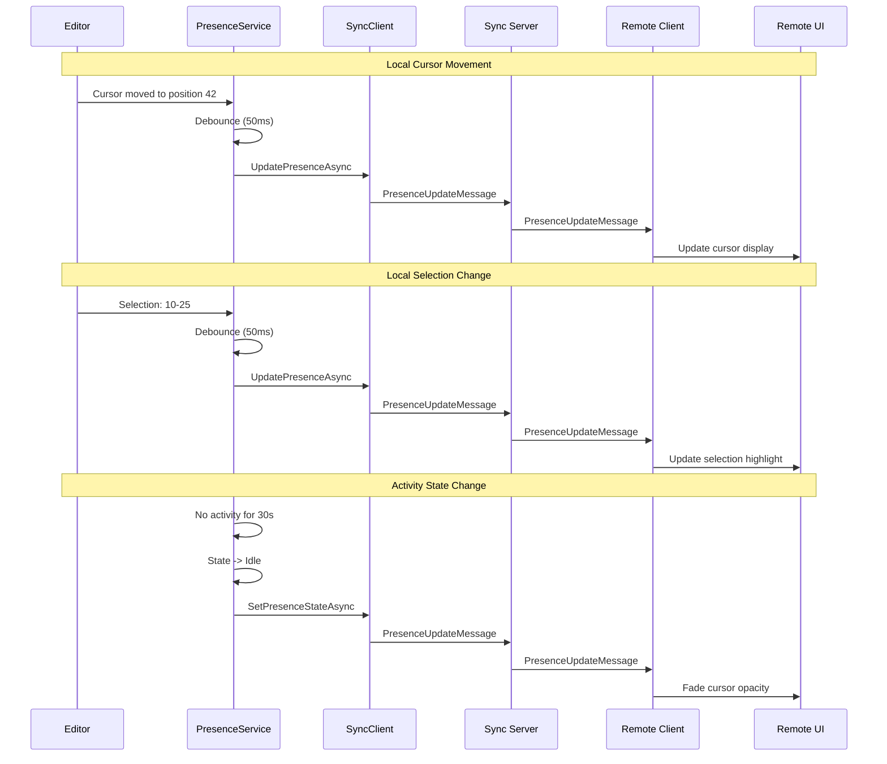

# LCS-DES-092c: Design Specification — Presence Indicators

## 1. Metadata & Categorization

| Field | Value | Description |
| :--- | :--- | :--- |
| **Feature ID** | `COL-092c` | Sub-part of COL-092 |
| **Feature Name** | `Presence Indicators (Cursors, Selections)` | Visual collaborator awareness |
| **Target Version** | `v0.9.2c` | Third sub-part of v0.9.2 |
| **Module Scope** | `Lexichord.Modules.Collaboration` | Collaboration module |
| **Swimlane** | `Collaboration` | Part of collaboration vertical |
| **License Tier** | `Teams` | Teams and above |
| **Feature Gate Key** | `Collaboration.RealTimeSync` | License gate key |
| **Author** | Lead Architect | |
| **Status** | `Draft` | |
| **Last Updated** | `2026-01-27` | |
| **Parent Document** | [LCS-DES-092-INDEX](./LCS-DES-092-INDEX.md) | |
| **Scope Breakdown** | [LCS-SBD-092 S3.3](./LCS-SBD-092.md#33-v092c-presence-indicators) | |

---

## 2. Executive Summary

### 2.1 The Requirement

When multiple users edit a document simultaneously, they need visual cues to understand where others are working. Without presence indicators:

- Users may accidentally overwrite each other's work
- There is no visibility into who is actively editing
- Collaboration feels disconnected and uncoordinated

> **Goal:** Display real-time presence indicators showing each collaborator's cursor position and text selection, with unique colors and labels to identify who is editing where.

### 2.2 The Proposed Solution

Implement a presence system with three components:

1. **Presence Service** — Manages presence data for all collaborators
2. **Cursor Overlay** — Renders remote cursors with collaborator labels
3. **Selection Highlight** — Shows remote text selections with color-coded backgrounds

Key features:
- Unique color assignment per collaborator (consistent across sessions)
- Smooth cursor position updates (debounced at 30-60ms)
- Fade-out animations when collaborators go idle
- Collaborator list panel showing all participants

---

## 3. Architecture & Modular Strategy

### 3.1 Dependencies

#### 3.1.1 Internal Dependencies

| Interface | Source Version | Purpose |
| :--- | :--- | :--- |
| `ISyncClient` | v0.9.2b | Receive presence updates |
| `IEditorService` | v0.1.3a | Get cursor coordinates |
| `IUserProfile` | v0.9.1a | Collaborator display info |
| `IThemeManager` | v0.0.2c | Color scheme integration |

#### 3.1.2 NuGet Packages

| Package | Version | Purpose |
| :--- | :--- | :--- |
| `System.Reactive` | 6.x | Observable streams |
| `Avalonia.Controls` | 11.x | UI rendering |

### 3.2 Licensing Behavior

Presence indicators are only visible to Teams+ users with active collaboration sessions.

---

## 4. Data Contract (The API)

### 4.1 Presence Data Types

```csharp
namespace Lexichord.Abstractions.Collaboration;

/// <summary>
/// Presence information for a collaborator.
/// </summary>
[MessagePackObject]
public record PresenceInfo
{
    [Key(0)]
    public required Guid UserId { get; init; }

    [Key(1)]
    public required Guid DocumentId { get; init; }

    [Key(2)]
    public int? CursorPosition { get; init; }

    [Key(3)]
    public SelectionRange? Selection { get; init; }

    [Key(4)]
    public DateTime LastUpdate { get; init; } = DateTime.UtcNow;

    [Key(5)]
    public PresenceState State { get; init; } = PresenceState.Active;
}

/// <summary>
/// Selection range in the document.
/// </summary>
[MessagePackObject]
public record SelectionRange(
    [property: Key(0)] int Start,
    [property: Key(1)] int End)
{
    [IgnoreMember]
    public int Length => Math.Abs(End - Start);

    [IgnoreMember]
    public bool IsEmpty => Start == End;

    [IgnoreMember]
    public bool IsReversed => End < Start;

    [IgnoreMember]
    public int NormalizedStart => Math.Min(Start, End);

    [IgnoreMember]
    public int NormalizedEnd => Math.Max(Start, End);

    public bool Contains(int position) => position >= NormalizedStart && position < NormalizedEnd;

    public bool Overlaps(SelectionRange other) =>
        NormalizedStart < other.NormalizedEnd && NormalizedEnd > other.NormalizedStart;
}

/// <summary>
/// Presence state indicating activity level.
/// </summary>
public enum PresenceState
{
    /// <summary>
    /// User is actively editing (recent cursor/key activity).
    /// </summary>
    Active,

    /// <summary>
    /// User has document open but no recent activity (>30s).
    /// </summary>
    Idle,

    /// <summary>
    /// User has switched to another window/document (>2min).
    /// </summary>
    Away,

    /// <summary>
    /// User has disconnected.
    /// </summary>
    Offline
}

/// <summary>
/// Visual representation of a collaborator's presence.
/// </summary>
public record CollaboratorPresence
{
    public required Guid UserId { get; init; }
    public required string DisplayName { get; init; }
    public string? AvatarUrl { get; init; }
    public required string AssignedColor { get; init; }
    public required PresenceInfo Presence { get; init; }
    public DateTime JoinedAt { get; init; }
    public bool IsCurrentUser { get; init; }
}

/// <summary>
/// Cursor position with screen coordinates.
/// </summary>
public record CursorDisplayInfo
{
    public required Guid UserId { get; init; }
    public required string DisplayName { get; init; }
    public required string Color { get; init; }
    public required Point ScreenPosition { get; init; }
    public required int DocumentPosition { get; init; }
    public required int LineNumber { get; init; }
    public required int ColumnNumber { get; init; }
    public double Opacity { get; init; } = 1.0;
    public bool ShowLabel { get; init; } = true;
}

/// <summary>
/// Selection highlight with screen coordinates.
/// </summary>
public record SelectionDisplayInfo
{
    public required Guid UserId { get; init; }
    public required string Color { get; init; }
    public required IReadOnlyList<Rect> HighlightRects { get; init; }
    public double Opacity { get; init; } = 0.3;
}
```

### 4.2 Presence Service Interface

```csharp
namespace Lexichord.Abstractions.Collaboration;

/// <summary>
/// Service for managing presence information.
/// </summary>
public interface IPresenceService
{
    /// <summary>
    /// Observes all collaborators' presence for a document.
    /// Emits updated list whenever any presence changes.
    /// </summary>
    IObservable<IReadOnlyList<CollaboratorPresence>> ObservePresence(Guid documentId);

    /// <summary>
    /// Gets the current presence list (snapshot).
    /// </summary>
    IReadOnlyList<CollaboratorPresence> GetPresence(Guid documentId);

    /// <summary>
    /// Gets a specific collaborator's presence.
    /// </summary>
    CollaboratorPresence? GetCollaboratorPresence(Guid documentId, Guid userId);

    /// <summary>
    /// Updates the local user's cursor position.
    /// </summary>
    Task UpdateCursorAsync(
        Guid documentId,
        int position,
        CancellationToken ct = default);

    /// <summary>
    /// Updates the local user's selection.
    /// </summary>
    Task UpdateSelectionAsync(
        Guid documentId,
        SelectionRange? selection,
        CancellationToken ct = default);

    /// <summary>
    /// Updates the local user's presence state.
    /// </summary>
    Task SetPresenceStateAsync(
        Guid documentId,
        PresenceState state,
        CancellationToken ct = default);

    /// <summary>
    /// Gets the assigned color for a user.
    /// Colors are consistent across sessions.
    /// </summary>
    string GetUserColor(Guid userId);

    /// <summary>
    /// Gets the color palette in use.
    /// </summary>
    IReadOnlyList<string> GetColorPalette();

    /// <summary>
    /// Event raised when any collaborator's presence changes.
    /// </summary>
    event EventHandler<PresenceChangedEventArgs> PresenceChanged;

    /// <summary>
    /// Event raised when a collaborator joins.
    /// </summary>
    event EventHandler<CollaboratorJoinedEventArgs> CollaboratorJoined;

    /// <summary>
    /// Event raised when a collaborator leaves.
    /// </summary>
    event EventHandler<CollaboratorLeftEventArgs> CollaboratorLeft;
}

/// <summary>
/// Event args for presence changes.
/// </summary>
public sealed class PresenceChangedEventArgs : EventArgs
{
    public required Guid DocumentId { get; init; }
    public required CollaboratorPresence Collaborator { get; init; }
    public required PresenceChangeType ChangeType { get; init; }
}

/// <summary>
/// Type of presence change.
/// </summary>
public enum PresenceChangeType
{
    CursorMoved,
    SelectionChanged,
    StateChanged
}

/// <summary>
/// Event args for collaborator join.
/// </summary>
public sealed class CollaboratorJoinedEventArgs : EventArgs
{
    public required Guid DocumentId { get; init; }
    public required CollaboratorPresence Collaborator { get; init; }
}

/// <summary>
/// Event args for collaborator leave.
/// </summary>
public sealed class CollaboratorLeftEventArgs : EventArgs
{
    public required Guid DocumentId { get; init; }
    public required Guid UserId { get; init; }
    public required string DisplayName { get; init; }
}
```

### 4.3 Presence Renderer Interface

```csharp
namespace Lexichord.Abstractions.Collaboration;

/// <summary>
/// Renders presence indicators in the editor.
/// </summary>
public interface IPresenceRenderer
{
    /// <summary>
    /// Updates the display of all remote cursors.
    /// </summary>
    void UpdateCursors(IReadOnlyList<CursorDisplayInfo> cursors);

    /// <summary>
    /// Updates the display of all remote selections.
    /// </summary>
    void UpdateSelections(IReadOnlyList<SelectionDisplayInfo> selections);

    /// <summary>
    /// Shows a temporary highlight when a collaborator joins.
    /// </summary>
    void ShowJoinAnimation(CollaboratorPresence collaborator);

    /// <summary>
    /// Shows a fade-out animation when a collaborator leaves.
    /// </summary>
    void ShowLeaveAnimation(Guid userId);

    /// <summary>
    /// Clears all presence indicators.
    /// </summary>
    void ClearAll();
}
```

### 4.4 Color Palette

```csharp
namespace Lexichord.Modules.Collaboration.Presence;

/// <summary>
/// Color palette for collaborator indicators.
/// Colors are designed to be visually distinct and accessible.
/// </summary>
public static class CollaboratorColors
{
    /// <summary>
    /// The color palette for collaborators.
    /// These colors are chosen for:
    /// - High contrast against both light and dark backgrounds
    /// - Distinct hues that are easily distinguishable
    /// - Accessibility (colorblind-friendly where possible)
    /// </summary>
    public static readonly IReadOnlyList<string> Palette = new[]
    {
        "#E91E63", // Pink
        "#9C27B0", // Purple
        "#673AB7", // Deep Purple
        "#3F51B5", // Indigo
        "#2196F3", // Blue
        "#00BCD4", // Cyan
        "#009688", // Teal
        "#4CAF50", // Green
        "#8BC34A", // Light Green
        "#FF9800", // Orange
        "#FF5722", // Deep Orange
        "#795548", // Brown
        "#607D8B", // Blue Grey
        "#F44336", // Red
        "#00796B", // Dark Teal
        "#5D4037", // Dark Brown
    };

    /// <summary>
    /// Gets a consistent color for a user ID.
    /// The same user always gets the same color.
    /// </summary>
    public static string GetColor(Guid userId)
    {
        // Use a hash to get consistent color assignment
        var hash = userId.GetHashCode();
        var index = Math.Abs(hash) % Palette.Count;
        return Palette[index];
    }

    /// <summary>
    /// Gets the selection background color (30% opacity version).
    /// </summary>
    public static string GetSelectionColor(string baseColor)
    {
        // Convert hex to ARGB with 30% opacity
        if (baseColor.StartsWith("#") && baseColor.Length == 7)
        {
            return $"#4D{baseColor[1..]}"; // 0x4D = 77 = ~30%
        }
        return baseColor;
    }

    /// <summary>
    /// Gets the cursor line color (full opacity).
    /// </summary>
    public static string GetCursorColor(string baseColor) => baseColor;

    /// <summary>
    /// Gets a lighter version for backgrounds.
    /// </summary>
    public static string GetLightColor(string baseColor)
    {
        if (baseColor.StartsWith("#") && baseColor.Length == 7)
        {
            return $"#1A{baseColor[1..]}"; // 0x1A = 26 = ~10%
        }
        return baseColor;
    }
}
```

---

## 5. Implementation Logic

### 5.1 Presence Update Flow



### 5.2 Cursor Rendering Logic

```text
RENDER CURSORS:
│
├── FOR each collaborator in presenceList:
│   │
│   ├── SKIP if collaborator is current user
│   │
│   ├── SKIP if cursor position is null
│   │
│   ├── SKIP if state is Offline
│   │
│   ├── Get screen coordinates from document position
│   │   └── (x, y) = editor.GetPositionCoordinates(position)
│   │
│   ├── Calculate opacity based on state
│   │   ├── Active: 1.0
│   │   ├── Idle: 0.7
│   │   └── Away: 0.4
│   │
│   ├── Render cursor line
│   │   ├── Color: collaborator.color
│   │   ├── Width: 2px
│   │   ├── Height: lineHeight
│   │   └── Position: (x, y)
│   │
│   └── Render label (if ShowLabel)
│       ├── Text: collaborator.displayName
│       ├── Background: collaborator.color
│       ├── Position: above cursor
│       └── Animation: fade in on appear
│
└── Apply animations for changes
```

### 5.3 Selection Rendering Logic

```text
RENDER SELECTIONS:
│
├── FOR each collaborator in presenceList:
│   │
│   ├── SKIP if collaborator is current user
│   │
│   ├── SKIP if selection is null or empty
│   │
│   ├── Get selection range
│   │   └── (start, end) = selection.Normalized
│   │
│   ├── Calculate highlight rectangles
│   │   │
│   │   ├── Get line information
│   │   │   └── lines = editor.GetLinesInRange(start, end)
│   │   │
│   │   └── FOR each line in selection:
│   │       ├── startX = position of first selected char on line
│   │       ├── endX = position of last selected char on line
│   │       ├── y = line top
│   │       ├── height = line height
│   │       └── ADD Rect(startX, y, endX-startX, height)
│   │
│   └── Render highlight rectangles
│       ├── Color: collaborator.selectionColor (30% opacity)
│       ├── Rectangles: calculated rects
│       └── Layer: behind text, above background
│
└── Handle overlapping selections
    └── Stack colors with multiply blend mode
```

### 5.4 Debouncing Strategy

```text
PRESENCE DEBOUNCING:
│
├── Cursor updates: 50ms debounce
│   └── Prevents flooding server during rapid typing
│
├── Selection updates: 100ms debounce
│   └── Selection changes are less frequent
│
├── State updates: No debounce (immediate)
│   └── State changes are infrequent and important
│
IMPLEMENTATION:
│
├── Use Subject<T> with Throttle operator
│   cursorSubject
│     .Throttle(TimeSpan.FromMilliseconds(50))
│     .Subscribe(SendCursorUpdate);
│
└── Batch multiple updates within window
    └── Only send latest position, not intermediate
```

---

## 6. Test Scenarios

### 6.1 Presence Service Tests

```csharp
[Trait("Category", "Unit")]
[Trait("Version", "v0.9.2c")]
public class PresenceServiceTests
{
    [Fact]
    public async Task UpdateCursor_SendsPresenceUpdate()
    {
        // Arrange
        var mockSyncClient = new Mock<ISyncClient>();
        var sut = new PresenceService(mockSyncClient.Object);
        var documentId = Guid.NewGuid();

        // Act
        await sut.UpdateCursorAsync(documentId, position: 42);
        await Task.Delay(100); // Wait for debounce

        // Assert
        mockSyncClient.Verify(x => x.UpdatePresenceAsync(
            documentId,
            42,
            null,
            It.IsAny<CancellationToken>()), Times.Once);
    }

    [Fact]
    public async Task UpdateCursor_Debounces_MultipleCalls()
    {
        // Arrange
        var mockSyncClient = new Mock<ISyncClient>();
        var sut = new PresenceService(mockSyncClient.Object);
        var documentId = Guid.NewGuid();

        // Act - Rapid cursor updates
        for (int i = 0; i < 10; i++)
        {
            await sut.UpdateCursorAsync(documentId, position: i);
        }
        await Task.Delay(100); // Wait for debounce

        // Assert - Only last position sent
        mockSyncClient.Verify(x => x.UpdatePresenceAsync(
            documentId,
            9, // Last position
            null,
            It.IsAny<CancellationToken>()), Times.Once);
    }

    [Fact]
    public void GetUserColor_ReturnConsistentColor()
    {
        // Arrange
        var sut = new PresenceService(Mock.Of<ISyncClient>());
        var userId = Guid.NewGuid();

        // Act
        var color1 = sut.GetUserColor(userId);
        var color2 = sut.GetUserColor(userId);

        // Assert
        color1.Should().Be(color2);
        color1.Should().StartWith("#");
    }

    [Fact]
    public void ObservePresence_EmitsOnChange()
    {
        // Arrange
        var sut = CreatePresenceServiceWithCollaborators();
        var documentId = Guid.NewGuid();
        var receivedLists = new List<IReadOnlyList<CollaboratorPresence>>();

        sut.ObservePresence(documentId).Subscribe(list => receivedLists.Add(list));

        // Act
        SimulateRemotePresenceUpdate(sut, documentId);

        // Assert
        receivedLists.Should().HaveCountGreaterThan(0);
    }
}
```

### 6.2 Color Palette Tests

```csharp
[Trait("Category", "Unit")]
[Trait("Version", "v0.9.2c")]
public class CollaboratorColorTests
{
    [Fact]
    public void GetColor_SameUserId_ReturnsSameColor()
    {
        var userId = Guid.NewGuid();

        var color1 = CollaboratorColors.GetColor(userId);
        var color2 = CollaboratorColors.GetColor(userId);

        color1.Should().Be(color2);
    }

    [Fact]
    public void GetColor_DifferentUserIds_ReturnsDistinctColors()
    {
        var userIds = Enumerable.Range(0, 100)
            .Select(_ => Guid.NewGuid())
            .ToList();

        var colors = userIds.Select(CollaboratorColors.GetColor).ToList();

        // At least 80% should be unique (some collisions expected with hash)
        colors.Distinct().Count().Should().BeGreaterThan(80);
    }

    [Fact]
    public void Palette_HasEnoughColors()
    {
        CollaboratorColors.Palette.Should().HaveCountGreaterOrEqualTo(12);
    }

    [Fact]
    public void Palette_AllValidHexColors()
    {
        foreach (var color in CollaboratorColors.Palette)
        {
            color.Should().MatchRegex(@"^#[0-9A-Fa-f]{6}$");
        }
    }

    [Fact]
    public void GetSelectionColor_AddsOpacity()
    {
        var baseColor = "#E91E63";

        var selectionColor = CollaboratorColors.GetSelectionColor(baseColor);

        selectionColor.Should().StartWith("#4D"); // 30% opacity prefix
    }
}
```

### 6.3 Cursor Display Tests

```csharp
[Trait("Category", "Unit")]
[Trait("Version", "v0.9.2c")]
public class CursorDisplayTests
{
    [Fact]
    public void CursorDisplayInfo_CalculatesOpacityFromState()
    {
        var cursor = new CursorDisplayInfo
        {
            UserId = Guid.NewGuid(),
            DisplayName = "Alice",
            Color = "#E91E63",
            ScreenPosition = new Point(100, 200),
            DocumentPosition = 42,
            LineNumber = 5,
            ColumnNumber = 10,
            Opacity = GetOpacityForState(PresenceState.Active)
        };

        cursor.Opacity.Should().Be(1.0);
    }

    [Theory]
    [InlineData(PresenceState.Active, 1.0)]
    [InlineData(PresenceState.Idle, 0.7)]
    [InlineData(PresenceState.Away, 0.4)]
    public void GetOpacityForState_ReturnsCorrectValue(PresenceState state, double expected)
    {
        var opacity = GetOpacityForState(state);
        opacity.Should().Be(expected);
    }

    private static double GetOpacityForState(PresenceState state) => state switch
    {
        PresenceState.Active => 1.0,
        PresenceState.Idle => 0.7,
        PresenceState.Away => 0.4,
        _ => 0.0
    };
}
```

### 6.4 Selection Range Tests

```csharp
[Trait("Category", "Unit")]
[Trait("Version", "v0.9.2c")]
public class SelectionRangeTests
{
    [Fact]
    public void SelectionRange_CalculatesLength()
    {
        var range = new SelectionRange(10, 20);
        range.Length.Should().Be(10);
    }

    [Fact]
    public void SelectionRange_ReversedSelection_CalculatesCorrectly()
    {
        var range = new SelectionRange(20, 10); // End before Start
        range.IsReversed.Should().BeTrue();
        range.Length.Should().Be(10);
        range.NormalizedStart.Should().Be(10);
        range.NormalizedEnd.Should().Be(20);
    }

    [Fact]
    public void SelectionRange_EmptySelection_IsEmpty()
    {
        var range = new SelectionRange(10, 10);
        range.IsEmpty.Should().BeTrue();
        range.Length.Should().Be(0);
    }

    [Theory]
    [InlineData(10, 20, 15, true)]  // Position inside
    [InlineData(10, 20, 10, true)]  // Position at start
    [InlineData(10, 20, 9, false)]  // Position before
    [InlineData(10, 20, 20, false)] // Position at end (exclusive)
    [InlineData(10, 20, 25, false)] // Position after
    public void SelectionRange_Contains_ReturnsCorrectly(int start, int end, int position, bool expected)
    {
        var range = new SelectionRange(start, end);
        range.Contains(position).Should().Be(expected);
    }

    [Theory]
    [InlineData(10, 20, 15, 25, true)]  // Overlapping
    [InlineData(10, 20, 20, 30, false)] // Adjacent (no overlap)
    [InlineData(10, 20, 5, 15, true)]   // Partial overlap at start
    [InlineData(10, 20, 12, 18, true)]  // Fully contained
    public void SelectionRange_Overlaps_ReturnsCorrectly(
        int start1, int end1, int start2, int end2, bool expected)
    {
        var range1 = new SelectionRange(start1, end1);
        var range2 = new SelectionRange(start2, end2);
        range1.Overlaps(range2).Should().Be(expected);
    }
}
```

---

## 7. UI/UX Specifications

### 7.1 Cursor Indicator Design

```text
CURSOR INDICATOR ANATOMY:
                            ┌─────────────────┐
                            │ 🟣 Alice        │ ← Label (optional)
                            └────────┬────────┘
                                     │
                                     ▼
┌────────────────────────────────────│────────────────────────────────┐
│ The quick brown fox jumps over the │lazy dog.                       │
└────────────────────────────────────│────────────────────────────────┘
                                     │
                                     └─ Cursor line (2px wide, full color)

CURSOR LINE SPECIFICATIONS:
├── Width: 2px
├── Height: Line height (matches text line)
├── Color: Collaborator's assigned color (full opacity)
├── Animation: Pulse when user is typing (optional)
└── Z-index: Above text, below popups

LABEL SPECIFICATIONS:
├── Background: Collaborator's assigned color
├── Text color: White (or black for light colors)
├── Font size: 11px
├── Padding: 4px 8px
├── Border radius: 4px
├── Position: Centered above cursor, offset by 4px
├── Max width: 120px (truncate with ellipsis)
├── Animation: Fade in on appear, fade out after 3s of inactivity
└── Avatar: Optional 16x16 circle before name
```

### 7.2 Selection Highlight Design

```text
SELECTION HIGHLIGHT ANATOMY:

┌─────────────────────────────────────────────────────────────────────┐
│ The quick brown █████████████████████████████████ the lazy dog.    │
│                 └───────────────────────────────┘                   │
│                 Selection highlight (30% opacity)                   │
└─────────────────────────────────────────────────────────────────────┘

MULTI-LINE SELECTION:

┌─────────────────────────────────────────────────────────────────────┐
│ This is a longer paragraph that spans multiple lines. The          │
│ ██████████████████████████████████████████████████████████████████ │
│ ██████████████████████████████████████████████████████████████████ │
│ ████████████████████ editing in the middle of this text.           │
└─────────────────────────────────────────────────────────────────────┘

HIGHLIGHT SPECIFICATIONS:
├── Color: Collaborator's color at 30% opacity
├── Blend mode: Normal (stack for overlapping selections)
├── Z-index: Behind text, above line background
├── Edge behavior: Snap to character boundaries
└── Animation: Smooth transition on change
```

### 7.3 Collaborator List Panel

```text
COLLABORATOR LIST (in status bar or side panel):

┌─────────────────────────────────────────────────────────────────────┐
│ Collaborators: [🟣 You] [🔵 Alice] [🟢 Bob - idle] [⚪ Carol ✕]    │
└─────────────────────────────────────────────────────────────────────┘

EXPANDED VIEW (on click):

┌─────────────────────────────────────────────┐
│ Collaborators (3 online)               [✕] │
├─────────────────────────────────────────────┤
│ 🟣 You (editing)                            │
│    Currently at line 42                     │
├─────────────────────────────────────────────┤
│ 🔵 Alice                                    │
│    alice@example.com                        │
│    Joined 5 minutes ago                     │
├─────────────────────────────────────────────┤
│ 🟢 Bob (idle)                               │
│    bob@example.com                          │
│    Last active 2 minutes ago                │
├─────────────────────────────────────────────┤
│ ⚪ Carol (offline)                          │
│    carol@example.com                        │
│    Left 10 minutes ago                      │
└─────────────────────────────────────────────┘

BADGE STATES:
├── Filled circle (🟣🔵🟢): Active/Online
├── Semi-transparent: Idle
├── Empty circle (⚪): Offline/Away
└── Typing indicator: ... animation next to name
```

### 7.4 State Transitions

```text
PRESENCE STATE TRANSITIONS:

Active ──(30s no activity)──► Idle ──(90s no activity)──► Away
   ▲                            │                           │
   │                            │                           │
   └────────(any activity)──────┴───────(any activity)──────┘

VISUAL TRANSITIONS:
├── Active → Idle: Fade cursor to 70% opacity over 500ms
├── Idle → Away: Fade cursor to 40% opacity over 500ms
├── Any → Active: Fade to 100% over 200ms
├── Join: Cursor appears with slide-down + fade-in (300ms)
└── Leave: Cursor fades out over 500ms
```

---

## 8. Observability & Logging

| Level | Message Template |
| :--- | :--- |
| Debug | `"Presence update: user={UserId}, position={Position}, state={State}"` |
| Debug | `"Cursor render: user={UserId}, screen=({X},{Y}), doc={Position}"` |
| Info | `"Collaborator joined: user={UserId}, name={DisplayName}"` |
| Info | `"Collaborator left: user={UserId}, name={DisplayName}"` |
| Warning | `"Presence update dropped: rate limit exceeded"` |
| Warning | `"Cursor position out of document bounds: position={Position}, length={DocLength}"` |

---

## 9. Security & Safety

| Risk | Level | Mitigation |
| :--- | :--- | :--- |
| Presence spoofing | Low | Server validates user ID against session |
| Privacy concerns | Medium | Only show presence to document collaborators |
| Position information leak | Low | Positions are document-relative, not content |

---

## 10. Acceptance Criteria

### 10.1 Functional Criteria

| # | Given | When | Then |
| :--- | :--- | :--- | :--- |
| 1 | Two users in same document | User A moves cursor | User B sees cursor indicator at same position |
| 2 | Two users in same document | User A selects text | User B sees selection highlight |
| 3 | User with assigned color | Any document | Same color used consistently |
| 4 | User inactive for 30s | Timer expires | State changes to Idle, cursor fades |
| 5 | User inactive for 2min | Timer expires | State changes to Away, cursor dims further |
| 6 | User resumes activity | Key press or click | State returns to Active, cursor brightens |
| 7 | User leaves document | Disconnect | Cursor fades out with animation |
| 8 | New user joins | Connection established | Cursor appears with animation |

### 10.2 Performance Criteria

| # | Given | When | Then |
| :--- | :--- | :--- | :--- |
| 9 | 10 collaborators | All moving cursors | Frame rate stays above 30fps |
| 10 | Rapid cursor movement | 20 updates/second | Network traffic debounced to 2/second |
| 11 | Large selection | 1000 characters | Highlight renders in < 16ms |

---

## 11. Deliverable Checklist

| # | Deliverable | Status |
| :--- | :--- | :--- |
| 1 | `PresenceInfo.cs` data types | [ ] |
| 2 | `SelectionRange.cs` selection model | [ ] |
| 3 | `CollaboratorPresence.cs` visual model | [ ] |
| 4 | `CollaboratorColors.cs` color palette | [ ] |
| 5 | `IPresenceService.cs` interface | [ ] |
| 6 | `PresenceService.cs` implementation | [ ] |
| 7 | `IPresenceRenderer.cs` interface | [ ] |
| 8 | `PresenceOverlay.axaml` UI component | [ ] |
| 9 | `CollaboratorCursor.axaml` cursor visual | [ ] |
| 10 | `SelectionHighlight.cs` highlight renderer | [ ] |
| 11 | `CollaboratorList.axaml` panel component | [ ] |
| 12 | Unit tests for presence service | [ ] |
| 13 | Unit tests for color palette | [ ] |
| 14 | Unit tests for selection range | [ ] |

---

## 12. Verification Commands

```bash
# Run all presence indicator tests
dotnet test --filter "Version=v0.9.2c" --logger "console;verbosity=detailed"

# Run only presence service tests
dotnet test --filter "FullyQualifiedName~PresenceServiceTests"

# Run only color palette tests
dotnet test --filter "FullyQualifiedName~CollaboratorColorTests"

# Run UI integration tests
dotnet test --filter "Category=UI&Version=v0.9.2c"
```

---

## 13. Code Examples

### 13.1 Presence Service Implementation

```csharp
namespace Lexichord.Modules.Collaboration.Presence;

/// <summary>
/// Manages presence information for all collaborators.
/// </summary>
public sealed class PresenceService : IPresenceService, IDisposable
{
    private readonly ISyncClient _syncClient;
    private readonly IUserProfileService _userService;
    private readonly ConcurrentDictionary<Guid, ConcurrentDictionary<Guid, CollaboratorPresence>> _presenceByDocument = new();
    private readonly Subject<(Guid DocumentId, int Position)> _cursorSubject = new();
    private readonly Subject<(Guid DocumentId, SelectionRange? Selection)> _selectionSubject = new();
    private readonly CompositeDisposable _disposables = new();

    public PresenceService(ISyncClient syncClient, IUserProfileService userService)
    {
        _syncClient = syncClient;
        _userService = userService;

        // Debounce cursor updates
        _disposables.Add(
            _cursorSubject
                .Throttle(TimeSpan.FromMilliseconds(50))
                .Subscribe(async x => await SendCursorUpdateAsync(x.DocumentId, x.Position)));

        // Debounce selection updates
        _disposables.Add(
            _selectionSubject
                .Throttle(TimeSpan.FromMilliseconds(100))
                .Subscribe(async x => await SendSelectionUpdateAsync(x.DocumentId, x.Selection)));

        // Listen for remote presence updates
        _syncClient.PresenceUpdated += OnRemotePresenceUpdated;
        _syncClient.CollaboratorChanged += OnCollaboratorChanged;
    }

    public IObservable<IReadOnlyList<CollaboratorPresence>> ObservePresence(Guid documentId)
    {
        return Observable.Create<IReadOnlyList<CollaboratorPresence>>(observer =>
        {
            // Emit current state
            observer.OnNext(GetPresence(documentId));

            // Subscribe to changes
            void Handler(object? sender, PresenceChangedEventArgs e)
            {
                if (e.DocumentId == documentId)
                {
                    observer.OnNext(GetPresence(documentId));
                }
            }

            PresenceChanged += Handler;
            return Disposable.Create(() => PresenceChanged -= Handler);
        });
    }

    public IReadOnlyList<CollaboratorPresence> GetPresence(Guid documentId)
    {
        if (_presenceByDocument.TryGetValue(documentId, out var presenceDict))
        {
            return presenceDict.Values.ToList();
        }
        return Array.Empty<CollaboratorPresence>();
    }

    public Task UpdateCursorAsync(Guid documentId, int position, CancellationToken ct = default)
    {
        _cursorSubject.OnNext((documentId, position));
        return Task.CompletedTask;
    }

    public Task UpdateSelectionAsync(Guid documentId, SelectionRange? selection, CancellationToken ct = default)
    {
        _selectionSubject.OnNext((documentId, selection));
        return Task.CompletedTask;
    }

    public string GetUserColor(Guid userId) => CollaboratorColors.GetColor(userId);

    public IReadOnlyList<string> GetColorPalette() => CollaboratorColors.Palette;

    private async Task SendCursorUpdateAsync(Guid documentId, int position)
    {
        await _syncClient.UpdatePresenceAsync(documentId, position, null);
    }

    private async Task SendSelectionUpdateAsync(Guid documentId, SelectionRange? selection)
    {
        await _syncClient.UpdatePresenceAsync(documentId, null, selection);
    }

    private void OnRemotePresenceUpdated(object? sender, PresenceUpdateEventArgs e)
    {
        var presenceDict = _presenceByDocument.GetOrAdd(e.DocumentId, _ => new());

        var presence = new PresenceInfo
        {
            UserId = e.UserId,
            DocumentId = e.DocumentId,
            CursorPosition = e.CursorPosition,
            Selection = e.Selection,
            State = e.State,
            LastUpdate = DateTime.UtcNow
        };

        var userInfo = _userService.GetUser(e.UserId);
        var collaborator = new CollaboratorPresence
        {
            UserId = e.UserId,
            DisplayName = userInfo?.DisplayName ?? "Unknown",
            AvatarUrl = userInfo?.AvatarUrl,
            AssignedColor = GetUserColor(e.UserId),
            Presence = presence,
            IsCurrentUser = e.UserId == _syncClient.ClientId
        };

        presenceDict[e.UserId] = collaborator;

        PresenceChanged?.Invoke(this, new PresenceChangedEventArgs
        {
            DocumentId = e.DocumentId,
            Collaborator = collaborator,
            ChangeType = e.CursorPosition.HasValue
                ? PresenceChangeType.CursorMoved
                : PresenceChangeType.SelectionChanged
        });
    }

    public event EventHandler<PresenceChangedEventArgs>? PresenceChanged;
    public event EventHandler<CollaboratorJoinedEventArgs>? CollaboratorJoined;
    public event EventHandler<CollaboratorLeftEventArgs>? CollaboratorLeft;

    public void Dispose()
    {
        _disposables.Dispose();
        _cursorSubject.Dispose();
        _selectionSubject.Dispose();
    }
}
```

### 13.2 Presence Overlay Component

```csharp
namespace Lexichord.Modules.Collaboration.UI;

/// <summary>
/// Avalonia control that renders presence indicators over the editor.
/// </summary>
public partial class PresenceOverlay : UserControl
{
    private readonly IPresenceService _presenceService;
    private readonly IEditorCoordinateService _coordinateService;
    private IDisposable? _subscription;

    public static readonly StyledProperty<Guid> DocumentIdProperty =
        AvaloniaProperty.Register<PresenceOverlay, Guid>(nameof(DocumentId));

    public Guid DocumentId
    {
        get => GetValue(DocumentIdProperty);
        set => SetValue(DocumentIdProperty, value);
    }

    public PresenceOverlay()
    {
        InitializeComponent();
    }

    protected override void OnPropertyChanged(AvaloniaPropertyChangedEventArgs change)
    {
        base.OnPropertyChanged(change);

        if (change.Property == DocumentIdProperty)
        {
            _subscription?.Dispose();

            if (DocumentId != Guid.Empty)
            {
                _subscription = _presenceService
                    .ObservePresence(DocumentId)
                    .ObserveOn(RxApp.MainThreadScheduler)
                    .Subscribe(UpdateDisplay);
            }
        }
    }

    private void UpdateDisplay(IReadOnlyList<CollaboratorPresence> collaborators)
    {
        CursorCanvas.Children.Clear();
        SelectionCanvas.Children.Clear();

        foreach (var collaborator in collaborators.Where(c => !c.IsCurrentUser))
        {
            if (collaborator.Presence.CursorPosition.HasValue)
            {
                RenderCursor(collaborator);
            }

            if (collaborator.Presence.Selection is { IsEmpty: false } selection)
            {
                RenderSelection(collaborator, selection);
            }
        }
    }

    private void RenderCursor(CollaboratorPresence collaborator)
    {
        var position = collaborator.Presence.CursorPosition!.Value;
        var (x, y, lineHeight) = _coordinateService.GetPositionCoordinates(position);

        var cursor = new CollaboratorCursor
        {
            DisplayName = collaborator.DisplayName,
            Color = collaborator.AssignedColor,
            Opacity = GetOpacityForState(collaborator.Presence.State)
        };

        Canvas.SetLeft(cursor, x);
        Canvas.SetTop(cursor, y);
        CursorCanvas.Children.Add(cursor);
    }

    private void RenderSelection(CollaboratorPresence collaborator, SelectionRange selection)
    {
        var rects = _coordinateService.GetSelectionRectangles(
            selection.NormalizedStart,
            selection.NormalizedEnd);

        var color = CollaboratorColors.GetSelectionColor(collaborator.AssignedColor);

        foreach (var rect in rects)
        {
            var highlight = new Rectangle
            {
                Width = rect.Width,
                Height = rect.Height,
                Fill = new SolidColorBrush(Color.Parse(color))
            };

            Canvas.SetLeft(highlight, rect.X);
            Canvas.SetTop(highlight, rect.Y);
            SelectionCanvas.Children.Add(highlight);
        }
    }

    private static double GetOpacityForState(PresenceState state) => state switch
    {
        PresenceState.Active => 1.0,
        PresenceState.Idle => 0.7,
        PresenceState.Away => 0.4,
        _ => 0.0
    };
}
```

---

## Document History

| Version | Date | Author | Changes |
| :--- | :--- | :--- | :--- |
| 1.0 | 2026-01-27 | Lead Architect | Initial draft |
