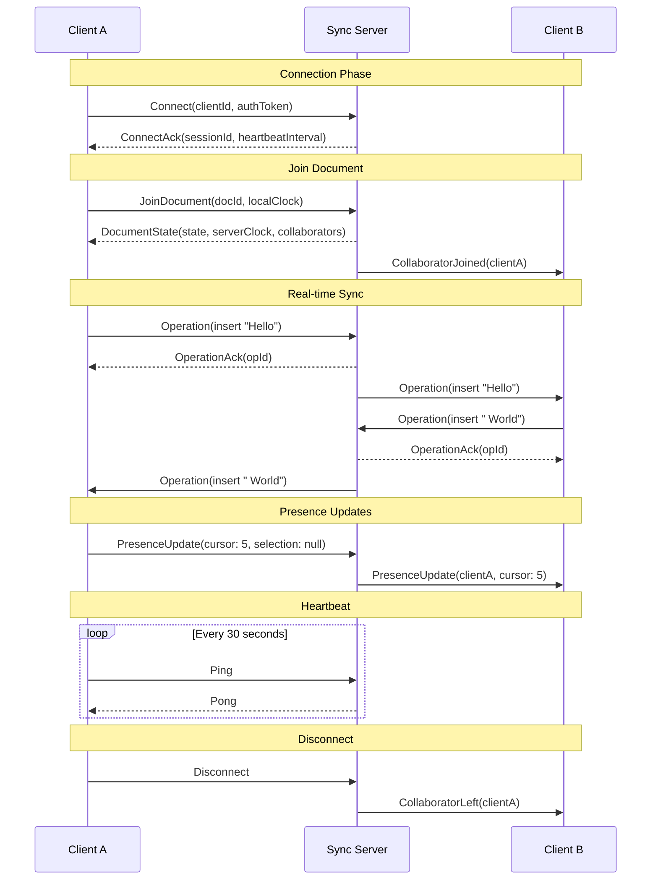
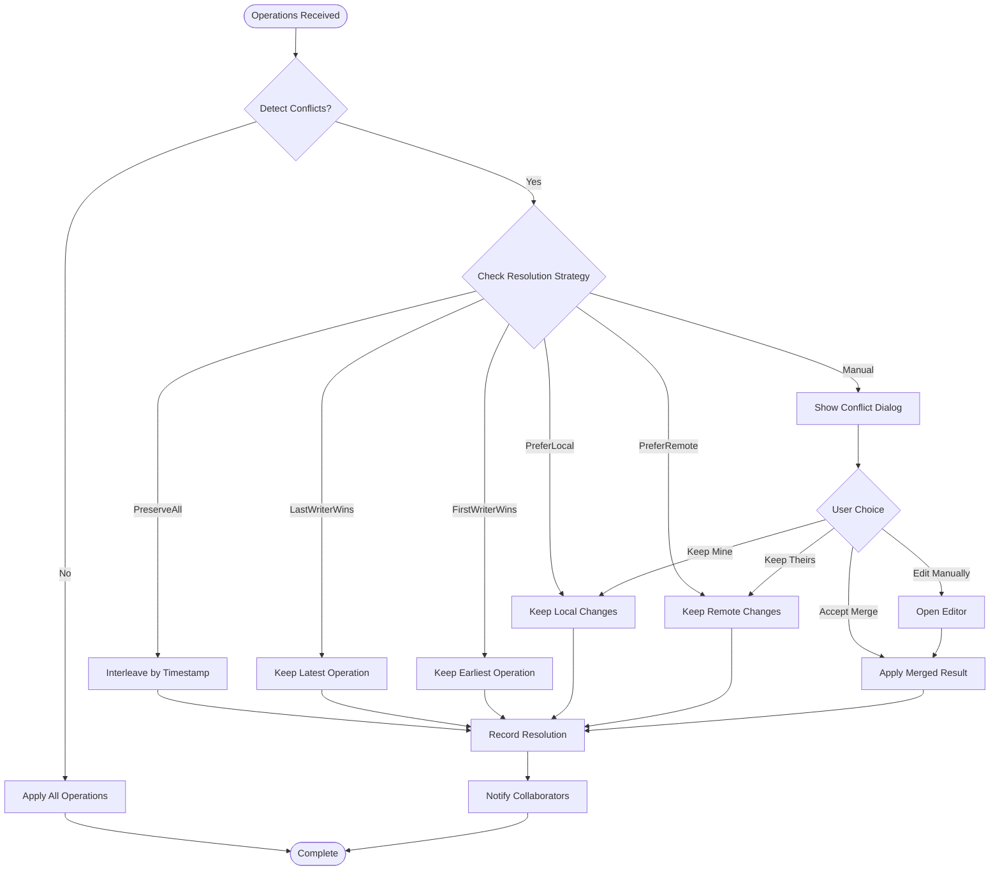
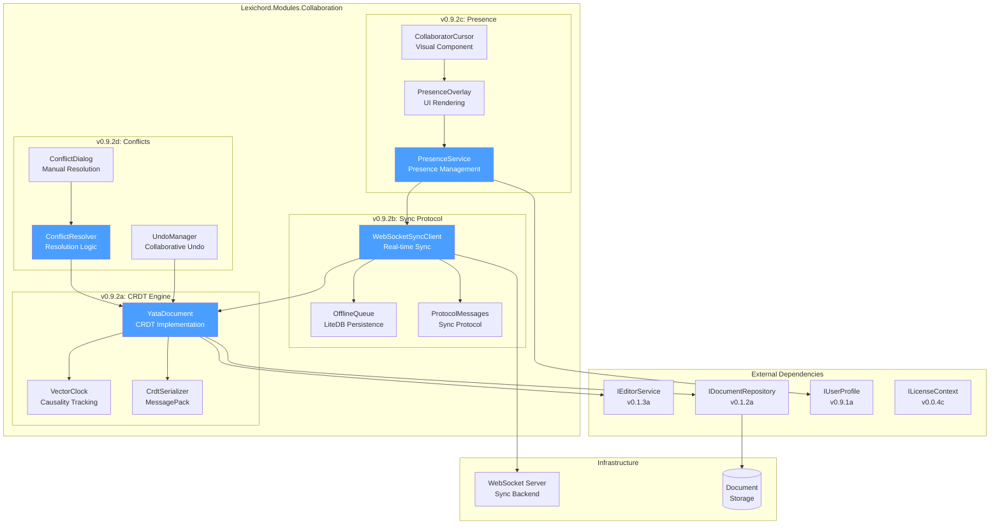
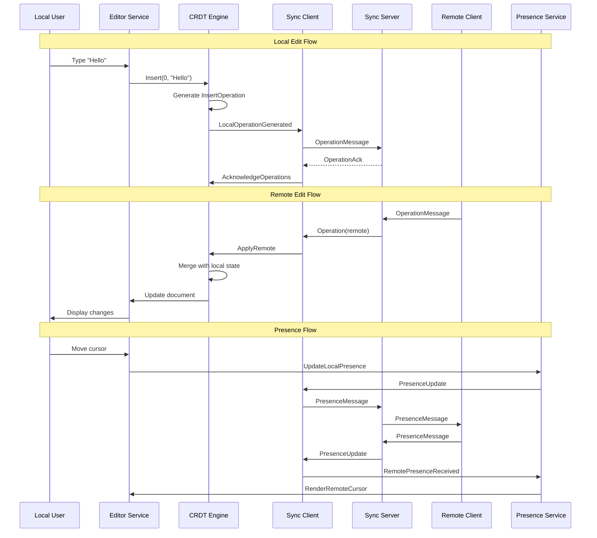

# LCS-SBD-092: Scope Breakdown — Real-Time Sync

## Document Control

| Field            | Value                                    |
| :--------------- | :--------------------------------------- |
| **Document ID**  | LCS-SBD-092                              |
| **Version**      | v0.9.2                                   |
| **Codename**     | Real-Time Sync (The Live Orchestra)      |
| **Status**       | Draft                                    |
| **Last Updated** | 2026-01-27                               |
| **Owner**        | Lead Architect                           |
| **Depends On**   | v0.0.7a (IMediator), v0.1.3a (IEditorService), v0.8.x (Publisher), v0.9.1 (User Profiles) |

---

## 1. Executive Summary

### 1.1 The Vision

**v0.9.2** delivers **Real-Time Sync** — The Live Orchestra. This release transforms Lexichord from a single-user writing application into a collaborative editing platform where multiple users can simultaneously edit the same document without conflicts. Like musicians in an orchestra playing together in perfect harmony, writers can now collaborate in real-time, seeing each other's changes as they happen.

This release implements Google Docs-style real-time synchronization using Conflict-free Replicated Data Types (CRDTs), enabling seamless collaborative editing with automatic conflict resolution. Users will see who is editing what, with live presence indicators showing cursors and selections from all connected collaborators.

### 1.2 Business Value

- **Collaboration:** Enable teams to work together on documents simultaneously, eliminating version conflicts and merge headaches.
- **Productivity:** Real-time visibility into team member activity reduces duplicate work and improves coordination.
- **User Experience:** Instant synchronization provides a seamless, responsive editing experience comparable to industry-leading tools.
- **Enterprise Ready:** Teams and Enterprise customers require collaborative features for professional workflows.
- **Competitive Parity:** Real-time collaboration is a table-stakes feature for modern writing applications.
- **Foundation:** Establishes the synchronization infrastructure for future collaborative features (comments, suggestions, co-pilot sharing).

### 1.3 Success Criteria

This release succeeds when:

1. Two or more users can simultaneously edit the same document with changes appearing within 100ms.
2. The CRDT engine correctly merges concurrent edits without data loss or corruption.
3. Users can see other collaborators' cursors and selections in real-time.
4. The sync protocol gracefully handles network disconnection and reconnection.
5. All UI respects license gating (Teams+ for Real-Time Sync).

### 1.4 License Gating

Real-Time Sync is a **Teams** feature. Lower tiers will see:

- Read-only access to shared documents (no edit capability)
- "Upgrade to Teams" prompt when attempting to enable collaboration
- Collaboration buttons disabled with upgrade tooltip
- Single-user mode remains fully functional for all tiers

---

## 2. Dependencies on Prior Versions

| Component                | Source Version | Usage in v0.9.2                          |
| :----------------------- | :------------- | :--------------------------------------- |
| `IMediator`              | v0.0.7a        | Publish sync events across modules       |
| `IEditorService`         | v0.1.3a        | Apply remote operations to editor        |
| `IDocumentRepository`    | v0.1.2a        | Persist CRDT state                       |
| `IUserProfile`           | v0.9.1a        | Identify collaborators                   |
| `ISecureVault`           | v0.0.6a        | Store authentication tokens              |
| `ILicenseContext`        | v0.0.4c        | Gate collaborative features              |
| `ISettingsService`       | v0.1.6a        | Store sync preferences                   |
| `System.Reactive`        | v0.2.3a        | Observable streams for sync events       |
| `Polly`                  | v0.0.5d        | Retry policies for network operations    |
| `WebSocket`              | .NET 9.0       | Real-time communication protocol         |

---

## 3. Sub-Part Specifications

### 3.1 v0.9.2a: CRDT Engine

| Field            | Value                                     |
| :--------------- | :---------------------------------------- |
| **Sub-Part ID**  | COL-092a                                  |
| **Title**        | CRDT Engine (Conflict-free Replicated Data Types) |
| **Module**       | `Lexichord.Modules.Collaboration`         |
| **License Tier** | Teams                                     |

**Goal:** Implement a CRDT-based document model that enables conflict-free concurrent editing across multiple clients.

**Key Deliverables:**

- `ICrdtEngine` interface for CRDT operations
- `YataDocument` implementation using YATA (Yet Another Transformation Approach) algorithm
- `CrdtOperation` record for representing document changes
- `VectorClock` for causality tracking
- `ICrdtSerializer` for efficient binary serialization
- Operation transformation and merge logic
- Local-first architecture with offline support
- Unit tests for concurrent editing scenarios

**Key Interfaces:**

```csharp
namespace Lexichord.Abstractions.Collaboration;

/// <summary>
/// Represents a unique identifier for a CRDT item.
/// </summary>
public readonly record struct CrdtId(Guid ClientId, long Sequence)
{
    public static CrdtId Create(Guid clientId, long sequence) => new(clientId, sequence);
}

/// <summary>
/// Vector clock for tracking causality across distributed clients.
/// </summary>
public sealed class VectorClock
{
    private readonly Dictionary<Guid, long> _clocks = new();

    public long this[Guid clientId]
    {
        get => _clocks.TryGetValue(clientId, out var seq) ? seq : 0;
        set => _clocks[clientId] = value;
    }

    public VectorClock Increment(Guid clientId)
    {
        var clone = Clone();
        clone[clientId] = clone[clientId] + 1;
        return clone;
    }

    public VectorClock Merge(VectorClock other)
    {
        var result = Clone();
        foreach (var (clientId, seq) in other._clocks)
        {
            result[clientId] = Math.Max(result[clientId], seq);
        }
        return result;
    }

    public bool IsConcurrentWith(VectorClock other) =>
        !HappensBefore(other) && !other.HappensBefore(this);

    public bool HappensBefore(VectorClock other) =>
        _clocks.All(kv => kv.Value <= other[kv.Key]) &&
        _clocks.Any(kv => kv.Value < other[kv.Key]);

    public VectorClock Clone() => new() { _clocks = new(_clocks) };
}

/// <summary>
/// Represents a single CRDT operation.
/// </summary>
public abstract record CrdtOperation(
    CrdtId Id,
    CrdtId? ParentId,
    VectorClock Clock,
    Guid OriginClientId,
    DateTime Timestamp);

/// <summary>
/// Insert operation for text content.
/// </summary>
public sealed record InsertOperation(
    CrdtId Id,
    CrdtId? ParentId,
    VectorClock Clock,
    Guid OriginClientId,
    DateTime Timestamp,
    string Content,
    int Position,
    TextAttributes? Attributes = null) : CrdtOperation(Id, ParentId, Clock, OriginClientId, Timestamp);

/// <summary>
/// Delete operation for text content.
/// </summary>
public sealed record DeleteOperation(
    CrdtId Id,
    CrdtId? ParentId,
    VectorClock Clock,
    Guid OriginClientId,
    DateTime Timestamp,
    CrdtId TargetId,
    int Length) : CrdtOperation(Id, ParentId, Clock, OriginClientId, Timestamp);

/// <summary>
/// Format operation for text attributes.
/// </summary>
public sealed record FormatOperation(
    CrdtId Id,
    CrdtId? ParentId,
    VectorClock Clock,
    Guid OriginClientId,
    DateTime Timestamp,
    int Start,
    int End,
    TextAttributes Attributes) : CrdtOperation(Id, ParentId, Clock, OriginClientId, Timestamp);

/// <summary>
/// Text formatting attributes.
/// </summary>
public record TextAttributes(
    bool? Bold = null,
    bool? Italic = null,
    bool? Underline = null,
    bool? Strikethrough = null,
    string? FontFamily = null,
    double? FontSize = null,
    string? Color = null,
    string? BackgroundColor = null);

/// <summary>
/// Core interface for CRDT document operations.
/// </summary>
public interface ICrdtEngine
{
    /// <summary>
    /// Gets the current document state as plain text.
    /// </summary>
    string GetText();

    /// <summary>
    /// Gets the current document state with formatting.
    /// </summary>
    RichTextDocument GetDocument();

    /// <summary>
    /// Applies a local insert operation.
    /// </summary>
    InsertOperation Insert(int position, string content, TextAttributes? attributes = null);

    /// <summary>
    /// Applies a local delete operation.
    /// </summary>
    DeleteOperation Delete(int position, int length);

    /// <summary>
    /// Applies a local format operation.
    /// </summary>
    FormatOperation Format(int start, int end, TextAttributes attributes);

    /// <summary>
    /// Applies a remote operation received from another client.
    /// </summary>
    void ApplyRemote(CrdtOperation operation);

    /// <summary>
    /// Gets all operations since a given vector clock state.
    /// </summary>
    IReadOnlyList<CrdtOperation> GetOperationsSince(VectorClock since);

    /// <summary>
    /// Gets the current vector clock state.
    /// </summary>
    VectorClock GetClock();

    /// <summary>
    /// Gets pending operations not yet acknowledged by server.
    /// </summary>
    IReadOnlyList<CrdtOperation> GetPendingOperations();

    /// <summary>
    /// Marks operations as acknowledged by server.
    /// </summary>
    void AcknowledgeOperations(IEnumerable<CrdtId> operationIds);

    /// <summary>
    /// Event raised when local operations are generated.
    /// </summary>
    event EventHandler<CrdtOperationEventArgs> LocalOperationGenerated;

    /// <summary>
    /// Event raised when remote operations are applied.
    /// </summary>
    event EventHandler<CrdtOperationEventArgs> RemoteOperationApplied;
}

/// <summary>
/// Event args for CRDT operations.
/// </summary>
public sealed class CrdtOperationEventArgs : EventArgs
{
    public required CrdtOperation Operation { get; init; }
    public required bool IsLocal { get; init; }
}

/// <summary>
/// Serializer for CRDT operations and state.
/// </summary>
public interface ICrdtSerializer
{
    byte[] SerializeOperation(CrdtOperation operation);
    CrdtOperation DeserializeOperation(byte[] data);
    byte[] SerializeState(ICrdtEngine engine);
    void DeserializeState(ICrdtEngine engine, byte[] data);
}
```

**CRDT Document Structure:**

```text
YATA Document Model:
┌─────────────────────────────────────────────────────────────┐
│ Document                                                     │
│ ┌─────────────────────────────────────────────────────────┐ │
│ │ Item List (Doubly Linked)                               │ │
│ │ ┌──────┐   ┌──────┐   ┌──────┐   ┌──────┐   ┌──────┐  │ │
│ │ │ Item │◄─►│ Item │◄─►│ Item │◄─►│ Item │◄─►│ Item │  │ │
│ │ │ ID:1 │   │ ID:2 │   │ ID:3 │   │ ID:4 │   │ ID:5 │  │ │
│ │ │ "H"  │   │ "e"  │   │ "l"  │   │ "l"  │   │ "o"  │  │ │
│ │ └──────┘   └──────┘   └──────┘   └──────┘   └──────┘  │ │
│ └─────────────────────────────────────────────────────────┘ │
│                                                             │
│ Vector Clock: { ClientA: 5, ClientB: 3, ClientC: 2 }       │
│ Pending Ops: [ Op6, Op7 ]                                  │
└─────────────────────────────────────────────────────────────┘

Item Structure:
┌─────────────────────┐
│ CrdtItem            │
├─────────────────────┤
│ Id: CrdtId          │
│ OriginLeft: CrdtId? │
│ OriginRight: CrdtId?│
│ Content: string     │
│ Deleted: bool       │
│ Attributes: TextAttr│
│ Left: CrdtItem?     │
│ Right: CrdtItem?    │
└─────────────────────┘
```

**Dependencies:**

- v0.1.3a: `IEditorService` (apply operations to editor)
- v0.1.2a: `IDocumentRepository` (persist CRDT state)

---

### 3.2 v0.9.2b: Sync Protocol

| Field            | Value                                     |
| :--------------- | :---------------------------------------- |
| **Sub-Part ID**  | COL-092b                                  |
| **Title**        | Sync Protocol (WebSocket-based)           |
| **Module**       | `Lexichord.Modules.Collaboration`         |
| **License Tier** | Teams                                     |

**Goal:** Implement a reliable WebSocket-based synchronization protocol that efficiently transmits CRDT operations between clients with support for offline operation and reconnection.

**Key Deliverables:**

- `ISyncClient` interface for sync operations
- `WebSocketSyncClient` implementation
- `SyncMessage` protocol definitions
- Connection management with automatic reconnection
- Operation batching and compression
- Offline queue with persistence
- Server acknowledgment handling
- Unit tests for network scenarios

**Key Interfaces:**

```csharp
namespace Lexichord.Abstractions.Collaboration;

/// <summary>
/// Sync connection state.
/// </summary>
public enum SyncConnectionState
{
    Disconnected,
    Connecting,
    Connected,
    Reconnecting,
    Error
}

/// <summary>
/// Sync message types for the protocol.
/// </summary>
public enum SyncMessageType
{
    // Connection
    Connect,
    ConnectAck,
    Disconnect,
    Ping,
    Pong,

    // Document
    JoinDocument,
    LeaveDocument,
    DocumentState,

    // Operations
    Operation,
    OperationBatch,
    OperationAck,

    // Presence
    PresenceUpdate,
    PresenceQuery,

    // Awareness
    AwarenessUpdate,
    AwarenessQuery,

    // Error
    Error
}

/// <summary>
/// Base sync message.
/// </summary>
public abstract record SyncMessage(
    SyncMessageType Type,
    Guid MessageId,
    DateTime Timestamp);

/// <summary>
/// Connection request message.
/// </summary>
public sealed record ConnectMessage(
    Guid MessageId,
    DateTime Timestamp,
    Guid ClientId,
    string AuthToken,
    string ClientVersion) : SyncMessage(SyncMessageType.Connect, MessageId, Timestamp);

/// <summary>
/// Connection acknowledgment message.
/// </summary>
public sealed record ConnectAckMessage(
    Guid MessageId,
    DateTime Timestamp,
    bool Success,
    string? Error,
    Guid SessionId,
    TimeSpan HeartbeatInterval) : SyncMessage(SyncMessageType.ConnectAck, MessageId, Timestamp);

/// <summary>
/// Join document request.
/// </summary>
public sealed record JoinDocumentMessage(
    Guid MessageId,
    DateTime Timestamp,
    Guid DocumentId,
    VectorClock ClientClock) : SyncMessage(SyncMessageType.JoinDocument, MessageId, Timestamp);

/// <summary>
/// Document state response with full or delta state.
/// </summary>
public sealed record DocumentStateMessage(
    Guid MessageId,
    DateTime Timestamp,
    Guid DocumentId,
    byte[] State,
    VectorClock ServerClock,
    IReadOnlyList<CollaboratorInfo> Collaborators) : SyncMessage(SyncMessageType.DocumentState, MessageId, Timestamp);

/// <summary>
/// Single operation message.
/// </summary>
public sealed record OperationMessage(
    Guid MessageId,
    DateTime Timestamp,
    Guid DocumentId,
    byte[] OperationData) : SyncMessage(SyncMessageType.Operation, MessageId, Timestamp);

/// <summary>
/// Batched operations for efficiency.
/// </summary>
public sealed record OperationBatchMessage(
    Guid MessageId,
    DateTime Timestamp,
    Guid DocumentId,
    IReadOnlyList<byte[]> Operations,
    bool Compressed) : SyncMessage(SyncMessageType.OperationBatch, MessageId, Timestamp);

/// <summary>
/// Operation acknowledgment from server.
/// </summary>
public sealed record OperationAckMessage(
    Guid MessageId,
    DateTime Timestamp,
    Guid DocumentId,
    IReadOnlyList<CrdtId> AcknowledgedIds,
    VectorClock ServerClock) : SyncMessage(SyncMessageType.OperationAck, MessageId, Timestamp);

/// <summary>
/// Collaborator information.
/// </summary>
public record CollaboratorInfo(
    Guid UserId,
    string DisplayName,
    string? AvatarUrl,
    DateTime JoinedAt,
    bool IsOnline);

/// <summary>
/// Sync client for real-time document synchronization.
/// </summary>
public interface ISyncClient : IAsyncDisposable
{
    /// <summary>
    /// Current connection state.
    /// </summary>
    SyncConnectionState ConnectionState { get; }

    /// <summary>
    /// Current client ID.
    /// </summary>
    Guid ClientId { get; }

    /// <summary>
    /// Connect to the sync server.
    /// </summary>
    Task<bool> ConnectAsync(string serverUrl, string authToken, CancellationToken ct = default);

    /// <summary>
    /// Disconnect from the sync server.
    /// </summary>
    Task DisconnectAsync(CancellationToken ct = default);

    /// <summary>
    /// Join a document collaboration session.
    /// </summary>
    Task<DocumentStateMessage> JoinDocumentAsync(Guid documentId, VectorClock localClock, CancellationToken ct = default);

    /// <summary>
    /// Leave a document collaboration session.
    /// </summary>
    Task LeaveDocumentAsync(Guid documentId, CancellationToken ct = default);

    /// <summary>
    /// Send a CRDT operation to the server.
    /// </summary>
    Task SendOperationAsync(Guid documentId, CrdtOperation operation, CancellationToken ct = default);

    /// <summary>
    /// Send a batch of CRDT operations.
    /// </summary>
    Task SendOperationBatchAsync(Guid documentId, IEnumerable<CrdtOperation> operations, CancellationToken ct = default);

    /// <summary>
    /// Update presence information.
    /// </summary>
    Task UpdatePresenceAsync(Guid documentId, PresenceInfo presence, CancellationToken ct = default);

    /// <summary>
    /// Event raised when connection state changes.
    /// </summary>
    event EventHandler<ConnectionStateChangedEventArgs> ConnectionStateChanged;

    /// <summary>
    /// Event raised when a remote operation is received.
    /// </summary>
    event EventHandler<RemoteOperationEventArgs> RemoteOperationReceived;

    /// <summary>
    /// Event raised when operations are acknowledged.
    /// </summary>
    event EventHandler<OperationAckEventArgs> OperationsAcknowledged;

    /// <summary>
    /// Event raised when presence updates are received.
    /// </summary>
    event EventHandler<PresenceUpdateEventArgs> PresenceUpdated;

    /// <summary>
    /// Event raised when a collaborator joins/leaves.
    /// </summary>
    event EventHandler<CollaboratorEventArgs> CollaboratorChanged;
}

/// <summary>
/// Event args for connection state changes.
/// </summary>
public sealed class ConnectionStateChangedEventArgs : EventArgs
{
    public required SyncConnectionState OldState { get; init; }
    public required SyncConnectionState NewState { get; init; }
    public string? Error { get; init; }
}

/// <summary>
/// Event args for remote operations.
/// </summary>
public sealed class RemoteOperationEventArgs : EventArgs
{
    public required Guid DocumentId { get; init; }
    public required CrdtOperation Operation { get; init; }
    public required Guid OriginClientId { get; init; }
}

/// <summary>
/// Event args for operation acknowledgments.
/// </summary>
public sealed class OperationAckEventArgs : EventArgs
{
    public required Guid DocumentId { get; init; }
    public required IReadOnlyList<CrdtId> AcknowledgedIds { get; init; }
}

/// <summary>
/// Offline operation queue for persistence.
/// </summary>
public interface IOfflineQueue
{
    Task EnqueueAsync(Guid documentId, CrdtOperation operation, CancellationToken ct = default);
    Task<IReadOnlyList<CrdtOperation>> GetPendingAsync(Guid documentId, CancellationToken ct = default);
    Task MarkSentAsync(IEnumerable<CrdtId> operationIds, CancellationToken ct = default);
    Task MarkAcknowledgedAsync(IEnumerable<CrdtId> operationIds, CancellationToken ct = default);
    Task ClearAcknowledgedAsync(CancellationToken ct = default);
}
```

**Sync Protocol Flow:**



**Dependencies:**

- v0.9.2a: `ICrdtEngine` (CRDT operations)
- v0.0.5d: `Polly` (retry policies)
- v0.0.6a: `ISecureVault` (auth tokens)

---

### 3.3 v0.9.2c: Presence Indicators

| Field            | Value                                     |
| :--------------- | :---------------------------------------- |
| **Sub-Part ID**  | COL-092c                                  |
| **Title**        | Presence Indicators (Cursors, Selections) |
| **Module**       | `Lexichord.Modules.Collaboration`         |
| **License Tier** | Teams                                     |

**Goal:** Display real-time presence indicators showing collaborators' cursor positions and text selections within the document editor.

**Key Deliverables:**

- `IPresenceService` interface for presence management
- `PresenceOverlayView` for rendering remote cursors
- `CollaboratorCursor` visual component
- `SelectionHighlight` for remote selections
- Color assignment algorithm for collaborators
- Presence throttling to reduce network traffic
- Avatar display in cursor labels
- Unit tests for presence rendering

**Key Interfaces:**

```csharp
namespace Lexichord.Abstractions.Collaboration;

/// <summary>
/// Presence information for a collaborator.
/// </summary>
public record PresenceInfo(
    Guid UserId,
    Guid DocumentId,
    int? CursorPosition,
    SelectionRange? Selection,
    DateTime LastUpdate,
    PresenceState State);

/// <summary>
/// Selection range in the document.
/// </summary>
public record SelectionRange(int Start, int End)
{
    public int Length => End - Start;
    public bool IsEmpty => Start == End;
    public bool Contains(int position) => position >= Start && position < End;
}

/// <summary>
/// Presence state.
/// </summary>
public enum PresenceState
{
    Active,
    Idle,
    Away,
    Offline
}

/// <summary>
/// Visual representation of a remote collaborator.
/// </summary>
public record CollaboratorPresence(
    Guid UserId,
    string DisplayName,
    string? AvatarUrl,
    string AssignedColor,
    PresenceInfo Presence);

/// <summary>
/// Service for managing presence information.
/// </summary>
public interface IPresenceService
{
    /// <summary>
    /// Gets all collaborators' presence for a document.
    /// </summary>
    IObservable<IReadOnlyList<CollaboratorPresence>> ObservePresence(Guid documentId);

    /// <summary>
    /// Updates the local user's presence.
    /// </summary>
    Task UpdateLocalPresenceAsync(
        Guid documentId,
        int? cursorPosition,
        SelectionRange? selection,
        CancellationToken ct = default);

    /// <summary>
    /// Sets the local user's presence state.
    /// </summary>
    Task SetPresenceStateAsync(Guid documentId, PresenceState state, CancellationToken ct = default);

    /// <summary>
    /// Gets the assigned color for a user.
    /// </summary>
    string GetUserColor(Guid userId);

    /// <summary>
    /// Event raised when a collaborator's presence changes.
    /// </summary>
    event EventHandler<PresenceChangedEventArgs> PresenceChanged;
}

/// <summary>
/// Event args for presence changes.
/// </summary>
public sealed class PresenceChangedEventArgs : EventArgs
{
    public required Guid DocumentId { get; init; }
    public required CollaboratorPresence Collaborator { get; init; }
    public required PresenceChangeType ChangeType { get; init; }
}

/// <summary>
/// Type of presence change.
/// </summary>
public enum PresenceChangeType
{
    Joined,
    Updated,
    Left
}

/// <summary>
/// Color palette for collaborator indicators.
/// </summary>
public static class CollaboratorColors
{
    public static readonly IReadOnlyList<string> Palette = new[]
    {
        "#E91E63", // Pink
        "#9C27B0", // Purple
        "#673AB7", // Deep Purple
        "#3F51B5", // Indigo
        "#2196F3", // Blue
        "#00BCD4", // Cyan
        "#009688", // Teal
        "#4CAF50", // Green
        "#8BC34A", // Light Green
        "#FF9800", // Orange
        "#FF5722", // Deep Orange
        "#795548", // Brown
    };

    public static string GetColor(Guid userId)
    {
        var hash = userId.GetHashCode();
        var index = Math.Abs(hash) % Palette.Count;
        return Palette[index];
    }
}
```

**Key UI Components:**

```text
Editor with Presence Indicators:
┌─────────────────────────────────────────────────────────────────────┐
│ Document Title                                          [Share] [?] │
├─────────────────────────────────────────────────────────────────────┤
│ ┌─────────────────────────────────────────────────────────────────┐ │
│ │ The quick brown fox jumps over the lazy dog.                    │ │
│ │                    ▲                                            │ │
│ │                    │ ┌────────────┐                             │ │
│ │                    └─│ Alice (🟣) │                             │ │
│ │                      └────────────┘                             │ │
│ │                                                                  │ │
│ │ This is a sample paragraph that shows how real-time             │ │
│ │ collaboration works in Lexichord. Multiple users can            │ │
│ │ edit ██████████████ simultaneously without conflicts.           │ │
│ │      └────────────┘                                             │ │
│ │      Bob's Selection (🔵)                                        │ │
│ │                                                                  │ │
│ │ Each collaborator has a unique color for their cursor and       │ │
│ │ selection highlight, making it easy to identify who│             │ │
│ │ is editing what.                                   ▲             │ │
│ │                                                    │             │ │
│ │                                              ┌─────┴─────┐       │ │
│ │                                              │ Carol (🟢) │       │ │
│ │                                              └───────────┘       │ │
│ └─────────────────────────────────────────────────────────────────┘ │
├─────────────────────────────────────────────────────────────────────┤
│ Collaborators: [🟣 Alice] [🔵 Bob] [🟢 Carol]       3 online        │
└─────────────────────────────────────────────────────────────────────┘

Cursor Indicator Detail:
┌─────────────────────┐
│ │ ← Cursor line (colored)
│ ├──────────────┐
│ │ 🟣 Alice     │ ← Label with avatar and name
│ └──────────────┘
└─────────────────────┘

Selection Highlight:
┌─────────────────────────────────────┐
│ The ████████████ fox jumps over    │ ← Semi-transparent colored overlay
│     └──────────┘                    │
│     Selected text (background color │
│     matches collaborator's color)   │
└─────────────────────────────────────┘
```

**Dependencies:**

- v0.9.2b: `ISyncClient` (presence updates)
- v0.1.3a: `IEditorService` (cursor position)
- v0.9.1a: `IUserProfile` (collaborator info)

---

### 3.4 v0.9.2d: Conflict Resolution

| Field            | Value                                     |
| :--------------- | :---------------------------------------- |
| **Sub-Part ID**  | COL-092d                                  |
| **Title**        | Conflict Resolution (Merge Strategies)    |
| **Module**       | `Lexichord.Modules.Collaboration`         |
| **License Tier** | Teams                                     |

**Goal:** Implement intelligent conflict resolution strategies for edge cases where CRDT semantics alone may produce unexpected results, providing users with control over merge behavior.

**Key Deliverables:**

- `IConflictResolver` interface for conflict handling
- `ConflictResolutionStrategy` enum and implementations
- `ConflictNotification` user alerts
- `MergePreview` dialog for manual resolution
- Undo/redo integration with collaborative edits
- History tracking for conflict audit
- Conflict metrics and logging
- Unit tests for conflict scenarios

**Key Interfaces:**

```csharp
namespace Lexichord.Abstractions.Collaboration;

/// <summary>
/// Types of conflicts that can occur during collaboration.
/// </summary>
public enum ConflictType
{
    /// <summary>
    /// Two users edited the same character range concurrently.
    /// </summary>
    ConcurrentEdit,

    /// <summary>
    /// One user deleted text while another was editing it.
    /// </summary>
    DeleteEditConflict,

    /// <summary>
    /// Two users applied conflicting formatting to the same range.
    /// </summary>
    FormattingConflict,

    /// <summary>
    /// Document structure conflict (e.g., section moves).
    /// </summary>
    StructuralConflict,

    /// <summary>
    /// Offline changes conflict with server state.
    /// </summary>
    OfflineConflict
}

/// <summary>
/// Resolution strategy for conflicts.
/// </summary>
public enum ConflictResolutionStrategy
{
    /// <summary>
    /// CRDT default: all changes preserved, interleaved by timestamp.
    /// </summary>
    PreserveAll,

    /// <summary>
    /// Last writer wins based on timestamp.
    /// </summary>
    LastWriterWins,

    /// <summary>
    /// First writer wins based on timestamp.
    /// </summary>
    FirstWriterWins,

    /// <summary>
    /// Prompt user to manually resolve.
    /// </summary>
    Manual,

    /// <summary>
    /// Prefer local changes over remote.
    /// </summary>
    PreferLocal,

    /// <summary>
    /// Prefer remote changes over local.
    /// </summary>
    PreferRemote
}

/// <summary>
/// Represents a detected conflict.
/// </summary>
public record Conflict(
    Guid ConflictId,
    Guid DocumentId,
    ConflictType Type,
    IReadOnlyList<CrdtOperation> ConflictingOperations,
    string Description,
    DateTime DetectedAt);

/// <summary>
/// Result of conflict resolution.
/// </summary>
public record ConflictResolution(
    Guid ConflictId,
    ConflictResolutionStrategy Strategy,
    IReadOnlyList<CrdtOperation>? ResultingOperations,
    bool WasManual,
    DateTime ResolvedAt,
    Guid? ResolvedByUserId);

/// <summary>
/// Service for conflict detection and resolution.
/// </summary>
public interface IConflictResolver
{
    /// <summary>
    /// Gets the default resolution strategy.
    /// </summary>
    ConflictResolutionStrategy DefaultStrategy { get; }

    /// <summary>
    /// Detects conflicts between operations.
    /// </summary>
    IReadOnlyList<Conflict> DetectConflicts(
        IEnumerable<CrdtOperation> localOps,
        IEnumerable<CrdtOperation> remoteOps);

    /// <summary>
    /// Resolves a conflict using the specified strategy.
    /// </summary>
    Task<ConflictResolution> ResolveAsync(
        Conflict conflict,
        ConflictResolutionStrategy strategy,
        CancellationToken ct = default);

    /// <summary>
    /// Resolves a conflict manually with user-provided operations.
    /// </summary>
    Task<ConflictResolution> ResolveManuallyAsync(
        Conflict conflict,
        IEnumerable<CrdtOperation> resolvedOperations,
        CancellationToken ct = default);

    /// <summary>
    /// Gets conflict history for a document.
    /// </summary>
    Task<IReadOnlyList<ConflictResolution>> GetConflictHistoryAsync(
        Guid documentId,
        CancellationToken ct = default);

    /// <summary>
    /// Event raised when a conflict is detected.
    /// </summary>
    event EventHandler<ConflictDetectedEventArgs> ConflictDetected;

    /// <summary>
    /// Event raised when a conflict is resolved.
    /// </summary>
    event EventHandler<ConflictResolvedEventArgs> ConflictResolved;
}

/// <summary>
/// Event args for conflict detection.
/// </summary>
public sealed class ConflictDetectedEventArgs : EventArgs
{
    public required Conflict Conflict { get; init; }
    public required bool RequiresManualResolution { get; init; }
}

/// <summary>
/// Event args for conflict resolution.
/// </summary>
public sealed class ConflictResolvedEventArgs : EventArgs
{
    public required ConflictResolution Resolution { get; init; }
}

/// <summary>
/// Collaborative undo/redo manager.
/// </summary>
public interface ICollaborativeUndoManager
{
    /// <summary>
    /// Records an operation for undo.
    /// </summary>
    void RecordOperation(CrdtOperation operation, bool isLocal);

    /// <summary>
    /// Checks if undo is available for local user.
    /// </summary>
    bool CanUndo { get; }

    /// <summary>
    /// Checks if redo is available for local user.
    /// </summary>
    bool CanRedo { get; }

    /// <summary>
    /// Undoes the last local operation.
    /// </summary>
    Task<CrdtOperation?> UndoAsync(CancellationToken ct = default);

    /// <summary>
    /// Redoes the last undone local operation.
    /// </summary>
    Task<CrdtOperation?> RedoAsync(CancellationToken ct = default);

    /// <summary>
    /// Gets the undo stack for the local user.
    /// </summary>
    IReadOnlyList<CrdtOperation> UndoStack { get; }

    /// <summary>
    /// Gets the redo stack for the local user.
    /// </summary>
    IReadOnlyList<CrdtOperation> RedoStack { get; }
}
```

**Conflict Resolution Flow:**



**Conflict Resolution Dialog:**

```text
┌─────────────────────────────────────────────────────────────────────┐
│ ⚠️ Editing Conflict Detected                                   [X] │
├─────────────────────────────────────────────────────────────────────┤
│                                                                     │
│ You and Alice both edited the same section simultaneously.         │
│                                                                     │
│ ┌─────────────────────────────┐ ┌─────────────────────────────┐    │
│ │ Your Version               │ │ Alice's Version              │    │
│ ├─────────────────────────────┤ ├─────────────────────────────┤    │
│ │ The quick BROWN fox        │ │ The quick RED fox           │    │
│ │ jumps over the lazy dog.   │ │ jumps over the lazy dog.    │    │
│ │                            │ │                              │    │
│ └─────────────────────────────┘ └─────────────────────────────┘    │
│                                                                     │
│ ┌─────────────────────────────────────────────────────────────┐    │
│ │ Merged Result (Preview)                                      │    │
│ ├─────────────────────────────────────────────────────────────┤    │
│ │ The quick BROWNRED fox jumps over the lazy dog.             │    │
│ │           └──────┘                                          │    │
│ │           Interleaved changes                               │    │
│ └─────────────────────────────────────────────────────────────┘    │
│                                                                     │
│ Resolution Strategy:                                                │
│ ○ Accept merge (both changes preserved)                            │
│ ○ Keep my version                                                  │
│ ○ Keep Alice's version                                             │
│ ○ Edit manually                                                    │
│                                                                     │
│ ☑ Remember my choice for this document                             │
│                                                                     │
│                          [Cancel]  [Apply Resolution]              │
└─────────────────────────────────────────────────────────────────────┘
```

**Dependencies:**

- v0.9.2a: `ICrdtEngine` (operation handling)
- v0.9.2b: `ISyncClient` (sync coordination)
- v0.0.7a: `IMediator` (event publishing)

---

## 4. Implementation Checklist

| #  | Sub-Part | Task                                                      | Est. Hours |
| :- | :------- | :-------------------------------------------------------- | :--------- |
| 1  | v0.9.2a  | Design CRDT item structure and linked list                | 4          |
| 2  | v0.9.2a  | Implement `VectorClock` with merge and comparison         | 2          |
| 3  | v0.9.2a  | Implement `CrdtItem` and item integration                 | 4          |
| 4  | v0.9.2a  | Implement `YataDocument` with insert/delete operations    | 8          |
| 5  | v0.9.2a  | Implement `ICrdtSerializer` binary format                 | 3          |
| 6  | v0.9.2a  | Unit tests for concurrent editing scenarios               | 4          |
| 7  | v0.9.2a  | Integration tests with IEditorService                     | 2          |
| 8  | v0.9.2b  | Define sync protocol message types                        | 2          |
| 9  | v0.9.2b  | Implement `WebSocketSyncClient`                           | 6          |
| 10 | v0.9.2b  | Implement connection management and reconnection          | 4          |
| 11 | v0.9.2b  | Implement operation batching and compression              | 3          |
| 12 | v0.9.2b  | Implement `IOfflineQueue` with persistence                | 3          |
| 13 | v0.9.2b  | Unit tests for network scenarios                          | 3          |
| 14 | v0.9.2b  | Integration tests with CRDT engine                        | 2          |
| 15 | v0.9.2c  | Design presence indicator UI components                   | 2          |
| 16 | v0.9.2c  | Implement `IPresenceService`                              | 3          |
| 17 | v0.9.2c  | Implement `CollaboratorCursor` visual                     | 3          |
| 18 | v0.9.2c  | Implement `SelectionHighlight` overlay                    | 3          |
| 19 | v0.9.2c  | Implement color assignment algorithm                      | 1          |
| 20 | v0.9.2c  | Implement presence throttling                             | 2          |
| 21 | v0.9.2c  | Unit tests for presence rendering                         | 2          |
| 22 | v0.9.2d  | Define conflict types and detection logic                 | 3          |
| 23 | v0.9.2d  | Implement resolution strategies                           | 4          |
| 24 | v0.9.2d  | Implement conflict notification UI                        | 3          |
| 25 | v0.9.2d  | Implement manual merge dialog                             | 4          |
| 26 | v0.9.2d  | Implement `ICollaborativeUndoManager`                     | 4          |
| 27 | v0.9.2d  | Unit tests for conflict scenarios                         | 3          |
| 28 | All      | Integration tests for full collaboration flow             | 4          |
| 29 | All      | DI registration in CollaborationModule.cs                 | 2          |
| 30 | All      | License gating integration                                | 2          |
| **Total** |   |                                                           | **95 hours** |

---

## 5. Dependency Matrix

### 5.1 Required Interfaces (from earlier versions)

| Interface                | Source Version | Purpose                              |
| :----------------------- | :------------- | :----------------------------------- |
| `IMediator`              | v0.0.7a        | Event publication                    |
| `IEditorService`         | v0.1.3a        | Editor integration                   |
| `IDocumentRepository`    | v0.1.2a        | Document persistence                 |
| `IUserProfile`           | v0.9.1a        | Collaborator identity                |
| `ISecureVault`           | v0.0.6a        | Auth token storage                   |
| `ILicenseContext`        | v0.0.4c        | Feature gating                       |
| `ISettingsService`       | v0.1.6a        | User preferences                     |

### 5.2 New Interfaces (defined in v0.9.2)

| Interface                   | Defined In | Module             | Purpose                 |
| :-------------------------- | :--------- | :----------------- | :---------------------- |
| `ICrdtEngine`               | v0.9.2a    | Abstractions       | CRDT operations         |
| `ICrdtSerializer`           | v0.9.2a    | Abstractions       | Binary serialization    |
| `ISyncClient`               | v0.9.2b    | Abstractions       | Real-time sync          |
| `IOfflineQueue`             | v0.9.2b    | Abstractions       | Offline persistence     |
| `IPresenceService`          | v0.9.2c    | Abstractions       | Presence management     |
| `IConflictResolver`         | v0.9.2d    | Abstractions       | Conflict handling       |
| `ICollaborativeUndoManager` | v0.9.2d    | Abstractions       | Undo/redo support       |

### 5.3 New Records/DTOs (defined in v0.9.2)

| Record                  | Defined In | Purpose                                |
| :---------------------- | :--------- | :------------------------------------- |
| `CrdtId`                | v0.9.2a    | Unique item identifier                 |
| `VectorClock`           | v0.9.2a    | Causality tracking                     |
| `CrdtOperation`         | v0.9.2a    | Base operation record                  |
| `InsertOperation`       | v0.9.2a    | Insert text operation                  |
| `DeleteOperation`       | v0.9.2a    | Delete text operation                  |
| `FormatOperation`       | v0.9.2a    | Format text operation                  |
| `SyncMessage`           | v0.9.2b    | Protocol message base                  |
| `PresenceInfo`          | v0.9.2c    | Presence data                          |
| `CollaboratorPresence`  | v0.9.2c    | Visual presence data                   |
| `Conflict`              | v0.9.2d    | Conflict record                        |
| `ConflictResolution`    | v0.9.2d    | Resolution result                      |

### 5.4 NuGet Packages

| Package                      | Version | Purpose                    | New/Existing |
| :--------------------------- | :------ | :------------------------- | :----------- |
| `System.Net.WebSockets`      | 9.0.x   | WebSocket client           | Existing     |
| `MessagePack`                | 2.x     | Binary serialization       | **New**      |
| `System.Reactive`            | 6.x     | Observable streams         | Existing     |
| `Polly`                      | 8.x     | Retry policies             | Existing     |
| `LiteDB`                     | 5.x     | Offline queue storage      | **New**      |

---

## 6. Architecture Diagram



---

## 7. Data Flow Diagram



---

## 8. Risks & Mitigations

| Risk | Impact | Probability | Mitigation |
| :--- | :----- | :---------- | :--------- |
| Network latency causing perceived lag | High | Medium | Optimistic local updates, operation batching |
| CRDT state divergence after partition | High | Low | Vector clock validation, full state resync option |
| Memory usage with large operation history | Medium | Medium | Garbage collection of acknowledged operations |
| WebSocket connection instability | Medium | Medium | Automatic reconnection with exponential backoff |
| Conflict resolution UX complexity | Medium | Medium | Default to PreserveAll, manual resolution optional |
| Offline queue growing unbounded | Medium | Low | Queue size limits, periodic cleanup |
| Performance with many collaborators | Medium | Low | Presence throttling, operation batching |
| Server scalability bottleneck | High | Medium | Horizontal scaling, room-based sharding |

---

## 9. Success Metrics

| Metric | Target | Measurement |
| :----- | :----- | :---------- |
| Operation sync latency | < 100ms | Round-trip time measurement |
| Time to first render (join) | < 2s | Document state transfer time |
| Offline operation queue | < 1000 ops | Queue size monitoring |
| Reconnection time | < 5s | Time to reconnect and resync |
| Memory usage (10 collaborators) | < 50MB | Memory profiler |
| Conflict auto-resolution rate | > 95% | Conflicts requiring manual resolution |
| Presence update frequency | 30-60ms throttled | Network traffic analysis |

---

## 10. What This Enables

After v0.9.2, Lexichord will support:

- **v0.9.3:** Collaborative comments and suggestions using the sync infrastructure.
- **v0.9.4:** Shared AI co-pilot sessions where multiple users can interact with the same AI context.
- **v0.9.5:** Team workspaces with shared documents and permissions.
- **v1.0:** Production-ready collaborative writing platform.
- **Future:** Real-time collaboration on style guides, terminology databases, and templates.

---

## 11. Decision Trees

### 11.1 Should This Operation Be Synced?

```text
START: "Local operation generated"
│
├── Is sync enabled for this document?
│   ├── NO → Store locally only
│   └── YES → Continue
│
├── Is connection active?
│   ├── NO → Queue in offline store
│   └── YES → Continue
│
├── Is operation a duplicate?
│   ├── YES → Skip (already synced)
│   └── NO → Continue
│
└── Send to server
    ├── Ack received → Mark as synced
    └── Timeout → Add to retry queue
```

### 11.2 How Should This Conflict Be Resolved?

```text
START: "Conflict detected"
│
├── Is user preference set?
│   ├── YES → Use configured strategy
│   └── NO → Check conflict type
│
├── Is it a formatting-only conflict?
│   └── YES → PreserveAll (merge both)
│
├── Is it a delete-edit conflict?
│   └── YES → Prompt user (data loss risk)
│
├── Is it within the same word?
│   └── YES → LastWriterWins (likely typo fix)
│
├── Is manual resolution enabled?
│   └── YES → Show conflict dialog
│
└── DEFAULT → PreserveAll
```

---

## 12. User Stories

| ID    | Role            | Story                                                                                | Acceptance Criteria                    |
| :---- | :-------------- | :----------------------------------------------------------------------------------- | :------------------------------------- |
| US-01 | Writer          | As a writer, I want to collaborate on documents in real-time so that I can work with my team efficiently. | Changes sync within 100ms.             |
| US-02 | Writer          | As a writer, I want to see where my collaborators are editing so that I don't interfere with their work. | Cursors and selections visible.        |
| US-03 | Writer          | As a writer, I want my changes preserved even when offline so that I don't lose work. | Offline changes sync on reconnect.     |
| US-04 | Team Lead       | As a team lead, I want to see who is currently editing a document so that I know team activity. | Collaborator list shows online users.  |
| US-05 | Writer          | As a writer, I want control over conflict resolution so that I can choose the best merge. | Manual resolution option available.    |
| US-06 | Enterprise User | As an enterprise user, I need audit trails of who edited what when for compliance. | Operation history tracked with user.   |

---

## 13. Use Cases

### UC-01: Real-Time Collaborative Editing

**Preconditions:**

- Two or more users have the same document open
- All users have Teams or higher license
- Network connection is available

**Flow:**

1. User A types "Hello" at position 0.
2. CRDT engine generates InsertOperation with vector clock.
3. Sync client sends operation to server.
4. Server broadcasts to all connected clients.
5. User B's client receives operation.
6. User B's CRDT engine merges operation.
7. User B sees "Hello" appear in their editor.
8. Total latency is under 100ms.

**Postconditions:**

- Both users see identical document state.

---

### UC-02: Offline Editing with Reconnection

**Preconditions:**

- User has document open
- Network connection is lost

**Flow:**

1. User continues editing while offline.
2. Operations queue in offline store.
3. Network connection restored.
4. Sync client reconnects to server.
5. Client sends queued operations.
6. Server merges with other changes.
7. Client receives any missed operations.
8. Document state synchronized.

**Postconditions:**

- No edits lost from offline session.

---

### UC-03: Conflict Detection and Resolution

**Preconditions:**

- Two users editing same text range simultaneously
- Operations arrive at server in interleaved order

**Flow:**

1. User A changes "red" to "blue" at position 10.
2. User B changes "red" to "green" at position 10.
3. Operations conflict detected (same range).
4. Default strategy: PreserveAll.
5. Result: "bluegreen" (interleaved by timestamp).
6. If manual resolution enabled, dialog shown.
7. User selects preferred resolution.
8. Final state applied to all clients.

**Postconditions:**

- Conflict resolved consistently across all clients.

---

## 14. Unit Testing Requirements

### 14.1 CRDT Engine Tests

```csharp
[Trait("Category", "Unit")]
[Trait("Version", "v0.9.2a")]
public class CrdtEngineTests
{
    [Fact]
    public void Insert_AtPosition_AddsContent()
    {
        // Arrange
        var sut = new YataDocument(Guid.NewGuid());

        // Act
        sut.Insert(0, "Hello");

        // Assert
        sut.GetText().Should().Be("Hello");
    }

    [Fact]
    public void ConcurrentInserts_DifferentPositions_BothPreserved()
    {
        // Arrange
        var clientA = Guid.NewGuid();
        var clientB = Guid.NewGuid();
        var docA = new YataDocument(clientA);
        var docB = new YataDocument(clientB);

        // Act - Concurrent inserts at different positions
        var opA = docA.Insert(0, "Hello");
        var opB = docB.Insert(0, "World");

        // Apply remote operations
        docA.ApplyRemote(opB);
        docB.ApplyRemote(opA);

        // Assert - Both documents converge to same state
        docA.GetText().Should().Be(docB.GetText());
    }

    [Fact]
    public void ConcurrentInserts_SamePosition_DeterministicOrder()
    {
        // Arrange
        var clientA = Guid.NewGuid();
        var clientB = Guid.NewGuid();
        var docA = new YataDocument(clientA);
        var docB = new YataDocument(clientB);

        // Set up initial state
        docA.Insert(0, "X");
        docB.ApplyRemote(docA.GetOperationsSince(new VectorClock()).First());

        // Act - Both insert at same position
        var opA = docA.Insert(1, "A");
        var opB = docB.Insert(1, "B");

        docA.ApplyRemote(opB);
        docB.ApplyRemote(opA);

        // Assert - Same order regardless of which applied first
        docA.GetText().Should().Be(docB.GetText());
    }

    [Fact]
    public void Delete_RemovesContent()
    {
        // Arrange
        var sut = new YataDocument(Guid.NewGuid());
        sut.Insert(0, "Hello World");

        // Act
        sut.Delete(5, 6); // Delete " World"

        // Assert
        sut.GetText().Should().Be("Hello");
    }

    [Fact]
    public void ConcurrentDeleteAndInsert_BothApplied()
    {
        // Arrange
        var clientA = Guid.NewGuid();
        var clientB = Guid.NewGuid();
        var docA = new YataDocument(clientA);
        var docB = new YataDocument(clientB);

        // Initial state
        var initialOp = docA.Insert(0, "Hello World");
        docB.ApplyRemote(initialOp);

        // Act - A deletes, B inserts
        var deleteOp = docA.Delete(5, 6); // Delete " World"
        var insertOp = docB.Insert(5, " Beautiful"); // Insert at same position

        docA.ApplyRemote(insertOp);
        docB.ApplyRemote(deleteOp);

        // Assert - Both converge
        docA.GetText().Should().Be(docB.GetText());
    }
}
```

### 14.2 Sync Protocol Tests

```csharp
[Trait("Category", "Unit")]
[Trait("Version", "v0.9.2b")]
public class SyncClientTests
{
    [Fact]
    public async Task Connect_ValidCredentials_ReturnsConnected()
    {
        // Arrange
        var mockWebSocket = new Mock<IWebSocketClient>();
        mockWebSocket.Setup(x => x.ConnectAsync(It.IsAny<Uri>(), It.IsAny<CancellationToken>()))
            .Returns(Task.CompletedTask);

        var sut = new WebSocketSyncClient(mockWebSocket.Object);

        // Act
        var result = await sut.ConnectAsync("wss://sync.example.com", "auth-token");

        // Assert
        result.Should().BeTrue();
        sut.ConnectionState.Should().Be(SyncConnectionState.Connected);
    }

    [Fact]
    public async Task SendOperation_WhenConnected_SendsMessage()
    {
        // Arrange
        var sut = CreateConnectedSyncClient();
        var operation = new InsertOperation(/* ... */);

        // Act
        await sut.SendOperationAsync(Guid.NewGuid(), operation);

        // Assert - Verify message was sent
        // ...
    }

    [Fact]
    public async Task SendOperation_WhenDisconnected_QueuesOperation()
    {
        // Arrange
        var offlineQueue = new Mock<IOfflineQueue>();
        var sut = CreateDisconnectedSyncClient(offlineQueue.Object);
        var operation = new InsertOperation(/* ... */);

        // Act
        await sut.SendOperationAsync(Guid.NewGuid(), operation);

        // Assert
        offlineQueue.Verify(x => x.EnqueueAsync(
            It.IsAny<Guid>(),
            operation,
            It.IsAny<CancellationToken>()), Times.Once);
    }
}
```

---

## 15. Observability & Logging

| Level   | Source          | Message Template                                                       |
| :------ | :-------------- | :--------------------------------------------------------------------- |
| Debug   | CrdtEngine      | `"CRDT operation generated: {OperationType} at {Position}"`            |
| Debug   | CrdtEngine      | `"Remote operation applied: {OperationId} from {ClientId}"`            |
| Info    | SyncClient      | `"Connected to sync server: {ServerUrl}"`                              |
| Info    | SyncClient      | `"Joined document: {DocumentId} with {CollaboratorCount} collaborators"` |
| Warning | SyncClient      | `"Connection lost, attempting reconnection..."`                        |
| Warning | ConflictResolver | `"Conflict detected: {ConflictType} between {OperationCount} operations"` |
| Error   | SyncClient      | `"Failed to connect: {Error}"`                                         |
| Error   | CrdtEngine      | `"CRDT merge failed: {Error}"`                                         |

---

## 16. UI/UX Specifications

### 16.1 Collaboration Panel Layout

```text
┌─────────────────────────────────────────────────────────────────────────┐
│  Document: Project Proposal.md                     [Share] [Sync ✓]    │
├─────────────────────────────────────────────────────────────────────────┤
│                                                                         │
│  ┌───────────────────────────────────────────────────────────────────┐  │
│  │                                                                   │  │
│  │  [Editor with presence indicators]                                │  │
│  │                                                                   │  │
│  └───────────────────────────────────────────────────────────────────┘  │
│                                                                         │
├─────────────────────────────────────────────────────────────────────────┤
│  Collaborators: [🟣 You] [🔵 Alice - typing...] [🟢 Bob - idle]        │
│                                                     [Sync: 100%] [↕3]  │
└─────────────────────────────────────────────────────────────────────────┘
```

### 16.2 Share Dialog

```text
┌─────────────────────────────────────────────────────────────────────┐
│  Share "Project Proposal"                                      [X]  │
├─────────────────────────────────────────────────────────────────────┤
│                                                                     │
│  Link: [https://lexichord.app/d/abc123        ] [Copy]             │
│                                                                     │
│  People with access:                                                │
│  ┌─────────────────────────────────────────────────────────────┐   │
│  │ 🟣 You (Owner)                                      Owner ▼ │   │
│  │ 🔵 alice@example.com                                Edit  ▼ │   │
│  │ 🟢 bob@example.com                                  View  ▼ │   │
│  └─────────────────────────────────────────────────────────────┘   │
│                                                                     │
│  Add people: [email@example.com                    ] [Invite]      │
│                                                                     │
│  Link sharing: ○ Anyone with link  ● Only invited people          │
│                                                                     │
│                                              [Done]                │
└─────────────────────────────────────────────────────────────────────┘
```

### 16.3 Component Styling Requirements

| Component           | Theme Resource             | Notes                            |
| :------------------ | :------------------------- | :------------------------------- |
| Cursor indicator    | Dynamic per collaborator   | Use CollaboratorColors palette   |
| Selection highlight | Collaborator color @ 30%   | Semi-transparent overlay         |
| Collaborator avatar | `Avatar.Small` (24x24)     | Circular with border             |
| Sync status icon    | `Icon.Sync` / `Icon.Offline` | Animated when syncing          |
| Conflict dialog     | `Dialog.Warning` theme     | Orange accent color              |

---

## 17. Acceptance Criteria (QA)

| #   | Category            | Criterion                                                                    |
| :-- | :------------------ | :--------------------------------------------------------------------------- |
| 1   | **[Sync]**          | Two users' edits sync within 100ms.                                          |
| 2   | **[Sync]**          | Concurrent edits at different positions both preserved.                       |
| 3   | **[Sync]**          | Concurrent edits at same position resolve deterministically.                  |
| 4   | **[Offline]**       | Edits made offline sync when connection restored.                             |
| 5   | **[Offline]**       | Offline queue persists across app restarts.                                   |
| 6   | **[Presence]**      | Remote cursor positions update within 60ms.                                   |
| 7   | **[Presence]**      | Remote selections render with correct collaborator color.                     |
| 8   | **[Presence]**      | Collaborator list shows online/offline status.                                |
| 9   | **[Conflict]**      | Delete-edit conflicts show notification.                                      |
| 10  | **[Conflict]**      | Manual resolution dialog allows user choice.                                  |
| 11  | **[Undo]**          | Undo only affects local user's operations.                                    |
| 12  | **[Performance]**   | Memory usage < 50MB with 10 collaborators.                                    |
| 13  | **[License Gate]**  | Core users see "Upgrade to Teams" prompt.                                     |
| 14  | **[Reconnection]**  | Client reconnects automatically within 5s.                                    |

---

## 18. Verification Commands

```bash
# ═══════════════════════════════════════════════════════════════════════════
# v0.9.2 Verification
# ═══════════════════════════════════════════════════════════════════════════

# 1. Verify NuGet packages installed
dotnet list src/Lexichord.Modules.Collaboration package | grep MessagePack
dotnet list src/Lexichord.Modules.Collaboration package | grep LiteDB

# 2. Build solution
dotnet build

# 3. Run unit tests for CRDT engine
dotnet test --filter "Category=Unit&Version=v0.9.2a"

# 4. Run unit tests for sync protocol
dotnet test --filter "Category=Unit&Version=v0.9.2b"

# 5. Run unit tests for presence
dotnet test --filter "Category=Unit&Version=v0.9.2c"

# 6. Run unit tests for conflict resolution
dotnet test --filter "Category=Unit&Version=v0.9.2d"

# 7. Run all v0.9.2 tests
dotnet test --filter "Version~v0.9.2"

# 8. Manual verification:
# a) Open same document in two instances
# b) Type in one instance, verify sync in other
# c) Move cursor, verify presence indicator appears
# d) Disconnect network, type, reconnect, verify sync
```

---

## 19. Deliverable Checklist

| #  | Deliverable                                                    | Status |
| :- | :------------------------------------------------------------- | :----- |
| 1  | `VectorClock.cs` with merge and comparison                     | [ ]    |
| 2  | `CrdtOperation.cs` and derived operation types                 | [ ]    |
| 3  | `YataDocument.cs` CRDT implementation                          | [ ]    |
| 4  | `CrdtSerializer.cs` MessagePack serialization                  | [ ]    |
| 5  | `SyncMessage.cs` protocol message types                        | [ ]    |
| 6  | `WebSocketSyncClient.cs` sync implementation                   | [ ]    |
| 7  | `OfflineQueue.cs` LiteDB persistence                           | [ ]    |
| 8  | `PresenceService.cs` presence management                       | [ ]    |
| 9  | `PresenceOverlay.axaml` cursor/selection rendering             | [ ]    |
| 10 | `ConflictResolver.cs` resolution strategies                    | [ ]    |
| 11 | `ConflictDialog.axaml` manual resolution UI                    | [ ]    |
| 12 | `CollaborativeUndoManager.cs` undo/redo                        | [ ]    |
| 13 | Unit tests for all components                                  | [ ]    |
| 14 | Integration tests for collaboration flow                       | [ ]    |
| 15 | DI registration in CollaborationModule.cs                      | [ ]    |

---

## 20. Code Examples

### 20.1 CRDT Document Implementation

```csharp
namespace Lexichord.Modules.Collaboration.Crdt;

/// <summary>
/// YATA-based CRDT document implementation for real-time collaboration.
/// </summary>
public sealed class YataDocument : ICrdtEngine
{
    private readonly Guid _clientId;
    private readonly LinkedList<CrdtItem> _items = new();
    private readonly Dictionary<CrdtId, LinkedListNode<CrdtItem>> _itemIndex = new();
    private readonly List<CrdtOperation> _pendingOperations = new();
    private VectorClock _clock = new();
    private long _sequence = 0;

    public YataDocument(Guid clientId)
    {
        _clientId = clientId;
    }

    public string GetText()
    {
        var sb = new StringBuilder();
        foreach (var item in _items.Where(i => !i.Deleted))
        {
            sb.Append(item.Content);
        }
        return sb.ToString();
    }

    public InsertOperation Insert(int position, string content, TextAttributes? attributes = null)
    {
        var id = new CrdtId(_clientId, ++_sequence);
        var parentId = FindItemAtPosition(position - 1)?.Id;

        _clock = _clock.Increment(_clientId);

        var operation = new InsertOperation(
            id, parentId, _clock.Clone(), _clientId,
            DateTime.UtcNow, content, position, attributes);

        ApplyInsert(operation);
        _pendingOperations.Add(operation);

        LocalOperationGenerated?.Invoke(this, new CrdtOperationEventArgs
        {
            Operation = operation,
            IsLocal = true
        });

        return operation;
    }

    public void ApplyRemote(CrdtOperation operation)
    {
        _clock = _clock.Merge(operation.Clock);

        switch (operation)
        {
            case InsertOperation insert:
                ApplyInsert(insert);
                break;
            case DeleteOperation delete:
                ApplyDelete(delete);
                break;
            case FormatOperation format:
                ApplyFormat(format);
                break;
        }

        RemoteOperationApplied?.Invoke(this, new CrdtOperationEventArgs
        {
            Operation = operation,
            IsLocal = false
        });
    }

    private void ApplyInsert(InsertOperation op)
    {
        var item = new CrdtItem
        {
            Id = op.Id,
            Content = op.Content,
            Attributes = op.Attributes,
            Deleted = false
        };

        if (op.ParentId is null)
        {
            var node = _items.AddFirst(item);
            _itemIndex[op.Id] = node;
        }
        else if (_itemIndex.TryGetValue(op.ParentId.Value, out var parentNode))
        {
            // Find correct position using YATA rules
            var insertAfter = FindInsertPosition(parentNode, op);
            var node = _items.AddAfter(insertAfter, item);
            _itemIndex[op.Id] = node;
        }
    }

    private LinkedListNode<CrdtItem> FindInsertPosition(
        LinkedListNode<CrdtItem> parentNode,
        InsertOperation op)
    {
        var current = parentNode;

        // YATA: Compare with concurrent items to determine order
        while (current.Next != null)
        {
            var next = current.Next.Value;

            // If next item has different origin, use client ID as tiebreaker
            if (next.OriginLeft != op.ParentId)
                break;

            // Earlier client ID wins (deterministic ordering)
            if (op.OriginClientId.CompareTo(next.OriginClientId) < 0)
                break;

            current = current.Next;
        }

        return current;
    }

    public event EventHandler<CrdtOperationEventArgs>? LocalOperationGenerated;
    public event EventHandler<CrdtOperationEventArgs>? RemoteOperationApplied;
}
```

### 20.2 WebSocket Sync Client

```csharp
namespace Lexichord.Modules.Collaboration.Sync;

/// <summary>
/// WebSocket-based sync client for real-time collaboration.
/// </summary>
public sealed class WebSocketSyncClient : ISyncClient, IAsyncDisposable
{
    private readonly ClientWebSocket _webSocket = new();
    private readonly ICrdtSerializer _serializer;
    private readonly IOfflineQueue _offlineQueue;
    private readonly ILogger<WebSocketSyncClient> _logger;
    private readonly CancellationTokenSource _cts = new();

    private Task? _receiveTask;
    private Task? _heartbeatTask;

    public SyncConnectionState ConnectionState { get; private set; } = SyncConnectionState.Disconnected;
    public Guid ClientId { get; } = Guid.NewGuid();

    public async Task<bool> ConnectAsync(string serverUrl, string authToken, CancellationToken ct = default)
    {
        try
        {
            ConnectionState = SyncConnectionState.Connecting;

            _webSocket.Options.SetRequestHeader("Authorization", $"Bearer {authToken}");
            await _webSocket.ConnectAsync(new Uri(serverUrl), ct);

            // Send connect message
            var connectMsg = new ConnectMessage(
                Guid.NewGuid(), DateTime.UtcNow,
                ClientId, authToken, "1.0.0");

            await SendMessageAsync(connectMsg, ct);

            // Wait for ack
            var ack = await ReceiveMessageAsync<ConnectAckMessage>(ct);
            if (!ack.Success)
            {
                _logger.LogError("Connection rejected: {Error}", ack.Error);
                return false;
            }

            ConnectionState = SyncConnectionState.Connected;

            // Start receive loop and heartbeat
            _receiveTask = ReceiveLoopAsync(_cts.Token);
            _heartbeatTask = HeartbeatLoopAsync(ack.HeartbeatInterval, _cts.Token);

            OnConnectionStateChanged(SyncConnectionState.Connecting, SyncConnectionState.Connected);
            return true;
        }
        catch (Exception ex)
        {
            _logger.LogError(ex, "Failed to connect to sync server");
            ConnectionState = SyncConnectionState.Error;
            return false;
        }
    }

    public async Task SendOperationAsync(Guid documentId, CrdtOperation operation, CancellationToken ct = default)
    {
        if (ConnectionState != SyncConnectionState.Connected)
        {
            await _offlineQueue.EnqueueAsync(documentId, operation, ct);
            return;
        }

        var message = new OperationMessage(
            Guid.NewGuid(), DateTime.UtcNow,
            documentId, _serializer.SerializeOperation(operation));

        await SendMessageAsync(message, ct);
    }

    private async Task ReceiveLoopAsync(CancellationToken ct)
    {
        var buffer = new byte[64 * 1024];

        while (!ct.IsCancellationRequested && _webSocket.State == WebSocketState.Open)
        {
            try
            {
                var result = await _webSocket.ReceiveAsync(buffer, ct);

                if (result.MessageType == WebSocketMessageType.Close)
                {
                    await HandleDisconnectAsync();
                    break;
                }

                var message = DeserializeMessage(buffer.AsSpan(0, result.Count));
                await HandleMessageAsync(message);
            }
            catch (OperationCanceledException) { break; }
            catch (Exception ex)
            {
                _logger.LogError(ex, "Error in receive loop");
            }
        }
    }

    private async Task HandleMessageAsync(SyncMessage message)
    {
        switch (message)
        {
            case OperationMessage op:
                var operation = _serializer.DeserializeOperation(op.OperationData);
                RemoteOperationReceived?.Invoke(this, new RemoteOperationEventArgs
                {
                    DocumentId = op.DocumentId,
                    Operation = operation,
                    OriginClientId = operation.OriginClientId
                });
                break;

            case OperationAckMessage ack:
                OperationsAcknowledged?.Invoke(this, new OperationAckEventArgs
                {
                    DocumentId = ack.DocumentId,
                    AcknowledgedIds = ack.AcknowledgedIds
                });
                break;

            case PresenceUpdateMessage presence:
                PresenceUpdated?.Invoke(this, new PresenceUpdateEventArgs
                {
                    // ...
                });
                break;
        }
    }

    public event EventHandler<ConnectionStateChangedEventArgs>? ConnectionStateChanged;
    public event EventHandler<RemoteOperationEventArgs>? RemoteOperationReceived;
    public event EventHandler<OperationAckEventArgs>? OperationsAcknowledged;
    public event EventHandler<PresenceUpdateEventArgs>? PresenceUpdated;
    public event EventHandler<CollaboratorEventArgs>? CollaboratorChanged;
}
```

---

## 21. Deferred Features

| Feature                         | Deferred To | Reason                                          |
| :------------------------------ | :---------- | :---------------------------------------------- |
| Collaborative comments          | v0.9.3      | Requires additional CRDT types                  |
| Shared AI co-pilot              | v0.9.4      | Depends on collaboration infrastructure         |
| Role-based permissions          | v0.9.5      | Teams feature, needs permission system          |
| Version history branches        | v1.1        | Complex feature, post-1.0                       |
| P2P sync (serverless)           | v1.2        | Research required for decentralized sync        |

---

## 22. Changelog Entry

Upon completion of v0.9.2, the following entry will be added to `CHANGELOG.md`:

```markdown
## [0.9.2] - YYYY-MM-DD

### Added

- **Real-Time Sync**: Google Docs-style collaborative editing using CRDTs
- **CRDT Engine**: YATA-based conflict-free document model
- **Sync Protocol**: WebSocket-based real-time synchronization
- **Presence Indicators**: Live cursor and selection display for collaborators
- **Conflict Resolution**: Automatic and manual merge strategies
- **Offline Support**: Queue and sync changes when reconnecting

### Technical

- `ICrdtEngine` for CRDT operations
- `ISyncClient` for real-time synchronization
- `IPresenceService` for collaborator awareness
- `IConflictResolver` for merge strategy handling
- `ICollaborativeUndoManager` for collaborative undo/redo
- `VectorClock` for causality tracking

### Dependencies

- Added: MessagePack 2.x for binary serialization
- Added: LiteDB 5.x for offline queue storage

### License

- Real-Time Sync is a **Teams** tier feature
```

---

## Document History

| Version | Date       | Author         | Changes       |
| :------ | :--------- | :------------- | :------------ |
| 1.0     | 2026-01-27 | Lead Architect | Initial draft |
