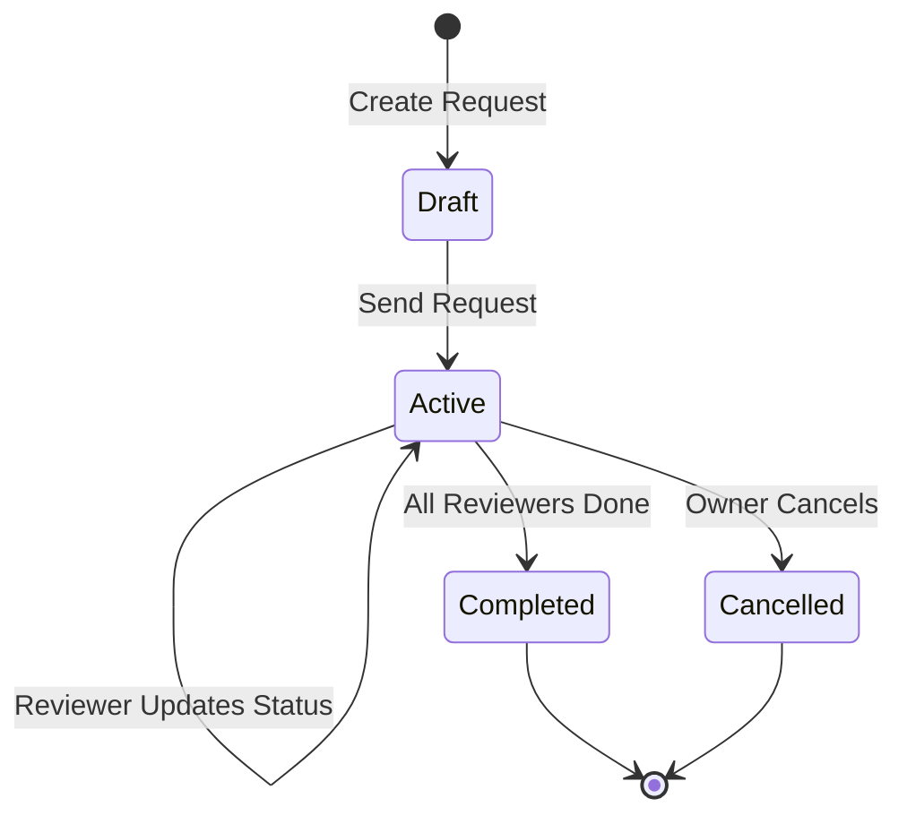
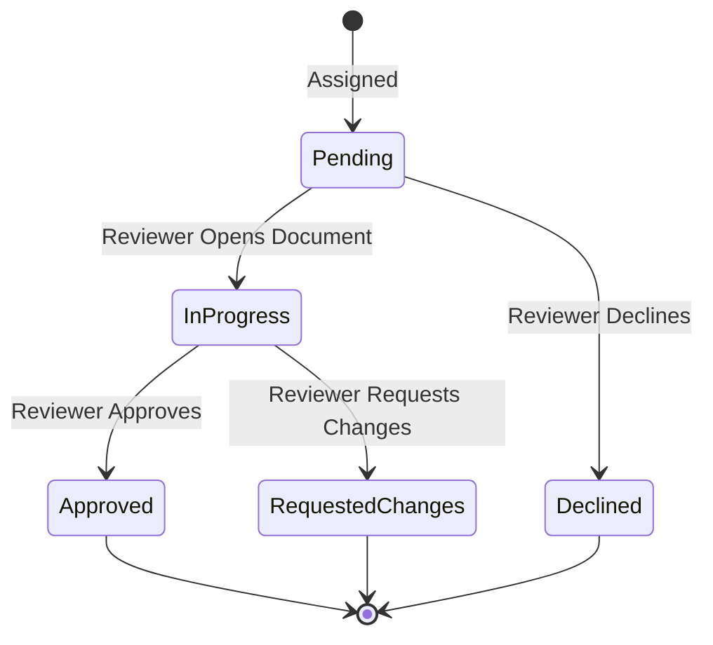

# LCS-DES-093a: Design Specification — Review Request

## 1. Metadata & Categorization

| Field | Value | Description |
| :--- | :--- | :--- |
| **Feature ID** | `COL-093a` | Sub-part of COL-093 |
| **Feature Name** | `Review Request System` | Assign reviewers, due dates, manage requests |
| **Target Version** | `v0.9.3a` | First sub-part of v0.9.3 |
| **Module Scope** | `Lexichord.Modules.Collaboration` | Collaboration module |
| **Swimlane** | `Collaboration` | Team features vertical |
| **License Tier** | `Teams` | Teams tier required |
| **Feature Gate Key** | `FeatureFlags.Collaboration.ReviewWorkflows` | License check key |
| **Author** | Lead Architect | |
| **Status** | `Draft` | |
| **Last Updated** | `2026-01-27` | |
| **Parent Document** | [LCS-DES-093-INDEX](./LCS-DES-093-INDEX.md) | |
| **Scope Breakdown** | [LCS-SBD-093 Section 3.1](./LCS-SBD-093.md#31-v093a-review-request) | |

---

## 2. Executive Summary

### 2.1 The Requirement

Content teams need a structured way to request feedback on documents before publication. Currently:

- Authors email colleagues to request reviews with no tracking
- Due dates are informal and often missed
- Review status is opaque to team leads
- No audit trail of who was asked to review and when

> **Goal:** Enable document owners to formally request reviews from team members, assign due dates, set priority levels, and track review completion status.

### 2.2 The Proposed Solution

Implement a Review Request System that:

1. Allows document owners to select reviewers from the team directory
2. Assigns roles (Reviewer vs Approver) to each assignee
3. Sets optional due dates with priority levels
4. Sends notifications to assigned reviewers
5. Tracks individual reviewer status (Pending, In Progress, Completed)
6. Aggregates to overall review status
7. Supports reminders for overdue reviews

---

## 3. Architecture & Modular Strategy

### 3.1 Dependencies

#### 3.1.1 Upstream Modules

| Interface | Source Version | Purpose |
| :--- | :--- | :--- |
| `IProfileService` | v0.9.1a | Retrieve reviewer profiles and avatars |
| `UserProfile` | v0.9.1a | Reviewer identity and display info |
| `ITeamService` | v0.7.1a | Team membership for reviewer selection |
| `INotificationService` | v0.7.4a | Send review request notifications |
| `ILicenseStateService` | v0.9.2c | Verify Teams tier access |
| `IDocumentService` | v0.1.3a | Document metadata for display |
| `IMediator` | v0.0.7a | Publish review lifecycle events |
| `IDbConnectionFactory` | v0.0.3a | Database connections |

#### 3.1.2 NuGet Packages

| Package | Version | Purpose |
| :--- | :--- | :--- |
| `Dapper` | 2.1.x | Database access |
| `Npgsql` | 8.x | PostgreSQL driver |
| `FluentValidation` | 11.x | Request validation |
| `MediatR` | 12.x | Event publishing |

### 3.2 Licensing Behavior

- **Load Behavior:** Soft Gate — Module loads, but service returns `NotAuthorized` for non-Teams users
- **Fallback Experience:**
  - "Request Review" button appears with lock icon for WriterPro users
  - Clicking opens "Upgrade to Teams" modal with feature description
  - Core/Writer users do not see the button at all

---

## 4. Data Contract (The API)

### 4.1 Domain Records

```csharp
namespace Lexichord.Modules.Collaboration.Models;

/// <summary>
/// Represents a request for team members to review a document.
/// Tracks reviewers, due dates, and overall completion status.
/// </summary>
public record ReviewRequest
{
    public Guid ReviewId { get; init; } = Guid.NewGuid();
    public required Guid DocumentId { get; init; }
    public required Guid RequestedBy { get; init; }
    public required IReadOnlyList<ReviewerAssignment> Reviewers { get; init; }
    public ReviewPriority Priority { get; init; } = ReviewPriority.Normal;
    public string? Message { get; init; }
    public DateTime? DueDate { get; init; }
    public DateTime CreatedAt { get; init; } = DateTime.UtcNow;
    public ReviewStatus Status { get; init; } = ReviewStatus.Draft;
    public DateTime? CompletedAt { get; init; }
    public DateTime? CancelledAt { get; init; }
    public string? CancelledReason { get; init; }

    /// <summary>
    /// Returns true if the review has a due date that has passed and status is still Active.
    /// </summary>
    public bool IsOverdue => DueDate.HasValue &&
                             DateTime.UtcNow > DueDate.Value &&
                             Status == ReviewStatus.Active;

    /// <summary>
    /// Calculates days until due date, or days overdue if negative.
    /// </summary>
    public int? DaysUntilDue => DueDate.HasValue
        ? (int)(DueDate.Value - DateTime.UtcNow).TotalDays
        : null;
}

/// <summary>
/// Represents a single reviewer's assignment within a review request.
/// </summary>
public record ReviewerAssignment
{
    public Guid AssignmentId { get; init; } = Guid.NewGuid();
    public required Guid ReviewId { get; init; }
    public required Guid UserId { get; init; }
    public required string DisplayName { get; init; }
    public string? AvatarPath { get; init; }
    public ReviewerRole Role { get; init; } = ReviewerRole.Reviewer;
    public ReviewerStatus Status { get; init; } = ReviewerStatus.Pending;
    public DateTime? CompletedAt { get; init; }
    public string? DeclineReason { get; init; }
    public DateTime CreatedAt { get; init; } = DateTime.UtcNow;
}

/// <summary>
/// Priority levels for review requests.
/// </summary>
public enum ReviewPriority
{
    Low = 0,
    Normal = 1,
    High = 2,
    Urgent = 3
}

/// <summary>
/// Roles that can be assigned to reviewers.
/// </summary>
public enum ReviewerRole
{
    /// <summary>Provides feedback but sign-off not required.</summary>
    Reviewer = 0,
    /// <summary>Must formally approve before document can proceed.</summary>
    Approver = 1,
    /// <summary>Receives updates but not expected to provide feedback.</summary>
    Observer = 2
}

/// <summary>
/// Status of an individual reviewer's assignment.
/// </summary>
public enum ReviewerStatus
{
    Pending = 0,
    InProgress = 1,
    Approved = 2,
    RequestedChanges = 3,
    Declined = 4
}

/// <summary>
/// Overall status of a review request.
/// </summary>
public enum ReviewStatus
{
    Draft = 0,
    Active = 1,
    Completed = 2,
    Cancelled = 3
}
```

### 4.2 Service Interface

```csharp
namespace Lexichord.Modules.Collaboration.Abstractions;

/// <summary>
/// Manages the lifecycle of review requests including creation,
/// status updates, and retrieval.
/// </summary>
public interface IReviewRequestService
{
    /// <summary>
    /// Creates a new review request for a document.
    /// Sends notifications to all assigned reviewers.
    /// </summary>
    /// <param name="command">The review request details.</param>
    /// <param name="ct">Cancellation token.</param>
    /// <returns>The created review request.</returns>
    /// <exception cref="UnauthorizedAccessException">User lacks Teams license.</exception>
    /// <exception cref="ValidationException">Invalid request parameters.</exception>
    Task<ReviewRequest> CreateRequestAsync(
        CreateReviewRequestCommand command,
        CancellationToken ct = default);

    /// <summary>
    /// Retrieves a review request by ID.
    /// </summary>
    /// <param name="reviewId">The review request ID.</param>
    /// <param name="ct">Cancellation token.</param>
    /// <returns>The review request or null if not found.</returns>
    Task<ReviewRequest?> GetRequestAsync(
        Guid reviewId,
        CancellationToken ct = default);

    /// <summary>
    /// Gets all review requests for a specific document.
    /// </summary>
    /// <param name="documentId">The document ID.</param>
    /// <param name="ct">Cancellation token.</param>
    /// <returns>List of review requests for the document.</returns>
    Task<IReadOnlyList<ReviewRequest>> GetRequestsForDocumentAsync(
        Guid documentId,
        CancellationToken ct = default);

    /// <summary>
    /// Gets all pending reviews assigned to a user.
    /// </summary>
    /// <param name="userId">The user ID.</param>
    /// <param name="ct">Cancellation token.</param>
    /// <returns>List of reviews where user has pending action.</returns>
    Task<IReadOnlyList<ReviewRequest>> GetPendingReviewsForUserAsync(
        Guid userId,
        CancellationToken ct = default);

    /// <summary>
    /// Gets all reviews requested by a user.
    /// </summary>
    /// <param name="userId">The user ID.</param>
    /// <param name="ct">Cancellation token.</param>
    /// <returns>List of reviews created by the user.</returns>
    Task<IReadOnlyList<ReviewRequest>> GetRequestedByUserAsync(
        Guid userId,
        CancellationToken ct = default);

    /// <summary>
    /// Updates a reviewer's status within a review request.
    /// Triggers review completion check if all reviewers done.
    /// </summary>
    /// <param name="reviewId">The review request ID.</param>
    /// <param name="userId">The reviewer's user ID.</param>
    /// <param name="status">The new status.</param>
    /// <param name="message">Optional message (e.g., decline reason).</param>
    /// <param name="ct">Cancellation token.</param>
    Task UpdateReviewerStatusAsync(
        Guid reviewId,
        Guid userId,
        ReviewerStatus status,
        string? message = null,
        CancellationToken ct = default);

    /// <summary>
    /// Cancels an active review request.
    /// Notifies all assigned reviewers of cancellation.
    /// </summary>
    /// <param name="reviewId">The review request ID.</param>
    /// <param name="reason">Optional cancellation reason.</param>
    /// <param name="ct">Cancellation token.</param>
    Task CancelRequestAsync(
        Guid reviewId,
        string? reason = null,
        CancellationToken ct = default);

    /// <summary>
    /// Sends a reminder notification to pending reviewers.
    /// </summary>
    /// <param name="reviewId">The review request ID.</param>
    /// <param name="ct">Cancellation token.</param>
    Task SendReminderAsync(
        Guid reviewId,
        CancellationToken ct = default);

    /// <summary>
    /// Adds additional reviewers to an active review request.
    /// </summary>
    /// <param name="reviewId">The review request ID.</param>
    /// <param name="reviewers">New reviewers to add.</param>
    /// <param name="ct">Cancellation token.</param>
    Task AddReviewersAsync(
        Guid reviewId,
        IReadOnlyList<ReviewerAssignmentRequest> reviewers,
        CancellationToken ct = default);

    /// <summary>
    /// Removes a reviewer from an active review request.
    /// </summary>
    /// <param name="reviewId">The review request ID.</param>
    /// <param name="userId">The user ID to remove.</param>
    /// <param name="ct">Cancellation token.</param>
    Task RemoveReviewerAsync(
        Guid reviewId,
        Guid userId,
        CancellationToken ct = default);
}

/// <summary>
/// Command for creating a new review request.
/// </summary>
public record CreateReviewRequestCommand
{
    public required Guid DocumentId { get; init; }
    public required IReadOnlyList<ReviewerAssignmentRequest> Reviewers { get; init; }
    public ReviewPriority Priority { get; init; } = ReviewPriority.Normal;
    public string? Message { get; init; }
    public DateTime? DueDate { get; init; }
}

/// <summary>
/// Request for assigning a reviewer.
/// </summary>
public record ReviewerAssignmentRequest
{
    public required Guid UserId { get; init; }
    public ReviewerRole Role { get; init; } = ReviewerRole.Reviewer;
}
```

### 4.3 MediatR Events

```csharp
namespace Lexichord.Modules.Collaboration.Events;

/// <summary>
/// Published when a new review request is created.
/// </summary>
public record ReviewRequestedEvent(
    Guid ReviewId,
    Guid DocumentId,
    Guid RequestedBy,
    IReadOnlyList<Guid> ReviewerIds,
    DateTime? DueDate) : INotification;

/// <summary>
/// Published when a reviewer's status changes.
/// </summary>
public record ReviewerStatusChangedEvent(
    Guid ReviewId,
    Guid UserId,
    ReviewerStatus OldStatus,
    ReviewerStatus NewStatus) : INotification;

/// <summary>
/// Published when all reviewers have completed their reviews.
/// </summary>
public record ReviewCompletedEvent(
    Guid ReviewId,
    Guid DocumentId,
    DateTime CompletedAt) : INotification;

/// <summary>
/// Published when a review request is cancelled.
/// </summary>
public record ReviewCancelledEvent(
    Guid ReviewId,
    Guid DocumentId,
    string? Reason) : INotification;

/// <summary>
/// Published when a reminder is sent for a review.
/// </summary>
public record ReviewReminderSentEvent(
    Guid ReviewId,
    IReadOnlyList<Guid> RemindedUserIds) : INotification;
```

---

## 5. Implementation Logic

### 5.1 Review Request Lifecycle



### 5.2 Reviewer Status Transitions



### 5.3 Review Completion Algorithm

```csharp
/// <summary>
/// Evaluates whether a review request should be marked as completed.
/// A review is complete when all non-observer reviewers have a terminal status.
/// </summary>
public async Task EvaluateCompletionAsync(Guid reviewId, CancellationToken ct)
{
    var review = await _repository.GetByIdAsync(reviewId, ct);
    if (review is null || review.Status != ReviewStatus.Active) return;

    // Filter out observers - they don't affect completion
    var activeReviewers = review.Reviewers
        .Where(r => r.Role != ReviewerRole.Observer)
        .ToList();

    // Check if all active reviewers have terminal status
    var allComplete = activeReviewers.All(r =>
        r.Status is ReviewerStatus.Approved
                 or ReviewerStatus.RequestedChanges
                 or ReviewerStatus.Declined);

    if (allComplete)
    {
        var completedReview = review with
        {
            Status = ReviewStatus.Completed,
            CompletedAt = DateTime.UtcNow
        };

        await _repository.UpdateAsync(completedReview, ct);
        await _mediator.Publish(new ReviewCompletedEvent(
            reviewId, review.DocumentId, DateTime.UtcNow), ct);

        _logger.LogInformation(
            "Review {ReviewId} for document {DocumentId} completed",
            reviewId, review.DocumentId);
    }
}
```

### 5.4 Notification Logic

```text
NOTIFICATION TRIGGERS:

1. Review Request Created:
   - Each reviewer receives: "You've been asked to review [Document Title]"
   - Include: Requester name, due date, priority, message

2. Reviewer Status Changed:
   - Requester receives: "[Reviewer] has [approved/requested changes/declined]"
   - If RequestedChanges: Include reviewer's comments

3. Review Completed:
   - Requester receives: "Review of [Document Title] is complete"
   - Summary: X approved, Y requested changes, Z declined

4. Reminder Sent:
   - Each pending reviewer receives: "Reminder: Review due [date] for [Document]"

5. Review Cancelled:
   - Each reviewer receives: "[Requester] cancelled the review request"
   - Include: Cancellation reason if provided
```

---

## 6. Data Persistence

### 6.1 Database Schema

```sql
-- Migration: 2026_01_27_01_ReviewRequests.cs

CREATE TABLE review_requests (
    review_id UUID PRIMARY KEY DEFAULT gen_random_uuid(),
    document_id UUID NOT NULL,
    requested_by UUID NOT NULL,
    priority VARCHAR(20) NOT NULL DEFAULT 'Normal',
    message TEXT,
    due_date TIMESTAMP WITH TIME ZONE,
    created_at TIMESTAMP WITH TIME ZONE NOT NULL DEFAULT NOW(),
    status VARCHAR(20) NOT NULL DEFAULT 'Draft',
    completed_at TIMESTAMP WITH TIME ZONE,
    cancelled_at TIMESTAMP WITH TIME ZONE,
    cancelled_reason TEXT,

    CONSTRAINT fk_review_document FOREIGN KEY (document_id)
        REFERENCES documents(document_id) ON DELETE CASCADE,
    CONSTRAINT fk_review_requester FOREIGN KEY (requested_by)
        REFERENCES user_profiles(profile_id) ON DELETE SET NULL,
    CONSTRAINT chk_priority CHECK (priority IN ('Low', 'Normal', 'High', 'Urgent')),
    CONSTRAINT chk_status CHECK (status IN ('Draft', 'Active', 'Completed', 'Cancelled'))
);

CREATE TABLE reviewer_assignments (
    assignment_id UUID PRIMARY KEY DEFAULT gen_random_uuid(),
    review_id UUID NOT NULL,
    user_id UUID NOT NULL,
    role VARCHAR(20) NOT NULL DEFAULT 'Reviewer',
    status VARCHAR(20) NOT NULL DEFAULT 'Pending',
    completed_at TIMESTAMP WITH TIME ZONE,
    decline_reason TEXT,
    created_at TIMESTAMP WITH TIME ZONE NOT NULL DEFAULT NOW(),

    CONSTRAINT fk_assignment_review FOREIGN KEY (review_id)
        REFERENCES review_requests(review_id) ON DELETE CASCADE,
    CONSTRAINT fk_assignment_user FOREIGN KEY (user_id)
        REFERENCES user_profiles(profile_id) ON DELETE CASCADE,
    CONSTRAINT chk_role CHECK (role IN ('Reviewer', 'Approver', 'Observer')),
    CONSTRAINT chk_assignment_status CHECK (status IN ('Pending', 'InProgress', 'Approved', 'RequestedChanges', 'Declined')),
    CONSTRAINT uq_review_user UNIQUE (review_id, user_id)
);

-- Indexes for common queries
CREATE INDEX idx_review_requests_document ON review_requests(document_id);
CREATE INDEX idx_review_requests_requested_by ON review_requests(requested_by);
CREATE INDEX idx_review_requests_status ON review_requests(status);
CREATE INDEX idx_review_requests_due_date ON review_requests(due_date)
    WHERE status = 'Active';

CREATE INDEX idx_reviewer_assignments_user ON reviewer_assignments(user_id);
CREATE INDEX idx_reviewer_assignments_status ON reviewer_assignments(status);
CREATE INDEX idx_reviewer_assignments_pending ON reviewer_assignments(user_id, review_id)
    WHERE status IN ('Pending', 'InProgress');
```

### 6.2 Repository Implementation

```csharp
namespace Lexichord.Modules.Collaboration.Repositories;

public class ReviewRequestRepository : IReviewRequestRepository
{
    private readonly IDbConnectionFactory _db;

    public ReviewRequestRepository(IDbConnectionFactory db)
    {
        _db = db;
    }

    public async Task<ReviewRequest?> GetByIdAsync(Guid reviewId, CancellationToken ct)
    {
        using var conn = await _db.OpenAsync(ct);

        // Get the review request
        var review = await conn.QuerySingleOrDefaultAsync<ReviewRequestDto>(
            """
            SELECT review_id, document_id, requested_by, priority, message,
                   due_date, created_at, status, completed_at, cancelled_at, cancelled_reason
            FROM review_requests
            WHERE review_id = @reviewId
            """,
            new { reviewId });

        if (review is null) return null;

        // Get the reviewer assignments with user profile data
        var assignments = await conn.QueryAsync<ReviewerAssignmentDto>(
            """
            SELECT ra.assignment_id, ra.review_id, ra.user_id, ra.role, ra.status,
                   ra.completed_at, ra.decline_reason, ra.created_at,
                   up.name as display_name, up.avatar_path
            FROM reviewer_assignments ra
            JOIN user_profiles up ON ra.user_id = up.profile_id
            WHERE ra.review_id = @reviewId
            ORDER BY ra.created_at
            """,
            new { reviewId });

        return MapToReviewRequest(review, assignments.ToList());
    }

    public async Task<IReadOnlyList<ReviewRequest>> GetPendingForUserAsync(
        Guid userId, CancellationToken ct)
    {
        using var conn = await _db.OpenAsync(ct);

        var reviews = await conn.QueryAsync<ReviewRequestDto>(
            """
            SELECT DISTINCT rr.*
            FROM review_requests rr
            JOIN reviewer_assignments ra ON rr.review_id = ra.review_id
            WHERE ra.user_id = @userId
              AND ra.status IN ('Pending', 'InProgress')
              AND rr.status = 'Active'
            ORDER BY rr.due_date NULLS LAST, rr.created_at DESC
            """,
            new { userId });

        var result = new List<ReviewRequest>();
        foreach (var review in reviews)
        {
            var assignments = await GetAssignmentsAsync(conn, review.ReviewId);
            result.Add(MapToReviewRequest(review, assignments));
        }

        return result;
    }

    public async Task InsertAsync(ReviewRequest review, CancellationToken ct)
    {
        using var conn = await _db.OpenAsync(ct);
        using var transaction = await conn.BeginTransactionAsync(ct);

        try
        {
            // Insert review request
            await conn.ExecuteAsync(
                """
                INSERT INTO review_requests
                    (review_id, document_id, requested_by, priority, message, due_date, status)
                VALUES
                    (@ReviewId, @DocumentId, @RequestedBy, @Priority, @Message, @DueDate, @Status)
                """,
                new
                {
                    review.ReviewId,
                    review.DocumentId,
                    review.RequestedBy,
                    Priority = review.Priority.ToString(),
                    review.Message,
                    review.DueDate,
                    Status = review.Status.ToString()
                },
                transaction);

            // Insert reviewer assignments
            foreach (var assignment in review.Reviewers)
            {
                await conn.ExecuteAsync(
                    """
                    INSERT INTO reviewer_assignments
                        (assignment_id, review_id, user_id, role, status)
                    VALUES
                        (@AssignmentId, @ReviewId, @UserId, @Role, @Status)
                    """,
                    new
                    {
                        assignment.AssignmentId,
                        assignment.ReviewId,
                        assignment.UserId,
                        Role = assignment.Role.ToString(),
                        Status = assignment.Status.ToString()
                    },
                    transaction);
            }

            await transaction.CommitAsync(ct);
        }
        catch
        {
            await transaction.RollbackAsync(ct);
            throw;
        }
    }
}
```

---

## 7. UI/UX Specifications

### 7.1 Review Request Dialog

```text
+------------------------------------------------------------------+
|  Request Review                                         [X]       |
+------------------------------------------------------------------+
| Document: Marketing Brief Q1 2026                                 |
|                                                                   |
| Reviewers                                                         |
| +--------------------------------------------------------------+ |
| | [Search team members...]                                     | |
| +--------------------------------------------------------------+ |
| | [Avatar] Jane Smith              [Approver v]       [Remove] | |
| |          Editor                                               | |
| | [Avatar] John Doe                [Reviewer v]       [Remove] | |
| |          Technical Writer                                     | |
| +--------------------------------------------------------------+ |
|                                                                   |
| Priority                                                          |
| +--------------------------------------------------------------+ |
| | ( ) Low  (o) Normal  ( ) High  ( ) Urgent                    | |
| +--------------------------------------------------------------+ |
|                                                                   |
| Due Date                 [February 15, 2026]  [Clear]             |
|                          (Optional)                               |
|                                                                   |
| Message to Reviewers                                              |
| +--------------------------------------------------------------+ |
| | Please focus on the technical accuracy of section 3.         | |
| | Let me know if you need any additional context.              | |
| +--------------------------------------------------------------+ |
| | 0/500 characters                                             | |
|                                                                   |
|                              [Cancel]   [Request Review]          |
+------------------------------------------------------------------+
```

### 7.2 Reviewer Picker Dropdown

```text
+--------------------------------------------------------------+
| [Search by name or email...]                                 |
+--------------------------------------------------------------+
| Recently Used                                                |
|   [Avatar] Jane Smith (jane@company.com)              [Add]  |
|   [Avatar] John Doe (john@company.com)                [Add]  |
+--------------------------------------------------------------+
| Team Members                                                 |
|   [Avatar] Sarah Chen (sarah@company.com)             [Add]  |
|   [Avatar] Mike Johnson (mike@company.com)            [Add]  |
|   [Avatar] Lisa Park (lisa@company.com)               [Add]  |
+--------------------------------------------------------------+
```

### 7.3 Document Review Badge

```text
+------------------------------------------------------------------+
| Document: Marketing Brief Q1 2026                                 |
| +------------------+  +----------------------------------+        |
| | Under Review     |  | 2/3 reviewed · Due in 3 days     |        |
| +------------------+  +----------------------------------+        |
|                                                                   |
| [Edit] [Preview] [Request Review] [View Reviews]                  |
+------------------------------------------------------------------+
```

### 7.4 Review Status Panel (Document Sidebar)

```text
+------------------------------------------------------------------+
|  Review Status                                           [Expand] |
+------------------------------------------------------------------+
|  Requested by: Jane Smith                                         |
|  Due: February 15, 2026 (3 days)                                  |
|  Priority: [HIGH]                                                 |
|                                                                   |
|  Reviewers:                                                       |
|  +--------------------------------------------------------------+ |
|  | [Avatar] John Doe               [APPROVED]    Jan 25, 2026  | |
|  | [Avatar] Sarah Chen             [IN PROGRESS]               | |
|  | [Avatar] Mike Johnson           [PENDING]                   | |
|  +--------------------------------------------------------------+ |
|                                                                   |
|  Message: "Please focus on technical accuracy..."                 |
|                                                                   |
|  [Send Reminder]  [Cancel Review]                                 |
+------------------------------------------------------------------+
```

### 7.5 Component Styling

| Component | Theme Resource | Usage |
| :--- | :--- | :--- |
| Priority Badge (Low) | `Brush.Priority.Low` | Gray badge |
| Priority Badge (Normal) | `Brush.Priority.Normal` | Blue badge |
| Priority Badge (High) | `Brush.Priority.High` | Orange badge |
| Priority Badge (Urgent) | `Brush.Priority.Urgent` | Red badge with pulse |
| Status (Pending) | `Brush.Status.Pending` | Gray text |
| Status (In Progress) | `Brush.Status.InProgress` | Blue text |
| Status (Approved) | `Brush.Status.Success` | Green text + checkmark |
| Status (Changes) | `Brush.Status.Warning` | Orange text |
| Status (Declined) | `Brush.Status.Danger` | Red text |
| Overdue Indicator | `Brush.Alert.Danger` | Red background |

---

## 8. ViewModel Implementation

```csharp
namespace Lexichord.Modules.Collaboration.ViewModels;

public partial class ReviewRequestViewModel : ObservableObject
{
    private readonly IReviewRequestService _reviewService;
    private readonly IProfileService _profileService;
    private readonly ITeamService _teamService;
    private readonly IDocumentService _documentService;

    [ObservableProperty] private Guid _documentId;
    [ObservableProperty] private string _documentTitle = string.Empty;
    [ObservableProperty] private ObservableCollection<ReviewerItem> _selectedReviewers = [];
    [ObservableProperty] private ObservableCollection<TeamMemberItem> _availableMembers = [];
    [ObservableProperty] private string _searchQuery = string.Empty;
    [ObservableProperty] private ReviewPriority _priority = ReviewPriority.Normal;
    [ObservableProperty] private DateTime? _dueDate;
    [ObservableProperty] private string _message = string.Empty;
    [ObservableProperty] private bool _isLoading;
    [ObservableProperty] private string? _errorMessage;
    [ObservableProperty] private bool _canSubmit;

    public ReviewRequestViewModel(
        IReviewRequestService reviewService,
        IProfileService profileService,
        ITeamService teamService,
        IDocumentService documentService)
    {
        _reviewService = reviewService;
        _profileService = profileService;
        _teamService = teamService;
        _documentService = documentService;
    }

    public async Task InitializeAsync(Guid documentId, CancellationToken ct = default)
    {
        DocumentId = documentId;
        IsLoading = true;

        try
        {
            var document = await _documentService.GetDocumentAsync(documentId, ct);
            DocumentTitle = document?.Title ?? "Untitled";

            var members = await _teamService.GetTeamMembersAsync(ct);
            AvailableMembers = new ObservableCollection<TeamMemberItem>(
                members.Select(m => new TeamMemberItem(m.UserId, m.DisplayName, m.AvatarPath)));
        }
        catch (Exception ex)
        {
            ErrorMessage = $"Failed to load: {ex.Message}";
        }
        finally
        {
            IsLoading = false;
        }
    }

    [RelayCommand]
    private void AddReviewer(TeamMemberItem member)
    {
        if (SelectedReviewers.Any(r => r.UserId == member.UserId)) return;

        SelectedReviewers.Add(new ReviewerItem(
            member.UserId,
            member.DisplayName,
            member.AvatarPath,
            ReviewerRole.Reviewer));

        UpdateCanSubmit();
    }

    [RelayCommand]
    private void RemoveReviewer(ReviewerItem reviewer)
    {
        SelectedReviewers.Remove(reviewer);
        UpdateCanSubmit();
    }

    [RelayCommand]
    private void ChangeRole(ReviewerItem reviewer, ReviewerRole newRole)
    {
        var index = SelectedReviewers.IndexOf(reviewer);
        if (index >= 0)
        {
            SelectedReviewers[index] = reviewer with { Role = newRole };
        }
    }

    [RelayCommand]
    private async Task SubmitRequestAsync()
    {
        if (!CanSubmit) return;

        IsLoading = true;
        ErrorMessage = null;

        try
        {
            var command = new CreateReviewRequestCommand
            {
                DocumentId = DocumentId,
                Reviewers = SelectedReviewers
                    .Select(r => new ReviewerAssignmentRequest
                    {
                        UserId = r.UserId,
                        Role = r.Role
                    })
                    .ToList(),
                Priority = Priority,
                DueDate = DueDate,
                Message = string.IsNullOrWhiteSpace(Message) ? null : Message
            };

            await _reviewService.CreateRequestAsync(command);

            // Close dialog with success
            RequestComplete?.Invoke(this, EventArgs.Empty);
        }
        catch (ValidationException vex)
        {
            ErrorMessage = vex.Message;
        }
        catch (Exception ex)
        {
            ErrorMessage = $"Failed to create review: {ex.Message}";
        }
        finally
        {
            IsLoading = false;
        }
    }

    private void UpdateCanSubmit()
    {
        CanSubmit = SelectedReviewers.Count > 0;
    }

    partial void OnSearchQueryChanged(string value)
    {
        // Filter available members based on search
        // Implementation filters by name/email
    }

    partial void OnMessageChanged(string value)
    {
        // Enforce 500 character limit
        if (value.Length > 500)
        {
            Message = value[..500];
        }
    }

    public event EventHandler? RequestComplete;
}

public record ReviewerItem(
    Guid UserId,
    string DisplayName,
    string? AvatarPath,
    ReviewerRole Role);

public record TeamMemberItem(
    Guid UserId,
    string DisplayName,
    string? AvatarPath);
```

---

## 9. Validation

```csharp
namespace Lexichord.Modules.Collaboration.Validators;

public class CreateReviewRequestValidator : AbstractValidator<CreateReviewRequestCommand>
{
    public CreateReviewRequestValidator()
    {
        RuleFor(x => x.DocumentId)
            .NotEmpty()
            .WithMessage("Document ID is required");

        RuleFor(x => x.Reviewers)
            .NotEmpty()
            .WithMessage("At least one reviewer is required");

        RuleFor(x => x.Reviewers)
            .Must(r => r.Count <= 20)
            .WithMessage("Maximum 20 reviewers allowed");

        RuleFor(x => x.DueDate)
            .GreaterThan(DateTime.UtcNow)
            .When(x => x.DueDate.HasValue)
            .WithMessage("Due date must be in the future");

        RuleFor(x => x.Message)
            .MaximumLength(500)
            .When(x => x.Message is not null)
            .WithMessage("Message cannot exceed 500 characters");

        RuleFor(x => x.Priority)
            .IsInEnum()
            .WithMessage("Invalid priority value");
    }
}
```

---

## 10. Observability & Logging

| Level | Message Template |
| :--- | :--- |
| Info | `"Review request {ReviewId} created for document {DocumentId} by user {UserId}"` |
| Info | `"Review request {ReviewId} sent to {ReviewerCount} reviewers"` |
| Info | `"Reviewer {UserId} status updated to {Status} for review {ReviewId}"` |
| Info | `"Review {ReviewId} completed"` |
| Info | `"Review {ReviewId} cancelled by {UserId}"` |
| Warning | `"Review request {ReviewId} is overdue by {Days} days"` |
| Warning | `"Reminder failed for review {ReviewId}: {Error}"` |
| Error | `"Failed to create review request: {Error}"` |

---

## 11. Security & Safety

| Risk | Level | Mitigation |
| :--- | :--- | :--- |
| Unauthorized review request | Medium | Verify user has document access before creating |
| Spam reviewer assignments | Low | Limit to 20 reviewers per request |
| Notification abuse | Low | Rate limit reminders (1 per reviewer per day) |
| Data exposure | Low | Only show reviewers who have document access |

---

## 12. Acceptance Criteria

### 12.1 Functional Criteria

| # | Given | When | Then |
| :--- | :--- | :--- | :--- |
| 1 | User has Teams license | Creating review request | Request is created successfully |
| 2 | User has WriterPro license | Clicking Request Review | Upgrade prompt is shown |
| 3 | Review has 3 reviewers | All reviewers approve | Review marked Completed |
| 4 | Review has due date in past | Viewing review | Shows as Overdue |
| 5 | Reviewer declines | Checking completion | Review can still complete with others |
| 6 | Request is cancelled | Viewing request | Shows Cancelled status |
| 7 | Reminder sent | Checking notification | Pending reviewers receive email |

### 12.2 Performance Criteria

| # | Given | When | Then |
| :--- | :--- | :--- | :--- |
| 8 | Valid request | Creating review | Completes in < 500ms |
| 9 | User has 50 pending reviews | Loading dashboard | Returns in < 1s |
| 10 | Review has 10 reviewers | Fetching review | Returns in < 200ms |

---

## 13. Deliverable Checklist

| # | Deliverable | Status |
| :--- | :--- | :--- |
| 1 | `ReviewRequest.cs` record | [ ] |
| 2 | `ReviewerAssignment.cs` record | [ ] |
| 3 | `IReviewRequestService.cs` interface | [ ] |
| 4 | `ReviewRequestService.cs` implementation | [ ] |
| 5 | `ReviewRequestRepository.cs` | [ ] |
| 6 | Database migration script | [ ] |
| 7 | `ReviewRequestView.axaml` dialog | [ ] |
| 8 | `ReviewRequestViewModel.cs` | [ ] |
| 9 | `CreateReviewRequestValidator.cs` | [ ] |
| 10 | MediatR event classes | [ ] |
| 11 | Notification integration | [ ] |
| 12 | Unit tests for service | [ ] |
| 13 | Integration tests | [ ] |

---

## 14. Verification Commands

```bash
# Run review request tests
dotnet test --filter "Version=v0.9.3a" --logger "console;verbosity=detailed"

# Run specific test class
dotnet test --filter "FullyQualifiedName~ReviewRequestServiceTests"

# Verify database migration
dotnet ef database update --project src/Lexichord.Host

# Check migration was applied
dotnet ef migrations list --project src/Lexichord.Host | grep ReviewRequests
```

---

## Document History

| Version | Date | Author | Changes |
| :--- | :--- | :--- | :--- |
| 1.0 | 2026-01-27 | Lead Architect | Initial draft |
