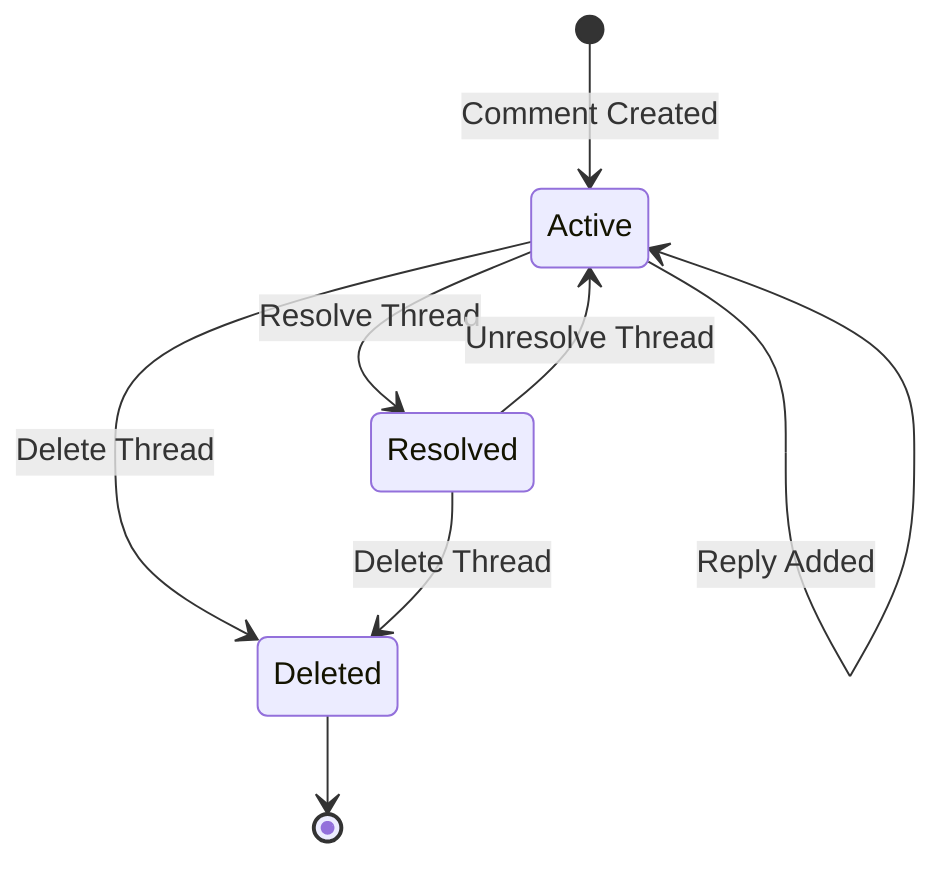

# LCS-DES-093b: Design Specification — Comment System

## 1. Metadata & Categorization

| Field | Value | Description |
| :--- | :--- | :--- |
| **Feature ID** | `COL-093b` | Sub-part of COL-093 |
| **Feature Name** | `Inline Comment and Thread System` | Comments, threads, @mentions |
| **Target Version** | `v0.9.3b` | Second sub-part of v0.9.3 |
| **Module Scope** | `Lexichord.Modules.Collaboration` | Collaboration module |
| **Swimlane** | `Collaboration` | Team features vertical |
| **License Tier** | `Teams` | Teams tier required |
| **Feature Gate Key** | `FeatureFlags.Collaboration.ReviewWorkflows` | License check key |
| **Author** | Lead Architect | |
| **Status** | `Draft` | |
| **Last Updated** | `2026-01-27` | |
| **Parent Document** | [LCS-DES-093-INDEX](./LCS-DES-093-INDEX.md) | |
| **Scope Breakdown** | [LCS-SBD-093 Section 3.2](./LCS-SBD-093.md#32-v093b-comment-system) | |

---

## 2. Executive Summary

### 2.1 The Requirement

Reviewers need to provide contextual feedback that is anchored to specific text in the document:

- General feedback lacks context when divorced from the text it references
- Email threads become disconnected from the source material
- There is no way to track which feedback has been addressed
- Team discussions happen outside the document in chat/email

> **Goal:** Enable reviewers to add inline comments anchored to specific text ranges, with threaded replies, @mentions for notifications, and resolution tracking.

### 2.2 The Proposed Solution

Implement a Comment System that:

1. Allows comments to be anchored to specific text ranges in the document
2. Highlights commented text in the editor with margin indicators
3. Supports threaded discussions under root comments
4. Parses @mentions and notifies referenced users
5. Allows marking threads as resolved
6. Survives document edits through anchor reconciliation
7. Displays comments in a sidebar panel alongside the editor

---

## 3. Architecture & Modular Strategy

### 3.1 Dependencies

#### 3.1.1 Upstream Modules

| Interface | Source Version | Purpose |
| :--- | :--- | :--- |
| `IDocumentService` | v0.1.3a | Access document content for anchoring |
| `IEditorService` | v0.1.3a | Editor integration for highlighting |
| `IProfileService` | v0.9.1a | User profiles for @mention resolution |
| `INotificationService` | v0.7.4a | Send mention notifications |
| `IReviewRequestService` | v0.9.3a | Associate comments with reviews |
| `ILicenseStateService` | v0.9.2c | Verify Teams tier access |
| `IMediator` | v0.0.7a | Publish comment events |
| `IDbConnectionFactory` | v0.0.3a | Database connections |

#### 3.1.2 NuGet Packages

| Package | Version | Purpose |
| :--- | :--- | :--- |
| `Dapper` | 2.1.x | Database access |
| `Npgsql` | 8.x | PostgreSQL driver |
| `Markdig` | 0.34.x | Markdown parsing for rich text |
| `MediatR` | 12.x | Event publishing |

### 3.2 Licensing Behavior

- **Load Behavior:** Soft Gate — Comment panel hidden for non-Teams users
- **Fallback Experience:**
  - Comment panel not shown in editor layout
  - If user receives shared document with comments, can view but not add
  - "Add Comment" context menu item hidden

---

## 4. Data Contract (The API)

### 4.1 Domain Records

```csharp
namespace Lexichord.Modules.Collaboration.Models;

/// <summary>
/// Represents a comment on a document, anchored to a specific text range.
/// Can be a root comment or a reply to another comment.
/// </summary>
public record ReviewComment
{
    public Guid CommentId { get; init; } = Guid.NewGuid();
    public required Guid DocumentId { get; init; }
    public Guid? ReviewId { get; init; }
    public Guid? ParentCommentId { get; init; }
    public required Guid AuthorId { get; init; }
    public required string AuthorName { get; init; }
    public string? AuthorAvatarPath { get; init; }
    public required CommentAnchor Anchor { get; init; }
    public required string Content { get; init; }
    public IReadOnlyList<UserMention> Mentions { get; init; } = [];
    public DateTime CreatedAt { get; init; } = DateTime.UtcNow;
    public DateTime? EditedAt { get; init; }
    public bool IsResolved { get; init; }
    public DateTime? ResolvedAt { get; init; }
    public Guid? ResolvedBy { get; init; }

    /// <summary>
    /// Returns true if this is a root comment (not a reply).
    /// </summary>
    public bool IsRootComment => ParentCommentId is null;

    /// <summary>
    /// Returns true if the comment has been edited after creation.
    /// </summary>
    public bool IsEdited => EditedAt.HasValue;
}

/// <summary>
/// Defines the text range where a comment is anchored.
/// Uses line/column coordinates and stores quoted text for fallback.
/// </summary>
public record CommentAnchor
{
    public required int StartLine { get; init; }
    public required int StartColumn { get; init; }
    public required int EndLine { get; init; }
    public required int EndColumn { get; init; }
    public required string QuotedText { get; init; }

    /// <summary>
    /// Returns true if anchor spans multiple lines.
    /// </summary>
    public bool IsMultiLine => StartLine != EndLine;

    /// <summary>
    /// Creates a display-friendly version of the quoted text.
    /// Truncates long quotes with ellipsis.
    /// </summary>
    public string DisplayQuote => QuotedText.Length > 50
        ? QuotedText[..47] + "..."
        : QuotedText;
}

/// <summary>
/// Represents an @mention of a user within a comment.
/// </summary>
public record UserMention
{
    public required Guid UserId { get; init; }
    public required string DisplayName { get; init; }
    public required int StartIndex { get; init; }
    public required int Length { get; init; }
}

/// <summary>
/// Represents a threaded discussion starting with a root comment.
/// </summary>
public record CommentThread
{
    public required Guid ThreadId { get; init; }
    public required ReviewComment RootComment { get; init; }
    public required IReadOnlyList<ReviewComment> Replies { get; init; }

    /// <summary>
    /// Total number of replies (not including root).
    /// </summary>
    public int ReplyCount => Replies.Count;

    /// <summary>
    /// Most recent activity time in the thread.
    /// </summary>
    public DateTime LastActivityAt => Replies.Count > 0
        ? Replies.Max(r => r.CreatedAt)
        : RootComment.CreatedAt;

    /// <summary>
    /// Returns true if thread is resolved.
    /// </summary>
    public bool IsResolved => RootComment.IsResolved;
}
```

### 4.2 Service Interface

```csharp
namespace Lexichord.Modules.Collaboration.Abstractions;

/// <summary>
/// Manages inline comments including creation, threading,
/// resolution, and @mention parsing.
/// </summary>
public interface ICommentService
{
    /// <summary>
    /// Adds a new comment to a document.
    /// Parses @mentions and sends notifications.
    /// </summary>
    /// <param name="command">The comment details.</param>
    /// <param name="ct">Cancellation token.</param>
    /// <returns>The created comment.</returns>
    Task<ReviewComment> AddCommentAsync(
        AddCommentCommand command,
        CancellationToken ct = default);

    /// <summary>
    /// Adds a reply to an existing comment.
    /// </summary>
    /// <param name="parentCommentId">The comment to reply to.</param>
    /// <param name="content">The reply content.</param>
    /// <param name="ct">Cancellation token.</param>
    /// <returns>The created reply.</returns>
    Task<ReviewComment> ReplyToCommentAsync(
        Guid parentCommentId,
        string content,
        CancellationToken ct = default);

    /// <summary>
    /// Edits an existing comment's content.
    /// Only the comment author can edit.
    /// </summary>
    /// <param name="commentId">The comment to edit.</param>
    /// <param name="newContent">The new content.</param>
    /// <param name="ct">Cancellation token.</param>
    /// <returns>The updated comment.</returns>
    Task<ReviewComment> EditCommentAsync(
        Guid commentId,
        string newContent,
        CancellationToken ct = default);

    /// <summary>
    /// Deletes a comment.
    /// If root comment, deletes entire thread.
    /// </summary>
    /// <param name="commentId">The comment to delete.</param>
    /// <param name="ct">Cancellation token.</param>
    Task DeleteCommentAsync(
        Guid commentId,
        CancellationToken ct = default);

    /// <summary>
    /// Marks a comment thread as resolved.
    /// </summary>
    /// <param name="commentId">The root comment ID.</param>
    /// <param name="ct">Cancellation token.</param>
    Task ResolveThreadAsync(
        Guid commentId,
        CancellationToken ct = default);

    /// <summary>
    /// Marks a comment thread as unresolved.
    /// </summary>
    /// <param name="commentId">The root comment ID.</param>
    /// <param name="ct">Cancellation token.</param>
    Task UnresolveThreadAsync(
        Guid commentId,
        CancellationToken ct = default);

    /// <summary>
    /// Gets all comment threads for a document.
    /// </summary>
    /// <param name="documentId">The document ID.</param>
    /// <param name="includeResolved">Include resolved threads.</param>
    /// <param name="ct">Cancellation token.</param>
    /// <returns>List of comment threads ordered by position.</returns>
    Task<IReadOnlyList<CommentThread>> GetThreadsForDocumentAsync(
        Guid documentId,
        bool includeResolved = false,
        CancellationToken ct = default);

    /// <summary>
    /// Gets all comments for a specific review request.
    /// </summary>
    /// <param name="reviewId">The review request ID.</param>
    /// <param name="ct">Cancellation token.</param>
    /// <returns>List of comments in the review.</returns>
    Task<IReadOnlyList<ReviewComment>> GetCommentsForReviewAsync(
        Guid reviewId,
        CancellationToken ct = default);

    /// <summary>
    /// Parses @mentions from comment content.
    /// Resolves user IDs from display names.
    /// </summary>
    /// <param name="content">The comment content to parse.</param>
    /// <returns>List of identified mentions.</returns>
    IReadOnlyList<UserMention> ParseMentions(string content);

    /// <summary>
    /// Updates comment anchors after document edit.
    /// Called by editor integration.
    /// </summary>
    /// <param name="documentId">The document ID.</param>
    /// <param name="editOperation">The edit that occurred.</param>
    /// <param name="ct">Cancellation token.</param>
    Task ReconcileAnchorsAsync(
        Guid documentId,
        DocumentEditOperation editOperation,
        CancellationToken ct = default);
}

/// <summary>
/// Command for adding a new comment.
/// </summary>
public record AddCommentCommand
{
    public required Guid DocumentId { get; init; }
    public Guid? ReviewId { get; init; }
    public required CommentAnchor Anchor { get; init; }
    public required string Content { get; init; }
}

/// <summary>
/// Describes an edit operation for anchor reconciliation.
/// </summary>
public record DocumentEditOperation
{
    public required int StartLine { get; init; }
    public required int StartColumn { get; init; }
    public required int EndLine { get; init; }
    public required int EndColumn { get; init; }
    public required string DeletedText { get; init; }
    public required string InsertedText { get; init; }
    public required int LinesInserted { get; init; }
    public required int LinesDeleted { get; init; }
}
```

### 4.3 MediatR Events

```csharp
namespace Lexichord.Modules.Collaboration.Events;

/// <summary>
/// Published when a new comment is added.
/// </summary>
public record CommentAddedEvent(
    Guid CommentId,
    Guid DocumentId,
    Guid AuthorId,
    IReadOnlyList<Guid> MentionedUserIds) : INotification;

/// <summary>
/// Published when a comment is edited.
/// </summary>
public record CommentEditedEvent(
    Guid CommentId,
    Guid DocumentId,
    Guid EditorId) : INotification;

/// <summary>
/// Published when a comment thread is resolved.
/// </summary>
public record CommentResolvedEvent(
    Guid CommentId,
    Guid DocumentId,
    Guid ResolvedBy) : INotification;

/// <summary>
/// Published when a comment is deleted.
/// </summary>
public record CommentDeletedEvent(
    Guid CommentId,
    Guid DocumentId,
    Guid DeletedBy) : INotification;
```

---

## 5. Implementation Logic

### 5.1 @Mention Parsing Algorithm

```csharp
public class MentionParser
{
    private readonly IProfileService _profileService;
    private static readonly Regex MentionPattern = new(
        @"@([A-Za-z][A-Za-z0-9_\-\.]*(?:\s+[A-Za-z][A-Za-z0-9_\-\.]*)?)",
        RegexOptions.Compiled);

    public async Task<IReadOnlyList<UserMention>> ParseAsync(
        string content, CancellationToken ct)
    {
        var mentions = new List<UserMention>();
        var matches = MentionPattern.Matches(content);

        foreach (Match match in matches)
        {
            var nameOrHandle = match.Groups[1].Value.Trim();

            // Try to resolve user by display name or email prefix
            var user = await _profileService.FindUserByNameAsync(nameOrHandle, ct);

            if (user is not null)
            {
                mentions.Add(new UserMention
                {
                    UserId = user.ProfileId,
                    DisplayName = user.Name,
                    StartIndex = match.Index,
                    Length = match.Length
                });
            }
        }

        return mentions;
    }
}
```

### 5.2 Anchor Reconciliation Algorithm

When a document is edited, comment anchors must be adjusted to remain valid:

```text
ANCHOR RECONCILIATION ALGORITHM:

INPUT: editOperation, commentAnchors[]

FOR EACH anchor IN commentAnchors:
│
├── IF edit is BEFORE anchor (edit.EndLine < anchor.StartLine):
│   │   No adjustment needed if same line, otherwise:
│   └── anchor.StartLine += (linesInserted - linesDeleted)
│       anchor.EndLine += (linesInserted - linesDeleted)
│
├── ELSE IF edit is AFTER anchor (edit.StartLine > anchor.EndLine):
│   └── No adjustment needed
│
├── ELSE IF edit is INSIDE anchor:
│   │   Expand/contract anchor to include edit
│   ├── IF text inserted:
│   │   └── anchor.EndColumn += insertedLength (same line)
│   │       anchor.EndLine += linesInserted (multi-line)
│   └── IF text deleted:
│       └── anchor.EndColumn -= deletedLength (same line)
│           anchor.EndLine -= linesDeleted (multi-line)
│
├── ELSE IF edit OVERLAPS anchor start:
│   │   Anchor start moves to after edit
│   └── anchor.StartLine = edit.EndLine
│       anchor.StartColumn = edit.EndColumn
│
├── ELSE IF edit OVERLAPS anchor end:
│   │   Anchor end moves to before edit
│   └── anchor.EndLine = edit.StartLine
│       anchor.EndColumn = edit.StartColumn
│
└── ELSE IF edit CONTAINS entire anchor:
    │   Anchor is invalidated
    └── Mark anchor as orphaned, fall back to QuotedText search
```

### 5.3 Orphaned Anchor Recovery

```csharp
/// <summary>
/// Attempts to recover an orphaned anchor by searching for the quoted text.
/// </summary>
public async Task<CommentAnchor?> RecoverOrphanedAnchorAsync(
    Guid documentId,
    CommentAnchor orphanedAnchor,
    CancellationToken ct)
{
    var document = await _documentService.GetContentAsync(documentId, ct);
    if (document is null) return null;

    // Search for exact match of quoted text
    var searchText = orphanedAnchor.QuotedText;
    var index = document.IndexOf(searchText, StringComparison.Ordinal);

    if (index >= 0)
    {
        // Calculate new line/column position
        var (line, column) = CalculatePosition(document, index);
        var (endLine, endColumn) = CalculatePosition(document, index + searchText.Length);

        return new CommentAnchor
        {
            StartLine = line,
            StartColumn = column,
            EndLine = endLine,
            EndColumn = endColumn,
            QuotedText = searchText
        };
    }

    // Try fuzzy matching (similar text within tolerance)
    var fuzzyMatch = FindFuzzyMatch(document, searchText, threshold: 0.8);
    if (fuzzyMatch is not null)
    {
        return fuzzyMatch;
    }

    // Anchor cannot be recovered - will show as orphaned in UI
    return null;
}
```

### 5.4 Thread Resolution Logic



---

## 6. Data Persistence

### 6.1 Database Schema

```sql
-- Migration: 2026_01_27_02_ReviewComments.cs

CREATE TABLE review_comments (
    comment_id UUID PRIMARY KEY DEFAULT gen_random_uuid(),
    document_id UUID NOT NULL,
    review_id UUID,
    parent_comment_id UUID,
    author_id UUID NOT NULL,
    anchor_start_line INT NOT NULL,
    anchor_start_column INT NOT NULL,
    anchor_end_line INT NOT NULL,
    anchor_end_column INT NOT NULL,
    anchor_quoted_text TEXT NOT NULL,
    anchor_is_orphaned BOOLEAN NOT NULL DEFAULT FALSE,
    content TEXT NOT NULL,
    created_at TIMESTAMP WITH TIME ZONE NOT NULL DEFAULT NOW(),
    edited_at TIMESTAMP WITH TIME ZONE,
    is_resolved BOOLEAN NOT NULL DEFAULT FALSE,
    resolved_at TIMESTAMP WITH TIME ZONE,
    resolved_by UUID,

    CONSTRAINT fk_comment_document FOREIGN KEY (document_id)
        REFERENCES documents(document_id) ON DELETE CASCADE,
    CONSTRAINT fk_comment_review FOREIGN KEY (review_id)
        REFERENCES review_requests(review_id) ON DELETE SET NULL,
    CONSTRAINT fk_comment_parent FOREIGN KEY (parent_comment_id)
        REFERENCES review_comments(comment_id) ON DELETE CASCADE,
    CONSTRAINT fk_comment_author FOREIGN KEY (author_id)
        REFERENCES user_profiles(profile_id) ON DELETE SET NULL,
    CONSTRAINT fk_comment_resolver FOREIGN KEY (resolved_by)
        REFERENCES user_profiles(profile_id) ON DELETE SET NULL
);

CREATE TABLE comment_mentions (
    mention_id UUID PRIMARY KEY DEFAULT gen_random_uuid(),
    comment_id UUID NOT NULL,
    user_id UUID NOT NULL,
    start_index INT NOT NULL,
    length INT NOT NULL,

    CONSTRAINT fk_mention_comment FOREIGN KEY (comment_id)
        REFERENCES review_comments(comment_id) ON DELETE CASCADE,
    CONSTRAINT fk_mention_user FOREIGN KEY (user_id)
        REFERENCES user_profiles(profile_id) ON DELETE CASCADE
);

-- Indexes for common queries
CREATE INDEX idx_comments_document ON review_comments(document_id);
CREATE INDEX idx_comments_review ON review_comments(review_id);
CREATE INDEX idx_comments_parent ON review_comments(parent_comment_id);
CREATE INDEX idx_comments_author ON review_comments(author_id);
CREATE INDEX idx_comments_resolved ON review_comments(document_id, is_resolved);
CREATE INDEX idx_comments_position ON review_comments(document_id, anchor_start_line, anchor_start_column);

CREATE INDEX idx_mentions_user ON comment_mentions(user_id);
CREATE INDEX idx_mentions_comment ON comment_mentions(comment_id);
```

---

## 7. UI/UX Specifications

### 7.1 Comment Panel Sidebar

```text
+------------------------------------------------------------------+
|  Comments (5)                              [Filter v] [+ Add]     |
+------------------------------------------------------------------+
| [ ] Show Resolved                                                 |
+------------------------------------------------------------------+
|                                                                   |
| Line 42-45                                     [Anchor Indicator] |
| +--------------------------------------------------------------+ |
| | [Avatar] Jane Smith                          2 hours ago     | |
| |                                                              | |
| | "This paragraph needs clearer transitions between ideas.     | |
| |  Consider adding a topic sentence."                          | |
| |                                                              | |
| | [Reply] [Edit] [Delete]                         [Resolve]    | |
| +--------------------------------------------------------------+ |
| |   [Avatar] John Doe                          1 hour ago     | |
| |                                                              | |
| |   "@Jane Smith I've added a transition sentence at the      | |
| |    start. Please take another look."                         | |
| |                                                              | |
| |   [Reply] [Edit] [Delete]                                    | |
| +--------------------------------------------------------------+ |
| |   Reply...                                           [Post]  | |
| +--------------------------------------------------------------+ |
|                                                                   |
| Line 78                                                           |
| +--------------------------------------------------------------+ |
| | [Avatar] Sarah Chen                          30 min ago      | |
| |                                                              | |
| | "Consider using `code formatting` for technical terms        | |
| |  like API and SDK throughout."                               | |
| |                                                              | |
| | [Reply] [Edit] [Delete]                         [Resolve]    | |
| +--------------------------------------------------------------+ |
|                                                                   |
+------------------------------------------------------------------+
```

### 7.2 Inline Comment Adorner (Editor)

```text
Document Editor View:
+------------------------------------------------------------------+
|  # Introduction                                                   |
|                                                                   |
|  The quick brown fox [jumps over the lazy dog. This sentence     |
|  demonstrates the concept of pangrams] which contain every    [C] |
|  letter of the alphabet.                                          |
|                                                                   |
|  ## Section Two                                                   |
|                                                                   |
|  This is the second section of the document. It contains      [C] |
|  important information about the topic.                           |
|                                                                   |
+------------------------------------------------------------------+

Legend:
[C] = Comment indicator in margin (clickable)
[...] = Highlighted text with semi-transparent background
```

### 7.3 Add Comment Popover

```text
+--------------------------------------------------------------+
|  Add Comment                                             [X]  |
+--------------------------------------------------------------+
| Selected text:                                                |
| "jumps over the lazy dog. This sentence demonstrates..."     |
+--------------------------------------------------------------+
| +----------------------------------------------------------+ |
| | Write your comment...                                    | |
| |                                                          | |
| | Type @ to mention someone                                | |
| +----------------------------------------------------------+ |
| | **B** *I* `code` | Markdown supported                    | |
+--------------------------------------------------------------+
|                                     [Cancel]  [Post Comment]  |
+--------------------------------------------------------------+
```

### 7.4 @Mention Autocomplete

```text
Comment Input:
+--------------------------------------------------------------+
| Hey @Jan                                                      |
+--------------------------------------------------------------+
| +----------------------------------------------------------+ |
| | [Avatar] Jane Smith (jane@company.com)                   | |
| | [Avatar] Janet Williams (janet@company.com)              | |
| | [Avatar] Janice Lee (janice@company.com)                 | |
| +----------------------------------------------------------+ |
```

### 7.5 Resolved Thread Display

```text
+--------------------------------------------------------------+
| [Resolved] Line 23-25                                         |
| +----------------------------------------------------------+ |
| | [Avatar] John Doe                   Jan 20, 2026         | |
| | "Fix the typo in the third paragraph."                   | |
| |                                                          | |
| | Resolved by Jane Smith on Jan 21, 2026                   | |
| |                                      [Unresolve] [Delete]| |
| +----------------------------------------------------------+ |
```

### 7.6 Component Styling

| Component | Theme Resource | Usage |
| :--- | :--- | :--- |
| Comment Bubble | `Brush.Surface.Secondary` | Comment container background |
| Comment Text | `Brush.Text.Primary` | Main comment text |
| Timestamp | `Brush.Text.Tertiary` | Relative timestamp |
| Quoted Text | `Brush.Surface.Tertiary` | Selected text preview |
| @Mention Link | `Brush.Link.Primary` | Clickable mention |
| Resolved Badge | `Brush.Status.Success` | Green resolved indicator |
| Comment Highlight | `Brush.Comment.Anchor` | Semi-transparent yellow |
| Margin Indicator | `Brush.Accent.Primary` | Blue comment marker |
| Orphaned Anchor | `Brush.Alert.Warning` | Orange warning state |

---

## 8. ViewModel Implementation

```csharp
namespace Lexichord.Modules.Collaboration.ViewModels;

public partial class CommentPanelViewModel : ObservableObject
{
    private readonly ICommentService _commentService;
    private readonly IProfileService _profileService;

    [ObservableProperty] private Guid _documentId;
    [ObservableProperty] private ObservableCollection<CommentThreadViewModel> _threads = [];
    [ObservableProperty] private bool _showResolved;
    [ObservableProperty] private bool _isLoading;
    [ObservableProperty] private string? _errorMessage;
    [ObservableProperty] private int _totalCommentCount;
    [ObservableProperty] private int _unresolvedCount;

    public CommentPanelViewModel(
        ICommentService commentService,
        IProfileService profileService)
    {
        _commentService = commentService;
        _profileService = profileService;
    }

    public async Task InitializeAsync(Guid documentId, CancellationToken ct = default)
    {
        DocumentId = documentId;
        await RefreshAsync(ct);
    }

    [RelayCommand]
    private async Task RefreshAsync(CancellationToken ct = default)
    {
        IsLoading = true;
        ErrorMessage = null;

        try
        {
            var threads = await _commentService.GetThreadsForDocumentAsync(
                DocumentId, ShowResolved, ct);

            Threads = new ObservableCollection<CommentThreadViewModel>(
                threads.Select(t => new CommentThreadViewModel(t, this)));

            TotalCommentCount = threads.Sum(t => 1 + t.ReplyCount);
            UnresolvedCount = threads.Count(t => !t.IsResolved);
        }
        catch (Exception ex)
        {
            ErrorMessage = $"Failed to load comments: {ex.Message}";
        }
        finally
        {
            IsLoading = false;
        }
    }

    [RelayCommand]
    private async Task AddCommentAsync(AddCommentRequest request)
    {
        try
        {
            var command = new AddCommentCommand
            {
                DocumentId = DocumentId,
                Anchor = request.Anchor,
                Content = request.Content
            };

            var comment = await _commentService.AddCommentAsync(command);
            await RefreshAsync();

            // Scroll to new comment
            CommentAdded?.Invoke(this, comment.CommentId);
        }
        catch (Exception ex)
        {
            ErrorMessage = $"Failed to add comment: {ex.Message}";
        }
    }

    [RelayCommand]
    private async Task ResolveThreadAsync(Guid commentId)
    {
        try
        {
            await _commentService.ResolveThreadAsync(commentId);
            await RefreshAsync();
        }
        catch (Exception ex)
        {
            ErrorMessage = $"Failed to resolve: {ex.Message}";
        }
    }

    [RelayCommand]
    private void NavigateToComment(Guid commentId)
    {
        var thread = Threads.FirstOrDefault(t => t.RootCommentId == commentId);
        if (thread is not null)
        {
            // Navigate editor to comment anchor position
            NavigateToAnchor?.Invoke(this, thread.Anchor);
        }
    }

    partial void OnShowResolvedChanged(bool value)
    {
        _ = RefreshAsync();
    }

    public event EventHandler<Guid>? CommentAdded;
    public event EventHandler<CommentAnchor>? NavigateToAnchor;
}

public partial class CommentThreadViewModel : ObservableObject
{
    private readonly CommentThread _thread;
    private readonly CommentPanelViewModel _parent;

    [ObservableProperty] private string _replyContent = string.Empty;
    [ObservableProperty] private bool _isExpanded = true;
    [ObservableProperty] private bool _isReplying;

    public CommentThreadViewModel(CommentThread thread, CommentPanelViewModel parent)
    {
        _thread = thread;
        _parent = parent;
    }

    public Guid RootCommentId => _thread.RootComment.CommentId;
    public ReviewComment RootComment => _thread.RootComment;
    public IReadOnlyList<ReviewComment> Replies => _thread.Replies;
    public int ReplyCount => _thread.ReplyCount;
    public bool IsResolved => _thread.IsResolved;
    public DateTime LastActivityAt => _thread.LastActivityAt;
    public CommentAnchor Anchor => _thread.RootComment.Anchor;
    public string LineReference => Anchor.IsMultiLine
        ? $"Lines {Anchor.StartLine}-{Anchor.EndLine}"
        : $"Line {Anchor.StartLine}";

    [RelayCommand]
    private void StartReply() => IsReplying = true;

    [RelayCommand]
    private void CancelReply()
    {
        IsReplying = false;
        ReplyContent = string.Empty;
    }

    [RelayCommand]
    private async Task PostReplyAsync()
    {
        if (string.IsNullOrWhiteSpace(ReplyContent)) return;

        try
        {
            await _parent._commentService.ReplyToCommentAsync(
                RootCommentId, ReplyContent);

            ReplyContent = string.Empty;
            IsReplying = false;
            await _parent.RefreshAsync();
        }
        catch (Exception ex)
        {
            // Handle error
        }
    }

    [RelayCommand]
    private async Task ResolveAsync()
    {
        await _parent.ResolveThreadCommand.ExecuteAsync(RootCommentId);
    }
}
```

---

## 9. Editor Integration

### 9.1 InlineCommentAdorner

```csharp
namespace Lexichord.Modules.Collaboration.Editor;

/// <summary>
/// Renders comment highlights and margin indicators in the editor.
/// Integrates with AvaloniaEdit's adorner layer.
/// </summary>
public class InlineCommentAdorner : IBackgroundRenderer, IDisposable
{
    private readonly ICommentService _commentService;
    private readonly TextEditor _editor;
    private IReadOnlyList<CommentThread> _threads = [];

    public InlineCommentAdorner(TextEditor editor, ICommentService commentService)
    {
        _editor = editor;
        _commentService = commentService;
        _editor.TextArea.TextView.BackgroundRenderers.Add(this);
    }

    public async Task UpdateAsync(Guid documentId, CancellationToken ct)
    {
        _threads = await _commentService.GetThreadsForDocumentAsync(documentId, false, ct);
        _editor.TextArea.TextView.InvalidateLayer(KnownLayer.Background);
    }

    public void Draw(TextView textView, DrawingContext drawingContext)
    {
        if (!_threads.Any()) return;

        var highlightBrush = new SolidColorBrush(Color.FromArgb(40, 255, 235, 59));
        var marginBrush = new SolidColorBrush(Color.FromRgb(66, 133, 244));

        foreach (var thread in _threads.Where(t => !t.IsResolved))
        {
            var anchor = thread.RootComment.Anchor;

            // Get visual positions
            var startOffset = GetOffset(anchor.StartLine, anchor.StartColumn);
            var endOffset = GetOffset(anchor.EndLine, anchor.EndColumn);

            // Draw text highlight
            var geometry = BackgroundGeometryBuilder.GetRectsForSegment(
                textView, new SimpleSegment(startOffset, endOffset - startOffset));

            foreach (var rect in geometry)
            {
                drawingContext.DrawRectangle(highlightBrush, null, rect);
            }

            // Draw margin indicator
            var lineTop = textView.GetVisualPosition(
                new TextViewPosition(anchor.StartLine, 0),
                VisualYPosition.LineTop);

            if (lineTop.Y >= 0 && lineTop.Y < textView.ActualHeight)
            {
                var indicatorRect = new Rect(-20, lineTop.Y, 16, 16);
                drawingContext.DrawEllipse(marginBrush, null, indicatorRect.Center, 6, 6);
            }
        }
    }

    public KnownLayer Layer => KnownLayer.Background;

    public void Dispose()
    {
        _editor.TextArea.TextView.BackgroundRenderers.Remove(this);
    }
}
```

### 9.2 Comment Context Menu Integration

```csharp
/// <summary>
/// Adds "Add Comment" to the editor's context menu.
/// </summary>
public class CommentContextMenuProvider : ITextEditorContextMenuProvider
{
    private readonly ICommentService _commentService;

    public IEnumerable<MenuItem> GetMenuItems(TextSelectionInfo selection)
    {
        if (selection.IsEmpty) yield break;

        yield return new MenuItem
        {
            Header = "Add Comment",
            Icon = new PathIcon { Data = Icons.Comment },
            Command = new AsyncRelayCommand(async () =>
            {
                var anchor = new CommentAnchor
                {
                    StartLine = selection.StartLine,
                    StartColumn = selection.StartColumn,
                    EndLine = selection.EndLine,
                    EndColumn = selection.EndColumn,
                    QuotedText = selection.SelectedText
                };

                // Show add comment popover
                await ShowAddCommentPopoverAsync(anchor);
            })
        };
    }
}
```

---

## 10. Rich Text Support

### 10.1 Supported Markdown

| Syntax | Rendering | Example |
| :--- | :--- | :--- |
| `**text**` | **Bold** | `**important**` |
| `*text*` | *Italic* | `*emphasis*` |
| `` `code` `` | `Code` | `` `variable` `` |
| `@Name` | @mention link | `@Jane Smith` |
| `[text](url)` | Hyperlink | `[docs](http://...)` |

### 10.2 Rendering Implementation

```csharp
/// <summary>
/// Renders comment content with Markdown formatting and @mentions.
/// </summary>
public class CommentContentRenderer
{
    private readonly MarkdownPipeline _pipeline;

    public CommentContentRenderer()
    {
        _pipeline = new MarkdownPipelineBuilder()
            .UseEmphasisExtras()
            .UseAutoLinks()
            .Build();
    }

    public InlineCollection Render(string content, IReadOnlyList<UserMention> mentions)
    {
        var inlines = new InlineCollection();

        // First, parse @mentions and replace with placeholders
        var processed = ReplaceWithPlaceholders(content, mentions, out var mentionMap);

        // Parse Markdown
        var doc = Markdown.Parse(processed, _pipeline);

        // Convert to Avalonia inlines
        foreach (var block in doc)
        {
            RenderBlock(block, inlines, mentionMap);
        }

        return inlines;
    }

    private void RenderMention(UserMention mention, InlineCollection inlines)
    {
        var hyperlink = new Hyperlink
        {
            Inlines = { new Run($"@{mention.DisplayName}") },
            Command = new RelayCommand(() => NavigateToUser(mention.UserId)),
            Foreground = ThemeResources.LinkPrimary
        };
        inlines.Add(hyperlink);
    }
}
```

---

## 11. Observability & Logging

| Level | Message Template |
| :--- | :--- |
| Info | `"Comment {CommentId} added to document {DocumentId} by user {UserId}"` |
| Info | `"Reply added to thread {ParentCommentId}"` |
| Info | `"Thread {CommentId} resolved by {UserId}"` |
| Info | `"Comment {CommentId} edited by {UserId}"` |
| Info | `"Comment {CommentId} deleted by {UserId}"` |
| Debug | `"Parsed {Count} mentions in comment {CommentId}"` |
| Debug | `"Reconciling anchors for document {DocumentId} after edit"` |
| Warning | `"Anchor for comment {CommentId} could not be reconciled"` |
| Warning | `"@mention resolution failed for '{Name}'"` |
| Error | `"Failed to save comment: {Error}"` |

---

## 12. Security & Safety

| Risk | Level | Mitigation |
| :--- | :--- | :--- |
| XSS in comment content | High | Sanitize Markdown output, escape HTML |
| Unauthorized comment edit | Medium | Verify author before edit/delete |
| Mention spam | Low | Rate limit mentions per comment (max 10) |
| Large comment content | Low | Enforce 5000 character limit |
| Anchor manipulation | Low | Validate anchor is within document bounds |

---

## 13. Acceptance Criteria

### 13.1 Functional Criteria

| # | Given | When | Then |
| :--- | :--- | :--- | :--- |
| 1 | Text is selected | Adding comment | Comment anchors to selection |
| 2 | Comment contains @mention | Comment posted | Mentioned user notified |
| 3 | Thread has replies | Resolving thread | All replies hidden with resolved |
| 4 | Document is edited | Anchor text changes | Anchor position updated |
| 5 | Anchor text deleted | Viewing comments | Shows "orphaned" warning |
| 6 | @Name typed | Typing in comment | Autocomplete shows matches |
| 7 | Thread is resolved | Toggling filter | Thread hidden by default |
| 8 | Comment is edited | Viewing comment | Shows "edited" indicator |

### 13.2 Performance Criteria

| # | Given | When | Then |
| :--- | :--- | :--- | :--- |
| 9 | Document has 100 comments | Loading panel | Loads in < 500ms |
| 10 | Adding comment | Post action | Saves in < 200ms |
| 11 | Document edited | Anchor reconciliation | Completes in < 100ms |

---

## 14. Deliverable Checklist

| # | Deliverable | Status |
| :--- | :--- | :--- |
| 1 | `ReviewComment.cs` record | [ ] |
| 2 | `CommentAnchor.cs` record | [ ] |
| 3 | `UserMention.cs` record | [ ] |
| 4 | `CommentThread.cs` record | [ ] |
| 5 | `ICommentService.cs` interface | [ ] |
| 6 | `CommentService.cs` implementation | [ ] |
| 7 | `CommentRepository.cs` | [ ] |
| 8 | `MentionParser.cs` | [ ] |
| 9 | `AnchorReconciler.cs` | [ ] |
| 10 | Database migration | [ ] |
| 11 | `CommentPanelView.axaml` | [ ] |
| 12 | `CommentPanelViewModel.cs` | [ ] |
| 13 | `InlineCommentAdorner.cs` | [ ] |
| 14 | `CommentContentRenderer.cs` | [ ] |
| 15 | MediatR events | [ ] |
| 16 | Unit tests | [ ] |
| 17 | Integration tests | [ ] |

---

## 15. Verification Commands

```bash
# Run comment system tests
dotnet test --filter "Version=v0.9.3b" --logger "console;verbosity=detailed"

# Run specific test class
dotnet test --filter "FullyQualifiedName~CommentServiceTests"

# Run mention parser tests
dotnet test --filter "FullyQualifiedName~MentionParserTests"

# Verify database migration
dotnet ef database update --project src/Lexichord.Host

# Check migration was applied
dotnet ef migrations list --project src/Lexichord.Host | grep ReviewComments
```

---

## Document History

| Version | Date | Author | Changes |
| :--- | :--- | :--- | :--- |
| 1.0 | 2026-01-27 | Lead Architect | Initial draft |
