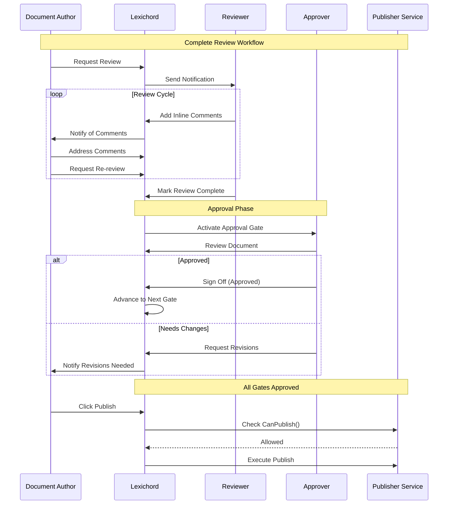

# LCS-DES-093: Design Specification Index — Review Workflows

## Document Control

| Field | Value |
| :--- | :--- |
| **Document ID** | LCS-DES-093-INDEX |
| **Feature ID** | COL-093 |
| **Feature Name** | Review Workflows (The Director's Notes) |
| **Target Version** | v0.9.3 |
| **Module Scope** | Lexichord.Modules.Collaboration |
| **Swimlane** | Collaboration |
| **License Tier** | Teams |
| **Feature Gate Key** | FeatureFlags.Collaboration.ReviewWorkflows |
| **Status** | Draft |
| **Last Updated** | 2026-01-27 |

---

## 1. Executive Summary

**v0.9.3** delivers **Review Workflows** — structured feedback and approval processes that transform Lexichord from a solo writing tool into a production-ready team collaboration platform.

### 1.1 The Problem

Content teams struggle with:

- **Fragmented Feedback:** Review comments scattered across emails, Slack, and document margins
- **No Accountability:** Unclear ownership of who needs to review and by when
- **Quality Gaps:** No formal approval gates before publication
- **Visibility Issues:** Team leads cannot track review progress across projects
- **Audit Failures:** No documented sign-off trail for compliance requirements

### 1.2 The Solution

Implement a comprehensive review system that:

1. **Request Reviews** — Assign reviewers with due dates and priority levels
2. **Inline Comments** — Provide contextual feedback anchored to specific text
3. **Approval Gates** — Require formal sign-offs before publishing
4. **Dashboard** — Centralize review tracking across all documents

### 1.3 Business Value

| Value | Description |
| :--- | :--- |
| **Quality Control** | Structured reviews ensure content meets standards |
| **Team Efficiency** | Centralized dashboard eliminates email chaos |
| **Compliance** | Auditable approval trails for regulated industries |
| **Accountability** | Clear ownership with due dates and notifications |
| **Enterprise Ready** | Professional workflows for large content teams |

---

## 2. Related Documents

### 2.1 Scope Breakdown Document

The detailed scope breakdown for v0.9.3, including all sub-parts, implementation checklists, user stories, and acceptance criteria:

| Document | Description |
| :--- | :--- |
| **[LCS-SBD-093](./LCS-SBD-093.md)** | Scope Breakdown — Review Workflows |

### 2.2 Sub-Part Design Specifications

Each sub-part has its own detailed design specification following the LDS-01 template:

| Sub-Part | Document | Title | Description |
| :--- | :--- | :--- | :--- |
| v0.9.3a | **[LCS-DES-093a](./LCS-DES-093a.md)** | Review Request | Assign reviewers, set due dates, manage requests |
| v0.9.3b | **[LCS-DES-093b](./LCS-DES-093b.md)** | Comment System | Inline comments, threads, @mentions |
| v0.9.3c | **[LCS-DES-093c](./LCS-DES-093c.md)** | Approval Gates | Multi-stage approval workflows |
| v0.9.3d | **[LCS-DES-093d](./LCS-DES-093d.md)** | Review Dashboard | Pending reviews, status tracking |

---

## 3. Architecture Overview

### 3.1 Component Diagram

```mermaid
graph TB
    subgraph "Lexichord.Modules.Collaboration"
        subgraph "v0.9.3a: Review Request"
            RRV[ReviewRequestView<br/>Dialog for creating requests]
            RRVM[ReviewRequestViewModel<br/>Request creation logic]
            RRS[ReviewRequestService<br/>Request management]
            RRR[ReviewRequestRepository<br/>Data persistence]
        end

        subgraph "v0.9.3b: Comment System"
            CPV[CommentPanelView<br/>Sidebar comment list]
            CPVM[CommentPanelViewModel<br/>Thread management]
            CS[CommentService<br/>Comment operations]
            CR[CommentRepository<br/>Data persistence]
            ICA[InlineCommentAdorner<br/>Editor integration]
        end

        subgraph "v0.9.3c: Approval Gates"
            AGS[ApprovalGateSettingsView<br/>Gate configuration]
            AGSVM[ApprovalGateSettingsViewModel<br/>Gate setup logic]
            AGSvc[ApprovalGateService<br/>Workflow management]
            AGR[ApprovalGateRepository<br/>Data persistence]
            ASB[ApprovalStatusBadge<br/>Status display]
        end

        subgraph "v0.9.3d: Dashboard"
            RDV[ReviewDashboardView<br/>Main dashboard]
            RDVM[ReviewDashboardViewModel<br/>Dashboard logic]
            RSC[ReviewSummaryCard<br/>Review item display]
            RMP[ReviewMetricsPanel<br/>Analytics display]
        end
    end

    subgraph "Upstream Dependencies"
        PS[IProfileService<br/>v0.9.1a]
        LS[ILicenseStateService<br/>v0.9.2c]
        DS[IDocumentService<br/>v0.1.3a]
        NS[INotificationService<br/>v0.7.4a]
        TS[ITeamService<br/>v0.7.1a]
        PUB[IPublisherService<br/>v0.8.1a]
    end

    subgraph "Data Layer"
        DB[(PostgreSQL<br/>review_requests<br/>review_comments<br/>approval_gates)]
    end

    RRV --> RRVM --> RRS --> RRR --> DB
    CPV --> CPVM --> CS --> CR --> DB
    AGS --> AGSVM --> AGSvc --> AGR --> DB
    RDV --> RDVM

    RDVM --> RRS
    RDVM --> CS
    RDVM --> AGSvc

    RRS --> PS
    RRS --> NS
    RRS --> LS

    CS --> PS
    CS --> NS
    CS --> LS

    AGSvc --> PUB
    AGSvc --> LS

    ICA --> CS
    ICA --> DS

    style RRV fill:#4a9eff,color:#fff
    style CPV fill:#4a9eff,color:#fff
    style AGS fill:#4a9eff,color:#fff
    style RDV fill:#4a9eff,color:#fff
    style RRS fill:#10b981,color:#fff
    style CS fill:#10b981,color:#fff
    style AGSvc fill:#10b981,color:#fff
    style DB fill:#f97316,color:#fff
```



### 3.2 Review Workflow Flow



---

## 4. Dependencies

### 4.1 Upstream Dependencies

| Interface | Source Version | Purpose |
| :--- | :--- | :--- |
| `IProfileService` | v0.9.1a | Retrieve reviewer profiles and avatars |
| `UserProfile` | v0.9.1a | Reviewer identity information |
| `ILicenseStateService` | v0.9.2c | Verify Teams tier for feature access |
| `IDocumentService` | v0.1.3a | Document access for comment anchoring |
| `IMediator` | v0.0.7a | Publish review lifecycle events |
| `INotificationService` | v0.7.4a | Send review notifications |
| `ITeamService` | v0.7.1a | Team membership for reviewer selection |
| `IPublisherService` | v0.8.1a | Block publishing without approvals |
| `IDbConnectionFactory` | v0.0.3a | Database connection pooling |

### 4.2 NuGet Packages

| Package | Version | Purpose |
| :--- | :--- | :--- |
| `Dapper` | 2.1.x | High-performance data access |
| `Npgsql` | 8.x | PostgreSQL ADO.NET driver |
| `FluentMigrator` | 5.x | Database schema migrations |
| `MediatR` | 12.x | In-process event publishing |
| `FluentValidation` | 11.x | Request validation |

### 4.3 Downstream Consumers (Future)

| Version | Feature | Uses From v0.9.3 |
| :--- | :--- | :--- |
| v0.9.4 | Zen Mode | Review-aware focus mode |
| v0.9.5 | Startup Optimizer | Review data caching |
| v1.0.x | Production Launch | Complete collaboration suite |
| v1.1.x | AI Integration | AI-assisted review suggestions |

---

## 5. License Gating Strategy

Review Workflows is a **Teams** tier feature.

### 5.1 Gating Behavior

| Tier | Behavior |
| :--- | :--- |
| Core | Feature completely hidden; no UI elements visible |
| Writer | Feature completely hidden; no UI elements visible |
| WriterPro | Feature visible but disabled with upgrade prompt |
| Teams | Full functionality |
| Enterprise | Full functionality with audit enhancements |

### 5.2 UI Gating Implementation

```csharp
// In CollaborationModule.cs
public void ConfigureUI(IShellService shell, ILicenseContext license)
{
    if (!license.HasFeature(FeatureFlags.Collaboration.ReviewWorkflows))
    {
        // Hide review-related menu items
        shell.HideMenuItem("Document.RequestReview");
        shell.HideMenuItem("View.ReviewDashboard");

        // If WriterPro, show disabled with upgrade
        if (license.Tier == LicenseTier.WriterPro)
        {
            shell.ShowDisabledWithUpgrade("Document.RequestReview", "Teams");
        }
        return;
    }

    // Full access - show all review UI
    shell.ShowMenuItem("Document.RequestReview");
    shell.ShowMenuItem("View.ReviewDashboard");
    shell.ShowCommentPanel();
}
```

---

## 6. Database Schema Summary

### 6.1 Tables Created

| Table | Purpose | Key Columns |
| :--- | :--- | :--- |
| `review_requests` | Review request metadata | document_id, requested_by, due_date, status |
| `reviewer_assignments` | Individual reviewer assignments | review_id, user_id, role, status |
| `review_comments` | Inline comments | document_id, anchor_*, content, is_resolved |
| `comment_mentions` | @mention tracking | comment_id, user_id |
| `approval_workflows` | Document workflows | document_id, status, current_gate_index |
| `approval_gates` | Individual gates | workflow_id, gate_name, gate_type, status |
| `gate_approvers` | Gate approver assignments | gate_id, user_id |
| `approval_signoffs` | Signoff records | gate_id, approver_id, decision |

### 6.2 Migration Sequence

```sql
-- Migration order for v0.9.3
1. 2026_01_27_01_ReviewRequests.cs
2. 2026_01_27_02_ReviewComments.cs
3. 2026_01_27_03_ApprovalGates.cs
```

---

## 7. Key Interfaces Summary

### 7.1 Service Interfaces

| Interface | Sub-Part | Purpose |
| :--- | :--- | :--- |
| `IReviewRequestService` | v0.9.3a | Create, manage, and track review requests |
| `ICommentService` | v0.9.3b | Add, edit, resolve inline comments |
| `IApprovalGateService` | v0.9.3c | Manage approval workflows and signoffs |

### 7.2 Key Methods

```csharp
// Review Requests
Task<ReviewRequest> CreateRequestAsync(CreateReviewRequestCommand command, CancellationToken ct);
Task<IReadOnlyList<ReviewRequest>> GetPendingReviewsForUserAsync(Guid userId, CancellationToken ct);
Task UpdateReviewerStatusAsync(Guid reviewId, Guid userId, ReviewerStatus status, CancellationToken ct);

// Comments
Task<ReviewComment> AddCommentAsync(AddCommentCommand command, CancellationToken ct);
Task ResolveThreadAsync(Guid commentId, CancellationToken ct);
IReadOnlyList<UserMention> ParseMentions(string content);

// Approval Gates
Task<ApprovalWorkflow> CreateWorkflowAsync(Guid documentId, IReadOnlyList<CreateGateCommand> gates, CancellationToken ct);
Task<ApprovalSignoff> SignoffAsync(Guid gateId, SignoffDecision decision, string? comment, CancellationToken ct);
Task<bool> CanPublishAsync(Guid documentId, CancellationToken ct);
```

---

## 8. MediatR Events

| Event | Published When | Subscribers |
| :--- | :--- | :--- |
| `ReviewRequestedEvent` | Review request created | NotificationService, ActivityLog |
| `ReviewerAssignedEvent` | Reviewer added to request | NotificationService |
| `ReviewCompletedEvent` | All reviewers finished | NotificationService, Dashboard |
| `CommentAddedEvent` | New comment posted | NotificationService (for mentions) |
| `CommentResolvedEvent` | Comment thread resolved | ActivityLog |
| `GateActivatedEvent` | Approval gate becomes active | NotificationService (approvers) |
| `GateApprovedEvent` | Gate receives approval | WorkflowService, ActivityLog |
| `GateRejectedEvent` | Gate receives rejection | NotificationService, WorkflowService |
| `WorkflowCompletedEvent` | All gates approved | PublisherService, Dashboard |

---

## 9. Key Test Scenarios Summary

### 9.1 Review Request (v0.9.3a)

| Scenario | Expected Result |
| :--- | :--- |
| Create request with multiple reviewers | All reviewers notified |
| Set due date in past | Validation error |
| All reviewers approve | Request marked Completed |
| Cancel active request | Status changes to Cancelled |

### 9.2 Comments (v0.9.3b)

| Scenario | Expected Result |
| :--- | :--- |
| Add comment to text range | Comment anchored correctly |
| @mention user in comment | User receives notification |
| Resolve comment thread | Thread marked resolved |
| Reply to existing comment | Reply indented under parent |

### 9.3 Approval Gates (v0.9.3c)

| Scenario | Expected Result |
| :--- | :--- |
| Create workflow with 3 gates | Gates ordered 0, 1, 2 |
| First gate approved | Workflow advances to gate 1 |
| Any gate rejected | Workflow marked Rejected |
| All gates approved | CanPublish returns true |
| Bypass gate | Logged with reason |

### 9.4 Dashboard (v0.9.3d)

| Scenario | Expected Result |
| :--- | :--- |
| Load with 100 reviews | Completes in < 1 second |
| Filter by overdue | Shows only overdue items |
| Sort by priority | Urgent items first |
| Quick approve action | Updates without page reload |

---

## 10. Implementation Checklist Summary

| Sub-Part | Tasks | Est. Hours |
| :--- | :--- | :--- |
| v0.9.3a | Review Request System | 15.5 |
| v0.9.3b | Comment System | 18 |
| v0.9.3c | Approval Gates | 15 |
| v0.9.3d | Review Dashboard | 11 |
| Integration | Tests & DI Registration | 4 |
| **Total** | | **60 hours** |

See [LCS-SBD-093](./LCS-SBD-093.md) Section 4 for the detailed task breakdown.

---

## 11. Success Criteria Summary

| Category | Criterion | Target |
| :--- | :--- | :--- |
| **Review Request** | Creation time | < 500ms |
| **Comments** | Add comment | < 200ms |
| **Comments** | Anchor accuracy | 95%+ after edits |
| **Approval** | Signoff recording | < 300ms |
| **Dashboard** | Load time (100 reviews) | < 1 second |
| **License Gate** | Non-Teams blocked | 100% |

See [LCS-SBD-093](./LCS-SBD-093.md) Section 9 for full success metrics.

---

## 12. UI Components Summary

| Component | Type | Location |
| :--- | :--- | :--- |
| `ReviewRequestView` | Dialog | Document toolbar action |
| `CommentPanelView` | Sidebar | Right panel in editor |
| `InlineCommentAdorner` | Editor overlay | Document margin |
| `ApprovalGateSettingsView` | Dialog | Document settings |
| `ApprovalStatusBadge` | Badge | Document header |
| `ReviewDashboardView` | Full view | Navigation menu |
| `ReviewSummaryCard` | Card | Dashboard list item |
| `ReviewMetricsPanel` | Panel | Dashboard header |

---

## 13. What This Enables

| Version | Feature | Uses From v0.9.3 |
| :--- | :--- | :--- |
| v0.9.4 | Zen Mode | Hide comments during focused writing |
| v0.9.5 | Startup Optimizer | Cache review data for fast dashboard |
| v1.0.x | Production Release | Complete team collaboration feature set |
| v1.1.x | AI Reviews | AI-assisted review comment suggestions |

---

## Document History

| Version | Date | Author | Changes |
| :--- | :--- | :--- | :--- |
| 1.0 | 2026-01-27 | Lead Architect | Initial draft |
