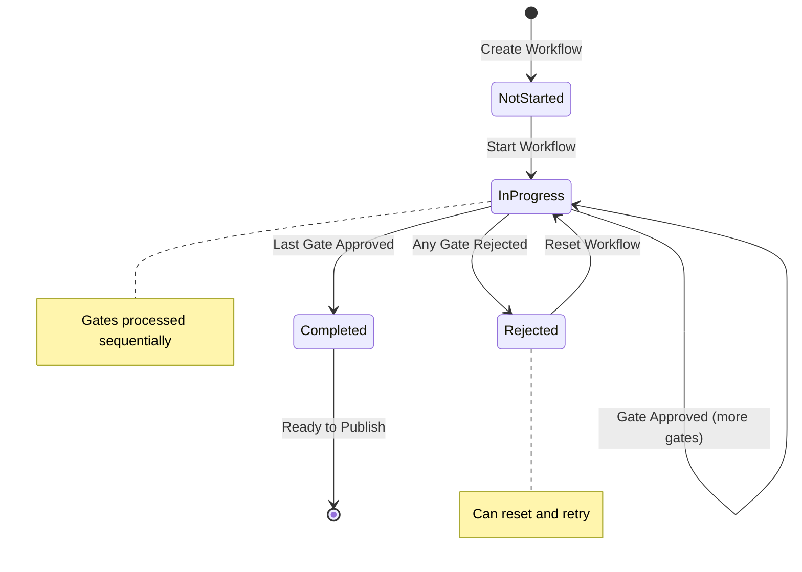

# LCS-DES-093c: Design Specification — Approval Gates

## 1. Metadata & Categorization

| Field | Value | Description |
| :--- | :--- | :--- |
| **Feature ID** | `COL-093c` | Sub-part of COL-093 |
| **Feature Name** | `Approval Gate System` | Multi-stage approval workflows |
| **Target Version** | `v0.9.3c` | Third sub-part of v0.9.3 |
| **Module Scope** | `Lexichord.Modules.Collaboration` | Collaboration module |
| **Swimlane** | `Collaboration` | Team features vertical |
| **License Tier** | `Teams` | Teams tier required |
| **Feature Gate Key** | `FeatureFlags.Collaboration.ReviewWorkflows` | License check key |
| **Author** | Lead Architect | |
| **Status** | `Draft` | |
| **Last Updated** | `2026-01-27` | |
| **Parent Document** | [LCS-DES-093-INDEX](./LCS-DES-093-INDEX.md) | |
| **Scope Breakdown** | [LCS-SBD-093 Section 3.3](./LCS-SBD-093.md#33-v093c-approval-gates) | |

---

## 2. Executive Summary

### 2.1 The Requirement

Enterprise content teams require formal sign-off before publication:

- Legal must approve marketing claims before they go live
- Executives must sign off on press releases
- Compliance must review regulatory filings
- No audit trail exists for who approved what and when
- Documents can be published without required approvals

> **Goal:** Implement configurable approval gates that require designated sign-offs before documents can be published, creating an auditable approval trail.

### 2.2 The Proposed Solution

Implement an Approval Gate System that:

1. Allows configuration of multi-stage approval workflows per document
2. Defines required approvers for each gate with minimum approval counts
3. Blocks publishing until all gates are approved
4. Records all signoff decisions with timestamps and comments
5. Supports gate bypass with audit logging for emergencies
6. Provides visual workflow status indicators
7. Integrates with the Publisher service to enforce approvals

---

## 3. Architecture & Modular Strategy

### 3.1 Dependencies

#### 3.1.1 Upstream Modules

| Interface | Source Version | Purpose |
| :--- | :--- | :--- |
| `IPublisherService` | v0.8.1a | Block publishing without approvals |
| `IProfileService` | v0.9.1a | Approver identity and display |
| `INotificationService` | v0.7.4a | Notify approvers when gate activates |
| `ILicenseStateService` | v0.9.2c | Verify Teams tier access |
| `IDocumentService` | v0.1.3a | Document metadata for display |
| `IMediator` | v0.0.7a | Publish approval events |
| `IDbConnectionFactory` | v0.0.3a | Database connections |

#### 3.1.2 NuGet Packages

| Package | Version | Purpose |
| :--- | :--- | :--- |
| `Dapper` | 2.1.x | Database access |
| `Npgsql` | 8.x | PostgreSQL driver |
| `FluentValidation` | 11.x | Workflow validation |
| `MediatR` | 12.x | Event publishing |

### 3.2 Licensing Behavior

- **Load Behavior:** Soft Gate — Approval settings hidden for non-Teams users
- **Fallback Experience:**
  - Approval workflow configuration not visible in document settings
  - If document has workflow configured, lower-tier users see read-only status
  - Publish proceeds normally for documents without approval workflows

---

## 4. Data Contract (The API)

### 4.1 Domain Records

```csharp
namespace Lexichord.Modules.Collaboration.Models;

/// <summary>
/// Represents a single approval gate in a document's workflow.
/// Gates must be completed in order before publishing.
/// </summary>
public record ApprovalGate
{
    public Guid GateId { get; init; } = Guid.NewGuid();
    public required Guid WorkflowId { get; init; }
    public required string GateName { get; init; }
    public string? Description { get; init; }
    public required int Order { get; init; }
    public ApprovalGateType Type { get; init; } = ApprovalGateType.Review;
    public required IReadOnlyList<Guid> RequiredApproverIds { get; init; }
    public int MinimumApprovals { get; init; } = 1;
    public bool RequireAllApprovers { get; init; }
    public GateStatus Status { get; init; } = GateStatus.Pending;
    public DateTime? ActivatedAt { get; init; }
    public DateTime? CompletedAt { get; init; }

    /// <summary>
    /// Returns true if gate is currently awaiting signoffs.
    /// </summary>
    public bool IsActive => Status == GateStatus.Active;

    /// <summary>
    /// Returns the number of approvals still needed.
    /// </summary>
    public int ApprovalsNeeded(int currentApprovals) =>
        RequireAllApprovers
            ? RequiredApproverIds.Count - currentApprovals
            : Math.Max(0, MinimumApprovals - currentApprovals);
}

/// <summary>
/// Represents an individual signoff on an approval gate.
/// </summary>
public record ApprovalSignoff
{
    public Guid SignoffId { get; init; } = Guid.NewGuid();
    public required Guid GateId { get; init; }
    public required Guid ApproverId { get; init; }
    public required string ApproverName { get; init; }
    public string? ApproverAvatarPath { get; init; }
    public required SignoffDecision Decision { get; init; }
    public string? Comment { get; init; }
    public DateTime SignedAt { get; init; } = DateTime.UtcNow;
}

/// <summary>
/// Represents a complete approval workflow for a document.
/// Contains ordered gates that must be completed for publishing.
/// </summary>
public record ApprovalWorkflow
{
    public Guid WorkflowId { get; init; } = Guid.NewGuid();
    public required Guid DocumentId { get; init; }
    public required IReadOnlyList<ApprovalGate> Gates { get; init; }
    public WorkflowStatus Status { get; init; } = WorkflowStatus.NotStarted;
    public int CurrentGateIndex { get; init; }
    public DateTime CreatedAt { get; init; } = DateTime.UtcNow;
    public DateTime? CompletedAt { get; init; }

    /// <summary>
    /// Gets the currently active gate, or null if workflow complete.
    /// </summary>
    public ApprovalGate? CurrentGate =>
        CurrentGateIndex < Gates.Count ? Gates[CurrentGateIndex] : null;

    /// <summary>
    /// Returns true if all gates have been approved.
    /// </summary>
    public bool IsFullyApproved =>
        Status == WorkflowStatus.Completed ||
        Gates.All(g => g.Status == GateStatus.Approved);

    /// <summary>
    /// Returns progress as percentage (0-100).
    /// </summary>
    public int ProgressPercent =>
        Gates.Count == 0 ? 100 :
        (int)(Gates.Count(g => g.Status == GateStatus.Approved) * 100.0 / Gates.Count);
}

/// <summary>
/// Types of approval gates.
/// </summary>
public enum ApprovalGateType
{
    Review = 0,
    Legal = 1,
    Editorial = 2,
    Executive = 3,
    Compliance = 4,
    Custom = 5
}

/// <summary>
/// Status of an individual gate.
/// </summary>
public enum GateStatus
{
    Pending = 0,
    Active = 1,
    Approved = 2,
    Rejected = 3,
    Bypassed = 4
}

/// <summary>
/// Decision made by an approver.
/// </summary>
public enum SignoffDecision
{
    Approved = 0,
    Rejected = 1,
    NeedsRevision = 2
}

/// <summary>
/// Status of the overall workflow.
/// </summary>
public enum WorkflowStatus
{
    NotStarted = 0,
    InProgress = 1,
    Completed = 2,
    Rejected = 3,
    Cancelled = 4
}
```

### 4.2 Service Interface

```csharp
namespace Lexichord.Modules.Collaboration.Abstractions;

/// <summary>
/// Manages approval workflows including gate creation,
/// signoff recording, and publish authorization.
/// </summary>
public interface IApprovalGateService
{
    /// <summary>
    /// Creates a new approval workflow for a document.
    /// Replaces any existing workflow.
    /// </summary>
    /// <param name="documentId">The document ID.</param>
    /// <param name="gates">Ordered list of gates to create.</param>
    /// <param name="ct">Cancellation token.</param>
    /// <returns>The created workflow.</returns>
    Task<ApprovalWorkflow> CreateWorkflowAsync(
        Guid documentId,
        IReadOnlyList<CreateGateCommand> gates,
        CancellationToken ct = default);

    /// <summary>
    /// Gets the approval workflow for a document.
    /// </summary>
    /// <param name="documentId">The document ID.</param>
    /// <param name="ct">Cancellation token.</param>
    /// <returns>The workflow or null if none configured.</returns>
    Task<ApprovalWorkflow?> GetWorkflowAsync(
        Guid documentId,
        CancellationToken ct = default);

    /// <summary>
    /// Gets the currently active gate for a document.
    /// </summary>
    /// <param name="documentId">The document ID.</param>
    /// <param name="ct">Cancellation token.</param>
    /// <returns>The active gate or null if complete/none.</returns>
    Task<ApprovalGate?> GetCurrentGateAsync(
        Guid documentId,
        CancellationToken ct = default);

    /// <summary>
    /// Records an approver's signoff decision.
    /// Evaluates gate completion and advances workflow if appropriate.
    /// </summary>
    /// <param name="gateId">The gate ID.</param>
    /// <param name="decision">The signoff decision.</param>
    /// <param name="comment">Optional comment.</param>
    /// <param name="ct">Cancellation token.</param>
    /// <returns>The recorded signoff.</returns>
    Task<ApprovalSignoff> SignoffAsync(
        Guid gateId,
        SignoffDecision decision,
        string? comment = null,
        CancellationToken ct = default);

    /// <summary>
    /// Checks if a document can be published.
    /// Returns true only if all gates approved or no workflow configured.
    /// </summary>
    /// <param name="documentId">The document ID.</param>
    /// <param name="ct">Cancellation token.</param>
    /// <returns>True if publishing is allowed.</returns>
    Task<bool> CanPublishAsync(
        Guid documentId,
        CancellationToken ct = default);

    /// <summary>
    /// Gets detailed publish authorization with reason.
    /// </summary>
    /// <param name="documentId">The document ID.</param>
    /// <param name="ct">Cancellation token.</param>
    /// <returns>Authorization result with details.</returns>
    Task<PublishAuthorizationResult> GetPublishAuthorizationAsync(
        Guid documentId,
        CancellationToken ct = default);

    /// <summary>
    /// Bypasses a gate with admin override.
    /// Logs the bypass action for audit trail.
    /// </summary>
    /// <param name="gateId">The gate to bypass.</param>
    /// <param name="reason">Required reason for bypass.</param>
    /// <param name="ct">Cancellation token.</param>
    Task BypassGateAsync(
        Guid gateId,
        string reason,
        CancellationToken ct = default);

    /// <summary>
    /// Resets a workflow to start from the beginning.
    /// Clears all signoffs.
    /// </summary>
    /// <param name="documentId">The document ID.</param>
    /// <param name="ct">Cancellation token.</param>
    Task ResetWorkflowAsync(
        Guid documentId,
        CancellationToken ct = default);

    /// <summary>
    /// Deletes a workflow from a document.
    /// </summary>
    /// <param name="documentId">The document ID.</param>
    /// <param name="ct">Cancellation token.</param>
    Task DeleteWorkflowAsync(
        Guid documentId,
        CancellationToken ct = default);

    /// <summary>
    /// Gets the signoff history for a document's workflow.
    /// </summary>
    /// <param name="documentId">The document ID.</param>
    /// <param name="ct">Cancellation token.</param>
    /// <returns>Chronological list of signoffs.</returns>
    Task<IReadOnlyList<ApprovalSignoff>> GetSignoffHistoryAsync(
        Guid documentId,
        CancellationToken ct = default);

    /// <summary>
    /// Starts a workflow, activating the first gate.
    /// </summary>
    /// <param name="documentId">The document ID.</param>
    /// <param name="ct">Cancellation token.</param>
    Task StartWorkflowAsync(
        Guid documentId,
        CancellationToken ct = default);
}

/// <summary>
/// Command for creating a gate in a workflow.
/// </summary>
public record CreateGateCommand
{
    public required string GateName { get; init; }
    public string? Description { get; init; }
    public ApprovalGateType Type { get; init; } = ApprovalGateType.Review;
    public required IReadOnlyList<Guid> RequiredApproverIds { get; init; }
    public int MinimumApprovals { get; init; } = 1;
    public bool RequireAllApprovers { get; init; }
}

/// <summary>
/// Result of publish authorization check.
/// </summary>
public record PublishAuthorizationResult
{
    public required bool IsAuthorized { get; init; }
    public string? BlockReason { get; init; }
    public ApprovalGate? BlockingGate { get; init; }
    public IReadOnlyList<string> PendingApprovers { get; init; } = [];
    public int GatesRemaining { get; init; }
}
```

### 4.3 MediatR Events

```csharp
namespace Lexichord.Modules.Collaboration.Events;

/// <summary>
/// Published when an approval workflow is created.
/// </summary>
public record WorkflowCreatedEvent(
    Guid WorkflowId,
    Guid DocumentId,
    int GateCount) : INotification;

/// <summary>
/// Published when a gate becomes active.
/// </summary>
public record GateActivatedEvent(
    Guid GateId,
    Guid DocumentId,
    string GateName,
    IReadOnlyList<Guid> ApproverIds) : INotification;

/// <summary>
/// Published when a gate receives approval.
/// </summary>
public record GateApprovedEvent(
    Guid GateId,
    Guid DocumentId,
    string GateName) : INotification;

/// <summary>
/// Published when a gate is rejected.
/// </summary>
public record GateRejectedEvent(
    Guid GateId,
    Guid DocumentId,
    string GateName,
    Guid RejectedBy,
    string? Comment) : INotification;

/// <summary>
/// Published when a gate is bypassed.
/// </summary>
public record GateBypassedEvent(
    Guid GateId,
    Guid DocumentId,
    Guid BypassedBy,
    string Reason) : INotification;

/// <summary>
/// Published when all gates are approved.
/// </summary>
public record WorkflowCompletedEvent(
    Guid WorkflowId,
    Guid DocumentId,
    DateTime CompletedAt) : INotification;

/// <summary>
/// Published when a signoff is recorded.
/// </summary>
public record SignoffRecordedEvent(
    Guid SignoffId,
    Guid GateId,
    Guid ApproverId,
    SignoffDecision Decision) : INotification;
```

---

## 5. Implementation Logic

### 5.1 Workflow Lifecycle



### 5.2 Gate Completion Logic

```csharp
/// <summary>
/// Evaluates whether a gate should be marked as approved.
/// </summary>
public async Task<GateStatus> EvaluateGateCompletionAsync(
    Guid gateId, CancellationToken ct)
{
    var gate = await _repository.GetGateWithSignoffsAsync(gateId, ct);
    if (gate is null) throw new InvalidOperationException("Gate not found");

    var signoffs = await _repository.GetSignoffsForGateAsync(gateId, ct);

    // Count by decision type
    var approvedCount = signoffs.Count(s => s.Decision == SignoffDecision.Approved);
    var rejectedCount = signoffs.Count(s => s.Decision == SignoffDecision.Rejected);
    var revisionsCount = signoffs.Count(s => s.Decision == SignoffDecision.NeedsRevision);

    // Check for rejection first
    if (rejectedCount > 0)
    {
        return GateStatus.Rejected;
    }

    // Check for approval threshold
    if (gate.RequireAllApprovers)
    {
        // All required approvers must approve
        if (approvedCount >= gate.RequiredApproverIds.Count)
        {
            return GateStatus.Approved;
        }

        // Check if approval is still possible
        var pendingCount = gate.RequiredApproverIds.Count - signoffs.Count;
        if (revisionsCount > 0 && pendingCount == 0)
        {
            // All have signed off but some requested revisions
            // Gate cannot be approved until reset
            return GateStatus.Active;
        }
    }
    else
    {
        // Minimum approvals required
        if (approvedCount >= gate.MinimumApprovals)
        {
            return GateStatus.Approved;
        }

        // Check if enough approvers remain to reach threshold
        var pendingApprovers = gate.RequiredApproverIds.Count - signoffs.Count;
        var maxPossibleApprovals = approvedCount + pendingApprovers;
        if (maxPossibleApprovals < gate.MinimumApprovals)
        {
            // Mathematically impossible to reach threshold
            _logger.LogWarning(
                "Gate {GateId} cannot reach approval threshold: {Current}/{Required}, {Pending} pending",
                gateId, approvedCount, gate.MinimumApprovals, pendingApprovers);
        }
    }

    return GateStatus.Active;
}

/// <summary>
/// Advances workflow to next gate after current gate approved.
/// </summary>
public async Task AdvanceWorkflowAsync(Guid workflowId, CancellationToken ct)
{
    var workflow = await _repository.GetWorkflowAsync(workflowId, ct);
    if (workflow is null) return;

    var nextIndex = workflow.CurrentGateIndex + 1;

    if (nextIndex >= workflow.Gates.Count)
    {
        // All gates complete
        var completedWorkflow = workflow with
        {
            Status = WorkflowStatus.Completed,
            CompletedAt = DateTime.UtcNow
        };
        await _repository.UpdateWorkflowAsync(completedWorkflow, ct);

        await _mediator.Publish(new WorkflowCompletedEvent(
            workflowId, workflow.DocumentId, DateTime.UtcNow), ct);

        _logger.LogInformation(
            "Workflow {WorkflowId} completed for document {DocumentId}",
            workflowId, workflow.DocumentId);
    }
    else
    {
        // Activate next gate
        var updatedWorkflow = workflow with { CurrentGateIndex = nextIndex };
        await _repository.UpdateWorkflowAsync(updatedWorkflow, ct);

        var nextGate = workflow.Gates[nextIndex];
        var activatedGate = nextGate with
        {
            Status = GateStatus.Active,
            ActivatedAt = DateTime.UtcNow
        };
        await _repository.UpdateGateAsync(activatedGate, ct);

        await _mediator.Publish(new GateActivatedEvent(
            nextGate.GateId,
            workflow.DocumentId,
            nextGate.GateName,
            nextGate.RequiredApproverIds), ct);

        _logger.LogInformation(
            "Gate {GateName} activated for document {DocumentId}",
            nextGate.GateName, workflow.DocumentId);
    }
}
```

### 5.3 Publisher Integration

```csharp
/// <summary>
/// Publisher service decorator that enforces approval gates.
/// </summary>
public class ApprovalGatePublisherDecorator : IPublisherService
{
    private readonly IPublisherService _inner;
    private readonly IApprovalGateService _approvalService;

    public async Task<PublishResult> PublishAsync(
        Guid documentId, PublishOptions options, CancellationToken ct)
    {
        // Check approval authorization
        var auth = await _approvalService.GetPublishAuthorizationAsync(documentId, ct);

        if (!auth.IsAuthorized)
        {
            return new PublishResult
            {
                Success = false,
                ErrorCode = "APPROVAL_REQUIRED",
                ErrorMessage = auth.BlockReason,
                BlockingGate = auth.BlockingGate?.GateName,
                PendingApprovers = auth.PendingApprovers
            };
        }

        // Proceed with publishing
        return await _inner.PublishAsync(documentId, options, ct);
    }
}
```

### 5.4 Signoff Decision Flow

```text
SIGNOFF PROCESSING:

User clicks [Approve] / [Reject] / [Request Revisions]
│
├── Validate user is authorized approver for gate
│   └── NOT authorized → Return error
│
├── Check gate is Active
│   └── NOT Active → Return error "Gate not accepting signoffs"
│
├── Check user hasn't already signed off
│   └── Already signed → Update existing signoff
│
├── Record signoff in database
│
├── Evaluate gate completion
│   ├── Approved → Mark gate Approved, advance workflow
│   ├── Rejected → Mark gate Rejected, mark workflow Rejected
│   └── Active → Await more signoffs
│
├── Send notifications
│   ├── If Approved: Notify document owner
│   ├── If Rejected: Notify document owner with reason
│   └── If Completed: Notify all stakeholders
│
└── Return signoff result
```

---

## 6. Data Persistence

### 6.1 Database Schema

```sql
-- Migration: 2026_01_27_03_ApprovalGates.cs

CREATE TABLE approval_workflows (
    workflow_id UUID PRIMARY KEY DEFAULT gen_random_uuid(),
    document_id UUID NOT NULL UNIQUE,
    status VARCHAR(20) NOT NULL DEFAULT 'NotStarted',
    current_gate_index INT NOT NULL DEFAULT 0,
    created_at TIMESTAMP WITH TIME ZONE NOT NULL DEFAULT NOW(),
    completed_at TIMESTAMP WITH TIME ZONE,

    CONSTRAINT fk_workflow_document FOREIGN KEY (document_id)
        REFERENCES documents(document_id) ON DELETE CASCADE,
    CONSTRAINT chk_workflow_status CHECK (status IN (
        'NotStarted', 'InProgress', 'Completed', 'Rejected', 'Cancelled'))
);

CREATE TABLE approval_gates (
    gate_id UUID PRIMARY KEY DEFAULT gen_random_uuid(),
    workflow_id UUID NOT NULL,
    gate_name VARCHAR(100) NOT NULL,
    description TEXT,
    gate_order INT NOT NULL,
    gate_type VARCHAR(20) NOT NULL DEFAULT 'Review',
    minimum_approvals INT NOT NULL DEFAULT 1,
    require_all_approvers BOOLEAN NOT NULL DEFAULT FALSE,
    status VARCHAR(20) NOT NULL DEFAULT 'Pending',
    activated_at TIMESTAMP WITH TIME ZONE,
    completed_at TIMESTAMP WITH TIME ZONE,

    CONSTRAINT fk_gate_workflow FOREIGN KEY (workflow_id)
        REFERENCES approval_workflows(workflow_id) ON DELETE CASCADE,
    CONSTRAINT chk_gate_type CHECK (gate_type IN (
        'Review', 'Legal', 'Editorial', 'Executive', 'Compliance', 'Custom')),
    CONSTRAINT chk_gate_status CHECK (status IN (
        'Pending', 'Active', 'Approved', 'Rejected', 'Bypassed'))
);

CREATE TABLE gate_approvers (
    gate_id UUID NOT NULL,
    user_id UUID NOT NULL,

    PRIMARY KEY (gate_id, user_id),
    CONSTRAINT fk_approver_gate FOREIGN KEY (gate_id)
        REFERENCES approval_gates(gate_id) ON DELETE CASCADE,
    CONSTRAINT fk_approver_user FOREIGN KEY (user_id)
        REFERENCES user_profiles(profile_id) ON DELETE CASCADE
);

CREATE TABLE approval_signoffs (
    signoff_id UUID PRIMARY KEY DEFAULT gen_random_uuid(),
    gate_id UUID NOT NULL,
    approver_id UUID NOT NULL,
    decision VARCHAR(20) NOT NULL,
    comment TEXT,
    signed_at TIMESTAMP WITH TIME ZONE NOT NULL DEFAULT NOW(),

    CONSTRAINT fk_signoff_gate FOREIGN KEY (gate_id)
        REFERENCES approval_gates(gate_id) ON DELETE CASCADE,
    CONSTRAINT fk_signoff_approver FOREIGN KEY (approver_id)
        REFERENCES user_profiles(profile_id) ON DELETE SET NULL,
    CONSTRAINT chk_decision CHECK (decision IN ('Approved', 'Rejected', 'NeedsRevision')),
    CONSTRAINT uq_signoff_gate_approver UNIQUE (gate_id, approver_id)
);

CREATE TABLE gate_bypass_log (
    bypass_id UUID PRIMARY KEY DEFAULT gen_random_uuid(),
    gate_id UUID NOT NULL,
    bypassed_by UUID NOT NULL,
    reason TEXT NOT NULL,
    bypassed_at TIMESTAMP WITH TIME ZONE NOT NULL DEFAULT NOW(),

    CONSTRAINT fk_bypass_gate FOREIGN KEY (gate_id)
        REFERENCES approval_gates(gate_id) ON DELETE CASCADE,
    CONSTRAINT fk_bypass_user FOREIGN KEY (bypassed_by)
        REFERENCES user_profiles(profile_id) ON DELETE SET NULL
);

-- Indexes
CREATE INDEX idx_workflows_document ON approval_workflows(document_id);
CREATE INDEX idx_workflows_status ON approval_workflows(status);
CREATE INDEX idx_gates_workflow ON approval_gates(workflow_id);
CREATE INDEX idx_gates_status ON approval_gates(status);
CREATE INDEX idx_signoffs_gate ON approval_signoffs(gate_id);
CREATE INDEX idx_signoffs_approver ON approval_signoffs(approver_id);
CREATE INDEX idx_bypass_gate ON gate_bypass_log(gate_id);
```

---

## 7. UI/UX Specifications

### 7.1 Workflow Configuration Dialog

```text
+------------------------------------------------------------------+
|  Configure Approval Workflow                              [X]    |
+------------------------------------------------------------------+
| Document: Marketing Brief Q1 2026                                 |
|                                                                   |
| Approval Gates (drag to reorder)                                  |
| +--------------------------------------------------------------+ |
| | [=] 1. Editorial Review                           [Edit] [X] | |
| |     Type: Editorial                                           | |
| |     Approvers: Jane Smith, John Doe                           | |
| |     Requires: All approvers                                   | |
| +--------------------------------------------------------------+ |
| | [=] 2. Legal Review                               [Edit] [X] | |
| |     Type: Legal                                               | |
| |     Approvers: Legal Team                                     | |
| |     Requires: 1 of 2 approvers                                | |
| +--------------------------------------------------------------+ |
| | [=] 3. Executive Sign-off                         [Edit] [X] | |
| |     Type: Executive                                           | |
| |     Approvers: VP Marketing                                   | |
| |     Requires: All approvers                                   | |
| +--------------------------------------------------------------+ |
| | [+ Add Gate]                                                  | |
+--------------------------------------------------------------+ |
|                                                                   |
| Templates: [Select a template...  v]                              |
|                                                                   |
|                              [Cancel]   [Save Workflow]           |
+------------------------------------------------------------------+
```

### 7.2 Gate Editor Dialog

```text
+------------------------------------------------------------------+
|  Edit Gate: Legal Review                                   [X]   |
+------------------------------------------------------------------+
|                                                                   |
| Gate Name:     [Legal Review                              ]       |
|                                                                   |
| Type:          [Legal                                   v]        |
|                                                                   |
| Description:   [Ensure all claims are legally compliant.  ]       |
|                [                                          ]       |
|                                                                   |
| Approvers:                                                        |
| +--------------------------------------------------------------+ |
| | [Search approvers...]                                        | |
| +--------------------------------------------------------------+ |
| | [Avatar] Sarah Legal (sarah.legal@company.com)     [Remove]  | |
| | [Avatar] Tom Compliance (tom.c@company.com)        [Remove]  | |
| +--------------------------------------------------------------+ |
|                                                                   |
| Approval Requirement:                                             |
| (o) Minimum approvals: [1] of 2                                   |
| ( ) All approvers must approve                                    |
|                                                                   |
|                                    [Cancel]   [Save Gate]         |
+------------------------------------------------------------------+
```

### 7.3 Workflow Status Display

```text
+------------------------------------------------------------------+
|  Approval Workflow Status                                         |
+------------------------------------------------------------------+
|                                                                   |
|  [1]─────────────[2]─────────────[3]                              |
|   ✓                ●              ○                               |
|  Editorial       Legal         Executive                          |
|  APPROVED      ACTIVE          PENDING                            |
|                                                                   |
|  +--------------------------------------------------------------+ |
|  | Current Gate: Legal Review                                   | |
|  |                                                              | |
|  | Waiting for approvals from:                                  | |
|  |   [Avatar] Sarah Legal                    [PENDING]          | |
|  |   [Avatar] Tom Compliance                 [PENDING]          | |
|  |                                                              | |
|  | Minimum approvals needed: 1 of 2                             | |
|  +--------------------------------------------------------------+ |
|                                                                   |
|  Previous Gate: Editorial Review                                  |
|    ✓ Approved by Jane Smith on Jan 25, 2026                       |
|    ✓ Approved by John Doe on Jan 25, 2026                         |
|                                                                   |
+------------------------------------------------------------------+
```

### 7.4 Signoff Interface

```text
+------------------------------------------------------------------+
|  Legal Review - Your Approval Required                            |
+------------------------------------------------------------------+
|  Document: Marketing Brief Q1 2026                                |
|  Requested by: Jane Smith                                         |
|                                                                   |
|  Gate Description:                                                |
|  "Ensure all marketing claims are legally compliant and           |
|   properly sourced."                                              |
|                                                                   |
|  +--------------------------------------------------------------+ |
|  | Comments (optional):                                         | |
|  | [All claims verified. Approved pending minor updates.      ] | |
|  | [                                                          ] | |
|  +--------------------------------------------------------------+ |
|                                                                   |
|  [Request Revisions]     [Reject]     [Approve]                   |
+------------------------------------------------------------------+
```

### 7.5 Document Header Badge

```text
+------------------------------------------------------------------+
| Document: Marketing Brief Q1 2026                                 |
|                                                                   |
| +--------------------+  +--------------------------------------+  |
| | AWAITING APPROVAL  |  | Gate 2/3: Legal Review               |  |
| +--------------------+  +--------------------------------------+  |
|                                                                   |
| [Publish] <- Disabled: "Awaiting approval from Legal Review"      |
+------------------------------------------------------------------+
```

### 7.6 Component Styling

| Component | Theme Resource | Usage |
| :--- | :--- | :--- |
| Gate Pending | `Brush.Status.Pending` | Gray circle/text |
| Gate Active | `Brush.Status.InProgress` | Blue circle with pulse |
| Gate Approved | `Brush.Status.Success` | Green checkmark |
| Gate Rejected | `Brush.Status.Danger` | Red X mark |
| Gate Bypassed | `Brush.Status.Warning` | Orange bypass icon |
| Progress Line | `Brush.Border.Primary` | Connecting line |
| Progress Line Done | `Brush.Status.Success` | Green connecting line |
| Workflow Card | `Brush.Surface.Secondary` | Gate card background |

---

## 8. Observability & Logging

| Level | Message Template |
| :--- | :--- |
| Info | `"Workflow created for document {DocumentId} with {GateCount} gates"` |
| Info | `"Gate {GateName} activated for document {DocumentId}"` |
| Info | `"Signoff recorded: {ApproverId} {Decision} on gate {GateId}"` |
| Info | `"Gate {GateName} approved for document {DocumentId}"` |
| Info | `"Workflow completed for document {DocumentId}"` |
| Warning | `"Gate {GateName} rejected by {ApproverId}: {Comment}"` |
| Warning | `"Gate {GateName} bypassed by {UserId}: {Reason}"` |
| Warning | `"Publish blocked for document {DocumentId}: {Reason}"` |
| Error | `"Failed to record signoff: {Error}"` |

---

## 9. Security & Safety

| Risk | Level | Mitigation |
| :--- | :--- | :--- |
| Unauthorized bypass | High | Require admin role for bypass; audit log |
| Signoff impersonation | High | Verify current user matches signoff approver |
| Workflow tampering | Medium | Only document owner can modify workflow |
| Audit log tampering | High | Append-only bypass log; no delete allowed |
| Gate order manipulation | Low | Validate order integrity on updates |

---

## 10. Acceptance Criteria

### 10.1 Functional Criteria

| # | Given | When | Then |
| :--- | :--- | :--- | :--- |
| 1 | Document has workflow | All gates approved | CanPublish returns true |
| 2 | Document has workflow | Any gate pending | CanPublish returns false |
| 3 | Gate requires all | One approver signs | Gate remains Active |
| 4 | Gate requires 1 of 3 | One approver signs | Gate becomes Approved |
| 5 | Gate has 2 approvers | Both reject | Gate becomes Rejected |
| 6 | Gate is active | Admin bypasses | Gate becomes Bypassed |
| 7 | First gate approved | Evaluating workflow | Second gate activates |
| 8 | All gates approved | Checking workflow | Workflow is Completed |

### 10.2 Performance Criteria

| # | Given | When | Then |
| :--- | :--- | :--- | :--- |
| 9 | Valid signoff | Recording signoff | Completes in < 300ms |
| 10 | Document with workflow | Checking CanPublish | Returns in < 100ms |
| 11 | Workflow with 5 gates | Loading workflow | Returns in < 200ms |

---

## 11. Deliverable Checklist

| # | Deliverable | Status |
| :--- | :--- | :--- |
| 1 | `ApprovalGate.cs` record | [ ] |
| 2 | `ApprovalSignoff.cs` record | [ ] |
| 3 | `ApprovalWorkflow.cs` record | [ ] |
| 4 | `IApprovalGateService.cs` interface | [ ] |
| 5 | `ApprovalGateService.cs` implementation | [ ] |
| 6 | `ApprovalGateRepository.cs` | [ ] |
| 7 | Database migration | [ ] |
| 8 | `ApprovalGateSettingsView.axaml` | [ ] |
| 9 | `ApprovalGateSettingsViewModel.cs` | [ ] |
| 10 | `ApprovalStatusBadge.axaml` | [ ] |
| 11 | `WorkflowStatusView.axaml` | [ ] |
| 12 | `SignoffDialog.axaml` | [ ] |
| 13 | Publisher service decorator | [ ] |
| 14 | MediatR events | [ ] |
| 15 | Unit tests | [ ] |
| 16 | Integration tests | [ ] |

---

## 12. Verification Commands

```bash
# Run approval gate tests
dotnet test --filter "Version=v0.9.3c" --logger "console;verbosity=detailed"

# Run specific test class
dotnet test --filter "FullyQualifiedName~ApprovalGateServiceTests"

# Verify database migration
dotnet ef database update --project src/Lexichord.Host

# Check migration was applied
dotnet ef migrations list --project src/Lexichord.Host | grep ApprovalGates
```

---

## Document History

| Version | Date | Author | Changes |
| :--- | :--- | :--- | :--- |
| 1.0 | 2026-01-27 | Lead Architect | Initial draft |
