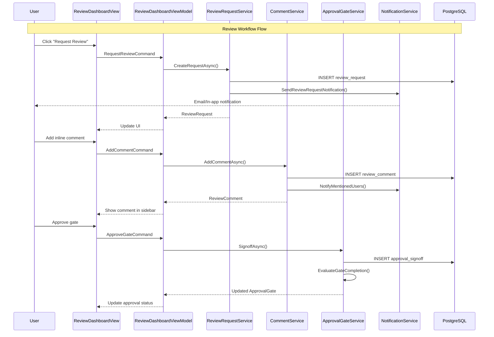

# LCS-SBD-093: Scope Breakdown — Review Workflows

## Document Control

| Field            | Value                                    |
| :--------------- | :--------------------------------------- |
| **Document ID**  | LCS-SBD-093                              |
| **Feature ID**   | COL-093                                  |
| **Version**      | v0.9.3                                   |
| **Codename**     | Review Workflows (The Director's Notes)  |
| **Status**       | Draft                                    |
| **Last Updated** | 2026-01-27                               |
| **Owner**        | Lead Architect                           |
| **Depends On**   | v0.9.1 (User Profiles), v0.9.2 (License Engine), v0.7.x (Collaboration Foundation) |

---

## 1. Executive Summary

### 1.1 The Vision

**v0.9.3** delivers **Review Workflows** — The Director's Notes — structured feedback and approval processes for collaborative writing teams. This release transforms Lexichord from a solo writing tool into a production-ready team collaboration platform, enabling teams to request reviews, provide inline feedback, enforce approval gates, and track review status across all documents.

Review Workflows bring the rigor of code review processes to the writing world. Just as developers use pull requests to ensure code quality, writers and editors can now establish formal review cycles that ensure content meets organizational standards before publication. This is essential for enterprise content teams, marketing departments, and any organization where multiple stakeholders must sign off on written material.

### 1.2 Business Value

- **Quality Control:** Structured review processes ensure content meets standards before publication.
- **Team Collaboration:** Multiple reviewers can provide parallel feedback with threaded discussions.
- **Accountability:** Clear ownership of reviews with due dates and status tracking.
- **Compliance:** Approval gates create auditable sign-off trails for regulated industries.
- **Efficiency:** Centralized review dashboard eliminates email chains and lost feedback.
- **Enterprise Ready:** Professional review workflows expected by large content teams.

### 1.3 Success Criteria

This release succeeds when:

1. Users can request reviews from team members with assigned due dates.
2. Reviewers can add inline comments with threaded replies and @mentions.
3. Documents cannot be published without required approvals from designated approvers.
4. A review dashboard displays all pending reviews, their status, and deadlines.
5. All review UI respects license gating (Teams+ for Review Workflows).

### 1.4 License Gating

Review Workflows is a **Teams** feature. Lower tiers will see:

- Read-only access to review comments (if shared with them)
- "Request Review" buttons disabled with "Upgrade to Teams" tooltip
- Approval gate configuration hidden in document settings
- Review Dashboard shows upgrade prompt instead of content

---

## 2. Dependencies on Prior Versions

| Component                | Source Version | Usage in v0.9.3                          |
| :----------------------- | :------------- | :--------------------------------------- |
| `IProfileService`        | v0.9.1a        | Retrieve reviewer profiles and avatars   |
| `UserProfile`            | v0.9.1a        | Reviewer identity and display info       |
| `ILicenseStateService`   | v0.9.2c        | Verify Teams tier for feature access     |
| `IDocumentService`       | v0.1.3a        | Document access for inline comments      |
| `IMediator`              | v0.0.7a        | Publish review events                    |
| `ISettingsService`       | v0.1.6a        | Store review preferences                 |
| `INotificationService`   | v0.7.4a        | Send review notifications                |
| `IDbConnectionFactory`   | v0.0.3a        | Database access for review storage       |
| `ITeamService`           | v0.7.1a        | Team membership for reviewer selection   |
| `Serilog`                | v0.0.3b        | Logging review operations                |

---

## 3. Sub-Part Specifications

### 3.1 v0.9.3a: Review Request

| Field            | Value                                     |
| :--------------- | :---------------------------------------- |
| **Sub-Part ID**  | COL-093a                                  |
| **Title**        | Review Request System                     |
| **Module**       | `Lexichord.Modules.Collaboration`         |
| **License Tier** | Teams                                     |

**Goal:** Enable document owners to request reviews from team members with assigned reviewers, due dates, and priority levels.

**Key Deliverables:**

- `ReviewRequest` record with reviewer assignments and metadata
- `IReviewRequestService` interface for managing review requests
- `ReviewRequestRepository` for persistence in PostgreSQL
- `ReviewRequestView.axaml` dialog for creating review requests
- `ReviewRequestViewModel` with reviewer picker and date selection
- `ReviewRequestedEvent` and `ReviewCompletedEvent` MediatR events
- Email/notification integration for review requests
- Unit tests for review request service

**Key Interfaces:**

```csharp
namespace Lexichord.Modules.Collaboration.Abstractions;

public record ReviewRequest(
    Guid ReviewId,
    Guid DocumentId,
    Guid RequestedBy,
    IReadOnlyList<ReviewerAssignment> Reviewers,
    ReviewPriority Priority,
    string? Message,
    DateTime? DueDate,
    DateTime CreatedAt,
    ReviewStatus Status
);

public record ReviewerAssignment(
    Guid UserId,
    string DisplayName,
    string? AvatarPath,
    ReviewerRole Role,
    ReviewerStatus Status,
    DateTime? CompletedAt,
    string? DeclineReason
);

public enum ReviewPriority { Low, Normal, High, Urgent }
public enum ReviewerRole { Reviewer, Approver, Observer }
public enum ReviewerStatus { Pending, InProgress, Approved, RequestedChanges, Declined }
public enum ReviewStatus { Draft, Active, Completed, Cancelled }

public interface IReviewRequestService
{
    Task<ReviewRequest> CreateRequestAsync(CreateReviewRequestCommand command, CancellationToken ct = default);
    Task<ReviewRequest?> GetRequestAsync(Guid reviewId, CancellationToken ct = default);
    Task<IReadOnlyList<ReviewRequest>> GetRequestsForDocumentAsync(Guid documentId, CancellationToken ct = default);
    Task<IReadOnlyList<ReviewRequest>> GetPendingReviewsForUserAsync(Guid userId, CancellationToken ct = default);
    Task UpdateReviewerStatusAsync(Guid reviewId, Guid userId, ReviewerStatus status, string? message = null, CancellationToken ct = default);
    Task CancelRequestAsync(Guid reviewId, string? reason = null, CancellationToken ct = default);
    Task SendReminderAsync(Guid reviewId, CancellationToken ct = default);
}

public record CreateReviewRequestCommand(
    Guid DocumentId,
    IReadOnlyList<ReviewerAssignmentRequest> Reviewers,
    ReviewPriority Priority,
    string? Message,
    DateTime? DueDate
);

public record ReviewerAssignmentRequest(
    Guid UserId,
    ReviewerRole Role
);
```

**Key UI Components:**

```text
+------------------------------------------------------------------+
|  Request Review                                         [X]       |
+------------------------------------------------------------------+
| Document: [Document Title Here]                                   |
|                                                                   |
| Reviewers:                                                        |
| +--------------------------------------------------------------+ |
| | [Avatar] Jane Smith (Editor)           [Approver v] [Remove] | |
| | [Avatar] John Doe (Writer)             [Reviewer v] [Remove] | |
| | [+ Add Reviewer...]                                          | |
| +--------------------------------------------------------------+ |
|                                                                   |
| Priority: [Normal v]                                              |
|                                                                   |
| Due Date: [2026-02-15] [Clear]                                    |
|                                                                   |
| Message to Reviewers:                                             |
| +--------------------------------------------------------------+ |
| | Please review the technical accuracy of section 3...         | |
| +--------------------------------------------------------------+ |
|                                                                   |
|                              [Cancel]  [Request Review]           |
+------------------------------------------------------------------+
```

**Database Schema:**

```sql
-- Migration: 2026_01_27_ReviewRequests
CREATE TABLE review_requests (
    review_id UUID PRIMARY KEY,
    document_id UUID NOT NULL REFERENCES documents(document_id),
    requested_by UUID NOT NULL REFERENCES user_profiles(profile_id),
    priority VARCHAR(20) NOT NULL DEFAULT 'Normal',
    message TEXT,
    due_date TIMESTAMP WITH TIME ZONE,
    created_at TIMESTAMP WITH TIME ZONE NOT NULL DEFAULT NOW(),
    status VARCHAR(20) NOT NULL DEFAULT 'Draft',
    completed_at TIMESTAMP WITH TIME ZONE,
    cancelled_at TIMESTAMP WITH TIME ZONE,
    cancelled_reason TEXT
);

CREATE TABLE reviewer_assignments (
    assignment_id UUID PRIMARY KEY,
    review_id UUID NOT NULL REFERENCES review_requests(review_id) ON DELETE CASCADE,
    user_id UUID NOT NULL REFERENCES user_profiles(profile_id),
    role VARCHAR(20) NOT NULL DEFAULT 'Reviewer',
    status VARCHAR(20) NOT NULL DEFAULT 'Pending',
    completed_at TIMESTAMP WITH TIME ZONE,
    decline_reason TEXT,
    created_at TIMESTAMP WITH TIME ZONE NOT NULL DEFAULT NOW()
);

CREATE INDEX idx_review_requests_document ON review_requests(document_id);
CREATE INDEX idx_review_requests_status ON review_requests(status);
CREATE INDEX idx_reviewer_assignments_user ON reviewer_assignments(user_id);
CREATE INDEX idx_reviewer_assignments_status ON reviewer_assignments(status);
```

**Dependencies:**

- v0.9.1a: `IProfileService` (retrieve reviewer profiles)
- v0.7.1a: `ITeamService` (team membership for reviewer selection)
- v0.7.4a: `INotificationService` (send review notifications)

---

### 3.2 v0.9.3b: Comment System

| Field            | Value                                     |
| :--------------- | :---------------------------------------- |
| **Sub-Part ID**  | COL-093b                                  |
| **Title**        | Inline Comment and Thread System          |
| **Module**       | `Lexichord.Modules.Collaboration`         |
| **License Tier** | Teams                                     |

**Goal:** Enable reviewers to add inline comments on specific text ranges with threaded replies and @mention support.

**Key Deliverables:**

- `ReviewComment` record with text range anchoring
- `CommentThread` record for threaded discussions
- `ICommentService` interface for comment management
- `CommentRepository` for persistence
- `InlineCommentAdorner` for editor integration
- `CommentPanelView.axaml` sidebar for comment display
- `CommentPanelViewModel` with threading and resolution
- @mention parsing and user notification
- Rich text support in comments (bold, italic, code)
- Unit tests for comment service

**Key Interfaces:**

```csharp
namespace Lexichord.Modules.Collaboration.Abstractions;

public record ReviewComment(
    Guid CommentId,
    Guid DocumentId,
    Guid? ReviewId,
    Guid? ParentCommentId,
    Guid AuthorId,
    string AuthorName,
    string? AuthorAvatarPath,
    CommentAnchor Anchor,
    string Content,
    IReadOnlyList<UserMention> Mentions,
    DateTime CreatedAt,
    DateTime? EditedAt,
    bool IsResolved,
    DateTime? ResolvedAt,
    Guid? ResolvedBy
);

public record CommentAnchor(
    int StartLine,
    int StartColumn,
    int EndLine,
    int EndColumn,
    string QuotedText
);

public record UserMention(
    Guid UserId,
    string DisplayName,
    int StartIndex,
    int Length
);

public record CommentThread(
    Guid ThreadId,
    ReviewComment RootComment,
    IReadOnlyList<ReviewComment> Replies,
    int ReplyCount,
    DateTime LastActivityAt
);

public interface ICommentService
{
    Task<ReviewComment> AddCommentAsync(AddCommentCommand command, CancellationToken ct = default);
    Task<ReviewComment> ReplyToCommentAsync(Guid parentCommentId, string content, CancellationToken ct = default);
    Task<ReviewComment> EditCommentAsync(Guid commentId, string newContent, CancellationToken ct = default);
    Task DeleteCommentAsync(Guid commentId, CancellationToken ct = default);
    Task ResolveThreadAsync(Guid commentId, CancellationToken ct = default);
    Task UnresolveThreadAsync(Guid commentId, CancellationToken ct = default);
    Task<IReadOnlyList<CommentThread>> GetThreadsForDocumentAsync(Guid documentId, bool includeResolved = false, CancellationToken ct = default);
    Task<IReadOnlyList<ReviewComment>> GetCommentsForReviewAsync(Guid reviewId, CancellationToken ct = default);
    IReadOnlyList<UserMention> ParseMentions(string content);
}

public record AddCommentCommand(
    Guid DocumentId,
    Guid? ReviewId,
    CommentAnchor Anchor,
    string Content
);
```

**Key UI Components:**

```text
+------------------------------------------------------------------+
|  Comments (3)                                     [Filter v] [+]  |
+------------------------------------------------------------------+
| Line 42-45                                                        |
| +--------------------------------------------------------------+ |
| | [Avatar] Jane Smith                           2 hours ago    | |
| | "This paragraph needs clearer transitions between ideas."    | |
| |                                                              | |
| |   [Avatar] John Doe                          1 hour ago     | |
| |   "@Jane Smith I've added a transition sentence. PTAL."     | |
| |                                                              | |
| |   [Reply...                                  ] [Resolve]    | |
| +--------------------------------------------------------------+ |
|                                                                   |
| Line 78                                                           |
| +--------------------------------------------------------------+ |
| | [Avatar] Sarah Chen                           30 min ago     | |
| | "Consider using `code formatting` for technical terms."      | |
| |                                                              | |
| |   [Reply...                                  ] [Resolve]    | |
| +--------------------------------------------------------------+ |
|                                                                   |
| [Show Resolved Comments]                                          |
+------------------------------------------------------------------+
```

**Comment Anchor Visualization:**

```text
Document Editor View:
+------------------------------------------------------------------+
|  # Introduction                                                   |
|                                                                   |
|  The quick brown fox [jumps over the lazy dog. This sentence     |
|  demonstrates the concept of pangrams] which contain every       |  <- Highlighted
|  letter of the alphabet.                     [Comment Icon]       |     with margin
|                                                                   |     indicator
|  ## Section Two                                                   |
+------------------------------------------------------------------+
```

**Database Schema:**

```sql
-- Migration: 2026_01_27_ReviewComments
CREATE TABLE review_comments (
    comment_id UUID PRIMARY KEY,
    document_id UUID NOT NULL REFERENCES documents(document_id),
    review_id UUID REFERENCES review_requests(review_id) ON DELETE SET NULL,
    parent_comment_id UUID REFERENCES review_comments(comment_id) ON DELETE CASCADE,
    author_id UUID NOT NULL REFERENCES user_profiles(profile_id),
    anchor_start_line INT NOT NULL,
    anchor_start_column INT NOT NULL,
    anchor_end_line INT NOT NULL,
    anchor_end_column INT NOT NULL,
    anchor_quoted_text TEXT NOT NULL,
    content TEXT NOT NULL,
    created_at TIMESTAMP WITH TIME ZONE NOT NULL DEFAULT NOW(),
    edited_at TIMESTAMP WITH TIME ZONE,
    is_resolved BOOLEAN NOT NULL DEFAULT FALSE,
    resolved_at TIMESTAMP WITH TIME ZONE,
    resolved_by UUID REFERENCES user_profiles(profile_id)
);

CREATE TABLE comment_mentions (
    mention_id UUID PRIMARY KEY,
    comment_id UUID NOT NULL REFERENCES review_comments(comment_id) ON DELETE CASCADE,
    user_id UUID NOT NULL REFERENCES user_profiles(profile_id),
    start_index INT NOT NULL,
    length INT NOT NULL
);

CREATE INDEX idx_review_comments_document ON review_comments(document_id);
CREATE INDEX idx_review_comments_review ON review_comments(review_id);
CREATE INDEX idx_review_comments_parent ON review_comments(parent_comment_id);
CREATE INDEX idx_review_comments_resolved ON review_comments(is_resolved);
CREATE INDEX idx_comment_mentions_user ON comment_mentions(user_id);
```

**Dependencies:**

- v0.9.3a: `ReviewRequest` (associate comments with reviews)
- v0.1.3a: `IDocumentService` (document access for anchoring)
- v0.7.4a: `INotificationService` (notify mentioned users)

---

### 3.3 v0.9.3c: Approval Gates

| Field            | Value                                     |
| :--------------- | :---------------------------------------- |
| **Sub-Part ID**  | COL-093c                                  |
| **Title**        | Approval Gate System                      |
| **Module**       | `Lexichord.Modules.Collaboration`         |
| **License Tier** | Teams                                     |

**Goal:** Implement configurable approval gates that require designated sign-offs before documents can be published.

**Key Deliverables:**

- `ApprovalGate` record with gate configuration
- `ApprovalSignoff` record for tracking approvals
- `IApprovalGateService` interface for gate management
- `ApprovalGateRepository` for persistence
- `ApprovalGateSettingsView.axaml` for gate configuration
- `ApprovalStatusBadge` component for document status
- Integration with `IPublisherService` to block unauthorized publishing
- Audit trail for all approval actions
- Unit tests for approval gate service

**Key Interfaces:**

```csharp
namespace Lexichord.Modules.Collaboration.Abstractions;

public record ApprovalGate(
    Guid GateId,
    Guid DocumentId,
    string GateName,
    string? Description,
    int Order,
    ApprovalGateType Type,
    IReadOnlyList<Guid> RequiredApproverIds,
    int MinimumApprovals,
    bool RequireAllApprovers,
    GateStatus Status,
    DateTime CreatedAt,
    DateTime? ActivatedAt,
    DateTime? CompletedAt
);

public record ApprovalSignoff(
    Guid SignoffId,
    Guid GateId,
    Guid ApproverId,
    string ApproverName,
    SignoffDecision Decision,
    string? Comment,
    DateTime SignedAt
);

public enum ApprovalGateType { Review, Legal, Editorial, Executive, Custom }
public enum GateStatus { Pending, Active, Approved, Rejected, Bypassed }
public enum SignoffDecision { Approved, Rejected, NeedsRevision }

public record ApprovalWorkflow(
    Guid WorkflowId,
    Guid DocumentId,
    IReadOnlyList<ApprovalGate> Gates,
    WorkflowStatus Status,
    int CurrentGateIndex,
    DateTime CreatedAt,
    DateTime? CompletedAt
);

public enum WorkflowStatus { NotStarted, InProgress, Completed, Rejected, Cancelled }

public interface IApprovalGateService
{
    Task<ApprovalWorkflow> CreateWorkflowAsync(Guid documentId, IReadOnlyList<CreateGateCommand> gates, CancellationToken ct = default);
    Task<ApprovalWorkflow?> GetWorkflowAsync(Guid documentId, CancellationToken ct = default);
    Task<ApprovalGate?> GetCurrentGateAsync(Guid documentId, CancellationToken ct = default);
    Task<ApprovalSignoff> SignoffAsync(Guid gateId, SignoffDecision decision, string? comment = null, CancellationToken ct = default);
    Task<bool> CanPublishAsync(Guid documentId, CancellationToken ct = default);
    Task BypassGateAsync(Guid gateId, string reason, CancellationToken ct = default);
    Task ResetWorkflowAsync(Guid documentId, CancellationToken ct = default);
    Task<IReadOnlyList<ApprovalSignoff>> GetSignoffHistoryAsync(Guid documentId, CancellationToken ct = default);
}

public record CreateGateCommand(
    string GateName,
    string? Description,
    ApprovalGateType Type,
    IReadOnlyList<Guid> RequiredApproverIds,
    int MinimumApprovals,
    bool RequireAllApprovers
);
```

**Key UI Components:**

```text
+------------------------------------------------------------------+
|  Approval Workflow                                         [Edit] |
+------------------------------------------------------------------+
|                                                                   |
|  [1] Editorial Review          [2] Legal Review        [3] Final  |
|  [====APPROVED====]  ───────>  [==IN PROGRESS==] ───>  [PENDING]  |
|       Jane Smith                    Waiting for                   |
|       2026-01-25                   Legal Team                     |
|                                                                   |
+------------------------------------------------------------------+
|  Current Gate: Legal Review                                       |
|                                                                   |
|  Required Approvers:                                              |
|  [Avatar] Legal Team Lead            [Pending]                    |
|  [Avatar] Compliance Officer         [Pending]                    |
|                                                                   |
|  Minimum Approvals Required: 1 of 2                               |
|                                                                   |
+------------------------------------------------------------------+
|  Your Decision:                                                   |
|                                                                   |
|  Comment: [Optional comment about your decision...              ] |
|                                                                   |
|  [Request Revisions]    [Reject]    [Approve]                     |
+------------------------------------------------------------------+
```

**Document Status Badge:**

```text
+------------------------------------------------------------------+
|  Document Header                                                  |
|  [Status: Pending Approval] [Gate: Legal Review (1/2)]            |
|                                                                   |
|  [Publish] <- Disabled with tooltip:                              |
|              "Awaiting approval from Legal Review gate"           |
+------------------------------------------------------------------+
```

**Database Schema:**

```sql
-- Migration: 2026_01_27_ApprovalGates
CREATE TABLE approval_workflows (
    workflow_id UUID PRIMARY KEY,
    document_id UUID NOT NULL REFERENCES documents(document_id),
    status VARCHAR(20) NOT NULL DEFAULT 'NotStarted',
    current_gate_index INT NOT NULL DEFAULT 0,
    created_at TIMESTAMP WITH TIME ZONE NOT NULL DEFAULT NOW(),
    completed_at TIMESTAMP WITH TIME ZONE,
    UNIQUE(document_id)
);

CREATE TABLE approval_gates (
    gate_id UUID PRIMARY KEY,
    workflow_id UUID NOT NULL REFERENCES approval_workflows(workflow_id) ON DELETE CASCADE,
    gate_name VARCHAR(100) NOT NULL,
    description TEXT,
    gate_order INT NOT NULL,
    gate_type VARCHAR(20) NOT NULL DEFAULT 'Review',
    minimum_approvals INT NOT NULL DEFAULT 1,
    require_all_approvers BOOLEAN NOT NULL DEFAULT FALSE,
    status VARCHAR(20) NOT NULL DEFAULT 'Pending',
    activated_at TIMESTAMP WITH TIME ZONE,
    completed_at TIMESTAMP WITH TIME ZONE
);

CREATE TABLE gate_approvers (
    gate_id UUID NOT NULL REFERENCES approval_gates(gate_id) ON DELETE CASCADE,
    user_id UUID NOT NULL REFERENCES user_profiles(profile_id),
    PRIMARY KEY (gate_id, user_id)
);

CREATE TABLE approval_signoffs (
    signoff_id UUID PRIMARY KEY,
    gate_id UUID NOT NULL REFERENCES approval_gates(gate_id) ON DELETE CASCADE,
    approver_id UUID NOT NULL REFERENCES user_profiles(profile_id),
    decision VARCHAR(20) NOT NULL,
    comment TEXT,
    signed_at TIMESTAMP WITH TIME ZONE NOT NULL DEFAULT NOW()
);

CREATE INDEX idx_approval_workflows_document ON approval_workflows(document_id);
CREATE INDEX idx_approval_workflows_status ON approval_workflows(status);
CREATE INDEX idx_approval_gates_workflow ON approval_gates(workflow_id);
CREATE INDEX idx_approval_gates_status ON approval_gates(status);
CREATE INDEX idx_approval_signoffs_gate ON approval_signoffs(gate_id);
CREATE INDEX idx_approval_signoffs_approver ON approval_signoffs(approver_id);
```

**Approval Logic:**

```text
GATE COMPLETION LOGIC:

START: "Evaluate gate completion"
│
├── Count approved signoffs for gate
│
├── If require_all_approvers = TRUE
│   ├── All required approvers signed off with Approved?
│   │   ├── YES → Mark gate as Approved
│   │   └── NO → Gate remains Active
│   └── Any approver signed off with Rejected?
│       └── YES → Mark gate as Rejected
│
├── If require_all_approvers = FALSE
│   ├── approved_count >= minimum_approvals?
│   │   ├── YES → Mark gate as Approved
│   │   └── NO → Gate remains Active
│   └── rejected_count > (total_approvers - minimum_approvals)?
│       └── YES → Mark gate as Rejected (impossible to reach minimum)
│
└── If gate Approved → Advance to next gate (if any)
    If gate Rejected → Mark workflow as Rejected
```

**Dependencies:**

- v0.9.3a: `ReviewRequest` (reviews can trigger gates)
- v0.8.1a: `IPublisherService` (block publishing until approved)
- v0.9.1a: `IProfileService` (approver identity)

---

### 3.4 v0.9.3d: Review Dashboard

| Field            | Value                                     |
| :--------------- | :---------------------------------------- |
| **Sub-Part ID**  | COL-093d                                  |
| **Title**        | Review Dashboard                          |
| **Module**       | `Lexichord.Modules.Collaboration`         |
| **License Tier** | Teams                                     |

**Goal:** Create a centralized dashboard for tracking all pending reviews, their status, and deadlines across all documents.

**Key Deliverables:**

- `ReviewDashboardView.axaml` main dashboard view
- `ReviewDashboardViewModel` with filtering and sorting
- `ReviewSummaryCard` component for review items
- `ReviewMetricsPanel` for team analytics
- Quick actions (approve, request changes, remind)
- Filter by status, priority, assignee, due date
- Overdue review highlighting
- Unit tests for dashboard view model

**Key Interfaces:**

```csharp
namespace Lexichord.Modules.Collaboration.ViewModels;

public partial class ReviewDashboardViewModel : ObservableObject
{
    [ObservableProperty] private ObservableCollection<ReviewSummary> _pendingReviews = [];
    [ObservableProperty] private ObservableCollection<ReviewSummary> _myReviews = [];
    [ObservableProperty] private ObservableCollection<ReviewSummary> _requestedByMe = [];
    [ObservableProperty] private ReviewDashboardMetrics _metrics = new();

    [ObservableProperty] private ReviewDashboardFilter _currentFilter = new();
    [ObservableProperty] private ReviewSortOption _sortOption = ReviewSortOption.DueDateAsc;

    [ObservableProperty] private bool _isLoading;
    [ObservableProperty] private string? _errorMessage;

    [RelayCommand]
    private async Task RefreshAsync();

    [RelayCommand]
    private async Task ApproveReviewAsync(Guid reviewId);

    [RelayCommand]
    private async Task RequestChangesAsync(Guid reviewId);

    [RelayCommand]
    private async Task SendReminderAsync(Guid reviewId);

    [RelayCommand]
    private void OpenDocument(Guid documentId);

    [RelayCommand]
    private void ApplyFilter(ReviewDashboardFilter filter);
}

public record ReviewSummary(
    Guid ReviewId,
    Guid DocumentId,
    string DocumentTitle,
    string RequestedByName,
    string? RequestedByAvatarPath,
    DateTime CreatedAt,
    DateTime? DueDate,
    ReviewPriority Priority,
    ReviewStatus Status,
    IReadOnlyList<ReviewerSummary> Reviewers,
    int CommentCount,
    int UnresolvedCommentCount,
    bool IsOverdue
);

public record ReviewerSummary(
    Guid UserId,
    string DisplayName,
    string? AvatarPath,
    ReviewerRole Role,
    ReviewerStatus Status
);

public record ReviewDashboardMetrics(
    int TotalPendingReviews = 0,
    int OverdueReviews = 0,
    int CompletedThisWeek = 0,
    double AverageReviewTimeHours = 0,
    int MyPendingReviews = 0,
    int AwaitingMyApproval = 0
);

public record ReviewDashboardFilter(
    ReviewStatus? Status = null,
    ReviewPriority? Priority = null,
    Guid? AssigneeId = null,
    DateRange? DueDateRange = null,
    bool ShowOverdueOnly = false
);

public enum ReviewSortOption
{
    DueDateAsc,
    DueDateDesc,
    CreatedAtAsc,
    CreatedAtDesc,
    PriorityDesc,
    PriorityAsc
}
```

**Key UI Components:**

```text
+------------------------------------------------------------------+
|  Review Dashboard                                                 |
+------------------------------------------------------------------+
|                                                                   |
|  +------------+  +------------+  +------------+  +-------------+  |
|  |     5      |  |     2      |  |     8      |  |   4.2 hrs   |  |
|  |  Pending   |  |  Overdue   |  | This Week  |  |  Avg Time   |  |
|  +------------+  +------------+  +------------+  +-------------+  |
|                                                                   |
+------------------------------------------------------------------+
|  [My Reviews] [Requested by Me] [All Team]    [Filter v] [Sort v] |
+------------------------------------------------------------------+
|                                                                   |
|  +--------------------------------------------------------------+ |
|  | [!] OVERDUE | Project Roadmap v2                             | |
|  |     Requested by Jane Smith · Due: Jan 20 (3 days overdue)   | |
|  |     [Avatar][Avatar][Avatar] 3 reviewers · 2/3 approved      | |
|  |     5 comments (2 unresolved)                                | |
|  |                    [Open] [Remind] [Approve] [Changes]       | |
|  +--------------------------------------------------------------+ |
|                                                                   |
|  +--------------------------------------------------------------+ |
|  | [HIGH] Marketing Brief Q1                                    | |
|  |     Requested by John Doe · Due: Jan 28 (3 days)             | |
|  |     [Avatar][Avatar] 2 reviewers · 0/2 approved              | |
|  |     0 comments                                               | |
|  |                    [Open] [Remind] [Approve] [Changes]       | |
|  +--------------------------------------------------------------+ |
|                                                                   |
|  +--------------------------------------------------------------+ |
|  | [NORMAL] Technical Documentation Update                      | |
|  |     Requested by Sarah Chen · Due: Feb 5 (11 days)           | |
|  |     [Avatar] 1 reviewer · Awaiting review                    | |
|  |     3 comments (0 unresolved)                                | |
|  |                    [Open] [Remind] [Approve] [Changes]       | |
|  +--------------------------------------------------------------+ |
|                                                                   |
|  [Load More...]                                                   |
+------------------------------------------------------------------+
```

**Filter Panel:**

```text
+------------------------------------------------------------------+
|  Filter Reviews                                            [X]    |
+------------------------------------------------------------------+
|                                                                   |
|  Status:     [All v]                                              |
|              [ ] Active  [ ] Completed  [ ] Cancelled             |
|                                                                   |
|  Priority:   [All v]                                              |
|              [ ] Urgent  [ ] High  [ ] Normal  [ ] Low            |
|                                                                   |
|  Assignee:   [Anyone v]                                           |
|                                                                   |
|  Due Date:   [Any Time v]                                         |
|              [ ] Overdue Only                                     |
|              [ ] Due This Week                                    |
|              [ ] Due This Month                                   |
|              [ ] Custom: [____] to [____]                         |
|                                                                   |
|                              [Clear All]  [Apply Filter]          |
+------------------------------------------------------------------+
```

**Dependencies:**

- v0.9.3a: `IReviewRequestService` (retrieve reviews)
- v0.9.3b: `ICommentService` (comment counts)
- v0.9.3c: `IApprovalGateService` (approval status)
- v0.9.1a: `IProfileService` (user avatars and names)

---

## 4. Implementation Checklist

| #  | Sub-Part | Task                                                      | Est. Hours |
| :- | :------- | :-------------------------------------------------------- | :--------- |
| 1  | v0.9.3a  | Create `ReviewRequest` and related records                | 1          |
| 2  | v0.9.3a  | Implement `IReviewRequestService` interface               | 1          |
| 3  | v0.9.3a  | Implement `ReviewRequestService`                          | 3          |
| 4  | v0.9.3a  | Create `ReviewRequestRepository` with Dapper              | 2          |
| 5  | v0.9.3a  | Write database migration for review_requests              | 1          |
| 6  | v0.9.3a  | Create `ReviewRequestView.axaml` dialog                   | 2          |
| 7  | v0.9.3a  | Implement `ReviewRequestViewModel`                        | 2          |
| 8  | v0.9.3a  | Integrate with `INotificationService`                     | 1          |
| 9  | v0.9.3a  | Create `ReviewRequestedEvent` and `ReviewCompletedEvent`  | 0.5        |
| 10 | v0.9.3a  | Unit tests for `ReviewRequestService`                     | 2          |
| 11 | v0.9.3b  | Create `ReviewComment` and related records                | 1          |
| 12 | v0.9.3b  | Implement `ICommentService` interface                     | 1          |
| 13 | v0.9.3b  | Implement `CommentService` with @mention parsing          | 3          |
| 14 | v0.9.3b  | Create `CommentRepository` with Dapper                    | 2          |
| 15 | v0.9.3b  | Write database migration for review_comments              | 1          |
| 16 | v0.9.3b  | Create `InlineCommentAdorner` for editor                  | 3          |
| 17 | v0.9.3b  | Create `CommentPanelView.axaml` sidebar                   | 2          |
| 18 | v0.9.3b  | Implement `CommentPanelViewModel`                         | 2          |
| 19 | v0.9.3b  | Implement rich text parsing in comments                   | 1          |
| 20 | v0.9.3b  | Unit tests for `CommentService`                           | 2          |
| 21 | v0.9.3c  | Create `ApprovalGate` and related records                 | 1          |
| 22 | v0.9.3c  | Implement `IApprovalGateService` interface                | 1          |
| 23 | v0.9.3c  | Implement `ApprovalGateService`                           | 3          |
| 24 | v0.9.3c  | Create `ApprovalGateRepository` with Dapper               | 2          |
| 25 | v0.9.3c  | Write database migration for approval_gates               | 1          |
| 26 | v0.9.3c  | Create `ApprovalGateSettingsView.axaml`                   | 2          |
| 27 | v0.9.3c  | Create `ApprovalStatusBadge` component                    | 1          |
| 28 | v0.9.3c  | Integrate with `IPublisherService` for publish blocking   | 2          |
| 29 | v0.9.3c  | Unit tests for `ApprovalGateService`                      | 2          |
| 30 | v0.9.3d  | Create `ReviewDashboardView.axaml`                        | 3          |
| 31 | v0.9.3d  | Implement `ReviewDashboardViewModel`                      | 3          |
| 32 | v0.9.3d  | Create `ReviewSummaryCard` component                      | 1.5        |
| 33 | v0.9.3d  | Create `ReviewMetricsPanel` component                     | 1.5        |
| 34 | v0.9.3d  | Implement filtering and sorting                           | 2          |
| 35 | v0.9.3d  | Unit tests for `ReviewDashboardViewModel`                 | 2          |
| 36 | All      | Integration tests for full review workflow                | 3          |
| 37 | All      | DI registration in CollaborationModule.cs                 | 1          |
| **Total** |   |                                                           | **60 hours** |

---

## 5. Dependency Matrix

### 5.1 Required Interfaces (from earlier versions)

| Interface                  | Source Version | Purpose                              |
| :------------------------- | :------------- | :----------------------------------- |
| `IProfileService`          | v0.9.1a        | Retrieve reviewer profiles           |
| `ILicenseStateService`     | v0.9.2c        | Verify Teams license tier            |
| `IDocumentService`         | v0.1.3a        | Document access for comments         |
| `IMediator`                | v0.0.7a        | Publish review events                |
| `INotificationService`     | v0.7.4a        | Send review notifications            |
| `ITeamService`             | v0.7.1a        | Team membership queries              |
| `IPublisherService`        | v0.8.1a        | Block publishing without approval    |
| `IDbConnectionFactory`     | v0.0.3a        | Database connections                 |

### 5.2 New Interfaces (defined in v0.9.3)

| Interface                   | Defined In | Module              | Purpose                        |
| :-------------------------- | :--------- | :------------------ | :----------------------------- |
| `IReviewRequestService`     | v0.9.3a    | Collaboration       | Manage review requests         |
| `ICommentService`           | v0.9.3b    | Collaboration       | Manage inline comments         |
| `IApprovalGateService`      | v0.9.3c    | Collaboration       | Manage approval workflows      |

### 5.3 New Records/DTOs (defined in v0.9.3)

| Record                   | Defined In | Purpose                                |
| :----------------------- | :--------- | :------------------------------------- |
| `ReviewRequest`          | v0.9.3a    | Review request with assignees          |
| `ReviewerAssignment`     | v0.9.3a    | Individual reviewer assignment         |
| `ReviewComment`          | v0.9.3b    | Inline comment with anchoring          |
| `CommentThread`          | v0.9.3b    | Threaded comment discussion            |
| `CommentAnchor`          | v0.9.3b    | Text range for comment placement       |
| `UserMention`            | v0.9.3b    | @mention reference                     |
| `ApprovalGate`           | v0.9.3c    | Approval gate configuration            |
| `ApprovalSignoff`        | v0.9.3c    | Individual approval decision           |
| `ApprovalWorkflow`       | v0.9.3c    | Complete approval workflow             |
| `ReviewSummary`          | v0.9.3d    | Dashboard review item                  |
| `ReviewDashboardMetrics` | v0.9.3d    | Dashboard analytics                    |

### 5.4 NuGet Packages

| Package          | Version | Purpose                    | New/Existing |
| :--------------- | :------ | :------------------------- | :----------- |
| `Dapper`         | 2.1.x   | Database access            | Existing     |
| `Npgsql`         | 8.x     | PostgreSQL driver          | Existing     |
| `FluentMigrator` | 5.x     | Database migrations        | Existing     |
| `MediatR`        | 12.x    | Event publishing           | Existing     |

---

## 6. Architecture Diagram

```mermaid
graph TB
    subgraph "Lexichord.Modules.Collaboration"
        subgraph "v0.9.3a: Review Request"
            RRV[ReviewRequestView]
            RRVM[ReviewRequestViewModel]
            RRS[ReviewRequestService]
            RRR[ReviewRequestRepository]
        end

        subgraph "v0.9.3b: Comments"
            CPV[CommentPanelView]
            CPVM[CommentPanelViewModel]
            CS[CommentService]
            CR[CommentRepository]
            ICA[InlineCommentAdorner]
        end

        subgraph "v0.9.3c: Approval Gates"
            AGS[ApprovalGateSettingsView]
            AGSVM[ApprovalGateSettingsViewModel]
            AGSvc[ApprovalGateService]
            AGR[ApprovalGateRepository]
            ASB[ApprovalStatusBadge]
        end

        subgraph "v0.9.3d: Dashboard"
            RDV[ReviewDashboardView]
            RDVM[ReviewDashboardViewModel]
            RSC[ReviewSummaryCard]
            RMP[ReviewMetricsPanel]
        end
    end

    subgraph "Dependencies"
        PS[IProfileService<br/>v0.9.1a]
        LS[ILicenseStateService<br/>v0.9.2c]
        DS[IDocumentService<br/>v0.1.3a]
        NS[INotificationService<br/>v0.7.4a]
        TS[ITeamService<br/>v0.7.1a]
        PUB[IPublisherService<br/>v0.8.1a]
        DB[(PostgreSQL)]
    end

    RRV --> RRVM
    RRVM --> RRS
    RRS --> RRR
    RRS --> NS
    RRS --> PS
    RRR --> DB

    CPV --> CPVM
    CPVM --> CS
    CS --> CR
    CS --> NS
    CR --> DB
    ICA --> CS

    AGS --> AGSVM
    AGSVM --> AGSvc
    AGSvc --> AGR
    AGSvc --> PUB
    AGR --> DB

    RDV --> RDVM
    RDVM --> RRS
    RDVM --> CS
    RDVM --> AGSvc
    RDVM --> PS
    RDV --> RSC
    RDV --> RMP

    RRS --> LS
    CS --> LS
    AGSvc --> LS
    RDVM --> LS

    style RRV fill:#4a9eff,color:#fff
    style CPV fill:#4a9eff,color:#fff
    style AGS fill:#4a9eff,color:#fff
    style RDV fill:#4a9eff,color:#fff
    style RRS fill:#10b981,color:#fff
    style CS fill:#10b981,color:#fff
    style AGSvc fill:#10b981,color:#fff
    style DB fill:#f97316,color:#fff
```



---

## 7. Data Flow Diagram



---

## 8. Risks & Mitigations

| Risk | Impact | Probability | Mitigation |
| :--- | :----- | :---------- | :--------- |
| Comment anchors become invalid after document edits | High | High | Implement anchor reconciliation algorithm; store quoted text for fallback |
| Large number of comments degrades editor performance | Medium | Medium | Virtualize comment list; lazy load comment content |
| Approval gate bypass by admin could create audit gaps | High | Low | Log all bypass actions with reason; require confirmation |
| Reviewer notification fatigue | Medium | Medium | Implement digest notifications; allow notification preferences |
| Concurrent edits while review in progress | High | Medium | Show warning when document modified; option to reset review |
| Complex approval workflows confuse users | Medium | Medium | Provide workflow templates; clear status visualization |

---

## 9. Success Metrics

| Metric | Target | Measurement |
| :----- | :----- | :---------- |
| Review request creation | < 500ms | Stopwatch timing |
| Comment creation | < 200ms | Stopwatch timing |
| Dashboard load time | < 1s | Stopwatch timing (100 reviews) |
| Approval signoff | < 300ms | Stopwatch timing |
| Comment anchor accuracy | 95%+ | After document edit reconciliation |
| Review completion rate | Track | Analytics (baseline establishment) |

---

## 10. What This Enables

After v0.9.3, Lexichord will support:

- **v0.9.4:** Zen Mode with review-aware focus (hide comments during writing)
- **v0.9.5:** Startup optimization including review data caching
- **v1.0.x:** Full enterprise review workflow for production launch
- **Future:** AI-assisted review suggestions, automated style compliance checks during review

---

## 11. Decision Trees

### 11.1 Can Document Be Published?

```text
START: "User clicks Publish"
│
├── Has approval workflow configured?
│   ├── NO → Check basic permissions, allow publish
│   └── YES → Continue
│
├── All required gates completed with Approved status?
│   ├── NO → Block publish, show "Pending Approval" message
│   └── YES → Continue
│
├── Any unresolved comments marked as blocking?
│   ├── YES → Block publish, show unresolved comments
│   └── NO → Continue
│
└── Allow publish → Proceed with publishing flow
```

### 11.2 Review Request State Transitions

```text
START: "Review Request Created"
│
├── Status = Draft
│   └── User clicks "Send Request" → Status = Active
│
├── Status = Active
│   ├── All reviewers completed → Status = Completed
│   ├── User cancels → Status = Cancelled
│   └── Any reviewer in progress → Remains Active
│
├── Status = Completed
│   └── Terminal state (read-only)
│
└── Status = Cancelled
    └── Terminal state (read-only)
```

---

## 12. User Stories

| ID    | Role            | Story                                                                                           | Acceptance Criteria                    |
| :---- | :-------------- | :---------------------------------------------------------------------------------------------- | :------------------------------------- |
| US-01 | Content Manager | As a content manager, I want to request reviews from my team so that content is verified.       | Can select reviewers, set due date     |
| US-02 | Reviewer        | As a reviewer, I want to add inline comments so that feedback is contextual.                    | Comments anchor to specific text       |
| US-03 | Reviewer        | As a reviewer, I want to @mention colleagues so that they see relevant discussions.             | @mention triggers notification         |
| US-04 | Editor          | As an editor, I want to require approval before publish so that quality is ensured.             | Publish blocked without approvals      |
| US-05 | Team Lead       | As a team lead, I want a dashboard of pending reviews so that I can track team progress.        | Dashboard shows all pending reviews    |
| US-06 | Compliance      | As a compliance officer, I want audit trails of approvals so that we meet regulatory needs.     | All signoffs logged with timestamp     |

---

## 13. Use Cases

### UC-01: Request Review for Document

**Preconditions:**

- User has Teams license
- User is document owner or has edit permissions
- Document is saved

**Flow:**

1. User clicks "Request Review" button in document toolbar.
2. System displays Review Request dialog.
3. User selects reviewers from team member list.
4. User assigns roles (Reviewer or Approver) to each.
5. User optionally sets due date and priority.
6. User optionally adds a message.
7. User clicks "Request Review".
8. System creates review request and sends notifications.

**Postconditions:**

- Review request created with Active status
- All assigned reviewers receive notification
- Document shows "Under Review" badge

---

### UC-02: Add Inline Comment

**Preconditions:**

- User is assigned as reviewer
- Review is in Active status
- Document is open in editor

**Flow:**

1. User selects text range in document.
2. User right-clicks and selects "Add Comment" (or uses keyboard shortcut).
3. Comment input appears anchored to selection.
4. User types comment (may include @mentions).
5. User clicks "Post" or presses Ctrl+Enter.
6. System saves comment and highlights text range.
7. Mentioned users receive notifications.

**Postconditions:**

- Comment visible in comment sidebar
- Text range highlighted in editor
- Mentioned users notified

---

### UC-03: Complete Approval Gate

**Preconditions:**

- User is designated approver for current gate
- Gate is in Active status
- User has reviewed document content

**Flow:**

1. User navigates to document with pending approval.
2. System displays current gate status and user's pending action.
3. User reviews comments and document changes.
4. User clicks "Approve", "Request Revisions", or "Reject".
5. User optionally adds a comment.
6. System records signoff and evaluates gate completion.
7. If gate completes, system advances to next gate (if any).

**Postconditions:**

- Signoff recorded with decision and timestamp
- Gate status updated if threshold met
- Document owner notified of decision

---

## 14. Unit Testing Requirements

### 14.1 ReviewRequestService Tests

```csharp
[Trait("Category", "Unit")]
[Trait("Version", "v0.9.3a")]
public class ReviewRequestServiceTests
{
    [Fact]
    public async Task CreateRequestAsync_ValidCommand_CreatesReviewRequest()
    {
        // Arrange
        var sut = CreateService();
        var command = new CreateReviewRequestCommand(
            DocumentId: Guid.NewGuid(),
            Reviewers: new[] { new ReviewerAssignmentRequest(Guid.NewGuid(), ReviewerRole.Reviewer) },
            Priority: ReviewPriority.Normal,
            Message: "Please review section 3",
            DueDate: DateTime.UtcNow.AddDays(7));

        // Act
        var result = await sut.CreateRequestAsync(command);

        // Assert
        result.Should().NotBeNull();
        result.Status.Should().Be(ReviewStatus.Active);
        result.Reviewers.Should().HaveCount(1);
    }

    [Fact]
    public async Task UpdateReviewerStatusAsync_AllReviewersComplete_MarksReviewCompleted()
    {
        // Arrange
        var sut = CreateService();
        var review = await CreateReviewWithSingleReviewer(sut);

        // Act
        await sut.UpdateReviewerStatusAsync(
            review.ReviewId,
            review.Reviewers[0].UserId,
            ReviewerStatus.Approved);
        var updated = await sut.GetRequestAsync(review.ReviewId);

        // Assert
        updated!.Status.Should().Be(ReviewStatus.Completed);
    }

    [Fact]
    public async Task GetPendingReviewsForUserAsync_UserHasPending_ReturnsReviews()
    {
        // Arrange
        var sut = CreateService();
        var userId = Guid.NewGuid();
        await CreateReviewWithReviewer(sut, userId);

        // Act
        var result = await sut.GetPendingReviewsForUserAsync(userId);

        // Assert
        result.Should().HaveCount(1);
        result[0].Reviewers.Should().Contain(r => r.UserId == userId);
    }
}
```

### 14.2 CommentService Tests

```csharp
[Trait("Category", "Unit")]
[Trait("Version", "v0.9.3b")]
public class CommentServiceTests
{
    [Fact]
    public async Task AddCommentAsync_ValidAnchor_CreatesComment()
    {
        // Arrange
        var sut = CreateService();
        var command = new AddCommentCommand(
            DocumentId: Guid.NewGuid(),
            ReviewId: null,
            Anchor: new CommentAnchor(10, 5, 10, 25, "selected text here"),
            Content: "This needs clarification");

        // Act
        var result = await sut.AddCommentAsync(command);

        // Assert
        result.Should().NotBeNull();
        result.Anchor.QuotedText.Should().Be("selected text here");
    }

    [Theory]
    [InlineData("Hey @JohnDoe check this", 1)]
    [InlineData("@Alice and @Bob please review", 2)]
    [InlineData("No mentions here", 0)]
    public void ParseMentions_VariousContent_ReturnsExpectedCount(string content, int expectedCount)
    {
        // Arrange
        var sut = CreateService();

        // Act
        var result = sut.ParseMentions(content);

        // Assert
        result.Should().HaveCount(expectedCount);
    }

    [Fact]
    public async Task ResolveThreadAsync_ValidComment_MarksResolved()
    {
        // Arrange
        var sut = CreateService();
        var comment = await CreateComment(sut);

        // Act
        await sut.ResolveThreadAsync(comment.CommentId);
        var threads = await sut.GetThreadsForDocumentAsync(comment.DocumentId, includeResolved: true);

        // Assert
        threads.Should().Contain(t => t.RootComment.IsResolved);
    }
}
```

### 14.3 ApprovalGateService Tests

```csharp
[Trait("Category", "Unit")]
[Trait("Version", "v0.9.3c")]
public class ApprovalGateServiceTests
{
    [Fact]
    public async Task CreateWorkflowAsync_MultipleGates_CreatesOrderedWorkflow()
    {
        // Arrange
        var sut = CreateService();
        var gates = new[]
        {
            new CreateGateCommand("Editorial", null, ApprovalGateType.Editorial,
                new[] { Guid.NewGuid() }, 1, false),
            new CreateGateCommand("Legal", null, ApprovalGateType.Legal,
                new[] { Guid.NewGuid() }, 1, false)
        };

        // Act
        var result = await sut.CreateWorkflowAsync(Guid.NewGuid(), gates);

        // Assert
        result.Gates.Should().HaveCount(2);
        result.Gates[0].Order.Should().Be(0);
        result.Gates[1].Order.Should().Be(1);
        result.CurrentGateIndex.Should().Be(0);
    }

    [Fact]
    public async Task SignoffAsync_MinimumMet_AdvancesToNextGate()
    {
        // Arrange
        var sut = CreateService();
        var workflow = await CreateWorkflowWithTwoGates(sut);
        var firstGate = workflow.Gates[0];

        // Act
        await sut.SignoffAsync(firstGate.GateId, SignoffDecision.Approved);
        var updated = await sut.GetWorkflowAsync(workflow.WorkflowId);

        // Assert
        updated!.CurrentGateIndex.Should().Be(1);
        updated.Gates[0].Status.Should().Be(GateStatus.Approved);
        updated.Gates[1].Status.Should().Be(GateStatus.Active);
    }

    [Fact]
    public async Task CanPublishAsync_AllGatesApproved_ReturnsTrue()
    {
        // Arrange
        var sut = CreateService();
        var documentId = Guid.NewGuid();
        await CreateAndApproveAllGates(sut, documentId);

        // Act
        var result = await sut.CanPublishAsync(documentId);

        // Assert
        result.Should().BeTrue();
    }

    [Fact]
    public async Task CanPublishAsync_PendingGates_ReturnsFalse()
    {
        // Arrange
        var sut = CreateService();
        var documentId = Guid.NewGuid();
        await CreateWorkflowWithPendingGates(sut, documentId);

        // Act
        var result = await sut.CanPublishAsync(documentId);

        // Assert
        result.Should().BeFalse();
    }
}
```

---

## 15. Observability & Logging

| Level   | Source                | Message Template                                              |
| :------ | :-------------------- | :------------------------------------------------------------ |
| Info    | ReviewRequestService  | `Review requested for document {DocumentId} by {UserId}`      |
| Info    | ReviewRequestService  | `Review {ReviewId} completed with status {Status}`            |
| Info    | CommentService        | `Comment added to document {DocumentId} at line {Line}`       |
| Info    | ApprovalGateService   | `Gate {GateName} signed off by {UserId} with {Decision}`      |
| Info    | ApprovalGateService   | `Workflow for document {DocumentId} completed`                |
| Warning | ApprovalGateService   | `Gate {GateId} bypassed by {UserId}: {Reason}`                |
| Debug   | CommentService        | `Parsed {Count} mentions in comment {CommentId}`              |
| Error   | ReviewRequestService  | `Failed to send review notification: {Error}`                 |

---

## 16. UI/UX Specifications

### 16.1 Review Request Dialog Layout

```text
+------------------------------------------------------------------+
|  Request Review                                         [X]       |
+------------------------------------------------------------------+
| Document: [Document Title]                                        |
|                                                                   |
| Reviewers                                                         |
| +--------------------------------------------------------------+ |
| | [Search team members...]                                     | |
| +--------------------------------------------------------------+ |
| | [Avatar] Jane Smith              [Approver v]       [Remove] | |
| | [Avatar] John Doe                [Reviewer v]       [Remove] | |
| +--------------------------------------------------------------+ |
|                                                                   |
| Priority      [Normal v]                                          |
| Due Date      [____/____/________] [Clear]                        |
|                                                                   |
| Message                                                           |
| +--------------------------------------------------------------+ |
| | Please focus on technical accuracy in section 3. Let me know| |
| | if you need any additional context.                          | |
| +--------------------------------------------------------------+ |
|                                                                   |
|                              [Cancel]   [Request Review]          |
+------------------------------------------------------------------+
```

### 16.2 Component Styling Requirements

| Component           | Theme Resource             | Notes                            |
| :------------------ | :------------------------- | :------------------------------- |
| Review Badge        | `Brush.Status.Pending`     | Yellow for pending               |
| Review Badge        | `Brush.Status.Approved`    | Green for approved               |
| Review Badge        | `Brush.Status.Rejected`    | Red for rejected                 |
| Comment Highlight   | `Brush.Comment.Anchor`     | Semi-transparent yellow          |
| Overdue Indicator   | `Brush.Alert.Danger`       | Red background for overdue       |
| Priority Urgent     | `Brush.Priority.Urgent`    | Red text/icon                    |
| Priority High       | `Brush.Priority.High`      | Orange text/icon                 |
| Approval Badge      | `LexBadgePrimary` theme    | Gate status indicators           |

---

## 17. Acceptance Criteria (QA)

| #   | Category            | Criterion                                                                    |
| :-- | :------------------ | :--------------------------------------------------------------------------- |
| 1   | **Review Request**  | User can select multiple reviewers from team member list.                    |
| 2   | **Review Request**  | User can set due date using date picker.                                     |
| 3   | **Review Request**  | Reviewers receive email and in-app notification.                             |
| 4   | **Comments**        | Inline comments anchor to correct text range.                                |
| 5   | **Comments**        | @mentions are parsed and linked to user profiles.                            |
| 6   | **Comments**        | Mentioned users receive notifications.                                       |
| 7   | **Comments**        | Thread replies indent under parent comment.                                  |
| 8   | **Approval Gates**  | Publish is blocked when gates are not approved.                              |
| 9   | **Approval Gates**  | Gate advances to next when minimum approvals reached.                        |
| 10  | **Approval Gates**  | Bypass action is logged with reason.                                         |
| 11  | **Dashboard**       | Dashboard shows all pending reviews for current user.                        |
| 12  | **Dashboard**       | Overdue reviews are highlighted.                                             |
| 13  | **Dashboard**       | Filters work correctly (status, priority, date).                             |
| 14  | **License Gate**    | Non-Teams users see upgrade prompt instead of review features.               |
| 15  | **Performance**     | Dashboard loads 100 reviews in under 1 second.                               |

---

## 18. Verification Commands

```bash
# ═══════════════════════════════════════════════════════════════════════════
# v0.9.3 Verification
# ═══════════════════════════════════════════════════════════════════════════

# 1. Verify database migrations
dotnet ef database update --project src/Lexichord.Host

# 2. Build solution
dotnet build

# 3. Run unit tests for v0.9.3 components
dotnet test --filter "Version=v0.9.3a" --logger "console;verbosity=detailed"
dotnet test --filter "Version=v0.9.3b" --logger "console;verbosity=detailed"
dotnet test --filter "Version=v0.9.3c" --logger "console;verbosity=detailed"
dotnet test --filter "Version=v0.9.3d" --logger "console;verbosity=detailed"

# 4. Run all v0.9.3 tests
dotnet test --filter "Version~v0.9.3" --logger "trx;LogFileName=v093-results.trx"

# 5. Manual verification:
# a) Create a review request with 2 reviewers
# b) Add an inline comment with @mention
# c) Configure approval gate with 2 approvers
# d) Verify publish is blocked until approvals complete
# e) Check dashboard shows all pending reviews
```

---

## 19. Deliverable Checklist

| #  | Deliverable                                                    | Status |
| :- | :------------------------------------------------------------- | :----- |
| 1  | `ReviewRequest.cs` and related records                         | [ ]    |
| 2  | `IReviewRequestService.cs` interface                           | [ ]    |
| 3  | `ReviewRequestService.cs` implementation                       | [ ]    |
| 4  | `ReviewRequestRepository.cs` with Dapper                       | [ ]    |
| 5  | `ReviewRequestView.axaml` dialog                               | [ ]    |
| 6  | `ReviewRequestViewModel.cs`                                    | [ ]    |
| 7  | `ReviewComment.cs` and related records                         | [ ]    |
| 8  | `ICommentService.cs` interface                                 | [ ]    |
| 9  | `CommentService.cs` implementation                             | [ ]    |
| 10 | `CommentRepository.cs` with Dapper                             | [ ]    |
| 11 | `InlineCommentAdorner.cs` for editor                           | [ ]    |
| 12 | `CommentPanelView.axaml` sidebar                               | [ ]    |
| 13 | `CommentPanelViewModel.cs`                                     | [ ]    |
| 14 | `ApprovalGate.cs` and related records                          | [ ]    |
| 15 | `IApprovalGateService.cs` interface                            | [ ]    |
| 16 | `ApprovalGateService.cs` implementation                        | [ ]    |
| 17 | `ApprovalGateRepository.cs` with Dapper                        | [ ]    |
| 18 | `ApprovalGateSettingsView.axaml`                               | [ ]    |
| 19 | `ApprovalStatusBadge.axaml` component                          | [ ]    |
| 20 | `ReviewDashboardView.axaml`                                    | [ ]    |
| 21 | `ReviewDashboardViewModel.cs`                                  | [ ]    |
| 22 | `ReviewSummaryCard.axaml` component                            | [ ]    |
| 23 | `ReviewMetricsPanel.axaml` component                           | [ ]    |
| 24 | Database migrations for all tables                             | [ ]    |
| 25 | Unit tests for all services                                    | [ ]    |
| 26 | Integration tests for review workflow                          | [ ]    |
| 27 | DI registration in CollaborationModule                         | [ ]    |

---

## 20. Code Examples

### 20.1 ReviewRequest Record

```csharp
namespace Lexichord.Modules.Collaboration.Models;

/// <summary>
/// Represents a request for team members to review a document.
/// Contains assignees, due dates, and status tracking.
/// </summary>
public record ReviewRequest
{
    public Guid ReviewId { get; init; }
    public required Guid DocumentId { get; init; }
    public required Guid RequestedBy { get; init; }
    public required IReadOnlyList<ReviewerAssignment> Reviewers { get; init; }
    public ReviewPriority Priority { get; init; } = ReviewPriority.Normal;
    public string? Message { get; init; }
    public DateTime? DueDate { get; init; }
    public DateTime CreatedAt { get; init; } = DateTime.UtcNow;
    public ReviewStatus Status { get; init; } = ReviewStatus.Draft;
    public DateTime? CompletedAt { get; init; }
    public DateTime? CancelledAt { get; init; }
    public string? CancelledReason { get; init; }

    public bool IsOverdue => DueDate.HasValue &&
                             DateTime.UtcNow > DueDate.Value &&
                             Status == ReviewStatus.Active;
}
```

### 20.2 IApprovalGateService Interface

```csharp
namespace Lexichord.Modules.Collaboration.Abstractions;

/// <summary>
/// Manages approval workflows and gates for documents.
/// Gates must be approved in order before publishing is allowed.
/// </summary>
public interface IApprovalGateService
{
    /// <summary>
    /// Creates a new approval workflow for a document with the specified gates.
    /// </summary>
    /// <param name="documentId">The document to create workflow for.</param>
    /// <param name="gates">Ordered list of gates to create.</param>
    /// <param name="ct">Cancellation token.</param>
    /// <returns>The created workflow with all gates.</returns>
    Task<ApprovalWorkflow> CreateWorkflowAsync(
        Guid documentId,
        IReadOnlyList<CreateGateCommand> gates,
        CancellationToken ct = default);

    /// <summary>
    /// Gets the approval workflow for a document.
    /// </summary>
    /// <param name="documentId">The document ID.</param>
    /// <param name="ct">Cancellation token.</param>
    /// <returns>The workflow if exists, null otherwise.</returns>
    Task<ApprovalWorkflow?> GetWorkflowAsync(Guid documentId, CancellationToken ct = default);

    /// <summary>
    /// Records an approver's signoff decision for a gate.
    /// </summary>
    /// <param name="gateId">The gate to sign off on.</param>
    /// <param name="decision">The approval decision.</param>
    /// <param name="comment">Optional comment explaining decision.</param>
    /// <param name="ct">Cancellation token.</param>
    /// <returns>The recorded signoff.</returns>
    Task<ApprovalSignoff> SignoffAsync(
        Guid gateId,
        SignoffDecision decision,
        string? comment = null,
        CancellationToken ct = default);

    /// <summary>
    /// Checks if a document has completed all approval gates and can be published.
    /// </summary>
    /// <param name="documentId">The document ID.</param>
    /// <param name="ct">Cancellation token.</param>
    /// <returns>True if all gates approved, false otherwise.</returns>
    Task<bool> CanPublishAsync(Guid documentId, CancellationToken ct = default);

    /// <summary>
    /// Bypasses a gate with admin override. Logs bypass for audit.
    /// </summary>
    /// <param name="gateId">The gate to bypass.</param>
    /// <param name="reason">Required reason for bypass.</param>
    /// <param name="ct">Cancellation token.</param>
    Task BypassGateAsync(Guid gateId, string reason, CancellationToken ct = default);
}
```

---

## 21. Deferred Features

| Feature                      | Deferred To | Reason                                         |
| :--------------------------- | :---------- | :--------------------------------------------- |
| AI-assisted review           | v1.1.x      | Requires AI integration from v0.6.x            |
| Review templates             | v1.0.x      | Focus on core workflow first                   |
| Slack integration            | v1.0.x      | Third-party integrations after v1.0            |
| Review analytics             | v1.0.x      | Need usage data first                          |
| Diff view in comments        | v0.9.5      | Editor enhancement                             |

---

## 22. Changelog Entry

Upon completion of v0.9.3, the following entry will be added to `CHANGELOG.md`:

```markdown
## [0.9.3] - 2026-XX-XX

### Added

- **Review Requests**: Request reviews from team members with due dates and priority levels
- **Inline Comments**: Add comments anchored to specific text ranges with threaded replies
- **@Mentions**: Mention team members in comments to notify them
- **Approval Gates**: Configure multi-stage approval workflows for documents
- **Review Dashboard**: Centralized view of all pending reviews and their status
- **Publish Blocking**: Documents cannot be published without required approvals

### Changed

- Publisher service now checks approval gate status before allowing publish

### Dependencies

- No new NuGet packages required

### Technical

- `IReviewRequestService` for managing review requests
- `ICommentService` for inline comment management
- `IApprovalGateService` for approval workflow management
- Database migrations for review_requests, review_comments, approval_gates tables
- MediatR events: `ReviewRequestedEvent`, `ReviewCompletedEvent`, `CommentAddedEvent`, `GateApprovedEvent`
```

---
