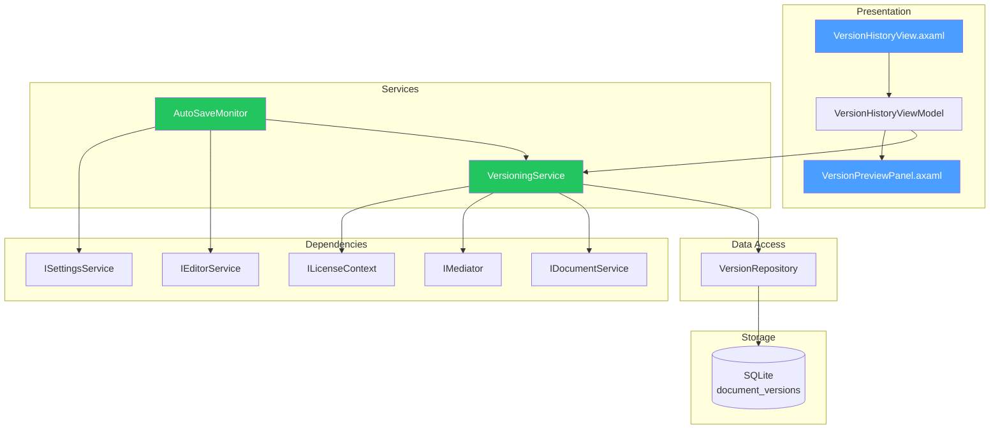

# LCS-DES-094a: Design Specification — Document Versioning

## 1. Metadata & Categorization

| Field | Value | Description |
| :--- | :--- | :--- |
| **Feature ID** | `COL-094a` | Sub-part of COL-094 |
| **Feature Name** | `Document Versioning (Auto-Save Snapshots)` | Version history system |
| **Target Version** | `v0.9.4a` | First sub-part of v0.9.4 |
| **Module Scope** | `Lexichord.Modules.Collaboration` | Collaboration module |
| **Swimlane** | `Collaboration` | Part of Collaboration vertical |
| **License Tier** | `Core (limited), WriterPro+` | Tiered access |
| **Feature Gate Key** | `feature.collaboration.versioning` | License check key |
| **Author** | Lead Architect | |
| **Status** | `Draft` | |
| **Last Updated** | `2026-01-27` | |
| **Parent Document** | [LCS-DES-094-INDEX](./LCS-DES-094-INDEX.md) | |
| **Scope Breakdown** | [LCS-SBD-094 Section 3.1](./LCS-SBD-094.md#31-v094a-document-versioning) | |

---

## 2. Executive Summary

### 2.1 The Requirement

Writers need protection against lost work and the ability to see how their document evolved over time. Currently:

- Accidental deletions cannot be recovered
- There is no way to view previous drafts
- Writers must manually create backup files
- No insight into how word count changed over time

> **Goal:** Automatically capture version snapshots on save, maintaining a complete history that writers can browse, preview, and restore from.

### 2.2 The Proposed Solution

Implement automatic document versioning that:

1. Creates snapshots on save (manual and auto-save)
2. Stores version metadata (timestamp, word count, delta)
3. Provides a version history panel with timeline view
4. Enables preview of any version without checkout
5. Allows restoration to any previous version
6. Applies retention policies to manage storage

---

## 3. Architecture & Modular Strategy

### 3.1 Dependencies

#### 3.1.1 Required Interfaces

| Interface | Source Version | Purpose |
| :--- | :--- | :--- |
| `IDocumentService` | v0.1.3a | Document access |
| `IEditorService` | v0.1.3c | Editor content capture |
| `IStorageService` | v0.5.2a | Persisting version data |
| `IMediator` | v0.0.7a | Publishing version events |
| `ISettingsService` | v0.1.6a | User preferences for auto-save |
| `ILicenseContext` | v0.0.4c | License tier checking |

#### 3.1.2 NuGet Packages

| Package | Version | Purpose |
| :--- | :--- | :--- |
| `System.IO.Hashing` | 8.x | XxHash64 for content hashing |
| `Dapper` | 2.x | Database access |
| `SQLitePCLRaw` | 2.x | SQLite database |

### 3.2 Component Architecture



### 3.3 Licensing Behavior

| Tier | Max Versions | Auto-Save | Preview | Restore |
| :--- | :--- | :--- | :--- | :--- |
| Core | 5 | Yes | Yes | Yes |
| WriterPro | 30 | Yes | Yes | Yes |
| Teams+ | Unlimited | Yes | Yes | Yes |

Excess versions are pruned automatically based on tier limits.

---

## 4. Data Contract (The API)

### 4.1 Core Records

```csharp
namespace Lexichord.Modules.Collaboration.Models;

/// <summary>
/// Represents a single version snapshot of a document.
/// Immutable record capturing the complete document state at a point in time.
/// </summary>
public record DocumentVersion
{
    /// <summary>
    /// Unique identifier for this version.
    /// </summary>
    public Guid VersionId { get; init; }

    /// <summary>
    /// The document this version belongs to.
    /// </summary>
    public Guid DocumentId { get; init; }

    /// <summary>
    /// Sequential version number within the document (1, 2, 3...).
    /// </summary>
    public int VersionNumber { get; init; }

    /// <summary>
    /// Complete document content at this version.
    /// </summary>
    public string Content { get; init; } = string.Empty;

    /// <summary>
    /// XxHash64 of content for duplicate detection.
    /// </summary>
    public string? ContentHash { get; init; }

    /// <summary>
    /// When this version was created (UTC).
    /// </summary>
    public DateTime CreatedAt { get; init; }

    /// <summary>
    /// User or profile that created this version.
    /// </summary>
    public string? CreatedBy { get; init; }

    /// <summary>
    /// Branch name (default: "main").
    /// </summary>
    public string? BranchName { get; init; } = "main";

    /// <summary>
    /// Parent version ID for version graph.
    /// </summary>
    public Guid? ParentVersionId { get; init; }

    /// <summary>
    /// Type of version (AutoSave, ManualSave, RestorePoint, etc.).
    /// </summary>
    public VersionType Type { get; init; }

    /// <summary>
    /// Optional label for this version (e.g., restore point name).
    /// </summary>
    public string? Label { get; init; }

    /// <summary>
    /// Word count at this version.
    /// </summary>
    public int WordCount { get; init; }

    /// <summary>
    /// Change in word count from previous version.
    /// </summary>
    public int WordCountDelta { get; init; }
}

/// <summary>
/// Type of version snapshot.
/// </summary>
public enum VersionType
{
    /// <summary>
    /// Automatically created by the auto-save system.
    /// </summary>
    AutoSave,

    /// <summary>
    /// Manually saved by the user (Ctrl+S).
    /// </summary>
    ManualSave,

    /// <summary>
    /// Named restore point created by user.
    /// </summary>
    RestorePoint,

    /// <summary>
    /// Created when a branch was started from this version.
    /// </summary>
    BranchPoint,

    /// <summary>
    /// Result of merging two branches.
    /// </summary>
    MergeResult
}

/// <summary>
/// Policy for pruning old versions.
/// </summary>
public record VersionRetentionPolicy
{
    /// <summary>
    /// Maximum number of versions to keep (0 = unlimited).
    /// </summary>
    public int MaxVersions { get; init; } = 100;

    /// <summary>
    /// Maximum age of versions to keep (null = no limit).
    /// </summary>
    public TimeSpan? MaxAge { get; init; }

    /// <summary>
    /// Always keep restore points regardless of other limits.
    /// </summary>
    public bool KeepRestorePoints { get; init; } = true;

    /// <summary>
    /// Always keep branch points regardless of other limits.
    /// </summary>
    public bool KeepBranchPoints { get; init; } = true;
}
```

### 4.2 Service Interface

```csharp
namespace Lexichord.Abstractions.Contracts;

/// <summary>
/// Service for managing document version history.
/// Thread-safe for concurrent access from UI and auto-save.
/// </summary>
public interface IVersioningService
{
    /// <summary>
    /// Creates a new version snapshot for the document.
    /// Skips creation if content hash matches the latest version.
    /// </summary>
    /// <param name="documentId">The document to version.</param>
    /// <param name="content">The current document content.</param>
    /// <param name="type">Type of version being created.</param>
    /// <param name="label">Optional label for the version.</param>
    /// <param name="ct">Cancellation token.</param>
    /// <returns>The created version, or the existing version if unchanged.</returns>
    Task<DocumentVersion> CreateVersionAsync(
        Guid documentId,
        string content,
        VersionType type,
        string? label = null,
        CancellationToken ct = default);

    /// <summary>
    /// Gets all versions for a document, ordered by creation date descending.
    /// </summary>
    /// <param name="documentId">The document to query.</param>
    /// <param name="branchName">Optional branch filter (null = all branches).</param>
    /// <param name="limit">Maximum versions to return (null = all within license limit).</param>
    /// <param name="ct">Cancellation token.</param>
    Task<IReadOnlyList<DocumentVersion>> GetVersionHistoryAsync(
        Guid documentId,
        string? branchName = null,
        int? limit = null,
        CancellationToken ct = default);

    /// <summary>
    /// Gets a specific version by ID.
    /// </summary>
    Task<DocumentVersion?> GetVersionAsync(
        Guid versionId,
        CancellationToken ct = default);

    /// <summary>
    /// Gets the latest version for a document on a specific branch.
    /// </summary>
    Task<DocumentVersion?> GetLatestVersionAsync(
        Guid documentId,
        string? branchName = null,
        CancellationToken ct = default);

    /// <summary>
    /// Restores a document to a specific version.
    /// Creates a new RestorePoint version with the restored content.
    /// </summary>
    Task<DocumentVersion> RestoreVersionAsync(
        Guid documentId,
        Guid versionId,
        CancellationToken ct = default);

    /// <summary>
    /// Deletes old versions based on retention policy.
    /// </summary>
    /// <returns>Number of versions deleted.</returns>
    Task<int> PruneVersionsAsync(
        Guid documentId,
        VersionRetentionPolicy policy,
        CancellationToken ct = default);

    /// <summary>
    /// Gets the content hash for the latest version.
    /// Used by auto-save to check if content changed.
    /// </summary>
    Task<string?> GetLatestContentHashAsync(
        Guid documentId,
        string? branchName = null,
        CancellationToken ct = default);
}
```

### 4.3 Repository Interface

```csharp
namespace Lexichord.Modules.Collaboration.Data;

/// <summary>
/// Repository for document version persistence.
/// </summary>
public interface IVersionRepository
{
    Task SaveVersionAsync(DocumentVersion version, CancellationToken ct = default);
    Task<DocumentVersion?> GetVersionAsync(Guid versionId, CancellationToken ct = default);
    Task<DocumentVersion?> GetLatestVersionAsync(Guid documentId, string? branchName = null, CancellationToken ct = default);
    Task<IReadOnlyList<DocumentVersion>> GetVersionHistoryAsync(Guid documentId, string? branchName = null, int? limit = null, CancellationToken ct = default);
    Task<int> DeleteVersionsAsync(IEnumerable<Guid> versionIds, CancellationToken ct = default);
    Task<int> GetVersionCountAsync(Guid documentId, CancellationToken ct = default);
}
```

---

## 5. Implementation Logic

### 5.1 Version Creation Flow

```text
CREATE VERSION:
│
├── Input: documentId, content, type, label?
│
├── Calculate content hash (XxHash64)
│   └── Hash = XxHash64(UTF8(content)).ToHexString()
│
├── Get latest version for document
│   └── LatestVersion = repository.GetLatestVersionAsync()
│
├── Check if content changed
│   ├── IF LatestVersion.ContentHash == Hash AND type != RestorePoint
│   │   └── RETURN LatestVersion (skip duplicate)
│   └── ELSE continue
│
├── Calculate metadata
│   ├── WordCount = CountWords(content)
│   ├── WordCountDelta = WordCount - (LatestVersion?.WordCount ?? 0)
│   └── VersionNumber = (LatestVersion?.VersionNumber ?? 0) + 1
│
├── Create version record
│   └── NewVersion = new DocumentVersion { ... }
│
├── Save to repository
│   └── repository.SaveVersionAsync(NewVersion)
│
├── Publish event
│   └── mediator.Publish(new VersionCreatedEvent(NewVersion))
│
├── Prune if needed (async, non-blocking)
│   └── Task.Run(() => PruneIfNeededAsync(documentId))
│
└── RETURN NewVersion
```

### 5.2 Auto-Save Integration

```text
AUTO-SAVE MONITOR:
│
├── On editor content change
│   └── Start debounce timer (500ms)
│
├── On debounce timer fire
│   └── Mark document dirty, start save interval timer
│
├── On save interval timer fire (e.g., 5 minutes)
│   ├── Get current content from editor
│   ├── Get latest content hash
│   ├── IF content changed (hash different)
│   │   ├── Calculate change size
│   │   ├── IF change size > MinimumChangeThreshold
│   │   │   └── CreateVersionAsync(type: AutoSave)
│   │   └── ELSE skip (too small)
│   └── ELSE skip (no change)
│
└── On manual save (Ctrl+S)
    └── CreateVersionAsync(type: ManualSave)
```

### 5.3 Version Pruning Logic

```text
PRUNE VERSIONS:
│
├── Input: documentId, policy
│
├── Get all versions for document
│   └── AllVersions = repository.GetVersionHistoryAsync(limit: null)
│
├── Identify protected versions
│   ├── IF policy.KeepRestorePoints
│   │   └── Protected += versions.Where(v => v.Type == RestorePoint)
│   ├── IF policy.KeepBranchPoints
│   │   └── Protected += versions.Where(v => v.Type == BranchPoint)
│   └── Always protect latest version
│
├── Apply MaxVersions limit
│   ├── VersionsToKeep = AllVersions
│   │   .Except(Protected)
│   │   .OrderByDescending(CreatedAt)
│   │   .Take(MaxVersions - Protected.Count)
│   └── VersionsToDelete = AllVersions - VersionsToKeep - Protected
│
├── Apply MaxAge limit
│   ├── CutoffDate = DateTime.UtcNow - MaxAge
│   └── VersionsToDelete += versions.Where(v => v.CreatedAt < CutoffDate)
│
├── Delete identified versions
│   └── Deleted = repository.DeleteVersionsAsync(VersionsToDelete.Select(v => v.VersionId))
│
└── RETURN Deleted.Count
```

---

## 6. VersioningService Implementation

```csharp
namespace Lexichord.Modules.Collaboration.Services;

/// <summary>
/// Manages document version history with automatic snapshotting.
/// </summary>
public class VersioningService(
    IVersionRepository repository,
    IDocumentService documentService,
    IMediator mediator,
    ILicenseContext licenseContext,
    IOptions<VersioningSettings> settings,
    ILogger<VersioningService> logger) : IVersioningService
{
    private readonly SemaphoreSlim _lock = new(1, 1);

    public async Task<DocumentVersion> CreateVersionAsync(
        Guid documentId,
        string content,
        VersionType type,
        string? label = null,
        CancellationToken ct = default)
    {
        await _lock.WaitAsync(ct);
        try
        {
            logger.LogDebug(
                "Creating {Type} version for document {DocumentId}",
                type, documentId);

            // Calculate content hash
            var contentHash = CalculateHash(content);
            var latestVersion = await repository.GetLatestVersionAsync(documentId, ct: ct);

            // Skip if content unchanged (except for restore points)
            if (type != VersionType.RestorePoint &&
                type != VersionType.BranchPoint &&
                latestVersion?.ContentHash == contentHash)
            {
                logger.LogDebug(
                    "Skipping version creation - content unchanged for {DocumentId}",
                    documentId);
                return latestVersion;
            }

            // Calculate word count
            var wordCount = CountWords(content);
            var previousWordCount = latestVersion?.WordCount ?? 0;

            var newVersion = new DocumentVersion
            {
                VersionId = Guid.NewGuid(),
                DocumentId = documentId,
                VersionNumber = (latestVersion?.VersionNumber ?? 0) + 1,
                Content = content,
                ContentHash = contentHash,
                CreatedAt = DateTime.UtcNow,
                ParentVersionId = latestVersion?.VersionId,
                BranchName = latestVersion?.BranchName ?? "main",
                Type = type,
                Label = label,
                WordCount = wordCount,
                WordCountDelta = wordCount - previousWordCount
            };

            await repository.SaveVersionAsync(newVersion, ct);

            logger.LogInformation(
                "Created version {VersionNumber} ({Type}) for document {DocumentId}",
                newVersion.VersionNumber, type, documentId);

            await mediator.Publish(new VersionCreatedEvent(newVersion), ct);

            // Schedule pruning (don't await)
            _ = Task.Run(() => PruneIfNeededAsync(documentId, ct), ct);

            return newVersion;
        }
        finally
        {
            _lock.Release();
        }
    }

    public async Task<IReadOnlyList<DocumentVersion>> GetVersionHistoryAsync(
        Guid documentId,
        string? branchName = null,
        int? limit = null,
        CancellationToken ct = default)
    {
        // Apply license-based limit
        var maxVersions = GetMaxVersionsForLicense();
        var effectiveLimit = limit.HasValue
            ? Math.Min(limit.Value, maxVersions)
            : maxVersions;

        return await repository.GetVersionHistoryAsync(
            documentId, branchName, effectiveLimit, ct);
    }

    public async Task<DocumentVersion> RestoreVersionAsync(
        Guid documentId,
        Guid versionId,
        CancellationToken ct = default)
    {
        var version = await repository.GetVersionAsync(versionId, ct)
            ?? throw new VersionNotFoundException(versionId);

        if (version.DocumentId != documentId)
        {
            throw new InvalidOperationException(
                "Version does not belong to specified document");
        }

        logger.LogInformation(
            "Restoring document {DocumentId} to version {VersionNumber}",
            documentId, version.VersionNumber);

        // Create a new version with the restored content
        var restoredVersion = await CreateVersionAsync(
            documentId,
            version.Content,
            VersionType.RestorePoint,
            $"Restored from v{version.VersionNumber}",
            ct);

        await mediator.Publish(
            new VersionRestoredEvent(documentId, versionId, restoredVersion.VersionId),
            ct);

        return restoredVersion;
    }

    public async Task<int> PruneVersionsAsync(
        Guid documentId,
        VersionRetentionPolicy policy,
        CancellationToken ct = default)
    {
        var allVersions = await repository.GetVersionHistoryAsync(
            documentId, limit: null, ct: ct);

        if (allVersions.Count <= policy.MaxVersions)
        {
            return 0; // Nothing to prune
        }

        // Build protected set
        var protectedIds = new HashSet<Guid>();

        // Always protect latest
        if (allVersions.Count > 0)
        {
            protectedIds.Add(allVersions[0].VersionId);
        }

        // Protect restore points and branch points
        foreach (var version in allVersions)
        {
            if (policy.KeepRestorePoints && version.Type == VersionType.RestorePoint)
            {
                protectedIds.Add(version.VersionId);
            }
            if (policy.KeepBranchPoints && version.Type == VersionType.BranchPoint)
            {
                protectedIds.Add(version.VersionId);
            }
        }

        // Calculate versions to delete
        var versionsToDelete = allVersions
            .Where(v => !protectedIds.Contains(v.VersionId))
            .OrderBy(v => v.CreatedAt)
            .Take(allVersions.Count - policy.MaxVersions)
            .Select(v => v.VersionId)
            .ToList();

        if (versionsToDelete.Count == 0)
        {
            return 0;
        }

        var deleted = await repository.DeleteVersionsAsync(versionsToDelete, ct);

        logger.LogInformation(
            "Pruned {Count} versions from document {DocumentId}",
            deleted, documentId);

        return deleted;
    }

    private int GetMaxVersionsForLicense() => licenseContext.CurrentTier switch
    {
        LicenseTier.Core => 5,
        LicenseTier.WriterPro => 30,
        _ => settings.Value.MaxVersionsPerDocument
    };

    private async Task PruneIfNeededAsync(Guid documentId, CancellationToken ct)
    {
        try
        {
            var count = await repository.GetVersionCountAsync(documentId, ct);
            var maxVersions = GetMaxVersionsForLicense();

            if (count > maxVersions + 10) // Prune when 10 over limit
            {
                await PruneVersionsAsync(documentId, new VersionRetentionPolicy
                {
                    MaxVersions = maxVersions
                }, ct);
            }
        }
        catch (Exception ex)
        {
            logger.LogWarning(ex, "Failed to prune versions for {DocumentId}", documentId);
        }
    }

    private static string CalculateHash(string content)
    {
        var bytes = Encoding.UTF8.GetBytes(content);
        var hash = XxHash64.Hash(bytes);
        return Convert.ToHexString(hash);
    }

    private static int CountWords(string content)
    {
        if (string.IsNullOrWhiteSpace(content))
            return 0;

        return content.Split(
            [' ', '\n', '\r', '\t'],
            StringSplitOptions.RemoveEmptyEntries).Length;
    }
}
```

---

## 7. UI/UX Specifications

### 7.1 Version History Panel Layout

```text
┌──────────────────────────────────────────────────────────────────────────┐
│  Version History                                                   [x]   │
├──────────────────────────────────────────────────────────────────────────┤
│  [Search...                    ]    Branch: [main          v]  [Filter v]│
├──────────────────────────────────────────────────────────────────────────┤
│                                                                          │
│  TODAY                                                                   │
│  ────────────────────────────────────────────────────────────────────    │
│                                                                          │
│  ● v23    2:34 PM                                         +142 words    │
│           Auto-save                                                      │
│           [Preview] [Restore] [Compare] [Branch]                        │
│                                                                          │
│  ● v22    2:15 PM                                          -28 words    │
│           Auto-save                                                      │
│           [Preview] [Restore] [Compare] [Branch]                        │
│                                                                          │
│  ★ v21    1:45 PM                                    Restore Point      │
│           "Pre-Editor Review"                                            │
│           [Preview] [Restore] [Compare] [Branch]                        │
│                                                                          │
│  YESTERDAY                                                               │
│  ────────────────────────────────────────────────────────────────────    │
│                                                                          │
│  ● v20    4:30 PM                                         +523 words    │
│           Manual save                                                    │
│           [Preview] [Restore] [Compare] [Branch]                        │
│                                                                          │
│  ...                                                                     │
│                                                                          │
├──────────────────────────────────────────────────────────────────────────┤
│  Showing 23 of 23 versions                                               │
└──────────────────────────────────────────────────────────────────────────┘
```

### 7.2 Version Preview Panel

```text
┌──────────────────────────────────────────────────────────────────────────┐
│  Preview: v21 - Pre-Editor Review                               [x]     │
├──────────────────────────────────────────────────────────────────────────┤
│  Created: Today, 1:45 PM    Words: 44,892    Type: Restore Point        │
├──────────────────────────────────────────────────────────────────────────┤
│                                                                          │
│  Chapter 5: The Final Confrontation                                      │
│                                                                          │
│  The hero stood at the edge of the cliff, sword in hand.                │
│  Below, the dark army gathered, their torches forming a sea             │
│  of angry light against the night sky.                                   │
│                                                                          │
│  "This ends tonight," he whispered, more to himself than                │
│  anyone else.                                                            │
│                                                                          │
│  [Content continues - read only]                                         │
│                                                                          │
├──────────────────────────────────────────────────────────────────────────┤
│                         [Restore This Version] [Compare to Current]      │
└──────────────────────────────────────────────────────────────────────────┘
```

### 7.3 Component Styling

| Component | Theme Resource | Notes |
| :--- | :--- | :--- |
| Panel background | `Brush.Surface.Primary` | Main panel |
| Version item | `Brush.Surface.Secondary` | List item background |
| Version item hover | `Brush.Surface.Tertiary` | Hover state |
| Version number | `Brush.Text.Primary` | Bold weight |
| Timestamp | `Brush.Text.Secondary` | Regular weight |
| Word delta positive | `Brush.Success.Primary` | Green, + prefix |
| Word delta negative | `Brush.Error.Primary` | Red, - prefix |
| Restore point icon | `Brush.Warning.Primary` | Star icon |
| Auto-save badge | `Brush.Text.Tertiary` | Subtle |
| Divider | `Brush.Border.Primary` | Date separators |

---

## 8. VersionHistoryViewModel Implementation

```csharp
namespace Lexichord.Modules.Collaboration.ViewModels;

public partial class VersionHistoryViewModel : ObservableObject
{
    private readonly IVersioningService _versioningService;
    private readonly IDocumentService _documentService;
    private readonly IMediator _mediator;
    private readonly ILogger<VersionHistoryViewModel> _logger;

    [ObservableProperty]
    private Guid _documentId;

    [ObservableProperty]
    private ObservableCollection<VersionItemViewModel> _versions = [];

    [ObservableProperty]
    private VersionItemViewModel? _selectedVersion;

    [ObservableProperty]
    private string _searchQuery = string.Empty;

    [ObservableProperty]
    private string _selectedBranch = "main";

    [ObservableProperty]
    private bool _isLoading;

    [ObservableProperty]
    private string? _previewContent;

    [ObservableProperty]
    private bool _isPreviewVisible;

    public VersionHistoryViewModel(
        IVersioningService versioningService,
        IDocumentService documentService,
        IMediator mediator,
        ILogger<VersionHistoryViewModel> logger)
    {
        _versioningService = versioningService;
        _documentService = documentService;
        _mediator = mediator;
        _logger = logger;
    }

    public async Task LoadVersionsAsync(Guid documentId)
    {
        DocumentId = documentId;
        IsLoading = true;

        try
        {
            var versions = await _versioningService.GetVersionHistoryAsync(
                documentId, SelectedBranch);

            Versions.Clear();
            foreach (var version in versions)
            {
                Versions.Add(new VersionItemViewModel(version));
            }
        }
        catch (Exception ex)
        {
            _logger.LogError(ex, "Failed to load version history");
        }
        finally
        {
            IsLoading = false;
        }
    }

    [RelayCommand]
    private async Task PreviewVersionAsync(Guid versionId)
    {
        var version = await _versioningService.GetVersionAsync(versionId);
        if (version != null)
        {
            PreviewContent = version.Content;
            IsPreviewVisible = true;
        }
    }

    [RelayCommand]
    private async Task RestoreVersionAsync(Guid versionId)
    {
        try
        {
            var restoredVersion = await _versioningService.RestoreVersionAsync(
                DocumentId, versionId);

            // Reload the document content
            await _documentService.ReloadDocumentAsync(DocumentId);

            // Refresh version list
            await LoadVersionsAsync(DocumentId);
        }
        catch (Exception ex)
        {
            _logger.LogError(ex, "Failed to restore version");
            // Show error notification
        }
    }

    [RelayCommand]
    private void ClosePreview()
    {
        IsPreviewVisible = false;
        PreviewContent = null;
    }

    partial void OnSearchQueryChanged(string value)
    {
        // Filter versions by search query
        // Implementation uses CollectionView filtering
    }

    partial void OnSelectedBranchChanged(string value)
    {
        // Reload versions for the selected branch
        _ = LoadVersionsAsync(DocumentId);
    }
}

public partial class VersionItemViewModel : ObservableObject
{
    public Guid VersionId { get; }
    public int VersionNumber { get; }
    public DateTime CreatedAt { get; }
    public VersionType Type { get; }
    public string? Label { get; }
    public int WordCount { get; }
    public int WordCountDelta { get; }

    public string DisplayTime => CreatedAt.ToLocalTime().ToString("h:mm tt");
    public string DisplayDate => GetDisplayDate();
    public string DeltaDisplay => FormatDelta();
    public bool IsRestorePoint => Type == VersionType.RestorePoint;
    public bool IsBranchPoint => Type == VersionType.BranchPoint;

    public VersionItemViewModel(DocumentVersion version)
    {
        VersionId = version.VersionId;
        VersionNumber = version.VersionNumber;
        CreatedAt = version.CreatedAt;
        Type = version.Type;
        Label = version.Label;
        WordCount = version.WordCount;
        WordCountDelta = version.WordCountDelta;
    }

    private string GetDisplayDate()
    {
        var date = CreatedAt.ToLocalTime().Date;
        var today = DateTime.Today;

        if (date == today)
            return "Today";
        if (date == today.AddDays(-1))
            return "Yesterday";
        if (date > today.AddDays(-7))
            return date.DayOfWeek.ToString();

        return date.ToString("MMM d, yyyy");
    }

    private string FormatDelta()
    {
        if (WordCountDelta == 0)
            return "No change";
        if (WordCountDelta > 0)
            return $"+{WordCountDelta:N0} words";
        return $"{WordCountDelta:N0} words";
    }
}
```

---

## 9. AutoSaveMonitor Implementation

```csharp
namespace Lexichord.Modules.Collaboration.Services;

/// <summary>
/// Monitors editor changes and triggers version creation on auto-save.
/// </summary>
public class AutoSaveMonitor : IDisposable
{
    private readonly IEditorService _editorService;
    private readonly IVersioningService _versioningService;
    private readonly ISettingsService _settingsService;
    private readonly ILogger<AutoSaveMonitor> _logger;

    private readonly Subject<Unit> _contentChanged = new();
    private readonly CompositeDisposable _subscriptions = new();

    private IDisposable? _debounceSubscription;
    private IDisposable? _intervalSubscription;
    private Guid _currentDocumentId;
    private bool _isDirty;

    public AutoSaveMonitor(
        IEditorService editorService,
        IVersioningService versioningService,
        ISettingsService settingsService,
        ILogger<AutoSaveMonitor> logger)
    {
        _editorService = editorService;
        _versioningService = versioningService;
        _settingsService = settingsService;
        _logger = logger;

        SetupSubscriptions();
    }

    private void SetupSubscriptions()
    {
        // Subscribe to editor content changes
        _editorService.ContentChanged
            .Subscribe(_ => OnContentChanged())
            .AddTo(_subscriptions);

        // Subscribe to document switch
        _editorService.ActiveDocumentChanged
            .Subscribe(docId => OnDocumentChanged(docId))
            .AddTo(_subscriptions);

        // Subscribe to manual save
        _editorService.DocumentSaved
            .Subscribe(docId => OnManualSave(docId))
            .AddTo(_subscriptions);
    }

    private void OnContentChanged()
    {
        _contentChanged.OnNext(Unit.Default);
    }

    private void OnDocumentChanged(Guid documentId)
    {
        // Cancel previous subscriptions
        _debounceSubscription?.Dispose();
        _intervalSubscription?.Dispose();

        _currentDocumentId = documentId;
        _isDirty = false;

        if (documentId == Guid.Empty)
            return;

        var settings = _settingsService.GetValue<VersioningSettings>("Versioning");

        // Debounce content changes (500ms)
        _debounceSubscription = _contentChanged
            .Throttle(TimeSpan.FromMilliseconds(500))
            .Subscribe(_ =>
            {
                _isDirty = true;
                StartIntervalTimer(settings.AutoSaveInterval);
            });
    }

    private void StartIntervalTimer(TimeSpan interval)
    {
        _intervalSubscription?.Dispose();

        _intervalSubscription = Observable
            .Timer(interval)
            .Where(_ => _isDirty)
            .Subscribe(async _ => await TryCreateAutoSaveVersionAsync());
    }

    private async Task TryCreateAutoSaveVersionAsync()
    {
        if (_currentDocumentId == Guid.Empty || !_isDirty)
            return;

        try
        {
            var content = await _editorService.GetContentAsync(_currentDocumentId);
            var latestHash = await _versioningService.GetLatestContentHashAsync(_currentDocumentId);
            var currentHash = CalculateHash(content);

            if (currentHash == latestHash)
            {
                _logger.LogDebug("Skipping auto-save - content unchanged");
                return;
            }

            var settings = _settingsService.GetValue<VersioningSettings>("Versioning");
            var changeSize = Math.Abs(content.Length - (await GetPreviousContentLength()));

            if (changeSize < settings.MinimumChangeThreshold)
            {
                _logger.LogDebug(
                    "Skipping auto-save - change size {Size} below threshold {Threshold}",
                    changeSize, settings.MinimumChangeThreshold);
                return;
            }

            await _versioningService.CreateVersionAsync(
                _currentDocumentId,
                content,
                VersionType.AutoSave);

            _isDirty = false;
            _logger.LogDebug("Auto-save version created for {DocumentId}", _currentDocumentId);
        }
        catch (Exception ex)
        {
            _logger.LogWarning(ex, "Auto-save failed for {DocumentId}", _currentDocumentId);
        }
    }

    private async void OnManualSave(Guid documentId)
    {
        if (documentId == Guid.Empty)
            return;

        try
        {
            var content = await _editorService.GetContentAsync(documentId);
            await _versioningService.CreateVersionAsync(
                documentId,
                content,
                VersionType.ManualSave);

            _isDirty = false;
        }
        catch (Exception ex)
        {
            _logger.LogWarning(ex, "Failed to create version on manual save");
        }
    }

    private static string CalculateHash(string content)
    {
        var bytes = Encoding.UTF8.GetBytes(content);
        return Convert.ToHexString(XxHash64.Hash(bytes));
    }

    private async Task<int> GetPreviousContentLength()
    {
        var latest = await _versioningService.GetLatestVersionAsync(_currentDocumentId);
        return latest?.Content.Length ?? 0;
    }

    public void Dispose()
    {
        _debounceSubscription?.Dispose();
        _intervalSubscription?.Dispose();
        _subscriptions.Dispose();
        _contentChanged.Dispose();
    }
}
```

---

## 10. Database Schema

```sql
-- Document version snapshots
CREATE TABLE IF NOT EXISTS document_versions (
    version_id TEXT PRIMARY KEY,
    document_id TEXT NOT NULL,
    version_number INTEGER NOT NULL,
    content TEXT NOT NULL,
    content_hash TEXT NOT NULL,
    created_at TEXT NOT NULL,
    created_by TEXT,
    branch_name TEXT DEFAULT 'main',
    parent_version_id TEXT,
    version_type TEXT NOT NULL,
    label TEXT,
    word_count INTEGER NOT NULL,
    word_count_delta INTEGER NOT NULL,
    FOREIGN KEY (document_id) REFERENCES documents(document_id) ON DELETE CASCADE,
    FOREIGN KEY (parent_version_id) REFERENCES document_versions(version_id)
);

-- Indexes for efficient querying
CREATE INDEX IF NOT EXISTS idx_versions_document
    ON document_versions(document_id);

CREATE INDEX IF NOT EXISTS idx_versions_branch
    ON document_versions(document_id, branch_name);

CREATE INDEX IF NOT EXISTS idx_versions_created
    ON document_versions(created_at DESC);

CREATE INDEX IF NOT EXISTS idx_versions_type
    ON document_versions(document_id, version_type);
```

---

## 11. Observability & Logging

| Level | Message Template |
| :--- | :--- |
| Debug | `"Checking version creation for document {DocumentId}"` |
| Debug | `"Content hash: {Hash}, Latest hash: {LatestHash}"` |
| Debug | `"Skipping version - content unchanged"` |
| Debug | `"Skipping version - change size {Size} below threshold"` |
| Info | `"Created version {VersionNumber} ({Type}) for document {DocumentId}"` |
| Info | `"Restored document {DocumentId} to version {VersionNumber}"` |
| Info | `"Pruned {Count} versions from document {DocumentId}"` |
| Warning | `"Auto-save failed for {DocumentId}: {Error}"` |
| Warning | `"Version pruning failed for {DocumentId}: {Error}"` |
| Error | `"Failed to create version: {Error}"` |

---

## 12. Security & Safety

| Risk | Level | Mitigation |
| :--- | :--- | :--- |
| Data loss on prune | Medium | Protect restore points, branch points |
| Concurrent version creation | Low | SemaphoreSlim for thread safety |
| Large content storage | Medium | Future: Implement delta compression |
| Unauthorized access | Low | Versions linked to document permissions |

---

## 13. Acceptance Criteria

### 13.1 Functional Criteria

| # | Given | When | Then |
| :--- | :--- | :--- | :--- |
| 1 | Document open | User edits and waits for interval | Auto-save version created |
| 2 | Auto-save triggered | Content unchanged | Version not created |
| 3 | Auto-save triggered | Change below threshold | Version not created |
| 4 | User presses Ctrl+S | Document has changes | Manual save version created |
| 5 | Version history open | Document loaded | All versions displayed |
| 6 | Version selected | User clicks Preview | Content shown read-only |
| 7 | Version selected | User clicks Restore | Document content updated |
| 8 | Core license | More than 5 versions | Only 5 shown |
| 9 | WriterPro license | More than 30 versions | Only 30 shown |
| 10 | Teams license | Any number of versions | All shown |

### 13.2 Performance Criteria

| # | Operation | Target |
| :--- | :--- | :--- |
| 11 | Version creation | < 100ms |
| 12 | Version history load (100 versions) | < 300ms |
| 13 | Version preview load | < 200ms |
| 14 | Restore version | < 500ms |

---

## 14. Test Scenarios

```csharp
[Trait("Category", "Unit")]
[Trait("Version", "v0.9.4a")]
public class VersioningServiceTests
{
    [Fact]
    public async Task CreateVersionAsync_NewContent_CreatesVersion()
    {
        // Arrange
        var repository = new MockVersionRepository();
        var sut = CreateService(repository);
        var documentId = Guid.NewGuid();

        // Act
        var result = await sut.CreateVersionAsync(
            documentId, "Test content", VersionType.AutoSave);

        // Assert
        result.VersionNumber.Should().Be(1);
        result.Content.Should().Be("Test content");
        result.Type.Should().Be(VersionType.AutoSave);
    }

    [Fact]
    public async Task CreateVersionAsync_IdenticalContent_ReturnsExisting()
    {
        // Arrange
        var repository = new MockVersionRepository();
        var sut = CreateService(repository);
        var documentId = Guid.NewGuid();

        await sut.CreateVersionAsync(documentId, "Test content", VersionType.AutoSave);

        // Act
        var result = await sut.CreateVersionAsync(
            documentId, "Test content", VersionType.AutoSave);

        // Assert
        result.VersionNumber.Should().Be(1); // Same version
        repository.SaveCount.Should().Be(1); // Only saved once
    }

    [Fact]
    public async Task CreateVersionAsync_RestorePoint_AlwaysCreates()
    {
        // Arrange
        var repository = new MockVersionRepository();
        var sut = CreateService(repository);
        var documentId = Guid.NewGuid();

        await sut.CreateVersionAsync(documentId, "Test content", VersionType.AutoSave);

        // Act - Same content but restore point type
        var result = await sut.CreateVersionAsync(
            documentId, "Test content", VersionType.RestorePoint, "Checkpoint");

        // Assert
        result.VersionNumber.Should().Be(2);
        result.Type.Should().Be(VersionType.RestorePoint);
        result.Label.Should().Be("Checkpoint");
    }

    [Fact]
    public async Task GetVersionHistoryAsync_CoreLicense_ReturnsMax5()
    {
        // Arrange
        var repository = new MockVersionRepository();
        var licenseContext = new MockLicenseContext(LicenseTier.Core);
        var sut = CreateService(repository, licenseContext);
        var documentId = Guid.NewGuid();

        // Create 10 versions
        for (int i = 0; i < 10; i++)
        {
            await sut.CreateVersionAsync(documentId, $"Content {i}", VersionType.AutoSave);
        }

        // Act
        var result = await sut.GetVersionHistoryAsync(documentId);

        // Assert
        result.Should().HaveCount(5);
    }

    [Fact]
    public async Task RestoreVersionAsync_ValidVersion_CreatesNewVersion()
    {
        // Arrange
        var repository = new MockVersionRepository();
        var sut = CreateService(repository);
        var documentId = Guid.NewGuid();

        var v1 = await sut.CreateVersionAsync(documentId, "Original", VersionType.ManualSave);
        await sut.CreateVersionAsync(documentId, "Modified", VersionType.AutoSave);

        // Act
        var result = await sut.RestoreVersionAsync(documentId, v1.VersionId);

        // Assert
        result.VersionNumber.Should().Be(3);
        result.Content.Should().Be("Original");
        result.Type.Should().Be(VersionType.RestorePoint);
        result.Label.Should().Contain("Restored from v1");
    }

    [Fact]
    public async Task PruneVersionsAsync_ExceedsLimit_DeletesOldVersions()
    {
        // Arrange
        var repository = new MockVersionRepository();
        var sut = CreateService(repository);
        var documentId = Guid.NewGuid();

        for (int i = 0; i < 15; i++)
        {
            await sut.CreateVersionAsync(documentId, $"Content {i}", VersionType.AutoSave);
        }

        // Act
        var deleted = await sut.PruneVersionsAsync(documentId, new VersionRetentionPolicy
        {
            MaxVersions = 10
        });

        // Assert
        deleted.Should().Be(5);
        var remaining = await repository.GetVersionCountAsync(documentId);
        remaining.Should().Be(10);
    }

    [Fact]
    public async Task PruneVersionsAsync_ProtectsRestorePoints()
    {
        // Arrange
        var repository = new MockVersionRepository();
        var sut = CreateService(repository);
        var documentId = Guid.NewGuid();

        for (int i = 0; i < 10; i++)
        {
            await sut.CreateVersionAsync(documentId, $"Content {i}", VersionType.AutoSave);
        }
        var restorePoint = await sut.CreateVersionAsync(
            documentId, "Important", VersionType.RestorePoint, "Milestone");

        // Act
        await sut.PruneVersionsAsync(documentId, new VersionRetentionPolicy
        {
            MaxVersions = 5,
            KeepRestorePoints = true
        });

        // Assert
        var version = await repository.GetVersionAsync(restorePoint.VersionId);
        version.Should().NotBeNull(); // Restore point preserved
    }
}
```

---

## 15. Deliverable Checklist

| # | Deliverable | Status |
| :--- | :--- | :--- |
| 1 | `DocumentVersion` record | [ ] |
| 2 | `VersionType` enum | [ ] |
| 3 | `VersionRetentionPolicy` record | [ ] |
| 4 | `IVersioningService` interface | [ ] |
| 5 | `VersioningService` implementation | [ ] |
| 6 | `IVersionRepository` interface | [ ] |
| 7 | `VersionRepository` SQLite implementation | [ ] |
| 8 | `AutoSaveMonitor` service | [ ] |
| 9 | Database migration script | [ ] |
| 10 | `VersionHistoryView.axaml` | [ ] |
| 11 | `VersionHistoryViewModel` | [ ] |
| 12 | `VersionPreviewPanel.axaml` | [ ] |
| 13 | `VersionItemViewModel` | [ ] |
| 14 | Unit tests for `VersioningService` | [ ] |
| 15 | Integration tests | [ ] |
| 16 | DI registration | [ ] |

---

## 16. Verification Commands

```bash
# Build the module
dotnet build src/Lexichord.Modules.Collaboration

# Run versioning tests
dotnet test --filter "Version=v0.9.4a" --logger "console;verbosity=detailed"

# Run with coverage
dotnet test --filter "Version=v0.9.4a" --collect:"XPlat Code Coverage"

# Manual verification:
# 1. Open a document
# 2. Make edits, wait for auto-save interval
# 3. Check version history panel shows new version
# 4. Click Preview on a version
# 5. Click Restore on a previous version
# 6. Verify document content updated
```

---

## Document History

| Version | Date | Author | Changes |
| :--- | :--- | :--- | :--- |
| 1.0 | 2026-01-27 | Lead Architect | Initial draft |
