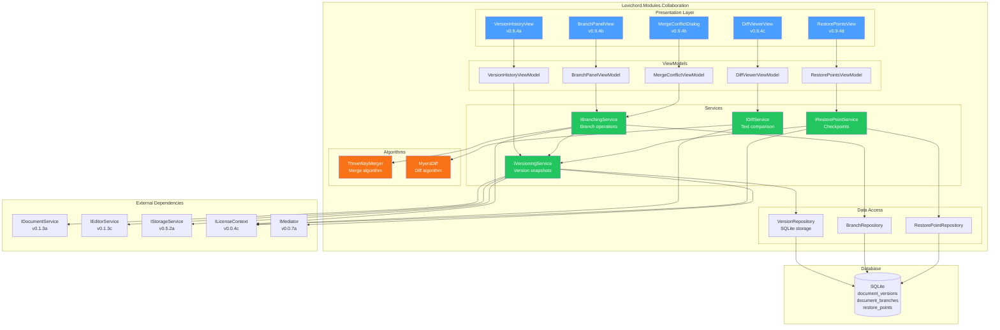
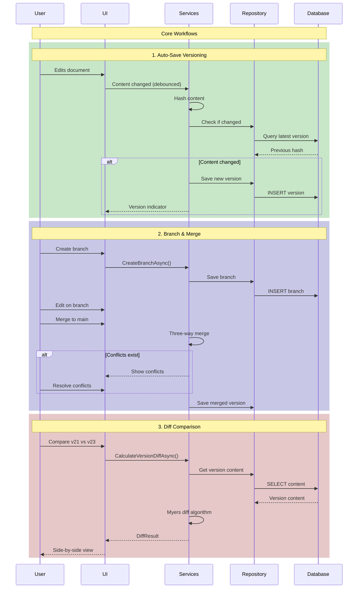

# LCS-DES-094: Design Specification Index — The Script Archive

## Document Control

| Field | Value |
| :--- | :--- |
| **Document ID** | LCS-DES-094-INDEX |
| **Feature ID** | COL-094 |
| **Feature Name** | The Script Archive (Version Control) |
| **Target Version** | v0.9.4 |
| **Module Scope** | Lexichord.Modules.Collaboration |
| **Swimlane** | Collaboration |
| **License Tier** | Teams (full), WriterPro (limited), Core (basic) |
| **Feature Gate Key** | `feature.collaboration.versioning` |
| **Status** | Draft |
| **Last Updated** | 2026-01-27 |

---

## 1. Executive Summary

**v0.9.4** delivers the **Script Archive** — Git-like versioning for documents that brings the power of version control to writers and collaborative teams.

### 1.1 The Problem

Writers face significant challenges managing document revisions:

- **Lost Work:** Accidental overwrites or deletions with no way to recover
- **Fear of Experimentation:** Reluctance to try radical rewrites that might ruin the manuscript
- **Collaboration Chaos:** Multiple team members editing the same document without merge capabilities
- **Milestone Amnesia:** No way to mark and return to significant document states
- **Revision Blindness:** Difficulty understanding what changed between drafts

Unlike programmers who enjoy robust version control with Git, writers have been left with primitive "Save As v2" approaches that quickly become unmanageable.

### 1.2 The Solution

The Script Archive introduces four interconnected capabilities:

1. **Document Versioning** — Automatic snapshots capture every significant change
2. **Branch/Merge** — Create parallel versions to experiment safely, then merge the best parts
3. **Diff Viewer** — Visual side-by-side comparison shows exactly what changed
4. **Restore Points** — Named checkpoints mark milestones like "Pre-Editor Review"

These tools work together to give writers the confidence to experiment freely, knowing they can always compare revisions or restore to any previous state.

### 1.3 Business Value

| Value | Description |
| :--- | :--- |
| **Fearless Experimentation** | Branch documents for radical rewrites without risk |
| **Complete History** | Every change captured, nothing ever lost |
| **Visual Comparison** | See exactly what changed between any two versions |
| **Team Collaboration** | Merge parallel edits with intelligent conflict resolution |
| **Milestone Protection** | Named restore points for critical document states |
| **Enterprise Compliance** | Complete audit trail of all document changes |

---

## 2. Related Documents

### 2.1 Scope Breakdown Document

The detailed scope breakdown for v0.9.4, including all sub-parts, implementation checklists, user stories, and acceptance criteria:

| Document | Description |
| :--- | :--- |
| **[LCS-SBD-094](./LCS-SBD-094.md)** | Scope Breakdown — The Script Archive |

### 2.2 Sub-Part Design Specifications

Each sub-part has its own detailed design specification following the LDS-01 template:

| Sub-Part | Document | Title | Description |
| :--- | :--- | :--- | :--- |
| v0.9.4a | **[LCS-DES-094a](./LCS-DES-094a.md)** | Document Versioning | Auto-save snapshots and version history |
| v0.9.4b | **[LCS-DES-094b](./LCS-DES-094b.md)** | Branch/Merge | Parallel versions with three-way merge |
| v0.9.4c | **[LCS-DES-094c](./LCS-DES-094c.md)** | Diff Viewer | Visual comparison of any two versions |
| v0.9.4d | **[LCS-DES-094d](./LCS-DES-094d.md)** | Restore Points | Named checkpoints for milestones |

---

## 3. Architecture Overview

### 3.1 Component Diagram



### 3.2 Data Flow Overview



---

## 4. Dependencies

### 4.1 Upstream Dependencies (Required Components)

| Interface | Source Version | Purpose |
| :--- | :--- | :--- |
| `IDocumentService` | v0.1.3a | Document CRUD operations |
| `IEditorService` | v0.1.3c | Access editor content |
| `IStorageService` | v0.5.2a | Persist version data |
| `ILicenseContext` | v0.0.4c | Check license tier |
| `IMediator` | v0.0.7a | Publish events |
| `ISettingsService` | v0.1.6a | User preferences |
| `IDockLayoutService` | v0.1.1a | Diff viewer panel layout |

### 4.2 NuGet Packages

| Package | Version | Purpose |
| :--- | :--- | :--- |
| `DiffPlex` | 1.7.x | Diff algorithm library (NEW) |
| `System.IO.Hashing` | 8.x | Content hashing (NEW) |
| `SQLitePCLRaw` | 2.x | SQLite database |
| `Dapper` | 2.x | Data access |

### 4.3 Downstream Consumers (Future)

| Version | Feature | Uses From v0.9.4 |
| :--- | :--- | :--- |
| v1.0.x | Real-time Collaboration | Version conflict resolution |
| v1.1.x | Cloud Sync | Version merge infrastructure |
| v1.2.x | AI Summarization | Version content for analysis |

---

## 5. License Gating Strategy

### 5.1 Feature Availability by Tier

| Feature | Core | WriterPro | Teams | Enterprise |
| :--- | :--- | :--- | :--- | :--- |
| Version history | 5 versions | 30 versions | Unlimited | Unlimited |
| Auto-save snapshots | Yes | Yes | Yes | Yes |
| Version preview | Yes | Yes | Yes | Yes |
| Restore to version | Yes | Yes | Yes | Yes |
| Diff viewer | Basic | Full | Full | Full |
| Manual restore points | No | Yes | Yes | Yes |
| Create branches | No | No | Yes | Yes |
| Merge branches | No | No | Yes | Yes |
| Conflict resolution | No | No | Yes | Yes |
| Export restore points | No | Yes | Yes | Yes |
| Audit logging | No | No | No | Yes |

### 5.2 Gating Implementation

```csharp
public class VersioningFeatureGate(ILicenseContext license)
{
    public int GetMaxVersions() => license.CurrentTier switch
    {
        LicenseTier.Core => 5,
        LicenseTier.WriterPro => 30,
        _ => int.MaxValue
    };

    public bool CanCreateBranch() =>
        license.CurrentTier >= LicenseTier.Teams;

    public bool CanCreateRestorePoint() =>
        license.CurrentTier >= LicenseTier.WriterPro;

    public bool CanUseDiffViewer() =>
        true; // Basic available to all, advanced features gated

    public bool CanExportRestorePoint() =>
        license.CurrentTier >= LicenseTier.WriterPro;
}
```

### 5.3 UI Gating Patterns

```text
Core/WriterPro User clicks "Create Branch":
┌─────────────────────────────────────────────────┐
│  Upgrade Required                          [x]  │
├─────────────────────────────────────────────────┤
│  [Branch Icon]                                  │
│                                                 │
│  Document Branching is a Teams feature.         │
│                                                 │
│  Create parallel versions of your document      │
│  to experiment safely, then merge the best      │
│  parts together.                                │
│                                                 │
│  [Learn More]      [Upgrade to Teams]           │
└─────────────────────────────────────────────────┘
```

---

## 6. Database Schema

### 6.1 Tables

```sql
-- Document version snapshots
CREATE TABLE document_versions (
    version_id TEXT PRIMARY KEY,
    document_id TEXT NOT NULL,
    version_number INTEGER NOT NULL,
    content TEXT NOT NULL,
    content_hash TEXT NOT NULL,
    created_at TEXT NOT NULL,
    created_by TEXT,
    branch_name TEXT DEFAULT 'main',
    parent_version_id TEXT,
    version_type TEXT NOT NULL,
    label TEXT,
    word_count INTEGER NOT NULL,
    word_count_delta INTEGER NOT NULL,
    FOREIGN KEY (document_id) REFERENCES documents(document_id),
    FOREIGN KEY (parent_version_id) REFERENCES document_versions(version_id)
);

CREATE INDEX idx_versions_document ON document_versions(document_id);
CREATE INDEX idx_versions_branch ON document_versions(document_id, branch_name);
CREATE INDEX idx_versions_created ON document_versions(created_at);

-- Document branches
CREATE TABLE document_branches (
    branch_id TEXT PRIMARY KEY,
    document_id TEXT NOT NULL,
    name TEXT NOT NULL,
    description TEXT,
    base_version_id TEXT NOT NULL,
    head_version_id TEXT NOT NULL,
    created_at TEXT NOT NULL,
    created_by TEXT,
    is_default INTEGER NOT NULL DEFAULT 0,
    status TEXT NOT NULL DEFAULT 'Active',
    FOREIGN KEY (document_id) REFERENCES documents(document_id),
    FOREIGN KEY (base_version_id) REFERENCES document_versions(version_id),
    FOREIGN KEY (head_version_id) REFERENCES document_versions(version_id),
    UNIQUE (document_id, name)
);

CREATE INDEX idx_branches_document ON document_branches(document_id);

-- Named restore points
CREATE TABLE restore_points (
    restore_point_id TEXT PRIMARY KEY,
    document_id TEXT NOT NULL,
    version_id TEXT NOT NULL,
    name TEXT NOT NULL,
    description TEXT,
    created_at TEXT NOT NULL,
    created_by TEXT,
    restore_point_type TEXT NOT NULL,
    is_protected INTEGER NOT NULL DEFAULT 0,
    metadata TEXT,
    FOREIGN KEY (document_id) REFERENCES documents(document_id),
    FOREIGN KEY (version_id) REFERENCES document_versions(version_id)
);

CREATE INDEX idx_restore_points_document ON restore_points(document_id);
```

---

## 7. Key Test Scenarios Summary

### 7.1 Versioning (v0.9.4a)

| Scenario | Input | Expected |
| :--- | :--- | :--- |
| Auto-save creates version | Edit + wait for interval | New version in history |
| Identical content skipped | Save same content twice | Single version |
| Version preview | Click preview button | Read-only content display |
| Restore version | Click restore | New version created, content updated |

### 7.2 Branching (v0.9.4b)

| Scenario | Input | Expected |
| :--- | :--- | :--- |
| Create branch | Click "Create Branch" | New branch appears |
| Switch branch | Click different branch | Editor content updates |
| Merge without conflicts | Merge non-overlapping changes | Clean merge, new version |
| Merge with conflicts | Merge overlapping changes | Conflict dialog appears |
| Resolve conflict | Choose resolution | Conflict marked resolved |

### 7.3 Diff Viewer (v0.9.4c)

| Scenario | Input | Expected |
| :--- | :--- | :--- |
| Compare versions | Select two versions | Side-by-side display |
| Added lines | New content in right | Green highlighting |
| Removed lines | Content only in left | Red highlighting |
| Modified lines | Different content | Yellow + inline diff |
| Navigate changes | Click next/previous | Scroll to change |

### 7.4 Restore Points (v0.9.4d)

| Scenario | Input | Expected |
| :--- | :--- | :--- |
| Create restore point | Enter name, click create | Point appears in list |
| Protect restore point | Check "Protected" | Cannot delete |
| Restore to point | Click "Restore" | Document reverts |
| Export restore point | Click "Export" | File downloaded |

---

## 8. Implementation Checklist Summary

| Sub-Part | Tasks | Est. Hours |
| :--- | :--- | :--- |
| v0.9.4a | Document Versioning | 18.5 |
| v0.9.4b | Branch/Merge | 24.5 |
| v0.9.4c | Diff Viewer | 18.5 |
| v0.9.4d | Restore Points | 12.5 |
| Integration | Tests, DI, License Gating | 6 |
| **Total** | | **80 hours** |

See [LCS-SBD-094](./LCS-SBD-094.md) Section 4 for the detailed task breakdown.

---

## 9. Success Criteria Summary

| Category | Criterion | Target |
| :--- | :--- | :--- |
| **Version Creation** | Time to create snapshot | < 100ms |
| **Diff Calculation** | 10,000 line comparison | < 500ms |
| **Branch Switch** | Time to load branch | < 200ms |
| **Merge** | Simple non-conflict merge | < 1 second |
| **History Load** | 100 versions display | < 300ms |
| **Storage Efficiency** | Version overhead | < 20% of content |

See [LCS-SBD-094](./LCS-SBD-094.md) Section 9 for full success metrics.

---

## 10. UI Component Summary

| Component | View | ViewModel | Description |
| :--- | :--- | :--- | :--- |
| Version History | `VersionHistoryView.axaml` | `VersionHistoryViewModel` | Timeline of all versions |
| Branch Panel | `BranchPanelView.axaml` | `BranchPanelViewModel` | Branch management |
| Diff Viewer | `DiffViewerView.axaml` | `DiffViewerViewModel` | Side-by-side comparison |
| Restore Points | `RestorePointsView.axaml` | `RestorePointsViewModel` | Named checkpoints |
| Merge Dialog | `MergeConflictDialog.axaml` | `MergeConflictViewModel` | Conflict resolution |
| Create RP Dialog | `CreateRestorePointDialog.axaml` | (inline) | Create checkpoint |

---

## 11. Event Summary

| Event | Published By | Description |
| :--- | :--- | :--- |
| `VersionCreatedEvent` | `VersioningService` | New snapshot saved |
| `VersionRestoredEvent` | `VersioningService` | Document restored |
| `BranchCreatedEvent` | `BranchingService` | New branch created |
| `BranchSwitchedEvent` | `BranchingService` | Active branch changed |
| `BranchDeletedEvent` | `BranchingService` | Branch removed |
| `MergeStartedEvent` | `BranchingService` | Merge initiated |
| `MergeCompletedEvent` | `BranchingService` | Merge finished |
| `MergeConflictResolvedEvent` | `BranchingService` | Conflict resolved |
| `RestorePointCreatedEvent` | `RestorePointService` | Checkpoint created |
| `RestorePointDeletedEvent` | `RestorePointService` | Checkpoint removed |

---

## 12. What This Enables

| Version | Feature | Uses From v0.9.4 |
| :--- | :--- | :--- |
| v0.9.5 | Startup Optimization | Version caching for faster loads |
| v1.0.x | Real-time Collaboration | Operational transform on versions |
| v1.1.x | Cloud Sync | Conflict resolution infrastructure |
| v1.2.x | AI Integration | Version comparison for AI analysis |

---

## Document History

| Version | Date | Author | Changes |
| :--- | :--- | :--- | :--- |
| 1.0 | 2026-01-27 | Lead Architect | Initial draft |
