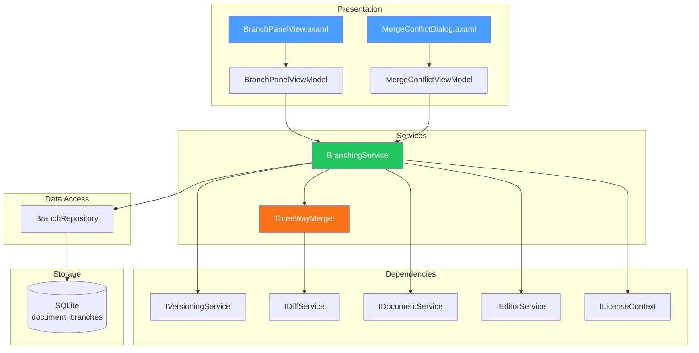

# LCS-DES-094b: Design Specification — Branch/Merge

## 1. Metadata & Categorization

| Field | Value | Description |
| :--- | :--- | :--- |
| **Feature ID** | `COL-094b` | Sub-part of COL-094 |
| **Feature Name** | `Branch/Merge (Parallel Document Versions)` | Git-like branching |
| **Target Version** | `v0.9.4b` | Second sub-part of v0.9.4 |
| **Module Scope** | `Lexichord.Modules.Collaboration` | Collaboration module |
| **Swimlane** | `Collaboration` | Part of Collaboration vertical |
| **License Tier** | `Teams` | Teams+ only feature |
| **Feature Gate Key** | `feature.collaboration.branching` | License check key |
| **Author** | Lead Architect | |
| **Status** | `Draft` | |
| **Last Updated** | `2026-01-27` | |
| **Parent Document** | [LCS-DES-094-INDEX](./LCS-DES-094-INDEX.md) | |
| **Scope Breakdown** | [LCS-SBD-094 Section 3.2](./LCS-SBD-094.md#32-v094b-branchmerge) | |

---

## 2. Executive Summary

### 2.1 The Requirement

Writers often need to explore alternative directions for their work without risking their main manuscript:

- Try a radical rewrite of a chapter
- Experiment with different endings
- Allow multiple team members to work on parallel versions
- Test structural changes before committing

Currently, writers resort to "Save As" with version numbers, leading to file proliferation and merge nightmares.

> **Goal:** Enable writers to create named branches of their documents, work on them independently, and merge changes back with intelligent conflict detection.

### 2.2 The Proposed Solution

Implement Git-like branching that:

1. Creates named branches from any version
2. Allows seamless switching between branches
3. Performs three-way merge with conflict detection
4. Provides visual conflict resolution UI
5. Tracks branch status (active, merged, abandoned)

---

## 3. Architecture & Modular Strategy

### 3.1 Dependencies

#### 3.1.1 Required Interfaces

| Interface | Source Version | Purpose |
| :--- | :--- | :--- |
| `IVersioningService` | v0.9.4a | Version management |
| `IDiffService` | v0.9.4c | Diff calculation for merge |
| `IDocumentService` | v0.1.3a | Document access |
| `IEditorService` | v0.1.3c | Editor content |
| `IMediator` | v0.0.7a | Publishing events |
| `ILicenseContext` | v0.0.4c | Teams+ verification |

#### 3.1.2 NuGet Packages

| Package | Version | Purpose |
| :--- | :--- | :--- |
| `DiffPlex` | 1.7.x | Diff algorithm for merge |

### 3.2 Component Architecture



### 3.3 Licensing Behavior

This feature requires **Teams** tier or higher.

```text
Core/WriterPro User clicks "Create Branch":
┌─────────────────────────────────────────────────┐
│  Upgrade Required                          [x]  │
├─────────────────────────────────────────────────┤
│  [Branch Icon]                                  │
│                                                 │
│  Document Branching is a Teams feature.         │
│                                                 │
│  Create parallel versions of your document      │
│  to experiment safely, then merge the best      │
│  parts together.                                │
│                                                 │
│  [Learn More]      [Upgrade to Teams]           │
└─────────────────────────────────────────────────┘
```

---

## 4. Data Contract (The API)

### 4.1 Core Records

```csharp
namespace Lexichord.Modules.Collaboration.Models;

/// <summary>
/// Represents a named branch of a document.
/// </summary>
public record DocumentBranch
{
    /// <summary>
    /// Unique identifier for this branch.
    /// </summary>
    public Guid BranchId { get; init; }

    /// <summary>
    /// The document this branch belongs to.
    /// </summary>
    public Guid DocumentId { get; init; }

    /// <summary>
    /// Human-readable branch name (e.g., "alternate-ending").
    /// </summary>
    public string Name { get; init; } = string.Empty;

    /// <summary>
    /// Optional description of the branch purpose.
    /// </summary>
    public string? Description { get; init; }

    /// <summary>
    /// Version ID where this branch was created from.
    /// </summary>
    public Guid BaseVersionId { get; init; }

    /// <summary>
    /// Current head version ID of this branch.
    /// </summary>
    public Guid HeadVersionId { get; init; }

    /// <summary>
    /// When the branch was created.
    /// </summary>
    public DateTime CreatedAt { get; init; }

    /// <summary>
    /// User who created the branch.
    /// </summary>
    public string? CreatedBy { get; init; }

    /// <summary>
    /// Whether this is the default (main) branch.
    /// </summary>
    public bool IsDefault { get; init; }

    /// <summary>
    /// Current status of the branch.
    /// </summary>
    public BranchStatus Status { get; init; }
}

/// <summary>
/// Branch lifecycle status.
/// </summary>
public enum BranchStatus
{
    /// <summary>
    /// Branch is actively being worked on.
    /// </summary>
    Active,

    /// <summary>
    /// Branch has been merged into another branch.
    /// </summary>
    Merged,

    /// <summary>
    /// Branch was abandoned without merging.
    /// </summary>
    Abandoned
}

/// <summary>
/// Strategy for merging branches.
/// </summary>
public enum MergeStrategy
{
    /// <summary>
    /// Standard three-way merge using common ancestor.
    /// </summary>
    ThreeWay,

    /// <summary>
    /// Accept all changes from the current branch.
    /// </summary>
    Ours,

    /// <summary>
    /// Accept all changes from the incoming branch.
    /// </summary>
    Theirs,

    /// <summary>
    /// Manual resolution required for all conflicts.
    /// </summary>
    Manual
}

/// <summary>
/// Result of a merge operation.
/// </summary>
public record MergeResult
{
    /// <summary>
    /// Whether the merge completed successfully.
    /// </summary>
    public bool Success { get; init; }

    /// <summary>
    /// The resulting merged version (if successful).
    /// </summary>
    public DocumentVersion? MergedVersion { get; init; }

    /// <summary>
    /// List of conflicts requiring resolution.
    /// </summary>
    public IReadOnlyList<MergeConflict> Conflicts { get; init; } = [];

    /// <summary>
    /// Statistics about the merge.
    /// </summary>
    public MergeStatistics Statistics { get; init; } = new();

    /// <summary>
    /// Merged content with conflict markers (for manual resolution).
    /// </summary>
    public string? MergedContentWithMarkers { get; init; }
}

/// <summary>
/// A conflict detected during merge.
/// </summary>
public record MergeConflict
{
    /// <summary>
    /// Unique ID for this conflict within the merge.
    /// </summary>
    public int ConflictId { get; init; }

    /// <summary>
    /// Content from the common ancestor.
    /// </summary>
    public string BaseContent { get; init; } = string.Empty;

    /// <summary>
    /// Content from the current (target) branch.
    /// </summary>
    public string OursContent { get; init; } = string.Empty;

    /// <summary>
    /// Content from the incoming (source) branch.
    /// </summary>
    public string TheirsContent { get; init; } = string.Empty;

    /// <summary>
    /// Starting line number in the base version.
    /// </summary>
    public int StartLine { get; init; }

    /// <summary>
    /// Ending line number in the base version.
    /// </summary>
    public int EndLine { get; init; }

    /// <summary>
    /// Type of conflict.
    /// </summary>
    public ConflictType Type { get; init; }

    /// <summary>
    /// User's chosen resolution content.
    /// </summary>
    public string? Resolution { get; init; }

    /// <summary>
    /// How the conflict was resolved.
    /// </summary>
    public ConflictResolutionChoice? ResolutionChoice { get; init; }
}

public enum ConflictType
{
    /// <summary>
    /// Both sides modified the same lines differently.
    /// </summary>
    TextModification,

    /// <summary>
    /// One side deleted content the other modified.
    /// </summary>
    Deletion,

    /// <summary>
    /// Both sides added different content at the same location.
    /// </summary>
    Insertion,

    /// <summary>
    /// Content was moved to different locations.
    /// </summary>
    Reordering
}

public enum ConflictResolutionChoice
{
    AcceptOurs,
    AcceptTheirs,
    AcceptBoth,
    Manual
}

public record MergeStatistics
{
    public int LinesAdded { get; init; }
    public int LinesRemoved { get; init; }
    public int LinesModified { get; init; }
    public int ConflictsDetected { get; init; }
    public int ConflictsResolved { get; init; }
}
```

### 4.2 Service Interface

```csharp
namespace Lexichord.Abstractions.Contracts;

/// <summary>
/// Service for managing document branches.
/// </summary>
public interface IBranchingService
{
    /// <summary>
    /// Creates a new branch from a specific version.
    /// </summary>
    /// <param name="documentId">The document to branch.</param>
    /// <param name="baseVersionId">Version to branch from.</param>
    /// <param name="branchName">Name for the new branch.</param>
    /// <param name="description">Optional description.</param>
    /// <param name="ct">Cancellation token.</param>
    Task<DocumentBranch> CreateBranchAsync(
        Guid documentId,
        Guid baseVersionId,
        string branchName,
        string? description = null,
        CancellationToken ct = default);

    /// <summary>
    /// Gets all branches for a document.
    /// </summary>
    Task<IReadOnlyList<DocumentBranch>> GetBranchesAsync(
        Guid documentId,
        CancellationToken ct = default);

    /// <summary>
    /// Gets a specific branch by name.
    /// </summary>
    Task<DocumentBranch?> GetBranchAsync(
        Guid documentId,
        string branchName,
        CancellationToken ct = default);

    /// <summary>
    /// Gets the current active branch for a document.
    /// </summary>
    Task<DocumentBranch?> GetActiveBranchAsync(
        Guid documentId,
        CancellationToken ct = default);

    /// <summary>
    /// Switches the active branch for a document.
    /// Saves current changes before switching.
    /// </summary>
    Task SwitchBranchAsync(
        Guid documentId,
        string branchName,
        CancellationToken ct = default);

    /// <summary>
    /// Merges a source branch into a target branch.
    /// </summary>
    /// <param name="documentId">The document.</param>
    /// <param name="sourceBranch">Branch to merge from.</param>
    /// <param name="targetBranch">Branch to merge into.</param>
    /// <param name="strategy">Merge strategy.</param>
    /// <param name="ct">Cancellation token.</param>
    /// <returns>Merge result with conflicts if any.</returns>
    Task<MergeResult> MergeBranchesAsync(
        Guid documentId,
        string sourceBranch,
        string targetBranch,
        MergeStrategy strategy = MergeStrategy.ThreeWay,
        CancellationToken ct = default);

    /// <summary>
    /// Applies conflict resolutions and completes a pending merge.
    /// </summary>
    Task<MergeResult> CompleteMergeAsync(
        Guid documentId,
        IReadOnlyList<MergeConflict> resolvedConflicts,
        CancellationToken ct = default);

    /// <summary>
    /// Aborts a pending merge and returns to pre-merge state.
    /// </summary>
    Task AbortMergeAsync(
        Guid documentId,
        CancellationToken ct = default);

    /// <summary>
    /// Renames a branch.
    /// </summary>
    Task RenameBranchAsync(
        Guid documentId,
        string oldName,
        string newName,
        CancellationToken ct = default);

    /// <summary>
    /// Deletes a branch (cannot delete default branch).
    /// </summary>
    Task DeleteBranchAsync(
        Guid documentId,
        string branchName,
        CancellationToken ct = default);

    /// <summary>
    /// Finds the common ancestor of two branches.
    /// </summary>
    Task<DocumentVersion?> FindCommonAncestorAsync(
        Guid documentId,
        string branch1,
        string branch2,
        CancellationToken ct = default);
}
```

---

## 5. Implementation Logic

### 5.1 Branch Creation Flow

```text
CREATE BRANCH:
│
├── Input: documentId, baseVersionId, branchName, description?
│
├── Validate license (Teams+)
│   └── IF NOT Teams+ → throw LicenseRequiredException
│
├── Validate branch name
│   ├── Not empty
│   ├── Alphanumeric + hyphens only
│   └── Not already exists
│
├── Get base version
│   └── BaseVersion = versioningService.GetVersionAsync(baseVersionId)
│
├── Create branch record
│   └── Branch = new DocumentBranch {
│       BranchId = NewGuid,
│       DocumentId = documentId,
│       Name = branchName,
│       BaseVersionId = baseVersionId,
│       HeadVersionId = baseVersionId,  // Same as base initially
│       Status = Active
│   }
│
├── Create branch point version on base version
│   └── versioningService.CreateVersionAsync(
│       documentId, BaseVersion.Content,
│       VersionType.BranchPoint,
│       label: $"Created branch '{branchName}'"
│   )
│
├── Save branch
│   └── repository.SaveBranchAsync(Branch)
│
├── Publish event
│   └── mediator.Publish(new BranchCreatedEvent(Branch))
│
└── RETURN Branch
```

### 5.2 Branch Switching Flow

```text
SWITCH BRANCH:
│
├── Input: documentId, branchName
│
├── Get current branch
│   └── CurrentBranch = GetActiveBranchAsync(documentId)
│
├── Check for unsaved changes
│   └── IF editor.HasUnsavedChanges
│       ├── Create auto-save version on current branch
│       └── versioningService.CreateVersionAsync(AutoSave)
│
├── Get target branch
│   └── TargetBranch = GetBranchAsync(documentId, branchName)
│
├── Get head version of target branch
│   └── HeadVersion = versioningService.GetVersionAsync(TargetBranch.HeadVersionId)
│
├── Update editor content
│   └── editorService.SetContentAsync(HeadVersion.Content)
│
├── Update active branch marker
│   └── repository.SetActiveBranchAsync(documentId, branchName)
│
├── Publish event
│   └── mediator.Publish(new BranchSwitchedEvent(CurrentBranch, TargetBranch))
│
└── RETURN
```

### 5.3 Three-Way Merge Algorithm

```text
THREE-WAY MERGE:
│
├── Input: documentId, sourceBranch, targetBranch, strategy
│
├── Find common ancestor
│   └── Ancestor = FindCommonAncestorAsync(sourceBranch, targetBranch)
│
├── Get current content of each
│   ├── BaseContent = Ancestor.Content
│   ├── OursContent = targetBranch.Head.Content
│   └── TheirsContent = sourceBranch.Head.Content
│
├── Calculate diffs
│   ├── OursDiff = diffService.CalculateDiff(BaseContent, OursContent)
│   └── TheirsDiff = diffService.CalculateDiff(BaseContent, TheirsContent)
│
├── Identify change regions
│   ├── FOR each change in OursDiff
│   │   └── Mark lines as "modified by ours"
│   └── FOR each change in TheirsDiff
│       └── Mark lines as "modified by theirs"
│
├── Merge changes
│   ├── MergedLines = []
│   ├── Conflicts = []
│   │
│   ├── FOR each line region:
│   │   ├── IF only ours changed
│   │   │   └── Use ours content
│   │   ├── IF only theirs changed
│   │   │   └── Use theirs content
│   │   ├── IF neither changed
│   │   │   └── Use base content
│   │   ├── IF both changed identically
│   │   │   └── Use either (same)
│   │   └── IF both changed differently
│   │       └── CONFLICT! Add to Conflicts list
│   │
│   └── Build merged content
│
├── IF Conflicts.Count == 0
│   ├── Create merged version
│   └── RETURN MergeResult { Success = true }
│
└── ELSE
    └── RETURN MergeResult { Success = false, Conflicts = Conflicts }
```

### 5.4 Conflict Detection Logic

```text
DETECT CONFLICT:
│
├── Input: oursChange, theirsChange (overlapping regions)
│
├── Extract affected lines
│   ├── OursLines = lines modified by ours
│   ├── TheirsLines = lines modified by theirs
│   └── OverlapLines = intersection
│
├── IF OverlapLines is empty
│   └── NO CONFLICT (changes don't overlap)
│
├── Compare overlapping changes
│   ├── IF oursChange == theirsChange
│   │   └── NO CONFLICT (identical changes)
│   │
│   └── ELSE
│       └── CONFLICT detected
│
├── Determine conflict type
│   ├── IF ours deleted AND theirs modified
│   │   └── Type = Deletion
│   ├── IF both inserted at same location
│   │   └── Type = Insertion
│   └── ELSE
│       └── Type = TextModification
│
└── RETURN MergeConflict { ... }
```

---

## 6. ThreeWayMerger Implementation

```csharp
namespace Lexichord.Modules.Collaboration.Services;

/// <summary>
/// Implements three-way merge algorithm for document branches.
/// </summary>
public class ThreeWayMerger(IDiffService diffService, ILogger<ThreeWayMerger> logger)
{
    /// <summary>
    /// Performs a three-way merge of document content.
    /// </summary>
    public MergeResult Merge(
        string baseContent,
        string oursContent,
        string theirsContent,
        MergeStrategy strategy = MergeStrategy.ThreeWay)
    {
        logger.LogDebug("Starting three-way merge");

        var baseLines = SplitLines(baseContent);
        var oursLines = SplitLines(oursContent);
        var theirsLines = SplitLines(theirsContent);

        // Calculate diffs from base to each branch
        var oursDiff = diffService.CalculateDiff(baseContent, oursContent);
        var theirsDiff = diffService.CalculateDiff(baseContent, theirsContent);

        // Build change maps
        var oursChanges = BuildChangeMap(oursDiff);
        var theirsChanges = BuildChangeMap(theirsDiff);

        var mergedLines = new List<string>();
        var conflicts = new List<MergeConflict>();
        var statistics = new MergeStatistics();

        int baseIndex = 0;
        int oursIndex = 0;
        int theirsIndex = 0;
        int conflictId = 0;

        while (baseIndex < baseLines.Count ||
               oursIndex < oursLines.Count ||
               theirsIndex < theirsLines.Count)
        {
            var oursChange = GetChangeAtLine(oursChanges, baseIndex);
            var theirsChange = GetChangeAtLine(theirsChanges, baseIndex);

            if (oursChange == null && theirsChange == null)
            {
                // No changes - use base
                if (baseIndex < baseLines.Count)
                {
                    mergedLines.Add(baseLines[baseIndex]);
                    baseIndex++;
                    oursIndex++;
                    theirsIndex++;
                }
                else
                {
                    break;
                }
            }
            else if (oursChange != null && theirsChange == null)
            {
                // Only ours changed
                ApplyChange(oursChange, oursLines, ref oursIndex, mergedLines);
                SkipChange(oursChange, ref baseIndex, ref theirsIndex);
            }
            else if (oursChange == null && theirsChange != null)
            {
                // Only theirs changed
                ApplyChange(theirsChange, theirsLines, ref theirsIndex, mergedLines);
                SkipChange(theirsChange, ref baseIndex, ref oursIndex);
            }
            else
            {
                // Both changed - check for conflict
                if (ChangesAreIdentical(oursChange!, theirsChange!, oursLines, theirsLines))
                {
                    // Same change - no conflict
                    ApplyChange(oursChange!, oursLines, ref oursIndex, mergedLines);
                    SkipChange(oursChange!, ref baseIndex, ref theirsIndex);
                }
                else
                {
                    // CONFLICT!
                    conflictId++;
                    var conflict = CreateConflict(
                        conflictId,
                        baseLines, oursLines, theirsLines,
                        baseIndex, oursChange!, theirsChange!);

                    conflicts.Add(conflict);

                    // Handle based on strategy
                    switch (strategy)
                    {
                        case MergeStrategy.Ours:
                            ApplyChange(oursChange!, oursLines, ref oursIndex, mergedLines);
                            break;
                        case MergeStrategy.Theirs:
                            ApplyChange(theirsChange!, theirsLines, ref theirsIndex, mergedLines);
                            break;
                        default:
                            // Add conflict markers
                            AddConflictMarkers(mergedLines, conflict);
                            break;
                    }

                    AdvancePastConflict(
                        oursChange!, theirsChange!,
                        ref baseIndex, ref oursIndex, ref theirsIndex);
                }
            }
        }

        var mergedContent = string.Join("\n", mergedLines);

        logger.LogInformation(
            "Merge complete: {ConflictCount} conflicts detected",
            conflicts.Count);

        return new MergeResult
        {
            Success = conflicts.Count == 0,
            Conflicts = conflicts,
            MergedContentWithMarkers = conflicts.Count > 0 ? mergedContent : null,
            MergedVersion = conflicts.Count == 0
                ? CreateVersionFromContent(mergedContent)
                : null,
            Statistics = new MergeStatistics
            {
                ConflictsDetected = conflicts.Count
            }
        };
    }

    private void AddConflictMarkers(List<string> lines, MergeConflict conflict)
    {
        lines.Add($"<<<<<<< OURS (target branch)");
        lines.AddRange(SplitLines(conflict.OursContent));
        lines.Add("=======");
        lines.AddRange(SplitLines(conflict.TheirsContent));
        lines.Add($">>>>>>> THEIRS (source branch)");
    }

    private MergeConflict CreateConflict(
        int conflictId,
        IList<string> baseLines,
        IList<string> oursLines,
        IList<string> theirsLines,
        int baseIndex,
        ChangeRegion oursChange,
        ChangeRegion theirsChange)
    {
        var baseContent = ExtractRegion(baseLines, baseIndex, oursChange.Length);
        var oursContent = ExtractRegion(oursLines, oursChange.TargetStart, oursChange.TargetLength);
        var theirsContent = ExtractRegion(theirsLines, theirsChange.TargetStart, theirsChange.TargetLength);

        return new MergeConflict
        {
            ConflictId = conflictId,
            BaseContent = baseContent,
            OursContent = oursContent,
            TheirsContent = theirsContent,
            StartLine = baseIndex + 1,
            EndLine = baseIndex + oursChange.Length,
            Type = DetermineConflictType(oursChange, theirsChange)
        };
    }

    private ConflictType DetermineConflictType(ChangeRegion ours, ChangeRegion theirs)
    {
        if (ours.Type == ChangeType.Delete && theirs.Type == ChangeType.Modify)
            return ConflictType.Deletion;
        if (ours.Type == ChangeType.Insert && theirs.Type == ChangeType.Insert)
            return ConflictType.Insertion;
        return ConflictType.TextModification;
    }

    private static string[] SplitLines(string content) =>
        content.Split('\n');

    private static string ExtractRegion(IList<string> lines, int start, int length) =>
        string.Join("\n", lines.Skip(start).Take(length));

    private record ChangeRegion(
        int BaseStart,
        int Length,
        int TargetStart,
        int TargetLength,
        ChangeType Type);

    private enum ChangeType { None, Insert, Delete, Modify }
}
```

---

## 7. BranchingService Implementation

```csharp
namespace Lexichord.Modules.Collaboration.Services;

public class BranchingService(
    IBranchRepository repository,
    IVersioningService versioningService,
    IDiffService diffService,
    IDocumentService documentService,
    IEditorService editorService,
    ILicenseContext licenseContext,
    IMediator mediator,
    ILogger<BranchingService> logger) : IBranchingService
{
    private readonly ThreeWayMerger _merger = new(diffService, logger);
    private MergeResult? _pendingMerge;

    public async Task<DocumentBranch> CreateBranchAsync(
        Guid documentId,
        Guid baseVersionId,
        string branchName,
        string? description = null,
        CancellationToken ct = default)
    {
        // Validate license
        if (licenseContext.CurrentTier < LicenseTier.Teams)
        {
            throw new LicenseRequiredException(
                "Document branching requires Teams license or higher");
        }

        // Validate branch name
        ValidateBranchName(branchName);

        // Check if branch already exists
        var existing = await repository.GetBranchAsync(documentId, branchName, ct);
        if (existing != null)
        {
            throw new BranchAlreadyExistsException(branchName);
        }

        // Get base version
        var baseVersion = await versioningService.GetVersionAsync(baseVersionId, ct)
            ?? throw new VersionNotFoundException(baseVersionId);

        // Create branch point version
        await versioningService.CreateVersionAsync(
            documentId,
            baseVersion.Content,
            VersionType.BranchPoint,
            $"Created branch '{branchName}'",
            ct);

        // Create branch record
        var branch = new DocumentBranch
        {
            BranchId = Guid.NewGuid(),
            DocumentId = documentId,
            Name = branchName,
            Description = description,
            BaseVersionId = baseVersionId,
            HeadVersionId = baseVersionId,
            CreatedAt = DateTime.UtcNow,
            IsDefault = false,
            Status = BranchStatus.Active
        };

        await repository.SaveBranchAsync(branch, ct);

        logger.LogInformation(
            "Created branch '{BranchName}' for document {DocumentId}",
            branchName, documentId);

        await mediator.Publish(new BranchCreatedEvent(branch), ct);

        return branch;
    }

    public async Task SwitchBranchAsync(
        Guid documentId,
        string branchName,
        CancellationToken ct = default)
    {
        var currentBranch = await GetActiveBranchAsync(documentId, ct);
        var targetBranch = await repository.GetBranchAsync(documentId, branchName, ct)
            ?? throw new BranchNotFoundException(branchName);

        // Save current changes if any
        if (await editorService.HasUnsavedChangesAsync(documentId))
        {
            var content = await editorService.GetContentAsync(documentId);
            var version = await versioningService.CreateVersionAsync(
                documentId, content, VersionType.AutoSave, null, ct);

            // Update current branch head
            if (currentBranch != null)
            {
                await repository.UpdateBranchHeadAsync(
                    currentBranch.BranchId, version.VersionId, ct);
            }
        }

        // Load target branch content
        var headVersion = await versioningService.GetVersionAsync(
            targetBranch.HeadVersionId, ct);

        await editorService.SetContentAsync(documentId, headVersion!.Content);

        // Update active branch
        await repository.SetActiveBranchAsync(documentId, branchName, ct);

        logger.LogInformation(
            "Switched from '{FromBranch}' to '{ToBranch}' for document {DocumentId}",
            currentBranch?.Name ?? "main", branchName, documentId);

        await mediator.Publish(
            new BranchSwitchedEvent(documentId, currentBranch?.Name, branchName), ct);
    }

    public async Task<MergeResult> MergeBranchesAsync(
        Guid documentId,
        string sourceBranch,
        string targetBranch,
        MergeStrategy strategy = MergeStrategy.ThreeWay,
        CancellationToken ct = default)
    {
        logger.LogInformation(
            "Merging '{SourceBranch}' into '{TargetBranch}' for document {DocumentId}",
            sourceBranch, targetBranch, documentId);

        // Get branches
        var source = await repository.GetBranchAsync(documentId, sourceBranch, ct)
            ?? throw new BranchNotFoundException(sourceBranch);
        var target = await repository.GetBranchAsync(documentId, targetBranch, ct)
            ?? throw new BranchNotFoundException(targetBranch);

        // Find common ancestor
        var ancestor = await FindCommonAncestorAsync(documentId, sourceBranch, targetBranch, ct)
            ?? throw new NoCommonAncestorException(sourceBranch, targetBranch);

        // Get content from each
        var baseVersion = ancestor;
        var oursVersion = await versioningService.GetVersionAsync(target.HeadVersionId, ct);
        var theirsVersion = await versioningService.GetVersionAsync(source.HeadVersionId, ct);

        await mediator.Publish(
            new MergeStartedEvent(documentId, sourceBranch, targetBranch), ct);

        // Perform three-way merge
        var result = _merger.Merge(
            baseVersion.Content,
            oursVersion!.Content,
            theirsVersion!.Content,
            strategy);

        if (result.Success)
        {
            // Create merged version
            var mergedVersion = await versioningService.CreateVersionAsync(
                documentId,
                result.MergedVersion!.Content,
                VersionType.MergeResult,
                $"Merged '{sourceBranch}' into '{targetBranch}'",
                ct);

            // Update target branch head
            await repository.UpdateBranchHeadAsync(target.BranchId, mergedVersion.VersionId, ct);

            // Mark source branch as merged
            await repository.UpdateBranchStatusAsync(source.BranchId, BranchStatus.Merged, ct);

            logger.LogInformation(
                "Merge successful: '{SourceBranch}' into '{TargetBranch}'",
                sourceBranch, targetBranch);

            await mediator.Publish(
                new MergeCompletedEvent(documentId, sourceBranch, targetBranch, true, 0), ct);

            return result with { MergedVersion = mergedVersion };
        }
        else
        {
            // Store pending merge for resolution
            _pendingMerge = result;

            logger.LogWarning(
                "Merge has {ConflictCount} conflicts requiring resolution",
                result.Conflicts.Count);

            return result;
        }
    }

    public async Task<MergeResult> CompleteMergeAsync(
        Guid documentId,
        IReadOnlyList<MergeConflict> resolvedConflicts,
        CancellationToken ct = default)
    {
        if (_pendingMerge == null)
        {
            throw new NoPendingMergeException();
        }

        // Apply resolutions
        var mergedContent = ApplyResolutions(
            _pendingMerge.MergedContentWithMarkers!,
            resolvedConflicts);

        // Create merged version
        var mergedVersion = await versioningService.CreateVersionAsync(
            documentId,
            mergedContent,
            VersionType.MergeResult,
            "Merge completed with conflict resolution",
            ct);

        foreach (var conflict in resolvedConflicts)
        {
            await mediator.Publish(
                new MergeConflictResolvedEvent(documentId, conflict.ConflictId), ct);
        }

        _pendingMerge = null;

        return new MergeResult
        {
            Success = true,
            MergedVersion = mergedVersion,
            Conflicts = [],
            Statistics = new MergeStatistics
            {
                ConflictsDetected = resolvedConflicts.Count,
                ConflictsResolved = resolvedConflicts.Count
            }
        };
    }

    public async Task<DocumentVersion?> FindCommonAncestorAsync(
        Guid documentId,
        string branch1,
        string branch2,
        CancellationToken ct = default)
    {
        var b1 = await repository.GetBranchAsync(documentId, branch1, ct);
        var b2 = await repository.GetBranchAsync(documentId, branch2, ct);

        if (b1 == null || b2 == null)
            return null;

        // Walk version history to find common ancestor
        var b1Ancestors = new HashSet<Guid>();
        var current = await versioningService.GetVersionAsync(b1.HeadVersionId, ct);

        while (current != null)
        {
            b1Ancestors.Add(current.VersionId);
            if (current.ParentVersionId == null)
                break;
            current = await versioningService.GetVersionAsync(current.ParentVersionId.Value, ct);
        }

        current = await versioningService.GetVersionAsync(b2.HeadVersionId, ct);
        while (current != null)
        {
            if (b1Ancestors.Contains(current.VersionId))
            {
                return current;
            }
            if (current.ParentVersionId == null)
                break;
            current = await versioningService.GetVersionAsync(current.ParentVersionId.Value, ct);
        }

        return null;
    }

    private static void ValidateBranchName(string name)
    {
        if (string.IsNullOrWhiteSpace(name))
            throw new ArgumentException("Branch name cannot be empty");

        if (!Regex.IsMatch(name, @"^[a-zA-Z0-9][a-zA-Z0-9\-_]*$"))
            throw new ArgumentException(
                "Branch name must start with alphanumeric and contain only alphanumeric, hyphens, and underscores");

        if (name.Length > 100)
            throw new ArgumentException("Branch name cannot exceed 100 characters");
    }

    private string ApplyResolutions(string contentWithMarkers, IReadOnlyList<MergeConflict> resolutions)
    {
        var lines = contentWithMarkers.Split('\n').ToList();
        var result = new List<string>();

        int i = 0;
        int conflictIndex = 0;

        while (i < lines.Count)
        {
            if (lines[i].StartsWith("<<<<<<< OURS"))
            {
                // Find the conflict markers
                var oursStart = i + 1;
                var separator = lines.FindIndex(oursStart, l => l == "=======");
                var theirsEnd = lines.FindIndex(separator + 1, l => l.StartsWith(">>>>>>>"));

                // Get the resolution for this conflict
                if (conflictIndex < resolutions.Count)
                {
                    var resolution = resolutions[conflictIndex];
                    if (resolution.Resolution != null)
                    {
                        result.AddRange(resolution.Resolution.Split('\n'));
                    }
                    else
                    {
                        // Apply choice
                        switch (resolution.ResolutionChoice)
                        {
                            case ConflictResolutionChoice.AcceptOurs:
                                result.AddRange(resolution.OursContent.Split('\n'));
                                break;
                            case ConflictResolutionChoice.AcceptTheirs:
                                result.AddRange(resolution.TheirsContent.Split('\n'));
                                break;
                            case ConflictResolutionChoice.AcceptBoth:
                                result.AddRange(resolution.OursContent.Split('\n'));
                                result.AddRange(resolution.TheirsContent.Split('\n'));
                                break;
                        }
                    }
                }

                conflictIndex++;
                i = theirsEnd + 1;
            }
            else
            {
                result.Add(lines[i]);
                i++;
            }
        }

        return string.Join("\n", result);
    }
}
```

---

## 8. UI/UX Specifications

### 8.1 Branch Panel Layout

```text
┌──────────────────────────────────────────────────────────────────────────┐
│  Branches                                                   [+ New]      │
├──────────────────────────────────────────────────────────────────────────┤
│                                                                          │
│  * main                                              HEAD                │
│    Default branch                                                        │
│    Last updated: Today, 2:34 PM                                          │
│    Versions: 23                                                          │
│                                                                          │
│  ─────────────────────────────────────────────────────────────────────   │
│                                                                          │
│    alternate-ending                              3 versions ahead        │
│    "Trying a different conclusion"                                       │
│    Created: Jan 20, 2026                                                 │
│    [Switch] [Compare] [Merge into main] [Rename] [Delete]               │
│                                                                          │
│  ─────────────────────────────────────────────────────────────────────   │
│                                                                          │
│    experimental-chapter-5                        Merged                  │
│    "Testing new plot twist"                                              │
│    Created: Jan 18, 2026    Merged: Jan 22, 2026                        │
│                                                                          │
└──────────────────────────────────────────────────────────────────────────┘
```

### 8.2 Create Branch Dialog

```text
┌──────────────────────────────────────────────────────────────────────────┐
│  Create New Branch                                                 [x]   │
├──────────────────────────────────────────────────────────────────────────┤
│                                                                          │
│  Branch from: v23 (Today, 2:34 PM)                          [Change]    │
│                                                                          │
│  Branch name:                                                            │
│  [alternate-ending                                                   ]   │
│                                                                          │
│  Description (optional):                                                 │
│  [Exploring a different ending for the story                        ]   │
│  [                                                                   ]   │
│                                                                          │
│  [ ] Switch to this branch after creation                                │
│                                                                          │
├──────────────────────────────────────────────────────────────────────────┤
│                                          [Cancel] [Create Branch]        │
└──────────────────────────────────────────────────────────────────────────┘
```

### 8.3 Merge Conflict Resolution Dialog

```text
┌──────────────────────────────────────────────────────────────────────────┐
│  Merge Conflicts                                                   [x]   │
│  Merging 'alternate-ending' into 'main'                                  │
├──────────────────────────────────────────────────────────────────────────┤
│  Conflict 1 of 3: Lines 45-52                                            │
├──────────────────────────────────────────────────────────────────────────┤
│                                                                          │
│  BASE (common ancestor):                                                 │
│  ┌────────────────────────────────────────────────────────────────────┐ │
│  │ The hero walked slowly through the dark forest.                    │ │
│  │ He could hear the sounds of the night around him.                  │ │
│  └────────────────────────────────────────────────────────────────────┘ │
│                                                                          │
│  OURS (main):                                                            │
│  ┌────────────────────────────────────────────────────────────────────┐ │
│  │ The hero sprinted desperately through the haunted forest.          │ │
│  │ The whispers of the dead filled his ears.                          │ │
│  └────────────────────────────────────────────────────────────────────┘ │
│                                                                          │
│  THEIRS (alternate-ending):                                              │
│  ┌────────────────────────────────────────────────────────────────────┐ │
│  │ The hero crept silently through the ancient woods.                 │ │
│  │ Not a single sound disturbed the eerie silence.                    │ │
│  └────────────────────────────────────────────────────────────────────┘ │
│                                                                          │
│  [Accept Ours] [Accept Theirs] [Accept Both] [Edit Manually]            │
│                                                                          │
├──────────────────────────────────────────────────────────────────────────┤
│  RESOLUTION PREVIEW:                                                     │
│  ┌────────────────────────────────────────────────────────────────────┐ │
│  │ [Editable text area showing current resolution]                    │ │
│  │                                                                    │ │
│  └────────────────────────────────────────────────────────────────────┘ │
│                                                                          │
├──────────────────────────────────────────────────────────────────────────┤
│                   [Abort Merge]     [< Previous] [Next >] [Finish Merge] │
└──────────────────────────────────────────────────────────────────────────┘
```

### 8.4 Component Styling

| Component | Theme Resource | Notes |
| :--- | :--- | :--- |
| Active branch indicator | `Brush.Success.Primary` | Green asterisk |
| Branch name | `Brush.Text.Primary` | Bold weight |
| Branch description | `Brush.Text.Secondary` | Italic |
| Ahead/behind indicator | `Brush.Accent.Primary` | Blue |
| Merged status | `Brush.Text.Tertiary` | Grayed out |
| Conflict header | `Brush.Warning.Primary` | Orange |
| Base content box | `Brush.Surface.Secondary` | Neutral |
| Ours content box | `Brush.Info.Light` | Light blue |
| Theirs content box | `Brush.Warning.Light` | Light orange |
| Resolution preview | `Brush.Success.Light` | Light green |

---

## 9. Observability & Logging

| Level | Message Template |
| :--- | :--- |
| Debug | `"Validating branch name: '{BranchName}'"` |
| Info | `"Created branch '{BranchName}' from version {VersionId}"` |
| Info | `"Switched from '{FromBranch}' to '{ToBranch}'"` |
| Info | `"Starting merge: '{SourceBranch}' into '{TargetBranch}'"` |
| Info | `"Merge successful: {LinesAdded} added, {LinesRemoved} removed"` |
| Warning | `"Merge has {ConflictCount} conflicts requiring resolution"` |
| Info | `"Conflict {ConflictId} resolved with {Choice}"` |
| Info | `"Merge completed with all conflicts resolved"` |
| Warning | `"Merge aborted by user"` |
| Error | `"Failed to merge branches: {Error}"` |

---

## 10. Acceptance Criteria

### 10.1 Functional Criteria

| # | Given | When | Then |
| :--- | :--- | :--- | :--- |
| 1 | Teams license | User creates branch | Branch appears in list |
| 2 | Core license | User tries to create branch | Upgrade prompt shown |
| 3 | Multiple branches | User switches branch | Editor content changes |
| 4 | Unsaved changes | User switches branch | Changes auto-saved first |
| 5 | Non-overlapping changes | User merges branches | Clean merge, new version |
| 6 | Overlapping changes | User merges branches | Conflict dialog shown |
| 7 | Conflict shown | User chooses "Accept Ours" | Ours content used |
| 8 | Conflict shown | User chooses "Accept Theirs" | Theirs content used |
| 9 | Conflict shown | User edits manually | Custom content used |
| 10 | All conflicts resolved | User clicks "Finish" | Merge completes |
| 11 | Merge in progress | User clicks "Abort" | Returns to pre-merge |
| 12 | Default branch | User tries to delete | Error shown |
| 13 | Non-default branch | User deletes | Branch removed |

### 10.2 Performance Criteria

| # | Operation | Target |
| :--- | :--- | :--- |
| 14 | Create branch | < 200ms |
| 15 | Switch branch | < 300ms |
| 16 | Merge (no conflicts, 10K lines) | < 1 second |
| 17 | Find common ancestor | < 500ms |

---

## 11. Test Scenarios

```csharp
[Trait("Category", "Unit")]
[Trait("Version", "v0.9.4b")]
public class BranchingServiceTests
{
    [Fact]
    public async Task CreateBranchAsync_ValidInput_CreatesBranch()
    {
        // Arrange
        var sut = CreateService(LicenseTier.Teams);
        var documentId = Guid.NewGuid();
        var baseVersionId = await CreateBaseVersion(documentId);

        // Act
        var result = await sut.CreateBranchAsync(
            documentId, baseVersionId, "feature-branch");

        // Assert
        result.Name.Should().Be("feature-branch");
        result.Status.Should().Be(BranchStatus.Active);
        result.BaseVersionId.Should().Be(baseVersionId);
    }

    [Fact]
    public async Task CreateBranchAsync_CoreLicense_ThrowsLicenseRequired()
    {
        // Arrange
        var sut = CreateService(LicenseTier.Core);

        // Act & Assert
        await sut.Invoking(s => s.CreateBranchAsync(
            Guid.NewGuid(), Guid.NewGuid(), "branch"))
            .Should().ThrowAsync<LicenseRequiredException>();
    }

    [Fact]
    public async Task CreateBranchAsync_DuplicateName_ThrowsBranchExists()
    {
        // Arrange
        var sut = CreateService(LicenseTier.Teams);
        var documentId = Guid.NewGuid();
        var baseVersionId = await CreateBaseVersion(documentId);
        await sut.CreateBranchAsync(documentId, baseVersionId, "my-branch");

        // Act & Assert
        await sut.Invoking(s => s.CreateBranchAsync(
            documentId, baseVersionId, "my-branch"))
            .Should().ThrowAsync<BranchAlreadyExistsException>();
    }

    [Fact]
    public async Task SwitchBranchAsync_ValidBranch_UpdatesContent()
    {
        // Arrange
        var sut = CreateService(LicenseTier.Teams);
        var documentId = Guid.NewGuid();
        var baseVersionId = await CreateBaseVersion(documentId, "Original content");

        var branch = await sut.CreateBranchAsync(documentId, baseVersionId, "feature");
        // Modify content on feature branch...

        // Act
        await sut.SwitchBranchAsync(documentId, "feature");

        // Assert
        var content = await _editorService.GetContentAsync(documentId);
        content.Should().NotBe("Original content"); // Changed to branch content
    }

    [Fact]
    public async Task MergeBranchesAsync_NoConflicts_MergesSuccessfully()
    {
        // Arrange
        var sut = CreateService(LicenseTier.Teams);
        var documentId = Guid.NewGuid();

        // Create base with "Line 1\nLine 2\nLine 3"
        var baseVersionId = await CreateBaseVersion(documentId, "Line 1\nLine 2\nLine 3");

        // Create branch and modify line 3
        await sut.CreateBranchAsync(documentId, baseVersionId, "feature");
        await ModifyOnBranch("feature", "Line 1\nLine 2\nLine 3 modified");

        // Modify line 1 on main
        await ModifyOnBranch("main", "Line 1 modified\nLine 2\nLine 3");

        // Act
        var result = await sut.MergeBranchesAsync(documentId, "feature", "main");

        // Assert
        result.Success.Should().BeTrue();
        result.Conflicts.Should().BeEmpty();
        result.MergedVersion!.Content.Should().Be(
            "Line 1 modified\nLine 2\nLine 3 modified");
    }

    [Fact]
    public async Task MergeBranchesAsync_WithConflicts_ReturnsConflicts()
    {
        // Arrange
        var sut = CreateService(LicenseTier.Teams);
        var documentId = Guid.NewGuid();

        var baseVersionId = await CreateBaseVersion(documentId, "Original line");
        await sut.CreateBranchAsync(documentId, baseVersionId, "feature");

        // Both modify the same line differently
        await ModifyOnBranch("feature", "Feature version");
        await ModifyOnBranch("main", "Main version");

        // Act
        var result = await sut.MergeBranchesAsync(documentId, "feature", "main");

        // Assert
        result.Success.Should().BeFalse();
        result.Conflicts.Should().HaveCount(1);
        result.Conflicts[0].OursContent.Should().Contain("Main version");
        result.Conflicts[0].TheirsContent.Should().Contain("Feature version");
    }

    [Fact]
    public async Task CompleteMergeAsync_WithResolutions_CompletesSuccessfully()
    {
        // Arrange
        var sut = CreateService(LicenseTier.Teams);
        // ... setup merge with conflicts ...

        var resolvedConflicts = new[]
        {
            new MergeConflict
            {
                ConflictId = 1,
                Resolution = "Custom merged content",
                ResolutionChoice = ConflictResolutionChoice.Manual
            }
        };

        // Act
        var result = await sut.CompleteMergeAsync(documentId, resolvedConflicts);

        // Assert
        result.Success.Should().BeTrue();
        result.MergedVersion!.Content.Should().Contain("Custom merged content");
    }
}

[Trait("Category", "Unit")]
[Trait("Version", "v0.9.4b")]
public class ThreeWayMergerTests
{
    [Fact]
    public void Merge_NoChanges_ReturnsBase()
    {
        // Arrange
        var sut = CreateMerger();
        var content = "Line 1\nLine 2\nLine 3";

        // Act
        var result = sut.Merge(content, content, content);

        // Assert
        result.Success.Should().BeTrue();
        result.Conflicts.Should().BeEmpty();
    }

    [Fact]
    public void Merge_OnlyOursChanged_AcceptsOurs()
    {
        // Arrange
        var sut = CreateMerger();
        var baseContent = "Line 1\nLine 2\nLine 3";
        var oursContent = "Line 1 modified\nLine 2\nLine 3";
        var theirsContent = baseContent;

        // Act
        var result = sut.Merge(baseContent, oursContent, theirsContent);

        // Assert
        result.Success.Should().BeTrue();
        result.MergedVersion!.Content.Should().Be(oursContent);
    }

    [Fact]
    public void Merge_OnlyTheirsChanged_AcceptsTheirs()
    {
        // Arrange
        var sut = CreateMerger();
        var baseContent = "Line 1\nLine 2\nLine 3";
        var oursContent = baseContent;
        var theirsContent = "Line 1\nLine 2\nLine 3 modified";

        // Act
        var result = sut.Merge(baseContent, oursContent, theirsContent);

        // Assert
        result.Success.Should().BeTrue();
        result.MergedVersion!.Content.Should().Be(theirsContent);
    }

    [Fact]
    public void Merge_BothChangedSameWay_NoConflict()
    {
        // Arrange
        var sut = CreateMerger();
        var baseContent = "Line 1\nLine 2\nLine 3";
        var modifiedContent = "Line 1\nModified\nLine 3";

        // Act
        var result = sut.Merge(baseContent, modifiedContent, modifiedContent);

        // Assert
        result.Success.Should().BeTrue();
        result.Conflicts.Should().BeEmpty();
    }

    [Fact]
    public void Merge_BothChangedDifferently_DetectsConflict()
    {
        // Arrange
        var sut = CreateMerger();
        var baseContent = "Line 1\nLine 2\nLine 3";
        var oursContent = "Line 1\nOurs version\nLine 3";
        var theirsContent = "Line 1\nTheirs version\nLine 3";

        // Act
        var result = sut.Merge(baseContent, oursContent, theirsContent);

        // Assert
        result.Success.Should().BeFalse();
        result.Conflicts.Should().HaveCount(1);
        result.Conflicts[0].OursContent.Should().Contain("Ours version");
        result.Conflicts[0].TheirsContent.Should().Contain("Theirs version");
    }

    [Fact]
    public void Merge_WithOursStrategy_AcceptsOursOnConflict()
    {
        // Arrange
        var sut = CreateMerger();
        var baseContent = "Original";
        var oursContent = "Ours";
        var theirsContent = "Theirs";

        // Act
        var result = sut.Merge(baseContent, oursContent, theirsContent, MergeStrategy.Ours);

        // Assert
        result.Success.Should().BeTrue(); // Strategy resolves conflict
        result.MergedVersion!.Content.Should().Be("Ours");
    }
}
```

---

## 12. Deliverable Checklist

| # | Deliverable | Status |
| :--- | :--- | :--- |
| 1 | `DocumentBranch` record | [ ] |
| 2 | `BranchStatus` enum | [ ] |
| 3 | `MergeStrategy` enum | [ ] |
| 4 | `MergeResult` record | [ ] |
| 5 | `MergeConflict` record | [ ] |
| 6 | `IBranchingService` interface | [ ] |
| 7 | `BranchingService` implementation | [ ] |
| 8 | `ThreeWayMerger` class | [ ] |
| 9 | `IBranchRepository` interface | [ ] |
| 10 | `BranchRepository` implementation | [ ] |
| 11 | Database migration for branches table | [ ] |
| 12 | `BranchPanelView.axaml` | [ ] |
| 13 | `BranchPanelViewModel` | [ ] |
| 14 | `MergeConflictDialog.axaml` | [ ] |
| 15 | `MergeConflictViewModel` | [ ] |
| 16 | `CreateBranchDialog.axaml` | [ ] |
| 17 | Unit tests for `BranchingService` | [ ] |
| 18 | Unit tests for `ThreeWayMerger` | [ ] |
| 19 | License gating implementation | [ ] |
| 20 | DI registration | [ ] |

---

## 13. Verification Commands

```bash
# Build the module
dotnet build src/Lexichord.Modules.Collaboration

# Run branching tests
dotnet test --filter "Version=v0.9.4b" --logger "console;verbosity=detailed"

# Run merge algorithm tests
dotnet test --filter "FullyQualifiedName~ThreeWayMerger"

# Manual verification:
# 1. Create a branch from current version
# 2. Switch between branches
# 3. Make different changes on each branch
# 4. Merge and resolve conflicts
# 5. Verify final merged content
```

---

## Document History

| Version | Date | Author | Changes |
| :--- | :--- | :--- | :--- |
| 1.0 | 2026-01-27 | Lead Architect | Initial draft |
