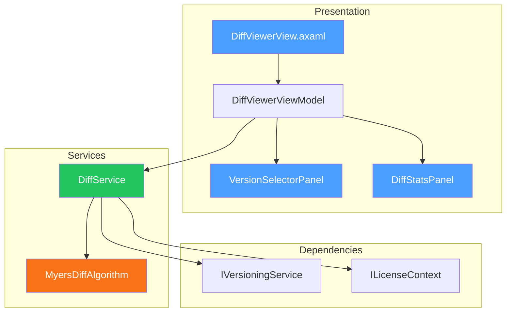

# LCS-DES-094c: Design Specification — Diff Viewer

## 1. Metadata & Categorization

| Field | Value | Description |
| :--- | :--- | :--- |
| **Feature ID** | `COL-094c` | Sub-part of COL-094 |
| **Feature Name** | `Diff Viewer (Compare Any Two Versions)` | Visual text comparison |
| **Target Version** | `v0.9.4c` | Third sub-part of v0.9.4 |
| **Module Scope** | `Lexichord.Modules.Collaboration` | Collaboration module |
| **Swimlane** | `Collaboration` | Part of Collaboration vertical |
| **License Tier** | `WriterPro` | WriterPro+ feature |
| **Feature Gate Key** | `feature.collaboration.diff` | License check key |
| **Author** | Lead Architect | |
| **Status** | `Draft` | |
| **Last Updated** | `2026-01-27` | |
| **Parent Document** | [LCS-DES-094-INDEX](./LCS-DES-094-INDEX.md) | |
| **Scope Breakdown** | [LCS-SBD-094 Section 3.3](./LCS-SBD-094.md#33-v094c-diff-viewer) | |

---

## 2. Executive Summary

### 2.1 The Requirement

Writers need to understand exactly what changed between document revisions:

- What sentences were added or removed?
- Which paragraphs were modified?
- How has the word count changed?
- What was the state before my last edit?

Without a visual diff tool, writers must manually compare documents line by line, which is error-prone and time-consuming.

> **Goal:** Provide a side-by-side visual comparison of any two document versions with inline change highlighting, word-level granularity, and navigation between changes.

### 2.2 The Proposed Solution

Implement a diff viewer that:

1. Displays two versions side-by-side with synchronized scrolling
2. Highlights added, removed, and modified lines
3. Shows word-level and character-level changes inline
4. Provides navigation between changes
5. Displays statistics (lines/words added/removed)
6. Exports diff as HTML report

---

## 3. Architecture & Modular Strategy

### 3.1 Dependencies

#### 3.1.1 Required Interfaces

| Interface | Source Version | Purpose |
| :--- | :--- | :--- |
| `IVersioningService` | v0.9.4a | Access version content |
| `ILicenseContext` | v0.0.4c | WriterPro+ verification |
| `IDockLayoutService` | v0.1.1a | Panel layout |

#### 3.1.2 NuGet Packages

| Package | Version | Purpose |
| :--- | :--- | :--- |
| `DiffPlex` | 1.7.x | Myers diff algorithm |

### 3.2 Component Architecture



### 3.3 Licensing Behavior

| Tier | Basic Diff | Word-Level | Export HTML | Statistics |
| :--- | :--- | :--- | :--- | :--- |
| Core | Line-level only | No | No | Basic |
| WriterPro | Yes | Yes | Yes | Full |
| Teams+ | Yes | Yes | Yes | Full |

---

## 4. Data Contract (The API)

### 4.1 Core Records

```csharp
namespace Lexichord.Modules.Collaboration.Models;

/// <summary>
/// Result of comparing two text versions.
/// </summary>
public record DiffResult
{
    /// <summary>
    /// All lines in the diff, in display order.
    /// </summary>
    public IReadOnlyList<DiffLine> Lines { get; init; } = [];

    /// <summary>
    /// Aggregate statistics about changes.
    /// </summary>
    public DiffStatistics Statistics { get; init; } = new();

    /// <summary>
    /// Title for the left (older) version.
    /// </summary>
    public string LeftTitle { get; init; } = string.Empty;

    /// <summary>
    /// Title for the right (newer) version.
    /// </summary>
    public string RightTitle { get; init; } = string.Empty;

    /// <summary>
    /// Indices of lines that contain changes (for navigation).
    /// </summary>
    public IReadOnlyList<int> ChangeIndices { get; init; } = [];
}

/// <summary>
/// A single line in the diff output.
/// </summary>
public record DiffLine
{
    /// <summary>
    /// Line number in the left version (null if added).
    /// </summary>
    public int? LeftLineNumber { get; init; }

    /// <summary>
    /// Line number in the right version (null if removed).
    /// </summary>
    public int? RightLineNumber { get; init; }

    /// <summary>
    /// Content from the left version (null if added).
    /// </summary>
    public string? LeftContent { get; init; }

    /// <summary>
    /// Content from the right version (null if removed).
    /// </summary>
    public string? RightContent { get; init; }

    /// <summary>
    /// Type of change for this line.
    /// </summary>
    public DiffLineType Type { get; init; }

    /// <summary>
    /// Word-level inline changes (for modified lines).
    /// </summary>
    public IReadOnlyList<DiffSegment>? InlineChanges { get; init; }

    /// <summary>
    /// Whether this line is part of the currently selected change.
    /// </summary>
    public bool IsSelected { get; init; }
}

/// <summary>
/// Type of change for a diff line.
/// </summary>
public enum DiffLineType
{
    /// <summary>
    /// Line is unchanged between versions.
    /// </summary>
    Unchanged,

    /// <summary>
    /// Line was added in the right version.
    /// </summary>
    Added,

    /// <summary>
    /// Line was removed (only in left version).
    /// </summary>
    Removed,

    /// <summary>
    /// Line was modified (present in both, but different).
    /// </summary>
    Modified
}

/// <summary>
/// A segment within a line showing inline changes.
/// </summary>
public record DiffSegment
{
    /// <summary>
    /// The text content of this segment.
    /// </summary>
    public string Content { get; init; } = string.Empty;

    /// <summary>
    /// Type of this segment.
    /// </summary>
    public DiffSegmentType Type { get; init; }

    /// <summary>
    /// Start index within the line.
    /// </summary>
    public int StartIndex { get; init; }

    /// <summary>
    /// Length of this segment.
    /// </summary>
    public int Length { get; init; }
}

/// <summary>
/// Type of inline segment.
/// </summary>
public enum DiffSegmentType
{
    /// <summary>
    /// Text is unchanged.
    /// </summary>
    Unchanged,

    /// <summary>
    /// Text was added.
    /// </summary>
    Added,

    /// <summary>
    /// Text was removed.
    /// </summary>
    Removed
}

/// <summary>
/// Aggregate statistics about a diff.
/// </summary>
public record DiffStatistics
{
    /// <summary>
    /// Total lines in the diff output.
    /// </summary>
    public int TotalLines { get; init; }

    /// <summary>
    /// Number of lines added.
    /// </summary>
    public int AddedLines { get; init; }

    /// <summary>
    /// Number of lines removed.
    /// </summary>
    public int RemovedLines { get; init; }

    /// <summary>
    /// Number of lines modified.
    /// </summary>
    public int ModifiedLines { get; init; }

    /// <summary>
    /// Number of unchanged lines.
    /// </summary>
    public int UnchangedLines { get; init; }

    /// <summary>
    /// Total words added.
    /// </summary>
    public int AddedWords { get; init; }

    /// <summary>
    /// Total words removed.
    /// </summary>
    public int RemovedWords { get; init; }

    /// <summary>
    /// Total characters added.
    /// </summary>
    public int AddedCharacters { get; init; }

    /// <summary>
    /// Total characters removed.
    /// </summary>
    public int RemovedCharacters { get; init; }

    /// <summary>
    /// Number of distinct change regions.
    /// </summary>
    public int ChangeCount { get; init; }
}

/// <summary>
/// Options for diff calculation.
/// </summary>
public record DiffOptions
{
    /// <summary>
    /// Granularity of diff calculation.
    /// </summary>
    public DiffGranularity Granularity { get; init; } = DiffGranularity.Line;

    /// <summary>
    /// Whether to ignore whitespace changes.
    /// </summary>
    public bool IgnoreWhitespace { get; init; } = false;

    /// <summary>
    /// Whether to ignore case differences.
    /// </summary>
    public bool IgnoreCase { get; init; } = false;

    /// <summary>
    /// Number of context lines around changes.
    /// </summary>
    public int ContextLines { get; init; } = 3;

    /// <summary>
    /// Whether to calculate word-level inline changes.
    /// </summary>
    public bool CalculateInlineChanges { get; init; } = true;

    /// <summary>
    /// Whether to show all lines or only changes with context.
    /// </summary>
    public bool ShowFullDocument { get; init; } = true;
}

/// <summary>
/// Granularity level for diff calculation.
/// </summary>
public enum DiffGranularity
{
    /// <summary>
    /// Compare character by character.
    /// </summary>
    Character,

    /// <summary>
    /// Compare word by word.
    /// </summary>
    Word,

    /// <summary>
    /// Compare line by line.
    /// </summary>
    Line,

    /// <summary>
    /// Compare paragraph by paragraph.
    /// </summary>
    Paragraph
}

/// <summary>
/// Options for exporting diff as HTML.
/// </summary>
public record DiffExportOptions
{
    /// <summary>
    /// Whether to include statistics header.
    /// </summary>
    public bool IncludeStatistics { get; init; } = true;

    /// <summary>
    /// Whether to include line numbers.
    /// </summary>
    public bool IncludeLineNumbers { get; init; } = true;

    /// <summary>
    /// Color theme for the export.
    /// </summary>
    public string Theme { get; init; } = "default";

    /// <summary>
    /// Custom CSS to include.
    /// </summary>
    public string? CustomCss { get; init; }

    /// <summary>
    /// Title for the HTML document.
    /// </summary>
    public string? Title { get; init; }
}
```

### 4.2 Service Interface

```csharp
namespace Lexichord.Abstractions.Contracts;

/// <summary>
/// Service for calculating differences between document versions.
/// </summary>
public interface IDiffService
{
    /// <summary>
    /// Calculates the difference between two text contents.
    /// </summary>
    /// <param name="leftContent">The older/left content.</param>
    /// <param name="rightContent">The newer/right content.</param>
    /// <param name="options">Diff options.</param>
    /// <returns>Diff result with all changes.</returns>
    DiffResult CalculateDiff(
        string leftContent,
        string rightContent,
        DiffOptions? options = null);

    /// <summary>
    /// Calculates the difference between two document versions.
    /// </summary>
    /// <param name="leftVersionId">Version ID for the left side.</param>
    /// <param name="rightVersionId">Version ID for the right side.</param>
    /// <param name="options">Diff options.</param>
    /// <param name="ct">Cancellation token.</param>
    /// <returns>Diff result with all changes.</returns>
    Task<DiffResult> CalculateVersionDiffAsync(
        Guid leftVersionId,
        Guid rightVersionId,
        DiffOptions? options = null,
        CancellationToken ct = default);

    /// <summary>
    /// Exports the diff result as an HTML report.
    /// </summary>
    /// <param name="diff">The diff result to export.</param>
    /// <param name="options">Export options.</param>
    /// <param name="ct">Cancellation token.</param>
    /// <returns>HTML content as string.</returns>
    Task<string> ExportDiffAsHtmlAsync(
        DiffResult diff,
        DiffExportOptions? options = null,
        CancellationToken ct = default);

    /// <summary>
    /// Gets a quick summary of changes between two versions.
    /// </summary>
    Task<DiffStatistics> GetQuickStatsAsync(
        Guid leftVersionId,
        Guid rightVersionId,
        CancellationToken ct = default);
}
```

---

## 5. Implementation Logic

### 5.1 Myers Diff Algorithm Flow

```text
MYERS DIFF ALGORITHM:
│
├── Input: leftLines[], rightLines[]
│
├── Build edit graph
│   ├── X-axis: leftLines (0 to M)
│   ├── Y-axis: rightLines (0 to N)
│   ├── Diagonal = match (no edit)
│   ├── Horizontal = delete from left
│   └── Vertical = insert from right
│
├── Find shortest edit script (D-path search)
│   ├── D = 0: Check if identical
│   ├── D = 1: Try 1 edit
│   ├── D = 2: Try 2 edits
│   └── Continue until path found from (0,0) to (M,N)
│
├── Trace back to find edit operations
│   └── Build list of MATCH/INSERT/DELETE operations
│
├── Convert operations to DiffLines
│   ├── MATCH → DiffLineType.Unchanged
│   ├── INSERT → DiffLineType.Added
│   ├── DELETE → DiffLineType.Removed
│   └── DELETE+INSERT (same position) → DiffLineType.Modified
│
└── RETURN DiffResult
```

### 5.2 Inline Change Calculation

```text
CALCULATE INLINE CHANGES (for modified lines):
│
├── Input: leftLine, rightLine
│
├── Tokenize into words
│   ├── LeftWords = SplitIntoWords(leftLine)
│   └── RightWords = SplitIntoWords(rightLine)
│
├── Apply Myers diff at word level
│   └── WordDiff = Diff(LeftWords, RightWords)
│
├── Build DiffSegments
│   ├── FOR each word operation:
│   │   ├── MATCH → DiffSegmentType.Unchanged
│   │   ├── INSERT → DiffSegmentType.Added
│   │   └── DELETE → DiffSegmentType.Removed
│   │
│   └── Track start/end positions
│
└── RETURN IReadOnlyList<DiffSegment>
```

### 5.3 Change Navigation Logic

```text
NAVIGATE TO NEXT CHANGE:
│
├── CurrentIndex = currently selected change index
├── ChangeIndices = list of line indices with changes
│
├── Find next change
│   └── NextIndex = ChangeIndices.FirstOrDefault(i => i > CurrentIndex)
│
├── IF NextIndex found
│   ├── Select that change
│   ├── Scroll both panels to show it
│   └── Update "Change X of Y" indicator
│
└── ELSE (no more changes)
    └── Show "End of changes" notification
```

---

## 6. DiffService Implementation

```csharp
namespace Lexichord.Modules.Collaboration.Services;

/// <summary>
/// Calculates differences between document versions using Myers algorithm.
/// </summary>
public class DiffService(
    IVersioningService versioningService,
    ILicenseContext licenseContext,
    ILogger<DiffService> logger) : IDiffService
{
    public DiffResult CalculateDiff(
        string leftContent,
        string rightContent,
        DiffOptions? options = null)
    {
        options ??= new DiffOptions();

        logger.LogDebug("Calculating diff with granularity {Granularity}", options.Granularity);

        var leftLines = SplitLines(leftContent, options);
        var rightLines = SplitLines(rightContent, options);

        // Use DiffPlex for the heavy lifting
        var diffBuilder = new InlineDiffBuilder(new Differ());
        var diff = diffBuilder.BuildDiffModel(leftContent, rightContent, options.IgnoreWhitespace);

        var resultLines = new List<DiffLine>();
        var changeIndices = new List<int>();
        var statistics = new DiffStatistics();

        int leftLineNum = 0;
        int rightLineNum = 0;
        int addedLines = 0, removedLines = 0, modifiedLines = 0, unchangedLines = 0;
        int addedWords = 0, removedWords = 0;
        int addedChars = 0, removedChars = 0;

        foreach (var piece in diff.Lines)
        {
            DiffLine diffLine;

            switch (piece.Type)
            {
                case ChangeType.Unchanged:
                    leftLineNum++;
                    rightLineNum++;
                    diffLine = new DiffLine
                    {
                        LeftLineNumber = leftLineNum,
                        RightLineNumber = rightLineNum,
                        LeftContent = piece.Text,
                        RightContent = piece.Text,
                        Type = DiffLineType.Unchanged
                    };
                    unchangedLines++;
                    break;

                case ChangeType.Deleted:
                    leftLineNum++;
                    diffLine = new DiffLine
                    {
                        LeftLineNumber = leftLineNum,
                        RightLineNumber = null,
                        LeftContent = piece.Text,
                        RightContent = null,
                        Type = DiffLineType.Removed
                    };
                    changeIndices.Add(resultLines.Count);
                    removedLines++;
                    removedWords += CountWords(piece.Text);
                    removedChars += piece.Text.Length;
                    break;

                case ChangeType.Inserted:
                    rightLineNum++;
                    diffLine = new DiffLine
                    {
                        LeftLineNumber = null,
                        RightLineNumber = rightLineNum,
                        LeftContent = null,
                        RightContent = piece.Text,
                        Type = DiffLineType.Added
                    };
                    changeIndices.Add(resultLines.Count);
                    addedLines++;
                    addedWords += CountWords(piece.Text);
                    addedChars += piece.Text.Length;
                    break;

                case ChangeType.Modified:
                    leftLineNum++;
                    rightLineNum++;
                    var inlineChanges = options.CalculateInlineChanges
                        ? CalculateInlineChanges(piece.Text, piece.Text)
                        : null;
                    diffLine = new DiffLine
                    {
                        LeftLineNumber = leftLineNum,
                        RightLineNumber = rightLineNum,
                        LeftContent = piece.Text,
                        RightContent = piece.Text,
                        Type = DiffLineType.Modified,
                        InlineChanges = inlineChanges
                    };
                    changeIndices.Add(resultLines.Count);
                    modifiedLines++;
                    break;

                default:
                    continue;
            }

            resultLines.Add(diffLine);
        }

        // Handle adjacent delete+insert as modification
        resultLines = MergeAdjacentChanges(resultLines, changeIndices, options);

        return new DiffResult
        {
            Lines = resultLines,
            Statistics = new DiffStatistics
            {
                TotalLines = resultLines.Count,
                AddedLines = addedLines,
                RemovedLines = removedLines,
                ModifiedLines = modifiedLines,
                UnchangedLines = unchangedLines,
                AddedWords = addedWords,
                RemovedWords = removedWords,
                AddedCharacters = addedChars,
                RemovedCharacters = removedChars,
                ChangeCount = changeIndices.Count
            },
            ChangeIndices = changeIndices
        };
    }

    public async Task<DiffResult> CalculateVersionDiffAsync(
        Guid leftVersionId,
        Guid rightVersionId,
        DiffOptions? options = null,
        CancellationToken ct = default)
    {
        var leftVersion = await versioningService.GetVersionAsync(leftVersionId, ct)
            ?? throw new VersionNotFoundException(leftVersionId);
        var rightVersion = await versioningService.GetVersionAsync(rightVersionId, ct)
            ?? throw new VersionNotFoundException(rightVersionId);

        var result = CalculateDiff(leftVersion.Content, rightVersion.Content, options);

        return result with
        {
            LeftTitle = $"v{leftVersion.VersionNumber} ({FormatDate(leftVersion.CreatedAt)})",
            RightTitle = $"v{rightVersion.VersionNumber} ({FormatDate(rightVersion.CreatedAt)})"
        };
    }

    public async Task<string> ExportDiffAsHtmlAsync(
        DiffResult diff,
        DiffExportOptions? options = null,
        CancellationToken ct = default)
    {
        options ??= new DiffExportOptions();

        var sb = new StringBuilder();

        // HTML header
        sb.AppendLine("<!DOCTYPE html>");
        sb.AppendLine("<html lang=\"en\">");
        sb.AppendLine("<head>");
        sb.AppendLine("<meta charset=\"UTF-8\">");
        sb.AppendLine($"<title>{options.Title ?? "Document Comparison"}</title>");
        sb.AppendLine(GetDefaultCss(options.Theme));
        if (!string.IsNullOrEmpty(options.CustomCss))
        {
            sb.AppendLine($"<style>{options.CustomCss}</style>");
        }
        sb.AppendLine("</head>");
        sb.AppendLine("<body>");

        // Title
        sb.AppendLine($"<h1>{options.Title ?? "Document Comparison"}</h1>");
        sb.AppendLine($"<div class=\"header\">");
        sb.AppendLine($"<span class=\"left-title\">{diff.LeftTitle}</span>");
        sb.AppendLine($"<span class=\"right-title\">{diff.RightTitle}</span>");
        sb.AppendLine("</div>");

        // Statistics
        if (options.IncludeStatistics)
        {
            sb.AppendLine("<div class=\"statistics\">");
            sb.AppendLine($"<span class=\"added\">+{diff.Statistics.AddedLines} lines</span>");
            sb.AppendLine($"<span class=\"removed\">-{diff.Statistics.RemovedLines} lines</span>");
            sb.AppendLine($"<span class=\"modified\">{diff.Statistics.ModifiedLines} modified</span>");
            sb.AppendLine("</div>");
        }

        // Diff table
        sb.AppendLine("<table class=\"diff-table\">");
        sb.AppendLine("<thead><tr>");
        if (options.IncludeLineNumbers)
        {
            sb.AppendLine("<th class=\"line-num\">Line</th>");
        }
        sb.AppendLine("<th class=\"left\">Original</th>");
        if (options.IncludeLineNumbers)
        {
            sb.AppendLine("<th class=\"line-num\">Line</th>");
        }
        sb.AppendLine("<th class=\"right\">Modified</th>");
        sb.AppendLine("</tr></thead>");
        sb.AppendLine("<tbody>");

        foreach (var line in diff.Lines)
        {
            var rowClass = line.Type switch
            {
                DiffLineType.Added => "added",
                DiffLineType.Removed => "removed",
                DiffLineType.Modified => "modified",
                _ => "unchanged"
            };

            sb.AppendLine($"<tr class=\"{rowClass}\">");

            if (options.IncludeLineNumbers)
            {
                sb.AppendLine($"<td class=\"line-num\">{line.LeftLineNumber?.ToString() ?? ""}</td>");
            }
            sb.AppendLine($"<td class=\"left\">{EscapeHtml(line.LeftContent ?? "")}</td>");

            if (options.IncludeLineNumbers)
            {
                sb.AppendLine($"<td class=\"line-num\">{line.RightLineNumber?.ToString() ?? ""}</td>");
            }
            sb.AppendLine($"<td class=\"right\">{EscapeHtml(line.RightContent ?? "")}</td>");

            sb.AppendLine("</tr>");
        }

        sb.AppendLine("</tbody></table>");
        sb.AppendLine("</body></html>");

        return sb.ToString();
    }

    private IReadOnlyList<DiffSegment> CalculateInlineChanges(string left, string right)
    {
        if (!licenseContext.CurrentTier >= LicenseTier.WriterPro)
        {
            return []; // Word-level diff requires WriterPro
        }

        var leftWords = TokenizeWords(left);
        var rightWords = TokenizeWords(right);

        var differ = new Differ();
        var result = differ.CreateWordDiffs(left, right, false, false, new[] { ' ', '\t' });

        var segments = new List<DiffSegment>();
        int position = 0;

        foreach (var block in result.DiffBlocks)
        {
            // Add unchanged prefix
            if (block.InsertStartB > position)
            {
                var unchangedText = string.Join("",
                    rightWords.Skip(position).Take(block.InsertStartB - position));
                segments.Add(new DiffSegment
                {
                    Content = unchangedText,
                    Type = DiffSegmentType.Unchanged,
                    StartIndex = position,
                    Length = unchangedText.Length
                });
            }

            // Add deleted words
            if (block.DeleteCountA > 0)
            {
                var deletedText = string.Join("",
                    leftWords.Skip(block.DeleteStartA).Take(block.DeleteCountA));
                segments.Add(new DiffSegment
                {
                    Content = deletedText,
                    Type = DiffSegmentType.Removed,
                    StartIndex = block.DeleteStartA,
                    Length = deletedText.Length
                });
            }

            // Add inserted words
            if (block.InsertCountB > 0)
            {
                var insertedText = string.Join("",
                    rightWords.Skip(block.InsertStartB).Take(block.InsertCountB));
                segments.Add(new DiffSegment
                {
                    Content = insertedText,
                    Type = DiffSegmentType.Added,
                    StartIndex = block.InsertStartB,
                    Length = insertedText.Length
                });
            }

            position = block.InsertStartB + block.InsertCountB;
        }

        // Add remaining unchanged suffix
        if (position < rightWords.Length)
        {
            var remainingText = string.Join("", rightWords.Skip(position));
            segments.Add(new DiffSegment
            {
                Content = remainingText,
                Type = DiffSegmentType.Unchanged,
                StartIndex = position,
                Length = remainingText.Length
            });
        }

        return segments;
    }

    private static string[] SplitLines(string content, DiffOptions options)
    {
        var lines = content.Split('\n');

        if (options.IgnoreWhitespace)
        {
            lines = lines.Select(l => l.Trim()).ToArray();
        }

        if (options.IgnoreCase)
        {
            lines = lines.Select(l => l.ToLowerInvariant()).ToArray();
        }

        return lines;
    }

    private static string[] TokenizeWords(string line) =>
        Regex.Split(line, @"(\s+)").Where(s => !string.IsNullOrEmpty(s)).ToArray();

    private static int CountWords(string text) =>
        text.Split([' ', '\t', '\n'], StringSplitOptions.RemoveEmptyEntries).Length;

    private static string FormatDate(DateTime date) =>
        date.ToLocalTime().ToString("MMM d, h:mm tt");

    private static string EscapeHtml(string text) =>
        System.Net.WebUtility.HtmlEncode(text);

    private static string GetDefaultCss(string theme) => $@"
<style>
    body {{ font-family: -apple-system, BlinkMacSystemFont, 'Segoe UI', Roboto, sans-serif; }}
    .diff-table {{ width: 100%; border-collapse: collapse; font-family: monospace; }}
    .diff-table td, .diff-table th {{ padding: 4px 8px; border: 1px solid #ddd; }}
    .line-num {{ width: 40px; text-align: right; color: #999; background: #f5f5f5; }}
    .left, .right {{ width: 50%; white-space: pre-wrap; }}
    .added {{ background-color: #e6ffec; }}
    .removed {{ background-color: #ffebe9; }}
    .modified {{ background-color: #fff8c5; }}
    .unchanged {{ background-color: #fff; }}
    .statistics {{ margin: 1em 0; }}
    .statistics .added {{ color: #22863a; }}
    .statistics .removed {{ color: #cb2431; }}
    .statistics .modified {{ color: #b08800; }}
    .header {{ display: flex; justify-content: space-between; margin: 1em 0; }}
</style>";
}
```

---

## 7. UI/UX Specifications

### 7.1 Diff Viewer Layout

```text
┌──────────────────────────────────────────────────────────────────────────┐
│  Compare Versions                                                  [x]   │
├──────────────────────────────────────────────────────────────────────────┤
│  Left: [v21 (Jan 20, 1:45 PM) v]     Right: [v23 (Jan 20, 2:34 PM) v]   │
│  [Swap Sides]  [Side-by-Side | Inline | Unified]  [ ] Ignore Whitespace │
├──────────────────────────────────────────────────────────────────────────┤
│  Statistics: +142 words, -28 words, 12 changes                           │
│  [< Previous Change]  Change 3 of 12  [Next Change >]  [Export HTML]    │
├──────────────────────────────────────────────────────────────────────────┤
│ Line │ v21 (Pre-Editor Review)    │ Line │ v23 (Current)                │
├──────┼────────────────────────────┼──────┼───────────────────────────────┤
│  43  │ The hero walked slowly     │  43  │ The hero walked slowly       │
│  44  │ through the dark forest.   │  44  │ through the dark forest.     │
│  45  │ He paused at the edge      │  45  │ He paused at the ancient     │ ← Modified
│      │ of the clearing.           │      │ gate's threshold.            │
│  46  │                            │  46  │                              │
│  47  │ "Who goes there?" a        │  47  │ "Who goes there?" a          │
│      │ voice called out.          │      │ voice called out.            │
│      │                            │  48  │ The hero drew his sword.     │ ← Added
│      │                            │  49  │ "A friend," he replied.      │ ← Added
│  48  │ The moon rose higher.      │  50  │ The moon rose higher.        │
├──────┴────────────────────────────┴──────┴───────────────────────────────┤
│                                                              [Close]     │
└──────────────────────────────────────────────────────────────────────────┘

Color Legend:
  Green background  = Added lines
  Red background    = Removed lines
  Yellow background = Modified lines
  Blue underline    = Currently selected change
```

### 7.2 Inline Change Highlighting

```text
Modified line with word-level highlighting:

Original: "He paused at the edge of the clearing."
Modified: "He paused at the ancient gate's threshold."

Display:
┌────────────────────────────────────────────────────────────┐
│ He paused at the [edge of the clearing.] → [ancient gate's threshold.] │
└────────────────────────────────────────────────────────────┘

Where:
  [red strikethrough] = Removed words
  [green highlight]   = Added words
  Normal text         = Unchanged words
```

### 7.3 Navigation Controls

```text
┌─────────────────────────────────────────────────────────────────────────┐
│  [<<]  [<]  Change 3 of 12  [>]  [>>]                                   │
│  First Previous              Next Last                                   │
└─────────────────────────────────────────────────────────────────────────┘

Keyboard shortcuts:
  Ctrl+↓ / n = Next change
  Ctrl+↑ / p = Previous change
  Home       = First change
  End        = Last change
```

### 7.4 Component Styling

| Component | Theme Resource | Notes |
| :--- | :--- | :--- |
| Panel background | `Brush.Surface.Primary` | Main panel |
| Line numbers | `Brush.Text.Tertiary` | Gray, right-aligned |
| Unchanged text | `Brush.Text.Primary` | Default text |
| Added background | `Brush.Success.Light` | Light green |
| Added text | `Brush.Success.Dark` | Dark green |
| Removed background | `Brush.Error.Light` | Light red |
| Removed text | `Brush.Error.Dark` | Dark red (strikethrough) |
| Modified background | `Brush.Warning.Light` | Light yellow |
| Selected change | `Brush.Accent.Primary` | Blue border/highlight |
| Statistics added | `Brush.Success.Primary` | Green text |
| Statistics removed | `Brush.Error.Primary` | Red text |

---

## 8. DiffViewerViewModel Implementation

```csharp
namespace Lexichord.Modules.Collaboration.ViewModels;

public partial class DiffViewerViewModel : ObservableObject
{
    private readonly IDiffService _diffService;
    private readonly IVersioningService _versioningService;
    private readonly ILogger<DiffViewerViewModel> _logger;

    [ObservableProperty]
    private Guid _documentId;

    [ObservableProperty]
    private ObservableCollection<VersionSelectorItem> _availableVersions = [];

    [ObservableProperty]
    private VersionSelectorItem? _leftVersion;

    [ObservableProperty]
    private VersionSelectorItem? _rightVersion;

    [ObservableProperty]
    private DiffResult? _diffResult;

    [ObservableProperty]
    private ObservableCollection<DiffLineViewModel> _diffLines = [];

    [ObservableProperty]
    private int _currentChangeIndex;

    [ObservableProperty]
    private int _totalChanges;

    [ObservableProperty]
    private DiffStatistics? _statistics;

    [ObservableProperty]
    private bool _isLoading;

    [ObservableProperty]
    private bool _ignoreWhitespace;

    [ObservableProperty]
    private DiffViewMode _viewMode = DiffViewMode.SideBySide;

    [ObservableProperty]
    private double _leftScrollOffset;

    [ObservableProperty]
    private double _rightScrollOffset;

    public DiffViewerViewModel(
        IDiffService diffService,
        IVersioningService versioningService,
        ILogger<DiffViewerViewModel> logger)
    {
        _diffService = diffService;
        _versioningService = versioningService;
        _logger = logger;
    }

    public async Task InitializeAsync(Guid documentId, Guid? leftVersionId = null, Guid? rightVersionId = null)
    {
        DocumentId = documentId;
        IsLoading = true;

        try
        {
            // Load available versions
            var versions = await _versioningService.GetVersionHistoryAsync(documentId);
            AvailableVersions.Clear();

            foreach (var version in versions)
            {
                AvailableVersions.Add(new VersionSelectorItem(version));
            }

            // Set default selections
            if (versions.Count >= 2)
            {
                LeftVersion = leftVersionId.HasValue
                    ? AvailableVersions.FirstOrDefault(v => v.VersionId == leftVersionId)
                    : AvailableVersions.Skip(1).FirstOrDefault();

                RightVersion = rightVersionId.HasValue
                    ? AvailableVersions.FirstOrDefault(v => v.VersionId == rightVersionId)
                    : AvailableVersions.FirstOrDefault();

                await CalculateDiffAsync();
            }
        }
        catch (Exception ex)
        {
            _logger.LogError(ex, "Failed to initialize diff viewer");
        }
        finally
        {
            IsLoading = false;
        }
    }

    [RelayCommand]
    private async Task CalculateDiffAsync()
    {
        if (LeftVersion == null || RightVersion == null)
            return;

        IsLoading = true;

        try
        {
            var options = new DiffOptions
            {
                IgnoreWhitespace = IgnoreWhitespace,
                CalculateInlineChanges = true
            };

            DiffResult = await _diffService.CalculateVersionDiffAsync(
                LeftVersion.VersionId,
                RightVersion.VersionId,
                options);

            // Update view model collections
            DiffLines.Clear();
            foreach (var line in DiffResult.Lines)
            {
                DiffLines.Add(new DiffLineViewModel(line));
            }

            Statistics = DiffResult.Statistics;
            TotalChanges = DiffResult.ChangeIndices.Count;
            CurrentChangeIndex = TotalChanges > 0 ? 1 : 0;

            // Navigate to first change
            if (TotalChanges > 0)
            {
                NavigateToChange(0);
            }
        }
        catch (Exception ex)
        {
            _logger.LogError(ex, "Failed to calculate diff");
        }
        finally
        {
            IsLoading = false;
        }
    }

    [RelayCommand]
    private void SwapSides()
    {
        (LeftVersion, RightVersion) = (RightVersion, LeftVersion);
        _ = CalculateDiffAsync();
    }

    [RelayCommand]
    private void NextChange()
    {
        if (DiffResult == null || CurrentChangeIndex >= TotalChanges)
            return;

        CurrentChangeIndex++;
        NavigateToChange(CurrentChangeIndex - 1);
    }

    [RelayCommand]
    private void PreviousChange()
    {
        if (DiffResult == null || CurrentChangeIndex <= 1)
            return;

        CurrentChangeIndex--;
        NavigateToChange(CurrentChangeIndex - 1);
    }

    [RelayCommand]
    private void FirstChange()
    {
        if (DiffResult == null || TotalChanges == 0)
            return;

        CurrentChangeIndex = 1;
        NavigateToChange(0);
    }

    [RelayCommand]
    private void LastChange()
    {
        if (DiffResult == null || TotalChanges == 0)
            return;

        CurrentChangeIndex = TotalChanges;
        NavigateToChange(TotalChanges - 1);
    }

    [RelayCommand]
    private async Task ExportHtmlAsync()
    {
        if (DiffResult == null)
            return;

        try
        {
            var options = new DiffExportOptions
            {
                Title = $"Comparison: {LeftVersion?.DisplayName} vs {RightVersion?.DisplayName}",
                IncludeStatistics = true,
                IncludeLineNumbers = true
            };

            var html = await _diffService.ExportDiffAsHtmlAsync(DiffResult, options);

            // Show save dialog
            // Save to file
            _logger.LogInformation("Exported diff to HTML");
        }
        catch (Exception ex)
        {
            _logger.LogError(ex, "Failed to export diff as HTML");
        }
    }

    private void NavigateToChange(int changeIndex)
    {
        if (DiffResult == null || changeIndex < 0 || changeIndex >= DiffResult.ChangeIndices.Count)
            return;

        var lineIndex = DiffResult.ChangeIndices[changeIndex];

        // Deselect all lines
        foreach (var line in DiffLines)
        {
            line.IsSelected = false;
        }

        // Select the target line
        if (lineIndex < DiffLines.Count)
        {
            DiffLines[lineIndex].IsSelected = true;

            // Calculate scroll offset to center the change
            var lineHeight = 24; // Approximate line height
            var viewportHeight = 500; // Approximate viewport height
            var targetOffset = (lineIndex * lineHeight) - (viewportHeight / 2);

            LeftScrollOffset = Math.Max(0, targetOffset);
            RightScrollOffset = Math.Max(0, targetOffset);
        }
    }

    partial void OnIgnoreWhitespaceChanged(bool value)
    {
        _ = CalculateDiffAsync();
    }

    partial void OnLeftVersionChanged(VersionSelectorItem? value)
    {
        if (value != null && RightVersion != null)
        {
            _ = CalculateDiffAsync();
        }
    }

    partial void OnRightVersionChanged(VersionSelectorItem? value)
    {
        if (value != null && LeftVersion != null)
        {
            _ = CalculateDiffAsync();
        }
    }

    // Synchronized scrolling
    partial void OnLeftScrollOffsetChanged(double value)
    {
        if (Math.Abs(RightScrollOffset - value) > 1)
        {
            RightScrollOffset = value;
        }
    }

    partial void OnRightScrollOffsetChanged(double value)
    {
        if (Math.Abs(LeftScrollOffset - value) > 1)
        {
            LeftScrollOffset = value;
        }
    }
}

public enum DiffViewMode
{
    SideBySide,
    Inline,
    Unified
}

public class VersionSelectorItem
{
    public Guid VersionId { get; }
    public int VersionNumber { get; }
    public DateTime CreatedAt { get; }
    public string DisplayName { get; }

    public VersionSelectorItem(DocumentVersion version)
    {
        VersionId = version.VersionId;
        VersionNumber = version.VersionNumber;
        CreatedAt = version.CreatedAt;
        DisplayName = $"v{version.VersionNumber} ({FormatDate(version.CreatedAt)})";
    }

    private static string FormatDate(DateTime date) =>
        date.ToLocalTime().ToString("MMM d, h:mm tt");
}

public partial class DiffLineViewModel : ObservableObject
{
    public int? LeftLineNumber { get; }
    public int? RightLineNumber { get; }
    public string? LeftContent { get; }
    public string? RightContent { get; }
    public DiffLineType Type { get; }
    public IReadOnlyList<DiffSegment>? InlineChanges { get; }

    [ObservableProperty]
    private bool _isSelected;

    public DiffLineViewModel(DiffLine line)
    {
        LeftLineNumber = line.LeftLineNumber;
        RightLineNumber = line.RightLineNumber;
        LeftContent = line.LeftContent;
        RightContent = line.RightContent;
        Type = line.Type;
        InlineChanges = line.InlineChanges;
        IsSelected = line.IsSelected;
    }
}
```

---

## 9. Observability & Logging

| Level | Message Template |
| :--- | :--- |
| Debug | `"Calculating diff between versions {LeftId} and {RightId}"` |
| Debug | `"Diff options: Granularity={Granularity}, IgnoreWhitespace={IgnoreWhitespace}"` |
| Info | `"Diff complete: {AddedLines} added, {RemovedLines} removed, {ChangeCount} changes"` |
| Debug | `"Navigating to change {Index} of {Total}"` |
| Info | `"Exported diff to HTML: {Path}"` |
| Warning | `"Word-level diff not available for license tier {Tier}"` |
| Error | `"Failed to calculate diff: {Error}"` |

---

## 10. Acceptance Criteria

### 10.1 Functional Criteria

| # | Given | When | Then |
| :--- | :--- | :--- | :--- |
| 1 | Two versions selected | User opens diff viewer | Side-by-side comparison shown |
| 2 | Diff displayed | User clicks "Swap Sides" | Left and right swap |
| 3 | Lines added in right | Viewing diff | Green highlight on added lines |
| 4 | Lines removed | Viewing diff | Red highlight on removed lines |
| 5 | Lines modified | Viewing diff | Yellow highlight, inline changes |
| 6 | Multiple changes | User clicks "Next Change" | Scrolls to next change |
| 7 | At last change | User clicks "Next Change" | Nothing happens / notification |
| 8 | Core license | Viewing diff | Line-level only, no word-level |
| 9 | WriterPro license | Viewing diff | Word-level inline changes shown |
| 10 | Diff displayed | User clicks "Export HTML" | HTML file saved |
| 11 | Scrolling left panel | Viewing diff | Right panel scrolls in sync |

### 10.2 Performance Criteria

| # | Operation | Target |
| :--- | :--- | :--- |
| 12 | Diff calculation (10K lines) | < 500ms |
| 13 | Word-level inline diff | < 100ms per line |
| 14 | UI render (1000 diff lines) | < 200ms |
| 15 | Navigate between changes | < 50ms |
| 16 | Export to HTML | < 2 seconds |

---

## 11. Test Scenarios

```csharp
[Trait("Category", "Unit")]
[Trait("Version", "v0.9.4c")]
public class DiffServiceTests
{
    [Fact]
    public void CalculateDiff_IdenticalContent_ReturnsNoChanges()
    {
        // Arrange
        var sut = CreateDiffService();
        var content = "Line 1\nLine 2\nLine 3";

        // Act
        var result = sut.CalculateDiff(content, content);

        // Assert
        result.Statistics.AddedLines.Should().Be(0);
        result.Statistics.RemovedLines.Should().Be(0);
        result.Statistics.ModifiedLines.Should().Be(0);
        result.Lines.Should().OnlyContain(l => l.Type == DiffLineType.Unchanged);
    }

    [Fact]
    public void CalculateDiff_AddedLine_MarksAsAdded()
    {
        // Arrange
        var sut = CreateDiffService();
        var left = "Line 1\nLine 2";
        var right = "Line 1\nLine 2\nLine 3";

        // Act
        var result = sut.CalculateDiff(left, right);

        // Assert
        result.Statistics.AddedLines.Should().Be(1);
        result.Lines.Should().Contain(l =>
            l.Type == DiffLineType.Added &&
            l.RightContent == "Line 3" &&
            l.LeftContent == null);
    }

    [Fact]
    public void CalculateDiff_RemovedLine_MarksAsRemoved()
    {
        // Arrange
        var sut = CreateDiffService();
        var left = "Line 1\nLine 2\nLine 3";
        var right = "Line 1\nLine 3";

        // Act
        var result = sut.CalculateDiff(left, right);

        // Assert
        result.Statistics.RemovedLines.Should().Be(1);
        result.Lines.Should().Contain(l =>
            l.Type == DiffLineType.Removed &&
            l.LeftContent == "Line 2" &&
            l.RightContent == null);
    }

    [Fact]
    public void CalculateDiff_ModifiedLine_CalculatesInlineChanges()
    {
        // Arrange
        var sut = CreateDiffService(LicenseTier.WriterPro);
        var left = "The quick brown fox";
        var right = "The slow brown fox";

        var options = new DiffOptions { CalculateInlineChanges = true };

        // Act
        var result = sut.CalculateDiff(left, right, options);

        // Assert
        var modifiedLine = result.Lines.FirstOrDefault(l => l.Type == DiffLineType.Modified);
        modifiedLine.Should().NotBeNull();
        modifiedLine!.InlineChanges.Should().NotBeNull();
        modifiedLine.InlineChanges.Should().Contain(s =>
            s.Type == DiffSegmentType.Removed && s.Content.Contains("quick"));
        modifiedLine.InlineChanges.Should().Contain(s =>
            s.Type == DiffSegmentType.Added && s.Content.Contains("slow"));
    }

    [Fact]
    public void CalculateDiff_IgnoreWhitespace_IgnoresWhitespaceChanges()
    {
        // Arrange
        var sut = CreateDiffService();
        var left = "Line 1";
        var right = "  Line 1  ";

        var options = new DiffOptions { IgnoreWhitespace = true };

        // Act
        var result = sut.CalculateDiff(left, right, options);

        // Assert
        result.Statistics.ModifiedLines.Should().Be(0);
        result.Lines.Should().OnlyContain(l => l.Type == DiffLineType.Unchanged);
    }

    [Fact]
    public void CalculateDiff_LargeDocument_CompletesWithinThreshold()
    {
        // Arrange
        var sut = CreateDiffService();
        var left = string.Join("\n", Enumerable.Range(1, 10000).Select(i => $"Line {i}"));
        var right = string.Join("\n", Enumerable.Range(1, 10000).Select(i =>
            i % 100 == 0 ? $"Modified line {i}" : $"Line {i}"));

        var sw = Stopwatch.StartNew();

        // Act
        var result = sut.CalculateDiff(left, right);

        // Assert
        sw.Stop();
        sw.ElapsedMilliseconds.Should().BeLessThan(500);
        result.Statistics.ModifiedLines.Should().Be(100);
    }

    [Fact]
    public async Task ExportDiffAsHtmlAsync_ValidDiff_GeneratesHtml()
    {
        // Arrange
        var sut = CreateDiffService();
        var diff = sut.CalculateDiff("Line 1", "Line 2");

        // Act
        var html = await sut.ExportDiffAsHtmlAsync(diff);

        // Assert
        html.Should().Contain("<!DOCTYPE html>");
        html.Should().Contain("<table");
        html.Should().Contain("Line 1");
        html.Should().Contain("Line 2");
    }

    [Fact]
    public void CalculateDiff_ChangeIndices_ContainsAllChangeLocations()
    {
        // Arrange
        var sut = CreateDiffService();
        var left = "A\nB\nC\nD\nE";
        var right = "A\nX\nC\nY\nE";

        // Act
        var result = sut.CalculateDiff(left, right);

        // Assert
        result.ChangeIndices.Should().HaveCount(2); // B->X and D->Y
        foreach (var index in result.ChangeIndices)
        {
            result.Lines[index].Type.Should().NotBe(DiffLineType.Unchanged);
        }
    }
}
```

---

## 12. Deliverable Checklist

| # | Deliverable | Status |
| :--- | :--- | :--- |
| 1 | `DiffResult` record | [ ] |
| 2 | `DiffLine` record | [ ] |
| 3 | `DiffSegment` record | [ ] |
| 4 | `DiffStatistics` record | [ ] |
| 5 | `DiffOptions` record | [ ] |
| 6 | `DiffExportOptions` record | [ ] |
| 7 | `IDiffService` interface | [ ] |
| 8 | `DiffService` implementation | [ ] |
| 9 | Myers diff integration | [ ] |
| 10 | Word-level inline diff | [ ] |
| 11 | `DiffViewerView.axaml` | [ ] |
| 12 | `DiffViewerViewModel` | [ ] |
| 13 | Synchronized scrolling | [ ] |
| 14 | Change navigation | [ ] |
| 15 | HTML export | [ ] |
| 16 | Unit tests for `DiffService` | [ ] |
| 17 | License gating (word-level) | [ ] |
| 18 | DI registration | [ ] |

---

## 13. Verification Commands

```bash
# Build the module
dotnet build src/Lexichord.Modules.Collaboration

# Run diff tests
dotnet test --filter "Version=v0.9.4c" --logger "console;verbosity=detailed"

# Run performance tests
dotnet test --filter "FullyQualifiedName~DiffService&Category=Performance"

# Manual verification:
# 1. Open two versions in diff viewer
# 2. Verify side-by-side display with colors
# 3. Click through changes with navigation
# 4. Test "Swap Sides"
# 5. Test "Ignore Whitespace"
# 6. Export to HTML and verify output
```

---

## Document History

| Version | Date | Author | Changes |
| :--- | :--- | :--- | :--- |
| 1.0 | 2026-01-27 | Lead Architect | Initial draft |
