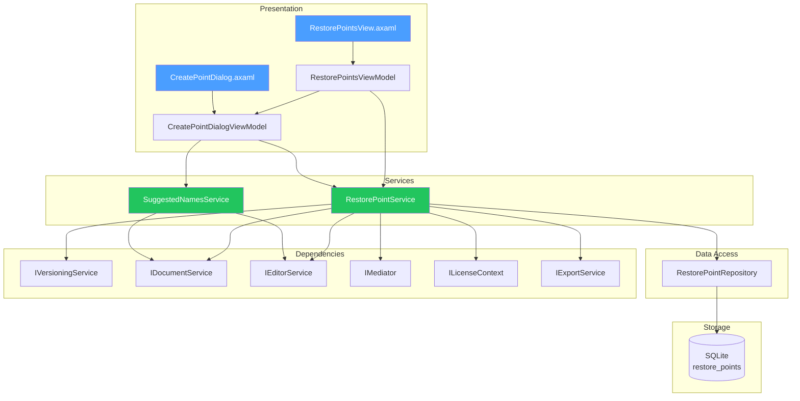

# LCS-DES-094d: Design Specification — Restore Points

## 1. Metadata & Categorization

| Field | Value | Description |
| :--- | :--- | :--- |
| **Feature ID** | `COL-094d` | Sub-part of COL-094 |
| **Feature Name** | `Restore Points (Named Checkpoints)` | Named version checkpoints |
| **Target Version** | `v0.9.4d` | Fourth sub-part of v0.9.4 |
| **Module Scope** | `Lexichord.Modules.Collaboration` | Collaboration module |
| **Swimlane** | `Collaboration` | Part of Collaboration vertical |
| **License Tier** | `WriterPro+` | WriterPro and Teams access |
| **Feature Gate Key** | `feature.collaboration.restorepoints` | License check key |
| **Author** | Lead Architect | |
| **Status** | `Draft` | |
| **Last Updated** | `2026-01-27` | |
| **Parent Document** | [LCS-DES-094-INDEX](./LCS-DES-094-INDEX.md) | |
| **Scope Breakdown** | [LCS-SBD-094 Section 3.4](./LCS-SBD-094.md#34-v094d-restore-points) | |

---

## 2. Executive Summary

### 2.1 The Requirement

Writers need a way to mark significant milestones in their document's evolution. While automatic versioning captures every save, writers need intentional checkpoints for critical moments:

- Completed first drafts
- Pre-review snapshots
- Before major restructuring
- End-of-chapter milestones
- Submission-ready versions

> **Goal:** Provide named restore points that writers can create, organize, and quickly return to, with intelligent name suggestions and optional notes.

### 2.2 The Proposed Solution

Implement a restore point system that:

1. Allows creating named checkpoints at any time
2. Suggests contextual names based on document state
3. Supports optional notes/descriptions
4. Provides quick-access list separate from full version history
5. Enables export/import of restore points for backup
6. Protects restore points from automatic pruning

---

## 3. Architecture & Modular Strategy

### 3.1 Dependencies

#### 3.1.1 Required Interfaces

| Interface | Source Version | Purpose |
| :--- | :--- | :--- |
| `IVersioningService` | v0.9.4a | Creating versioned snapshots |
| `IDocumentService` | v0.1.3a | Document access |
| `IEditorService` | v0.1.3c | Current content capture |
| `IStorageService` | v0.5.2a | Persisting restore point metadata |
| `IMediator` | v0.0.7a | Publishing restore point events |
| `ILicenseContext` | v0.0.4c | License tier checking |
| `IExportService` | v0.5.3a | Export/import functionality |

#### 3.1.2 NuGet Packages

| Package | Version | Purpose |
| :--- | :--- | :--- |
| `Dapper` | 2.x | Database access |
| `SQLitePCLRaw` | 2.x | SQLite database |
| `System.Text.Json` | 8.x | Export serialization |

### 3.2 Component Architecture



### 3.3 Licensing Behavior

| Tier | Max Restore Points | Create | Quick Access | Export/Import |
| :--- | :--- | :--- | :--- | :--- |
| Core | 0 | No | No | No |
| WriterPro | 10 per document | Yes | Yes | No |
| Teams+ | Unlimited | Yes | Yes | Yes |

Core users see restore points in version history but cannot create new ones.

---

## 4. Data Contract (The API)

### 4.1 Core Records

```csharp
namespace Lexichord.Modules.Collaboration.Models;

/// <summary>
/// Represents a named restore point (checkpoint) for a document.
/// Wraps a DocumentVersion with additional metadata for quick access.
/// </summary>
public record RestorePoint
{
    /// <summary>
    /// Unique identifier for this restore point.
    /// </summary>
    public Guid RestorePointId { get; init; }

    /// <summary>
    /// The document this restore point belongs to.
    /// </summary>
    public Guid DocumentId { get; init; }

    /// <summary>
    /// The underlying version snapshot.
    /// </summary>
    public Guid VersionId { get; init; }

    /// <summary>
    /// User-provided name for the restore point.
    /// </summary>
    public string Name { get; init; } = string.Empty;

    /// <summary>
    /// Optional description or notes about this checkpoint.
    /// </summary>
    public string? Description { get; init; }

    /// <summary>
    /// Category for organization (e.g., "Draft", "Review", "Milestone").
    /// </summary>
    public RestorePointCategory Category { get; init; }

    /// <summary>
    /// Color tag for visual distinction (hex color code).
    /// </summary>
    public string? ColorTag { get; init; }

    /// <summary>
    /// When this restore point was created (UTC).
    /// </summary>
    public DateTime CreatedAt { get; init; }

    /// <summary>
    /// User or profile that created this restore point.
    /// </summary>
    public string? CreatedBy { get; init; }

    /// <summary>
    /// Word count at this restore point.
    /// </summary>
    public int WordCount { get; init; }

    /// <summary>
    /// Whether this restore point is pinned for quick access.
    /// </summary>
    public bool IsPinned { get; init; }

    /// <summary>
    /// Display order for pinned restore points.
    /// </summary>
    public int PinnedOrder { get; init; }
}

/// <summary>
/// Category for organizing restore points.
/// </summary>
public enum RestorePointCategory
{
    /// <summary>
    /// General checkpoint without specific category.
    /// </summary>
    General,

    /// <summary>
    /// Draft milestone (e.g., "First Draft Complete").
    /// </summary>
    Draft,

    /// <summary>
    /// Pre-review checkpoint.
    /// </summary>
    Review,

    /// <summary>
    /// Major structural milestone.
    /// </summary>
    Milestone,

    /// <summary>
    /// Submission-ready version.
    /// </summary>
    Submission,

    /// <summary>
    /// Chapter or section complete.
    /// </summary>
    Chapter,

    /// <summary>
    /// Backup before major changes.
    /// </summary>
    Backup
}

/// <summary>
/// Suggested name for a restore point based on context.
/// </summary>
public record SuggestedRestorePointName
{
    /// <summary>
    /// The suggested name.
    /// </summary>
    public string Name { get; init; } = string.Empty;

    /// <summary>
    /// Why this name was suggested.
    /// </summary>
    public string Reason { get; init; } = string.Empty;

    /// <summary>
    /// Suggested category for this name.
    /// </summary>
    public RestorePointCategory Category { get; init; }

    /// <summary>
    /// Confidence score (0-1) for this suggestion.
    /// </summary>
    public double Confidence { get; init; }
}

/// <summary>
/// Data for exporting/importing restore points.
/// </summary>
public record RestorePointExportData
{
    /// <summary>
    /// Format version for compatibility.
    /// </summary>
    public string FormatVersion { get; init; } = "1.0";

    /// <summary>
    /// When the export was created.
    /// </summary>
    public DateTime ExportedAt { get; init; }

    /// <summary>
    /// Document title for reference.
    /// </summary>
    public string DocumentTitle { get; init; } = string.Empty;

    /// <summary>
    /// The restore points being exported.
    /// </summary>
    public IReadOnlyList<RestorePointExportItem> RestorePoints { get; init; } = [];
}

/// <summary>
/// Single restore point in export format.
/// </summary>
public record RestorePointExportItem
{
    /// <summary>
    /// The restore point metadata.
    /// </summary>
    public RestorePoint Metadata { get; init; } = null!;

    /// <summary>
    /// The full document content at this restore point.
    /// </summary>
    public string Content { get; init; } = string.Empty;
}
```

### 4.2 Service Interface

```csharp
namespace Lexichord.Abstractions.Contracts;

/// <summary>
/// Service for managing named restore points (checkpoints).
/// Provides quick-access to important document milestones.
/// </summary>
public interface IRestorePointService
{
    /// <summary>
    /// Creates a new named restore point for the document.
    /// </summary>
    /// <param name="documentId">The document to checkpoint.</param>
    /// <param name="name">User-provided name for the restore point.</param>
    /// <param name="description">Optional description or notes.</param>
    /// <param name="category">Category for organization.</param>
    /// <param name="colorTag">Optional hex color code for visual distinction.</param>
    /// <param name="ct">Cancellation token.</param>
    /// <returns>The created restore point.</returns>
    Task<RestorePoint> CreateRestorePointAsync(
        Guid documentId,
        string name,
        string? description = null,
        RestorePointCategory category = RestorePointCategory.General,
        string? colorTag = null,
        CancellationToken ct = default);

    /// <summary>
    /// Gets all restore points for a document.
    /// </summary>
    /// <param name="documentId">The document to query.</param>
    /// <param name="includePinnedFirst">Whether to sort pinned items first.</param>
    /// <param name="ct">Cancellation token.</param>
    Task<IReadOnlyList<RestorePoint>> GetRestorePointsAsync(
        Guid documentId,
        bool includePinnedFirst = true,
        CancellationToken ct = default);

    /// <summary>
    /// Gets a specific restore point by ID.
    /// </summary>
    Task<RestorePoint?> GetRestorePointAsync(
        Guid restorePointId,
        CancellationToken ct = default);

    /// <summary>
    /// Updates a restore point's metadata (name, description, category, color).
    /// </summary>
    Task<RestorePoint> UpdateRestorePointAsync(
        Guid restorePointId,
        string? name = null,
        string? description = null,
        RestorePointCategory? category = null,
        string? colorTag = null,
        CancellationToken ct = default);

    /// <summary>
    /// Deletes a restore point (the underlying version is preserved).
    /// </summary>
    Task DeleteRestorePointAsync(
        Guid restorePointId,
        CancellationToken ct = default);

    /// <summary>
    /// Restores the document to a restore point.
    /// </summary>
    /// <param name="restorePointId">The restore point to restore to.</param>
    /// <param name="createNewRestorePoint">Whether to create a new restore point with restored content.</param>
    /// <param name="ct">Cancellation token.</param>
    /// <returns>The restored document version.</returns>
    Task<DocumentVersion> RestoreToPointAsync(
        Guid restorePointId,
        bool createNewRestorePoint = true,
        CancellationToken ct = default);

    /// <summary>
    /// Pins or unpins a restore point for quick access.
    /// </summary>
    Task TogglePinAsync(
        Guid restorePointId,
        CancellationToken ct = default);

    /// <summary>
    /// Reorders pinned restore points.
    /// </summary>
    Task ReorderPinnedAsync(
        Guid documentId,
        IReadOnlyList<Guid> restorePointIds,
        CancellationToken ct = default);

    /// <summary>
    /// Gets suggested names for a new restore point.
    /// </summary>
    Task<IReadOnlyList<SuggestedRestorePointName>> GetSuggestedNamesAsync(
        Guid documentId,
        CancellationToken ct = default);

    /// <summary>
    /// Exports restore points to a file.
    /// </summary>
    Task<string> ExportRestorePointsAsync(
        Guid documentId,
        IReadOnlyList<Guid>? restorePointIds = null,
        CancellationToken ct = default);

    /// <summary>
    /// Imports restore points from exported data.
    /// </summary>
    /// <param name="documentId">The document to import into.</param>
    /// <param name="exportData">The exported restore point data.</param>
    /// <param name="ct">Cancellation token.</param>
    /// <returns>Number of restore points imported.</returns>
    Task<int> ImportRestorePointsAsync(
        Guid documentId,
        string exportData,
        CancellationToken ct = default);

    /// <summary>
    /// Gets the count of restore points for a document.
    /// </summary>
    Task<int> GetRestorePointCountAsync(
        Guid documentId,
        CancellationToken ct = default);
}
```

### 4.3 Repository Interface

```csharp
namespace Lexichord.Modules.Collaboration.Data;

/// <summary>
/// Repository for restore point persistence.
/// </summary>
public interface IRestorePointRepository
{
    Task SaveRestorePointAsync(RestorePoint restorePoint, CancellationToken ct = default);
    Task<RestorePoint?> GetRestorePointAsync(Guid restorePointId, CancellationToken ct = default);
    Task<IReadOnlyList<RestorePoint>> GetRestorePointsAsync(Guid documentId, bool includePinnedFirst = true, CancellationToken ct = default);
    Task UpdateRestorePointAsync(RestorePoint restorePoint, CancellationToken ct = default);
    Task DeleteRestorePointAsync(Guid restorePointId, CancellationToken ct = default);
    Task<int> GetRestorePointCountAsync(Guid documentId, CancellationToken ct = default);
    Task UpdatePinnedOrderAsync(Guid documentId, IReadOnlyList<(Guid RestorePointId, int Order)> orders, CancellationToken ct = default);
}
```

---

## 5. Implementation Logic

### 5.1 Restore Point Creation Flow

```text
CREATE RESTORE POINT:
│
├── Input: documentId, name, description?, category, colorTag?
│
├── Validate license
│   ├── IF Core tier
│   │   └── THROW LicenseRestrictedException
│   └── IF WriterPro AND count >= 10
│       └── THROW RestorePointLimitException
│
├── Get current document content
│   └── Content = editorService.GetContentAsync(documentId)
│
├── Create underlying version
│   └── Version = versioningService.CreateVersionAsync(
│           documentId, content, VersionType.RestorePoint, name)
│
├── Calculate word count
│   └── WordCount = CountWords(content)
│
├── Create restore point record
│   └── RestorePoint = new RestorePoint {
│           RestorePointId = Guid.NewGuid(),
│           DocumentId = documentId,
│           VersionId = Version.VersionId,
│           Name = name,
│           Description = description,
│           Category = category,
│           ColorTag = colorTag,
│           CreatedAt = DateTime.UtcNow,
│           WordCount = wordCount,
│           IsPinned = false
│       }
│
├── Save to repository
│   └── repository.SaveRestorePointAsync(RestorePoint)
│
├── Publish event
│   └── mediator.Publish(new RestorePointCreatedEvent(RestorePoint))
│
└── RETURN RestorePoint
```

### 5.2 Suggested Names Logic

```text
GET SUGGESTED NAMES:
│
├── Input: documentId
│
├── Get document metadata
│   └── Document = documentService.GetDocumentAsync(documentId)
│
├── Get current content
│   └── Content = editorService.GetContentAsync(documentId)
│
├── Get existing restore points
│   └── ExistingPoints = repository.GetRestorePointsAsync(documentId)
│
├── Initialize suggestions list
│   └── Suggestions = []
│
├── Check word count milestones
│   ├── IF WordCount >= 50,000 AND no "50K Words" point
│   │   └── ADD Suggestion("50K Words Milestone", Milestone, 0.9)
│   ├── IF WordCount >= 75,000 AND no "75K Words" point
│   │   └── ADD Suggestion("75K Words Milestone", Milestone, 0.9)
│   └── IF WordCount >= 100,000 AND no "100K Words" point
│       └── ADD Suggestion("100K Words Milestone", Milestone, 0.95)
│
├── Check for chapter markers in content
│   ├── Extract chapter headings (# Chapter, ## Chapter, etc.)
│   ├── Find most recent chapter
│   └── IF chapter found AND no point for that chapter
│       └── ADD Suggestion("Chapter {N} Complete", Chapter, 0.85)
│
├── Check time-based suggestions
│   ├── IF end of day (after 5 PM) AND no point today
│   │   └── ADD Suggestion("End of Day - {Date}", General, 0.7)
│   └── IF Friday AND no point this week
│       └── ADD Suggestion("Weekly Checkpoint - Week {N}", General, 0.75)
│
├── Check draft progression
│   ├── Count points with "Draft" category
│   ├── DraftNumber = Count + 1
│   └── IF no recent draft point
│       └── ADD Suggestion("Draft {N}", Draft, 0.6)
│
├── Add generic suggestions
│   ├── ADD Suggestion("Pre-Review Checkpoint", Review, 0.5)
│   ├── ADD Suggestion("Before Major Edit", Backup, 0.5)
│   └── ADD Suggestion("{DocumentTitle} - {Date}", General, 0.4)
│
├── Sort by confidence descending
│   └── Suggestions.OrderByDescending(s => s.Confidence)
│
└── RETURN Suggestions.Take(5)
```

### 5.3 Export/Import Flow

```text
EXPORT RESTORE POINTS:
│
├── Input: documentId, restorePointIds? (null = all)
│
├── Validate license (Teams only)
│   └── IF NOT Teams tier
│       └── THROW LicenseRestrictedException
│
├── Get document info
│   └── Document = documentService.GetDocumentAsync(documentId)
│
├── Get restore points to export
│   ├── IF restorePointIds provided
│   │   └── Points = Get specified points
│   └── ELSE
│       └── Points = Get all points for document
│
├── Build export items
│   └── FOR each point in Points
│       ├── Get version content
│       │   └── Version = versioningService.GetVersionAsync(point.VersionId)
│       └── ADD ExportItem(point, version.Content)
│
├── Create export data
│   └── ExportData = new RestorePointExportData {
│           FormatVersion = "1.0",
│           ExportedAt = DateTime.UtcNow,
│           DocumentTitle = Document.Title,
│           RestorePoints = ExportItems
│       }
│
├── Serialize to JSON
│   └── Json = JsonSerializer.Serialize(ExportData)
│
└── RETURN Json


IMPORT RESTORE POINTS:
│
├── Input: documentId, exportData (JSON string)
│
├── Validate license (Teams only)
│   └── IF NOT Teams tier
│       └── THROW LicenseRestrictedException
│
├── Deserialize export data
│   └── Data = JsonSerializer.Deserialize<RestorePointExportData>(exportData)
│
├── Validate format version
│   └── IF Data.FormatVersion != "1.0"
│       └── THROW UnsupportedFormatException
│
├── Import each restore point
│   └── FOR each item in Data.RestorePoints
│       ├── Create version with content
│       │   └── Version = versioningService.CreateVersionAsync(
│       │           documentId, item.Content, VersionType.RestorePoint, item.Metadata.Name)
│       ├── Create restore point with new version
│       │   └── Point = new RestorePoint {
│       │           RestorePointId = Guid.NewGuid(),  // New ID
│       │           DocumentId = documentId,          // Target document
│       │           VersionId = Version.VersionId,    // New version
│       │           Name = item.Metadata.Name + " (Imported)",
│       │           Description = item.Metadata.Description,
│       │           Category = item.Metadata.Category,
│       │           ColorTag = item.Metadata.ColorTag,
│       │           CreatedAt = DateTime.UtcNow,
│       │           WordCount = item.Metadata.WordCount,
│       │           IsPinned = false
│       │       }
│       └── Save restore point
│
└── RETURN ImportedCount
```

---

## 6. RestorePointService Implementation

```csharp
namespace Lexichord.Modules.Collaboration.Services;

/// <summary>
/// Manages named restore points for documents.
/// </summary>
public class RestorePointService(
    IRestorePointRepository repository,
    IVersioningService versioningService,
    IDocumentService documentService,
    IEditorService editorService,
    IMediator mediator,
    ILicenseContext licenseContext,
    ILogger<RestorePointService> logger) : IRestorePointService
{
    private const int WriterProMaxPoints = 10;

    public async Task<RestorePoint> CreateRestorePointAsync(
        Guid documentId,
        string name,
        string? description = null,
        RestorePointCategory category = RestorePointCategory.General,
        string? colorTag = null,
        CancellationToken ct = default)
    {
        // Validate license
        if (licenseContext.CurrentTier == LicenseTier.Core)
        {
            throw new LicenseRestrictedException(
                "Restore points require WriterPro or higher license");
        }

        // Check limit for WriterPro
        if (licenseContext.CurrentTier == LicenseTier.WriterPro)
        {
            var count = await repository.GetRestorePointCountAsync(documentId, ct);
            if (count >= WriterProMaxPoints)
            {
                throw new RestorePointLimitException(
                    $"WriterPro license allows maximum of {WriterProMaxPoints} restore points per document");
            }
        }

        logger.LogDebug(
            "Creating restore point '{Name}' for document {DocumentId}",
            name, documentId);

        // Get current content
        var content = await editorService.GetContentAsync(documentId, ct);

        // Create underlying version
        var version = await versioningService.CreateVersionAsync(
            documentId,
            content,
            VersionType.RestorePoint,
            name,
            ct);

        var wordCount = CountWords(content);

        var restorePoint = new RestorePoint
        {
            RestorePointId = Guid.NewGuid(),
            DocumentId = documentId,
            VersionId = version.VersionId,
            Name = name.Trim(),
            Description = description?.Trim(),
            Category = category,
            ColorTag = ValidateColorTag(colorTag),
            CreatedAt = DateTime.UtcNow,
            WordCount = wordCount,
            IsPinned = false,
            PinnedOrder = 0
        };

        await repository.SaveRestorePointAsync(restorePoint, ct);

        logger.LogInformation(
            "Created restore point '{Name}' ({Category}) for document {DocumentId}",
            name, category, documentId);

        await mediator.Publish(new RestorePointCreatedEvent(restorePoint), ct);

        return restorePoint;
    }

    public async Task<IReadOnlyList<RestorePoint>> GetRestorePointsAsync(
        Guid documentId,
        bool includePinnedFirst = true,
        CancellationToken ct = default)
    {
        return await repository.GetRestorePointsAsync(
            documentId, includePinnedFirst, ct);
    }

    public async Task<RestorePoint?> GetRestorePointAsync(
        Guid restorePointId,
        CancellationToken ct = default)
    {
        return await repository.GetRestorePointAsync(restorePointId, ct);
    }

    public async Task<RestorePoint> UpdateRestorePointAsync(
        Guid restorePointId,
        string? name = null,
        string? description = null,
        RestorePointCategory? category = null,
        string? colorTag = null,
        CancellationToken ct = default)
    {
        var existing = await repository.GetRestorePointAsync(restorePointId, ct)
            ?? throw new RestorePointNotFoundException(restorePointId);

        var updated = existing with
        {
            Name = name?.Trim() ?? existing.Name,
            Description = description?.Trim() ?? existing.Description,
            Category = category ?? existing.Category,
            ColorTag = colorTag != null ? ValidateColorTag(colorTag) : existing.ColorTag
        };

        await repository.UpdateRestorePointAsync(updated, ct);

        logger.LogInformation(
            "Updated restore point {RestorePointId}",
            restorePointId);

        await mediator.Publish(new RestorePointUpdatedEvent(updated), ct);

        return updated;
    }

    public async Task DeleteRestorePointAsync(
        Guid restorePointId,
        CancellationToken ct = default)
    {
        var existing = await repository.GetRestorePointAsync(restorePointId, ct)
            ?? throw new RestorePointNotFoundException(restorePointId);

        await repository.DeleteRestorePointAsync(restorePointId, ct);

        logger.LogInformation(
            "Deleted restore point '{Name}' ({RestorePointId})",
            existing.Name, restorePointId);

        await mediator.Publish(
            new RestorePointDeletedEvent(restorePointId, existing.DocumentId),
            ct);
    }

    public async Task<DocumentVersion> RestoreToPointAsync(
        Guid restorePointId,
        bool createNewRestorePoint = true,
        CancellationToken ct = default)
    {
        var restorePoint = await repository.GetRestorePointAsync(restorePointId, ct)
            ?? throw new RestorePointNotFoundException(restorePointId);

        logger.LogInformation(
            "Restoring document {DocumentId} to restore point '{Name}'",
            restorePoint.DocumentId, restorePoint.Name);

        // Restore using versioning service
        var restoredVersion = await versioningService.RestoreVersionAsync(
            restorePoint.DocumentId,
            restorePoint.VersionId,
            ct);

        // Optionally create a new restore point for the restored state
        if (createNewRestorePoint &&
            licenseContext.CurrentTier != LicenseTier.Core)
        {
            try
            {
                await CreateRestorePointAsync(
                    restorePoint.DocumentId,
                    $"Restored from: {restorePoint.Name}",
                    $"Restored to checkpoint created on {restorePoint.CreatedAt:g}",
                    RestorePointCategory.Backup,
                    ct: ct);
            }
            catch (RestorePointLimitException)
            {
                // Ignore limit exception - restore still succeeds
                logger.LogDebug(
                    "Could not create restore point after restoration - limit reached");
            }
        }

        await mediator.Publish(
            new RestoredToPointEvent(restorePointId, restoredVersion.VersionId),
            ct);

        return restoredVersion;
    }

    public async Task TogglePinAsync(
        Guid restorePointId,
        CancellationToken ct = default)
    {
        var existing = await repository.GetRestorePointAsync(restorePointId, ct)
            ?? throw new RestorePointNotFoundException(restorePointId);

        var updated = existing with
        {
            IsPinned = !existing.IsPinned,
            PinnedOrder = existing.IsPinned ? 0 : int.MaxValue // Will be reordered
        };

        await repository.UpdateRestorePointAsync(updated, ct);

        logger.LogDebug(
            "Toggled pin for restore point {RestorePointId} to {IsPinned}",
            restorePointId, updated.IsPinned);
    }

    public async Task ReorderPinnedAsync(
        Guid documentId,
        IReadOnlyList<Guid> restorePointIds,
        CancellationToken ct = default)
    {
        var orders = restorePointIds
            .Select((id, index) => (id, index))
            .ToList();

        await repository.UpdatePinnedOrderAsync(documentId, orders, ct);

        logger.LogDebug(
            "Reordered {Count} pinned restore points for document {DocumentId}",
            restorePointIds.Count, documentId);
    }

    public async Task<IReadOnlyList<SuggestedRestorePointName>> GetSuggestedNamesAsync(
        Guid documentId,
        CancellationToken ct = default)
    {
        var suggestions = new List<SuggestedRestorePointName>();

        var document = await documentService.GetDocumentAsync(documentId, ct);
        var content = await editorService.GetContentAsync(documentId, ct);
        var existing = await repository.GetRestorePointsAsync(documentId, false, ct);
        var wordCount = CountWords(content);

        // Word count milestones
        AddWordCountMilestones(suggestions, wordCount, existing);

        // Chapter detection
        AddChapterSuggestions(suggestions, content, existing);

        // Time-based suggestions
        AddTimeBasedSuggestions(suggestions, existing);

        // Draft progression
        AddDraftSuggestions(suggestions, existing);

        // Generic suggestions
        suggestions.Add(new SuggestedRestorePointName
        {
            Name = "Pre-Review Checkpoint",
            Reason = "Save before sending for review",
            Category = RestorePointCategory.Review,
            Confidence = 0.5
        });

        suggestions.Add(new SuggestedRestorePointName
        {
            Name = "Before Major Edit",
            Reason = "Backup before restructuring",
            Category = RestorePointCategory.Backup,
            Confidence = 0.5
        });

        suggestions.Add(new SuggestedRestorePointName
        {
            Name = $"{document?.Title ?? "Document"} - {DateTime.Now:MMM d}",
            Reason = "Date-stamped checkpoint",
            Category = RestorePointCategory.General,
            Confidence = 0.4
        });

        return suggestions
            .OrderByDescending(s => s.Confidence)
            .Take(5)
            .ToList();
    }

    public async Task<string> ExportRestorePointsAsync(
        Guid documentId,
        IReadOnlyList<Guid>? restorePointIds = null,
        CancellationToken ct = default)
    {
        if (licenseContext.CurrentTier != LicenseTier.Teams &&
            licenseContext.CurrentTier != LicenseTier.Enterprise)
        {
            throw new LicenseRestrictedException(
                "Export/import requires Teams or higher license");
        }

        var document = await documentService.GetDocumentAsync(documentId, ct);

        IReadOnlyList<RestorePoint> points;
        if (restorePointIds != null)
        {
            var allPoints = await repository.GetRestorePointsAsync(documentId, false, ct);
            points = allPoints
                .Where(p => restorePointIds.Contains(p.RestorePointId))
                .ToList();
        }
        else
        {
            points = await repository.GetRestorePointsAsync(documentId, false, ct);
        }

        var exportItems = new List<RestorePointExportItem>();
        foreach (var point in points)
        {
            var version = await versioningService.GetVersionAsync(point.VersionId, ct);
            if (version != null)
            {
                exportItems.Add(new RestorePointExportItem
                {
                    Metadata = point,
                    Content = version.Content
                });
            }
        }

        var exportData = new RestorePointExportData
        {
            FormatVersion = "1.0",
            ExportedAt = DateTime.UtcNow,
            DocumentTitle = document?.Title ?? "Unknown",
            RestorePoints = exportItems
        };

        logger.LogInformation(
            "Exported {Count} restore points from document {DocumentId}",
            exportItems.Count, documentId);

        return JsonSerializer.Serialize(exportData, new JsonSerializerOptions
        {
            WriteIndented = true
        });
    }

    public async Task<int> ImportRestorePointsAsync(
        Guid documentId,
        string exportData,
        CancellationToken ct = default)
    {
        if (licenseContext.CurrentTier != LicenseTier.Teams &&
            licenseContext.CurrentTier != LicenseTier.Enterprise)
        {
            throw new LicenseRestrictedException(
                "Export/import requires Teams or higher license");
        }

        var data = JsonSerializer.Deserialize<RestorePointExportData>(exportData)
            ?? throw new InvalidOperationException("Invalid export data format");

        if (data.FormatVersion != "1.0")
        {
            throw new UnsupportedFormatException(
                $"Unsupported export format version: {data.FormatVersion}");
        }

        var importedCount = 0;

        foreach (var item in data.RestorePoints)
        {
            try
            {
                await CreateRestorePointAsync(
                    documentId,
                    $"{item.Metadata.Name} (Imported)",
                    item.Metadata.Description,
                    item.Metadata.Category,
                    item.Metadata.ColorTag,
                    ct);

                importedCount++;
            }
            catch (Exception ex)
            {
                logger.LogWarning(
                    ex,
                    "Failed to import restore point '{Name}'",
                    item.Metadata.Name);
            }
        }

        logger.LogInformation(
            "Imported {Count} restore points to document {DocumentId}",
            importedCount, documentId);

        return importedCount;
    }

    public async Task<int> GetRestorePointCountAsync(
        Guid documentId,
        CancellationToken ct = default)
    {
        return await repository.GetRestorePointCountAsync(documentId, ct);
    }

    private void AddWordCountMilestones(
        List<SuggestedRestorePointName> suggestions,
        int wordCount,
        IReadOnlyList<RestorePoint> existing)
    {
        var milestones = new[] { 10_000, 25_000, 50_000, 75_000, 100_000, 150_000 };

        foreach (var milestone in milestones)
        {
            if (wordCount >= milestone)
            {
                var name = $"{milestone / 1000}K Words Milestone";
                if (!existing.Any(e => e.Name.Contains($"{milestone / 1000}K")))
                {
                    suggestions.Add(new SuggestedRestorePointName
                    {
                        Name = name,
                        Reason = $"You've reached {milestone:N0} words!",
                        Category = RestorePointCategory.Milestone,
                        Confidence = milestone >= 50_000 ? 0.9 : 0.7
                    });
                }
            }
        }
    }

    private void AddChapterSuggestions(
        List<SuggestedRestorePointName> suggestions,
        string content,
        IReadOnlyList<RestorePoint> existing)
    {
        var chapterPattern = new Regex(
            @"^#+\s*Chapter\s+(\d+|[IVXLCDM]+)",
            RegexOptions.Multiline | RegexOptions.IgnoreCase);

        var matches = chapterPattern.Matches(content);
        if (matches.Count > 0)
        {
            var lastChapter = matches[^1].Groups[1].Value;
            var name = $"Chapter {lastChapter} Complete";

            if (!existing.Any(e => e.Name.Contains($"Chapter {lastChapter}")))
            {
                suggestions.Add(new SuggestedRestorePointName
                {
                    Name = name,
                    Reason = $"Mark completion of Chapter {lastChapter}",
                    Category = RestorePointCategory.Chapter,
                    Confidence = 0.85
                });
            }
        }
    }

    private void AddTimeBasedSuggestions(
        List<SuggestedRestorePointName> suggestions,
        IReadOnlyList<RestorePoint> existing)
    {
        var now = DateTime.Now;
        var today = now.Date;

        // End of day suggestion
        if (now.Hour >= 17 && !existing.Any(e => e.CreatedAt.Date == today))
        {
            suggestions.Add(new SuggestedRestorePointName
            {
                Name = $"End of Day - {today:MMM d}",
                Reason = "Daily checkpoint before closing",
                Category = RestorePointCategory.General,
                Confidence = 0.7
            });
        }

        // Weekly checkpoint (Friday)
        if (now.DayOfWeek == DayOfWeek.Friday)
        {
            var weekStart = today.AddDays(-(int)today.DayOfWeek + 1);
            if (!existing.Any(e => e.CreatedAt >= weekStart))
            {
                var weekNumber = System.Globalization.CultureInfo.CurrentCulture
                    .Calendar.GetWeekOfYear(
                        today,
                        System.Globalization.CalendarWeekRule.FirstFourDayWeek,
                        DayOfWeek.Monday);

                suggestions.Add(new SuggestedRestorePointName
                {
                    Name = $"Weekly Checkpoint - Week {weekNumber}",
                    Reason = "End of week backup",
                    Category = RestorePointCategory.General,
                    Confidence = 0.75
                });
            }
        }
    }

    private void AddDraftSuggestions(
        List<SuggestedRestorePointName> suggestions,
        IReadOnlyList<RestorePoint> existing)
    {
        var draftCount = existing.Count(e => e.Category == RestorePointCategory.Draft);
        var draftNumber = draftCount + 1;

        // Suggest next draft if no draft in last 7 days
        var lastDraft = existing
            .Where(e => e.Category == RestorePointCategory.Draft)
            .OrderByDescending(e => e.CreatedAt)
            .FirstOrDefault();

        if (lastDraft == null || lastDraft.CreatedAt < DateTime.UtcNow.AddDays(-7))
        {
            var ordinal = GetOrdinal(draftNumber);
            suggestions.Add(new SuggestedRestorePointName
            {
                Name = $"{ordinal} Draft",
                Reason = $"Mark your {ordinal.ToLower()} draft milestone",
                Category = RestorePointCategory.Draft,
                Confidence = 0.6
            });
        }
    }

    private static string GetOrdinal(int number) => number switch
    {
        1 => "First",
        2 => "Second",
        3 => "Third",
        4 => "Fourth",
        5 => "Fifth",
        _ => $"{number}th"
    };

    private static string? ValidateColorTag(string? colorTag)
    {
        if (string.IsNullOrWhiteSpace(colorTag))
            return null;

        colorTag = colorTag.Trim();
        if (!colorTag.StartsWith('#'))
            colorTag = "#" + colorTag;

        if (Regex.IsMatch(colorTag, @"^#[0-9A-Fa-f]{6}$"))
            return colorTag.ToUpperInvariant();

        return null;
    }

    private static int CountWords(string content)
    {
        if (string.IsNullOrWhiteSpace(content))
            return 0;

        return content.Split(
            [' ', '\n', '\r', '\t'],
            StringSplitOptions.RemoveEmptyEntries).Length;
    }
}
```

---

## 7. UI/UX Specifications

### 7.1 Restore Points Panel Layout

```text
┌──────────────────────────────────────────────────────────────────────────┐
│  Restore Points                                                    [x]   │
├──────────────────────────────────────────────────────────────────────────┤
│  [+ Create Restore Point]                          [Filter v] [Sort v]  │
├──────────────────────────────────────────────────────────────────────────┤
│                                                                          │
│  PINNED                                                                  │
│  ────────────────────────────────────────────────────────────────────    │
│                                                                          │
│  📌 ★ First Draft Complete                                    Draft     │
│      Jan 15, 2:30 PM · 45,892 words                                     │
│      [Restore] [Preview] [Unpin] [···]                                  │
│                                                                          │
│  📌 ● Before Major Restructure                               Backup     │
│      Jan 20, 10:15 AM · 52,341 words                                    │
│      [Restore] [Preview] [Unpin] [···]                                  │
│                                                                          │
│  ALL RESTORE POINTS                                                      │
│  ────────────────────────────────────────────────────────────────────    │
│                                                                          │
│  ● Chapter 5 Complete                                       Chapter     │
│    Today, 11:45 AM · 58,234 words                                       │
│    "Finished the confrontation scene"                                    │
│    [Restore] [Preview] [Pin] [···]                                      │
│                                                                          │
│  ● Pre-Editor Review                                        Review      │
│    Yesterday, 4:30 PM · 56,102 words                                    │
│    [Restore] [Preview] [Pin] [···]                                      │
│                                                                          │
│  ★ 50K Words Milestone                                     Milestone    │
│    Jan 18, 9:00 AM · 50,021 words                                       │
│    [Restore] [Preview] [Pin] [···]                                      │
│                                                                          │
│  ...                                                                     │
│                                                                          │
├──────────────────────────────────────────────────────────────────────────┤
│  8 restore points (10 max for WriterPro)              [Export] [Import] │
└──────────────────────────────────────────────────────────────────────────┘
```

### 7.2 Create Restore Point Dialog

```text
┌──────────────────────────────────────────────────────────────────────────┐
│  Create Restore Point                                              [x]   │
├──────────────────────────────────────────────────────────────────────────┤
│                                                                          │
│  Name *                                                                  │
│  ┌────────────────────────────────────────────────────────────────────┐ │
│  │ Chapter 5 Complete                                                 │ │
│  └────────────────────────────────────────────────────────────────────┘ │
│                                                                          │
│  Suggested names:                                                        │
│  ┌──────────────────┐ ┌──────────────────┐ ┌──────────────────┐        │
│  │ 50K Milestone    │ │ Chapter 5 Done   │ │ End of Day       │        │
│  └──────────────────┘ └──────────────────┘ └──────────────────┘        │
│                                                                          │
│  Category                                                                │
│  ┌────────────────────────────────────────────────────────────────────┐ │
│  │ Chapter                                                       [v] │ │
│  └────────────────────────────────────────────────────────────────────┘ │
│                                                                          │
│  Description (optional)                                                  │
│  ┌────────────────────────────────────────────────────────────────────┐ │
│  │ Finished the confrontation scene between the hero and villain.    │ │
│  │ Ready for the falling action.                                      │ │
│  └────────────────────────────────────────────────────────────────────┘ │
│                                                                          │
│  Color Tag                                                               │
│  [●] [●] [●] [●] [●] [●] [●] [●]  [ Custom... ]                        │
│  red grn blu ylw prp org cyn gry                                        │
│                                                                          │
│  ☐ Pin this restore point                                               │
│                                                                          │
├──────────────────────────────────────────────────────────────────────────┤
│  Current word count: 58,234                                              │
│                                                                          │
│                                       [ Cancel ]  [ Create Restore Point]│
└──────────────────────────────────────────────────────────────────────────┘
```

### 7.3 Component Styling

| Component | Theme Resource | Notes |
| :--- | :--- | :--- |
| Panel background | `Brush.Surface.Primary` | Main panel |
| Restore point card | `Brush.Surface.Secondary` | Card background |
| Card hover | `Brush.Surface.Tertiary` | Hover state |
| Pinned indicator | `Brush.Warning.Primary` | Pin icon color |
| Name text | `Brush.Text.Primary` | Bold weight |
| Timestamp | `Brush.Text.Secondary` | Regular weight |
| Description | `Brush.Text.Tertiary` | Italic style |
| Category badge | Dynamic | Based on category color |
| Draft badge | `#3B82F6` | Blue |
| Review badge | `#8B5CF6` | Purple |
| Milestone badge | `#F59E0B` | Amber |
| Chapter badge | `#10B981` | Emerald |
| Backup badge | `#6B7280` | Gray |
| Submission badge | `#EF4444` | Red |

### 7.4 Category Color Mapping

| Category | Background | Text | Icon |
| :--- | :--- | :--- | :--- |
| General | `#E5E7EB` | `#374151` | `○` |
| Draft | `#DBEAFE` | `#1E40AF` | `★` |
| Review | `#EDE9FE` | `#5B21B6` | `◎` |
| Milestone | `#FEF3C7` | `#92400E` | `◆` |
| Submission | `#FEE2E2` | `#991B1B` | `✓` |
| Chapter | `#D1FAE5` | `#065F46` | `§` |
| Backup | `#F3F4F6` | `#4B5563` | `⟲` |

---

## 8. RestorePointsViewModel Implementation

```csharp
namespace Lexichord.Modules.Collaboration.ViewModels;

public partial class RestorePointsViewModel : ObservableObject
{
    private readonly IRestorePointService _restorePointService;
    private readonly IDocumentService _documentService;
    private readonly IVersioningService _versioningService;
    private readonly ILicenseContext _licenseContext;
    private readonly ILogger<RestorePointsViewModel> _logger;

    [ObservableProperty]
    private Guid _documentId;

    [ObservableProperty]
    private ObservableCollection<RestorePointItemViewModel> _pinnedRestorePoints = [];

    [ObservableProperty]
    private ObservableCollection<RestorePointItemViewModel> _allRestorePoints = [];

    [ObservableProperty]
    private RestorePointItemViewModel? _selectedRestorePoint;

    [ObservableProperty]
    private bool _isLoading;

    [ObservableProperty]
    private int _restorePointCount;

    [ObservableProperty]
    private int _maxRestorePoints;

    [ObservableProperty]
    private bool _canCreate;

    [ObservableProperty]
    private bool _canExport;

    [ObservableProperty]
    private string? _previewContent;

    [ObservableProperty]
    private bool _isPreviewVisible;

    [ObservableProperty]
    private RestorePointCategory _filterCategory = RestorePointCategory.General;

    [ObservableProperty]
    private bool _isFilterEnabled;

    public RestorePointsViewModel(
        IRestorePointService restorePointService,
        IDocumentService documentService,
        IVersioningService versioningService,
        ILicenseContext licenseContext,
        ILogger<RestorePointsViewModel> logger)
    {
        _restorePointService = restorePointService;
        _documentService = documentService;
        _versioningService = versioningService;
        _licenseContext = licenseContext;
        _logger = logger;

        UpdateLicenseState();
    }

    public async Task LoadRestorePointsAsync(Guid documentId)
    {
        DocumentId = documentId;
        IsLoading = true;

        try
        {
            var restorePoints = await _restorePointService.GetRestorePointsAsync(
                documentId, includePinnedFirst: true);

            PinnedRestorePoints.Clear();
            AllRestorePoints.Clear();

            foreach (var point in restorePoints)
            {
                var vm = new RestorePointItemViewModel(point);

                if (point.IsPinned)
                {
                    PinnedRestorePoints.Add(vm);
                }
                else
                {
                    AllRestorePoints.Add(vm);
                }
            }

            RestorePointCount = restorePoints.Count;
            CanCreate = _licenseContext.CurrentTier != LicenseTier.Core &&
                        RestorePointCount < MaxRestorePoints;
        }
        catch (Exception ex)
        {
            _logger.LogError(ex, "Failed to load restore points");
        }
        finally
        {
            IsLoading = false;
        }
    }

    [RelayCommand]
    private async Task CreateRestorePointAsync()
    {
        // Open create dialog - handled by view
    }

    [RelayCommand]
    private async Task RestoreToPointAsync(Guid restorePointId)
    {
        try
        {
            await _restorePointService.RestoreToPointAsync(restorePointId);
            await _documentService.ReloadDocumentAsync(DocumentId);
            await LoadRestorePointsAsync(DocumentId);
        }
        catch (Exception ex)
        {
            _logger.LogError(ex, "Failed to restore to point");
        }
    }

    [RelayCommand]
    private async Task PreviewRestorePointAsync(Guid restorePointId)
    {
        try
        {
            var point = await _restorePointService.GetRestorePointAsync(restorePointId);
            if (point != null)
            {
                var version = await _versioningService.GetVersionAsync(point.VersionId);
                if (version != null)
                {
                    PreviewContent = version.Content;
                    IsPreviewVisible = true;
                }
            }
        }
        catch (Exception ex)
        {
            _logger.LogError(ex, "Failed to preview restore point");
        }
    }

    [RelayCommand]
    private async Task TogglePinAsync(Guid restorePointId)
    {
        try
        {
            await _restorePointService.TogglePinAsync(restorePointId);
            await LoadRestorePointsAsync(DocumentId);
        }
        catch (Exception ex)
        {
            _logger.LogError(ex, "Failed to toggle pin");
        }
    }

    [RelayCommand]
    private async Task DeleteRestorePointAsync(Guid restorePointId)
    {
        try
        {
            await _restorePointService.DeleteRestorePointAsync(restorePointId);
            await LoadRestorePointsAsync(DocumentId);
        }
        catch (Exception ex)
        {
            _logger.LogError(ex, "Failed to delete restore point");
        }
    }

    [RelayCommand]
    private async Task ExportRestorePointsAsync()
    {
        if (!CanExport)
            return;

        try
        {
            var json = await _restorePointService.ExportRestorePointsAsync(DocumentId);
            // Trigger save file dialog - handled by view
        }
        catch (Exception ex)
        {
            _logger.LogError(ex, "Failed to export restore points");
        }
    }

    [RelayCommand]
    private void ClosePreview()
    {
        IsPreviewVisible = false;
        PreviewContent = null;
    }

    private void UpdateLicenseState()
    {
        MaxRestorePoints = _licenseContext.CurrentTier switch
        {
            LicenseTier.Core => 0,
            LicenseTier.WriterPro => 10,
            _ => int.MaxValue
        };

        CanExport = _licenseContext.CurrentTier == LicenseTier.Teams ||
                    _licenseContext.CurrentTier == LicenseTier.Enterprise;
    }
}

public partial class RestorePointItemViewModel : ObservableObject
{
    public Guid RestorePointId { get; }
    public Guid VersionId { get; }
    public string Name { get; }
    public string? Description { get; }
    public RestorePointCategory Category { get; }
    public string? ColorTag { get; }
    public DateTime CreatedAt { get; }
    public int WordCount { get; }
    public bool IsPinned { get; }

    public string DisplayDate => GetDisplayDate();
    public string DisplayTime => CreatedAt.ToLocalTime().ToString("h:mm tt");
    public string WordCountDisplay => $"{WordCount:N0} words";
    public string CategoryDisplay => Category.ToString();
    public string CategoryIcon => GetCategoryIcon();
    public string CategoryColor => GetCategoryColor();

    public RestorePointItemViewModel(RestorePoint restorePoint)
    {
        RestorePointId = restorePoint.RestorePointId;
        VersionId = restorePoint.VersionId;
        Name = restorePoint.Name;
        Description = restorePoint.Description;
        Category = restorePoint.Category;
        ColorTag = restorePoint.ColorTag;
        CreatedAt = restorePoint.CreatedAt;
        WordCount = restorePoint.WordCount;
        IsPinned = restorePoint.IsPinned;
    }

    private string GetDisplayDate()
    {
        var date = CreatedAt.ToLocalTime().Date;
        var today = DateTime.Today;

        if (date == today)
            return "Today";
        if (date == today.AddDays(-1))
            return "Yesterday";
        if (date > today.AddDays(-7))
            return date.DayOfWeek.ToString();

        return date.ToString("MMM d, yyyy");
    }

    private string GetCategoryIcon() => Category switch
    {
        RestorePointCategory.Draft => "★",
        RestorePointCategory.Review => "◎",
        RestorePointCategory.Milestone => "◆",
        RestorePointCategory.Submission => "✓",
        RestorePointCategory.Chapter => "§",
        RestorePointCategory.Backup => "⟲",
        _ => "○"
    };

    private string GetCategoryColor() => Category switch
    {
        RestorePointCategory.Draft => "#3B82F6",
        RestorePointCategory.Review => "#8B5CF6",
        RestorePointCategory.Milestone => "#F59E0B",
        RestorePointCategory.Submission => "#EF4444",
        RestorePointCategory.Chapter => "#10B981",
        RestorePointCategory.Backup => "#6B7280",
        _ => "#9CA3AF"
    };
}
```

---

## 9. CreatePointDialogViewModel Implementation

```csharp
namespace Lexichord.Modules.Collaboration.ViewModels;

public partial class CreatePointDialogViewModel : ObservableObject
{
    private readonly IRestorePointService _restorePointService;
    private readonly IEditorService _editorService;
    private readonly ILogger<CreatePointDialogViewModel> _logger;

    [ObservableProperty]
    private Guid _documentId;

    [ObservableProperty]
    private string _name = string.Empty;

    [ObservableProperty]
    private string? _description;

    [ObservableProperty]
    private RestorePointCategory _selectedCategory = RestorePointCategory.General;

    [ObservableProperty]
    private string? _selectedColorTag;

    [ObservableProperty]
    private bool _pinAfterCreation;

    [ObservableProperty]
    private int _currentWordCount;

    [ObservableProperty]
    private ObservableCollection<SuggestedRestorePointName> _suggestedNames = [];

    [ObservableProperty]
    private bool _isLoading;

    [ObservableProperty]
    private string? _errorMessage;

    public IReadOnlyList<RestorePointCategory> Categories { get; } =
        Enum.GetValues<RestorePointCategory>();

    public IReadOnlyList<string> ColorOptions { get; } =
    [
        "#EF4444", // Red
        "#10B981", // Green
        "#3B82F6", // Blue
        "#F59E0B", // Yellow
        "#8B5CF6", // Purple
        "#F97316", // Orange
        "#06B6D4", // Cyan
        "#6B7280"  // Gray
    ];

    public CreatePointDialogViewModel(
        IRestorePointService restorePointService,
        IEditorService editorService,
        ILogger<CreatePointDialogViewModel> logger)
    {
        _restorePointService = restorePointService;
        _editorService = editorService;
        _logger = logger;
    }

    public async Task InitializeAsync(Guid documentId)
    {
        DocumentId = documentId;
        IsLoading = true;

        try
        {
            // Get current word count
            var content = await _editorService.GetContentAsync(documentId);
            CurrentWordCount = CountWords(content);

            // Get suggested names
            var suggestions = await _restorePointService.GetSuggestedNamesAsync(documentId);
            SuggestedNames.Clear();
            foreach (var suggestion in suggestions)
            {
                SuggestedNames.Add(suggestion);
            }

            // Pre-select first suggestion
            if (SuggestedNames.Count > 0)
            {
                Name = SuggestedNames[0].Name;
                SelectedCategory = SuggestedNames[0].Category;
            }
        }
        catch (Exception ex)
        {
            _logger.LogError(ex, "Failed to initialize create dialog");
            ErrorMessage = "Failed to load suggestions";
        }
        finally
        {
            IsLoading = false;
        }
    }

    [RelayCommand]
    private void SelectSuggestion(SuggestedRestorePointName suggestion)
    {
        Name = suggestion.Name;
        SelectedCategory = suggestion.Category;
    }

    [RelayCommand]
    private void SelectColor(string color)
    {
        SelectedColorTag = color;
    }

    [RelayCommand]
    private async Task<RestorePoint?> CreateAsync()
    {
        if (string.IsNullOrWhiteSpace(Name))
        {
            ErrorMessage = "Please enter a name for the restore point";
            return null;
        }

        IsLoading = true;
        ErrorMessage = null;

        try
        {
            var restorePoint = await _restorePointService.CreateRestorePointAsync(
                DocumentId,
                Name,
                Description,
                SelectedCategory,
                SelectedColorTag);

            if (PinAfterCreation)
            {
                await _restorePointService.TogglePinAsync(restorePoint.RestorePointId);
            }

            return restorePoint;
        }
        catch (RestorePointLimitException ex)
        {
            ErrorMessage = ex.Message;
            return null;
        }
        catch (Exception ex)
        {
            _logger.LogError(ex, "Failed to create restore point");
            ErrorMessage = "Failed to create restore point";
            return null;
        }
        finally
        {
            IsLoading = false;
        }
    }

    private static int CountWords(string content)
    {
        if (string.IsNullOrWhiteSpace(content))
            return 0;

        return content.Split(
            [' ', '\n', '\r', '\t'],
            StringSplitOptions.RemoveEmptyEntries).Length;
    }
}
```

---

## 10. Database Schema

```sql
-- Restore points table
CREATE TABLE IF NOT EXISTS restore_points (
    restore_point_id TEXT PRIMARY KEY,
    document_id TEXT NOT NULL,
    version_id TEXT NOT NULL,
    name TEXT NOT NULL,
    description TEXT,
    category TEXT NOT NULL DEFAULT 'General',
    color_tag TEXT,
    created_at TEXT NOT NULL,
    created_by TEXT,
    word_count INTEGER NOT NULL,
    is_pinned INTEGER NOT NULL DEFAULT 0,
    pinned_order INTEGER NOT NULL DEFAULT 0,
    FOREIGN KEY (document_id) REFERENCES documents(document_id) ON DELETE CASCADE,
    FOREIGN KEY (version_id) REFERENCES document_versions(version_id) ON DELETE CASCADE
);

-- Indexes for efficient querying
CREATE INDEX IF NOT EXISTS idx_restore_points_document
    ON restore_points(document_id);

CREATE INDEX IF NOT EXISTS idx_restore_points_pinned
    ON restore_points(document_id, is_pinned, pinned_order);

CREATE INDEX IF NOT EXISTS idx_restore_points_category
    ON restore_points(document_id, category);

CREATE INDEX IF NOT EXISTS idx_restore_points_created
    ON restore_points(created_at DESC);
```

---

## 11. Observability & Logging

| Level | Message Template |
| :--- | :--- |
| Debug | `"Initializing restore point creation for document {DocumentId}"` |
| Debug | `"Generated {Count} name suggestions for document {DocumentId}"` |
| Debug | `"Toggled pin for restore point {RestorePointId} to {IsPinned}"` |
| Info | `"Created restore point '{Name}' ({Category}) for document {DocumentId}"` |
| Info | `"Restored document {DocumentId} to restore point '{Name}'"` |
| Info | `"Deleted restore point '{Name}' ({RestorePointId})"` |
| Info | `"Exported {Count} restore points from document {DocumentId}"` |
| Info | `"Imported {Count} restore points to document {DocumentId}"` |
| Warning | `"Could not create restore point after restoration - limit reached"` |
| Warning | `"Failed to import restore point '{Name}': {Error}"` |
| Error | `"Failed to create restore point: {Error}"` |

---

## 12. Security & Safety

| Risk | Level | Mitigation |
| :--- | :--- | :--- |
| Data loss on delete | Low | Underlying version preserved |
| Excessive storage | Medium | License-based limits enforced |
| Import malicious content | Low | Content validated, no code execution |
| Unauthorized access | Low | Restore points linked to document permissions |
| Export data leakage | Medium | Teams-only feature, user-initiated |

---

## 13. Acceptance Criteria

### 13.1 Functional Criteria

| # | Given | When | Then |
| :--- | :--- | :--- | :--- |
| 1 | WriterPro user | Creates restore point | Point saved with metadata |
| 2 | Core user | Tries to create restore point | License error shown |
| 3 | WriterPro with 10 points | Tries to create another | Limit error shown |
| 4 | Teams user | Creates any number of points | All points saved |
| 5 | Create dialog open | Page loads | Suggested names shown |
| 6 | Suggested name clicked | Selection made | Name field populated |
| 7 | Restore point created | With description | Description saved |
| 8 | Restore point list | Pinned exists | Pinned shown first |
| 9 | Pin button clicked | On unpinned point | Point moved to pinned section |
| 10 | Restore button clicked | On any point | Document content restored |
| 11 | Restore completes | With Teams license | New restore point created |
| 12 | Delete clicked | On any point | Point removed, version kept |
| 13 | Export clicked | Teams user | JSON file generated |
| 14 | Import clicked | Valid JSON | Points imported with "(Imported)" suffix |
| 15 | Category filter | Selected | Only matching points shown |

### 13.2 Performance Criteria

| # | Operation | Target |
| :--- | :--- | :--- |
| 16 | Create restore point | < 200ms |
| 17 | Load restore points (50 points) | < 300ms |
| 18 | Get suggested names | < 500ms |
| 19 | Toggle pin | < 100ms |
| 20 | Export 20 points | < 1000ms |
| 21 | Import 20 points | < 2000ms |

---

## 14. Test Scenarios

```csharp
[Trait("Category", "Unit")]
[Trait("Version", "v0.9.4d")]
public class RestorePointServiceTests
{
    [Fact]
    public async Task CreateRestorePointAsync_WriterProUser_CreatesPoint()
    {
        // Arrange
        var repository = new MockRestorePointRepository();
        var versioningService = new MockVersioningService();
        var licenseContext = new MockLicenseContext(LicenseTier.WriterPro);
        var sut = CreateService(repository, versioningService, licenseContext);
        var documentId = Guid.NewGuid();

        // Act
        var result = await sut.CreateRestorePointAsync(
            documentId,
            "First Draft",
            "Completed initial draft",
            RestorePointCategory.Draft);

        // Assert
        result.Name.Should().Be("First Draft");
        result.Description.Should().Be("Completed initial draft");
        result.Category.Should().Be(RestorePointCategory.Draft);
        repository.SaveCount.Should().Be(1);
    }

    [Fact]
    public async Task CreateRestorePointAsync_CoreUser_ThrowsLicenseException()
    {
        // Arrange
        var licenseContext = new MockLicenseContext(LicenseTier.Core);
        var sut = CreateService(licenseContext: licenseContext);
        var documentId = Guid.NewGuid();

        // Act & Assert
        await sut.Invoking(s => s.CreateRestorePointAsync(documentId, "Test"))
            .Should().ThrowAsync<LicenseRestrictedException>();
    }

    [Fact]
    public async Task CreateRestorePointAsync_WriterProAtLimit_ThrowsLimitException()
    {
        // Arrange
        var repository = new MockRestorePointRepository();
        repository.SetCount(10); // At limit
        var licenseContext = new MockLicenseContext(LicenseTier.WriterPro);
        var sut = CreateService(repository, licenseContext: licenseContext);
        var documentId = Guid.NewGuid();

        // Act & Assert
        await sut.Invoking(s => s.CreateRestorePointAsync(documentId, "Test"))
            .Should().ThrowAsync<RestorePointLimitException>();
    }

    [Fact]
    public async Task CreateRestorePointAsync_TeamsUser_NoLimit()
    {
        // Arrange
        var repository = new MockRestorePointRepository();
        repository.SetCount(100); // Many points
        var licenseContext = new MockLicenseContext(LicenseTier.Teams);
        var sut = CreateService(repository, licenseContext: licenseContext);
        var documentId = Guid.NewGuid();

        // Act
        var result = await sut.CreateRestorePointAsync(documentId, "Test");

        // Assert
        result.Should().NotBeNull();
    }

    [Fact]
    public async Task GetSuggestedNamesAsync_ReturnsContextualSuggestions()
    {
        // Arrange
        var documentService = new MockDocumentService();
        var editorService = new MockEditorService();
        editorService.SetContent("Chapter 1\n" + new string('x', 50000)); // 50K+ words worth
        var sut = CreateService(documentService: documentService, editorService: editorService);
        var documentId = Guid.NewGuid();

        // Act
        var result = await sut.GetSuggestedNamesAsync(documentId);

        // Assert
        result.Should().NotBeEmpty();
        result.Should().Contain(s => s.Category == RestorePointCategory.Milestone);
    }

    [Fact]
    public async Task RestoreToPointAsync_RestoresAndCreatesNewPoint()
    {
        // Arrange
        var repository = new MockRestorePointRepository();
        var versioningService = new MockVersioningService();
        var licenseContext = new MockLicenseContext(LicenseTier.Teams);
        var sut = CreateService(repository, versioningService, licenseContext);

        var documentId = Guid.NewGuid();
        var point = await sut.CreateRestorePointAsync(documentId, "Original");

        // Act
        var result = await sut.RestoreToPointAsync(point.RestorePointId, createNewRestorePoint: true);

        // Assert
        result.Should().NotBeNull();
        versioningService.RestoreCallCount.Should().Be(1);
        repository.SaveCount.Should().Be(2); // Original + restored
    }

    [Fact]
    public async Task TogglePinAsync_UnpinnedPoint_BecomePinned()
    {
        // Arrange
        var repository = new MockRestorePointRepository();
        var sut = CreateService(repository);
        var documentId = Guid.NewGuid();

        var point = await sut.CreateRestorePointAsync(documentId, "Test");
        point.IsPinned.Should().BeFalse();

        // Act
        await sut.TogglePinAsync(point.RestorePointId);

        // Assert
        var updated = await repository.GetRestorePointAsync(point.RestorePointId);
        updated!.IsPinned.Should().BeTrue();
    }

    [Fact]
    public async Task ExportRestorePointsAsync_TeamsUser_ReturnsJson()
    {
        // Arrange
        var repository = new MockRestorePointRepository();
        var versioningService = new MockVersioningService();
        var licenseContext = new MockLicenseContext(LicenseTier.Teams);
        var sut = CreateService(repository, versioningService, licenseContext);

        var documentId = Guid.NewGuid();
        await sut.CreateRestorePointAsync(documentId, "Point 1");
        await sut.CreateRestorePointAsync(documentId, "Point 2");

        // Act
        var result = await sut.ExportRestorePointsAsync(documentId);

        // Assert
        result.Should().NotBeNullOrEmpty();
        result.Should().Contain("\"FormatVersion\"");
        result.Should().Contain("Point 1");
        result.Should().Contain("Point 2");
    }

    [Fact]
    public async Task ExportRestorePointsAsync_WriterProUser_ThrowsLicenseException()
    {
        // Arrange
        var licenseContext = new MockLicenseContext(LicenseTier.WriterPro);
        var sut = CreateService(licenseContext: licenseContext);
        var documentId = Guid.NewGuid();

        // Act & Assert
        await sut.Invoking(s => s.ExportRestorePointsAsync(documentId))
            .Should().ThrowAsync<LicenseRestrictedException>();
    }

    [Fact]
    public async Task ImportRestorePointsAsync_ValidData_ImportsPoints()
    {
        // Arrange
        var repository = new MockRestorePointRepository();
        var versioningService = new MockVersioningService();
        var licenseContext = new MockLicenseContext(LicenseTier.Teams);
        var sut = CreateService(repository, versioningService, licenseContext);

        var documentId = Guid.NewGuid();
        var exportData = """
        {
            "FormatVersion": "1.0",
            "ExportedAt": "2026-01-27T10:00:00Z",
            "DocumentTitle": "Test",
            "RestorePoints": [
                {
                    "Metadata": {
                        "RestorePointId": "00000000-0000-0000-0000-000000000001",
                        "DocumentId": "00000000-0000-0000-0000-000000000002",
                        "VersionId": "00000000-0000-0000-0000-000000000003",
                        "Name": "Imported Point",
                        "Category": "Draft",
                        "CreatedAt": "2026-01-26T10:00:00Z",
                        "WordCount": 1000
                    },
                    "Content": "Test content"
                }
            ]
        }
        """;

        // Act
        var result = await sut.ImportRestorePointsAsync(documentId, exportData);

        // Assert
        result.Should().Be(1);
        var points = await repository.GetRestorePointsAsync(documentId);
        points.Should().ContainSingle(p => p.Name.Contains("Imported Point"));
    }

    [Fact]
    public async Task DeleteRestorePointAsync_ExistingPoint_Deletes()
    {
        // Arrange
        var repository = new MockRestorePointRepository();
        var sut = CreateService(repository);
        var documentId = Guid.NewGuid();

        var point = await sut.CreateRestorePointAsync(documentId, "To Delete");

        // Act
        await sut.DeleteRestorePointAsync(point.RestorePointId);

        // Assert
        var deleted = await repository.GetRestorePointAsync(point.RestorePointId);
        deleted.Should().BeNull();
    }
}
```

---

## 15. Deliverable Checklist

| # | Deliverable | Status |
| :--- | :--- | :--- |
| 1 | `RestorePoint` record | [ ] |
| 2 | `RestorePointCategory` enum | [ ] |
| 3 | `SuggestedRestorePointName` record | [ ] |
| 4 | `RestorePointExportData` record | [ ] |
| 5 | `IRestorePointService` interface | [ ] |
| 6 | `RestorePointService` implementation | [ ] |
| 7 | `IRestorePointRepository` interface | [ ] |
| 8 | `RestorePointRepository` SQLite implementation | [ ] |
| 9 | Database migration script | [ ] |
| 10 | `RestorePointsView.axaml` | [ ] |
| 11 | `RestorePointsViewModel` | [ ] |
| 12 | `RestorePointItemViewModel` | [ ] |
| 13 | `CreatePointDialog.axaml` | [ ] |
| 14 | `CreatePointDialogViewModel` | [ ] |
| 15 | Suggested names logic | [ ] |
| 16 | Export/import functionality | [ ] |
| 17 | Unit tests for `RestorePointService` | [ ] |
| 18 | Integration tests | [ ] |
| 19 | DI registration | [ ] |

---

## 16. Verification Commands

```bash
# Build the module
dotnet build src/Lexichord.Modules.Collaboration

# Run restore point tests
dotnet test --filter "Version=v0.9.4d" --logger "console;verbosity=detailed"

# Run with coverage
dotnet test --filter "Version=v0.9.4d" --collect:"XPlat Code Coverage"

# Manual verification:
# 1. Open a document
# 2. Click "Create Restore Point" button
# 3. Verify suggested names appear
# 4. Enter a custom name and category
# 5. Click Create and verify point appears in list
# 6. Pin a restore point and verify it moves to top
# 7. Click Restore on a point
# 8. Verify document content is restored
# 9. (Teams) Export restore points to file
# 10. (Teams) Import restore points from file
```

---

## Document History

| Version | Date | Author | Changes |
| :--- | :--- | :--- | :--- |
| 1.0 | 2026-01-27 | Lead Architect | Initial draft |
