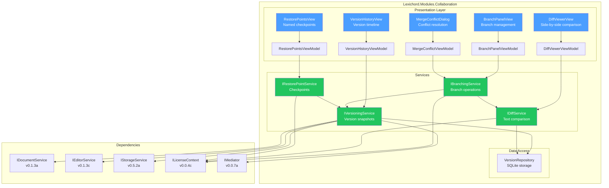
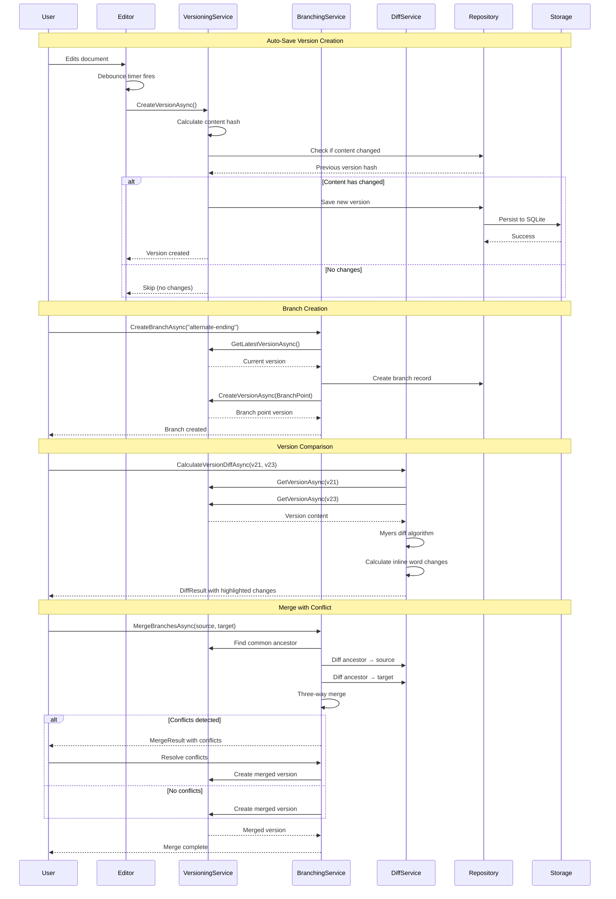

# LCS-SBD-094: Scope Breakdown — The Script Archive

## Document Control

| Field            | Value                                    |
| :--------------- | :--------------------------------------- |
| **Document ID**  | LCS-SBD-094                              |
| **Version**      | v0.9.4                                   |
| **Codename**     | The Script Archive (Version Control)     |
| **Status**       | Draft                                    |
| **Last Updated** | 2026-01-27                               |
| **Owner**        | Lead Architect                           |
| **Depends On**   | v0.1.3 (Editor Core), v0.5.2 (Document Storage), v0.8.3 (Git Integration) |

---

## 1. Executive Summary

### 1.1 The Vision

**v0.9.4** delivers the **Script Archive** — Git-like versioning for documents that enables writers to branch, compare, merge, and restore document versions with the same power and confidence that developers enjoy with source code. This release transforms Lexichord from a linear document editor into a comprehensive version-controlled writing platform, enabling collaborative teams to experiment with different narrative directions, compare manuscript revisions, and safely restore to any previous state.

Writers have long envied the version control capabilities available to programmers. With the Script Archive, Lexichord brings these powerful tools to the writing domain — allowing authors to create parallel versions of chapters, compare drafts side-by-side, merge the best elements from different revisions, and create named restore points for critical milestones like "Pre-Editor Review" or "Final Draft."

### 1.2 Business Value

- **Fearless Experimentation:** Writers can branch documents to try radical rewrites without risking their primary manuscript.
- **Revision Tracking:** Auto-save snapshots capture every significant change, creating a complete document history.
- **Collaborative Merging:** Teams can work on parallel versions and intelligently merge changes back together.
- **Visual Comparison:** Side-by-side diff viewer highlights exactly what changed between any two versions.
- **Milestone Protection:** Named restore points mark critical document states that can be recovered instantly.
- **Enterprise Compliance:** Complete audit trail of document changes for regulatory requirements.

### 1.3 Success Criteria

This release succeeds when:

1. Documents automatically create version snapshots on save with configurable frequency.
2. Users can create named branches from any version and switch between branches seamlessly.
3. The diff viewer displays side-by-side comparisons with inline change highlighting.
4. Branch merging intelligently combines changes with conflict detection and resolution UI.
5. Named restore points can be created, listed, and restored from any document.
6. All versioning features respect license gating (Teams+ for full functionality).

### 1.4 License Gating

The Script Archive is a **Teams** feature. Lower tiers will see:

- **Core:** Read-only version history (last 5 versions), no branching
- **WriterPro:** Version history (last 30 versions), manual restore points only
- **Teams:** Full feature access including branches, merging, unlimited history
- **Enterprise:** Teams features plus audit logging and compliance reporting

---

## 2. Dependencies on Prior Versions

| Component                | Source Version | Usage in v0.9.4                          |
| :----------------------- | :------------- | :--------------------------------------- |
| `IDocumentService`       | v0.1.3a        | Document loading and saving              |
| `IEditorService`         | v0.1.3c        | Editor content access                    |
| `Document`               | v0.1.3b        | Document entity model                    |
| `IStorageService`        | v0.5.2a        | Persisting version data                  |
| `IGitService`            | v0.8.3b        | Git operations inspiration               |
| `ILicenseContext`        | v0.0.4c        | License tier verification                |
| `IMediator`              | v0.0.7a        | Publishing version events                |
| `ISettingsService`       | v0.1.6a        | Auto-save configuration                  |
| `IDockLayoutService`     | v0.1.1a        | Diff viewer panel layout                 |
| `Serilog`                | v0.0.3b        | Logging version operations               |

---

## 3. Sub-Part Specifications

### 3.1 v0.9.4a: Document Versioning

| Field            | Value                                     |
| :--------------- | :---------------------------------------- |
| **Sub-Part ID**  | COL-094a                                  |
| **Title**        | Document Versioning (Auto-Save Snapshots) |
| **Module**       | `Lexichord.Modules.Collaboration`         |
| **License Tier** | Core (limited), WriterPro+                |

**Goal:** Implement automatic document versioning that captures snapshots on save and maintains a navigable version history.

**Key Deliverables:**

- `DocumentVersion` record representing a single version snapshot
- `IVersioningService` interface for version CRUD operations
- `VersionRepository` for SQLite-based version storage
- Auto-save integration with configurable snapshot frequency
- Version history panel showing all document versions
- Version preview functionality without checkout
- Version metadata (timestamp, word count delta, author)
- Migration script for `document_versions` table

**Key Interfaces:**

```csharp
namespace Lexichord.Abstractions.Contracts;

/// <summary>
/// Represents a single version snapshot of a document.
/// </summary>
public record DocumentVersion
{
    public Guid VersionId { get; init; }
    public Guid DocumentId { get; init; }
    public int VersionNumber { get; init; }
    public string Content { get; init; } = string.Empty;
    public string? ContentHash { get; init; }
    public DateTime CreatedAt { get; init; }
    public string? CreatedBy { get; init; }
    public string? BranchName { get; init; }
    public Guid? ParentVersionId { get; init; }
    public VersionType Type { get; init; }
    public string? Label { get; init; }
    public int WordCount { get; init; }
    public int WordCountDelta { get; init; }
}

public enum VersionType
{
    AutoSave,
    ManualSave,
    RestorePoint,
    BranchPoint,
    MergeResult
}

/// <summary>
/// Service for managing document version history.
/// </summary>
public interface IVersioningService
{
    /// <summary>
    /// Creates a new version snapshot for the document.
    /// </summary>
    Task<DocumentVersion> CreateVersionAsync(
        Guid documentId,
        string content,
        VersionType type,
        string? label = null,
        CancellationToken ct = default);

    /// <summary>
    /// Gets all versions for a document, ordered by creation date descending.
    /// </summary>
    Task<IReadOnlyList<DocumentVersion>> GetVersionHistoryAsync(
        Guid documentId,
        string? branchName = null,
        int? limit = null,
        CancellationToken ct = default);

    /// <summary>
    /// Gets a specific version by ID.
    /// </summary>
    Task<DocumentVersion?> GetVersionAsync(
        Guid versionId,
        CancellationToken ct = default);

    /// <summary>
    /// Gets the latest version for a document on a specific branch.
    /// </summary>
    Task<DocumentVersion?> GetLatestVersionAsync(
        Guid documentId,
        string? branchName = null,
        CancellationToken ct = default);

    /// <summary>
    /// Restores a document to a specific version.
    /// </summary>
    Task<DocumentVersion> RestoreVersionAsync(
        Guid documentId,
        Guid versionId,
        CancellationToken ct = default);

    /// <summary>
    /// Deletes old versions based on retention policy.
    /// </summary>
    Task<int> PruneVersionsAsync(
        Guid documentId,
        VersionRetentionPolicy policy,
        CancellationToken ct = default);
}

public record VersionRetentionPolicy(
    int MaxVersions = 100,
    TimeSpan? MaxAge = null,
    bool KeepRestorePoints = true,
    bool KeepBranchPoints = true);
```

**Key UI Components:**

```text
+------------------------------------------------------------------+
|  Version History                                           [x]    |
+------------------------------------------------------------------+
| [Search versions...]                    [Filter: All v]           |
+------------------------------------------------------------------+
| v23  Today, 2:34 PM         +142 words    Auto-save              |
|      "Added climax scene to chapter 5"                           |
|      [Preview] [Restore] [Create Branch]                         |
+------------------------------------------------------------------+
| v22  Today, 2:15 PM         -28 words     Auto-save              |
|      ...                                                          |
+------------------------------------------------------------------+
| v21  Today, 1:45 PM         +0 words      Restore Point          |
|      "Pre-Editor Review"                                          |
|      [Preview] [Restore] [Create Branch]                         |
+------------------------------------------------------------------+
| v20  Yesterday, 4:30 PM     +523 words    Manual Save            |
|      ...                                                          |
+------------------------------------------------------------------+
```

**Auto-Save Configuration:**

```csharp
public record VersioningSettings
{
    /// <summary>
    /// Minimum interval between auto-save snapshots.
    /// </summary>
    public TimeSpan AutoSaveInterval { get; init; } = TimeSpan.FromMinutes(5);

    /// <summary>
    /// Minimum character change threshold to trigger a new version.
    /// </summary>
    public int MinimumChangeThreshold { get; init; } = 50;

    /// <summary>
    /// Maximum versions to keep per document (0 = unlimited).
    /// </summary>
    public int MaxVersionsPerDocument { get; init; } = 100;

    /// <summary>
    /// Whether to compress old versions.
    /// </summary>
    public bool CompressOldVersions { get; init; } = true;
}
```

**Dependencies:**

- v0.1.3a: `IDocumentService` (document access)
- v0.1.3c: `IEditorService` (content capture)
- v0.5.2a: `IStorageService` (version persistence)

---

### 3.2 v0.9.4b: Branch/Merge

| Field            | Value                                     |
| :--------------- | :---------------------------------------- |
| **Sub-Part ID**  | COL-094b                                  |
| **Title**        | Branch/Merge (Parallel Document Versions) |
| **Module**       | `Lexichord.Modules.Collaboration`         |
| **License Tier** | Teams                                     |

**Goal:** Enable users to create parallel document versions (branches) and merge changes between branches with intelligent conflict detection.

**Key Deliverables:**

- `DocumentBranch` record representing a named branch
- `IBranchingService` interface for branch operations
- Branch creation from any version
- Branch switching with unsaved change detection
- Three-way merge algorithm for combining branches
- Conflict detection and resolution UI
- Branch comparison view
- Branch deletion with orphan prevention

**Key Interfaces:**

```csharp
namespace Lexichord.Abstractions.Contracts;

/// <summary>
/// Represents a named branch of a document.
/// </summary>
public record DocumentBranch
{
    public Guid BranchId { get; init; }
    public Guid DocumentId { get; init; }
    public string Name { get; init; } = string.Empty;
    public string? Description { get; init; }
    public Guid BaseVersionId { get; init; }
    public Guid HeadVersionId { get; init; }
    public DateTime CreatedAt { get; init; }
    public string? CreatedBy { get; init; }
    public bool IsDefault { get; init; }
    public BranchStatus Status { get; init; }
}

public enum BranchStatus
{
    Active,
    Merged,
    Abandoned
}

/// <summary>
/// Service for managing document branches.
/// </summary>
public interface IBranchingService
{
    /// <summary>
    /// Creates a new branch from a specific version.
    /// </summary>
    Task<DocumentBranch> CreateBranchAsync(
        Guid documentId,
        Guid baseVersionId,
        string branchName,
        string? description = null,
        CancellationToken ct = default);

    /// <summary>
    /// Gets all branches for a document.
    /// </summary>
    Task<IReadOnlyList<DocumentBranch>> GetBranchesAsync(
        Guid documentId,
        CancellationToken ct = default);

    /// <summary>
    /// Switches the active branch for a document.
    /// </summary>
    Task SwitchBranchAsync(
        Guid documentId,
        string branchName,
        CancellationToken ct = default);

    /// <summary>
    /// Merges a source branch into a target branch.
    /// </summary>
    Task<MergeResult> MergeBranchesAsync(
        Guid documentId,
        string sourceBranch,
        string targetBranch,
        MergeStrategy strategy = MergeStrategy.ThreeWay,
        CancellationToken ct = default);

    /// <summary>
    /// Gets the current active branch for a document.
    /// </summary>
    Task<DocumentBranch?> GetActiveBranchAsync(
        Guid documentId,
        CancellationToken ct = default);

    /// <summary>
    /// Deletes a branch (cannot delete default branch).
    /// </summary>
    Task DeleteBranchAsync(
        Guid documentId,
        string branchName,
        CancellationToken ct = default);

    /// <summary>
    /// Renames a branch.
    /// </summary>
    Task RenameBranchAsync(
        Guid documentId,
        string oldName,
        string newName,
        CancellationToken ct = default);
}

public enum MergeStrategy
{
    ThreeWay,
    Ours,
    Theirs,
    Manual
}

public record MergeResult
{
    public bool Success { get; init; }
    public DocumentVersion? MergedVersion { get; init; }
    public IReadOnlyList<MergeConflict> Conflicts { get; init; } = [];
    public MergeStatistics Statistics { get; init; } = new();
}

public record MergeConflict
{
    public int ConflictId { get; init; }
    public string BaseContent { get; init; } = string.Empty;
    public string OursContent { get; init; } = string.Empty;
    public string TheirsContent { get; init; } = string.Empty;
    public int StartLine { get; init; }
    public int EndLine { get; init; }
    public ConflictType Type { get; init; }
    public string? Resolution { get; init; }
    public ConflictResolutionChoice? ResolutionChoice { get; init; }
}

public enum ConflictType
{
    TextModification,
    Deletion,
    Insertion,
    Reordering
}

public enum ConflictResolutionChoice
{
    AcceptOurs,
    AcceptTheirs,
    AcceptBoth,
    Manual
}

public record MergeStatistics
{
    public int LinesAdded { get; init; }
    public int LinesRemoved { get; init; }
    public int LinesModified { get; init; }
    public int ConflictsDetected { get; init; }
    public int ConflictsResolved { get; init; }
}
```

**Key UI Components:**

```text
+------------------------------------------------------------------+
|  Branches                                              [+ New]    |
+------------------------------------------------------------------+
| * main                                      HEAD                  |
|   Created: Jan 15, 2026     Versions: 23                         |
+------------------------------------------------------------------+
|   alternate-ending                          3 versions ahead      |
|   Created: Jan 20, 2026     Versions: 8                          |
|   [Switch] [Compare to main] [Merge into main] [Delete]          |
+------------------------------------------------------------------+
|   experimental-chapter-5                    Merged                |
|   Created: Jan 18, 2026     Merged: Jan 22, 2026                 |
+------------------------------------------------------------------+

Merge Conflict Resolution Dialog:
+------------------------------------------------------------------+
|  Merge Conflicts (2 remaining)                             [x]    |
+------------------------------------------------------------------+
| Conflict 1 of 2: Lines 45-52                                     |
+------------------------------------------------------------------+
| BASE (common ancestor):                                           |
| The hero walked slowly through the dark forest.                   |
+------------------------------------------------------------------+
| OURS (main):                                                      |
| The hero sprinted desperately through the haunted forest.         |
+------------------------------------------------------------------+
| THEIRS (alternate-ending):                                        |
| The hero crept silently through the ancient woods.                |
+------------------------------------------------------------------+
| [Accept Ours] [Accept Theirs] [Accept Both] [Edit Manually]      |
+------------------------------------------------------------------+
| RESOLUTION PREVIEW:                                               |
| [Editable text area for manual resolution]                        |
+------------------------------------------------------------------+
|                            [Previous] [Next] [Finish Merge]       |
+------------------------------------------------------------------+
```

**Three-Way Merge Algorithm:**

```text
THREE-WAY MERGE:
│
├── Find common ancestor (base version)
├── Calculate diff: base → ours
├── Calculate diff: base → theirs
│
├── FOR each change region:
│   ├── Change only in OURS?
│   │   └── Accept ours change
│   ├── Change only in THEIRS?
│   │   └── Accept theirs change
│   ├── Same change in BOTH?
│   │   └── Accept (no conflict)
│   └── Different changes in BOTH?
│       └── CONFLICT - mark for resolution
│
└── Generate merged content with conflict markers
```

**Dependencies:**

- v0.9.4a: `IVersioningService` (version management)
- v0.9.4c: `IDiffService` (diff calculation for merging)

---

### 3.3 v0.9.4c: Diff Viewer

| Field            | Value                                     |
| :--------------- | :---------------------------------------- |
| **Sub-Part ID**  | COL-094c                                  |
| **Title**        | Diff Viewer (Compare Any Two Versions)    |
| **Module**       | `Lexichord.Modules.Collaboration`         |
| **License Tier** | WriterPro                                 |

**Goal:** Create a visual diff viewer that displays side-by-side comparisons of any two document versions with inline change highlighting.

**Key Deliverables:**

- `IDiffService` interface for calculating text differences
- `DiffResult` record with line-by-line change information
- Side-by-side diff view with synchronized scrolling
- Inline diff view with change highlighting
- Word-level and character-level diff granularity
- Navigation between changes (next/previous)
- Change statistics summary
- Export diff as HTML report

**Key Interfaces:**

```csharp
namespace Lexichord.Abstractions.Contracts;

/// <summary>
/// Result of comparing two text versions.
/// </summary>
public record DiffResult
{
    public IReadOnlyList<DiffLine> Lines { get; init; } = [];
    public DiffStatistics Statistics { get; init; } = new();
    public string LeftTitle { get; init; } = string.Empty;
    public string RightTitle { get; init; } = string.Empty;
}

public record DiffLine
{
    public int? LeftLineNumber { get; init; }
    public int? RightLineNumber { get; init; }
    public string? LeftContent { get; init; }
    public string? RightContent { get; init; }
    public DiffLineType Type { get; init; }
    public IReadOnlyList<DiffSegment>? InlineChanges { get; init; }
}

public enum DiffLineType
{
    Unchanged,
    Added,
    Removed,
    Modified
}

public record DiffSegment
{
    public string Content { get; init; } = string.Empty;
    public DiffSegmentType Type { get; init; }
    public int StartIndex { get; init; }
    public int Length { get; init; }
}

public enum DiffSegmentType
{
    Unchanged,
    Added,
    Removed
}

public record DiffStatistics
{
    public int TotalLines { get; init; }
    public int AddedLines { get; init; }
    public int RemovedLines { get; init; }
    public int ModifiedLines { get; init; }
    public int UnchangedLines { get; init; }
    public int AddedWords { get; init; }
    public int RemovedWords { get; init; }
    public int AddedCharacters { get; init; }
    public int RemovedCharacters { get; init; }
}

/// <summary>
/// Service for calculating differences between document versions.
/// </summary>
public interface IDiffService
{
    /// <summary>
    /// Calculates the difference between two text contents.
    /// </summary>
    DiffResult CalculateDiff(
        string leftContent,
        string rightContent,
        DiffOptions? options = null);

    /// <summary>
    /// Calculates the difference between two document versions.
    /// </summary>
    Task<DiffResult> CalculateVersionDiffAsync(
        Guid leftVersionId,
        Guid rightVersionId,
        DiffOptions? options = null,
        CancellationToken ct = default);

    /// <summary>
    /// Exports the diff result as an HTML report.
    /// </summary>
    Task<string> ExportDiffAsHtmlAsync(
        DiffResult diff,
        DiffExportOptions? options = null,
        CancellationToken ct = default);
}

public record DiffOptions
{
    /// <summary>
    /// Granularity of diff calculation.
    /// </summary>
    public DiffGranularity Granularity { get; init; } = DiffGranularity.Line;

    /// <summary>
    /// Whether to ignore whitespace changes.
    /// </summary>
    public bool IgnoreWhitespace { get; init; } = false;

    /// <summary>
    /// Whether to ignore case differences.
    /// </summary>
    public bool IgnoreCase { get; init; } = false;

    /// <summary>
    /// Number of context lines around changes.
    /// </summary>
    public int ContextLines { get; init; } = 3;

    /// <summary>
    /// Whether to calculate word-level inline changes.
    /// </summary>
    public bool CalculateInlineChanges { get; init; } = true;
}

public enum DiffGranularity
{
    Character,
    Word,
    Line,
    Paragraph
}

public record DiffExportOptions
{
    public bool IncludeStatistics { get; init; } = true;
    public bool IncludeLineNumbers { get; init; } = true;
    public string Theme { get; init; } = "default";
}
```

**Key UI Components:**

```text
+------------------------------------------------------------------+
|  Compare Versions                                          [x]    |
+------------------------------------------------------------------+
| Left: v21 (Jan 20, 2:15 PM)     Right: v23 (Jan 20, 2:34 PM)     |
| [< Select Version]             [Select Version >]                 |
| [Swap Sides]  [Side-by-Side | Inline]  [Ignore Whitespace]       |
+------------------------------------------------------------------+
| Statistics: +142 words, -28 words, 12 lines changed              |
| [< Previous Change]  Change 3 of 12  [Next Change >]              |
+------------------------------------------------------------------+
|  v21 (Pre-Editor Review)     |  v23 (Current)                    |
+---------------------------------+---------------------------------+
| 43  The hero walked slowly   | 43  The hero walked slowly      |
| 44  through the dark forest. | 44  through the dark forest.    |
| 45  He paused at the edge    | 45  He paused at the ancient    | <- Modified
|     of the clearing.         |     gate's threshold.            |
| 46                           | 46                                |
| 47  "Who goes there?" a      | 47  "Who goes there?" a         |
|     voice called out.        |     voice called out.            |
|                              | 48  The hero drew his sword.     | <- Added
|                              | 49  "A friend," he replied.      | <- Added
| 48  The moon rose higher.    | 50  The moon rose higher.       |
+---------------------------------+---------------------------------+
|                             [Export as HTML] [Close]              |
+------------------------------------------------------------------+

Color Legend:
- Green background: Added lines/words
- Red background: Removed lines/words
- Yellow background: Modified lines
- Blue highlight: Currently selected change
```

**Diff Algorithm (Myers Algorithm):**

```text
MYERS DIFF ALGORITHM:
│
├── Build edit graph from source to target
├── Find shortest edit script using D-band search
│
├── FOR each operation in edit script:
│   ├── DELETE: Mark line as removed (red)
│   ├── INSERT: Mark line as added (green)
│   └── EQUAL: Mark line as unchanged
│
├── FOR modified lines (adjacent delete + insert):
│   ├── Calculate word-level diff
│   └── Highlight changed words inline
│
└── Generate DiffResult with all changes
```

**Dependencies:**

- v0.9.4a: `IVersioningService` (accessing version content)

---

### 3.4 v0.9.4d: Restore Points

| Field            | Value                                     |
| :--------------- | :---------------------------------------- |
| **Sub-Part ID**  | COL-094d                                  |
| **Title**        | Restore Points (Named Checkpoints)        |
| **Module**       | `Lexichord.Modules.Collaboration`         |
| **License Tier** | WriterPro                                 |

**Goal:** Enable users to create named restore points (checkpoints) at significant document milestones that can be easily identified and restored.

**Key Deliverables:**

- `RestorePoint` record extending version with metadata
- `IRestorePointService` interface for restore point management
- Create restore point dialog with name and description
- Restore point list view with quick restore
- Restore point comparison with current version
- Protected restore points (cannot be auto-pruned)
- Restore point export/import
- Suggested restore point names based on context

**Key Interfaces:**

```csharp
namespace Lexichord.Abstractions.Contracts;

/// <summary>
/// A named checkpoint in the document history.
/// </summary>
public record RestorePoint
{
    public Guid RestorePointId { get; init; }
    public Guid DocumentId { get; init; }
    public Guid VersionId { get; init; }
    public string Name { get; init; } = string.Empty;
    public string? Description { get; init; }
    public DateTime CreatedAt { get; init; }
    public string? CreatedBy { get; init; }
    public RestorePointType Type { get; init; }
    public bool IsProtected { get; init; }
    public IReadOnlyDictionary<string, string>? Metadata { get; init; }
}

public enum RestorePointType
{
    Manual,
    Milestone,
    PreExport,
    PreMerge,
    Automated
}

/// <summary>
/// Service for managing document restore points.
/// </summary>
public interface IRestorePointService
{
    /// <summary>
    /// Creates a new restore point at the current version.
    /// </summary>
    Task<RestorePoint> CreateRestorePointAsync(
        Guid documentId,
        string name,
        string? description = null,
        RestorePointType type = RestorePointType.Manual,
        CancellationToken ct = default);

    /// <summary>
    /// Gets all restore points for a document.
    /// </summary>
    Task<IReadOnlyList<RestorePoint>> GetRestorePointsAsync(
        Guid documentId,
        CancellationToken ct = default);

    /// <summary>
    /// Gets a specific restore point by ID.
    /// </summary>
    Task<RestorePoint?> GetRestorePointAsync(
        Guid restorePointId,
        CancellationToken ct = default);

    /// <summary>
    /// Restores a document to a specific restore point.
    /// </summary>
    Task<DocumentVersion> RestoreToPointAsync(
        Guid documentId,
        Guid restorePointId,
        CancellationToken ct = default);

    /// <summary>
    /// Updates a restore point's metadata.
    /// </summary>
    Task<RestorePoint> UpdateRestorePointAsync(
        Guid restorePointId,
        string? name = null,
        string? description = null,
        bool? isProtected = null,
        CancellationToken ct = default);

    /// <summary>
    /// Deletes a restore point (unless protected).
    /// </summary>
    Task DeleteRestorePointAsync(
        Guid restorePointId,
        CancellationToken ct = default);

    /// <summary>
    /// Gets suggested names for a new restore point.
    /// </summary>
    Task<IReadOnlyList<string>> GetSuggestedNamesAsync(
        Guid documentId,
        CancellationToken ct = default);

    /// <summary>
    /// Exports a restore point to a standalone file.
    /// </summary>
    Task<byte[]> ExportRestorePointAsync(
        Guid restorePointId,
        CancellationToken ct = default);

    /// <summary>
    /// Imports a restore point from an exported file.
    /// </summary>
    Task<RestorePoint> ImportRestorePointAsync(
        Guid documentId,
        byte[] data,
        CancellationToken ct = default);
}
```

**Key UI Components:**

```text
+------------------------------------------------------------------+
|  Restore Points                                    [+ Create New] |
+------------------------------------------------------------------+
| [Search restore points...]                                        |
+------------------------------------------------------------------+
| [*] Final Draft                                     Jan 25, 2026  |
|     "Ready for publication"                          Protected   |
|     Word count: 45,230                                           |
|     [Preview] [Compare to Current] [Restore] [Export]            |
+------------------------------------------------------------------+
| [ ] Post-Editor Review                              Jan 22, 2026  |
|     "Incorporated all editor feedback"                           |
|     Word count: 44,892                                           |
|     [Preview] [Compare to Current] [Restore] [Export] [Delete]   |
+------------------------------------------------------------------+
| [ ] Pre-Editor Review                               Jan 20, 2026  |
|     "Submitted to editor for first pass"                         |
|     Word count: 43,150                                           |
|     [Preview] [Compare to Current] [Restore] [Export] [Delete]   |
+------------------------------------------------------------------+
| [ ] First Draft Complete                            Jan 15, 2026  |
|     "Completed initial manuscript"                                |
|     Word count: 41,200                                           |
|     [Preview] [Compare to Current] [Restore] [Export] [Delete]   |
+------------------------------------------------------------------+

Create Restore Point Dialog:
+------------------------------------------------------------------+
|  Create Restore Point                                      [x]    |
+------------------------------------------------------------------+
| Name:  [Final Draft                                         ]     |
|                                                                   |
| Suggested: First Draft Complete, Pre-Editor Review,              |
|            Post-Editor Review, Final Draft                        |
+------------------------------------------------------------------+
| Description (optional):                                           |
| [Ready for publication. All editor feedback incorporated.    ]    |
| [                                                            ]    |
+------------------------------------------------------------------+
| [ ] Protect this restore point (cannot be deleted)               |
+------------------------------------------------------------------+
| Current version: v23 (45,230 words)                              |
| Branch: main                                                      |
+------------------------------------------------------------------+
|                              [Cancel] [Create Restore Point]      |
+------------------------------------------------------------------+
```

**Suggested Names Logic:**

```text
SUGGEST RESTORE POINT NAME:
│
├── Document title + " Draft 1/2/3..."
├── Previous restore point names + increment
├── Common milestone patterns:
│   ├── "First Draft Complete"
│   ├── "Pre-Editor Review"
│   ├── "Post-Editor Review"
│   ├── "Final Draft"
│   └── "Published Version"
├── Date-based: "Backup YYYY-MM-DD"
│
└── Context-aware (if metadata available):
    ├── "Pre-Chapter X Rewrite"
    ├── "After Beta Reader Feedback"
    └── "Version for [Recipient]"
```

**Dependencies:**

- v0.9.4a: `IVersioningService` (version creation and access)
- v0.9.4c: `IDiffService` (comparison with current)

---

## 4. Implementation Checklist

| #  | Sub-Part | Task                                            | Est. Hours |
| :- | :------- | :---------------------------------------------- | :--------- |
| 1  | v0.9.4a  | Create `DocumentVersion` record                 | 0.5        |
| 2  | v0.9.4a  | Create `IVersioningService` interface           | 1          |
| 3  | v0.9.4a  | Implement `VersioningService`                   | 3          |
| 4  | v0.9.4a  | Create `VersionRepository` with SQLite          | 2          |
| 5  | v0.9.4a  | Database migration for `document_versions`      | 1          |
| 6  | v0.9.4a  | Integrate with auto-save system                 | 2          |
| 7  | v0.9.4a  | Create `VersionHistoryView.axaml`               | 3          |
| 8  | v0.9.4a  | Create `VersionHistoryViewModel`                | 2          |
| 9  | v0.9.4a  | Version preview panel                           | 2          |
| 10 | v0.9.4a  | Unit tests for `VersioningService`              | 2          |
| 11 | v0.9.4b  | Create `DocumentBranch` record                  | 0.5        |
| 12 | v0.9.4b  | Create `IBranchingService` interface            | 1          |
| 13 | v0.9.4b  | Implement `BranchingService`                    | 4          |
| 14 | v0.9.4b  | Implement three-way merge algorithm             | 6          |
| 15 | v0.9.4b  | Create `BranchPanelView.axaml`                  | 3          |
| 16 | v0.9.4b  | Create `MergeConflictDialog.axaml`              | 4          |
| 17 | v0.9.4b  | Create `MergeConflictViewModel`                 | 3          |
| 18 | v0.9.4b  | Unit tests for merge algorithm                  | 3          |
| 19 | v0.9.4c  | Create `DiffResult` and related records         | 1          |
| 20 | v0.9.4c  | Create `IDiffService` interface                 | 0.5        |
| 21 | v0.9.4c  | Implement Myers diff algorithm                  | 4          |
| 22 | v0.9.4c  | Implement word-level inline diff                | 2          |
| 23 | v0.9.4c  | Create `DiffViewerView.axaml`                   | 4          |
| 24 | v0.9.4c  | Create `DiffViewerViewModel`                    | 3          |
| 25 | v0.9.4c  | Synchronized scroll behavior                    | 2          |
| 26 | v0.9.4c  | HTML export functionality                       | 2          |
| 27 | v0.9.4c  | Unit tests for diff algorithm                   | 2          |
| 28 | v0.9.4d  | Create `RestorePoint` record                    | 0.5        |
| 29 | v0.9.4d  | Create `IRestorePointService` interface         | 1          |
| 30 | v0.9.4d  | Implement `RestorePointService`                 | 2          |
| 31 | v0.9.4d  | Create `RestorePointsView.axaml`                | 2          |
| 32 | v0.9.4d  | Create `CreateRestorePointDialog.axaml`         | 2          |
| 33 | v0.9.4d  | Suggested names implementation                  | 1          |
| 34 | v0.9.4d  | Export/import functionality                     | 2          |
| 35 | v0.9.4d  | Unit tests for `RestorePointService`            | 2          |
| 36 | All      | Integration tests                               | 4          |
| 37 | All      | DI registration in CollaborationModule          | 1          |
| 38 | All      | License gating implementation                   | 2          |
| **Total** |   |                                                 | **80 hours** |

---

## 5. Dependency Matrix

### 5.1 Required Interfaces (from earlier versions)

| Interface                | Source Version | Purpose                              |
| :----------------------- | :------------- | :----------------------------------- |
| `IDocumentService`       | v0.1.3a        | Document CRUD operations             |
| `IEditorService`         | v0.1.3c        | Access editor content                |
| `IStorageService`        | v0.5.2a        | Persist version data                 |
| `ILicenseContext`        | v0.0.4c        | Check license tier                   |
| `IMediator`              | v0.0.7a        | Publish events                       |
| `ISettingsService`       | v0.1.6a        | User preferences                     |

### 5.2 New Interfaces (defined in v0.9.4)

| Interface                   | Defined In | Module               | Purpose                 |
| :-------------------------- | :--------- | :------------------- | :---------------------- |
| `IVersioningService`        | v0.9.4a    | Collaboration        | Version management      |
| `IBranchingService`         | v0.9.4b    | Collaboration        | Branch operations       |
| `IDiffService`              | v0.9.4c    | Collaboration        | Text comparison         |
| `IRestorePointService`      | v0.9.4d    | Collaboration        | Named checkpoints       |

### 5.3 New Records/DTOs (defined in v0.9.4)

| Record                   | Defined In | Purpose                                |
| :----------------------- | :--------- | :------------------------------------- |
| `DocumentVersion`        | v0.9.4a    | Single version snapshot                |
| `VersionRetentionPolicy` | v0.9.4a    | Version cleanup rules                  |
| `DocumentBranch`         | v0.9.4b    | Named parallel version                 |
| `MergeResult`            | v0.9.4b    | Merge operation outcome                |
| `MergeConflict`          | v0.9.4b    | Conflict details                       |
| `DiffResult`             | v0.9.4c    | Comparison output                      |
| `DiffLine`               | v0.9.4c    | Single line diff                       |
| `DiffStatistics`         | v0.9.4c    | Change summary                         |
| `RestorePoint`           | v0.9.4d    | Named checkpoint                       |

### 5.4 NuGet Packages

| Package                | Version | Purpose                    | New/Existing |
| :--------------------- | :------ | :------------------------- | :----------- |
| `DiffPlex`             | 1.7.x   | Diff algorithm library     | New          |
| `System.IO.Hashing`    | 8.x     | Content hashing            | New          |

---

## 6. Architecture Diagram



---

## 7. Data Flow Diagram



---

## 8. Risks & Mitigations

| Risk | Impact | Probability | Mitigation |
| :--- | :----- | :---------- | :--------- |
| Large document version storage | High | Medium | Implement delta compression for consecutive versions |
| Merge algorithm complexity | High | Medium | Start with simple line-based merge, iterate |
| UI performance with many versions | Medium | Medium | Virtual scrolling, lazy load version content |
| Data corruption during merge | High | Low | Create backup restore point before any merge |
| Concurrent edit conflicts | Medium | Low | Lock document during branch operations |
| Memory usage with large diffs | Medium | Medium | Stream diff calculation, limit preview size |

---

## 9. Success Metrics

| Metric | Target | Measurement |
| :----- | :----- | :---------- |
| Version creation time | < 100ms | Stopwatch timing |
| Diff calculation (10K lines) | < 500ms | Benchmark tests |
| Branch switch time | < 200ms | User action to content display |
| Merge (simple, no conflicts) | < 1s | End-to-end timing |
| Version history load (100 versions) | < 300ms | Panel open to display |
| Storage overhead per version | < 20% | Compressed delta size vs full content |

---

## 10. What This Enables

After v0.9.4, Lexichord will support:

- **v0.9.5:** Startup optimization can leverage version caching
- **v1.0.x:** Real-time collaborative editing with operational transforms
- **v1.1.x:** Cloud sync with version conflict resolution
- **Future:** AI-powered version summarization ("What changed in this version?")

---

## 11. Decision Trees

### 11.1 Should Create New Version?

```text
START: "Editor content changed"
│
├── Time since last version > AutoSaveInterval?
│   ├── NO → Skip (too soon)
│   └── YES → Continue
│
├── Character change count > MinimumChangeThreshold?
│   ├── NO → Skip (minor change)
│   └── YES → Continue
│
├── Content hash different from last version?
│   ├── NO → Skip (no actual change)
│   └── YES → CREATE VERSION
│
└── Return: VersionCreated or Skipped
```

### 11.2 Merge Conflict Detection

```text
START: "Three-way merge"
│
├── Get change regions from base → ours
├── Get change regions from base → theirs
│
├── FOR each overlapping region:
│   ├── Both made identical changes?
│   │   └── NO CONFLICT (accept either)
│   ├── Only one side changed?
│   │   └── NO CONFLICT (accept change)
│   └── Different changes to same region?
│       └── CONFLICT (mark for resolution)
│
└── Return: List of conflicts
```

---

## 12. User Stories

| ID    | Role            | Story                                                       | Acceptance Criteria                    |
| :---- | :-------------- | :---------------------------------------------------------- | :------------------------------------- |
| US-01 | Writer          | As a writer, I want my document to save versions automatically so I never lose work. | Versions created on save, visible in history |
| US-02 | Writer          | As a writer, I want to preview old versions without losing my current work. | Preview panel shows read-only content |
| US-03 | Writer          | As a writer, I want to restore to any previous version. | Restore creates new version, content updated |
| US-04 | Writer          | As a writer, I want to try a radical rewrite without risking my manuscript. | Branch creation, switch, independent editing |
| US-05 | Writer          | As a writer, I want to see exactly what changed between two versions. | Diff viewer with highlighting |
| US-06 | Writer          | As a writer, I want to mark important milestones I can easily return to. | Named restore points with descriptions |
| US-07 | Team Lead       | As a team lead, I want to merge team members' parallel edits. | Three-way merge with conflict resolution |
| US-08 | Enterprise User | As an enterprise user, I need audit trail of all document changes. | Version history with timestamps and authors |

---

## 13. Use Cases

### UC-01: Auto-Save Version Creation

**Preconditions:**

- Document is open in editor
- Auto-save is enabled in settings

**Flow:**

1. User edits document content.
2. System detects content change.
3. System waits for auto-save interval (default 5 minutes).
4. System calculates content hash.
5. System compares to previous version hash.
6. If different, system creates new `DocumentVersion`.
7. System displays subtle save indicator.
8. Version appears in version history panel.

**Postconditions:**

- New version saved to database
- Version history updated

---

### UC-02: Branch Creation and Merge

**Preconditions:**

- Document has version history
- User has Teams license

**Flow:**

1. User clicks "Create Branch" from version panel.
2. System prompts for branch name.
3. User enters "alternate-ending".
4. System creates branch from current version.
5. User switches to new branch.
6. User makes edits on branch.
7. User clicks "Merge into main".
8. System performs three-way merge.
9. If conflicts exist, system shows conflict resolution dialog.
10. User resolves conflicts.
11. System creates merged version on main branch.

**Postconditions:**

- Branch merged into main
- Conflict resolutions applied
- New version on main includes all changes

---

## 14. Unit Testing Requirements

### 14.1 VersioningService Tests

```csharp
[Trait("Category", "Unit")]
[Trait("Version", "v0.9.4a")]
public class VersioningServiceTests
{
    [Fact]
    public async Task CreateVersionAsync_NewContent_CreatesVersion()
    {
        // Arrange
        var sut = CreateVersioningService();
        var documentId = Guid.NewGuid();
        var content = "Test content";

        // Act
        var result = await sut.CreateVersionAsync(
            documentId, content, VersionType.AutoSave);

        // Assert
        result.Should().NotBeNull();
        result.VersionNumber.Should().Be(1);
        result.Content.Should().Be(content);
    }

    [Fact]
    public async Task CreateVersionAsync_IdenticalContent_SkipsCreation()
    {
        // Arrange
        var sut = CreateVersioningService();
        var documentId = Guid.NewGuid();
        var content = "Test content";
        await sut.CreateVersionAsync(documentId, content, VersionType.AutoSave);

        // Act
        var result = await sut.CreateVersionAsync(
            documentId, content, VersionType.AutoSave);

        // Assert
        result.VersionNumber.Should().Be(1); // Same version returned
    }

    [Fact]
    public async Task GetVersionHistoryAsync_MultipleVersions_ReturnsOrderedByDate()
    {
        // Arrange
        var sut = CreateVersioningService();
        var documentId = Guid.NewGuid();
        await sut.CreateVersionAsync(documentId, "V1", VersionType.AutoSave);
        await sut.CreateVersionAsync(documentId, "V2", VersionType.AutoSave);
        await sut.CreateVersionAsync(documentId, "V3", VersionType.AutoSave);

        // Act
        var result = await sut.GetVersionHistoryAsync(documentId);

        // Assert
        result.Should().HaveCount(3);
        result[0].VersionNumber.Should().Be(3); // Most recent first
        result[2].VersionNumber.Should().Be(1);
    }
}
```

### 14.2 DiffService Tests

```csharp
[Trait("Category", "Unit")]
[Trait("Version", "v0.9.4c")]
public class DiffServiceTests
{
    [Fact]
    public void CalculateDiff_IdenticalContent_NoChanges()
    {
        // Arrange
        var sut = new DiffService();
        var content = "Line 1\nLine 2\nLine 3";

        // Act
        var result = sut.CalculateDiff(content, content);

        // Assert
        result.Statistics.AddedLines.Should().Be(0);
        result.Statistics.RemovedLines.Should().Be(0);
        result.Lines.Should().OnlyContain(l => l.Type == DiffLineType.Unchanged);
    }

    [Fact]
    public void CalculateDiff_AddedLine_MarksAsAdded()
    {
        // Arrange
        var sut = new DiffService();
        var left = "Line 1\nLine 2";
        var right = "Line 1\nLine 2\nLine 3";

        // Act
        var result = sut.CalculateDiff(left, right);

        // Assert
        result.Statistics.AddedLines.Should().Be(1);
        result.Lines.Should().Contain(l =>
            l.Type == DiffLineType.Added && l.RightContent == "Line 3");
    }

    [Fact]
    public void CalculateDiff_RemovedLine_MarksAsRemoved()
    {
        // Arrange
        var sut = new DiffService();
        var left = "Line 1\nLine 2\nLine 3";
        var right = "Line 1\nLine 3";

        // Act
        var result = sut.CalculateDiff(left, right);

        // Assert
        result.Statistics.RemovedLines.Should().Be(1);
        result.Lines.Should().Contain(l =>
            l.Type == DiffLineType.Removed && l.LeftContent == "Line 2");
    }

    [Theory]
    [InlineData("hello world", "hello there", "hello ")]
    [InlineData("the quick fox", "the slow fox", "the ", " fox")]
    public void CalculateDiff_ModifiedLine_CalculatesInlineChanges(
        string left, string right, params string[] expectedUnchanged)
    {
        // Arrange
        var sut = new DiffService();

        // Act
        var result = sut.CalculateDiff(left, right,
            new DiffOptions { CalculateInlineChanges = true });

        // Assert
        var modifiedLine = result.Lines.First(l => l.Type == DiffLineType.Modified);
        modifiedLine.InlineChanges.Should().NotBeNull();
        foreach (var expected in expectedUnchanged)
        {
            modifiedLine.InlineChanges.Should().Contain(s =>
                s.Type == DiffSegmentType.Unchanged && s.Content == expected);
        }
    }
}
```

---

## 15. Observability & Logging

| Level   | Source              | Message Template                                              |
| :------ | :------------------ | :------------------------------------------------------------ |
| Debug   | VersioningService   | `"Version check: Document {DocumentId}, hash {Hash}"`         |
| Info    | VersioningService   | `"Created version {VersionNumber} for document {DocumentId}"` |
| Info    | BranchingService    | `"Created branch '{BranchName}' from version {VersionId}"`    |
| Info    | BranchingService    | `"Merged {SourceBranch} into {TargetBranch}, {ConflictCount} conflicts"` |
| Warning | BranchingService    | `"Merge conflict detected at lines {StartLine}-{EndLine}"`    |
| Info    | RestorePointService | `"Created restore point '{Name}' for document {DocumentId}"`  |
| Info    | RestorePointService | `"Restored document {DocumentId} to restore point '{Name}'"` |
| Error   | VersioningService   | `"Failed to create version: {Error}"`                        |

---

## 16. UI/UX Specifications

### 16.1 Version History Panel Layout

```text
┌──────────────────────────────────────────────────────────────────────────┐
│  Version History                                                   [x]   │ ← Toolbar
├──────────────────────────────────────────────────────────────────────────┤
│  [Search versions...]                     Branch: [main v]    [Filter v] │
├──────────────────────────────────────────────────────────────────────────┤
│  ┌────────────────────────────────────────────────────────────────────┐ │
│  │ Timeline (virtual scrolling list)                                  │ │
│  │ ● v23  Today, 2:34 PM     +142 words    [Auto-save]               │ │
│  │   └─ [Preview] [Restore] [Compare] [Create Branch]                │ │
│  │ ● v22  Today, 2:15 PM     -28 words     [Auto-save]               │ │
│  │   └─ ...                                                           │ │
│  │ ★ v21  Today, 1:45 PM     [Restore Point: Pre-Editor Review]      │ │
│  │   └─ [Preview] [Restore] [Compare] [Create Branch]                │ │
│  └────────────────────────────────────────────────────────────────────┘ │
├──────────────────────────────────────────────────────────────────────────┤
│  Selected: v23    Words: 45,230    Created: Today at 2:34 PM           │
└──────────────────────────────────────────────────────────────────────────┘
```

### 16.2 Component Styling Requirements

| Component           | Theme Resource             | Notes                            |
| :------------------ | :------------------------- | :------------------------------- |
| Version list item   | `Brush.Surface.Secondary`  | Hover highlight                  |
| Restore point badge | `Brush.Accent.Primary`     | Star icon                        |
| Branch indicator    | `Brush.Accent.Secondary`   | Branch icon                      |
| Diff added          | `Brush.Success.Light`      | Green background                 |
| Diff removed        | `Brush.Error.Light`        | Red background                   |
| Diff modified       | `Brush.Warning.Light`      | Yellow background                |
| Conflict marker     | `Brush.Error.Primary`      | Red border                       |

---

## 17. Acceptance Criteria (QA)

| #   | Category            | Criterion                                                    |
| :-- | :------------------ | :----------------------------------------------------------- |
| 1   | **Versioning**      | Auto-save creates version after configured interval          |
| 2   | **Versioning**      | Version history shows all versions in descending order       |
| 3   | **Versioning**      | Preview shows version content without modifying document     |
| 4   | **Versioning**      | Restore creates new version and updates editor content       |
| 5   | **Branching**       | Create branch from any version                               |
| 6   | **Branching**       | Switch branches updates editor content                       |
| 7   | **Branching**       | Merge combines changes from source into target               |
| 8   | **Branching**       | Conflicts detected and resolution dialog appears             |
| 9   | **Diff**            | Side-by-side view shows both versions                        |
| 10  | **Diff**            | Added lines highlighted green                                |
| 11  | **Diff**            | Removed lines highlighted red                                |
| 12  | **Diff**            | Navigate between changes works correctly                     |
| 13  | **Restore Points**  | Create named restore point with description                  |
| 14  | **Restore Points**  | Protected restore points cannot be deleted                   |
| 15  | **License Gate**    | Core tier: Max 5 versions, no branching                      |
| 16  | **License Gate**    | WriterPro tier: Max 30 versions, no branching                |
| 17  | **License Gate**    | Teams tier: Unlimited versions, full branching               |
| 18  | **Performance**     | Version creation < 100ms                                     |
| 19  | **Performance**     | Diff calculation (10K lines) < 500ms                         |

---

## 18. Verification Commands

```bash
# ═══════════════════════════════════════════════════════════════════════════
# v0.9.4 Verification
# ═══════════════════════════════════════════════════════════════════════════

# 1. Verify NuGet packages installed
dotnet list src/Lexichord.Modules.Collaboration package | grep -E "DiffPlex|System.IO.Hashing"

# 2. Build solution
dotnet build

# 3. Run unit tests for v0.9.4 components
dotnet test --filter "Category=Unit&FullyQualifiedName~Versioning"
dotnet test --filter "Category=Unit&FullyQualifiedName~Branching"
dotnet test --filter "Category=Unit&FullyQualifiedName~Diff"
dotnet test --filter "Category=Unit&FullyQualifiedName~RestorePoint"

# 4. Run all v0.9.4 tests
dotnet test --filter "Version~v0.9.4"

# 5. Manual verification:
# a) Open document, edit, wait for auto-save, verify version created
# b) Create branch, switch branches, verify content changes
# c) Compare two versions, verify diff highlighting
# d) Create restore point, verify in list, restore to it
# e) Test license gating with Core vs Teams license
```

---

## 19. Deliverable Checklist

| #  | Deliverable                                                    | Status |
| :- | :------------------------------------------------------------- | :----- |
| 1  | `DocumentVersion` record                                       | [ ]    |
| 2  | `IVersioningService` interface and implementation              | [ ]    |
| 3  | `VersionRepository` with SQLite                                | [ ]    |
| 4  | `VersionHistoryView.axaml` and ViewModel                       | [ ]    |
| 5  | Auto-save integration                                          | [ ]    |
| 6  | `DocumentBranch` record                                        | [ ]    |
| 7  | `IBranchingService` interface and implementation               | [ ]    |
| 8  | Three-way merge algorithm                                      | [ ]    |
| 9  | `BranchPanelView.axaml` and ViewModel                          | [ ]    |
| 10 | `MergeConflictDialog.axaml` and ViewModel                      | [ ]    |
| 11 | `DiffResult` and related records                               | [ ]    |
| 12 | `IDiffService` interface and implementation                    | [ ]    |
| 13 | `DiffViewerView.axaml` and ViewModel                           | [ ]    |
| 14 | `RestorePoint` record                                          | [ ]    |
| 15 | `IRestorePointService` interface and implementation            | [ ]    |
| 16 | `RestorePointsView.axaml` and ViewModel                        | [ ]    |
| 17 | `CreateRestorePointDialog.axaml`                               | [ ]    |
| 18 | Database migration for versioning tables                       | [ ]    |
| 19 | Unit tests for all services                                    | [ ]    |
| 20 | Integration tests                                              | [ ]    |
| 21 | DI registration in CollaborationModule                         | [ ]    |
| 22 | License gating implementation                                  | [ ]    |

---

## 20. Code Examples

### 20.1 VersioningService Implementation

```csharp
namespace Lexichord.Modules.Collaboration.Services;

/// <summary>
/// Manages document version history with automatic snapshotting.
/// </summary>
public class VersioningService(
    IVersionRepository repository,
    IDocumentService documentService,
    IMediator mediator,
    IOptions<VersioningSettings> settings,
    ILogger<VersioningService> logger) : IVersioningService
{
    public async Task<DocumentVersion> CreateVersionAsync(
        Guid documentId,
        string content,
        VersionType type,
        string? label = null,
        CancellationToken ct = default)
    {
        logger.LogDebug("Creating version for document {DocumentId}", documentId);

        // Calculate content hash to detect duplicates
        var contentHash = CalculateHash(content);
        var latestVersion = await repository.GetLatestVersionAsync(documentId, ct);

        // Skip if content unchanged (except for restore points)
        if (type != VersionType.RestorePoint &&
            latestVersion?.ContentHash == contentHash)
        {
            logger.LogDebug("Skipping version creation - content unchanged");
            return latestVersion;
        }

        var newVersion = new DocumentVersion
        {
            VersionId = Guid.NewGuid(),
            DocumentId = documentId,
            VersionNumber = (latestVersion?.VersionNumber ?? 0) + 1,
            Content = content,
            ContentHash = contentHash,
            CreatedAt = DateTime.UtcNow,
            ParentVersionId = latestVersion?.VersionId,
            Type = type,
            Label = label,
            WordCount = CountWords(content),
            WordCountDelta = CountWords(content) - (latestVersion?.WordCount ?? 0)
        };

        await repository.SaveVersionAsync(newVersion, ct);

        logger.LogInformation(
            "Created version {VersionNumber} for document {DocumentId}",
            newVersion.VersionNumber, documentId);

        await mediator.Publish(new VersionCreatedEvent(newVersion), ct);

        // Prune old versions if needed
        await PruneIfNeededAsync(documentId, ct);

        return newVersion;
    }

    public async Task<DocumentVersion> RestoreVersionAsync(
        Guid documentId,
        Guid versionId,
        CancellationToken ct = default)
    {
        var version = await repository.GetVersionAsync(versionId, ct)
            ?? throw new VersionNotFoundException(versionId);

        // Create a new version from the restored content
        var restoredVersion = await CreateVersionAsync(
            documentId,
            version.Content,
            VersionType.RestorePoint,
            $"Restored from v{version.VersionNumber}",
            ct);

        await mediator.Publish(
            new VersionRestoredEvent(documentId, versionId, restoredVersion.VersionId), ct);

        return restoredVersion;
    }

    private static string CalculateHash(string content)
    {
        var bytes = Encoding.UTF8.GetBytes(content);
        var hash = XxHash64.Hash(bytes);
        return Convert.ToHexString(hash);
    }

    private static int CountWords(string content)
    {
        if (string.IsNullOrWhiteSpace(content)) return 0;
        return content.Split(
            [' ', '\n', '\r', '\t'],
            StringSplitOptions.RemoveEmptyEntries).Length;
    }
}
```

### 20.2 Three-Way Merge Algorithm

```csharp
namespace Lexichord.Modules.Collaboration.Services;

/// <summary>
/// Implements three-way merge algorithm for document branches.
/// </summary>
public class ThreeWayMerger(IDiffService diffService)
{
    public MergeResult Merge(
        string baseContent,
        string oursContent,
        string theirsContent)
    {
        var baseLines = SplitLines(baseContent);
        var oursLines = SplitLines(oursContent);
        var theirsLines = SplitLines(theirsContent);

        var oursChanges = diffService.CalculateDiff(baseContent, oursContent);
        var theirsChanges = diffService.CalculateDiff(baseContent, theirsContent);

        var mergedLines = new List<string>();
        var conflicts = new List<MergeConflict>();
        var statistics = new MergeStatistics();

        var oursIndex = 0;
        var theirsIndex = 0;
        var baseIndex = 0;

        while (baseIndex < baseLines.Count ||
               oursIndex < oursLines.Count ||
               theirsIndex < theirsLines.Count)
        {
            var oursChange = GetChangeAt(oursChanges, baseIndex);
            var theirsChange = GetChangeAt(theirsChanges, baseIndex);

            if (oursChange == null && theirsChange == null)
            {
                // No changes from either side
                if (baseIndex < baseLines.Count)
                {
                    mergedLines.Add(baseLines[baseIndex]);
                    baseIndex++;
                    oursIndex++;
                    theirsIndex++;
                }
            }
            else if (oursChange != null && theirsChange == null)
            {
                // Only ours changed
                ApplyChange(oursChange, mergedLines, ref baseIndex, ref oursIndex);
                theirsIndex = oursIndex;
            }
            else if (oursChange == null && theirsChange != null)
            {
                // Only theirs changed
                ApplyChange(theirsChange, mergedLines, ref baseIndex, ref theirsIndex);
                oursIndex = theirsIndex;
            }
            else
            {
                // Both changed - check for conflict
                if (ChangesAreIdentical(oursChange!, theirsChange!))
                {
                    // Same change - no conflict
                    ApplyChange(oursChange!, mergedLines, ref baseIndex, ref oursIndex);
                    theirsIndex = oursIndex;
                }
                else
                {
                    // Conflict!
                    conflicts.Add(new MergeConflict
                    {
                        ConflictId = conflicts.Count + 1,
                        BaseContent = GetChangeContent(baseLines, baseIndex, oursChange!),
                        OursContent = GetChangeContent(oursLines, oursIndex, oursChange!),
                        TheirsContent = GetChangeContent(theirsLines, theirsIndex, theirsChange!),
                        StartLine = baseIndex + 1,
                        EndLine = baseIndex + GetChangeLength(oursChange!),
                        Type = DetermineConflictType(oursChange!, theirsChange!)
                    });

                    // Add conflict markers
                    mergedLines.Add("<<<<<<< OURS");
                    mergedLines.AddRange(GetChangedLines(oursLines, oursIndex, oursChange!));
                    mergedLines.Add("=======");
                    mergedLines.AddRange(GetChangedLines(theirsLines, theirsIndex, theirsChange!));
                    mergedLines.Add(">>>>>>> THEIRS");

                    AdvancePastChange(oursChange!, ref baseIndex, ref oursIndex);
                    theirsIndex = oursIndex;
                }
            }
        }

        return new MergeResult
        {
            Success = conflicts.Count == 0,
            Conflicts = conflicts,
            Statistics = statistics
        };
    }
}
```

---

## 21. Deferred Features

| Feature                      | Deferred To | Reason                                         |
| :--------------------------- | :---------- | :--------------------------------------------- |
| Real-time collaborative editing | v1.0.x   | Requires operational transform infrastructure  |
| Cloud sync with conflict resolution | v1.1.x | Requires cloud backend                        |
| AI version summarization     | v1.2.x      | Depends on AI integration                      |
| Version annotations/comments | v0.9.6      | Scope limitation                               |
| Branch visualization graph   | v0.9.6      | Nice-to-have, not critical                     |

---

## 22. Changelog Entry

Upon completion of v0.9.4, the following entry will be added to `CHANGELOG.md`:

```markdown
## [0.9.4] - 2026-XX-XX

### Added

- **Document Versioning**: Automatic version snapshots on save with configurable frequency
- **Branch/Merge**: Create parallel document versions and merge changes with conflict resolution
- **Diff Viewer**: Side-by-side visual comparison with inline change highlighting
- **Restore Points**: Named checkpoints for critical document milestones

### Changed

- Version history panel added to right dock
- Auto-save now creates version snapshots

### Dependencies

- Added: DiffPlex 1.7.x for diff algorithm
- Added: System.IO.Hashing 8.x for content hashing

### Technical

- `IVersioningService` for version management
- `IBranchingService` for branch operations
- `IDiffService` for text comparison
- `IRestorePointService` for named checkpoints
- Three-way merge algorithm implementation
- Myers diff algorithm for change detection
```

---

## 23. MediatR Events Introduced

| Event | Description |
| :--- | :--- |
| `VersionCreatedEvent` | New version snapshot created |
| `VersionRestoredEvent` | Document restored to previous version |
| `BranchCreatedEvent` | New branch created from version |
| `BranchSwitchedEvent` | Active branch changed |
| `BranchDeletedEvent` | Branch removed |
| `MergeStartedEvent` | Merge operation initiated |
| `MergeCompletedEvent` | Merge finished (with or without conflicts) |
| `MergeConflictResolvedEvent` | Single conflict resolved |
| `RestorePointCreatedEvent` | Named checkpoint created |
| `RestorePointDeletedEvent` | Named checkpoint removed |
