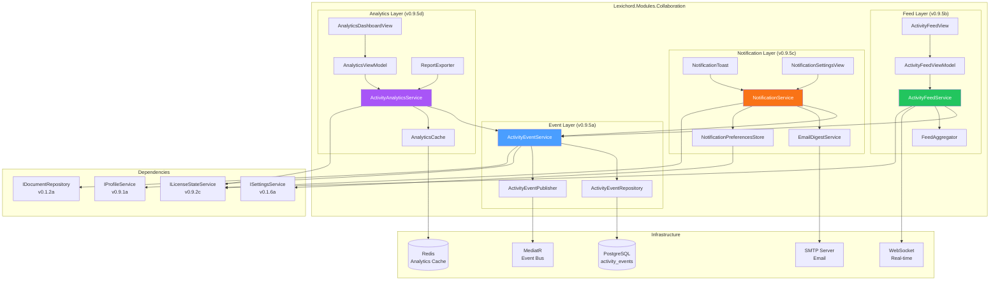
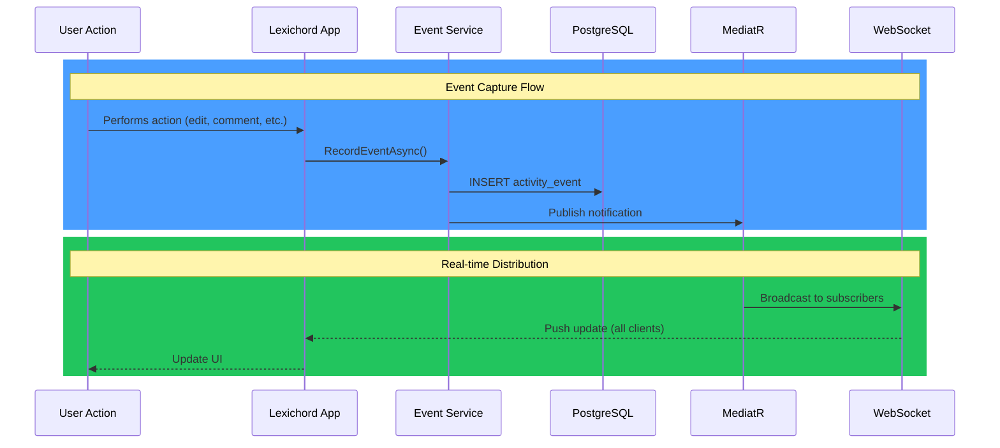
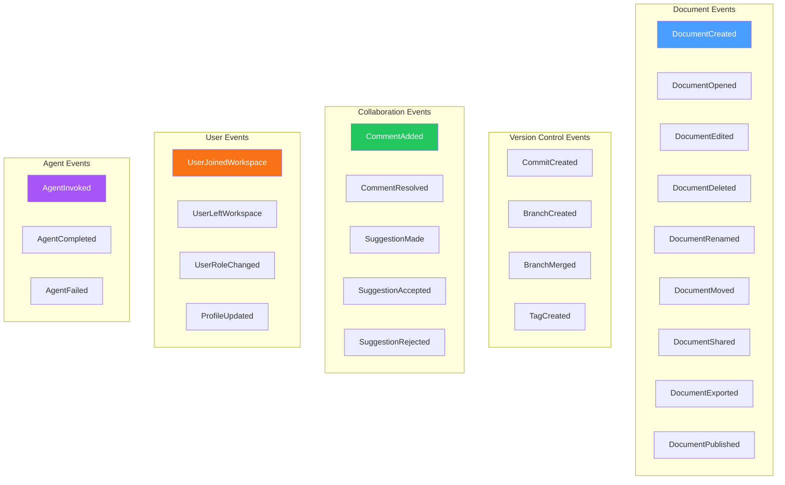

# LCS-DES-095: Design Specification Index — The Backstage Monitor

## Document Control

| Field | Value |
| :--- | :--- |
| **Document ID** | LCS-DES-095-INDEX |
| **Feature ID** | COL-095 |
| **Feature Name** | The Backstage Monitor (Activity Feed) |
| **Target Version** | v0.9.5 |
| **Module Scope** | Lexichord.Modules.Collaboration |
| **Swimlane** | Ensemble |
| **License Tier** | Teams |
| **Feature Gate Key** | FeatureFlags.Collaboration.ActivityFeed |
| **Status** | Draft |
| **Last Updated** | 2026-01-27 |

---

## 1. Executive Summary

**v0.9.5** delivers the **Backstage Monitor** — a comprehensive activity feed system that enables team visibility, change awareness, and productivity insights across the Lexichord workspace.

### 1.1 The Problem

Lexichord has evolved from a solo writing tool to a collaborative platform with multi-user workspaces. Teams currently lack:

- Visibility into what teammates are working on
- Awareness of document changes and version updates
- Notification systems for important events
- Analytics to understand team productivity patterns

Without these capabilities, teams operate in silos, duplicate effort, and miss critical updates to shared documents.

### 1.2 The Solution

Implement a four-part activity system:

1. **Event Tracking** — Capture all user actions with full attribution and metadata
2. **Feed Aggregation** — Present a unified, chronological activity stream with intelligent grouping
3. **Notifications** — Deliver alerts through in-app toasts and email digests with user preferences
4. **Activity Analytics** — Visualize productivity metrics and collaboration patterns

### 1.3 Business Value

| Value | Description |
| :--- | :--- |
| **Team Visibility** | See what teammates are working on in real-time |
| **Change Awareness** | Track document modifications across the workspace |
| **Notification Control** | Granular preferences filter signal from noise |
| **Productivity Insights** | Data-driven analytics for team performance |
| **Enterprise Compliance** | Audit trail capabilities for document tracking |
| **Foundation** | Event-driven architecture for future features |

---

## 2. Related Documents

### 2.1 Scope Breakdown Document

The detailed scope breakdown for v0.9.5, including all sub-parts, implementation checklists, user stories, and acceptance criteria:

| Document | Description |
| :--- | :--- |
| **[LCS-SBD-095](./LCS-SBD-095.md)** | Scope Breakdown — The Backstage Monitor |

### 2.2 Sub-Part Design Specifications

Each sub-part has its own detailed design specification following the LDS-01 template:

| Sub-Part | Document | Title | Description |
| :--- | :--- | :--- | :--- |
| v0.9.5a | **[LCS-DES-095a](./LCS-DES-095a.md)** | Event Tracking | Who did what when — comprehensive activity capture |
| v0.9.5b | **[LCS-DES-095b](./LCS-DES-095b.md)** | Feed Aggregation | Combined activity stream with grouping and filtering |
| v0.9.5c | **[LCS-DES-095c](./LCS-DES-095c.md)** | Notifications | In-app and email notifications with preferences |
| v0.9.5d | **[LCS-DES-095d](./LCS-DES-095d.md)** | Activity Analytics | Productivity insights and visualization |

---

## 3. Architecture Overview

### 3.1 Component Diagram



### 3.2 Data Flow Overview



---

## 4. Dependencies

### 4.1 Upstream Dependencies

| Interface | Source Version | Purpose |
| :--- | :--- | :--- |
| `IProfileService` | v0.9.1a | User profile for event attribution |
| `UserProfile` | v0.9.1a | Avatar and name display |
| `ILicenseStateService` | v0.9.2c | Teams tier validation |
| `ISecureVault` | v0.0.6a | Notification token storage |
| `IMediator` | v0.0.7a | Event bus for publishing |
| `IDbConnectionFactory` | v0.0.5c | PostgreSQL access |
| `ISettingsService` | v0.1.6a | User preferences |
| `IDocumentRepository` | v0.1.2a | Document metadata |
| `IGitService` | v0.8.1a | Git event integration |

### 4.2 NuGet Packages

| Package | Version | Purpose |
| :--- | :--- | :--- |
| `System.Reactive` | 6.x | Real-time event streams |
| `Dapper` | 2.x | Database queries |
| `FluentEmail.Core` | 3.x | Email templating and sending (NEW) |
| `FluentEmail.Smtp` | 3.x | SMTP transport (NEW) |
| `LiveChartsCore.SkiaSharpView.Avalonia` | 2.x | Chart visualization (NEW) |
| `QuestPDF` | 2024.x | PDF report generation (NEW) |
| `MessagePack` | 2.x | WebSocket serialization |

### 4.3 Downstream Consumers (Future)

| Version | Feature | Uses From v0.9.5 |
| :--- | :--- | :--- |
| v0.9.6 | PII Scrubber | Activity events for audit logging |
| v0.9.8 | Security Hardening | Event history for security audit |
| v1.0 | Production Release | Full activity infrastructure |

---

## 5. License Gating Strategy

The Activity Feed is a **Teams** tier feature with the following gating:

| Tier | Capabilities |
| :--- | :--- |
| **Core** | View personal activity only (own events) |
| **Writer** | View personal activity only (own events) |
| **WriterPro** | View personal activity only (own events) |
| **Teams** | Full team activity feed, notifications, analytics |
| **Enterprise** | Full access + audit export, retention policies |

### 5.1 Gating Implementation

```csharp
public class ActivityFeedService : IActivityFeedService
{
    public async Task<ActivityFeedPage> GetFeedAsync(
        ActivityFeedRequest request,
        CancellationToken ct = default)
    {
        var license = _licenseService.CurrentState;

        // Core/Writer/WriterPro: Personal scope only
        if (license.License?.Tier < LicenseTier.Teams)
        {
            if (request.Scope == ActivityFeedScope.Team)
            {
                throw new LicenseRequiredException(
                    "Team activity feed requires Teams tier or higher",
                    LicenseTier.Teams);
            }

            // Force personal scope
            request = request with { Scope = ActivityFeedScope.Personal };
        }

        return await GetFeedInternalAsync(request, ct);
    }
}
```

### 5.2 UI Gating

- Activity Feed panel shows "Personal Activity" for non-Teams users
- "Team" tab is disabled with lock icon and upgrade tooltip
- Analytics dashboard hidden for non-Teams users
- Notification preferences limited to basic in-app only

---

## 6. Key Interfaces Summary

### 6.1 Event Tracking (v0.9.5a)

| Interface | Purpose |
| :--- | :--- |
| `IActivityEventService` | Record and retrieve activity events |
| `IActivityEventRepository` | PostgreSQL persistence layer |
| `ActivityEvent` | Event data record |
| `ActivityEventType` | Enumeration of event types |

### 6.2 Feed Aggregation (v0.9.5b)

| Interface | Purpose |
| :--- | :--- |
| `IActivityFeedService` | Aggregate and present activity feed |
| `ActivityFeedPage` | Paginated feed results |
| `ActivityFeedItem` | Individual feed item |
| `ActivityGroup` | Grouped activity items |

### 6.3 Notifications (v0.9.5c)

| Interface | Purpose |
| :--- | :--- |
| `INotificationService` | Manage and deliver notifications |
| `Notification` | Notification data record |
| `NotificationPreferences` | User notification settings |
| `IEmailDigestService` | Email digest scheduling |

### 6.4 Analytics (v0.9.5d)

| Interface | Purpose |
| :--- | :--- |
| `IActivityAnalyticsService` | Compute and query analytics |
| `ActivitySummary` | Period activity summary |
| `ProductivityMetrics` | User/team productivity stats |
| `ActivityTrends` | Trend analysis over time |

---

## 7. Event Types Taxonomy



---

## 8. Database Schema Summary

```sql
-- Core activity events table
CREATE TABLE activity_events (
    event_id UUID PRIMARY KEY,
    event_type VARCHAR(50) NOT NULL,
    actor_id UUID NOT NULL REFERENCES user_profiles(profile_id),
    actor_name VARCHAR(255) NOT NULL,
    actor_avatar_path VARCHAR(500),
    target_document_id UUID REFERENCES documents(document_id),
    target_document_title VARCHAR(500),
    target_user_id UUID REFERENCES user_profiles(profile_id),
    target_user_name VARCHAR(255),
    occurred_at TIMESTAMPTZ NOT NULL,
    recorded_at TIMESTAMPTZ NOT NULL DEFAULT NOW(),
    metadata JSONB,
    description TEXT,
    severity VARCHAR(20) NOT NULL DEFAULT 'Info',
    workspace_id UUID NOT NULL
);

-- Notification read status
CREATE TABLE notification_read_status (
    user_id UUID NOT NULL REFERENCES user_profiles(profile_id),
    event_id UUID NOT NULL REFERENCES activity_events(event_id),
    read_at TIMESTAMPTZ NOT NULL DEFAULT NOW(),
    PRIMARY KEY (user_id, event_id)
);

-- User notification preferences
CREATE TABLE notification_preferences (
    user_id UUID PRIMARY KEY REFERENCES user_profiles(profile_id),
    preferences JSONB NOT NULL,
    updated_at TIMESTAMPTZ NOT NULL DEFAULT NOW()
);

-- Indexes for performance
CREATE INDEX idx_activity_events_actor ON activity_events(actor_id, occurred_at DESC);
CREATE INDEX idx_activity_events_document ON activity_events(target_document_id, occurred_at DESC);
CREATE INDEX idx_activity_events_type ON activity_events(event_type, occurred_at DESC);
CREATE INDEX idx_activity_events_workspace ON activity_events(workspace_id, occurred_at DESC);
```

---

## 9. Key Test Scenarios Summary

### 9.1 Event Tracking (v0.9.5a)

| Scenario | Input | Expected |
| :--- | :--- | :--- |
| Record document edit | Edit action | Event stored with < 500ms latency |
| Query user events | User ID | Returns user's events chronologically |
| Subscribe to events | Filter criteria | Real-time events matching filter |

### 9.2 Feed Aggregation (v0.9.5b)

| Scenario | Input | Expected |
| :--- | :--- | :--- |
| Load team feed | Scope = Team | Returns team events grouped by time |
| Infinite scroll | Cursor + PageSize | Returns next page within 300ms |
| Real-time update | New event | Appears at top of feed |

### 9.3 Notifications (v0.9.5c)

| Scenario | Input | Expected |
| :--- | :--- | :--- |
| Document shared | ShareEvent | Toast notification shown |
| Do Not Disturb | DND enabled | No notifications during DND |
| Email digest | Daily schedule | Email sent at configured time |

### 9.4 Analytics (v0.9.5d)

| Scenario | Input | Expected |
| :--- | :--- | :--- |
| Activity summary | Last 30 days | Returns accurate event counts |
| Top contributors | Period | Returns ranked list by activity |
| Export CSV | Period + format | Downloads valid CSV file |

---

## 10. Implementation Checklist Summary

| Sub-Part | Tasks | Est. Hours |
| :--- | :--- | :--- |
| v0.9.5a | Event Tracking | 17 |
| v0.9.5b | Feed Aggregation | 23 |
| v0.9.5c | Notifications | 22 |
| v0.9.5d | Activity Analytics | 25 |
| Integration | Tests + DI | 5 |
| **Total** | | **92 hours** |

See [LCS-SBD-095](./LCS-SBD-095.md) Section 4 for the detailed task breakdown.

---

## 11. Success Criteria Summary

| Category | Criterion | Target |
| :--- | :--- | :--- |
| **Event Capture** | Latency | < 500ms |
| **Event Capture** | Reliability | 99.9% |
| **Feed Load** | Initial load | < 1s |
| **Feed Load** | Pagination | < 300ms |
| **Notifications** | Delivery time | < 2s |
| **Analytics** | Dashboard load | < 3s |
| **Memory** | Feed view | < 50MB |

See [LCS-SBD-095](./LCS-SBD-095.md) Section 9 for full success metrics.

---

## 12. Risk Summary

| Risk | Mitigation |
| :--- | :--- |
| High event volume | Batching, partitioning, archival |
| Real-time UI performance | Throttling, virtualization |
| Email delivery failures | Retry policies, fallback to in-app |
| Privacy concerns | Opt-out, retention policies |
| Analytics blocking UI | Background computation, caching |

See [LCS-SBD-095](./LCS-SBD-095.md) Section 8 for full risk analysis.

---

## 13. What This Enables

| Version | Feature | Uses From v0.9.5 |
| :--- | :--- | :--- |
| v0.9.6 | PII Scrubber | Activity events for audit trails |
| v0.9.7 | UX Refinement | Activity-based onboarding tips |
| v0.9.8 | Security Hardening | Event history for security audit |
| v1.0 | Production | Full collaborative platform |

---

## Document History

| Version | Date | Author | Changes |
| :--- | :--- | :--- | :--- |
| 1.0 | 2026-01-27 | Lead Architect | Initial draft |
