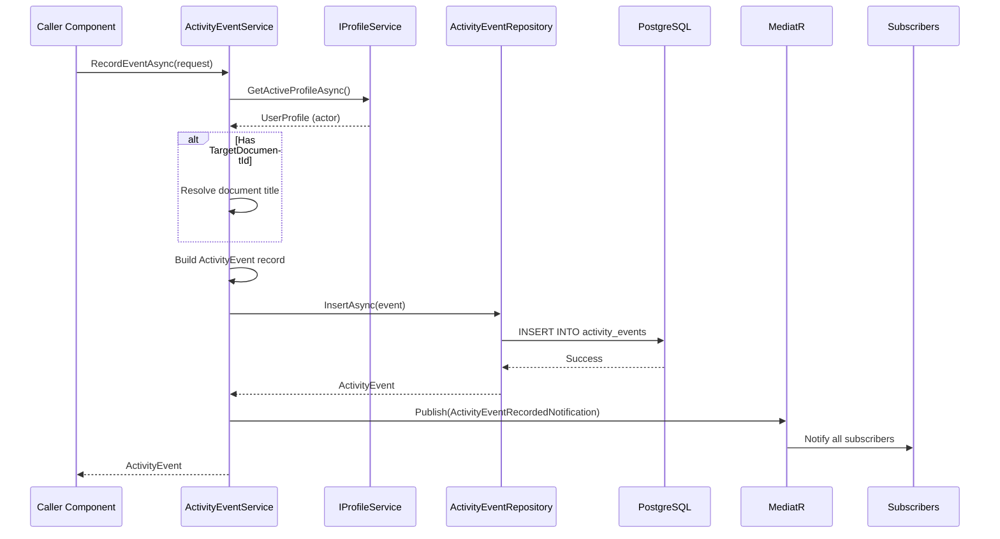

# LCS-DES-095a: Design Specification — Event Tracking

## 1. Metadata & Categorization

| Field | Value | Description |
| :--- | :--- | :--- |
| **Feature ID** | `COL-095a` | Sub-part of COL-095 |
| **Feature Name** | `Event Tracking (Who Did What When)` | Comprehensive activity capture |
| **Target Version** | `v0.9.5a` | First sub-part of v0.9.5 |
| **Module Scope** | `Lexichord.Modules.Collaboration` | Collaboration module |
| **Swimlane** | `Ensemble` | Collaboration vertical |
| **License Tier** | `Teams` | Required for team events |
| **Feature Gate Key** | `FeatureFlags.Collaboration.ActivityFeed` | Feature flag |
| **Author** | Lead Architect | |
| **Status** | `Draft` | |
| **Last Updated** | `2026-01-27` | |
| **Parent Document** | [LCS-DES-095-INDEX](./LCS-DES-095-INDEX.md) | |
| **Scope Breakdown** | [LCS-SBD-095 S3.1](./LCS-SBD-095.md#31-v095a-event-tracking) | |

---

## 2. Executive Summary

### 2.1 The Requirement

Team collaboration requires visibility into who did what and when. Without comprehensive event tracking:

- Team members work in isolation without awareness of others' activities
- Document changes go unnoticed, leading to conflicting edits
- There is no audit trail for compliance or debugging
- Future features (feed, notifications, analytics) have no data source

> **Goal:** Capture all user activities across the workspace with full attribution, timestamps, and metadata within 500ms of occurrence.

### 2.2 The Proposed Solution

Implement a robust event tracking system that:

1. Defines a comprehensive `ActivityEvent` record with 30+ event types
2. Provides `IActivityEventService` for recording and retrieving events
3. Stores events in PostgreSQL with optimized indexing for common queries
4. Publishes events via MediatR for real-time distribution
5. Supports reactive subscriptions for downstream consumers

---

## 3. Architecture & Modular Strategy

### 3.1 Dependencies

#### 3.1.1 Upstream Dependencies

| Interface | Source Version | Purpose |
| :--- | :--- | :--- |
| `IProfileService` | v0.9.1a | Get current user for event attribution |
| `UserProfile` | v0.9.1a | Actor name and avatar |
| `IDbConnectionFactory` | v0.0.5c | PostgreSQL database access |
| `IMediator` | v0.0.7a | Event publishing for real-time updates |
| `IDocumentRepository` | v0.1.2a | Document title resolution |
| `Serilog` | v0.0.3b | Structured logging |
| `Polly` | v0.0.5d | Retry policies for persistence |

#### 3.1.2 NuGet Packages

| Package | Version | Purpose |
| :--- | :--- | :--- |
| `Dapper` | 2.x | Database queries |
| `System.Reactive` | 6.x | Observable subscriptions |
| `MediatR` | 12.x | Event publishing |
| `Polly` | 8.x | Resilience policies |

### 3.2 Licensing Behavior

- **Load Behavior:** Soft Gate
  - Module loads for all tiers
  - Core/Writer/WriterPro: Can only view own events
  - Teams/Enterprise: Can view all team events
- **Fallback Experience:**
  - Non-Teams users see personal activity only
  - "View Team Activity" shows upgrade modal

---

## 4. Data Contract (The API)

### 4.1 Core Records

```csharp
namespace Lexichord.Abstractions.Collaboration;

/// <summary>
/// Represents a single activity event in the workspace.
/// Immutable record capturing who did what, when, and to what.
/// </summary>
public record ActivityEvent
{
    /// <summary>
    /// Unique identifier for this event.
    /// </summary>
    public Guid EventId { get; init; } = Guid.NewGuid();

    /// <summary>
    /// The type of activity that occurred.
    /// </summary>
    public required ActivityEventType EventType { get; init; }

    /// <summary>
    /// The user who performed the action.
    /// </summary>
    public required Guid ActorId { get; init; }

    /// <summary>
    /// Display name of the actor (denormalized for performance).
    /// </summary>
    public required string ActorName { get; init; }

    /// <summary>
    /// Path to the actor's avatar image.
    /// </summary>
    public string? ActorAvatarPath { get; init; }

    /// <summary>
    /// The document affected by this action, if applicable.
    /// </summary>
    public Guid? TargetDocumentId { get; init; }

    /// <summary>
    /// Title of the target document (denormalized for performance).
    /// </summary>
    public string? TargetDocumentTitle { get; init; }

    /// <summary>
    /// The user affected by this action, if applicable.
    /// </summary>
    public Guid? TargetUserId { get; init; }

    /// <summary>
    /// Display name of the target user.
    /// </summary>
    public string? TargetUserName { get; init; }

    /// <summary>
    /// When the action actually occurred.
    /// </summary>
    public required DateTime OccurredAt { get; init; }

    /// <summary>
    /// When the event was recorded in the database.
    /// </summary>
    public required DateTime RecordedAt { get; init; }

    /// <summary>
    /// Additional metadata specific to the event type.
    /// </summary>
    public IReadOnlyDictionary<string, object>? Metadata { get; init; }

    /// <summary>
    /// Human-readable description of the event.
    /// </summary>
    public string? Description { get; init; }

    /// <summary>
    /// Severity level for filtering and prioritization.
    /// </summary>
    public ActivityEventSeverity Severity { get; init; } = ActivityEventSeverity.Info;

    /// <summary>
    /// The workspace where this event occurred.
    /// </summary>
    public Guid WorkspaceId { get; init; }
}

/// <summary>
/// Comprehensive enumeration of all trackable activity types.
/// </summary>
public enum ActivityEventType
{
    // ═══════════════════════════════════════════════════════════════
    // Document Events (1xx)
    // ═══════════════════════════════════════════════════════════════
    DocumentCreated = 100,
    DocumentOpened = 101,
    DocumentEdited = 102,
    DocumentDeleted = 103,
    DocumentRenamed = 104,
    DocumentMoved = 105,
    DocumentShared = 106,
    DocumentExported = 107,
    DocumentPublished = 108,
    DocumentArchived = 109,
    DocumentRestored = 110,
    DocumentDuplicated = 111,

    // ═══════════════════════════════════════════════════════════════
    // Version Control Events (2xx)
    // ═══════════════════════════════════════════════════════════════
    CommitCreated = 200,
    BranchCreated = 201,
    BranchMerged = 202,
    BranchDeleted = 203,
    TagCreated = 204,
    TagDeleted = 205,
    RevertPerformed = 206,

    // ═══════════════════════════════════════════════════════════════
    // Collaboration Events (3xx)
    // ═══════════════════════════════════════════════════════════════
    CommentAdded = 300,
    CommentEdited = 301,
    CommentDeleted = 302,
    CommentResolved = 303,
    CommentReopened = 304,
    SuggestionMade = 310,
    SuggestionAccepted = 311,
    SuggestionRejected = 312,
    MentionCreated = 320,

    // ═══════════════════════════════════════════════════════════════
    // User Events (4xx)
    // ═══════════════════════════════════════════════════════════════
    UserJoinedWorkspace = 400,
    UserLeftWorkspace = 401,
    UserRoleChanged = 402,
    UserInvited = 403,
    UserInvitationAccepted = 404,
    UserInvitationDeclined = 405,
    ProfileUpdated = 410,
    ProfilePhotoChanged = 411,

    // ═══════════════════════════════════════════════════════════════
    // Style Events (5xx)
    // ═══════════════════════════════════════════════════════════════
    StyleRuleApplied = 500,
    StyleGuideUpdated = 501,
    StyleGuideCreated = 502,
    TerminologyAdded = 510,
    TerminologyUpdated = 511,
    TerminologyRemoved = 512,

    // ═══════════════════════════════════════════════════════════════
    // Agent Events (6xx)
    // ═══════════════════════════════════════════════════════════════
    AgentInvoked = 600,
    AgentCompleted = 601,
    AgentFailed = 602,
    AgentCancelled = 603,
    AgentFeedbackProvided = 610,

    // ═══════════════════════════════════════════════════════════════
    // System Events (9xx)
    // ═══════════════════════════════════════════════════════════════
    WorkspaceCreated = 900,
    WorkspaceSettingsChanged = 901,
    WorkspaceDeleted = 902,
    IntegrationConnected = 910,
    IntegrationDisconnected = 911,
    IntegrationError = 912,
    LicenseActivated = 920,
    LicenseExpired = 921,
    SystemMaintenance = 990
}

/// <summary>
/// Severity levels for activity events.
/// </summary>
public enum ActivityEventSeverity
{
    /// <summary>
    /// Debug-level events, typically not shown to users.
    /// </summary>
    Debug = 0,

    /// <summary>
    /// Informational events for general activity tracking.
    /// </summary>
    Info = 1,

    /// <summary>
    /// Notable events that may require attention.
    /// </summary>
    Warning = 2,

    /// <summary>
    /// Important events that users should be aware of.
    /// </summary>
    Important = 3,

    /// <summary>
    /// Critical events requiring immediate attention.
    /// </summary>
    Critical = 4
}
```

### 4.2 Service Interface

```csharp
namespace Lexichord.Abstractions.Collaboration;

/// <summary>
/// Service for capturing and retrieving activity events.
/// </summary>
public interface IActivityEventService
{
    /// <summary>
    /// Records a new activity event.
    /// </summary>
    /// <param name="request">The event details to record.</param>
    /// <param name="ct">Cancellation token.</param>
    /// <returns>The recorded event with generated ID and timestamps.</returns>
    Task<ActivityEvent> RecordEventAsync(
        RecordEventRequest request,
        CancellationToken ct = default);

    /// <summary>
    /// Records multiple events in a batch.
    /// </summary>
    /// <param name="requests">The events to record.</param>
    /// <param name="ct">Cancellation token.</param>
    /// <returns>The recorded events.</returns>
    Task<IReadOnlyList<ActivityEvent>> RecordBatchAsync(
        IEnumerable<RecordEventRequest> requests,
        CancellationToken ct = default);

    /// <summary>
    /// Retrieves activity events matching the specified criteria.
    /// </summary>
    /// <param name="query">Query parameters.</param>
    /// <param name="ct">Cancellation token.</param>
    /// <returns>Matching events ordered by occurrence time descending.</returns>
    Task<IReadOnlyList<ActivityEvent>> GetEventsAsync(
        ActivityEventQuery query,
        CancellationToken ct = default);

    /// <summary>
    /// Gets events for a specific user.
    /// </summary>
    Task<IReadOnlyList<ActivityEvent>> GetUserEventsAsync(
        Guid userId,
        DateTime? since = null,
        int limit = 50,
        CancellationToken ct = default);

    /// <summary>
    /// Gets events for a specific document.
    /// </summary>
    Task<IReadOnlyList<ActivityEvent>> GetDocumentEventsAsync(
        Guid documentId,
        DateTime? since = null,
        int limit = 50,
        CancellationToken ct = default);

    /// <summary>
    /// Gets the count of events matching the query.
    /// </summary>
    Task<int> GetEventCountAsync(
        ActivityEventQuery query,
        CancellationToken ct = default);

    /// <summary>
    /// Subscribes to real-time event notifications.
    /// </summary>
    /// <param name="filter">Optional filter for events.</param>
    /// <returns>Observable stream of matching events.</returns>
    IObservable<ActivityEvent> Subscribe(ActivityEventFilter? filter = null);

    /// <summary>
    /// Deletes events older than the specified date.
    /// Used for data retention policies.
    /// </summary>
    Task<int> PurgeEventsAsync(
        DateTime olderThan,
        CancellationToken ct = default);
}

/// <summary>
/// Request for recording a new activity event.
/// </summary>
public record RecordEventRequest
{
    /// <summary>
    /// The type of event to record.
    /// </summary>
    public required ActivityEventType EventType { get; init; }

    /// <summary>
    /// The document affected, if applicable.
    /// </summary>
    public Guid? TargetDocumentId { get; init; }

    /// <summary>
    /// The user affected, if applicable.
    /// </summary>
    public Guid? TargetUserId { get; init; }

    /// <summary>
    /// Additional metadata for the event.
    /// </summary>
    public IReadOnlyDictionary<string, object>? Metadata { get; init; }

    /// <summary>
    /// Human-readable description.
    /// </summary>
    public string? Description { get; init; }

    /// <summary>
    /// Event severity level.
    /// </summary>
    public ActivityEventSeverity Severity { get; init; } = ActivityEventSeverity.Info;

    /// <summary>
    /// Optional override for occurred time (defaults to now).
    /// </summary>
    public DateTime? OccurredAt { get; init; }
}

/// <summary>
/// Query parameters for retrieving activity events.
/// </summary>
public record ActivityEventQuery
{
    /// <summary>
    /// Filter by specific event types.
    /// </summary>
    public IReadOnlyList<ActivityEventType>? EventTypes { get; init; }

    /// <summary>
    /// Filter by specific actors.
    /// </summary>
    public IReadOnlyList<Guid>? ActorIds { get; init; }

    /// <summary>
    /// Filter by specific documents.
    /// </summary>
    public IReadOnlyList<Guid>? DocumentIds { get; init; }

    /// <summary>
    /// Events after this time.
    /// </summary>
    public DateTime? Since { get; init; }

    /// <summary>
    /// Events before this time.
    /// </summary>
    public DateTime? Until { get; init; }

    /// <summary>
    /// Number of events to skip.
    /// </summary>
    public int Offset { get; init; } = 0;

    /// <summary>
    /// Maximum number of events to return.
    /// </summary>
    public int Limit { get; init; } = 50;

    /// <summary>
    /// Minimum severity level to include.
    /// </summary>
    public ActivityEventSeverity? MinSeverity { get; init; }

    /// <summary>
    /// Whether to include system events.
    /// </summary>
    public bool IncludeSystemEvents { get; init; } = false;

    /// <summary>
    /// Full-text search in description.
    /// </summary>
    public string? SearchText { get; init; }
}

/// <summary>
/// Filter for real-time event subscription.
/// </summary>
public record ActivityEventFilter
{
    public IReadOnlyList<ActivityEventType>? EventTypes { get; init; }
    public IReadOnlyList<Guid>? ActorIds { get; init; }
    public IReadOnlyList<Guid>? DocumentIds { get; init; }
    public ActivityEventSeverity? MinSeverity { get; init; }
    public bool ExcludeOwnEvents { get; init; } = false;
}
```

### 4.3 Repository Interface

```csharp
namespace Lexichord.Modules.Collaboration.Repositories;

/// <summary>
/// Repository for activity event persistence.
/// </summary>
public interface IActivityEventRepository
{
    Task<ActivityEvent> InsertAsync(ActivityEvent evt, CancellationToken ct = default);
    Task<IReadOnlyList<ActivityEvent>> InsertBatchAsync(IEnumerable<ActivityEvent> events, CancellationToken ct = default);
    Task<IReadOnlyList<ActivityEvent>> QueryAsync(ActivityEventQuery query, CancellationToken ct = default);
    Task<int> CountAsync(ActivityEventQuery query, CancellationToken ct = default);
    Task<int> DeleteOlderThanAsync(DateTime cutoff, CancellationToken ct = default);
}
```

---

## 5. Implementation Logic

### 5.1 Event Recording Flow



### 5.2 Query Execution Logic

```text
BUILD QUERY:
│
├── Start with base SELECT
│   SELECT * FROM activity_events
│
├── Apply filters (WHERE clauses)
│   ├── event_type IN (@types) -- if EventTypes specified
│   ├── actor_id IN (@actors) -- if ActorIds specified
│   ├── target_document_id IN (@docs) -- if DocumentIds specified
│   ├── occurred_at >= @since -- if Since specified
│   ├── occurred_at <= @until -- if Until specified
│   ├── severity >= @minSeverity -- if MinSeverity specified
│   └── event_type < 900 -- if !IncludeSystemEvents
│
├── Apply ordering
│   ORDER BY occurred_at DESC
│
├── Apply pagination
│   OFFSET @offset LIMIT @limit
│
└── Execute with Dapper
```

### 5.3 Real-time Subscription Logic

```csharp
public IObservable<ActivityEvent> Subscribe(ActivityEventFilter? filter = null)
{
    return Observable.Create<ActivityEvent>(async (observer, ct) =>
    {
        // Create a channel for this subscriber
        var channel = Channel.CreateUnbounded<ActivityEvent>();

        // Register with the event broadcaster
        var subscriptionId = _broadcaster.Register(channel.Writer, filter);

        try
        {
            // Read events from channel and push to observer
            await foreach (var evt in channel.Reader.ReadAllAsync(ct))
            {
                observer.OnNext(evt);
            }
            observer.OnCompleted();
        }
        catch (OperationCanceledException)
        {
            observer.OnCompleted();
        }
        catch (Exception ex)
        {
            observer.OnError(ex);
        }
        finally
        {
            _broadcaster.Unregister(subscriptionId);
        }
    });
}
```

---

## 6. Database Schema

### 6.1 Migration Script

```csharp
[Migration(20260127_0001)]
public class Migration_095_ActivityEvents : Migration
{
    public override void Up()
    {
        Create.Table("activity_events")
            .WithColumn("event_id").AsGuid().PrimaryKey().WithDefault(SystemMethods.NewGuid)
            .WithColumn("event_type").AsString(50).NotNullable()
            .WithColumn("actor_id").AsGuid().NotNullable()
            .WithColumn("actor_name").AsString(255).NotNullable()
            .WithColumn("actor_avatar_path").AsString(500).Nullable()
            .WithColumn("target_document_id").AsGuid().Nullable()
            .WithColumn("target_document_title").AsString(500).Nullable()
            .WithColumn("target_user_id").AsGuid().Nullable()
            .WithColumn("target_user_name").AsString(255).Nullable()
            .WithColumn("occurred_at").AsDateTimeOffset().NotNullable()
            .WithColumn("recorded_at").AsDateTimeOffset().NotNullable().WithDefault(SystemMethods.CurrentUTCDateTime)
            .WithColumn("metadata").AsCustom("JSONB").Nullable()
            .WithColumn("description").AsString(int.MaxValue).Nullable()
            .WithColumn("severity").AsString(20).NotNullable().WithDefaultValue("Info")
            .WithColumn("workspace_id").AsGuid().NotNullable();

        // Foreign keys
        Create.ForeignKey("fk_activity_events_actor")
            .FromTable("activity_events").ForeignColumn("actor_id")
            .ToTable("user_profiles").PrimaryColumn("profile_id");

        Create.ForeignKey("fk_activity_events_document")
            .FromTable("activity_events").ForeignColumn("target_document_id")
            .ToTable("documents").PrimaryColumn("document_id");

        Create.ForeignKey("fk_activity_events_target_user")
            .FromTable("activity_events").ForeignColumn("target_user_id")
            .ToTable("user_profiles").PrimaryColumn("profile_id");

        // Indexes for common query patterns
        Create.Index("idx_activity_events_actor")
            .OnTable("activity_events")
            .OnColumn("actor_id").Ascending()
            .OnColumn("occurred_at").Descending();

        Create.Index("idx_activity_events_document")
            .OnTable("activity_events")
            .OnColumn("target_document_id").Ascending()
            .OnColumn("occurred_at").Descending();

        Create.Index("idx_activity_events_type")
            .OnTable("activity_events")
            .OnColumn("event_type").Ascending()
            .OnColumn("occurred_at").Descending();

        Create.Index("idx_activity_events_occurred")
            .OnTable("activity_events")
            .OnColumn("occurred_at").Descending();

        Create.Index("idx_activity_events_workspace")
            .OnTable("activity_events")
            .OnColumn("workspace_id").Ascending()
            .OnColumn("occurred_at").Descending();
    }

    public override void Down()
    {
        Delete.Table("activity_events");
    }
}
```

---

## 7. Test Scenarios

### 7.1 Unit Tests

```csharp
[Trait("Category", "Unit")]
[Trait("Version", "v0.9.5a")]
public class ActivityEventServiceTests
{
    private readonly Mock<IActivityEventRepository> _repository;
    private readonly Mock<IMediator> _mediator;
    private readonly Mock<IProfileService> _profileService;
    private readonly ActivityEventService _sut;

    public ActivityEventServiceTests()
    {
        _repository = new Mock<IActivityEventRepository>();
        _mediator = new Mock<IMediator>();
        _profileService = new Mock<IProfileService>();

        _profileService.Setup(x => x.GetActiveProfileAsync(It.IsAny<CancellationToken>()))
            .ReturnsAsync(new UserProfile
            {
                ProfileId = Guid.NewGuid(),
                Name = "Test User",
                AvatarPath = "/avatars/test.png"
            });

        _sut = new ActivityEventService(
            _repository.Object,
            _mediator.Object,
            _profileService.Object,
            Mock.Of<ILogger<ActivityEventService>>());
    }

    [Fact]
    public async Task RecordEventAsync_ValidRequest_StoresAndPublishes()
    {
        // Arrange
        var request = new RecordEventRequest
        {
            EventType = ActivityEventType.DocumentCreated,
            TargetDocumentId = Guid.NewGuid(),
            Description = "Created new document"
        };

        _repository.Setup(x => x.InsertAsync(It.IsAny<ActivityEvent>(), It.IsAny<CancellationToken>()))
            .ReturnsAsync((ActivityEvent e, CancellationToken _) => e);

        // Act
        var result = await _sut.RecordEventAsync(request);

        // Assert
        result.Should().NotBeNull();
        result.EventType.Should().Be(ActivityEventType.DocumentCreated);
        result.ActorName.Should().Be("Test User");
        result.TargetDocumentId.Should().Be(request.TargetDocumentId);

        _repository.Verify(x => x.InsertAsync(
            It.Is<ActivityEvent>(e => e.EventType == ActivityEventType.DocumentCreated),
            It.IsAny<CancellationToken>()), Times.Once);

        _mediator.Verify(x => x.Publish(
            It.IsAny<ActivityEventRecordedNotification>(),
            It.IsAny<CancellationToken>()), Times.Once);
    }

    [Fact]
    public async Task RecordEventAsync_MeasuresLatency_Under500ms()
    {
        // Arrange
        var request = new RecordEventRequest
        {
            EventType = ActivityEventType.DocumentEdited
        };

        _repository.Setup(x => x.InsertAsync(It.IsAny<ActivityEvent>(), It.IsAny<CancellationToken>()))
            .ReturnsAsync((ActivityEvent e, CancellationToken _) => e);

        // Act
        var sw = Stopwatch.StartNew();
        await _sut.RecordEventAsync(request);
        sw.Stop();

        // Assert
        sw.ElapsedMilliseconds.Should().BeLessThan(500,
            "Event recording must complete within 500ms SLA");
    }

    [Theory]
    [InlineData(ActivityEventType.DocumentCreated)]
    [InlineData(ActivityEventType.DocumentEdited)]
    [InlineData(ActivityEventType.CommentAdded)]
    [InlineData(ActivityEventType.AgentInvoked)]
    public async Task RecordEventAsync_DifferentTypes_RecordsCorrectly(ActivityEventType eventType)
    {
        // Arrange
        var request = new RecordEventRequest { EventType = eventType };

        _repository.Setup(x => x.InsertAsync(It.IsAny<ActivityEvent>(), It.IsAny<CancellationToken>()))
            .ReturnsAsync((ActivityEvent e, CancellationToken _) => e);

        // Act
        var result = await _sut.RecordEventAsync(request);

        // Assert
        result.EventType.Should().Be(eventType);
    }

    [Fact]
    public async Task GetEventsAsync_WithFilters_AppliesAllFilters()
    {
        // Arrange
        var documentId = Guid.NewGuid();
        var query = new ActivityEventQuery
        {
            DocumentIds = [documentId],
            EventTypes = [ActivityEventType.DocumentEdited],
            Since = DateTime.UtcNow.AddDays(-7),
            Limit = 10
        };

        // Act
        await _sut.GetEventsAsync(query);

        // Assert
        _repository.Verify(x => x.QueryAsync(
            It.Is<ActivityEventQuery>(q =>
                q.DocumentIds!.Contains(documentId) &&
                q.EventTypes!.Contains(ActivityEventType.DocumentEdited) &&
                q.Since.HasValue &&
                q.Limit == 10),
            It.IsAny<CancellationToken>()), Times.Once);
    }
}
```

### 7.2 Integration Tests

```csharp
[Trait("Category", "Integration")]
[Trait("Version", "v0.9.5a")]
public class ActivityEventIntegrationTests : IClassFixture<DatabaseFixture>
{
    private readonly DatabaseFixture _fixture;

    public ActivityEventIntegrationTests(DatabaseFixture fixture)
    {
        _fixture = fixture;
    }

    [Fact]
    public async Task FullEventLifecycle_RecordQuerySubscribe()
    {
        // Arrange
        var service = _fixture.CreateActivityEventService();
        var receivedEvents = new List<ActivityEvent>();
        var subscription = service.Subscribe().Subscribe(e => receivedEvents.Add(e));

        // Act - Record event
        var recorded = await service.RecordEventAsync(new RecordEventRequest
        {
            EventType = ActivityEventType.DocumentCreated,
            Description = "Integration test document"
        });

        // Give time for subscription to receive
        await Task.Delay(100);

        // Query events
        var queried = await service.GetEventsAsync(new ActivityEventQuery
        {
            EventTypes = [ActivityEventType.DocumentCreated],
            Limit = 1
        });

        // Assert
        recorded.Should().NotBeNull();
        queried.Should().ContainSingle(e => e.EventId == recorded.EventId);
        receivedEvents.Should().ContainSingle(e => e.EventId == recorded.EventId);

        subscription.Dispose();
    }
}
```

---

## 8. Observability & Logging

| Level | Message Template | Context |
| :--- | :--- | :--- |
| Debug | `"Recording event: {EventType} by {ActorId}"` | Before insert |
| Info | `"Event recorded: {EventId} type {EventType} in {ElapsedMs}ms"` | After insert |
| Warning | `"Event recording slow: {EventId} took {ElapsedMs}ms (SLA: 500ms)"` | Latency > 500ms |
| Error | `"Failed to record event: {EventType} - {Error}"` | Insert failure |
| Debug | `"Querying events: {Query}"` | Before query |
| Info | `"Query returned {Count} events in {ElapsedMs}ms"` | After query |
| Debug | `"Subscription registered: {SubscriptionId} with filter {Filter}"` | New subscription |
| Info | `"Published event {EventId} to {SubscriberCount} subscribers"` | After broadcast |

---

## 9. Security & Safety

| Risk | Level | Mitigation |
| :--- | :--- | :--- |
| SQL Injection | Medium | Use parameterized queries via Dapper |
| Data Exposure | Medium | License gating for team events |
| PII in Metadata | Low | Document metadata guidelines |
| Event Flooding | Medium | Rate limiting on RecordEventAsync |
| Large Metadata | Low | Validate metadata size < 64KB |

---

## 10. Acceptance Criteria

### 10.1 Functional Criteria

| # | Given | When | Then |
| :--- | :--- | :--- | :--- |
| 1 | User edits document | RecordEventAsync called | Event stored with correct type |
| 2 | Event with document ID | Recorded | Document title resolved and stored |
| 3 | Query with filters | GetEventsAsync called | Only matching events returned |
| 4 | Subscription active | New event recorded | Subscriber receives event |
| 5 | Teams license | Query team events | All team events returned |
| 6 | Core license | Query team events | Only own events returned |

### 10.2 Performance Criteria

| # | Given | When | Then |
| :--- | :--- | :--- | :--- |
| 7 | Standard load | Record event | Completes in < 500ms |
| 8 | 10,000 events in DB | Query with filters | Returns in < 200ms |
| 9 | 100 concurrent subscriptions | Event broadcast | All receive in < 100ms |

---

## 11. Deliverable Checklist

| # | Deliverable | Status |
| :--- | :--- | :--- |
| 1 | `ActivityEvent` record definition | [ ] |
| 2 | `ActivityEventType` enum (30+ types) | [ ] |
| 3 | `ActivityEventSeverity` enum | [ ] |
| 4 | `IActivityEventService` interface | [ ] |
| 5 | `ActivityEventService` implementation | [ ] |
| 6 | `IActivityEventRepository` interface | [ ] |
| 7 | `ActivityEventRepository` implementation | [ ] |
| 8 | `Migration_095_ActivityEvents` migration | [ ] |
| 9 | `ActivityEventRecordedNotification` MediatR | [ ] |
| 10 | Real-time subscription infrastructure | [ ] |
| 11 | Unit tests for service | [ ] |
| 12 | Integration tests | [ ] |
| 13 | DI registration | [ ] |

---

## 12. Verification Commands

```bash
# Run unit tests for event tracking
dotnet test --filter "Category=Unit&Version=v0.9.5a" --logger "console;verbosity=detailed"

# Run integration tests
dotnet test --filter "Category=Integration&Version=v0.9.5a"

# Verify migration
dotnet run --project src/Lexichord.Host -- migrate --dry-run

# Manual verification:
# 1. Create a document, verify event appears in database
# 2. Query events via API, verify filtering works
# 3. Subscribe to events, verify real-time updates
```

---

## Document History

| Version | Date | Author | Changes |
| :--- | :--- | :--- | :--- |
| 1.0 | 2026-01-27 | Lead Architect | Initial draft |
