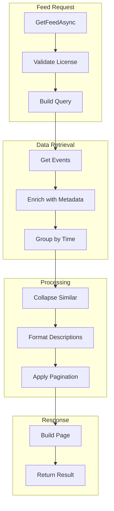
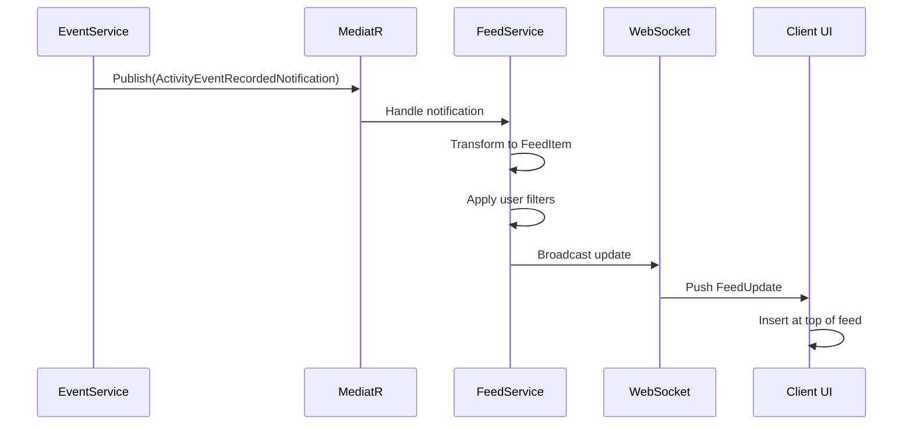

# LCS-DES-095b: Design Specification — Feed Aggregation

## 1. Metadata & Categorization

| Field | Value | Description |
| :--- | :--- | :--- |
| **Feature ID** | `COL-095b` | Sub-part of COL-095 |
| **Feature Name** | `Feed Aggregation (Combined Activity Stream)` | Unified activity feed |
| **Target Version** | `v0.9.5b` | Second sub-part of v0.9.5 |
| **Module Scope** | `Lexichord.Modules.Collaboration` | Collaboration module |
| **Swimlane** | `Ensemble` | Collaboration vertical |
| **License Tier** | `Teams` | Required for team feed |
| **Feature Gate Key** | `FeatureFlags.Collaboration.ActivityFeed` | Feature flag |
| **Author** | Lead Architect | |
| **Status** | `Draft` | |
| **Last Updated** | `2026-01-27` | |
| **Parent Document** | [LCS-DES-095-INDEX](./LCS-DES-095-INDEX.md) | |
| **Scope Breakdown** | [LCS-SBD-095 S3.2](./LCS-SBD-095.md#32-v095b-feed-aggregation) | |

---

## 2. Executive Summary

### 2.1 The Requirement

Raw activity events are difficult to consume. Users need:

- A chronological feed that shows recent activity at a glance
- Intelligent grouping by time period (Today, Yesterday, This Week)
- Filtering by event type, user, or document
- Real-time updates as teammates perform actions
- Pagination for browsing historical activity

> **Goal:** Create a unified, chronological activity stream with intelligent grouping and real-time updates.

### 2.2 The Proposed Solution

Implement a feed aggregation layer that:

1. Aggregates events from `IActivityEventService` into a presentable feed
2. Groups events by time period and optionally by document or user
3. Collapses similar events (e.g., multiple edits to same document)
4. Provides infinite scroll pagination with cursor-based navigation
5. Delivers real-time updates via WebSocket subscription

---

## 3. Architecture & Modular Strategy

### 3.1 Dependencies

#### 3.1.1 Upstream Dependencies

| Interface | Source Version | Purpose |
| :--- | :--- | :--- |
| `IActivityEventService` | v0.9.5a | Event data source |
| `IProfileService` | v0.9.1a | User avatars and names |
| `ILicenseStateService` | v0.9.2c | Teams tier validation |
| `ISettingsService` | v0.1.6a | User feed preferences |

#### 3.1.2 NuGet Packages

| Package | Version | Purpose |
| :--- | :--- | :--- |
| `System.Reactive` | 6.x | Real-time subscriptions |
| `Humanizer.Core` | 2.x | Relative time formatting |
| `MessagePack` | 2.x | WebSocket serialization |

### 3.2 Licensing Behavior

- **Teams+:** Full team activity feed
- **Core/Writer/WriterPro:** Personal activity only (own events)
- **Fallback:** "Upgrade to Teams" modal when clicking Team tab

---

## 4. Data Contract (The API)

### 4.1 Service Interface

```csharp
namespace Lexichord.Abstractions.Collaboration;

/// <summary>
/// Service for aggregating and presenting the activity feed.
/// </summary>
public interface IActivityFeedService
{
    /// <summary>
    /// Gets the aggregated activity feed.
    /// </summary>
    Task<ActivityFeedPage> GetFeedAsync(
        ActivityFeedRequest request,
        CancellationToken ct = default);

    /// <summary>
    /// Gets a grouped view of activity by time period.
    /// </summary>
    Task<IReadOnlyList<ActivityGroup>> GetGroupedFeedAsync(
        ActivityGroupingRequest request,
        CancellationToken ct = default);

    /// <summary>
    /// Subscribes to real-time feed updates.
    /// </summary>
    IObservable<ActivityFeedUpdate> SubscribeToUpdates(
        ActivityFeedFilter? filter = null);

    /// <summary>
    /// Marks events as read for the current user.
    /// </summary>
    Task MarkAsReadAsync(
        IEnumerable<Guid> eventIds,
        CancellationToken ct = default);

    /// <summary>
    /// Marks all events as read.
    /// </summary>
    Task MarkAllAsReadAsync(CancellationToken ct = default);

    /// <summary>
    /// Gets the count of unread events.
    /// </summary>
    Task<int> GetUnreadCountAsync(CancellationToken ct = default);

    /// <summary>
    /// Gets feed statistics for the current user.
    /// </summary>
    Task<FeedStatistics> GetStatisticsAsync(CancellationToken ct = default);
}
```

### 4.2 Request/Response Records

```csharp
/// <summary>
/// Request for retrieving the activity feed.
/// </summary>
public record ActivityFeedRequest
{
    /// <summary>
    /// Scope of events to include.
    /// </summary>
    public ActivityFeedScope Scope { get; init; } = ActivityFeedScope.Team;

    /// <summary>
    /// Include only these event types.
    /// </summary>
    public IReadOnlyList<ActivityEventType>? IncludeEventTypes { get; init; }

    /// <summary>
    /// Exclude these event types.
    /// </summary>
    public IReadOnlyList<ActivityEventType>? ExcludeEventTypes { get; init; }

    /// <summary>
    /// Filter to specific users.
    /// </summary>
    public IReadOnlyList<Guid>? FilterByUsers { get; init; }

    /// <summary>
    /// Filter to specific documents.
    /// </summary>
    public IReadOnlyList<Guid>? FilterByDocuments { get; init; }

    /// <summary>
    /// Events after this time.
    /// </summary>
    public DateTime? Since { get; init; }

    /// <summary>
    /// Events before this time.
    /// </summary>
    public DateTime? Until { get; init; }

    /// <summary>
    /// Cursor for pagination (opaque string from previous response).
    /// </summary>
    public string? Cursor { get; init; }

    /// <summary>
    /// Number of items per page.
    /// </summary>
    public int PageSize { get; init; } = 25;

    /// <summary>
    /// Whether to include system events.
    /// </summary>
    public bool IncludeSystemEvents { get; init; } = false;

    /// <summary>
    /// Whether to collapse similar events.
    /// </summary>
    public bool CollapseSimilar { get; init; } = true;
}

/// <summary>
/// Scope of the activity feed.
/// </summary>
public enum ActivityFeedScope
{
    /// <summary>
    /// Only current user's events.
    /// </summary>
    Personal,

    /// <summary>
    /// All team members' events.
    /// </summary>
    Team,

    /// <summary>
    /// Events for a specific document.
    /// </summary>
    Document,

    /// <summary>
    /// Events from followed users/documents.
    /// </summary>
    Following
}

/// <summary>
/// A page of activity feed results.
/// </summary>
public record ActivityFeedPage
{
    /// <summary>
    /// Items in this page.
    /// </summary>
    public required IReadOnlyList<ActivityFeedItem> Items { get; init; }

    /// <summary>
    /// Cursor for fetching next page.
    /// </summary>
    public string? NextCursor { get; init; }

    /// <summary>
    /// Whether more items exist.
    /// </summary>
    public bool HasMore { get; init; }

    /// <summary>
    /// Total count of matching events.
    /// </summary>
    public int TotalCount { get; init; }

    /// <summary>
    /// Count of unread events.
    /// </summary>
    public int UnreadCount { get; init; }

    /// <summary>
    /// Time range of items in this page.
    /// </summary>
    public DateTime? OldestItemTime { get; init; }
    public DateTime? NewestItemTime { get; init; }
}

/// <summary>
/// A single item in the activity feed.
/// </summary>
public record ActivityFeedItem
{
    /// <summary>
    /// The underlying activity event.
    /// </summary>
    public required ActivityEvent Event { get; init; }

    /// <summary>
    /// Whether this item has been read.
    /// </summary>
    public bool IsRead { get; init; }

    /// <summary>
    /// Whether this item should be visually highlighted.
    /// </summary>
    public bool IsHighlighted { get; init; }

    /// <summary>
    /// Related items collapsed into this one.
    /// </summary>
    public IReadOnlyList<ActivityFeedItem>? RelatedItems { get; init; }

    /// <summary>
    /// Formatted description for display.
    /// </summary>
    public string FormattedDescription { get; init; } = string.Empty;

    /// <summary>
    /// Relative time string (e.g., "2 minutes ago").
    /// </summary>
    public string RelativeTime { get; init; } = string.Empty;

    /// <summary>
    /// Icon path for the event type.
    /// </summary>
    public string IconPath { get; init; } = string.Empty;

    /// <summary>
    /// Action URL for navigating to the target.
    /// </summary>
    public string? ActionUrl { get; init; }

    /// <summary>
    /// Count of collapsed similar items.
    /// </summary>
    public int CollapsedCount { get; init; } = 0;
}

/// <summary>
/// A group of related activity items.
/// </summary>
public record ActivityGroup
{
    /// <summary>
    /// Type of grouping.
    /// </summary>
    public required ActivityGroupType GroupType { get; init; }

    /// <summary>
    /// Unique key for this group.
    /// </summary>
    public required string GroupKey { get; init; }

    /// <summary>
    /// Display label for the group.
    /// </summary>
    public required string GroupLabel { get; init; }

    /// <summary>
    /// Items in this group.
    /// </summary>
    public required IReadOnlyList<ActivityFeedItem> Items { get; init; }

    /// <summary>
    /// Start of the time range.
    /// </summary>
    public DateTime StartTime { get; init; }

    /// <summary>
    /// End of the time range.
    /// </summary>
    public DateTime EndTime { get; init; }

    /// <summary>
    /// Total items in group.
    /// </summary>
    public int ItemCount { get; init; }
}

/// <summary>
/// Types of grouping for activity items.
/// </summary>
public enum ActivityGroupType
{
    Today,
    Yesterday,
    ThisWeek,
    LastWeek,
    ThisMonth,
    LastMonth,
    Older,
    ByDocument,
    ByUser,
    ByEventType
}

/// <summary>
/// Real-time update to the activity feed.
/// </summary>
public record ActivityFeedUpdate
{
    public required ActivityFeedUpdateType UpdateType { get; init; }
    public ActivityFeedItem? NewItem { get; init; }
    public Guid? RemovedItemId { get; init; }
    public Guid? UpdatedItemId { get; init; }
    public int? NewUnreadCount { get; init; }
}

public enum ActivityFeedUpdateType
{
    NewItem,
    ItemRemoved,
    ItemUpdated,
    UnreadCountChanged,
    BulkUpdate
}

/// <summary>
/// Feed statistics.
/// </summary>
public record FeedStatistics
{
    public int TotalEvents { get; init; }
    public int UnreadCount { get; init; }
    public int TodayCount { get; init; }
    public int ThisWeekCount { get; init; }
    public DateTime? LastActivityTime { get; init; }
    public IReadOnlyDictionary<ActivityEventType, int> EventTypeCounts { get; init; } =
        new Dictionary<ActivityEventType, int>();
}
```

---

## 5. Implementation Logic

### 5.1 Feed Aggregation Flow



### 5.2 Time Grouping Logic

```csharp
public static ActivityGroupType GetTimeGroup(DateTime eventTime, DateTime now)
{
    var today = now.Date;
    var eventDate = eventTime.Date;

    if (eventDate == today)
        return ActivityGroupType.Today;

    if (eventDate == today.AddDays(-1))
        return ActivityGroupType.Yesterday;

    var startOfWeek = today.AddDays(-(int)today.DayOfWeek);
    if (eventDate >= startOfWeek)
        return ActivityGroupType.ThisWeek;

    var startOfLastWeek = startOfWeek.AddDays(-7);
    if (eventDate >= startOfLastWeek)
        return ActivityGroupType.LastWeek;

    var startOfMonth = new DateTime(today.Year, today.Month, 1);
    if (eventDate >= startOfMonth)
        return ActivityGroupType.ThisMonth;

    var startOfLastMonth = startOfMonth.AddMonths(-1);
    if (eventDate >= startOfLastMonth)
        return ActivityGroupType.LastMonth;

    return ActivityGroupType.Older;
}
```

### 5.3 Event Collapsing Logic

```csharp
public IReadOnlyList<ActivityFeedItem> CollapseEvents(
    IReadOnlyList<ActivityFeedItem> items,
    TimeSpan window)
{
    var result = new List<ActivityFeedItem>();
    var grouped = items
        .GroupBy(i => new
        {
            i.Event.ActorId,
            i.Event.TargetDocumentId,
            i.Event.EventType
        })
        .ToList();

    foreach (var group in grouped)
    {
        var orderedItems = group.OrderByDescending(i => i.Event.OccurredAt).ToList();

        if (orderedItems.Count == 1)
        {
            result.Add(orderedItems[0]);
            continue;
        }

        // Check if all events are within the collapsing window
        var first = orderedItems[0].Event.OccurredAt;
        var last = orderedItems[^1].Event.OccurredAt;

        if (first - last <= window)
        {
            // Collapse into single item
            var collapsed = orderedItems[0] with
            {
                RelatedItems = orderedItems.Skip(1).ToList(),
                CollapsedCount = orderedItems.Count,
                FormattedDescription = FormatCollapsedDescription(orderedItems)
            };
            result.Add(collapsed);
        }
        else
        {
            // Events too spread out, keep separate
            result.AddRange(orderedItems);
        }
    }

    return result.OrderByDescending(i => i.Event.OccurredAt).ToList();
}

private string FormatCollapsedDescription(IReadOnlyList<ActivityFeedItem> items)
{
    var first = items[0];
    var count = items.Count;

    return first.Event.EventType switch
    {
        ActivityEventType.DocumentEdited =>
            $"made {count} edits to \"{first.Event.TargetDocumentTitle}\"",
        ActivityEventType.CommentAdded =>
            $"added {count} comments to \"{first.Event.TargetDocumentTitle}\"",
        _ =>
            $"performed {count} actions"
    };
}
```

### 5.4 Real-time Update Flow



---

## 6. UI Components

### 6.1 ActivityFeedView Layout

```text
+------------------------------------------------------------------+
|  Activity Feed                                      [Filter v]    |
+------------------------------------------------------------------+
| [All] [Documents] [Comments] [Team]                 [Unread: 5]  |
+------------------------------------------------------------------+
| TODAY                                                             |
|------------------------------------------------------------------|
| [Avatar] John Smith                                    2 min ago |
|   edited "Project Proposal"                                      |
|   Changed section 3.2, added 150 words                           |
|   [View Changes] [Open Document]                                  |
|   + 3 more edits                                                  |
|------------------------------------------------------------------|
| [Avatar] Sarah Lee                                    15 min ago |
|   commented on "Marketing Plan"                                   |
|   "Great progress on the executive summary!"                     |
|   [View Comment] [Reply]                                          |
|------------------------------------------------------------------|
| YESTERDAY                                                         |
|------------------------------------------------------------------|
| [Avatar] Mike Chen                                    Yesterday  |
|   published "Q4 Report"                                          |
|   Version 2.1 - Final draft                                      |
|   [View Document]                                                 |
|------------------------------------------------------------------|
| [Loading Spinner]                                                 |
+------------------------------------------------------------------+
```

### 6.2 ViewModel

```csharp
public partial class ActivityFeedViewModel : ObservableObject, IDisposable
{
    private readonly IActivityFeedService _feedService;
    private readonly ILicenseStateService _licenseService;
    private IDisposable? _subscription;
    private string? _nextCursor;

    [ObservableProperty]
    private ObservableCollection<ActivityFeedItemViewModel> _items = [];

    [ObservableProperty]
    private ObservableCollection<ActivityGroupViewModel> _groups = [];

    [ObservableProperty]
    private bool _isLoading;

    [ObservableProperty]
    private bool _hasMore;

    [ObservableProperty]
    private int _unreadCount;

    [ObservableProperty]
    private ActivityFeedScope _currentScope = ActivityFeedScope.Team;

    [ObservableProperty]
    private string _activeFilter = "All";

    [ObservableProperty]
    private bool _isTeamAccessible;

    [ObservableProperty]
    private string? _errorMessage;

    public ActivityFeedViewModel(
        IActivityFeedService feedService,
        ILicenseStateService licenseService)
    {
        _feedService = feedService;
        _licenseService = licenseService;

        IsTeamAccessible = licenseService.CurrentState.License?.Tier >= LicenseTier.Teams;

        // Subscribe to real-time updates
        _subscription = _feedService
            .SubscribeToUpdates()
            .ObserveOn(RxApp.MainThreadScheduler)
            .Subscribe(
                OnFeedUpdate,
                ex => ErrorMessage = "Connection lost. Reconnecting...");
    }

    [RelayCommand]
    private async Task LoadInitialAsync()
    {
        if (IsLoading) return;

        IsLoading = true;
        ErrorMessage = null;

        try
        {
            var page = await _feedService.GetFeedAsync(new ActivityFeedRequest
            {
                Scope = CurrentScope,
                PageSize = 25,
                CollapseSimilar = true
            });

            Items.Clear();
            Groups.Clear();

            PopulateGroups(page.Items);

            _nextCursor = page.NextCursor;
            HasMore = page.HasMore;
            UnreadCount = page.UnreadCount;
        }
        catch (LicenseRequiredException)
        {
            // Show upgrade modal
            await ShowUpgradeModalAsync();
        }
        catch (Exception ex)
        {
            ErrorMessage = "Failed to load activity feed";
        }
        finally
        {
            IsLoading = false;
        }
    }

    [RelayCommand]
    private async Task LoadMoreAsync()
    {
        if (IsLoading || !HasMore || _nextCursor is null) return;

        IsLoading = true;

        try
        {
            var page = await _feedService.GetFeedAsync(new ActivityFeedRequest
            {
                Scope = CurrentScope,
                Cursor = _nextCursor,
                PageSize = 25,
                CollapseSimilar = true
            });

            AppendToGroups(page.Items);

            _nextCursor = page.NextCursor;
            HasMore = page.HasMore;
        }
        finally
        {
            IsLoading = false;
        }
    }

    [RelayCommand]
    private async Task SetFilterAsync(string filter)
    {
        ActiveFilter = filter;
        await LoadInitialAsync();
    }

    [RelayCommand]
    private async Task MarkAsReadAsync(Guid eventId)
    {
        await _feedService.MarkAsReadAsync([eventId]);
        var item = Items.FirstOrDefault(i => i.EventId == eventId);
        if (item is not null)
        {
            item.IsRead = true;
            UnreadCount = Math.Max(0, UnreadCount - 1);
        }
    }

    [RelayCommand]
    private async Task MarkAllAsReadAsync()
    {
        await _feedService.MarkAllAsReadAsync();
        foreach (var item in Items)
        {
            item.IsRead = true;
        }
        UnreadCount = 0;
    }

    private void OnFeedUpdate(ActivityFeedUpdate update)
    {
        switch (update.UpdateType)
        {
            case ActivityFeedUpdateType.NewItem when update.NewItem is not null:
                InsertNewItem(update.NewItem);
                break;

            case ActivityFeedUpdateType.UnreadCountChanged when update.NewUnreadCount.HasValue:
                UnreadCount = update.NewUnreadCount.Value;
                break;

            case ActivityFeedUpdateType.ItemRemoved when update.RemovedItemId.HasValue:
                RemoveItem(update.RemovedItemId.Value);
                break;
        }
    }

    private void InsertNewItem(ActivityFeedItem item)
    {
        var vm = new ActivityFeedItemViewModel(item);

        // Find or create Today group
        var todayGroup = Groups.FirstOrDefault(g => g.GroupType == ActivityGroupType.Today);
        if (todayGroup is null)
        {
            todayGroup = new ActivityGroupViewModel
            {
                GroupType = ActivityGroupType.Today,
                GroupLabel = "Today",
                Items = new ObservableCollection<ActivityFeedItemViewModel>()
            };
            Groups.Insert(0, todayGroup);
        }

        todayGroup.Items.Insert(0, vm);
        Items.Insert(0, vm);
    }

    public void Dispose()
    {
        _subscription?.Dispose();
    }
}
```

---

## 7. Test Scenarios

```csharp
[Trait("Category", "Unit")]
[Trait("Version", "v0.9.5b")]
public class ActivityFeedServiceTests
{
    [Fact]
    public async Task GetFeedAsync_TeamScope_ReturnsTeamEvents()
    {
        // Arrange
        var eventService = CreateMockEventService(100);
        var licenseService = CreateTeamsLicense();
        var sut = new ActivityFeedService(eventService, licenseService);

        // Act
        var result = await sut.GetFeedAsync(new ActivityFeedRequest
        {
            Scope = ActivityFeedScope.Team,
            PageSize = 25
        });

        // Assert
        result.Items.Should().HaveCount(25);
        result.HasMore.Should().BeTrue();
        result.NextCursor.Should().NotBeNullOrEmpty();
    }

    [Fact]
    public async Task GetFeedAsync_CoreLicense_ForcesPersonalScope()
    {
        // Arrange
        var eventService = CreateMockEventService(100);
        var licenseService = CreateCoreLicense();
        var sut = new ActivityFeedService(eventService, licenseService);

        // Act
        var result = await sut.GetFeedAsync(new ActivityFeedRequest
        {
            Scope = ActivityFeedScope.Team // Should be overridden
        });

        // Assert
        // All events should belong to current user
        result.Items.Should().OnlyContain(i => i.Event.ActorId == CurrentUserId);
    }

    [Fact]
    public async Task GetFeedAsync_WithCollapsing_CollapsesMultipleEdits()
    {
        // Arrange - 5 edits to same document within 1 hour
        var events = Enumerable.Range(0, 5)
            .Select(i => CreateEvent(
                ActivityEventType.DocumentEdited,
                documentId: TestDocumentId,
                occurredAt: DateTime.UtcNow.AddMinutes(-i)))
            .ToList();

        var eventService = CreateMockEventService(events);
        var sut = new ActivityFeedService(eventService, CreateTeamsLicense());

        // Act
        var result = await sut.GetFeedAsync(new ActivityFeedRequest
        {
            CollapseSimilar = true
        });

        // Assert
        result.Items.Should().ContainSingle();
        result.Items[0].CollapsedCount.Should().Be(5);
        result.Items[0].RelatedItems.Should().HaveCount(4);
    }

    [Fact]
    public async Task GetGroupedFeedAsync_GroupsByTimeCorrectly()
    {
        // Arrange
        var events = new[]
        {
            CreateEvent(occurredAt: DateTime.UtcNow),                    // Today
            CreateEvent(occurredAt: DateTime.UtcNow.AddDays(-1)),        // Yesterday
            CreateEvent(occurredAt: DateTime.UtcNow.AddDays(-3)),        // This Week
            CreateEvent(occurredAt: DateTime.UtcNow.AddDays(-10)),       // Last Week
        };

        var sut = new ActivityFeedService(CreateMockEventService(events), CreateTeamsLicense());

        // Act
        var result = await sut.GetGroupedFeedAsync(new ActivityGroupingRequest());

        // Assert
        result.Should().HaveCount(4);
        result.Should().Contain(g => g.GroupType == ActivityGroupType.Today);
        result.Should().Contain(g => g.GroupType == ActivityGroupType.Yesterday);
        result.Should().Contain(g => g.GroupType == ActivityGroupType.ThisWeek);
        result.Should().Contain(g => g.GroupType == ActivityGroupType.LastWeek);
    }

    [Fact]
    public async Task SubscribeToUpdates_NewEvent_ReceivesUpdate()
    {
        // Arrange
        var sut = new ActivityFeedService(CreateMockEventService([]), CreateTeamsLicense());
        var receivedUpdates = new List<ActivityFeedUpdate>();
        var subscription = sut.SubscribeToUpdates().Subscribe(u => receivedUpdates.Add(u));

        // Act - Simulate new event
        await SimulateNewEvent(ActivityEventType.DocumentCreated);
        await Task.Delay(100); // Allow for async propagation

        // Assert
        receivedUpdates.Should().ContainSingle();
        receivedUpdates[0].UpdateType.Should().Be(ActivityFeedUpdateType.NewItem);

        subscription.Dispose();
    }

    [Fact]
    public async Task GetFeedAsync_Pagination_ReturnsCursor()
    {
        // Arrange
        var sut = new ActivityFeedService(CreateMockEventService(100), CreateTeamsLicense());

        // Act - First page
        var page1 = await sut.GetFeedAsync(new ActivityFeedRequest { PageSize = 10 });

        // Act - Second page using cursor
        var page2 = await sut.GetFeedAsync(new ActivityFeedRequest
        {
            PageSize = 10,
            Cursor = page1.NextCursor
        });

        // Assert
        page1.Items.Should().HaveCount(10);
        page2.Items.Should().HaveCount(10);
        page1.Items.Should().NotIntersectWith(page2.Items);
    }
}
```

---

## 8. Observability & Logging

| Level | Message Template |
| :--- | :--- |
| Debug | `"Loading feed: scope={Scope}, cursor={Cursor}, pageSize={PageSize}"` |
| Info | `"Feed loaded: {ItemCount} items, hasMore={HasMore}"` |
| Debug | `"Collapsing {InputCount} events into {OutputCount} items"` |
| Info | `"Real-time update: {UpdateType} for event {EventId}"` |
| Warning | `"Feed load slow: {ElapsedMs}ms (SLA: 1000ms)"` |
| Error | `"Feed load failed: {Error}"` |

---

## 9. Acceptance Criteria

| # | Given | When | Then |
| :--- | :--- | :--- | :--- |
| 1 | Teams license | Load team feed | Shows all team events |
| 2 | Core license | Load feed | Shows only personal events |
| 3 | 100 events | Load first page | Returns 25 items with cursor |
| 4 | Valid cursor | Load next page | Returns next 25 items |
| 5 | 5 edits to same doc | Load with collapsing | Single collapsed item |
| 6 | Events from today/yesterday | Load grouped | Correct time groups |
| 7 | Subscription active | New event occurs | Update received in < 2s |
| 8 | Unread events | Mark as read | Unread count decreases |
| 9 | Initial load | Feed request | Completes in < 1s |
| 10 | Pagination | Next page request | Completes in < 300ms |

---

## 10. Deliverable Checklist

| # | Deliverable | Status |
| :--- | :--- | :--- |
| 1 | `IActivityFeedService` interface | [ ] |
| 2 | `ActivityFeedService` implementation | [ ] |
| 3 | Feed grouping logic | [ ] |
| 4 | Event collapsing logic | [ ] |
| 5 | Cursor-based pagination | [ ] |
| 6 | Real-time subscription infrastructure | [ ] |
| 7 | `ActivityFeedView.axaml` | [ ] |
| 8 | `ActivityFeedViewModel` | [ ] |
| 9 | `ActivityFeedItemViewModel` | [ ] |
| 10 | `ActivityGroupViewModel` | [ ] |
| 11 | Infinite scroll behavior | [ ] |
| 12 | Unit tests | [ ] |
| 13 | Integration tests | [ ] |

---

## Document History

| Version | Date | Author | Changes |
| :--- | :--- | :--- | :--- |
| 1.0 | 2026-01-27 | Lead Architect | Initial draft |
