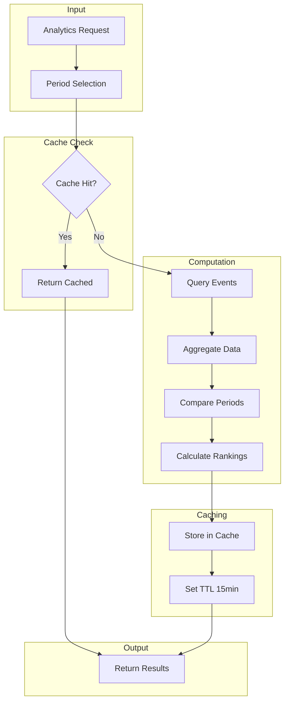

# LCS-DES-095d: Design Specification — Activity Analytics

## 1. Metadata & Categorization

| Field | Value | Description |
| :--- | :--- | :--- |
| **Feature ID** | `COL-095d` | Sub-part of COL-095 |
| **Feature Name** | `Activity Analytics (Productivity Insights)` | Data-driven productivity visualization |
| **Target Version** | `v0.9.5d` | Fourth sub-part of v0.9.5 |
| **Module Scope** | `Lexichord.Modules.Collaboration` | Collaboration module |
| **Swimlane** | `Ensemble` | Collaboration vertical |
| **License Tier** | `Teams` | Analytics require Teams tier |
| **Feature Gate Key** | `FeatureFlags.Collaboration.Analytics` | Feature flag |
| **Author** | Lead Architect | |
| **Status** | `Draft` | |
| **Last Updated** | `2026-01-27` | |
| **Parent Document** | [LCS-DES-095-INDEX](./LCS-DES-095-INDEX.md) | |
| **Scope Breakdown** | [LCS-SBD-095 S3.4](./LCS-SBD-095.md#34-v095d-activity-analytics) | |

---

## 2. Executive Summary

### 2.1 The Requirement

Teams need visibility into productivity patterns to:

- Understand team output and contribution balance
- Identify peak productivity times
- Track progress on collaborative documents
- Justify investment in writing tools
- Celebrate achievements and maintain motivation

> **Goal:** Provide data-driven productivity insights through an analytics dashboard with charts, metrics, and exportable reports.

### 2.2 The Proposed Solution

Implement a comprehensive analytics system that:

1. Computes activity summaries and productivity metrics
2. Visualizes trends with interactive charts
3. Ranks contributors and documents by activity
4. Tracks streaks and achievements for motivation
5. Exports reports in CSV and PDF formats
6. Caches computed results for performance

---

## 3. Architecture & Modular Strategy

### 3.1 Dependencies

#### 3.1.1 Upstream Dependencies

| Interface | Source Version | Purpose |
| :--- | :--- | :--- |
| `IActivityEventService` | v0.9.5a | Event data source |
| `IActivityFeedService` | v0.9.5b | Feed integration |
| `IProfileService` | v0.9.1a | User information |
| `ILicenseStateService` | v0.9.2c | Teams tier validation |
| `IDbConnectionFactory` | v0.0.5c | Aggregate queries |

#### 3.1.2 NuGet Packages

| Package | Version | Purpose |
| :--- | :--- | :--- |
| `LiveChartsCore.SkiaSharpView.Avalonia` | 2.x | Chart visualization |
| `QuestPDF` | 2024.x | PDF report generation |
| `CsvHelper` | 31.x | CSV export |
| `Microsoft.Extensions.Caching.Memory` | 8.x | Analytics caching |

### 3.2 Licensing Behavior

- **Teams:** Full analytics dashboard access
- **Enterprise:** All analytics + audit export, retention policies
- **Core/Writer/WriterPro:** Personal statistics only (own events)

---

## 4. Data Contract (The API)

### 4.1 Service Interface

```csharp
namespace Lexichord.Abstractions.Collaboration;

/// <summary>
/// Service for activity analytics and productivity insights.
/// </summary>
public interface IActivityAnalyticsService
{
    /// <summary>
    /// Gets the activity summary for a time period.
    /// </summary>
    Task<ActivitySummary> GetSummaryAsync(
        ActivityAnalyticsPeriod period,
        CancellationToken ct = default);

    /// <summary>
    /// Gets productivity metrics for a user or team.
    /// </summary>
    Task<ProductivityMetrics> GetProductivityMetricsAsync(
        Guid? userId,
        ActivityAnalyticsPeriod period,
        CancellationToken ct = default);

    /// <summary>
    /// Gets document contribution statistics.
    /// </summary>
    Task<DocumentContributionStats> GetDocumentContributionsAsync(
        Guid documentId,
        CancellationToken ct = default);

    /// <summary>
    /// Gets activity trends over time.
    /// </summary>
    Task<ActivityTrends> GetTrendsAsync(
        ActivityTrendsRequest request,
        CancellationToken ct = default);

    /// <summary>
    /// Gets the most active users in the workspace.
    /// </summary>
    Task<IReadOnlyList<UserActivityRanking>> GetTopContributorsAsync(
        ActivityAnalyticsPeriod period,
        int limit = 10,
        CancellationToken ct = default);

    /// <summary>
    /// Gets the most active documents in the workspace.
    /// </summary>
    Task<IReadOnlyList<DocumentActivityRanking>> GetMostActiveDocumentsAsync(
        ActivityAnalyticsPeriod period,
        int limit = 10,
        CancellationToken ct = default);

    /// <summary>
    /// Gets activity heatmap data (hour x day of week).
    /// </summary>
    Task<ActivityHeatmap> GetHeatmapAsync(
        ActivityAnalyticsPeriod period,
        Guid? userId = null,
        CancellationToken ct = default);

    /// <summary>
    /// Gets achievement and streak data for a user.
    /// </summary>
    Task<UserAchievements> GetAchievementsAsync(
        Guid userId,
        CancellationToken ct = default);

    /// <summary>
    /// Exports analytics data.
    /// </summary>
    Task<ExportResult> ExportAsync(
        AnalyticsExportRequest request,
        CancellationToken ct = default);

    /// <summary>
    /// Refreshes cached analytics data.
    /// </summary>
    Task RefreshCacheAsync(CancellationToken ct = default);
}
```

### 4.2 Analytics Records

```csharp
/// <summary>
/// Time periods for analytics queries.
/// </summary>
public record ActivityAnalyticsPeriod
{
    public DateTime Start { get; init; }
    public DateTime End { get; init; }

    public static ActivityAnalyticsPeriod Today => new()
    {
        Start = DateTime.UtcNow.Date,
        End = DateTime.UtcNow
    };

    public static ActivityAnalyticsPeriod Yesterday => new()
    {
        Start = DateTime.UtcNow.Date.AddDays(-1),
        End = DateTime.UtcNow.Date
    };

    public static ActivityAnalyticsPeriod ThisWeek => new()
    {
        Start = DateTime.UtcNow.Date.AddDays(-(int)DateTime.UtcNow.DayOfWeek),
        End = DateTime.UtcNow
    };

    public static ActivityAnalyticsPeriod ThisMonth => new()
    {
        Start = new DateTime(DateTime.UtcNow.Year, DateTime.UtcNow.Month, 1),
        End = DateTime.UtcNow
    };

    public static ActivityAnalyticsPeriod Last30Days => new()
    {
        Start = DateTime.UtcNow.AddDays(-30),
        End = DateTime.UtcNow
    };

    public static ActivityAnalyticsPeriod Last90Days => new()
    {
        Start = DateTime.UtcNow.AddDays(-90),
        End = DateTime.UtcNow
    };

    public static ActivityAnalyticsPeriod Custom(DateTime start, DateTime end) => new()
    {
        Start = start,
        End = end
    };

    public int DaysInPeriod => (int)(End - Start).TotalDays;
}

/// <summary>
/// Summary of activity for a period.
/// </summary>
public record ActivitySummary
{
    public required ActivityAnalyticsPeriod Period { get; init; }

    // Counts
    public int TotalEvents { get; init; }
    public int UniqueUsers { get; init; }
    public int DocumentsCreated { get; init; }
    public int DocumentsEdited { get; init; }
    public int CommentsAdded { get; init; }
    public int CommitsCreated { get; init; }
    public int PublishedDocuments { get; init; }
    public int AgentInvocations { get; init; }

    // Writing metrics
    public long TotalWordsAdded { get; init; }
    public long TotalWordsDeleted { get; init; }
    public long NetWordsAdded => TotalWordsAdded - TotalWordsDeleted;

    // Time metrics
    public TimeSpan TotalActiveTime { get; init; }
    public TimeSpan AverageSessionDuration { get; init; }

    // Comparison to previous period
    public double EventsChangePercent { get; init; }
    public double WordsChangePercent { get; init; }
    public double UsersChangePercent { get; init; }

    // Breakdown by type
    public IReadOnlyDictionary<ActivityEventType, int> EventsByType { get; init; } =
        new Dictionary<ActivityEventType, int>();

    // Breakdown by day
    public IReadOnlyDictionary<DateTime, int> EventsByDay { get; init; } =
        new Dictionary<DateTime, int>();
}

/// <summary>
/// Productivity metrics for a user or team.
/// </summary>
public record ProductivityMetrics
{
    public required ActivityAnalyticsPeriod Period { get; init; }
    public Guid? UserId { get; init; }
    public string? UserName { get; init; }

    // Writing metrics
    public int DocumentsCreated { get; init; }
    public int DocumentsEdited { get; init; }
    public long WordsWritten { get; init; }
    public double AverageWordsPerDocument { get; init; }
    public double AverageWordsPerDay { get; init; }
    public int EditSessionsCount { get; init; }

    // Collaboration metrics
    public int CommentsGiven { get; init; }
    public int CommentsReceived { get; init; }
    public int SuggestionsMade { get; init; }
    public int SuggestionsAccepted { get; init; }
    public double SuggestionAcceptanceRate { get; init; }
    public int MentionsReceived { get; init; }

    // Agent usage
    public int AgentInvocations { get; init; }
    public int AgentSuccessCount { get; init; }
    public double AgentSuccessRate { get; init; }

    // Time distribution
    public IReadOnlyDictionary<DayOfWeek, int> ActivityByDayOfWeek { get; init; } =
        new Dictionary<DayOfWeek, int>();
    public IReadOnlyDictionary<int, int> ActivityByHourOfDay { get; init; } =
        new Dictionary<int, int>();

    // Peak productivity
    public DayOfWeek MostProductiveDay { get; init; }
    public int MostProductiveHour { get; init; }

    // Streaks
    public int CurrentStreak { get; init; }
    public int LongestStreak { get; init; }
    public DateTime? LastActivityDate { get; init; }
}

/// <summary>
/// Document contribution statistics.
/// </summary>
public record DocumentContributionStats
{
    public required Guid DocumentId { get; init; }
    public required string DocumentTitle { get; init; }
    public int TotalEdits { get; init; }
    public int TotalContributors { get; init; }
    public long TotalWordsAdded { get; init; }
    public long TotalWordsDeleted { get; init; }
    public int TotalComments { get; init; }
    public int TotalSuggestions { get; init; }
    public DateTime FirstEdit { get; init; }
    public DateTime LastEdit { get; init; }
    public TimeSpan TotalEditTime { get; init; }
    public int VersionCount { get; init; }

    // Contributors breakdown
    public IReadOnlyList<ContributorStats> Contributors { get; init; } = [];

    // Edit timeline
    public IReadOnlyList<EditTimelinePoint> EditTimeline { get; init; } = [];
}

/// <summary>
/// Statistics for a document contributor.
/// </summary>
public record ContributorStats
{
    public required Guid UserId { get; init; }
    public required string UserName { get; init; }
    public string? AvatarPath { get; init; }
    public int EditCount { get; init; }
    public long WordsAdded { get; init; }
    public int CommentsAdded { get; init; }
    public int SuggestionsAccepted { get; init; }
    public double ContributionPercentage { get; init; }
    public DateTime FirstContribution { get; init; }
    public DateTime LastContribution { get; init; }
}

/// <summary>
/// Activity trends over time.
/// </summary>
public record ActivityTrends
{
    public required ActivityAnalyticsPeriod Period { get; init; }
    public required TrendGranularity Granularity { get; init; }
    public IReadOnlyList<TrendDataPoint> DataPoints { get; init; } = [];
    public double TrendDirection { get; init; }
    public double TrendPercentageChange { get; init; }
    public double AveragePerPoint { get; init; }
    public int MaxValue { get; init; }
    public int MinValue { get; init; }
}

/// <summary>
/// Granularity for trend data.
/// </summary>
public enum TrendGranularity
{
    Hourly,
    Daily,
    Weekly,
    Monthly
}

/// <summary>
/// A single data point in a trend.
/// </summary>
public record TrendDataPoint
{
    public DateTime Timestamp { get; init; }
    public string Label { get; init; } = string.Empty;
    public int EventCount { get; init; }
    public int UniqueUsers { get; init; }
    public long WordsWritten { get; init; }
    public int DocumentsEdited { get; init; }
    public IReadOnlyDictionary<ActivityEventType, int>? BreakdownByType { get; init; }
}

/// <summary>
/// User activity ranking.
/// </summary>
public record UserActivityRanking
{
    public required int Rank { get; init; }
    public required Guid UserId { get; init; }
    public required string UserName { get; init; }
    public string? AvatarPath { get; init; }
    public int EventCount { get; init; }
    public long WordsWritten { get; init; }
    public int DocumentsEdited { get; init; }
    public int CommentsAdded { get; init; }
    public double ChangeFromPrevious { get; init; }
    public int PreviousRank { get; init; }
}

/// <summary>
/// Document activity ranking.
/// </summary>
public record DocumentActivityRanking
{
    public required int Rank { get; init; }
    public required Guid DocumentId { get; init; }
    public required string DocumentTitle { get; init; }
    public int EventCount { get; init; }
    public int ContributorCount { get; init; }
    public int EditCount { get; init; }
    public long WordsAdded { get; init; }
    public DateTime LastActivity { get; init; }
    public double ChangeFromPrevious { get; init; }
}

/// <summary>
/// Activity heatmap (hour x day of week).
/// </summary>
public record ActivityHeatmap
{
    public required ActivityAnalyticsPeriod Period { get; init; }
    public Guid? UserId { get; init; }

    /// <summary>
    /// Heatmap data: [dayOfWeek][hour] = count
    /// </summary>
    public int[,] Data { get; init; } = new int[7, 24];

    public int MaxValue { get; init; }
    public int TotalEvents { get; init; }

    public int GetValue(DayOfWeek day, int hour) => Data[(int)day, hour];
}

/// <summary>
/// User achievements and streaks.
/// </summary>
public record UserAchievements
{
    public required Guid UserId { get; init; }
    public int CurrentStreak { get; init; }
    public int LongestStreak { get; init; }
    public int TotalDocumentsCreated { get; init; }
    public long TotalWordsWritten { get; init; }
    public int TotalCommentsGiven { get; init; }
    public IReadOnlyList<Achievement> UnlockedAchievements { get; init; } = [];
    public IReadOnlyList<Achievement> UpcomingAchievements { get; init; } = [];
}

/// <summary>
/// An achievement badge.
/// </summary>
public record Achievement
{
    public required string Id { get; init; }
    public required string Name { get; init; }
    public required string Description { get; init; }
    public required string IconPath { get; init; }
    public DateTime? UnlockedAt { get; init; }
    public int? Progress { get; init; }
    public int? Target { get; init; }
    public double ProgressPercent => Target.HasValue && Progress.HasValue
        ? (double)Progress.Value / Target.Value * 100
        : 0;
}

/// <summary>
/// Request for exporting analytics.
/// </summary>
public record AnalyticsExportRequest
{
    public required AnalyticsExportFormat Format { get; init; }
    public required ActivityAnalyticsPeriod Period { get; init; }
    public bool IncludeSummary { get; init; } = true;
    public bool IncludeUserMetrics { get; init; } = true;
    public bool IncludeDocumentMetrics { get; init; } = true;
    public bool IncludeTrends { get; init; } = true;
    public bool IncludeHeatmap { get; init; } = true;
    public bool IncludeRawEvents { get; init; } = false;
}

/// <summary>
/// Export format options.
/// </summary>
public enum AnalyticsExportFormat
{
    Csv,
    Json,
    Pdf
}

/// <summary>
/// Export result.
/// </summary>
public record ExportResult
{
    public required byte[] Data { get; init; }
    public required string FileName { get; init; }
    public required string ContentType { get; init; }
    public long SizeBytes => Data.Length;
}
```

---

## 5. Implementation Logic

### 5.1 Analytics Computation Flow



### 5.2 Summary Computation

```csharp
public async Task<ActivitySummary> ComputeSummaryAsync(
    ActivityAnalyticsPeriod period,
    CancellationToken ct)
{
    // Query events for this period
    var events = await _eventService.GetEventsAsync(new ActivityEventQuery
    {
        Since = period.Start,
        Until = period.End,
        IncludeSystemEvents = false,
        Limit = int.MaxValue
    }, ct);

    // Query previous period for comparison
    var previousPeriod = GetPreviousPeriod(period);
    var previousEvents = await _eventService.GetEventsAsync(new ActivityEventQuery
    {
        Since = previousPeriod.Start,
        Until = previousPeriod.End,
        IncludeSystemEvents = false,
        Limit = int.MaxValue
    }, ct);

    // Compute metrics
    var summary = new ActivitySummary
    {
        Period = period,
        TotalEvents = events.Count,
        UniqueUsers = events.Select(e => e.ActorId).Distinct().Count(),
        DocumentsCreated = events.Count(e => e.EventType == ActivityEventType.DocumentCreated),
        DocumentsEdited = events.Count(e => e.EventType == ActivityEventType.DocumentEdited),
        CommentsAdded = events.Count(e => e.EventType == ActivityEventType.CommentAdded),
        CommitsCreated = events.Count(e => e.EventType == ActivityEventType.CommitCreated),
        PublishedDocuments = events.Count(e => e.EventType == ActivityEventType.DocumentPublished),
        AgentInvocations = events.Count(e => e.EventType == ActivityEventType.AgentInvoked),

        TotalWordsAdded = events
            .Where(e => e.Metadata?.ContainsKey("wordsAdded") == true)
            .Sum(e => Convert.ToInt64(e.Metadata!["wordsAdded"])),

        TotalWordsDeleted = events
            .Where(e => e.Metadata?.ContainsKey("wordsDeleted") == true)
            .Sum(e => Convert.ToInt64(e.Metadata!["wordsDeleted"])),

        EventsChangePercent = CalculateChangePercent(events.Count, previousEvents.Count),
        UsersChangePercent = CalculateChangePercent(
            events.Select(e => e.ActorId).Distinct().Count(),
            previousEvents.Select(e => e.ActorId).Distinct().Count()),

        EventsByType = events
            .GroupBy(e => e.EventType)
            .ToDictionary(g => g.Key, g => g.Count()),

        EventsByDay = events
            .GroupBy(e => e.OccurredAt.Date)
            .ToDictionary(g => g.Key, g => g.Count())
    };

    return summary;
}

private double CalculateChangePercent(int current, int previous)
{
    if (previous == 0) return current > 0 ? 100 : 0;
    return ((double)current - previous) / previous * 100;
}
```

### 5.3 Heatmap Computation

```csharp
public async Task<ActivityHeatmap> ComputeHeatmapAsync(
    ActivityAnalyticsPeriod period,
    Guid? userId,
    CancellationToken ct)
{
    var query = new ActivityEventQuery
    {
        Since = period.Start,
        Until = period.End,
        ActorIds = userId.HasValue ? [userId.Value] : null,
        Limit = int.MaxValue
    };

    var events = await _eventService.GetEventsAsync(query, ct);

    var data = new int[7, 24];
    var maxValue = 0;

    foreach (var evt in events)
    {
        var dayOfWeek = (int)evt.OccurredAt.DayOfWeek;
        var hour = evt.OccurredAt.Hour;

        data[dayOfWeek, hour]++;
        maxValue = Math.Max(maxValue, data[dayOfWeek, hour]);
    }

    return new ActivityHeatmap
    {
        Period = period,
        UserId = userId,
        Data = data,
        MaxValue = maxValue,
        TotalEvents = events.Count
    };
}
```

### 5.4 Export Generation

```csharp
public async Task<ExportResult> ExportAsync(
    AnalyticsExportRequest request,
    CancellationToken ct)
{
    return request.Format switch
    {
        AnalyticsExportFormat.Csv => await ExportCsvAsync(request, ct),
        AnalyticsExportFormat.Json => await ExportJsonAsync(request, ct),
        AnalyticsExportFormat.Pdf => await ExportPdfAsync(request, ct),
        _ => throw new ArgumentOutOfRangeException()
    };
}

private async Task<ExportResult> ExportPdfAsync(
    AnalyticsExportRequest request,
    CancellationToken ct)
{
    var summary = await GetSummaryAsync(request.Period, ct);
    var topContributors = await GetTopContributorsAsync(request.Period, 10, ct);
    var trends = await GetTrendsAsync(new ActivityTrendsRequest
    {
        Period = request.Period,
        Granularity = TrendGranularity.Daily
    }, ct);

    var document = Document.Create(container =>
    {
        container.Page(page =>
        {
            page.Margin(50);
            page.Header().Text($"Activity Report: {request.Period.Start:yyyy-MM-dd} to {request.Period.End:yyyy-MM-dd}")
                .FontSize(20).Bold();

            page.Content().Column(column =>
            {
                // Summary section
                column.Item().Text("Summary").FontSize(16).Bold();
                column.Item().Table(table =>
                {
                    table.ColumnsDefinition(c =>
                    {
                        c.RelativeColumn();
                        c.RelativeColumn();
                    });
                    table.Cell().Text("Total Events");
                    table.Cell().Text(summary.TotalEvents.ToString("N0"));
                    table.Cell().Text("Active Users");
                    table.Cell().Text(summary.UniqueUsers.ToString("N0"));
                    table.Cell().Text("Documents Created");
                    table.Cell().Text(summary.DocumentsCreated.ToString("N0"));
                    table.Cell().Text("Words Written");
                    table.Cell().Text(summary.TotalWordsAdded.ToString("N0"));
                });

                // Top contributors
                column.Item().PaddingTop(20).Text("Top Contributors").FontSize(16).Bold();
                foreach (var contributor in topContributors.Take(5))
                {
                    column.Item().Text($"{contributor.Rank}. {contributor.UserName}: {contributor.EventCount} events");
                }
            });

            page.Footer().AlignCenter().Text(x =>
            {
                x.Span("Generated by Lexichord on ");
                x.Span(DateTime.UtcNow.ToString("yyyy-MM-dd HH:mm")).Italic();
            });
        });
    });

    var pdfBytes = document.GeneratePdf();

    return new ExportResult
    {
        Data = pdfBytes,
        FileName = $"analytics-{request.Period.Start:yyyyMMdd}-{request.Period.End:yyyyMMdd}.pdf",
        ContentType = "application/pdf"
    };
}
```

---

## 6. UI Components

### 6.1 Analytics Dashboard Layout

```text
+------------------------------------------------------------------+
|  Activity Analytics                        [Last 30 Days v] [Export]|
+------------------------------------------------------------------+
| SUMMARY                                                           |
+------------------------------------------------------------------+
| +------------+  +------------+  +------------+  +------------+    |
| | 1,247      |  | 23         |  | 45,892     |  | 156        |    |
| | Events     |  | Active     |  | Words      |  | Comments   |    |
| | +12%       |  | Users      |  | Written    |  | Added      |    |
| | [Chart]    |  | [Chart]    |  | [Chart]    |  | [Chart]    |    |
| +------------+  +------------+  +------------+  +------------+    |
+------------------------------------------------------------------+
| ACTIVITY TRENDS                                      [Daily v]    |
+------------------------------------------------------------------+
|                                                                   |
|   1500 |                                                          |
|        |    *  *                                                  |
|   1000 |  *    *  *     *                                         |
|        | *        *   *   *    *  *                               |
|    500 |            *       *       *                             |
|        |                         *                                |
|      0 +---------------------------------------------------->     |
|        Jan 1    Jan 7    Jan 14   Jan 21   Jan 27                |
|                                                                   |
+------------------------------------------------------------------+
| TOP CONTRIBUTORS              | MOST ACTIVE DOCUMENTS            |
+-------------------------------+----------------------------------+
| 1. [A] John Smith    234 events | 1. Project Proposal    89 edits|
|    +15% from last period        |    5 contributors              |
| 2. [A] Sarah Lee     198 events | 2. Q4 Report          67 edits|
|    +8% from last period         |    3 contributors              |
| 3. [A] Mike Chen     145 events | 3. Marketing Plan     54 edits|
|    -5% from last period         |    4 contributors              |
| 4. [A] Emily Davis   123 events | 4. User Guide         43 edits|
| 5. [A] Chris Wilson   98 events | 5. Release Notes      38 edits|
+-------------------------------+----------------------------------+
| PRODUCTIVITY HEATMAP                                              |
+------------------------------------------------------------------+
|        Mon  Tue  Wed  Thu  Fri  Sat  Sun                         |
| 00:00  [_] [_] [_] [_] [_] [_] [_]                               |
| 06:00  [_] [_] [_] [_] [_] [_] [_]                               |
| 09:00  [#] [#] [#] [#] [#] [_] [_]  # = high activity            |
| 12:00  [*] [*] [*] [*] [*] [_] [_]  * = medium activity          |
| 15:00  [#] [#] [#] [#] [#] [_] [_]  _ = low activity             |
| 18:00  [_] [*] [_] [*] [_] [_] [_]                               |
| 21:00  [_] [_] [_] [_] [_] [_] [_]                               |
+------------------------------------------------------------------+
```

### 6.2 ViewModel

```csharp
public partial class ActivityAnalyticsViewModel : ObservableObject
{
    private readonly IActivityAnalyticsService _analyticsService;
    private readonly ILicenseStateService _licenseService;

    [ObservableProperty]
    private ActivitySummary? _summary;

    [ObservableProperty]
    private IReadOnlyList<UserActivityRanking> _topContributors = [];

    [ObservableProperty]
    private IReadOnlyList<DocumentActivityRanking> _mostActiveDocuments = [];

    [ObservableProperty]
    private ActivityTrends? _trends;

    [ObservableProperty]
    private ActivityHeatmap? _heatmap;

    [ObservableProperty]
    private ActivityAnalyticsPeriod _selectedPeriod = ActivityAnalyticsPeriod.Last30Days;

    [ObservableProperty]
    private TrendGranularity _selectedGranularity = TrendGranularity.Daily;

    [ObservableProperty]
    private bool _isLoading;

    [ObservableProperty]
    private string? _errorMessage;

    // Chart data
    [ObservableProperty]
    private ISeries[] _trendSeries = [];

    [ObservableProperty]
    private Axis[] _trendXAxes = [];

    [ObservableProperty]
    private Axis[] _trendYAxes = [];

    public ActivityAnalyticsViewModel(
        IActivityAnalyticsService analyticsService,
        ILicenseStateService licenseService)
    {
        _analyticsService = analyticsService;
        _licenseService = licenseService;
    }

    [RelayCommand]
    private async Task LoadAsync()
    {
        if (!await CheckLicenseAsync()) return;

        IsLoading = true;
        ErrorMessage = null;

        try
        {
            // Load all data in parallel
            var summaryTask = _analyticsService.GetSummaryAsync(SelectedPeriod);
            var contributorsTask = _analyticsService.GetTopContributorsAsync(SelectedPeriod, 10);
            var documentsTask = _analyticsService.GetMostActiveDocumentsAsync(SelectedPeriod, 10);
            var trendsTask = _analyticsService.GetTrendsAsync(new ActivityTrendsRequest
            {
                Period = SelectedPeriod,
                Granularity = SelectedGranularity
            });
            var heatmapTask = _analyticsService.GetHeatmapAsync(SelectedPeriod);

            await Task.WhenAll(summaryTask, contributorsTask, documentsTask, trendsTask, heatmapTask);

            Summary = summaryTask.Result;
            TopContributors = contributorsTask.Result;
            MostActiveDocuments = documentsTask.Result;
            Trends = trendsTask.Result;
            Heatmap = heatmapTask.Result;

            UpdateCharts();
        }
        catch (Exception ex)
        {
            ErrorMessage = "Failed to load analytics";
        }
        finally
        {
            IsLoading = false;
        }
    }

    [RelayCommand]
    private async Task ExportAsync(AnalyticsExportFormat format)
    {
        try
        {
            var result = await _analyticsService.ExportAsync(new AnalyticsExportRequest
            {
                Format = format,
                Period = SelectedPeriod
            });

            // Save file dialog
            await SaveFileAsync(result.Data, result.FileName, result.ContentType);
        }
        catch (Exception ex)
        {
            ErrorMessage = "Export failed";
        }
    }

    private void UpdateCharts()
    {
        if (Trends is null) return;

        TrendSeries =
        [
            new LineSeries<int>
            {
                Values = Trends.DataPoints.Select(p => p.EventCount).ToArray(),
                Fill = null,
                GeometrySize = 8,
                LineSmoothness = 0.5
            }
        ];

        TrendXAxes =
        [
            new Axis
            {
                Labels = Trends.DataPoints.Select(p => p.Label).ToArray(),
                LabelsRotation = 45
            }
        ];

        TrendYAxes =
        [
            new Axis
            {
                MinLimit = 0
            }
        ];
    }

    private async Task<bool> CheckLicenseAsync()
    {
        var license = _licenseService.CurrentState;
        if (license.License?.Tier < LicenseTier.Teams)
        {
            // Show upgrade modal
            return false;
        }
        return true;
    }
}
```

---

## 7. Test Scenarios

```csharp
[Trait("Category", "Unit")]
[Trait("Version", "v0.9.5d")]
public class ActivityAnalyticsServiceTests
{
    [Fact]
    public async Task GetSummaryAsync_WithEvents_ReturnsAccurateCounts()
    {
        // Arrange
        var events = new[]
        {
            CreateEvent(ActivityEventType.DocumentCreated),
            CreateEvent(ActivityEventType.DocumentCreated),
            CreateEvent(ActivityEventType.DocumentEdited),
            CreateEvent(ActivityEventType.CommentAdded)
        };
        var sut = CreateService(events);

        // Act
        var result = await sut.GetSummaryAsync(ActivityAnalyticsPeriod.Last30Days);

        // Assert
        result.TotalEvents.Should().Be(4);
        result.DocumentsCreated.Should().Be(2);
        result.DocumentsEdited.Should().Be(1);
        result.CommentsAdded.Should().Be(1);
    }

    [Fact]
    public async Task GetSummaryAsync_ComparesWithPreviousPeriod()
    {
        // Arrange
        var currentEvents = CreateEvents(100);
        var previousEvents = CreateEvents(80);
        var sut = CreateService(currentEvents, previousEvents);

        // Act
        var result = await sut.GetSummaryAsync(ActivityAnalyticsPeriod.Last30Days);

        // Assert
        result.EventsChangePercent.Should().BeApproximately(25, 1); // (100-80)/80 = 25%
    }

    [Fact]
    public async Task GetTopContributorsAsync_ReturnsRankedList()
    {
        // Arrange - User A: 10 events, User B: 5 events, User C: 15 events
        var events = CreateEventsForUsers(
            (UserA, 10),
            (UserB, 5),
            (UserC, 15)
        );
        var sut = CreateService(events);

        // Act
        var result = await sut.GetTopContributorsAsync(ActivityAnalyticsPeriod.Last30Days, 10);

        // Assert
        result.Should().HaveCount(3);
        result[0].UserId.Should().Be(UserC);
        result[0].Rank.Should().Be(1);
        result[0].EventCount.Should().Be(15);
        result[1].UserId.Should().Be(UserA);
        result[2].UserId.Should().Be(UserB);
    }

    [Fact]
    public async Task GetHeatmapAsync_CorrectlyAggregatesByHourAndDay()
    {
        // Arrange - Events on Monday at 9am
        var monday9am = GetNext(DayOfWeek.Monday).AddHours(9);
        var events = new[]
        {
            CreateEvent(occurredAt: monday9am),
            CreateEvent(occurredAt: monday9am.AddMinutes(15)),
            CreateEvent(occurredAt: monday9am.AddMinutes(30))
        };
        var sut = CreateService(events);

        // Act
        var result = await sut.GetHeatmapAsync(ActivityAnalyticsPeriod.Last30Days);

        // Assert
        result.GetValue(DayOfWeek.Monday, 9).Should().Be(3);
        result.MaxValue.Should().Be(3);
    }

    [Fact]
    public async Task ExportAsync_Csv_GeneratesValidFile()
    {
        // Arrange
        var sut = CreateService(CreateEvents(50));

        // Act
        var result = await sut.ExportAsync(new AnalyticsExportRequest
        {
            Format = AnalyticsExportFormat.Csv,
            Period = ActivityAnalyticsPeriod.Last30Days
        });

        // Assert
        result.ContentType.Should().Be("text/csv");
        result.FileName.Should().EndWith(".csv");
        result.Data.Should().NotBeEmpty();

        // Verify CSV structure
        var csv = Encoding.UTF8.GetString(result.Data);
        csv.Should().Contain("TotalEvents");
    }

    [Fact]
    public async Task ExportAsync_Pdf_GeneratesValidFile()
    {
        // Arrange
        var sut = CreateService(CreateEvents(50));

        // Act
        var result = await sut.ExportAsync(new AnalyticsExportRequest
        {
            Format = AnalyticsExportFormat.Pdf,
            Period = ActivityAnalyticsPeriod.Last30Days
        });

        // Assert
        result.ContentType.Should().Be("application/pdf");
        result.FileName.Should().EndWith(".pdf");
        result.Data.Should().StartWith(new byte[] { 0x25, 0x50, 0x44, 0x46 }); // %PDF
    }

    [Fact]
    public async Task GetSummaryAsync_WithCaching_ReturnsCachedResult()
    {
        // Arrange
        var sut = CreateService(CreateEvents(50));

        // Act - First call computes
        var result1 = await sut.GetSummaryAsync(ActivityAnalyticsPeriod.Last30Days);

        // Add more events
        AddEvents(CreateEvents(25));

        // Act - Second call should return cached
        var result2 = await sut.GetSummaryAsync(ActivityAnalyticsPeriod.Last30Days);

        // Assert
        result1.TotalEvents.Should().Be(result2.TotalEvents); // Same cached value
    }
}
```

---

## 8. Observability & Logging

| Level | Message Template |
| :--- | :--- |
| Debug | `"Computing analytics for period {Start} to {End}"` |
| Info | `"Analytics computed: {EventCount} events, {UserCount} users"` |
| Debug | `"Cache hit for analytics key {CacheKey}"` |
| Info | `"Analytics cache refreshed in {ElapsedMs}ms"` |
| Info | `"Analytics exported: {Format}, {SizeKb}KB"` |
| Warning | `"Analytics computation slow: {ElapsedMs}ms (target: 3000ms)"` |
| Error | `"Analytics computation failed: {Error}"` |

---

## 9. Acceptance Criteria

| # | Given | When | Then |
| :--- | :--- | :--- | :--- |
| 1 | 1000 events in period | Load summary | Returns accurate counts |
| 2 | Events from 5 users | Load contributors | Correct ranking order |
| 3 | Events at various times | Load heatmap | Correct hour/day mapping |
| 4 | Previous period data | Load summary | Change percentages correct |
| 5 | Large dataset | Load dashboard | Completes in < 3s |
| 6 | Export CSV requested | Export clicked | Valid CSV downloaded |
| 7 | Export PDF requested | Export clicked | Valid PDF downloaded |
| 8 | Teams license | Access dashboard | Full access granted |
| 9 | Core license | Access dashboard | Personal stats only |
| 10 | Cached data exists | Reload | Returns cached in < 100ms |

---

## 10. Achievements System

```csharp
public static class AchievementDefinitions
{
    public static readonly Achievement[] All =
    [
        new Achievement
        {
            Id = "first_document",
            Name = "First Steps",
            Description = "Create your first document",
            IconPath = "Achievements/first_document.svg",
            Target = 1
        },
        new Achievement
        {
            Id = "prolific_writer",
            Name = "Prolific Writer",
            Description = "Write 10,000 words",
            IconPath = "Achievements/prolific_writer.svg",
            Target = 10000
        },
        new Achievement
        {
            Id = "streak_week",
            Name = "Week Warrior",
            Description = "Maintain a 7-day writing streak",
            IconPath = "Achievements/streak_week.svg",
            Target = 7
        },
        new Achievement
        {
            Id = "streak_month",
            Name = "Consistency Champion",
            Description = "Maintain a 30-day writing streak",
            IconPath = "Achievements/streak_month.svg",
            Target = 30
        },
        new Achievement
        {
            Id = "collaborator",
            Name = "Team Player",
            Description = "Leave 100 comments on others' documents",
            IconPath = "Achievements/collaborator.svg",
            Target = 100
        },
        new Achievement
        {
            Id = "published",
            Name = "Publisher",
            Description = "Publish 10 documents",
            IconPath = "Achievements/published.svg",
            Target = 10
        }
    ];
}
```

---

## 11. Deliverable Checklist

| # | Deliverable | Status |
| :--- | :--- | :--- |
| 1 | `IActivityAnalyticsService` interface | [ ] |
| 2 | `ActivityAnalyticsService` implementation | [ ] |
| 3 | Analytics records (Summary, Metrics, etc.) | [ ] |
| 4 | Summary computation logic | [ ] |
| 5 | Trend computation logic | [ ] |
| 6 | Ranking computation logic | [ ] |
| 7 | Heatmap computation logic | [ ] |
| 8 | Analytics caching layer | [ ] |
| 9 | CSV export | [ ] |
| 10 | PDF export with QuestPDF | [ ] |
| 11 | `ActivityAnalyticsDashboardView.axaml` | [ ] |
| 12 | `ActivityAnalyticsViewModel` | [ ] |
| 13 | Chart components (LiveCharts) | [ ] |
| 14 | Heatmap visualization | [ ] |
| 15 | Achievement system | [ ] |
| 16 | Unit tests | [ ] |
| 17 | Integration tests | [ ] |

---

## Document History

| Version | Date | Author | Changes |
| :--- | :--- | :--- | :--- |
| 1.0 | 2026-01-27 | Lead Architect | Initial draft |
