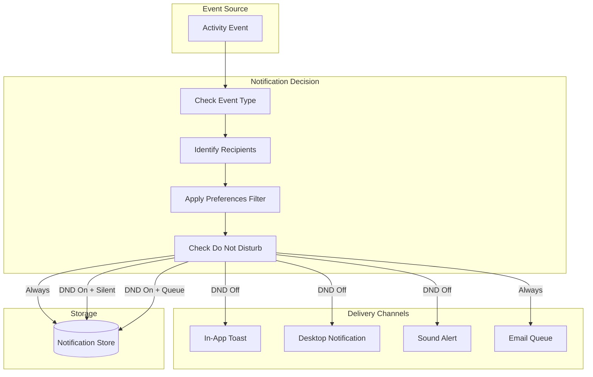

# LCS-DES-095c: Design Specification — Notifications

## 1. Metadata & Categorization

| Field | Value | Description |
| :--- | :--- | :--- |
| **Feature ID** | `COL-095c` | Sub-part of COL-095 |
| **Feature Name** | `Notifications (In-App and Email)` | Multi-channel notification system |
| **Target Version** | `v0.9.5c` | Third sub-part of v0.9.5 |
| **Module Scope** | `Lexichord.Modules.Collaboration` | Collaboration module |
| **Swimlane** | `Ensemble` | Collaboration vertical |
| **License Tier** | `Teams` | Full notifications require Teams |
| **Feature Gate Key** | `FeatureFlags.Collaboration.Notifications` | Feature flag |
| **Author** | Lead Architect | |
| **Status** | `Draft` | |
| **Last Updated** | `2026-01-27` | |
| **Parent Document** | [LCS-DES-095-INDEX](./LCS-DES-095-INDEX.md) | |
| **Scope Breakdown** | [LCS-SBD-095 S3.3](./LCS-SBD-095.md#33-v095c-notifications) | |

---

## 2. Executive Summary

### 2.1 The Requirement

Team collaboration generates many events, but not all are equally important to each user. Users need:

- Timely alerts for events that matter to them
- Control over what notifications they receive
- Multiple delivery channels (in-app, email, desktop)
- Ability to focus without interruption (Do Not Disturb)

> **Goal:** Deliver activity alerts through in-app notifications and optional email digests with granular user preferences.

### 2.2 The Proposed Solution

Implement a comprehensive notification system that:

1. Delivers real-time in-app toast notifications
2. Sends email digests at configurable intervals
3. Provides granular notification preferences per event type
4. Supports Do Not Disturb scheduling
5. Tracks notification read/dismiss state
6. Optionally integrates with OS desktop notifications

---

## 3. Architecture & Modular Strategy

### 3.1 Dependencies

#### 3.1.1 Upstream Dependencies

| Interface | Source Version | Purpose |
| :--- | :--- | :--- |
| `IActivityEventService` | v0.9.5a | Event source for notifications |
| `IActivityFeedService` | v0.9.5b | Feed integration |
| `IProfileService` | v0.9.1a | User profile for preferences |
| `ISettingsService` | v0.1.6a | Preference persistence |
| `ISecureVault` | v0.0.6a | Email credentials storage |

#### 3.1.2 NuGet Packages

| Package | Version | Purpose |
| :--- | :--- | :--- |
| `FluentEmail.Core` | 3.x | Email templating |
| `FluentEmail.Smtp` | 3.x | SMTP transport |
| `FluentEmail.Razor` | 3.x | Razor email templates |
| `Quartz.NET` | 3.x | Email digest scheduling |
| `System.Reactive` | 6.x | Notification streams |

### 3.2 Licensing Behavior

- **Core/Writer/WriterPro:** Basic in-app notifications only
- **Teams:** Full notification preferences, email digests, desktop notifications
- **Enterprise:** All features + audit logging of notification delivery

---

## 4. Data Contract (The API)

### 4.1 Service Interface

```csharp
namespace Lexichord.Abstractions.Collaboration;

/// <summary>
/// Service for managing and delivering notifications.
/// </summary>
public interface INotificationService
{
    /// <summary>
    /// Sends a notification to one or more users.
    /// </summary>
    Task SendNotificationAsync(
        NotificationRequest request,
        CancellationToken ct = default);

    /// <summary>
    /// Gets pending notifications for the current user.
    /// </summary>
    Task<IReadOnlyList<Notification>> GetPendingNotificationsAsync(
        int limit = 20,
        CancellationToken ct = default);

    /// <summary>
    /// Gets notification history.
    /// </summary>
    Task<IReadOnlyList<Notification>> GetNotificationHistoryAsync(
        DateTime? since = null,
        int limit = 50,
        CancellationToken ct = default);

    /// <summary>
    /// Marks notifications as read.
    /// </summary>
    Task MarkAsReadAsync(
        IEnumerable<Guid> notificationIds,
        CancellationToken ct = default);

    /// <summary>
    /// Marks all notifications as read.
    /// </summary>
    Task MarkAllAsReadAsync(CancellationToken ct = default);

    /// <summary>
    /// Dismisses a notification.
    /// </summary>
    Task DismissAsync(
        Guid notificationId,
        CancellationToken ct = default);

    /// <summary>
    /// Dismisses all notifications.
    /// </summary>
    Task DismissAllAsync(CancellationToken ct = default);

    /// <summary>
    /// Gets the notification preferences for the current user.
    /// </summary>
    Task<NotificationPreferences> GetPreferencesAsync(
        CancellationToken ct = default);

    /// <summary>
    /// Updates notification preferences.
    /// </summary>
    Task UpdatePreferencesAsync(
        NotificationPreferences preferences,
        CancellationToken ct = default);

    /// <summary>
    /// Subscribes to real-time notifications.
    /// </summary>
    IObservable<Notification> Subscribe();

    /// <summary>
    /// Gets the unread notification count.
    /// </summary>
    Task<int> GetUnreadCountAsync(CancellationToken ct = default);

    /// <summary>
    /// Checks if Do Not Disturb is currently active.
    /// </summary>
    Task<bool> IsDoNotDisturbActiveAsync(CancellationToken ct = default);

    /// <summary>
    /// Manually triggers an email digest for testing.
    /// </summary>
    Task SendDigestAsync(
        Guid userId,
        EmailDigestFrequency frequency,
        CancellationToken ct = default);
}
```

### 4.2 Notification Records

```csharp
/// <summary>
/// Represents a notification to be displayed or sent.
/// </summary>
public record Notification
{
    /// <summary>
    /// Unique identifier.
    /// </summary>
    public Guid NotificationId { get; init; } = Guid.NewGuid();

    /// <summary>
    /// Type of notification.
    /// </summary>
    public required NotificationType Type { get; init; }

    /// <summary>
    /// Short title for display.
    /// </summary>
    public required string Title { get; init; }

    /// <summary>
    /// Full notification body.
    /// </summary>
    public required string Body { get; init; }

    /// <summary>
    /// Icon path for the notification.
    /// </summary>
    public string? IconPath { get; init; }

    /// <summary>
    /// The event that triggered this notification.
    /// </summary>
    public Guid? SourceEventId { get; init; }

    /// <summary>
    /// The user who caused this notification.
    /// </summary>
    public Guid? SourceUserId { get; init; }

    /// <summary>
    /// The document related to this notification.
    /// </summary>
    public Guid? TargetDocumentId { get; init; }

    /// <summary>
    /// URL to navigate to when clicked.
    /// </summary>
    public string? ActionUrl { get; init; }

    /// <summary>
    /// When the notification was created.
    /// </summary>
    public DateTime CreatedAt { get; init; } = DateTime.UtcNow;

    /// <summary>
    /// When the notification was read.
    /// </summary>
    public DateTime? ReadAt { get; init; }

    /// <summary>
    /// When the notification was dismissed.
    /// </summary>
    public DateTime? DismissedAt { get; init; }

    /// <summary>
    /// Priority level.
    /// </summary>
    public NotificationPriority Priority { get; init; } = NotificationPriority.Normal;

    /// <summary>
    /// Whether the notification has been read.
    /// </summary>
    public bool IsRead => ReadAt.HasValue;

    /// <summary>
    /// Whether the notification has been dismissed.
    /// </summary>
    public bool IsDismissed => DismissedAt.HasValue;

    /// <summary>
    /// Recipient user ID.
    /// </summary>
    public Guid RecipientId { get; init; }
}

/// <summary>
/// Types of notifications.
/// </summary>
public enum NotificationType
{
    // Document notifications (100)
    DocumentShared = 100,
    DocumentMentioned = 101,
    DocumentCommented = 102,
    DocumentEdited = 103,
    DocumentPublished = 104,
    DocumentDeleted = 105,

    // Collaboration notifications (200)
    SuggestionReceived = 200,
    SuggestionAccepted = 201,
    SuggestionRejected = 202,
    CommentReply = 210,
    MentionedInComment = 211,

    // Team notifications (300)
    UserJoined = 300,
    UserLeft = 301,
    RoleChanged = 302,
    InvitationReceived = 303,

    // Agent notifications (400)
    AgentCompleted = 400,
    AgentFailed = 401,

    // System notifications (900)
    SystemAnnouncement = 900,
    UpdateAvailable = 901,
    LicenseExpiring = 902,
    MaintenanceScheduled = 903
}

/// <summary>
/// Priority levels for notifications.
/// </summary>
public enum NotificationPriority
{
    /// <summary>
    /// Low priority, may be batched or delayed.
    /// </summary>
    Low = 0,

    /// <summary>
    /// Normal priority for standard notifications.
    /// </summary>
    Normal = 1,

    /// <summary>
    /// High priority, delivered immediately.
    /// </summary>
    High = 2,

    /// <summary>
    /// Urgent, bypasses Do Not Disturb.
    /// </summary>
    Urgent = 3
}
```

### 4.3 Notification Preferences

```csharp
/// <summary>
/// User preferences for notifications.
/// </summary>
public record NotificationPreferences
{
    // ═══════════════════════════════════════════════════════════════
    // Global Settings
    // ═══════════════════════════════════════════════════════════════

    /// <summary>
    /// Enable in-app toast notifications.
    /// </summary>
    public bool EnableInAppNotifications { get; init; } = true;

    /// <summary>
    /// Enable email notifications.
    /// </summary>
    public bool EnableEmailNotifications { get; init; } = false;

    /// <summary>
    /// Enable sound alerts.
    /// </summary>
    public bool EnableSoundAlerts { get; init; } = true;

    /// <summary>
    /// Enable OS desktop notifications.
    /// </summary>
    public bool EnableDesktopNotifications { get; init; } = true;

    // ═══════════════════════════════════════════════════════════════
    // Do Not Disturb Settings
    // ═══════════════════════════════════════════════════════════════

    /// <summary>
    /// Whether Do Not Disturb is enabled.
    /// </summary>
    public bool DoNotDisturbEnabled { get; init; } = false;

    /// <summary>
    /// Start time for Do Not Disturb.
    /// </summary>
    public TimeOnly? DoNotDisturbStart { get; init; }

    /// <summary>
    /// End time for Do Not Disturb.
    /// </summary>
    public TimeOnly? DoNotDisturbEnd { get; init; }

    /// <summary>
    /// Days when Do Not Disturb is active.
    /// </summary>
    public IReadOnlyList<DayOfWeek>? DoNotDisturbDays { get; init; }

    /// <summary>
    /// Whether to completely silence all notifications during DND.
    /// If false, notifications are queued for later.
    /// </summary>
    public bool SilentDuringDoNotDisturb { get; init; } = true;

    // ═══════════════════════════════════════════════════════════════
    // Email Digest Settings
    // ═══════════════════════════════════════════════════════════════

    /// <summary>
    /// Email digest frequency.
    /// </summary>
    public EmailDigestFrequency EmailDigestFrequency { get; init; } = EmailDigestFrequency.Daily;

    /// <summary>
    /// Time of day to send email digest.
    /// </summary>
    public TimeOnly EmailDigestTime { get; init; } = new(9, 0);

    /// <summary>
    /// Timezone for email digest scheduling.
    /// </summary>
    public string EmailDigestTimezone { get; init; } = "UTC";

    /// <summary>
    /// Email address for notifications (defaults to profile email).
    /// </summary>
    public string? NotificationEmail { get; init; }

    // ═══════════════════════════════════════════════════════════════
    // Per-Type Settings
    // ═══════════════════════════════════════════════════════════════

    /// <summary>
    /// Preferences for each notification type.
    /// </summary>
    public IReadOnlyDictionary<NotificationType, NotificationTypePreference>? TypePreferences { get; init; }

    // ═══════════════════════════════════════════════════════════════
    // Muting
    // ═══════════════════════════════════════════════════════════════

    /// <summary>
    /// Users whose actions are muted.
    /// </summary>
    public IReadOnlyList<Guid>? MutedUsers { get; init; }

    /// <summary>
    /// Documents whose events are muted.
    /// </summary>
    public IReadOnlyList<Guid>? MutedDocuments { get; init; }

    /// <summary>
    /// Mute all notifications from own actions.
    /// </summary>
    public bool MuteOwnActions { get; init; } = true;
}

/// <summary>
/// Email digest frequency options.
/// </summary>
public enum EmailDigestFrequency
{
    /// <summary>
    /// Send emails immediately (not recommended).
    /// </summary>
    Realtime,

    /// <summary>
    /// Hourly digest during work hours.
    /// </summary>
    Hourly,

    /// <summary>
    /// Daily digest at configured time.
    /// </summary>
    Daily,

    /// <summary>
    /// Weekly digest on Monday.
    /// </summary>
    Weekly,

    /// <summary>
    /// Never send email notifications.
    /// </summary>
    Never
}

/// <summary>
/// Preferences for a specific notification type.
/// </summary>
public record NotificationTypePreference
{
    /// <summary>
    /// Show in-app notification.
    /// </summary>
    public bool InApp { get; init; } = true;

    /// <summary>
    /// Include in email digest.
    /// </summary>
    public bool Email { get; init; } = false;

    /// <summary>
    /// Play sound alert.
    /// </summary>
    public bool Sound { get; init; } = true;

    /// <summary>
    /// Show desktop notification.
    /// </summary>
    public bool Desktop { get; init; } = true;

    /// <summary>
    /// Completely disabled.
    /// </summary>
    public bool Disabled { get; init; } = false;
}

/// <summary>
/// Request to send a notification.
/// </summary>
public record NotificationRequest
{
    public required NotificationType Type { get; init; }
    public required string Title { get; init; }
    public required string Body { get; init; }
    public required IReadOnlyList<Guid> RecipientIds { get; init; }
    public Guid? SourceEventId { get; init; }
    public Guid? SourceUserId { get; init; }
    public Guid? TargetDocumentId { get; init; }
    public string? ActionUrl { get; init; }
    public string? IconPath { get; init; }
    public NotificationPriority Priority { get; init; } = NotificationPriority.Normal;
}
```

---

## 5. Implementation Logic

### 5.1 Notification Delivery Flow



### 5.2 Notification Filter Logic

```csharp
public class NotificationFilter
{
    public async Task<bool> ShouldDeliverAsync(
        NotificationType type,
        Guid recipientId,
        Guid? sourceUserId,
        Guid? targetDocumentId,
        NotificationPreferences prefs)
    {
        // 1. Check if globally disabled
        if (!prefs.EnableInAppNotifications)
            return false;

        // 2. Check if actor is muted
        if (sourceUserId.HasValue && prefs.MutedUsers?.Contains(sourceUserId.Value) == true)
            return false;

        // 3. Check if document is muted
        if (targetDocumentId.HasValue && prefs.MutedDocuments?.Contains(targetDocumentId.Value) == true)
            return false;

        // 4. Check if own action
        if (sourceUserId == recipientId && prefs.MuteOwnActions)
            return false;

        // 5. Check type-specific preference
        if (prefs.TypePreferences?.TryGetValue(type, out var typePref) == true)
        {
            if (typePref.Disabled)
                return false;
        }

        // 6. Check Do Not Disturb
        if (await IsDoNotDisturbActiveAsync(prefs))
            return false;

        return true;
    }

    public async Task<bool> IsDoNotDisturbActiveAsync(NotificationPreferences prefs)
    {
        if (!prefs.DoNotDisturbEnabled)
            return false;

        var now = TimeOnly.FromDateTime(DateTime.UtcNow);
        var today = DateTime.UtcNow.DayOfWeek;

        // Check if today is a DND day
        if (prefs.DoNotDisturbDays?.Contains(today) != true)
            return false;

        // Check if current time is within DND window
        if (prefs.DoNotDisturbStart.HasValue && prefs.DoNotDisturbEnd.HasValue)
        {
            var start = prefs.DoNotDisturbStart.Value;
            var end = prefs.DoNotDisturbEnd.Value;

            if (start <= end)
            {
                // Same day window (e.g., 9am - 5pm)
                return now >= start && now <= end;
            }
            else
            {
                // Overnight window (e.g., 10pm - 8am)
                return now >= start || now <= end;
            }
        }

        return false;
    }
}
```

### 5.3 Email Digest Service

```csharp
public class EmailDigestService : IEmailDigestService
{
    private readonly IActivityEventService _eventService;
    private readonly INotificationRepository _repository;
    private readonly IFluentEmail _email;
    private readonly ILogger<EmailDigestService> _logger;

    public async Task SendDigestAsync(
        Guid userId,
        EmailDigestFrequency frequency,
        CancellationToken ct = default)
    {
        // Calculate time range based on frequency
        var (since, until) = GetTimeRange(frequency);

        // Get events for this user
        var events = await _eventService.GetEventsAsync(new ActivityEventQuery
        {
            Since = since,
            Until = until,
            IncludeSystemEvents = false
        }, ct);

        // Filter to relevant events (mentions, comments, shares)
        var relevantEvents = FilterRelevantEvents(events, userId);

        if (relevantEvents.Count == 0)
        {
            _logger.LogDebug("No events for digest, skipping email for user {UserId}", userId);
            return;
        }

        // Build email content
        var model = new DigestEmailModel
        {
            Period = GetPeriodLabel(frequency),
            Highlights = GetHighlights(relevantEvents),
            DocumentGroups = GroupByDocument(relevantEvents),
            TeamEvents = GetTeamEvents(relevantEvents),
            TotalEventCount = relevantEvents.Count
        };

        // Send email
        var result = await _email
            .To(await GetEmailAddressAsync(userId, ct))
            .Subject($"Lexichord Activity Digest - {model.Period}")
            .UsingTemplateFromFile("Templates/DigestEmail.cshtml", model)
            .SendAsync(ct);

        if (result.Successful)
        {
            _logger.LogInformation("Digest sent to user {UserId} with {EventCount} events",
                userId, relevantEvents.Count);
        }
        else
        {
            _logger.LogWarning("Failed to send digest to user {UserId}: {Errors}",
                userId, string.Join(", ", result.ErrorMessages));
        }
    }

    private (DateTime since, DateTime until) GetTimeRange(EmailDigestFrequency frequency)
    {
        var now = DateTime.UtcNow;
        return frequency switch
        {
            EmailDigestFrequency.Hourly => (now.AddHours(-1), now),
            EmailDigestFrequency.Daily => (now.AddDays(-1), now),
            EmailDigestFrequency.Weekly => (now.AddDays(-7), now),
            _ => (now.AddDays(-1), now)
        };
    }
}
```

### 5.4 Toast Notification Component

```csharp
public class NotificationToastService : INotificationToastService
{
    private readonly Subject<Notification> _toastStream = new();
    private readonly Queue<Notification> _queue = new();
    private readonly SemaphoreSlim _displayLock = new(1, 1);
    private const int MaxVisibleToasts = 3;
    private const int ToastDurationMs = 5000;

    public IObservable<Notification> ToastStream => _toastStream.AsObservable();

    public async Task ShowAsync(Notification notification)
    {
        // Check if sound should play
        if (await ShouldPlaySoundAsync(notification))
        {
            await PlaySoundAsync(notification.Priority);
        }

        // Queue the toast
        _queue.Enqueue(notification);

        // Process queue
        await ProcessQueueAsync();
    }

    private async Task ProcessQueueAsync()
    {
        await _displayLock.WaitAsync();
        try
        {
            while (_queue.Count > 0)
            {
                var notification = _queue.Dequeue();
                _toastStream.OnNext(notification);

                // Auto-dismiss after duration
                _ = Task.Delay(ToastDurationMs).ContinueWith(_ =>
                {
                    _toastStream.OnNext(notification with { DismissedAt = DateTime.UtcNow });
                });
            }
        }
        finally
        {
            _displayLock.Release();
        }
    }

    private Task PlaySoundAsync(NotificationPriority priority)
    {
        var soundPath = priority switch
        {
            NotificationPriority.Urgent => "Sounds/urgent.wav",
            NotificationPriority.High => "Sounds/high.wav",
            _ => "Sounds/notification.wav"
        };

        // Play sound using platform audio
        return AudioService.PlayAsync(soundPath);
    }
}
```

---

## 6. UI Components

### 6.1 Notification Toast Layout

```text
+------------------------------------------------------------------+
|  Toast Container (top-right corner)                               |
+------------------------------------------------------------------+
| +--------------------------------------------------------------+ |
| | [Icon] Title                                      [X] Dismiss | |
| |        Body text describing the notification                  | |
| |        [Action Button]                             2 min ago  | |
| +--------------------------------------------------------------+ |
|                                                                   |
| +--------------------------------------------------------------+ |
| | [Icon] Another notification...                                | |
| +--------------------------------------------------------------+ |
+------------------------------------------------------------------+
```

### 6.2 Notification Settings Layout

```text
+------------------------------------------------------------------+
|  Notification Settings                                            |
+------------------------------------------------------------------+
| DELIVERY CHANNELS                                                 |
|------------------------------------------------------------------|
| [x] In-app notifications                                          |
|     Show toast notifications within Lexichord                     |
|                                                                   |
| [x] Desktop notifications                                         |
|     Show system notifications when Lexichord is in background     |
|                                                                   |
| [x] Sound alerts                                                  |
|     Play sound when notification arrives                          |
|                                                                   |
| [ ] Email notifications                                           |
|     Receive email summaries of activity                           |
|------------------------------------------------------------------|
| EMAIL DIGEST                                                      |
|------------------------------------------------------------------|
| Frequency: [Daily        v]                                       |
| Send at:   [9:00 AM      v]  [UTC v]                              |
| Email:     [user@example.com        ]                             |
|------------------------------------------------------------------|
| DO NOT DISTURB                                                    |
|------------------------------------------------------------------|
| [ ] Enable quiet hours                                            |
|                                                                   |
| Schedule:                                                         |
| From: [10:00 PM  v]  To: [8:00 AM   v]                            |
|                                                                   |
| Active on:                                                        |
| [x] Mon [x] Tue [x] Wed [x] Thu [x] Fri [ ] Sat [ ] Sun          |
|                                                                   |
| [ ] Completely silence (don't queue for later)                    |
|------------------------------------------------------------------|
| NOTIFICATION TYPES                                                |
|------------------------------------------------------------------|
|                              | In-app | Email | Sound | Desktop | |
| Document shared with me      |  [x]   |  [x]  |  [x]  |  [x]    | |
| Someone commented            |  [x]   |  [x]  |  [x]  |  [x]    | |
| Mentioned in document        |  [x]   |  [x]  |  [x]  |  [x]    | |
| Document published           |  [x]   |  [ ]  |  [x]  |  [x]    | |
| Agent completed              |  [x]   |  [ ]  |  [ ]  |  [ ]    | |
| Team member joined           |  [ ]   |  [ ]  |  [ ]  |  [ ]    | |
| System announcements         |  [x]   |  [x]  |  [ ]  |  [x]    | |
|------------------------------------------------------------------|
| MUTED                                                             |
|------------------------------------------------------------------|
| Users: [John Smith] [x]  [Sarah Lee] [x]                          |
|        [+ Add user]                                               |
|                                                                   |
| Documents: [Draft - ignore] [x]                                   |
|            [+ Add document]                                       |
+------------------------------------------------------------------+
| [Reset to Defaults]                              [Save Changes]   |
+------------------------------------------------------------------+
```

---

## 7. Email Template

### 7.1 Digest Email Template (Razor)

```html
@model DigestEmailModel
<!DOCTYPE html>
<html>
<head>
    <style>
        body { font-family: -apple-system, BlinkMacSystemFont, 'Segoe UI', sans-serif; }
        .header { background: #4a9eff; color: white; padding: 20px; }
        .section { margin: 20px 0; padding: 15px; border-left: 3px solid #4a9eff; }
        .event { padding: 10px 0; border-bottom: 1px solid #eee; }
        .avatar { width: 32px; height: 32px; border-radius: 50%; }
        .time { color: #666; font-size: 12px; }
        .action { display: inline-block; padding: 8px 16px; background: #4a9eff; color: white; text-decoration: none; border-radius: 4px; }
    </style>
</head>
<body>
    <div class="header">
        <h1>Your Lexichord Activity Digest</h1>
        <p>@Model.Period</p>
    </div>

    @if (Model.Highlights.Any())
    {
        <div class="section">
            <h2>Highlights</h2>
            @foreach (var highlight in Model.Highlights)
            {
                <div class="event">
                    
                    <strong>@highlight.UserName</strong> @highlight.Description
                    <span class="time">@highlight.RelativeTime</span>
                </div>
            }
        </div>
    }

    @if (Model.DocumentGroups.Any())
    {
        <div class="section">
            <h2>Document Activity</h2>
            @foreach (var group in Model.DocumentGroups)
            {
                <h3>@group.DocumentTitle</h3>
                @foreach (var evt in group.Events.Take(5))
                {
                    <div class="event">
                        <strong>@evt.UserName</strong> @evt.Description
                    </div>
                }
                @if (group.Events.Count > 5)
                {
                    <p><em>+ @(group.Events.Count - 5) more events</em></p>
                }
            }
        </div>
    }

    @if (Model.TeamEvents.Any())
    {
        <div class="section">
            <h2>Team Activity</h2>
            @foreach (var evt in Model.TeamEvents)
            {
                <div class="event">@evt.Description</div>
            }
        </div>
    }

    <div style="margin-top: 30px; text-align: center;">
        <a class="action" href="@Model.FeedUrl">View Full Activity Feed</a>
    </div>

    <div style="margin-top: 20px; color: #666; font-size: 12px; text-align: center;">
        <a href="@Model.PreferencesUrl">Manage notification preferences</a>
        <br />
        @Model.TotalEventCount events in this digest
    </div>
</body>
</html>
```

---

## 8. Test Scenarios

```csharp
[Trait("Category", "Unit")]
[Trait("Version", "v0.9.5c")]
public class NotificationServiceTests
{
    [Fact]
    public async Task SendNotificationAsync_ToastEnabled_DeliversToast()
    {
        // Arrange
        var prefs = new NotificationPreferences { EnableInAppNotifications = true };
        var sut = CreateService(prefs);

        // Act
        await sut.SendNotificationAsync(new NotificationRequest
        {
            Type = NotificationType.DocumentShared,
            Title = "Document shared",
            Body = "John shared 'Project Plan' with you",
            RecipientIds = [TestUserId]
        });

        // Assert
        VerifyToastShown(1);
    }

    [Fact]
    public async Task SendNotificationAsync_UserMuted_DoesNotDeliver()
    {
        // Arrange
        var prefs = new NotificationPreferences
        {
            EnableInAppNotifications = true,
            MutedUsers = [MutedUserId]
        };
        var sut = CreateService(prefs);

        // Act
        await sut.SendNotificationAsync(new NotificationRequest
        {
            Type = NotificationType.DocumentEdited,
            SourceUserId = MutedUserId,
            RecipientIds = [TestUserId]
        });

        // Assert
        VerifyToastShown(0);
    }

    [Fact]
    public async Task SendNotificationAsync_DoNotDisturbActive_QueuesForLater()
    {
        // Arrange
        var prefs = new NotificationPreferences
        {
            EnableInAppNotifications = true,
            DoNotDisturbEnabled = true,
            DoNotDisturbStart = new TimeOnly(0, 0),
            DoNotDisturbEnd = new TimeOnly(23, 59),
            DoNotDisturbDays = [DateTime.UtcNow.DayOfWeek],
            SilentDuringDoNotDisturb = false
        };
        var sut = CreateService(prefs);

        // Act
        await sut.SendNotificationAsync(new NotificationRequest
        {
            Type = NotificationType.DocumentShared,
            RecipientIds = [TestUserId]
        });

        // Assert
        VerifyToastShown(0);
        VerifyNotificationQueued(1);
    }

    [Fact]
    public async Task SendNotificationAsync_UrgentPriority_BypassesDND()
    {
        // Arrange
        var prefs = new NotificationPreferences
        {
            EnableInAppNotifications = true,
            DoNotDisturbEnabled = true
        };
        var sut = CreateService(prefs);

        // Act
        await sut.SendNotificationAsync(new NotificationRequest
        {
            Type = NotificationType.SystemAnnouncement,
            Priority = NotificationPriority.Urgent,
            RecipientIds = [TestUserId]
        });

        // Assert
        VerifyToastShown(1);
    }

    [Fact]
    public async Task SendDigestAsync_Daily_IncludesYesterdaysEvents()
    {
        // Arrange
        var digestService = CreateDigestService();
        var events = CreateEventsOverPast24Hours(10);

        // Act
        await digestService.SendDigestAsync(TestUserId, EmailDigestFrequency.Daily);

        // Assert
        VerifyEmailSent(withEventCount: 10);
    }

    [Fact]
    public async Task GetPreferencesAsync_DefaultPreferences_ReturnsDefaults()
    {
        // Arrange
        var sut = CreateService();

        // Act
        var prefs = await sut.GetPreferencesAsync();

        // Assert
        prefs.EnableInAppNotifications.Should().BeTrue();
        prefs.EnableEmailNotifications.Should().BeFalse();
        prefs.EmailDigestFrequency.Should().Be(EmailDigestFrequency.Daily);
    }

    [Fact]
    public async Task MarkAsReadAsync_MultipleNotifications_AllMarkedRead()
    {
        // Arrange
        var sut = CreateService();
        var notificationIds = new[] { Guid.NewGuid(), Guid.NewGuid(), Guid.NewGuid() };

        // Act
        await sut.MarkAsReadAsync(notificationIds);

        // Assert
        var notifications = await sut.GetNotificationHistoryAsync();
        notifications.Where(n => notificationIds.Contains(n.NotificationId))
            .Should().OnlyContain(n => n.IsRead);
    }
}
```

---

## 9. Observability & Logging

| Level | Message Template |
| :--- | :--- |
| Debug | `"Processing notification: {Type} for {RecipientCount} recipients"` |
| Info | `"Notification delivered: {NotificationId} via {Channel}"` |
| Debug | `"Skipping notification: {Reason} for user {UserId}"` |
| Info | `"Email digest sent to {UserId} with {EventCount} events"` |
| Warning | `"Notification delivery delayed: DND active for {UserId}"` |
| Warning | `"Email delivery failed: {Error}"` |
| Error | `"Notification system error: {Error}"` |

---

## 10. Acceptance Criteria

| # | Given | When | Then |
| :--- | :--- | :--- | :--- |
| 1 | Notifications enabled | Event occurs | Toast appears within 2s |
| 2 | Do Not Disturb active | Notification sent | No toast shown |
| 3 | DND + queue enabled | DND ends | Queued notifications delivered |
| 4 | Urgent priority | DND active | Toast bypasses DND |
| 5 | User muted | Action by muted user | No notification |
| 6 | Email daily enabled | 9:00 AM arrives | Digest email sent |
| 7 | Sound enabled | Notification arrives | Sound plays |
| 8 | Desktop enabled | App in background | OS notification shown |
| 9 | Mark as read | Click notification | Unread count decreases |
| 10 | Teams license | Access preferences | All options available |
| 11 | Core license | Access preferences | Limited options |

---

## 11. Deliverable Checklist

| # | Deliverable | Status |
| :--- | :--- | :--- |
| 1 | `INotificationService` interface | [ ] |
| 2 | `NotificationService` implementation | [ ] |
| 3 | `Notification` and related records | [ ] |
| 4 | `NotificationPreferences` record | [ ] |
| 5 | `NotificationFilter` logic | [ ] |
| 6 | `NotificationToastService` | [ ] |
| 7 | `EmailDigestService` | [ ] |
| 8 | Razor email template | [ ] |
| 9 | Quartz.NET digest scheduler | [ ] |
| 10 | `NotificationSettingsView.axaml` | [ ] |
| 11 | `NotificationSettingsViewModel` | [ ] |
| 12 | Notification badge component | [ ] |
| 13 | Sound assets | [ ] |
| 14 | Unit tests | [ ] |
| 15 | Integration tests | [ ] |

---

## Document History

| Version | Date | Author | Changes |
| :--- | :--- | :--- | :--- |
| 1.0 | 2026-01-27 | Lead Architect | Initial draft |
