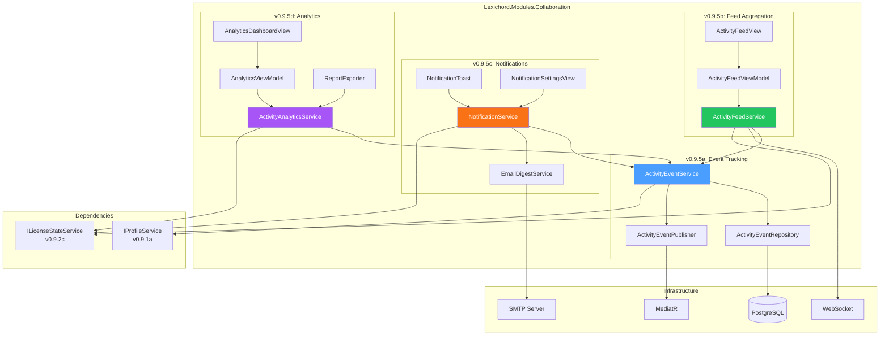
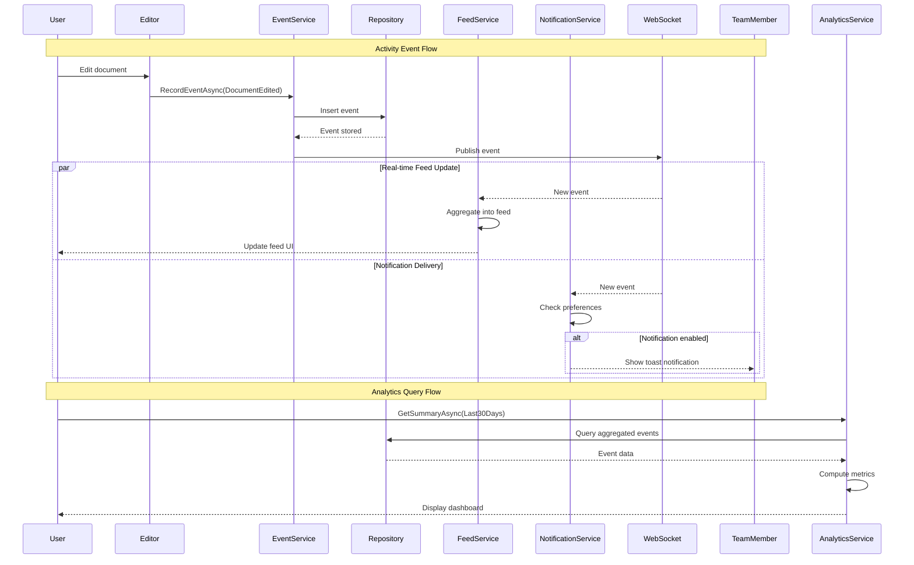

# LCS-SBD-095: Scope Breakdown — The Backstage Monitor

## Document Control

| Field            | Value                                    |
| :--------------- | :--------------------------------------- |
| **Document ID**  | LCS-SBD-095                              |
| **Version**      | v0.9.5                                   |
| **Codename**     | The Backstage Monitor (Activity Feed)    |
| **Status**       | Draft                                    |
| **Last Updated** | 2026-01-27                               |
| **Owner**        | Lead Architect                           |
| **Depends On**   | v0.9.1 (User Profiles), v0.9.2 (License Engine), v0.8.x (Publisher) |

---

## 1. Executive Summary

### 1.1 The Vision

**v0.9.5** delivers the **Backstage Monitor** — a comprehensive activity feed system that tracks team activity and changes across the Lexichord workspace. This release transforms Lexichord from an individual writing tool into a collaborative platform where teams can see what teammates are working on, track recent edits, and stay informed through customizable notifications.

The Activity Feed serves as the central nervous system for team collaboration, providing real-time visibility into document changes, user actions, and workspace events. Writers can now understand the pulse of their team's activity, enabling better coordination, reduced duplication of effort, and enhanced accountability.

### 1.2 Business Value

- **Team Visibility:** See what teammates are working on in real-time, enabling better coordination and reducing duplicate effort.
- **Change Awareness:** Track recent edits across the workspace to stay informed about document modifications and version changes.
- **Notification Control:** Granular notification preferences allow users to filter signal from noise, receiving only relevant updates.
- **Productivity Insights:** Activity analytics provide data-driven insights into team and individual productivity patterns.
- **Enterprise Compliance:** Audit trail capabilities support compliance requirements for document tracking and user activity.
- **Foundation:** Establishes event-driven architecture patterns for future collaborative features.

### 1.3 Success Criteria

This release succeeds when:

1. Team members can view a consolidated activity stream showing document edits, user actions, and workspace events from the past 30 days.
2. Users can configure granular notification preferences for in-app and email notifications based on event type, document, and user.
3. Activity events are captured and stored within 500ms of occurrence with 99.9% reliability.
4. The Activity Analytics dashboard displays productivity metrics including edits per day, active hours, and document contribution statistics.
5. All UI respects license gating (Teams+ for Activity Feed).

### 1.4 License Gating

The Activity Feed is a **Teams** feature. Lower tiers will see:

- Read-only access to personal activity (own events only)
- "[Upgrade to Teams]" prompt when attempting to view team activity
- Analytics buttons disabled with upgrade tooltip
- Notification preferences limited to basic in-app only

---

## 2. Dependencies on Prior Versions

| Component                | Source Version | Usage in v0.9.5                          |
| :----------------------- | :------------- | :--------------------------------------- |
| `IProfileService`        | v0.9.1a        | User profile identification for events   |
| `UserProfile`            | v0.9.1a        | User avatar and name display in feed     |
| `ILicenseStateService`   | v0.9.2c        | Teams tier validation for feed access    |
| `ISecureVault`           | v0.0.6a        | Secure storage for notification tokens   |
| `IMediator`              | v0.0.7a        | Event publishing for activity tracking   |
| `IDbConnectionFactory`   | v0.0.5c        | PostgreSQL storage for activity events   |
| `ISettingsService`       | v0.1.6a        | User notification preferences storage    |
| `IDocumentRepository`    | v0.1.2a        | Document metadata for event context      |
| `IGitService`            | v0.8.1a        | Git commit event integration             |
| `Serilog`                | v0.0.3b        | Activity event logging                   |
| `Polly`                  | v0.0.5d        | Retry policies for event persistence     |
| `MediatR`                | v0.0.7a        | Event-driven activity capture            |

---

## 3. Sub-Part Specifications

### 3.1 v0.9.5a: Event Tracking

| Field            | Value                                     |
| :--------------- | :---------------------------------------- |
| **Sub-Part ID**  | COL-095a                                  |
| **Title**        | Event Tracking (Who Did What When)        |
| **Module**       | `Lexichord.Modules.Collaboration`         |
| **License Tier** | Teams                                     |

**Goal:** Implement a comprehensive event tracking system that captures, stores, and retrieves all user activities across the Lexichord workspace with full attribution and timestamps.

**Key Deliverables:**

- `ActivityEvent` record with full event schema and metadata
- `IActivityEventService` interface for event capture and retrieval
- `ActivityEventRepository` for PostgreSQL persistence
- `ActivityEventPublisher` MediatR handler for real-time event publishing
- Migration `Migration_095_ActivityEvents.cs` for database schema
- Event capture middleware for automatic tracking
- Unit tests for event capture and storage

**Key Interfaces:**

```csharp
namespace Lexichord.Abstractions.Collaboration;

/// <summary>
/// Represents a single activity event in the workspace.
/// </summary>
public record ActivityEvent
{
    public Guid EventId { get; init; }
    public required ActivityEventType EventType { get; init; }
    public required Guid ActorId { get; init; }
    public required string ActorName { get; init; }
    public string? ActorAvatarPath { get; init; }
    public Guid? TargetDocumentId { get; init; }
    public string? TargetDocumentTitle { get; init; }
    public Guid? TargetUserId { get; init; }
    public string? TargetUserName { get; init; }
    public required DateTime OccurredAt { get; init; }
    public required DateTime RecordedAt { get; init; }
    public IReadOnlyDictionary<string, object>? Metadata { get; init; }
    public string? Description { get; init; }
    public ActivityEventSeverity Severity { get; init; } = ActivityEventSeverity.Info;
}

/// <summary>
/// Types of activity events that can be tracked.
/// </summary>
public enum ActivityEventType
{
    // Document Events
    DocumentCreated,
    DocumentOpened,
    DocumentEdited,
    DocumentDeleted,
    DocumentRenamed,
    DocumentMoved,
    DocumentShared,
    DocumentExported,
    DocumentPublished,

    // Version Control Events
    CommitCreated,
    BranchCreated,
    BranchMerged,
    TagCreated,

    // Collaboration Events
    CommentAdded,
    CommentResolved,
    SuggestionMade,
    SuggestionAccepted,
    SuggestionRejected,

    // User Events
    UserJoinedWorkspace,
    UserLeftWorkspace,
    UserRoleChanged,
    ProfileUpdated,

    // Style Events
    StyleRuleApplied,
    StyleGuideUpdated,
    TerminologyAdded,

    // Agent Events
    AgentInvoked,
    AgentCompleted,
    AgentFailed,

    // System Events
    WorkspaceSettingsChanged,
    IntegrationConnected,
    IntegrationDisconnected
}

/// <summary>
/// Severity levels for activity events.
/// </summary>
public enum ActivityEventSeverity
{
    Debug,
    Info,
    Warning,
    Important,
    Critical
}

/// <summary>
/// Service for capturing and retrieving activity events.
/// </summary>
public interface IActivityEventService
{
    /// <summary>
    /// Records a new activity event.
    /// </summary>
    Task<ActivityEvent> RecordEventAsync(
        RecordEventRequest request,
        CancellationToken ct = default);

    /// <summary>
    /// Retrieves activity events matching the specified criteria.
    /// </summary>
    Task<IReadOnlyList<ActivityEvent>> GetEventsAsync(
        ActivityEventQuery query,
        CancellationToken ct = default);

    /// <summary>
    /// Gets events for a specific user.
    /// </summary>
    Task<IReadOnlyList<ActivityEvent>> GetUserEventsAsync(
        Guid userId,
        DateTime? since = null,
        int limit = 50,
        CancellationToken ct = default);

    /// <summary>
    /// Gets events for a specific document.
    /// </summary>
    Task<IReadOnlyList<ActivityEvent>> GetDocumentEventsAsync(
        Guid documentId,
        DateTime? since = null,
        int limit = 50,
        CancellationToken ct = default);

    /// <summary>
    /// Subscribes to real-time event notifications.
    /// </summary>
    IObservable<ActivityEvent> Subscribe(ActivityEventFilter? filter = null);
}

/// <summary>
/// Request for recording a new activity event.
/// </summary>
public record RecordEventRequest
{
    public required ActivityEventType EventType { get; init; }
    public Guid? TargetDocumentId { get; init; }
    public Guid? TargetUserId { get; init; }
    public IReadOnlyDictionary<string, object>? Metadata { get; init; }
    public string? Description { get; init; }
    public ActivityEventSeverity Severity { get; init; } = ActivityEventSeverity.Info;
}

/// <summary>
/// Query parameters for retrieving activity events.
/// </summary>
public record ActivityEventQuery
{
    public IReadOnlyList<ActivityEventType>? EventTypes { get; init; }
    public IReadOnlyList<Guid>? ActorIds { get; init; }
    public IReadOnlyList<Guid>? DocumentIds { get; init; }
    public DateTime? Since { get; init; }
    public DateTime? Until { get; init; }
    public int Offset { get; init; } = 0;
    public int Limit { get; init; } = 50;
    public ActivityEventSeverity? MinSeverity { get; init; }
    public bool IncludeSystemEvents { get; init; } = false;
}

/// <summary>
/// Filter for real-time event subscription.
/// </summary>
public record ActivityEventFilter
{
    public IReadOnlyList<ActivityEventType>? EventTypes { get; init; }
    public IReadOnlyList<Guid>? ActorIds { get; init; }
    public IReadOnlyList<Guid>? DocumentIds { get; init; }
    public ActivityEventSeverity? MinSeverity { get; init; }
}
```

**Database Schema:**

```sql
-- Migration: Migration_095_ActivityEvents.cs

CREATE TABLE activity_events (
    event_id UUID PRIMARY KEY DEFAULT gen_random_uuid(),
    event_type VARCHAR(50) NOT NULL,
    actor_id UUID NOT NULL,
    actor_name VARCHAR(255) NOT NULL,
    actor_avatar_path VARCHAR(500),
    target_document_id UUID,
    target_document_title VARCHAR(500),
    target_user_id UUID,
    target_user_name VARCHAR(255),
    occurred_at TIMESTAMP WITH TIME ZONE NOT NULL,
    recorded_at TIMESTAMP WITH TIME ZONE NOT NULL DEFAULT NOW(),
    metadata JSONB,
    description TEXT,
    severity VARCHAR(20) NOT NULL DEFAULT 'Info',
    workspace_id UUID NOT NULL,

    CONSTRAINT fk_actor FOREIGN KEY (actor_id) REFERENCES user_profiles(profile_id),
    CONSTRAINT fk_target_document FOREIGN KEY (target_document_id) REFERENCES documents(document_id),
    CONSTRAINT fk_target_user FOREIGN KEY (target_user_id) REFERENCES user_profiles(profile_id)
);

-- Indexes for common query patterns
CREATE INDEX idx_activity_events_actor ON activity_events(actor_id, occurred_at DESC);
CREATE INDEX idx_activity_events_document ON activity_events(target_document_id, occurred_at DESC);
CREATE INDEX idx_activity_events_type ON activity_events(event_type, occurred_at DESC);
CREATE INDEX idx_activity_events_occurred ON activity_events(occurred_at DESC);
CREATE INDEX idx_activity_events_workspace ON activity_events(workspace_id, occurred_at DESC);

-- Partitioning by month for efficient archival
CREATE TABLE activity_events_archive (LIKE activity_events INCLUDING ALL);
```

**Dependencies:**

- v0.9.1a: `IProfileService` (actor identification)
- v0.0.7a: `IMediator` (event publishing)
- v0.0.5c: `IDbConnectionFactory` (PostgreSQL storage)

---

### 3.2 v0.9.5b: Feed Aggregation

| Field            | Value                                     |
| :--------------- | :---------------------------------------- |
| **Sub-Part ID**  | COL-095b                                  |
| **Title**        | Feed Aggregation (Combined Activity Stream) |
| **Module**       | `Lexichord.Modules.Collaboration`         |
| **License Tier** | Teams                                     |

**Goal:** Create an aggregated activity feed that combines events from multiple sources into a unified, chronological stream with intelligent grouping, filtering, and pagination.

**Key Deliverables:**

- `IActivityFeedService` interface for feed aggregation
- `ActivityFeedViewModel` for UI binding
- `ActivityFeedView.axaml` for feed display
- Feed grouping logic (by time, document, user)
- Infinite scroll pagination
- Real-time feed updates via WebSocket/SignalR
- Feed caching for performance
- Unit tests for aggregation logic

**Key Interfaces:**

```csharp
namespace Lexichord.Abstractions.Collaboration;

/// <summary>
/// Service for aggregating and presenting the activity feed.
/// </summary>
public interface IActivityFeedService
{
    /// <summary>
    /// Gets the aggregated activity feed for the current user.
    /// </summary>
    Task<ActivityFeedPage> GetFeedAsync(
        ActivityFeedRequest request,
        CancellationToken ct = default);

    /// <summary>
    /// Gets a grouped view of activity by time period.
    /// </summary>
    Task<IReadOnlyList<ActivityGroup>> GetGroupedFeedAsync(
        ActivityGroupingRequest request,
        CancellationToken ct = default);

    /// <summary>
    /// Subscribes to real-time feed updates.
    /// </summary>
    IObservable<ActivityFeedUpdate> SubscribeToUpdates(
        ActivityFeedFilter? filter = null);

    /// <summary>
    /// Marks events as read for the current user.
    /// </summary>
    Task MarkAsReadAsync(
        IEnumerable<Guid> eventIds,
        CancellationToken ct = default);

    /// <summary>
    /// Gets the count of unread events.
    /// </summary>
    Task<int> GetUnreadCountAsync(CancellationToken ct = default);
}

/// <summary>
/// Request for retrieving the activity feed.
/// </summary>
public record ActivityFeedRequest
{
    public ActivityFeedScope Scope { get; init; } = ActivityFeedScope.Team;
    public IReadOnlyList<ActivityEventType>? IncludeEventTypes { get; init; }
    public IReadOnlyList<ActivityEventType>? ExcludeEventTypes { get; init; }
    public IReadOnlyList<Guid>? FilterByUsers { get; init; }
    public IReadOnlyList<Guid>? FilterByDocuments { get; init; }
    public DateTime? Since { get; init; }
    public DateTime? Until { get; init; }
    public string? Cursor { get; init; }
    public int PageSize { get; init; } = 25;
    public bool IncludeSystemEvents { get; init; } = false;
}

/// <summary>
/// Scope of the activity feed.
/// </summary>
public enum ActivityFeedScope
{
    Personal,   // Only current user's events
    Team,       // All team members' events
    Document,   // Events for a specific document
    Following   // Events from followed users/documents
}

/// <summary>
/// A page of activity feed results.
/// </summary>
public record ActivityFeedPage
{
    public required IReadOnlyList<ActivityFeedItem> Items { get; init; }
    public string? NextCursor { get; init; }
    public bool HasMore { get; init; }
    public int TotalCount { get; init; }
    public int UnreadCount { get; init; }
}

/// <summary>
/// A single item in the activity feed.
/// </summary>
public record ActivityFeedItem
{
    public required ActivityEvent Event { get; init; }
    public bool IsRead { get; init; }
    public bool IsHighlighted { get; init; }
    public IReadOnlyList<ActivityFeedItem>? RelatedItems { get; init; }
    public string FormattedDescription { get; init; } = string.Empty;
    public string RelativeTime { get; init; } = string.Empty;
}

/// <summary>
/// A group of related activity items.
/// </summary>
public record ActivityGroup
{
    public required ActivityGroupType GroupType { get; init; }
    public required string GroupKey { get; init; }
    public required string GroupLabel { get; init; }
    public required IReadOnlyList<ActivityFeedItem> Items { get; init; }
    public DateTime StartTime { get; init; }
    public DateTime EndTime { get; init; }
    public int ItemCount { get; init; }
}

/// <summary>
/// Types of grouping for activity items.
/// </summary>
public enum ActivityGroupType
{
    Today,
    Yesterday,
    ThisWeek,
    LastWeek,
    ThisMonth,
    ByDocument,
    ByUser,
    ByEventType
}

/// <summary>
/// Real-time update to the activity feed.
/// </summary>
public record ActivityFeedUpdate
{
    public required ActivityFeedUpdateType UpdateType { get; init; }
    public ActivityFeedItem? NewItem { get; init; }
    public Guid? RemovedItemId { get; init; }
    public int? NewUnreadCount { get; init; }
}

/// <summary>
/// Types of feed updates.
/// </summary>
public enum ActivityFeedUpdateType
{
    NewItem,
    ItemRemoved,
    ItemUpdated,
    UnreadCountChanged
}
```

**Key UI Components:**

```text
+------------------------------------------------------------------+
|  Activity Feed                                      [Filter v]    |
+------------------------------------------------------------------+
| [All] [Documents] [Comments] [Users]                [Unread: 5]  |
+------------------------------------------------------------------+
| TODAY                                                             |
|------------------------------------------------------------------|
| [Avatar] John Smith edited "Project Proposal"          2 min ago |
|          Changed section 3.2, added 150 words                    |
|------------------------------------------------------------------|
| [Avatar] Sarah Lee commented on "Marketing Plan"      15 min ago |
|          "Great progress on the executive summary!"              |
|------------------------------------------------------------------|
| YESTERDAY                                                         |
|------------------------------------------------------------------|
| [Avatar] Mike Chen published "Q4 Report"              Yesterday  |
|          Version 2.1 - Final draft                               |
|------------------------------------------------------------------|
| [Avatar] You created "Meeting Notes"                  Yesterday  |
|          Started new document                                    |
+------------------------------------------------------------------+
| [Load More...]                                                    |
+------------------------------------------------------------------+
```

**Aggregation Logic:**

```text
AGGREGATE feed items:
│
├── FETCH events from database
│   ├── Apply user-level filters
│   ├── Apply document-level filters
│   └── Apply event type filters
│
├── MERGE with real-time updates
│   ├── New events from WebSocket
│   └── Dedup by event_id
│
├── GROUP by time period
│   ├── Today (last 24 hours)
│   ├── Yesterday
│   ├── This Week
│   ├── Last Week
│   └── Older
│
├── COLLAPSE similar events
│   ├── Multiple edits to same document → single "edited X times"
│   └── Batch operations → single summary
│
└── FORMAT for display
    ├── Generate relative timestamps
    ├── Format descriptions
    └── Resolve avatars
```

**Dependencies:**

- v0.9.5a: `IActivityEventService` (event source)
- v0.9.1a: `UserProfile` (avatar/name display)

---

### 3.3 v0.9.5c: Notifications

| Field            | Value                                     |
| :--------------- | :---------------------------------------- |
| **Sub-Part ID**  | COL-095c                                  |
| **Title**        | Notifications (In-App and Email)          |
| **Module**       | `Lexichord.Modules.Collaboration`         |
| **License Tier** | Teams                                     |

**Goal:** Implement a comprehensive notification system that delivers activity alerts through in-app notifications and optional email digests with granular user preferences.

**Key Deliverables:**

- `INotificationService` interface for notification management
- `NotificationPreferences` record for user settings
- `NotificationSettingsView.axaml` for preferences UI
- In-app notification toast system
- Email digest template and scheduler
- Notification badge/counter for UI
- Do Not Disturb mode
- Unit tests for notification logic

**Key Interfaces:**

```csharp
namespace Lexichord.Abstractions.Collaboration;

/// <summary>
/// Service for managing notifications.
/// </summary>
public interface INotificationService
{
    /// <summary>
    /// Sends a notification to one or more users.
    /// </summary>
    Task SendNotificationAsync(
        NotificationRequest request,
        CancellationToken ct = default);

    /// <summary>
    /// Gets pending notifications for the current user.
    /// </summary>
    Task<IReadOnlyList<Notification>> GetPendingNotificationsAsync(
        int limit = 20,
        CancellationToken ct = default);

    /// <summary>
    /// Marks notifications as read.
    /// </summary>
    Task MarkAsReadAsync(
        IEnumerable<Guid> notificationIds,
        CancellationToken ct = default);

    /// <summary>
    /// Dismisses a notification.
    /// </summary>
    Task DismissAsync(
        Guid notificationId,
        CancellationToken ct = default);

    /// <summary>
    /// Gets the notification preferences for the current user.
    /// </summary>
    Task<NotificationPreferences> GetPreferencesAsync(
        CancellationToken ct = default);

    /// <summary>
    /// Updates notification preferences.
    /// </summary>
    Task UpdatePreferencesAsync(
        NotificationPreferences preferences,
        CancellationToken ct = default);

    /// <summary>
    /// Subscribes to real-time notifications.
    /// </summary>
    IObservable<Notification> Subscribe();

    /// <summary>
    /// Gets the unread notification count.
    /// </summary>
    Task<int> GetUnreadCountAsync(CancellationToken ct = default);
}

/// <summary>
/// Represents a notification to be displayed or sent.
/// </summary>
public record Notification
{
    public Guid NotificationId { get; init; }
    public required NotificationType Type { get; init; }
    public required string Title { get; init; }
    public required string Body { get; init; }
    public string? IconPath { get; init; }
    public Guid? SourceEventId { get; init; }
    public Guid? SourceUserId { get; init; }
    public Guid? TargetDocumentId { get; init; }
    public string? ActionUrl { get; init; }
    public DateTime CreatedAt { get; init; }
    public DateTime? ReadAt { get; init; }
    public DateTime? DismissedAt { get; init; }
    public NotificationPriority Priority { get; init; } = NotificationPriority.Normal;
    public bool IsRead => ReadAt.HasValue;
}

/// <summary>
/// Types of notifications.
/// </summary>
public enum NotificationType
{
    // Document notifications
    DocumentShared,
    DocumentMentioned,
    DocumentCommented,
    DocumentEdited,
    DocumentPublished,

    // Collaboration notifications
    SuggestionReceived,
    CommentReply,
    MentionedInComment,

    // Team notifications
    UserJoined,
    RoleChanged,

    // System notifications
    SystemAnnouncement,
    UpdateAvailable,
    LicenseExpiring,

    // Agent notifications
    AgentCompleted,
    AgentFailed
}

/// <summary>
/// Priority levels for notifications.
/// </summary>
public enum NotificationPriority
{
    Low,
    Normal,
    High,
    Urgent
}

/// <summary>
/// User preferences for notifications.
/// </summary>
public record NotificationPreferences
{
    // Global settings
    public bool EnableInAppNotifications { get; init; } = true;
    public bool EnableEmailNotifications { get; init; } = false;
    public bool EnableSoundAlerts { get; init; } = true;
    public bool EnableDesktopNotifications { get; init; } = true;

    // Do Not Disturb
    public bool DoNotDisturbEnabled { get; init; } = false;
    public TimeOnly? DoNotDisturbStart { get; init; }
    public TimeOnly? DoNotDisturbEnd { get; init; }
    public IReadOnlyList<DayOfWeek>? DoNotDisturbDays { get; init; }

    // Email digest settings
    public EmailDigestFrequency EmailDigestFrequency { get; init; } = EmailDigestFrequency.Daily;
    public TimeOnly EmailDigestTime { get; init; } = new(9, 0);

    // Per-type settings
    public IReadOnlyDictionary<NotificationType, NotificationTypePreference>? TypePreferences { get; init; }

    // Following preferences
    public IReadOnlyList<Guid>? MutedUsers { get; init; }
    public IReadOnlyList<Guid>? MutedDocuments { get; init; }
}

/// <summary>
/// Email digest frequency options.
/// </summary>
public enum EmailDigestFrequency
{
    Realtime,
    Hourly,
    Daily,
    Weekly,
    Never
}

/// <summary>
/// Preferences for a specific notification type.
/// </summary>
public record NotificationTypePreference
{
    public bool InApp { get; init; } = true;
    public bool Email { get; init; } = false;
    public bool Sound { get; init; } = true;
    public bool Desktop { get; init; } = true;
}

/// <summary>
/// Request to send a notification.
/// </summary>
public record NotificationRequest
{
    public required NotificationType Type { get; init; }
    public required string Title { get; init; }
    public required string Body { get; init; }
    public required IReadOnlyList<Guid> RecipientIds { get; init; }
    public Guid? SourceEventId { get; init; }
    public Guid? SourceUserId { get; init; }
    public Guid? TargetDocumentId { get; init; }
    public string? ActionUrl { get; init; }
    public NotificationPriority Priority { get; init; } = NotificationPriority.Normal;
}
```

**Key UI Components:**

```text
+------------------------------------------------------------------+
|  Notification Settings                                            |
+------------------------------------------------------------------+
| DELIVERY CHANNELS                                                 |
|------------------------------------------------------------------|
| [x] In-app notifications                                          |
| [x] Desktop notifications                                         |
| [x] Sound alerts                                                  |
| [ ] Email notifications                                           |
|------------------------------------------------------------------|
| EMAIL DIGEST                                                      |
|------------------------------------------------------------------|
| Frequency: [Daily v]                                              |
| Send at:   [9:00 AM v]                                            |
|------------------------------------------------------------------|
| DO NOT DISTURB                                                    |
|------------------------------------------------------------------|
| [ ] Enable quiet hours                                            |
| From: [10:00 PM v]  To: [8:00 AM v]                               |
| Days: [x] Mon [x] Tue [x] Wed [x] Thu [x] Fri [ ] Sat [ ] Sun    |
|------------------------------------------------------------------|
| NOTIFICATION TYPES                                                |
|------------------------------------------------------------------|
| Document shared with me      [In-app] [Email] [Desktop]           |
| Someone commented            [In-app] [Email] [Desktop]           |
| Mentioned in document        [In-app] [Email] [Desktop]           |
| Document published           [In-app] [ Email] [Desktop]          |
| Agent completed              [In-app] [ Email] [ Desktop]         |
| Team member joined           [ In-app] [ Email] [ Desktop]        |
+------------------------------------------------------------------+
```

**Email Digest Template:**

```html
<!-- Email digest template structure -->
<subject>Lexichord Activity Digest - {{date}}</subject>

<body>
  <header>Your workspace activity summary</header>

  <section name="highlights">
    <h2>Highlights</h2>
    {{#each highlights}}
      <item>{{icon}} {{description}} - {{time}}</item>
    {{/each}}
  </section>

  <section name="documents">
    <h2>Document Activity</h2>
    {{#each documentGroups}}
      <document-group>
        <title>{{documentTitle}}</title>
        {{#each events}}
          <event>{{description}}</event>
        {{/each}}
      </document-group>
    {{/each}}
  </section>

  <section name="team">
    <h2>Team Activity</h2>
    {{#each teamEvents}}
      <item>{{description}}</item>
    {{/each}}
  </section>

  <footer>
    <link>View full activity feed</link>
    <link>Manage notification preferences</link>
  </footer>
</body>
```

**Dependencies:**

- v0.9.5a: `IActivityEventService` (event source)
- v0.9.5b: `IActivityFeedService` (feed integration)
- v0.1.6a: `ISettingsService` (preference storage)

---

### 3.4 v0.9.5d: Activity Analytics

| Field            | Value                                     |
| :--------------- | :---------------------------------------- |
| **Sub-Part ID**  | COL-095d                                  |
| **Title**        | Activity Analytics (Productivity Insights) |
| **Module**       | `Lexichord.Modules.Collaboration`         |
| **License Tier** | Teams                                     |

**Goal:** Provide data-driven productivity insights through an analytics dashboard that visualizes team and individual activity patterns, document contributions, and collaboration metrics.

**Key Deliverables:**

- `IActivityAnalyticsService` interface for analytics queries
- `ActivityAnalyticsDashboardView.axaml` for visualization
- `ActivityAnalyticsViewModel` for dashboard logic
- Chart components for visualization (using LiveCharts or OxyPlot)
- Report export functionality (CSV, PDF)
- Analytics caching layer for performance
- Scheduled analytics computation job
- Unit tests for analytics calculations

**Key Interfaces:**

```csharp
namespace Lexichord.Abstractions.Collaboration;

/// <summary>
/// Service for activity analytics and productivity insights.
/// </summary>
public interface IActivityAnalyticsService
{
    /// <summary>
    /// Gets the activity summary for a time period.
    /// </summary>
    Task<ActivitySummary> GetSummaryAsync(
        ActivityAnalyticsPeriod period,
        CancellationToken ct = default);

    /// <summary>
    /// Gets productivity metrics for a user or team.
    /// </summary>
    Task<ProductivityMetrics> GetProductivityMetricsAsync(
        Guid? userId,
        ActivityAnalyticsPeriod period,
        CancellationToken ct = default);

    /// <summary>
    /// Gets document contribution statistics.
    /// </summary>
    Task<DocumentContributionStats> GetDocumentContributionsAsync(
        Guid documentId,
        CancellationToken ct = default);

    /// <summary>
    /// Gets activity trends over time.
    /// </summary>
    Task<ActivityTrends> GetTrendsAsync(
        ActivityTrendsRequest request,
        CancellationToken ct = default);

    /// <summary>
    /// Gets the most active users in the workspace.
    /// </summary>
    Task<IReadOnlyList<UserActivityRanking>> GetTopContributorsAsync(
        ActivityAnalyticsPeriod period,
        int limit = 10,
        CancellationToken ct = default);

    /// <summary>
    /// Gets the most active documents in the workspace.
    /// </summary>
    Task<IReadOnlyList<DocumentActivityRanking>> GetMostActiveDocumentsAsync(
        ActivityAnalyticsPeriod period,
        int limit = 10,
        CancellationToken ct = default);

    /// <summary>
    /// Exports analytics data.
    /// </summary>
    Task<byte[]> ExportAsync(
        AnalyticsExportRequest request,
        CancellationToken ct = default);
}

/// <summary>
/// Time periods for analytics queries.
/// </summary>
public record ActivityAnalyticsPeriod
{
    public DateTime Start { get; init; }
    public DateTime End { get; init; }

    public static ActivityAnalyticsPeriod Today => new()
    {
        Start = DateTime.UtcNow.Date,
        End = DateTime.UtcNow
    };

    public static ActivityAnalyticsPeriod ThisWeek => new()
    {
        Start = DateTime.UtcNow.Date.AddDays(-(int)DateTime.UtcNow.DayOfWeek),
        End = DateTime.UtcNow
    };

    public static ActivityAnalyticsPeriod ThisMonth => new()
    {
        Start = new DateTime(DateTime.UtcNow.Year, DateTime.UtcNow.Month, 1),
        End = DateTime.UtcNow
    };

    public static ActivityAnalyticsPeriod Last30Days => new()
    {
        Start = DateTime.UtcNow.AddDays(-30),
        End = DateTime.UtcNow
    };
}

/// <summary>
/// Summary of activity for a period.
/// </summary>
public record ActivitySummary
{
    public required ActivityAnalyticsPeriod Period { get; init; }
    public int TotalEvents { get; init; }
    public int UniqueUsers { get; init; }
    public int DocumentsCreated { get; init; }
    public int DocumentsEdited { get; init; }
    public int CommentsAdded { get; init; }
    public int CommitsCreated { get; init; }
    public int PublishedDocuments { get; init; }
    public int AgentInvocations { get; init; }
    public long TotalWordsAdded { get; init; }
    public TimeSpan TotalActiveTime { get; init; }
    public IReadOnlyDictionary<ActivityEventType, int> EventsByType { get; init; } =
        new Dictionary<ActivityEventType, int>();
}

/// <summary>
/// Productivity metrics for a user or team.
/// </summary>
public record ProductivityMetrics
{
    public required ActivityAnalyticsPeriod Period { get; init; }
    public Guid? UserId { get; init; }

    // Writing metrics
    public int DocumentsCreated { get; init; }
    public int DocumentsEdited { get; init; }
    public long WordsWritten { get; init; }
    public int EditsPerDay { get; init; }
    public TimeSpan AverageSessionDuration { get; init; }

    // Collaboration metrics
    public int CommentsGiven { get; init; }
    public int CommentsReceived { get; init; }
    public int SuggestionsMade { get; init; }
    public int SuggestionsAccepted { get; init; }

    // Time distribution
    public IReadOnlyDictionary<DayOfWeek, int> ActivityByDayOfWeek { get; init; } =
        new Dictionary<DayOfWeek, int>();
    public IReadOnlyDictionary<int, int> ActivityByHourOfDay { get; init; } =
        new Dictionary<int, int>();

    // Streaks and achievements
    public int CurrentStreak { get; init; }
    public int LongestStreak { get; init; }
    public IReadOnlyList<string> Achievements { get; init; } = [];
}

/// <summary>
/// Document contribution statistics.
/// </summary>
public record DocumentContributionStats
{
    public required Guid DocumentId { get; init; }
    public required string DocumentTitle { get; init; }
    public int TotalEdits { get; init; }
    public int TotalContributors { get; init; }
    public long TotalWordsAdded { get; init; }
    public int TotalComments { get; init; }
    public DateTime FirstEdit { get; init; }
    public DateTime LastEdit { get; init; }
    public IReadOnlyList<ContributorStats> Contributors { get; init; } = [];
    public IReadOnlyList<EditTimeline> EditHistory { get; init; } = [];
}

/// <summary>
/// Statistics for a document contributor.
/// </summary>
public record ContributorStats
{
    public required Guid UserId { get; init; }
    public required string UserName { get; init; }
    public string? AvatarPath { get; init; }
    public int EditCount { get; init; }
    public long WordsAdded { get; init; }
    public int CommentsAdded { get; init; }
    public double ContributionPercentage { get; init; }
}

/// <summary>
/// Activity trends over time.
/// </summary>
public record ActivityTrends
{
    public required ActivityAnalyticsPeriod Period { get; init; }
    public required TrendGranularity Granularity { get; init; }
    public IReadOnlyList<TrendDataPoint> DataPoints { get; init; } = [];
    public double TrendDirection { get; init; } // Positive = increasing, Negative = decreasing
    public double TrendPercentageChange { get; init; }
}

/// <summary>
/// Granularity for trend data.
/// </summary>
public enum TrendGranularity
{
    Hourly,
    Daily,
    Weekly,
    Monthly
}

/// <summary>
/// A single data point in a trend.
/// </summary>
public record TrendDataPoint
{
    public DateTime Timestamp { get; init; }
    public int EventCount { get; init; }
    public int UniqueUsers { get; init; }
    public long WordsWritten { get; init; }
    public IReadOnlyDictionary<ActivityEventType, int>? BreakdownByType { get; init; }
}

/// <summary>
/// User activity ranking.
/// </summary>
public record UserActivityRanking
{
    public required int Rank { get; init; }
    public required Guid UserId { get; init; }
    public required string UserName { get; init; }
    public string? AvatarPath { get; init; }
    public int EventCount { get; init; }
    public long WordsWritten { get; init; }
    public int DocumentsEdited { get; init; }
    public double ChangeFromPrevious { get; init; }
}

/// <summary>
/// Document activity ranking.
/// </summary>
public record DocumentActivityRanking
{
    public required int Rank { get; init; }
    public required Guid DocumentId { get; init; }
    public required string DocumentTitle { get; init; }
    public int EventCount { get; init; }
    public int ContributorCount { get; init; }
    public int EditCount { get; init; }
    public DateTime LastActivity { get; init; }
}

/// <summary>
/// Request for exporting analytics.
/// </summary>
public record AnalyticsExportRequest
{
    public required AnalyticsExportFormat Format { get; init; }
    public required ActivityAnalyticsPeriod Period { get; init; }
    public bool IncludeSummary { get; init; } = true;
    public bool IncludeUserMetrics { get; init; } = true;
    public bool IncludeDocumentMetrics { get; init; } = true;
    public bool IncludeTrends { get; init; } = true;
}

/// <summary>
/// Export format options.
/// </summary>
public enum AnalyticsExportFormat
{
    Csv,
    Json,
    Pdf
}
```

**Key UI Components:**

```text
+------------------------------------------------------------------+
|  Activity Analytics                        [Last 30 Days v] [Export]|
+------------------------------------------------------------------+
| SUMMARY                                                           |
+------------------------------------------------------------------+
| +------------+  +------------+  +------------+  +------------+    |
| | 1,247      |  | 23         |  | 45,892     |  | 156        |    |
| | Events     |  | Active     |  | Words      |  | Comments   |    |
| | +12% ^     |  | Users      |  | Written    |  | Added      |    |
| +------------+  +------------+  +------------+  +------------+    |
+------------------------------------------------------------------+
| ACTIVITY TRENDS                                                   |
+------------------------------------------------------------------+
|   ^                                                               |
| E |    *  *                                                       |
| v |  *    *  *     *                                              |
| e | *        *   *   *    *  *                                    |
| n |            *       *       *                                  |
| t |                         *                                     |
| s +------------------------------------------------------------>  |
|   Jan 1    Jan 7    Jan 14   Jan 21   Jan 27                     |
+------------------------------------------------------------------+
| TOP CONTRIBUTORS              | MOST ACTIVE DOCUMENTS            |
+-------------------------------+----------------------------------+
| 1. [A] John Smith    234 edits| 1. Project Proposal      89 edits|
| 2. [A] Sarah Lee     198 edits| 2. Q4 Report            67 edits|
| 3. [A] Mike Chen     145 edits| 3. Marketing Plan       54 edits|
| 4. [A] Emily Davis   123 edits| 4. User Guide           43 edits|
| 5. [A] Chris Wilson   98 edits| 5. Release Notes        38 edits|
+-------------------------------+----------------------------------+
| PRODUCTIVITY BY DAY           | PRODUCTIVITY BY HOUR             |
+-------------------------------+----------------------------------+
| [Chart: Bar chart showing     | [Chart: Heat map showing         |
|  Mon-Sun activity levels]     |  hourly activity patterns]       |
+-------------------------------+----------------------------------+
```

**Analytics Computation Logic:**

```text
COMPUTE analytics:
│
├── AGGREGATE raw events
│   ├── Group by time period
│   ├── Group by user
│   └── Group by document
│
├── CALCULATE metrics
│   ├── Event counts by type
│   ├── Word counts from edit events
│   ├── Active time from session events
│   └── Collaboration ratios
│
├── COMPUTE trends
│   ├── Calculate period-over-period change
│   ├── Identify trend direction
│   └── Generate data points for charts
│
├── RANK contributors
│   ├── Sort by event count
│   ├── Calculate contribution percentages
│   └── Compare to previous period
│
└── CACHE results
    ├── Cache for 15 minutes (real-time)
    ├── Cache daily rollups indefinitely
    └── Invalidate on new events
```

**Dependencies:**

- v0.9.5a: `IActivityEventService` (event data source)
- v0.9.5b: `IActivityFeedService` (feed integration)

---

## 4. Implementation Checklist

| #  | Sub-Part | Task                                                      | Est. Hours |
| :- | :------- | :-------------------------------------------------------- | :--------- |
| 1  | v0.9.5a  | Define `ActivityEvent` record and enums                   | 1          |
| 2  | v0.9.5a  | Create `IActivityEventService` interface                  | 1          |
| 3  | v0.9.5a  | Implement `ActivityEventService`                          | 4          |
| 4  | v0.9.5a  | Create `ActivityEventRepository`                          | 3          |
| 5  | v0.9.5a  | Create database migration `Migration_095_ActivityEvents`  | 1          |
| 6  | v0.9.5a  | Implement MediatR handlers for event publishing           | 2          |
| 7  | v0.9.5a  | Add event capture middleware                              | 2          |
| 8  | v0.9.5a  | Unit tests for event service                              | 3          |
| 9  | v0.9.5b  | Create `IActivityFeedService` interface                   | 1          |
| 10 | v0.9.5b  | Implement `ActivityFeedService`                           | 4          |
| 11 | v0.9.5b  | Create feed grouping and aggregation logic                | 3          |
| 12 | v0.9.5b  | Implement real-time feed updates                          | 3          |
| 13 | v0.9.5b  | Create `ActivityFeedView.axaml`                           | 4          |
| 14 | v0.9.5b  | Create `ActivityFeedViewModel`                            | 3          |
| 15 | v0.9.5b  | Implement infinite scroll pagination                      | 2          |
| 16 | v0.9.5b  | Unit tests for feed aggregation                           | 3          |
| 17 | v0.9.5c  | Create `INotificationService` interface                   | 1          |
| 18 | v0.9.5c  | Implement `NotificationService`                           | 4          |
| 19 | v0.9.5c  | Create in-app toast notification system                   | 3          |
| 20 | v0.9.5c  | Create email digest template and scheduler                | 4          |
| 21 | v0.9.5c  | Create `NotificationSettingsView.axaml`                   | 3          |
| 22 | v0.9.5c  | Create `NotificationSettingsViewModel`                    | 2          |
| 23 | v0.9.5c  | Implement notification badge/counter                      | 2          |
| 24 | v0.9.5c  | Unit tests for notification service                       | 3          |
| 25 | v0.9.5d  | Create `IActivityAnalyticsService` interface              | 1          |
| 26 | v0.9.5d  | Implement `ActivityAnalyticsService`                      | 5          |
| 27 | v0.9.5d  | Create analytics computation jobs                         | 3          |
| 28 | v0.9.5d  | Create `ActivityAnalyticsDashboardView.axaml`             | 5          |
| 29 | v0.9.5d  | Create `ActivityAnalyticsViewModel`                       | 3          |
| 30 | v0.9.5d  | Implement chart components                                | 4          |
| 31 | v0.9.5d  | Implement report export (CSV, PDF)                        | 3          |
| 32 | v0.9.5d  | Unit tests for analytics calculations                     | 3          |
| 33 | All      | Integration tests for full activity pipeline              | 4          |
| 34 | All      | DI registration in CollaborationModule.cs                 | 1          |
| **Total** |   |                                                           | **92 hours** |

---

## 5. Dependency Matrix

### 5.1 Required Interfaces (from earlier versions)

| Interface                | Source Version | Purpose                              |
| :----------------------- | :------------- | :----------------------------------- |
| `IProfileService`        | v0.9.1a        | User identity for events             |
| `UserProfile`            | v0.9.1a        | Avatar and name display              |
| `ILicenseStateService`   | v0.9.2c        | Teams tier validation                |
| `IMediator`              | v0.0.7a        | Event publishing                     |
| `IDbConnectionFactory`   | v0.0.5c        | Database access                      |
| `ISettingsService`       | v0.1.6a        | Preference storage                   |

### 5.2 New Interfaces (defined in v0.9.5)

| Interface                   | Defined In | Module             | Purpose                     |
| :-------------------------- | :--------- | :----------------- | :-------------------------- |
| `IActivityEventService`     | v0.9.5a    | Collaboration      | Event capture and retrieval |
| `IActivityFeedService`      | v0.9.5b    | Collaboration      | Feed aggregation            |
| `INotificationService`      | v0.9.5c    | Collaboration      | Notification delivery       |
| `IActivityAnalyticsService` | v0.9.5d    | Collaboration      | Analytics and insights      |

### 5.3 New Records/DTOs (defined in v0.9.5)

| Record                     | Defined In | Purpose                                |
| :------------------------- | :--------- | :------------------------------------- |
| `ActivityEvent`            | v0.9.5a    | Event data structure                   |
| `ActivityFeedItem`         | v0.9.5b    | Feed display item                      |
| `ActivityFeedPage`         | v0.9.5b    | Paginated feed results                 |
| `Notification`             | v0.9.5c    | Notification data structure            |
| `NotificationPreferences`  | v0.9.5c    | User notification settings             |
| `ActivitySummary`          | v0.9.5d    | Period activity summary                |
| `ProductivityMetrics`      | v0.9.5d    | Productivity statistics                |
| `ActivityTrends`           | v0.9.5d    | Trend analysis data                    |

### 5.4 NuGet Packages

| Package          | Version | Purpose                    | New/Existing |
| :--------------- | :------ | :------------------------- | :----------- |
| `System.Reactive`| 6.x     | Real-time event streams    | Existing     |
| `Dapper`         | 2.x     | Database queries           | Existing     |
| `FluentEmail`    | 3.x     | Email sending              | **New**      |
| `LiveChartsCore` | 2.x     | Chart visualization        | **New**      |
| `QuestPDF`       | 2024.x  | PDF report generation      | **New**      |

---

## 6. Architecture Diagram



---

## 7. Data Flow Diagram



---

## 8. Risks & Mitigations

| Risk | Impact | Probability | Mitigation |
| :--- | :----- | :---------- | :--------- |
| High event volume overwhelms database | High | Medium | Implement event batching, partitioning, and archival strategy |
| Real-time updates cause UI performance issues | Medium | Medium | Throttle updates, virtualize feed list, debounce renders |
| Email delivery failures | Medium | Low | Use retry policies, queue emails, provide fallback to in-app only |
| Privacy concerns with activity tracking | High | Low | Clear documentation, opt-out options, data retention policies |
| Analytics computation blocks UI | Medium | Medium | Run analytics in background, cache results, show loading states |
| WebSocket connection instability | Medium | Medium | Implement reconnection logic, fallback to polling |

---

## 9. Success Metrics

| Metric | Target | Measurement |
| :----- | :----- | :---------- |
| Event capture latency | < 500ms | Time from action to event stored |
| Feed load time (initial) | < 1s | First meaningful paint |
| Feed load time (pagination) | < 300ms | Next page load |
| Notification delivery time | < 2s | Time from event to notification shown |
| Analytics dashboard load | < 3s | Full dashboard render |
| Event storage throughput | > 1000 events/sec | Peak write capacity |
| Memory usage (feed view) | < 50MB | Memory profiler |

---

## 10. What This Enables

After v0.9.5, Lexichord will support:

- **v0.9.6:** PII Scrubber integration with activity logging for audit trails
- **v0.9.7:** Onboarding flow with activity-based tutorials
- **v0.9.8:** Security audit with comprehensive activity logging
- **v1.0:** Production-ready collaborative writing platform with full team visibility

---

## 11. Decision Trees

### 11.1 Should an Event Be Recorded?

```text
START: "User performed an action"
│
├── Is this a trackable action type?
│   ├── NO → DO NOT record
│   └── YES → Continue
│
├── Is the user authenticated?
│   ├── NO → DO NOT record
│   └── YES → Continue
│
├── Is the action in a tracked workspace?
│   ├── NO → DO NOT record
│   └── YES → Continue
│
├── Is this a duplicate event (within 1 second)?
│   ├── YES → DO NOT record (debounce)
│   └── NO → RECORD event
│
└── RECORD event with full metadata
```

### 11.2 Should a Notification Be Sent?

```text
START: "New activity event received"
│
├── Is the actor the same as recipient?
│   ├── YES → DO NOT notify (own actions)
│   └── NO → Continue
│
├── Does recipient have notifications enabled for this type?
│   ├── NO → DO NOT notify
│   └── YES → Continue
│
├── Is the recipient in Do Not Disturb mode?
│   ├── YES → Queue for later / Email digest only
│   └── NO → Continue
│
├── Is the recipient muting the actor or document?
│   ├── YES → DO NOT notify
│   └── NO → SEND notification
│
└── Deliver via configured channels (in-app, email, desktop)
```

---

## 12. User Stories

| ID    | Role            | Story                                                                                | Acceptance Criteria                        |
| :---- | :-------------- | :----------------------------------------------------------------------------------- | :----------------------------------------- |
| US-01 | Team Writer     | As a team writer, I want to see what my teammates are working on so I avoid duplicating effort. | Activity feed shows team member actions.   |
| US-02 | Team Lead       | As a team lead, I want to track document changes so I can review progress.           | Document edit events visible in feed.      |
| US-03 | Collaborator    | As a collaborator, I want notifications when someone comments on my document.        | In-app notification appears for comments.  |
| US-04 | Remote Worker   | As a remote worker, I want email digests so I stay informed when offline.            | Daily digest email received.               |
| US-05 | Manager         | As a manager, I want productivity analytics to understand team output.               | Analytics dashboard shows metrics.         |
| US-06 | Focused Writer  | As a focused writer, I want to mute notifications during writing sessions.           | Do Not Disturb mode silences alerts.       |

---

## 13. Use Cases

### UC-01: View Team Activity Feed

**Preconditions:**

- User is authenticated with Teams tier license
- User is a member of a workspace with other team members

**Flow:**

1. User navigates to Activity panel.
2. System displays chronological feed of team events.
3. Events are grouped by time period (Today, Yesterday, etc.).
4. User scrolls to load more events (infinite scroll).
5. New events appear at top of feed in real-time.

**Postconditions:**

- User sees complete activity history.
- Unread count is updated.

---

### UC-02: Configure Notification Preferences

**Preconditions:**

- User is authenticated with Teams tier license

**Flow:**

1. User opens Settings > Notifications.
2. System displays current notification preferences.
3. User toggles notification channels (in-app, email, desktop).
4. User configures per-type preferences.
5. User sets Do Not Disturb schedule.
6. System saves preferences immediately.

**Postconditions:**

- Future notifications respect new preferences.

---

### UC-03: View Productivity Analytics

**Preconditions:**

- User is authenticated with Teams tier license
- Workspace has activity data for the requested period

**Flow:**

1. User opens Analytics dashboard.
2. System displays activity summary for default period (Last 30 Days).
3. User selects different time period.
4. System updates all charts and metrics.
5. User exports report as CSV.

**Postconditions:**

- User has visibility into team productivity.
- Export file is downloaded.

---

## 14. Unit Testing Requirements

### 14.1 ActivityEventService Tests

```csharp
[Trait("Category", "Unit")]
[Trait("Version", "v0.9.5a")]
public class ActivityEventServiceTests
{
    [Fact]
    public async Task RecordEventAsync_ValidEvent_StoresAndReturnsEvent()
    {
        // Arrange
        var repository = new Mock<IActivityEventRepository>();
        var mediator = new Mock<IMediator>();
        var profileService = new Mock<IProfileService>();

        profileService.Setup(x => x.GetActiveProfileAsync(It.IsAny<CancellationToken>()))
            .ReturnsAsync(new UserProfile { ProfileId = Guid.NewGuid(), Name = "Test User" });

        var sut = new ActivityEventService(repository.Object, mediator.Object, profileService.Object);

        var request = new RecordEventRequest
        {
            EventType = ActivityEventType.DocumentCreated,
            TargetDocumentId = Guid.NewGuid()
        };

        // Act
        var result = await sut.RecordEventAsync(request);

        // Assert
        result.Should().NotBeNull();
        result.EventType.Should().Be(ActivityEventType.DocumentCreated);
        repository.Verify(x => x.InsertAsync(It.IsAny<ActivityEvent>(), It.IsAny<CancellationToken>()), Times.Once);
        mediator.Verify(x => x.Publish(It.IsAny<ActivityEventRecordedNotification>(), It.IsAny<CancellationToken>()), Times.Once);
    }

    [Fact]
    public async Task GetEventsAsync_WithFilters_ReturnsFilteredEvents()
    {
        // Arrange
        var repository = new Mock<IActivityEventRepository>();
        var documentId = Guid.NewGuid();

        repository.Setup(x => x.QueryAsync(It.IsAny<ActivityEventQuery>(), It.IsAny<CancellationToken>()))
            .ReturnsAsync(new List<ActivityEvent>
            {
                new() { EventId = Guid.NewGuid(), EventType = ActivityEventType.DocumentEdited, TargetDocumentId = documentId }
            });

        var sut = new ActivityEventService(repository.Object, Mock.Of<IMediator>(), Mock.Of<IProfileService>());

        var query = new ActivityEventQuery
        {
            DocumentIds = [documentId],
            EventTypes = [ActivityEventType.DocumentEdited]
        };

        // Act
        var result = await sut.GetEventsAsync(query);

        // Assert
        result.Should().HaveCount(1);
        result[0].TargetDocumentId.Should().Be(documentId);
    }
}
```

---

## 15. Observability & Logging

| Level   | Source              | Message Template                                                       |
| :------ | :------------------ | :--------------------------------------------------------------------- |
| Debug   | ActivityEventService | `"Recording event: {EventType} by {ActorId}"` |
| Info    | ActivityEventService | `"Event recorded: {EventId} type {EventType} in {ElapsedMs}ms"` |
| Warning | ActivityEventService | `"Event recording delayed: {EventId} took {ElapsedMs}ms"` |
| Error   | ActivityEventService | `"Failed to record event: {EventType} - {Error}"` |
| Debug   | ActivityFeedService  | `"Loading feed page: offset={Offset}, limit={Limit}"` |
| Info    | ActivityFeedService  | `"Feed loaded: {ItemCount} items for user {UserId}"` |
| Debug   | NotificationService  | `"Sending notification: {Type} to {RecipientCount} recipients"` |
| Info    | NotificationService  | `"Notification delivered: {NotificationId} via {Channel}"` |
| Warning | NotificationService  | `"Notification delivery failed: {NotificationId} - {Error}"` |
| Info    | AnalyticsService     | `"Analytics computed for period {Start} to {End}: {EventCount} events"` |

---

## 16. UI/UX Specifications

### 16.1 Activity Feed Panel Layout

```text
+------------------------------------------------------------------+
|  Activity Feed                                      [Filter v]    |
+------------------------------------------------------------------+
| [All] [Documents] [Comments] [Team]                 [Unread: 5]  |
+------------------------------------------------------------------+
| TODAY                                                             |
|------------------------------------------------------------------|
| [Avatar] John Smith edited "Project Proposal"          2 min ago |
|          Changed section 3.2, added 150 words                    |
|          [View Changes] [Open Document]                          |
|------------------------------------------------------------------|
| [Avatar] Sarah Lee commented on "Marketing Plan"      15 min ago |
|          "Great progress on the executive summary!"              |
|          [View Comment] [Reply]                                   |
|------------------------------------------------------------------|
| YESTERDAY                                                         |
|------------------------------------------------------------------|
| [Avatar] Mike Chen published "Q4 Report"              Yesterday  |
|          Version 2.1 - Final draft                               |
|          [View Document]                                          |
|------------------------------------------------------------------|
| [Avatar] You created "Meeting Notes"                  Yesterday  |
|          Started new document                                    |
|          [Open Document]                                          |
+------------------------------------------------------------------+
| [Load More...]                                                    |
+------------------------------------------------------------------+
```

### 16.2 Component Styling Requirements

| Component           | Theme Resource             | Notes                            |
| :------------------ | :------------------------- | :------------------------------- |
| Feed container      | `Brush.Surface.Secondary`  | Scrollable panel                 |
| Event card          | `Brush.Surface.Primary`    | Rounded corners, subtle shadow   |
| Avatar              | 32x32 circular             | Fallback to initials             |
| Timestamp           | `Brush.Text.Tertiary`      | Relative time format             |
| Unread badge        | `Brush.Accent.Primary`     | Pill shape with count            |
| Filter tabs         | `LexTabBar` theme          | Horizontal tab bar               |

---

## 17. Acceptance Criteria (QA)

| #   | Category            | Criterion                                                                    |
| :-- | :------------------ | :--------------------------------------------------------------------------- |
| 1   | **Event Tracking**  | Document create/edit/delete events are captured within 500ms.                |
| 2   | **Event Tracking**  | Events include actor name, timestamp, and document reference.                |
| 3   | **Feed Display**    | Activity feed loads within 1 second with 50 items.                           |
| 4   | **Feed Display**    | Feed updates in real-time when teammates perform actions.                    |
| 5   | **Feed Grouping**   | Events are grouped by Today, Yesterday, This Week.                           |
| 6   | **Pagination**      | Infinite scroll loads next page within 300ms.                                |
| 7   | **Notifications**   | In-app notification appears within 2 seconds of event.                       |
| 8   | **Notifications**   | Do Not Disturb mode prevents all notifications during configured hours.      |
| 9   | **Email Digest**    | Daily digest email is sent at configured time.                               |
| 10  | **Analytics**       | Dashboard displays accurate event counts for selected period.                |
| 11  | **Analytics**       | Top contributors list matches actual activity data.                          |
| 12  | **Export**          | CSV export contains all displayed metrics.                                   |
| 13  | **License Gate**    | Core tier users see only personal activity.                                  |
| 14  | **License Gate**    | Upgrade prompt shown when Core user clicks team features.                    |
| 15  | **Accessibility**   | All interactive elements are keyboard navigable.                             |

---

## 18. Verification Commands

```bash
# ═══════════════════════════════════════════════════════════════════════════
# v0.9.5 Verification
# ═══════════════════════════════════════════════════════════════════════════

# 1. Verify NuGet packages installed
dotnet list src/Lexichord.Modules.Collaboration package | grep -E "FluentEmail|LiveChartsCore|QuestPDF"

# 2. Build solution
dotnet build

# 3. Run database migrations
dotnet run --project src/Lexichord.Host -- migrate

# 4. Run unit tests for v0.9.5 components
dotnet test --filter "Category=Unit&FullyQualifiedName~ActivityEvent"
dotnet test --filter "Category=Unit&FullyQualifiedName~ActivityFeed"
dotnet test --filter "Category=Unit&FullyQualifiedName~Notification"
dotnet test --filter "Category=Unit&FullyQualifiedName~Analytics"

# 5. Run all v0.9.5 tests
dotnet test --filter "Version~v0.9.5"

# 6. Manual verification:
# a) Create document and verify event appears in feed
# b) Edit document and verify real-time update in feed
# c) Configure notification preferences and verify delivery
# d) View analytics dashboard and verify metrics
# e) Export analytics report and verify content
```

---

## 19. Deliverable Checklist

| #  | Deliverable                                                    | Status |
| :- | :------------------------------------------------------------- | :----- |
| 1  | `ActivityEvent` record and enums                               | [ ]    |
| 2  | `IActivityEventService` interface and implementation           | [ ]    |
| 3  | `ActivityEventRepository` with PostgreSQL                      | [ ]    |
| 4  | `Migration_095_ActivityEvents.cs` database migration           | [ ]    |
| 5  | MediatR event handlers for activity publishing                 | [ ]    |
| 6  | `IActivityFeedService` interface and implementation            | [ ]    |
| 7  | `ActivityFeedView.axaml` and `ActivityFeedViewModel`           | [ ]    |
| 8  | Real-time feed updates via WebSocket                           | [ ]    |
| 9  | `INotificationService` interface and implementation            | [ ]    |
| 10 | In-app toast notification system                               | [ ]    |
| 11 | Email digest templates and scheduler                           | [ ]    |
| 12 | `NotificationSettingsView.axaml` and ViewModel                 | [ ]    |
| 13 | `IActivityAnalyticsService` interface and implementation       | [ ]    |
| 14 | `ActivityAnalyticsDashboardView.axaml` and ViewModel           | [ ]    |
| 15 | Chart components for analytics visualization                   | [ ]    |
| 16 | Report export (CSV, PDF)                                       | [ ]    |
| 17 | Unit tests for all services                                    | [ ]    |
| 18 | Integration tests for activity pipeline                        | [ ]    |
| 19 | DI registration in CollaborationModule.cs                      | [ ]    |

---

## 20. Code Examples

### 20.1 ActivityEventService Implementation

```csharp
namespace Lexichord.Modules.Collaboration.Services;

/// <summary>
/// Service for capturing and retrieving activity events.
/// </summary>
public class ActivityEventService(
    IActivityEventRepository repository,
    IMediator mediator,
    IProfileService profileService,
    ILogger<ActivityEventService> logger) : IActivityEventService
{
    public async Task<ActivityEvent> RecordEventAsync(
        RecordEventRequest request,
        CancellationToken ct = default)
    {
        var stopwatch = Stopwatch.StartNew();

        try
        {
            // Get current user profile
            var profile = await profileService.GetActiveProfileAsync(ct);

            var activityEvent = new ActivityEvent
            {
                EventId = Guid.NewGuid(),
                EventType = request.EventType,
                ActorId = profile.ProfileId,
                ActorName = profile.Name,
                ActorAvatarPath = profile.AvatarPath,
                TargetDocumentId = request.TargetDocumentId,
                TargetUserId = request.TargetUserId,
                OccurredAt = DateTime.UtcNow,
                RecordedAt = DateTime.UtcNow,
                Metadata = request.Metadata,
                Description = request.Description,
                Severity = request.Severity
            };

            // Persist to database
            await repository.InsertAsync(activityEvent, ct);

            // Publish for real-time updates
            await mediator.Publish(new ActivityEventRecordedNotification(activityEvent), ct);

            stopwatch.Stop();
            logger.LogInformation(
                "Event recorded: {EventId} type {EventType} in {ElapsedMs}ms",
                activityEvent.EventId,
                activityEvent.EventType,
                stopwatch.ElapsedMilliseconds);

            return activityEvent;
        }
        catch (Exception ex)
        {
            logger.LogError(ex, "Failed to record event: {EventType}", request.EventType);
            throw;
        }
    }

    public async Task<IReadOnlyList<ActivityEvent>> GetEventsAsync(
        ActivityEventQuery query,
        CancellationToken ct = default)
    {
        return await repository.QueryAsync(query, ct);
    }

    public IObservable<ActivityEvent> Subscribe(ActivityEventFilter? filter = null)
    {
        return Observable.Create<ActivityEvent>(observer =>
        {
            // Subscribe to MediatR notifications
            var handler = new ActivityEventObserver(observer, filter);
            mediator.Subscribe(handler);

            return Disposable.Create(() => mediator.Unsubscribe(handler));
        });
    }
}
```

### 20.2 ActivityFeedViewModel Implementation

```csharp
namespace Lexichord.Modules.Collaboration.ViewModels;

/// <summary>
/// ViewModel for the Activity Feed panel.
/// </summary>
public partial class ActivityFeedViewModel : ObservableObject
{
    private readonly IActivityFeedService _feedService;
    private readonly ILicenseStateService _licenseService;

    [ObservableProperty]
    private ObservableCollection<ActivityFeedItem> _items = [];

    [ObservableProperty]
    private bool _isLoading;

    [ObservableProperty]
    private bool _hasMore;

    [ObservableProperty]
    private int _unreadCount;

    [ObservableProperty]
    private ActivityFeedScope _currentScope = ActivityFeedScope.Team;

    private string? _nextCursor;
    private IDisposable? _subscription;

    public ActivityFeedViewModel(
        IActivityFeedService feedService,
        ILicenseStateService licenseService)
    {
        _feedService = feedService;
        _licenseService = licenseService;

        // Subscribe to real-time updates
        _subscription = _feedService
            .SubscribeToUpdates()
            .ObserveOn(RxApp.MainThreadScheduler)
            .Subscribe(OnFeedUpdate);
    }

    [RelayCommand]
    private async Task LoadInitialAsync()
    {
        if (!await CheckLicenseAsync()) return;

        IsLoading = true;
        try
        {
            var page = await _feedService.GetFeedAsync(new ActivityFeedRequest
            {
                Scope = CurrentScope,
                PageSize = 25
            });

            Items.Clear();
            foreach (var item in page.Items)
            {
                Items.Add(item);
            }

            _nextCursor = page.NextCursor;
            HasMore = page.HasMore;
            UnreadCount = page.UnreadCount;
        }
        finally
        {
            IsLoading = false;
        }
    }

    [RelayCommand]
    private async Task LoadMoreAsync()
    {
        if (IsLoading || !HasMore || _nextCursor is null) return;

        IsLoading = true;
        try
        {
            var page = await _feedService.GetFeedAsync(new ActivityFeedRequest
            {
                Scope = CurrentScope,
                Cursor = _nextCursor,
                PageSize = 25
            });

            foreach (var item in page.Items)
            {
                Items.Add(item);
            }

            _nextCursor = page.NextCursor;
            HasMore = page.HasMore;
        }
        finally
        {
            IsLoading = false;
        }
    }

    private void OnFeedUpdate(ActivityFeedUpdate update)
    {
        switch (update.UpdateType)
        {
            case ActivityFeedUpdateType.NewItem when update.NewItem is not null:
                Items.Insert(0, update.NewItem);
                break;

            case ActivityFeedUpdateType.UnreadCountChanged when update.NewUnreadCount.HasValue:
                UnreadCount = update.NewUnreadCount.Value;
                break;
        }
    }

    private async Task<bool> CheckLicenseAsync()
    {
        var state = _licenseService.CurrentState;
        if (state.License?.Tier < LicenseTier.Teams)
        {
            // Show upgrade prompt
            return false;
        }
        return true;
    }
}
```

---

## 21. Deferred Features

| Feature                         | Deferred To | Reason                                          |
| :------------------------------ | :---------- | :---------------------------------------------- |
| Activity search                 | v0.10.x     | Requires search infrastructure                  |
| Slack/Teams integration         | v1.1.x      | External integration complexity                 |
| Custom activity webhooks        | v1.1.x      | Enterprise feature scope                        |
| Activity ML insights            | v1.2.x      | Requires ML infrastructure                      |
| Activity-based recommendations  | v1.2.x      | Depends on AI integration                       |

---

## 22. Changelog Entry

Upon completion of v0.9.5, the following entry will be added to `CHANGELOG.md`:

```markdown
## [0.9.5] - YYYY-MM-DD

### Added

- **Activity Feed**: Comprehensive team activity tracking with real-time updates
- **Event Tracking**: Capture document edits, comments, publications, and more
- **Notifications**: In-app toasts and email digests with granular preferences
- **Activity Analytics**: Productivity dashboard with charts and exports
- **Do Not Disturb**: Scheduled quiet hours for focused writing

### Technical

- `IActivityEventService` for event capture and retrieval
- `IActivityFeedService` for feed aggregation with grouping
- `INotificationService` for multi-channel notifications
- `IActivityAnalyticsService` for productivity metrics
- PostgreSQL schema for activity events with indexing
- Real-time updates via WebSocket subscriptions

### Dependencies

- Added: FluentEmail 3.x for email sending
- Added: LiveChartsCore 2.x for chart visualization
- Added: QuestPDF 2024.x for PDF report generation
```

---

## 23. MediatR Events Introduced

| Event | Description |
| :--- | :--- |
| `ActivityEventRecordedNotification` | Published when a new activity event is recorded |
| `ActivityFeedUpdatedNotification` | Published when the activity feed is updated |
| `NotificationSentNotification` | Published when a notification is delivered |
| `NotificationPreferencesChangedEvent` | Published when user updates preferences |
| `EmailDigestSentNotification` | Published when email digest is sent |
| `AnalyticsComputedNotification` | Published when analytics are recalculated |
