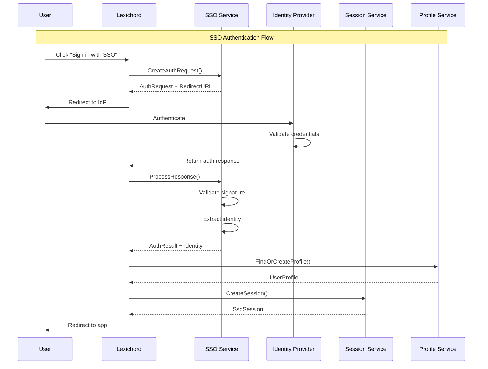

# LCS-DES-096: Design Specification Index — The Stage Door (SSO/SAML)

## Document Control

| Field | Value |
| :--- | :--- |
| **Document ID** | LCS-DES-096-INDEX |
| **Feature ID** | COL-096 |
| **Feature Name** | The Stage Door (SSO/SAML) |
| **Target Version** | v0.9.6 |
| **Module Scope** | Lexichord.Modules.Collaboration |
| **Swimlane** | Enterprise |
| **License Tier** | Enterprise |
| **Feature Gate Key** | `Enterprise.SSO` |
| **Status** | Draft |
| **Last Updated** | 2026-01-27 |

---

## 1. Executive Summary

**v0.9.6** delivers the **Stage Door** — enterprise-grade Single Sign-On (SSO) integration enabling Lexichord to authenticate users through corporate identity providers.

### 1.1 The Problem

Enterprise organizations require centralized identity management for security, compliance, and user experience:

- Employees cannot use existing corporate credentials to access Lexichord
- IT administrators must manually provision and deprovision users
- No visibility into active sessions for security monitoring
- Compliance frameworks (SOC 2, HIPAA) require centralized authentication

### 1.2 The Solution

Implement four SSO components that:

1. **SAML 2.0 Provider** — Full SAML Service Provider with SP/IdP-initiated flows
2. **OAuth 2.0/OIDC Client** — OpenID Connect integration as SAML alternative
3. **SCIM 2.0 Provisioning** — Automatic user lifecycle management from IdP
4. **Session Management** — Centralized session control with Single Logout

### 1.3 Business Value

| Value | Description |
| :--- | :--- |
| **Enterprise Adoption** | Removes #1 blocker for enterprise sales |
| **Security Compliance** | Enables SOC 2, HIPAA compliance requirements |
| **User Experience** | Single sign-on eliminates password fatigue |
| **IT Efficiency** | Automatic provisioning reduces onboarding overhead |
| **Security Visibility** | Session monitoring enables threat detection |

---

## 2. Related Documents

### 2.1 Scope Breakdown Document

The detailed scope breakdown for v0.9.6, including all sub-parts, implementation checklists, user stories, and acceptance criteria:

| Document | Description |
| :--- | :--- |
| **[LCS-SBD-096](./LCS-SBD-096.md)** | Scope Breakdown — The Stage Door (SSO/SAML) |

### 2.2 Sub-Part Design Specifications

Each sub-part has its own detailed design specification following the LDS-01 template:

| Sub-Part | Document | Title | Description |
| :--- | :--- | :--- | :--- |
| v0.9.6a | **[LCS-DES-096a](./LCS-DES-096a.md)** | SAML 2.0 Service Provider | SP/IdP-initiated SAML authentication |
| v0.9.6b | **[LCS-DES-096b](./LCS-DES-096b.md)** | OAuth 2.0 / OIDC Client | OpenID Connect authentication |
| v0.9.6c | **[LCS-DES-096c](./LCS-DES-096c.md)** | SCIM 2.0 User Provisioning | Automatic user lifecycle management |
| v0.9.6d | **[LCS-DES-096d](./LCS-DES-096d.md)** | SSO Session Management | Session lifecycle and Single Logout |

---

## 3. Architecture Overview

### 3.1 Component Diagram

```mermaid
graph TB
    subgraph "Lexichord.Modules.Collaboration"
        subgraph "SSO Services"
            SAML[SamlService<br/>v0.9.6a]
            OIDC[OidcService<br/>v0.9.6b]
            SCIM[ScimService<br/>v0.9.6c]
            SESS[SsoSessionService<br/>v0.9.6d]
        end

        subgraph "Configuration"
            SCONF[SamlConfiguration]
            OCONF[OidcConfiguration]
            SESSCONF[SsoSessionConfiguration]
        end

        subgraph "Handlers"
            AUTH[SsoAuthHandler]
            CALLBACK[SsoCallbackHandler]
            SCIMAPI[ScimApiController]
        end

        subgraph "UI"
            SETTINGS[SsoSettingsView]
            SESSIONS[SessionsView]
        end
    end

    subgraph "Identity Providers"
        OKTA[Okta]
        AZURE[Azure AD]
        GOOGLE[Google Workspace]
    end

    subgraph "Prior Version Dependencies"
        PROFILE[IProfileService<br/>v0.9.1a]
        VAULT[ISecureVault<br/>v0.0.6a]
        LICENSE[ILicenseContext<br/>v0.0.4c]
    end

    subgraph "Data Storage"
        DB[(PostgreSQL)]
    end

    AUTH --> SAML
    AUTH --> OIDC
    CALLBACK --> SAML
    CALLBACK --> OIDC
    CALLBACK --> SESS

    SAML --> SCONF
    OIDC --> OCONF
    SESS --> SESSCONF

    SCIMAPI --> SCIM
    SCIM --> PROFILE

    SAML --> OKTA
    SAML --> AZURE
    OIDC --> OKTA
    OIDC --> AZURE
    OIDC --> GOOGLE

    SAML --> VAULT
    OIDC --> VAULT
    SESS --> VAULT

    SESS --> DB
    SCIM --> DB

    SETTINGS --> SAML
    SETTINGS --> OIDC
    SESSIONS --> SESS

    SAML --> LICENSE
    OIDC --> LICENSE
    SCIM --> LICENSE

    style SAML fill:#4a9eff,color:#fff
    style OIDC fill:#4a9eff,color:#fff
    style SCIM fill:#22c55e,color:#fff
    style SESS fill:#f97316,color:#fff
```



### 3.2 Authentication Flow Overview



---

## 4. Dependencies

### 4.1 Upstream Dependencies

| Interface | Source Version | Purpose |
| :--- | :--- | :--- |
| `IProfileService` | v0.9.1a | Link SSO identity to user profiles |
| `UserProfile` | v0.9.1a | User profile data structure |
| `ISecureVault` | v0.0.6a | Store certificates and secrets |
| `ILicenseContext` | v0.0.4c | Gate features to Enterprise tier |
| `ILicenseStateService` | v0.9.2c | Verify active Enterprise license |
| `ISettingsService` | v0.1.6a | Store SSO configuration |
| `IMediator` | v0.0.7a | Publish authentication events |
| `Polly` | v0.0.5d | Retry policies for IdP communication |

### 4.2 NuGet Packages

| Package | Version | Purpose |
| :--- | :--- | :--- |
| `ITfoxtec.Identity.Saml2` | 4.x | SAML 2.0 implementation |
| `Microsoft.IdentityModel.Tokens` | 7.x | Token validation |
| `Microsoft.IdentityModel.JsonWebTokens` | 7.x | JWT parsing |
| `System.IdentityModel.Tokens.Jwt` | 7.x | JWT handling |

### 4.3 Downstream Consumers (Future)

| Version | Feature | Uses From v0.9.6 |
| :--- | :--- | :--- |
| v0.9.7 | Teams Collaboration | SSO sessions for team access |
| v0.9.8 | Workspace Sharing | Authenticated identity for sharing |
| v1.0.x | Enterprise GA | Production SSO for enterprise users |

---

## 5. License Gating Strategy

SSO features are **Enterprise** tier only:

| Feature | Core | WriterPro | Teams | Enterprise |
| :--- | :--- | :--- | :--- | :--- |
| SSO Configuration | - | - | - | Y |
| SAML Authentication | - | - | - | Y |
| OIDC Authentication | - | - | - | Y |
| SCIM Provisioning | - | - | - | Y |
| Session Management | - | - | - | Y |
| Admin Session Controls | - | - | - | Y |

**Gating Implementation:**

```csharp
public class SsoSettingsViewModel : ObservableObject
{
    private readonly ILicenseContext _license;

    public bool IsSsoAvailable =>
        _license.CurrentTier >= LicenseTier.Enterprise;

    public string UpgradeMessage =>
        "SSO is available on Enterprise plans. Upgrade to enable.";
}
```

---

## 6. Protocol Summary

### 6.1 SAML 2.0 (v0.9.6a)

| Capability | Support |
| :--- | :--- |
| SP-initiated SSO | Yes |
| IdP-initiated SSO | Yes |
| Single Logout (SLO) | Yes |
| Signed Assertions | Required |
| Encrypted Assertions | Optional |
| Metadata Exchange | Yes |

### 6.2 OAuth 2.0 / OIDC (v0.9.6b)

| Capability | Support |
| :--- | :--- |
| Authorization Code Flow | Yes |
| PKCE | Required |
| ID Token Validation | Yes |
| Token Refresh | Yes |
| UserInfo Endpoint | Yes |
| RP-Initiated Logout | Yes |

### 6.3 SCIM 2.0 (v0.9.6c)

| Operation | Endpoint | Support |
| :--- | :--- | :--- |
| Create User | POST /scim/v2/Users | Yes |
| Get User | GET /scim/v2/Users/{id} | Yes |
| Update User | PUT /scim/v2/Users/{id} | Yes |
| Patch User | PATCH /scim/v2/Users/{id} | Yes |
| Delete User | DELETE /scim/v2/Users/{id} | Yes |
| List Users | GET /scim/v2/Users | Yes |
| Filter Users | GET /scim/v2/Users?filter=... | Yes |
| Bulk Operations | POST /scim/v2/Bulk | Yes |

---

## 7. Verified IdP Compatibility

| Identity Provider | SAML | OIDC | SCIM |
| :--- | :--- | :--- | :--- |
| Okta | Tested | Tested | Tested |
| Azure Active Directory | Tested | Tested | Tested |
| Google Workspace | Limited | Tested | N/A |
| OneLogin | Tested | Tested | Tested |
| Ping Identity | Tested | Tested | Planned |

---

## 8. Implementation Checklist Summary

| Sub-Part | Tasks | Est. Hours |
| :--- | :--- | :--- |
| v0.9.6a | SAML 2.0 Service Provider | 32 |
| v0.9.6b | OAuth 2.0 / OIDC Client | 26 |
| v0.9.6c | SCIM 2.0 Provisioning | 27 |
| v0.9.6d | SSO Session Management | 29 |
| Integration | UI, tests, documentation | 20 |
| **Total** | | **134 hours** |

See [LCS-SBD-096](./LCS-SBD-096.md) Section 4 for the detailed task breakdown.

---

## 9. Success Criteria Summary

| Category | Criterion | Target |
| :--- | :--- | :--- |
| **SAML Compatibility** | IdP Support | Okta, Azure AD tested |
| **OIDC Compatibility** | IdP Support | Okta, Azure AD, Google tested |
| **Authentication Time** | SP-initiated login | < 3 seconds |
| **SCIM Latency** | User provisioning | < 500ms |
| **Session Validation** | Request overhead | < 10ms |
| **Reliability** | Auth success rate | > 99% |
| **Security** | Audit findings | 0 critical |

See [LCS-SBD-096](./LCS-SBD-096.md) Section 9 for full success metrics.

---

## 10. Security Considerations

### 10.1 SAML Security

- Signature validation on all assertions
- Audience restriction validation
- Replay attack prevention via assertion ID tracking
- Certificate pinning for IdP validation

### 10.2 OIDC Security

- PKCE required for authorization code flow
- State parameter to prevent CSRF
- Nonce validation in ID tokens
- Token binding to client

### 10.3 SCIM Security

- Bearer token authentication
- Token rotation support
- IP allowlisting option
- Audit logging of all operations

### 10.4 Session Security

- Encrypted token storage
- Session binding to client fingerprint
- Automatic cleanup of expired sessions
- Admin-only session termination

---

## 11. What This Enables

| Version | Feature | Uses From v0.9.6 |
| :--- | :--- | :--- |
| v0.9.7 | Teams Collaboration | SSO for team member access |
| v0.9.8 | Workspace Sharing | Authenticated identity for sharing |
| v1.0.x | Enterprise GA | Production SSO deployment |
| v1.1.x | Multi-tenant SSO | Per-tenant IdP configuration |

---

## 12. MediatR Events

| Event | Source | Description |
| :--- | :--- | :--- |
| `SamlAuthenticationSucceededEvent` | v0.9.6a | SAML login completed |
| `SamlAuthenticationFailedEvent` | v0.9.6a | SAML login failed |
| `OidcAuthenticationSucceededEvent` | v0.9.6b | OIDC login completed |
| `OidcAuthenticationFailedEvent` | v0.9.6b | OIDC login failed |
| `UserProvisionedEvent` | v0.9.6c | SCIM user created |
| `UserDeprovisionedEvent` | v0.9.6c | SCIM user deleted |
| `UserDeactivatedEvent` | v0.9.6c | SCIM user deactivated |
| `SessionCreatedEvent` | v0.9.6d | SSO session started |
| `SessionTerminatedEvent` | v0.9.6d | SSO session ended |
| `SingleLogoutCompletedEvent` | v0.9.6d | SLO propagated |

---

## 13. Database Schema

### 13.1 sso_sessions Table

```sql
CREATE TABLE sso_sessions (
    session_id VARCHAR(64) PRIMARY KEY,
    user_id UUID NOT NULL REFERENCES user_profiles(profile_id),
    provider VARCHAR(20) NOT NULL,
    session_index VARCHAR(256),
    name_id VARCHAR(256),
    access_token TEXT,  -- Encrypted
    refresh_token TEXT, -- Encrypted
    token_expiry TIMESTAMP,
    created_at TIMESTAMP NOT NULL DEFAULT NOW(),
    last_activity_at TIMESTAMP NOT NULL DEFAULT NOW(),
    expires_at TIMESTAMP NOT NULL,
    status VARCHAR(20) NOT NULL DEFAULT 'Active',
    ip_address VARCHAR(45),
    user_agent TEXT,
    device_info VARCHAR(256),
    metadata_json JSONB,
    termination_reason VARCHAR(50),
    terminated_at TIMESTAMP
);

CREATE INDEX idx_sso_sessions_user ON sso_sessions(user_id);
CREATE INDEX idx_sso_sessions_status ON sso_sessions(status);
CREATE INDEX idx_sso_sessions_expires ON sso_sessions(expires_at);
CREATE INDEX idx_sso_sessions_session_index ON sso_sessions(session_index);
```

### 13.2 scim_sync Table

```sql
CREATE TABLE scim_sync (
    id UUID PRIMARY KEY DEFAULT gen_random_uuid(),
    external_id VARCHAR(256) NOT NULL UNIQUE,
    user_id UUID REFERENCES user_profiles(profile_id),
    scim_user_json JSONB NOT NULL,
    created_at TIMESTAMP NOT NULL DEFAULT NOW(),
    updated_at TIMESTAMP NOT NULL DEFAULT NOW(),
    synced_at TIMESTAMP NOT NULL DEFAULT NOW()
);

CREATE INDEX idx_scim_sync_external ON scim_sync(external_id);
CREATE INDEX idx_scim_sync_user ON scim_sync(user_id);
```

---

## Document History

| Version | Date | Author | Changes |
| :--- | :--- | :--- | :--- |
| 1.0 | 2026-01-27 | Lead Architect | Initial draft |
