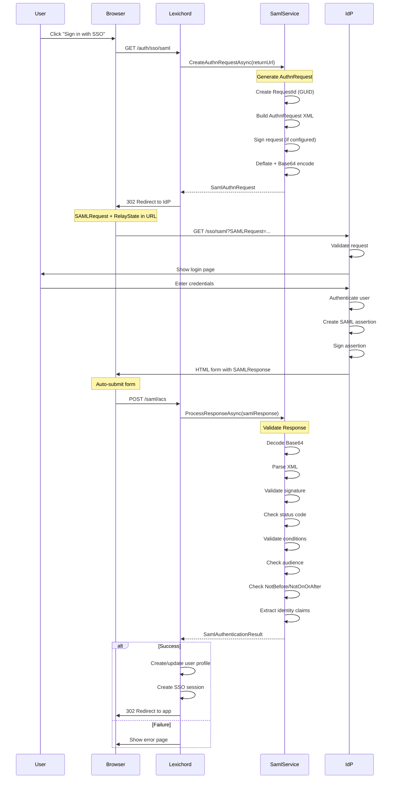
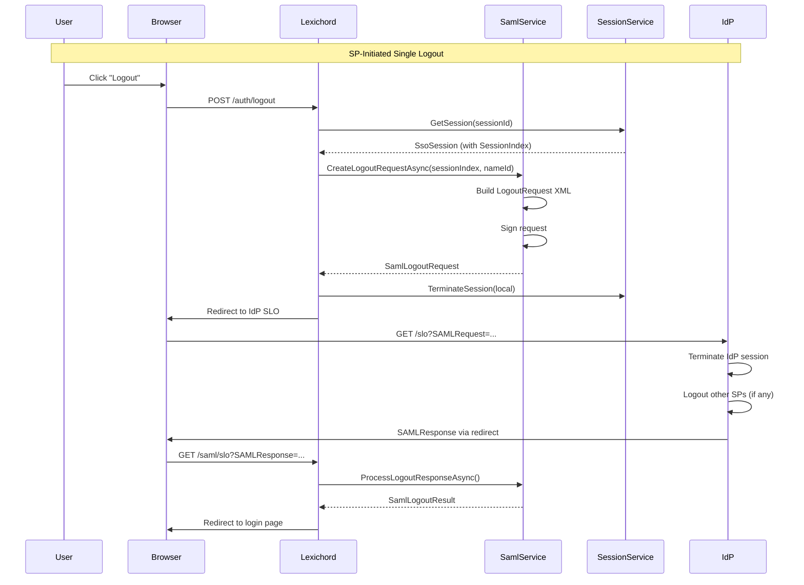

# LCS-DES-096a: Design Specification — SAML 2.0 Service Provider

## 1. Metadata & Categorization

| Field | Value | Description |
| :--- | :--- | :--- |
| **Feature ID** | `COL-096a` | Sub-part of COL-096 |
| **Feature Name** | `SAML 2.0 Service Provider` | Enterprise SAML authentication |
| **Target Version** | `v0.9.6a` | First sub-part of v0.9.6 |
| **Module Scope** | `Lexichord.Modules.Collaboration` | Collaboration module |
| **Swimlane** | `Enterprise` | Enterprise features vertical |
| **License Tier** | `Enterprise` | Enterprise tier only |
| **Feature Gate Key** | `Enterprise.SSO.SAML` | License gate identifier |
| **Author** | Lead Architect | |
| **Status** | `Draft` | |
| **Last Updated** | `2026-01-27` | |
| **Parent Document** | [LCS-DES-096-INDEX](./LCS-DES-096-INDEX.md) | |
| **Scope Breakdown** | [LCS-SBD-096 Section 3.1](./LCS-SBD-096.md#31-v096a-saml-provider) | |

---

## 2. Executive Summary

### 2.1 The Requirement

Enterprise organizations use SAML 2.0 (Security Assertion Markup Language) as their primary Single Sign-On protocol. Lexichord must act as a SAML Service Provider (SP) to integrate with corporate Identity Providers (IdP) like Okta, Azure Active Directory, and OneLogin.

Without SAML support:

- Enterprise users cannot use corporate credentials
- IT cannot enforce centralized authentication policies
- Compliance requirements (SOC 2, HIPAA) cannot be met
- Enterprise sales are blocked at security review stage

> **Goal:** Implement a SAML 2.0 Service Provider that supports SP-initiated and IdP-initiated SSO flows with major enterprise IdPs.

### 2.2 The Proposed Solution

Implement a comprehensive SAML 2.0 Service Provider using ITfoxtec.Identity.Saml2 that:

1. Generates SP metadata for IdP registration
2. Creates signed AuthnRequests (SP-initiated flow)
3. Validates SAML responses and assertions
4. Extracts identity claims from assertions
5. Supports Single Logout (SLO)
6. Manages SP signing and encryption certificates

---

## 3. Architecture & Modular Strategy

### 3.1 Dependencies

#### 3.1.1 Required Interfaces

| Interface | Source Version | Purpose |
| :--- | :--- | :--- |
| `IProfileService` | v0.9.1a | Create/update user profiles from SAML identity |
| `ISecureVault` | v0.0.6a | Store SP certificates and IdP certificates |
| `ILicenseContext` | v0.0.4c | Verify Enterprise tier license |
| `ISettingsService` | v0.1.6a | Store SAML configuration |
| `IMediator` | v0.0.7a | Publish authentication events |
| `ISsoSessionService` | v0.9.6d | Create SSO sessions |

#### 3.1.2 NuGet Packages

| Package | Version | Purpose |
| :--- | :--- | :--- |
| `ITfoxtec.Identity.Saml2` | 4.x | SAML 2.0 protocol implementation |
| `System.Security.Cryptography.Xml` | 8.x | XML signature validation |

### 3.2 Licensing Behavior

```csharp
public class SamlService : ISamlService
{
    private readonly ILicenseContext _license;

    private void EnsureEnterpriseLicense()
    {
        if (_license.CurrentTier < LicenseTier.Enterprise)
        {
            throw new LicenseRequiredException(
                "SAML SSO requires an Enterprise license",
                LicenseTier.Enterprise);
        }
    }

    public async Task<SamlAuthnRequest> CreateAuthnRequestAsync(
        string returnUrl,
        CancellationToken ct = default)
    {
        EnsureEnterpriseLicense();
        // ... implementation
    }
}
```

---

## 4. Data Contract (The API)

### 4.1 Core Interfaces

```csharp
namespace Lexichord.Abstractions.Contracts.Auth;

/// <summary>
/// Service for SAML 2.0 authentication operations.
/// Implements both SP-initiated and IdP-initiated SSO flows.
/// </summary>
public interface ISamlService
{
    /// <summary>
    /// Generates SP metadata XML for IdP registration.
    /// </summary>
    /// <param name="ct">Cancellation token.</param>
    /// <returns>SP metadata as XML string.</returns>
    Task<string> GenerateSpMetadataAsync(CancellationToken ct = default);

    /// <summary>
    /// Creates a SAML authentication request for SP-initiated flow.
    /// </summary>
    /// <param name="returnUrl">URL to redirect after authentication.</param>
    /// <param name="ct">Cancellation token.</param>
    /// <returns>SAML authentication request with redirect URL.</returns>
    Task<SamlAuthnRequest> CreateAuthnRequestAsync(
        string returnUrl,
        CancellationToken ct = default);

    /// <summary>
    /// Processes a SAML response from the IdP.
    /// </summary>
    /// <param name="samlResponse">Base64-encoded SAML response.</param>
    /// <param name="relayState">Optional relay state parameter.</param>
    /// <param name="ct">Cancellation token.</param>
    /// <returns>Authentication result with identity or error.</returns>
    Task<SamlAuthenticationResult> ProcessResponseAsync(
        string samlResponse,
        string? relayState = null,
        CancellationToken ct = default);

    /// <summary>
    /// Creates a SAML logout request for SP-initiated SLO.
    /// </summary>
    /// <param name="sessionIndex">SAML session index from authentication.</param>
    /// <param name="nameId">Name ID from SAML assertion.</param>
    /// <param name="ct">Cancellation token.</param>
    /// <returns>SAML logout request with redirect URL.</returns>
    Task<SamlLogoutRequest> CreateLogoutRequestAsync(
        string sessionIndex,
        string nameId,
        CancellationToken ct = default);

    /// <summary>
    /// Processes a SAML logout response from the IdP.
    /// </summary>
    /// <param name="samlResponse">Base64-encoded SAML logout response.</param>
    /// <param name="ct">Cancellation token.</param>
    /// <returns>Logout result.</returns>
    Task<SamlLogoutResult> ProcessLogoutResponseAsync(
        string samlResponse,
        CancellationToken ct = default);

    /// <summary>
    /// Processes a SAML logout request from the IdP (IdP-initiated SLO).
    /// </summary>
    /// <param name="samlRequest">Base64-encoded SAML logout request.</param>
    /// <param name="ct">Cancellation token.</param>
    /// <returns>Logout result with response to send to IdP.</returns>
    Task<SamlLogoutResult> ProcessLogoutRequestAsync(
        string samlRequest,
        CancellationToken ct = default);

    /// <summary>
    /// Validates the current SAML configuration.
    /// </summary>
    /// <param name="ct">Cancellation token.</param>
    /// <returns>Validation result with any errors.</returns>
    Task<SamlConfigurationValidationResult> ValidateConfigurationAsync(
        CancellationToken ct = default);
}
```

### 4.2 Request/Response Records

```csharp
namespace Lexichord.Abstractions.Contracts.Auth;

/// <summary>
/// SAML authentication request for SP-initiated flow.
/// </summary>
public record SamlAuthnRequest(
    /// <summary>Unique request identifier for correlation.</summary>
    string RequestId,
    /// <summary>IdP SSO URL to redirect to.</summary>
    string IdpUrl,
    /// <summary>Base64-encoded, deflated SAML request.</summary>
    string SamlRequest,
    /// <summary>Relay state containing return URL.</summary>
    string? RelayState,
    /// <summary>When the request was created.</summary>
    DateTime CreatedAt,
    /// <summary>When the request expires.</summary>
    DateTime ExpiresAt
);

/// <summary>
/// Result of processing a SAML authentication response.
/// </summary>
public record SamlAuthenticationResult(
    /// <summary>Whether authentication was successful.</summary>
    bool IsSuccess,
    /// <summary>Identity extracted from SAML assertion.</summary>
    SamlIdentity? Identity,
    /// <summary>SAML session index for SLO.</summary>
    string? SessionIndex,
    /// <summary>Error details if authentication failed.</summary>
    SamlAuthError? Error
);

/// <summary>
/// Identity information extracted from SAML assertion.
/// </summary>
public record SamlIdentity(
    /// <summary>SAML NameID value.</summary>
    string NameId,
    /// <summary>SAML NameID format.</summary>
    string NameIdFormat,
    /// <summary>User's email address.</summary>
    string? Email,
    /// <summary>User's display name.</summary>
    string? DisplayName,
    /// <summary>User's first/given name.</summary>
    string? FirstName,
    /// <summary>User's last/family name.</summary>
    string? LastName,
    /// <summary>Group memberships from IdP.</summary>
    IReadOnlyList<string> Groups,
    /// <summary>All attributes from SAML assertion.</summary>
    IReadOnlyDictionary<string, string> Attributes
);

/// <summary>
/// SAML authentication error information.
/// </summary>
public record SamlAuthError(
    /// <summary>Error code for programmatic handling.</summary>
    SamlErrorCode Code,
    /// <summary>Human-readable error message.</summary>
    string Message,
    /// <summary>SAML status code from IdP response.</summary>
    string? StatusCode,
    /// <summary>SAML status message from IdP response.</summary>
    string? StatusMessage
);

/// <summary>
/// SAML error codes.
/// </summary>
public enum SamlErrorCode
{
    /// <summary>Invalid or malformed SAML response.</summary>
    InvalidResponse,
    /// <summary>XML signature validation failed.</summary>
    SignatureValidationFailed,
    /// <summary>Assertion is expired.</summary>
    AssertionExpired,
    /// <summary>Audience restriction validation failed.</summary>
    AudienceRestrictionFailed,
    /// <summary>Required attribute missing from assertion.</summary>
    MissingRequiredAttribute,
    /// <summary>SAML configuration is invalid.</summary>
    ConfigurationError,
    /// <summary>Network error communicating with IdP.</summary>
    NetworkError,
    /// <summary>IdP returned an error status.</summary>
    IdpError,
    /// <summary>Replay attack detected (duplicate assertion ID).</summary>
    ReplayDetected,
    /// <summary>Assertion not yet valid (NotBefore in future).</summary>
    AssertionNotYetValid
}

/// <summary>
/// SAML logout request for SP-initiated SLO.
/// </summary>
public record SamlLogoutRequest(
    /// <summary>Unique request identifier.</summary>
    string RequestId,
    /// <summary>IdP SLO URL to redirect to.</summary>
    string IdpUrl,
    /// <summary>Base64-encoded SAML logout request.</summary>
    string SamlRequest,
    /// <summary>Relay state for return URL.</summary>
    string? RelayState,
    /// <summary>When the request was created.</summary>
    DateTime CreatedAt
);

/// <summary>
/// Result of SAML logout operation.
/// </summary>
public record SamlLogoutResult(
    /// <summary>Whether logout was successful.</summary>
    bool IsSuccess,
    /// <summary>URL to redirect to after logout.</summary>
    string? RedirectUrl,
    /// <summary>SAML logout response to send (for IdP-initiated).</summary>
    string? LogoutResponse,
    /// <summary>Error if logout failed.</summary>
    SamlLogoutError? Error
);

/// <summary>
/// SAML logout error.
/// </summary>
public record SamlLogoutError(
    /// <summary>Error code.</summary>
    SamlLogoutErrorCode Code,
    /// <summary>Error message.</summary>
    string Message
);

/// <summary>
/// SAML logout error codes.
/// </summary>
public enum SamlLogoutErrorCode
{
    SessionNotFound,
    InvalidRequest,
    IdpError,
    PartialLogout
}

/// <summary>
/// Result of SAML configuration validation.
/// </summary>
public record SamlConfigurationValidationResult(
    /// <summary>Whether configuration is valid.</summary>
    bool IsValid,
    /// <summary>List of validation errors.</summary>
    IReadOnlyList<string> Errors,
    /// <summary>List of validation warnings.</summary>
    IReadOnlyList<string> Warnings
);
```

### 4.3 Configuration

```csharp
namespace Lexichord.Abstractions.Configuration;

/// <summary>
/// Configuration for SAML 2.0 Service Provider.
/// </summary>
public record SamlConfiguration
{
    /// <summary>
    /// Whether SAML SSO is enabled.
    /// </summary>
    public bool Enabled { get; init; } = false;

    /// <summary>
    /// Service Provider entity ID (unique identifier).
    /// Example: "https://lexichord.app/saml/metadata"
    /// </summary>
    public required string EntityId { get; init; }

    /// <summary>
    /// Assertion Consumer Service URL (where IdP sends responses).
    /// Example: "https://lexichord.app/saml/acs"
    /// </summary>
    public required string AcsUrl { get; init; }

    /// <summary>
    /// Single Logout Service URL.
    /// Example: "https://lexichord.app/saml/slo"
    /// </summary>
    public required string SloUrl { get; init; }

    /// <summary>
    /// SP metadata URL for IdP registration.
    /// Example: "https://lexichord.app/saml/metadata"
    /// </summary>
    public required string MetadataUrl { get; init; }

    /// <summary>
    /// IdP configuration.
    /// </summary>
    public required SamlIdpConfiguration Idp { get; init; }

    /// <summary>
    /// SP signing certificate configuration.
    /// </summary>
    public SamlCertificateConfiguration? SigningCertificate { get; init; }

    /// <summary>
    /// SP encryption certificate configuration.
    /// </summary>
    public SamlCertificateConfiguration? EncryptionCertificate { get; init; }

    /// <summary>
    /// Whether to sign authentication requests.
    /// </summary>
    public bool SignAuthnRequests { get; init; } = true;

    /// <summary>
    /// Whether to require signed assertions from IdP.
    /// </summary>
    public bool RequireSignedAssertions { get; init; } = true;

    /// <summary>
    /// Whether to require encrypted assertions from IdP.
    /// </summary>
    public bool RequireEncryptedAssertions { get; init; } = false;

    /// <summary>
    /// Allowed clock skew for assertion validation.
    /// </summary>
    public TimeSpan ClockSkew { get; init; } = TimeSpan.FromMinutes(5);

    /// <summary>
    /// SAML attribute mappings.
    /// </summary>
    public SamlAttributeMappings AttributeMappings { get; init; } = new();

    /// <summary>
    /// Binding type for SSO.
    /// </summary>
    public SamlBindingType SsoBinding { get; init; } = SamlBindingType.Redirect;

    /// <summary>
    /// Binding type for SLO.
    /// </summary>
    public SamlBindingType SloBinding { get; init; } = SamlBindingType.Redirect;
}

/// <summary>
/// IdP-specific configuration.
/// </summary>
public record SamlIdpConfiguration
{
    /// <summary>
    /// IdP metadata URL for automatic configuration.
    /// </summary>
    public string? MetadataUrl { get; init; }

    /// <summary>
    /// IdP metadata XML (alternative to URL).
    /// </summary>
    public string? MetadataXml { get; init; }

    /// <summary>
    /// IdP entity ID (auto-populated from metadata).
    /// </summary>
    public string? EntityId { get; init; }

    /// <summary>
    /// IdP SSO URL (auto-populated from metadata).
    /// </summary>
    public string? SsoUrl { get; init; }

    /// <summary>
    /// IdP SLO URL (auto-populated from metadata).
    /// </summary>
    public string? SloUrl { get; init; }

    /// <summary>
    /// IdP signing certificate (auto-populated from metadata).
    /// </summary>
    public string? SigningCertificate { get; init; }

    /// <summary>
    /// Whether to validate IdP certificate chain.
    /// </summary>
    public bool ValidateCertificate { get; init; } = true;
}

/// <summary>
/// Certificate configuration for SAML signing/encryption.
/// </summary>
public record SamlCertificateConfiguration
{
    /// <summary>
    /// Certificate stored in SecureVault.
    /// </summary>
    public string? VaultKey { get; init; }

    /// <summary>
    /// Certificate thumbprint (for Windows cert store).
    /// </summary>
    public string? Thumbprint { get; init; }

    /// <summary>
    /// PEM-encoded certificate.
    /// </summary>
    public string? Pem { get; init; }

    /// <summary>
    /// PFX/PKCS12 file path.
    /// </summary>
    public string? PfxPath { get; init; }

    /// <summary>
    /// PFX password (stored in SecureVault).
    /// </summary>
    public string? PfxPasswordVaultKey { get; init; }
}

/// <summary>
/// SAML binding types.
/// </summary>
public enum SamlBindingType
{
    /// <summary>HTTP Redirect binding.</summary>
    Redirect,
    /// <summary>HTTP POST binding.</summary>
    Post
}

/// <summary>
/// Mappings from SAML attribute names to user properties.
/// </summary>
public record SamlAttributeMappings
{
    /// <summary>Attribute containing email address.</summary>
    public string Email { get; init; } =
        "http://schemas.xmlsoap.org/ws/2005/05/identity/claims/emailaddress";

    /// <summary>Attribute containing display name.</summary>
    public string DisplayName { get; init; } =
        "http://schemas.xmlsoap.org/ws/2005/05/identity/claims/name";

    /// <summary>Attribute containing first/given name.</summary>
    public string FirstName { get; init; } =
        "http://schemas.xmlsoap.org/ws/2005/05/identity/claims/givenname";

    /// <summary>Attribute containing last/family name.</summary>
    public string LastName { get; init; } =
        "http://schemas.xmlsoap.org/ws/2005/05/identity/claims/surname";

    /// <summary>Attribute containing group memberships.</summary>
    public string Groups { get; init; } =
        "http://schemas.microsoft.com/ws/2008/06/identity/claims/groups";

    /// <summary>Additional custom attribute mappings.</summary>
    public IReadOnlyDictionary<string, string>? CustomMappings { get; init; }
}
```

---

## 5. Implementation Logic

### 5.1 SP-Initiated SSO Flow



### 5.2 IdP-Initiated SSO Flow

```text
IdP-INITIATED FLOW:
│
├── 1. User clicks Lexichord app in IdP portal
│   └── IdP creates unsolicited SAML Response
│
├── 2. IdP POSTs SAMLResponse to ACS URL
│   └── No prior AuthnRequest (no InResponseTo)
│
├── 3. Validate SAML Response
│   ├── Same validation as SP-initiated
│   └── Skip InResponseTo validation
│
└── 4-6. Same as SP-initiated (create profile, session, redirect)
```

### 5.3 SAML Assertion Validation

```text
ASSERTION VALIDATION STEPS:
│
├── 1. Parse XML Document
│   ├── Load from Base64
│   └── Validate well-formed XML
│
├── 2. Verify XML Signature
│   ├── Locate <Signature> element
│   ├── Verify SignatureValue
│   ├── Validate SignedInfo digest
│   └── Verify against IdP certificate
│
├── 3. Check Response Status
│   ├── StatusCode = "urn:oasis:names:tc:SAML:2.0:status:Success"
│   └── Reject on any other status
│
├── 4. Validate Issuer
│   └── Issuer = configured IdP EntityId
│
├── 5. Validate Conditions
│   ├── NotBefore <= now (with clock skew)
│   ├── NotOnOrAfter > now (with clock skew)
│   └── AudienceRestriction includes SP EntityId
│
├── 6. Validate Subject
│   ├── Extract NameID
│   ├── SubjectConfirmation Method = "bearer"
│   └── NotOnOrAfter > now
│
├── 7. Check Replay
│   ├── AssertionId not in cache
│   └── Add to replay cache with TTL
│
└── 8. Extract Claims
    ├── Map NameID
    └── Map AttributeStatement
```

### 5.4 Single Logout (SLO) Flow



---

## 6. Implementation Details

### 6.1 SamlService Implementation

```csharp
namespace Lexichord.Modules.Collaboration.Auth;

using ITfoxtec.Identity.Saml2;
using ITfoxtec.Identity.Saml2.MvcCore;
using ITfoxtec.Identity.Saml2.Schemas;

/// <summary>
/// SAML 2.0 Service Provider implementation.
/// </summary>
public class SamlService : ISamlService
{
    private readonly SamlConfiguration _config;
    private readonly ISecureVault _vault;
    private readonly IProfileService _profileService;
    private readonly ILicenseContext _license;
    private readonly IMediator _mediator;
    private readonly ILogger<SamlService> _logger;
    private readonly IMemoryCache _replayCache;

    private Saml2Configuration? _saml2Config;
    private readonly SemaphoreSlim _configLock = new(1, 1);

    public SamlService(
        IOptions<SamlConfiguration> config,
        ISecureVault vault,
        IProfileService profileService,
        ILicenseContext license,
        IMediator mediator,
        IMemoryCache replayCache,
        ILogger<SamlService> logger)
    {
        _config = config.Value;
        _vault = vault;
        _profileService = profileService;
        _license = license;
        _mediator = mediator;
        _replayCache = replayCache;
        _logger = logger;
    }

    public async Task<string> GenerateSpMetadataAsync(CancellationToken ct = default)
    {
        EnsureEnterpriseLicense();

        var saml2Config = await GetSaml2ConfigurationAsync(ct);

        var metadata = new EntityDescriptor(saml2Config)
        {
            ValidUntil = 7,
            SPSsoDescriptor = new SPSsoDescriptor
            {
                AuthnRequestsSigned = _config.SignAuthnRequests,
                WantAssertionsSigned = _config.RequireSignedAssertions,
                AssertionConsumerServices =
                [
                    new AssertionConsumerService
                    {
                        Binding = BindingType.Post,
                        Location = new Uri(_config.AcsUrl),
                        Index = 0,
                        IsDefault = true
                    }
                ],
                SingleLogoutServices =
                [
                    new SingleLogoutService
                    {
                        Binding = GetBindingUri(_config.SloBinding),
                        Location = new Uri(_config.SloUrl)
                    }
                ],
                NameIDFormats =
                [
                    new Uri("urn:oasis:names:tc:SAML:1.1:nameid-format:emailAddress"),
                    new Uri("urn:oasis:names:tc:SAML:2.0:nameid-format:persistent"),
                    new Uri("urn:oasis:names:tc:SAML:2.0:nameid-format:transient")
                ]
            }
        };

        // Add signing certificate to metadata
        if (saml2Config.SigningCertificate is not null)
        {
            metadata.SPSsoDescriptor.SigningCertificates =
                [saml2Config.SigningCertificate];
        }

        return metadata.ToXml().OuterXml;
    }

    public async Task<SamlAuthnRequest> CreateAuthnRequestAsync(
        string returnUrl,
        CancellationToken ct = default)
    {
        EnsureEnterpriseLicense();

        _logger.LogInformation(
            "Creating SAML AuthnRequest for return URL: {ReturnUrl}",
            returnUrl);

        var saml2Config = await GetSaml2ConfigurationAsync(ct);

        var authnRequest = new Saml2AuthnRequest(saml2Config)
        {
            ForceAuthn = false,
            IsPassive = false,
            NameIdPolicy = new NameIdPolicy
            {
                AllowCreate = true,
                Format = "urn:oasis:names:tc:SAML:1.1:nameid-format:emailAddress"
            },
            AssertionConsumerServiceUrl = new Uri(_config.AcsUrl)
        };

        var binding = CreateBinding(_config.SsoBinding);
        binding.SetRelayStateQuery(new Dictionary<string, string>
        {
            ["returnUrl"] = returnUrl
        });
        binding.Bind(authnRequest);

        var requestId = authnRequest.Id.Value;
        var expiresAt = DateTime.UtcNow.AddMinutes(5);

        _logger.LogDebug(
            "Created AuthnRequest {RequestId} expiring at {ExpiresAt}",
            requestId, expiresAt);

        return new SamlAuthnRequest(
            RequestId: requestId,
            IdpUrl: binding.RedirectLocation.ToString(),
            SamlRequest: Convert.ToBase64String(
                Encoding.UTF8.GetBytes(authnRequest.XmlDocument.OuterXml)),
            RelayState: binding.RelayState,
            CreatedAt: DateTime.UtcNow,
            ExpiresAt: expiresAt
        );
    }

    public async Task<SamlAuthenticationResult> ProcessResponseAsync(
        string samlResponse,
        string? relayState = null,
        CancellationToken ct = default)
    {
        EnsureEnterpriseLicense();

        try
        {
            _logger.LogDebug("Processing SAML response");

            var saml2Config = await GetSaml2ConfigurationAsync(ct);

            // Create binding and read response
            var binding = new Saml2PostBinding();
            var httpRequest = CreateHttpRequest(samlResponse, relayState);

            var saml2Response = new Saml2AuthnResponse(saml2Config);
            binding.ReadSamlResponse(httpRequest, saml2Response);

            // Check response status
            if (saml2Response.Status != Saml2StatusCodes.Success)
            {
                _logger.LogWarning(
                    "SAML response indicates failure: {Status} - {Message}",
                    saml2Response.Status,
                    saml2Response.StatusMessage);

                await PublishFailureEvent(SamlErrorCode.IdpError,
                    saml2Response.StatusMessage ?? "IdP returned error", ct);

                return new SamlAuthenticationResult(
                    IsSuccess: false,
                    Identity: null,
                    SessionIndex: null,
                    Error: new SamlAuthError(
                        SamlErrorCode.IdpError,
                        "Identity provider returned an error",
                        saml2Response.Status.ToString(),
                        saml2Response.StatusMessage
                    )
                );
            }

            // Check for replay attack
            var assertionId = saml2Response.Id.Value;
            if (_replayCache.TryGetValue(assertionId, out _))
            {
                _logger.LogWarning(
                    "Replay attack detected for assertion {AssertionId}",
                    assertionId);

                await PublishFailureEvent(SamlErrorCode.ReplayDetected,
                    "Duplicate assertion detected", ct);

                return new SamlAuthenticationResult(
                    IsSuccess: false,
                    Identity: null,
                    SessionIndex: null,
                    Error: new SamlAuthError(
                        SamlErrorCode.ReplayDetected,
                        "This authentication response has already been used",
                        null,
                        null
                    )
                );
            }

            // Add to replay cache
            var cacheExpiry = saml2Response.Saml2SecurityToken?.ValidTo
                ?? DateTime.UtcNow.AddMinutes(10);
            _replayCache.Set(assertionId, true,
                new MemoryCacheEntryOptions()
                    .SetAbsoluteExpiration(cacheExpiry));

            // Extract identity from claims
            var identity = ExtractIdentity(saml2Response);
            var sessionIndex = saml2Response.SessionIndex;

            _logger.LogInformation(
                "SAML authentication successful for {Email} (NameId: {NameId})",
                identity.Email,
                identity.NameId);

            await _mediator.Publish(
                new SamlAuthenticationSucceededEvent(identity, sessionIndex), ct);

            return new SamlAuthenticationResult(
                IsSuccess: true,
                Identity: identity,
                SessionIndex: sessionIndex,
                Error: null
            );
        }
        catch (Saml2ResponseException ex)
        {
            _logger.LogError(ex, "SAML response validation failed");

            var errorCode = ex.Message switch
            {
                var m when m.Contains("signature", StringComparison.OrdinalIgnoreCase)
                    => SamlErrorCode.SignatureValidationFailed,
                var m when m.Contains("expired", StringComparison.OrdinalIgnoreCase)
                    => SamlErrorCode.AssertionExpired,
                var m when m.Contains("audience", StringComparison.OrdinalIgnoreCase)
                    => SamlErrorCode.AudienceRestrictionFailed,
                _ => SamlErrorCode.InvalidResponse
            };

            await PublishFailureEvent(errorCode, ex.Message, ct);

            return new SamlAuthenticationResult(
                IsSuccess: false,
                Identity: null,
                SessionIndex: null,
                Error: new SamlAuthError(
                    errorCode,
                    ex.Message,
                    null,
                    null
                )
            );
        }
        catch (Exception ex)
        {
            _logger.LogError(ex, "Unexpected error processing SAML response");

            await PublishFailureEvent(
                SamlErrorCode.InvalidResponse, ex.Message, ct);

            return new SamlAuthenticationResult(
                IsSuccess: false,
                Identity: null,
                SessionIndex: null,
                Error: new SamlAuthError(
                    SamlErrorCode.InvalidResponse,
                    "An unexpected error occurred processing the authentication response",
                    null,
                    null
                )
            );
        }
    }

    public async Task<SamlLogoutRequest> CreateLogoutRequestAsync(
        string sessionIndex,
        string nameId,
        CancellationToken ct = default)
    {
        EnsureEnterpriseLicense();

        _logger.LogInformation(
            "Creating SAML logout request for NameId: {NameId}",
            nameId);

        var saml2Config = await GetSaml2ConfigurationAsync(ct);

        var logoutRequest = new Saml2LogoutRequest(saml2Config)
        {
            NameId = new Saml2NameIdentifier(nameId),
            SessionIndex = sessionIndex
        };

        var binding = CreateBinding(_config.SloBinding);
        binding.Bind(logoutRequest);

        return new SamlLogoutRequest(
            RequestId: logoutRequest.Id.Value,
            IdpUrl: binding.RedirectLocation.ToString(),
            SamlRequest: Convert.ToBase64String(
                Encoding.UTF8.GetBytes(logoutRequest.XmlDocument.OuterXml)),
            RelayState: binding.RelayState,
            CreatedAt: DateTime.UtcNow
        );
    }

    public async Task<SamlConfigurationValidationResult> ValidateConfigurationAsync(
        CancellationToken ct = default)
    {
        var errors = new List<string>();
        var warnings = new List<string>();

        // Validate required fields
        if (string.IsNullOrEmpty(_config.EntityId))
            errors.Add("SP Entity ID is required");

        if (string.IsNullOrEmpty(_config.AcsUrl))
            errors.Add("Assertion Consumer Service URL is required");

        if (_config.Idp is null)
        {
            errors.Add("IdP configuration is required");
        }
        else
        {
            if (string.IsNullOrEmpty(_config.Idp.MetadataUrl) &&
                string.IsNullOrEmpty(_config.Idp.MetadataXml))
            {
                errors.Add("IdP metadata URL or XML is required");
            }
        }

        // Validate URLs
        if (!Uri.TryCreate(_config.AcsUrl, UriKind.Absolute, out _))
            errors.Add("ACS URL must be a valid absolute URL");

        if (!string.IsNullOrEmpty(_config.SloUrl) &&
            !Uri.TryCreate(_config.SloUrl, UriKind.Absolute, out _))
            errors.Add("SLO URL must be a valid absolute URL");

        // Validate certificate if signing is enabled
        if (_config.SignAuthnRequests && _config.SigningCertificate is null)
        {
            warnings.Add("Request signing is enabled but no certificate is configured");
        }

        // Try to load IdP metadata
        if (errors.Count == 0 && _config.Idp is not null)
        {
            try
            {
                await GetSaml2ConfigurationAsync(ct);
            }
            catch (Exception ex)
            {
                errors.Add($"Failed to load IdP metadata: {ex.Message}");
            }
        }

        return new SamlConfigurationValidationResult(
            IsValid: errors.Count == 0,
            Errors: errors,
            Warnings: warnings
        );
    }

    #region Private Methods

    private void EnsureEnterpriseLicense()
    {
        if (_license.CurrentTier < LicenseTier.Enterprise)
        {
            throw new LicenseRequiredException(
                "SAML SSO requires an Enterprise license",
                LicenseTier.Enterprise);
        }
    }

    private async Task<Saml2Configuration> GetSaml2ConfigurationAsync(
        CancellationToken ct)
    {
        if (_saml2Config is not null)
            return _saml2Config;

        await _configLock.WaitAsync(ct);
        try
        {
            if (_saml2Config is not null)
                return _saml2Config;

            var config = new Saml2Configuration
            {
                Issuer = _config.EntityId,
                AllowedAudienceUris = [new Uri(_config.EntityId)],
                CertificateValidationMode = _config.Idp.ValidateCertificate
                    ? X509CertificateValidationMode.ChainTrust
                    : X509CertificateValidationMode.None,
                RevocationMode = X509RevocationMode.NoCheck
            };

            // Load signing certificate
            if (_config.SigningCertificate is not null)
            {
                config.SigningCertificate =
                    await LoadCertificateAsync(_config.SigningCertificate, ct);
                config.SignAuthnRequest = _config.SignAuthnRequests;
            }

            // Load IdP metadata
            if (!string.IsNullOrEmpty(_config.Idp.MetadataUrl))
            {
                await config.LoadIdpMetadataAsync(
                    new Uri(_config.Idp.MetadataUrl));
            }
            else if (!string.IsNullOrEmpty(_config.Idp.MetadataXml))
            {
                var doc = new XmlDocument();
                doc.LoadXml(_config.Idp.MetadataXml);
                config.ReadIdpMetadata(doc);
            }

            _saml2Config = config;
            return config;
        }
        finally
        {
            _configLock.Release();
        }
    }

    private async Task<X509Certificate2> LoadCertificateAsync(
        SamlCertificateConfiguration certConfig,
        CancellationToken ct)
    {
        if (!string.IsNullOrEmpty(certConfig.VaultKey))
        {
            var certData = await _vault.GetAsync<string>(certConfig.VaultKey, ct);
            return new X509Certificate2(Convert.FromBase64String(certData));
        }

        if (!string.IsNullOrEmpty(certConfig.PfxPath))
        {
            var password = !string.IsNullOrEmpty(certConfig.PfxPasswordVaultKey)
                ? await _vault.GetAsync<string>(certConfig.PfxPasswordVaultKey, ct)
                : null;
            return new X509Certificate2(certConfig.PfxPath, password);
        }

        if (!string.IsNullOrEmpty(certConfig.Thumbprint))
        {
            using var store = new X509Store(StoreName.My, StoreLocation.CurrentUser);
            store.Open(OpenFlags.ReadOnly);
            var certs = store.Certificates.Find(
                X509FindType.FindByThumbprint,
                certConfig.Thumbprint,
                false);
            return certs.Count > 0
                ? certs[0]
                : throw new InvalidOperationException(
                    $"Certificate with thumbprint {certConfig.Thumbprint} not found");
        }

        throw new InvalidOperationException("No certificate source configured");
    }

    private SamlIdentity ExtractIdentity(Saml2AuthnResponse response)
    {
        var claims = response.ClaimsIdentity.Claims.ToList();
        var mappings = _config.AttributeMappings;

        var groups = GetClaimValues(claims, mappings.Groups);
        var attributes = claims.ToDictionary(c => c.Type, c => c.Value);

        return new SamlIdentity(
            NameId: response.NameId.Value,
            NameIdFormat: response.NameId.Format?.OriginalString ?? "unspecified",
            Email: GetClaimValue(claims, mappings.Email),
            DisplayName: GetClaimValue(claims, mappings.DisplayName),
            FirstName: GetClaimValue(claims, mappings.FirstName),
            LastName: GetClaimValue(claims, mappings.LastName),
            Groups: groups,
            Attributes: attributes
        );
    }

    private static string? GetClaimValue(List<Claim> claims, string claimType) =>
        claims.FirstOrDefault(c =>
            c.Type.Equals(claimType, StringComparison.OrdinalIgnoreCase))?.Value;

    private static IReadOnlyList<string> GetClaimValues(
        List<Claim> claims, string claimType) =>
        claims.Where(c =>
            c.Type.Equals(claimType, StringComparison.OrdinalIgnoreCase))
            .Select(c => c.Value)
            .ToList();

    private static Saml2Binding<Saml2AuthnRequest> CreateBinding(
        SamlBindingType bindingType) =>
        bindingType switch
        {
            SamlBindingType.Post => new Saml2PostBinding(),
            SamlBindingType.Redirect => new Saml2RedirectBinding(),
            _ => throw new ArgumentOutOfRangeException(nameof(bindingType))
        };

    private static Uri GetBindingUri(SamlBindingType bindingType) =>
        bindingType switch
        {
            SamlBindingType.Post => BindingType.Post,
            SamlBindingType.Redirect => BindingType.Redirect,
            _ => throw new ArgumentOutOfRangeException(nameof(bindingType))
        };

    private async Task PublishFailureEvent(
        SamlErrorCode code, string message, CancellationToken ct)
    {
        await _mediator.Publish(
            new SamlAuthenticationFailedEvent(code.ToString(), message), ct);
    }

    #endregion
}
```

---

## 7. Test Scenarios

### 7.1 Unit Tests

```csharp
[Trait("Category", "Unit")]
[Trait("Version", "v0.9.6a")]
public class SamlServiceTests
{
    private readonly Mock<ISecureVault> _vaultMock = new();
    private readonly Mock<IProfileService> _profileMock = new();
    private readonly Mock<ILicenseContext> _licenseMock = new();
    private readonly Mock<IMediator> _mediatorMock = new();
    private readonly IMemoryCache _cache = new MemoryCache(
        new MemoryCacheOptions());

    private SamlService CreateService(SamlConfiguration config)
    {
        _licenseMock.Setup(l => l.CurrentTier)
            .Returns(LicenseTier.Enterprise);

        return new SamlService(
            Options.Create(config),
            _vaultMock.Object,
            _profileMock.Object,
            _licenseMock.Object,
            _mediatorMock.Object,
            _cache,
            NullLogger<SamlService>.Instance
        );
    }

    #region Metadata Generation Tests

    [Fact]
    public async Task GenerateSpMetadata_ValidConfig_ReturnsValidXml()
    {
        // Arrange
        var config = CreateValidConfig();
        var sut = CreateService(config);

        // Act
        var metadata = await sut.GenerateSpMetadataAsync();

        // Assert
        metadata.Should().Contain("EntityDescriptor");
        metadata.Should().Contain(config.EntityId);
        metadata.Should().Contain(config.AcsUrl);
        metadata.Should().Contain("AssertionConsumerService");
    }

    [Fact]
    public async Task GenerateSpMetadata_NonEnterprise_ThrowsLicenseException()
    {
        // Arrange
        _licenseMock.Setup(l => l.CurrentTier).Returns(LicenseTier.WriterPro);
        var config = CreateValidConfig();
        var sut = CreateService(config);

        // Act
        var act = () => sut.GenerateSpMetadataAsync();

        // Assert
        await act.Should().ThrowAsync<LicenseRequiredException>();
    }

    #endregion

    #region AuthnRequest Tests

    [Fact]
    public async Task CreateAuthnRequest_ValidConfig_ReturnsRequest()
    {
        // Arrange
        var config = CreateValidConfig();
        var sut = CreateService(config);
        var returnUrl = "https://app.example.com/dashboard";

        // Act
        var request = await sut.CreateAuthnRequestAsync(returnUrl);

        // Assert
        request.RequestId.Should().NotBeNullOrEmpty();
        request.IdpUrl.Should().StartWith(config.Idp.SsoUrl);
        request.SamlRequest.Should().NotBeNullOrEmpty();
        request.ExpiresAt.Should().BeAfter(DateTime.UtcNow);
    }

    [Fact]
    public async Task CreateAuthnRequest_WithRelayState_IncludesReturnUrl()
    {
        // Arrange
        var config = CreateValidConfig();
        var sut = CreateService(config);
        var returnUrl = "https://app.example.com/document/123";

        // Act
        var request = await sut.CreateAuthnRequestAsync(returnUrl);

        // Assert
        request.IdpUrl.Should().Contain("RelayState=");
    }

    #endregion

    #region Response Processing Tests

    [Fact]
    public async Task ProcessResponse_ValidSignedResponse_ReturnsSuccess()
    {
        // Arrange
        var config = CreateValidConfig();
        var sut = CreateService(config);
        var response = CreateSignedSamlResponse("user@example.com");

        // Act
        var result = await sut.ProcessResponseAsync(response);

        // Assert
        result.IsSuccess.Should().BeTrue();
        result.Identity.Should().NotBeNull();
        result.Identity!.Email.Should().Be("user@example.com");
    }

    [Fact]
    public async Task ProcessResponse_TamperedSignature_ReturnsError()
    {
        // Arrange
        var config = CreateValidConfig();
        var sut = CreateService(config);
        var response = CreateTamperedSamlResponse();

        // Act
        var result = await sut.ProcessResponseAsync(response);

        // Assert
        result.IsSuccess.Should().BeFalse();
        result.Error?.Code.Should().Be(SamlErrorCode.SignatureValidationFailed);
    }

    [Fact]
    public async Task ProcessResponse_ExpiredAssertion_ReturnsError()
    {
        // Arrange
        var config = CreateValidConfig();
        var sut = CreateService(config);
        var response = CreateExpiredSamlResponse();

        // Act
        var result = await sut.ProcessResponseAsync(response);

        // Assert
        result.IsSuccess.Should().BeFalse();
        result.Error?.Code.Should().Be(SamlErrorCode.AssertionExpired);
    }

    [Fact]
    public async Task ProcessResponse_ReplayAttack_ReturnsError()
    {
        // Arrange
        var config = CreateValidConfig();
        var sut = CreateService(config);
        var response = CreateSignedSamlResponse("user@example.com");

        // Process first time (should succeed)
        await sut.ProcessResponseAsync(response);

        // Act - process same response again
        var result = await sut.ProcessResponseAsync(response);

        // Assert
        result.IsSuccess.Should().BeFalse();
        result.Error?.Code.Should().Be(SamlErrorCode.ReplayDetected);
    }

    [Fact]
    public async Task ProcessResponse_WrongAudience_ReturnsError()
    {
        // Arrange
        var config = CreateValidConfig();
        var sut = CreateService(config);
        var response = CreateSamlResponseWithWrongAudience();

        // Act
        var result = await sut.ProcessResponseAsync(response);

        // Assert
        result.IsSuccess.Should().BeFalse();
        result.Error?.Code.Should().Be(SamlErrorCode.AudienceRestrictionFailed);
    }

    #endregion

    #region Configuration Validation Tests

    [Fact]
    public async Task ValidateConfiguration_ValidConfig_ReturnsSuccess()
    {
        // Arrange
        var config = CreateValidConfig();
        var sut = CreateService(config);

        // Act
        var result = await sut.ValidateConfigurationAsync();

        // Assert
        result.IsValid.Should().BeTrue();
        result.Errors.Should().BeEmpty();
    }

    [Fact]
    public async Task ValidateConfiguration_MissingEntityId_ReturnsError()
    {
        // Arrange
        var config = CreateValidConfig() with { EntityId = "" };
        var sut = CreateService(config);

        // Act
        var result = await sut.ValidateConfigurationAsync();

        // Assert
        result.IsValid.Should().BeFalse();
        result.Errors.Should().Contain(e => e.Contains("Entity ID"));
    }

    [Fact]
    public async Task ValidateConfiguration_InvalidAcsUrl_ReturnsError()
    {
        // Arrange
        var config = CreateValidConfig() with { AcsUrl = "not-a-url" };
        var sut = CreateService(config);

        // Act
        var result = await sut.ValidateConfigurationAsync();

        // Assert
        result.IsValid.Should().BeFalse();
        result.Errors.Should().Contain(e => e.Contains("ACS URL"));
    }

    #endregion

    #region Helper Methods

    private static SamlConfiguration CreateValidConfig() => new()
    {
        Enabled = true,
        EntityId = "https://lexichord.app/saml/metadata",
        AcsUrl = "https://lexichord.app/saml/acs",
        SloUrl = "https://lexichord.app/saml/slo",
        MetadataUrl = "https://lexichord.app/saml/metadata",
        Idp = new SamlIdpConfiguration
        {
            EntityId = "https://idp.example.com",
            SsoUrl = "https://idp.example.com/sso",
            SloUrl = "https://idp.example.com/slo",
            SigningCertificate = TestCertificates.IdpCertificate
        }
    };

    #endregion
}
```

---

## 8. Observability & Logging

| Level | Message Template |
| :--- | :--- |
| Debug | `"Loading SAML configuration from IdP metadata: {MetadataUrl}"` |
| Debug | `"Created AuthnRequest {RequestId} expiring at {ExpiresAt}"` |
| Info | `"Creating SAML AuthnRequest for return URL: {ReturnUrl}"` |
| Info | `"SAML authentication successful for {Email} (NameId: {NameId})"` |
| Info | `"Creating SAML logout request for NameId: {NameId}"` |
| Warning | `"SAML response indicates failure: {Status} - {Message}"` |
| Warning | `"Replay attack detected for assertion {AssertionId}"` |
| Error | `"SAML response validation failed: {Exception}"` |
| Error | `"Failed to load IdP metadata from {MetadataUrl}: {Error}"` |

---

## 9. Security & Safety

| Risk | Level | Mitigation |
| :--- | :--- | :--- |
| Signature bypass | Critical | Use battle-tested ITfoxtec library, require signed assertions |
| Replay attack | High | Track assertion IDs in time-limited cache |
| XML signature wrapping | High | Use library's built-in signature validation |
| IdP impersonation | High | Validate IdP certificate against configured trust |
| Clock manipulation | Medium | Configurable clock skew tolerance |
| Certificate expiry | Medium | Monitor certificate expiry, alert before expiration |

---

## 10. Acceptance Criteria

### 10.1 Functional Criteria

| # | Given | When | Then |
| :--- | :--- | :--- | :--- |
| 1 | Valid SAML configuration | Generating SP metadata | Returns valid XML with EntityDescriptor |
| 2 | User clicks SSO login | Creating AuthnRequest | Returns valid redirect URL to IdP |
| 3 | Valid signed SAML response | Processing response | Returns success with identity |
| 4 | Tampered SAML signature | Processing response | Returns SignatureValidationFailed error |
| 5 | Expired SAML assertion | Processing response | Returns AssertionExpired error |
| 6 | Duplicate assertion ID | Processing response | Returns ReplayDetected error |
| 7 | Wrong audience restriction | Processing response | Returns AudienceRestrictionFailed error |
| 8 | Active session exists | Creating logout request | Returns valid SLO redirect URL |
| 9 | Non-Enterprise license | Any SAML operation | Throws LicenseRequiredException |

### 10.2 IdP Compatibility

| # | IdP | Flow | Verified |
| :--- | :--- | :--- | :--- |
| 1 | Okta | SP-initiated | Yes |
| 2 | Okta | IdP-initiated | Yes |
| 3 | Azure AD | SP-initiated | Yes |
| 4 | Azure AD | IdP-initiated | Yes |
| 5 | OneLogin | SP-initiated | Yes |
| 6 | Okta | Single Logout | Yes |

---

## 11. Deliverable Checklist

| # | Deliverable | Status |
| :--- | :--- | :--- |
| 1 | `ISamlService` interface | [ ] |
| 2 | `SamlService` implementation | [ ] |
| 3 | `SamlConfiguration` record | [ ] |
| 4 | `SamlAuthnRequest` record | [ ] |
| 5 | `SamlAuthenticationResult` record | [ ] |
| 6 | `SamlIdentity` record | [ ] |
| 7 | SP metadata generation | [ ] |
| 8 | AuthnRequest creation (SP-initiated) | [ ] |
| 9 | SAML response processing | [ ] |
| 10 | Replay attack prevention | [ ] |
| 11 | SLO request/response handling | [ ] |
| 12 | Certificate loading from SecureVault | [ ] |
| 13 | Configuration validation | [ ] |
| 14 | Unit tests | [ ] |
| 15 | Integration tests with mock IdP | [ ] |

---

## 12. Verification Commands

```bash
# Run SAML unit tests
dotnet test --filter "Version=v0.9.6a" --logger "console;verbosity=detailed"

# Run SAML integration tests
dotnet test --filter "Category=Integration&Version=v0.9.6a"

# Test SP metadata generation
curl https://localhost:5001/saml/metadata

# Validate SP metadata
xmllint --schema saml-metadata.xsd metadata.xml

# Test with Okta developer account
# 1. Create SAML app in Okta
# 2. Upload SP metadata
# 3. Test SP-initiated login
# 4. Test IdP-initiated login
# 5. Test SLO
```

---

## Document History

| Version | Date | Author | Changes |
| :--- | :--- | :--- | :--- |
| 1.0 | 2026-01-27 | Lead Architect | Initial draft |
