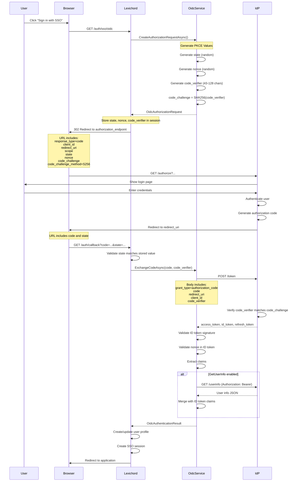

# LCS-DES-096b: Design Specification — OAuth 2.0 / OpenID Connect Client

## 1. Metadata & Categorization

| Field | Value | Description |
| :--- | :--- | :--- |
| **Feature ID** | `COL-096b` | Sub-part of COL-096 |
| **Feature Name** | `OAuth 2.0 / OpenID Connect Client` | Enterprise OIDC authentication |
| **Target Version** | `v0.9.6b` | Second sub-part of v0.9.6 |
| **Module Scope** | `Lexichord.Modules.Collaboration` | Collaboration module |
| **Swimlane** | `Enterprise` | Enterprise features vertical |
| **License Tier** | `Enterprise` | Enterprise tier only |
| **Feature Gate Key** | `Enterprise.SSO.OIDC` | License gate identifier |
| **Author** | Lead Architect | |
| **Status** | `Draft` | |
| **Last Updated** | `2026-01-27` | |
| **Parent Document** | [LCS-DES-096-INDEX](./LCS-DES-096-INDEX.md) | |
| **Scope Breakdown** | [LCS-SBD-096 Section 3.2](./LCS-SBD-096.md#32-v096b-oauth2oidc-provider) | |

---

## 2. Executive Summary

### 2.1 The Requirement

While SAML 2.0 is prevalent in enterprise environments, many organizations prefer OAuth 2.0/OpenID Connect (OIDC) for its simpler implementation and modern architecture. Lexichord must support OIDC as an alternative to SAML for organizations using providers like Okta, Azure AD, and Google Workspace.

Without OIDC support:

- Organizations preferring OIDC over SAML cannot integrate
- Google Workspace users have limited SSO options (Google's SAML has restrictions)
- Modern identity platforms with OIDC-first design are not supported
- Developer-oriented organizations favor OIDC's JWT-based approach

> **Goal:** Implement an OAuth 2.0/OpenID Connect client using authorization code flow with PKCE for secure authentication with enterprise IdPs.

### 2.2 The Proposed Solution

Implement a comprehensive OIDC client that:

1. Supports authorization code flow with PKCE (required for public clients)
2. Validates ID tokens using IdP's published JWKs
3. Retrieves additional user info from UserInfo endpoint
4. Manages token refresh for long-lived sessions
5. Implements RP-initiated logout
6. Discovers IdP configuration via .well-known/openid-configuration

---

## 3. Architecture & Modular Strategy

### 3.1 Dependencies

#### 3.1.1 Required Interfaces

| Interface | Source Version | Purpose |
| :--- | :--- | :--- |
| `IProfileService` | v0.9.1a | Create/update user profiles from OIDC identity |
| `ISecureVault` | v0.0.6a | Store client secrets and refresh tokens |
| `ILicenseContext` | v0.0.4c | Verify Enterprise tier license |
| `ISettingsService` | v0.1.6a | Store OIDC configuration |
| `IMediator` | v0.0.7a | Publish authentication events |
| `ISsoSessionService` | v0.9.6d | Create and manage SSO sessions |
| `Polly` | v0.0.5d | Retry policies for token endpoints |

#### 3.1.2 NuGet Packages

| Package | Version | Purpose |
| :--- | :--- | :--- |
| `Microsoft.IdentityModel.Tokens` | 7.x | Token validation infrastructure |
| `Microsoft.IdentityModel.JsonWebTokens` | 7.x | JWT parsing and validation |
| `System.IdentityModel.Tokens.Jwt` | 7.x | JWT handler |
| `Microsoft.IdentityModel.Protocols.OpenIdConnect` | 7.x | OIDC protocol support |

### 3.2 Licensing Behavior

```csharp
public class OidcService : IOidcService
{
    private readonly ILicenseContext _license;

    private void EnsureEnterpriseLicense()
    {
        if (_license.CurrentTier < LicenseTier.Enterprise)
        {
            throw new LicenseRequiredException(
                "OIDC SSO requires an Enterprise license",
                LicenseTier.Enterprise);
        }
    }
}
```

---

## 4. Data Contract (The API)

### 4.1 Core Interfaces

```csharp
namespace Lexichord.Abstractions.Contracts.Auth;

/// <summary>
/// Service for OAuth 2.0 / OpenID Connect authentication.
/// Implements authorization code flow with PKCE.
/// </summary>
public interface IOidcService
{
    /// <summary>
    /// Creates an authorization URL for initiating the OIDC flow.
    /// </summary>
    /// <param name="returnUrl">URL to redirect after authentication.</param>
    /// <param name="loginHint">Optional hint for pre-filling username.</param>
    /// <param name="ct">Cancellation token.</param>
    /// <returns>Authorization request with URL and PKCE values.</returns>
    Task<OidcAuthorizationRequest> CreateAuthorizationRequestAsync(
        string returnUrl,
        string? loginHint = null,
        CancellationToken ct = default);

    /// <summary>
    /// Exchanges an authorization code for tokens.
    /// </summary>
    /// <param name="code">Authorization code from IdP.</param>
    /// <param name="codeVerifier">PKCE code verifier.</param>
    /// <param name="redirectUri">Redirect URI used in authorization.</param>
    /// <param name="ct">Cancellation token.</param>
    /// <returns>Token result with access, ID, and refresh tokens.</returns>
    Task<OidcTokenResult> ExchangeCodeAsync(
        string code,
        string codeVerifier,
        string redirectUri,
        CancellationToken ct = default);

    /// <summary>
    /// Validates an ID token and extracts claims.
    /// </summary>
    /// <param name="idToken">JWT ID token from IdP.</param>
    /// <param name="nonce">Expected nonce value.</param>
    /// <param name="ct">Cancellation token.</param>
    /// <returns>Identity extracted from ID token.</returns>
    Task<OidcIdentity> ValidateIdTokenAsync(
        string idToken,
        string? nonce = null,
        CancellationToken ct = default);

    /// <summary>
    /// Retrieves user information from the UserInfo endpoint.
    /// </summary>
    /// <param name="accessToken">Access token for UserInfo request.</param>
    /// <param name="ct">Cancellation token.</param>
    /// <returns>User information from IdP.</returns>
    Task<OidcUserInfo> GetUserInfoAsync(
        string accessToken,
        CancellationToken ct = default);

    /// <summary>
    /// Refreshes tokens using a refresh token.
    /// </summary>
    /// <param name="refreshToken">Refresh token from previous authentication.</param>
    /// <param name="ct">Cancellation token.</param>
    /// <returns>New token result.</returns>
    Task<OidcTokenResult> RefreshTokensAsync(
        string refreshToken,
        CancellationToken ct = default);

    /// <summary>
    /// Revokes a token at the IdP.
    /// </summary>
    /// <param name="token">Token to revoke.</param>
    /// <param name="tokenType">Type of token (access or refresh).</param>
    /// <param name="ct">Cancellation token.</param>
    /// <returns>True if revocation succeeded.</returns>
    Task<bool> RevokeTokenAsync(
        string token,
        TokenTypeHint tokenType = TokenTypeHint.AccessToken,
        CancellationToken ct = default);

    /// <summary>
    /// Gets the RP-initiated logout URL.
    /// </summary>
    /// <param name="idTokenHint">Optional ID token for logout hint.</param>
    /// <param name="postLogoutRedirectUri">Where to redirect after logout.</param>
    /// <param name="state">Optional state parameter.</param>
    /// <param name="ct">Cancellation token.</param>
    /// <returns>Logout URL to redirect to.</returns>
    Task<string> GetLogoutUrlAsync(
        string? idTokenHint = null,
        string? postLogoutRedirectUri = null,
        string? state = null,
        CancellationToken ct = default);

    /// <summary>
    /// Processes the callback from the authorization endpoint.
    /// </summary>
    /// <param name="code">Authorization code.</param>
    /// <param name="state">State parameter for validation.</param>
    /// <param name="error">Error code if authorization failed.</param>
    /// <param name="errorDescription">Error description.</param>
    /// <param name="ct">Cancellation token.</param>
    /// <returns>Complete authentication result.</returns>
    Task<OidcAuthenticationResult> ProcessCallbackAsync(
        string? code,
        string? state,
        string? error,
        string? errorDescription,
        CancellationToken ct = default);

    /// <summary>
    /// Validates the current OIDC configuration.
    /// </summary>
    /// <param name="ct">Cancellation token.</param>
    /// <returns>Validation result.</returns>
    Task<OidcConfigurationValidationResult> ValidateConfigurationAsync(
        CancellationToken ct = default);
}
```

### 4.2 Request/Response Records

```csharp
namespace Lexichord.Abstractions.Contracts.Auth;

/// <summary>
/// Authorization request for OIDC flow with PKCE.
/// </summary>
public record OidcAuthorizationRequest(
    /// <summary>Complete authorization URL to redirect to.</summary>
    string AuthorizationUrl,
    /// <summary>State parameter for CSRF protection.</summary>
    string State,
    /// <summary>PKCE code verifier (store for token exchange).</summary>
    string CodeVerifier,
    /// <summary>PKCE code challenge (sent in authorization request).</summary>
    string CodeChallenge,
    /// <summary>Nonce for ID token validation.</summary>
    string Nonce,
    /// <summary>When this request expires.</summary>
    DateTime ExpiresAt
);

/// <summary>
/// Result from token endpoint.
/// </summary>
public record OidcTokenResult(
    /// <summary>Whether token request succeeded.</summary>
    bool IsSuccess,
    /// <summary>OAuth 2.0 access token.</summary>
    string? AccessToken,
    /// <summary>OpenID Connect ID token (JWT).</summary>
    string? IdToken,
    /// <summary>OAuth 2.0 refresh token.</summary>
    string? RefreshToken,
    /// <summary>Access token expiration in seconds.</summary>
    int ExpiresIn,
    /// <summary>Token type (usually "Bearer").</summary>
    string? TokenType,
    /// <summary>Granted scopes.</summary>
    string? Scope,
    /// <summary>Error if request failed.</summary>
    OidcError? Error
);

/// <summary>
/// Complete authentication result including identity.
/// </summary>
public record OidcAuthenticationResult(
    /// <summary>Whether authentication succeeded.</summary>
    bool IsSuccess,
    /// <summary>Identity from ID token.</summary>
    OidcIdentity? Identity,
    /// <summary>Access token for API calls.</summary>
    string? AccessToken,
    /// <summary>Refresh token for token renewal.</summary>
    string? RefreshToken,
    /// <summary>When access token expires.</summary>
    DateTime? TokenExpiry,
    /// <summary>ID token for logout.</summary>
    string? IdToken,
    /// <summary>Error if authentication failed.</summary>
    OidcError? Error
);

/// <summary>
/// Identity extracted from ID token claims.
/// </summary>
public record OidcIdentity(
    /// <summary>Subject identifier (unique user ID at IdP).</summary>
    string Subject,
    /// <summary>User's email address.</summary>
    string? Email,
    /// <summary>Whether email is verified.</summary>
    bool EmailVerified,
    /// <summary>User's full name.</summary>
    string? Name,
    /// <summary>User's given/first name.</summary>
    string? GivenName,
    /// <summary>User's family/last name.</summary>
    string? FamilyName,
    /// <summary>URL to user's profile picture.</summary>
    string? Picture,
    /// <summary>User's locale.</summary>
    string? Locale,
    /// <summary>Group memberships (from groups claim).</summary>
    IReadOnlyList<string> Groups,
    /// <summary>All claims from ID token.</summary>
    IReadOnlyDictionary<string, object> Claims
);

/// <summary>
/// User information from UserInfo endpoint.
/// </summary>
public record OidcUserInfo(
    /// <summary>Subject identifier.</summary>
    string Subject,
    /// <summary>User's email address.</summary>
    string? Email,
    /// <summary>Whether email is verified.</summary>
    bool? EmailVerified,
    /// <summary>User's full name.</summary>
    string? Name,
    /// <summary>User's preferred username.</summary>
    string? PreferredUsername,
    /// <summary>User's given/first name.</summary>
    string? GivenName,
    /// <summary>User's family/last name.</summary>
    string? FamilyName,
    /// <summary>User's nickname.</summary>
    string? Nickname,
    /// <summary>URL to user's profile picture.</summary>
    string? Picture,
    /// <summary>URL to user's profile page.</summary>
    string? Profile,
    /// <summary>User's website.</summary>
    string? Website,
    /// <summary>User's gender.</summary>
    string? Gender,
    /// <summary>User's birthdate.</summary>
    string? Birthdate,
    /// <summary>User's timezone.</summary>
    string? ZoneInfo,
    /// <summary>User's locale.</summary>
    string? Locale,
    /// <summary>When user info was last updated.</summary>
    DateTimeOffset? UpdatedAt,
    /// <summary>Additional claims not in standard fields.</summary>
    IReadOnlyDictionary<string, object> AdditionalClaims
);

/// <summary>
/// OIDC error information.
/// </summary>
public record OidcError(
    /// <summary>Error code for programmatic handling.</summary>
    OidcErrorCode Code,
    /// <summary>Human-readable error message.</summary>
    string Message,
    /// <summary>Error code from IdP.</summary>
    string? OAuthError,
    /// <summary>Error description from IdP.</summary>
    string? ErrorDescription,
    /// <summary>Error URI from IdP.</summary>
    string? ErrorUri
);

/// <summary>
/// OIDC error codes.
/// </summary>
public enum OidcErrorCode
{
    /// <summary>Invalid or malformed request.</summary>
    InvalidRequest,
    /// <summary>Client is not authorized.</summary>
    UnauthorizedClient,
    /// <summary>User denied access.</summary>
    AccessDenied,
    /// <summary>Unsupported response type.</summary>
    UnsupportedResponseType,
    /// <summary>Invalid scope requested.</summary>
    InvalidScope,
    /// <summary>IdP server error.</summary>
    ServerError,
    /// <summary>IdP temporarily unavailable.</summary>
    TemporarilyUnavailable,
    /// <summary>Invalid authorization code or refresh token.</summary>
    InvalidGrant,
    /// <summary>Invalid token.</summary>
    InvalidToken,
    /// <summary>Token lacks required scope.</summary>
    InsufficientScope,
    /// <summary>Token validation failed.</summary>
    TokenValidationFailed,
    /// <summary>State parameter mismatch (CSRF).</summary>
    StateMismatch,
    /// <summary>Nonce mismatch in ID token.</summary>
    NonceMismatch,
    /// <summary>Configuration error.</summary>
    ConfigurationError,
    /// <summary>Network error.</summary>
    NetworkError,
    /// <summary>Discovery document error.</summary>
    DiscoveryError
}

/// <summary>
/// Token type hint for revocation.
/// </summary>
public enum TokenTypeHint
{
    /// <summary>Access token.</summary>
    AccessToken,
    /// <summary>Refresh token.</summary>
    RefreshToken
}

/// <summary>
/// Result of configuration validation.
/// </summary>
public record OidcConfigurationValidationResult(
    /// <summary>Whether configuration is valid.</summary>
    bool IsValid,
    /// <summary>List of validation errors.</summary>
    IReadOnlyList<string> Errors,
    /// <summary>List of validation warnings.</summary>
    IReadOnlyList<string> Warnings,
    /// <summary>Discovered IdP endpoints (if discovery succeeded).</summary>
    OidcDiscoveryInfo? DiscoveryInfo
);

/// <summary>
/// Information discovered from IdP's .well-known configuration.
/// </summary>
public record OidcDiscoveryInfo(
    string Issuer,
    string AuthorizationEndpoint,
    string TokenEndpoint,
    string? UserInfoEndpoint,
    string? EndSessionEndpoint,
    string? RevocationEndpoint,
    string JwksUri,
    IReadOnlyList<string> ScopesSupported,
    IReadOnlyList<string> ResponseTypesSupported,
    IReadOnlyList<string> GrantTypesSupported
);
```

### 4.3 Configuration

```csharp
namespace Lexichord.Abstractions.Configuration;

/// <summary>
/// Configuration for OAuth 2.0 / OpenID Connect client.
/// </summary>
public record OidcConfiguration
{
    /// <summary>
    /// Whether OIDC SSO is enabled.
    /// </summary>
    public bool Enabled { get; init; } = false;

    /// <summary>
    /// OIDC authority (issuer) URL.
    /// Discovery document is fetched from {Authority}/.well-known/openid-configuration
    /// </summary>
    public required string Authority { get; init; }

    /// <summary>
    /// OAuth 2.0 client identifier.
    /// </summary>
    public required string ClientId { get; init; }

    /// <summary>
    /// OAuth 2.0 client secret (for confidential clients).
    /// Should reference SecureVault key.
    /// </summary>
    public string? ClientSecretVaultKey { get; init; }

    /// <summary>
    /// Redirect URI for authorization response.
    /// </summary>
    public required string RedirectUri { get; init; }

    /// <summary>
    /// Post-logout redirect URI.
    /// </summary>
    public string? PostLogoutRedirectUri { get; init; }

    /// <summary>
    /// OAuth 2.0 scopes to request.
    /// </summary>
    public IReadOnlyList<string> Scopes { get; init; } =
        ["openid", "profile", "email", "offline_access"];

    /// <summary>
    /// Response type (code for authorization code flow).
    /// </summary>
    public string ResponseType { get; init; } = "code";

    /// <summary>
    /// Response mode (form_post or query).
    /// </summary>
    public string ResponseMode { get; init; } = "form_post";

    /// <summary>
    /// Whether to use PKCE (required for public clients).
    /// </summary>
    public bool UsePkce { get; init; } = true;

    /// <summary>
    /// PKCE code challenge method (S256 recommended).
    /// </summary>
    public string CodeChallengeMethod { get; init; } = "S256";

    /// <summary>
    /// Whether to call UserInfo endpoint for additional claims.
    /// </summary>
    public bool GetUserInfo { get; init; } = true;

    /// <summary>
    /// Whether to validate token issuer.
    /// </summary>
    public bool ValidateIssuer { get; init; } = true;

    /// <summary>
    /// Whether to validate token audience.
    /// </summary>
    public bool ValidateAudience { get; init; } = true;

    /// <summary>
    /// Whether to validate token lifetime.
    /// </summary>
    public bool ValidateLifetime { get; init; } = true;

    /// <summary>
    /// Clock skew tolerance for token validation.
    /// </summary>
    public TimeSpan ClockSkew { get; init; } = TimeSpan.FromMinutes(5);

    /// <summary>
    /// Custom claim mappings.
    /// </summary>
    public OidcClaimMappings ClaimMappings { get; init; } = new();

    /// <summary>
    /// Additional parameters for authorization request.
    /// </summary>
    public IReadOnlyDictionary<string, string>? AdditionalAuthParameters { get; init; }

    /// <summary>
    /// Token refresh threshold (refresh when expiring within this time).
    /// </summary>
    public TimeSpan RefreshThreshold { get; init; } = TimeSpan.FromMinutes(5);

    /// <summary>
    /// Discovery document cache duration.
    /// </summary>
    public TimeSpan DiscoveryCacheDuration { get; init; } = TimeSpan.FromHours(24);
}

/// <summary>
/// Custom claim mappings for OIDC.
/// </summary>
public record OidcClaimMappings
{
    /// <summary>Claim containing group memberships.</summary>
    public string Groups { get; init; } = "groups";

    /// <summary>Claim containing roles.</summary>
    public string Roles { get; init; } = "roles";

    /// <summary>Additional custom mappings.</summary>
    public IReadOnlyDictionary<string, string>? Custom { get; init; }
}
```

---

## 5. Implementation Logic

### 5.1 Authorization Code Flow with PKCE



### 5.2 PKCE Generation

```text
PKCE (Proof Key for Code Exchange):
│
├── 1. Generate code_verifier
│   ├── Length: 43-128 characters
│   ├── Characters: A-Z, a-z, 0-9, -, ., _, ~
│   └── Cryptographically random
│
├── 2. Generate code_challenge
│   ├── Method: S256 (SHA-256)
│   ├── Calculate: SHA256(code_verifier)
│   └── Encode: Base64URL (no padding)
│
└── 3. Use in flow
    ├── Authorization request: code_challenge
    ├── Token request: code_verifier
    └── IdP verifies: SHA256(code_verifier) == code_challenge
```

### 5.3 ID Token Validation

```text
ID TOKEN VALIDATION STEPS:
│
├── 1. Parse JWT
│   ├── Split into header.payload.signature
│   ├── Decode header (Base64URL)
│   └── Identify signing algorithm (alg)
│
├── 2. Fetch Signing Keys
│   ├── Get JWKS from IdP's jwks_uri
│   ├── Find key matching kid in header
│   └── Cache JWKS with appropriate TTL
│
├── 3. Verify Signature
│   ├── Use public key from JWKS
│   ├── Verify using alg from header
│   └── Reject if signature invalid
│
├── 4. Validate Claims
│   ├── iss == configured authority
│   ├── aud contains client_id
│   ├── exp > current time (+ clock skew)
│   ├── iat <= current time (+ clock skew)
│   ├── nonce == stored nonce (if present)
│   └── azp == client_id (if present)
│
└── 5. Extract Identity
    ├── sub (required)
    ├── email, email_verified
    ├── name, given_name, family_name
    ├── picture, locale
    └── Custom claims (groups, roles)
```

### 5.4 Token Refresh Flow

```text
TOKEN REFRESH FLOW:
│
├── 1. Check token expiry
│   └── If expires within RefreshThreshold → refresh
│
├── 2. Call token endpoint
│   ├── grant_type=refresh_token
│   ├── refresh_token
│   ├── client_id
│   └── client_secret (if configured)
│
├── 3. Process response
│   ├── New access_token
│   ├── New refresh_token (if rotated)
│   └── New expiry
│
├── 4. Update session
│   ├── Store new tokens
│   └── Update expiry
│
└── 5. Handle errors
    ├── invalid_grant → session expired, re-auth
    └── server_error → retry with backoff
```

---

## 6. Implementation Details

### 6.1 OidcService Implementation

```csharp
namespace Lexichord.Modules.Collaboration.Auth;

using Microsoft.IdentityModel.Protocols;
using Microsoft.IdentityModel.Protocols.OpenIdConnect;
using Microsoft.IdentityModel.Tokens;
using System.IdentityModel.Tokens.Jwt;
using System.Security.Cryptography;

/// <summary>
/// OAuth 2.0 / OpenID Connect client implementation.
/// </summary>
public class OidcService : IOidcService
{
    private readonly OidcConfiguration _config;
    private readonly ISecureVault _vault;
    private readonly ILicenseContext _license;
    private readonly IMediator _mediator;
    private readonly HttpClient _httpClient;
    private readonly ILogger<OidcService> _logger;
    private readonly IMemoryCache _stateCache;

    private ConfigurationManager<OpenIdConnectConfiguration>? _configManager;
    private readonly SemaphoreSlim _configLock = new(1, 1);

    public OidcService(
        IOptions<OidcConfiguration> config,
        ISecureVault vault,
        ILicenseContext license,
        IMediator mediator,
        IHttpClientFactory httpClientFactory,
        IMemoryCache stateCache,
        ILogger<OidcService> logger)
    {
        _config = config.Value;
        _vault = vault;
        _license = license;
        _mediator = mediator;
        _httpClient = httpClientFactory.CreateClient("OIDC");
        _stateCache = stateCache;
        _logger = logger;
    }

    public async Task<OidcAuthorizationRequest> CreateAuthorizationRequestAsync(
        string returnUrl,
        string? loginHint = null,
        CancellationToken ct = default)
    {
        EnsureEnterpriseLicense();

        _logger.LogInformation(
            "Creating OIDC authorization request for return URL: {ReturnUrl}",
            returnUrl);

        var discovery = await GetDiscoveryDocumentAsync(ct);

        // Generate PKCE values
        var codeVerifier = GenerateCodeVerifier();
        var codeChallenge = GenerateCodeChallenge(codeVerifier);

        // Generate state and nonce
        var state = GenerateRandomString(32);
        var nonce = GenerateRandomString(32);

        // Store state for validation
        var stateData = new OidcStateData(
            ReturnUrl: returnUrl,
            CodeVerifier: codeVerifier,
            Nonce: nonce,
            CreatedAt: DateTime.UtcNow
        );
        _stateCache.Set(
            $"oidc_state_{state}",
            stateData,
            TimeSpan.FromMinutes(10));

        // Build authorization URL
        var parameters = new Dictionary<string, string>
        {
            ["response_type"] = _config.ResponseType,
            ["client_id"] = _config.ClientId,
            ["redirect_uri"] = _config.RedirectUri,
            ["scope"] = string.Join(" ", _config.Scopes),
            ["state"] = state,
            ["nonce"] = nonce
        };

        if (_config.UsePkce)
        {
            parameters["code_challenge"] = codeChallenge;
            parameters["code_challenge_method"] = _config.CodeChallengeMethod;
        }

        if (!string.IsNullOrEmpty(_config.ResponseMode))
        {
            parameters["response_mode"] = _config.ResponseMode;
        }

        if (!string.IsNullOrEmpty(loginHint))
        {
            parameters["login_hint"] = loginHint;
        }

        if (_config.AdditionalAuthParameters is not null)
        {
            foreach (var (key, value) in _config.AdditionalAuthParameters)
            {
                parameters[key] = value;
            }
        }

        var authUrl = QueryHelpers.AddQueryString(
            discovery.AuthorizationEndpoint,
            parameters!);

        return new OidcAuthorizationRequest(
            AuthorizationUrl: authUrl,
            State: state,
            CodeVerifier: codeVerifier,
            CodeChallenge: codeChallenge,
            Nonce: nonce,
            ExpiresAt: DateTime.UtcNow.AddMinutes(10)
        );
    }

    public async Task<OidcTokenResult> ExchangeCodeAsync(
        string code,
        string codeVerifier,
        string redirectUri,
        CancellationToken ct = default)
    {
        EnsureEnterpriseLicense();

        _logger.LogDebug("Exchanging authorization code for tokens");

        var discovery = await GetDiscoveryDocumentAsync(ct);

        var parameters = new Dictionary<string, string>
        {
            ["grant_type"] = "authorization_code",
            ["code"] = code,
            ["redirect_uri"] = redirectUri,
            ["client_id"] = _config.ClientId
        };

        if (_config.UsePkce)
        {
            parameters["code_verifier"] = codeVerifier;
        }

        // Add client secret if configured
        if (!string.IsNullOrEmpty(_config.ClientSecretVaultKey))
        {
            var clientSecret = await _vault.GetAsync<string>(
                _config.ClientSecretVaultKey, ct);
            parameters["client_secret"] = clientSecret;
        }

        var content = new FormUrlEncodedContent(parameters);
        var response = await _httpClient.PostAsync(
            discovery.TokenEndpoint, content, ct);

        var responseBody = await response.Content.ReadAsStringAsync(ct);

        if (!response.IsSuccessStatusCode)
        {
            var errorResponse = JsonSerializer.Deserialize<OAuthErrorResponse>(
                responseBody);

            _logger.LogWarning(
                "Token exchange failed: {Error} - {Description}",
                errorResponse?.Error,
                errorResponse?.ErrorDescription);

            return new OidcTokenResult(
                IsSuccess: false,
                AccessToken: null,
                IdToken: null,
                RefreshToken: null,
                ExpiresIn: 0,
                TokenType: null,
                Scope: null,
                Error: new OidcError(
                    MapOAuthError(errorResponse?.Error),
                    errorResponse?.ErrorDescription ?? "Token exchange failed",
                    errorResponse?.Error,
                    errorResponse?.ErrorDescription,
                    errorResponse?.ErrorUri
                )
            );
        }

        var tokenResponse = JsonSerializer.Deserialize<OAuthTokenResponse>(
            responseBody);

        _logger.LogDebug("Token exchange successful, expires in {ExpiresIn}s",
            tokenResponse?.ExpiresIn);

        return new OidcTokenResult(
            IsSuccess: true,
            AccessToken: tokenResponse?.AccessToken,
            IdToken: tokenResponse?.IdToken,
            RefreshToken: tokenResponse?.RefreshToken,
            ExpiresIn: tokenResponse?.ExpiresIn ?? 0,
            TokenType: tokenResponse?.TokenType,
            Scope: tokenResponse?.Scope,
            Error: null
        );
    }

    public async Task<OidcIdentity> ValidateIdTokenAsync(
        string idToken,
        string? nonce = null,
        CancellationToken ct = default)
    {
        EnsureEnterpriseLicense();

        var discovery = await GetDiscoveryDocumentAsync(ct);
        var configManager = await GetConfigurationManagerAsync(ct);
        var config = await configManager.GetConfigurationAsync(ct);

        var validationParameters = new TokenValidationParameters
        {
            ValidIssuer = _config.ValidateIssuer ? discovery.Issuer : null,
            ValidateIssuer = _config.ValidateIssuer,
            ValidAudience = _config.ValidateAudience ? _config.ClientId : null,
            ValidateAudience = _config.ValidateAudience,
            ValidateLifetime = _config.ValidateLifetime,
            ClockSkew = _config.ClockSkew,
            IssuerSigningKeys = config.SigningKeys,
            ValidateIssuerSigningKey = true
        };

        var handler = new JwtSecurityTokenHandler();
        ClaimsPrincipal principal;
        SecurityToken validatedToken;

        try
        {
            principal = handler.ValidateToken(
                idToken, validationParameters, out validatedToken);
        }
        catch (SecurityTokenException ex)
        {
            _logger.LogWarning(ex, "ID token validation failed");
            throw new OidcException(
                OidcErrorCode.TokenValidationFailed,
                $"ID token validation failed: {ex.Message}");
        }

        var jwtToken = validatedToken as JwtSecurityToken;

        // Validate nonce if provided
        if (!string.IsNullOrEmpty(nonce))
        {
            var tokenNonce = jwtToken?.Claims
                .FirstOrDefault(c => c.Type == "nonce")?.Value;

            if (tokenNonce != nonce)
            {
                throw new OidcException(
                    OidcErrorCode.NonceMismatch,
                    "Nonce in ID token does not match expected value");
            }
        }

        return ExtractIdentity(principal.Claims, jwtToken);
    }

    public async Task<OidcUserInfo> GetUserInfoAsync(
        string accessToken,
        CancellationToken ct = default)
    {
        EnsureEnterpriseLicense();

        var discovery = await GetDiscoveryDocumentAsync(ct);

        if (string.IsNullOrEmpty(discovery.UserInfoEndpoint))
        {
            throw new OidcException(
                OidcErrorCode.ConfigurationError,
                "UserInfo endpoint not available");
        }

        var request = new HttpRequestMessage(
            HttpMethod.Get, discovery.UserInfoEndpoint);
        request.Headers.Authorization =
            new AuthenticationHeaderValue("Bearer", accessToken);

        var response = await _httpClient.SendAsync(request, ct);
        var responseBody = await response.Content.ReadAsStringAsync(ct);

        if (!response.IsSuccessStatusCode)
        {
            throw new OidcException(
                OidcErrorCode.InvalidToken,
                $"UserInfo request failed: {response.StatusCode}");
        }

        var userInfo = JsonSerializer.Deserialize<Dictionary<string, JsonElement>>(
            responseBody);

        return ParseUserInfo(userInfo!);
    }

    public async Task<OidcTokenResult> RefreshTokensAsync(
        string refreshToken,
        CancellationToken ct = default)
    {
        EnsureEnterpriseLicense();

        _logger.LogDebug("Refreshing tokens");

        var discovery = await GetDiscoveryDocumentAsync(ct);

        var parameters = new Dictionary<string, string>
        {
            ["grant_type"] = "refresh_token",
            ["refresh_token"] = refreshToken,
            ["client_id"] = _config.ClientId
        };

        if (!string.IsNullOrEmpty(_config.ClientSecretVaultKey))
        {
            var clientSecret = await _vault.GetAsync<string>(
                _config.ClientSecretVaultKey, ct);
            parameters["client_secret"] = clientSecret;
        }

        var content = new FormUrlEncodedContent(parameters);
        var response = await _httpClient.PostAsync(
            discovery.TokenEndpoint, content, ct);

        var responseBody = await response.Content.ReadAsStringAsync(ct);

        if (!response.IsSuccessStatusCode)
        {
            var errorResponse = JsonSerializer.Deserialize<OAuthErrorResponse>(
                responseBody);

            _logger.LogWarning(
                "Token refresh failed: {Error}",
                errorResponse?.Error);

            return new OidcTokenResult(
                IsSuccess: false,
                AccessToken: null,
                IdToken: null,
                RefreshToken: null,
                ExpiresIn: 0,
                TokenType: null,
                Scope: null,
                Error: new OidcError(
                    MapOAuthError(errorResponse?.Error),
                    errorResponse?.ErrorDescription ?? "Token refresh failed",
                    errorResponse?.Error,
                    errorResponse?.ErrorDescription,
                    errorResponse?.ErrorUri
                )
            );
        }

        var tokenResponse = JsonSerializer.Deserialize<OAuthTokenResponse>(
            responseBody);

        _logger.LogDebug("Token refresh successful");

        return new OidcTokenResult(
            IsSuccess: true,
            AccessToken: tokenResponse?.AccessToken,
            IdToken: tokenResponse?.IdToken,
            RefreshToken: tokenResponse?.RefreshToken ?? refreshToken,
            ExpiresIn: tokenResponse?.ExpiresIn ?? 0,
            TokenType: tokenResponse?.TokenType,
            Scope: tokenResponse?.Scope,
            Error: null
        );
    }

    public async Task<string> GetLogoutUrlAsync(
        string? idTokenHint = null,
        string? postLogoutRedirectUri = null,
        string? state = null,
        CancellationToken ct = default)
    {
        EnsureEnterpriseLicense();

        var discovery = await GetDiscoveryDocumentAsync(ct);

        if (string.IsNullOrEmpty(discovery.EndSessionEndpoint))
        {
            throw new OidcException(
                OidcErrorCode.ConfigurationError,
                "End session endpoint not available");
        }

        var parameters = new Dictionary<string, string?>();

        if (!string.IsNullOrEmpty(idTokenHint))
        {
            parameters["id_token_hint"] = idTokenHint;
        }

        var redirectUri = postLogoutRedirectUri
            ?? _config.PostLogoutRedirectUri;
        if (!string.IsNullOrEmpty(redirectUri))
        {
            parameters["post_logout_redirect_uri"] = redirectUri;
        }

        if (!string.IsNullOrEmpty(state))
        {
            parameters["state"] = state;
        }

        return QueryHelpers.AddQueryString(
            discovery.EndSessionEndpoint,
            parameters!);
    }

    public async Task<OidcAuthenticationResult> ProcessCallbackAsync(
        string? code,
        string? state,
        string? error,
        string? errorDescription,
        CancellationToken ct = default)
    {
        EnsureEnterpriseLicense();

        // Check for error from IdP
        if (!string.IsNullOrEmpty(error))
        {
            _logger.LogWarning(
                "Authorization callback error: {Error} - {Description}",
                error, errorDescription);

            await _mediator.Publish(
                new OidcAuthenticationFailedEvent(error, errorDescription), ct);

            return new OidcAuthenticationResult(
                IsSuccess: false,
                Identity: null,
                AccessToken: null,
                RefreshToken: null,
                TokenExpiry: null,
                IdToken: null,
                Error: new OidcError(
                    MapOAuthError(error),
                    errorDescription ?? error ?? "Authentication failed",
                    error,
                    errorDescription,
                    null
                )
            );
        }

        // Validate state
        if (string.IsNullOrEmpty(state) ||
            !_stateCache.TryGetValue($"oidc_state_{state}", out OidcStateData? stateData))
        {
            _logger.LogWarning("State validation failed: state not found or expired");

            return new OidcAuthenticationResult(
                IsSuccess: false,
                Identity: null,
                AccessToken: null,
                RefreshToken: null,
                TokenExpiry: null,
                IdToken: null,
                Error: new OidcError(
                    OidcErrorCode.StateMismatch,
                    "Invalid state parameter - possible CSRF attack",
                    null,
                    null,
                    null
                )
            );
        }

        // Remove state from cache
        _stateCache.Remove($"oidc_state_{state}");

        if (string.IsNullOrEmpty(code))
        {
            return new OidcAuthenticationResult(
                IsSuccess: false,
                Identity: null,
                AccessToken: null,
                RefreshToken: null,
                TokenExpiry: null,
                IdToken: null,
                Error: new OidcError(
                    OidcErrorCode.InvalidRequest,
                    "Authorization code not received",
                    null,
                    null,
                    null
                )
            );
        }

        // Exchange code for tokens
        var tokenResult = await ExchangeCodeAsync(
            code,
            stateData.CodeVerifier,
            _config.RedirectUri,
            ct);

        if (!tokenResult.IsSuccess)
        {
            return new OidcAuthenticationResult(
                IsSuccess: false,
                Identity: null,
                AccessToken: null,
                RefreshToken: null,
                TokenExpiry: null,
                IdToken: null,
                Error: tokenResult.Error
            );
        }

        // Validate ID token
        OidcIdentity identity;
        try
        {
            identity = await ValidateIdTokenAsync(
                tokenResult.IdToken!,
                stateData.Nonce,
                ct);
        }
        catch (OidcException ex)
        {
            return new OidcAuthenticationResult(
                IsSuccess: false,
                Identity: null,
                AccessToken: null,
                RefreshToken: null,
                TokenExpiry: null,
                IdToken: null,
                Error: new OidcError(
                    ex.ErrorCode,
                    ex.Message,
                    null,
                    null,
                    null
                )
            );
        }

        // Optionally get additional user info
        if (_config.GetUserInfo && !string.IsNullOrEmpty(tokenResult.AccessToken))
        {
            try
            {
                var userInfo = await GetUserInfoAsync(tokenResult.AccessToken, ct);
                identity = MergeUserInfo(identity, userInfo);
            }
            catch (Exception ex)
            {
                _logger.LogWarning(ex, "Failed to fetch user info, continuing with ID token claims");
            }
        }

        var tokenExpiry = DateTime.UtcNow.AddSeconds(tokenResult.ExpiresIn);

        _logger.LogInformation(
            "OIDC authentication successful for {Subject} ({Email})",
            identity.Subject,
            identity.Email);

        await _mediator.Publish(
            new OidcAuthenticationSucceededEvent(identity), ct);

        return new OidcAuthenticationResult(
            IsSuccess: true,
            Identity: identity,
            AccessToken: tokenResult.AccessToken,
            RefreshToken: tokenResult.RefreshToken,
            TokenExpiry: tokenExpiry,
            IdToken: tokenResult.IdToken,
            Error: null
        );
    }

    #region Private Methods

    private void EnsureEnterpriseLicense()
    {
        if (_license.CurrentTier < LicenseTier.Enterprise)
        {
            throw new LicenseRequiredException(
                "OIDC SSO requires an Enterprise license",
                LicenseTier.Enterprise);
        }
    }

    private static string GenerateCodeVerifier()
    {
        // Generate 32 random bytes = 256 bits of entropy
        var bytes = RandomNumberGenerator.GetBytes(32);
        // Base64URL encode without padding (43 characters)
        return Base64UrlEncoder.Encode(bytes);
    }

    private static string GenerateCodeChallenge(string codeVerifier)
    {
        using var sha256 = SHA256.Create();
        var bytes = Encoding.ASCII.GetBytes(codeVerifier);
        var hash = sha256.ComputeHash(bytes);
        return Base64UrlEncoder.Encode(hash);
    }

    private static string GenerateRandomString(int length)
    {
        var bytes = RandomNumberGenerator.GetBytes(length);
        return Base64UrlEncoder.Encode(bytes);
    }

    private async Task<OidcDiscoveryInfo> GetDiscoveryDocumentAsync(
        CancellationToken ct)
    {
        var configManager = await GetConfigurationManagerAsync(ct);
        var config = await configManager.GetConfigurationAsync(ct);

        return new OidcDiscoveryInfo(
            Issuer: config.Issuer,
            AuthorizationEndpoint: config.AuthorizationEndpoint,
            TokenEndpoint: config.TokenEndpoint,
            UserInfoEndpoint: config.UserInfoEndpoint,
            EndSessionEndpoint: config.EndSessionEndpoint,
            RevocationEndpoint: config.AdditionalData.TryGetValue(
                "revocation_endpoint", out var rev) ? rev?.ToString() : null,
            JwksUri: config.JwksUri,
            ScopesSupported: config.ScopesSupported?.ToList() ?? [],
            ResponseTypesSupported: config.ResponseTypesSupported?.ToList() ?? [],
            GrantTypesSupported: config.GrantTypesSupported?.ToList() ?? []
        );
    }

    private async Task<ConfigurationManager<OpenIdConnectConfiguration>>
        GetConfigurationManagerAsync(CancellationToken ct)
    {
        if (_configManager is not null)
            return _configManager;

        await _configLock.WaitAsync(ct);
        try
        {
            if (_configManager is not null)
                return _configManager;

            var metadataAddress = $"{_config.Authority.TrimEnd('/')}/" +
                ".well-known/openid-configuration";

            _configManager = new ConfigurationManager<OpenIdConnectConfiguration>(
                metadataAddress,
                new OpenIdConnectConfigurationRetriever(),
                new HttpDocumentRetriever(_httpClient));

            _configManager.AutomaticRefreshInterval = _config.DiscoveryCacheDuration;

            return _configManager;
        }
        finally
        {
            _configLock.Release();
        }
    }

    private OidcIdentity ExtractIdentity(
        IEnumerable<Claim> claims,
        JwtSecurityToken? jwt)
    {
        var claimsList = claims.ToList();
        var claimsDict = claimsList
            .GroupBy(c => c.Type)
            .ToDictionary(
                g => g.Key,
                g => g.Count() == 1
                    ? (object)g.First().Value
                    : g.Select(c => c.Value).ToList());

        var groups = claimsList
            .Where(c => c.Type == _config.ClaimMappings.Groups)
            .Select(c => c.Value)
            .ToList();

        return new OidcIdentity(
            Subject: GetClaim(claimsList, "sub")!,
            Email: GetClaim(claimsList, "email"),
            EmailVerified: GetClaim(claimsList, "email_verified") == "true",
            Name: GetClaim(claimsList, "name"),
            GivenName: GetClaim(claimsList, "given_name"),
            FamilyName: GetClaim(claimsList, "family_name"),
            Picture: GetClaim(claimsList, "picture"),
            Locale: GetClaim(claimsList, "locale"),
            Groups: groups,
            Claims: claimsDict
        );
    }

    private static string? GetClaim(List<Claim> claims, string type) =>
        claims.FirstOrDefault(c => c.Type == type)?.Value;

    private static OidcErrorCode MapOAuthError(string? error) => error switch
    {
        "invalid_request" => OidcErrorCode.InvalidRequest,
        "unauthorized_client" => OidcErrorCode.UnauthorizedClient,
        "access_denied" => OidcErrorCode.AccessDenied,
        "unsupported_response_type" => OidcErrorCode.UnsupportedResponseType,
        "invalid_scope" => OidcErrorCode.InvalidScope,
        "server_error" => OidcErrorCode.ServerError,
        "temporarily_unavailable" => OidcErrorCode.TemporarilyUnavailable,
        "invalid_grant" => OidcErrorCode.InvalidGrant,
        "invalid_token" => OidcErrorCode.InvalidToken,
        "insufficient_scope" => OidcErrorCode.InsufficientScope,
        _ => OidcErrorCode.InvalidRequest
    };

    #endregion
}

/// <summary>
/// State data stored during OIDC flow.
/// </summary>
internal record OidcStateData(
    string ReturnUrl,
    string CodeVerifier,
    string Nonce,
    DateTime CreatedAt
);
```

---

## 7. Test Scenarios

### 7.1 Unit Tests

```csharp
[Trait("Category", "Unit")]
[Trait("Version", "v0.9.6b")]
public class OidcServiceTests
{
    [Fact]
    public async Task CreateAuthorizationRequest_ValidConfig_ReturnsRequest()
    {
        // Arrange
        var sut = CreateService();
        var returnUrl = "https://app.example.com/dashboard";

        // Act
        var request = await sut.CreateAuthorizationRequestAsync(returnUrl);

        // Assert
        request.AuthorizationUrl.Should().Contain("response_type=code");
        request.AuthorizationUrl.Should().Contain("code_challenge=");
        request.AuthorizationUrl.Should().Contain("state=");
        request.State.Should().NotBeNullOrEmpty();
        request.CodeVerifier.Should().HaveLength(43);
        request.Nonce.Should().NotBeNullOrEmpty();
    }

    [Fact]
    public async Task CreateAuthorizationRequest_WithPkce_IncludesCodeChallenge()
    {
        // Arrange
        var sut = CreateService(new OidcConfiguration { UsePkce = true });

        // Act
        var request = await sut.CreateAuthorizationRequestAsync("http://return");

        // Assert
        request.AuthorizationUrl.Should().Contain("code_challenge_method=S256");
        request.CodeChallenge.Should().NotBeNullOrEmpty();
    }

    [Fact]
    public async Task ProcessCallback_ValidCode_ReturnsIdentity()
    {
        // Arrange
        var sut = CreateService();
        var authRequest = await sut.CreateAuthorizationRequestAsync("http://return");

        SetupTokenEndpointMock();
        SetupValidIdToken(authRequest.Nonce);

        // Act
        var result = await sut.ProcessCallbackAsync(
            code: "valid_code",
            state: authRequest.State,
            error: null,
            errorDescription: null
        );

        // Assert
        result.IsSuccess.Should().BeTrue();
        result.Identity.Should().NotBeNull();
        result.Identity!.Subject.Should().NotBeNullOrEmpty();
        result.AccessToken.Should().NotBeNullOrEmpty();
    }

    [Fact]
    public async Task ProcessCallback_StateMismatch_ReturnsError()
    {
        // Arrange
        var sut = CreateService();

        // Act
        var result = await sut.ProcessCallbackAsync(
            code: "valid_code",
            state: "invalid_state",
            error: null,
            errorDescription: null
        );

        // Assert
        result.IsSuccess.Should().BeFalse();
        result.Error?.Code.Should().Be(OidcErrorCode.StateMismatch);
    }

    [Fact]
    public async Task ProcessCallback_IdpError_ReturnsError()
    {
        // Arrange
        var sut = CreateService();

        // Act
        var result = await sut.ProcessCallbackAsync(
            code: null,
            state: "some_state",
            error: "access_denied",
            errorDescription: "User denied access"
        );

        // Assert
        result.IsSuccess.Should().BeFalse();
        result.Error?.Code.Should().Be(OidcErrorCode.AccessDenied);
    }

    [Fact]
    public async Task ValidateIdToken_InvalidSignature_ThrowsException()
    {
        // Arrange
        var sut = CreateService();
        var invalidToken = CreateTokenWithInvalidSignature();

        // Act & Assert
        await sut.Invoking(s => s.ValidateIdTokenAsync(invalidToken))
            .Should().ThrowAsync<OidcException>()
            .Where(e => e.ErrorCode == OidcErrorCode.TokenValidationFailed);
    }

    [Fact]
    public async Task ValidateIdToken_NonceMismatch_ThrowsException()
    {
        // Arrange
        var sut = CreateService();
        var token = CreateValidTokenWithNonce("expected_nonce");

        // Act & Assert
        await sut.Invoking(s => s.ValidateIdTokenAsync(token, "different_nonce"))
            .Should().ThrowAsync<OidcException>()
            .Where(e => e.ErrorCode == OidcErrorCode.NonceMismatch);
    }

    [Fact]
    public async Task RefreshTokens_ValidRefreshToken_ReturnsNewTokens()
    {
        // Arrange
        var sut = CreateService();
        SetupRefreshTokenEndpointMock();

        // Act
        var result = await sut.RefreshTokensAsync("valid_refresh_token");

        // Assert
        result.IsSuccess.Should().BeTrue();
        result.AccessToken.Should().NotBeNullOrEmpty();
    }

    [Fact]
    public async Task RefreshTokens_ExpiredRefreshToken_ReturnsError()
    {
        // Arrange
        var sut = CreateService();
        SetupRefreshTokenEndpointMock(expired: true);

        // Act
        var result = await sut.RefreshTokensAsync("expired_refresh_token");

        // Assert
        result.IsSuccess.Should().BeFalse();
        result.Error?.Code.Should().Be(OidcErrorCode.InvalidGrant);
    }
}
```

---

## 8. Observability & Logging

| Level | Message Template |
| :--- | :--- |
| Debug | `"Loading OIDC discovery from {MetadataAddress}"` |
| Debug | `"Exchanging authorization code for tokens"` |
| Debug | `"Token exchange successful, expires in {ExpiresIn}s"` |
| Debug | `"Refreshing tokens"` |
| Debug | `"Token refresh successful"` |
| Info | `"Creating OIDC authorization request for return URL: {ReturnUrl}"` |
| Info | `"OIDC authentication successful for {Subject} ({Email})"` |
| Warning | `"State validation failed: state not found or expired"` |
| Warning | `"Authorization callback error: {Error} - {Description}"` |
| Warning | `"Token exchange failed: {Error} - {Description}"` |
| Warning | `"Token refresh failed: {Error}"` |
| Warning | `"ID token validation failed: {Error}"` |
| Warning | `"Failed to fetch user info, continuing with ID token claims"` |
| Error | `"Failed to load OIDC discovery document: {Error}"` |

---

## 9. Security & Safety

| Risk | Level | Mitigation |
| :--- | :--- | :--- |
| Authorization code interception | High | PKCE with S256 code challenge |
| CSRF attacks | High | State parameter validation |
| Token replay | Medium | Nonce in ID token, short-lived states |
| Client secret exposure | Medium | Store in SecureVault, not config files |
| Token theft | High | Short-lived access tokens, secure storage |
| IdP impersonation | High | Validate ID token against discovery document |
| Clock manipulation | Medium | Configurable clock skew tolerance |

---

## 10. Acceptance Criteria

| # | Given | When | Then |
| :--- | :--- | :--- | :--- |
| 1 | Valid OIDC config | Creating auth request | Returns URL with PKCE parameters |
| 2 | User completes auth | Processing callback | Returns identity with claims |
| 3 | Invalid state | Processing callback | Returns StateMismatch error |
| 4 | IdP returns error | Processing callback | Returns mapped error code |
| 5 | Valid ID token | Validating token | Extracts identity correctly |
| 6 | Expired ID token | Validating token | Returns TokenValidationFailed |
| 7 | Wrong nonce | Validating token | Returns NonceMismatch error |
| 8 | Valid refresh token | Refreshing tokens | Returns new access token |
| 9 | Expired refresh token | Refreshing tokens | Returns InvalidGrant error |

---

## 11. Deliverable Checklist

| # | Deliverable | Status |
| :--- | :--- | :--- |
| 1 | `IOidcService` interface | [ ] |
| 2 | `OidcService` implementation | [ ] |
| 3 | `OidcConfiguration` record | [ ] |
| 4 | PKCE code verifier/challenge generation | [ ] |
| 5 | Authorization request creation | [ ] |
| 6 | Token exchange implementation | [ ] |
| 7 | ID token validation with JWKs | [ ] |
| 8 | UserInfo endpoint integration | [ ] |
| 9 | Token refresh logic | [ ] |
| 10 | RP-initiated logout | [ ] |
| 11 | Discovery document caching | [ ] |
| 12 | Unit tests | [ ] |
| 13 | Integration tests with mock IdP | [ ] |

---

## 12. Verification Commands

```bash
# Run OIDC unit tests
dotnet test --filter "Version=v0.9.6b" --logger "console;verbosity=detailed"

# Run integration tests
dotnet test --filter "Category=Integration&Version=v0.9.6b"

# Test with Okta developer account
# 1. Create OIDC app in Okta
# 2. Configure client ID and redirect URI
# 3. Test authorization flow
# 4. Test token refresh
# 5. Test logout
```

---

## Document History

| Version | Date | Author | Changes |
| :--- | :--- | :--- | :--- |
| 1.0 | 2026-01-27 | Lead Architect | Initial draft |
