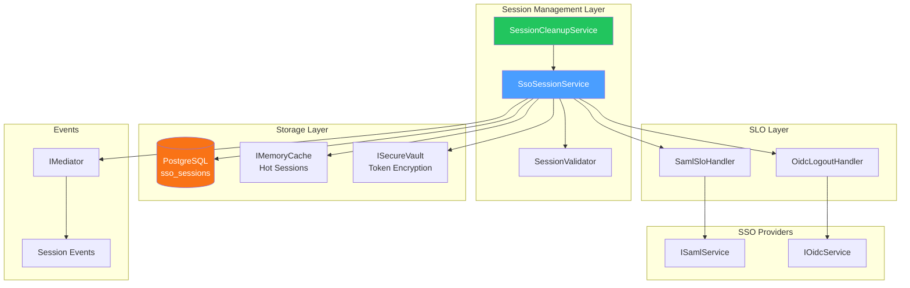
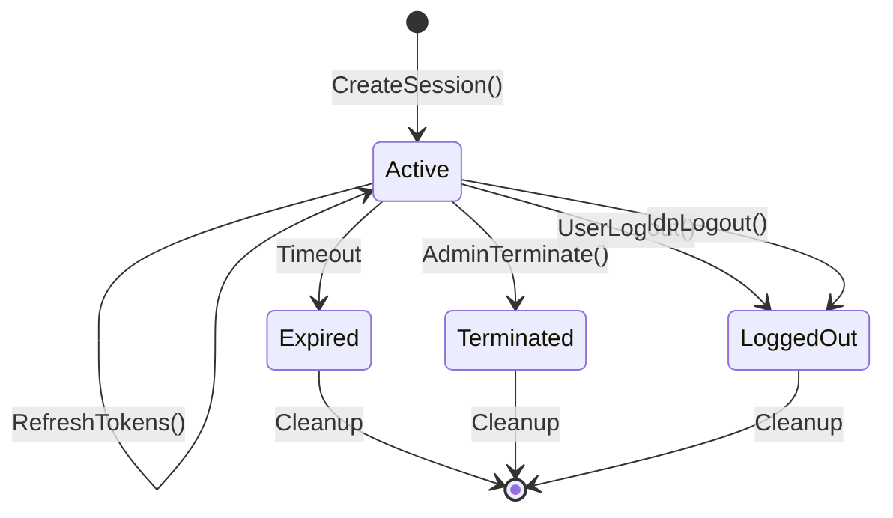
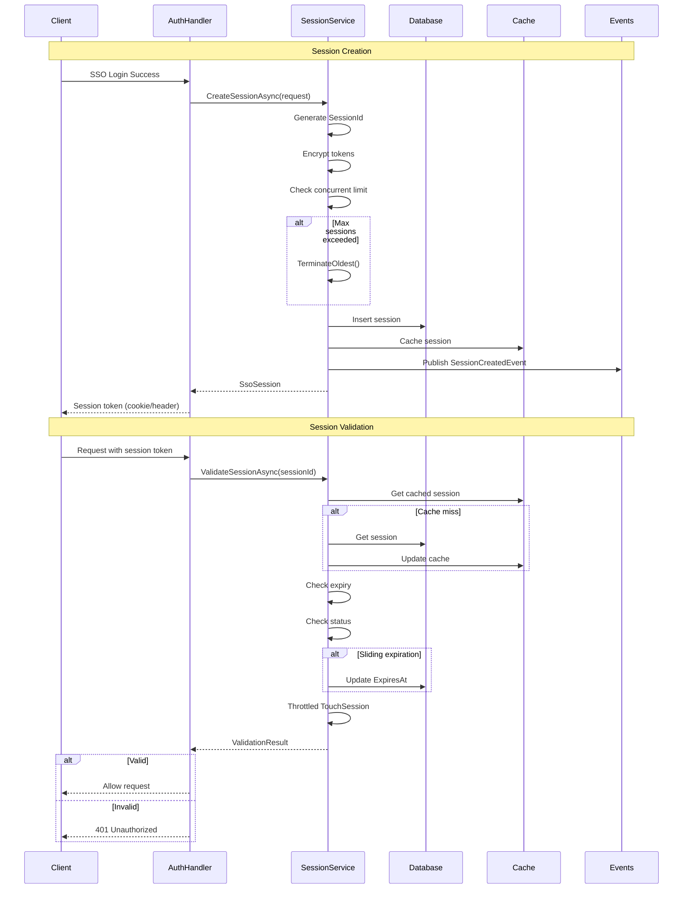
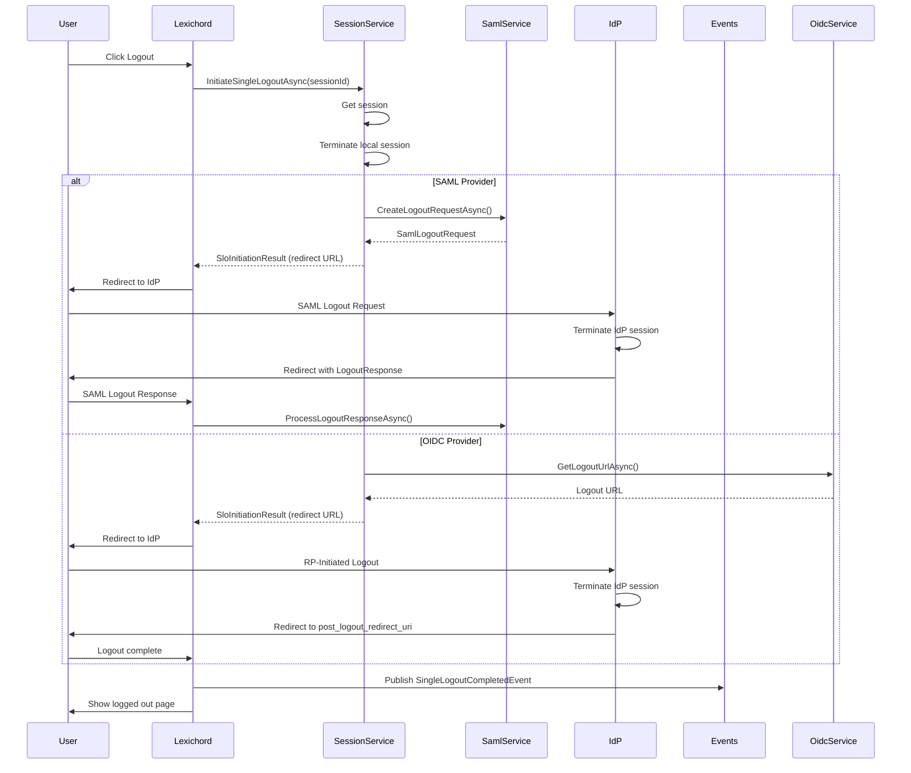
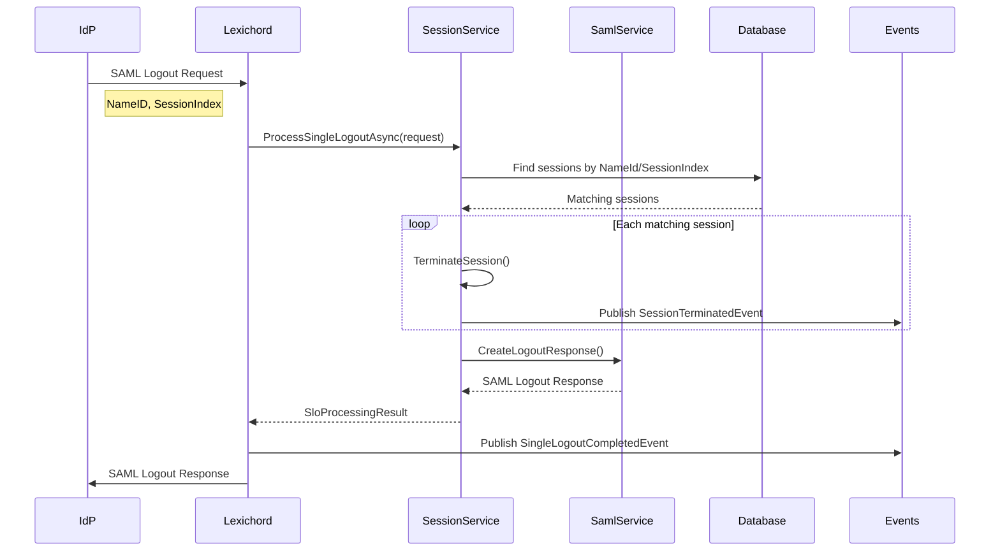

# LCS-DES-096d: Design Specification — SSO Session Management

## 1. Metadata & Categorization

| Field | Value | Description |
| :--- | :--- | :--- |
| **Feature ID** | `COL-096d` | Sub-part of COL-096 |
| **Feature Name** | `SSO Session Management` | Session lifecycle and Single Logout |
| **Target Version** | `v0.9.6d` | Fourth sub-part of v0.9.6 |
| **Module Scope** | `Lexichord.Modules.Collaboration` | Collaboration module |
| **Swimlane** | `Enterprise` | Enterprise features vertical |
| **License Tier** | `Enterprise` | Enterprise tier only |
| **Feature Gate Key** | `Enterprise.SSO.Sessions` | License gate identifier |
| **Author** | Lead Architect | |
| **Status** | `Draft` | |
| **Last Updated** | `2026-01-27` | |
| **Parent Document** | [LCS-DES-096-INDEX](./LCS-DES-096-INDEX.md) | |
| **Scope Breakdown** | [LCS-SBD-096 Section 3.4](./LCS-SBD-096.md#34-v096d-session-management) | |

---

## 2. Executive Summary

### 2.1 The Requirement

Enterprise SSO deployments require comprehensive session management to:

- Track and validate user sessions across the application
- Implement configurable session timeouts (idle and absolute)
- Support Single Logout (SLO) to propagate logout to identity providers
- Enable administrators to monitor and terminate sessions
- Provide audit trails for security compliance
- Handle concurrent session limits per organization policies

Without session management:

- Sessions could persist indefinitely, creating security risks
- Logout from Lexichord would not propagate to the IdP
- Terminated employees could retain active sessions
- No visibility into active sessions for security monitoring
- Compliance requirements for session control cannot be met

> **Goal:** Implement comprehensive SSO session management with configurable timeouts, Single Logout support for SAML and OIDC, administrative controls, and audit logging.

### 2.2 The Proposed Solution

Implement a session management service that:

1. Creates and stores SSO sessions with encrypted tokens
2. Validates sessions on each request with sliding expiration
3. Implements SP-initiated and IdP-initiated Single Logout
4. Provides administrative session monitoring and termination
5. Runs background cleanup for expired sessions
6. Publishes events for audit logging

---

## 3. Architecture & Modular Strategy

### 3.1 Dependencies

#### 3.1.1 Required Interfaces

| Interface | Source Version | Purpose |
| :--- | :--- | :--- |
| `IProfileService` | v0.9.1a | User profile lookup |
| `ISecureVault` | v0.0.6a | Encrypt session tokens |
| `ILicenseContext` | v0.0.4c | Verify Enterprise tier license |
| `IMediator` | v0.0.7a | Publish session events |
| `ISamlService` | v0.9.6a | SAML Single Logout |
| `IOidcService` | v0.9.6b | OIDC logout |

#### 3.1.2 NuGet Packages

| Package | Version | Purpose |
| :--- | :--- | :--- |
| `Microsoft.EntityFrameworkCore` | 8.x | Session storage |
| `Microsoft.Extensions.Hosting` | 8.x | Background cleanup service |

### 3.2 Component Architecture



### 3.3 Session Lifecycle



### 3.4 Licensing Behavior

```csharp
public class SsoSessionService : ISsoSessionService
{
    private readonly ILicenseContext _license;

    private void EnsureEnterpriseLicense()
    {
        if (_license.CurrentTier < LicenseTier.Enterprise)
        {
            throw new LicenseRequiredException(
                "SSO session management requires an Enterprise license",
                LicenseTier.Enterprise);
        }
    }

    public async Task<SsoSession> CreateSessionAsync(
        CreateSessionRequest request,
        CancellationToken ct = default)
    {
        EnsureEnterpriseLicense();
        // ... implementation
    }
}
```

---

## 4. Data Contract (The API)

### 4.1 Core Interfaces

```csharp
namespace Lexichord.Abstractions.Contracts.Auth;

/// <summary>
/// Service for SSO session management.
/// Handles session lifecycle, monitoring, and Single Logout.
/// </summary>
public interface ISsoSessionService
{
    #region Session Lifecycle

    /// <summary>
    /// Creates a new SSO session after successful authentication.
    /// </summary>
    /// <param name="request">Session creation request.</param>
    /// <param name="ct">Cancellation token.</param>
    /// <returns>Created session.</returns>
    Task<SsoSession> CreateSessionAsync(
        CreateSessionRequest request,
        CancellationToken ct = default);

    /// <summary>
    /// Retrieves a session by session ID.
    /// </summary>
    /// <param name="sessionId">Session identifier.</param>
    /// <param name="ct">Cancellation token.</param>
    /// <returns>Session or null if not found.</returns>
    Task<SsoSession?> GetSessionAsync(
        string sessionId,
        CancellationToken ct = default);

    /// <summary>
    /// Retrieves a session by provider session index (for SAML SLO).
    /// </summary>
    /// <param name="sessionIndex">SAML session index.</param>
    /// <param name="nameId">SAML NameID.</param>
    /// <param name="ct">Cancellation token.</param>
    /// <returns>Session or null if not found.</returns>
    Task<SsoSession?> GetSessionByIndexAsync(
        string sessionIndex,
        string nameId,
        CancellationToken ct = default);

    /// <summary>
    /// Validates a session and optionally refreshes its activity time.
    /// Returns validation result with session if valid.
    /// </summary>
    /// <param name="sessionId">Session identifier.</param>
    /// <param name="ct">Cancellation token.</param>
    /// <returns>Validation result.</returns>
    Task<SessionValidationResult> ValidateSessionAsync(
        string sessionId,
        CancellationToken ct = default);

    /// <summary>
    /// Updates session last activity timestamp.
    /// Throttled to prevent excessive database writes.
    /// </summary>
    /// <param name="sessionId">Session identifier.</param>
    /// <param name="ct">Cancellation token.</param>
    Task TouchSessionAsync(
        string sessionId,
        CancellationToken ct = default);

    /// <summary>
    /// Refreshes OAuth tokens for an OIDC session.
    /// </summary>
    /// <param name="sessionId">Session identifier.</param>
    /// <param name="ct">Cancellation token.</param>
    /// <returns>Updated session with new tokens.</returns>
    Task<SsoSession> RefreshTokensAsync(
        string sessionId,
        CancellationToken ct = default);

    /// <summary>
    /// Terminates a session (local logout).
    /// </summary>
    /// <param name="sessionId">Session identifier.</param>
    /// <param name="reason">Termination reason.</param>
    /// <param name="ct">Cancellation token.</param>
    Task TerminateSessionAsync(
        string sessionId,
        SessionTerminationReason reason,
        CancellationToken ct = default);

    /// <summary>
    /// Terminates all sessions for a user.
    /// </summary>
    /// <param name="userId">User identifier.</param>
    /// <param name="reason">Termination reason.</param>
    /// <param name="ct">Cancellation token.</param>
    /// <returns>Number of sessions terminated.</returns>
    Task<int> TerminateAllUserSessionsAsync(
        Guid userId,
        SessionTerminationReason reason,
        CancellationToken ct = default);

    /// <summary>
    /// Terminates all sessions except the specified one.
    /// </summary>
    /// <param name="userId">User identifier.</param>
    /// <param name="exceptSessionId">Session to keep active.</param>
    /// <param name="reason">Termination reason.</param>
    /// <param name="ct">Cancellation token.</param>
    /// <returns>Number of sessions terminated.</returns>
    Task<int> TerminateOtherSessionsAsync(
        Guid userId,
        string exceptSessionId,
        SessionTerminationReason reason,
        CancellationToken ct = default);

    #endregion

    #region Single Logout (SLO)

    /// <summary>
    /// Initiates Single Logout (SP-initiated SLO).
    /// Terminates local session and redirects to IdP for logout.
    /// </summary>
    /// <param name="sessionId">Session identifier.</param>
    /// <param name="postLogoutRedirectUri">Where to redirect after logout.</param>
    /// <param name="ct">Cancellation token.</param>
    /// <returns>SLO initiation result with redirect URL.</returns>
    Task<SloInitiationResult> InitiateSingleLogoutAsync(
        string sessionId,
        string? postLogoutRedirectUri = null,
        CancellationToken ct = default);

    /// <summary>
    /// Processes Single Logout request from IdP (IdP-initiated SLO).
    /// Terminates matching sessions and returns response.
    /// </summary>
    /// <param name="request">SLO request from IdP.</param>
    /// <param name="ct">Cancellation token.</param>
    /// <returns>SLO processing result.</returns>
    Task<SloProcessingResult> ProcessSingleLogoutAsync(
        SloRequest request,
        CancellationToken ct = default);

    #endregion

    #region Session Monitoring

    /// <summary>
    /// Lists active sessions for a user.
    /// </summary>
    /// <param name="userId">User identifier.</param>
    /// <param name="ct">Cancellation token.</param>
    /// <returns>List of active sessions.</returns>
    Task<IReadOnlyList<SsoSession>> ListUserSessionsAsync(
        Guid userId,
        CancellationToken ct = default);

    /// <summary>
    /// Lists all active sessions (admin only).
    /// </summary>
    /// <param name="request">List request with filters and pagination.</param>
    /// <param name="ct">Cancellation token.</param>
    /// <returns>Paginated list of sessions.</returns>
    Task<PagedResult<SsoSession>> ListAllSessionsAsync(
        SessionListRequest request,
        CancellationToken ct = default);

    /// <summary>
    /// Gets session statistics.
    /// </summary>
    /// <param name="ct">Cancellation token.</param>
    /// <returns>Session statistics.</returns>
    Task<SessionStatistics> GetSessionStatisticsAsync(
        CancellationToken ct = default);

    /// <summary>
    /// Gets active session count for a user.
    /// </summary>
    /// <param name="userId">User identifier.</param>
    /// <param name="ct">Cancellation token.</param>
    /// <returns>Number of active sessions.</returns>
    Task<int> GetActiveSessionCountAsync(
        Guid userId,
        CancellationToken ct = default);

    #endregion

    #region Session Cleanup

    /// <summary>
    /// Cleans up expired sessions (called by background service).
    /// </summary>
    /// <param name="ct">Cancellation token.</param>
    /// <returns>Number of sessions cleaned up.</returns>
    Task<int> CleanupExpiredSessionsAsync(
        CancellationToken ct = default);

    /// <summary>
    /// Archives old terminated sessions for audit retention.
    /// </summary>
    /// <param name="olderThan">Archive sessions terminated before this date.</param>
    /// <param name="ct">Cancellation token.</param>
    /// <returns>Number of sessions archived.</returns>
    Task<int> ArchiveOldSessionsAsync(
        DateTime olderThan,
        CancellationToken ct = default);

    #endregion
}
```

### 4.2 Request/Response Records

```csharp
namespace Lexichord.Abstractions.Contracts.Auth;

/// <summary>
/// Request to create a new SSO session.
/// </summary>
public record CreateSessionRequest(
    /// <summary>User identifier.</summary>
    Guid UserId,
    /// <summary>SSO provider type.</summary>
    SsoProvider Provider,
    /// <summary>SAML session index (for SLO).</summary>
    string? SessionIndex,
    /// <summary>SAML NameID (for SLO).</summary>
    string? NameId,
    /// <summary>OAuth access token (encrypted).</summary>
    string? AccessToken,
    /// <summary>OAuth refresh token (encrypted).</summary>
    string? RefreshToken,
    /// <summary>Token expiry time.</summary>
    DateTime? TokenExpiry,
    /// <summary>Client IP address.</summary>
    string? IpAddress,
    /// <summary>Client user agent.</summary>
    string? UserAgent,
    /// <summary>Additional metadata.</summary>
    IReadOnlyDictionary<string, string>? Metadata
);

/// <summary>
/// SSO session information.
/// </summary>
public record SsoSession(
    /// <summary>Unique session identifier.</summary>
    string SessionId,
    /// <summary>User identifier.</summary>
    Guid UserId,
    /// <summary>SSO provider type.</summary>
    SsoProvider Provider,
    /// <summary>SAML session index.</summary>
    string? SessionIndex,
    /// <summary>SAML NameID.</summary>
    string? NameId,
    /// <summary>When session was created.</summary>
    DateTime CreatedAt,
    /// <summary>Last activity timestamp.</summary>
    DateTime LastActivityAt,
    /// <summary>When session expires.</summary>
    DateTime ExpiresAt,
    /// <summary>Session status.</summary>
    SessionStatus Status,
    /// <summary>Client IP address.</summary>
    string? IpAddress,
    /// <summary>Client user agent.</summary>
    string? UserAgent,
    /// <summary>Device information (parsed from UA).</summary>
    string? DeviceInfo,
    /// <summary>Additional metadata.</summary>
    IReadOnlyDictionary<string, string>? Metadata
)
{
    /// <summary>
    /// Whether the session is currently active.
    /// </summary>
    public bool IsActive => Status == SessionStatus.Active && ExpiresAt > DateTime.UtcNow;

    /// <summary>
    /// Time remaining until session expires.
    /// </summary>
    public TimeSpan? TimeRemaining => IsActive ? ExpiresAt - DateTime.UtcNow : null;
}

/// <summary>
/// SSO provider type.
/// </summary>
public enum SsoProvider
{
    /// <summary>SAML 2.0 authentication.</summary>
    Saml,
    /// <summary>OpenID Connect authentication.</summary>
    Oidc,
    /// <summary>Local authentication (non-SSO).</summary>
    Local
}

/// <summary>
/// Session status.
/// </summary>
public enum SessionStatus
{
    /// <summary>Session is active and valid.</summary>
    Active,
    /// <summary>Session expired due to timeout.</summary>
    Expired,
    /// <summary>Session was terminated by admin or system.</summary>
    Terminated,
    /// <summary>User logged out.</summary>
    LoggedOut
}

/// <summary>
/// Result of session validation.
/// </summary>
public record SessionValidationResult(
    /// <summary>Whether session is valid.</summary>
    bool IsValid,
    /// <summary>Session if valid, null otherwise.</summary>
    SsoSession? Session,
    /// <summary>Reason for invalidity.</summary>
    SessionInvalidReason? InvalidReason
);

/// <summary>
/// Reason for session invalidity.
/// </summary>
public enum SessionInvalidReason
{
    /// <summary>Session not found.</summary>
    NotFound,
    /// <summary>Session expired (idle or absolute timeout).</summary>
    Expired,
    /// <summary>Session was terminated.</summary>
    Terminated,
    /// <summary>User account is deactivated.</summary>
    UserDeactivated,
    /// <summary>OAuth token expired and refresh failed.</summary>
    TokenExpired,
    /// <summary>Enterprise license expired.</summary>
    LicenseExpired
}

/// <summary>
/// Reason for session termination.
/// </summary>
public enum SessionTerminationReason
{
    /// <summary>User initiated logout.</summary>
    UserLogout,
    /// <summary>Administrator terminated session.</summary>
    AdminTermination,
    /// <summary>IdP initiated logout (SLO).</summary>
    IdpLogout,
    /// <summary>Session timed out (idle or absolute).</summary>
    SessionTimeout,
    /// <summary>Security policy enforcement.</summary>
    SecurityPolicy,
    /// <summary>User was deactivated.</summary>
    UserDeactivated,
    /// <summary>Enterprise license expired.</summary>
    LicenseExpired,
    /// <summary>Concurrent session limit exceeded.</summary>
    ConcurrentSessionLimit
}

/// <summary>
/// Result of Single Logout initiation.
/// </summary>
public record SloInitiationResult(
    /// <summary>Whether SLO was initiated successfully.</summary>
    bool Success,
    /// <summary>URL to redirect to for IdP logout.</summary>
    string? LogoutUrl,
    /// <summary>SAML logout request (for POST binding).</summary>
    string? LogoutRequest,
    /// <summary>Relay state for return URL.</summary>
    string? RelayState,
    /// <summary>Error if SLO failed.</summary>
    SloError? Error
);

/// <summary>
/// Single Logout request from IdP.
/// </summary>
public record SloRequest(
    /// <summary>SSO provider type.</summary>
    SsoProvider Provider,
    /// <summary>SAML session index.</summary>
    string? SessionIndex,
    /// <summary>SAML NameID.</summary>
    string? NameId,
    /// <summary>Raw SLO request (SAML XML or OIDC parameters).</summary>
    string? RawRequest,
    /// <summary>Request ID for response correlation.</summary>
    string? RequestId
);

/// <summary>
/// Result of processing Single Logout request.
/// </summary>
public record SloProcessingResult(
    /// <summary>Whether SLO was processed successfully.</summary>
    bool Success,
    /// <summary>Number of sessions terminated.</summary>
    int SessionsTerminated,
    /// <summary>URL to redirect with response.</summary>
    string? ResponseUrl,
    /// <summary>SLO response (SAML or redirect parameters).</summary>
    string? LogoutResponse,
    /// <summary>Error if processing failed.</summary>
    SloError? Error
);

/// <summary>
/// Single Logout error.
/// </summary>
public record SloError(
    /// <summary>Error code.</summary>
    SloErrorCode Code,
    /// <summary>Error message.</summary>
    string Message
);

/// <summary>
/// Single Logout error codes.
/// </summary>
public enum SloErrorCode
{
    /// <summary>No matching session found.</summary>
    SessionNotFound,
    /// <summary>Invalid SLO request.</summary>
    InvalidRequest,
    /// <summary>IdP returned error.</summary>
    ProviderError,
    /// <summary>Some sessions could not be terminated.</summary>
    PartialLogout,
    /// <summary>SLO not supported for this provider.</summary>
    NotSupported
}

/// <summary>
/// Request for listing sessions.
/// </summary>
public record SessionListRequest(
    /// <summary>Filter by user ID.</summary>
    Guid? UserId = null,
    /// <summary>Filter by provider.</summary>
    SsoProvider? Provider = null,
    /// <summary>Filter by status.</summary>
    SessionStatus? Status = null,
    /// <summary>Filter by created after.</summary>
    DateTime? CreatedAfter = null,
    /// <summary>Filter by created before.</summary>
    DateTime? CreatedBefore = null,
    /// <summary>Filter by IP address.</summary>
    string? IpAddress = null,
    /// <summary>Page number (1-based).</summary>
    int PageNumber = 1,
    /// <summary>Page size.</summary>
    int PageSize = 50,
    /// <summary>Sort by field.</summary>
    string? SortBy = "CreatedAt",
    /// <summary>Sort descending.</summary>
    bool SortDescending = true
);

/// <summary>
/// Session statistics.
/// </summary>
public record SessionStatistics(
    /// <summary>Total active sessions.</summary>
    int TotalActiveSessions,
    /// <summary>Active SAML sessions.</summary>
    int SamlSessions,
    /// <summary>Active OIDC sessions.</summary>
    int OidcSessions,
    /// <summary>Active local sessions.</summary>
    int LocalSessions,
    /// <summary>Sessions created today.</summary>
    int SessionsCreatedToday,
    /// <summary>Sessions terminated today.</summary>
    int SessionsTerminatedToday,
    /// <summary>Sessions by provider.</summary>
    IReadOnlyDictionary<string, int> SessionsByProvider,
    /// <summary>Sessions by hour (last 24 hours).</summary>
    IReadOnlyDictionary<int, int> SessionsByHour,
    /// <summary>Average session duration.</summary>
    TimeSpan AverageSessionDuration,
    /// <summary>Peak concurrent sessions today.</summary>
    int PeakConcurrentSessions
);

/// <summary>
/// Paged result container.
/// </summary>
public record PagedResult<T>(
    /// <summary>Items in this page.</summary>
    IReadOnlyList<T> Items,
    /// <summary>Total count across all pages.</summary>
    int TotalCount,
    /// <summary>Current page number.</summary>
    int PageNumber,
    /// <summary>Page size.</summary>
    int PageSize,
    /// <summary>Total number of pages.</summary>
    int TotalPages
)
{
    /// <summary>Whether there is a next page.</summary>
    public bool HasNextPage => PageNumber < TotalPages;

    /// <summary>Whether there is a previous page.</summary>
    public bool HasPreviousPage => PageNumber > 1;
}
```

### 4.3 Configuration

```csharp
namespace Lexichord.Abstractions.Configuration;

/// <summary>
/// Configuration for SSO session management.
/// </summary>
public record SsoSessionConfiguration
{
    /// <summary>
    /// Session idle timeout.
    /// Session expires after this duration of inactivity.
    /// Default: 30 minutes.
    /// </summary>
    public TimeSpan IdleTimeout { get; init; } = TimeSpan.FromMinutes(30);

    /// <summary>
    /// Absolute session timeout.
    /// Session expires after this duration regardless of activity.
    /// Default: 8 hours.
    /// </summary>
    public TimeSpan AbsoluteTimeout { get; init; } = TimeSpan.FromHours(8);

    /// <summary>
    /// Whether to enable sliding expiration.
    /// If true, each request resets the idle timeout.
    /// </summary>
    public bool SlidingExpiration { get; init; } = true;

    /// <summary>
    /// Maximum concurrent sessions per user.
    /// 0 = unlimited.
    /// Default: 5.
    /// </summary>
    public int MaxConcurrentSessions { get; init; } = 5;

    /// <summary>
    /// Action when max concurrent sessions exceeded.
    /// </summary>
    public MaxSessionsAction MaxSessionsAction { get; init; } =
        MaxSessionsAction.TerminateOldest;

    /// <summary>
    /// Session cleanup interval.
    /// How often the background service cleans up expired sessions.
    /// Default: 15 minutes.
    /// </summary>
    public TimeSpan CleanupInterval { get; init; } = TimeSpan.FromMinutes(15);

    /// <summary>
    /// Whether to track session activity.
    /// </summary>
    public bool TrackActivity { get; init; } = true;

    /// <summary>
    /// Activity tracking throttle.
    /// Minimum time between activity updates to reduce database writes.
    /// Default: 1 minute.
    /// </summary>
    public TimeSpan ActivityThrottle { get; init; } = TimeSpan.FromMinutes(1);

    /// <summary>
    /// Whether to log session events for audit.
    /// </summary>
    public bool AuditLogging { get; init; } = true;

    /// <summary>
    /// Session cache duration.
    /// How long to cache sessions in memory.
    /// Default: 5 minutes.
    /// </summary>
    public TimeSpan CacheDuration { get; init; } = TimeSpan.FromMinutes(5);

    /// <summary>
    /// Whether to enable Single Logout.
    /// </summary>
    public bool EnableSingleLogout { get; init; } = true;

    /// <summary>
    /// Session token length in bytes.
    /// Default: 32 bytes (256 bits).
    /// </summary>
    public int TokenLength { get; init; } = 32;

    /// <summary>
    /// Days to retain terminated sessions for audit.
    /// Default: 90 days.
    /// </summary>
    public int SessionRetentionDays { get; init; } = 90;
}

/// <summary>
/// Action when max concurrent sessions exceeded.
/// </summary>
public enum MaxSessionsAction
{
    /// <summary>Deny new session creation.</summary>
    DenyNew,
    /// <summary>Terminate oldest session.</summary>
    TerminateOldest,
    /// <summary>Terminate all existing sessions.</summary>
    TerminateAll
}
```

### 4.4 MediatR Events

```csharp
namespace Lexichord.Abstractions.Events.Auth;

/// <summary>
/// Published when a new SSO session is created.
/// </summary>
public record SessionCreatedEvent(
    string SessionId,
    Guid UserId,
    SsoProvider Provider,
    string? IpAddress,
    string? UserAgent,
    DateTime CreatedAt
) : INotification;

/// <summary>
/// Published when a session is terminated.
/// </summary>
public record SessionTerminatedEvent(
    string SessionId,
    Guid UserId,
    SsoProvider Provider,
    SessionTerminationReason Reason,
    DateTime TerminatedAt,
    TimeSpan SessionDuration
) : INotification;

/// <summary>
/// Published when Single Logout completes.
/// </summary>
public record SingleLogoutCompletedEvent(
    string SessionId,
    Guid UserId,
    SsoProvider Provider,
    bool SpInitiated,
    int SessionsTerminated,
    DateTime CompletedAt
) : INotification;

/// <summary>
/// Published when session tokens are refreshed.
/// </summary>
public record SessionTokensRefreshedEvent(
    string SessionId,
    Guid UserId,
    DateTime NewExpiry,
    DateTime RefreshedAt
) : INotification;

/// <summary>
/// Published when expired sessions are cleaned up.
/// </summary>
public record SessionsCleanedUpEvent(
    int SessionsExpired,
    int SessionsArchived,
    DateTime CleanedUpAt
) : INotification;
```

---

## 5. Implementation Logic

### 5.1 Session Lifecycle Flow



### 5.2 Single Logout Flow (SP-Initiated)



### 5.3 Single Logout Flow (IdP-Initiated)



### 5.4 Session Cleanup Flow

```text
BACKGROUND CLEANUP SERVICE:
│
├── Run every CleanupInterval (default: 15 min)
│
├── 1. Find Expired Sessions
│   ├── SELECT * FROM sso_sessions
│   │   WHERE status = 'Active'
│   │   AND expires_at < NOW()
│   └── Update status = 'Expired'
│
├── 2. Mark as Terminated
│   ├── Set TerminatedAt = NOW()
│   ├── Set TerminationReason = 'SessionTimeout'
│   └── Publish SessionTerminatedEvent for each
│
├── 3. Archive Old Sessions
│   ├── Move sessions older than RetentionDays
│   ├── To sso_sessions_archive table
│   └── Delete from sso_sessions
│
├── 4. Clear Cache
│   └── Remove expired sessions from cache
│
├── 5. Log Statistics
│   ├── Sessions expired: N
│   ├── Sessions archived: N
│   └── Cleanup duration: Xms
│
└── Publish SessionsCleanedUpEvent
```

---

## 6. Implementation Details

### 6.1 SsoSessionService Implementation

```csharp
namespace Lexichord.Modules.Collaboration.Auth;

/// <summary>
/// SSO session management service implementation.
/// </summary>
public class SsoSessionService : ISsoSessionService
{
    private readonly SsoSessionConfiguration _config;
    private readonly ISecureVault _vault;
    private readonly IProfileService _profileService;
    private readonly ISamlService _samlService;
    private readonly IOidcService _oidcService;
    private readonly ILicenseContext _license;
    private readonly IMediator _mediator;
    private readonly SsoDbContext _dbContext;
    private readonly IMemoryCache _cache;
    private readonly ILogger<SsoSessionService> _logger;

    private static readonly SemaphoreSlim _activityLock = new(1, 1);
    private static readonly Dictionary<string, DateTime> _activityThrottle = new();

    public SsoSessionService(
        IOptions<SsoSessionConfiguration> config,
        ISecureVault vault,
        IProfileService profileService,
        ISamlService samlService,
        IOidcService oidcService,
        ILicenseContext license,
        IMediator mediator,
        SsoDbContext dbContext,
        IMemoryCache cache,
        ILogger<SsoSessionService> logger)
    {
        _config = config.Value;
        _vault = vault;
        _profileService = profileService;
        _samlService = samlService;
        _oidcService = oidcService;
        _license = license;
        _mediator = mediator;
        _dbContext = dbContext;
        _cache = cache;
        _logger = logger;
    }

    #region Session Lifecycle

    public async Task<SsoSession> CreateSessionAsync(
        CreateSessionRequest request,
        CancellationToken ct = default)
    {
        EnsureEnterpriseLicense();

        _logger.LogInformation(
            "Creating SSO session for user {UserId}, provider {Provider}",
            request.UserId, request.Provider);

        // Check concurrent session limit
        if (_config.MaxConcurrentSessions > 0)
        {
            var activeCount = await GetActiveSessionCountAsync(request.UserId, ct);
            if (activeCount >= _config.MaxConcurrentSessions)
            {
                await HandleMaxSessionsExceeded(request.UserId, ct);
            }
        }

        // Generate session ID
        var sessionId = GenerateSessionId();
        var now = DateTime.UtcNow;
        var expiresAt = CalculateExpiry(now);

        // Encrypt tokens if present
        string? encryptedAccessToken = null;
        string? encryptedRefreshToken = null;

        if (!string.IsNullOrEmpty(request.AccessToken))
        {
            encryptedAccessToken = await _vault.EncryptAsync(
                request.AccessToken, ct);
        }
        if (!string.IsNullOrEmpty(request.RefreshToken))
        {
            encryptedRefreshToken = await _vault.EncryptAsync(
                request.RefreshToken, ct);
        }

        // Parse device info from user agent
        var deviceInfo = ParseDeviceInfo(request.UserAgent);

        // Create session entity
        var entity = new SsoSessionEntity
        {
            SessionId = sessionId,
            UserId = request.UserId,
            Provider = request.Provider,
            SessionIndex = request.SessionIndex,
            NameId = request.NameId,
            AccessToken = encryptedAccessToken,
            RefreshToken = encryptedRefreshToken,
            TokenExpiry = request.TokenExpiry,
            CreatedAt = now,
            LastActivityAt = now,
            ExpiresAt = expiresAt,
            Status = SessionStatus.Active,
            IpAddress = request.IpAddress,
            UserAgent = request.UserAgent,
            DeviceInfo = deviceInfo,
            MetadataJson = request.Metadata != null
                ? JsonSerializer.Serialize(request.Metadata)
                : null
        };

        _dbContext.SsoSessions.Add(entity);
        await _dbContext.SaveChangesAsync(ct);

        var session = MapEntityToSession(entity);

        // Cache the session
        CacheSession(session);

        // Publish event
        await _mediator.Publish(new SessionCreatedEvent(
            sessionId,
            request.UserId,
            request.Provider,
            request.IpAddress,
            request.UserAgent,
            now
        ), ct);

        _logger.LogInformation(
            "Created session {SessionId} for user {UserId}, expires {ExpiresAt}",
            sessionId, request.UserId, expiresAt);

        return session;
    }

    public async Task<SsoSession?> GetSessionAsync(
        string sessionId,
        CancellationToken ct = default)
    {
        // Try cache first
        if (_cache.TryGetValue(GetCacheKey(sessionId), out SsoSession? cached))
        {
            return cached;
        }

        var entity = await _dbContext.SsoSessions
            .FirstOrDefaultAsync(s => s.SessionId == sessionId, ct);

        if (entity == null)
            return null;

        var session = MapEntityToSession(entity);
        CacheSession(session);

        return session;
    }

    public async Task<SsoSession?> GetSessionByIndexAsync(
        string sessionIndex,
        string nameId,
        CancellationToken ct = default)
    {
        var entity = await _dbContext.SsoSessions
            .FirstOrDefaultAsync(s =>
                s.SessionIndex == sessionIndex &&
                s.NameId == nameId &&
                s.Status == SessionStatus.Active, ct);

        return entity != null ? MapEntityToSession(entity) : null;
    }

    public async Task<SessionValidationResult> ValidateSessionAsync(
        string sessionId,
        CancellationToken ct = default)
    {
        var session = await GetSessionAsync(sessionId, ct);

        if (session == null)
        {
            _logger.LogDebug("Session {SessionId} not found", sessionId);
            return new SessionValidationResult(
                false, null, SessionInvalidReason.NotFound);
        }

        // Check status
        if (session.Status != SessionStatus.Active)
        {
            _logger.LogDebug(
                "Session {SessionId} is not active: {Status}",
                sessionId, session.Status);
            return new SessionValidationResult(
                false, null, session.Status switch
                {
                    SessionStatus.Expired => SessionInvalidReason.Expired,
                    SessionStatus.Terminated => SessionInvalidReason.Terminated,
                    SessionStatus.LoggedOut => SessionInvalidReason.Terminated,
                    _ => SessionInvalidReason.Terminated
                });
        }

        // Check expiry
        if (session.ExpiresAt <= DateTime.UtcNow)
        {
            _logger.LogDebug(
                "Session {SessionId} expired at {ExpiresAt}",
                sessionId, session.ExpiresAt);
            await TerminateSessionAsync(
                sessionId, SessionTerminationReason.SessionTimeout, ct);
            return new SessionValidationResult(
                false, null, SessionInvalidReason.Expired);
        }

        // Check user is still active
        var profile = await _profileService.GetProfileAsync(session.UserId, ct);
        if (profile == null || !profile.IsActive)
        {
            _logger.LogWarning(
                "Session {SessionId} user {UserId} is deactivated",
                sessionId, session.UserId);
            await TerminateSessionAsync(
                sessionId, SessionTerminationReason.UserDeactivated, ct);
            return new SessionValidationResult(
                false, null, SessionInvalidReason.UserDeactivated);
        }

        // Sliding expiration
        if (_config.SlidingExpiration)
        {
            await ExtendSessionExpiryAsync(sessionId, ct);
        }

        // Touch session (throttled)
        await TouchSessionAsync(sessionId, ct);

        return new SessionValidationResult(true, session, null);
    }

    public async Task TouchSessionAsync(
        string sessionId,
        CancellationToken ct = default)
    {
        if (!_config.TrackActivity)
            return;

        // Throttle activity updates
        await _activityLock.WaitAsync(ct);
        try
        {
            if (_activityThrottle.TryGetValue(sessionId, out var lastUpdate))
            {
                if (DateTime.UtcNow - lastUpdate < _config.ActivityThrottle)
                    return;
            }

            _activityThrottle[sessionId] = DateTime.UtcNow;
        }
        finally
        {
            _activityLock.Release();
        }

        // Update database
        var entity = await _dbContext.SsoSessions
            .FirstOrDefaultAsync(s => s.SessionId == sessionId, ct);

        if (entity != null)
        {
            entity.LastActivityAt = DateTime.UtcNow;
            await _dbContext.SaveChangesAsync(ct);

            // Update cache
            InvalidateCache(sessionId);
        }
    }

    public async Task<SsoSession> RefreshTokensAsync(
        string sessionId,
        CancellationToken ct = default)
    {
        EnsureEnterpriseLicense();

        var entity = await _dbContext.SsoSessions
            .FirstOrDefaultAsync(s => s.SessionId == sessionId, ct);

        if (entity == null)
            throw new SessionNotFoundException(sessionId);

        if (entity.Provider != SsoProvider.Oidc)
            throw new InvalidOperationException(
                "Token refresh is only supported for OIDC sessions");

        if (string.IsNullOrEmpty(entity.RefreshToken))
            throw new InvalidOperationException(
                "Session does not have a refresh token");

        // Decrypt refresh token
        var refreshToken = await _vault.DecryptAsync(entity.RefreshToken, ct);

        // Refresh tokens via OIDC service
        var result = await _oidcService.RefreshTokensAsync(refreshToken, ct);

        if (!result.IsSuccess)
        {
            _logger.LogWarning(
                "Token refresh failed for session {SessionId}: {Error}",
                sessionId, result.Error?.Message);
            await TerminateSessionAsync(
                sessionId, SessionTerminationReason.SessionTimeout, ct);
            throw new TokenRefreshException(result.Error?.Message ?? "Refresh failed");
        }

        // Update tokens
        entity.AccessToken = await _vault.EncryptAsync(result.AccessToken!, ct);
        if (!string.IsNullOrEmpty(result.RefreshToken))
        {
            entity.RefreshToken = await _vault.EncryptAsync(result.RefreshToken, ct);
        }
        entity.TokenExpiry = DateTime.UtcNow.AddSeconds(result.ExpiresIn);
        entity.LastActivityAt = DateTime.UtcNow;

        await _dbContext.SaveChangesAsync(ct);

        // Invalidate cache
        InvalidateCache(sessionId);

        await _mediator.Publish(new SessionTokensRefreshedEvent(
            sessionId,
            entity.UserId,
            entity.TokenExpiry.Value,
            DateTime.UtcNow
        ), ct);

        return MapEntityToSession(entity);
    }

    public async Task TerminateSessionAsync(
        string sessionId,
        SessionTerminationReason reason,
        CancellationToken ct = default)
    {
        var entity = await _dbContext.SsoSessions
            .FirstOrDefaultAsync(s => s.SessionId == sessionId, ct);

        if (entity == null)
            return;

        var duration = DateTime.UtcNow - entity.CreatedAt;

        entity.Status = reason == SessionTerminationReason.UserLogout
            ? SessionStatus.LoggedOut
            : SessionStatus.Terminated;
        entity.TerminationReason = reason;
        entity.TerminatedAt = DateTime.UtcNow;

        await _dbContext.SaveChangesAsync(ct);

        // Clear cache
        InvalidateCache(sessionId);

        // Clear activity throttle
        await _activityLock.WaitAsync(ct);
        try
        {
            _activityThrottle.Remove(sessionId);
        }
        finally
        {
            _activityLock.Release();
        }

        await _mediator.Publish(new SessionTerminatedEvent(
            sessionId,
            entity.UserId,
            entity.Provider,
            reason,
            DateTime.UtcNow,
            duration
        ), ct);

        _logger.LogInformation(
            "Terminated session {SessionId} for user {UserId}, reason: {Reason}",
            sessionId, entity.UserId, reason);
    }

    public async Task<int> TerminateAllUserSessionsAsync(
        Guid userId,
        SessionTerminationReason reason,
        CancellationToken ct = default)
    {
        var sessions = await _dbContext.SsoSessions
            .Where(s => s.UserId == userId && s.Status == SessionStatus.Active)
            .ToListAsync(ct);

        foreach (var session in sessions)
        {
            await TerminateSessionAsync(session.SessionId, reason, ct);
        }

        _logger.LogInformation(
            "Terminated {Count} sessions for user {UserId}",
            sessions.Count, userId);

        return sessions.Count;
    }

    public async Task<int> TerminateOtherSessionsAsync(
        Guid userId,
        string exceptSessionId,
        SessionTerminationReason reason,
        CancellationToken ct = default)
    {
        var sessions = await _dbContext.SsoSessions
            .Where(s =>
                s.UserId == userId &&
                s.SessionId != exceptSessionId &&
                s.Status == SessionStatus.Active)
            .ToListAsync(ct);

        foreach (var session in sessions)
        {
            await TerminateSessionAsync(session.SessionId, reason, ct);
        }

        return sessions.Count;
    }

    #endregion

    #region Single Logout

    public async Task<SloInitiationResult> InitiateSingleLogoutAsync(
        string sessionId,
        string? postLogoutRedirectUri = null,
        CancellationToken ct = default)
    {
        EnsureEnterpriseLicense();

        if (!_config.EnableSingleLogout)
        {
            // Just terminate locally
            await TerminateSessionAsync(
                sessionId, SessionTerminationReason.UserLogout, ct);
            return new SloInitiationResult(
                true, postLogoutRedirectUri, null, null, null);
        }

        var session = await GetSessionAsync(sessionId, ct);
        if (session == null)
        {
            return new SloInitiationResult(
                false, null, null, null,
                new SloError(SloErrorCode.SessionNotFound, "Session not found"));
        }

        _logger.LogInformation(
            "Initiating SLO for session {SessionId}, provider {Provider}",
            sessionId, session.Provider);

        // Terminate local session first
        await TerminateSessionAsync(
            sessionId, SessionTerminationReason.UserLogout, ct);

        try
        {
            return session.Provider switch
            {
                SsoProvider.Saml => await InitiateSamlSloAsync(
                    session, postLogoutRedirectUri, ct),
                SsoProvider.Oidc => await InitiateOidcLogoutAsync(
                    session, postLogoutRedirectUri, ct),
                _ => new SloInitiationResult(
                    true, postLogoutRedirectUri, null, null, null)
            };
        }
        catch (Exception ex)
        {
            _logger.LogError(ex, "SLO initiation failed for session {SessionId}", sessionId);
            return new SloInitiationResult(
                false, null, null, null,
                new SloError(SloErrorCode.ProviderError, ex.Message));
        }
    }

    public async Task<SloProcessingResult> ProcessSingleLogoutAsync(
        SloRequest request,
        CancellationToken ct = default)
    {
        EnsureEnterpriseLicense();

        _logger.LogInformation(
            "Processing IdP-initiated SLO: Provider={Provider}, SessionIndex={SessionIndex}",
            request.Provider, request.SessionIndex);

        try
        {
            return request.Provider switch
            {
                SsoProvider.Saml => await ProcessSamlSloAsync(request, ct),
                SsoProvider.Oidc => await ProcessOidcLogoutAsync(request, ct),
                _ => new SloProcessingResult(
                    false, 0, null, null,
                    new SloError(SloErrorCode.NotSupported, "Provider not supported"))
            };
        }
        catch (Exception ex)
        {
            _logger.LogError(ex, "SLO processing failed");
            return new SloProcessingResult(
                false, 0, null, null,
                new SloError(SloErrorCode.ProviderError, ex.Message));
        }
    }

    private async Task<SloInitiationResult> InitiateSamlSloAsync(
        SsoSession session,
        string? postLogoutRedirectUri,
        CancellationToken ct)
    {
        if (string.IsNullOrEmpty(session.SessionIndex) ||
            string.IsNullOrEmpty(session.NameId))
        {
            return new SloInitiationResult(
                true, postLogoutRedirectUri, null, null, null);
        }

        var logoutRequest = await _samlService.CreateLogoutRequestAsync(
            session.SessionIndex, session.NameId, ct);

        await _mediator.Publish(new SingleLogoutCompletedEvent(
            session.SessionId,
            session.UserId,
            session.Provider,
            true, // SP-initiated
            1,
            DateTime.UtcNow
        ), ct);

        return new SloInitiationResult(
            true,
            logoutRequest.IdpUrl,
            logoutRequest.SamlRequest,
            logoutRequest.RelayState,
            null);
    }

    private async Task<SloInitiationResult> InitiateOidcLogoutAsync(
        SsoSession session,
        string? postLogoutRedirectUri,
        CancellationToken ct)
    {
        // Get ID token hint if available
        string? idTokenHint = null;
        // Note: Would need to store ID token in session

        var logoutUrl = await _oidcService.GetLogoutUrlAsync(
            idTokenHint,
            postLogoutRedirectUri,
            null,
            ct);

        await _mediator.Publish(new SingleLogoutCompletedEvent(
            session.SessionId,
            session.UserId,
            session.Provider,
            true, // SP-initiated
            1,
            DateTime.UtcNow
        ), ct);

        return new SloInitiationResult(true, logoutUrl, null, null, null);
    }

    private async Task<SloProcessingResult> ProcessSamlSloAsync(
        SloRequest request,
        CancellationToken ct)
    {
        // Find matching sessions
        var sessions = await _dbContext.SsoSessions
            .Where(s =>
                s.Provider == SsoProvider.Saml &&
                s.Status == SessionStatus.Active &&
                (s.SessionIndex == request.SessionIndex ||
                 s.NameId == request.NameId))
            .ToListAsync(ct);

        if (sessions.Count == 0)
        {
            _logger.LogWarning(
                "No matching sessions for SAML SLO: SessionIndex={SessionIndex}, NameId={NameId}",
                request.SessionIndex, request.NameId);
        }

        // Terminate matching sessions
        foreach (var session in sessions)
        {
            await TerminateSessionAsync(
                session.SessionId,
                SessionTerminationReason.IdpLogout,
                ct);
        }

        // Process logout request and create response
        var result = await _samlService.ProcessLogoutRequestAsync(
            request.RawRequest!, ct);

        if (sessions.Any())
        {
            await _mediator.Publish(new SingleLogoutCompletedEvent(
                sessions.First().SessionId,
                sessions.First().UserId,
                SsoProvider.Saml,
                false, // IdP-initiated
                sessions.Count,
                DateTime.UtcNow
            ), ct);
        }

        return new SloProcessingResult(
            result.IsSuccess,
            sessions.Count,
            result.RedirectUrl,
            result.LogoutResponse,
            result.Error != null
                ? new SloError(SloErrorCode.ProviderError, result.Error.Message)
                : null);
    }

    private async Task<SloProcessingResult> ProcessOidcLogoutAsync(
        SloRequest request,
        CancellationToken ct)
    {
        // OIDC back-channel logout not typically used
        // Front-channel logout handled by redirect
        return new SloProcessingResult(true, 0, null, null, null);
    }

    #endregion

    #region Session Monitoring

    public async Task<IReadOnlyList<SsoSession>> ListUserSessionsAsync(
        Guid userId,
        CancellationToken ct = default)
    {
        var entities = await _dbContext.SsoSessions
            .Where(s => s.UserId == userId && s.Status == SessionStatus.Active)
            .OrderByDescending(s => s.LastActivityAt)
            .ToListAsync(ct);

        return entities.Select(MapEntityToSession).ToList();
    }

    public async Task<PagedResult<SsoSession>> ListAllSessionsAsync(
        SessionListRequest request,
        CancellationToken ct = default)
    {
        EnsureEnterpriseLicense();

        var query = _dbContext.SsoSessions.AsQueryable();

        // Apply filters
        if (request.UserId.HasValue)
            query = query.Where(s => s.UserId == request.UserId.Value);

        if (request.Provider.HasValue)
            query = query.Where(s => s.Provider == request.Provider.Value);

        if (request.Status.HasValue)
            query = query.Where(s => s.Status == request.Status.Value);
        else
            query = query.Where(s => s.Status == SessionStatus.Active);

        if (request.CreatedAfter.HasValue)
            query = query.Where(s => s.CreatedAt >= request.CreatedAfter.Value);

        if (request.CreatedBefore.HasValue)
            query = query.Where(s => s.CreatedAt <= request.CreatedBefore.Value);

        if (!string.IsNullOrEmpty(request.IpAddress))
            query = query.Where(s => s.IpAddress == request.IpAddress);

        // Get total count
        var totalCount = await query.CountAsync(ct);

        // Apply sorting
        query = request.SortBy?.ToLowerInvariant() switch
        {
            "createdat" => request.SortDescending
                ? query.OrderByDescending(s => s.CreatedAt)
                : query.OrderBy(s => s.CreatedAt),
            "lastactivityat" => request.SortDescending
                ? query.OrderByDescending(s => s.LastActivityAt)
                : query.OrderBy(s => s.LastActivityAt),
            "expiresat" => request.SortDescending
                ? query.OrderByDescending(s => s.ExpiresAt)
                : query.OrderBy(s => s.ExpiresAt),
            _ => request.SortDescending
                ? query.OrderByDescending(s => s.CreatedAt)
                : query.OrderBy(s => s.CreatedAt)
        };

        // Apply pagination
        var entities = await query
            .Skip((request.PageNumber - 1) * request.PageSize)
            .Take(request.PageSize)
            .ToListAsync(ct);

        var sessions = entities.Select(MapEntityToSession).ToList();
        var totalPages = (int)Math.Ceiling((double)totalCount / request.PageSize);

        return new PagedResult<SsoSession>(
            sessions,
            totalCount,
            request.PageNumber,
            request.PageSize,
            totalPages);
    }

    public async Task<SessionStatistics> GetSessionStatisticsAsync(
        CancellationToken ct = default)
    {
        EnsureEnterpriseLicense();

        var today = DateTime.UtcNow.Date;
        var yesterday = today.AddDays(-1);

        var activeSessions = await _dbContext.SsoSessions
            .Where(s => s.Status == SessionStatus.Active)
            .GroupBy(s => s.Provider)
            .Select(g => new { Provider = g.Key, Count = g.Count() })
            .ToListAsync(ct);

        var createdToday = await _dbContext.SsoSessions
            .CountAsync(s => s.CreatedAt >= today, ct);

        var terminatedToday = await _dbContext.SsoSessions
            .CountAsync(s =>
                s.TerminatedAt != null &&
                s.TerminatedAt >= today, ct);

        var sessionsByHour = await _dbContext.SsoSessions
            .Where(s => s.CreatedAt >= yesterday)
            .GroupBy(s => s.CreatedAt.Hour)
            .Select(g => new { Hour = g.Key, Count = g.Count() })
            .ToDictionaryAsync(g => g.Hour, g => g.Count, ct);

        var avgDuration = await _dbContext.SsoSessions
            .Where(s => s.TerminatedAt != null && s.TerminatedAt >= yesterday)
            .AverageAsync(s =>
                EF.Functions.DateDiffSecond(s.CreatedAt, s.TerminatedAt!.Value), ct);

        return new SessionStatistics(
            TotalActiveSessions: activeSessions.Sum(s => s.Count),
            SamlSessions: activeSessions
                .FirstOrDefault(s => s.Provider == SsoProvider.Saml)?.Count ?? 0,
            OidcSessions: activeSessions
                .FirstOrDefault(s => s.Provider == SsoProvider.Oidc)?.Count ?? 0,
            LocalSessions: activeSessions
                .FirstOrDefault(s => s.Provider == SsoProvider.Local)?.Count ?? 0,
            SessionsCreatedToday: createdToday,
            SessionsTerminatedToday: terminatedToday,
            SessionsByProvider: activeSessions
                .ToDictionary(s => s.Provider.ToString(), s => s.Count),
            SessionsByHour: sessionsByHour,
            AverageSessionDuration: TimeSpan.FromSeconds(avgDuration ?? 0),
            PeakConcurrentSessions: createdToday // Simplified
        );
    }

    public async Task<int> GetActiveSessionCountAsync(
        Guid userId,
        CancellationToken ct = default)
    {
        return await _dbContext.SsoSessions
            .CountAsync(s =>
                s.UserId == userId &&
                s.Status == SessionStatus.Active, ct);
    }

    #endregion

    #region Session Cleanup

    public async Task<int> CleanupExpiredSessionsAsync(
        CancellationToken ct = default)
    {
        var now = DateTime.UtcNow;

        var expiredSessions = await _dbContext.SsoSessions
            .Where(s =>
                s.Status == SessionStatus.Active &&
                s.ExpiresAt < now)
            .ToListAsync(ct);

        foreach (var session in expiredSessions)
        {
            session.Status = SessionStatus.Expired;
            session.TerminationReason = SessionTerminationReason.SessionTimeout;
            session.TerminatedAt = now;

            InvalidateCache(session.SessionId);

            await _mediator.Publish(new SessionTerminatedEvent(
                session.SessionId,
                session.UserId,
                session.Provider,
                SessionTerminationReason.SessionTimeout,
                now,
                now - session.CreatedAt
            ), ct);
        }

        await _dbContext.SaveChangesAsync(ct);

        _logger.LogInformation(
            "Cleaned up {Count} expired sessions",
            expiredSessions.Count);

        return expiredSessions.Count;
    }

    public async Task<int> ArchiveOldSessionsAsync(
        DateTime olderThan,
        CancellationToken ct = default)
    {
        var oldSessions = await _dbContext.SsoSessions
            .Where(s =>
                s.Status != SessionStatus.Active &&
                s.TerminatedAt != null &&
                s.TerminatedAt < olderThan)
            .ToListAsync(ct);

        // In production, would move to archive table
        // For now, just delete
        _dbContext.SsoSessions.RemoveRange(oldSessions);
        await _dbContext.SaveChangesAsync(ct);

        _logger.LogInformation(
            "Archived {Count} old sessions",
            oldSessions.Count);

        return oldSessions.Count;
    }

    #endregion

    #region Private Methods

    private void EnsureEnterpriseLicense()
    {
        if (_license.CurrentTier < LicenseTier.Enterprise)
        {
            throw new LicenseRequiredException(
                "SSO session management requires an Enterprise license",
                LicenseTier.Enterprise);
        }
    }

    private string GenerateSessionId()
    {
        var bytes = new byte[_config.TokenLength];
        using var rng = RandomNumberGenerator.Create();
        rng.GetBytes(bytes);
        return Convert.ToBase64String(bytes)
            .Replace("+", "-")
            .Replace("/", "_")
            .TrimEnd('=');
    }

    private DateTime CalculateExpiry(DateTime from)
    {
        var idleExpiry = from.Add(_config.IdleTimeout);
        var absoluteExpiry = from.Add(_config.AbsoluteTimeout);
        return idleExpiry < absoluteExpiry ? idleExpiry : absoluteExpiry;
    }

    private async Task ExtendSessionExpiryAsync(
        string sessionId,
        CancellationToken ct)
    {
        var entity = await _dbContext.SsoSessions
            .FirstOrDefaultAsync(s => s.SessionId == sessionId, ct);

        if (entity == null) return;

        var now = DateTime.UtcNow;
        var absoluteLimit = entity.CreatedAt.Add(_config.AbsoluteTimeout);
        var newExpiry = now.Add(_config.IdleTimeout);

        if (newExpiry > absoluteLimit)
            newExpiry = absoluteLimit;

        if (newExpiry > entity.ExpiresAt)
        {
            entity.ExpiresAt = newExpiry;
            await _dbContext.SaveChangesAsync(ct);
            InvalidateCache(sessionId);
        }
    }

    private async Task HandleMaxSessionsExceeded(
        Guid userId,
        CancellationToken ct)
    {
        switch (_config.MaxSessionsAction)
        {
            case MaxSessionsAction.DenyNew:
                throw new MaxSessionsExceededException(
                    $"Maximum of {_config.MaxConcurrentSessions} sessions reached");

            case MaxSessionsAction.TerminateOldest:
                var oldest = await _dbContext.SsoSessions
                    .Where(s =>
                        s.UserId == userId &&
                        s.Status == SessionStatus.Active)
                    .OrderBy(s => s.CreatedAt)
                    .FirstOrDefaultAsync(ct);

                if (oldest != null)
                {
                    await TerminateSessionAsync(
                        oldest.SessionId,
                        SessionTerminationReason.ConcurrentSessionLimit,
                        ct);
                }
                break;

            case MaxSessionsAction.TerminateAll:
                await TerminateAllUserSessionsAsync(
                    userId,
                    SessionTerminationReason.ConcurrentSessionLimit,
                    ct);
                break;
        }
    }

    private static string? ParseDeviceInfo(string? userAgent)
    {
        if (string.IsNullOrEmpty(userAgent))
            return null;

        // Simplified device parsing
        if (userAgent.Contains("Windows"))
            return "Windows Desktop";
        if (userAgent.Contains("Mac"))
            return "macOS Desktop";
        if (userAgent.Contains("iPhone"))
            return "iPhone";
        if (userAgent.Contains("Android"))
            return "Android Device";
        if (userAgent.Contains("Linux"))
            return "Linux Desktop";

        return "Unknown Device";
    }

    private string GetCacheKey(string sessionId) =>
        $"sso_session:{sessionId}";

    private void CacheSession(SsoSession session)
    {
        _cache.Set(
            GetCacheKey(session.SessionId),
            session,
            _config.CacheDuration);
    }

    private void InvalidateCache(string sessionId)
    {
        _cache.Remove(GetCacheKey(sessionId));
    }

    private SsoSession MapEntityToSession(SsoSessionEntity entity)
    {
        return new SsoSession(
            SessionId: entity.SessionId,
            UserId: entity.UserId,
            Provider: entity.Provider,
            SessionIndex: entity.SessionIndex,
            NameId: entity.NameId,
            CreatedAt: entity.CreatedAt,
            LastActivityAt: entity.LastActivityAt,
            ExpiresAt: entity.ExpiresAt,
            Status: entity.Status,
            IpAddress: entity.IpAddress,
            UserAgent: entity.UserAgent,
            DeviceInfo: entity.DeviceInfo,
            Metadata: !string.IsNullOrEmpty(entity.MetadataJson)
                ? JsonSerializer.Deserialize<Dictionary<string, string>>(entity.MetadataJson)
                : null
        );
    }

    #endregion
}
```

### 6.2 Session Cleanup Background Service

```csharp
namespace Lexichord.Modules.Collaboration.Auth;

/// <summary>
/// Background service for session cleanup.
/// </summary>
public class SessionCleanupService : BackgroundService
{
    private readonly IServiceProvider _serviceProvider;
    private readonly SsoSessionConfiguration _config;
    private readonly ILogger<SessionCleanupService> _logger;

    public SessionCleanupService(
        IServiceProvider serviceProvider,
        IOptions<SsoSessionConfiguration> config,
        ILogger<SessionCleanupService> logger)
    {
        _serviceProvider = serviceProvider;
        _config = config.Value;
        _logger = logger;
    }

    protected override async Task ExecuteAsync(CancellationToken stoppingToken)
    {
        _logger.LogInformation(
            "Session cleanup service started, interval: {Interval}",
            _config.CleanupInterval);

        while (!stoppingToken.IsCancellationRequested)
        {
            try
            {
                await Task.Delay(_config.CleanupInterval, stoppingToken);
                await RunCleanupAsync(stoppingToken);
            }
            catch (OperationCanceledException) when (stoppingToken.IsCancellationRequested)
            {
                // Normal shutdown
                break;
            }
            catch (Exception ex)
            {
                _logger.LogError(ex, "Session cleanup failed");
            }
        }

        _logger.LogInformation("Session cleanup service stopped");
    }

    private async Task RunCleanupAsync(CancellationToken ct)
    {
        using var scope = _serviceProvider.CreateScope();
        var sessionService = scope.ServiceProvider
            .GetRequiredService<ISsoSessionService>();
        var mediator = scope.ServiceProvider
            .GetRequiredService<IMediator>();

        var expired = await sessionService.CleanupExpiredSessionsAsync(ct);

        var archiveOlderThan = DateTime.UtcNow
            .AddDays(-_config.SessionRetentionDays);
        var archived = await sessionService.ArchiveOldSessionsAsync(
            archiveOlderThan, ct);

        if (expired > 0 || archived > 0)
        {
            await mediator.Publish(new SessionsCleanedUpEvent(
                expired,
                archived,
                DateTime.UtcNow
            ), ct);
        }

        _logger.LogDebug(
            "Cleanup completed: {Expired} expired, {Archived} archived",
            expired, archived);
    }
}
```

---

## 7. Test Scenarios

### 7.1 Unit Tests

```csharp
[Trait("Category", "Unit")]
[Trait("Version", "v0.9.6d")]
public class SsoSessionServiceTests
{
    private readonly Mock<ISecureVault> _vaultMock = new();
    private readonly Mock<IProfileService> _profileMock = new();
    private readonly Mock<ISamlService> _samlMock = new();
    private readonly Mock<IOidcService> _oidcMock = new();
    private readonly Mock<ILicenseContext> _licenseMock = new();
    private readonly Mock<IMediator> _mediatorMock = new();
    private readonly IMemoryCache _cache = new MemoryCache(new MemoryCacheOptions());

    private SsoSessionService CreateService(SsoSessionConfiguration? config = null)
    {
        _licenseMock.Setup(l => l.CurrentTier)
            .Returns(LicenseTier.Enterprise);

        return new SsoSessionService(
            Options.Create(config ?? CreateDefaultConfig()),
            _vaultMock.Object,
            _profileMock.Object,
            _samlMock.Object,
            _oidcMock.Object,
            _licenseMock.Object,
            _mediatorMock.Object,
            CreateInMemoryDbContext(),
            _cache,
            NullLogger<SsoSessionService>.Instance
        );
    }

    #region Session Creation Tests

    [Fact]
    public async Task CreateSession_ValidRequest_ReturnsSession()
    {
        // Arrange
        var sut = CreateService();
        var request = CreateValidSessionRequest();

        // Act
        var session = await sut.CreateSessionAsync(request);

        // Assert
        session.Should().NotBeNull();
        session.SessionId.Should().NotBeNullOrEmpty();
        session.UserId.Should().Be(request.UserId);
        session.Provider.Should().Be(request.Provider);
        session.Status.Should().Be(SessionStatus.Active);
        session.ExpiresAt.Should().BeAfter(DateTime.UtcNow);
    }

    [Fact]
    public async Task CreateSession_PublishesEvent()
    {
        // Arrange
        var sut = CreateService();
        var request = CreateValidSessionRequest();

        // Act
        await sut.CreateSessionAsync(request);

        // Assert
        _mediatorMock.Verify(m => m.Publish(
            It.IsAny<SessionCreatedEvent>(),
            It.IsAny<CancellationToken>()), Times.Once);
    }

    [Fact]
    public async Task CreateSession_MaxSessionsExceeded_TerminatesOldest()
    {
        // Arrange
        var config = CreateDefaultConfig() with { MaxConcurrentSessions = 2 };
        var sut = CreateService(config);
        var userId = Guid.NewGuid();

        // Create 2 sessions
        await sut.CreateSessionAsync(CreateSessionRequest(userId));
        await sut.CreateSessionAsync(CreateSessionRequest(userId));

        // Act - create 3rd session
        var session = await sut.CreateSessionAsync(CreateSessionRequest(userId));

        // Assert
        session.Should().NotBeNull();
        var activeSessions = await sut.ListUserSessionsAsync(userId);
        activeSessions.Count.Should().Be(2);
    }

    [Fact]
    public async Task CreateSession_MaxSessionsDenyNew_ThrowsException()
    {
        // Arrange
        var config = CreateDefaultConfig() with
        {
            MaxConcurrentSessions = 1,
            MaxSessionsAction = MaxSessionsAction.DenyNew
        };
        var sut = CreateService(config);
        var userId = Guid.NewGuid();

        await sut.CreateSessionAsync(CreateSessionRequest(userId));

        // Act
        var act = () => sut.CreateSessionAsync(CreateSessionRequest(userId));

        // Assert
        await act.Should().ThrowAsync<MaxSessionsExceededException>();
    }

    [Fact]
    public async Task CreateSession_NonEnterprise_ThrowsLicenseException()
    {
        // Arrange
        _licenseMock.Setup(l => l.CurrentTier).Returns(LicenseTier.WriterPro);
        var sut = CreateService();

        // Act
        var act = () => sut.CreateSessionAsync(CreateValidSessionRequest());

        // Assert
        await act.Should().ThrowAsync<LicenseRequiredException>();
    }

    #endregion

    #region Session Validation Tests

    [Fact]
    public async Task ValidateSession_ActiveSession_ReturnsValid()
    {
        // Arrange
        var sut = CreateService();
        var session = await sut.CreateSessionAsync(CreateValidSessionRequest());

        _profileMock.Setup(p => p.GetProfileAsync(
            It.IsAny<Guid>(), It.IsAny<CancellationToken>()))
            .ReturnsAsync(new UserProfile { IsActive = true });

        // Act
        var result = await sut.ValidateSessionAsync(session.SessionId);

        // Assert
        result.IsValid.Should().BeTrue();
        result.Session.Should().NotBeNull();
    }

    [Fact]
    public async Task ValidateSession_NotFound_ReturnsInvalid()
    {
        // Arrange
        var sut = CreateService();

        // Act
        var result = await sut.ValidateSessionAsync("nonexistent");

        // Assert
        result.IsValid.Should().BeFalse();
        result.InvalidReason.Should().Be(SessionInvalidReason.NotFound);
    }

    [Fact]
    public async Task ValidateSession_Expired_ReturnsInvalid()
    {
        // Arrange
        var config = CreateDefaultConfig() with
        {
            IdleTimeout = TimeSpan.FromMilliseconds(1)
        };
        var sut = CreateService(config);
        var session = await sut.CreateSessionAsync(CreateValidSessionRequest());

        await Task.Delay(10); // Wait for expiry

        // Act
        var result = await sut.ValidateSessionAsync(session.SessionId);

        // Assert
        result.IsValid.Should().BeFalse();
        result.InvalidReason.Should().Be(SessionInvalidReason.Expired);
    }

    [Fact]
    public async Task ValidateSession_DeactivatedUser_ReturnsInvalid()
    {
        // Arrange
        var sut = CreateService();
        var session = await sut.CreateSessionAsync(CreateValidSessionRequest());

        _profileMock.Setup(p => p.GetProfileAsync(
            It.IsAny<Guid>(), It.IsAny<CancellationToken>()))
            .ReturnsAsync(new UserProfile { IsActive = false });

        // Act
        var result = await sut.ValidateSessionAsync(session.SessionId);

        // Assert
        result.IsValid.Should().BeFalse();
        result.InvalidReason.Should().Be(SessionInvalidReason.UserDeactivated);
    }

    [Fact]
    public async Task ValidateSession_SlidingExpiration_ExtendsExpiry()
    {
        // Arrange
        var sut = CreateService();
        var session = await sut.CreateSessionAsync(CreateValidSessionRequest());
        var originalExpiry = session.ExpiresAt;

        await Task.Delay(100);

        _profileMock.Setup(p => p.GetProfileAsync(
            It.IsAny<Guid>(), It.IsAny<CancellationToken>()))
            .ReturnsAsync(new UserProfile { IsActive = true });

        // Act
        var result = await sut.ValidateSessionAsync(session.SessionId);

        // Assert
        result.Session!.ExpiresAt.Should().BeAfter(originalExpiry);
    }

    #endregion

    #region Session Termination Tests

    [Fact]
    public async Task TerminateSession_ActiveSession_SetsTerminated()
    {
        // Arrange
        var sut = CreateService();
        var session = await sut.CreateSessionAsync(CreateValidSessionRequest());

        // Act
        await sut.TerminateSessionAsync(
            session.SessionId,
            SessionTerminationReason.UserLogout);

        // Assert
        var terminated = await sut.GetSessionAsync(session.SessionId);
        terminated!.Status.Should().Be(SessionStatus.LoggedOut);
    }

    [Fact]
    public async Task TerminateSession_PublishesEvent()
    {
        // Arrange
        var sut = CreateService();
        var session = await sut.CreateSessionAsync(CreateValidSessionRequest());

        // Act
        await sut.TerminateSessionAsync(
            session.SessionId,
            SessionTerminationReason.AdminTermination);

        // Assert
        _mediatorMock.Verify(m => m.Publish(
            It.IsAny<SessionTerminatedEvent>(),
            It.IsAny<CancellationToken>()), Times.AtLeastOnce);
    }

    [Fact]
    public async Task TerminateAllUserSessions_TerminatesAll()
    {
        // Arrange
        var sut = CreateService();
        var userId = Guid.NewGuid();

        await sut.CreateSessionAsync(CreateSessionRequest(userId));
        await sut.CreateSessionAsync(CreateSessionRequest(userId));
        await sut.CreateSessionAsync(CreateSessionRequest(userId));

        // Act
        var count = await sut.TerminateAllUserSessionsAsync(
            userId,
            SessionTerminationReason.SecurityPolicy);

        // Assert
        count.Should().Be(3);
        var remaining = await sut.ListUserSessionsAsync(userId);
        remaining.Should().BeEmpty();
    }

    #endregion

    #region Single Logout Tests

    [Fact]
    public async Task InitiateSingleLogout_SamlSession_ReturnsSamlRequest()
    {
        // Arrange
        var sut = CreateService();
        var request = CreateValidSessionRequest() with
        {
            Provider = SsoProvider.Saml,
            SessionIndex = "session123",
            NameId = "user@example.com"
        };
        var session = await sut.CreateSessionAsync(request);

        _samlMock.Setup(s => s.CreateLogoutRequestAsync(
            It.IsAny<string>(), It.IsAny<string>(), It.IsAny<CancellationToken>()))
            .ReturnsAsync(new SamlLogoutRequest(
                "req123",
                "https://idp.example.com/slo",
                "base64request",
                null,
                DateTime.UtcNow));

        // Act
        var result = await sut.InitiateSingleLogoutAsync(session.SessionId);

        // Assert
        result.Success.Should().BeTrue();
        result.LogoutUrl.Should().NotBeNullOrEmpty();
    }

    [Fact]
    public async Task ProcessSingleLogout_SamlRequest_TerminatesSessions()
    {
        // Arrange
        var sut = CreateService();
        var sessionIndex = "session123";
        var nameId = "user@example.com";

        var request = CreateValidSessionRequest() with
        {
            Provider = SsoProvider.Saml,
            SessionIndex = sessionIndex,
            NameId = nameId
        };
        await sut.CreateSessionAsync(request);

        _samlMock.Setup(s => s.ProcessLogoutRequestAsync(
            It.IsAny<string>(), It.IsAny<CancellationToken>()))
            .ReturnsAsync(new SamlLogoutResult(true, null, "response", null));

        // Act
        var result = await sut.ProcessSingleLogoutAsync(new SloRequest(
            SsoProvider.Saml,
            sessionIndex,
            nameId,
            "samlrequest",
            "req123"));

        // Assert
        result.Success.Should().BeTrue();
        result.SessionsTerminated.Should().Be(1);
    }

    #endregion

    #region Cleanup Tests

    [Fact]
    public async Task CleanupExpiredSessions_ExpiresSessions()
    {
        // Arrange
        var config = CreateDefaultConfig() with
        {
            IdleTimeout = TimeSpan.FromMilliseconds(1)
        };
        var sut = CreateService(config);

        await sut.CreateSessionAsync(CreateValidSessionRequest());
        await Task.Delay(10);

        // Act
        var count = await sut.CleanupExpiredSessionsAsync();

        // Assert
        count.Should().Be(1);
    }

    #endregion

    #region Helper Methods

    private static SsoSessionConfiguration CreateDefaultConfig() => new()
    {
        IdleTimeout = TimeSpan.FromMinutes(30),
        AbsoluteTimeout = TimeSpan.FromHours(8),
        SlidingExpiration = true,
        MaxConcurrentSessions = 5,
        MaxSessionsAction = MaxSessionsAction.TerminateOldest,
        CleanupInterval = TimeSpan.FromMinutes(15),
        TrackActivity = true,
        ActivityThrottle = TimeSpan.FromMinutes(1),
        AuditLogging = true
    };

    private static CreateSessionRequest CreateValidSessionRequest() => new(
        UserId: Guid.NewGuid(),
        Provider: SsoProvider.Saml,
        SessionIndex: "session123",
        NameId: "user@example.com",
        AccessToken: null,
        RefreshToken: null,
        TokenExpiry: null,
        IpAddress: "192.168.1.1",
        UserAgent: "Mozilla/5.0 (Windows NT 10.0)",
        Metadata: null
    );

    private static CreateSessionRequest CreateSessionRequest(Guid userId) =>
        CreateValidSessionRequest() with { UserId = userId };

    #endregion
}
```

---

## 8. Observability & Logging

| Level | Message Template |
| :--- | :--- |
| Debug | `"Session {SessionId} not found"` |
| Debug | `"Session {SessionId} is not active: {Status}"` |
| Debug | `"Session {SessionId} expired at {ExpiresAt}"` |
| Debug | `"Cleanup completed: {Expired} expired, {Archived} archived"` |
| Info | `"Creating SSO session for user {UserId}, provider {Provider}"` |
| Info | `"Created session {SessionId} for user {UserId}, expires {ExpiresAt}"` |
| Info | `"Terminated session {SessionId} for user {UserId}, reason: {Reason}"` |
| Info | `"Terminated {Count} sessions for user {UserId}"` |
| Info | `"Initiating SLO for session {SessionId}, provider {Provider}"` |
| Info | `"Processing IdP-initiated SLO: Provider={Provider}, SessionIndex={SessionIndex}"` |
| Info | `"Cleaned up {Count} expired sessions"` |
| Info | `"Archived {Count} old sessions"` |
| Warning | `"Session {SessionId} user {UserId} is deactivated"` |
| Warning | `"No matching sessions for SAML SLO: SessionIndex={SessionIndex}, NameId={NameId}"` |
| Warning | `"Token refresh failed for session {SessionId}: {Error}"` |
| Error | `"SLO initiation failed for session {SessionId}"` |
| Error | `"SLO processing failed"` |
| Error | `"Session cleanup failed"` |

---

## 9. Security & Safety

| Risk | Level | Mitigation |
| :--- | :--- | :--- |
| Session hijacking | Critical | Cryptographic session IDs, IP/UA binding, HTTPS only |
| Token theft | Critical | Encrypt tokens in SecureVault, never log tokens |
| Session fixation | High | Generate new ID on authentication |
| Orphaned sessions | Medium | Background cleanup, SLO propagation |
| Concurrent session abuse | Medium | Configurable limits, oldest termination |
| Replay attacks | Low | Session ID uniqueness, expiry validation |

---

## 10. Acceptance Criteria

### 10.1 Functional Criteria

| # | Given | When | Then |
| :--- | :--- | :--- | :--- |
| 1 | Valid SSO authentication | Creating session | Returns active session with expiry |
| 2 | Active session | Validating session | Returns valid with session data |
| 3 | Expired session | Validating session | Returns invalid with Expired reason |
| 4 | User deactivated | Validating session | Returns invalid, terminates session |
| 5 | Sliding expiration enabled | Validating session | Extends expiry to new timeout |
| 6 | Max sessions exceeded | Creating session | Terminates oldest session |
| 7 | User clicks logout | Initiating SLO | Terminates session, redirects to IdP |
| 8 | IdP sends SLO request | Processing SLO | Terminates matching sessions |
| 9 | OIDC token expired | Refreshing tokens | Gets new tokens from IdP |
| 10 | Background cleanup runs | Expired sessions exist | Marks as expired, publishes events |

### 10.2 Performance Criteria

| # | Criterion | Target |
| :--- | :--- | :--- |
| 1 | Session validation latency | < 10ms (cached) |
| 2 | Session creation latency | < 50ms |
| 3 | Cache hit rate | > 95% |
| 4 | Cleanup batch size | 1000 sessions |
| 5 | Database query efficiency | Index-optimized |

---

## 11. Deliverable Checklist

| # | Deliverable | Status |
| :--- | :--- | :--- |
| 1 | `ISsoSessionService` interface | [ ] |
| 2 | `SsoSessionService` implementation | [ ] |
| 3 | Session creation and validation | [ ] |
| 4 | Sliding expiration logic | [ ] |
| 5 | Concurrent session limits | [ ] |
| 6 | SAML Single Logout (SP-initiated) | [ ] |
| 7 | SAML Single Logout (IdP-initiated) | [ ] |
| 8 | OIDC logout | [ ] |
| 9 | Token refresh for OIDC | [ ] |
| 10 | Session monitoring endpoints | [ ] |
| 11 | Admin session termination | [ ] |
| 12 | SessionCleanupService | [ ] |
| 13 | Database migration | [ ] |
| 14 | MediatR events | [ ] |
| 15 | Unit tests | [ ] |
| 16 | Integration tests | [ ] |

---

## 12. Verification Commands

```bash
# Run session management unit tests
dotnet test --filter "Version=v0.9.6d" --logger "console;verbosity=detailed"

# Run integration tests
dotnet test --filter "Category=Integration&Version=v0.9.6d"

# Test session creation
curl -X POST \
  -H "Authorization: Bearer $TOKEN" \
  -H "Content-Type: application/json" \
  -d '{"userId":"...","provider":"Saml"}' \
  https://localhost:5001/api/sessions

# Test session validation
curl -H "Authorization: Bearer $SESSION_TOKEN" \
  https://localhost:5001/api/sessions/validate

# Test session listing (admin)
curl -H "Authorization: Bearer $ADMIN_TOKEN" \
  https://localhost:5001/api/admin/sessions

# Test session statistics
curl -H "Authorization: Bearer $ADMIN_TOKEN" \
  https://localhost:5001/api/admin/sessions/statistics

# Monitor cleanup service
dotnet run -- --verbose | grep "Session cleanup"
```

---

## Document History

| Version | Date | Author | Changes |
| :--- | :--- | :--- | :--- |
| 1.0 | 2026-01-27 | Lead Architect | Initial draft |
