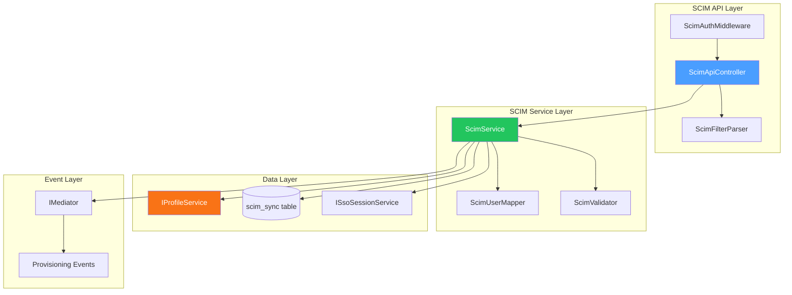
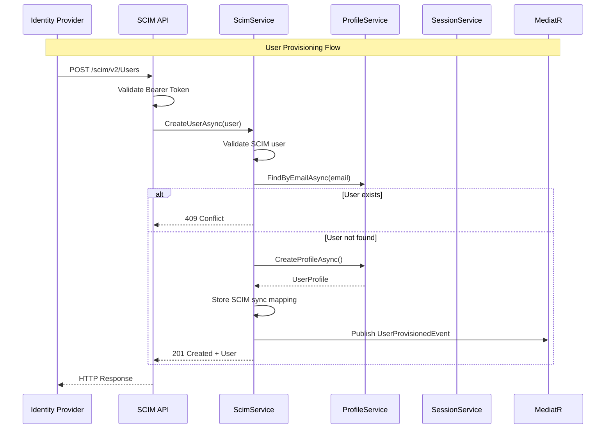
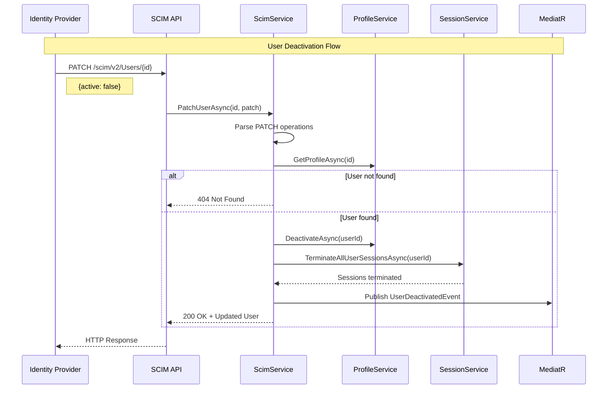

# LCS-DES-096c: Design Specification — SCIM 2.0 User Provisioning

## 1. Metadata & Categorization

| Field | Value | Description |
| :--- | :--- | :--- |
| **Feature ID** | `COL-096c` | Sub-part of COL-096 |
| **Feature Name** | `SCIM 2.0 User Provisioning` | Automatic user lifecycle management |
| **Target Version** | `v0.9.6c` | Third sub-part of v0.9.6 |
| **Module Scope** | `Lexichord.Modules.Collaboration` | Collaboration module |
| **Swimlane** | `Enterprise` | Enterprise features vertical |
| **License Tier** | `Enterprise` | Enterprise tier only |
| **Feature Gate Key** | `Enterprise.SSO.SCIM` | License gate identifier |
| **Author** | Lead Architect | |
| **Status** | `Draft` | |
| **Last Updated** | `2026-01-27` | |
| **Parent Document** | [LCS-DES-096-INDEX](./LCS-DES-096-INDEX.md) | |
| **Scope Breakdown** | [LCS-SBD-096 Section 3.3](./LCS-SBD-096.md#33-v096c-user-provisioning-scim) | |

---

## 2. Executive Summary

### 2.1 The Requirement

Enterprise organizations require automatic user lifecycle management to:

- Automatically create user accounts when employees join the organization
- Update user information when changes occur in the identity provider
- Deactivate or delete accounts when employees leave
- Sync group memberships for role-based access control
- Eliminate manual provisioning overhead and reduce orphaned accounts

Without SCIM support:

- IT administrators must manually create/delete accounts in Lexichord
- User information becomes stale and inconsistent with IdP
- Terminated employees may retain access to Lexichord
- Compliance requirements for access control cannot be met

> **Goal:** Implement a SCIM 2.0 Service Provider following RFC 7643 (Core Schema) and RFC 7644 (Protocol) that enables automatic user provisioning from enterprise identity providers.

### 2.2 The Proposed Solution

Implement a comprehensive SCIM 2.0 API that:

1. Exposes `/scim/v2/Users` endpoints for user CRUD operations
2. Exposes `/scim/v2/Groups` endpoints for group management
3. Supports SCIM filtering, sorting, and pagination
4. Implements bulk operations for efficient batch provisioning
5. Provides schema discovery endpoints
6. Authenticates requests via Bearer tokens
7. Integrates with the existing `IProfileService` for user management

---

## 3. Architecture & Modular Strategy

### 3.1 Dependencies

#### 3.1.1 Required Interfaces

| Interface | Source Version | Purpose |
| :--- | :--- | :--- |
| `IProfileService` | v0.9.1a | Create, update, and manage user profiles |
| `UserProfile` | v0.9.1a | User profile data structure |
| `ISecureVault` | v0.0.6a | Store SCIM bearer tokens |
| `ILicenseContext` | v0.0.4c | Verify Enterprise tier license |
| `ISettingsService` | v0.1.6a | Store SCIM configuration |
| `IMediator` | v0.0.7a | Publish provisioning events |
| `ISsoSessionService` | v0.9.6d | Terminate sessions on user deactivation |

#### 3.1.2 NuGet Packages

| Package | Version | Purpose |
| :--- | :--- | :--- |
| `Microsoft.AspNetCore.Mvc` | 8.x | API controller framework |
| `System.Text.Json` | 8.x | JSON serialization |
| `Sprache` | 2.x | SCIM filter parsing |

### 3.2 Component Architecture



### 3.3 Licensing Behavior

```csharp
public class ScimAuthMiddleware
{
    private readonly ILicenseContext _license;
    private readonly ISecureVault _vault;

    public async Task InvokeAsync(HttpContext context, RequestDelegate next)
    {
        // Verify Enterprise license
        if (_license.CurrentTier < LicenseTier.Enterprise)
        {
            context.Response.StatusCode = 403;
            await context.Response.WriteAsJsonAsync(new ScimError
            {
                Status = "403",
                ScimType = "forbidden",
                Detail = "SCIM provisioning requires an Enterprise license"
            });
            return;
        }

        // Validate Bearer token
        if (!await ValidateBearerTokenAsync(context))
        {
            context.Response.StatusCode = 401;
            await context.Response.WriteAsJsonAsync(new ScimError
            {
                Status = "401",
                ScimType = "unauthorized",
                Detail = "Invalid or missing SCIM bearer token"
            });
            return;
        }

        await next(context);
    }
}
```

---

## 4. Data Contract (The API)

### 4.1 Core Interfaces

```csharp
namespace Lexichord.Abstractions.Contracts.Auth;

/// <summary>
/// Service for SCIM 2.0 user provisioning operations.
/// Implements RFC 7644 (SCIM Protocol) and RFC 7643 (SCIM Core Schema).
/// </summary>
public interface IScimService
{
    #region User Resource Operations

    /// <summary>
    /// Creates a new user via SCIM.
    /// Maps SCIM user to UserProfile and persists.
    /// </summary>
    /// <param name="user">SCIM user resource to create.</param>
    /// <param name="ct">Cancellation token.</param>
    /// <returns>Created SCIM user resource with generated ID.</returns>
    /// <exception cref="ScimConflictException">User already exists.</exception>
    /// <exception cref="ScimValidationException">Invalid user data.</exception>
    Task<ScimUserResource> CreateUserAsync(
        ScimUserResource user,
        CancellationToken ct = default);

    /// <summary>
    /// Retrieves a user by SCIM ID.
    /// </summary>
    /// <param name="id">SCIM user ID.</param>
    /// <param name="ct">Cancellation token.</param>
    /// <returns>SCIM user resource or null if not found.</returns>
    Task<ScimUserResource?> GetUserAsync(
        string id,
        CancellationToken ct = default);

    /// <summary>
    /// Retrieves a user by external ID (IdP identifier).
    /// </summary>
    /// <param name="externalId">External ID from IdP.</param>
    /// <param name="ct">Cancellation token.</param>
    /// <returns>SCIM user resource or null if not found.</returns>
    Task<ScimUserResource?> GetUserByExternalIdAsync(
        string externalId,
        CancellationToken ct = default);

    /// <summary>
    /// Updates a user via SCIM (PUT - full replacement).
    /// Replaces all user attributes with provided values.
    /// </summary>
    /// <param name="id">SCIM user ID.</param>
    /// <param name="user">Complete SCIM user resource.</param>
    /// <param name="ct">Cancellation token.</param>
    /// <returns>Updated SCIM user resource.</returns>
    /// <exception cref="ScimNotFoundException">User not found.</exception>
    Task<ScimUserResource> UpdateUserAsync(
        string id,
        ScimUserResource user,
        CancellationToken ct = default);

    /// <summary>
    /// Patches a user via SCIM (PATCH - partial update).
    /// Applies operations to specific attributes.
    /// </summary>
    /// <param name="id">SCIM user ID.</param>
    /// <param name="patch">SCIM patch request with operations.</param>
    /// <param name="ct">Cancellation token.</param>
    /// <returns>Updated SCIM user resource.</returns>
    /// <exception cref="ScimNotFoundException">User not found.</exception>
    Task<ScimUserResource> PatchUserAsync(
        string id,
        ScimPatchRequest patch,
        CancellationToken ct = default);

    /// <summary>
    /// Deletes (deactivates) a user via SCIM.
    /// Soft-deletes the user and terminates all sessions.
    /// </summary>
    /// <param name="id">SCIM user ID.</param>
    /// <param name="ct">Cancellation token.</param>
    /// <exception cref="ScimNotFoundException">User not found.</exception>
    Task DeleteUserAsync(
        string id,
        CancellationToken ct = default);

    /// <summary>
    /// Lists users with optional filtering, sorting, and pagination.
    /// </summary>
    /// <param name="request">List request parameters.</param>
    /// <param name="ct">Cancellation token.</param>
    /// <returns>Paginated list of SCIM user resources.</returns>
    Task<ScimListResponse<ScimUserResource>> ListUsersAsync(
        ScimListRequest request,
        CancellationToken ct = default);

    #endregion

    #region Group Resource Operations

    /// <summary>
    /// Creates a new group via SCIM.
    /// </summary>
    /// <param name="group">SCIM group resource to create.</param>
    /// <param name="ct">Cancellation token.</param>
    /// <returns>Created SCIM group resource.</returns>
    Task<ScimGroupResource> CreateGroupAsync(
        ScimGroupResource group,
        CancellationToken ct = default);

    /// <summary>
    /// Retrieves a group by SCIM ID.
    /// </summary>
    /// <param name="id">SCIM group ID.</param>
    /// <param name="ct">Cancellation token.</param>
    /// <returns>SCIM group resource or null if not found.</returns>
    Task<ScimGroupResource?> GetGroupAsync(
        string id,
        CancellationToken ct = default);

    /// <summary>
    /// Updates a group via SCIM (PUT - full replacement).
    /// </summary>
    /// <param name="id">SCIM group ID.</param>
    /// <param name="group">Complete SCIM group resource.</param>
    /// <param name="ct">Cancellation token.</param>
    /// <returns>Updated SCIM group resource.</returns>
    Task<ScimGroupResource> UpdateGroupAsync(
        string id,
        ScimGroupResource group,
        CancellationToken ct = default);

    /// <summary>
    /// Patches a group via SCIM (PATCH - partial update).
    /// </summary>
    /// <param name="id">SCIM group ID.</param>
    /// <param name="patch">SCIM patch request with operations.</param>
    /// <param name="ct">Cancellation token.</param>
    /// <returns>Updated SCIM group resource.</returns>
    Task<ScimGroupResource> PatchGroupAsync(
        string id,
        ScimPatchRequest patch,
        CancellationToken ct = default);

    /// <summary>
    /// Deletes a group via SCIM.
    /// </summary>
    /// <param name="id">SCIM group ID.</param>
    /// <param name="ct">Cancellation token.</param>
    Task DeleteGroupAsync(
        string id,
        CancellationToken ct = default);

    /// <summary>
    /// Lists groups with optional filtering, sorting, and pagination.
    /// </summary>
    /// <param name="request">List request parameters.</param>
    /// <param name="ct">Cancellation token.</param>
    /// <returns>Paginated list of SCIM group resources.</returns>
    Task<ScimListResponse<ScimGroupResource>> ListGroupsAsync(
        ScimListRequest request,
        CancellationToken ct = default);

    #endregion

    #region Bulk Operations

    /// <summary>
    /// Processes bulk SCIM operations.
    /// Executes multiple operations in a single request.
    /// </summary>
    /// <param name="request">Bulk request with operations.</param>
    /// <param name="ct">Cancellation token.</param>
    /// <returns>Bulk response with operation results.</returns>
    Task<ScimBulkResponse> ProcessBulkAsync(
        ScimBulkRequest request,
        CancellationToken ct = default);

    #endregion

    #region Schema Discovery

    /// <summary>
    /// Returns SCIM service provider configuration.
    /// Describes supported features and capabilities.
    /// </summary>
    /// <param name="ct">Cancellation token.</param>
    /// <returns>Service provider configuration.</returns>
    Task<ScimServiceProviderConfig> GetServiceProviderConfigAsync(
        CancellationToken ct = default);

    /// <summary>
    /// Returns supported SCIM schemas.
    /// </summary>
    /// <param name="ct">Cancellation token.</param>
    /// <returns>List of supported schemas.</returns>
    Task<IReadOnlyList<ScimSchema>> GetSchemasAsync(
        CancellationToken ct = default);

    /// <summary>
    /// Returns a specific SCIM schema by ID.
    /// </summary>
    /// <param name="schemaId">Schema identifier.</param>
    /// <param name="ct">Cancellation token.</param>
    /// <returns>Schema definition or null if not found.</returns>
    Task<ScimSchema?> GetSchemaAsync(
        string schemaId,
        CancellationToken ct = default);

    /// <summary>
    /// Returns supported SCIM resource types.
    /// </summary>
    /// <param name="ct">Cancellation token.</param>
    /// <returns>List of supported resource types.</returns>
    Task<IReadOnlyList<ScimResourceType>> GetResourceTypesAsync(
        CancellationToken ct = default);

    #endregion
}
```

### 4.2 SCIM User Resource

```csharp
namespace Lexichord.Abstractions.Contracts.Auth;

/// <summary>
/// SCIM User resource following RFC 7643 Core Schema.
/// </summary>
public record ScimUserResource
{
    /// <summary>
    /// SCIM schemas applied to this resource.
    /// </summary>
    public IReadOnlyList<string> Schemas { get; init; } =
        ["urn:ietf:params:scim:schemas:core:2.0:User"];

    /// <summary>
    /// Unique identifier for the user (assigned by Lexichord).
    /// </summary>
    public string? Id { get; init; }

    /// <summary>
    /// External identifier (assigned by IdP).
    /// </summary>
    public string? ExternalId { get; init; }

    /// <summary>
    /// Unique username (typically email address).
    /// </summary>
    public required string UserName { get; init; }

    /// <summary>
    /// User's name components.
    /// </summary>
    public ScimName? Name { get; init; }

    /// <summary>
    /// Display name shown in UI.
    /// </summary>
    public string? DisplayName { get; init; }

    /// <summary>
    /// Casual name (nickname).
    /// </summary>
    public string? NickName { get; init; }

    /// <summary>
    /// URL to user's profile page.
    /// </summary>
    public string? ProfileUrl { get; init; }

    /// <summary>
    /// Job title.
    /// </summary>
    public string? Title { get; init; }

    /// <summary>
    /// User type (e.g., "Employee", "Contractor").
    /// </summary>
    public string? UserType { get; init; }

    /// <summary>
    /// Preferred language (BCP 47 tag).
    /// </summary>
    public string? PreferredLanguage { get; init; }

    /// <summary>
    /// Locale (e.g., "en-US").
    /// </summary>
    public string? Locale { get; init; }

    /// <summary>
    /// Timezone (IANA timezone database).
    /// </summary>
    public string? Timezone { get; init; }

    /// <summary>
    /// Whether the user account is active.
    /// </summary>
    public bool Active { get; init; } = true;

    /// <summary>
    /// Password (write-only, never returned).
    /// </summary>
    public string? Password { get; init; }

    /// <summary>
    /// Email addresses.
    /// </summary>
    public IReadOnlyList<ScimEmail>? Emails { get; init; }

    /// <summary>
    /// Phone numbers.
    /// </summary>
    public IReadOnlyList<ScimPhoneNumber>? PhoneNumbers { get; init; }

    /// <summary>
    /// Instant messaging addresses.
    /// </summary>
    public IReadOnlyList<ScimIm>? Ims { get; init; }

    /// <summary>
    /// Photos (profile pictures).
    /// </summary>
    public IReadOnlyList<ScimPhoto>? Photos { get; init; }

    /// <summary>
    /// Physical addresses.
    /// </summary>
    public IReadOnlyList<ScimAddress>? Addresses { get; init; }

    /// <summary>
    /// Groups the user belongs to (read-only).
    /// </summary>
    public IReadOnlyList<ScimGroupMembership>? Groups { get; init; }

    /// <summary>
    /// Entitlements or permissions.
    /// </summary>
    public IReadOnlyList<ScimEntitlement>? Entitlements { get; init; }

    /// <summary>
    /// Roles assigned to the user.
    /// </summary>
    public IReadOnlyList<ScimRole>? Roles { get; init; }

    /// <summary>
    /// X.509 certificates.
    /// </summary>
    public IReadOnlyList<ScimX509Certificate>? X509Certificates { get; init; }

    /// <summary>
    /// Resource metadata.
    /// </summary>
    public ScimMeta? Meta { get; init; }
}

/// <summary>
/// SCIM Name sub-attribute.
/// </summary>
public record ScimName(
    /// <summary>Full formatted name.</summary>
    string? Formatted,
    /// <summary>Family name (surname).</summary>
    string? FamilyName,
    /// <summary>Given name (first name).</summary>
    string? GivenName,
    /// <summary>Middle name.</summary>
    string? MiddleName,
    /// <summary>Title prefix (e.g., "Dr.").</summary>
    string? HonorificPrefix,
    /// <summary>Title suffix (e.g., "Jr.").</summary>
    string? HonorificSuffix
);

/// <summary>
/// SCIM Email sub-attribute.
/// </summary>
public record ScimEmail(
    /// <summary>Email address value.</summary>
    string Value,
    /// <summary>Email type (work, home, other).</summary>
    string? Type,
    /// <summary>Whether this is the primary email.</summary>
    bool Primary = false
);

/// <summary>
/// SCIM Phone Number sub-attribute.
/// </summary>
public record ScimPhoneNumber(
    /// <summary>Phone number value.</summary>
    string Value,
    /// <summary>Phone type (work, home, mobile, fax, pager, other).</summary>
    string? Type,
    /// <summary>Whether this is the primary phone.</summary>
    bool Primary = false
);

/// <summary>
/// SCIM Instant Messaging sub-attribute.
/// </summary>
public record ScimIm(
    /// <summary>IM address value.</summary>
    string Value,
    /// <summary>IM provider type (aim, gtalk, icq, xmpp, msn, skype, qq, yahoo).</summary>
    string? Type,
    /// <summary>Whether this is the primary IM.</summary>
    bool Primary = false
);

/// <summary>
/// SCIM Photo sub-attribute.
/// </summary>
public record ScimPhoto(
    /// <summary>URL to photo.</summary>
    string Value,
    /// <summary>Photo type (photo, thumbnail).</summary>
    string? Type,
    /// <summary>Whether this is the primary photo.</summary>
    bool Primary = false
);

/// <summary>
/// SCIM Address sub-attribute.
/// </summary>
public record ScimAddress(
    /// <summary>Full formatted address.</summary>
    string? Formatted,
    /// <summary>Street address.</summary>
    string? StreetAddress,
    /// <summary>City or locality.</summary>
    string? Locality,
    /// <summary>State or region.</summary>
    string? Region,
    /// <summary>Postal code.</summary>
    string? PostalCode,
    /// <summary>Country (ISO 3166-1 alpha-2).</summary>
    string? Country,
    /// <summary>Address type (work, home, other).</summary>
    string? Type,
    /// <summary>Whether this is the primary address.</summary>
    bool Primary = false
);

/// <summary>
/// SCIM Group membership (read-only).
/// </summary>
public record ScimGroupMembership(
    /// <summary>Group SCIM ID.</summary>
    string Value,
    /// <summary>Group display name.</summary>
    string? Display,
    /// <summary>URI reference to group resource.</summary>
    [property: JsonPropertyName("$ref")]
    string? Ref
);

/// <summary>
/// SCIM Entitlement.
/// </summary>
public record ScimEntitlement(
    /// <summary>Entitlement value.</summary>
    string Value,
    /// <summary>Entitlement type.</summary>
    string? Type,
    /// <summary>Whether this is the primary entitlement.</summary>
    bool Primary = false
);

/// <summary>
/// SCIM Role.
/// </summary>
public record ScimRole(
    /// <summary>Role value.</summary>
    string Value,
    /// <summary>Role type.</summary>
    string? Type,
    /// <summary>Whether this is the primary role.</summary>
    bool Primary = false
);

/// <summary>
/// SCIM X.509 Certificate.
/// </summary>
public record ScimX509Certificate(
    /// <summary>Base64-encoded certificate.</summary>
    string Value,
    /// <summary>Certificate type.</summary>
    string? Type,
    /// <summary>Whether this is the primary certificate.</summary>
    bool Primary = false
);

/// <summary>
/// SCIM Meta sub-attribute.
/// </summary>
public record ScimMeta(
    /// <summary>Resource type (User, Group).</summary>
    string ResourceType,
    /// <summary>When the resource was created.</summary>
    DateTime Created,
    /// <summary>When the resource was last modified.</summary>
    DateTime LastModified,
    /// <summary>URI of the resource.</summary>
    string? Location,
    /// <summary>Version ETag for concurrency.</summary>
    string? Version
);
```

### 4.3 SCIM Group Resource

```csharp
namespace Lexichord.Abstractions.Contracts.Auth;

/// <summary>
/// SCIM Group resource following RFC 7643.
/// </summary>
public record ScimGroupResource
{
    /// <summary>
    /// SCIM schemas applied to this resource.
    /// </summary>
    public IReadOnlyList<string> Schemas { get; init; } =
        ["urn:ietf:params:scim:schemas:core:2.0:Group"];

    /// <summary>
    /// Unique identifier for the group.
    /// </summary>
    public string? Id { get; init; }

    /// <summary>
    /// External identifier (assigned by IdP).
    /// </summary>
    public string? ExternalId { get; init; }

    /// <summary>
    /// Display name for the group.
    /// </summary>
    public required string DisplayName { get; init; }

    /// <summary>
    /// Members of the group.
    /// </summary>
    public IReadOnlyList<ScimMember>? Members { get; init; }

    /// <summary>
    /// Resource metadata.
    /// </summary>
    public ScimMeta? Meta { get; init; }
}

/// <summary>
/// SCIM Group member sub-attribute.
/// </summary>
public record ScimMember(
    /// <summary>Member SCIM ID.</summary>
    string Value,
    /// <summary>Member display name.</summary>
    string? Display,
    /// <summary>Member type (User, Group).</summary>
    string? Type,
    /// <summary>URI reference to member resource.</summary>
    [property: JsonPropertyName("$ref")]
    string? Ref
);
```

### 4.4 SCIM Request/Response Types

```csharp
namespace Lexichord.Abstractions.Contracts.Auth;

/// <summary>
/// SCIM PATCH operation request (RFC 7644 Section 3.5.2).
/// </summary>
public record ScimPatchRequest
{
    /// <summary>
    /// Schemas for the patch request.
    /// </summary>
    public IReadOnlyList<string> Schemas { get; init; } =
        ["urn:ietf:params:scim:api:messages:2.0:PatchOp"];

    /// <summary>
    /// List of operations to apply.
    /// </summary>
    public required IReadOnlyList<ScimPatchOperation> Operations { get; init; }
}

/// <summary>
/// SCIM PATCH operation.
/// </summary>
public record ScimPatchOperation(
    /// <summary>Operation type (add, remove, replace).</summary>
    ScimPatchOp Op,
    /// <summary>Attribute path to modify (null for root).</summary>
    string? Path,
    /// <summary>Value to apply.</summary>
    object? Value
);

/// <summary>
/// SCIM patch operation types.
/// </summary>
public enum ScimPatchOp
{
    /// <summary>Add new value or append to multi-valued attribute.</summary>
    Add,
    /// <summary>Remove value from attribute.</summary>
    Remove,
    /// <summary>Replace existing value.</summary>
    Replace
}

/// <summary>
/// SCIM list request parameters.
/// </summary>
public record ScimListRequest(
    /// <summary>SCIM filter expression.</summary>
    string? Filter = null,
    /// <summary>Attribute to sort by.</summary>
    string? SortBy = null,
    /// <summary>Sort order.</summary>
    ScimSortOrder SortOrder = ScimSortOrder.Ascending,
    /// <summary>1-based starting index.</summary>
    int StartIndex = 1,
    /// <summary>Number of results per page.</summary>
    int Count = 100,
    /// <summary>Comma-separated list of attributes to return.</summary>
    string? Attributes = null,
    /// <summary>Comma-separated list of attributes to exclude.</summary>
    string? ExcludedAttributes = null
);

/// <summary>
/// SCIM sort order.
/// </summary>
public enum ScimSortOrder
{
    Ascending,
    Descending
}

/// <summary>
/// SCIM list response.
/// </summary>
public record ScimListResponse<T>
{
    /// <summary>
    /// Response schemas.
    /// </summary>
    public IReadOnlyList<string> Schemas { get; init; } =
        ["urn:ietf:params:scim:api:messages:2.0:ListResponse"];

    /// <summary>
    /// Total number of results matching the query.
    /// </summary>
    public int TotalResults { get; init; }

    /// <summary>
    /// Starting index of this page.
    /// </summary>
    public int StartIndex { get; init; }

    /// <summary>
    /// Number of results in this page.
    /// </summary>
    public int ItemsPerPage { get; init; }

    /// <summary>
    /// Resources in this page.
    /// </summary>
    public IReadOnlyList<T> Resources { get; init; } = [];
}

/// <summary>
/// SCIM bulk request (RFC 7644 Section 3.7).
/// </summary>
public record ScimBulkRequest
{
    /// <summary>
    /// Request schemas.
    /// </summary>
    public IReadOnlyList<string> Schemas { get; init; } =
        ["urn:ietf:params:scim:api:messages:2.0:BulkRequest"];

    /// <summary>
    /// List of operations to execute.
    /// </summary>
    public required IReadOnlyList<ScimBulkOperation> Operations { get; init; }

    /// <summary>
    /// Number of errors before aborting (null = continue on all errors).
    /// </summary>
    public int? FailOnErrors { get; init; }
}

/// <summary>
/// SCIM bulk operation.
/// </summary>
public record ScimBulkOperation(
    /// <summary>HTTP method (POST, PUT, PATCH, DELETE).</summary>
    string Method,
    /// <summary>Client-assigned bulk operation ID for reference.</summary>
    string? BulkId,
    /// <summary>Resource path (e.g., "/Users", "/Users/{id}").</summary>
    string Path,
    /// <summary>Operation data (for POST, PUT, PATCH).</summary>
    object? Data
);

/// <summary>
/// SCIM bulk response.
/// </summary>
public record ScimBulkResponse
{
    /// <summary>
    /// Response schemas.
    /// </summary>
    public IReadOnlyList<string> Schemas { get; init; } =
        ["urn:ietf:params:scim:api:messages:2.0:BulkResponse"];

    /// <summary>
    /// Results of each operation.
    /// </summary>
    public IReadOnlyList<ScimBulkOperationResponse> Operations { get; init; } = [];
}

/// <summary>
/// SCIM bulk operation response.
/// </summary>
public record ScimBulkOperationResponse(
    /// <summary>HTTP method of the operation.</summary>
    string Method,
    /// <summary>Client-assigned bulk ID.</summary>
    string? BulkId,
    /// <summary>Resource version ETag.</summary>
    string? Version,
    /// <summary>Location of created/updated resource.</summary>
    string? Location,
    /// <summary>HTTP status of the operation.</summary>
    ScimBulkStatus Status,
    /// <summary>Response body (for errors or created resources).</summary>
    object? Response
);

/// <summary>
/// SCIM bulk operation status.
/// </summary>
public record ScimBulkStatus(
    /// <summary>HTTP status code.</summary>
    int Code,
    /// <summary>HTTP status description.</summary>
    string? Description
);

/// <summary>
/// SCIM error response.
/// </summary>
public record ScimError
{
    /// <summary>
    /// Error schemas.
    /// </summary>
    public IReadOnlyList<string> Schemas { get; init; } =
        ["urn:ietf:params:scim:api:messages:2.0:Error"];

    /// <summary>
    /// SCIM error type.
    /// </summary>
    public string? ScimType { get; init; }

    /// <summary>
    /// HTTP status code as string.
    /// </summary>
    public required string Status { get; init; }

    /// <summary>
    /// Human-readable error detail.
    /// </summary>
    public string? Detail { get; init; }
}
```

### 4.5 SCIM Configuration

```csharp
namespace Lexichord.Abstractions.Configuration;

/// <summary>
/// Configuration for SCIM 2.0 provisioning.
/// </summary>
public record ScimConfiguration
{
    /// <summary>
    /// Whether SCIM provisioning is enabled.
    /// </summary>
    public bool Enabled { get; init; } = false;

    /// <summary>
    /// Base URL for SCIM endpoints.
    /// Example: "https://lexichord.app/scim/v2"
    /// </summary>
    public required string BaseUrl { get; init; }

    /// <summary>
    /// Bearer token for SCIM authentication.
    /// Stored in SecureVault with this key.
    /// </summary>
    public string? BearerTokenVaultKey { get; init; }

    /// <summary>
    /// Maximum operations per bulk request.
    /// </summary>
    public int MaxBulkOperations { get; init; } = 1000;

    /// <summary>
    /// Maximum payload size for bulk requests (bytes).
    /// </summary>
    public int MaxBulkPayloadSize { get; init; } = 1048576; // 1 MB

    /// <summary>
    /// Maximum results per list request.
    /// </summary>
    public int MaxResults { get; init; } = 200;

    /// <summary>
    /// Whether to support PATCH operations.
    /// </summary>
    public bool SupportPatch { get; init; } = true;

    /// <summary>
    /// Whether to support bulk operations.
    /// </summary>
    public bool SupportBulk { get; init; } = true;

    /// <summary>
    /// Whether to support filtering.
    /// </summary>
    public bool SupportFilter { get; init; } = true;

    /// <summary>
    /// Whether to support sorting.
    /// </summary>
    public bool SupportSort { get; init; } = true;

    /// <summary>
    /// Whether to support ETags for optimistic concurrency.
    /// </summary>
    public bool SupportEtag { get; init; } = true;

    /// <summary>
    /// Whether to support change password.
    /// </summary>
    public bool SupportChangePassword { get; init; } = false;

    /// <summary>
    /// IP addresses allowed to access SCIM endpoints.
    /// Empty = allow all.
    /// </summary>
    public IReadOnlyList<string>? AllowedIpAddresses { get; init; }

    /// <summary>
    /// Mapping configuration for user attributes.
    /// </summary>
    public ScimAttributeMappings AttributeMappings { get; init; } = new();

    /// <summary>
    /// Group to role mapping configuration.
    /// </summary>
    public IReadOnlyDictionary<string, string>? GroupToRoleMappings { get; init; }
}

/// <summary>
/// SCIM attribute mappings to Lexichord user profile fields.
/// </summary>
public record ScimAttributeMappings
{
    /// <summary>
    /// SCIM attribute for email (default: emails[primary eq true].value).
    /// </summary>
    public string Email { get; init; } = "emails[type eq \"work\"].value";

    /// <summary>
    /// SCIM attribute for display name.
    /// </summary>
    public string DisplayName { get; init; } = "displayName";

    /// <summary>
    /// SCIM attribute for first name.
    /// </summary>
    public string FirstName { get; init; } = "name.givenName";

    /// <summary>
    /// SCIM attribute for last name.
    /// </summary>
    public string LastName { get; init; } = "name.familyName";

    /// <summary>
    /// Custom attribute mappings.
    /// </summary>
    public IReadOnlyDictionary<string, string>? CustomMappings { get; init; }
}
```

### 4.6 Schema Discovery Types

```csharp
namespace Lexichord.Abstractions.Contracts.Auth;

/// <summary>
/// SCIM Service Provider Configuration (RFC 7643 Section 5).
/// </summary>
public record ScimServiceProviderConfig
{
    /// <summary>
    /// Configuration schemas.
    /// </summary>
    public IReadOnlyList<string> Schemas { get; init; } =
        ["urn:ietf:params:scim:schemas:core:2.0:ServiceProviderConfig"];

    /// <summary>
    /// Documentation URI.
    /// </summary>
    public string? DocumentationUri { get; init; }

    /// <summary>
    /// PATCH operation support.
    /// </summary>
    public ScimSupportedFeature Patch { get; init; } = new(true);

    /// <summary>
    /// Bulk operation support.
    /// </summary>
    public ScimBulkConfig Bulk { get; init; } = new();

    /// <summary>
    /// Filter support.
    /// </summary>
    public ScimFilterConfig Filter { get; init; } = new();

    /// <summary>
    /// Change password support.
    /// </summary>
    public ScimSupportedFeature ChangePassword { get; init; } = new(false);

    /// <summary>
    /// Sort support.
    /// </summary>
    public ScimSupportedFeature Sort { get; init; } = new(true);

    /// <summary>
    /// ETag support.
    /// </summary>
    public ScimSupportedFeature Etag { get; init; } = new(true);

    /// <summary>
    /// Authentication schemes.
    /// </summary>
    public IReadOnlyList<ScimAuthScheme> AuthenticationSchemes { get; init; } = [];

    /// <summary>
    /// Resource metadata.
    /// </summary>
    public ScimMeta? Meta { get; init; }
}

/// <summary>
/// SCIM supported feature flag.
/// </summary>
public record ScimSupportedFeature(bool Supported);

/// <summary>
/// SCIM bulk operation configuration.
/// </summary>
public record ScimBulkConfig
{
    public bool Supported { get; init; } = true;
    public int MaxOperations { get; init; } = 1000;
    public int MaxPayloadSize { get; init; } = 1048576;
}

/// <summary>
/// SCIM filter configuration.
/// </summary>
public record ScimFilterConfig
{
    public bool Supported { get; init; } = true;
    public int MaxResults { get; init; } = 200;
}

/// <summary>
/// SCIM authentication scheme.
/// </summary>
public record ScimAuthScheme(
    string Type,
    string Name,
    string Description,
    string? SpecUri,
    string? DocumentationUri,
    bool Primary
);

/// <summary>
/// SCIM Schema definition (RFC 7643 Section 7).
/// </summary>
public record ScimSchema
{
    public string Id { get; init; } = "";
    public string? Name { get; init; }
    public string? Description { get; init; }
    public IReadOnlyList<ScimSchemaAttribute> Attributes { get; init; } = [];
    public ScimMeta? Meta { get; init; }
}

/// <summary>
/// SCIM Schema attribute definition.
/// </summary>
public record ScimSchemaAttribute
{
    public required string Name { get; init; }
    public required string Type { get; init; }
    public bool MultiValued { get; init; }
    public string? Description { get; init; }
    public bool Required { get; init; }
    public bool CaseExact { get; init; }
    public string? Mutability { get; init; }
    public string? Returned { get; init; }
    public string? Uniqueness { get; init; }
    public IReadOnlyList<string>? CanonicalValues { get; init; }
    public IReadOnlyList<string>? ReferenceTypes { get; init; }
    public IReadOnlyList<ScimSchemaAttribute>? SubAttributes { get; init; }
}

/// <summary>
/// SCIM Resource Type definition.
/// </summary>
public record ScimResourceType
{
    public IReadOnlyList<string> Schemas { get; init; } =
        ["urn:ietf:params:scim:schemas:core:2.0:ResourceType"];
    public required string Id { get; init; }
    public required string Name { get; init; }
    public string? Description { get; init; }
    public required string Endpoint { get; init; }
    public required string Schema { get; init; }
    public IReadOnlyList<ScimSchemaExtension>? SchemaExtensions { get; init; }
    public ScimMeta? Meta { get; init; }
}

/// <summary>
/// SCIM Schema extension reference.
/// </summary>
public record ScimSchemaExtension(
    string Schema,
    bool Required
);
```

---

## 5. Implementation Logic

### 5.1 User Provisioning Flow



### 5.2 User Deactivation Flow



### 5.3 SCIM Filter Parsing

```text
SCIM FILTER GRAMMAR (RFC 7644 Section 3.4.2.2):
│
├── filter     = attrExp / logExp / valuePath / not "(" filter ")"
├── attrExp    = (attrPath SP compareOp SP compValue) / (attrPath SP "pr")
├── logExp     = filter SP ("and" / "or") SP filter
├── valuePath  = attrPath "[" valFilter "]"
├── valFilter  = attrExp / logExp / not "(" valFilter ")"
├── attrPath   = [URI ":"] ATTRNAME *("." ATTRNAME)
├── compareOp  = "eq" / "ne" / "co" / "sw" / "ew" / "gt" / "lt" / "ge" / "le"
├── compValue  = false / null / true / number / string
└── not        = "not" SP

SUPPORTED FILTERS:
├── Equality:        userName eq "john@example.com"
├── Not Equal:       active ne false
├── Contains:        displayName co "John"
├── Starts With:     userName sw "john"
├── Ends With:       emails.value ew "@acme.com"
├── Greater Than:    meta.lastModified gt "2024-01-01T00:00:00Z"
├── Less Than:       meta.lastModified lt "2024-12-31T00:00:00Z"
├── Present:         emails pr
├── And:             active eq true and userName sw "j"
├── Or:              userName eq "john" or userName eq "jane"
├── Not:             not (active eq false)
└── Value Path:      emails[type eq "work"].value eq "john@acme.com"

FILTER TRANSLATION TO SQL:
├── eq  → column = @value
├── ne  → column <> @value
├── co  → column LIKE '%' + @value + '%'
├── sw  → column LIKE @value + '%'
├── ew  → column LIKE '%' + @value
├── gt  → column > @value
├── lt  → column < @value
├── ge  → column >= @value
├── le  → column <= @value
├── pr  → column IS NOT NULL
├── and → expr1 AND expr2
├── or  → expr1 OR expr2
└── not → NOT (expr)
```

### 5.4 Bulk Operation Processing

```text
BULK OPERATION FLOW:
│
├── 1. Parse Bulk Request
│   ├── Validate schema = urn:ietf:params:scim:api:messages:2.0:BulkRequest
│   ├── Check operation count <= MaxBulkOperations
│   └── Check payload size <= MaxBulkPayloadSize
│
├── 2. Process Operations
│   ├── For each operation:
│   │   ├── Parse method (POST, PUT, PATCH, DELETE)
│   │   ├── Parse path (/Users, /Users/{id}, /Groups, etc.)
│   │   ├── Resolve bulkId references (POST results referenced in later ops)
│   │   ├── Execute operation
│   │   ├── Track result (status, location, response)
│   │   └── Check failOnErrors threshold
│   │
│   └── Stop if error count >= failOnErrors
│
├── 3. Build Bulk Response
│   ├── Schema = urn:ietf:params:scim:api:messages:2.0:BulkResponse
│   └── Operations = list of operation results
│
└── 4. Return Response
    └── HTTP 200 (even if some operations failed)

BULKID REFERENCE RESOLUTION:
│
├── POST /Users with bulkId "user1" returns:
│   └── location = /Users/abc123
│
├── PATCH /Groups/{id} with data referencing "bulkId:user1":
│   └── Resolved to /Users/abc123
│
└── Enables dependent operations in single request
```

---

## 6. Implementation Details

### 6.1 ScimService Implementation

```csharp
namespace Lexichord.Modules.Collaboration.Auth;

/// <summary>
/// SCIM 2.0 service implementation following RFC 7643 and RFC 7644.
/// </summary>
public class ScimService : IScimService
{
    private readonly ScimConfiguration _config;
    private readonly IProfileService _profileService;
    private readonly ISsoSessionService _sessionService;
    private readonly ILicenseContext _license;
    private readonly IMediator _mediator;
    private readonly ILogger<ScimService> _logger;
    private readonly ScimDbContext _dbContext;

    public ScimService(
        IOptions<ScimConfiguration> config,
        IProfileService profileService,
        ISsoSessionService sessionService,
        ILicenseContext license,
        IMediator mediator,
        ScimDbContext dbContext,
        ILogger<ScimService> logger)
    {
        _config = config.Value;
        _profileService = profileService;
        _sessionService = sessionService;
        _license = license;
        _mediator = mediator;
        _dbContext = dbContext;
        _logger = logger;
    }

    #region User Operations

    public async Task<ScimUserResource> CreateUserAsync(
        ScimUserResource user,
        CancellationToken ct = default)
    {
        EnsureEnterpriseLicense();

        _logger.LogInformation(
            "Creating SCIM user: {UserName}, ExternalId: {ExternalId}",
            user.UserName, user.ExternalId);

        // Validate required fields
        ValidateUser(user);

        // Check for existing user by externalId or email
        var primaryEmail = GetPrimaryEmail(user);
        var existingByExtId = !string.IsNullOrEmpty(user.ExternalId)
            ? await _dbContext.ScimSyncMappings
                .FirstOrDefaultAsync(m => m.ExternalId == user.ExternalId, ct)
            : null;

        if (existingByExtId != null)
        {
            throw new ScimConflictException(
                "User with this externalId already exists",
                existingByExtId.ScimId);
        }

        var existingByEmail = await _profileService.FindByEmailAsync(primaryEmail, ct);
        if (existingByEmail != null)
        {
            throw new ScimConflictException(
                "User with this email already exists",
                existingByEmail.ProfileId.ToString());
        }

        // Create user profile
        var profile = await _profileService.CreateProfileAsync(
            new CreateProfileRequest
            {
                Email = primaryEmail,
                DisplayName = user.DisplayName ?? BuildDisplayName(user.Name),
                FirstName = user.Name?.GivenName,
                LastName = user.Name?.FamilyName,
                Locale = user.Locale,
                Timezone = user.Timezone,
                IsActive = user.Active,
                Source = ProfileSource.Scim
            }, ct);

        // Create SCIM sync mapping
        var scimId = Guid.NewGuid().ToString();
        var now = DateTime.UtcNow;

        var syncMapping = new ScimSyncMapping
        {
            ScimId = scimId,
            ExternalId = user.ExternalId,
            UserId = profile.ProfileId,
            ScimUserJson = JsonSerializer.Serialize(user),
            CreatedAt = now,
            UpdatedAt = now,
            SyncedAt = now
        };

        _dbContext.ScimSyncMappings.Add(syncMapping);
        await _dbContext.SaveChangesAsync(ct);

        // Build response
        var result = user with
        {
            Id = scimId,
            Groups = [], // Groups are read-only
            Meta = new ScimMeta(
                ResourceType: "User",
                Created: now,
                LastModified: now,
                Location: $"{_config.BaseUrl}/Users/{scimId}",
                Version: $"W/\"{now.Ticks}\""
            )
        };

        await _mediator.Publish(
            new UserProvisionedEvent(profile.ProfileId, scimId, user.UserName), ct);

        _logger.LogInformation(
            "Created SCIM user {ScimId} for profile {ProfileId}",
            scimId, profile.ProfileId);

        return result;
    }

    public async Task<ScimUserResource?> GetUserAsync(
        string id,
        CancellationToken ct = default)
    {
        EnsureEnterpriseLicense();

        var mapping = await _dbContext.ScimSyncMappings
            .FirstOrDefaultAsync(m => m.ScimId == id, ct);

        if (mapping == null)
            return null;

        var profile = await _profileService.GetProfileAsync(mapping.UserId, ct);
        if (profile == null)
            return null;

        return MapProfileToScimUser(profile, mapping);
    }

    public async Task<ScimUserResource?> GetUserByExternalIdAsync(
        string externalId,
        CancellationToken ct = default)
    {
        EnsureEnterpriseLicense();

        var mapping = await _dbContext.ScimSyncMappings
            .FirstOrDefaultAsync(m => m.ExternalId == externalId, ct);

        if (mapping == null)
            return null;

        var profile = await _profileService.GetProfileAsync(mapping.UserId, ct);
        if (profile == null)
            return null;

        return MapProfileToScimUser(profile, mapping);
    }

    public async Task<ScimUserResource> UpdateUserAsync(
        string id,
        ScimUserResource user,
        CancellationToken ct = default)
    {
        EnsureEnterpriseLicense();

        _logger.LogInformation("Updating SCIM user: {Id}", id);

        var mapping = await _dbContext.ScimSyncMappings
            .FirstOrDefaultAsync(m => m.ScimId == id, ct);

        if (mapping == null)
            throw new ScimNotFoundException("User", id);

        ValidateUser(user);

        var primaryEmail = GetPrimaryEmail(user);

        // Update user profile
        await _profileService.UpdateProfileAsync(
            mapping.UserId,
            new UpdateProfileRequest
            {
                Email = primaryEmail,
                DisplayName = user.DisplayName ?? BuildDisplayName(user.Name),
                FirstName = user.Name?.GivenName,
                LastName = user.Name?.FamilyName,
                Locale = user.Locale,
                Timezone = user.Timezone,
                IsActive = user.Active
            }, ct);

        // Handle deactivation
        if (!user.Active)
        {
            await _sessionService.TerminateAllUserSessionsAsync(
                mapping.UserId,
                SessionTerminationReason.UserDeactivated,
                ct);

            await _mediator.Publish(
                new UserDeactivatedEvent(mapping.UserId, id), ct);
        }

        // Update sync mapping
        var now = DateTime.UtcNow;
        mapping.ScimUserJson = JsonSerializer.Serialize(user);
        mapping.UpdatedAt = now;
        mapping.SyncedAt = now;
        mapping.ExternalId = user.ExternalId;

        await _dbContext.SaveChangesAsync(ct);

        var profile = await _profileService.GetProfileAsync(mapping.UserId, ct);

        return MapProfileToScimUser(profile!, mapping);
    }

    public async Task<ScimUserResource> PatchUserAsync(
        string id,
        ScimPatchRequest patch,
        CancellationToken ct = default)
    {
        EnsureEnterpriseLicense();

        _logger.LogInformation(
            "Patching SCIM user {Id} with {Count} operations",
            id, patch.Operations.Count);

        var mapping = await _dbContext.ScimSyncMappings
            .FirstOrDefaultAsync(m => m.ScimId == id, ct);

        if (mapping == null)
            throw new ScimNotFoundException("User", id);

        // Get current user state
        var currentUser = JsonSerializer.Deserialize<ScimUserResource>(
            mapping.ScimUserJson)!;

        // Apply patch operations
        var patchedUser = ApplyPatchOperations(currentUser, patch);

        // Validate patched user
        ValidateUser(patchedUser);

        // Check if being deactivated
        var wasActive = currentUser.Active;
        var isActive = patchedUser.Active;

        // Update via full update
        return await UpdateUserAsync(id, patchedUser, ct);
    }

    public async Task DeleteUserAsync(
        string id,
        CancellationToken ct = default)
    {
        EnsureEnterpriseLicense();

        _logger.LogInformation("Deleting SCIM user: {Id}", id);

        var mapping = await _dbContext.ScimSyncMappings
            .FirstOrDefaultAsync(m => m.ScimId == id, ct);

        if (mapping == null)
            throw new ScimNotFoundException("User", id);

        // Terminate all sessions
        await _sessionService.TerminateAllUserSessionsAsync(
            mapping.UserId,
            SessionTerminationReason.UserDeactivated,
            ct);

        // Soft-delete user profile
        await _profileService.DeleteProfileAsync(mapping.UserId, ct);

        // Mark sync mapping as deleted
        mapping.DeletedAt = DateTime.UtcNow;
        await _dbContext.SaveChangesAsync(ct);

        await _mediator.Publish(
            new UserDeprovisionedEvent(mapping.UserId, id), ct);

        _logger.LogInformation(
            "Deleted SCIM user {ScimId} (profile {ProfileId})",
            id, mapping.UserId);
    }

    public async Task<ScimListResponse<ScimUserResource>> ListUsersAsync(
        ScimListRequest request,
        CancellationToken ct = default)
    {
        EnsureEnterpriseLicense();

        _logger.LogDebug(
            "Listing SCIM users: Filter={Filter}, StartIndex={StartIndex}, Count={Count}",
            request.Filter, request.StartIndex, request.Count);

        var query = _dbContext.ScimSyncMappings
            .Where(m => m.DeletedAt == null)
            .AsQueryable();

        // Apply filter
        if (!string.IsNullOrEmpty(request.Filter))
        {
            query = ApplyFilter(query, request.Filter);
        }

        // Get total count
        var totalResults = await query.CountAsync(ct);

        // Apply sorting
        query = ApplySorting(query, request.SortBy, request.SortOrder);

        // Apply pagination (SCIM uses 1-based indexing)
        var startIndex = Math.Max(1, request.StartIndex);
        var count = Math.Min(request.Count, _config.MaxResults);

        query = query
            .Skip(startIndex - 1)
            .Take(count);

        // Execute query
        var mappings = await query.ToListAsync(ct);

        // Load profiles
        var userIds = mappings.Select(m => m.UserId).ToList();
        var profiles = await _profileService.GetProfilesAsync(userIds, ct);
        var profileDict = profiles.ToDictionary(p => p.ProfileId);

        // Map to SCIM resources
        var resources = mappings
            .Where(m => profileDict.ContainsKey(m.UserId))
            .Select(m => MapProfileToScimUser(profileDict[m.UserId], m))
            .ToList();

        return new ScimListResponse<ScimUserResource>
        {
            TotalResults = totalResults,
            StartIndex = startIndex,
            ItemsPerPage = resources.Count,
            Resources = resources
        };
    }

    #endregion

    #region Group Operations

    public async Task<ScimGroupResource> CreateGroupAsync(
        ScimGroupResource group,
        CancellationToken ct = default)
    {
        EnsureEnterpriseLicense();

        _logger.LogInformation("Creating SCIM group: {DisplayName}", group.DisplayName);

        var scimId = Guid.NewGuid().ToString();
        var now = DateTime.UtcNow;

        var groupEntity = new ScimGroup
        {
            ScimId = scimId,
            ExternalId = group.ExternalId,
            DisplayName = group.DisplayName,
            CreatedAt = now,
            UpdatedAt = now
        };

        _dbContext.ScimGroups.Add(groupEntity);

        // Add members
        if (group.Members?.Any() == true)
        {
            foreach (var member in group.Members)
            {
                var membership = new ScimGroupMemberEntity
                {
                    GroupScimId = scimId,
                    MemberScimId = member.Value,
                    MemberType = member.Type ?? "User",
                    CreatedAt = now
                };
                _dbContext.ScimGroupMembers.Add(membership);
            }
        }

        await _dbContext.SaveChangesAsync(ct);

        return group with
        {
            Id = scimId,
            Meta = new ScimMeta(
                ResourceType: "Group",
                Created: now,
                LastModified: now,
                Location: $"{_config.BaseUrl}/Groups/{scimId}",
                Version: $"W/\"{now.Ticks}\""
            )
        };
    }

    public async Task<ScimGroupResource?> GetGroupAsync(
        string id,
        CancellationToken ct = default)
    {
        EnsureEnterpriseLicense();

        var group = await _dbContext.ScimGroups
            .Include(g => g.Members)
            .FirstOrDefaultAsync(g => g.ScimId == id && g.DeletedAt == null, ct);

        if (group == null)
            return null;

        return MapEntityToScimGroup(group);
    }

    public async Task<ScimGroupResource> UpdateGroupAsync(
        string id,
        ScimGroupResource group,
        CancellationToken ct = default)
    {
        EnsureEnterpriseLicense();

        var entity = await _dbContext.ScimGroups
            .Include(g => g.Members)
            .FirstOrDefaultAsync(g => g.ScimId == id && g.DeletedAt == null, ct);

        if (entity == null)
            throw new ScimNotFoundException("Group", id);

        entity.DisplayName = group.DisplayName;
        entity.ExternalId = group.ExternalId;
        entity.UpdatedAt = DateTime.UtcNow;

        // Replace members
        _dbContext.ScimGroupMembers.RemoveRange(entity.Members);

        if (group.Members?.Any() == true)
        {
            foreach (var member in group.Members)
            {
                var membership = new ScimGroupMemberEntity
                {
                    GroupScimId = id,
                    MemberScimId = member.Value,
                    MemberType = member.Type ?? "User",
                    CreatedAt = DateTime.UtcNow
                };
                _dbContext.ScimGroupMembers.Add(membership);
            }
        }

        await _dbContext.SaveChangesAsync(ct);

        return MapEntityToScimGroup(entity);
    }

    public async Task<ScimGroupResource> PatchGroupAsync(
        string id,
        ScimPatchRequest patch,
        CancellationToken ct = default)
    {
        EnsureEnterpriseLicense();

        var entity = await _dbContext.ScimGroups
            .Include(g => g.Members)
            .FirstOrDefaultAsync(g => g.ScimId == id && g.DeletedAt == null, ct);

        if (entity == null)
            throw new ScimNotFoundException("Group", id);

        foreach (var op in patch.Operations)
        {
            await ApplyGroupPatchOperation(entity, op, ct);
        }

        entity.UpdatedAt = DateTime.UtcNow;
        await _dbContext.SaveChangesAsync(ct);

        return MapEntityToScimGroup(entity);
    }

    public async Task DeleteGroupAsync(
        string id,
        CancellationToken ct = default)
    {
        EnsureEnterpriseLicense();

        var entity = await _dbContext.ScimGroups
            .FirstOrDefaultAsync(g => g.ScimId == id && g.DeletedAt == null, ct);

        if (entity == null)
            throw new ScimNotFoundException("Group", id);

        entity.DeletedAt = DateTime.UtcNow;
        await _dbContext.SaveChangesAsync(ct);
    }

    public async Task<ScimListResponse<ScimGroupResource>> ListGroupsAsync(
        ScimListRequest request,
        CancellationToken ct = default)
    {
        EnsureEnterpriseLicense();

        var query = _dbContext.ScimGroups
            .Include(g => g.Members)
            .Where(g => g.DeletedAt == null)
            .AsQueryable();

        if (!string.IsNullOrEmpty(request.Filter))
        {
            query = ApplyGroupFilter(query, request.Filter);
        }

        var totalResults = await query.CountAsync(ct);

        var startIndex = Math.Max(1, request.StartIndex);
        var count = Math.Min(request.Count, _config.MaxResults);

        var groups = await query
            .OrderBy(g => g.DisplayName)
            .Skip(startIndex - 1)
            .Take(count)
            .ToListAsync(ct);

        return new ScimListResponse<ScimGroupResource>
        {
            TotalResults = totalResults,
            StartIndex = startIndex,
            ItemsPerPage = groups.Count,
            Resources = groups.Select(MapEntityToScimGroup).ToList()
        };
    }

    #endregion

    #region Bulk Operations

    public async Task<ScimBulkResponse> ProcessBulkAsync(
        ScimBulkRequest request,
        CancellationToken ct = default)
    {
        EnsureEnterpriseLicense();

        _logger.LogInformation(
            "Processing bulk request with {Count} operations",
            request.Operations.Count);

        if (request.Operations.Count > _config.MaxBulkOperations)
        {
            throw new ScimValidationException(
                $"Bulk operations exceed maximum of {_config.MaxBulkOperations}");
        }

        var results = new List<ScimBulkOperationResponse>();
        var errorCount = 0;
        var bulkIdMap = new Dictionary<string, string>();

        foreach (var op in request.Operations)
        {
            try
            {
                var result = await ProcessBulkOperationAsync(op, bulkIdMap, ct);
                results.Add(result);

                // Track created resource IDs for bulkId references
                if (!string.IsNullOrEmpty(op.BulkId) &&
                    !string.IsNullOrEmpty(result.Location))
                {
                    bulkIdMap[op.BulkId] = result.Location;
                }
            }
            catch (Exception ex)
            {
                errorCount++;
                results.Add(new ScimBulkOperationResponse(
                    Method: op.Method,
                    BulkId: op.BulkId,
                    Version: null,
                    Location: null,
                    Status: new ScimBulkStatus(500, "Internal Server Error"),
                    Response: new ScimError
                    {
                        Status = "500",
                        Detail = ex.Message
                    }
                ));

                if (request.FailOnErrors.HasValue &&
                    errorCount >= request.FailOnErrors.Value)
                {
                    _logger.LogWarning(
                        "Bulk operation aborted after {ErrorCount} errors",
                        errorCount);
                    break;
                }
            }
        }

        return new ScimBulkResponse
        {
            Operations = results
        };
    }

    #endregion

    #region Schema Discovery

    public Task<ScimServiceProviderConfig> GetServiceProviderConfigAsync(
        CancellationToken ct = default)
    {
        return Task.FromResult(new ScimServiceProviderConfig
        {
            DocumentationUri = "https://docs.lexichord.app/scim",
            Patch = new ScimSupportedFeature(_config.SupportPatch),
            Bulk = new ScimBulkConfig
            {
                Supported = _config.SupportBulk,
                MaxOperations = _config.MaxBulkOperations,
                MaxPayloadSize = _config.MaxBulkPayloadSize
            },
            Filter = new ScimFilterConfig
            {
                Supported = _config.SupportFilter,
                MaxResults = _config.MaxResults
            },
            ChangePassword = new ScimSupportedFeature(_config.SupportChangePassword),
            Sort = new ScimSupportedFeature(_config.SupportSort),
            Etag = new ScimSupportedFeature(_config.SupportEtag),
            AuthenticationSchemes =
            [
                new ScimAuthScheme(
                    Type: "oauthbearertoken",
                    Name: "OAuth Bearer Token",
                    Description: "Authentication scheme using OAuth Bearer Token",
                    SpecUri: "http://www.rfc-editor.org/info/rfc6750",
                    DocumentationUri: "https://docs.lexichord.app/scim/auth",
                    Primary: true
                )
            ],
            Meta = new ScimMeta(
                ResourceType: "ServiceProviderConfig",
                Created: DateTime.UtcNow,
                LastModified: DateTime.UtcNow,
                Location: $"{_config.BaseUrl}/ServiceProviderConfig",
                Version: null
            )
        });
    }

    public Task<IReadOnlyList<ScimSchema>> GetSchemasAsync(
        CancellationToken ct = default)
    {
        return Task.FromResult<IReadOnlyList<ScimSchema>>(
        [
            GetUserSchema(),
            GetGroupSchema()
        ]);
    }

    public Task<ScimSchema?> GetSchemaAsync(
        string schemaId,
        CancellationToken ct = default)
    {
        return Task.FromResult<ScimSchema?>(schemaId switch
        {
            "urn:ietf:params:scim:schemas:core:2.0:User" => GetUserSchema(),
            "urn:ietf:params:scim:schemas:core:2.0:Group" => GetGroupSchema(),
            _ => null
        });
    }

    public Task<IReadOnlyList<ScimResourceType>> GetResourceTypesAsync(
        CancellationToken ct = default)
    {
        return Task.FromResult<IReadOnlyList<ScimResourceType>>(
        [
            new ScimResourceType
            {
                Id = "User",
                Name = "User",
                Description = "User Account",
                Endpoint = "/Users",
                Schema = "urn:ietf:params:scim:schemas:core:2.0:User",
                Meta = new ScimMeta(
                    ResourceType: "ResourceType",
                    Created: DateTime.UtcNow,
                    LastModified: DateTime.UtcNow,
                    Location: $"{_config.BaseUrl}/ResourceTypes/User",
                    Version: null
                )
            },
            new ScimResourceType
            {
                Id = "Group",
                Name = "Group",
                Description = "Group",
                Endpoint = "/Groups",
                Schema = "urn:ietf:params:scim:schemas:core:2.0:Group",
                Meta = new ScimMeta(
                    ResourceType: "ResourceType",
                    Created: DateTime.UtcNow,
                    LastModified: DateTime.UtcNow,
                    Location: $"{_config.BaseUrl}/ResourceTypes/Group",
                    Version: null
                )
            }
        ]);
    }

    #endregion

    #region Private Methods

    private void EnsureEnterpriseLicense()
    {
        if (_license.CurrentTier < LicenseTier.Enterprise)
        {
            throw new LicenseRequiredException(
                "SCIM provisioning requires an Enterprise license",
                LicenseTier.Enterprise);
        }
    }

    private static void ValidateUser(ScimUserResource user)
    {
        var errors = new List<string>();

        if (string.IsNullOrWhiteSpace(user.UserName))
            errors.Add("userName is required");

        if (user.Emails?.Any() != true)
            errors.Add("At least one email is required");

        if (errors.Any())
            throw new ScimValidationException(string.Join("; ", errors));
    }

    private static string GetPrimaryEmail(ScimUserResource user)
    {
        var primary = user.Emails?
            .FirstOrDefault(e => e.Primary) ?? user.Emails?.FirstOrDefault();
        return primary?.Value
            ?? throw new ScimValidationException("No email address found");
    }

    private static string? BuildDisplayName(ScimName? name)
    {
        if (name == null) return null;
        if (!string.IsNullOrEmpty(name.Formatted)) return name.Formatted;

        var parts = new List<string>();
        if (!string.IsNullOrEmpty(name.GivenName)) parts.Add(name.GivenName);
        if (!string.IsNullOrEmpty(name.FamilyName)) parts.Add(name.FamilyName);

        return parts.Any() ? string.Join(" ", parts) : null;
    }

    private ScimUserResource MapProfileToScimUser(
        UserProfile profile,
        ScimSyncMapping mapping)
    {
        return new ScimUserResource
        {
            Id = mapping.ScimId,
            ExternalId = mapping.ExternalId,
            UserName = profile.Email,
            Name = new ScimName(
                Formatted: profile.DisplayName,
                GivenName: profile.FirstName,
                FamilyName: profile.LastName,
                MiddleName: null,
                HonorificPrefix: null,
                HonorificSuffix: null
            ),
            DisplayName = profile.DisplayName,
            Active = profile.IsActive,
            Emails =
            [
                new ScimEmail(profile.Email, "work", true)
            ],
            Locale = profile.Locale,
            Timezone = profile.Timezone,
            Meta = new ScimMeta(
                ResourceType: "User",
                Created: mapping.CreatedAt,
                LastModified: mapping.UpdatedAt,
                Location: $"{_config.BaseUrl}/Users/{mapping.ScimId}",
                Version: $"W/\"{mapping.UpdatedAt.Ticks}\""
            )
        };
    }

    private ScimGroupResource MapEntityToScimGroup(ScimGroup entity)
    {
        return new ScimGroupResource
        {
            Id = entity.ScimId,
            ExternalId = entity.ExternalId,
            DisplayName = entity.DisplayName,
            Members = entity.Members?
                .Select(m => new ScimMember(
                    Value: m.MemberScimId,
                    Display: null,
                    Type: m.MemberType,
                    Ref: $"{_config.BaseUrl}/{m.MemberType}s/{m.MemberScimId}"
                ))
                .ToList(),
            Meta = new ScimMeta(
                ResourceType: "Group",
                Created: entity.CreatedAt,
                LastModified: entity.UpdatedAt,
                Location: $"{_config.BaseUrl}/Groups/{entity.ScimId}",
                Version: $"W/\"{entity.UpdatedAt.Ticks}\""
            )
        };
    }

    private ScimUserResource ApplyPatchOperations(
        ScimUserResource user,
        ScimPatchRequest patch)
    {
        // Clone user for modification
        var result = user with { };

        foreach (var op in patch.Operations)
        {
            result = ApplyUserPatchOperation(result, op);
        }

        return result;
    }

    private ScimUserResource ApplyUserPatchOperation(
        ScimUserResource user,
        ScimPatchOperation op)
    {
        // Simplified patch handling - production would use expression parser
        return op.Path?.ToLowerInvariant() switch
        {
            "active" => user with { Active = Convert.ToBoolean(op.Value) },
            "username" => user with { UserName = op.Value?.ToString() ?? user.UserName },
            "displayname" => user with { DisplayName = op.Value?.ToString() },
            "name.givenname" => user with
            {
                Name = (user.Name ?? new ScimName(null, null, null, null, null, null))
                    with { GivenName = op.Value?.ToString() }
            },
            "name.familyname" => user with
            {
                Name = (user.Name ?? new ScimName(null, null, null, null, null, null))
                    with { FamilyName = op.Value?.ToString() }
            },
            _ => user
        };
    }

    #endregion
}
```

### 6.2 SCIM API Controller

```csharp
namespace Lexichord.Modules.Collaboration.Controllers;

/// <summary>
/// SCIM 2.0 API controller.
/// </summary>
[ApiController]
[Route("scim/v2")]
[Produces("application/scim+json")]
public class ScimApiController : ControllerBase
{
    private readonly IScimService _scimService;
    private readonly ILogger<ScimApiController> _logger;

    public ScimApiController(
        IScimService scimService,
        ILogger<ScimApiController> logger)
    {
        _scimService = scimService;
        _logger = logger;
    }

    #region User Endpoints

    [HttpPost("Users")]
    [ProducesResponseType(typeof(ScimUserResource), 201)]
    [ProducesResponseType(typeof(ScimError), 400)]
    [ProducesResponseType(typeof(ScimError), 409)]
    public async Task<IActionResult> CreateUser(
        [FromBody] ScimUserResource user,
        CancellationToken ct)
    {
        try
        {
            var result = await _scimService.CreateUserAsync(user, ct);
            return CreatedAtAction(
                nameof(GetUser),
                new { id = result.Id },
                result);
        }
        catch (ScimConflictException ex)
        {
            return Conflict(new ScimError
            {
                Status = "409",
                ScimType = "uniqueness",
                Detail = ex.Message
            });
        }
        catch (ScimValidationException ex)
        {
            return BadRequest(new ScimError
            {
                Status = "400",
                ScimType = "invalidValue",
                Detail = ex.Message
            });
        }
    }

    [HttpGet("Users/{id}")]
    [ProducesResponseType(typeof(ScimUserResource), 200)]
    [ProducesResponseType(typeof(ScimError), 404)]
    public async Task<IActionResult> GetUser(string id, CancellationToken ct)
    {
        var user = await _scimService.GetUserAsync(id, ct);
        if (user == null)
        {
            return NotFound(new ScimError
            {
                Status = "404",
                Detail = $"User {id} not found"
            });
        }
        return Ok(user);
    }

    [HttpGet("Users")]
    [ProducesResponseType(typeof(ScimListResponse<ScimUserResource>), 200)]
    public async Task<IActionResult> ListUsers(
        [FromQuery] string? filter,
        [FromQuery] string? sortBy,
        [FromQuery] string? sortOrder,
        [FromQuery] int startIndex = 1,
        [FromQuery] int count = 100,
        [FromQuery] string? attributes,
        [FromQuery] string? excludedAttributes,
        CancellationToken ct = default)
    {
        var request = new ScimListRequest(
            Filter: filter,
            SortBy: sortBy,
            SortOrder: sortOrder?.ToLowerInvariant() == "descending"
                ? ScimSortOrder.Descending
                : ScimSortOrder.Ascending,
            StartIndex: startIndex,
            Count: count,
            Attributes: attributes,
            ExcludedAttributes: excludedAttributes
        );

        var result = await _scimService.ListUsersAsync(request, ct);
        return Ok(result);
    }

    [HttpPut("Users/{id}")]
    [ProducesResponseType(typeof(ScimUserResource), 200)]
    [ProducesResponseType(typeof(ScimError), 404)]
    public async Task<IActionResult> UpdateUser(
        string id,
        [FromBody] ScimUserResource user,
        CancellationToken ct)
    {
        try
        {
            var result = await _scimService.UpdateUserAsync(id, user, ct);
            return Ok(result);
        }
        catch (ScimNotFoundException)
        {
            return NotFound(new ScimError
            {
                Status = "404",
                Detail = $"User {id} not found"
            });
        }
    }

    [HttpPatch("Users/{id}")]
    [ProducesResponseType(typeof(ScimUserResource), 200)]
    [ProducesResponseType(typeof(ScimError), 404)]
    public async Task<IActionResult> PatchUser(
        string id,
        [FromBody] ScimPatchRequest patch,
        CancellationToken ct)
    {
        try
        {
            var result = await _scimService.PatchUserAsync(id, patch, ct);
            return Ok(result);
        }
        catch (ScimNotFoundException)
        {
            return NotFound(new ScimError
            {
                Status = "404",
                Detail = $"User {id} not found"
            });
        }
    }

    [HttpDelete("Users/{id}")]
    [ProducesResponseType(204)]
    [ProducesResponseType(typeof(ScimError), 404)]
    public async Task<IActionResult> DeleteUser(string id, CancellationToken ct)
    {
        try
        {
            await _scimService.DeleteUserAsync(id, ct);
            return NoContent();
        }
        catch (ScimNotFoundException)
        {
            return NotFound(new ScimError
            {
                Status = "404",
                Detail = $"User {id} not found"
            });
        }
    }

    #endregion

    #region Group Endpoints

    [HttpPost("Groups")]
    [ProducesResponseType(typeof(ScimGroupResource), 201)]
    public async Task<IActionResult> CreateGroup(
        [FromBody] ScimGroupResource group,
        CancellationToken ct)
    {
        var result = await _scimService.CreateGroupAsync(group, ct);
        return CreatedAtAction(
            nameof(GetGroup),
            new { id = result.Id },
            result);
    }

    [HttpGet("Groups/{id}")]
    [ProducesResponseType(typeof(ScimGroupResource), 200)]
    [ProducesResponseType(typeof(ScimError), 404)]
    public async Task<IActionResult> GetGroup(string id, CancellationToken ct)
    {
        var group = await _scimService.GetGroupAsync(id, ct);
        if (group == null)
        {
            return NotFound(new ScimError
            {
                Status = "404",
                Detail = $"Group {id} not found"
            });
        }
        return Ok(group);
    }

    [HttpGet("Groups")]
    [ProducesResponseType(typeof(ScimListResponse<ScimGroupResource>), 200)]
    public async Task<IActionResult> ListGroups(
        [FromQuery] string? filter,
        [FromQuery] int startIndex = 1,
        [FromQuery] int count = 100,
        CancellationToken ct = default)
    {
        var request = new ScimListRequest(
            Filter: filter,
            StartIndex: startIndex,
            Count: count
        );

        var result = await _scimService.ListGroupsAsync(request, ct);
        return Ok(result);
    }

    [HttpPut("Groups/{id}")]
    [ProducesResponseType(typeof(ScimGroupResource), 200)]
    [ProducesResponseType(typeof(ScimError), 404)]
    public async Task<IActionResult> UpdateGroup(
        string id,
        [FromBody] ScimGroupResource group,
        CancellationToken ct)
    {
        try
        {
            var result = await _scimService.UpdateGroupAsync(id, group, ct);
            return Ok(result);
        }
        catch (ScimNotFoundException)
        {
            return NotFound(new ScimError
            {
                Status = "404",
                Detail = $"Group {id} not found"
            });
        }
    }

    [HttpPatch("Groups/{id}")]
    [ProducesResponseType(typeof(ScimGroupResource), 200)]
    [ProducesResponseType(typeof(ScimError), 404)]
    public async Task<IActionResult> PatchGroup(
        string id,
        [FromBody] ScimPatchRequest patch,
        CancellationToken ct)
    {
        try
        {
            var result = await _scimService.PatchGroupAsync(id, patch, ct);
            return Ok(result);
        }
        catch (ScimNotFoundException)
        {
            return NotFound(new ScimError
            {
                Status = "404",
                Detail = $"Group {id} not found"
            });
        }
    }

    [HttpDelete("Groups/{id}")]
    [ProducesResponseType(204)]
    [ProducesResponseType(typeof(ScimError), 404)]
    public async Task<IActionResult> DeleteGroup(string id, CancellationToken ct)
    {
        try
        {
            await _scimService.DeleteGroupAsync(id, ct);
            return NoContent();
        }
        catch (ScimNotFoundException)
        {
            return NotFound(new ScimError
            {
                Status = "404",
                Detail = $"Group {id} not found"
            });
        }
    }

    #endregion

    #region Bulk Endpoint

    [HttpPost("Bulk")]
    [ProducesResponseType(typeof(ScimBulkResponse), 200)]
    public async Task<IActionResult> ProcessBulk(
        [FromBody] ScimBulkRequest request,
        CancellationToken ct)
    {
        var result = await _scimService.ProcessBulkAsync(request, ct);
        return Ok(result);
    }

    #endregion

    #region Discovery Endpoints

    [HttpGet("ServiceProviderConfig")]
    [ProducesResponseType(typeof(ScimServiceProviderConfig), 200)]
    public async Task<IActionResult> GetServiceProviderConfig(CancellationToken ct)
    {
        var config = await _scimService.GetServiceProviderConfigAsync(ct);
        return Ok(config);
    }

    [HttpGet("Schemas")]
    [ProducesResponseType(typeof(ScimListResponse<ScimSchema>), 200)]
    public async Task<IActionResult> GetSchemas(CancellationToken ct)
    {
        var schemas = await _scimService.GetSchemasAsync(ct);
        return Ok(new ScimListResponse<ScimSchema>
        {
            TotalResults = schemas.Count,
            StartIndex = 1,
            ItemsPerPage = schemas.Count,
            Resources = schemas
        });
    }

    [HttpGet("Schemas/{id}")]
    [ProducesResponseType(typeof(ScimSchema), 200)]
    [ProducesResponseType(typeof(ScimError), 404)]
    public async Task<IActionResult> GetSchema(string id, CancellationToken ct)
    {
        var schema = await _scimService.GetSchemaAsync(
            Uri.UnescapeDataString(id), ct);
        if (schema == null)
        {
            return NotFound(new ScimError
            {
                Status = "404",
                Detail = $"Schema {id} not found"
            });
        }
        return Ok(schema);
    }

    [HttpGet("ResourceTypes")]
    [ProducesResponseType(typeof(ScimListResponse<ScimResourceType>), 200)]
    public async Task<IActionResult> GetResourceTypes(CancellationToken ct)
    {
        var types = await _scimService.GetResourceTypesAsync(ct);
        return Ok(new ScimListResponse<ScimResourceType>
        {
            TotalResults = types.Count,
            StartIndex = 1,
            ItemsPerPage = types.Count,
            Resources = types
        });
    }

    #endregion
}
```

---

## 7. Test Scenarios

### 7.1 Unit Tests

```csharp
[Trait("Category", "Unit")]
[Trait("Version", "v0.9.6c")]
public class ScimServiceTests
{
    private readonly Mock<IProfileService> _profileMock = new();
    private readonly Mock<ISsoSessionService> _sessionMock = new();
    private readonly Mock<ILicenseContext> _licenseMock = new();
    private readonly Mock<IMediator> _mediatorMock = new();

    private ScimService CreateService(ScimConfiguration? config = null)
    {
        _licenseMock.Setup(l => l.CurrentTier)
            .Returns(LicenseTier.Enterprise);

        return new ScimService(
            Options.Create(config ?? CreateDefaultConfig()),
            _profileMock.Object,
            _sessionMock.Object,
            _licenseMock.Object,
            _mediatorMock.Object,
            CreateInMemoryDbContext(),
            NullLogger<ScimService>.Instance
        );
    }

    #region User Creation Tests

    [Fact]
    public async Task CreateUser_ValidUser_ReturnsCreatedUser()
    {
        // Arrange
        var sut = CreateService();
        var user = CreateValidScimUser();

        _profileMock.Setup(p => p.FindByEmailAsync(It.IsAny<string>(), It.IsAny<CancellationToken>()))
            .ReturnsAsync((UserProfile?)null);
        _profileMock.Setup(p => p.CreateProfileAsync(It.IsAny<CreateProfileRequest>(), It.IsAny<CancellationToken>()))
            .ReturnsAsync(CreateMockProfile());

        // Act
        var result = await sut.CreateUserAsync(user);

        // Assert
        result.Should().NotBeNull();
        result.Id.Should().NotBeNullOrEmpty();
        result.UserName.Should().Be(user.UserName);
        result.Meta.Should().NotBeNull();
        result.Meta!.ResourceType.Should().Be("User");
    }

    [Fact]
    public async Task CreateUser_DuplicateEmail_ThrowsConflict()
    {
        // Arrange
        var sut = CreateService();
        var user = CreateValidScimUser();

        _profileMock.Setup(p => p.FindByEmailAsync(It.IsAny<string>(), It.IsAny<CancellationToken>()))
            .ReturnsAsync(CreateMockProfile());

        // Act
        var act = () => sut.CreateUserAsync(user);

        // Assert
        await act.Should().ThrowAsync<ScimConflictException>();
    }

    [Fact]
    public async Task CreateUser_MissingEmail_ThrowsValidation()
    {
        // Arrange
        var sut = CreateService();
        var user = new ScimUserResource { UserName = "test@example.com" };

        // Act
        var act = () => sut.CreateUserAsync(user);

        // Assert
        await act.Should().ThrowAsync<ScimValidationException>();
    }

    [Fact]
    public async Task CreateUser_NonEnterprise_ThrowsLicenseException()
    {
        // Arrange
        _licenseMock.Setup(l => l.CurrentTier).Returns(LicenseTier.WriterPro);
        var sut = CreateService();
        var user = CreateValidScimUser();

        // Act
        var act = () => sut.CreateUserAsync(user);

        // Assert
        await act.Should().ThrowAsync<LicenseRequiredException>();
    }

    [Fact]
    public async Task CreateUser_PublishesEvent()
    {
        // Arrange
        var sut = CreateService();
        var user = CreateValidScimUser();

        _profileMock.Setup(p => p.FindByEmailAsync(It.IsAny<string>(), It.IsAny<CancellationToken>()))
            .ReturnsAsync((UserProfile?)null);
        _profileMock.Setup(p => p.CreateProfileAsync(It.IsAny<CreateProfileRequest>(), It.IsAny<CancellationToken>()))
            .ReturnsAsync(CreateMockProfile());

        // Act
        await sut.CreateUserAsync(user);

        // Assert
        _mediatorMock.Verify(m => m.Publish(
            It.IsAny<UserProvisionedEvent>(),
            It.IsAny<CancellationToken>()), Times.Once);
    }

    #endregion

    #region User Update Tests

    [Fact]
    public async Task UpdateUser_ValidUpdate_ReturnsUpdatedUser()
    {
        // Arrange
        var sut = CreateService();
        await CreateTestUserInDb(sut);

        var updatedUser = CreateValidScimUser() with
        {
            DisplayName = "Updated Name"
        };

        _profileMock.Setup(p => p.UpdateProfileAsync(
            It.IsAny<Guid>(), It.IsAny<UpdateProfileRequest>(), It.IsAny<CancellationToken>()))
            .Returns(Task.CompletedTask);
        _profileMock.Setup(p => p.GetProfileAsync(It.IsAny<Guid>(), It.IsAny<CancellationToken>()))
            .ReturnsAsync(CreateMockProfile() with { DisplayName = "Updated Name" });

        // Act
        var result = await sut.UpdateUserAsync("test-scim-id", updatedUser);

        // Assert
        result.DisplayName.Should().Be("Updated Name");
    }

    [Fact]
    public async Task UpdateUser_NotFound_ThrowsNotFoundException()
    {
        // Arrange
        var sut = CreateService();
        var user = CreateValidScimUser();

        // Act
        var act = () => sut.UpdateUserAsync("nonexistent", user);

        // Assert
        await act.Should().ThrowAsync<ScimNotFoundException>();
    }

    #endregion

    #region User Deactivation Tests

    [Fact]
    public async Task PatchUser_Deactivate_TerminatesSessions()
    {
        // Arrange
        var sut = CreateService();
        var userId = await CreateTestUserInDb(sut);

        var patch = new ScimPatchRequest
        {
            Operations =
            [
                new ScimPatchOperation(ScimPatchOp.Replace, "active", false)
            ]
        };

        _profileMock.Setup(p => p.UpdateProfileAsync(
            It.IsAny<Guid>(), It.IsAny<UpdateProfileRequest>(), It.IsAny<CancellationToken>()))
            .Returns(Task.CompletedTask);
        _profileMock.Setup(p => p.GetProfileAsync(It.IsAny<Guid>(), It.IsAny<CancellationToken>()))
            .ReturnsAsync(CreateMockProfile() with { IsActive = false });

        // Act
        await sut.PatchUserAsync("test-scim-id", patch);

        // Assert
        _sessionMock.Verify(s => s.TerminateAllUserSessionsAsync(
            It.IsAny<Guid>(),
            SessionTerminationReason.UserDeactivated,
            It.IsAny<CancellationToken>()), Times.Once);
    }

    [Fact]
    public async Task PatchUser_Deactivate_PublishesDeactivatedEvent()
    {
        // Arrange
        var sut = CreateService();
        await CreateTestUserInDb(sut);

        var patch = new ScimPatchRequest
        {
            Operations =
            [
                new ScimPatchOperation(ScimPatchOp.Replace, "active", false)
            ]
        };

        _profileMock.Setup(p => p.UpdateProfileAsync(
            It.IsAny<Guid>(), It.IsAny<UpdateProfileRequest>(), It.IsAny<CancellationToken>()))
            .Returns(Task.CompletedTask);
        _profileMock.Setup(p => p.GetProfileAsync(It.IsAny<Guid>(), It.IsAny<CancellationToken>()))
            .ReturnsAsync(CreateMockProfile() with { IsActive = false });

        // Act
        await sut.PatchUserAsync("test-scim-id", patch);

        // Assert
        _mediatorMock.Verify(m => m.Publish(
            It.IsAny<UserDeactivatedEvent>(),
            It.IsAny<CancellationToken>()), Times.Once);
    }

    #endregion

    #region Delete Tests

    [Fact]
    public async Task DeleteUser_ExistingUser_SoftDeletes()
    {
        // Arrange
        var sut = CreateService();
        await CreateTestUserInDb(sut);

        _profileMock.Setup(p => p.DeleteProfileAsync(
            It.IsAny<Guid>(), It.IsAny<CancellationToken>()))
            .Returns(Task.CompletedTask);

        // Act
        await sut.DeleteUserAsync("test-scim-id");

        // Assert
        _profileMock.Verify(p => p.DeleteProfileAsync(
            It.IsAny<Guid>(), It.IsAny<CancellationToken>()), Times.Once);
        _sessionMock.Verify(s => s.TerminateAllUserSessionsAsync(
            It.IsAny<Guid>(),
            SessionTerminationReason.UserDeactivated,
            It.IsAny<CancellationToken>()), Times.Once);
    }

    [Fact]
    public async Task DeleteUser_PublishesDeprovisionedEvent()
    {
        // Arrange
        var sut = CreateService();
        await CreateTestUserInDb(sut);

        _profileMock.Setup(p => p.DeleteProfileAsync(
            It.IsAny<Guid>(), It.IsAny<CancellationToken>()))
            .Returns(Task.CompletedTask);

        // Act
        await sut.DeleteUserAsync("test-scim-id");

        // Assert
        _mediatorMock.Verify(m => m.Publish(
            It.IsAny<UserDeprovisionedEvent>(),
            It.IsAny<CancellationToken>()), Times.Once);
    }

    #endregion

    #region Filter Tests

    [Fact]
    public async Task ListUsers_WithFilter_AppliesFilter()
    {
        // Arrange
        var sut = CreateService();
        await CreateMultipleTestUsers(sut);

        var request = new ScimListRequest(Filter: "userName eq \"john@example.com\"");

        _profileMock.Setup(p => p.GetProfilesAsync(
            It.IsAny<IEnumerable<Guid>>(), It.IsAny<CancellationToken>()))
            .ReturnsAsync([CreateMockProfile()]);

        // Act
        var result = await sut.ListUsersAsync(request);

        // Assert
        result.Should().NotBeNull();
        // Filter verification would depend on actual implementation
    }

    [Fact]
    public async Task ListUsers_WithPagination_ReturnsPaginatedResults()
    {
        // Arrange
        var sut = CreateService();
        await CreateMultipleTestUsers(sut);

        var request = new ScimListRequest(StartIndex: 2, Count: 5);

        _profileMock.Setup(p => p.GetProfilesAsync(
            It.IsAny<IEnumerable<Guid>>(), It.IsAny<CancellationToken>()))
            .ReturnsAsync([CreateMockProfile()]);

        // Act
        var result = await sut.ListUsersAsync(request);

        // Assert
        result.StartIndex.Should().Be(2);
        result.ItemsPerPage.Should().BeLessOrEqualTo(5);
    }

    #endregion

    #region Bulk Operation Tests

    [Fact]
    public async Task ProcessBulk_MultipleOperations_ProcessesAll()
    {
        // Arrange
        var sut = CreateService();
        var request = new ScimBulkRequest
        {
            Operations =
            [
                new ScimBulkOperation("POST", "user1", "/Users", CreateValidScimUser()),
                new ScimBulkOperation("POST", "user2", "/Users", CreateValidScimUser() with
                {
                    UserName = "user2@example.com"
                })
            ]
        };

        _profileMock.Setup(p => p.FindByEmailAsync(It.IsAny<string>(), It.IsAny<CancellationToken>()))
            .ReturnsAsync((UserProfile?)null);
        _profileMock.Setup(p => p.CreateProfileAsync(It.IsAny<CreateProfileRequest>(), It.IsAny<CancellationToken>()))
            .ReturnsAsync(CreateMockProfile());

        // Act
        var result = await sut.ProcessBulkAsync(request);

        // Assert
        result.Operations.Should().HaveCount(2);
    }

    [Fact]
    public async Task ProcessBulk_ExceedsMaxOperations_ThrowsValidation()
    {
        // Arrange
        var config = CreateDefaultConfig() with { MaxBulkOperations = 2 };
        var sut = CreateService(config);
        var operations = Enumerable.Range(0, 5)
            .Select(i => new ScimBulkOperation("POST", $"user{i}", "/Users", CreateValidScimUser()))
            .ToList();

        var request = new ScimBulkRequest { Operations = operations };

        // Act
        var act = () => sut.ProcessBulkAsync(request);

        // Assert
        await act.Should().ThrowAsync<ScimValidationException>();
    }

    #endregion

    #region Helper Methods

    private static ScimConfiguration CreateDefaultConfig() => new()
    {
        Enabled = true,
        BaseUrl = "https://lexichord.app/scim/v2",
        MaxBulkOperations = 1000,
        MaxResults = 200
    };

    private static ScimUserResource CreateValidScimUser() => new()
    {
        UserName = "test@example.com",
        DisplayName = "Test User",
        Name = new ScimName(
            Formatted: "Test User",
            GivenName: "Test",
            FamilyName: "User",
            MiddleName: null,
            HonorificPrefix: null,
            HonorificSuffix: null
        ),
        Emails = [new ScimEmail("test@example.com", "work", true)],
        Active = true
    };

    private static UserProfile CreateMockProfile() => new()
    {
        ProfileId = Guid.NewGuid(),
        Email = "test@example.com",
        DisplayName = "Test User",
        FirstName = "Test",
        LastName = "User",
        IsActive = true,
        CreatedAt = DateTime.UtcNow
    };

    #endregion
}
```

---

## 8. Observability & Logging

| Level | Message Template |
| :--- | :--- |
| Debug | `"Listing SCIM users: Filter={Filter}, StartIndex={StartIndex}, Count={Count}"` |
| Debug | `"Parsed SCIM filter: {FilterExpression}"` |
| Info | `"Creating SCIM user: {UserName}, ExternalId: {ExternalId}"` |
| Info | `"Created SCIM user {ScimId} for profile {ProfileId}"` |
| Info | `"Updating SCIM user: {Id}"` |
| Info | `"Patching SCIM user {Id} with {Count} operations"` |
| Info | `"Deleting SCIM user: {Id}"` |
| Info | `"Deleted SCIM user {ScimId} (profile {ProfileId})"` |
| Info | `"Processing bulk request with {Count} operations"` |
| Warning | `"Bulk operation aborted after {ErrorCount} errors"` |
| Warning | `"SCIM request from unauthorized IP: {IpAddress}"` |
| Error | `"SCIM user creation failed: {Error}"` |
| Error | `"SCIM bulk operation failed: {Method} {Path} - {Error}"` |

---

## 9. Security & Safety

| Risk | Level | Mitigation |
| :--- | :--- | :--- |
| Token compromise | Critical | Rotate tokens regularly, store in SecureVault, audit all access |
| Unauthorized provisioning | High | Bearer token auth, IP allowlisting, Enterprise license check |
| Data exfiltration | High | Rate limiting, audit logging, attribute filtering |
| Bulk operation abuse | Medium | Max operations limit, max payload size, failOnErrors |
| Filter injection | Medium | Use parameterized queries, validate filter syntax |
| Replay attacks | Low | Short-lived operations, idempotent where possible |

---

## 10. Acceptance Criteria

### 10.1 Functional Criteria

| # | Given | When | Then |
| :--- | :--- | :--- | :--- |
| 1 | Valid bearer token | POST /scim/v2/Users with valid data | Returns 201 Created with user resource |
| 2 | Existing externalId | POST /scim/v2/Users with duplicate | Returns 409 Conflict |
| 3 | Valid user ID | GET /scim/v2/Users/{id} | Returns 200 OK with user resource |
| 4 | Invalid user ID | GET /scim/v2/Users/{id} | Returns 404 Not Found |
| 5 | Valid filter | GET /scim/v2/Users?filter=... | Returns filtered list |
| 6 | Valid patch | PATCH /scim/v2/Users/{id} with active=false | Returns 200, terminates sessions |
| 7 | Valid user ID | DELETE /scim/v2/Users/{id} | Returns 204, user soft-deleted |
| 8 | Valid bulk request | POST /scim/v2/Bulk | Returns 200 with operation results |
| 9 | No bearer token | Any SCIM endpoint | Returns 401 Unauthorized |
| 10 | Non-Enterprise license | Any SCIM endpoint | Returns 403 Forbidden |

### 10.2 IdP Compatibility

| # | IdP | Operation | Verified |
| :--- | :--- | :--- | :--- |
| 1 | Okta | User provisioning | Yes |
| 2 | Okta | User deprovisioning | Yes |
| 3 | Azure AD | User provisioning | Yes |
| 4 | Azure AD | Group sync | Yes |
| 5 | OneLogin | User provisioning | Yes |

---

## 11. Deliverable Checklist

| # | Deliverable | Status |
| :--- | :--- | :--- |
| 1 | `IScimService` interface | [ ] |
| 2 | `ScimService` implementation | [ ] |
| 3 | `ScimApiController` | [ ] |
| 4 | `ScimAuthMiddleware` | [ ] |
| 5 | SCIM User resource types | [ ] |
| 6 | SCIM Group resource types | [ ] |
| 7 | SCIM filter parser | [ ] |
| 8 | Bulk operations support | [ ] |
| 9 | Schema discovery endpoints | [ ] |
| 10 | Database migration (scim_sync) | [ ] |
| 11 | Bearer token authentication | [ ] |
| 12 | Unit tests | [ ] |
| 13 | Integration tests with Okta | [ ] |

---

## 12. Verification Commands

```bash
# Run SCIM unit tests
dotnet test --filter "Version=v0.9.6c" --logger "console;verbosity=detailed"

# Run SCIM integration tests
dotnet test --filter "Category=Integration&Version=v0.9.6c"

# Test ServiceProviderConfig endpoint
curl -H "Authorization: Bearer $TOKEN" \
  https://localhost:5001/scim/v2/ServiceProviderConfig

# Test user creation
curl -X POST \
  -H "Authorization: Bearer $TOKEN" \
  -H "Content-Type: application/scim+json" \
  -d '{"userName":"test@example.com","emails":[{"value":"test@example.com","primary":true}]}' \
  https://localhost:5001/scim/v2/Users

# Test user listing with filter
curl -H "Authorization: Bearer $TOKEN" \
  "https://localhost:5001/scim/v2/Users?filter=userName%20eq%20%22test%40example.com%22"

# Test bulk operation
curl -X POST \
  -H "Authorization: Bearer $TOKEN" \
  -H "Content-Type: application/scim+json" \
  -d '{"schemas":["urn:ietf:params:scim:api:messages:2.0:BulkRequest"],"Operations":[...]}' \
  https://localhost:5001/scim/v2/Bulk

# Validate SCIM compliance with test suite
dotnet run --project Lexichord.Tests.Scim -- --idp okta
```

---

## Document History

| Version | Date | Author | Changes |
| :--- | :--- | :--- | :--- |
| 1.0 | 2026-01-27 | Lead Architect | Initial draft |
