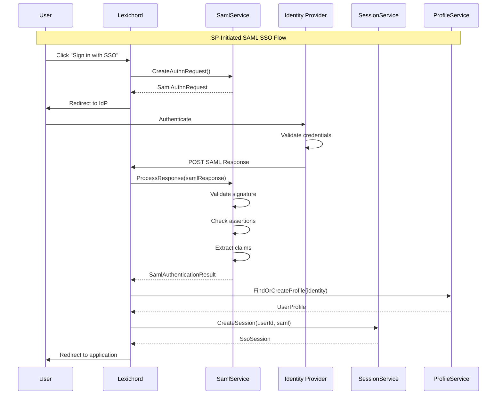
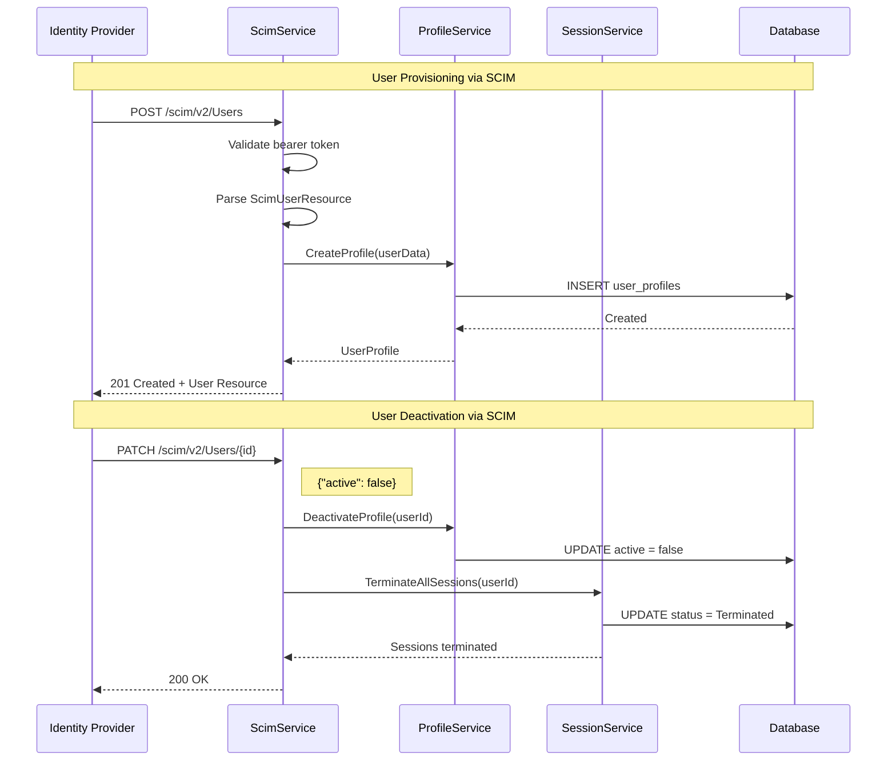

# LCS-SBD-096: Scope Breakdown — The Stage Door (SSO/SAML)

## Document Control

| Field            | Value                                    |
| :--------------- | :--------------------------------------- |
| **Document ID**  | LCS-SBD-096                              |
| **Version**      | v0.9.6                                   |
| **Codename**     | The Stage Door (SSO/SAML)                |
| **Status**       | Draft                                    |
| **Last Updated** | 2026-01-27                               |
| **Owner**        | Lead Architect                           |
| **Depends On**   | v0.9.1 (User Profiles), v0.9.2 (License Engine), v0.0.6a (Secure Vault) |

---

## 1. Executive Summary

### 1.1 The Vision

**v0.9.6** delivers the **Stage Door** — enterprise-grade Single Sign-On (SSO) integration that enables Lexichord to seamlessly authenticate users through corporate identity providers. This release transforms Lexichord from a standalone application with local authentication into an enterprise-ready platform that integrates with Okta, Azure Active Directory, Google Workspace, and other SAML 2.0/OAuth 2.0/OIDC-compliant identity providers.

The Stage Door metaphor reflects how enterprise users enter Lexichord through their organization's centralized authentication gateway — a controlled, secure, and auditable entry point that respects corporate identity governance policies. Just as a stage door provides exclusive, authenticated access for performers and crew, this feature provides enterprise users with streamlined access through their established identity infrastructure.

### 1.2 Business Value

- **Enterprise Adoption:** Removes the #1 blocker for enterprise sales — lack of SSO integration with corporate identity providers.
- **Security Compliance:** Enables compliance with SOC 2, HIPAA, and enterprise security policies requiring centralized identity management.
- **User Experience:** Eliminates password fatigue by allowing users to authenticate with their existing corporate credentials.
- **IT Administration:** Provides automatic user provisioning/deprovisioning via SCIM, reducing IT overhead and security risks from orphaned accounts.
- **Audit Trail:** Centralized session management enables enterprise security teams to monitor, audit, and terminate sessions.
- **Foundation:** Establishes the authentication infrastructure for future enterprise features (Teams collaboration, workspace sharing).

### 1.3 Success Criteria

This release succeeds when:

1. Users can authenticate via SAML 2.0 with SP-initiated and IdP-initiated flows.
2. Users can authenticate via OAuth 2.0/OIDC with authorization code flow and PKCE.
3. SCIM 2.0 endpoints enable automatic user provisioning from identity providers.
4. SSO sessions are properly managed with configurable timeout and Single Logout (SLO).
5. Integration is verified with Okta, Azure AD, and Google Workspace identity providers.
6. All SSO functionality respects license gating (Enterprise tier only).

### 1.4 License Gating

The Stage Door is an **Enterprise** tier feature. Lower tiers will see:

- No SSO configuration options visible in Settings
- "Upgrade to Enterprise" prompt when attempting to access SSO settings
- Standard local authentication remains available for all tiers
- Teams tier will see SSO options as "Coming Soon" with upgrade path

---

## 2. Dependencies on Prior Versions

| Component                | Source Version | Usage in v0.9.6                          |
| :----------------------- | :------------- | :--------------------------------------- |
| `IProfileService`        | v0.9.1a        | Link SSO identity to user profiles       |
| `UserProfile`            | v0.9.1a        | Extended with SSO identity claims        |
| `ISecureVault`           | v0.0.6a        | Store SAML certificates and secrets      |
| `ILicenseContext`        | v0.0.4c        | Gate SSO features to Enterprise tier     |
| `ILicenseStateService`   | v0.9.2c        | Verify active Enterprise license         |
| `ISettingsService`       | v0.1.6a        | Store SSO provider configuration         |
| `IMediator`              | v0.0.7a        | Publish authentication events            |
| `Serilog`                | v0.0.3b        | Log authentication flows and errors      |
| `IConfigurationService`  | v0.0.3d        | Load SSO configuration from appsettings  |
| `Polly`                  | v0.0.5d        | Retry policies for IdP communication     |

---

## 3. Sub-Part Specifications

### 3.1 v0.9.6a: SAML Provider

| Field            | Value                                     |
| :--------------- | :---------------------------------------- |
| **Sub-Part ID**  | COL-096a                                  |
| **Title**        | SAML 2.0 Service Provider                 |
| **Module**       | `Lexichord.Modules.Collaboration`         |
| **License Tier** | Enterprise                                |

**Goal:** Implement a SAML 2.0 Service Provider (SP) that supports both SP-initiated and IdP-initiated authentication flows with enterprise identity providers.

**Key Deliverables:**

- `ISamlService` interface for SAML authentication operations
- `SamlService` implementation with ITfoxtec.Identity.Saml2 integration
- `SamlConfiguration` record for IdP metadata and SP settings
- SP metadata endpoint for IdP registration
- Assertion Consumer Service (ACS) endpoint for SAML responses
- Single Logout Service (SLS) endpoint for logout propagation
- Certificate management for signing and encryption
- SAML assertion validation and claim extraction
- Unit tests for SAML response parsing and validation

**Key Interfaces:**

```csharp
namespace Lexichord.Abstractions.Contracts.Auth;

/// <summary>
/// Service for SAML 2.0 authentication operations.
/// Implements both SP-initiated and IdP-initiated SSO flows.
/// </summary>
public interface ISamlService
{
    /// <summary>
    /// Generates SP metadata XML for IdP registration.
    /// </summary>
    Task<string> GenerateSpMetadataAsync(CancellationToken ct = default);

    /// <summary>
    /// Creates a SAML authentication request (SP-initiated flow).
    /// </summary>
    Task<SamlAuthnRequest> CreateAuthnRequestAsync(
        string returnUrl,
        CancellationToken ct = default);

    /// <summary>
    /// Processes a SAML response from the IdP.
    /// </summary>
    Task<SamlAuthenticationResult> ProcessResponseAsync(
        string samlResponse,
        string? relayState = null,
        CancellationToken ct = default);

    /// <summary>
    /// Creates a SAML logout request.
    /// </summary>
    Task<SamlLogoutRequest> CreateLogoutRequestAsync(
        string sessionIndex,
        string nameId,
        CancellationToken ct = default);

    /// <summary>
    /// Processes a SAML logout response.
    /// </summary>
    Task<SamlLogoutResult> ProcessLogoutResponseAsync(
        string samlResponse,
        CancellationToken ct = default);
}

/// <summary>
/// SAML authentication request for SP-initiated flow.
/// </summary>
public record SamlAuthnRequest(
    string RequestId,
    string IdpUrl,
    string SamlRequest,
    string? RelayState,
    DateTime CreatedAt,
    DateTime ExpiresAt
);

/// <summary>
/// Result of processing a SAML response.
/// </summary>
public record SamlAuthenticationResult(
    bool IsSuccess,
    SamlIdentity? Identity,
    string? SessionIndex,
    SamlAuthError? Error
);

/// <summary>
/// Identity information extracted from SAML assertion.
/// </summary>
public record SamlIdentity(
    string NameId,
    string NameIdFormat,
    string? Email,
    string? DisplayName,
    string? FirstName,
    string? LastName,
    IReadOnlyList<string> Groups,
    IReadOnlyDictionary<string, string> Attributes
);

/// <summary>
/// SAML authentication error information.
/// </summary>
public record SamlAuthError(
    SamlErrorCode Code,
    string Message,
    string? StatusCode,
    string? StatusMessage
);

public enum SamlErrorCode
{
    InvalidResponse,
    SignatureValidationFailed,
    AssertionExpired,
    AudienceRestrictionFailed,
    MissingRequiredAttribute,
    ConfigurationError,
    NetworkError
}
```

**SAML Configuration:**

```csharp
namespace Lexichord.Abstractions.Configuration;

/// <summary>
/// Configuration for SAML 2.0 Service Provider.
/// </summary>
public record SamlConfiguration
{
    /// <summary>
    /// Service Provider entity ID (unique identifier).
    /// </summary>
    public required string EntityId { get; init; }

    /// <summary>
    /// Assertion Consumer Service URL (where IdP sends responses).
    /// </summary>
    public required string AcsUrl { get; init; }

    /// <summary>
    /// Single Logout Service URL.
    /// </summary>
    public required string SloUrl { get; init; }

    /// <summary>
    /// SP metadata URL for IdP registration.
    /// </summary>
    public required string MetadataUrl { get; init; }

    /// <summary>
    /// IdP metadata URL or inline XML.
    /// </summary>
    public required string IdpMetadata { get; init; }

    /// <summary>
    /// Whether to validate IdP certificate.
    /// </summary>
    public bool ValidateIdpCertificate { get; init; } = true;

    /// <summary>
    /// Whether to sign authentication requests.
    /// </summary>
    public bool SignAuthnRequests { get; init; } = true;

    /// <summary>
    /// Whether to require signed assertions.
    /// </summary>
    public bool RequireSignedAssertions { get; init; } = true;

    /// <summary>
    /// Whether to require encrypted assertions.
    /// </summary>
    public bool RequireEncryptedAssertions { get; init; } = false;

    /// <summary>
    /// Allowed clock skew for assertion validation.
    /// </summary>
    public TimeSpan ClockSkew { get; init; } = TimeSpan.FromMinutes(5);

    /// <summary>
    /// Attribute mappings from SAML attributes to user properties.
    /// </summary>
    public SamlAttributeMappings AttributeMappings { get; init; } = new();
}

/// <summary>
/// Mappings from SAML attribute names to user properties.
/// </summary>
public record SamlAttributeMappings
{
    public string Email { get; init; } =
        "http://schemas.xmlsoap.org/ws/2005/05/identity/claims/emailaddress";
    public string DisplayName { get; init; } =
        "http://schemas.xmlsoap.org/ws/2005/05/identity/claims/name";
    public string FirstName { get; init; } =
        "http://schemas.xmlsoap.org/ws/2005/05/identity/claims/givenname";
    public string LastName { get; init; } =
        "http://schemas.xmlsoap.org/ws/2005/05/identity/claims/surname";
    public string Groups { get; init; } =
        "http://schemas.microsoft.com/ws/2008/06/identity/claims/groups";
}
```

**SP-Initiated Authentication Flow:**

```text
START: User clicks "Sign in with SSO"
│
├── 1. Generate SAML AuthnRequest
│   ├── Create unique RequestId
│   ├── Set SP EntityId, ACS URL
│   ├── Sign request with SP certificate
│   └── Base64 encode and deflate
│
├── 2. Redirect to IdP
│   ├── Build IdP SSO URL
│   ├── Append SAMLRequest parameter
│   └── Include RelayState (return URL)
│
├── 3. User authenticates at IdP
│   └── (External: IdP handles authentication)
│
├── 4. IdP POSTs SAML Response to ACS URL
│   ├── Receive SAMLResponse parameter
│   └── Receive RelayState parameter
│
├── 5. Validate SAML Response
│   ├── Verify XML signature
│   ├── Check assertion conditions
│   ├── Validate audience restriction
│   ├── Check NotBefore/NotOnOrAfter
│   └── Verify issuer matches IdP
│
├── 6. Extract Identity Claims
│   ├── Parse NameID element
│   ├── Extract mapped attributes
│   └── Build SamlIdentity record
│
├── 7. Create/Update User Profile
│   ├── Find existing profile by email
│   ├── Create new if not found
│   └── Update SSO metadata
│
└── 8. Establish Local Session
    ├── Create session token
    ├── Store SessionIndex for SLO
    └── Redirect to RelayState URL
```

**IdP-Initiated Authentication Flow:**

```text
START: User signs in via IdP application portal
│
├── 1. IdP sends unsolicited SAML Response
│   └── POST to ACS URL without prior AuthnRequest
│
├── 2. Validate SAML Response
│   ├── (Same validation as SP-initiated)
│   └── Note: No InResponseTo to validate
│
└── 3-8. (Same as SP-initiated steps 6-8)
```

**Dependencies:**

- v0.9.1a: `IProfileService` (link SSO identity to profiles)
- v0.0.6a: `ISecureVault` (store SAML certificates)
- v0.0.4c: `ILicenseContext` (Enterprise tier verification)

---

### 3.2 v0.9.6b: OAuth2/OIDC Provider

| Field            | Value                                     |
| :--------------- | :---------------------------------------- |
| **Sub-Part ID**  | COL-096b                                  |
| **Title**        | OAuth 2.0 / OpenID Connect Client         |
| **Module**       | `Lexichord.Modules.Collaboration`         |
| **License Tier** | Enterprise                                |

**Goal:** Implement an OAuth 2.0 / OpenID Connect client that provides an alternative to SAML for organizations preferring OIDC-based authentication.

**Key Deliverables:**

- `IOidcService` interface for OIDC authentication operations
- `OidcService` implementation with Microsoft.IdentityModel integration
- Authorization code flow with PKCE implementation
- Token validation and refresh logic
- UserInfo endpoint integration
- Discovery document (.well-known/openid-configuration) parsing
- JWT ID token validation
- Unit tests for token validation and claims extraction

**Key Interfaces:**

```csharp
namespace Lexichord.Abstractions.Contracts.Auth;

/// <summary>
/// Service for OAuth 2.0 / OpenID Connect authentication.
/// Implements authorization code flow with PKCE.
/// </summary>
public interface IOidcService
{
    /// <summary>
    /// Creates an authorization URL for the OIDC flow.
    /// </summary>
    Task<OidcAuthorizationRequest> CreateAuthorizationRequestAsync(
        string returnUrl,
        string? loginHint = null,
        CancellationToken ct = default);

    /// <summary>
    /// Exchanges an authorization code for tokens.
    /// </summary>
    Task<OidcTokenResult> ExchangeCodeAsync(
        string code,
        string codeVerifier,
        string redirectUri,
        CancellationToken ct = default);

    /// <summary>
    /// Validates an ID token and extracts claims.
    /// </summary>
    Task<OidcIdentity> ValidateIdTokenAsync(
        string idToken,
        CancellationToken ct = default);

    /// <summary>
    /// Retrieves user information from the UserInfo endpoint.
    /// </summary>
    Task<OidcUserInfo> GetUserInfoAsync(
        string accessToken,
        CancellationToken ct = default);

    /// <summary>
    /// Refreshes tokens using a refresh token.
    /// </summary>
    Task<OidcTokenResult> RefreshTokensAsync(
        string refreshToken,
        CancellationToken ct = default);

    /// <summary>
    /// Revokes tokens at the IdP.
    /// </summary>
    Task<bool> RevokeTokensAsync(
        string token,
        TokenTypeHint tokenType = TokenTypeHint.AccessToken,
        CancellationToken ct = default);

    /// <summary>
    /// Gets the OIDC logout URL for the IdP.
    /// </summary>
    Task<string> GetLogoutUrlAsync(
        string? idTokenHint = null,
        string? postLogoutRedirectUri = null,
        CancellationToken ct = default);
}

/// <summary>
/// Authorization request for OIDC flow.
/// </summary>
public record OidcAuthorizationRequest(
    string AuthorizationUrl,
    string State,
    string CodeVerifier,
    string CodeChallenge,
    string Nonce,
    DateTime ExpiresAt
);

/// <summary>
/// Token response from OIDC token endpoint.
/// </summary>
public record OidcTokenResult(
    bool IsSuccess,
    string? AccessToken,
    string? IdToken,
    string? RefreshToken,
    int ExpiresIn,
    string? TokenType,
    string? Scope,
    OidcError? Error
);

/// <summary>
/// Identity information extracted from ID token.
/// </summary>
public record OidcIdentity(
    string Subject,
    string? Email,
    bool EmailVerified,
    string? Name,
    string? GivenName,
    string? FamilyName,
    string? Picture,
    string? Locale,
    IReadOnlyList<string> Groups,
    IReadOnlyDictionary<string, object> Claims
);

/// <summary>
/// User information from UserInfo endpoint.
/// </summary>
public record OidcUserInfo(
    string Subject,
    string? Email,
    bool? EmailVerified,
    string? Name,
    string? PreferredUsername,
    string? GivenName,
    string? FamilyName,
    string? Nickname,
    string? Picture,
    string? Profile,
    string? Website,
    string? Gender,
    string? Birthdate,
    string? ZoneInfo,
    string? Locale,
    DateTimeOffset? UpdatedAt,
    IReadOnlyDictionary<string, object> AdditionalClaims
);

/// <summary>
/// OIDC error information.
/// </summary>
public record OidcError(
    OidcErrorCode Code,
    string Message,
    string? ErrorDescription,
    string? ErrorUri
);

public enum OidcErrorCode
{
    InvalidRequest,
    UnauthorizedClient,
    AccessDenied,
    UnsupportedResponseType,
    InvalidScope,
    ServerError,
    TemporarilyUnavailable,
    InvalidGrant,
    InvalidToken,
    InsufficientScope,
    TokenValidationFailed,
    ConfigurationError,
    NetworkError
}

public enum TokenTypeHint
{
    AccessToken,
    RefreshToken
}
```

**OIDC Configuration:**

```csharp
namespace Lexichord.Abstractions.Configuration;

/// <summary>
/// Configuration for OAuth 2.0 / OpenID Connect client.
/// </summary>
public record OidcConfiguration
{
    /// <summary>
    /// OIDC authority (issuer) URL.
    /// </summary>
    public required string Authority { get; init; }

    /// <summary>
    /// OAuth 2.0 client identifier.
    /// </summary>
    public required string ClientId { get; init; }

    /// <summary>
    /// OAuth 2.0 client secret (for confidential clients).
    /// </summary>
    public string? ClientSecret { get; init; }

    /// <summary>
    /// Redirect URI for authorization response.
    /// </summary>
    public required string RedirectUri { get; init; }

    /// <summary>
    /// Post-logout redirect URI.
    /// </summary>
    public string? PostLogoutRedirectUri { get; init; }

    /// <summary>
    /// OAuth 2.0 scopes to request.
    /// </summary>
    public IReadOnlyList<string> Scopes { get; init; } =
        ["openid", "profile", "email", "offline_access"];

    /// <summary>
    /// Response type (code for authorization code flow).
    /// </summary>
    public string ResponseType { get; init; } = "code";

    /// <summary>
    /// Response mode (form_post or query).
    /// </summary>
    public string ResponseMode { get; init; } = "form_post";

    /// <summary>
    /// Whether to use PKCE (required for public clients).
    /// </summary>
    public bool UsePkce { get; init; } = true;

    /// <summary>
    /// Whether to validate token issuer.
    /// </summary>
    public bool ValidateIssuer { get; init; } = true;

    /// <summary>
    /// Whether to validate token audience.
    /// </summary>
    public bool ValidateAudience { get; init; } = true;

    /// <summary>
    /// Whether to validate token lifetime.
    /// </summary>
    public bool ValidateLifetime { get; init; } = true;

    /// <summary>
    /// Clock skew tolerance for token validation.
    /// </summary>
    public TimeSpan ClockSkew { get; init; } = TimeSpan.FromMinutes(5);

    /// <summary>
    /// Additional parameters for authorization request.
    /// </summary>
    public IReadOnlyDictionary<string, string>? AdditionalParameters { get; init; }
}
```

**Authorization Code Flow with PKCE:**

```text
START: User clicks "Sign in with SSO" (OIDC mode)
│
├── 1. Generate Authorization Request
│   ├── Generate cryptographic state
│   ├── Generate code_verifier (random 43-128 chars)
│   ├── Create code_challenge = SHA256(code_verifier)
│   ├── Generate nonce
│   └── Build authorization URL
│
├── 2. Redirect to Authorization Endpoint
│   ├── response_type=code
│   ├── client_id, redirect_uri, scope
│   ├── state, nonce
│   ├── code_challenge, code_challenge_method=S256
│   └── Optional: login_hint, prompt
│
├── 3. User authenticates at IdP
│   └── (External: IdP handles authentication)
│
├── 4. IdP redirects to Redirect URI
│   ├── Receive authorization code
│   └── Receive state parameter
│
├── 5. Validate State
│   └── Compare to stored state value
│
├── 6. Exchange Code for Tokens
│   ├── POST to token endpoint
│   ├── Include code, code_verifier
│   ├── Include client_id, redirect_uri
│   └── Receive access_token, id_token, refresh_token
│
├── 7. Validate ID Token
│   ├── Verify JWT signature using IdP's JWK
│   ├── Validate iss, aud, exp, iat claims
│   ├── Validate nonce claim
│   └── Extract identity claims
│
├── 8. Optionally Fetch UserInfo
│   ├── Call UserInfo endpoint with access_token
│   └── Merge additional claims
│
├── 9. Create/Update User Profile
│   ├── Find existing profile by email/subject
│   ├── Create new if not found
│   └── Store refresh_token securely
│
└── 10. Establish Local Session
    ├── Create session token
    ├── Schedule token refresh
    └── Redirect to original URL
```

**Dependencies:**

- v0.9.1a: `IProfileService` (link OIDC identity to profiles)
- v0.0.6a: `ISecureVault` (store client secrets and refresh tokens)
- v0.0.5d: `Polly` (retry policies for token endpoints)

---

### 3.3 v0.9.6c: User Provisioning (SCIM)

| Field            | Value                                     |
| :--------------- | :---------------------------------------- |
| **Sub-Part ID**  | COL-096c                                  |
| **Title**        | SCIM 2.0 User Provisioning                |
| **Module**       | `Lexichord.Modules.Collaboration`         |
| **License Tier** | Enterprise                                |

**Goal:** Implement SCIM 2.0 (System for Cross-domain Identity Management) endpoints to enable automatic user provisioning and deprovisioning from identity providers.

**Key Deliverables:**

- `IScimService` interface for SCIM operations
- `ScimService` implementation following RFC 7644
- SCIM `/Users` resource endpoints (CRUD operations)
- SCIM `/Groups` resource endpoints (optional, for role sync)
- Bearer token authentication for SCIM endpoints
- SCIM filtering and pagination support
- Bulk operations endpoint
- SCIM schema discovery endpoints
- Unit tests for SCIM request/response handling

**Key Interfaces:**

```csharp
namespace Lexichord.Abstractions.Contracts.Auth;

/// <summary>
/// Service for SCIM 2.0 user provisioning operations.
/// Implements RFC 7644 (SCIM Protocol) and RFC 7643 (SCIM Core Schema).
/// </summary>
public interface IScimService
{
    // User Resource Operations

    /// <summary>
    /// Creates a new user via SCIM.
    /// </summary>
    Task<ScimUserResource> CreateUserAsync(
        ScimUserResource user,
        CancellationToken ct = default);

    /// <summary>
    /// Retrieves a user by SCIM ID.
    /// </summary>
    Task<ScimUserResource?> GetUserAsync(
        string id,
        CancellationToken ct = default);

    /// <summary>
    /// Updates a user via SCIM (PUT - full replacement).
    /// </summary>
    Task<ScimUserResource> UpdateUserAsync(
        string id,
        ScimUserResource user,
        CancellationToken ct = default);

    /// <summary>
    /// Patches a user via SCIM (PATCH - partial update).
    /// </summary>
    Task<ScimUserResource> PatchUserAsync(
        string id,
        ScimPatchRequest patch,
        CancellationToken ct = default);

    /// <summary>
    /// Deletes (deactivates) a user via SCIM.
    /// </summary>
    Task DeleteUserAsync(
        string id,
        CancellationToken ct = default);

    /// <summary>
    /// Lists users with optional filtering.
    /// </summary>
    Task<ScimListResponse<ScimUserResource>> ListUsersAsync(
        ScimListRequest request,
        CancellationToken ct = default);

    // Group Resource Operations

    /// <summary>
    /// Creates a new group via SCIM.
    /// </summary>
    Task<ScimGroupResource> CreateGroupAsync(
        ScimGroupResource group,
        CancellationToken ct = default);

    /// <summary>
    /// Retrieves a group by SCIM ID.
    /// </summary>
    Task<ScimGroupResource?> GetGroupAsync(
        string id,
        CancellationToken ct = default);

    /// <summary>
    /// Updates a group via SCIM.
    /// </summary>
    Task<ScimGroupResource> UpdateGroupAsync(
        string id,
        ScimGroupResource group,
        CancellationToken ct = default);

    /// <summary>
    /// Patches a group via SCIM.
    /// </summary>
    Task<ScimGroupResource> PatchGroupAsync(
        string id,
        ScimPatchRequest patch,
        CancellationToken ct = default);

    /// <summary>
    /// Deletes a group via SCIM.
    /// </summary>
    Task DeleteGroupAsync(
        string id,
        CancellationToken ct = default);

    /// <summary>
    /// Lists groups with optional filtering.
    /// </summary>
    Task<ScimListResponse<ScimGroupResource>> ListGroupsAsync(
        ScimListRequest request,
        CancellationToken ct = default);

    // Bulk Operations

    /// <summary>
    /// Processes bulk SCIM operations.
    /// </summary>
    Task<ScimBulkResponse> ProcessBulkAsync(
        ScimBulkRequest request,
        CancellationToken ct = default);

    // Schema Discovery

    /// <summary>
    /// Returns SCIM service provider configuration.
    /// </summary>
    Task<ScimServiceProviderConfig> GetServiceProviderConfigAsync(
        CancellationToken ct = default);

    /// <summary>
    /// Returns supported SCIM schemas.
    /// </summary>
    Task<IReadOnlyList<ScimSchema>> GetSchemasAsync(
        CancellationToken ct = default);

    /// <summary>
    /// Returns supported SCIM resource types.
    /// </summary>
    Task<IReadOnlyList<ScimResourceType>> GetResourceTypesAsync(
        CancellationToken ct = default);
}

/// <summary>
/// SCIM User resource following RFC 7643.
/// </summary>
public record ScimUserResource
{
    public IReadOnlyList<string> Schemas { get; init; } =
        ["urn:ietf:params:scim:schemas:core:2.0:User"];
    public string? Id { get; init; }
    public string? ExternalId { get; init; }
    public required string UserName { get; init; }
    public ScimName? Name { get; init; }
    public string? DisplayName { get; init; }
    public string? NickName { get; init; }
    public string? ProfileUrl { get; init; }
    public string? Title { get; init; }
    public string? UserType { get; init; }
    public string? PreferredLanguage { get; init; }
    public string? Locale { get; init; }
    public string? Timezone { get; init; }
    public bool Active { get; init; } = true;
    public IReadOnlyList<ScimEmail>? Emails { get; init; }
    public IReadOnlyList<ScimPhoneNumber>? PhoneNumbers { get; init; }
    public IReadOnlyList<ScimGroupMembership>? Groups { get; init; }
    public IReadOnlyList<string>? Roles { get; init; }
    public ScimMeta? Meta { get; init; }
}

/// <summary>
/// SCIM Name sub-attribute.
/// </summary>
public record ScimName(
    string? Formatted,
    string? FamilyName,
    string? GivenName,
    string? MiddleName,
    string? HonorificPrefix,
    string? HonorificSuffix
);

/// <summary>
/// SCIM Email sub-attribute.
/// </summary>
public record ScimEmail(
    string Value,
    string? Type,
    bool Primary = false
);

/// <summary>
/// SCIM PhoneNumber sub-attribute.
/// </summary>
public record ScimPhoneNumber(
    string Value,
    string? Type,
    bool Primary = false
);

/// <summary>
/// SCIM Group membership sub-attribute.
/// </summary>
public record ScimGroupMembership(
    string Value,
    string? Display,
    string? Ref
);

/// <summary>
/// SCIM Meta sub-attribute.
/// </summary>
public record ScimMeta(
    string ResourceType,
    DateTime Created,
    DateTime LastModified,
    string? Location,
    string? Version
);

/// <summary>
/// SCIM Group resource.
/// </summary>
public record ScimGroupResource
{
    public IReadOnlyList<string> Schemas { get; init; } =
        ["urn:ietf:params:scim:schemas:core:2.0:Group"];
    public string? Id { get; init; }
    public string? ExternalId { get; init; }
    public required string DisplayName { get; init; }
    public IReadOnlyList<ScimMember>? Members { get; init; }
    public ScimMeta? Meta { get; init; }
}

/// <summary>
/// SCIM Group member sub-attribute.
/// </summary>
public record ScimMember(
    string Value,
    string? Display,
    string? Type,
    string? Ref
);

/// <summary>
/// SCIM PATCH operation request.
/// </summary>
public record ScimPatchRequest(
    IReadOnlyList<string> Schemas,
    IReadOnlyList<ScimPatchOperation> Operations
);

/// <summary>
/// SCIM PATCH operation.
/// </summary>
public record ScimPatchOperation(
    ScimPatchOp Op,
    string? Path,
    object? Value
);

public enum ScimPatchOp
{
    Add,
    Remove,
    Replace
}

/// <summary>
/// SCIM list request parameters.
/// </summary>
public record ScimListRequest(
    string? Filter = null,
    string? SortBy = null,
    ScimSortOrder SortOrder = ScimSortOrder.Ascending,
    int StartIndex = 1,
    int Count = 100,
    string? Attributes = null,
    string? ExcludedAttributes = null
);

public enum ScimSortOrder { Ascending, Descending }

/// <summary>
/// SCIM list response.
/// </summary>
public record ScimListResponse<T>(
    IReadOnlyList<string> Schemas,
    int TotalResults,
    int StartIndex,
    int ItemsPerPage,
    IReadOnlyList<T> Resources
);

/// <summary>
/// SCIM bulk request.
/// </summary>
public record ScimBulkRequest(
    IReadOnlyList<string> Schemas,
    IReadOnlyList<ScimBulkOperation> Operations,
    int? FailOnErrors = null
);

/// <summary>
/// SCIM bulk operation.
/// </summary>
public record ScimBulkOperation(
    string Method,
    string? BulkId,
    string Path,
    object? Data
);

/// <summary>
/// SCIM bulk response.
/// </summary>
public record ScimBulkResponse(
    IReadOnlyList<string> Schemas,
    IReadOnlyList<ScimBulkOperationResponse> Operations
);

/// <summary>
/// SCIM bulk operation response.
/// </summary>
public record ScimBulkOperationResponse(
    string Method,
    string? BulkId,
    string? Location,
    ScimBulkStatus Status,
    object? Response
);

/// <summary>
/// SCIM bulk operation status.
/// </summary>
public record ScimBulkStatus(
    int Code,
    string? Description
);
```

**SCIM Provisioning Flow:**

```text
IdP PROVISIONING EVENT
│
├── Create User
│   ├── IdP sends POST /scim/v2/Users
│   ├── Parse ScimUserResource from JSON
│   ├── Validate required attributes (userName, emails)
│   ├── Check for existing user (by externalId or email)
│   ├── If exists: return 409 Conflict
│   ├── Create new UserProfile with SSO metadata
│   ├── Return 201 Created with user resource
│   └── Publish UserProvisionedEvent
│
├── Update User
│   ├── IdP sends PUT/PATCH /scim/v2/Users/{id}
│   ├── Validate user exists
│   ├── Apply updates to UserProfile
│   ├── Return 200 OK with updated resource
│   └── Publish UserUpdatedEvent
│
├── Deactivate User
│   ├── IdP sends PATCH with active=false
│   ├── Mark UserProfile as inactive
│   ├── Terminate all active sessions
│   ├── Return 200 OK
│   └── Publish UserDeactivatedEvent
│
├── Delete User
│   ├── IdP sends DELETE /scim/v2/Users/{id}
│   ├── Soft-delete UserProfile (retain for audit)
│   ├── Terminate all active sessions
│   ├── Return 204 No Content
│   └── Publish UserDeprovisionedEvent
│
└── Sync Groups
    ├── IdP sends group membership updates
    ├── Map SCIM groups to Lexichord roles
    └── Update user role assignments
```

**SCIM Filter Support:**

```text
SUPPORTED SCIM FILTERS:
├── Equality: userName eq "john@example.com"
├── Contains: displayName co "John"
├── Starts with: userName sw "john"
├── Present: email pr
├── And: active eq true and userName sw "j"
├── Or: userName eq "john" or userName eq "jane"
└── Not: not (active eq false)

SUPPORTED FILTER ATTRIBUTES:
├── id
├── externalId
├── userName
├── name.familyName
├── name.givenName
├── displayName
├── emails.value
├── active
└── meta.lastModified
```

**Dependencies:**

- v0.9.1a: `IProfileService` (create/update user profiles)
- v0.9.6d: `ISsoSessionService` (terminate sessions on deactivation)

---

### 3.4 v0.9.6d: Session Management

| Field            | Value                                     |
| :--------------- | :---------------------------------------- |
| **Sub-Part ID**  | COL-096d                                  |
| **Title**        | SSO Session Management                    |
| **Module**       | `Lexichord.Modules.Collaboration`         |
| **License Tier** | Enterprise                                |

**Goal:** Implement comprehensive SSO session management including session lifecycle, Single Logout (SLO), session monitoring, and administrative session controls.

**Key Deliverables:**

- `ISsoSessionService` interface for session operations
- `SsoSessionService` implementation with session store
- Session timeout and refresh logic
- Single Logout (SLO) implementation for both SAML and OIDC
- Session activity tracking and audit logging
- Administrative session termination API
- Session listing and monitoring endpoints
- Database migration for session storage
- Unit tests for session lifecycle

**Key Interfaces:**

```csharp
namespace Lexichord.Abstractions.Contracts.Auth;

/// <summary>
/// Service for SSO session management.
/// Handles session lifecycle, monitoring, and Single Logout.
/// </summary>
public interface ISsoSessionService
{
    // Session Lifecycle

    /// <summary>
    /// Creates a new SSO session after successful authentication.
    /// </summary>
    Task<SsoSession> CreateSessionAsync(
        CreateSessionRequest request,
        CancellationToken ct = default);

    /// <summary>
    /// Retrieves a session by session ID.
    /// </summary>
    Task<SsoSession?> GetSessionAsync(
        string sessionId,
        CancellationToken ct = default);

    /// <summary>
    /// Validates a session and refreshes its last activity time.
    /// </summary>
    Task<SessionValidationResult> ValidateSessionAsync(
        string sessionId,
        CancellationToken ct = default);

    /// <summary>
    /// Updates session activity timestamp.
    /// </summary>
    Task TouchSessionAsync(
        string sessionId,
        CancellationToken ct = default);

    /// <summary>
    /// Terminates a session (local logout).
    /// </summary>
    Task TerminateSessionAsync(
        string sessionId,
        SessionTerminationReason reason,
        CancellationToken ct = default);

    /// <summary>
    /// Terminates all sessions for a user.
    /// </summary>
    Task TerminateAllUserSessionsAsync(
        Guid userId,
        SessionTerminationReason reason,
        CancellationToken ct = default);

    // Single Logout (SLO)

    /// <summary>
    /// Initiates Single Logout (SP-initiated SLO).
    /// </summary>
    Task<SloInitiationResult> InitiateSingleLogoutAsync(
        string sessionId,
        CancellationToken ct = default);

    /// <summary>
    /// Processes Single Logout request from IdP (IdP-initiated SLO).
    /// </summary>
    Task<SloProcessingResult> ProcessSingleLogoutAsync(
        SloRequest request,
        CancellationToken ct = default);

    // Session Monitoring

    /// <summary>
    /// Lists active sessions for a user.
    /// </summary>
    Task<IReadOnlyList<SsoSession>> ListUserSessionsAsync(
        Guid userId,
        CancellationToken ct = default);

    /// <summary>
    /// Lists all active sessions (admin only).
    /// </summary>
    Task<PagedResult<SsoSession>> ListAllSessionsAsync(
        SessionListRequest request,
        CancellationToken ct = default);

    /// <summary>
    /// Gets session statistics.
    /// </summary>
    Task<SessionStatistics> GetSessionStatisticsAsync(
        CancellationToken ct = default);

    // Session Cleanup

    /// <summary>
    /// Cleans up expired sessions (called by background service).
    /// </summary>
    Task<int> CleanupExpiredSessionsAsync(
        CancellationToken ct = default);
}

/// <summary>
/// Request to create a new SSO session.
/// </summary>
public record CreateSessionRequest(
    Guid UserId,
    SsoProvider Provider,
    string? SessionIndex,
    string? NameId,
    string? AccessToken,
    string? RefreshToken,
    DateTime? TokenExpiry,
    string? IpAddress,
    string? UserAgent,
    IReadOnlyDictionary<string, string>? Metadata
);

/// <summary>
/// SSO session information.
/// </summary>
public record SsoSession(
    string SessionId,
    Guid UserId,
    SsoProvider Provider,
    string? SessionIndex,
    string? NameId,
    DateTime CreatedAt,
    DateTime LastActivityAt,
    DateTime ExpiresAt,
    SessionStatus Status,
    string? IpAddress,
    string? UserAgent,
    string? DeviceInfo,
    IReadOnlyDictionary<string, string>? Metadata
);

/// <summary>
/// SSO provider type.
/// </summary>
public enum SsoProvider
{
    Saml,
    Oidc,
    Local
}

/// <summary>
/// Session status.
/// </summary>
public enum SessionStatus
{
    Active,
    Expired,
    Terminated,
    LoggedOut
}

/// <summary>
/// Result of session validation.
/// </summary>
public record SessionValidationResult(
    bool IsValid,
    SsoSession? Session,
    SessionInvalidReason? InvalidReason
);

/// <summary>
/// Reason for session invalidity.
/// </summary>
public enum SessionInvalidReason
{
    NotFound,
    Expired,
    Terminated,
    UserDeactivated,
    TokenExpired
}

/// <summary>
/// Reason for session termination.
/// </summary>
public enum SessionTerminationReason
{
    UserLogout,
    AdminTermination,
    IdpLogout,
    SessionTimeout,
    SecurityPolicy,
    UserDeactivated,
    LicenseExpired
}

/// <summary>
/// Result of Single Logout initiation.
/// </summary>
public record SloInitiationResult(
    bool Success,
    string? LogoutUrl,
    string? LogoutRequest,
    SloError? Error
);

/// <summary>
/// Single Logout request from IdP.
/// </summary>
public record SloRequest(
    SsoProvider Provider,
    string? SessionIndex,
    string? NameId,
    string? RawRequest
);

/// <summary>
/// Result of processing Single Logout.
/// </summary>
public record SloProcessingResult(
    bool Success,
    int SessionsTerminated,
    string? ResponseUrl,
    string? LogoutResponse,
    SloError? Error
);

/// <summary>
/// Single Logout error.
/// </summary>
public record SloError(
    SloErrorCode Code,
    string Message
);

public enum SloErrorCode
{
    SessionNotFound,
    InvalidRequest,
    ProviderError,
    PartialLogout
}

/// <summary>
/// Request for listing sessions.
/// </summary>
public record SessionListRequest(
    Guid? UserId = null,
    SsoProvider? Provider = null,
    SessionStatus? Status = null,
    DateTime? CreatedAfter = null,
    DateTime? CreatedBefore = null,
    int PageNumber = 1,
    int PageSize = 50,
    string? SortBy = "CreatedAt",
    bool SortDescending = true
);

/// <summary>
/// Session statistics.
/// </summary>
public record SessionStatistics(
    int TotalActiveSessions,
    int SamlSessions,
    int OidcSessions,
    int LocalSessions,
    int SessionsCreatedToday,
    int SessionsTerminatedToday,
    Dictionary<string, int> SessionsByProvider,
    Dictionary<string, int> SessionsByHour
);

/// <summary>
/// Paged result container.
/// </summary>
public record PagedResult<T>(
    IReadOnlyList<T> Items,
    int TotalCount,
    int PageNumber,
    int PageSize,
    int TotalPages
);
```

**Session Storage Schema:**

```csharp
/// <summary>
/// Database entity for SSO sessions.
/// </summary>
public class SsoSessionEntity
{
    public required string SessionId { get; set; }
    public required Guid UserId { get; set; }
    public required SsoProvider Provider { get; set; }
    public string? SessionIndex { get; set; }
    public string? NameId { get; set; }
    public string? AccessToken { get; set; }  // Encrypted
    public string? RefreshToken { get; set; } // Encrypted
    public DateTime? TokenExpiry { get; set; }
    public required DateTime CreatedAt { get; set; }
    public required DateTime LastActivityAt { get; set; }
    public required DateTime ExpiresAt { get; set; }
    public required SessionStatus Status { get; set; }
    public string? IpAddress { get; set; }
    public string? UserAgent { get; set; }
    public string? DeviceInfo { get; set; }
    public string? MetadataJson { get; set; }
    public SessionTerminationReason? TerminationReason { get; set; }
    public DateTime? TerminatedAt { get; set; }
}
```

**Session Configuration:**

```csharp
namespace Lexichord.Abstractions.Configuration;

/// <summary>
/// Configuration for SSO session management.
/// </summary>
public record SsoSessionConfiguration
{
    /// <summary>
    /// Session idle timeout (default: 30 minutes).
    /// </summary>
    public TimeSpan IdleTimeout { get; init; } = TimeSpan.FromMinutes(30);

    /// <summary>
    /// Absolute session timeout (default: 8 hours).
    /// </summary>
    public TimeSpan AbsoluteTimeout { get; init; } = TimeSpan.FromHours(8);

    /// <summary>
    /// Whether to enable sliding expiration.
    /// </summary>
    public bool SlidingExpiration { get; init; } = true;

    /// <summary>
    /// Maximum concurrent sessions per user (0 = unlimited).
    /// </summary>
    public int MaxConcurrentSessions { get; init; } = 5;

    /// <summary>
    /// Action when max sessions exceeded.
    /// </summary>
    public MaxSessionsAction MaxSessionsAction { get; init; } =
        MaxSessionsAction.TerminateOldest;

    /// <summary>
    /// Session cleanup interval.
    /// </summary>
    public TimeSpan CleanupInterval { get; init; } = TimeSpan.FromMinutes(15);

    /// <summary>
    /// Whether to track session activity.
    /// </summary>
    public bool TrackActivity { get; init; } = true;

    /// <summary>
    /// Activity tracking throttle (minimum time between updates).
    /// </summary>
    public TimeSpan ActivityThrottle { get; init; } = TimeSpan.FromMinutes(1);

    /// <summary>
    /// Whether to log session events for audit.
    /// </summary>
    public bool AuditLogging { get; init; } = true;
}

public enum MaxSessionsAction
{
    DenyNew,
    TerminateOldest,
    TerminateAll
}
```

**Session Lifecycle Flow:**

```text
SESSION CREATION
│
├── User authenticates via SSO (SAML/OIDC)
├── Generate unique SessionId (GUID)
├── Store session in database
├── Set CreatedAt, LastActivityAt, ExpiresAt
├── Encrypt and store tokens if applicable
├── Publish SessionCreatedEvent
└── Return session token to client

SESSION VALIDATION (on each request)
│
├── Receive session token
├── Lookup session by SessionId
├── Check session exists → 401 if not
├── Check Status = Active → 401 if terminated
├── Check ExpiresAt > now → 401 if expired
├── If SlidingExpiration:
│   └── Update ExpiresAt
├── Update LastActivityAt (throttled)
└── Allow request to proceed

SESSION TERMINATION
│
├── User clicks Logout
├── Mark session Status = LoggedOut
├── Set TerminatedAt, TerminationReason
├── If SSO session:
│   └── Initiate Single Logout
├── Publish SessionTerminatedEvent
└── Clear client session token

SINGLE LOGOUT (SP-initiated)
│
├── User logs out of Lexichord
├── Build SLO request for IdP
├── Redirect to IdP SLO endpoint
├── IdP terminates session
├── IdP responds/redirects back
└── Confirm logout complete

SINGLE LOGOUT (IdP-initiated)
│
├── IdP sends SLO request
├── Find session by SessionIndex/NameId
├── Terminate matching sessions
├── Build SLO response
└── Return to IdP

SESSION CLEANUP (background)
│
├── Run every CleanupInterval
├── Find sessions where ExpiresAt < now
├── Mark as Status = Expired
├── Log terminated session count
└── Optionally archive old sessions
```

**Dependencies:**

- v0.9.1a: `IProfileService` (user profile lookup)
- v0.9.6a: `ISamlService` (SAML SLO)
- v0.9.6b: `IOidcService` (OIDC logout)
- v0.0.6a: `ISecureVault` (token encryption)
- v0.0.7a: `IMediator` (session events)

---

## 4. Implementation Checklist

| #  | Sub-Part | Task                                                      | Est. Hours |
| :- | :------- | :-------------------------------------------------------- | :--------- |
| 1  | v0.9.6a  | Define `ISamlService` interface and records               | 2          |
| 2  | v0.9.6a  | Implement `SamlConfiguration` with validation             | 2          |
| 3  | v0.9.6a  | Implement SP metadata generation                          | 3          |
| 4  | v0.9.6a  | Implement SAML AuthnRequest creation                      | 4          |
| 5  | v0.9.6a  | Implement SAML Response processing and validation         | 6          |
| 6  | v0.9.6a  | Implement SAML assertion parsing and claim extraction     | 4          |
| 7  | v0.9.6a  | Implement SAML SLO (logout request/response)              | 4          |
| 8  | v0.9.6a  | Implement certificate management for signing              | 3          |
| 9  | v0.9.6a  | Unit tests for SAML service                               | 4          |
| 10 | v0.9.6b  | Define `IOidcService` interface and records               | 2          |
| 11 | v0.9.6b  | Implement `OidcConfiguration` with validation             | 2          |
| 12 | v0.9.6b  | Implement OIDC discovery document parsing                 | 2          |
| 13 | v0.9.6b  | Implement authorization request with PKCE                 | 3          |
| 14 | v0.9.6b  | Implement token exchange endpoint                         | 3          |
| 15 | v0.9.6b  | Implement ID token validation                             | 4          |
| 16 | v0.9.6b  | Implement token refresh logic                             | 2          |
| 17 | v0.9.6b  | Implement UserInfo endpoint integration                   | 2          |
| 18 | v0.9.6b  | Implement OIDC logout                                     | 2          |
| 19 | v0.9.6b  | Unit tests for OIDC service                               | 4          |
| 20 | v0.9.6c  | Define `IScimService` interface and records               | 3          |
| 21 | v0.9.6c  | Implement SCIM User CRUD operations                       | 6          |
| 22 | v0.9.6c  | Implement SCIM Group CRUD operations                      | 4          |
| 23 | v0.9.6c  | Implement SCIM filtering and pagination                   | 4          |
| 24 | v0.9.6c  | Implement SCIM PATCH operations                           | 3          |
| 25 | v0.9.6c  | Implement SCIM bulk operations                            | 3          |
| 26 | v0.9.6c  | Implement SCIM schema discovery endpoints                 | 2          |
| 27 | v0.9.6c  | Implement SCIM bearer token authentication                | 2          |
| 28 | v0.9.6c  | Unit tests for SCIM service                               | 4          |
| 29 | v0.9.6d  | Define `ISsoSessionService` interface and records         | 2          |
| 30 | v0.9.6d  | Implement session storage with encryption                 | 4          |
| 31 | v0.9.6d  | Implement session creation and validation                 | 3          |
| 32 | v0.9.6d  | Implement session timeout and refresh logic               | 3          |
| 33 | v0.9.6d  | Implement Single Logout for SAML                          | 3          |
| 34 | v0.9.6d  | Implement Single Logout for OIDC                          | 2          |
| 35 | v0.9.6d  | Implement session monitoring endpoints                    | 3          |
| 36 | v0.9.6d  | Implement admin session termination                       | 2          |
| 37 | v0.9.6d  | Implement session cleanup background service              | 2          |
| 38 | v0.9.6d  | Database migration for session storage                    | 2          |
| 39 | v0.9.6d  | Unit tests for session service                            | 4          |
| 40 | All      | SSO settings UI panel                                     | 8          |
| 41 | All      | Integration tests with mock IdP                           | 6          |
| 42 | All      | Documentation for IdP setup (Okta, Azure AD, Google)      | 4          |
| 43 | All      | DI registration in CollaborationModule.cs                 | 2          |
| **Total** |   |                                                           | **134 hours** |

---

## 5. Dependency Matrix

### 5.1 Required Interfaces (from earlier versions)

| Interface                | Source Version | Purpose                              |
| :----------------------- | :------------- | :----------------------------------- |
| `IProfileService`        | v0.9.1a        | User profile management              |
| `UserProfile`            | v0.9.1a        | User profile data structure          |
| `ISecureVault`           | v0.0.6a        | Secure storage for certificates      |
| `ILicenseContext`        | v0.0.4c        | License tier verification            |
| `ILicenseStateService`   | v0.9.2c        | License state management             |
| `ISettingsService`       | v0.1.6a        | Configuration storage                |
| `IMediator`              | v0.0.7a        | Event publishing                     |

### 5.2 New Interfaces (defined in v0.9.6)

| Interface                   | Defined In | Module              | Purpose                     |
| :-------------------------- | :--------- | :------------------ | :-------------------------- |
| `ISamlService`              | v0.9.6a    | Collaboration       | SAML authentication         |
| `IOidcService`              | v0.9.6b    | Collaboration       | OIDC authentication         |
| `IScimService`              | v0.9.6c    | Collaboration       | User provisioning           |
| `ISsoSessionService`        | v0.9.6d    | Collaboration       | Session management          |

### 5.3 New Records/DTOs (defined in v0.9.6)

| Record                    | Defined In | Purpose                                |
| :------------------------ | :--------- | :------------------------------------- |
| `SamlConfiguration`       | v0.9.6a    | SAML SP configuration                  |
| `SamlAuthnRequest`        | v0.9.6a    | SAML authentication request            |
| `SamlAuthenticationResult`| v0.9.6a    | SAML response processing result        |
| `SamlIdentity`            | v0.9.6a    | Identity from SAML assertion           |
| `OidcConfiguration`       | v0.9.6b    | OIDC client configuration              |
| `OidcAuthorizationRequest`| v0.9.6b    | OIDC authorization request             |
| `OidcTokenResult`         | v0.9.6b    | OIDC token response                    |
| `OidcIdentity`            | v0.9.6b    | Identity from ID token                 |
| `ScimUserResource`        | v0.9.6c    | SCIM user representation               |
| `ScimGroupResource`       | v0.9.6c    | SCIM group representation              |
| `SsoSession`              | v0.9.6d    | SSO session information                |
| `SsoSessionConfiguration` | v0.9.6d    | Session management configuration       |

### 5.4 NuGet Packages

| Package                               | Version | Purpose                        | New/Existing |
| :------------------------------------ | :------ | :----------------------------- | :----------- |
| `ITfoxtec.Identity.Saml2`             | 4.x     | SAML 2.0 implementation        | New          |
| `Microsoft.IdentityModel.Tokens`      | 7.x     | JWT/Token validation           | Existing     |
| `Microsoft.IdentityModel.JsonWebTokens`| 7.x    | JWT parsing                    | New          |
| `System.IdentityModel.Tokens.Jwt`     | 7.x     | JWT handling                   | Existing     |

---

## 6. Architecture Diagram

```mermaid
graph TB
    subgraph "Lexichord.Modules.Collaboration"
        subgraph "SSO Services"
            SAML[SamlService<br/>v0.9.6a]
            OIDC[OidcService<br/>v0.9.6b]
            SCIM[ScimService<br/>v0.9.6c]
            SESS[SsoSessionService<br/>v0.9.6d]
        end

        subgraph "Configuration"
            SCONF[SamlConfiguration]
            OCONF[OidcConfiguration]
            SESSCONF[SsoSessionConfiguration]
        end

        subgraph "Authentication Flow"
            AUTH[SsoAuthenticationHandler]
            CALLBACK[SsoCallbackHandler]
        end
    end

    subgraph "External Identity Providers"
        OKTA[Okta]
        AZURE[Azure AD]
        GOOGLE[Google Workspace]
    end

    subgraph "Dependencies (Prior Versions)"
        PROFILE[IProfileService<br/>v0.9.1a]
        VAULT[ISecureVault<br/>v0.0.6a]
        LICENSE[ILicenseContext<br/>v0.0.4c]
        SETTINGS[ISettingsService<br/>v0.1.6a]
        MEDIATOR[IMediator<br/>v0.0.7a]
    end

    subgraph "Data Storage"
        DB[(PostgreSQL)]
        SESSDB[sso_sessions table]
        SCIMDB[scim_users table]
    end

    AUTH --> SAML
    AUTH --> OIDC
    CALLBACK --> SAML
    CALLBACK --> OIDC
    CALLBACK --> SESS

    SAML --> SCONF
    OIDC --> OCONF
    SESS --> SESSCONF

    SAML --> OKTA
    SAML --> AZURE
    OIDC --> OKTA
    OIDC --> AZURE
    OIDC --> GOOGLE
    SCIM --> OKTA
    SCIM --> AZURE

    SAML --> VAULT
    OIDC --> VAULT
    SESS --> VAULT

    SAML --> PROFILE
    OIDC --> PROFILE
    SCIM --> PROFILE

    SAML --> LICENSE
    OIDC --> LICENSE
    SCIM --> LICENSE

    SESS --> DB
    SESS --> SESSDB
    SCIM --> SCIMDB

    SAML --> MEDIATOR
    OIDC --> MEDIATOR
    SESS --> MEDIATOR

    style SAML fill:#4a9eff,color:#fff
    style OIDC fill:#4a9eff,color:#fff
    style SCIM fill:#22c55e,color:#fff
    style SESS fill:#f97316,color:#fff
```



---

## 7. Data Flow Diagram

### 7.1 SSO Authentication Flow



### 7.2 SCIM Provisioning Flow



---

## 8. Risks & Mitigations

| Risk | Impact | Probability | Mitigation |
| :--- | :----- | :---------- | :--------- |
| SAML signature validation bypass | Critical | Low | Use battle-tested library (ITfoxtec), extensive testing |
| IdP certificate rotation breaks SSO | High | Medium | Support multiple IdP certificates, metadata refresh |
| Token theft enables session hijacking | Critical | Low | Short token lifetime, secure storage, session binding |
| SCIM token compromise | High | Low | Separate SCIM tokens, IP restrictions, audit logging |
| Clock skew causes auth failures | Medium | Medium | Configurable clock skew tolerance (default 5 min) |
| IdP unavailability blocks login | High | Low | Graceful error handling, retry with backoff |
| Session store becomes bottleneck | Medium | Low | Indexed queries, periodic cleanup, caching |
| Misconfigured attribute mappings | Medium | Medium | Configuration validation, detailed error messages |

---

## 9. Success Metrics

| Metric | Target | Measurement |
| :----- | :----- | :---------- |
| SAML authentication success rate | > 99% | Success/total attempts |
| OIDC authentication success rate | > 99% | Success/total attempts |
| SSO login time (SP-initiated) | < 3s | Time from click to redirect back |
| SCIM provisioning latency | < 500ms | IdP to Lexichord user creation |
| Session validation latency | < 10ms | Database lookup + validation |
| IdP compatibility | 3 providers | Okta, Azure AD, Google tested |
| Security audit findings | 0 critical | Third-party security review |

---

## 10. What This Enables

After v0.9.6, Lexichord will support:

- **v0.9.7 (Teams Collaboration):** SSO infrastructure enables team workspaces with shared identity.
- **v0.9.8 (Workspace Sharing):** Authenticated users can share and collaborate on workspaces.
- **v1.0.x (Enterprise GA):** Production-ready enterprise authentication for general availability.
- **Future:** SCIM-based automated license seat management, conditional access policies.

---

## 11. Decision Trees

### 11.1 SSO Provider Selection

```text
START: "Which SSO protocol to use?"
│
├── Does organization use SAML 2.0?
│   └── YES → Use SAML (v0.9.6a)
│
├── Does organization prefer OIDC?
│   └── YES → Use OIDC (v0.9.6b)
│
├── Is IdP Okta, Azure AD, or Google?
│   ├── Okta → SAML or OIDC (both supported)
│   ├── Azure AD → SAML or OIDC (both supported)
│   └── Google → OIDC (SAML limited)
│
└── DEFAULT: Use OIDC (simpler setup)
```

### 11.2 Session Termination Decision

```text
START: "Should session be terminated?"
│
├── User initiated logout?
│   └── YES → Terminate + SLO
│
├── Admin requested termination?
│   └── YES → Terminate immediately
│
├── Session expired (absolute timeout)?
│   └── YES → Mark expired
│
├── Idle timeout exceeded?
│   └── YES → Mark expired (if no sliding expiration)
│
├── User deactivated via SCIM?
│   └── YES → Terminate all user sessions
│
├── License expired?
│   └── YES → Terminate Enterprise sessions
│
└── DEFAULT: Keep session active
```

---

## 12. User Stories

| ID    | Role            | Story                                                       | Acceptance Criteria                    |
| :---- | :-------------- | :---------------------------------------------------------- | :------------------------------------- |
| US-01 | Enterprise User | As an enterprise user, I want to sign in with my corporate credentials so that I don't need a separate password. | SAML/OIDC SSO works with Okta |
| US-02 | IT Admin        | As an IT admin, I want to provision users automatically so that onboarding is streamlined. | SCIM creates users from IdP |
| US-03 | IT Admin        | As an IT admin, I want to deprovision users automatically so that offboarded employees lose access immediately. | SCIM deactivation terminates sessions |
| US-04 | Security Team   | As a security team member, I want to see all active sessions so that I can monitor for anomalies. | Session list shows all active sessions |
| US-05 | Security Team   | As a security team member, I want to terminate suspicious sessions so that I can respond to threats. | Admin can terminate any session |
| US-06 | Enterprise User | As an enterprise user, I want single logout so that logging out of one app logs me out of all apps. | SLO propagates to IdP |

---

## 13. Use Cases

### UC-01: Enterprise User SSO Login

**Preconditions:**

- Organization has configured SSO in Lexichord
- User has valid IdP credentials
- User has Enterprise license

**Flow:**

1. User opens Lexichord and clicks "Sign in with SSO".
2. Lexichord redirects to configured IdP login page.
3. User enters corporate credentials at IdP.
4. IdP validates credentials and returns to Lexichord.
5. Lexichord validates SSO response and creates/updates user profile.
6. Lexichord creates SSO session and redirects to application.
7. User is logged in and can access features.

**Postconditions:**

- User is authenticated with SSO session
- Session is tracked in session store
- Login event is logged for audit

---

### UC-02: IT Admin Configures SSO

**Preconditions:**

- Admin has Enterprise license
- Admin has IdP metadata or configuration

**Flow:**

1. Admin opens Settings > Security > Single Sign-On.
2. Admin selects SSO provider type (SAML or OIDC).
3. Admin enters IdP metadata URL or uploads metadata XML.
4. Lexichord fetches and validates IdP configuration.
5. Lexichord displays SP metadata for IdP registration.
6. Admin copies SP metadata and registers in IdP.
7. Admin tests SSO login.
8. Admin enables SSO for organization.

**Postconditions:**

- SSO is configured and active
- Users can sign in via SSO
- Configuration is persisted

---

### UC-03: SCIM User Provisioning

**Preconditions:**

- SSO is configured
- SCIM is enabled with bearer token
- IdP has SCIM integration configured

**Flow:**

1. New employee is added in IdP (Okta, Azure AD).
2. IdP sends SCIM POST request to Lexichord.
3. Lexichord validates SCIM bearer token.
4. Lexichord creates user profile from SCIM data.
5. Lexichord returns SCIM user resource response.
6. User can now sign in via SSO.

**Postconditions:**

- User profile exists in Lexichord
- User is mapped to IdP identity
- Provisioning event is logged

---

## 14. Unit Testing Requirements

### 14.1 SAML Service Tests

```csharp
[Trait("Category", "Unit")]
[Trait("Version", "v0.9.6a")]
public class SamlServiceTests
{
    [Fact]
    public async Task GenerateSpMetadata_ReturnsValidXml()
    {
        // Arrange
        var sut = CreateSamlService();

        // Act
        var metadata = await sut.GenerateSpMetadataAsync();

        // Assert
        metadata.Should().Contain("EntityDescriptor");
        metadata.Should().Contain("AssertionConsumerService");
    }

    [Fact]
    public async Task ProcessResponse_ValidSignature_ReturnsSuccess()
    {
        // Arrange
        var sut = CreateSamlService();
        var validResponse = CreateSignedSamlResponse();

        // Act
        var result = await sut.ProcessResponseAsync(validResponse);

        // Assert
        result.IsSuccess.Should().BeTrue();
        result.Identity.Should().NotBeNull();
    }

    [Fact]
    public async Task ProcessResponse_InvalidSignature_ReturnsError()
    {
        // Arrange
        var sut = CreateSamlService();
        var tamperedResponse = CreateTamperedSamlResponse();

        // Act
        var result = await sut.ProcessResponseAsync(tamperedResponse);

        // Assert
        result.IsSuccess.Should().BeFalse();
        result.Error?.Code.Should().Be(SamlErrorCode.SignatureValidationFailed);
    }

    [Fact]
    public async Task ProcessResponse_ExpiredAssertion_ReturnsError()
    {
        // Arrange
        var sut = CreateSamlService();
        var expiredResponse = CreateExpiredSamlResponse();

        // Act
        var result = await sut.ProcessResponseAsync(expiredResponse);

        // Assert
        result.IsSuccess.Should().BeFalse();
        result.Error?.Code.Should().Be(SamlErrorCode.AssertionExpired);
    }
}
```

### 14.2 Session Service Tests

```csharp
[Trait("Category", "Unit")]
[Trait("Version", "v0.9.6d")]
public class SsoSessionServiceTests
{
    [Fact]
    public async Task CreateSession_ValidRequest_ReturnsSession()
    {
        // Arrange
        var sut = CreateSessionService();
        var request = new CreateSessionRequest(
            UserId: Guid.NewGuid(),
            Provider: SsoProvider.Saml,
            SessionIndex: "idx-123",
            NameId: "user@example.com",
            AccessToken: null,
            RefreshToken: null,
            TokenExpiry: null,
            IpAddress: "192.168.1.1",
            UserAgent: "Mozilla/5.0",
            Metadata: null
        );

        // Act
        var session = await sut.CreateSessionAsync(request);

        // Assert
        session.SessionId.Should().NotBeNullOrEmpty();
        session.Status.Should().Be(SessionStatus.Active);
        session.ExpiresAt.Should().BeAfter(DateTime.UtcNow);
    }

    [Fact]
    public async Task ValidateSession_ExpiredSession_ReturnsInvalid()
    {
        // Arrange
        var sut = CreateSessionService();
        var expiredSessionId = await CreateExpiredSession(sut);

        // Act
        var result = await sut.ValidateSessionAsync(expiredSessionId);

        // Assert
        result.IsValid.Should().BeFalse();
        result.InvalidReason.Should().Be(SessionInvalidReason.Expired);
    }

    [Fact]
    public async Task TerminateAllUserSessions_TerminatesAllSessions()
    {
        // Arrange
        var sut = CreateSessionService();
        var userId = Guid.NewGuid();
        await CreateMultipleSessions(sut, userId, count: 3);

        // Act
        await sut.TerminateAllUserSessionsAsync(
            userId,
            SessionTerminationReason.AdminTermination
        );

        // Assert
        var sessions = await sut.ListUserSessionsAsync(userId);
        sessions.Should().AllSatisfy(s =>
            s.Status.Should().Be(SessionStatus.Terminated));
    }
}
```

---

## 15. Observability & Logging

| Level   | Source          | Message Template                                             |
| :------ | :-------------- | :----------------------------------------------------------- |
| Info    | SamlService     | `"SAML authentication initiated for user {NameId}"`          |
| Info    | SamlService     | `"SAML authentication successful: {Email}"`                  |
| Warning | SamlService     | `"SAML assertion validation failed: {Error}"`                |
| Error   | SamlService     | `"SAML signature verification failed for response {Id}"`     |
| Info    | OidcService     | `"OIDC authorization initiated with state {State}"`          |
| Info    | OidcService     | `"OIDC token exchange successful for subject {Subject}"`     |
| Warning | OidcService     | `"OIDC token validation failed: {Error}"`                    |
| Info    | ScimService     | `"SCIM user created: {UserName} (externalId: {ExternalId})"` |
| Info    | ScimService     | `"SCIM user deactivated: {UserName}"`                        |
| Warning | ScimService     | `"SCIM request failed: {Method} {Path} - {Error}"`           |
| Info    | SessionService  | `"SSO session created: {SessionId} for user {UserId}"`       |
| Info    | SessionService  | `"SSO session terminated: {SessionId} reason: {Reason}"`     |
| Warning | SessionService  | `"Session validation failed: {SessionId} - {Reason}"`        |
| Info    | SessionService  | `"Single logout completed: {SessionsTerminated} sessions"`   |

---

## 16. UI/UX Specifications

### 16.1 SSO Settings Panel

```text
+--------------------------------------------------------------------------+
|  Settings > Security > Single Sign-On                      [?] Help      |
+--------------------------------------------------------------------------+
|                                                                          |
|  SSO Configuration                                     [Enterprise Only] |
|  =========================================================================|
|                                                                          |
|  SSO Status: [Enabled/Disabled Toggle]                                   |
|                                                                          |
|  +---------------------------------------------------------------------+ |
|  |  Provider Type                                                      | |
|  |  ( ) SAML 2.0   ( ) OpenID Connect                                 | |
|  +---------------------------------------------------------------------+ |
|                                                                          |
|  +---------------------------------------------------------------------+ |
|  |  Identity Provider Configuration                                    | |
|  |  ------------------------------------------------------------------ | |
|  |  IdP Metadata URL: [________________________________] [Fetch]       | |
|  |  -- OR --                                                           | |
|  |  [Upload IdP Metadata XML]                                          | |
|  |                                                                      | |
|  |  IdP Entity ID: idp.example.com (auto-detected)                     | |
|  |  SSO URL: https://idp.example.com/sso (auto-detected)               | |
|  +---------------------------------------------------------------------+ |
|                                                                          |
|  +---------------------------------------------------------------------+ |
|  |  Service Provider Details (provide to your IdP admin)               | |
|  |  ------------------------------------------------------------------ | |
|  |  SP Entity ID: https://lexichord.app/saml/metadata                  | |
|  |  ACS URL: https://lexichord.app/saml/acs                            | |
|  |  SLO URL: https://lexichord.app/saml/slo                            | |
|  |  [Download SP Metadata] [Copy URLs]                                 | |
|  +---------------------------------------------------------------------+ |
|                                                                          |
|  +---------------------------------------------------------------------+ |
|  |  Attribute Mappings                                                 | |
|  |  ------------------------------------------------------------------ | |
|  |  Email:        [http://schemas.../emailaddress        v]            | |
|  |  Display Name: [http://schemas.../name                v]            | |
|  |  First Name:   [http://schemas.../givenname           v]            | |
|  |  Last Name:    [http://schemas.../surname             v]            | |
|  +---------------------------------------------------------------------+ |
|                                                                          |
|  +---------------------------------------------------------------------+ |
|  |  Advanced Options                                                   | |
|  |  ------------------------------------------------------------------ | |
|  |  [x] Sign authentication requests                                   | |
|  |  [x] Require signed assertions                                      | |
|  |  [ ] Require encrypted assertions                                   | |
|  |  Clock skew tolerance: [5] minutes                                  | |
|  +---------------------------------------------------------------------+ |
|                                                                          |
|  [Test SSO Login]                                  [Save] [Cancel]       |
|                                                                          |
+--------------------------------------------------------------------------+
```

### 16.2 Active Sessions Panel (Admin)

```text
+--------------------------------------------------------------------------+
|  Settings > Security > Active Sessions                                   |
+--------------------------------------------------------------------------+
|                                                                          |
|  Active Sessions (47 total)                           [Refresh] [Export] |
|  =========================================================================|
|                                                                          |
|  Filter: [All Users v] [All Providers v] [Active Only v] [Search...]    |
|                                                                          |
|  +---------------------------------------------------------------------+ |
|  | User          | Provider | IP Address   | Last Active | Actions    | |
|  |---------------|----------|--------------|-------------|------------| |
|  | john@acme.com | SAML     | 192.168.1.10 | 2 min ago   | [Terminate]| |
|  | jane@acme.com | OIDC     | 10.0.0.25    | 15 min ago  | [Terminate]| |
|  | bob@acme.com  | SAML     | 172.16.0.5   | 1 hour ago  | [Terminate]| |
|  | ...           | ...      | ...          | ...         | ...        | |
|  +---------------------------------------------------------------------+ |
|                                                                          |
|  [< Prev] Page 1 of 5 [Next >]                                          |
|                                                                          |
|  Session Statistics                                                      |
|  +---------------------------------------------------------------------+ |
|  | Total Active: 47 | SAML: 32 | OIDC: 15 | Created Today: 12         | |
|  +---------------------------------------------------------------------+ |
|                                                                          |
+--------------------------------------------------------------------------+
```

---

## 17. Acceptance Criteria (QA)

| #   | Category            | Criterion                                                    |
| :-- | :------------------ | :----------------------------------------------------------- |
| 1   | **SAML**            | SP-initiated SAML SSO completes successfully with Okta       |
| 2   | **SAML**            | IdP-initiated SAML SSO completes successfully with Azure AD  |
| 3   | **SAML**            | SAML SLO terminates session at both SP and IdP               |
| 4   | **SAML**            | Invalid SAML signature is rejected with clear error          |
| 5   | **OIDC**            | OIDC authorization code flow with PKCE works with Google     |
| 6   | **OIDC**            | ID token validation rejects expired/invalid tokens           |
| 7   | **OIDC**            | Token refresh extends session without re-authentication      |
| 8   | **SCIM**            | SCIM POST /Users creates new user profile                    |
| 9   | **SCIM**            | SCIM PATCH with active=false deactivates user and sessions   |
| 10  | **SCIM**            | SCIM filter query returns matching users                     |
| 11  | **Sessions**        | Session expires after configured idle timeout                |
| 12  | **Sessions**        | Admin can terminate any active session                       |
| 13  | **Sessions**        | Session list shows all active sessions with filtering        |
| 14  | **License Gate**    | SSO settings hidden for non-Enterprise licenses              |
| 15  | **Audit**           | All SSO events logged with required fields                   |

---

## 18. Verification Commands

```bash
# ═══════════════════════════════════════════════════════════════════════════
# v0.9.6 Verification
# ═══════════════════════════════════════════════════════════════════════════

# 1. Verify NuGet packages installed
dotnet list src/Lexichord.Modules.Collaboration package | grep -E "ITfoxtec|IdentityModel"

# 2. Build solution
dotnet build

# 3. Run SAML unit tests
dotnet test --filter "Category=Unit&Version=v0.9.6a" --logger "console;verbosity=detailed"

# 4. Run OIDC unit tests
dotnet test --filter "Category=Unit&Version=v0.9.6b" --logger "console;verbosity=detailed"

# 5. Run SCIM unit tests
dotnet test --filter "Category=Unit&Version=v0.9.6c" --logger "console;verbosity=detailed"

# 6. Run Session unit tests
dotnet test --filter "Category=Unit&Version=v0.9.6d" --logger "console;verbosity=detailed"

# 7. Run all v0.9.6 tests
dotnet test --filter "Version~v0.9.6" --logger "trx;LogFileName=v096-results.trx"

# 8. Manual verification:
# a) Configure SAML with Okta developer account
# b) Test SP-initiated login flow
# c) Test IdP-initiated login flow
# d) Test Single Logout
# e) Configure SCIM provisioning in Okta
# f) Test user creation via SCIM
# g) Test user deactivation via SCIM
```

---

## 19. Deliverable Checklist

| #  | Deliverable                                                    | Status |
| :- | :------------------------------------------------------------- | :----- |
| 1  | `ISamlService` interface and implementation                    | [ ]    |
| 2  | `SamlConfiguration` record with validation                     | [ ]    |
| 3  | SP metadata generation endpoint                                | [ ]    |
| 4  | SAML AuthnRequest and Response handling                        | [ ]    |
| 5  | SAML Single Logout implementation                              | [ ]    |
| 6  | `IOidcService` interface and implementation                    | [ ]    |
| 7  | `OidcConfiguration` record with validation                     | [ ]    |
| 8  | OIDC authorization code flow with PKCE                         | [ ]    |
| 9  | OIDC token validation and refresh                              | [ ]    |
| 10 | `IScimService` interface and implementation                    | [ ]    |
| 11 | SCIM /Users and /Groups endpoints                              | [ ]    |
| 12 | SCIM filtering and pagination                                  | [ ]    |
| 13 | `ISsoSessionService` interface and implementation              | [ ]    |
| 14 | Session storage with encryption                                | [ ]    |
| 15 | Session timeout and cleanup                                    | [ ]    |
| 16 | SSO Settings UI panel                                          | [ ]    |
| 17 | Active Sessions admin panel                                    | [ ]    |
| 18 | Database migration for sso_sessions table                      | [ ]    |
| 19 | Unit tests for all SSO services                                | [ ]    |
| 20 | Integration tests with mock IdP                                | [ ]    |
| 21 | DI registration in CollaborationModule                         | [ ]    |

---

## 20. Code Examples

### 20.1 SAML Service Implementation

```csharp
namespace Lexichord.Modules.Collaboration.Auth;

/// <summary>
/// SAML 2.0 Service Provider implementation using ITfoxtec.Identity.Saml2.
/// </summary>
public class SamlService : ISamlService
{
    private readonly SamlConfiguration _config;
    private readonly ISecureVault _vault;
    private readonly IProfileService _profileService;
    private readonly IMediator _mediator;
    private readonly ILogger<SamlService> _logger;

    public SamlService(
        IOptions<SamlConfiguration> config,
        ISecureVault vault,
        IProfileService profileService,
        IMediator mediator,
        ILogger<SamlService> logger)
    {
        _config = config.Value;
        _vault = vault;
        _profileService = profileService;
        _mediator = mediator;
        _logger = logger;
    }

    public async Task<SamlAuthnRequest> CreateAuthnRequestAsync(
        string returnUrl,
        CancellationToken ct = default)
    {
        _logger.LogInformation("Creating SAML AuthnRequest for return URL: {ReturnUrl}", returnUrl);

        var saml2Config = await BuildSaml2ConfigurationAsync(ct);
        var authnRequest = new Saml2AuthnRequest(saml2Config)
        {
            ForceAuthn = false,
            NameIdPolicy = new NameIdPolicy { AllowCreate = true },
            AssertionConsumerServiceUrl = new Uri(_config.AcsUrl)
        };

        var binding = new Saml2RedirectBinding();
        binding.SetRelayStateQuery(new Dictionary<string, string>
        {
            { "returnUrl", returnUrl }
        });
        binding.Bind(authnRequest);

        var requestId = authnRequest.Id.Value;
        var expiresAt = DateTime.UtcNow.AddMinutes(5);

        return new SamlAuthnRequest(
            RequestId: requestId,
            IdpUrl: binding.RedirectLocation.ToString(),
            SamlRequest: Convert.ToBase64String(
                Encoding.UTF8.GetBytes(authnRequest.ToXml().OuterXml)),
            RelayState: binding.RelayState,
            CreatedAt: DateTime.UtcNow,
            ExpiresAt: expiresAt
        );
    }

    public async Task<SamlAuthenticationResult> ProcessResponseAsync(
        string samlResponse,
        string? relayState = null,
        CancellationToken ct = default)
    {
        try
        {
            _logger.LogDebug("Processing SAML response");

            var saml2Config = await BuildSaml2ConfigurationAsync(ct);
            var binding = new Saml2PostBinding();
            var httpRequest = CreateHttpRequest(samlResponse, relayState);

            var saml2AuthnResponse = new Saml2AuthnResponse(saml2Config);
            binding.ReadSamlResponse(httpRequest, saml2AuthnResponse);

            // Validate the response
            if (saml2AuthnResponse.Status != Saml2StatusCodes.Success)
            {
                _logger.LogWarning("SAML response status: {Status}",
                    saml2AuthnResponse.Status);
                return new SamlAuthenticationResult(
                    IsSuccess: false,
                    Identity: null,
                    SessionIndex: null,
                    Error: new SamlAuthError(
                        SamlErrorCode.InvalidResponse,
                        "SAML response indicates failure",
                        saml2AuthnResponse.Status.ToString(),
                        saml2AuthnResponse.StatusMessage
                    )
                );
            }

            // Extract identity from claims
            var identity = ExtractIdentity(saml2AuthnResponse);
            var sessionIndex = saml2AuthnResponse.SessionIndex;

            _logger.LogInformation("SAML authentication successful for {Email}",
                identity.Email);

            await _mediator.Publish(new SamlAuthenticationSucceededEvent(
                identity, sessionIndex), ct);

            return new SamlAuthenticationResult(
                IsSuccess: true,
                Identity: identity,
                SessionIndex: sessionIndex,
                Error: null
            );
        }
        catch (Saml2ResponseException ex)
        {
            _logger.LogError(ex, "SAML response validation failed");
            return new SamlAuthenticationResult(
                IsSuccess: false,
                Identity: null,
                SessionIndex: null,
                Error: new SamlAuthError(
                    SamlErrorCode.SignatureValidationFailed,
                    ex.Message,
                    null,
                    null
                )
            );
        }
    }

    private SamlIdentity ExtractIdentity(Saml2AuthnResponse response)
    {
        var claims = response.ClaimsIdentity.Claims.ToList();
        var mappings = _config.AttributeMappings;

        return new SamlIdentity(
            NameId: response.NameId.Value,
            NameIdFormat: response.NameId.Format?.ToString() ?? "unspecified",
            Email: GetClaimValue(claims, mappings.Email),
            DisplayName: GetClaimValue(claims, mappings.DisplayName),
            FirstName: GetClaimValue(claims, mappings.FirstName),
            LastName: GetClaimValue(claims, mappings.LastName),
            Groups: GetClaimValues(claims, mappings.Groups),
            Attributes: claims.ToDictionary(c => c.Type, c => c.Value)
        );
    }

    private static string? GetClaimValue(
        List<Claim> claims, string claimType) =>
        claims.FirstOrDefault(c => c.Type == claimType)?.Value;

    private static IReadOnlyList<string> GetClaimValues(
        List<Claim> claims, string claimType) =>
        claims.Where(c => c.Type == claimType).Select(c => c.Value).ToList();
}
```

### 20.2 Session Service Implementation

```csharp
namespace Lexichord.Modules.Collaboration.Auth;

/// <summary>
/// SSO session management service.
/// </summary>
public class SsoSessionService : ISsoSessionService
{
    private readonly SsoSessionConfiguration _config;
    private readonly IDbConnectionFactory _db;
    private readonly ISecureVault _vault;
    private readonly IMediator _mediator;
    private readonly ILogger<SsoSessionService> _logger;

    public SsoSessionService(
        IOptions<SsoSessionConfiguration> config,
        IDbConnectionFactory db,
        ISecureVault vault,
        IMediator mediator,
        ILogger<SsoSessionService> logger)
    {
        _config = config.Value;
        _db = db;
        _vault = vault;
        _mediator = mediator;
        _logger = logger;
    }

    public async Task<SsoSession> CreateSessionAsync(
        CreateSessionRequest request,
        CancellationToken ct = default)
    {
        var sessionId = Guid.NewGuid().ToString("N");
        var now = DateTime.UtcNow;
        var expiresAt = now.Add(_config.AbsoluteTimeout);

        // Encrypt tokens if present
        var encryptedAccessToken = request.AccessToken is not null
            ? await _vault.EncryptAsync(request.AccessToken, ct)
            : null;
        var encryptedRefreshToken = request.RefreshToken is not null
            ? await _vault.EncryptAsync(request.RefreshToken, ct)
            : null;

        var entity = new SsoSessionEntity
        {
            SessionId = sessionId,
            UserId = request.UserId,
            Provider = request.Provider,
            SessionIndex = request.SessionIndex,
            NameId = request.NameId,
            AccessToken = encryptedAccessToken,
            RefreshToken = encryptedRefreshToken,
            TokenExpiry = request.TokenExpiry,
            CreatedAt = now,
            LastActivityAt = now,
            ExpiresAt = expiresAt,
            Status = SessionStatus.Active,
            IpAddress = request.IpAddress,
            UserAgent = request.UserAgent,
            DeviceInfo = ParseDeviceInfo(request.UserAgent),
            MetadataJson = request.Metadata is not null
                ? JsonSerializer.Serialize(request.Metadata)
                : null
        };

        using var conn = await _db.OpenAsync(ct);
        await conn.ExecuteAsync("""
            INSERT INTO sso_sessions
            (session_id, user_id, provider, session_index, name_id,
             access_token, refresh_token, token_expiry,
             created_at, last_activity_at, expires_at, status,
             ip_address, user_agent, device_info, metadata_json)
            VALUES
            (@SessionId, @UserId, @Provider, @SessionIndex, @NameId,
             @AccessToken, @RefreshToken, @TokenExpiry,
             @CreatedAt, @LastActivityAt, @ExpiresAt, @Status,
             @IpAddress, @UserAgent, @DeviceInfo, @MetadataJson)
            """, entity);

        _logger.LogInformation(
            "SSO session created: {SessionId} for user {UserId} via {Provider}",
            sessionId, request.UserId, request.Provider);

        await _mediator.Publish(new SessionCreatedEvent(sessionId, request.UserId), ct);

        return MapToSession(entity);
    }

    public async Task<SessionValidationResult> ValidateSessionAsync(
        string sessionId,
        CancellationToken ct = default)
    {
        using var conn = await _db.OpenAsync(ct);
        var entity = await conn.QuerySingleOrDefaultAsync<SsoSessionEntity>(
            "SELECT * FROM sso_sessions WHERE session_id = @sessionId",
            new { sessionId });

        if (entity is null)
        {
            return new SessionValidationResult(false, null, SessionInvalidReason.NotFound);
        }

        if (entity.Status != SessionStatus.Active)
        {
            return new SessionValidationResult(
                false,
                MapToSession(entity),
                SessionInvalidReason.Terminated);
        }

        if (entity.ExpiresAt < DateTime.UtcNow)
        {
            // Mark as expired
            await MarkSessionExpiredAsync(conn, sessionId, ct);
            return new SessionValidationResult(
                false,
                MapToSession(entity),
                SessionInvalidReason.Expired);
        }

        // Update activity (throttled)
        if (DateTime.UtcNow - entity.LastActivityAt > _config.ActivityThrottle)
        {
            await UpdateActivityAsync(conn, sessionId, ct);
        }

        // Extend expiration if sliding
        if (_config.SlidingExpiration)
        {
            await ExtendExpirationAsync(conn, sessionId, ct);
        }

        return new SessionValidationResult(true, MapToSession(entity), null);
    }

    public async Task TerminateAllUserSessionsAsync(
        Guid userId,
        SessionTerminationReason reason,
        CancellationToken ct = default)
    {
        using var conn = await _db.OpenAsync(ct);
        var terminated = await conn.ExecuteAsync("""
            UPDATE sso_sessions
            SET status = @Status,
                termination_reason = @Reason,
                terminated_at = @Now
            WHERE user_id = @UserId AND status = @ActiveStatus
            """,
            new
            {
                Status = SessionStatus.Terminated,
                Reason = reason,
                Now = DateTime.UtcNow,
                UserId = userId,
                ActiveStatus = SessionStatus.Active
            });

        _logger.LogInformation(
            "Terminated {Count} sessions for user {UserId}, reason: {Reason}",
            terminated, userId, reason);

        await _mediator.Publish(
            new UserSessionsTerminatedEvent(userId, terminated, reason), ct);
    }

    public async Task<int> CleanupExpiredSessionsAsync(CancellationToken ct = default)
    {
        using var conn = await _db.OpenAsync(ct);
        var cleaned = await conn.ExecuteAsync("""
            UPDATE sso_sessions
            SET status = @ExpiredStatus,
                termination_reason = @Reason,
                terminated_at = @Now
            WHERE status = @ActiveStatus AND expires_at < @Now
            """,
            new
            {
                ExpiredStatus = SessionStatus.Expired,
                ActiveStatus = SessionStatus.Active,
                Reason = SessionTerminationReason.SessionTimeout,
                Now = DateTime.UtcNow
            });

        if (cleaned > 0)
        {
            _logger.LogInformation("Cleaned up {Count} expired sessions", cleaned);
        }

        return cleaned;
    }

    private static SsoSession MapToSession(SsoSessionEntity entity) =>
        new(
            SessionId: entity.SessionId,
            UserId: entity.UserId,
            Provider: entity.Provider,
            SessionIndex: entity.SessionIndex,
            NameId: entity.NameId,
            CreatedAt: entity.CreatedAt,
            LastActivityAt: entity.LastActivityAt,
            ExpiresAt: entity.ExpiresAt,
            Status: entity.Status,
            IpAddress: entity.IpAddress,
            UserAgent: entity.UserAgent,
            DeviceInfo: entity.DeviceInfo,
            Metadata: entity.MetadataJson is not null
                ? JsonSerializer.Deserialize<Dictionary<string, string>>(entity.MetadataJson)
                : null
        );
}
```

---

## 21. Deferred Features

| Feature                      | Deferred To | Reason                                         |
| :--------------------------- | :---------- | :--------------------------------------------- |
| Multi-tenancy SSO            | v1.1.x      | Requires tenant isolation architecture         |
| LDAP/AD direct integration   | v1.0.x      | Enterprise customers request SAML/OIDC first   |
| Step-up authentication       | v1.1.x      | Requires MFA infrastructure                    |
| Conditional access policies  | v1.0.x      | Complex policy engine needed                   |
| Custom SAML attribute mapping UI | v0.9.7  | Current attribute mapping is config-based      |

---

## 22. Changelog Entry

Upon completion of v0.9.6, the following entry will be added to `CHANGELOG.md`:

```markdown
## [0.9.6] - YYYY-MM-DD

### Added

- **SAML 2.0 SSO**: Full SAML Service Provider implementation
  - SP-initiated and IdP-initiated authentication flows
  - Single Logout (SLO) support
  - Configurable attribute mappings
  - SP metadata generation for IdP registration
- **OAuth 2.0 / OIDC SSO**: OpenID Connect client implementation
  - Authorization code flow with PKCE
  - ID token and access token validation
  - Token refresh and revocation
  - UserInfo endpoint integration
- **SCIM 2.0 Provisioning**: Automatic user lifecycle management
  - User CRUD operations via SCIM API
  - Group membership synchronization
  - Bulk operations support
  - Bearer token authentication
- **SSO Session Management**: Comprehensive session control
  - Configurable session timeouts
  - Session monitoring and admin controls
  - Single Logout propagation
  - Session audit logging

### Enterprise Features

- SSO configuration is gated to Enterprise tier
- SCIM provisioning enables automated user management
- Session monitoring provides security visibility

### Dependencies

- Added: ITfoxtec.Identity.Saml2 4.x for SAML implementation
- Added: Microsoft.IdentityModel.JsonWebTokens 7.x for JWT handling

### Technical

- `ISamlService` for SAML authentication
- `IOidcService` for OIDC authentication
- `IScimService` for user provisioning
- `ISsoSessionService` for session management
- Database migration: `sso_sessions` table
```

---
