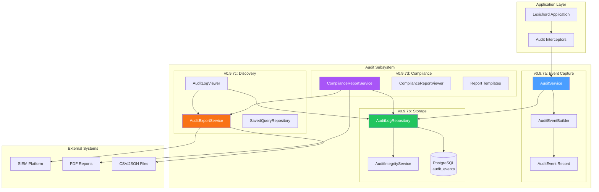
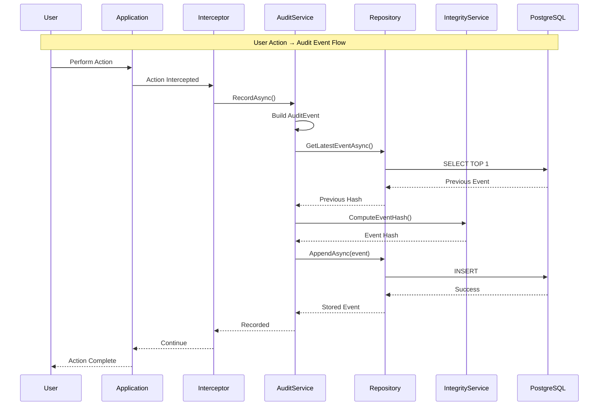

# LCS-DES-097: Design Specification Index — The House Manager

## Document Control

| Field | Value |
| :--- | :--- |
| **Document ID** | LCS-DES-097-INDEX |
| **Feature ID** | COL-097 |
| **Feature Name** | The House Manager (Audit Logging) |
| **Target Version** | v0.9.7 |
| **Module Scope** | Lexichord.Modules.Collaboration |
| **Swimlane** | Governance |
| **License Tier** | Enterprise |
| **Feature Gate Key** | `audit_logging` |
| **Status** | Draft |
| **Last Updated** | 2026-01-27 |

---

## 1. Executive Summary

**v0.9.7** delivers the **House Manager** — comprehensive enterprise audit logging that tracks all user actions for compliance with SOC2, HIPAA, and other regulatory frameworks.

### 1.1 The Problem

Enterprise organizations deploying Lexichord face significant compliance challenges:

- Regulatory frameworks (SOC2, HIPAA, GDPR) require comprehensive audit trails
- Security incidents require forensic analysis of user actions
- Accountability demands knowing who did what and when
- Compliance audits require exportable, verifiable logs
- Current lack of audit infrastructure blocks enterprise adoption

### 1.2 The Solution

Implement a complete audit logging subsystem that:

1. **Captures Everything** — Comprehensive event taxonomy for all user actions
2. **Stores Immutably** — Tamper-evident hash chaining prevents log manipulation
3. **Enables Discovery** — Powerful search and filter capabilities
4. **Supports Compliance** — Pre-built SOC2 and HIPAA report templates
5. **Integrates with SIEM** — Export in industry-standard formats

### 1.3 Business Value

| Value | Description |
| :--- | :--- |
| **Regulatory Compliance** | SOC2 Type II and HIPAA requirements met out-of-box |
| **Enterprise Trust** | Complete accountability for all user actions |
| **Security Forensics** | Full visibility for incident investigation |
| **Audit Readiness** | One-click compliance report generation |
| **SIEM Integration** | CEF/Syslog export for security operations |

---

## 2. Related Documents

### 2.1 Scope Breakdown Document

The detailed scope breakdown for v0.9.7, including all sub-parts, implementation checklists, user stories, and acceptance criteria:

| Document | Description |
| :--- | :--- |
| **[LCS-SBD-097](./LCS-SBD-097.md)** | Scope Breakdown — The House Manager |

### 2.2 Sub-Part Design Specifications

Each sub-part has its own detailed design specification:

| Sub-Part | Document | Title | Description |
| :--- | :--- | :--- | :--- |
| v0.9.7a | **[LCS-DES-097a](./LCS-DES-097a.md)** | Audit Events | Comprehensive event taxonomy and capture |
| v0.9.7b | **[LCS-DES-097b](./LCS-DES-097b.md)** | Log Storage | Immutable, tamper-evident storage |
| v0.9.7c | **[LCS-DES-097c](./LCS-DES-097c.md)** | Search/Export | Query logs, export for compliance |
| v0.9.7d | **[LCS-DES-097d](./LCS-DES-097d.md)** | Compliance Reports | Pre-built SOC2/HIPAA reports |

---

## 3. Architecture Overview

### 3.1 Component Diagram



### 3.2 Event Flow Sequence



---

## 4. Dependencies

### 4.1 Upstream Dependencies

| Interface | Source Version | Purpose |
| :--- | :--- | :--- |
| `IProfileService` | v0.9.1a | Current user identity |
| `UserProfile` | v0.9.1a | Profile metadata for events |
| `ILicenseContext` | v0.0.4c | Enterprise tier verification |
| `ILicenseStateService` | v0.9.2c | License validation |
| `ISecureVault` | v0.0.6a | Hash key storage |
| `IMediator` | v0.0.7a | Event publishing |
| `IDbConnectionFactory` | v0.0.5a | PostgreSQL connections |
| `ISettingsService` | v0.1.6a | Audit configuration |
| `IRegionManager` | v0.1.1b | UI panel placement |

### 4.2 NuGet Packages

| Package | Version | Purpose |
| :--- | :--- | :--- |
| `Dapper` | 2.x | Database access |
| `Npgsql` | 8.x | PostgreSQL driver |
| `QuestPDF` | 2024.x | PDF report generation (NEW) |
| `CsvHelper` | 31.x | CSV export (NEW) |
| `System.Text.Json` | 8.x | JSON serialization |

### 4.3 Downstream Consumers (Future)

| Version | Feature | Uses From v0.9.7 |
| :--- | :--- | :--- |
| v0.9.8 | Security Hardening | Audit infrastructure for security review |
| v1.0 | GA Release | Enterprise compliance capabilities |
| v1.1 | Real-time Alerts | Audit events for alert triggers |

---

## 5. License Gating Strategy

Audit Logging is an **Enterprise** tier feature.

### 5.1 Gating Behavior

| Tier | Behavior |
| :--- | :--- |
| Core | No audit logging, menu items hidden |
| WriterPro | No audit logging, menu items disabled with upgrade tooltip |
| Teams | No audit logging, "Upgrade to Enterprise" prompt |
| Enterprise | Full audit logging capabilities |

### 5.2 Feature Gate Key

```csharp
// License check before recording events
if (!licenseContext.HasFeature(LicenseFeature.AuditLogging))
{
    return; // Silently skip - no audit for non-Enterprise
}

// UI visibility check
public bool IsAuditMenuVisible =>
    _licenseContext.CurrentTier >= LicenseTier.Enterprise;
```

---

## 6. Audit Event Categories

### 6.1 Category Overview

| Category | Description | Example Events |
| :--- | :--- | :--- |
| **Authentication** | Login, logout, session events | UserLogin, SessionTimeout |
| **Authorization** | Permission checks, access denials | PermissionDenied, LicenseValidated |
| **DataAccess** | Document read operations | DocumentOpened, SearchPerformed |
| **DataModification** | Content changes | DocumentModified, DocumentDeleted |
| **AIInteraction** | LLM prompts and responses | PromptSubmitted, AgentInvoked |
| **Configuration** | Settings changes | SettingChanged, ProfileUpdated |
| **Administration** | User/license management | LicenseActivated, UserInvited |
| **Export** | Document/log export | DocumentExported, AuditLogExported |
| **SystemEvent** | Application lifecycle | ApplicationStarted, ErrorOccurred |

### 6.2 Event Severity Levels

| Severity | Description | Example |
| :--- | :--- | :--- |
| **Info** | Normal operations | Document opened |
| **Warning** | Unusual but not problematic | Permission denied |
| **Error** | Failed operations | Save failed |
| **Critical** | Security-relevant events | Multiple failed logins |

---

## 7. Key Interfaces Summary

### 7.1 v0.9.7a: Event Capture

```csharp
public interface IAuditService
{
    Task RecordAsync(AuditEvent auditEvent, CancellationToken ct = default);
    Task<AuditEvent> RecordAsync(Action<IAuditEventBuilder> configure, CancellationToken ct = default);
    IAuditEventBuilder CreateBuilder();
}

public interface IAuditEventBuilder
{
    IAuditEventBuilder WithEventType(AuditEventType type);
    IAuditEventBuilder WithActor(Guid userId, string userName, string? email);
    IAuditEventBuilder WithResource(string type, string id, string? name);
    IAuditEventBuilder WithOutcome(AuditOutcome outcome, string? failureReason);
    AuditEvent Build();
}
```

### 7.2 v0.9.7b: Storage

```csharp
public interface IAuditLogRepository
{
    Task<AuditEvent> AppendAsync(AuditEvent auditEvent, CancellationToken ct = default);
    Task<IReadOnlyList<AuditEvent>> QueryAsync(AuditLogQuery query, CancellationToken ct = default);
    Task<long> CountAsync(AuditLogQuery query, CancellationToken ct = default);
}

public interface IAuditIntegrityService
{
    string ComputeEventHash(AuditEvent auditEvent, string? previousHash);
    Task<AuditIntegrityResult> VerifyChainAsync(DateTimeOffset from, DateTimeOffset to, CancellationToken ct);
}
```

### 7.3 v0.9.7c: Export

```csharp
public interface IAuditExportService
{
    Task<ExportResult> ExportAsync(AuditLogQuery query, AuditExportFormat format, Stream output, CancellationToken ct);
    IAsyncEnumerable<AuditEvent> StreamEventsAsync(AuditLogQuery filter, CancellationToken ct);
}

public enum AuditExportFormat { Json, JsonLines, Csv, Pdf, Cef, Syslog, Xml }
```

### 7.4 v0.9.7d: Compliance

```csharp
public interface IComplianceReportService
{
    Task<ComplianceReport> GenerateReportAsync(ComplianceFramework framework, ComplianceReportOptions options, CancellationToken ct);
    Task<Stream> ExportReportAsync(ComplianceReport report, ReportExportFormat format, CancellationToken ct);
}

public enum ComplianceFramework { SOC2TypeII, HIPAA, GDPR, ISO27001, Custom }
```

---

## 8. Implementation Checklist Summary

| Sub-Part | Tasks | Est. Hours |
| :--- | :--- | :--- |
| v0.9.7a | Audit Events (taxonomy, builder, service, interceptors) | 13 |
| v0.9.7b | Log Storage (PostgreSQL, hash chaining, integrity) | 13 |
| v0.9.7c | Search/Export (viewer UI, export formats, saved queries) | 18 |
| v0.9.7d | Compliance Reports (SOC2, HIPAA, viewer, PDF) | 22 |
| Integration | Tests, DI registration, license gating | 7 |
| **Total** | | **73 hours** |

See [LCS-SBD-097](./LCS-SBD-097.md) Section 4 for the detailed task breakdown.

---

## 9. Success Criteria Summary

| Category | Criterion | Target |
| :--- | :--- | :--- |
| **Capture** | Event recording latency | < 10ms |
| **Storage** | Query response (100k events) | < 500ms |
| **Integrity** | Chain verification speed | 50,000 events/sec |
| **Export** | Export throughput | 10,000 events/sec |
| **Reports** | Report generation time | < 30 seconds |
| **Storage** | Per-event storage size | < 1KB average |

See [LCS-SBD-097](./LCS-SBD-097.md) Section 9 for full success metrics.

---

## 10. Compliance Framework Coverage

### 10.1 SOC2 Type II Controls

| Control | Description | v0.9.7 Coverage |
| :--- | :--- | :--- |
| CC6.1 | Logical Access Security | Authentication events, access denials |
| CC6.2 | System Operations | Configuration changes, admin actions |
| CC7.2 | Security Event Monitoring | Real-time logging, SIEM export |
| CC7.3 | Security Incident Response | Forensic search, chain verification |

### 10.2 HIPAA Security Rule

| Section | Requirement | v0.9.7 Coverage |
| :--- | :--- | :--- |
| 164.312(a)(1) | Access Control | User authentication logging |
| 164.312(b) | Audit Controls | Comprehensive activity logging |
| 164.312(c)(1) | Integrity Controls | Hash chaining, tamper detection |
| 164.312(e)(1) | Transmission Security | Secure export mechanisms |

---

## 11. Test Coverage Summary

| Sub-Part | Test File | Coverage Area |
| :--- | :--- | :--- |
| v0.9.7a | `AuditEventBuilderTests.cs` | Event construction |
| v0.9.7a | `AuditServiceTests.cs` | Event recording |
| v0.9.7b | `AuditLogRepositoryTests.cs` | Storage operations |
| v0.9.7b | `AuditIntegrityServiceTests.cs` | Hash chaining |
| v0.9.7c | `AuditExportServiceTests.cs` | Export formats |
| v0.9.7c | `AuditLogViewerViewModelTests.cs` | Search/filter |
| v0.9.7d | `ComplianceReportServiceTests.cs` | Report generation |
| v0.9.7d | `SOC2ReportTemplateTests.cs` | SOC2 control coverage |

See individual design specs for detailed test scenarios.

---

## 12. What This Enables

| Version | Feature | Uses From v0.9.7 |
| :--- | :--- | :--- |
| v0.9.8 | Security Hardening | Security audit of audit infrastructure |
| v1.0 | GA Release | Enterprise compliance for launch |
| v1.1 | Real-time Alerts | Event-triggered notifications |
| v1.2 | Advanced Analytics | Historical analysis, trends |

---

## 13. Database Schema Overview

```sql
-- Primary audit events table
CREATE TABLE audit_events (
    event_id UUID PRIMARY KEY,
    timestamp TIMESTAMPTZ NOT NULL,
    event_type VARCHAR(50) NOT NULL,
    category VARCHAR(30) NOT NULL,
    severity VARCHAR(20) NOT NULL,
    user_id UUID NOT NULL,
    user_name VARCHAR(255) NOT NULL,
    profile_id UUID NOT NULL,
    action VARCHAR(500) NOT NULL,
    resource_type VARCHAR(100),
    resource_id VARCHAR(255),
    outcome VARCHAR(20) NOT NULL,
    details JSONB,
    previous_event_hash VARCHAR(64),
    event_hash VARCHAR(64) NOT NULL
);

-- Key indexes for performance
CREATE INDEX idx_audit_timestamp ON audit_events(timestamp DESC);
CREATE INDEX idx_audit_user_id ON audit_events(user_id);
CREATE INDEX idx_audit_category ON audit_events(category);
CREATE INDEX idx_audit_event_type ON audit_events(event_type);
```

---

## Document History

| Version | Date | Author | Changes |
| :--- | :--- | :--- | :--- |
| 1.0 | 2026-01-27 | Lead Architect | Initial draft |
