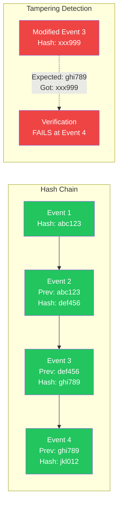
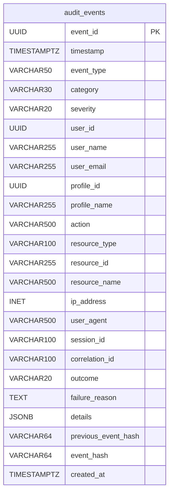

# LCS-DES-097b: Design Specification — Log Storage

## 1. Metadata & Categorization

| Field | Value | Description |
| :--- | :--- | :--- |
| **Feature ID** | `COL-097b` | Sub-part of COL-097 |
| **Feature Name** | `Immutable, Tamper-Evident Storage` | Secure audit log persistence |
| **Target Version** | `v0.9.7b` | Second sub-part of v0.9.7 |
| **Module Scope** | `Lexichord.Modules.Collaboration` | Collaboration module |
| **Swimlane** | `Governance` | Enterprise governance features |
| **License Tier** | `Enterprise` | Enterprise tier only |
| **Feature Gate Key** | `audit_logging` | License feature key |
| **Author** | Lead Architect | |
| **Status** | `Draft` | |
| **Last Updated** | `2026-01-27` | |
| **Parent Document** | [LCS-DES-097-INDEX](./LCS-DES-097-INDEX.md) | |
| **Scope Breakdown** | [LCS-SBD-097 §3.2](./LCS-SBD-097.md#32-v097b-log-storage) | |

---

## 2. Executive Summary

### 2.1 The Requirement

Enterprise audit trails must be:

- **Immutable:** Once written, logs cannot be modified
- **Tamper-Evident:** Any modification is immediately detectable
- **Durable:** Logs survive system failures and are recoverable
- **Performant:** Writes complete quickly without blocking user actions
- **Queryable:** Support efficient searching across millions of events

Regulatory frameworks (SOC2, HIPAA) specifically require tamper-evident audit logs with cryptographic verification. Standard database storage is insufficient—logs could be modified by administrators or attackers without detection.

> **Goal:** Implement immutable, tamper-evident audit log storage using SHA-256 cryptographic hash chaining.

### 2.2 The Proposed Solution

Implement a secure storage layer that:

1. **Chains Events Cryptographically** — Each event's hash includes the previous event's hash
2. **Stores Immutably** — Append-only table design with no update/delete operations
3. **Verifies Integrity** — On-demand chain verification detects any tampering
4. **Optimizes Queries** — Strategic indexing for common query patterns
5. **Supports Scale** — Partitioning and archival for large deployments

---

## 3. Architecture & Modular Strategy

### 3.1 Dependencies

#### 3.1.1 Upstream Dependencies

| Interface | Source Version | Purpose |
| :--- | :--- | :--- |
| `AuditEvent` | v0.9.7a | Event record to store |
| `IDbConnectionFactory` | v0.0.5a | PostgreSQL connections |
| `ISecureVault` | v0.0.6a | Secure key storage (future: encryption keys) |
| `Dapper` | NuGet | Database access |
| `Npgsql` | NuGet | PostgreSQL driver |

#### 3.1.2 Downstream Consumers

| Interface | Target Version | Purpose |
| :--- | :--- | :--- |
| `IAuditExportService` | v0.9.7c | Queries events for export |
| `IComplianceReportService` | v0.9.7d | Queries events for reports |
| `AuditLogViewer` | v0.9.7c | Displays events in UI |

### 3.2 Hash Chaining Architecture



---

## 4. Data Contract (The API)

### 4.1 Audit Log Repository Interface

```csharp
namespace Lexichord.Abstractions.Audit;

/// <summary>
/// Repository for persistent audit log storage.
/// Implements immutable, append-only semantics.
/// </summary>
public interface IAuditLogRepository
{
    /// <summary>
    /// Appends an audit event to the log.
    /// Events cannot be modified after storage.
    /// </summary>
    /// <param name="auditEvent">The event to store (must include hash).</param>
    /// <param name="ct">Cancellation token.</param>
    /// <returns>The stored event with any server-generated fields.</returns>
    /// <exception cref="DuplicateEventException">If EventId already exists.</exception>
    Task<AuditEvent> AppendAsync(AuditEvent auditEvent, CancellationToken ct = default);

    /// <summary>
    /// Retrieves audit events matching the specified query criteria.
    /// </summary>
    /// <param name="query">Query parameters for filtering and pagination.</param>
    /// <param name="ct">Cancellation token.</param>
    /// <returns>List of matching events.</returns>
    Task<IReadOnlyList<AuditEvent>> QueryAsync(
        AuditLogQuery query,
        CancellationToken ct = default);

    /// <summary>
    /// Gets the total count of events matching the query.
    /// </summary>
    /// <param name="query">Query parameters for filtering.</param>
    /// <param name="ct">Cancellation token.</param>
    /// <returns>Total count of matching events.</returns>
    Task<long> CountAsync(AuditLogQuery query, CancellationToken ct = default);

    /// <summary>
    /// Gets the most recent event for hash chaining.
    /// </summary>
    /// <param name="ct">Cancellation token.</param>
    /// <returns>The latest event, or null if no events exist.</returns>
    Task<AuditEvent?> GetLatestEventAsync(CancellationToken ct = default);

    /// <summary>
    /// Retrieves a contiguous chain of events for integrity verification.
    /// </summary>
    /// <param name="from">Start of the verification window.</param>
    /// <param name="to">End of the verification window.</param>
    /// <param name="ct">Cancellation token.</param>
    /// <returns>Events ordered by timestamp ascending.</returns>
    Task<IReadOnlyList<AuditEvent>> GetChainAsync(
        DateTimeOffset from,
        DateTimeOffset to,
        CancellationToken ct = default);

    /// <summary>
    /// Gets a single event by its ID.
    /// </summary>
    /// <param name="eventId">The event ID.</param>
    /// <param name="ct">Cancellation token.</param>
    /// <returns>The event, or null if not found.</returns>
    Task<AuditEvent?> GetByIdAsync(Guid eventId, CancellationToken ct = default);

    /// <summary>
    /// Gets aggregate statistics for the specified period.
    /// </summary>
    /// <param name="from">Start of the period.</param>
    /// <param name="to">End of the period.</param>
    /// <param name="ct">Cancellation token.</param>
    /// <returns>Aggregated statistics.</returns>
    Task<AuditStatistics> GetStatisticsAsync(
        DateTimeOffset from,
        DateTimeOffset to,
        CancellationToken ct = default);
}
```

### 4.2 Query Parameters

```csharp
namespace Lexichord.Abstractions.Audit;

/// <summary>
/// Query parameters for searching audit logs.
/// </summary>
public record AuditLogQuery
{
    /// <summary>Include events from this timestamp (inclusive).</summary>
    public DateTimeOffset? FromTimestamp { get; init; }

    /// <summary>Include events up to this timestamp (exclusive).</summary>
    public DateTimeOffset? ToTimestamp { get; init; }

    /// <summary>Filter by specific user ID.</summary>
    public Guid? UserId { get; init; }

    /// <summary>Filter by multiple user IDs.</summary>
    public IReadOnlyList<Guid>? UserIds { get; init; }

    /// <summary>Filter by specific profile ID.</summary>
    public Guid? ProfileId { get; init; }

    /// <summary>Filter by event category.</summary>
    public AuditEventCategory? Category { get; init; }

    /// <summary>Filter by multiple categories.</summary>
    public IReadOnlyList<AuditEventCategory>? Categories { get; init; }

    /// <summary>Filter by specific event type.</summary>
    public AuditEventType? EventType { get; init; }

    /// <summary>Filter by multiple event types.</summary>
    public IReadOnlyList<AuditEventType>? EventTypes { get; init; }

    /// <summary>Filter by minimum severity level.</summary>
    public AuditSeverity? MinimumSeverity { get; init; }

    /// <summary>Filter by specific outcome.</summary>
    public AuditOutcome? Outcome { get; init; }

    /// <summary>Filter by resource type.</summary>
    public string? ResourceType { get; init; }

    /// <summary>Filter by resource ID.</summary>
    public string? ResourceId { get; init; }

    /// <summary>Full-text search on action and details.</summary>
    public string? SearchText { get; init; }

    /// <summary>Filter by correlation ID for tracing.</summary>
    public string? CorrelationId { get; init; }

    /// <summary>Filter by session ID.</summary>
    public string? SessionId { get; init; }

    /// <summary>Number of records to skip for pagination.</summary>
    public int Skip { get; init; } = 0;

    /// <summary>Number of records to return (max 1000).</summary>
    public int Take { get; init; } = 100;

    /// <summary>Sort order for results.</summary>
    public AuditLogSortOrder SortOrder { get; init; } = AuditLogSortOrder.TimestampDescending;
}

/// <summary>
/// Available sort orders for audit log queries.
/// </summary>
public enum AuditLogSortOrder
{
    TimestampAscending,
    TimestampDescending,
    SeverityDescending,
    UserNameAscending,
    CategoryAscending
}
```

### 4.3 Integrity Service Interface

```csharp
namespace Lexichord.Abstractions.Audit;

/// <summary>
/// Service for computing and verifying audit log integrity.
/// </summary>
public interface IAuditIntegrityService
{
    /// <summary>
    /// Computes the SHA-256 hash for an audit event.
    /// The hash includes the previous event's hash for chaining.
    /// </summary>
    /// <param name="auditEvent">The event to hash.</param>
    /// <param name="previousHash">Hash of the previous event (null for first event).</param>
    /// <returns>Lowercase hexadecimal hash string (64 characters).</returns>
    string ComputeEventHash(AuditEvent auditEvent, string? previousHash);

    /// <summary>
    /// Verifies the integrity of a contiguous chain of audit events.
    /// </summary>
    /// <param name="from">Start of the verification window.</param>
    /// <param name="to">End of the verification window.</param>
    /// <param name="ct">Cancellation token.</param>
    /// <returns>Verification result with details.</returns>
    Task<AuditIntegrityResult> VerifyChainAsync(
        DateTimeOffset from,
        DateTimeOffset to,
        CancellationToken ct = default);

    /// <summary>
    /// Verifies a single event's hash against its claimed previous hash.
    /// </summary>
    /// <param name="auditEvent">The event to verify.</param>
    /// <param name="previousHash">The expected previous hash.</param>
    /// <returns>True if the event's hash is valid.</returns>
    bool VerifyEventHash(AuditEvent auditEvent, string? previousHash);

    /// <summary>
    /// Gets the hash of the event immediately before the specified timestamp.
    /// Used for initializing verification windows.
    /// </summary>
    /// <param name="beforeTimestamp">The timestamp to look before.</param>
    /// <param name="ct">Cancellation token.</param>
    /// <returns>The previous event's hash, or null if at chain start.</returns>
    Task<string?> GetPreviousHashAsync(
        DateTimeOffset beforeTimestamp,
        CancellationToken ct = default);
}

/// <summary>
/// Result of an integrity verification operation.
/// </summary>
public record AuditIntegrityResult
{
    /// <summary>True if all events in the chain are valid.</summary>
    public required bool IsValid { get; init; }

    /// <summary>Number of events verified.</summary>
    public required int EventsVerified { get; init; }

    /// <summary>Timestamp of the first event in the verified chain.</summary>
    public DateTimeOffset? FirstEventTimestamp { get; init; }

    /// <summary>Timestamp of the last event in the verified chain.</summary>
    public DateTimeOffset? LastEventTimestamp { get; init; }

    /// <summary>Index of the first invalid event (null if all valid).</summary>
    public int? FirstInvalidEventIndex { get; init; }

    /// <summary>ID of the first invalid event.</summary>
    public Guid? FirstInvalidEventId { get; init; }

    /// <summary>Description of the validation error.</summary>
    public string? ValidationError { get; init; }

    /// <summary>Duration of the verification operation.</summary>
    public TimeSpan VerificationDuration { get; init; }
}
```

### 4.4 Statistics Record

```csharp
namespace Lexichord.Abstractions.Audit;

/// <summary>
/// Aggregated statistics for audit events.
/// </summary>
public record AuditStatistics
{
    public required long TotalEvents { get; init; }
    public required long TotalUsers { get; init; }
    public required long SuccessCount { get; init; }
    public required long FailureCount { get; init; }
    public required long DeniedCount { get; init; }

    public required IReadOnlyDictionary<AuditEventCategory, long> EventsByCategory { get; init; }
    public required IReadOnlyDictionary<AuditSeverity, long> EventsBySeverity { get; init; }
    public required IReadOnlyDictionary<AuditOutcome, long> EventsByOutcome { get; init; }
    public required IReadOnlyDictionary<string, long> EventsByUser { get; init; }
    public required IReadOnlyDictionary<int, long> EventsByHour { get; init; }
    public required IReadOnlyDictionary<DayOfWeek, long> EventsByDayOfWeek { get; init; }

    public DateTimeOffset? FirstEventTimestamp { get; init; }
    public DateTimeOffset? LastEventTimestamp { get; init; }
    public double AverageEventsPerDay { get; init; }
}
```

---

## 5. Database Schema

### 5.1 Migration Script

```csharp
namespace Lexichord.Host.Migrations;

/// <summary>
/// Creates the audit_events table for tamper-evident audit logging.
/// </summary>
public class Migration_097_AuditLogging : Migration
{
    protected override void Up(MigrationBuilder builder)
    {
        builder.Sql(@"
-- ============================================================================
-- Audit Events Table
-- Append-only, immutable storage for audit trail
-- ============================================================================

CREATE TABLE audit_events (
    -- Primary key
    event_id UUID PRIMARY KEY,

    -- Timestamp with timezone for accurate time tracking
    timestamp TIMESTAMPTZ NOT NULL,

    -- Event classification
    event_type VARCHAR(50) NOT NULL,
    category VARCHAR(30) NOT NULL,
    severity VARCHAR(20) NOT NULL,

    -- Actor information (denormalized for query performance)
    user_id UUID NOT NULL,
    user_name VARCHAR(255) NOT NULL,
    user_email VARCHAR(255),
    profile_id UUID NOT NULL,
    profile_name VARCHAR(255) NOT NULL,

    -- Action details
    action VARCHAR(500) NOT NULL,
    resource_type VARCHAR(100),
    resource_id VARCHAR(255),
    resource_name VARCHAR(500),

    -- Environmental context
    ip_address INET,
    user_agent VARCHAR(500),
    session_id VARCHAR(100),
    correlation_id VARCHAR(100),

    -- Outcome
    outcome VARCHAR(20) NOT NULL,
    failure_reason TEXT,

    -- Extended details (JSONB for flexible querying)
    details JSONB,

    -- Integrity chain
    previous_event_hash VARCHAR(64),
    event_hash VARCHAR(64) NOT NULL,

    -- Metadata
    created_at TIMESTAMPTZ NOT NULL DEFAULT CURRENT_TIMESTAMP
);

-- ============================================================================
-- Indexes for Common Query Patterns
-- ============================================================================

-- Primary time-based queries (most common)
CREATE INDEX idx_audit_timestamp ON audit_events(timestamp DESC);

-- User activity queries
CREATE INDEX idx_audit_user_id ON audit_events(user_id, timestamp DESC);
CREATE INDEX idx_audit_profile_id ON audit_events(profile_id, timestamp DESC);

-- Category and type filtering
CREATE INDEX idx_audit_category ON audit_events(category, timestamp DESC);
CREATE INDEX idx_audit_event_type ON audit_events(event_type, timestamp DESC);

-- Security-focused queries
CREATE INDEX idx_audit_severity ON audit_events(severity, timestamp DESC)
    WHERE severity IN ('Warning', 'Error', 'Critical');
CREATE INDEX idx_audit_outcome ON audit_events(outcome, timestamp DESC)
    WHERE outcome != 'Success';

-- Tracing and correlation
CREATE INDEX idx_audit_correlation ON audit_events(correlation_id)
    WHERE correlation_id IS NOT NULL;
CREATE INDEX idx_audit_session ON audit_events(session_id, timestamp DESC)
    WHERE session_id IS NOT NULL;

-- Resource queries
CREATE INDEX idx_audit_resource ON audit_events(resource_type, resource_id, timestamp DESC)
    WHERE resource_type IS NOT NULL;

-- Full-text search on action descriptions
CREATE INDEX idx_audit_action_fts ON audit_events
    USING gin(to_tsvector('english', action));

-- JSONB path operations on details
CREATE INDEX idx_audit_details_gin ON audit_events
    USING gin(details jsonb_path_ops)
    WHERE details IS NOT NULL;

-- Hash chain verification
CREATE INDEX idx_audit_hash ON audit_events(event_hash);
CREATE INDEX idx_audit_prev_hash ON audit_events(previous_event_hash)
    WHERE previous_event_hash IS NOT NULL;

-- ============================================================================
-- Constraints
-- ============================================================================

-- Ensure hash is always present
ALTER TABLE audit_events
    ADD CONSTRAINT chk_event_hash_not_empty
    CHECK (event_hash IS NOT NULL AND length(event_hash) = 64);

-- Ensure valid severity values
ALTER TABLE audit_events
    ADD CONSTRAINT chk_severity_valid
    CHECK (severity IN ('Info', 'Warning', 'Error', 'Critical'));

-- Ensure valid outcome values
ALTER TABLE audit_events
    ADD CONSTRAINT chk_outcome_valid
    CHECK (outcome IN ('Success', 'Failure', 'Denied', 'Partial'));

-- Ensure valid category values
ALTER TABLE audit_events
    ADD CONSTRAINT chk_category_valid
    CHECK (category IN (
        'Authentication', 'Authorization', 'DataAccess', 'DataModification',
        'AIInteraction', 'Configuration', 'Administration', 'Export', 'SystemEvent'
    ));

-- ============================================================================
-- Row-Level Security (Optional for Multi-Tenant)
-- ============================================================================

-- Enable RLS for future multi-tenant support
-- ALTER TABLE audit_events ENABLE ROW LEVEL SECURITY;

-- ============================================================================
-- Comments for Documentation
-- ============================================================================

COMMENT ON TABLE audit_events IS 'Immutable, tamper-evident audit log for compliance tracking';
COMMENT ON COLUMN audit_events.event_hash IS 'SHA-256 hash of event including previous_event_hash for chain integrity';
COMMENT ON COLUMN audit_events.previous_event_hash IS 'Hash of the preceding event in the chain (null for first event)';
COMMENT ON COLUMN audit_events.details IS 'Event-type-specific JSON data for extended auditing';
");
    }

    protected override void Down(MigrationBuilder builder)
    {
        builder.Sql("DROP TABLE IF EXISTS audit_events CASCADE;");
    }
}
```

### 5.2 Schema Diagram



---

## 6. Implementation Logic

### 6.1 AuditLogRepository Implementation

```csharp
namespace Lexichord.Modules.Collaboration.Audit;

/// <summary>
/// PostgreSQL implementation of audit log repository.
/// Implements append-only, immutable storage semantics.
/// </summary>
public class AuditLogRepository(
    IDbConnectionFactory connectionFactory,
    ILogger<AuditLogRepository> logger) : IAuditLogRepository
{
    public async Task<AuditEvent> AppendAsync(
        AuditEvent auditEvent,
        CancellationToken ct = default)
    {
        const string sql = @"
            INSERT INTO audit_events (
                event_id, timestamp, event_type, category, severity,
                user_id, user_name, user_email, profile_id, profile_name,
                action, resource_type, resource_id, resource_name,
                ip_address, user_agent, session_id, correlation_id,
                outcome, failure_reason, details,
                previous_event_hash, event_hash
            ) VALUES (
                @EventId, @Timestamp, @EventType, @Category, @Severity,
                @UserId, @UserName, @UserEmail, @ProfileId, @ProfileName,
                @Action, @ResourceType, @ResourceId, @ResourceName,
                @IpAddress::inet, @UserAgent, @SessionId, @CorrelationId,
                @Outcome, @FailureReason, @Details::jsonb,
                @PreviousEventHash, @EventHash
            )
            RETURNING created_at";

        using var connection = await connectionFactory.OpenAsync(ct);

        try
        {
            var createdAt = await connection.ExecuteScalarAsync<DateTime>(sql, new
            {
                auditEvent.EventId,
                auditEvent.Timestamp,
                EventType = auditEvent.EventType.ToString(),
                Category = auditEvent.Category.ToString(),
                Severity = auditEvent.Severity.ToString(),
                auditEvent.UserId,
                auditEvent.UserName,
                auditEvent.UserEmail,
                auditEvent.ProfileId,
                auditEvent.ProfileName,
                auditEvent.Action,
                auditEvent.ResourceType,
                auditEvent.ResourceId,
                auditEvent.ResourceName,
                auditEvent.IpAddress,
                auditEvent.UserAgent,
                auditEvent.SessionId,
                auditEvent.CorrelationId,
                Outcome = auditEvent.Outcome.ToString(),
                auditEvent.FailureReason,
                auditEvent.Details,
                auditEvent.PreviousEventHash,
                auditEvent.EventHash
            });

            logger.LogDebug("Appended audit event {EventId} at {CreatedAt}", auditEvent.EventId, createdAt);

            return auditEvent;
        }
        catch (PostgresException ex) when (ex.SqlState == "23505") // unique_violation
        {
            throw new DuplicateEventException(auditEvent.EventId, ex);
        }
    }

    public async Task<IReadOnlyList<AuditEvent>> QueryAsync(
        AuditLogQuery query,
        CancellationToken ct = default)
    {
        var (whereClauses, parameters) = BuildWhereClause(query);

        var orderBy = query.SortOrder switch
        {
            AuditLogSortOrder.TimestampAscending => "timestamp ASC",
            AuditLogSortOrder.TimestampDescending => "timestamp DESC",
            AuditLogSortOrder.SeverityDescending => "CASE severity WHEN 'Critical' THEN 1 WHEN 'Error' THEN 2 WHEN 'Warning' THEN 3 ELSE 4 END, timestamp DESC",
            AuditLogSortOrder.UserNameAscending => "user_name ASC, timestamp DESC",
            AuditLogSortOrder.CategoryAscending => "category ASC, timestamp DESC",
            _ => "timestamp DESC"
        };

        var sql = $@"
            SELECT * FROM audit_events
            {(whereClauses.Count > 0 ? "WHERE " + string.Join(" AND ", whereClauses) : "")}
            ORDER BY {orderBy}
            LIMIT @Take OFFSET @Skip";

        parameters.Add("Take", Math.Min(query.Take, 1000));
        parameters.Add("Skip", query.Skip);

        using var connection = await connectionFactory.OpenAsync(ct);
        var events = await connection.QueryAsync<AuditEventDto>(sql, parameters);

        return events.Select(MapToAuditEvent).ToList();
    }

    public async Task<long> CountAsync(AuditLogQuery query, CancellationToken ct = default)
    {
        var (whereClauses, parameters) = BuildWhereClause(query);

        var sql = $@"
            SELECT COUNT(*) FROM audit_events
            {(whereClauses.Count > 0 ? "WHERE " + string.Join(" AND ", whereClauses) : "")}";

        using var connection = await connectionFactory.OpenAsync(ct);
        return await connection.ExecuteScalarAsync<long>(sql, parameters);
    }

    public async Task<AuditEvent?> GetLatestEventAsync(CancellationToken ct = default)
    {
        const string sql = @"
            SELECT * FROM audit_events
            ORDER BY timestamp DESC
            LIMIT 1";

        using var connection = await connectionFactory.OpenAsync(ct);
        var dto = await connection.QuerySingleOrDefaultAsync<AuditEventDto>(sql);

        return dto is null ? null : MapToAuditEvent(dto);
    }

    public async Task<IReadOnlyList<AuditEvent>> GetChainAsync(
        DateTimeOffset from,
        DateTimeOffset to,
        CancellationToken ct = default)
    {
        const string sql = @"
            SELECT * FROM audit_events
            WHERE timestamp >= @From AND timestamp < @To
            ORDER BY timestamp ASC";

        using var connection = await connectionFactory.OpenAsync(ct);
        var events = await connection.QueryAsync<AuditEventDto>(sql, new { From = from, To = to });

        return events.Select(MapToAuditEvent).ToList();
    }

    public async Task<AuditEvent?> GetByIdAsync(Guid eventId, CancellationToken ct = default)
    {
        const string sql = "SELECT * FROM audit_events WHERE event_id = @EventId";

        using var connection = await connectionFactory.OpenAsync(ct);
        var dto = await connection.QuerySingleOrDefaultAsync<AuditEventDto>(sql, new { EventId = eventId });

        return dto is null ? null : MapToAuditEvent(dto);
    }

    public async Task<AuditStatistics> GetStatisticsAsync(
        DateTimeOffset from,
        DateTimeOffset to,
        CancellationToken ct = default)
    {
        const string sql = @"
            SELECT
                COUNT(*) as total_events,
                COUNT(DISTINCT user_id) as total_users,
                COUNT(*) FILTER (WHERE outcome = 'Success') as success_count,
                COUNT(*) FILTER (WHERE outcome = 'Failure') as failure_count,
                COUNT(*) FILTER (WHERE outcome = 'Denied') as denied_count,
                MIN(timestamp) as first_event,
                MAX(timestamp) as last_event
            FROM audit_events
            WHERE timestamp >= @From AND timestamp < @To;

            SELECT category, COUNT(*) as count
            FROM audit_events
            WHERE timestamp >= @From AND timestamp < @To
            GROUP BY category;

            SELECT severity, COUNT(*) as count
            FROM audit_events
            WHERE timestamp >= @From AND timestamp < @To
            GROUP BY severity;

            SELECT outcome, COUNT(*) as count
            FROM audit_events
            WHERE timestamp >= @From AND timestamp < @To
            GROUP BY outcome;

            SELECT user_name, COUNT(*) as count
            FROM audit_events
            WHERE timestamp >= @From AND timestamp < @To
            GROUP BY user_name
            ORDER BY count DESC
            LIMIT 20;

            SELECT EXTRACT(hour FROM timestamp)::int as hour, COUNT(*) as count
            FROM audit_events
            WHERE timestamp >= @From AND timestamp < @To
            GROUP BY hour
            ORDER BY hour;

            SELECT EXTRACT(dow FROM timestamp)::int as dow, COUNT(*) as count
            FROM audit_events
            WHERE timestamp >= @From AND timestamp < @To
            GROUP BY dow
            ORDER BY dow;";

        using var connection = await connectionFactory.OpenAsync(ct);
        using var multi = await connection.QueryMultipleAsync(sql, new { From = from, To = to });

        var summary = await multi.ReadSingleAsync<dynamic>();
        var byCategory = (await multi.ReadAsync<dynamic>()).ToDictionary(
            x => Enum.Parse<AuditEventCategory>((string)x.category),
            x => (long)x.count);
        var bySeverity = (await multi.ReadAsync<dynamic>()).ToDictionary(
            x => Enum.Parse<AuditSeverity>((string)x.severity),
            x => (long)x.count);
        var byOutcome = (await multi.ReadAsync<dynamic>()).ToDictionary(
            x => Enum.Parse<AuditOutcome>((string)x.outcome),
            x => (long)x.count);
        var byUser = (await multi.ReadAsync<dynamic>()).ToDictionary(
            x => (string)x.user_name,
            x => (long)x.count);
        var byHour = (await multi.ReadAsync<dynamic>()).ToDictionary(
            x => (int)x.hour,
            x => (long)x.count);
        var byDow = (await multi.ReadAsync<dynamic>()).ToDictionary(
            x => (DayOfWeek)(int)x.dow,
            x => (long)x.count);

        var totalDays = (to - from).TotalDays;
        var avgPerDay = totalDays > 0 ? (long)summary.total_events / totalDays : 0;

        return new AuditStatistics
        {
            TotalEvents = (long)summary.total_events,
            TotalUsers = (long)summary.total_users,
            SuccessCount = (long)summary.success_count,
            FailureCount = (long)summary.failure_count,
            DeniedCount = (long)summary.denied_count,
            EventsByCategory = byCategory,
            EventsBySeverity = bySeverity,
            EventsByOutcome = byOutcome,
            EventsByUser = byUser,
            EventsByHour = byHour,
            EventsByDayOfWeek = byDow,
            FirstEventTimestamp = summary.first_event,
            LastEventTimestamp = summary.last_event,
            AverageEventsPerDay = avgPerDay
        };
    }

    private static (List<string> clauses, DynamicParameters parameters) BuildWhereClause(AuditLogQuery query)
    {
        var clauses = new List<string>();
        var parameters = new DynamicParameters();

        if (query.FromTimestamp.HasValue)
        {
            clauses.Add("timestamp >= @FromTimestamp");
            parameters.Add("FromTimestamp", query.FromTimestamp.Value);
        }

        if (query.ToTimestamp.HasValue)
        {
            clauses.Add("timestamp < @ToTimestamp");
            parameters.Add("ToTimestamp", query.ToTimestamp.Value);
        }

        if (query.UserId.HasValue)
        {
            clauses.Add("user_id = @UserId");
            parameters.Add("UserId", query.UserId.Value);
        }

        if (query.UserIds?.Count > 0)
        {
            clauses.Add("user_id = ANY(@UserIds)");
            parameters.Add("UserIds", query.UserIds.ToArray());
        }

        if (query.ProfileId.HasValue)
        {
            clauses.Add("profile_id = @ProfileId");
            parameters.Add("ProfileId", query.ProfileId.Value);
        }

        if (query.Category.HasValue)
        {
            clauses.Add("category = @Category");
            parameters.Add("Category", query.Category.Value.ToString());
        }

        if (query.Categories?.Count > 0)
        {
            clauses.Add("category = ANY(@Categories)");
            parameters.Add("Categories", query.Categories.Select(c => c.ToString()).ToArray());
        }

        if (query.EventType.HasValue)
        {
            clauses.Add("event_type = @EventType");
            parameters.Add("EventType", query.EventType.Value.ToString());
        }

        if (query.EventTypes?.Count > 0)
        {
            clauses.Add("event_type = ANY(@EventTypes)");
            parameters.Add("EventTypes", query.EventTypes.Select(t => t.ToString()).ToArray());
        }

        if (query.MinimumSeverity.HasValue)
        {
            clauses.Add(@"CASE severity
                WHEN 'Critical' THEN 1
                WHEN 'Error' THEN 2
                WHEN 'Warning' THEN 3
                ELSE 4 END <= @MinSeverity");
            parameters.Add("MinSeverity", query.MinimumSeverity.Value switch
            {
                AuditSeverity.Critical => 1,
                AuditSeverity.Error => 2,
                AuditSeverity.Warning => 3,
                _ => 4
            });
        }

        if (query.Outcome.HasValue)
        {
            clauses.Add("outcome = @Outcome");
            parameters.Add("Outcome", query.Outcome.Value.ToString());
        }

        if (!string.IsNullOrWhiteSpace(query.ResourceType))
        {
            clauses.Add("resource_type = @ResourceType");
            parameters.Add("ResourceType", query.ResourceType);
        }

        if (!string.IsNullOrWhiteSpace(query.ResourceId))
        {
            clauses.Add("resource_id = @ResourceId");
            parameters.Add("ResourceId", query.ResourceId);
        }

        if (!string.IsNullOrWhiteSpace(query.SearchText))
        {
            clauses.Add("to_tsvector('english', action) @@ plainto_tsquery('english', @SearchText)");
            parameters.Add("SearchText", query.SearchText);
        }

        if (!string.IsNullOrWhiteSpace(query.CorrelationId))
        {
            clauses.Add("correlation_id = @CorrelationId");
            parameters.Add("CorrelationId", query.CorrelationId);
        }

        if (!string.IsNullOrWhiteSpace(query.SessionId))
        {
            clauses.Add("session_id = @SessionId");
            parameters.Add("SessionId", query.SessionId);
        }

        return (clauses, parameters);
    }

    private static AuditEvent MapToAuditEvent(AuditEventDto dto)
    {
        return new AuditEvent
        {
            EventId = dto.event_id,
            Timestamp = dto.timestamp,
            EventType = Enum.Parse<AuditEventType>(dto.event_type),
            Category = Enum.Parse<AuditEventCategory>(dto.category),
            Severity = Enum.Parse<AuditSeverity>(dto.severity),
            UserId = dto.user_id,
            UserName = dto.user_name,
            UserEmail = dto.user_email,
            ProfileId = dto.profile_id,
            ProfileName = dto.profile_name,
            Action = dto.action,
            ResourceType = dto.resource_type,
            ResourceId = dto.resource_id,
            ResourceName = dto.resource_name,
            IpAddress = dto.ip_address?.ToString(),
            UserAgent = dto.user_agent,
            SessionId = dto.session_id,
            CorrelationId = dto.correlation_id,
            Outcome = Enum.Parse<AuditOutcome>(dto.outcome),
            FailureReason = dto.failure_reason,
            Details = dto.details,
            PreviousEventHash = dto.previous_event_hash,
            EventHash = dto.event_hash
        };
    }

    private record AuditEventDto(
        Guid event_id,
        DateTimeOffset timestamp,
        string event_type,
        string category,
        string severity,
        Guid user_id,
        string user_name,
        string? user_email,
        Guid profile_id,
        string profile_name,
        string action,
        string? resource_type,
        string? resource_id,
        string? resource_name,
        System.Net.IPAddress? ip_address,
        string? user_agent,
        string? session_id,
        string? correlation_id,
        string outcome,
        string? failure_reason,
        string? details,
        string? previous_event_hash,
        string event_hash,
        DateTime created_at);
}
```

### 6.2 AuditIntegrityService Implementation

```csharp
namespace Lexichord.Modules.Collaboration.Audit;

/// <summary>
/// Service for computing and verifying audit log integrity using SHA-256 hash chaining.
/// </summary>
public class AuditIntegrityService(
    IAuditLogRepository repository,
    ILogger<AuditIntegrityService> logger) : IAuditIntegrityService
{
    private const string GenesisHash = "GENESIS";

    public string ComputeEventHash(AuditEvent auditEvent, string? previousHash)
    {
        // Create canonical representation for hashing
        // Order matters - must be consistent for verification
        var canonical = new StringBuilder();
        canonical.Append(auditEvent.EventId.ToString("N"));
        canonical.Append('|');
        canonical.Append(auditEvent.Timestamp.ToUnixTimeMilliseconds());
        canonical.Append('|');
        canonical.Append(auditEvent.EventType);
        canonical.Append('|');
        canonical.Append(auditEvent.Category);
        canonical.Append('|');
        canonical.Append(auditEvent.Severity);
        canonical.Append('|');
        canonical.Append(auditEvent.UserId.ToString("N"));
        canonical.Append('|');
        canonical.Append(auditEvent.UserName);
        canonical.Append('|');
        canonical.Append(auditEvent.ProfileId.ToString("N"));
        canonical.Append('|');
        canonical.Append(auditEvent.Action);
        canonical.Append('|');
        canonical.Append(auditEvent.Outcome);
        canonical.Append('|');
        canonical.Append(auditEvent.ResourceType ?? string.Empty);
        canonical.Append('|');
        canonical.Append(auditEvent.ResourceId ?? string.Empty);
        canonical.Append('|');
        canonical.Append(previousHash ?? GenesisHash);

        var canonicalBytes = Encoding.UTF8.GetBytes(canonical.ToString());
        var hashBytes = SHA256.HashData(canonicalBytes);

        return Convert.ToHexString(hashBytes).ToLowerInvariant();
    }

    public async Task<AuditIntegrityResult> VerifyChainAsync(
        DateTimeOffset from,
        DateTimeOffset to,
        CancellationToken ct = default)
    {
        var stopwatch = Stopwatch.StartNew();

        var events = await repository.GetChainAsync(from, to, ct);

        if (events.Count == 0)
        {
            return new AuditIntegrityResult
            {
                IsValid = true,
                EventsVerified = 0,
                VerificationDuration = stopwatch.Elapsed
            };
        }

        // Get the hash of the event before our window
        string? previousHash = await GetPreviousHashAsync(from, ct);

        for (int i = 0; i < events.Count; i++)
        {
            var current = events[i];

            // Verify the previous hash matches what we expect
            if (current.PreviousEventHash != previousHash)
            {
                logger.LogError(
                    "Audit chain broken at event {EventId}: expected previous hash {Expected}, got {Actual}",
                    current.EventId,
                    previousHash ?? GenesisHash,
                    current.PreviousEventHash ?? "null");

                return new AuditIntegrityResult
                {
                    IsValid = false,
                    EventsVerified = i,
                    FirstEventTimestamp = events[0].Timestamp,
                    LastEventTimestamp = current.Timestamp,
                    FirstInvalidEventIndex = i,
                    FirstInvalidEventId = current.EventId,
                    ValidationError = $"Previous hash mismatch at event {current.EventId}",
                    VerificationDuration = stopwatch.Elapsed
                };
            }

            // Verify the event's own hash
            var expectedHash = ComputeEventHash(current, previousHash);
            if (current.EventHash != expectedHash)
            {
                logger.LogError(
                    "Audit event hash mismatch at {EventId}: expected {Expected}, got {Actual}",
                    current.EventId,
                    expectedHash,
                    current.EventHash);

                return new AuditIntegrityResult
                {
                    IsValid = false,
                    EventsVerified = i,
                    FirstEventTimestamp = events[0].Timestamp,
                    LastEventTimestamp = current.Timestamp,
                    FirstInvalidEventIndex = i,
                    FirstInvalidEventId = current.EventId,
                    ValidationError = $"Hash mismatch at event {current.EventId}: content may have been tampered",
                    VerificationDuration = stopwatch.Elapsed
                };
            }

            previousHash = current.EventHash;
        }

        stopwatch.Stop();

        logger.LogInformation(
            "Audit chain verified: {Count} events from {From} to {To} in {Duration}ms",
            events.Count,
            from,
            to,
            stopwatch.ElapsedMilliseconds);

        return new AuditIntegrityResult
        {
            IsValid = true,
            EventsVerified = events.Count,
            FirstEventTimestamp = events[0].Timestamp,
            LastEventTimestamp = events[^1].Timestamp,
            VerificationDuration = stopwatch.Elapsed
        };
    }

    public bool VerifyEventHash(AuditEvent auditEvent, string? previousHash)
    {
        var expectedHash = ComputeEventHash(auditEvent, previousHash);
        return auditEvent.EventHash == expectedHash;
    }

    public async Task<string?> GetPreviousHashAsync(
        DateTimeOffset beforeTimestamp,
        CancellationToken ct = default)
    {
        // Query for the event immediately before the specified timestamp
        var query = new AuditLogQuery
        {
            ToTimestamp = beforeTimestamp,
            Take = 1,
            SortOrder = AuditLogSortOrder.TimestampDescending
        };

        var events = await repository.QueryAsync(query, ct);
        return events.FirstOrDefault()?.EventHash;
    }
}
```

---

## 7. Test Scenarios

### 7.1 Repository Tests

```csharp
[Trait("Category", "Unit")]
[Trait("Version", "v0.9.7b")]
public class AuditLogRepositoryTests
{
    [Fact]
    public async Task AppendAsync_ValidEvent_StoresAndReturns()
    {
        // Arrange
        var sut = CreateRepository();
        var auditEvent = CreateTestEvent();

        // Act
        var result = await sut.AppendAsync(auditEvent);

        // Assert
        result.Should().NotBeNull();
        result.EventId.Should().Be(auditEvent.EventId);
    }

    [Fact]
    public async Task AppendAsync_DuplicateEventId_ThrowsDuplicateException()
    {
        // Arrange
        var sut = CreateRepository();
        var auditEvent = CreateTestEvent();
        await sut.AppendAsync(auditEvent);

        // Act
        var act = async () => await sut.AppendAsync(auditEvent);

        // Assert
        await act.Should().ThrowAsync<DuplicateEventException>();
    }

    [Fact]
    public async Task QueryAsync_ByTimeRange_ReturnsMatchingEvents()
    {
        // Arrange
        var sut = CreateRepository();
        var now = DateTimeOffset.UtcNow;

        await sut.AppendAsync(CreateTestEvent(now.AddHours(-2)));
        await sut.AppendAsync(CreateTestEvent(now.AddHours(-1)));
        await sut.AppendAsync(CreateTestEvent(now));

        var query = new AuditLogQuery
        {
            FromTimestamp = now.AddHours(-1.5),
            ToTimestamp = now.AddMinutes(30)
        };

        // Act
        var result = await sut.QueryAsync(query);

        // Assert
        result.Should().HaveCount(2);
    }

    [Fact]
    public async Task QueryAsync_ByCategory_ReturnsMatchingEvents()
    {
        // Arrange
        var sut = CreateRepository();

        await sut.AppendAsync(CreateTestEvent(category: AuditEventCategory.Authentication));
        await sut.AppendAsync(CreateTestEvent(category: AuditEventCategory.DataModification));
        await sut.AppendAsync(CreateTestEvent(category: AuditEventCategory.Authentication));

        var query = new AuditLogQuery { Category = AuditEventCategory.Authentication };

        // Act
        var result = await sut.QueryAsync(query);

        // Assert
        result.Should().HaveCount(2);
        result.Should().AllSatisfy(e => e.Category.Should().Be(AuditEventCategory.Authentication));
    }

    [Fact]
    public async Task GetChainAsync_ReturnsEventsInAscendingOrder()
    {
        // Arrange
        var sut = CreateRepository();
        var now = DateTimeOffset.UtcNow;

        var e1 = await sut.AppendAsync(CreateTestEvent(now.AddMinutes(-3)));
        var e2 = await sut.AppendAsync(CreateTestEvent(now.AddMinutes(-2)));
        var e3 = await sut.AppendAsync(CreateTestEvent(now.AddMinutes(-1)));

        // Act
        var result = await sut.GetChainAsync(now.AddMinutes(-4), now);

        // Assert
        result.Should().HaveCount(3);
        result[0].Timestamp.Should().BeBefore(result[1].Timestamp);
        result[1].Timestamp.Should().BeBefore(result[2].Timestamp);
    }
}
```

### 7.2 Integrity Service Tests

```csharp
[Trait("Category", "Unit")]
[Trait("Version", "v0.9.7b")]
public class AuditIntegrityServiceTests
{
    [Fact]
    public void ComputeEventHash_SameInput_ProducesSameHash()
    {
        // Arrange
        var sut = CreateIntegrityService();
        var auditEvent = CreateTestEvent();

        // Act
        var hash1 = sut.ComputeEventHash(auditEvent, null);
        var hash2 = sut.ComputeEventHash(auditEvent, null);

        // Assert
        hash1.Should().Be(hash2);
        hash1.Should().HaveLength(64); // SHA-256 = 64 hex characters
    }

    [Fact]
    public void ComputeEventHash_DifferentPreviousHash_ProducesDifferentHash()
    {
        // Arrange
        var sut = CreateIntegrityService();
        var auditEvent = CreateTestEvent();

        // Act
        var hash1 = sut.ComputeEventHash(auditEvent, "hash1");
        var hash2 = sut.ComputeEventHash(auditEvent, "hash2");

        // Assert
        hash1.Should().NotBe(hash2);
    }

    [Fact]
    public void ComputeEventHash_ModifiedAction_ProducesDifferentHash()
    {
        // Arrange
        var sut = CreateIntegrityService();
        var event1 = CreateTestEvent() with { Action = "Original action" };
        var event2 = CreateTestEvent() with { Action = "Modified action" };

        // Act
        var hash1 = sut.ComputeEventHash(event1, null);
        var hash2 = sut.ComputeEventHash(event2, null);

        // Assert
        hash1.Should().NotBe(hash2);
    }

    [Fact]
    public async Task VerifyChainAsync_ValidChain_ReturnsSuccess()
    {
        // Arrange
        var events = CreateValidChain(10);
        var repoMock = new Mock<IAuditLogRepository>();
        repoMock.Setup(r => r.GetChainAsync(It.IsAny<DateTimeOffset>(), It.IsAny<DateTimeOffset>(), It.IsAny<CancellationToken>()))
                .ReturnsAsync(events);
        repoMock.Setup(r => r.QueryAsync(It.IsAny<AuditLogQuery>(), It.IsAny<CancellationToken>()))
                .ReturnsAsync(new List<AuditEvent>());

        var sut = new AuditIntegrityService(repoMock.Object, Mock.Of<ILogger<AuditIntegrityService>>());

        // Act
        var result = await sut.VerifyChainAsync(DateTimeOffset.UtcNow.AddDays(-1), DateTimeOffset.UtcNow);

        // Assert
        result.IsValid.Should().BeTrue();
        result.EventsVerified.Should().Be(10);
        result.FirstInvalidEventIndex.Should().BeNull();
    }

    [Fact]
    public async Task VerifyChainAsync_TamperedEvent_ReturnsFailure()
    {
        // Arrange
        var events = CreateValidChain(10);

        // Tamper with event 5
        var tamperedEvent = events[5] with { Action = "TAMPERED ACTION" };
        events = events.Take(5).Append(tamperedEvent).Concat(events.Skip(6)).ToList();

        var repoMock = new Mock<IAuditLogRepository>();
        repoMock.Setup(r => r.GetChainAsync(It.IsAny<DateTimeOffset>(), It.IsAny<DateTimeOffset>(), It.IsAny<CancellationToken>()))
                .ReturnsAsync(events);
        repoMock.Setup(r => r.QueryAsync(It.IsAny<AuditLogQuery>(), It.IsAny<CancellationToken>()))
                .ReturnsAsync(new List<AuditEvent>());

        var sut = new AuditIntegrityService(repoMock.Object, Mock.Of<ILogger<AuditIntegrityService>>());

        // Act
        var result = await sut.VerifyChainAsync(DateTimeOffset.UtcNow.AddDays(-1), DateTimeOffset.UtcNow);

        // Assert
        result.IsValid.Should().BeFalse();
        result.FirstInvalidEventIndex.Should().Be(5);
        result.ValidationError.Should().Contain("tampered");
    }

    [Fact]
    public async Task VerifyChainAsync_BrokenChain_ReturnsFailure()
    {
        // Arrange
        var events = CreateValidChain(10);

        // Break chain by replacing previous hash
        var brokenEvent = events[5] with { PreviousEventHash = "wrong_hash" };
        events = events.Take(5).Append(brokenEvent).Concat(events.Skip(6)).ToList();

        var repoMock = new Mock<IAuditLogRepository>();
        repoMock.Setup(r => r.GetChainAsync(It.IsAny<DateTimeOffset>(), It.IsAny<DateTimeOffset>(), It.IsAny<CancellationToken>()))
                .ReturnsAsync(events);
        repoMock.Setup(r => r.QueryAsync(It.IsAny<AuditLogQuery>(), It.IsAny<CancellationToken>()))
                .ReturnsAsync(new List<AuditEvent>());

        var sut = new AuditIntegrityService(repoMock.Object, Mock.Of<ILogger<AuditIntegrityService>>());

        // Act
        var result = await sut.VerifyChainAsync(DateTimeOffset.UtcNow.AddDays(-1), DateTimeOffset.UtcNow);

        // Assert
        result.IsValid.Should().BeFalse();
        result.FirstInvalidEventIndex.Should().Be(5);
        result.ValidationError.Should().Contain("mismatch");
    }

    private static IReadOnlyList<AuditEvent> CreateValidChain(int count)
    {
        var service = new AuditIntegrityService(
            Mock.Of<IAuditLogRepository>(),
            Mock.Of<ILogger<AuditIntegrityService>>());

        var events = new List<AuditEvent>();
        string? previousHash = null;

        for (int i = 0; i < count; i++)
        {
            var baseEvent = new AuditEvent
            {
                EventId = Guid.NewGuid(),
                Timestamp = DateTimeOffset.UtcNow.AddMinutes(-count + i),
                EventType = AuditEventType.DocumentModified,
                Category = AuditEventCategory.DataModification,
                Severity = AuditSeverity.Info,
                UserId = Guid.NewGuid(),
                UserName = $"user{i}",
                ProfileId = Guid.NewGuid(),
                ProfileName = $"profile{i}",
                Action = $"Action {i}",
                Outcome = AuditOutcome.Success,
                PreviousEventHash = previousHash
            };

            var hash = service.ComputeEventHash(baseEvent, previousHash);
            var eventWithHash = baseEvent with { EventHash = hash };

            events.Add(eventWithHash);
            previousHash = hash;
        }

        return events;
    }
}
```

---

## 8. Observability & Logging

| Level | Message Template |
| :--- | :--- |
| Debug | `"Appended audit event {EventId} at {CreatedAt}"` |
| Debug | `"Query returned {Count} events in {ElapsedMs}ms"` |
| Info | `"Audit chain verified: {Count} events from {From} to {To} in {Duration}ms"` |
| Warning | `"Audit query exceeded threshold: {ElapsedMs}ms for {Count} events"` |
| Error | `"Audit chain broken at event {EventId}: expected {Expected}, got {Actual}"` |
| Error | `"Audit event hash mismatch at {EventId}: content may have been tampered"` |

---

## 9. Security & Safety

| Risk | Level | Mitigation |
| :--- | :--- | :--- |
| SQL injection | High | Parameterized queries via Dapper |
| Hash collision | Very Low | SHA-256 collision resistance |
| Transaction failure | Medium | Single INSERT with PostgreSQL ACID |
| Clock skew | Low | Use UTC timestamps consistently |
| Index corruption | Low | PostgreSQL integrity checks |
| Admin tampering | High | Hash chaining detects any modification |

---

## 10. Acceptance Criteria

### 10.1 Storage Criteria

| # | Given | When | Then |
| :--- | :--- | :--- | :--- |
| 1 | Valid audit event | AppendAsync called | Event stored with hash |
| 2 | Duplicate EventId | AppendAsync called | DuplicateEventException thrown |
| 3 | Time range specified | QueryAsync called | Only events in range returned |
| 4 | Category filter | QueryAsync called | Only matching category returned |
| 5 | Full-text search | QueryAsync with text | Matching actions returned |
| 6 | Chain requested | GetChainAsync called | Events in ascending timestamp order |

### 10.2 Integrity Criteria

| # | Given | When | Then |
| :--- | :--- | :--- | :--- |
| 7 | Same event and previous hash | ComputeEventHash called twice | Same hash returned |
| 8 | Different previous hash | ComputeEventHash called | Different hash returned |
| 9 | Valid chain | VerifyChainAsync called | IsValid = true |
| 10 | Tampered event content | VerifyChainAsync called | IsValid = false, index identified |
| 11 | Broken chain link | VerifyChainAsync called | IsValid = false, link identified |

---

## 11. Deliverable Checklist

| # | Deliverable | Status |
| :--- | :--- | :--- |
| 1 | `IAuditLogRepository` interface | [ ] |
| 2 | `AuditLogQuery` record | [ ] |
| 3 | `AuditLogSortOrder` enum | [ ] |
| 4 | `IAuditIntegrityService` interface | [ ] |
| 5 | `AuditIntegrityResult` record | [ ] |
| 6 | `AuditStatistics` record | [ ] |
| 7 | `AuditLogRepository` PostgreSQL implementation | [ ] |
| 8 | `AuditIntegrityService` SHA-256 implementation | [ ] |
| 9 | `Migration_097_AuditLogging.cs` | [ ] |
| 10 | Database indexes for query performance | [ ] |
| 11 | Unit tests for repository | [ ] |
| 12 | Unit tests for integrity service | [ ] |
| 13 | Integration tests with PostgreSQL | [ ] |

---

## 12. Verification Commands

```bash
# Apply database migration
dotnet ef database update --project src/Lexichord.Host

# Verify table created
psql -c "\\d audit_events"

# Run repository tests
dotnet test --filter "FullyQualifiedName~AuditLogRepositoryTests"

# Run integrity tests
dotnet test --filter "FullyQualifiedName~AuditIntegrityServiceTests"

# Run all v0.9.7b tests
dotnet test --filter "Version=v0.9.7b"

# Performance test (manual)
# Insert 100,000 events and verify query performance < 500ms
```

---

## Document History

| Version | Date | Author | Changes |
| :--- | :--- | :--- | :--- |
| 1.0 | 2026-01-27 | Lead Architect | Initial draft |
