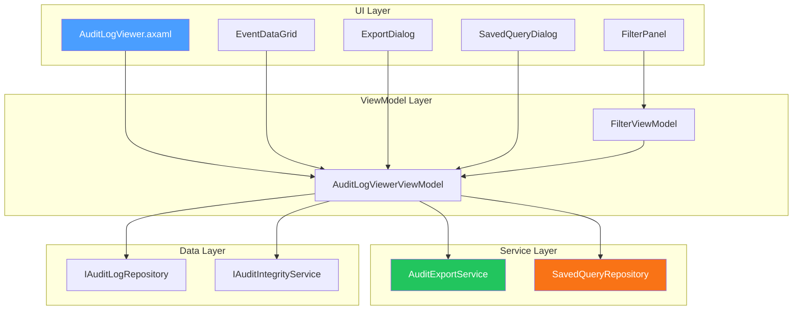

# LCS-DES-097c: Design Specification — Search/Export

## 1. Metadata & Categorization

| Field | Value | Description |
| :--- | :--- | :--- |
| **Feature ID** | `COL-097c` | Sub-part of COL-097 |
| **Feature Name** | `Query Logs, Export for Compliance` | Search and export capabilities |
| **Target Version** | `v0.9.7c` | Third sub-part of v0.9.7 |
| **Module Scope** | `Lexichord.Modules.Collaboration` | Collaboration module |
| **Swimlane** | `Governance` | Enterprise governance features |
| **License Tier** | `Enterprise` | Enterprise tier only |
| **Feature Gate Key** | `audit_logging` | License feature key |
| **Author** | Lead Architect | |
| **Status** | `Draft` | |
| **Last Updated** | `2026-01-27` | |
| **Parent Document** | [LCS-DES-097-INDEX](./LCS-DES-097-INDEX.md) | |
| **Scope Breakdown** | [LCS-SBD-097 §3.3](./LCS-SBD-097.md#33-v097c-searchexport) | |

---

## 2. Executive Summary

### 2.1 The Requirement

Enterprise administrators and compliance officers need to:

- **Search Effectively:** Find specific events among millions using multiple criteria
- **Filter Intelligently:** Narrow results by time, user, category, severity, and outcome
- **Export Flexibly:** Generate exports in formats compatible with SIEM, spreadsheets, and auditors
- **Save Queries:** Reuse common searches without reconfiguring filters
- **Verify Integrity:** Confirm logs haven't been tampered with

Without these capabilities, audit logs become an unusable data dump—technically compliant but practically useless for investigations or audits.

> **Goal:** Implement a powerful search interface and multi-format export capabilities for audit logs.

### 2.2 The Proposed Solution

Implement comprehensive search and export capabilities:

1. **Rich Query UI** — Multi-criteria filter panel with instant results
2. **Saved Queries** — Store and reuse common search configurations
3. **Multi-Format Export** — JSON, CSV, PDF, CEF/Syslog for SIEM
4. **Streaming Export** — Handle large datasets without memory issues
5. **Real-Time View** — Live updates as new events arrive

---

## 3. Architecture & Modular Strategy

### 3.1 Dependencies

#### 3.1.1 Upstream Dependencies

| Interface | Source Version | Purpose |
| :--- | :--- | :--- |
| `AuditEvent` | v0.9.7a | Event data to display/export |
| `IAuditLogRepository` | v0.9.7b | Query source |
| `IAuditIntegrityService` | v0.9.7b | Verify chain integrity |
| `IRegionManager` | v0.1.1b | Panel placement |
| `ILicenseContext` | v0.0.4c | Enterprise verification |
| `QuestPDF` | NuGet | PDF generation |
| `CsvHelper` | NuGet | CSV export |

#### 3.1.2 Downstream Consumers

| Interface | Target Version | Purpose |
| :--- | :--- | :--- |
| `IComplianceReportService` | v0.9.7d | Uses export for reports |

### 3.2 Component Architecture



---

## 4. Data Contract (The API)

### 4.1 Export Service Interface

```csharp
namespace Lexichord.Abstractions.Audit;

/// <summary>
/// Service for exporting audit logs in various formats.
/// </summary>
public interface IAuditExportService
{
    /// <summary>
    /// Exports audit logs matching the query to the specified format.
    /// </summary>
    /// <param name="query">Query parameters for filtering events.</param>
    /// <param name="format">Target export format.</param>
    /// <param name="outputStream">Stream to write export data to.</param>
    /// <param name="options">Optional export configuration.</param>
    /// <param name="progress">Optional progress reporter.</param>
    /// <param name="ct">Cancellation token.</param>
    /// <returns>Export result with statistics.</returns>
    Task<ExportResult> ExportAsync(
        AuditLogQuery query,
        AuditExportFormat format,
        Stream outputStream,
        ExportOptions? options = null,
        IProgress<ExportProgress>? progress = null,
        CancellationToken ct = default);

    /// <summary>
    /// Estimates the size and duration of an export operation.
    /// </summary>
    Task<ExportEstimate> EstimateExportAsync(
        AuditLogQuery query,
        AuditExportFormat format,
        CancellationToken ct = default);

    /// <summary>
    /// Streams audit events matching the filter in real-time.
    /// </summary>
    IAsyncEnumerable<AuditEvent> StreamEventsAsync(
        AuditLogQuery filter,
        CancellationToken ct = default);

    /// <summary>
    /// Gets the supported export formats.
    /// </summary>
    IReadOnlyList<ExportFormatInfo> GetSupportedFormats();
}

/// <summary>
/// Supported export formats.
/// </summary>
public enum AuditExportFormat
{
    /// <summary>Full JSON array with all fields.</summary>
    Json,

    /// <summary>JSON Lines format (one JSON object per line) for streaming.</summary>
    JsonLines,

    /// <summary>Comma-separated values for spreadsheet import.</summary>
    Csv,

    /// <summary>Formatted PDF document.</summary>
    Pdf,

    /// <summary>Common Event Format for SIEM integration.</summary>
    Cef,

    /// <summary>Syslog format (RFC 5424).</summary>
    Syslog,

    /// <summary>XML format for legacy systems.</summary>
    Xml
}

/// <summary>
/// Options for customizing export output.
/// </summary>
public record ExportOptions
{
    /// <summary>Fields to include (null = all fields).</summary>
    public IReadOnlyList<string>? IncludeFields { get; init; }

    /// <summary>Fields to exclude from output.</summary>
    public IReadOnlyList<string>? ExcludeFields { get; init; }

    /// <summary>Include header row (CSV) or schema info (JSON).</summary>
    public bool IncludeHeaders { get; init; } = true;

    /// <summary>DateTime format string (default: ISO 8601).</summary>
    public string? DateTimeFormat { get; init; }

    /// <summary>Target timezone for timestamps (default: UTC).</summary>
    public string? TimeZone { get; init; }

    /// <summary>Redact potentially sensitive fields.</summary>
    public bool RedactSensitiveData { get; init; } = false;

    /// <summary>Report title (PDF only).</summary>
    public string? ReportTitle { get; init; }

    /// <summary>Report description (PDF only).</summary>
    public string? ReportDescription { get; init; }

    /// <summary>Include company logo (PDF only).</summary>
    public byte[]? LogoImage { get; init; }

    /// <summary>Include integrity verification (PDF only).</summary>
    public bool IncludeIntegrityVerification { get; init; } = true;

    /// <summary>Page size for batching.</summary>
    public int BatchSize { get; init; } = 1000;
}

/// <summary>
/// Result of an export operation.
/// </summary>
public record ExportResult
{
    public required bool Success { get; init; }
    public required long EventsExported { get; init; }
    public required long BytesWritten { get; init; }
    public required TimeSpan Duration { get; init; }
    public string? ErrorMessage { get; init; }
    public string? OutputPath { get; init; }
    public string? IntegrityHash { get; init; }
}

/// <summary>
/// Progress information during export.
/// </summary>
public record ExportProgress
{
    public required long EventsProcessed { get; init; }
    public required long TotalEvents { get; init; }
    public required double PercentComplete { get; init; }
    public required TimeSpan Elapsed { get; init; }
    public TimeSpan? EstimatedRemaining { get; init; }
    public string? CurrentPhase { get; init; }
}

/// <summary>
/// Estimate for an export operation.
/// </summary>
public record ExportEstimate
{
    public required long EstimatedEventCount { get; init; }
    public required long EstimatedBytes { get; init; }
    public required TimeSpan EstimatedDuration { get; init; }
    public string? Warning { get; init; }
}

/// <summary>
/// Information about a supported export format.
/// </summary>
public record ExportFormatInfo
{
    public required AuditExportFormat Format { get; init; }
    public required string Name { get; init; }
    public required string Description { get; init; }
    public required string FileExtension { get; init; }
    public required string MimeType { get; init; }
    public bool SupportsStreaming { get; init; }
}
```

### 4.2 Saved Query Interface

```csharp
namespace Lexichord.Abstractions.Audit;

/// <summary>
/// A saved audit log query for reuse.
/// </summary>
public record SavedAuditQuery
{
    public required Guid QueryId { get; init; }
    public required string Name { get; init; }
    public string? Description { get; init; }
    public required AuditLogQuery Query { get; init; }
    public required Guid CreatedByUserId { get; init; }
    public required string CreatedByUserName { get; init; }
    public required DateTimeOffset CreatedAt { get; init; }
    public DateTimeOffset? LastUsedAt { get; init; }
    public int UseCount { get; init; }
    public bool IsShared { get; init; }
    public bool IsPinned { get; init; }
}

/// <summary>
/// Repository for saved audit queries.
/// </summary>
public interface ISavedQueryRepository
{
    /// <summary>
    /// Saves a new query or updates an existing one.
    /// </summary>
    Task<SavedAuditQuery> SaveAsync(SavedAuditQuery query, CancellationToken ct = default);

    /// <summary>
    /// Gets all queries accessible to the specified user.
    /// </summary>
    Task<IReadOnlyList<SavedAuditQuery>> GetAllAsync(Guid userId, CancellationToken ct = default);

    /// <summary>
    /// Gets a specific query by ID.
    /// </summary>
    Task<SavedAuditQuery?> GetByIdAsync(Guid queryId, CancellationToken ct = default);

    /// <summary>
    /// Deletes a saved query.
    /// </summary>
    Task DeleteAsync(Guid queryId, CancellationToken ct = default);

    /// <summary>
    /// Records that a query was used (updates LastUsedAt and UseCount).
    /// </summary>
    Task RecordUsageAsync(Guid queryId, CancellationToken ct = default);

    /// <summary>
    /// Toggles the pinned status of a query.
    /// </summary>
    Task TogglePinnedAsync(Guid queryId, CancellationToken ct = default);
}
```

---

## 5. Implementation Logic

### 5.1 AuditExportService Implementation

```csharp
namespace Lexichord.Modules.Collaboration.Audit;

/// <summary>
/// Multi-format export service for audit logs.
/// </summary>
public class AuditExportService(
    IAuditLogRepository repository,
    IAuditIntegrityService integrityService,
    ILogger<AuditExportService> logger) : IAuditExportService
{
    private static readonly IReadOnlyList<ExportFormatInfo> _formats = new[]
    {
        new ExportFormatInfo
        {
            Format = AuditExportFormat.Json,
            Name = "JSON",
            Description = "Full JSON with all fields",
            FileExtension = ".json",
            MimeType = "application/json",
            SupportsStreaming = false
        },
        new ExportFormatInfo
        {
            Format = AuditExportFormat.JsonLines,
            Name = "JSON Lines",
            Description = "Streaming JSON (one object per line)",
            FileExtension = ".jsonl",
            MimeType = "application/x-ndjson",
            SupportsStreaming = true
        },
        new ExportFormatInfo
        {
            Format = AuditExportFormat.Csv,
            Name = "CSV",
            Description = "Comma-separated values for spreadsheets",
            FileExtension = ".csv",
            MimeType = "text/csv",
            SupportsStreaming = true
        },
        new ExportFormatInfo
        {
            Format = AuditExportFormat.Pdf,
            Name = "PDF Report",
            Description = "Formatted PDF document",
            FileExtension = ".pdf",
            MimeType = "application/pdf",
            SupportsStreaming = false
        },
        new ExportFormatInfo
        {
            Format = AuditExportFormat.Cef,
            Name = "CEF",
            Description = "Common Event Format for SIEM",
            FileExtension = ".cef",
            MimeType = "text/plain",
            SupportsStreaming = true
        },
        new ExportFormatInfo
        {
            Format = AuditExportFormat.Syslog,
            Name = "Syslog",
            Description = "RFC 5424 Syslog format",
            FileExtension = ".log",
            MimeType = "text/plain",
            SupportsStreaming = true
        }
    };

    public IReadOnlyList<ExportFormatInfo> GetSupportedFormats() => _formats;

    public async Task<ExportResult> ExportAsync(
        AuditLogQuery query,
        AuditExportFormat format,
        Stream outputStream,
        ExportOptions? options = null,
        IProgress<ExportProgress>? progress = null,
        CancellationToken ct = default)
    {
        options ??= new ExportOptions();
        var stopwatch = Stopwatch.StartNew();
        long eventsExported = 0;
        long bytesWritten = 0;

        try
        {
            var totalCount = await repository.CountAsync(query, ct);

            var exporter = format switch
            {
                AuditExportFormat.Json => ExportJsonAsync(query, outputStream, options, progress, totalCount, ct),
                AuditExportFormat.JsonLines => ExportJsonLinesAsync(query, outputStream, options, progress, totalCount, ct),
                AuditExportFormat.Csv => ExportCsvAsync(query, outputStream, options, progress, totalCount, ct),
                AuditExportFormat.Pdf => ExportPdfAsync(query, outputStream, options, progress, totalCount, ct),
                AuditExportFormat.Cef => ExportCefAsync(query, outputStream, options, progress, totalCount, ct),
                AuditExportFormat.Syslog => ExportSyslogAsync(query, outputStream, options, progress, totalCount, ct),
                _ => throw new NotSupportedException($"Format {format} is not supported")
            };

            (eventsExported, bytesWritten) = await exporter;

            stopwatch.Stop();

            logger.LogInformation(
                "Exported {Count} events to {Format} in {Duration}ms ({Bytes} bytes)",
                eventsExported, format, stopwatch.ElapsedMilliseconds, bytesWritten);

            return new ExportResult
            {
                Success = true,
                EventsExported = eventsExported,
                BytesWritten = bytesWritten,
                Duration = stopwatch.Elapsed
            };
        }
        catch (Exception ex)
        {
            logger.LogError(ex, "Export to {Format} failed after {Count} events", format, eventsExported);

            return new ExportResult
            {
                Success = false,
                EventsExported = eventsExported,
                BytesWritten = bytesWritten,
                Duration = stopwatch.Elapsed,
                ErrorMessage = ex.Message
            };
        }
    }

    public async Task<ExportEstimate> EstimateExportAsync(
        AuditLogQuery query,
        AuditExportFormat format,
        CancellationToken ct = default)
    {
        var count = await repository.CountAsync(query, ct);

        // Rough estimates based on format and average event size
        var bytesPerEvent = format switch
        {
            AuditExportFormat.Json => 800,
            AuditExportFormat.JsonLines => 750,
            AuditExportFormat.Csv => 400,
            AuditExportFormat.Pdf => 200, // Compressed
            AuditExportFormat.Cef => 500,
            AuditExportFormat.Syslog => 450,
            _ => 500
        };

        var msPerEvent = format switch
        {
            AuditExportFormat.Pdf => 0.5, // Slower due to rendering
            _ => 0.1
        };

        var estimatedBytes = count * bytesPerEvent;
        var estimatedDuration = TimeSpan.FromMilliseconds(count * msPerEvent);

        string? warning = null;
        if (count > 100_000)
        {
            warning = "Large export may take several minutes. Consider narrowing the date range.";
        }

        return new ExportEstimate
        {
            EstimatedEventCount = count,
            EstimatedBytes = estimatedBytes,
            EstimatedDuration = estimatedDuration,
            Warning = warning
        };
    }

    public async IAsyncEnumerable<AuditEvent> StreamEventsAsync(
        AuditLogQuery filter,
        [EnumeratorCancellation] CancellationToken ct = default)
    {
        int skip = 0;
        const int batchSize = 100;

        while (!ct.IsCancellationRequested)
        {
            var batch = await repository.QueryAsync(
                filter with { Skip = skip, Take = batchSize },
                ct);

            if (batch.Count == 0)
                yield break;

            foreach (var evt in batch)
            {
                yield return evt;
            }

            skip += batch.Count;

            if (batch.Count < batchSize)
                yield break;
        }
    }

    #region Format-Specific Exporters

    private async Task<(long events, long bytes)> ExportCsvAsync(
        AuditLogQuery query,
        Stream output,
        ExportOptions options,
        IProgress<ExportProgress>? progress,
        long totalCount,
        CancellationToken ct)
    {
        using var writer = new StreamWriter(output, Encoding.UTF8, leaveOpen: true);
        using var csv = new CsvWriter(writer, CultureInfo.InvariantCulture);

        if (options.IncludeHeaders)
        {
            csv.WriteHeader<AuditEventCsvDto>();
            await csv.NextRecordAsync();
        }

        long count = 0;
        var startPosition = output.Position;

        await foreach (var evt in StreamEventsAsync(query, ct))
        {
            var dto = MapToCsvDto(evt, options);
            csv.WriteRecord(dto);
            await csv.NextRecordAsync();

            count++;
            if (count % 1000 == 0)
            {
                ReportProgress(progress, count, totalCount);
            }
        }

        await writer.FlushAsync(ct);
        return (count, output.Position - startPosition);
    }

    private async Task<(long events, long bytes)> ExportJsonAsync(
        AuditLogQuery query,
        Stream output,
        ExportOptions options,
        IProgress<ExportProgress>? progress,
        long totalCount,
        CancellationToken ct)
    {
        var events = new List<AuditEvent>();

        await foreach (var evt in StreamEventsAsync(query, ct))
        {
            events.Add(evt);
            if (events.Count % 1000 == 0)
            {
                ReportProgress(progress, events.Count, totalCount);
            }
        }

        var jsonOptions = new JsonSerializerOptions
        {
            WriteIndented = true,
            PropertyNamingPolicy = JsonNamingPolicy.CamelCase,
            Converters = { new JsonStringEnumConverter() }
        };

        var startPosition = output.Position;
        await JsonSerializer.SerializeAsync(output, events, jsonOptions, ct);

        return (events.Count, output.Position - startPosition);
    }

    private async Task<(long events, long bytes)> ExportJsonLinesAsync(
        AuditLogQuery query,
        Stream output,
        ExportOptions options,
        IProgress<ExportProgress>? progress,
        long totalCount,
        CancellationToken ct)
    {
        using var writer = new StreamWriter(output, Encoding.UTF8, leaveOpen: true);

        var jsonOptions = new JsonSerializerOptions
        {
            PropertyNamingPolicy = JsonNamingPolicy.CamelCase,
            Converters = { new JsonStringEnumConverter() }
        };

        long count = 0;
        var startPosition = output.Position;

        await foreach (var evt in StreamEventsAsync(query, ct))
        {
            var json = JsonSerializer.Serialize(evt, jsonOptions);
            await writer.WriteLineAsync(json.AsMemory(), ct);

            count++;
            if (count % 1000 == 0)
            {
                ReportProgress(progress, count, totalCount);
            }
        }

        await writer.FlushAsync(ct);
        return (count, output.Position - startPosition);
    }

    private async Task<(long events, long bytes)> ExportCefAsync(
        AuditLogQuery query,
        Stream output,
        ExportOptions options,
        IProgress<ExportProgress>? progress,
        long totalCount,
        CancellationToken ct)
    {
        using var writer = new StreamWriter(output, Encoding.UTF8, leaveOpen: true);

        long count = 0;
        var startPosition = output.Position;

        await foreach (var evt in StreamEventsAsync(query, ct))
        {
            var cef = FormatCefEvent(evt);
            await writer.WriteLineAsync(cef.AsMemory(), ct);

            count++;
            if (count % 1000 == 0)
            {
                ReportProgress(progress, count, totalCount);
            }
        }

        await writer.FlushAsync(ct);
        return (count, output.Position - startPosition);
    }

    private async Task<(long events, long bytes)> ExportSyslogAsync(
        AuditLogQuery query,
        Stream output,
        ExportOptions options,
        IProgress<ExportProgress>? progress,
        long totalCount,
        CancellationToken ct)
    {
        using var writer = new StreamWriter(output, Encoding.UTF8, leaveOpen: true);

        long count = 0;
        var startPosition = output.Position;

        await foreach (var evt in StreamEventsAsync(query, ct))
        {
            var syslog = FormatSyslogEvent(evt);
            await writer.WriteLineAsync(syslog.AsMemory(), ct);

            count++;
            if (count % 1000 == 0)
            {
                ReportProgress(progress, count, totalCount);
            }
        }

        await writer.FlushAsync(ct);
        return (count, output.Position - startPosition);
    }

    private async Task<(long events, long bytes)> ExportPdfAsync(
        AuditLogQuery query,
        Stream output,
        ExportOptions options,
        IProgress<ExportProgress>? progress,
        long totalCount,
        CancellationToken ct)
    {
        // Collect events first (PDF needs random access)
        var events = new List<AuditEvent>();
        await foreach (var evt in StreamEventsAsync(query, ct))
        {
            events.Add(evt);
            if (events.Count % 1000 == 0)
            {
                ReportProgress(progress, events.Count, totalCount);
            }
        }

        // Generate PDF using QuestPDF
        var document = new AuditLogPdfDocument(events, options, query);
        var startPosition = output.Position;
        document.GeneratePdf(output);

        return (events.Count, output.Position - startPosition);
    }

    #endregion

    #region Format Helpers

    private static string FormatCefEvent(AuditEvent evt)
    {
        // CEF:Version|Device Vendor|Device Product|Device Version|Signature ID|Name|Severity|Extension
        var severity = evt.Severity switch
        {
            AuditSeverity.Info => 1,
            AuditSeverity.Warning => 5,
            AuditSeverity.Error => 8,
            AuditSeverity.Critical => 10,
            _ => 1
        };

        var extensions = new StringBuilder();
        extensions.Append($"rt={evt.Timestamp.ToUnixTimeMilliseconds()} ");
        extensions.Append($"src={evt.IpAddress ?? "unknown"} ");
        extensions.Append($"suser={EscapeCef(evt.UserName)} ");
        extensions.Append($"act={EscapeCef(evt.Action)} ");
        extensions.Append($"outcome={evt.Outcome} ");

        if (evt.ResourceType != null)
            extensions.Append($"cs1={EscapeCef(evt.ResourceType)} cs1Label=ResourceType ");
        if (evt.ResourceId != null)
            extensions.Append($"cs2={EscapeCef(evt.ResourceId)} cs2Label=ResourceId ");

        return $"CEF:0|Lexichord|AuditLog|1.0|{(int)evt.EventType}|{evt.EventType}|{severity}|{extensions}";
    }

    private static string FormatSyslogEvent(AuditEvent evt)
    {
        // RFC 5424: <PRI>VERSION TIMESTAMP HOSTNAME APP-NAME PROCID MSGID STRUCTURED-DATA MSG
        var pri = evt.Severity switch
        {
            AuditSeverity.Info => 134,    // Local0.Info
            AuditSeverity.Warning => 132, // Local0.Warning
            AuditSeverity.Error => 131,   // Local0.Error
            AuditSeverity.Critical => 130, // Local0.Critical
            _ => 134
        };

        var timestamp = evt.Timestamp.ToString("yyyy-MM-ddTHH:mm:ss.fffZ");
        var structuredData = $"[audit@lexichord eventId=\"{evt.EventId}\" userId=\"{evt.UserId}\" outcome=\"{evt.Outcome}\"]";

        return $"<{pri}>1 {timestamp} lexichord audit {evt.EventId:N} {evt.EventType} {structuredData} {evt.Action}";
    }

    private static string EscapeCef(string value)
    {
        return value
            .Replace("\\", "\\\\")
            .Replace("=", "\\=")
            .Replace("|", "\\|")
            .Replace("\n", "\\n")
            .Replace("\r", "\\r");
    }

    private static void ReportProgress(
        IProgress<ExportProgress>? progress,
        long processed,
        long total)
    {
        progress?.Report(new ExportProgress
        {
            EventsProcessed = processed,
            TotalEvents = total,
            PercentComplete = total > 0 ? (double)processed / total * 100 : 0,
            Elapsed = TimeSpan.Zero, // Would need stopwatch in caller
            CurrentPhase = "Exporting events"
        });
    }

    #endregion
}
```

### 5.2 ViewModel Implementation

```csharp
namespace Lexichord.Modules.Collaboration.ViewModels;

/// <summary>
/// ViewModel for the Audit Log Viewer.
/// </summary>
public partial class AuditLogViewerViewModel : ObservableObject
{
    private readonly IAuditLogRepository _repository;
    private readonly IAuditExportService _exportService;
    private readonly ISavedQueryRepository _savedQueryRepository;
    private readonly IAuditIntegrityService _integrityService;
    private readonly ILicenseContext _licenseContext;

    [ObservableProperty]
    private ObservableCollection<AuditEventViewModel> _events = [];

    [ObservableProperty]
    private ObservableCollection<SavedAuditQuery> _savedQueries = [];

    [ObservableProperty]
    private AuditEventViewModel? _selectedEvent;

    [ObservableProperty]
    private bool _isLoading;

    [ObservableProperty]
    private long _totalCount;

    [ObservableProperty]
    private int _currentPage = 1;

    [ObservableProperty]
    private int _pageSize = 50;

    #region Filter Properties

    [ObservableProperty]
    private DateTimeOffset? _fromDate;

    [ObservableProperty]
    private DateTimeOffset? _toDate;

    [ObservableProperty]
    private string? _selectedUserId;

    [ObservableProperty]
    private AuditEventCategory? _selectedCategory;

    [ObservableProperty]
    private AuditEventType? _selectedEventType;

    [ObservableProperty]
    private AuditSeverity? _selectedSeverity;

    [ObservableProperty]
    private AuditOutcome? _selectedOutcome;

    [ObservableProperty]
    private string? _searchText;

    #endregion

    public AuditLogViewerViewModel(
        IAuditLogRepository repository,
        IAuditExportService exportService,
        ISavedQueryRepository savedQueryRepository,
        IAuditIntegrityService integrityService,
        ILicenseContext licenseContext)
    {
        _repository = repository;
        _exportService = exportService;
        _savedQueryRepository = savedQueryRepository;
        _integrityService = integrityService;
        _licenseContext = licenseContext;

        // Default to last 7 days
        FromDate = DateTimeOffset.UtcNow.AddDays(-7);
        ToDate = DateTimeOffset.UtcNow;
    }

    public async Task InitializeAsync()
    {
        await LoadSavedQueriesAsync();
        await RefreshAsync();
    }

    [RelayCommand]
    private async Task RefreshAsync()
    {
        if (!_licenseContext.HasFeature(LicenseFeature.AuditLogging))
            return;

        IsLoading = true;

        try
        {
            var query = BuildQuery();
            TotalCount = await _repository.CountAsync(query);
            var events = await _repository.QueryAsync(query);

            Events.Clear();
            foreach (var evt in events)
            {
                Events.Add(new AuditEventViewModel(evt));
            }
        }
        finally
        {
            IsLoading = false;
        }
    }

    [RelayCommand]
    private void ClearFilters()
    {
        FromDate = DateTimeOffset.UtcNow.AddDays(-7);
        ToDate = DateTimeOffset.UtcNow;
        SelectedUserId = null;
        SelectedCategory = null;
        SelectedEventType = null;
        SelectedSeverity = null;
        SelectedOutcome = null;
        SearchText = null;
    }

    [RelayCommand]
    private async Task ExportAsync(AuditExportFormat format)
    {
        var query = BuildQuery() with { Take = int.MaxValue, Skip = 0 };

        // Show file save dialog
        var filePath = await ShowSaveDialogAsync(format);
        if (filePath == null) return;

        IsLoading = true;

        try
        {
            using var stream = File.Create(filePath);
            var result = await _exportService.ExportAsync(
                query,
                format,
                stream,
                new ExportOptions { ReportTitle = "Audit Log Export" });

            if (result.Success)
            {
                await ShowNotificationAsync($"Exported {result.EventsExported} events to {filePath}");
            }
            else
            {
                await ShowErrorAsync($"Export failed: {result.ErrorMessage}");
            }
        }
        finally
        {
            IsLoading = false;
        }
    }

    [RelayCommand]
    private async Task SaveCurrentQueryAsync()
    {
        var name = await ShowInputDialogAsync("Save Query", "Enter a name for this query:");
        if (string.IsNullOrWhiteSpace(name)) return;

        var savedQuery = new SavedAuditQuery
        {
            QueryId = Guid.NewGuid(),
            Name = name,
            Query = BuildQuery() with { Skip = 0, Take = PageSize },
            CreatedByUserId = _licenseContext.CurrentUserId,
            CreatedByUserName = _licenseContext.CurrentUserName,
            CreatedAt = DateTimeOffset.UtcNow,
            IsShared = false
        };

        await _savedQueryRepository.SaveAsync(savedQuery);
        await LoadSavedQueriesAsync();
    }

    [RelayCommand]
    private async Task LoadSavedQueryAsync(SavedAuditQuery query)
    {
        FromDate = query.Query.FromTimestamp;
        ToDate = query.Query.ToTimestamp;
        SelectedCategory = query.Query.Category;
        SelectedEventType = query.Query.EventType;
        SelectedSeverity = query.Query.MinimumSeverity;
        SelectedOutcome = query.Query.Outcome;
        SearchText = query.Query.SearchText;

        await _savedQueryRepository.RecordUsageAsync(query.QueryId);
        await RefreshAsync();
    }

    [RelayCommand]
    private async Task VerifyIntegrityAsync()
    {
        if (FromDate == null || ToDate == null) return;

        IsLoading = true;

        try
        {
            var result = await _integrityService.VerifyChainAsync(FromDate.Value, ToDate.Value);

            if (result.IsValid)
            {
                await ShowNotificationAsync(
                    $"Integrity verified: {result.EventsVerified} events checked in {result.VerificationDuration.TotalSeconds:F1}s");
            }
            else
            {
                await ShowErrorAsync(
                    $"Integrity check failed: {result.ValidationError}\n" +
                    $"First invalid event at index {result.FirstInvalidEventIndex}");
            }
        }
        finally
        {
            IsLoading = false;
        }
    }

    private AuditLogQuery BuildQuery()
    {
        return new AuditLogQuery
        {
            FromTimestamp = FromDate,
            ToTimestamp = ToDate,
            UserId = SelectedUserId != null ? Guid.Parse(SelectedUserId) : null,
            Category = SelectedCategory,
            EventType = SelectedEventType,
            MinimumSeverity = SelectedSeverity,
            Outcome = SelectedOutcome,
            SearchText = SearchText,
            Skip = (CurrentPage - 1) * PageSize,
            Take = PageSize,
            SortOrder = AuditLogSortOrder.TimestampDescending
        };
    }

    private async Task LoadSavedQueriesAsync()
    {
        var queries = await _savedQueryRepository.GetAllAsync(_licenseContext.CurrentUserId);
        SavedQueries.Clear();
        foreach (var q in queries.OrderByDescending(q => q.IsPinned).ThenByDescending(q => q.LastUsedAt))
        {
            SavedQueries.Add(q);
        }
    }
}
```

---

## 6. UI/UX Specifications

### 6.1 Audit Log Viewer Layout

```text
┌──────────────────────────────────────────────────────────────────────────────────┐
│  Audit Log Viewer                                       [Verify Integrity] [Export ▼]│
├──────────────────────────────────────────────────────────────────────────────────┤
│ ┌─ Quick Filters ─────────────────────────────────────────────────────────────┐ │
│ │ [Today] [Last 7 Days] [Last 30 Days] [Last 90 Days] [Custom Range...]       │ │
│ └─────────────────────────────────────────────────────────────────────────────┘ │
│                                                                                  │
│ ┌─ Filters ───────────────────────────────────────────────────────────────────┐ │
│ │ From: [📅 2026-01-20    ] To: [📅 2026-01-27    ]                           │ │
│ │                                                                              │ │
│ │ User:     [▼ All Users          ] Category: [▼ All Categories    ]          │ │
│ │ Type:     [▼ All Types          ] Severity: [▼ All Severities    ]          │ │
│ │ Outcome:  [▼ All Outcomes       ]                                            │ │
│ │                                                                              │ │
│ │ Search: [🔍 Search action text...                                    ]       │ │
│ │                                                                              │ │
│ │ [Apply] [Clear] [Save Query...] ──── Saved: [▼ Select saved query... ]      │ │
│ └──────────────────────────────────────────────────────────────────────────────┘ │
├──────────────────────────────────────────────────────────────────────────────────┤
│ Showing 1-50 of 23,456 events                                        [🔄 Refresh] │
├──────────────────────────────────────────────────────────────────────────────────┤
│ │▼│ Timestamp          │ User        │ Category     │ Action           │ Outcome│ │
│ ├──┼────────────────────┼─────────────┼──────────────┼──────────────────┼────────┤ │
│ │  │ 2026-01-27 10:23:45│ john.doe    │ DataMod      │ DocumentModified │   ✓    │ │
│ │▼ │ 2026-01-27 10:22:30│ jane.smith  │ AI           │ PromptSubmitted  │   ✓    │ │
│ │  │ ┌─ Event Details ──────────────────────────────────────────────────────┐  │ │
│ │  │ │ Event ID: 7f3a8b2c-1234-5678-90ab-cdef12345678                       │  │ │
│ │  │ │ ─────────────────────────────────────────────────────────────────────│  │ │
│ │  │ │ Actor:                                                                │  │ │
│ │  │ │   User: jane.smith (jane.smith@company.com)                          │  │ │
│ │  │ │   Profile: "Work - Acme Corp"                                        │  │ │
│ │  │ │                                                                       │  │ │
│ │  │ │ Resource:                                                             │  │ │
│ │  │ │   Type: AIConversation                                                │  │ │
│ │  │ │   ID: conv-xyz789                                                     │  │ │
│ │  │ │                                                                       │  │ │
│ │  │ │ Context:                                                              │  │ │
│ │  │ │   IP: 192.168.1.100                                                   │  │ │
│ │  │ │   Session: sess-abc123                                                │  │ │
│ │  │ │   Correlation: trace-456                                              │  │ │
│ │  │ │                                                                       │  │ │
│ │  │ │ Details:                                                              │  │ │
│ │  │ │   {"prompt": "Summarize this document", "tokens": 150}               │  │ │
│ │  │ │                                                                       │  │ │
│ │  │ │ Integrity: ✓ Hash verified (3a7f8b2c...)                             │  │ │
│ │  │ └───────────────────────────────────────────────────────────────────────┘  │ │
│ │  │ 2026-01-27 10:20:15│ admin       │ Config       │ SettingChanged   │   ✓    │ │
│ │  │ 2026-01-27 10:15:22│ john.doe    │ Auth         │ PermissionDenied │   ⚠    │ │
│ │  │ 2026-01-27 10:10:05│ jane.smith  │ Auth         │ UserLogin        │   ✓    │ │
│ │  │ [More events...]                                                           │ │
├──────────────────────────────────────────────────────────────────────────────────┤
│ ◄ Previous │ Page [1] of 470 │ Next ►               Items per page: [▼ 50 ]     │
└──────────────────────────────────────────────────────────────────────────────────┘
```

### 6.2 Export Dialog

```text
┌─ Export Audit Logs ─────────────────────────────────────────────────────────┐
│                                                                              │
│  Export Format:                                                              │
│  ┌─────────────────────────────────────────────────────────────────────────┐ │
│  │ ○ JSON        Full JSON with all fields                                 │ │
│  │ ○ JSON Lines  Streaming format (one object per line)                   │ │
│  │ ● CSV         Comma-separated values for spreadsheets                  │ │
│  │ ○ PDF         Formatted PDF report                                     │ │
│  │ ○ CEF         Common Event Format for SIEM                             │ │
│  │ ○ Syslog      RFC 5424 format for log aggregators                      │ │
│  └─────────────────────────────────────────────────────────────────────────┘ │
│                                                                              │
│  Export Options:                                                             │
│  [✓] Include headers                                                         │
│  [ ] Redact sensitive data (email addresses, IP addresses)                  │
│  [✓] Include integrity verification hash                                    │
│                                                                              │
│  Estimate:                                                                   │
│  ┌─────────────────────────────────────────────────────────────────────────┐ │
│  │  Events: 23,456                                                         │ │
│  │  Size: ~9.4 MB                                                          │ │
│  │  Duration: ~3 seconds                                                   │ │
│  └─────────────────────────────────────────────────────────────────────────┘ │
│                                                                              │
│                                              [Cancel]  [Export]              │
└──────────────────────────────────────────────────────────────────────────────┘
```

### 6.3 Component Styling

| Component | Theme Resource | Notes |
| :--- | :--- | :--- |
| Success outcome | `Brush.Accent.Success` | Green checkmark (✓) |
| Failure outcome | `Brush.Accent.Error` | Red X |
| Denied outcome | `Brush.Accent.Warning` | Orange warning (⚠) |
| Expanded row | `Brush.Surface.Secondary` | Subtle background |
| Filter panel | `Brush.Surface.Primary` | Card-like appearance |
| Critical severity row | `Brush.Surface.Error` | Light red background |

---

## 7. Test Scenarios

```csharp
[Trait("Category", "Unit")]
[Trait("Version", "v0.9.7c")]
public class AuditExportServiceTests
{
    [Fact]
    public async Task ExportCsvAsync_ValidQuery_GeneratesCorrectFormat()
    {
        // Arrange
        var events = CreateTestEvents(10);
        var sut = CreateExportService(events);
        using var stream = new MemoryStream();

        // Act
        var result = await sut.ExportAsync(
            new AuditLogQuery(),
            AuditExportFormat.Csv,
            stream);

        // Assert
        result.Success.Should().BeTrue();
        result.EventsExported.Should().Be(10);

        stream.Position = 0;
        using var reader = new StreamReader(stream);
        var content = await reader.ReadToEndAsync();

        content.Should().Contain("EventId");  // Header
        content.Should().Contain("Timestamp");
        content.Split('\n').Length.Should().Be(12); // Header + 10 events + trailing
    }

    [Fact]
    public async Task ExportCefAsync_ValidEvent_GeneratesValidCefFormat()
    {
        // Arrange
        var events = CreateTestEvents(1);
        var sut = CreateExportService(events);
        using var stream = new MemoryStream();

        // Act
        var result = await sut.ExportAsync(
            new AuditLogQuery(),
            AuditExportFormat.Cef,
            stream);

        // Assert
        stream.Position = 0;
        using var reader = new StreamReader(stream);
        var line = await reader.ReadLineAsync();

        line.Should().StartWith("CEF:0|Lexichord|AuditLog|1.0|");
        line.Should().Contain("suser=");
        line.Should().Contain("act=");
    }

    [Fact]
    public async Task ExportSyslogAsync_ValidEvent_GeneratesRfc5424Format()
    {
        // Arrange
        var events = CreateTestEvents(1);
        var sut = CreateExportService(events);
        using var stream = new MemoryStream();

        // Act
        var result = await sut.ExportAsync(
            new AuditLogQuery(),
            AuditExportFormat.Syslog,
            stream);

        // Assert
        stream.Position = 0;
        using var reader = new StreamReader(stream);
        var line = await reader.ReadLineAsync();

        line.Should().MatchRegex(@"^<\d+>1 \d{4}-\d{2}-\d{2}T");
        line.Should().Contain("[audit@lexichord");
    }

    [Fact]
    public async Task EstimateExportAsync_LargeDataset_ReturnsWarning()
    {
        // Arrange
        var sut = CreateExportService(new List<AuditEvent>(), eventCount: 150_000);

        // Act
        var estimate = await sut.EstimateExportAsync(
            new AuditLogQuery(),
            AuditExportFormat.Csv);

        // Assert
        estimate.EstimatedEventCount.Should().Be(150_000);
        estimate.Warning.Should().NotBeNullOrEmpty();
    }
}

[Trait("Category", "Unit")]
[Trait("Version", "v0.9.7c")]
public class SavedQueryRepositoryTests
{
    [Fact]
    public async Task SaveAsync_ValidQuery_PersistsAndReturns()
    {
        // Arrange
        var sut = CreateRepository();
        var query = CreateTestSavedQuery();

        // Act
        var result = await sut.SaveAsync(query);

        // Assert
        result.Should().NotBeNull();
        result.QueryId.Should().Be(query.QueryId);
    }

    [Fact]
    public async Task GetAllAsync_MultipleQueries_ReturnsSortedByUsage()
    {
        // Arrange
        var sut = CreateRepository();
        var userId = Guid.NewGuid();

        var q1 = await sut.SaveAsync(CreateTestSavedQuery(userId, "Query 1"));
        var q2 = await sut.SaveAsync(CreateTestSavedQuery(userId, "Query 2"));
        var q3 = await sut.SaveAsync(CreateTestSavedQuery(userId, "Query 3") with { IsPinned = true });

        await sut.RecordUsageAsync(q1.QueryId);
        await sut.RecordUsageAsync(q1.QueryId);

        // Act
        var results = await sut.GetAllAsync(userId);

        // Assert
        results[0].Name.Should().Be("Query 3"); // Pinned first
        results[1].Name.Should().Be("Query 1"); // Most used
    }
}
```

---

## 8. Observability & Logging

| Level | Message Template |
| :--- | :--- |
| Debug | `"Starting export to {Format} for query: {Query}"` |
| Info | `"Exported {Count} events to {Format} in {Duration}ms ({Bytes} bytes)"` |
| Warning | `"Export exceeded size threshold: {Bytes} bytes"` |
| Error | `"Export to {Format} failed after {Count} events: {Error}"` |
| Debug | `"Saved query '{Name}' for user {UserId}"` |
| Debug | `"Loaded query '{Name}' (used {UseCount} times)"` |

---

## 9. Acceptance Criteria

| # | Given | When | Then |
| :--- | :--- | :--- | :--- |
| 1 | Events in database | Export to CSV | Valid CSV with headers |
| 2 | Events in database | Export to JSON | Valid JSON array |
| 3 | Events in database | Export to CEF | Valid CEF format |
| 4 | Events in database | Export to Syslog | RFC 5424 compliant |
| 5 | Large dataset (>100k) | Export requested | Progress reported |
| 6 | Query configured | Save query | Query persisted |
| 7 | Saved query exists | Load query | Filters populated |
| 8 | Date range selected | Verify integrity | Result displayed |
| 9 | Filter applied | Refresh | Only matching events shown |
| 10 | Event selected | Expand row | Details displayed |

---

## 10. Deliverable Checklist

| # | Deliverable | Status |
| :--- | :--- | :--- |
| 1 | `IAuditExportService` interface | [ ] |
| 2 | `AuditExportFormat` enum | [ ] |
| 3 | `ExportOptions` record | [ ] |
| 4 | `ExportResult` record | [ ] |
| 5 | `AuditExportService` implementation | [ ] |
| 6 | JSON export format | [ ] |
| 7 | JSON Lines export format | [ ] |
| 8 | CSV export format | [ ] |
| 9 | CEF export format | [ ] |
| 10 | Syslog export format | [ ] |
| 11 | PDF export format | [ ] |
| 12 | `ISavedQueryRepository` interface | [ ] |
| 13 | `SavedAuditQuery` record | [ ] |
| 14 | `SavedQueryRepository` implementation | [ ] |
| 15 | `AuditLogViewer.axaml` | [ ] |
| 16 | `AuditLogViewerViewModel` | [ ] |
| 17 | Filter panel component | [ ] |
| 18 | Export dialog | [ ] |
| 19 | Unit tests for export formats | [ ] |
| 20 | Integration tests | [ ] |

---

## 11. Verification Commands

```bash
# Run export service tests
dotnet test --filter "FullyQualifiedName~AuditExportServiceTests"

# Run saved query tests
dotnet test --filter "FullyQualifiedName~SavedQueryRepositoryTests"

# Run all v0.9.7c tests
dotnet test --filter "Version=v0.9.7c"

# Manual verification:
# 1. Open Audit Log Viewer
# 2. Set date range and filters
# 3. Export in each format
# 4. Verify output in target application (Excel for CSV, Splunk for CEF)
```

---

## Document History

| Version | Date | Author | Changes |
| :--- | :--- | :--- | :--- |
| 1.0 | 2026-01-27 | Lead Architect | Initial draft |
