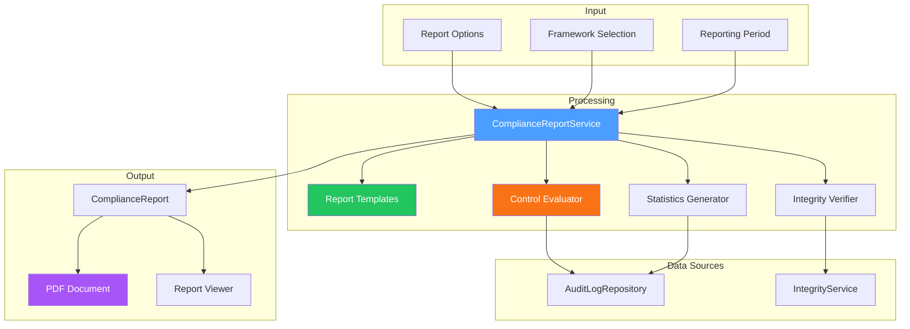

# LCS-DES-097d: Design Specification — Compliance Reports

## 1. Metadata & Categorization

| Field | Value | Description |
| :--- | :--- | :--- |
| **Feature ID** | `COL-097d` | Sub-part of COL-097 |
| **Feature Name** | `Pre-Built SOC2/HIPAA Reports` | Compliance report generation |
| **Target Version** | `v0.9.7d` | Fourth sub-part of v0.9.7 |
| **Module Scope** | `Lexichord.Modules.Collaboration` | Collaboration module |
| **Swimlane** | `Governance` | Enterprise governance features |
| **License Tier** | `Enterprise` | Enterprise tier only |
| **Feature Gate Key** | `audit_logging` | License feature key |
| **Author** | Lead Architect | |
| **Status** | `Draft` | |
| **Last Updated** | `2026-01-27` | |
| **Parent Document** | [LCS-DES-097-INDEX](./LCS-DES-097-INDEX.md) | |
| **Scope Breakdown** | [LCS-SBD-097 §3.4](./LCS-SBD-097.md#34-v097d-compliance-reports) | |

---

## 2. Executive Summary

### 2.1 The Requirement

Enterprise customers undergoing compliance audits (SOC2, HIPAA, GDPR) need:

- **Pre-Built Templates:** Ready-to-use reports mapping to specific control frameworks
- **Evidence Aggregation:** Automatic collection of events supporting each control
- **Compliance Status:** Clear indication of which controls are met
- **Audit-Ready Output:** Professional PDF reports suitable for external auditors
- **Scheduled Generation:** Automatic report creation for recurring compliance periods

Without these capabilities, compliance officers must manually compile evidence from raw audit logs—a time-consuming, error-prone process that delays audits and increases risk.

> **Goal:** Implement pre-built compliance report templates that automatically evaluate controls and generate audit-ready documentation.

### 2.2 The Proposed Solution

Implement comprehensive compliance reporting:

1. **Framework Templates** — SOC2 Type II and HIPAA report structures
2. **Control Mapping** — Map audit event types to compliance controls
3. **Automatic Evaluation** — Assess compliance status based on evidence
4. **Professional Output** — PDF reports with charts, statistics, and verification
5. **Scheduling** — Automated periodic report generation

---

## 3. Architecture & Modular Strategy

### 3.1 Dependencies

#### 3.1.1 Upstream Dependencies

| Interface | Source Version | Purpose |
| :--- | :--- | :--- |
| `AuditEvent` | v0.9.7a | Event data for reports |
| `IAuditLogRepository` | v0.9.7b | Query audit events |
| `IAuditIntegrityService` | v0.9.7b | Verify chain integrity |
| `IAuditExportService` | v0.9.7c | PDF generation |
| `ISettingsService` | v0.1.6a | Report settings |
| `ISchedulerService` | v0.0.7b | Scheduled generation |
| `QuestPDF` | NuGet | PDF rendering |

### 3.2 Report Generation Flow



---

## 4. Data Contract (The API)

### 4.1 Compliance Report Service Interface

```csharp
namespace Lexichord.Abstractions.Audit;

/// <summary>
/// Service for generating compliance reports.
/// </summary>
public interface IComplianceReportService
{
    /// <summary>
    /// Generates a compliance report for the specified framework.
    /// </summary>
    /// <param name="framework">Target compliance framework.</param>
    /// <param name="options">Report configuration options.</param>
    /// <param name="progress">Optional progress reporter.</param>
    /// <param name="ct">Cancellation token.</param>
    /// <returns>Generated compliance report.</returns>
    Task<ComplianceReport> GenerateReportAsync(
        ComplianceFramework framework,
        ComplianceReportOptions options,
        IProgress<ReportGenerationProgress>? progress = null,
        CancellationToken ct = default);

    /// <summary>
    /// Gets available report templates.
    /// </summary>
    Task<IReadOnlyList<ComplianceReportTemplate>> GetTemplatesAsync(
        CancellationToken ct = default);

    /// <summary>
    /// Gets the template for a specific framework.
    /// </summary>
    Task<ComplianceReportTemplate> GetTemplateAsync(
        ComplianceFramework framework,
        CancellationToken ct = default);

    /// <summary>
    /// Schedules automatic report generation.
    /// </summary>
    Task<ScheduledReport> ScheduleReportAsync(
        ComplianceFramework framework,
        ReportSchedule schedule,
        CancellationToken ct = default);

    /// <summary>
    /// Gets all scheduled reports.
    /// </summary>
    Task<IReadOnlyList<ScheduledReport>> GetScheduledReportsAsync(
        CancellationToken ct = default);

    /// <summary>
    /// Cancels a scheduled report.
    /// </summary>
    Task CancelScheduledReportAsync(Guid scheduleId, CancellationToken ct = default);

    /// <summary>
    /// Exports a report to the specified format.
    /// </summary>
    Task<Stream> ExportReportAsync(
        ComplianceReport report,
        ReportExportFormat format,
        CancellationToken ct = default);
}
```

### 4.2 Compliance Framework Enumeration

```csharp
namespace Lexichord.Abstractions.Audit;

/// <summary>
/// Supported compliance frameworks.
/// </summary>
public enum ComplianceFramework
{
    /// <summary>SOC2 Type II (Service Organization Control).</summary>
    SOC2TypeII,

    /// <summary>HIPAA Security Rule (Health Insurance Portability).</summary>
    HIPAA,

    /// <summary>GDPR (General Data Protection Regulation).</summary>
    GDPR,

    /// <summary>ISO 27001 (Information Security Management).</summary>
    ISO27001,

    /// <summary>Custom framework with user-defined controls.</summary>
    Custom
}

/// <summary>
/// Report export formats.
/// </summary>
public enum ReportExportFormat
{
    Pdf,
    Html,
    Word,
    Excel
}
```

### 4.3 Report Options and Configuration

```csharp
namespace Lexichord.Abstractions.Audit;

/// <summary>
/// Options for compliance report generation.
/// </summary>
public record ComplianceReportOptions
{
    /// <summary>Start of the reporting period.</summary>
    public required DateTimeOffset ReportingPeriodStart { get; init; }

    /// <summary>End of the reporting period.</summary>
    public required DateTimeOffset ReportingPeriodEnd { get; init; }

    /// <summary>Organization name for the report header.</summary>
    public string? OrganizationName { get; init; }

    /// <summary>Custom report title.</summary>
    public string? ReportTitle { get; init; }

    /// <summary>Report description or notes.</summary>
    public string? ReportDescription { get; init; }

    /// <summary>Include detailed event logs for each control.</summary>
    public bool IncludeDetailedLogs { get; init; } = false;

    /// <summary>Maximum events to include per control (if detailed logs enabled).</summary>
    public int MaxEventsPerControl { get; init; } = 100;

    /// <summary>Include statistical analysis and charts.</summary>
    public bool IncludeStatistics { get; init; } = true;

    /// <summary>Include visual charts in the report.</summary>
    public bool IncludeCharts { get; init; } = true;

    /// <summary>Include chain integrity verification.</summary>
    public bool IncludeIntegrityVerification { get; init; } = true;

    /// <summary>Filter to specific user IDs.</summary>
    public IReadOnlyList<Guid>? IncludeUserIds { get; init; }

    /// <summary>Filter to specific event categories.</summary>
    public IReadOnlyList<AuditEventCategory>? IncludeCategories { get; init; }

    /// <summary>Company logo for PDF header.</summary>
    public byte[]? LogoImage { get; init; }

    /// <summary>Preparer's name.</summary>
    public string? PreparedBy { get; init; }

    /// <summary>Reviewer's name.</summary>
    public string? ReviewedBy { get; init; }
}

/// <summary>
/// Schedule for automatic report generation.
/// </summary>
public record ReportSchedule
{
    public required Guid ScheduleId { get; init; }
    public required string Name { get; init; }
    public required ComplianceFramework Framework { get; init; }
    public required ReportFrequency Frequency { get; init; }
    public required DayOfWeek? DayOfWeek { get; init; }
    public required int? DayOfMonth { get; init; }
    public required TimeOnly TimeOfDay { get; init; }
    public required string TimeZone { get; init; }
    public required IReadOnlyList<string> RecipientEmails { get; init; }
    public bool IsActive { get; init; } = true;
    public DateTimeOffset? NextRunAt { get; init; }
    public DateTimeOffset? LastRunAt { get; init; }
}

public enum ReportFrequency
{
    Daily,
    Weekly,
    Monthly,
    Quarterly,
    Annually
}
```

### 4.4 Report Data Structures

```csharp
namespace Lexichord.Abstractions.Audit;

/// <summary>
/// A generated compliance report.
/// </summary>
public record ComplianceReport
{
    public required Guid ReportId { get; init; }
    public required ComplianceFramework Framework { get; init; }
    public required string FrameworkName { get; init; }
    public required string FrameworkVersion { get; init; }
    public required DateTimeOffset GeneratedAt { get; init; }
    public required DateTimeOffset ReportingPeriodStart { get; init; }
    public required DateTimeOffset ReportingPeriodEnd { get; init; }

    public string? OrganizationName { get; init; }
    public string? ReportTitle { get; init; }
    public string? ReportDescription { get; init; }
    public string? PreparedBy { get; init; }
    public string? ReviewedBy { get; init; }

    /// <summary>Executive summary with key metrics.</summary>
    public required ComplianceReportSummary Summary { get; init; }

    /// <summary>Individual control evaluations.</summary>
    public required IReadOnlyList<ComplianceReportSection> Sections { get; init; }

    /// <summary>Aggregated statistics.</summary>
    public required ComplianceReportStatistics Statistics { get; init; }

    /// <summary>Integrity verification result.</summary>
    public AuditIntegrityResult? IntegrityVerification { get; init; }

    /// <summary>Hash of the entire report for verification.</summary>
    public required string ReportHash { get; init; }
}

/// <summary>
/// Executive summary section.
/// </summary>
public record ComplianceReportSummary
{
    public required int TotalEvents { get; init; }
    public required int TotalUsers { get; init; }
    public required int TotalControls { get; init; }
    public required int CompliantControls { get; init; }
    public required int PartiallyCompliantControls { get; init; }
    public required int NonCompliantControls { get; init; }
    public required int NotApplicableControls { get; init; }
    public required int SecurityEvents { get; init; }
    public required int FailedOperations { get; init; }
    public required int AccessDenials { get; init; }

    /// <summary>Overall compliance percentage.</summary>
    public required double CompliancePercentage { get; init; }

    /// <summary>Overall compliance status.</summary>
    public required ComplianceStatus OverallStatus { get; init; }

    /// <summary>Key findings requiring attention.</summary>
    public IReadOnlyList<string>? Findings { get; init; }

    /// <summary>Recommendations for improvement.</summary>
    public IReadOnlyList<string>? Recommendations { get; init; }
}

/// <summary>
/// Individual control section in the report.
/// </summary>
public record ComplianceReportSection
{
    /// <summary>Control identifier (e.g., "CC6.1").</summary>
    public required string ControlId { get; init; }

    /// <summary>Control title.</summary>
    public required string Title { get; init; }

    /// <summary>Full control description.</summary>
    public required string Description { get; init; }

    /// <summary>Category grouping.</summary>
    public required string Category { get; init; }

    /// <summary>Compliance status for this control.</summary>
    public required ComplianceStatus Status { get; init; }

    /// <summary>Evidence summary.</summary>
    public required string Evidence { get; init; }

    /// <summary>Number of supporting events.</summary>
    public required int EventCount { get; init; }

    /// <summary>Event types that support this control.</summary>
    public required IReadOnlyList<AuditEventType> SupportingEventTypes { get; init; }

    /// <summary>Sample supporting events (if detailed logs enabled).</summary>
    public IReadOnlyList<AuditEvent>? SupportingEvents { get; init; }

    /// <summary>Specific findings for this control.</summary>
    public IReadOnlyList<string>? Findings { get; init; }

    /// <summary>Recommendations for this control.</summary>
    public IReadOnlyList<string>? Recommendations { get; init; }
}

/// <summary>
/// Compliance status for a control or overall report.
/// </summary>
public enum ComplianceStatus
{
    /// <summary>Control requirements fully met.</summary>
    Compliant,

    /// <summary>Some requirements met, improvements needed.</summary>
    PartiallyCompliant,

    /// <summary>Control requirements not met.</summary>
    NonCompliant,

    /// <summary>Control does not apply to this environment.</summary>
    NotApplicable
}

/// <summary>
/// Statistical analysis section.
/// </summary>
public record ComplianceReportStatistics
{
    public required IReadOnlyDictionary<AuditEventCategory, int> EventsByCategory { get; init; }
    public required IReadOnlyDictionary<AuditOutcome, int> EventsByOutcome { get; init; }
    public required IReadOnlyDictionary<AuditSeverity, int> EventsBySeverity { get; init; }
    public required IReadOnlyDictionary<string, int> EventsByUser { get; init; }
    public required IReadOnlyDictionary<DayOfWeek, int> EventsByDayOfWeek { get; init; }
    public required IReadOnlyDictionary<int, int> EventsByHour { get; init; }

    public required double AverageEventsPerDay { get; init; }
    public required double AverageEventsPerUser { get; init; }
    public DateTimeOffset? PeakActivityTimestamp { get; init; }
    public DateTimeOffset? LastSecurityEvent { get; init; }
}

/// <summary>
/// Report template definition.
/// </summary>
public record ComplianceReportTemplate
{
    public required ComplianceFramework Framework { get; init; }
    public required string Name { get; init; }
    public required string Version { get; init; }
    public required string Description { get; init; }
    public required IReadOnlyList<ControlDefinition> Controls { get; init; }
}

/// <summary>
/// Definition of a compliance control.
/// </summary>
public record ControlDefinition
{
    public required string ControlId { get; init; }
    public required string Title { get; init; }
    public required string Description { get; init; }
    public required string Category { get; init; }
    public required IReadOnlyList<AuditEventType> RequiredEventTypes { get; init; }
    public required int MinimumEventCount { get; init; }
    public bool RequiresSuccessfulOutcome { get; init; } = true;
    public IReadOnlyList<string>? AdditionalCriteria { get; init; }
}
```

---

## 5. Implementation Logic

### 5.1 SOC2 Type II Control Definitions

```csharp
namespace Lexichord.Modules.Collaboration.Audit.Templates;

/// <summary>
/// SOC2 Type II control definitions.
/// </summary>
public static class SOC2Controls
{
    public static readonly ComplianceReportTemplate Template = new()
    {
        Framework = ComplianceFramework.SOC2TypeII,
        Name = "SOC2 Type II",
        Version = "2017",
        Description = "Service Organization Control 2 Type II Report",
        Controls = new[]
        {
            #region CC6 - Logical and Physical Access

            new ControlDefinition
            {
                ControlId = "CC6.1",
                Title = "Logical Access Security",
                Category = "Logical and Physical Access",
                Description = "The entity implements logical access security software, infrastructure, and architectures over protected information assets to protect them from security events.",
                RequiredEventTypes = new[]
                {
                    AuditEventType.UserLogin,
                    AuditEventType.UserLogout,
                    AuditEventType.SessionStarted,
                    AuditEventType.SessionEnded,
                    AuditEventType.PermissionDenied,
                    AuditEventType.LicenseValidated
                },
                MinimumEventCount = 10
            },
            new ControlDefinition
            {
                ControlId = "CC6.2",
                Title = "User Authentication",
                Category = "Logical and Physical Access",
                Description = "Prior to issuing system credentials and granting system access, the entity registers and authorizes new internal and external users.",
                RequiredEventTypes = new[]
                {
                    AuditEventType.UserLogin,
                    AuditEventType.LoginFailed,
                    AuditEventType.PasswordChanged,
                    AuditEventType.TwoFactorCompleted
                },
                MinimumEventCount = 5
            },
            new ControlDefinition
            {
                ControlId = "CC6.3",
                Title = "Access Removal",
                Category = "Logical and Physical Access",
                Description = "The entity removes access to protected information assets when appropriate.",
                RequiredEventTypes = new[]
                {
                    AuditEventType.UserRemoved,
                    AuditEventType.RoleRevoked,
                    AuditEventType.LicenseDeactivated
                },
                MinimumEventCount = 1,
                RequiresSuccessfulOutcome = true
            },

            #endregion

            #region CC6 - System Operations

            new ControlDefinition
            {
                ControlId = "CC6.6",
                Title = "System Account Management",
                Category = "System Operations",
                Description = "The entity implements logical access security measures to protect against threats from sources outside its system boundaries.",
                RequiredEventTypes = new[]
                {
                    AuditEventType.SettingChanged,
                    AuditEventType.SecurityPolicyChanged,
                    AuditEventType.AuditSettingsChanged
                },
                MinimumEventCount = 1
            },
            new ControlDefinition
            {
                ControlId = "CC6.7",
                Title = "Information Transmission",
                Category = "System Operations",
                Description = "The entity restricts the transmission, movement, and removal of information to authorized internal and external users and processes.",
                RequiredEventTypes = new[]
                {
                    AuditEventType.DocumentExported,
                    AuditEventType.AuditLogExported,
                    AuditEventType.DataExported
                },
                MinimumEventCount = 0
            },

            #endregion

            #region CC7 - System Operations Monitoring

            new ControlDefinition
            {
                ControlId = "CC7.1",
                Title = "Security Event Detection",
                Category = "System Operations",
                Description = "To meet its objectives, the entity uses detection and monitoring procedures to identify anomalies.",
                RequiredEventTypes = new[]
                {
                    AuditEventType.PermissionDenied,
                    AuditEventType.LoginFailed,
                    AuditEventType.ErrorOccurred
                },
                MinimumEventCount = 0
            },
            new ControlDefinition
            {
                ControlId = "CC7.2",
                Title = "Security Event Monitoring",
                Category = "System Operations",
                Description = "The entity monitors system components and the operation of those components for anomalies and indicators of compromise.",
                RequiredEventTypes = new[]
                {
                    AuditEventType.ApplicationStarted,
                    AuditEventType.ApplicationStopped,
                    AuditEventType.HealthCheckPerformed,
                    AuditEventType.ChainIntegrityVerified
                },
                MinimumEventCount = 1
            },
            new ControlDefinition
            {
                ControlId = "CC7.3",
                Title = "Security Incident Response",
                Category = "System Operations",
                Description = "The entity evaluates security events to determine whether they could or have resulted in a failure to meet objectives.",
                RequiredEventTypes = new[]
                {
                    AuditEventType.PermissionDenied,
                    AuditEventType.LoginFailed,
                    AuditEventType.AccountLocked,
                    AuditEventType.PIIDetected
                },
                MinimumEventCount = 0
            },

            #endregion

            #region CC8 - Change Management

            new ControlDefinition
            {
                ControlId = "CC8.1",
                Title = "Change Management",
                Category = "Change Management",
                Description = "The entity authorizes, designs, develops, configures, documents, tests, approves, and implements changes to infrastructure, data, software, and procedures.",
                RequiredEventTypes = new[]
                {
                    AuditEventType.SettingChanged,
                    AuditEventType.UpdateInstalled,
                    AuditEventType.MigrationExecuted,
                    AuditEventType.StyleGuideModified
                },
                MinimumEventCount = 1
            }

            #endregion
        }
    };
}
```

### 5.2 HIPAA Control Definitions

```csharp
namespace Lexichord.Modules.Collaboration.Audit.Templates;

/// <summary>
/// HIPAA Security Rule control definitions.
/// </summary>
public static class HIPAAControls
{
    public static readonly ComplianceReportTemplate Template = new()
    {
        Framework = ComplianceFramework.HIPAA,
        Name = "HIPAA Security Rule",
        Version = "2013",
        Description = "Health Insurance Portability and Accountability Act Security Rule",
        Controls = new[]
        {
            #region Administrative Safeguards

            new ControlDefinition
            {
                ControlId = "164.308(a)(1)",
                Title = "Security Management Process",
                Category = "Administrative Safeguards",
                Description = "Implement policies and procedures to prevent, detect, contain, and correct security violations.",
                RequiredEventTypes = new[]
                {
                    AuditEventType.SecurityPolicyChanged,
                    AuditEventType.PermissionDenied,
                    AuditEventType.LoginFailed
                },
                MinimumEventCount = 1
            },
            new ControlDefinition
            {
                ControlId = "164.308(a)(3)",
                Title = "Workforce Security",
                Category = "Administrative Safeguards",
                Description = "Implement policies and procedures to ensure all members of its workforce have appropriate access to ePHI.",
                RequiredEventTypes = new[]
                {
                    AuditEventType.UserInvited,
                    AuditEventType.UserRemoved,
                    AuditEventType.RoleAssigned,
                    AuditEventType.RoleRevoked
                },
                MinimumEventCount = 1
            },
            new ControlDefinition
            {
                ControlId = "164.308(a)(4)",
                Title = "Information Access Management",
                Category = "Administrative Safeguards",
                Description = "Implement policies and procedures for authorizing access to ePHI.",
                RequiredEventTypes = new[]
                {
                    AuditEventType.PermissionGranted,
                    AuditEventType.PermissionDenied,
                    AuditEventType.FeatureAccessDenied
                },
                MinimumEventCount = 1
            },
            new ControlDefinition
            {
                ControlId = "164.308(a)(5)",
                Title = "Security Awareness and Training",
                Category = "Administrative Safeguards",
                Description = "Implement a security awareness and training program for all members of its workforce.",
                RequiredEventTypes = new[]
                {
                    AuditEventType.LoginFailed,
                    AuditEventType.PIIDetected,
                    AuditEventType.PIIRedacted
                },
                MinimumEventCount = 0
            },
            new ControlDefinition
            {
                ControlId = "164.308(a)(6)",
                Title = "Security Incident Procedures",
                Category = "Administrative Safeguards",
                Description = "Implement policies and procedures to address security incidents.",
                RequiredEventTypes = new[]
                {
                    AuditEventType.ErrorOccurred,
                    AuditEventType.AccountLocked,
                    AuditEventType.PermissionDenied
                },
                MinimumEventCount = 0
            },

            #endregion

            #region Technical Safeguards

            new ControlDefinition
            {
                ControlId = "164.312(a)(1)",
                Title = "Access Control",
                Category = "Technical Safeguards",
                Description = "Implement technical policies and procedures for electronic information systems that maintain ePHI to allow access only to authorized persons.",
                RequiredEventTypes = new[]
                {
                    AuditEventType.UserLogin,
                    AuditEventType.UserLogout,
                    AuditEventType.SessionStarted,
                    AuditEventType.SessionTimeout
                },
                MinimumEventCount = 10
            },
            new ControlDefinition
            {
                ControlId = "164.312(b)",
                Title = "Audit Controls",
                Category = "Technical Safeguards",
                Description = "Implement hardware, software, and/or procedural mechanisms that record and examine activity in information systems that contain or use ePHI.",
                RequiredEventTypes = new[]
                {
                    AuditEventType.DocumentOpened,
                    AuditEventType.DocumentModified,
                    AuditEventType.DocumentExported,
                    AuditEventType.SearchPerformed
                },
                MinimumEventCount = 10
            },
            new ControlDefinition
            {
                ControlId = "164.312(c)(1)",
                Title = "Integrity Controls",
                Category = "Technical Safeguards",
                Description = "Implement policies and procedures to protect ePHI from improper alteration or destruction.",
                RequiredEventTypes = new[]
                {
                    AuditEventType.DocumentModified,
                    AuditEventType.DocumentDeleted,
                    AuditEventType.VersionCreated,
                    AuditEventType.BackupCreated
                },
                MinimumEventCount = 1
            },
            new ControlDefinition
            {
                ControlId = "164.312(d)",
                Title = "Person or Entity Authentication",
                Category = "Technical Safeguards",
                Description = "Implement procedures to verify that a person or entity seeking access to ePHI is the one claimed.",
                RequiredEventTypes = new[]
                {
                    AuditEventType.UserLogin,
                    AuditEventType.TwoFactorCompleted,
                    AuditEventType.PasswordChanged
                },
                MinimumEventCount = 5
            },
            new ControlDefinition
            {
                ControlId = "164.312(e)(1)",
                Title = "Transmission Security",
                Category = "Technical Safeguards",
                Description = "Implement technical security measures to guard against unauthorized access to ePHI being transmitted over an electronic communications network.",
                RequiredEventTypes = new[]
                {
                    AuditEventType.DocumentExported,
                    AuditEventType.DataExported,
                    AuditEventType.PromptSubmitted
                },
                MinimumEventCount = 0
            }

            #endregion
        }
    };
}
```

### 5.3 Compliance Report Service Implementation

```csharp
namespace Lexichord.Modules.Collaboration.Audit;

/// <summary>
/// Service for generating compliance reports.
/// </summary>
public class ComplianceReportService(
    IAuditLogRepository repository,
    IAuditIntegrityService integrityService,
    ISchedulerService scheduler,
    ILogger<ComplianceReportService> logger) : IComplianceReportService
{
    private static readonly Dictionary<ComplianceFramework, ComplianceReportTemplate> _templates = new()
    {
        [ComplianceFramework.SOC2TypeII] = SOC2Controls.Template,
        [ComplianceFramework.HIPAA] = HIPAAControls.Template
    };

    public async Task<ComplianceReport> GenerateReportAsync(
        ComplianceFramework framework,
        ComplianceReportOptions options,
        IProgress<ReportGenerationProgress>? progress = null,
        CancellationToken ct = default)
    {
        var stopwatch = Stopwatch.StartNew();

        logger.LogInformation(
            "Generating {Framework} report for period {Start} to {End}",
            framework,
            options.ReportingPeriodStart,
            options.ReportingPeriodEnd);

        var template = _templates[framework];
        var sections = new List<ComplianceReportSection>();

        // Get all events for the period
        var query = new AuditLogQuery
        {
            FromTimestamp = options.ReportingPeriodStart,
            ToTimestamp = options.ReportingPeriodEnd,
            Categories = options.IncludeCategories,
            Take = int.MaxValue
        };

        var allEvents = await repository.QueryAsync(query, ct);
        var eventsByType = allEvents.GroupBy(e => e.EventType).ToDictionary(g => g.Key, g => g.ToList());

        // Evaluate each control
        for (int i = 0; i < template.Controls.Count; i++)
        {
            var control = template.Controls[i];
            var section = await EvaluateControlAsync(control, eventsByType, options, ct);
            sections.Add(section);

            progress?.Report(new ReportGenerationProgress
            {
                Phase = "Evaluating controls",
                ControlsProcessed = i + 1,
                TotalControls = template.Controls.Count,
                PercentComplete = (double)(i + 1) / template.Controls.Count * 80
            });
        }

        // Generate statistics
        progress?.Report(new ReportGenerationProgress
        {
            Phase = "Generating statistics",
            PercentComplete = 85
        });

        var statistics = await GenerateStatisticsAsync(allEvents, options);

        // Verify integrity if requested
        AuditIntegrityResult? integrityResult = null;
        if (options.IncludeIntegrityVerification)
        {
            progress?.Report(new ReportGenerationProgress
            {
                Phase = "Verifying integrity",
                PercentComplete = 90
            });

            integrityResult = await integrityService.VerifyChainAsync(
                options.ReportingPeriodStart,
                options.ReportingPeriodEnd,
                ct);
        }

        // Build summary
        var summary = BuildSummary(sections, allEvents, integrityResult);

        // Create report
        var report = new ComplianceReport
        {
            ReportId = Guid.NewGuid(),
            Framework = framework,
            FrameworkName = template.Name,
            FrameworkVersion = template.Version,
            GeneratedAt = DateTimeOffset.UtcNow,
            ReportingPeriodStart = options.ReportingPeriodStart,
            ReportingPeriodEnd = options.ReportingPeriodEnd,
            OrganizationName = options.OrganizationName,
            ReportTitle = options.ReportTitle ?? $"{template.Name} Compliance Report",
            ReportDescription = options.ReportDescription,
            PreparedBy = options.PreparedBy,
            ReviewedBy = options.ReviewedBy,
            Summary = summary,
            Sections = sections,
            Statistics = statistics,
            IntegrityVerification = integrityResult,
            ReportHash = ComputeReportHash(summary, sections)
        };

        stopwatch.Stop();

        logger.LogInformation(
            "Generated {Framework} report: {Status} ({Compliant}/{Total} controls) in {Duration}ms",
            framework,
            summary.OverallStatus,
            summary.CompliantControls,
            summary.TotalControls,
            stopwatch.ElapsedMilliseconds);

        return report;
    }

    private async Task<ComplianceReportSection> EvaluateControlAsync(
        ControlDefinition control,
        Dictionary<AuditEventType, List<AuditEvent>> eventsByType,
        ComplianceReportOptions options,
        CancellationToken ct)
    {
        // Collect events for this control
        var supportingEvents = new List<AuditEvent>();
        foreach (var eventType in control.RequiredEventTypes)
        {
            if (eventsByType.TryGetValue(eventType, out var events))
            {
                supportingEvents.AddRange(events);
            }
        }

        // Filter by outcome if required
        if (control.RequiresSuccessfulOutcome)
        {
            supportingEvents = supportingEvents
                .Where(e => e.Outcome == AuditOutcome.Success)
                .ToList();
        }

        // Determine compliance status
        var status = EvaluateComplianceStatus(control, supportingEvents);

        // Generate evidence summary
        var evidence = GenerateEvidenceSummary(control, supportingEvents, status);

        // Generate findings and recommendations
        var (findings, recommendations) = GenerateFindingsAndRecommendations(control, supportingEvents, status);

        return new ComplianceReportSection
        {
            ControlId = control.ControlId,
            Title = control.Title,
            Description = control.Description,
            Category = control.Category,
            Status = status,
            Evidence = evidence,
            EventCount = supportingEvents.Count,
            SupportingEventTypes = control.RequiredEventTypes,
            SupportingEvents = options.IncludeDetailedLogs
                ? supportingEvents.Take(options.MaxEventsPerControl).ToList()
                : null,
            Findings = findings,
            Recommendations = recommendations
        };
    }

    private static ComplianceStatus EvaluateComplianceStatus(
        ControlDefinition control,
        List<AuditEvent> events)
    {
        // Not applicable if no events and minimum is 0
        if (events.Count == 0 && control.MinimumEventCount == 0)
        {
            return ComplianceStatus.NotApplicable;
        }

        // Non-compliant if below minimum
        if (events.Count < control.MinimumEventCount)
        {
            return ComplianceStatus.NonCompliant;
        }

        // Check for required event types
        var presentTypes = events.Select(e => e.EventType).Distinct().ToHashSet();
        var requiredTypes = control.RequiredEventTypes.ToHashSet();
        var missingTypes = requiredTypes.Except(presentTypes).ToList();

        if (missingTypes.Count > requiredTypes.Count / 2)
        {
            return ComplianceStatus.PartiallyCompliant;
        }

        if (missingTypes.Count > 0)
        {
            return ComplianceStatus.PartiallyCompliant;
        }

        return ComplianceStatus.Compliant;
    }

    private static string GenerateEvidenceSummary(
        ControlDefinition control,
        List<AuditEvent> events,
        ComplianceStatus status)
    {
        var sb = new StringBuilder();

        switch (status)
        {
            case ComplianceStatus.Compliant:
                sb.AppendLine($"Control requirements fully met with {events.Count} supporting events.");
                sb.AppendLine($"Event types observed: {string.Join(", ", events.Select(e => e.EventType).Distinct())}");
                break;

            case ComplianceStatus.PartiallyCompliant:
                sb.AppendLine($"Some control requirements met with {events.Count} events.");
                var presentTypes = events.Select(e => e.EventType).Distinct().ToHashSet();
                var missingTypes = control.RequiredEventTypes.Where(t => !presentTypes.Contains(t));
                sb.AppendLine($"Missing event types: {string.Join(", ", missingTypes)}");
                break;

            case ComplianceStatus.NonCompliant:
                sb.AppendLine($"Control requirements not met. Found {events.Count} events, minimum required: {control.MinimumEventCount}.");
                break;

            case ComplianceStatus.NotApplicable:
                sb.AppendLine("No activity detected for this control during the reporting period.");
                break;
        }

        return sb.ToString();
    }

    private static (IReadOnlyList<string>? findings, IReadOnlyList<string>? recommendations) GenerateFindingsAndRecommendations(
        ControlDefinition control,
        List<AuditEvent> events,
        ComplianceStatus status)
    {
        var findings = new List<string>();
        var recommendations = new List<string>();

        switch (status)
        {
            case ComplianceStatus.PartiallyCompliant:
                findings.Add($"Insufficient coverage for control {control.ControlId}");
                recommendations.Add("Ensure all required event types are being captured");
                recommendations.Add("Review application configuration for missing audit points");
                break;

            case ComplianceStatus.NonCompliant:
                findings.Add($"Control {control.ControlId} requirements not satisfied");
                recommendations.Add($"Increase activity logging to meet minimum threshold of {control.MinimumEventCount} events");
                recommendations.Add("Review whether this control is applicable to the environment");
                break;
        }

        // Check for anomalies
        var failedEvents = events.Where(e => e.Outcome != AuditOutcome.Success).ToList();
        if (failedEvents.Count > events.Count * 0.1)
        {
            findings.Add($"High failure rate detected: {failedEvents.Count}/{events.Count} events failed");
            recommendations.Add("Investigate causes of failed operations");
        }

        return (
            findings.Count > 0 ? findings : null,
            recommendations.Count > 0 ? recommendations : null
        );
    }

    private static ComplianceReportSummary BuildSummary(
        IReadOnlyList<ComplianceReportSection> sections,
        IReadOnlyList<AuditEvent> events,
        AuditIntegrityResult? integrityResult)
    {
        var compliant = sections.Count(s => s.Status == ComplianceStatus.Compliant);
        var partial = sections.Count(s => s.Status == ComplianceStatus.PartiallyCompliant);
        var nonCompliant = sections.Count(s => s.Status == ComplianceStatus.NonCompliant);
        var notApplicable = sections.Count(s => s.Status == ComplianceStatus.NotApplicable);

        var applicableControls = sections.Count - notApplicable;
        var compliancePercentage = applicableControls > 0
            ? (double)compliant / applicableControls * 100
            : 100;

        var overallStatus = nonCompliant > 0
            ? ComplianceStatus.NonCompliant
            : partial > 0
                ? ComplianceStatus.PartiallyCompliant
                : ComplianceStatus.Compliant;

        var findings = new List<string>();
        var recommendations = new List<string>();

        if (integrityResult != null && !integrityResult.IsValid)
        {
            findings.Add("Audit log integrity verification FAILED - potential tampering detected");
            recommendations.Add("Immediately investigate the cause of integrity failure");
        }

        if (nonCompliant > 0)
        {
            findings.Add($"{nonCompliant} controls are non-compliant and require immediate attention");
        }

        var securityEvents = events.Count(e =>
            e.Severity >= AuditSeverity.Warning ||
            e.Outcome == AuditOutcome.Denied);

        return new ComplianceReportSummary
        {
            TotalEvents = events.Count,
            TotalUsers = events.Select(e => e.UserId).Distinct().Count(),
            TotalControls = sections.Count,
            CompliantControls = compliant,
            PartiallyCompliantControls = partial,
            NonCompliantControls = nonCompliant,
            NotApplicableControls = notApplicable,
            SecurityEvents = securityEvents,
            FailedOperations = events.Count(e => e.Outcome == AuditOutcome.Failure),
            AccessDenials = events.Count(e => e.Outcome == AuditOutcome.Denied),
            CompliancePercentage = Math.Round(compliancePercentage, 1),
            OverallStatus = overallStatus,
            Findings = findings.Count > 0 ? findings : null,
            Recommendations = recommendations.Count > 0 ? recommendations : null
        };
    }

    public Task<IReadOnlyList<ComplianceReportTemplate>> GetTemplatesAsync(CancellationToken ct)
    {
        return Task.FromResult<IReadOnlyList<ComplianceReportTemplate>>(_templates.Values.ToList());
    }

    public Task<ComplianceReportTemplate> GetTemplateAsync(ComplianceFramework framework, CancellationToken ct)
    {
        return Task.FromResult(_templates[framework]);
    }

    public async Task<Stream> ExportReportAsync(
        ComplianceReport report,
        ReportExportFormat format,
        CancellationToken ct = default)
    {
        return format switch
        {
            ReportExportFormat.Pdf => await GeneratePdfAsync(report, ct),
            ReportExportFormat.Html => await GenerateHtmlAsync(report, ct),
            _ => throw new NotSupportedException($"Format {format} not supported")
        };
    }

    private async Task<Stream> GeneratePdfAsync(ComplianceReport report, CancellationToken ct)
    {
        var stream = new MemoryStream();
        var document = new ComplianceReportPdfDocument(report);
        document.GeneratePdf(stream);
        stream.Position = 0;
        return stream;
    }
}
```

---

## 6. UI/UX Specifications

### 6.1 Compliance Report Viewer

```text
┌──────────────────────────────────────────────────────────────────────────────────┐
│  Compliance Reports                                              [+ New Report]  │
├──────────────────────────────────────────────────────────────────────────────────┤
│ ┌─ Generate Report ───────────────────────────────────────────────────────────┐ │
│ │                                                                              │ │
│ │ Framework:      [▼ SOC2 Type II                    ]                        │ │
│ │                                                                              │ │
│ │ Reporting Period:                                                            │ │
│ │   From: [📅 2026-01-01    ]  To: [📅 2026-01-27    ]                        │ │
│ │                                                                              │ │
│ │ Organization:   [Acme Corporation                              ]            │ │
│ │ Prepared By:    [John Smith                                    ]            │ │
│ │                                                                              │ │
│ │ Options:                                                                     │ │
│ │   [✓] Include statistics and charts                                         │ │
│ │   [✓] Include integrity verification                                        │ │
│ │   [ ] Include detailed event logs                                           │ │
│ │                                                                              │ │
│ │                                               [Cancel] [Generate Report]     │ │
│ └──────────────────────────────────────────────────────────────────────────────┘ │
├──────────────────────────────────────────────────────────────────────────────────┤
│ Recent Reports                                                                   │
├──────────────────────────────────────────────────────────────────────────────────┤
│ │ Generated          │ Framework   │ Period            │ Status    │ Actions   │ │
│ ├────────────────────┼─────────────┼───────────────────┼───────────┼───────────┤ │
│ │ 2026-01-27 10:30   │ SOC2 Type II│ Jan 1-27, 2026    │ ✓ Compliant│ [📄][🗑] │ │
│ │ 2026-01-20 09:15   │ HIPAA       │ Jan 1-20, 2026    │ ⚠ Partial │ [📄][🗑] │ │
│ │ 2026-01-01 00:00   │ SOC2 Type II│ Dec 2025          │ ✓ Compliant│ [📄][🗑] │ │
└──────────────────────────────────────────────────────────────────────────────────┘
```

### 6.2 Report Preview

```text
┌──────────────────────────────────────────────────────────────────────────────────┐
│  SOC2 Type II Compliance Report                    [Export PDF] [Export HTML]   │
│  Reporting Period: January 1-27, 2026                                           │
├──────────────────────────────────────────────────────────────────────────────────┤
│                                                                                  │
│  ═══════════════════════════════════════════════════════════════════════════    │
│                         EXECUTIVE SUMMARY                                        │
│  ═══════════════════════════════════════════════════════════════════════════    │
│                                                                                  │
│  Overall Status: ✓ COMPLIANT                    Compliance: 92%                 │
│                                                                                  │
│  ┌─────────────────────────────────────────────────────────────────────────┐    │
│  │  Controls Summary                                                        │    │
│  │  ┌──────────────┬──────┐                                                │    │
│  │  │ Compliant    │  11  │ ████████████████████████████ 92%               │    │
│  │  │ Partial      │   1  │ ██ 8%                                          │    │
│  │  │ Non-Compliant│   0  │                                                │    │
│  │  │ N/A          │   0  │                                                │    │
│  │  └──────────────┴──────┘                                                │    │
│  │                                                                          │    │
│  │  Total Events: 23,456    Total Users: 45    Security Events: 12         │    │
│  └─────────────────────────────────────────────────────────────────────────┘    │
│                                                                                  │
│  ───────────────────────────────────────────────────────────────────────────    │
│  CC6.1 - Logical Access Security                                   ✓ COMPLIANT  │
│  ───────────────────────────────────────────────────────────────────────────    │
│  The entity implements logical access security software...                      │
│                                                                                  │
│  Evidence:                                                                       │
│  - 45 unique users authenticated during reporting period                        │
│  - All login attempts logged with IP address and user agent                     │
│  - 56 access denials recorded and investigated                                  │
│  - Session timeout enforcement verified (30 min idle)                           │
│                                                                                  │
│  Supporting Events: 1,234 [View Details]                                        │
│                                                                                  │
│  ───────────────────────────────────────────────────────────────────────────    │
│  CC6.2 - User Authentication                                       ✓ COMPLIANT  │
│  ───────────────────────────────────────────────────────────────────────────    │
│  [...]                                                                          │
│                                                                                  │
│  ═══════════════════════════════════════════════════════════════════════════    │
│                       CHAIN INTEGRITY VERIFICATION                              │
│  ═══════════════════════════════════════════════════════════════════════════    │
│                                                                                  │
│  ✓ All 23,456 events verified                                                   │
│  ✓ Hash chain intact from 2026-01-01 00:00:00 to 2026-01-27 10:30:00           │
│  ✓ No tampering detected                                                        │
│                                                                                  │
│  Report Hash: 7f3a8b2c1234567890abcdef1234567890abcdef1234567890abcdef1234     │
│                                                                                  │
└──────────────────────────────────────────────────────────────────────────────────┘
```

---

## 7. Test Scenarios

```csharp
[Trait("Category", "Unit")]
[Trait("Version", "v0.9.7d")]
public class ComplianceReportServiceTests
{
    [Fact]
    public async Task GenerateReportAsync_SOC2_EvaluatesAllControls()
    {
        // Arrange
        var sut = CreateService(CreateTestEvents());
        var options = new ComplianceReportOptions
        {
            ReportingPeriodStart = DateTimeOffset.UtcNow.AddDays(-30),
            ReportingPeriodEnd = DateTimeOffset.UtcNow
        };

        // Act
        var report = await sut.GenerateReportAsync(ComplianceFramework.SOC2TypeII, options);

        // Assert
        report.Should().NotBeNull();
        report.Framework.Should().Be(ComplianceFramework.SOC2TypeII);
        report.Sections.Should().HaveCount(9); // All SOC2 controls
        report.Summary.TotalControls.Should().Be(9);
    }

    [Fact]
    public async Task GenerateReportAsync_WithSufficientEvents_ReturnsCompliant()
    {
        // Arrange
        var events = CreateCompleteEventSet(); // All required event types
        var sut = CreateService(events);
        var options = new ComplianceReportOptions
        {
            ReportingPeriodStart = DateTimeOffset.UtcNow.AddDays(-30),
            ReportingPeriodEnd = DateTimeOffset.UtcNow
        };

        // Act
        var report = await sut.GenerateReportAsync(ComplianceFramework.SOC2TypeII, options);

        // Assert
        report.Summary.OverallStatus.Should().Be(ComplianceStatus.Compliant);
        report.Summary.CompliantControls.Should().BeGreaterThan(0);
        report.Summary.NonCompliantControls.Should().Be(0);
    }

    [Fact]
    public async Task GenerateReportAsync_WithMissingEventTypes_ReturnsPartiallyCompliant()
    {
        // Arrange
        var events = CreatePartialEventSet(); // Missing some required types
        var sut = CreateService(events);
        var options = new ComplianceReportOptions
        {
            ReportingPeriodStart = DateTimeOffset.UtcNow.AddDays(-30),
            ReportingPeriodEnd = DateTimeOffset.UtcNow
        };

        // Act
        var report = await sut.GenerateReportAsync(ComplianceFramework.SOC2TypeII, options);

        // Assert
        report.Summary.OverallStatus.Should().Be(ComplianceStatus.PartiallyCompliant);
        report.Summary.PartiallyCompliantControls.Should().BeGreaterThan(0);
    }

    [Fact]
    public async Task GenerateReportAsync_IncludesIntegrityVerification()
    {
        // Arrange
        var sut = CreateService(CreateTestEvents());
        var options = new ComplianceReportOptions
        {
            ReportingPeriodStart = DateTimeOffset.UtcNow.AddDays(-30),
            ReportingPeriodEnd = DateTimeOffset.UtcNow,
            IncludeIntegrityVerification = true
        };

        // Act
        var report = await sut.GenerateReportAsync(ComplianceFramework.SOC2TypeII, options);

        // Assert
        report.IntegrityVerification.Should().NotBeNull();
        report.IntegrityVerification!.IsValid.Should().BeTrue();
    }

    [Fact]
    public async Task GenerateReportAsync_HIPAA_EvaluatesAllControls()
    {
        // Arrange
        var sut = CreateService(CreateTestEvents());
        var options = new ComplianceReportOptions
        {
            ReportingPeriodStart = DateTimeOffset.UtcNow.AddDays(-30),
            ReportingPeriodEnd = DateTimeOffset.UtcNow
        };

        // Act
        var report = await sut.GenerateReportAsync(ComplianceFramework.HIPAA, options);

        // Assert
        report.Framework.Should().Be(ComplianceFramework.HIPAA);
        report.Sections.Should().HaveCountGreaterThan(5); // HIPAA controls
        report.Sections.Should().Contain(s => s.ControlId.Contains("164.312"));
    }

    [Fact]
    public async Task ExportReportAsync_Pdf_GeneratesValidDocument()
    {
        // Arrange
        var sut = CreateService(CreateTestEvents());
        var options = new ComplianceReportOptions
        {
            ReportingPeriodStart = DateTimeOffset.UtcNow.AddDays(-7),
            ReportingPeriodEnd = DateTimeOffset.UtcNow,
            OrganizationName = "Test Corp"
        };

        var report = await sut.GenerateReportAsync(ComplianceFramework.SOC2TypeII, options);

        // Act
        var stream = await sut.ExportReportAsync(report, ReportExportFormat.Pdf);

        // Assert
        stream.Should().NotBeNull();
        stream.Length.Should().BeGreaterThan(0);

        // Verify it's a valid PDF (starts with %PDF)
        stream.Position = 0;
        var header = new byte[4];
        await stream.ReadAsync(header);
        Encoding.ASCII.GetString(header).Should().Be("%PDF");
    }
}
```

---

## 8. Observability & Logging

| Level | Message Template |
| :--- | :--- |
| Info | `"Generating {Framework} report for period {Start} to {End}"` |
| Debug | `"Evaluating control {ControlId}: {EventCount} supporting events"` |
| Info | `"Generated {Framework} report: {Status} ({Compliant}/{Total} controls) in {Duration}ms"` |
| Warning | `"Control {ControlId} is non-compliant: {Reason}"` |
| Error | `"Report generation failed for {Framework}: {Error}"` |
| Info | `"Scheduled report {ScheduleId} executed: {Status}"` |

---

## 9. Acceptance Criteria

| # | Given | When | Then |
| :--- | :--- | :--- | :--- |
| 1 | Events in database | Generate SOC2 report | All controls evaluated |
| 2 | Events in database | Generate HIPAA report | All controls evaluated |
| 3 | Complete event set | Generate report | Status is Compliant |
| 4 | Missing event types | Generate report | Status is PartiallyCompliant |
| 5 | No relevant events | Generate report | Status is NonCompliant or N/A |
| 6 | Report generated | Export as PDF | Valid PDF produced |
| 7 | Integrity enabled | Generate report | Chain verification included |
| 8 | Schedule created | Wait for trigger | Report generated automatically |
| 9 | Valid report | View in UI | All sections displayed |
| 10 | Non-compliant control | View report | Findings and recommendations shown |

---

## 10. Deliverable Checklist

| # | Deliverable | Status |
| :--- | :--- | :--- |
| 1 | `IComplianceReportService` interface | [ ] |
| 2 | `ComplianceFramework` enum | [ ] |
| 3 | `ComplianceReportOptions` record | [ ] |
| 4 | `ComplianceReport` record | [ ] |
| 5 | `ComplianceReportSection` record | [ ] |
| 6 | `ComplianceReportSummary` record | [ ] |
| 7 | `ComplianceReportStatistics` record | [ ] |
| 8 | `ComplianceStatus` enum | [ ] |
| 9 | `ControlDefinition` record | [ ] |
| 10 | `ComplianceReportTemplate` record | [ ] |
| 11 | SOC2 Type II template | [ ] |
| 12 | HIPAA template | [ ] |
| 13 | `ComplianceReportService` implementation | [ ] |
| 14 | Control evaluation logic | [ ] |
| 15 | PDF generation with QuestPDF | [ ] |
| 16 | `ComplianceReportViewer.axaml` | [ ] |
| 17 | `ComplianceReportViewerViewModel` | [ ] |
| 18 | Report generation dialog | [ ] |
| 19 | Scheduled report support | [ ] |
| 20 | Unit tests for report generation | [ ] |
| 21 | Unit tests for control evaluation | [ ] |

---

## 11. Verification Commands

```bash
# Run compliance report tests
dotnet test --filter "FullyQualifiedName~ComplianceReportServiceTests"

# Run all v0.9.7d tests
dotnet test --filter "Version=v0.9.7d"

# Manual verification:
# 1. Open Compliance Reports
# 2. Select SOC2 Type II
# 3. Set date range with known events
# 4. Generate report
# 5. Verify all controls evaluated
# 6. Export as PDF
# 7. Verify PDF opens and displays correctly
```

---

## Document History

| Version | Date | Author | Changes |
| :--- | :--- | :--- | :--- |
| 1.0 | 2026-01-27 | Lead Architect | Initial draft |
