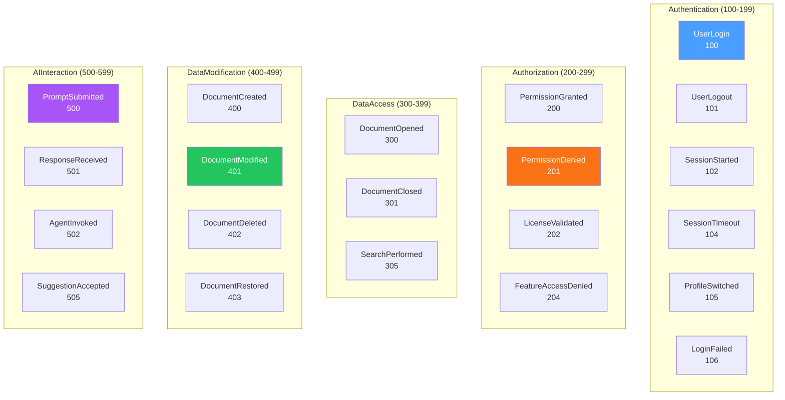

# LCS-DES-097a: Design Specification — Audit Events

## 1. Metadata & Categorization

| Field | Value | Description |
| :--- | :--- | :--- |
| **Feature ID** | `COL-097a` | Sub-part of COL-097 |
| **Feature Name** | `Comprehensive Event Taxonomy` | Audit event capture system |
| **Target Version** | `v0.9.7a` | First sub-part of v0.9.7 |
| **Module Scope** | `Lexichord.Modules.Collaboration` | Collaboration module |
| **Swimlane** | `Governance` | Enterprise governance features |
| **License Tier** | `Enterprise` | Enterprise tier only |
| **Feature Gate Key** | `audit_logging` | License feature key |
| **Author** | Lead Architect | |
| **Status** | `Draft` | |
| **Last Updated** | `2026-01-27` | |
| **Parent Document** | [LCS-DES-097-INDEX](./LCS-DES-097-INDEX.md) | |
| **Scope Breakdown** | [LCS-SBD-097 §3.1](./LCS-SBD-097.md#31-v097a-audit-events) | |

---

## 2. Executive Summary

### 2.1 The Requirement

Enterprise deployments of Lexichord require comprehensive audit trails for:

- **Regulatory Compliance:** SOC2, HIPAA, GDPR, and ISO27001 mandate activity logging
- **Security Forensics:** Incident investigation requires knowing who did what and when
- **Accountability:** Organizations need visibility into user actions across the platform
- **Risk Management:** Identifying unusual patterns requires structured event data

Without a comprehensive event taxonomy, audit logs become incomplete, inconsistent, and difficult to query—failing compliance audits and hampering security investigations.

> **Goal:** Define a comprehensive audit event taxonomy that captures all user actions with rich contextual metadata, enabling compliance, forensics, and accountability.

### 2.2 The Proposed Solution

Implement a complete audit event capture system that:

1. **Defines Every Event** — Comprehensive `AuditEventType` enum covering all auditable actions
2. **Categorizes Intelligently** — `AuditEventCategory` for logical grouping and filtering
3. **Captures Context** — Actor, resource, outcome, and environmental metadata
4. **Builds Fluently** — `IAuditEventBuilder` for ergonomic event construction
5. **Intercepts Automatically** — Event interceptors for transparent capture

---

## 3. Architecture & Modular Strategy

### 3.1 Dependencies

#### 3.1.1 Upstream Dependencies

| Interface | Source Version | Purpose |
| :--- | :--- | :--- |
| `IProfileService` | v0.9.1a | Get current user/profile identity |
| `UserProfile` | v0.9.1a | Profile metadata for events |
| `ILicenseContext` | v0.0.4c | Enterprise tier verification |
| `IMediator` | v0.0.7a | Event publishing |
| `Activity.Current` | System.Diagnostics | Correlation ID capture |

#### 3.1.2 Downstream Consumers

| Interface | Target Version | Purpose |
| :--- | :--- | :--- |
| `IAuditLogRepository` | v0.9.7b | Stores captured events |
| `IAuditExportService` | v0.9.7c | Exports events |
| `IComplianceReportService` | v0.9.7d | Includes events in reports |

### 3.2 Licensing Behavior

```csharp
// Enterprise tier required for audit logging
if (!licenseContext.HasFeature(LicenseFeature.AuditLogging))
{
    // Silently skip - no audit event recorded
    return;
}
```

---

## 4. Data Contract (The API)

### 4.1 AuditEvent Record

```csharp
namespace Lexichord.Abstractions.Audit;

/// <summary>
/// Represents a single audit event capturing a user action.
/// Immutable record designed for tamper-evident storage.
/// </summary>
/// <remarks>
/// AuditEvent is the core data structure for all audit logging.
/// All fields are designed to support:
/// - Compliance reporting (SOC2, HIPAA, GDPR)
/// - Security forensics and incident investigation
/// - SIEM integration (CEF, Syslog export)
/// - Chain of custody verification (hash integrity)
/// </remarks>
public record AuditEvent
{
    /// <summary>
    /// Unique identifier for this event. Generated at creation time.
    /// </summary>
    public required Guid EventId { get; init; }

    /// <summary>
    /// UTC timestamp when the event occurred. Precision to milliseconds.
    /// </summary>
    public required DateTimeOffset Timestamp { get; init; }

    /// <summary>
    /// Specific type of action that occurred.
    /// </summary>
    public required AuditEventType EventType { get; init; }

    /// <summary>
    /// Category for grouping related event types.
    /// </summary>
    public required AuditEventCategory Category { get; init; }

    /// <summary>
    /// Severity level of the event.
    /// </summary>
    public required AuditSeverity Severity { get; init; }

    #region Actor Information

    /// <summary>
    /// Unique identifier of the user who performed the action.
    /// </summary>
    public required Guid UserId { get; init; }

    /// <summary>
    /// Display name of the user at the time of the action.
    /// </summary>
    public required string UserName { get; init; }

    /// <summary>
    /// Email address of the user, if available.
    /// </summary>
    public string? UserEmail { get; init; }

    /// <summary>
    /// The profile ID the user was operating under.
    /// </summary>
    public required Guid ProfileId { get; init; }

    /// <summary>
    /// Display name of the profile at the time of action.
    /// </summary>
    public required string ProfileName { get; init; }

    #endregion

    #region Action Details

    /// <summary>
    /// Human-readable description of the action performed.
    /// </summary>
    public required string Action { get; init; }

    /// <summary>
    /// Type of resource affected (e.g., "Document", "Project", "Setting").
    /// </summary>
    public string? ResourceType { get; init; }

    /// <summary>
    /// Unique identifier of the affected resource.
    /// </summary>
    public string? ResourceId { get; init; }

    /// <summary>
    /// Human-readable name of the affected resource.
    /// </summary>
    public string? ResourceName { get; init; }

    #endregion

    #region Context

    /// <summary>
    /// IP address of the client, if available.
    /// </summary>
    public string? IpAddress { get; init; }

    /// <summary>
    /// User agent string of the client application.
    /// </summary>
    public string? UserAgent { get; init; }

    /// <summary>
    /// Session identifier for grouping related events.
    /// </summary>
    public string? SessionId { get; init; }

    /// <summary>
    /// Correlation ID for distributed tracing.
    /// </summary>
    public string? CorrelationId { get; init; }

    #endregion

    #region Outcome

    /// <summary>
    /// Result of the action.
    /// </summary>
    public required AuditOutcome Outcome { get; init; }

    /// <summary>
    /// Reason for failure, if Outcome is not Success.
    /// </summary>
    public string? FailureReason { get; init; }

    #endregion

    #region Extended Data

    /// <summary>
    /// JSON-serialized additional details specific to the event type.
    /// </summary>
    public string? Details { get; init; }

    #endregion

    #region Integrity

    /// <summary>
    /// Hash of the previous event in the chain. Null for first event.
    /// </summary>
    public string? PreviousEventHash { get; init; }

    /// <summary>
    /// SHA-256 hash of this event including the previous hash.
    /// </summary>
    public string? EventHash { get; init; }

    #endregion
}
```

### 4.2 Event Type Enumeration

```csharp
namespace Lexichord.Abstractions.Audit;

/// <summary>
/// Comprehensive enumeration of all auditable event types.
/// </summary>
public enum AuditEventType
{
    #region Authentication Events (100-199)

    /// <summary>User successfully logged in.</summary>
    UserLogin = 100,

    /// <summary>User logged out.</summary>
    UserLogout = 101,

    /// <summary>New session started.</summary>
    SessionStarted = 102,

    /// <summary>Session ended normally.</summary>
    SessionEnded = 103,

    /// <summary>Session timed out due to inactivity.</summary>
    SessionTimeout = 104,

    /// <summary>User switched to a different profile.</summary>
    ProfileSwitched = 105,

    /// <summary>Login attempt failed (wrong password, etc.).</summary>
    LoginFailed = 106,

    /// <summary>Account locked due to failed login attempts.</summary>
    AccountLocked = 107,

    /// <summary>Password was changed.</summary>
    PasswordChanged = 108,

    /// <summary>Two-factor authentication completed.</summary>
    TwoFactorCompleted = 109,

    #endregion

    #region Authorization Events (200-299)

    /// <summary>Permission check passed.</summary>
    PermissionGranted = 200,

    /// <summary>Permission check failed - access denied.</summary>
    PermissionDenied = 201,

    /// <summary>License validated successfully.</summary>
    LicenseValidated = 202,

    /// <summary>License expired or invalid.</summary>
    LicenseExpired = 203,

    /// <summary>Feature access denied due to license tier.</summary>
    FeatureAccessDenied = 204,

    /// <summary>Role assigned to user.</summary>
    RoleAssigned = 205,

    /// <summary>Role revoked from user.</summary>
    RoleRevoked = 206,

    #endregion

    #region Data Access Events (300-399)

    /// <summary>Document opened for viewing/editing.</summary>
    DocumentOpened = 300,

    /// <summary>Document closed.</summary>
    DocumentClosed = 301,

    /// <summary>Document viewed (read-only access).</summary>
    DocumentViewed = 302,

    /// <summary>Project opened.</summary>
    ProjectOpened = 303,

    /// <summary>Project closed.</summary>
    ProjectClosed = 304,

    /// <summary>Search performed across documents.</summary>
    SearchPerformed = 305,

    /// <summary>File downloaded.</summary>
    FileDownloaded = 306,

    /// <summary>File uploaded.</summary>
    FileUploaded = 307,

    /// <summary>Reference material accessed.</summary>
    ReferenceAccessed = 308,

    #endregion

    #region Data Modification Events (400-499)

    /// <summary>New document created.</summary>
    DocumentCreated = 400,

    /// <summary>Document content modified.</summary>
    DocumentModified = 401,

    /// <summary>Document deleted (moved to trash).</summary>
    DocumentDeleted = 402,

    /// <summary>Document restored from trash.</summary>
    DocumentRestored = 403,

    /// <summary>Document permanently deleted.</summary>
    DocumentPurged = 404,

    /// <summary>Content pasted into document.</summary>
    ContentPasted = 405,

    /// <summary>Content cut from document.</summary>
    ContentCut = 406,

    /// <summary>Undo operation performed.</summary>
    UndoPerformed = 407,

    /// <summary>Redo operation performed.</summary>
    RedoPerformed = 408,

    /// <summary>Document renamed.</summary>
    DocumentRenamed = 409,

    /// <summary>Document moved to different location.</summary>
    DocumentMoved = 410,

    /// <summary>Document version created.</summary>
    VersionCreated = 411,

    /// <summary>Document reverted to previous version.</summary>
    VersionRestored = 412,

    #endregion

    #region AI Interaction Events (500-599)

    /// <summary>Prompt submitted to LLM.</summary>
    PromptSubmitted = 500,

    /// <summary>Response received from LLM.</summary>
    ResponseReceived = 501,

    /// <summary>AI agent invoked.</summary>
    AgentInvoked = 502,

    /// <summary>AI agent completed task.</summary>
    AgentCompleted = 503,

    /// <summary>AI agent failed.</summary>
    AgentFailed = 504,

    /// <summary>AI suggestion accepted by user.</summary>
    SuggestionAccepted = 505,

    /// <summary>AI suggestion rejected by user.</summary>
    SuggestionRejected = 506,

    /// <summary>AI suggestion modified before acceptance.</summary>
    SuggestionModified = 507,

    /// <summary>RAG query executed against knowledge base.</summary>
    RAGQueryExecuted = 508,

    /// <summary>PII detected in prompt.</summary>
    PIIDetected = 509,

    /// <summary>PII redacted from prompt.</summary>
    PIIRedacted = 510,

    /// <summary>AI conversation started.</summary>
    ConversationStarted = 511,

    /// <summary>AI conversation ended.</summary>
    ConversationEnded = 512,

    #endregion

    #region Configuration Events (600-699)

    /// <summary>Application setting changed.</summary>
    SettingChanged = 600,

    /// <summary>User profile created.</summary>
    ProfileCreated = 601,

    /// <summary>User profile updated.</summary>
    ProfileUpdated = 602,

    /// <summary>User profile deleted.</summary>
    ProfileDeleted = 603,

    /// <summary>Style guide imported.</summary>
    StyleGuideImported = 604,

    /// <summary>Style guide exported.</summary>
    StyleGuideExported = 605,

    /// <summary>Style guide modified.</summary>
    StyleGuideModified = 606,

    /// <summary>API key added.</summary>
    APIKeyAdded = 607,

    /// <summary>API key removed.</summary>
    APIKeyRemoved = 608,

    /// <summary>API key rotated.</summary>
    APIKeyRotated = 609,

    /// <summary>Keyboard shortcut changed.</summary>
    ShortcutChanged = 610,

    /// <summary>Theme changed.</summary>
    ThemeChanged = 611,

    #endregion

    #region Administration Events (700-799)

    /// <summary>License activated.</summary>
    LicenseActivated = 700,

    /// <summary>License deactivated.</summary>
    LicenseDeactivated = 701,

    /// <summary>License renewed.</summary>
    LicenseRenewed = 702,

    /// <summary>User invited to organization.</summary>
    UserInvited = 703,

    /// <summary>User removed from organization.</summary>
    UserRemoved = 704,

    /// <summary>User role changed.</summary>
    UserRoleChanged = 705,

    /// <summary>Organization settings changed.</summary>
    OrgSettingsChanged = 706,

    /// <summary>Audit settings changed.</summary>
    AuditSettingsChanged = 707,

    /// <summary>Security policy changed.</summary>
    SecurityPolicyChanged = 708,

    #endregion

    #region Export Events (800-899)

    /// <summary>Document exported to external format.</summary>
    DocumentExported = 800,

    /// <summary>Audit log exported.</summary>
    AuditLogExported = 801,

    /// <summary>Compliance report generated.</summary>
    ReportGenerated = 802,

    /// <summary>Data exported for backup.</summary>
    DataExported = 803,

    /// <summary>Data imported from backup.</summary>
    DataImported = 804,

    /// <summary>Release notes generated.</summary>
    ReleaseNotesGenerated = 805,

    #endregion

    #region System Events (900-999)

    /// <summary>Application started.</summary>
    ApplicationStarted = 900,

    /// <summary>Application stopped normally.</summary>
    ApplicationStopped = 901,

    /// <summary>Application crashed.</summary>
    ApplicationCrashed = 902,

    /// <summary>Error occurred during operation.</summary>
    ErrorOccurred = 903,

    /// <summary>Application update installed.</summary>
    UpdateInstalled = 904,

    /// <summary>Backup created.</summary>
    BackupCreated = 905,

    /// <summary>Backup restored.</summary>
    BackupRestored = 906,

    /// <summary>Database migration executed.</summary>
    MigrationExecuted = 907,

    /// <summary>System health check performed.</summary>
    HealthCheckPerformed = 908,

    /// <summary>Audit chain integrity verified.</summary>
    ChainIntegrityVerified = 909

    #endregion
}
```

### 4.3 Event Category Enumeration

```csharp
namespace Lexichord.Abstractions.Audit;

/// <summary>
/// Categories for grouping and filtering audit events.
/// </summary>
public enum AuditEventCategory
{
    /// <summary>Login, logout, session management.</summary>
    Authentication,

    /// <summary>Permission checks, access control.</summary>
    Authorization,

    /// <summary>Read operations on data.</summary>
    DataAccess,

    /// <summary>Write operations on data.</summary>
    DataModification,

    /// <summary>LLM prompts, AI agent actions.</summary>
    AIInteraction,

    /// <summary>Settings and configuration changes.</summary>
    Configuration,

    /// <summary>User and license management.</summary>
    Administration,

    /// <summary>Export and reporting operations.</summary>
    Export,

    /// <summary>Application lifecycle and errors.</summary>
    SystemEvent
}
```

### 4.4 Supporting Enumerations

```csharp
namespace Lexichord.Abstractions.Audit;

/// <summary>
/// Severity levels for audit events.
/// </summary>
public enum AuditSeverity
{
    /// <summary>Normal operations, informational.</summary>
    Info,

    /// <summary>Unusual but not problematic.</summary>
    Warning,

    /// <summary>Failed operations.</summary>
    Error,

    /// <summary>Security-relevant events requiring attention.</summary>
    Critical
}

/// <summary>
/// Outcome of the audited action.
/// </summary>
public enum AuditOutcome
{
    /// <summary>Action completed successfully.</summary>
    Success,

    /// <summary>Action failed due to error.</summary>
    Failure,

    /// <summary>Action denied due to permissions.</summary>
    Denied,

    /// <summary>Action partially completed.</summary>
    Partial
}
```

### 4.5 Audit Event Builder Interface

```csharp
namespace Lexichord.Abstractions.Audit;

/// <summary>
/// Fluent builder for constructing audit events.
/// </summary>
public interface IAuditEventBuilder
{
    /// <summary>Sets the event type.</summary>
    IAuditEventBuilder WithEventType(AuditEventType type);

    /// <summary>Sets the event category.</summary>
    IAuditEventBuilder WithCategory(AuditEventCategory category);

    /// <summary>Sets the severity level.</summary>
    IAuditEventBuilder WithSeverity(AuditSeverity severity);

    /// <summary>Sets the actor (user) information.</summary>
    IAuditEventBuilder WithActor(Guid userId, string userName, string? email = null);

    /// <summary>Sets the profile context.</summary>
    IAuditEventBuilder WithProfile(Guid profileId, string profileName);

    /// <summary>Sets the action description.</summary>
    IAuditEventBuilder WithAction(string action);

    /// <summary>Sets the affected resource.</summary>
    IAuditEventBuilder WithResource(string type, string id, string? name = null);

    /// <summary>Sets the environmental context.</summary>
    IAuditEventBuilder WithContext(string? ipAddress, string? userAgent, string? sessionId);

    /// <summary>Sets the correlation ID for distributed tracing.</summary>
    IAuditEventBuilder WithCorrelationId(string correlationId);

    /// <summary>Sets the outcome of the action.</summary>
    IAuditEventBuilder WithOutcome(AuditOutcome outcome, string? failureReason = null);

    /// <summary>Sets additional details as a serializable object.</summary>
    IAuditEventBuilder WithDetails(object details);

    /// <summary>Builds the immutable audit event.</summary>
    /// <exception cref="ValidationException">Thrown when required fields are missing.</exception>
    AuditEvent Build();
}
```

### 4.6 Audit Service Interface

```csharp
namespace Lexichord.Abstractions.Audit;

/// <summary>
/// Primary service for recording audit events.
/// </summary>
public interface IAuditService
{
    /// <summary>
    /// Records a pre-built audit event.
    /// </summary>
    /// <param name="auditEvent">The event to record.</param>
    /// <param name="ct">Cancellation token.</param>
    Task RecordAsync(AuditEvent auditEvent, CancellationToken ct = default);

    /// <summary>
    /// Records an audit event using a builder configuration.
    /// Automatically captures current user and profile context.
    /// </summary>
    /// <param name="configure">Builder configuration action.</param>
    /// <param name="ct">Cancellation token.</param>
    /// <returns>The recorded event.</returns>
    Task<AuditEvent> RecordAsync(
        Action<IAuditEventBuilder> configure,
        CancellationToken ct = default);

    /// <summary>
    /// Creates a new audit event builder.
    /// </summary>
    IAuditEventBuilder CreateBuilder();
}
```

---

## 5. Implementation Logic

### 5.1 AuditEventBuilder Implementation

```csharp
namespace Lexichord.Modules.Collaboration.Audit;

/// <summary>
/// Fluent builder for constructing audit events with validation.
/// </summary>
public class AuditEventBuilder : IAuditEventBuilder
{
    private Guid _eventId = Guid.NewGuid();
    private DateTimeOffset _timestamp = DateTimeOffset.UtcNow;
    private AuditEventType? _eventType;
    private AuditEventCategory? _category;
    private AuditSeverity _severity = AuditSeverity.Info;
    private Guid? _userId;
    private string? _userName;
    private string? _userEmail;
    private Guid? _profileId;
    private string? _profileName;
    private string? _action;
    private string? _resourceType;
    private string? _resourceId;
    private string? _resourceName;
    private string? _ipAddress;
    private string? _userAgent;
    private string? _sessionId;
    private string? _correlationId;
    private AuditOutcome _outcome = AuditOutcome.Success;
    private string? _failureReason;
    private string? _details;

    public IAuditEventBuilder WithEventType(AuditEventType type)
    {
        _eventType = type;
        // Auto-set category based on event type range
        _category ??= DeriveCategory(type);
        return this;
    }

    public IAuditEventBuilder WithCategory(AuditEventCategory category)
    {
        _category = category;
        return this;
    }

    public IAuditEventBuilder WithSeverity(AuditSeverity severity)
    {
        _severity = severity;
        return this;
    }

    public IAuditEventBuilder WithActor(Guid userId, string userName, string? email = null)
    {
        _userId = userId;
        _userName = userName ?? throw new ArgumentNullException(nameof(userName));
        _userEmail = email;
        return this;
    }

    public IAuditEventBuilder WithProfile(Guid profileId, string profileName)
    {
        _profileId = profileId;
        _profileName = profileName ?? throw new ArgumentNullException(nameof(profileName));
        return this;
    }

    public IAuditEventBuilder WithAction(string action)
    {
        _action = action ?? throw new ArgumentNullException(nameof(action));
        return this;
    }

    public IAuditEventBuilder WithResource(string type, string id, string? name = null)
    {
        _resourceType = type ?? throw new ArgumentNullException(nameof(type));
        _resourceId = id ?? throw new ArgumentNullException(nameof(id));
        _resourceName = name;
        return this;
    }

    public IAuditEventBuilder WithContext(string? ipAddress, string? userAgent, string? sessionId)
    {
        _ipAddress = ipAddress;
        _userAgent = userAgent;
        _sessionId = sessionId;
        return this;
    }

    public IAuditEventBuilder WithCorrelationId(string correlationId)
    {
        _correlationId = correlationId;
        return this;
    }

    public IAuditEventBuilder WithOutcome(AuditOutcome outcome, string? failureReason = null)
    {
        _outcome = outcome;
        _failureReason = failureReason;

        // Auto-escalate severity for failures
        if (outcome == AuditOutcome.Failure && _severity < AuditSeverity.Error)
        {
            _severity = AuditSeverity.Error;
        }
        else if (outcome == AuditOutcome.Denied && _severity < AuditSeverity.Warning)
        {
            _severity = AuditSeverity.Warning;
        }

        return this;
    }

    public IAuditEventBuilder WithDetails(object details)
    {
        _details = JsonSerializer.Serialize(details, new JsonSerializerOptions
        {
            PropertyNamingPolicy = JsonNamingPolicy.CamelCase,
            WriteIndented = false
        });
        return this;
    }

    public AuditEvent Build()
    {
        Validate();

        return new AuditEvent
        {
            EventId = _eventId,
            Timestamp = _timestamp,
            EventType = _eventType!.Value,
            Category = _category!.Value,
            Severity = _severity,
            UserId = _userId!.Value,
            UserName = _userName!,
            UserEmail = _userEmail,
            ProfileId = _profileId!.Value,
            ProfileName = _profileName!,
            Action = _action!,
            ResourceType = _resourceType,
            ResourceId = _resourceId,
            ResourceName = _resourceName,
            IpAddress = _ipAddress,
            UserAgent = _userAgent,
            SessionId = _sessionId,
            CorrelationId = _correlationId ?? Activity.Current?.TraceId.ToString(),
            Outcome = _outcome,
            FailureReason = _failureReason,
            Details = _details
        };
    }

    private void Validate()
    {
        var errors = new List<string>();

        if (_eventType is null) errors.Add("EventType is required");
        if (_category is null) errors.Add("Category is required");
        if (_userId is null) errors.Add("UserId is required");
        if (string.IsNullOrWhiteSpace(_userName)) errors.Add("UserName is required");
        if (_profileId is null) errors.Add("ProfileId is required");
        if (string.IsNullOrWhiteSpace(_profileName)) errors.Add("ProfileName is required");
        if (string.IsNullOrWhiteSpace(_action)) errors.Add("Action is required");

        if (errors.Count > 0)
        {
            throw new ValidationException(
                $"AuditEvent validation failed: {string.Join(", ", errors)}");
        }
    }

    private static AuditEventCategory DeriveCategory(AuditEventType type)
    {
        return (int)type switch
        {
            >= 100 and < 200 => AuditEventCategory.Authentication,
            >= 200 and < 300 => AuditEventCategory.Authorization,
            >= 300 and < 400 => AuditEventCategory.DataAccess,
            >= 400 and < 500 => AuditEventCategory.DataModification,
            >= 500 and < 600 => AuditEventCategory.AIInteraction,
            >= 600 and < 700 => AuditEventCategory.Configuration,
            >= 700 and < 800 => AuditEventCategory.Administration,
            >= 800 and < 900 => AuditEventCategory.Export,
            >= 900 and < 1000 => AuditEventCategory.SystemEvent,
            _ => throw new ArgumentOutOfRangeException(nameof(type))
        };
    }
}
```

### 5.2 AuditService Implementation

```csharp
namespace Lexichord.Modules.Collaboration.Audit;

/// <summary>
/// Primary service for recording audit events with automatic context capture.
/// </summary>
public class AuditService(
    IAuditLogRepository repository,
    IAuditIntegrityService integrityService,
    IProfileService profileService,
    ILicenseContext licenseContext,
    ISessionContext sessionContext,
    ILogger<AuditService> logger) : IAuditService
{
    public IAuditEventBuilder CreateBuilder() => new AuditEventBuilder();

    public async Task RecordAsync(AuditEvent auditEvent, CancellationToken ct = default)
    {
        // Enterprise tier required
        if (!licenseContext.HasFeature(LicenseFeature.AuditLogging))
        {
            logger.LogDebug("Audit logging skipped - Enterprise license required");
            return;
        }

        var stopwatch = Stopwatch.StartNew();

        try
        {
            // Get previous event hash for chaining
            var previousEvent = await repository.GetLatestEventAsync(ct);
            var previousHash = previousEvent?.EventHash;

            // Compute hash for this event
            var eventHash = integrityService.ComputeEventHash(auditEvent, previousHash);

            // Create event with integrity data
            var eventWithHash = auditEvent with
            {
                PreviousEventHash = previousHash,
                EventHash = eventHash
            };

            // Store the event
            await repository.AppendAsync(eventWithHash, ct);

            stopwatch.Stop();

            logger.LogDebug(
                "Audit event recorded: {EventId} ({EventType}) in {ElapsedMs}ms",
                eventWithHash.EventId,
                eventWithHash.EventType,
                stopwatch.ElapsedMilliseconds);
        }
        catch (Exception ex)
        {
            logger.LogError(ex,
                "Failed to record audit event: {EventType} for user {UserId}",
                auditEvent.EventType,
                auditEvent.UserId);
            throw;
        }
    }

    public async Task<AuditEvent> RecordAsync(
        Action<IAuditEventBuilder> configure,
        CancellationToken ct = default)
    {
        var builder = CreateBuilder();

        // Auto-populate actor from current profile
        var profile = await profileService.GetActiveProfileAsync(ct);
        builder.WithActor(profile.UserId, profile.Name, profile.Email);
        builder.WithProfile(profile.ProfileId, profile.Name);

        // Auto-populate context from session
        builder.WithContext(
            sessionContext.IpAddress,
            sessionContext.UserAgent,
            sessionContext.SessionId);

        // Apply user configuration
        configure(builder);

        var auditEvent = builder.Build();
        await RecordAsync(auditEvent, ct);

        return auditEvent;
    }
}
```

### 5.3 Audit Interceptor Pattern

```csharp
namespace Lexichord.Modules.Collaboration.Audit;

/// <summary>
/// MediatR behavior for automatic audit event capture.
/// </summary>
public class AuditBehavior<TRequest, TResponse>(
    IAuditService auditService,
    ILogger<AuditBehavior<TRequest, TResponse>> logger)
    : IPipelineBehavior<TRequest, TResponse>
    where TRequest : IRequest<TResponse>
{
    public async Task<TResponse> Handle(
        TRequest request,
        RequestHandlerDelegate<TResponse> next,
        CancellationToken ct)
    {
        // Check if request is auditable
        if (request is not IAuditableRequest auditable)
        {
            return await next();
        }

        var eventType = auditable.GetAuditEventType();
        AuditOutcome outcome = AuditOutcome.Success;
        string? failureReason = null;

        try
        {
            var response = await next();

            // Check if response indicates failure
            if (response is IOperationResult { IsSuccess: false } result)
            {
                outcome = AuditOutcome.Failure;
                failureReason = result.ErrorMessage;
            }

            return response;
        }
        catch (UnauthorizedAccessException ex)
        {
            outcome = AuditOutcome.Denied;
            failureReason = ex.Message;
            throw;
        }
        catch (Exception ex)
        {
            outcome = AuditOutcome.Failure;
            failureReason = ex.Message;
            throw;
        }
        finally
        {
            await RecordAuditEventAsync(auditable, eventType, outcome, failureReason, ct);
        }
    }

    private async Task RecordAuditEventAsync(
        IAuditableRequest auditable,
        AuditEventType eventType,
        AuditOutcome outcome,
        string? failureReason,
        CancellationToken ct)
    {
        try
        {
            await auditService.RecordAsync(builder =>
            {
                builder.WithEventType(eventType);
                builder.WithAction(auditable.GetAuditAction());
                builder.WithOutcome(outcome, failureReason);

                if (auditable.GetAuditResource() is var (type, id, name))
                {
                    builder.WithResource(type, id, name);
                }

                if (auditable.GetAuditDetails() is { } details)
                {
                    builder.WithDetails(details);
                }
            }, ct);
        }
        catch (Exception ex)
        {
            // Never fail the request due to audit logging failure
            logger.LogError(ex, "Failed to record audit event for {RequestType}", typeof(TRequest).Name);
        }
    }
}

/// <summary>
/// Interface for requests that should be audited.
/// </summary>
public interface IAuditableRequest
{
    AuditEventType GetAuditEventType();
    string GetAuditAction();
    (string Type, string Id, string? Name)? GetAuditResource();
    object? GetAuditDetails();
}
```

---

## 6. Event Type to Category Mapping



---

## 7. Test Scenarios

### 7.1 AuditEventBuilder Tests

```csharp
[Trait("Category", "Unit")]
[Trait("Version", "v0.9.7a")]
public class AuditEventBuilderTests
{
    [Fact]
    public void Build_WithAllRequiredFields_CreatesValidEvent()
    {
        // Arrange
        var builder = new AuditEventBuilder();
        var userId = Guid.NewGuid();
        var profileId = Guid.NewGuid();

        // Act
        var result = builder
            .WithEventType(AuditEventType.DocumentModified)
            .WithCategory(AuditEventCategory.DataModification)
            .WithSeverity(AuditSeverity.Info)
            .WithActor(userId, "john.doe", "john@example.com")
            .WithProfile(profileId, "Work Profile")
            .WithAction("Modified document content")
            .WithResource("Document", "doc-123", "Report.md")
            .WithOutcome(AuditOutcome.Success)
            .Build();

        // Assert
        result.Should().NotBeNull();
        result.EventId.Should().NotBeEmpty();
        result.Timestamp.Should().BeCloseTo(DateTimeOffset.UtcNow, TimeSpan.FromSeconds(1));
        result.EventType.Should().Be(AuditEventType.DocumentModified);
        result.Category.Should().Be(AuditEventCategory.DataModification);
        result.UserId.Should().Be(userId);
        result.UserName.Should().Be("john.doe");
        result.Action.Should().Be("Modified document content");
        result.ResourceType.Should().Be("Document");
        result.ResourceId.Should().Be("doc-123");
        result.Outcome.Should().Be(AuditOutcome.Success);
    }

    [Fact]
    public void Build_MissingEventType_ThrowsValidationException()
    {
        // Arrange
        var builder = new AuditEventBuilder();

        // Act
        var act = () => builder
            .WithActor(Guid.NewGuid(), "user")
            .WithProfile(Guid.NewGuid(), "profile")
            .WithAction("action")
            .Build();

        // Assert
        act.Should().Throw<ValidationException>()
           .WithMessage("*EventType*");
    }

    [Fact]
    public void Build_MissingActor_ThrowsValidationException()
    {
        // Arrange
        var builder = new AuditEventBuilder();

        // Act
        var act = () => builder
            .WithEventType(AuditEventType.DocumentOpened)
            .WithProfile(Guid.NewGuid(), "profile")
            .WithAction("action")
            .Build();

        // Assert
        act.Should().Throw<ValidationException>()
           .WithMessage("*UserId*");
    }

    [Fact]
    public void WithEventType_AutoSetsCategoryFromRange()
    {
        // Arrange
        var builder = new AuditEventBuilder();

        // Act
        var result = builder
            .WithEventType(AuditEventType.PromptSubmitted) // 500
            .WithActor(Guid.NewGuid(), "user")
            .WithProfile(Guid.NewGuid(), "profile")
            .WithAction("Submitted prompt")
            .Build();

        // Assert
        result.Category.Should().Be(AuditEventCategory.AIInteraction);
    }

    [Fact]
    public void WithOutcome_Failure_AutoEscalatesSeverity()
    {
        // Arrange
        var builder = new AuditEventBuilder();

        // Act
        var result = builder
            .WithEventType(AuditEventType.DocumentModified)
            .WithSeverity(AuditSeverity.Info)
            .WithActor(Guid.NewGuid(), "user")
            .WithProfile(Guid.NewGuid(), "profile")
            .WithAction("Failed to save")
            .WithOutcome(AuditOutcome.Failure, "Disk full")
            .Build();

        // Assert
        result.Severity.Should().Be(AuditSeverity.Error);
        result.FailureReason.Should().Be("Disk full");
    }

    [Fact]
    public void WithDetails_SerializesObjectToJson()
    {
        // Arrange
        var builder = new AuditEventBuilder();
        var details = new { WordsAdded = 150, WordsRemoved = 23 };

        // Act
        var result = builder
            .WithEventType(AuditEventType.DocumentModified)
            .WithActor(Guid.NewGuid(), "user")
            .WithProfile(Guid.NewGuid(), "profile")
            .WithAction("Modified document")
            .WithDetails(details)
            .Build();

        // Assert
        result.Details.Should().NotBeNullOrEmpty();
        result.Details.Should().Contain("wordsAdded");
        result.Details.Should().Contain("150");
    }
}
```

### 7.2 AuditService Tests

```csharp
[Trait("Category", "Unit")]
[Trait("Version", "v0.9.7a")]
public class AuditServiceTests
{
    private readonly Mock<IAuditLogRepository> _repositoryMock;
    private readonly Mock<IAuditIntegrityService> _integrityMock;
    private readonly Mock<IProfileService> _profileMock;
    private readonly Mock<ILicenseContext> _licenseMock;
    private readonly AuditService _sut;

    public AuditServiceTests()
    {
        _repositoryMock = new Mock<IAuditLogRepository>();
        _integrityMock = new Mock<IAuditIntegrityService>();
        _profileMock = new Mock<IProfileService>();
        _licenseMock = new Mock<ILicenseContext>();

        _licenseMock.Setup(l => l.HasFeature(LicenseFeature.AuditLogging)).Returns(true);
        _integrityMock.Setup(i => i.ComputeEventHash(It.IsAny<AuditEvent>(), It.IsAny<string?>()))
                      .Returns("testhash");

        _sut = new AuditService(
            _repositoryMock.Object,
            _integrityMock.Object,
            _profileMock.Object,
            _licenseMock.Object,
            Mock.Of<ISessionContext>(),
            Mock.Of<ILogger<AuditService>>());
    }

    [Fact]
    public async Task RecordAsync_WithEnterpriseLicense_StoresEvent()
    {
        // Arrange
        var auditEvent = CreateTestEvent();
        _repositoryMock.Setup(r => r.GetLatestEventAsync(It.IsAny<CancellationToken>()))
                       .ReturnsAsync((AuditEvent?)null);

        // Act
        await _sut.RecordAsync(auditEvent);

        // Assert
        _repositoryMock.Verify(r => r.AppendAsync(
            It.Is<AuditEvent>(e =>
                e.EventId == auditEvent.EventId &&
                e.EventHash == "testhash"),
            It.IsAny<CancellationToken>()), Times.Once);
    }

    [Fact]
    public async Task RecordAsync_WithoutEnterpriseLicense_SkipsStorage()
    {
        // Arrange
        _licenseMock.Setup(l => l.HasFeature(LicenseFeature.AuditLogging)).Returns(false);
        var auditEvent = CreateTestEvent();

        // Act
        await _sut.RecordAsync(auditEvent);

        // Assert
        _repositoryMock.Verify(r => r.AppendAsync(
            It.IsAny<AuditEvent>(),
            It.IsAny<CancellationToken>()), Times.Never);
    }

    [Fact]
    public async Task RecordAsync_ChainsHashFromPreviousEvent()
    {
        // Arrange
        var previousEvent = CreateTestEvent() with { EventHash = "previoushash" };
        var newEvent = CreateTestEvent();

        _repositoryMock.Setup(r => r.GetLatestEventAsync(It.IsAny<CancellationToken>()))
                       .ReturnsAsync(previousEvent);

        // Act
        await _sut.RecordAsync(newEvent);

        // Assert
        _integrityMock.Verify(i => i.ComputeEventHash(
            It.IsAny<AuditEvent>(),
            "previoushash"), Times.Once);

        _repositoryMock.Verify(r => r.AppendAsync(
            It.Is<AuditEvent>(e => e.PreviousEventHash == "previoushash"),
            It.IsAny<CancellationToken>()), Times.Once);
    }

    private static AuditEvent CreateTestEvent() => new()
    {
        EventId = Guid.NewGuid(),
        Timestamp = DateTimeOffset.UtcNow,
        EventType = AuditEventType.DocumentModified,
        Category = AuditEventCategory.DataModification,
        Severity = AuditSeverity.Info,
        UserId = Guid.NewGuid(),
        UserName = "test.user",
        ProfileId = Guid.NewGuid(),
        ProfileName = "Test Profile",
        Action = "Test action",
        Outcome = AuditOutcome.Success
    };
}
```

---

## 8. UI/UX Specifications

**Not applicable.** This sub-part defines data structures and services with no direct UI components. UI is provided by v0.9.7c (Audit Log Viewer).

---

## 9. Observability & Logging

| Level | Message Template |
| :--- | :--- |
| Debug | `"Recording audit event: {EventType} for user {UserId}"` |
| Debug | `"Audit event recorded: {EventId} ({EventType}) in {ElapsedMs}ms"` |
| Debug | `"Audit logging skipped - Enterprise license required"` |
| Warning | `"Audit event validation failed: {Errors}"` |
| Error | `"Failed to record audit event: {EventType} for user {UserId}"` |

---

## 10. Security & Safety

| Risk | Level | Mitigation |
| :--- | :--- | :--- |
| PII in audit details | Medium | Sanitize sensitive fields before logging |
| Large details payload | Low | Limit Details field to 10KB |
| Missing audit events | Medium | Transaction-based storage with retry |
| Event tampering | High | Hash chaining in v0.9.7b |

---

## 11. Acceptance Criteria

### 11.1 Functional Criteria

| # | Given | When | Then |
| :--- | :--- | :--- | :--- |
| 1 | Builder with all required fields | Build() called | Valid AuditEvent returned |
| 2 | Builder missing EventType | Build() called | ValidationException thrown |
| 3 | Builder missing Actor | Build() called | ValidationException thrown |
| 4 | Event type in 500-599 range | Category not set | Auto-set to AIInteraction |
| 5 | Outcome is Failure | Severity is Info | Auto-escalate to Error |
| 6 | Enterprise license active | RecordAsync called | Event stored |
| 7 | Non-Enterprise license | RecordAsync called | Event skipped silently |

### 11.2 Event Coverage Criteria

| # | Category | Event Types Defined |
| :--- | :--- | :--- |
| 1 | Authentication | 10 event types |
| 2 | Authorization | 7 event types |
| 3 | DataAccess | 9 event types |
| 4 | DataModification | 13 event types |
| 5 | AIInteraction | 13 event types |
| 6 | Configuration | 12 event types |
| 7 | Administration | 9 event types |
| 8 | Export | 6 event types |
| 9 | SystemEvent | 10 event types |

---

## 12. Deliverable Checklist

| # | Deliverable | Status |
| :--- | :--- | :--- |
| 1 | `AuditEvent` record definition | [ ] |
| 2 | `AuditEventType` enumeration (89 types) | [ ] |
| 3 | `AuditEventCategory` enumeration | [ ] |
| 4 | `AuditSeverity` enumeration | [ ] |
| 5 | `AuditOutcome` enumeration | [ ] |
| 6 | `IAuditEventBuilder` interface | [ ] |
| 7 | `AuditEventBuilder` implementation | [ ] |
| 8 | `IAuditService` interface | [ ] |
| 9 | `AuditService` implementation | [ ] |
| 10 | `AuditBehavior<T,R>` MediatR interceptor | [ ] |
| 11 | `IAuditableRequest` interface | [ ] |
| 12 | Unit tests for builder | [ ] |
| 13 | Unit tests for service | [ ] |

---

## 13. Verification Commands

```bash
# Run all v0.9.7a tests
dotnet test --filter "Version=v0.9.7a" --logger "console;verbosity=detailed"

# Run builder tests only
dotnet test --filter "FullyQualifiedName~AuditEventBuilderTests"

# Run service tests only
dotnet test --filter "FullyQualifiedName~AuditServiceTests"

# Verify all event types are categorized
dotnet test --filter "FullyQualifiedName~EventTypeCategoryMappingTests"
```

---

## Document History

| Version | Date | Author | Changes |
| :--- | :--- | :--- | :--- |
| 1.0 | 2026-01-27 | Lead Architect | Initial draft |
