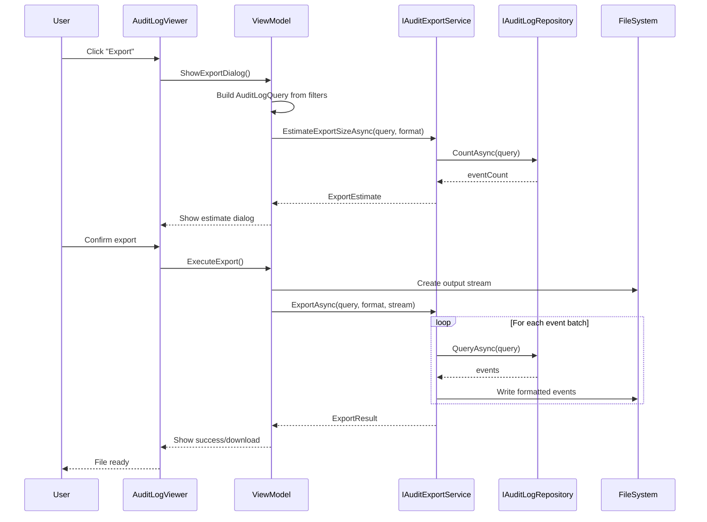
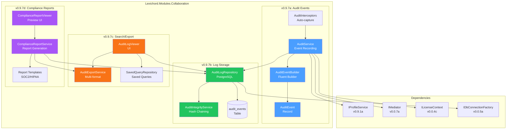
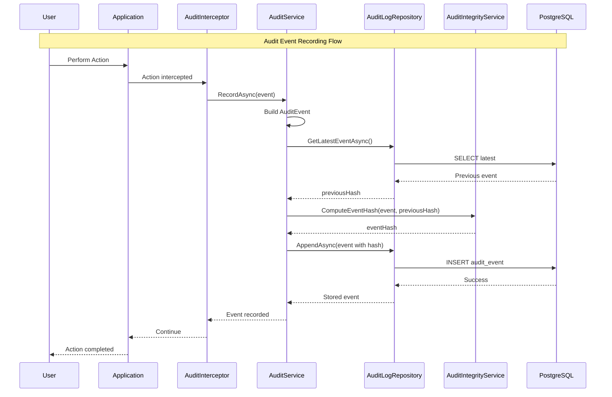
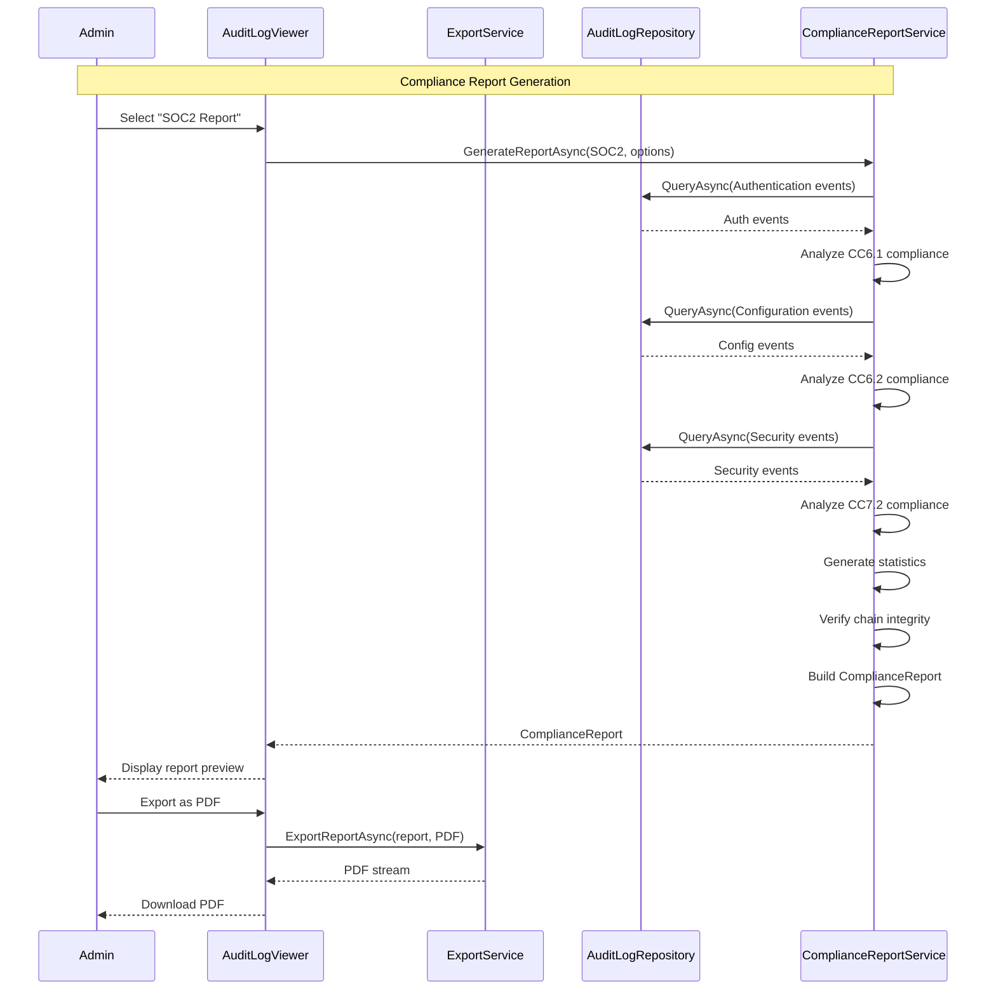

# LCS-SBD-097: Scope Breakdown — The House Manager

## Document Control

| Field            | Value                                    |
| :--------------- | :--------------------------------------- |
| **Document ID**  | LCS-SBD-097                              |
| **Version**      | v0.9.7                                   |
| **Codename**     | The House Manager (Audit Logging)        |
| **Status**       | Draft                                    |
| **Last Updated** | 2026-01-27                               |
| **Owner**        | Lead Architect                           |
| **Depends On**   | v0.9.1 (User Profiles), v0.9.2 (License Engine), v0.0.6a (ISecureVault), v0.0.7a (IMediator) |

---

## 1. Executive Summary

### 1.1 The Vision

**v0.9.7** delivers the **House Manager** — comprehensive enterprise audit logging that tracks all user actions for compliance with SOC2, HIPAA, and other regulatory frameworks. This release transforms Lexichord from a powerful writing tool into an enterprise-ready platform with complete accountability, forensic capabilities, and regulatory compliance.

In enterprise environments, knowing who did what and when is not optional—it's mandatory. The House Manager provides immutable, tamper-evident audit trails that satisfy the most stringent compliance requirements while maintaining the performance and usability that Lexichord users expect.

### 1.2 Business Value

- **Regulatory Compliance:** Full SOC2 Type II and HIPAA audit trail requirements met out-of-the-box.
- **Enterprise Trust:** Organizations can confidently deploy Lexichord knowing all actions are traceable.
- **Security Forensics:** Complete visibility into user actions for incident investigation and response.
- **Accountability:** Clear audit trails for document changes, AI interactions, and system access.
- **Export Flexibility:** Logs exportable in multiple formats for SIEM integration and compliance reporting.
- **Foundation:** Establishes the observability infrastructure for enterprise monitoring and analytics.

### 1.3 Success Criteria

This release succeeds when:

1. All user actions across the application generate structured audit events with comprehensive metadata.
2. Audit logs are stored immutably with tamper-evident mechanisms (cryptographic chaining).
3. Administrators can search, filter, and export audit logs via a dedicated management interface.
4. Pre-built compliance reports for SOC2 and HIPAA can be generated on demand.
5. All audit logging respects license gating (Enterprise tier only).

### 1.4 License Gating

The Audit Logging feature is an **Enterprise** tier feature. Lower tiers will see:

- No audit logging functionality available
- "Upgrade to Enterprise" prompt when accessing audit features
- Audit menu items disabled with upgrade tooltip
- No audit events recorded for non-Enterprise licenses

---

## 2. Dependencies on Prior Versions

| Component                | Source Version | Usage in v0.9.7                          |
| :----------------------- | :------------- | :--------------------------------------- |
| `IProfileService`        | v0.9.1a        | User identity for audit events           |
| `UserProfile`            | v0.9.1a        | Profile metadata in audit records        |
| `ILicenseContext`        | v0.0.4c        | Enterprise tier verification             |
| `ILicenseStateService`   | v0.9.2c        | License validation for feature gating    |
| `ISecureVault`           | v0.0.6a        | Secure storage of audit chain keys       |
| `IMediator`              | v0.0.7a        | Event publishing for audit capture       |
| `IDbConnectionFactory`   | v0.0.5a        | PostgreSQL connection for log storage    |
| `ISettingsService`       | v0.1.6a        | Audit configuration settings             |
| `IRegionManager`         | v0.1.1b        | Audit viewer panel integration           |
| `Serilog`                | v0.0.3b        | Structured logging integration           |

---

## 3. Sub-Part Specifications

### 3.1 v0.9.7a: Audit Events

| Field            | Value                                     |
| :--------------- | :---------------------------------------- |
| **Sub-Part ID**  | COL-097a                                  |
| **Title**        | Comprehensive Event Taxonomy              |
| **Module**       | `Lexichord.Modules.Collaboration`         |
| **License Tier** | Enterprise                                |

**Goal:** Define a comprehensive audit event taxonomy that captures all user actions with rich contextual metadata for compliance and forensic analysis.

**Key Deliverables:**

- `AuditEvent` record with complete event metadata
- `AuditEventType` enum covering all auditable actions
- `AuditEventCategory` enum for event classification
- `IAuditEventBuilder` fluent interface for event construction
- `AuditContext` for capturing environmental metadata
- Event interceptors for automatic capture
- Unit tests for event construction and validation

**Key Interfaces:**

```csharp
namespace Lexichord.Abstractions.Audit;

/// <summary>
/// Represents a single audit event capturing a user action.
/// Immutable record for tamper-evident logging.
/// </summary>
public record AuditEvent
{
    public required Guid EventId { get; init; }
    public required DateTimeOffset Timestamp { get; init; }
    public required AuditEventType EventType { get; init; }
    public required AuditEventCategory Category { get; init; }
    public required AuditSeverity Severity { get; init; }

    // Actor information
    public required Guid UserId { get; init; }
    public required string UserName { get; init; }
    public string? UserEmail { get; init; }
    public required Guid ProfileId { get; init; }
    public required string ProfileName { get; init; }

    // Action details
    public required string Action { get; init; }
    public string? ResourceType { get; init; }
    public string? ResourceId { get; init; }
    public string? ResourceName { get; init; }

    // Context
    public string? IpAddress { get; init; }
    public string? UserAgent { get; init; }
    public string? SessionId { get; init; }
    public string? CorrelationId { get; init; }

    // Outcome
    public required AuditOutcome Outcome { get; init; }
    public string? FailureReason { get; init; }

    // Details (JSON-serialized additional data)
    public string? Details { get; init; }

    // Integrity
    public string? PreviousEventHash { get; init; }
    public string? EventHash { get; init; }
}

/// <summary>
/// Categories of audit events for filtering and reporting.
/// </summary>
public enum AuditEventCategory
{
    Authentication,      // Login, logout, session events
    Authorization,       // Permission checks, access denials
    DataAccess,          // Document read/write operations
    DataModification,    // Content changes, deletions
    AIInteraction,       // LLM prompts, responses, agent actions
    Configuration,       // Settings changes, profile updates
    Administration,      // User management, license operations
    Export,              // Document export, log export
    SystemEvent          // Application lifecycle, errors
}

/// <summary>
/// Specific event types within each category.
/// </summary>
public enum AuditEventType
{
    // Authentication
    UserLogin,
    UserLogout,
    SessionStarted,
    SessionEnded,
    SessionTimeout,
    ProfileSwitched,

    // Authorization
    PermissionGranted,
    PermissionDenied,
    LicenseValidated,
    LicenseExpired,
    FeatureAccessDenied,

    // Data Access
    DocumentOpened,
    DocumentClosed,
    DocumentViewed,
    ProjectOpened,
    ProjectClosed,
    SearchPerformed,

    // Data Modification
    DocumentCreated,
    DocumentModified,
    DocumentDeleted,
    DocumentRestored,
    ContentPasted,
    ContentCut,
    UndoPerformed,
    RedoPerformed,

    // AI Interaction
    PromptSubmitted,
    ResponseReceived,
    AgentInvoked,
    AgentCompleted,
    SuggestionAccepted,
    SuggestionRejected,
    RAGQueryExecuted,

    // Configuration
    SettingChanged,
    ProfileCreated,
    ProfileUpdated,
    ProfileDeleted,
    StyleGuideImported,
    StyleGuideExported,
    APIKeyAdded,
    APIKeyRemoved,

    // Administration
    LicenseActivated,
    LicenseDeactivated,
    UserInvited,
    UserRemoved,
    RoleAssigned,
    RoleRevoked,

    // Export
    DocumentExported,
    AuditLogExported,
    ReportGenerated,
    DataExported,

    // System
    ApplicationStarted,
    ApplicationStopped,
    ErrorOccurred,
    UpdateInstalled,
    BackupCreated,
    BackupRestored
}

/// <summary>
/// Severity levels for audit events.
/// </summary>
public enum AuditSeverity
{
    Info,       // Normal operations
    Warning,    // Unusual but not problematic
    Error,      // Failed operations
    Critical    // Security-relevant events
}

/// <summary>
/// Outcome of the audited action.
/// </summary>
public enum AuditOutcome
{
    Success,
    Failure,
    Denied,
    Partial
}

/// <summary>
/// Fluent builder for constructing audit events.
/// </summary>
public interface IAuditEventBuilder
{
    IAuditEventBuilder WithEventType(AuditEventType type);
    IAuditEventBuilder WithCategory(AuditEventCategory category);
    IAuditEventBuilder WithSeverity(AuditSeverity severity);
    IAuditEventBuilder WithActor(Guid userId, string userName, string? email = null);
    IAuditEventBuilder WithProfile(Guid profileId, string profileName);
    IAuditEventBuilder WithAction(string action);
    IAuditEventBuilder WithResource(string type, string id, string? name = null);
    IAuditEventBuilder WithContext(string? ipAddress, string? userAgent, string? sessionId);
    IAuditEventBuilder WithCorrelationId(string correlationId);
    IAuditEventBuilder WithOutcome(AuditOutcome outcome, string? failureReason = null);
    IAuditEventBuilder WithDetails(object details);
    AuditEvent Build();
}

/// <summary>
/// Service for recording audit events.
/// </summary>
public interface IAuditService
{
    Task RecordAsync(AuditEvent auditEvent, CancellationToken ct = default);
    Task<AuditEvent> RecordAsync(Action<IAuditEventBuilder> configure, CancellationToken ct = default);
    IAuditEventBuilder CreateBuilder();
}
```

**Event Categories Diagram:**

```mermaid
graph TB
    subgraph "Authentication Events"
        A1[UserLogin]
        A2[UserLogout]
        A3[SessionStarted]
        A4[ProfileSwitched]
    end

    subgraph "Data Events"
        D1[DocumentOpened]
        D2[DocumentModified]
        D3[DocumentDeleted]
        D4[SearchPerformed]
    end

    subgraph "AI Events"
        AI1[PromptSubmitted]
        AI2[ResponseReceived]
        AI3[AgentInvoked]
        AI4[SuggestionAccepted]
    end

    subgraph "Admin Events"
        AD1[SettingChanged]
        AD2[LicenseActivated]
        AD3[UserInvited]
        AD4[RoleAssigned]
    end

    subgraph "Audit Service"
        AS[IAuditService]
    end

    A1 --> AS
    A2 --> AS
    D1 --> AS
    D2 --> AS
    AI1 --> AS
    AI2 --> AS
    AD1 --> AS
    AD2 --> AS

    style AS fill:#4a9eff,color:#fff
```



**Dependencies:**

- v0.9.1a: `UserProfile` (actor information)
- v0.0.7a: `IMediator` (event publishing)

---

### 3.2 v0.9.7b: Log Storage

| Field            | Value                                     |
| :--------------- | :---------------------------------------- |
| **Sub-Part ID**  | COL-097b                                  |
| **Title**        | Immutable, Tamper-Evident Storage         |
| **Module**       | `Lexichord.Modules.Collaboration`         |
| **License Tier** | Enterprise                                |

**Goal:** Implement immutable, tamper-evident audit log storage using cryptographic chaining to ensure logs cannot be modified or deleted without detection.

**Key Deliverables:**

- `IAuditLogRepository` for persistent storage
- PostgreSQL `audit_events` table with proper indexing
- Cryptographic hash chaining implementation
- `AuditIntegrityService` for chain verification
- Log rotation and archival policies
- Migration: `Migration_097_AuditLogging.cs`
- Unit tests for storage and integrity verification

**Key Interfaces:**

```csharp
namespace Lexichord.Abstractions.Audit;

/// <summary>
/// Repository for persistent audit log storage.
/// Implements immutable, append-only semantics.
/// </summary>
public interface IAuditLogRepository
{
    /// <summary>
    /// Appends an audit event to the log. Events cannot be modified after storage.
    /// </summary>
    Task<AuditEvent> AppendAsync(AuditEvent auditEvent, CancellationToken ct = default);

    /// <summary>
    /// Retrieves audit events matching the specified criteria.
    /// </summary>
    Task<IReadOnlyList<AuditEvent>> QueryAsync(
        AuditLogQuery query,
        CancellationToken ct = default);

    /// <summary>
    /// Gets the total count of events matching the query.
    /// </summary>
    Task<long> CountAsync(AuditLogQuery query, CancellationToken ct = default);

    /// <summary>
    /// Gets the most recent event for hash chaining.
    /// </summary>
    Task<AuditEvent?> GetLatestEventAsync(CancellationToken ct = default);

    /// <summary>
    /// Retrieves events within a hash chain for integrity verification.
    /// </summary>
    Task<IReadOnlyList<AuditEvent>> GetChainAsync(
        DateTimeOffset from,
        DateTimeOffset to,
        CancellationToken ct = default);
}

/// <summary>
/// Query parameters for audit log searches.
/// </summary>
public record AuditLogQuery
{
    public DateTimeOffset? FromTimestamp { get; init; }
    public DateTimeOffset? ToTimestamp { get; init; }
    public Guid? UserId { get; init; }
    public Guid? ProfileId { get; init; }
    public AuditEventCategory? Category { get; init; }
    public AuditEventType? EventType { get; init; }
    public AuditSeverity? MinimumSeverity { get; init; }
    public AuditOutcome? Outcome { get; init; }
    public string? ResourceType { get; init; }
    public string? ResourceId { get; init; }
    public string? SearchText { get; init; }
    public string? CorrelationId { get; init; }
    public int Skip { get; init; } = 0;
    public int Take { get; init; } = 100;
    public AuditLogSortOrder SortOrder { get; init; } = AuditLogSortOrder.TimestampDescending;
}

public enum AuditLogSortOrder
{
    TimestampAscending,
    TimestampDescending,
    SeverityDescending,
    UserNameAscending
}

/// <summary>
/// Service for verifying audit log integrity.
/// </summary>
public interface IAuditIntegrityService
{
    /// <summary>
    /// Computes the hash for an audit event.
    /// </summary>
    string ComputeEventHash(AuditEvent auditEvent, string? previousHash);

    /// <summary>
    /// Verifies the integrity of a chain of audit events.
    /// </summary>
    Task<AuditIntegrityResult> VerifyChainAsync(
        DateTimeOffset from,
        DateTimeOffset to,
        CancellationToken ct = default);

    /// <summary>
    /// Verifies a single event's hash.
    /// </summary>
    bool VerifyEventHash(AuditEvent auditEvent, string? previousHash);
}

/// <summary>
/// Result of an integrity verification.
/// </summary>
public record AuditIntegrityResult(
    bool IsValid,
    int EventsVerified,
    DateTimeOffset? FirstEventTimestamp,
    DateTimeOffset? LastEventTimestamp,
    int? FirstInvalidEventIndex,
    string? ValidationError);
```

**Database Schema:**

```sql
-- Migration_097_AuditLogging.cs
CREATE TABLE audit_events (
    event_id UUID PRIMARY KEY,
    timestamp TIMESTAMPTZ NOT NULL,
    event_type VARCHAR(50) NOT NULL,
    category VARCHAR(30) NOT NULL,
    severity VARCHAR(20) NOT NULL,

    -- Actor
    user_id UUID NOT NULL,
    user_name VARCHAR(255) NOT NULL,
    user_email VARCHAR(255),
    profile_id UUID NOT NULL,
    profile_name VARCHAR(255) NOT NULL,

    -- Action
    action VARCHAR(500) NOT NULL,
    resource_type VARCHAR(100),
    resource_id VARCHAR(255),
    resource_name VARCHAR(500),

    -- Context
    ip_address INET,
    user_agent VARCHAR(500),
    session_id VARCHAR(100),
    correlation_id VARCHAR(100),

    -- Outcome
    outcome VARCHAR(20) NOT NULL,
    failure_reason TEXT,

    -- Details (JSONB for flexible querying)
    details JSONB,

    -- Integrity
    previous_event_hash VARCHAR(64),
    event_hash VARCHAR(64) NOT NULL,

    -- Metadata
    created_at TIMESTAMPTZ NOT NULL DEFAULT CURRENT_TIMESTAMP
);

-- Indexes for common queries
CREATE INDEX idx_audit_timestamp ON audit_events(timestamp DESC);
CREATE INDEX idx_audit_user_id ON audit_events(user_id);
CREATE INDEX idx_audit_profile_id ON audit_events(profile_id);
CREATE INDEX idx_audit_category ON audit_events(category);
CREATE INDEX idx_audit_event_type ON audit_events(event_type);
CREATE INDEX idx_audit_severity ON audit_events(severity);
CREATE INDEX idx_audit_outcome ON audit_events(outcome);
CREATE INDEX idx_audit_correlation ON audit_events(correlation_id);
CREATE INDEX idx_audit_resource ON audit_events(resource_type, resource_id);

-- Full-text search on action and details
CREATE INDEX idx_audit_action_search ON audit_events USING gin(to_tsvector('english', action));
CREATE INDEX idx_audit_details_search ON audit_events USING gin(details jsonb_path_ops);

-- Partitioning by month for large deployments
-- (Optional, enabled via configuration)
-- CREATE TABLE audit_events_2026_01 PARTITION OF audit_events
--     FOR VALUES FROM ('2026-01-01') TO ('2026-02-01');
```

**Hash Chaining Implementation:**

```csharp
public class AuditIntegrityService(
    IAuditLogRepository repository,
    ILogger<AuditIntegrityService> logger) : IAuditIntegrityService
{
    public string ComputeEventHash(AuditEvent auditEvent, string? previousHash)
    {
        // Create canonical representation for hashing
        var canonical = new StringBuilder();
        canonical.Append(auditEvent.EventId);
        canonical.Append(auditEvent.Timestamp.ToUnixTimeMilliseconds());
        canonical.Append(auditEvent.EventType);
        canonical.Append(auditEvent.UserId);
        canonical.Append(auditEvent.Action);
        canonical.Append(auditEvent.Outcome);
        canonical.Append(previousHash ?? "GENESIS");

        using var sha256 = SHA256.Create();
        var hashBytes = sha256.ComputeHash(Encoding.UTF8.GetBytes(canonical.ToString()));
        return Convert.ToHexString(hashBytes).ToLowerInvariant();
    }

    public async Task<AuditIntegrityResult> VerifyChainAsync(
        DateTimeOffset from,
        DateTimeOffset to,
        CancellationToken ct = default)
    {
        var events = await repository.GetChainAsync(from, to, ct);

        if (events.Count == 0)
        {
            return new AuditIntegrityResult(true, 0, null, null, null, null);
        }

        string? previousHash = null;
        for (int i = 0; i < events.Count; i++)
        {
            var current = events[i];
            var expectedHash = ComputeEventHash(current, previousHash);

            if (current.EventHash != expectedHash)
            {
                logger.LogError(
                    "Audit chain integrity failure at event {EventId}: expected {Expected}, got {Actual}",
                    current.EventId, expectedHash, current.EventHash);

                return new AuditIntegrityResult(
                    false,
                    i,
                    events[0].Timestamp,
                    current.Timestamp,
                    i,
                    $"Hash mismatch at event {current.EventId}");
            }

            previousHash = current.EventHash;
        }

        return new AuditIntegrityResult(
            true,
            events.Count,
            events[0].Timestamp,
            events[^1].Timestamp,
            null,
            null);
    }
}
```

**Dependencies:**

- v0.9.7a: `AuditEvent` (event record to store)
- v0.0.5a: `IDbConnectionFactory` (PostgreSQL access)
- v0.0.6a: `ISecureVault` (hash key storage)

---

### 3.3 v0.9.7c: Search/Export

| Field            | Value                                     |
| :--------------- | :---------------------------------------- |
| **Sub-Part ID**  | COL-097c                                  |
| **Title**        | Query Logs, Export for Compliance         |
| **Module**       | `Lexichord.Modules.Collaboration`         |
| **License Tier** | Enterprise                                |

**Goal:** Implement a powerful search interface and export capabilities for audit logs, enabling administrators to query, filter, and export logs for compliance and SIEM integration.

**Key Deliverables:**

- `AuditLogViewer.axaml` with search and filter UI
- `AuditLogViewerViewModel` with query construction
- `IAuditExportService` for multi-format export
- Export formats: JSON, CSV, PDF, SIEM (CEF/Syslog)
- Real-time log streaming with filters
- Saved queries and alert rules
- Unit tests for export formatting

**Key Interfaces:**

```csharp
namespace Lexichord.Abstractions.Audit;

/// <summary>
/// Service for exporting audit logs in various formats.
/// </summary>
public interface IAuditExportService
{
    /// <summary>
    /// Exports audit logs matching the query to the specified format.
    /// </summary>
    Task<ExportResult> ExportAsync(
        AuditLogQuery query,
        AuditExportFormat format,
        Stream outputStream,
        ExportOptions? options = null,
        CancellationToken ct = default);

    /// <summary>
    /// Gets the estimated size of an export.
    /// </summary>
    Task<ExportEstimate> EstimateExportSizeAsync(
        AuditLogQuery query,
        AuditExportFormat format,
        CancellationToken ct = default);

    /// <summary>
    /// Streams audit events in real-time matching the filter.
    /// </summary>
    IAsyncEnumerable<AuditEvent> StreamEventsAsync(
        AuditLogQuery filter,
        CancellationToken ct = default);
}

/// <summary>
/// Supported export formats.
/// </summary>
public enum AuditExportFormat
{
    Json,           // Full JSON with all fields
    JsonLines,      // JSON Lines format for streaming
    Csv,            // CSV for spreadsheet analysis
    Pdf,            // Formatted PDF report
    Cef,            // Common Event Format for SIEM
    Syslog,         // Syslog format (RFC 5424)
    Xml             // XML for legacy systems
}

/// <summary>
/// Options for export customization.
/// </summary>
public record ExportOptions
{
    public IReadOnlyList<string>? IncludeFields { get; init; }
    public IReadOnlyList<string>? ExcludeFields { get; init; }
    public bool IncludeHeaders { get; init; } = true;
    public string? DateTimeFormat { get; init; }
    public string? TimeZone { get; init; }
    public bool RedactSensitiveData { get; init; } = false;
    public string? ReportTitle { get; init; }
    public string? ReportDescription { get; init; }
}

/// <summary>
/// Result of an export operation.
/// </summary>
public record ExportResult(
    bool Success,
    long EventsExported,
    long BytesWritten,
    TimeSpan Duration,
    string? ErrorMessage);

/// <summary>
/// Estimate for an export operation.
/// </summary>
public record ExportEstimate(
    long EstimatedEventCount,
    long EstimatedBytes,
    TimeSpan EstimatedDuration);

/// <summary>
/// Saved audit query for reuse.
/// </summary>
public record SavedAuditQuery
{
    public required Guid QueryId { get; init; }
    public required string Name { get; init; }
    public string? Description { get; init; }
    public required AuditLogQuery Query { get; init; }
    public required Guid CreatedByUserId { get; init; }
    public required DateTimeOffset CreatedAt { get; init; }
    public bool IsShared { get; init; }
}

/// <summary>
/// Repository for saved queries.
/// </summary>
public interface ISavedQueryRepository
{
    Task<SavedAuditQuery> SaveAsync(SavedAuditQuery query, CancellationToken ct = default);
    Task<IReadOnlyList<SavedAuditQuery>> GetAllAsync(Guid userId, CancellationToken ct = default);
    Task<SavedAuditQuery?> GetByIdAsync(Guid queryId, CancellationToken ct = default);
    Task DeleteAsync(Guid queryId, CancellationToken ct = default);
}
```

**Key UI Components:**

```text
┌──────────────────────────────────────────────────────────────────────────────┐
│  Audit Log Viewer                                    [Export ▼] [Settings]   │
├──────────────────────────────────────────────────────────────────────────────┤
│  ┌─ Filters ──────────────────────────────────────────────────────────────┐  │
│  │ From: [2026-01-01 ▼]  To: [2026-01-27 ▼]  User: [All Users    ▼]      │  │
│  │ Category: [All Categories ▼]  Type: [All Types ▼]  Severity: [All ▼]  │  │
│  │ Search: [________________________________________________] [Search]   │  │
│  │ [Saved Queries ▼] [Save Current Query]           [Clear] [Refresh]    │  │
│  └────────────────────────────────────────────────────────────────────────┘  │
├──────────────────────────────────────────────────────────────────────────────┤
│  Timestamp          │ User        │ Action              │ Outcome │ Severity │
│  ───────────────────┼─────────────┼─────────────────────┼─────────┼──────────│
│  2026-01-27 10:23   │ john.doe    │ DocumentModified    │ Success │ Info     │
│  2026-01-27 10:22   │ jane.smith  │ PromptSubmitted     │ Success │ Info     │
│  2026-01-27 10:20   │ admin       │ SettingChanged      │ Success │ Warning  │
│  2026-01-27 10:15   │ john.doe    │ PermissionDenied    │ Denied  │ Warning  │
│  2026-01-27 10:10   │ jane.smith  │ UserLogin           │ Success │ Info     │
│  [More rows...]                                                              │
├──────────────────────────────────────────────────────────────────────────────┤
│  ◄ Previous  Page 1 of 234  Next ►          Showing 1,234 of 23,456 events  │
└──────────────────────────────────────────────────────────────────────────────┘

┌─ Event Details (expanded row) ──────────────────────────────────────────────┐
│  Event ID: 7f3a8b2c-1234-5678-90ab-cdef12345678                             │
│  ────────────────────────────────────────────────────────────────────────── │
│  Actor: john.doe (john.doe@company.com)                                     │
│  Profile: "Work - Acme Corp"                                                │
│  Resource: Document "Q4 Report.md" (doc-abc123)                             │
│  IP: 192.168.1.100  |  Session: sess-xyz789                                 │
│  ────────────────────────────────────────────────────────────────────────── │
│  Details:                                                                   │
│  {                                                                          │
│    "changeType": "content",                                                 │
│    "wordsAdded": 150,                                                       │
│    "wordsRemoved": 23                                                       │
│  }                                                                          │
│  ────────────────────────────────────────────────────────────────────────── │
│  Chain Verification: ✓ Valid (Hash: 3a7f8b2c...)                            │
└─────────────────────────────────────────────────────────────────────────────┘
```

**Export Flow:**



**Dependencies:**

- v0.9.7a: `AuditEvent` (events to display)
- v0.9.7b: `IAuditLogRepository` (query source)
- v0.1.1b: `IRegionManager` (panel placement)

---

### 3.4 v0.9.7d: Compliance Reports

| Field            | Value                                     |
| :--------------- | :---------------------------------------- |
| **Sub-Part ID**  | COL-097d                                  |
| **Title**        | Pre-Built SOC2/HIPAA Reports              |
| **Module**       | `Lexichord.Modules.Collaboration`         |
| **License Tier** | Enterprise                                |

**Goal:** Implement pre-built compliance report templates for SOC2 and HIPAA requirements, enabling organizations to demonstrate compliance with minimal effort.

**Key Deliverables:**

- `IComplianceReportService` for report generation
- SOC2 report template (access controls, audit trails)
- HIPAA report template (PHI access, user activity)
- `ComplianceReportViewer.axaml` for report preview
- PDF generation with corporate branding
- Scheduled report generation
- Unit tests for report content accuracy

**Key Interfaces:**

```csharp
namespace Lexichord.Abstractions.Audit;

/// <summary>
/// Service for generating compliance reports.
/// </summary>
public interface IComplianceReportService
{
    /// <summary>
    /// Generates a compliance report for the specified framework.
    /// </summary>
    Task<ComplianceReport> GenerateReportAsync(
        ComplianceFramework framework,
        ComplianceReportOptions options,
        CancellationToken ct = default);

    /// <summary>
    /// Gets available report templates.
    /// </summary>
    Task<IReadOnlyList<ComplianceReportTemplate>> GetTemplatesAsync(
        CancellationToken ct = default);

    /// <summary>
    /// Schedules automatic report generation.
    /// </summary>
    Task<ScheduledReport> ScheduleReportAsync(
        ComplianceFramework framework,
        ReportSchedule schedule,
        CancellationToken ct = default);

    /// <summary>
    /// Exports a report to the specified format.
    /// </summary>
    Task<Stream> ExportReportAsync(
        ComplianceReport report,
        ReportExportFormat format,
        CancellationToken ct = default);
}

/// <summary>
/// Supported compliance frameworks.
/// </summary>
public enum ComplianceFramework
{
    SOC2TypeII,
    HIPAA,
    GDPR,
    ISO27001,
    Custom
}

/// <summary>
/// Options for report generation.
/// </summary>
public record ComplianceReportOptions
{
    public required DateTimeOffset ReportingPeriodStart { get; init; }
    public required DateTimeOffset ReportingPeriodEnd { get; init; }
    public string? OrganizationName { get; init; }
    public string? ReportTitle { get; init; }
    public bool IncludeDetailedLogs { get; init; } = false;
    public bool IncludeStatistics { get; init; } = true;
    public bool IncludeCharts { get; init; } = true;
    public IReadOnlyList<Guid>? IncludeUserIds { get; init; }
    public IReadOnlyList<AuditEventCategory>? IncludeCategories { get; init; }
}

/// <summary>
/// A generated compliance report.
/// </summary>
public record ComplianceReport
{
    public required Guid ReportId { get; init; }
    public required ComplianceFramework Framework { get; init; }
    public required DateTimeOffset GeneratedAt { get; init; }
    public required DateTimeOffset ReportingPeriodStart { get; init; }
    public required DateTimeOffset ReportingPeriodEnd { get; init; }

    // Summary
    public required ComplianceReportSummary Summary { get; init; }

    // Sections
    public required IReadOnlyList<ComplianceReportSection> Sections { get; init; }

    // Statistics
    public required ComplianceReportStatistics Statistics { get; init; }

    // Integrity
    public required string ReportHash { get; init; }
}

/// <summary>
/// Summary section of a compliance report.
/// </summary>
public record ComplianceReportSummary
{
    public required int TotalEvents { get; init; }
    public required int TotalUsers { get; init; }
    public required int SecurityEvents { get; init; }
    public required int FailedOperations { get; init; }
    public required int AccessDenials { get; init; }
    public required string ComplianceStatus { get; init; }
    public IReadOnlyList<string>? Findings { get; init; }
    public IReadOnlyList<string>? Recommendations { get; init; }
}

/// <summary>
/// A section within a compliance report.
/// </summary>
public record ComplianceReportSection
{
    public required string Title { get; init; }
    public required string Description { get; init; }
    public required string ControlReference { get; init; }
    public required ComplianceStatus Status { get; init; }
    public required string Evidence { get; init; }
    public IReadOnlyList<AuditEvent>? SupportingEvents { get; init; }
}

public enum ComplianceStatus
{
    Compliant,
    PartiallyCompliant,
    NonCompliant,
    NotApplicable
}

/// <summary>
/// Statistics included in compliance reports.
/// </summary>
public record ComplianceReportStatistics
{
    public required IReadOnlyDictionary<AuditEventCategory, int> EventsByCategory { get; init; }
    public required IReadOnlyDictionary<AuditOutcome, int> EventsByOutcome { get; init; }
    public required IReadOnlyDictionary<string, int> EventsByUser { get; init; }
    public required IReadOnlyDictionary<DayOfWeek, int> EventsByDayOfWeek { get; init; }
    public required IReadOnlyDictionary<int, int> EventsByHour { get; init; }
    public required double AverageEventsPerDay { get; init; }
    public required DateTimeOffset? LastSecurityEvent { get; init; }
}

/// <summary>
/// Template for compliance reports.
/// </summary>
public record ComplianceReportTemplate
{
    public required ComplianceFramework Framework { get; init; }
    public required string Name { get; init; }
    public required string Description { get; init; }
    public required IReadOnlyList<string> ControlReferences { get; init; }
    public required IReadOnlyList<AuditEventCategory> RequiredCategories { get; init; }
}

public enum ReportExportFormat
{
    Pdf,
    Html,
    Word,
    Excel
}
```

**SOC2 Report Structure:**

```text
┌──────────────────────────────────────────────────────────────────────────────┐
│                                                                              │
│                    SOC2 TYPE II COMPLIANCE REPORT                            │
│                                                                              │
│                    Reporting Period: 2026-01-01 to 2026-01-27                │
│                    Generated: 2026-01-27 15:30:00 UTC                        │
│                                                                              │
├──────────────────────────────────────────────────────────────────────────────┤
│  1. EXECUTIVE SUMMARY                                                        │
│  ────────────────────────────────────────────────────────────────────────── │
│  Total Audit Events: 23,456                                                  │
│  Total Users: 45                                                             │
│  Security Events: 12                                                         │
│  Failed Operations: 234                                                      │
│  Access Denials: 56                                                          │
│  Overall Compliance Status: COMPLIANT                                        │
│                                                                              │
├──────────────────────────────────────────────────────────────────────────────┤
│  2. CC6.1 - LOGICAL ACCESS SECURITY                                         │
│  ────────────────────────────────────────────────────────────────────────── │
│  Status: ✓ COMPLIANT                                                         │
│                                                                              │
│  Evidence:                                                                   │
│  - 45 unique users authenticated during reporting period                     │
│  - All login attempts logged with IP address and user agent                  │
│  - 56 access denials recorded and investigated                               │
│  - Session timeout enforcement verified (30 min idle)                        │
│                                                                              │
│  [View 1,234 supporting events]                                              │
│                                                                              │
├──────────────────────────────────────────────────────────────────────────────┤
│  3. CC6.2 - SYSTEM OPERATIONS                                               │
│  ────────────────────────────────────────────────────────────────────────── │
│  Status: ✓ COMPLIANT                                                         │
│                                                                              │
│  Evidence:                                                                   │
│  - All configuration changes logged with before/after values                 │
│  - Administrative actions require re-authentication                          │
│  - System errors logged with correlation IDs                                 │
│                                                                              │
│  [View 567 supporting events]                                                │
│                                                                              │
├──────────────────────────────────────────────────────────────────────────────┤
│  4. CC7.2 - SECURITY EVENT MONITORING                                       │
│  ────────────────────────────────────────────────────────────────────────── │
│  Status: ✓ COMPLIANT                                                         │
│                                                                              │
│  Evidence:                                                                   │
│  - Real-time event logging with < 100ms latency                              │
│  - Tamper-evident hash chain verified for entire period                      │
│  - 12 security events detected and logged                                    │
│  - Export capabilities for SIEM integration verified                         │
│                                                                              │
│  [View 12 security events]                                                   │
│                                                                              │
├──────────────────────────────────────────────────────────────────────────────┤
│  5. STATISTICS                                                               │
│  ────────────────────────────────────────────────────────────────────────── │
│                                                                              │
│  Events by Category:              Events by Outcome:                         │
│  ┌────────────────┬───────┐       ┌────────────────┬───────┐                │
│  │ DataAccess     │ 12,345│       │ Success        │ 22,988│                │
│  │ DataModification│ 8,234│       │ Failure        │   234│                │
│  │ Authentication │ 1,567│       │ Denied         │    56│                │
│  │ AIInteraction  │   890│       │ Partial        │   178│                │
│  │ Configuration  │   420│       └────────────────┴───────┘                │
│  └────────────────┴───────┘                                                  │
│                                                                              │
│  [Events by Hour Chart]  [Events by Day Chart]  [Top Users Chart]           │
│                                                                              │
├──────────────────────────────────────────────────────────────────────────────┤
│  6. CHAIN INTEGRITY VERIFICATION                                            │
│  ────────────────────────────────────────────────────────────────────────── │
│  ✓ All 23,456 events verified                                                │
│  ✓ Hash chain intact from 2026-01-01 00:00:00 to 2026-01-27 15:30:00        │
│  ✓ No tampering detected                                                     │
│                                                                              │
│  Report Hash: 7f3a8b2c1234567890abcdef1234567890abcdef1234567890abcdef1234  │
│                                                                              │
└──────────────────────────────────────────────────────────────────────────────┘
```

**HIPAA Report Additional Sections:**

```csharp
/// <summary>
/// HIPAA-specific report sections.
/// </summary>
public static class HipaaReportSections
{
    public const string AccessControls = "164.312(a)(1) - Access Control";
    public const string AuditControls = "164.312(b) - Audit Controls";
    public const string IntegrityControls = "164.312(c)(1) - Integrity Controls";
    public const string TransmissionSecurity = "164.312(e)(1) - Transmission Security";
    public const string PersonnelActions = "164.308(a)(3) - Workforce Security";
    public const string IncidentResponse = "164.308(a)(6) - Security Incident Procedures";
}
```

**Dependencies:**

- v0.9.7a: `AuditEvent` (event data for reports)
- v0.9.7b: `IAuditLogRepository` (query events)
- v0.9.7c: `IAuditExportService` (export PDF)

---

## 4. Implementation Checklist

| #  | Sub-Part | Task                                                      | Est. Hours |
| :- | :------- | :-------------------------------------------------------- | :--------- |
| 1  | v0.9.7a  | Create `AuditEvent` record with all fields                | 1          |
| 2  | v0.9.7a  | Define `AuditEventType` and `AuditEventCategory` enums    | 1          |
| 3  | v0.9.7a  | Implement `IAuditEventBuilder` fluent interface           | 2          |
| 4  | v0.9.7a  | Implement `AuditService` with MediatR integration         | 3          |
| 5  | v0.9.7a  | Create event interceptors for automatic capture           | 4          |
| 6  | v0.9.7a  | Unit tests for event building and validation              | 2          |
| 7  | v0.9.7b  | Create PostgreSQL migration for `audit_events` table      | 1          |
| 8  | v0.9.7b  | Implement `AuditLogRepository` with Dapper                | 4          |
| 9  | v0.9.7b  | Implement SHA-256 hash chaining                           | 2          |
| 10 | v0.9.7b  | Implement `AuditIntegrityService` for verification        | 2          |
| 11 | v0.9.7b  | Add database indexes for query performance                | 1          |
| 12 | v0.9.7b  | Unit tests for storage and integrity                      | 3          |
| 13 | v0.9.7c  | Create `AuditLogViewer.axaml` with filter UI              | 4          |
| 14 | v0.9.7c  | Implement `AuditLogViewerViewModel` with pagination       | 3          |
| 15 | v0.9.7c  | Implement JSON export format                              | 1          |
| 16 | v0.9.7c  | Implement CSV export format                               | 1          |
| 17 | v0.9.7c  | Implement CEF/Syslog export for SIEM                      | 2          |
| 18 | v0.9.7c  | Implement PDF export with formatting                      | 3          |
| 19 | v0.9.7c  | Implement saved queries functionality                     | 2          |
| 20 | v0.9.7c  | Unit tests for export formatting                          | 2          |
| 21 | v0.9.7d  | Create SOC2 report template                               | 4          |
| 22 | v0.9.7d  | Create HIPAA report template                              | 4          |
| 23 | v0.9.7d  | Implement `ComplianceReportService`                       | 3          |
| 24 | v0.9.7d  | Create `ComplianceReportViewer.axaml`                     | 3          |
| 25 | v0.9.7d  | Implement PDF report generation with charts               | 4          |
| 26 | v0.9.7d  | Implement scheduled report generation                     | 2          |
| 27 | v0.9.7d  | Unit tests for report generation                          | 2          |
| 28 | All      | Integration tests for full audit pipeline                 | 4          |
| 29 | All      | DI registration in CollaborationModule.cs                 | 1          |
| 30 | All      | License gating implementation                             | 2          |
| **Total** |   |                                                           | **73 hours** |

---

## 5. Dependency Matrix

### 5.1 Required Interfaces (from earlier versions)

| Interface                | Source Version | Purpose                              |
| :----------------------- | :------------- | :----------------------------------- |
| `IProfileService`        | v0.9.1a        | Current user identity                |
| `UserProfile`            | v0.9.1a        | Profile metadata for events          |
| `ILicenseContext`        | v0.0.4c        | Enterprise tier verification         |
| `ILicenseStateService`   | v0.9.2c        | License validation                   |
| `ISecureVault`           | v0.0.6a        | Secure key storage                   |
| `IMediator`              | v0.0.7a        | Event publication                    |
| `IDbConnectionFactory`   | v0.0.5a        | PostgreSQL connections               |
| `ISettingsService`       | v0.1.6a        | Audit configuration                  |

### 5.2 New Interfaces (defined in v0.9.7)

| Interface                   | Defined In | Module           | Purpose                 |
| :-------------------------- | :--------- | :--------------- | :---------------------- |
| `IAuditService`             | v0.9.7a    | Abstractions     | Record audit events     |
| `IAuditEventBuilder`        | v0.9.7a    | Abstractions     | Fluent event building   |
| `IAuditLogRepository`       | v0.9.7b    | Abstractions     | Persistent storage      |
| `IAuditIntegrityService`    | v0.9.7b    | Abstractions     | Chain verification      |
| `IAuditExportService`       | v0.9.7c    | Abstractions     | Log export              |
| `ISavedQueryRepository`     | v0.9.7c    | Abstractions     | Saved query storage     |
| `IComplianceReportService`  | v0.9.7d    | Abstractions     | Report generation       |

### 5.3 New Records/DTOs (defined in v0.9.7)

| Record                      | Defined In | Purpose                                |
| :-------------------------- | :--------- | :------------------------------------- |
| `AuditEvent`                | v0.9.7a    | Audit event data structure             |
| `AuditLogQuery`             | v0.9.7b    | Query parameters                       |
| `AuditIntegrityResult`      | v0.9.7b    | Verification result                    |
| `ExportResult`              | v0.9.7c    | Export operation result                |
| `SavedAuditQuery`           | v0.9.7c    | Persisted query                        |
| `ComplianceReport`          | v0.9.7d    | Generated report                       |
| `ComplianceReportSummary`   | v0.9.7d    | Report summary section                 |

### 5.4 NuGet Packages

| Package              | Version | Purpose                    | New/Existing |
| :------------------- | :------ | :------------------------- | :----------- |
| `Dapper`             | 2.x     | Database access            | Existing     |
| `Npgsql`             | 8.x     | PostgreSQL driver          | Existing     |
| `QuestPDF`           | 2024.x  | PDF report generation      | **New**      |
| `System.Text.Json`   | 8.x     | JSON serialization         | Existing     |
| `CsvHelper`          | 31.x    | CSV export                 | **New**      |

---

## 6. Architecture Diagram



---

## 7. Data Flow Diagram





---

## 8. Risks & Mitigations

| Risk | Impact | Probability | Mitigation |
| :--- | :----- | :---------- | :--------- |
| Performance degradation from logging every action | High | Medium | Async logging with buffered writes, configurable event levels |
| Storage growth with high-volume usage | High | High | Log rotation, archival policies, partitioning |
| Hash chain corruption from power failure | High | Low | Transaction-based writes, recovery procedures |
| SIEM integration compatibility issues | Medium | Medium | Support multiple formats (CEF, Syslog, JSON) |
| Report generation timeout for large datasets | Medium | Medium | Pagination, streaming, progress indication |
| Compliance report accuracy disputed | High | Low | Document all calculations, external validation |

---

## 9. Success Metrics

| Metric | Target | Measurement |
| :----- | :----- | :---------- |
| Event recording latency | < 10ms | Timer around AppendAsync |
| Query response time (100k events) | < 500ms | Stopwatch on QueryAsync |
| Export throughput | 10,000 events/second | Benchmark export service |
| Chain verification speed | 50,000 events/second | Benchmark integrity service |
| Report generation time | < 30 seconds | Timer on GenerateReportAsync |
| Storage efficiency | < 1KB per event average | Database size monitoring |

---

## 10. What This Enables

After v0.9.7, Lexichord will support:

- **v0.9.8 (The Hardening):** Security audit of audit logging implementation itself.
- **v1.0 (General Availability):** Enterprise-ready compliance capabilities for launch.
- **Future:** Real-time alerting on security events, SIEM dashboard integration, advanced analytics.

---

## 11. Decision Trees

### 11.1 Should This Action Be Audited?

```text
START: "User performs action"
│
├── Is Enterprise license active?
│   ├── NO → Do not audit (exit)
│   └── YES → Continue
│
├── Is action in auditable categories?
│   ├── NO → Do not audit (exit)
│   └── YES → Continue
│
├── Is action severity >= configured minimum?
│   ├── NO → Do not audit (exit)
│   └── YES → Continue
│
├── Is action excluded by user settings?
│   ├── YES → Do not audit (exit)
│   └── NO → Continue
│
└── AUDIT: Create and record AuditEvent
```

### 11.2 Compliance Status Determination

```text
START: "Evaluating control compliance"
│
├── Are all required event types present?
│   ├── NO → PARTIALLY COMPLIANT
│   └── YES → Continue
│
├── Are all required fields populated?
│   ├── NO → PARTIALLY COMPLIANT
│   └── YES → Continue
│
├── Is hash chain intact for period?
│   ├── NO → NON-COMPLIANT
│   └── YES → Continue
│
├── Are security events within thresholds?
│   ├── NO → PARTIALLY COMPLIANT
│   └── YES → Continue
│
└── COMPLIANT
```

---

## 12. User Stories

| ID    | Role            | Story                                                       | Acceptance Criteria                    |
| :---- | :-------------- | :---------------------------------------------------------- | :------------------------------------- |
| US-01 | Compliance Officer | As a compliance officer, I want to generate SOC2 reports so that I can demonstrate compliance during audits. | PDF report generated with all control sections |
| US-02 | Security Admin | As a security admin, I want to search audit logs by user so that I can investigate suspicious activity. | Filter by user returns relevant events |
| US-03 | IT Manager | As an IT manager, I want to export logs to SIEM so that I can correlate events with other systems. | CEF export integrates with Splunk |
| US-04 | Auditor | As an external auditor, I want to verify log integrity so that I can trust the audit trail. | Chain verification shows all events valid |
| US-05 | Enterprise Admin | As an enterprise admin, I want scheduled reports so that I don't forget compliance deadlines. | Weekly SOC2 reports sent automatically |

---

## 13. Use Cases

### UC-01: Generate SOC2 Compliance Report

**Preconditions:**

- User has Enterprise license
- Audit events exist for reporting period
- User has administrator role

**Flow:**

1. User navigates to Compliance Reports section.
2. User selects SOC2 Type II template.
3. User specifies reporting period (start/end dates).
4. System queries audit events for period.
5. System evaluates each SOC2 control.
6. System generates statistics and charts.
7. System verifies hash chain integrity.
8. System presents report preview.
9. User exports report as PDF.

**Postconditions:**

- PDF report available for download
- Report hash recorded for verification

---

### UC-02: Investigate Security Incident

**Preconditions:**

- Security event detected or reported
- User has administrator role

**Flow:**

1. Admin opens Audit Log Viewer.
2. Admin sets filter for security events only.
3. Admin narrows timeframe around incident.
4. Admin identifies suspicious events.
5. Admin expands event details.
6. Admin exports filtered events for evidence.
7. Admin verifies chain integrity for period.

**Postconditions:**

- Evidence exported for incident report
- Timeline of events documented

---

## 14. Unit Testing Requirements

### 14.1 AuditEventBuilder Tests

```csharp
[Trait("Category", "Unit")]
[Trait("Version", "v0.9.7a")]
public class AuditEventBuilderTests
{
    [Fact]
    public void Build_WithAllRequiredFields_CreatesValidEvent()
    {
        // Arrange
        var builder = new AuditEventBuilder();

        // Act
        var result = builder
            .WithEventType(AuditEventType.DocumentModified)
            .WithCategory(AuditEventCategory.DataModification)
            .WithSeverity(AuditSeverity.Info)
            .WithActor(Guid.NewGuid(), "john.doe", "john@example.com")
            .WithProfile(Guid.NewGuid(), "Work Profile")
            .WithAction("Modified document content")
            .WithResource("Document", "doc-123", "Report.md")
            .WithOutcome(AuditOutcome.Success)
            .Build();

        // Assert
        result.Should().NotBeNull();
        result.EventId.Should().NotBeEmpty();
        result.Timestamp.Should().BeCloseTo(DateTimeOffset.UtcNow, TimeSpan.FromSeconds(1));
        result.EventType.Should().Be(AuditEventType.DocumentModified);
        result.Action.Should().Be("Modified document content");
    }

    [Fact]
    public void Build_MissingRequiredFields_ThrowsValidationException()
    {
        // Arrange
        var builder = new AuditEventBuilder();

        // Act
        var act = () => builder.Build();

        // Assert
        act.Should().Throw<ValidationException>()
           .WithMessage("*required fields*");
    }
}
```

### 14.2 AuditIntegrityService Tests

```csharp
[Trait("Category", "Unit")]
[Trait("Version", "v0.9.7b")]
public class AuditIntegrityServiceTests
{
    [Fact]
    public void ComputeEventHash_SameInput_ProducesSameHash()
    {
        // Arrange
        var sut = new AuditIntegrityService(Mock.Of<IAuditLogRepository>(), Mock.Of<ILogger<AuditIntegrityService>>());
        var auditEvent = CreateTestEvent();

        // Act
        var hash1 = sut.ComputeEventHash(auditEvent, null);
        var hash2 = sut.ComputeEventHash(auditEvent, null);

        // Assert
        hash1.Should().Be(hash2);
    }

    [Fact]
    public void ComputeEventHash_DifferentPreviousHash_ProducesDifferentHash()
    {
        // Arrange
        var sut = new AuditIntegrityService(Mock.Of<IAuditLogRepository>(), Mock.Of<ILogger<AuditIntegrityService>>());
        var auditEvent = CreateTestEvent();

        // Act
        var hash1 = sut.ComputeEventHash(auditEvent, "hash1");
        var hash2 = sut.ComputeEventHash(auditEvent, "hash2");

        // Assert
        hash1.Should().NotBe(hash2);
    }

    [Fact]
    public async Task VerifyChainAsync_ValidChain_ReturnsSuccess()
    {
        // Arrange
        var events = CreateValidChain(10);
        var repoMock = new Mock<IAuditLogRepository>();
        repoMock.Setup(r => r.GetChainAsync(It.IsAny<DateTimeOffset>(), It.IsAny<DateTimeOffset>(), It.IsAny<CancellationToken>()))
                .ReturnsAsync(events);

        var sut = new AuditIntegrityService(repoMock.Object, Mock.Of<ILogger<AuditIntegrityService>>());

        // Act
        var result = await sut.VerifyChainAsync(DateTimeOffset.UtcNow.AddDays(-1), DateTimeOffset.UtcNow);

        // Assert
        result.IsValid.Should().BeTrue();
        result.EventsVerified.Should().Be(10);
    }
}
```

---

## 15. Observability & Logging

| Level   | Source              | Message Template                                                       |
| :------ | :------------------ | :--------------------------------------------------------------------- |
| Debug   | AuditService        | `"Recording audit event: {EventType} for user {UserId}"`              |
| Info    | AuditService        | `"Audit event recorded: {EventId} in {ElapsedMs}ms"`                  |
| Warning | AuditIntegrity      | `"Chain verification found gap at event {EventIndex}"`                |
| Error   | AuditRepository     | `"Failed to store audit event: {Error}"`                              |
| Info    | ComplianceReport    | `"Generated {Framework} report for period {Start} to {End}"`          |
| Warning | ExportService       | `"Export exceeded size threshold: {Bytes} bytes"`                     |

---

## 16. UI/UX Specifications

### 16.1 Audit Log Viewer Layout

```text
┌──────────────────────────────────────────────────────────────────────────────┐
│  Audit Log Viewer                                    [Export ▼] [Settings]   │
├──────────────────────────────────────────────────────────────────────────────┤
│  ┌─ Quick Filters ───────────────────────────────────────────────────────┐   │
│  │ [Today] [Last 7 Days] [Last 30 Days] [Custom Range...]               │   │
│  └───────────────────────────────────────────────────────────────────────┘   │
│                                                                              │
│  ┌─ Advanced Filters ────────────────────────────────────────────────────┐   │
│  │ Category: [▼ All      ] Type: [▼ All      ] Severity: [▼ All     ]   │   │
│  │ User:     [▼ All Users] Outcome: [▼ All   ] Search: [____________]   │   │
│  │ [Apply Filters]  [Clear]  [Save as Query...]                          │   │
│  └───────────────────────────────────────────────────────────────────────┘   │
├──────────────────────────────────────────────────────────────────────────────┤
│  │ ▼│ Timestamp        │ User      │ Category    │ Action        │ Outcome │ │
│  ├──┼──────────────────┼───────────┼─────────────┼───────────────┼─────────┤ │
│  │  │ 2026-01-27 10:23 │ john.doe  │ Data Mod    │ Doc Modified  │ ✓       │ │
│  │▼ │ 2026-01-27 10:22 │ jane.smith│ AI          │ Prompt Sent   │ ✓       │ │
│  │  │   ┌─ Details ───────────────────────────────────────────────────┐   │ │
│  │  │   │ Event ID: 7f3a...  Session: sess-xyz  IP: 192.168.1.100     │   │ │
│  │  │   │ Resource: "Q4 Report.md" (Document)                          │   │ │
│  │  │   │ Details: {"prompt": "Summarize this...", "tokens": 150}     │   │ │
│  │  │   │ Hash: ✓ Valid                                                │   │ │
│  │  │   └─────────────────────────────────────────────────────────────┘   │ │
│  │  │ 2026-01-27 10:20 │ admin     │ Config      │ Setting Changed│ ✓       │ │
│  │  │ 2026-01-27 10:15 │ john.doe  │ Auth        │ Permission Denied│ ✗     │ │
├──────────────────────────────────────────────────────────────────────────────┤
│  ◄ Previous  Page 1 of 234  Next ►          Showing 1-50 of 23,456 events   │
└──────────────────────────────────────────────────────────────────────────────┘
```

### 16.2 Component Styling Requirements

| Component           | Theme Resource             | Notes                            |
| :------------------ | :------------------------- | :------------------------------- |
| Success outcome     | `Brush.Accent.Success`     | Green checkmark                  |
| Failure outcome     | `Brush.Accent.Error`       | Red X                            |
| Warning severity    | `Brush.Accent.Warning`     | Orange highlight                 |
| Critical severity   | `Brush.Accent.Error`       | Red background                   |
| Expanded row        | `Brush.Surface.Secondary`  | Subtle background                |
| Hash valid          | `Brush.Accent.Success`     | Green text                       |
| Hash invalid        | `Brush.Accent.Error`       | Red text with alert              |

---

## 17. Acceptance Criteria (QA)

| #   | Category            | Criterion                                                    |
| :-- | :------------------ | :----------------------------------------------------------- |
| 1   | **Events**          | All document operations generate audit events                |
| 2   | **Events**          | All AI interactions generate audit events                    |
| 3   | **Events**          | All authentication events are captured                       |
| 4   | **Storage**         | Events are stored within 100ms of occurrence                 |
| 5   | **Storage**         | Hash chain is computed correctly for all events              |
| 6   | **Integrity**       | Chain verification detects any tampered events               |
| 7   | **Search**          | Can filter by any combination of criteria                    |
| 8   | **Search**          | Query of 100k events returns within 500ms                    |
| 9   | **Export**          | JSON export includes all event fields                        |
| 10  | **Export**          | CSV export is valid and importable to Excel                  |
| 11  | **Export**          | CEF export is compatible with Splunk                         |
| 12  | **Reports**         | SOC2 report covers all required controls                     |
| 13  | **Reports**         | HIPAA report covers all required sections                    |
| 14  | **License Gate**    | Non-Enterprise users cannot access audit features            |
| 15  | **Accessibility**   | Audit viewer is fully keyboard navigable                     |

---

## 18. Verification Commands

```bash
# ═══════════════════════════════════════════════════════════════════════════
# v0.9.7 Verification
# ═══════════════════════════════════════════════════════════════════════════

# 1. Verify NuGet packages installed
dotnet list src/Lexichord.Modules.Collaboration package | grep -E "QuestPDF|CsvHelper"

# 2. Build solution
dotnet build

# 3. Run database migration
dotnet ef database update --project src/Lexichord.Host

# 4. Run unit tests for v0.9.7 components
dotnet test --filter "Version~v0.9.7"

# 5. Run audit event tests
dotnet test --filter "FullyQualifiedName~Audit"

# 6. Run integration tests
dotnet test --filter "Category=Integration&Version~v0.9.7"

# 7. Manual verification:
# a) Perform various actions (login, edit document, use AI)
# b) Open Audit Log Viewer and verify events appear
# c) Export events in multiple formats
# d) Generate SOC2 compliance report
# e) Verify chain integrity
```

---

## 19. Deliverable Checklist

| #  | Deliverable                                                    | Status |
| :- | :------------------------------------------------------------- | :----- |
| 1  | `AuditEvent` record with all fields                            | [ ]    |
| 2  | `AuditEventType` and `AuditEventCategory` enums                | [ ]    |
| 3  | `IAuditEventBuilder` implementation                            | [ ]    |
| 4  | `AuditService` with event recording                            | [ ]    |
| 5  | Event interceptors for automatic capture                       | [ ]    |
| 6  | PostgreSQL `audit_events` table migration                      | [ ]    |
| 7  | `AuditLogRepository` implementation                            | [ ]    |
| 8  | `AuditIntegrityService` with hash chaining                     | [ ]    |
| 9  | `AuditLogViewer.axaml` with search/filter UI                   | [ ]    |
| 10 | `AuditExportService` with all formats                          | [ ]    |
| 11 | Saved queries functionality                                    | [ ]    |
| 12 | SOC2 report template                                           | [ ]    |
| 13 | HIPAA report template                                          | [ ]    |
| 14 | `ComplianceReportService` implementation                       | [ ]    |
| 15 | `ComplianceReportViewer.axaml`                                 | [ ]    |
| 16 | Unit tests for all components                                  | [ ]    |
| 17 | Integration tests                                              | [ ]    |
| 18 | DI registration in CollaborationModule.cs                      | [ ]    |
| 19 | License gating for Enterprise tier                             | [ ]    |

---

## 20. Code Examples

### 20.1 AuditEvent Record

```csharp
namespace Lexichord.Abstractions.Audit;

/// <summary>
/// Represents a single audit event capturing a user action.
/// Immutable record for tamper-evident logging.
/// </summary>
public record AuditEvent
{
    public required Guid EventId { get; init; }
    public required DateTimeOffset Timestamp { get; init; }
    public required AuditEventType EventType { get; init; }
    public required AuditEventCategory Category { get; init; }
    public required AuditSeverity Severity { get; init; }

    // Actor information
    public required Guid UserId { get; init; }
    public required string UserName { get; init; }
    public string? UserEmail { get; init; }
    public required Guid ProfileId { get; init; }
    public required string ProfileName { get; init; }

    // Action details
    public required string Action { get; init; }
    public string? ResourceType { get; init; }
    public string? ResourceId { get; init; }
    public string? ResourceName { get; init; }

    // Context
    public string? IpAddress { get; init; }
    public string? UserAgent { get; init; }
    public string? SessionId { get; init; }
    public string? CorrelationId { get; init; }

    // Outcome
    public required AuditOutcome Outcome { get; init; }
    public string? FailureReason { get; init; }

    // Details (JSON-serialized additional data)
    public string? Details { get; init; }

    // Integrity
    public string? PreviousEventHash { get; init; }
    public string? EventHash { get; init; }
}
```

### 20.2 AuditService Implementation

```csharp
namespace Lexichord.Modules.Collaboration.Audit;

/// <summary>
/// Service for recording audit events with automatic context capture.
/// </summary>
public class AuditService(
    IAuditLogRepository repository,
    IAuditIntegrityService integrityService,
    IProfileService profileService,
    ILicenseContext licenseContext,
    ILogger<AuditService> logger) : IAuditService
{
    public IAuditEventBuilder CreateBuilder() => new AuditEventBuilder();

    public async Task RecordAsync(AuditEvent auditEvent, CancellationToken ct = default)
    {
        // Check license - only Enterprise can use audit
        if (!licenseContext.HasFeature(LicenseFeature.AuditLogging))
        {
            logger.LogDebug("Audit logging skipped - Enterprise license required");
            return;
        }

        try
        {
            // Get previous event for hash chaining
            var previousEvent = await repository.GetLatestEventAsync(ct);
            var previousHash = previousEvent?.EventHash;

            // Compute hash for this event
            var eventHash = integrityService.ComputeEventHash(auditEvent, previousHash);

            // Create event with integrity data
            var eventWithHash = auditEvent with
            {
                PreviousEventHash = previousHash,
                EventHash = eventHash
            };

            // Store the event
            await repository.AppendAsync(eventWithHash, ct);

            logger.LogDebug("Audit event recorded: {EventId} ({EventType})",
                eventWithHash.EventId, eventWithHash.EventType);
        }
        catch (Exception ex)
        {
            logger.LogError(ex, "Failed to record audit event: {EventType}", auditEvent.EventType);
            throw;
        }
    }

    public async Task<AuditEvent> RecordAsync(
        Action<IAuditEventBuilder> configure,
        CancellationToken ct = default)
    {
        var builder = CreateBuilder();

        // Auto-populate actor from current profile
        var profile = await profileService.GetActiveProfileAsync(ct);
        builder.WithActor(profile.UserId, profile.Name, profile.Email);
        builder.WithProfile(profile.ProfileId, profile.Name);

        // Apply user configuration
        configure(builder);

        var auditEvent = builder.Build();
        await RecordAsync(auditEvent, ct);

        return auditEvent;
    }
}
```

---

## 21. Deferred Features

| Feature                      | Deferred To | Reason                                         |
| :--------------------------- | :---------- | :--------------------------------------------- |
| Real-time alerting           | v1.1        | Requires notification infrastructure           |
| SIEM webhook integration     | v1.1        | Complex network configuration                  |
| Machine learning anomaly detection | v1.2  | Requires training data and ML infrastructure   |
| Geographic access analysis   | v1.2        | Requires GeoIP database                        |
| Custom compliance frameworks | v1.1        | SOC2/HIPAA sufficient for launch               |

---

## 22. Changelog Entry

Upon completion of v0.9.7, the following entry will be added to `CHANGELOG.md`:

```markdown
## [0.9.7] - YYYY-MM-DD

### Added

- **Audit Logging**: Comprehensive audit event capture for all user actions
- **Tamper-Evident Storage**: Cryptographic hash chaining for log integrity
- **Audit Log Viewer**: Search, filter, and browse audit events
- **Export Capabilities**: JSON, CSV, PDF, CEF/Syslog export formats
- **SOC2 Compliance Reports**: Pre-built SOC2 Type II report generation
- **HIPAA Compliance Reports**: Pre-built HIPAA audit report generation
- **Saved Queries**: Save and reuse audit log queries

### Changed

- CollaborationModule extended with audit infrastructure

### Dependencies

- Added: QuestPDF 2024.x for PDF report generation
- Added: CsvHelper 31.x for CSV export

### Technical

- `AuditEvent` record for structured event data
- `IAuditService` abstraction for event recording
- `IAuditLogRepository` for PostgreSQL storage
- `IAuditIntegrityService` for hash chain verification
- `IAuditExportService` for multi-format export
- `IComplianceReportService` for report generation
- `audit_events` PostgreSQL table with indexing

### License Gating

- Audit Logging: Enterprise tier only
```

---
