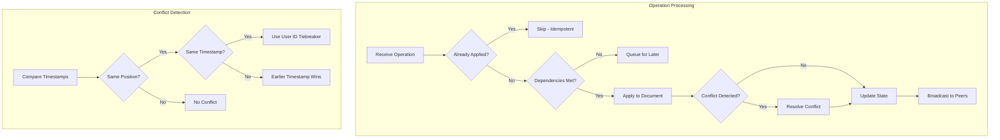

# LCS-DES-098a: Design Specification — CRDT Tests

## 1. Metadata & Categorization

| Field | Value | Description |
| :--- | :--- | :--- |
| **Feature ID** | `TST-098a` | Sub-part of TST-098 |
| **Feature Name** | `CRDT Concurrent Edit Simulation Tests` | Conflict-free replicated data type verification |
| **Target Version** | `v0.9.8a` | First sub-part of v0.9.8 |
| **Module Scope** | `Lexichord.Tests.Collaboration` | Test project |
| **Swimlane** | `Governance` | Part of Collaboration vertical |
| **License Tier** | `Core` | Testing available to all |
| **Feature Gate Key** | N/A | No gating for tests |
| **Author** | Lead Architect | |
| **Status** | `Draft` | |
| **Last Updated** | `2026-01-27` | |
| **Parent Document** | [LCS-DES-098-INDEX](./LCS-DES-098-INDEX.md) | |
| **Scope Breakdown** | [LCS-SBD-098 Section 3.1](./LCS-SBD-098.md#31-v098a-crdt-tests) | |

---

## 2. Executive Summary

### 2.1 The Requirement

The CRDT-based real-time editing system introduced in v0.7.1 must produce consistent, predictable results across all concurrent edit scenarios. Without comprehensive verification:

- Concurrent edits could result in divergent document states
- Conflict resolution could silently corrupt user data
- Operation ordering could produce non-deterministic results

> **Goal:** Prove that concurrent edits from N users produce identical final documents regardless of the order in which operations are received and merged.

### 2.2 The Proposed Solution

Implement a comprehensive test suite that:

1. Verifies CRDT mathematical properties (commutativity, associativity, idempotency)
2. Tests all conflict scenarios (concurrent inserts, overlapping deletes, format conflicts)
3. Uses property-based testing (FsCheck) to discover edge cases through random generation
4. Proves eventual consistency across random operation orderings
5. Integrates with CI to prevent convergence regressions

---

## 3. Architecture & Modular Strategy

### 3.1 Dependencies

#### 3.1.1 Systems Under Test

| Interface | Source Version | Purpose |
| :--- | :--- | :--- |
| `ICrdtDocument` | v0.7.1a | Document structure under test |
| `ICrdtMergeService` | v0.7.1b | Merge algorithm under test |
| `ICrdtOperationLog` | v0.7.1c | Operation sequencing under test |
| `IConflictResolver` | v0.7.2a | Conflict resolution under test |
| `ICollaborationHub` | v0.7.6a | Integration tests |

#### 3.1.2 NuGet Packages

| Package | Version | Purpose |
| :--- | :--- | :--- |
| `xunit` | 2.9.x | Test framework |
| `FluentAssertions` | 6.x | Fluent assertions |
| `Moq` | 4.x | Mocking dependencies |
| `FsCheck.Xunit` | 2.x | Property-based testing |

### 3.2 Licensing Behavior

No licensing required. Tests run in development/CI environments only.

---

## 4. Data Contract (The API)

### 4.1 Test Class Structure

```csharp
namespace Lexichord.Tests.Collaboration.Crdt;

/// <summary>
/// Accuracy tests for CRDT merge algorithm.
/// Verifies that concurrent edits converge to identical documents.
/// </summary>
[Trait("Category", "Unit")]
[Trait("Version", "v0.9.8a")]
public class CrdtMergeAccuracyTests
{
    private readonly ICrdtMergeService _mergeService;
    private readonly IConflictResolver _conflictResolver;

    public CrdtMergeAccuracyTests()
    {
        _mergeService = new CrdtMergeService();
        _conflictResolver = new DefaultConflictResolver();
    }

    // Test methods...
}

/// <summary>
/// Tests verifying operation ordering and sequencing.
/// </summary>
[Trait("Category", "Unit")]
[Trait("Version", "v0.9.8a")]
public class CrdtOperationOrderingTests
{
    // Test methods...
}

/// <summary>
/// Tests for conflict resolution strategies.
/// </summary>
[Trait("Category", "Unit")]
[Trait("Version", "v0.9.8a")]
public class CrdtConflictResolutionTests
{
    // Test methods...
}

/// <summary>
/// Property-based tests proving CRDT mathematical properties.
/// </summary>
[Trait("Category", "Unit")]
[Trait("Version", "v0.9.8a")]
public class CrdtConvergenceTests
{
    // Property-based tests using FsCheck...
}
```

---

## 5. Implementation Logic

### 5.1 CRDT Mathematical Properties

CRDTs must satisfy these mathematical properties to guarantee eventual consistency:

#### 5.1.1 Commutativity

```text
For any operations A and B:
  merge(doc, A, B) = merge(doc, B, A)

The order in which operations are applied must not affect the final result.
```

#### 5.1.2 Associativity

```text
For any operations A, B, and C:
  merge(merge(doc, A), B), C) = merge(doc, merge(A, merge(B, C)))

Grouping of operations must not affect the final result.
```

#### 5.1.3 Idempotency

```text
For any operation A:
  merge(merge(doc, A), A) = merge(doc, A)

Applying the same operation twice must produce the same result as applying once.
```

#### 5.1.4 Convergence

```text
Given any set of operations S applied to replicas R1, R2, ..., Rn:
  Eventually: R1 = R2 = ... = Rn

All replicas must eventually reach the same state.
```

### 5.2 Conflict Resolution Strategies

```text
CONFLICT TYPE                  RESOLUTION STRATEGY
─────────────────────────────────────────────────────────────────
Concurrent Insert (same pos)   Deterministic ordering by (timestamp, userId)
  User A: insert(5, "X")       - Lower timestamp wins left position
  User B: insert(5, "Y")       - On tie, lexicographically lower userId wins
  → Result: "XY" or "YX"       - Result: deterministic for all replicas

Overlapping Delete             Union of deleted ranges
  User A: delete(5, 10)        - Combine ranges: [5,10] ∪ [8,15] = [5,15]
  User B: delete(8, 15)        - No content survives overlap
  → Result: delete(5, 15)

Insert into Deleted            Tombstone the insert
  User A: insert(7, "X")       - Insert becomes a tombstone
  User B: delete(5, 10)        - Preserved in history, not in content
  → Result: X not visible      - Can be recovered from history

Concurrent Formatting          Merge formats (both applied)
  User A: bold(5, 10)          - Overlapping range gets both formats
  User B: italic(8, 15)        - Range [8,10] is bold+italic
  → Result: both applied       - Non-overlapping ranges get single format

Delete Formatted               Tombstone the format
  User A: bold(5, 10)          - Format on deleted range is tombstoned
  User B: delete(5, 10)        - Preserved in history
  → Result: format lost
```

### 5.3 Operation Ordering Logic



---

## 6. Test Scenarios

### 6.1 CrdtMergeAccuracyTests

```csharp
[Trait("Category", "Unit")]
[Trait("Version", "v0.9.8a")]
public class CrdtMergeAccuracyTests
{
    private readonly ICrdtMergeService _mergeService = new CrdtMergeService();

    #region Concurrent Insert Tests

    [Fact]
    public void Merge_ConcurrentInsertsAtSamePosition_DeterministicResult()
    {
        // Arrange
        var docA = CrdtDocument.Create("Hello");
        var docB = CrdtDocument.Create("Hello");

        // User A inserts "X" at position 5
        var opA = CrdtOperation.Insert(
            position: 5,
            text: "X",
            userId: "user-a",
            timestamp: 100);

        // User B inserts "Y" at position 5 (concurrently)
        var opB = CrdtOperation.Insert(
            position: 5,
            text: "Y",
            userId: "user-b",
            timestamp: 100);

        // Act - Apply in different orders
        docA.Apply(opA);
        docA.Merge(opB);

        docB.Apply(opB);
        docB.Merge(opA);

        // Assert - Both must converge
        docA.Content.Should().Be(docB.Content,
            "CRDT merge must be commutative");

        // And the order should be deterministic (user-a < user-b lexicographically)
        docA.Content.Should().Be("HelloXY");
    }

    [Theory]
    [InlineData("user-a", "user-b", 100, 100, "HelloXY")]  // Same timestamp, user-a wins
    [InlineData("user-b", "user-a", 100, 100, "HelloYX")]  // Same timestamp, user-a wins
    [InlineData("user-a", "user-b", 99, 100, "HelloXY")]   // user-a earlier timestamp
    [InlineData("user-a", "user-b", 100, 99, "HelloYX")]   // user-b earlier timestamp
    public void Merge_ConcurrentInserts_RespectsTiebreaker(
        string userA, string userB, long tsA, long tsB, string expected)
    {
        var doc = CrdtDocument.Create("Hello");

        var opA = CrdtOperation.Insert(5, "X", userA, tsA);
        var opB = CrdtOperation.Insert(5, "Y", userB, tsB);

        doc.Apply(opA);
        doc.Merge(opB);

        doc.Content.Should().Be(expected);
    }

    #endregion

    #region Overlapping Delete Tests

    [Fact]
    public void Merge_OverlappingDeletes_UnionOfRanges()
    {
        // Arrange
        var doc = CrdtDocument.Create("Hello World!");

        // User A deletes "World" (positions 6-11)
        var opA = CrdtOperation.Delete(
            start: 6,
            length: 5,
            userId: "user-a",
            timestamp: 100);

        // User B deletes "rld!" (positions 8-12, overlapping)
        var opB = CrdtOperation.Delete(
            start: 8,
            length: 4,
            userId: "user-b",
            timestamp: 100);

        // Act
        doc.Apply(opA);
        doc.Merge(opB);

        // Assert - Union of deletions: positions 6-12 deleted
        doc.Content.Should().Be("Hello ");
    }

    [Fact]
    public void Merge_ConcurrentDeletes_SameRange_Idempotent()
    {
        // Arrange
        var doc = CrdtDocument.Create("Hello World");

        // Both users delete "World"
        var opA = CrdtOperation.Delete(6, 5, "user-a", 100);
        var opB = CrdtOperation.Delete(6, 5, "user-b", 100);

        // Act
        doc.Apply(opA);
        doc.Merge(opB);

        // Assert
        doc.Content.Should().Be("Hello ");
    }

    #endregion

    #region Insert Into Deleted Range Tests

    [Fact]
    public void Merge_InsertIntoDeletedRange_InsertTombstoned()
    {
        // Arrange
        var docA = CrdtDocument.Create("Hello World");
        var docB = CrdtDocument.Create("Hello World");

        // User A deletes "World"
        var deleteOp = CrdtOperation.Delete(6, 5, "user-a", 100);

        // User B inserts "Beautiful " at position 8 (inside deleted range)
        var insertOp = CrdtOperation.Insert(8, "Beautiful ", "user-b", 100);

        // Act - Different orders
        docA.Apply(deleteOp);
        docA.Merge(insertOp);

        docB.Apply(insertOp);
        docB.Merge(deleteOp);

        // Assert - Both converge, insert is tombstoned
        docA.Content.Should().Be(docB.Content);
        docA.Content.Should().Be("Hello ");

        // Insert should be preserved in history
        docA.TombstonedOperations.Should().Contain(
            op => op.OperationId == insertOp.OperationId);
    }

    #endregion

    #region Concurrent Formatting Tests

    [Fact]
    public void Merge_ConcurrentFormats_BothApplied()
    {
        // Arrange
        var doc = CrdtDocument.Create("Hello World");

        // User A bolds positions 0-5
        var boldOp = CrdtOperation.Format(0, 5, "bold", "user-a", 100);

        // User B italicizes positions 3-8
        var italicOp = CrdtOperation.Format(3, 5, "italic", "user-b", 100);

        // Act
        doc.Apply(boldOp);
        doc.Merge(italicOp);

        // Assert
        // Positions 0-2: bold only
        doc.GetFormatsAt(0).Should().Contain("bold");
        doc.GetFormatsAt(0).Should().NotContain("italic");

        // Positions 3-5: bold + italic
        doc.GetFormatsAt(4).Should().Contain("bold");
        doc.GetFormatsAt(4).Should().Contain("italic");

        // Positions 6-8: italic only
        doc.GetFormatsAt(7).Should().NotContain("bold");
        doc.GetFormatsAt(7).Should().Contain("italic");
    }

    #endregion

    #region Multi-User Convergence Tests

    [Theory]
    [InlineData(2, 10)]    // 2 users, 10 operations each
    [InlineData(5, 20)]    // 5 users, 20 operations each
    [InlineData(10, 50)]   // 10 users, 50 operations each
    public void Merge_MultiUserEdits_AllOrderingsConverge(int userCount, int opsPerUser)
    {
        // Arrange
        var operations = CrdtOperationFixtures.GenerateRandomOperations(
            userCount, opsPerUser, seed: 42);

        // Generate 100 random permutations of operation orderings
        var orderings = CrdtOperationFixtures.GenerateOrderPermutations(
            operations, sampleCount: 100);

        // Act - Apply each ordering to a fresh document
        var results = orderings.Select(ordering =>
        {
            var doc = CrdtDocument.Create("Initial content");
            foreach (var op in ordering)
            {
                doc.Merge(op);
            }
            return doc.Content;
        }).ToList();

        // Assert - All orderings produce identical results
        results.Should().AllBe(results.First(),
            "All operation orderings must produce identical documents");
    }

    [Fact]
    public void Merge_100RandomOperations_ConvergesWithinTimeout()
    {
        // Arrange
        var operations = CrdtOperationFixtures.GenerateRandomOperations(
            userCount: 10, opsPerUser: 100, seed: 42);

        var documents = Enumerable.Range(0, 10)
            .Select(_ => CrdtDocument.Create("Starting point"))
            .ToList();

        var sw = Stopwatch.StartNew();

        // Act - Apply random subsets to each document, then merge all
        var random = new Random(42);
        foreach (var doc in documents)
        {
            var subset = operations.OrderBy(_ => random.Next()).Take(500);
            foreach (var op in subset)
            {
                doc.Merge(op);
            }
        }

        // Cross-merge all documents
        foreach (var doc in documents)
        {
            foreach (var otherDoc in documents)
            {
                if (doc != otherDoc)
                {
                    doc.MergeDocument(otherDoc);
                }
            }
        }

        sw.Stop();

        // Assert - All documents converge
        var finalStates = documents.Select(d => d.Content).Distinct().ToList();
        finalStates.Should().HaveCount(1, "All replicas must converge");

        sw.Elapsed.Should().BeLessThan(TimeSpan.FromSeconds(10),
            "Convergence should complete within reasonable time");
    }

    #endregion
}
```

### 6.2 CrdtOperationOrderingTests

```csharp
[Trait("Category", "Unit")]
[Trait("Version", "v0.9.8a")]
public class CrdtOperationOrderingTests
{
    [Fact]
    public void Apply_OperationWithUnmetDependencies_Queued()
    {
        // Arrange
        var doc = CrdtDocument.Create("Hello");

        // Operation that depends on an operation we haven't seen
        var op = CrdtOperation.Insert(5, "X", "user-a", 100)
            with { DependsOn = new[] { Guid.NewGuid() } };

        // Act
        doc.Apply(op);

        // Assert
        doc.PendingOperations.Should().Contain(op);
        doc.Content.Should().Be("Hello"); // Not applied yet
    }

    [Fact]
    public void Apply_DependencySatisfied_PendingApplied()
    {
        // Arrange
        var doc = CrdtDocument.Create("Hello");

        var op1 = CrdtOperation.Insert(5, "X", "user-a", 100);
        var op2 = CrdtOperation.Insert(6, "Y", "user-a", 101)
            with { DependsOn = new[] { op1.OperationId } };

        // Apply op2 first (dependency not met)
        doc.Apply(op2);
        doc.Content.Should().Be("Hello"); // Not applied

        // Act - Apply op1 (satisfies dependency)
        doc.Apply(op1);

        // Assert - Both applied
        doc.Content.Should().Be("HelloXY");
        doc.PendingOperations.Should().BeEmpty();
    }

    [Theory]
    [InlineData(100, 101, 102)]  // Sequential timestamps
    [InlineData(102, 100, 101)]  // Out of order
    [InlineData(100, 100, 100)]  // Concurrent
    public void Apply_VaryingTimestamps_CorrectLogicalOrder(
        long ts1, long ts2, long ts3)
    {
        // Arrange
        var doc = CrdtDocument.Create("");

        var ops = new[]
        {
            CrdtOperation.Insert(0, "A", "user-a", ts1),
            CrdtOperation.Insert(0, "B", "user-b", ts2),
            CrdtOperation.Insert(0, "C", "user-c", ts3)
        };

        // Act - Apply in various orders
        foreach (var order in GetAllPermutations(ops))
        {
            var testDoc = CrdtDocument.Create("");
            foreach (var op in order)
            {
                testDoc.Apply(op);
            }

            // Assert - All permutations produce same result
            testDoc.Content.Should().Be(doc.Content,
                "Logical ordering must be consistent");
        }
    }

    [Fact]
    public void VectorClock_CorrectlyTracksOperations()
    {
        // Arrange
        var doc = CrdtDocument.Create("Hello");

        // Act
        doc.Apply(CrdtOperation.Insert(5, "X", "user-a", 1));
        doc.Apply(CrdtOperation.Insert(6, "Y", "user-a", 2));
        doc.Apply(CrdtOperation.Insert(7, "Z", "user-b", 1));

        // Assert
        doc.VectorClock["user-a"].Should().Be(2);
        doc.VectorClock["user-b"].Should().Be(1);
    }
}
```

### 6.3 CrdtConflictResolutionTests

```csharp
[Trait("Category", "Unit")]
[Trait("Version", "v0.9.8a")]
public class CrdtConflictResolutionTests
{
    private readonly IConflictResolver _resolver = new DefaultConflictResolver();

    [Theory]
    [InlineData("insert", "insert", ConflictStrategy.DeterministicOrdering)]
    [InlineData("insert", "delete", ConflictStrategy.TombstoneInsert)]
    [InlineData("delete", "delete", ConflictStrategy.UnionDelete)]
    [InlineData("format", "delete", ConflictStrategy.TombstoneFormat)]
    [InlineData("format", "format", ConflictStrategy.MergeFormats)]
    public void Resolve_ConflictType_UsesCorrectStrategy(
        string opTypeA, string opTypeB, ConflictStrategy expectedStrategy)
    {
        // Arrange
        var conflict = CrdtOperationFixtures.CreateConflict(opTypeA, opTypeB);

        // Act
        var resolution = _resolver.Resolve(conflict.OperationA, conflict.OperationB);

        // Assert
        resolution.Strategy.Should().Be(expectedStrategy);
    }

    [Fact]
    public void Resolve_InsertInsertConflict_PreservesUserIntent()
    {
        // Arrange
        var opA = CrdtOperation.Insert(5, "Hello ", "user-a", 100);
        var opB = CrdtOperation.Insert(5, "World ", "user-b", 100);

        // Act
        var resolution = _resolver.Resolve(opA, opB);

        // Assert - Both texts preserved (order determined by tiebreaker)
        resolution.ResultingOperations.Should().HaveCount(2);
        resolution.ResultingOperations.Select(o => o.Text)
            .Should().Contain("Hello ").And.Contain("World ");
    }

    [Fact]
    public void Resolve_DeleteInsertConflict_PreservesHistory()
    {
        // Arrange
        var deleteOp = CrdtOperation.Delete(5, 10, "user-a", 100);
        var insertOp = CrdtOperation.Insert(7, "X", "user-b", 100);

        // Act
        var resolution = _resolver.Resolve(deleteOp, insertOp);

        // Assert
        resolution.Strategy.Should().Be(ConflictStrategy.TombstoneInsert);
        resolution.TombstonedOperations.Should().Contain(insertOp);
    }

    [Fact]
    public void Resolve_Conflict_IsSymmetric()
    {
        // Arrange
        var opA = CrdtOperation.Insert(5, "X", "user-a", 100);
        var opB = CrdtOperation.Insert(5, "Y", "user-b", 100);

        // Act
        var resolutionAB = _resolver.Resolve(opA, opB);
        var resolutionBA = _resolver.Resolve(opB, opA);

        // Assert - Order of arguments should not matter
        resolutionAB.Strategy.Should().Be(resolutionBA.Strategy);
        resolutionAB.ResultingOperations.Select(o => o.Text).OrderBy(t => t)
            .Should().Equal(resolutionBA.ResultingOperations.Select(o => o.Text).OrderBy(t => t));
    }
}
```

### 6.4 CrdtConvergenceTests (Property-Based)

```csharp
[Trait("Category", "Unit")]
[Trait("Version", "v0.9.8a")]
public class CrdtConvergenceTests
{
    /// <summary>
    /// Property: Merge is commutative.
    /// merge(A, B) = merge(B, A)
    /// </summary>
    [Property(MaxTest = 500)]
    public Property Merge_IsCommutative()
    {
        return Prop.ForAll(
            CrdtArbitraries.Operation(),
            CrdtArbitraries.Operation(),
            (opA, opB) =>
            {
                var docAB = CrdtDocument.Create("Test");
                docAB.Apply(opA);
                docAB.Merge(opB);

                var docBA = CrdtDocument.Create("Test");
                docBA.Apply(opB);
                docBA.Merge(opA);

                return docAB.Content == docBA.Content;
            });
    }

    /// <summary>
    /// Property: Merge is associative.
    /// merge(merge(A, B), C) = merge(A, merge(B, C))
    /// </summary>
    [Property(MaxTest = 500)]
    public Property Merge_IsAssociative()
    {
        return Prop.ForAll(
            CrdtArbitraries.Operation(),
            CrdtArbitraries.Operation(),
            CrdtArbitraries.Operation(),
            (opA, opB, opC) =>
            {
                // (A merge B) merge C
                var docLeft = CrdtDocument.Create("Test");
                docLeft.Apply(opA);
                docLeft.Merge(opB);
                docLeft.Merge(opC);

                // A merge (B merge C)
                var tempDoc = CrdtDocument.Create("Test");
                tempDoc.Apply(opB);
                tempDoc.Merge(opC);

                var docRight = CrdtDocument.Create("Test");
                docRight.Apply(opA);
                docRight.MergeDocument(tempDoc);

                return docLeft.Content == docRight.Content;
            });
    }

    /// <summary>
    /// Property: Merge is idempotent.
    /// merge(A, A) = A
    /// </summary>
    [Property(MaxTest = 500)]
    public Property Merge_IsIdempotent()
    {
        return Prop.ForAll(
            CrdtArbitraries.Operation(),
            op =>
            {
                var docOnce = CrdtDocument.Create("Test");
                docOnce.Apply(op);

                var docTwice = CrdtDocument.Create("Test");
                docTwice.Apply(op);
                docTwice.Merge(op);

                return docOnce.Content == docTwice.Content;
            });
    }

    /// <summary>
    /// Property: All orderings of the same operations converge.
    /// </summary>
    [Property(MaxTest = 100)]
    public Property AllOrderings_Converge()
    {
        return Prop.ForAll(
            CrdtArbitraries.OperationList(minCount: 2, maxCount: 10),
            operations =>
            {
                var orderings = GetAllPermutations(operations.ToList()).Take(50);
                var results = new HashSet<string>();

                foreach (var ordering in orderings)
                {
                    var doc = CrdtDocument.Create("Initial");
                    foreach (var op in ordering)
                    {
                        doc.Merge(op);
                    }
                    results.Add(doc.Content);
                }

                return results.Count == 1;
            });
    }
}

/// <summary>
/// FsCheck generators for CRDT operations.
/// </summary>
public static class CrdtArbitraries
{
    public static Arbitrary<CrdtOperation> Operation()
    {
        return Gen.OneOf(
            InsertGen(),
            DeleteGen(),
            FormatGen()
        ).ToArbitrary();
    }

    public static Arbitrary<IEnumerable<CrdtOperation>> OperationList(
        int minCount = 1, int maxCount = 10)
    {
        return Gen.ListOf(Gen.Choose(minCount, maxCount).Select(_ =>
            Operation().Generator.Sample(1, 1).First()))
            .ToArbitrary();
    }

    private static Gen<CrdtOperation> InsertGen()
    {
        return from position in Gen.Choose(0, 100)
               from text in Arb.Default.NonEmptyString().Generator
               from userId in Gen.Elements("user-a", "user-b", "user-c", "user-d")
               from timestamp in Gen.Choose(1, 1000)
               select CrdtOperation.Insert(position, text.Get, userId, timestamp);
    }

    private static Gen<CrdtOperation> DeleteGen()
    {
        return from start in Gen.Choose(0, 50)
               from length in Gen.Choose(1, 20)
               from userId in Gen.Elements("user-a", "user-b", "user-c", "user-d")
               from timestamp in Gen.Choose(1, 1000)
               select CrdtOperation.Delete(start, length, userId, timestamp);
    }

    private static Gen<CrdtOperation> FormatGen()
    {
        return from start in Gen.Choose(0, 50)
               from length in Gen.Choose(1, 20)
               from format in Gen.Elements("bold", "italic", "underline", "code")
               from userId in Gen.Elements("user-a", "user-b", "user-c", "user-d")
               from timestamp in Gen.Choose(1, 1000)
               select CrdtOperation.Format(start, length, format, userId, timestamp);
    }
}
```

### 6.5 Test Fixtures

```csharp
namespace Lexichord.Tests.Collaboration.TestFixtures;

/// <summary>
/// Fixtures for generating CRDT operations for testing.
/// </summary>
public static class CrdtOperationFixtures
{
    /// <summary>
    /// Generate a sequence of random operations from multiple users.
    /// </summary>
    public static List<CrdtOperation> GenerateRandomOperations(
        int userCount,
        int opsPerUser,
        int seed = 42)
    {
        var random = new Random(seed);
        var operations = new List<CrdtOperation>();
        var clock = new LogicalClock();

        for (int user = 0; user < userCount; user++)
        {
            var userId = $"user-{user}";

            for (int op = 0; op < opsPerUser; op++)
            {
                var operation = GenerateRandomOperation(
                    userId, clock.Tick(), random);
                operations.Add(operation);
            }
        }

        return operations;
    }

    /// <summary>
    /// Generate sample permutations of operation orderings.
    /// </summary>
    public static IEnumerable<List<CrdtOperation>> GenerateOrderPermutations(
        List<CrdtOperation> operations,
        int sampleCount = 100)
    {
        var random = new Random(42);

        for (int i = 0; i < sampleCount; i++)
        {
            yield return operations.OrderBy(_ => random.Next()).ToList();
        }
    }

    /// <summary>
    /// Create a specific conflict scenario for testing.
    /// </summary>
    public static ConflictScenario CreateConflict(string opTypeA, string opTypeB)
    {
        return (opTypeA, opTypeB) switch
        {
            ("insert", "insert") => new ConflictScenario
            {
                OperationA = CrdtOperation.Insert(5, "A", "user-a", 100),
                OperationB = CrdtOperation.Insert(5, "B", "user-b", 100),
                ExpectedStrategy = ConflictStrategy.DeterministicOrdering
            },
            ("insert", "delete") => new ConflictScenario
            {
                OperationA = CrdtOperation.Insert(7, "X", "user-a", 100),
                OperationB = CrdtOperation.Delete(5, 10, "user-b", 100),
                ExpectedStrategy = ConflictStrategy.TombstoneInsert
            },
            ("delete", "delete") => new ConflictScenario
            {
                OperationA = CrdtOperation.Delete(5, 10, "user-a", 100),
                OperationB = CrdtOperation.Delete(8, 7, "user-b", 100),
                ExpectedStrategy = ConflictStrategy.UnionDelete
            },
            ("format", "delete") => new ConflictScenario
            {
                OperationA = CrdtOperation.Format(5, 10, "bold", "user-a", 100),
                OperationB = CrdtOperation.Delete(5, 10, "user-b", 100),
                ExpectedStrategy = ConflictStrategy.TombstoneFormat
            },
            ("format", "format") => new ConflictScenario
            {
                OperationA = CrdtOperation.Format(5, 10, "bold", "user-a", 100),
                OperationB = CrdtOperation.Format(8, 7, "italic", "user-b", 100),
                ExpectedStrategy = ConflictStrategy.MergeFormats
            },
            _ => throw new ArgumentException($"Unknown conflict: {opTypeA}/{opTypeB}")
        };
    }

    private static CrdtOperation GenerateRandomOperation(
        string userId, long timestamp, Random random)
    {
        var opType = random.Next(4);
        return opType switch
        {
            0 => CrdtOperation.Insert(
                random.Next(100),
                GenerateRandomText(random),
                userId,
                timestamp),
            1 => CrdtOperation.Delete(
                random.Next(100),
                random.Next(1, 20),
                userId,
                timestamp),
            2 => CrdtOperation.Format(
                random.Next(100),
                random.Next(1, 20),
                RandomFormat(random),
                userId,
                timestamp),
            _ => CrdtOperation.Insert(0, "X", userId, timestamp)
        };
    }

    private static string GenerateRandomText(Random random)
    {
        var length = random.Next(1, 50);
        return new string(Enumerable.Range(0, length)
            .Select(_ => (char)random.Next('a', 'z' + 1))
            .ToArray());
    }

    private static string RandomFormat(Random random)
    {
        var formats = new[] { "bold", "italic", "underline", "code", "strikethrough" };
        return formats[random.Next(formats.Length)];
    }
}

public record ConflictScenario
{
    public required CrdtOperation OperationA { get; init; }
    public required CrdtOperation OperationB { get; init; }
    public required ConflictStrategy ExpectedStrategy { get; init; }
}
```

---

## 7. UI/UX Specifications

**Not applicable.** This is a test-only specification with no user-facing UI components.

---

## 8. Observability & Logging

| Level | Message Template |
| :--- | :--- |
| Debug | `"CRDT merge: applying {OperationType} from {UserId} at position {Position}"` |
| Debug | `"CRDT conflict detected: {OpTypeA} vs {OpTypeB}, strategy: {Strategy}"` |
| Info | `"CRDT convergence test: {OrderingCount} orderings, all converged"` |
| Warning | `"CRDT dependency not met: {OperationId} depends on {MissingId}"` |
| Error | `"CRDT convergence failure: replicas diverged"` |

---

## 9. Security & Safety

| Risk | Level | Mitigation |
| :--- | :--- | :--- |
| Test data injection | None | Tests use hardcoded values |
| Sensitive data in tests | None | No PII in test fixtures |
| Infinite loops | Low | Timeout on convergence tests |

---

## 10. Acceptance Criteria

### 10.1 Functional Criteria

| # | Given | When | Then |
| :--- | :--- | :--- | :--- |
| 1 | Two concurrent inserts at same position | Merging | Deterministic ordering |
| 2 | Overlapping deletes | Merging | Union of ranges deleted |
| 3 | Insert into deleted range | Merging | Insert tombstoned |
| 4 | Concurrent formats | Merging | Both formats applied |
| 5 | 100 random orderings | Applying to documents | All converge to same state |
| 6 | Same operation twice | Applying | Idempotent result |
| 7 | Operations A and B | Merge(A,B) vs Merge(B,A) | Same result (commutative) |

### 10.2 CI Criteria

| # | Given | When | Then |
| :--- | :--- | :--- | :--- |
| 8 | Any convergence test fails | CI runs tests | Build fails |
| 9 | Property-based test finds counterexample | CI runs tests | Build fails with shrunk example |
| 10 | All CRDT tests pass | CI runs tests | Build succeeds |

---

## 11. Deliverable Checklist

| # | Deliverable | Status |
| :--- | :--- | :--- |
| 1 | `CrdtMergeAccuracyTests.cs` | [ ] |
| 2 | `CrdtOperationOrderingTests.cs` | [ ] |
| 3 | `CrdtConflictResolutionTests.cs` | [ ] |
| 4 | `CrdtConvergenceTests.cs` with FsCheck | [ ] |
| 5 | `CrdtOperationFixtures.cs` test fixture | [ ] |
| 6 | `CrdtArbitraries.cs` FsCheck generators | [ ] |
| 7 | Test trait configuration | [ ] |
| 8 | CI filter for `Version=v0.9.8a` | [ ] |

---

## 12. Verification Commands

```bash
# Run all CRDT tests
dotnet test --filter "Version=v0.9.8a" --logger "console;verbosity=detailed"

# Run only merge accuracy tests
dotnet test --filter "FullyQualifiedName~CrdtMergeAccuracyTests"

# Run only convergence tests
dotnet test --filter "FullyQualifiedName~CrdtConvergenceTests"

# Run property-based tests with more iterations
dotnet test --filter "FullyQualifiedName~CrdtConvergenceTests" -- FsCheck.MaxTest=1000

# Run with coverage
dotnet test --filter "Version=v0.9.8a" --collect:"XPlat Code Coverage"
```

---

## Document History

| Version | Date | Author | Changes |
| :--- | :--- | :--- | :--- |
| 1.0 | 2026-01-27 | Lead Architect | Initial draft |
