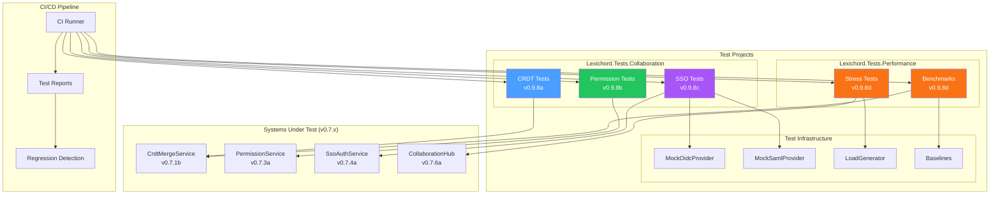
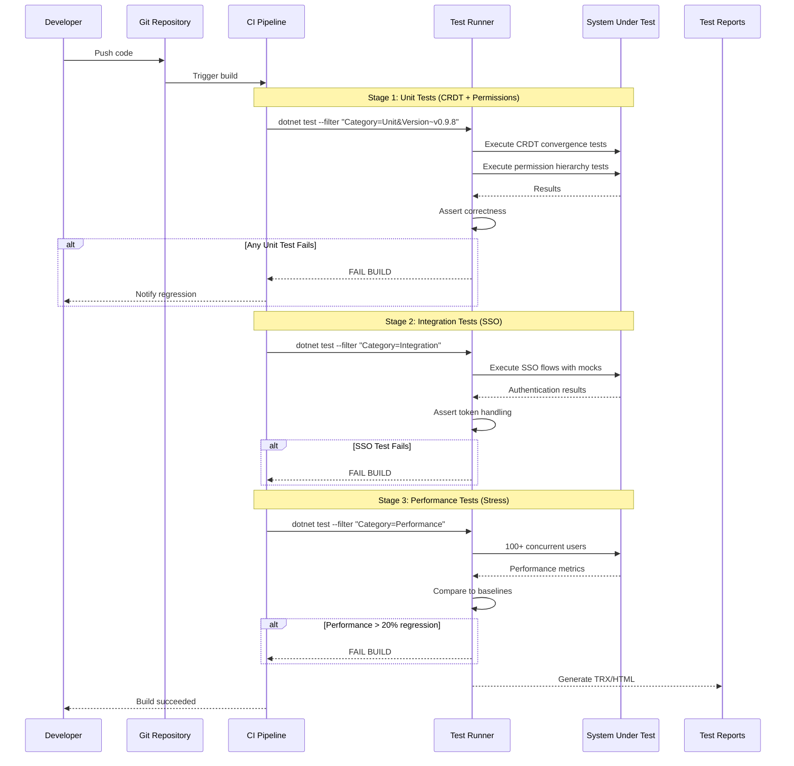

# LCS-DES-098: Design Specification Index — The Hardening (Collaboration)

## Document Control

| Field | Value |
| :--- | :--- |
| **Document ID** | LCS-DES-098-INDEX |
| **Feature ID** | TST-098 |
| **Feature Name** | The Hardening (Collaboration) |
| **Target Version** | v0.9.8 |
| **Module Scope** | Lexichord.Tests.Collaboration, Lexichord.Tests.Performance |
| **Swimlane** | Governance |
| **License Tier** | Core |
| **Feature Gate Key** | N/A (testing infrastructure) |
| **Status** | Draft |
| **Last Updated** | 2026-01-27 |

---

## 1. Executive Summary

**v0.9.8** delivers the **Hardening (Collaboration)** — The Final Dress Rehearsal: comprehensive integration and stress tests for all collaboration features before v1.0 release.

### 1.1 The Problem

Lexichord's v0.7.x release series introduced complex collaboration infrastructure:

- CRDT-based real-time document editing with conflict resolution
- Role-based permission hierarchies with multi-tenant isolation
- SSO integration with OIDC, SAML 2.0, and OAuth 2.0 providers
- WebSocket-based real-time synchronization for 100+ concurrent users

Without comprehensive testing, there is no guarantee these systems operate correctly under concurrent access, edge cases, and production load. Failures in collaboration could result in data loss, security breaches, or system instability.

### 1.2 The Solution

Implement four test suites that:

1. **Verify CRDT Correctness** — Prove mathematical properties (commutativity, convergence) hold under all operation orderings
2. **Enforce Permission Security** — Test all 24 role hierarchy permutations and prevent escalation attacks
3. **Validate SSO Integration** — Test authentication flows against mock identity providers with edge cases
4. **Stress Test at Scale** — Validate 100+ concurrent users with sustained load for 30+ minutes

### 1.3 Business Value

| Value | Description |
| :--- | :--- |
| **Data Integrity** | Mathematical proof that concurrent edits never cause data loss or corruption |
| **Security Assurance** | Verified permission enforcement prevents unauthorized access |
| **Authentication Reliability** | SSO edge cases handled gracefully (token expiry, provider outages) |
| **Scale Confidence** | Production capacity limits established before customer deployment |
| **Enterprise Readiness** | Test reports enable compliance and procurement approval |

---

## 2. Related Documents

### 2.1 Scope Breakdown Document

The detailed scope breakdown for v0.9.8, including all sub-parts, implementation checklists, user stories, and acceptance criteria:

| Document | Description |
| :--- | :--- |
| **[LCS-SBD-098](./LCS-SBD-098.md)** | Scope Breakdown — The Hardening (Collaboration) |

### 2.2 Sub-Part Design Specifications

Each sub-part has its own detailed design specification following the LDS-01 template:

| Sub-Part | Document | Title | Description |
| :--- | :--- | :--- | :--- |
| v0.9.8a | **[LCS-DES-098a](./LCS-DES-098a.md)** | CRDT Tests | Concurrent edit simulation and convergence verification |
| v0.9.8b | **[LCS-DES-098b](./LCS-DES-098b.md)** | Permission Tests | Role hierarchy edge cases and security tests |
| v0.9.8c | **[LCS-DES-098c](./LCS-DES-098c.md)** | SSO Tests | Mock identity providers with OIDC/SAML/OAuth |
| v0.9.8d | **[LCS-DES-098d](./LCS-DES-098d.md)** | Stress Tests | 100+ concurrent users under sustained load |

---

## 3. Architecture Overview

### 3.1 Component Diagram



### 3.2 Test Execution Flow



---

## 4. Dependencies

### 4.1 Upstream Dependencies (Systems Under Test)

| Interface | Source Version | Purpose |
| :--- | :--- | :--- |
| `ICrdtDocument` | v0.7.1a | CRDT document structure |
| `ICrdtMergeService` | v0.7.1b | Merge algorithm |
| `IConflictResolver` | v0.7.2a | Conflict resolution |
| `IPermissionService` | v0.7.3a | Permission enforcement |
| `IRoleHierarchy` | v0.7.3b | Role hierarchy logic |
| `IAccessControlList` | v0.7.3c | ACL validation |
| `ISsoAuthenticationService` | v0.7.4a | SSO authentication |
| `IOidcProvider` | v0.7.4b | OIDC handling |
| `ISamlProvider` | v0.7.4c | SAML handling |
| `ICollaborationHub` | v0.7.6a | Real-time sync |
| `ISessionManager` | v0.7.5a | Session lifecycle |

### 4.2 NuGet Packages

| Package | Version | Purpose |
| :--- | :--- | :--- |
| `xunit` | 2.9.x | Test framework |
| `FluentAssertions` | 6.x | Fluent test assertions |
| `Moq` | 4.x | Mocking framework |
| `BenchmarkDotNet` | 0.14.x | Performance benchmarking |
| `FsCheck.Xunit` | 2.x | Property-based testing (NEW) |
| `NBomber` | 5.x | Load testing framework (NEW) |
| `IdentityModel` | 6.x | JWT/OIDC utilities (NEW) |
| `coverlet.collector` | 6.x | Code coverage |

### 4.3 Downstream Consumers (Future)

| Version | Feature | Uses From v0.9.8 |
| :--- | :--- | :--- |
| v1.0.0 | General Availability | All test suites for release validation |
| v1.1.x | Advanced Collaboration | Test patterns for new features |
| v1.2.x | Scale | Baseline expansion for higher user counts |

---

## 5. License Gating Strategy

Testing infrastructure is **Core** tier — no license gating required.

All tests run regardless of user license tier. Test code is development-only and not included in production builds.

Note: The collaboration features being tested (CRDT, Permissions, SSO) may have their own tier restrictions (Teams/Enterprise), but the tests themselves are always available.

---

## 6. Test Categories

### 6.1 Test Trait Organization

| Category | Trait Filter | Purpose |
| :--- | :--- | :--- |
| Unit | `Category=Unit` | CRDT/Permission correctness |
| Integration | `Category=Integration` | SSO flow verification |
| Performance | `Category=Performance` | Stress test thresholds |
| Benchmark | `Category=Benchmark` | BenchmarkDotNet profiling |

| Version | Trait Filter | Sub-Part |
| :--- | :--- | :--- |
| v0.9.8a | `Version=v0.9.8a` | CRDT tests |
| v0.9.8b | `Version=v0.9.8b` | Permission tests |
| v0.9.8c | `Version=v0.9.8c` | SSO tests |
| v0.9.8d | `Version=v0.9.8d` | Stress tests |

### 6.2 CI Pipeline Commands

```bash
# Run all CRDT tests
dotnet test --filter "Category=Unit&Version=v0.9.8a"

# Run all permission tests
dotnet test --filter "Category=Unit&Version=v0.9.8b"

# Run all SSO tests
dotnet test --filter "Category=Integration&Version=v0.9.8c"

# Run all stress tests
dotnet test --filter "Category=Performance&Version=v0.9.8d"

# Run all v0.9.8 tests
dotnet test --filter "Version~v0.9.8"
```

---

## 7. Key Test Scenarios Summary

### 7.1 CRDT Tests (v0.9.8a)

| Scenario | Input | Expected |
| :--- | :--- | :--- |
| Concurrent inserts | 2 users insert at same position | Deterministic ordering |
| Overlapping deletes | Delete ranges [5,10] and [8,15] | Union [5,15] |
| Multi-user convergence | 100 random orderings | Identical final documents |
| Commutativity | merge(A,B) vs merge(B,A) | Equal results |

### 7.2 Permission Tests (v0.9.8b)

| Actor | Target | Can Manage? |
| :--- | :--- | :--- |
| Owner | Admin | Yes |
| Owner | Owner | No |
| Admin | Editor | Yes |
| Admin | Owner | No |
| Editor | Viewer | No |

### 7.3 SSO Tests (v0.9.8c)

| Protocol | Scenario | Expected |
| :--- | :--- | :--- |
| OIDC | Valid token | Session created |
| OIDC | Expired token | Error returned |
| OIDC | Wrong audience | Error returned |
| SAML | Valid assertion | Session created |
| SAML | Replay attack | Rejected |
| All | Provider timeout | Graceful error |

### 7.4 Stress Tests (v0.9.8d)

| Metric | 100 Users | Threshold |
| :--- | :--- | :--- |
| Edit latency (P50) | < 100ms | CI fails if exceeded |
| Edit latency (P95) | < 500ms | CI fails if exceeded |
| Edit latency (P99) | < 1000ms | CI fails if exceeded |
| Memory growth (30 min) | < 50% | CI fails if exceeded |
| Connection uptime | > 99% | CI fails if below |

---

## 8. Implementation Checklist Summary

| Sub-Part | Tasks | Est. Hours |
| :--- | :--- | :--- |
| v0.9.8a | CRDT Test Suite | 12.5 |
| v0.9.8b | Permission Test Suite | 10 |
| v0.9.8c | SSO Test Suite | 15.5 |
| v0.9.8d | Stress Test Suite | 15 |
| Integration | Project structure, CI config | 1 |
| **Total** | | **54 hours** |

See [LCS-SBD-098](./LCS-SBD-098.md) Section 4 for the detailed task breakdown.

---

## 9. Success Criteria Summary

| Category | Criterion | Target |
| :--- | :--- | :--- |
| **CRDT Convergence** | All orderings converge | 100% |
| **CRDT Commutativity** | merge(A,B) = merge(B,A) | 100% |
| **Permission Accuracy** | Role hierarchy enforced | 100% |
| **Permission Security** | No escalation paths | 0 vulnerabilities |
| **SSO Coverage** | OIDC + SAML + OAuth | All protocols |
| **SSO Security** | Replay/injection blocked | 100% |
| **Stress Users** | Concurrent support | 100+ users |
| **Stress Latency P95** | Edit response time | < 500ms |
| **Stress Memory** | Growth over 30 min | < 50% |

See [LCS-SBD-098](./LCS-SBD-098.md) Section 9 for full success metrics.

---

## 10. Test Coverage Summary

| Sub-Part | Test File | Coverage Area |
| :--- | :--- | :--- |
| v0.9.8a | `CrdtMergeAccuracyTests.cs` | Merge algorithm |
| v0.9.8a | `CrdtOperationOrderingTests.cs` | Operation sequencing |
| v0.9.8a | `CrdtConflictResolutionTests.cs` | Conflict handling |
| v0.9.8a | `CrdtConvergenceTests.cs` | Eventual consistency |
| v0.9.8b | `RoleHierarchyTests.cs` | Role permissions |
| v0.9.8b | `PermissionInheritanceTests.cs` | Permission cascading |
| v0.9.8b | `PermissionEscalationTests.cs` | Security testing |
| v0.9.8b | `CrossTenantAccessTests.cs` | Tenant isolation |
| v0.9.8c | `OidcAuthenticationTests.cs` | OIDC flows |
| v0.9.8c | `SamlAuthenticationTests.cs` | SAML assertions |
| v0.9.8c | `TokenLifecycleTests.cs` | Token refresh/expiry |
| v0.9.8c | `ProviderOutageTests.cs` | Resilience |
| v0.9.8d | `CollaborationStressTests.cs` | Multi-user load |
| v0.9.8d | `WebSocketStressTests.cs` | Connection stability |
| v0.9.8d | `CrdtScalabilityBenchmarks.cs` | Merge performance |

See individual design specs for detailed test scenarios.

---

## 11. What This Enables

| Version | Feature | Uses From v0.9.8 |
| :--- | :--- | :--- |
| v1.0.0 | General Availability | Production release with verified collaboration |
| v1.1.x | Advanced Collaboration | Test patterns for new features |
| v1.2.x | Scale | Baseline expansion for higher limits |
| v2.x | Enterprise | Compliance documentation |

---

## Document History

| Version | Date | Author | Changes |
| :--- | :--- | :--- | :--- |
| 1.0 | 2026-01-27 | Lead Architect | Initial draft |
