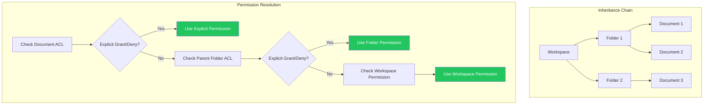

# LCS-DES-098b: Design Specification — Permission Tests

## 1. Metadata & Categorization

| Field | Value | Description |
| :--- | :--- | :--- |
| **Feature ID** | `TST-098b` | Sub-part of TST-098 |
| **Feature Name** | `Permission Role Hierarchy Edge Cases` | Security and access control verification |
| **Target Version** | `v0.9.8b` | Second sub-part of v0.9.8 |
| **Module Scope** | `Lexichord.Tests.Collaboration` | Test project |
| **Swimlane** | `Governance` | Part of Collaboration vertical |
| **License Tier** | `Core` | Testing available to all |
| **Feature Gate Key** | N/A | No gating for tests |
| **Author** | Lead Architect | |
| **Status** | `Draft` | |
| **Last Updated** | `2026-01-27` | |
| **Parent Document** | [LCS-DES-098-INDEX](./LCS-DES-098-INDEX.md) | |
| **Scope Breakdown** | [LCS-SBD-098 Section 3.2](./LCS-SBD-098.md#32-v098b-permission-tests) | |

---

## 2. Executive Summary

### 2.1 The Requirement

The role-based permission system introduced in v0.7.3 must correctly enforce access control across all role combinations and edge cases. Without comprehensive testing:

- Privilege escalation vulnerabilities could allow unauthorized access
- Permission inheritance could produce unexpected results
- Cross-tenant isolation could be compromised
- Role hierarchy edge cases could grant unintended capabilities

> **Goal:** Verify that all 24 role hierarchy permutations (5 roles: Owner, Admin, Editor, Commenter, Viewer = 5! edge cases) enforce correct access control with zero privilege escalation paths.

### 2.2 The Proposed Solution

Implement a comprehensive test suite that:

1. Tests all role hierarchy permutations for management capabilities
2. Verifies permission inheritance across document/folder structures
3. Tests explicit grant/deny ACL logic
4. Validates privilege escalation prevention
5. Ensures multi-tenant isolation
6. Integrates with CI to prevent security regressions

---

## 3. Architecture & Modular Strategy

### 3.1 Dependencies

#### 3.1.1 Systems Under Test

| Interface | Source Version | Purpose |
| :--- | :--- | :--- |
| `IPermissionService` | v0.7.3a | Permission enforcement under test |
| `IRoleHierarchy` | v0.7.3b | Role hierarchy logic under test |
| `IAccessControlList` | v0.7.3c | ACL validation under test |
| `ITenantService` | v0.7.3d | Multi-tenant isolation under test |

#### 3.1.2 NuGet Packages

| Package | Version | Purpose |
| :--- | :--- | :--- |
| `xunit` | 2.9.x | Test framework |
| `FluentAssertions` | 6.x | Fluent assertions |
| `Moq` | 4.x | Mocking dependencies |

### 3.2 Licensing Behavior

No licensing required. Tests run in development/CI environments only.

---

## 4. Data Contract (The API)

### 4.1 Test Class Structure

```csharp
namespace Lexichord.Tests.Collaboration.Permissions;

/// <summary>
/// Tests for role hierarchy enforcement.
/// Verifies all 24 role permutations behave correctly.
/// </summary>
[Trait("Category", "Unit")]
[Trait("Version", "v0.9.8b")]
public class RoleHierarchyTests
{
    private readonly IPermissionService _permissionService;
    private readonly IRoleHierarchy _roleHierarchy;

    // Test methods...
}

/// <summary>
/// Tests for permission inheritance across structures.
/// </summary>
[Trait("Category", "Unit")]
[Trait("Version", "v0.9.8b")]
public class PermissionInheritanceTests
{
    // Test methods...
}

/// <summary>
/// Tests for explicit ACL grant/deny logic.
/// </summary>
[Trait("Category", "Unit")]
[Trait("Version", "v0.9.8b")]
public class AccessControlListTests
{
    // Test methods...
}

/// <summary>
/// Security tests for privilege escalation prevention.
/// </summary>
[Trait("Category", "Unit")]
[Trait("Version", "v0.9.8b")]
public class PermissionEscalationTests
{
    // Test methods...
}

/// <summary>
/// Tests for multi-tenant isolation.
/// </summary>
[Trait("Category", "Unit")]
[Trait("Version", "v0.9.8b")]
public class CrossTenantAccessTests
{
    // Test methods...
}
```

---

## 5. Implementation Logic

### 5.1 Role Hierarchy

```text
ROLE HIERARCHY (highest to lowest):
┌────────────────────────────────────────────────────────────┐
│  OWNER     │ Full control, can delete workspace           │
├────────────────────────────────────────────────────────────┤
│  ADMIN     │ Manage users and documents, cannot delete    │
│            │ workspace or manage owners                    │
├────────────────────────────────────────────────────────────┤
│  EDITOR    │ Edit content, cannot manage users or share   │
├────────────────────────────────────────────────────────────┤
│  COMMENTER │ Add comments, cannot edit content            │
├────────────────────────────────────────────────────────────┤
│  VIEWER    │ Read-only access                             │
└────────────────────────────────────────────────────────────┘

INHERITANCE RULE: Higher roles inherit all capabilities of lower roles.
```

### 5.2 Permission Matrix

```text
CAPABILITY MATRIX:
┌─────────────────┬────────┬────────┬────────┬──────────┬────────┐
│ Capability      │ Owner  │ Admin  │ Editor │ Commenter│ Viewer │
├─────────────────┼────────┼────────┼────────┼──────────┼────────┤
│ Delete Workspace│   X    │   -    │   -    │    -     │   -    │
│ Manage Owners   │   X    │   -    │   -    │    -     │   -    │
│ Manage Admins   │   X    │   -    │   -    │    -     │   -    │
│ Delete Documents│   X    │   X    │   -    │    -     │   -    │
│ Manage Editors  │   X    │   X    │   -    │    -     │   -    │
│ Share Documents │   X    │   X    │   -    │    -     │   -    │
│ Edit Content    │   X    │   X    │   X    │    -     │   -    │
│ Export Documents│   X    │   X    │   X    │    -     │   -    │
│ Add Comments    │   X    │   X    │   X    │    X     │   -    │
│ View History    │   X    │   X    │   X    │    X     │   X    │
│ View Content    │   X    │   X    │   X    │    X     │   X    │
└─────────────────┴────────┴────────┴────────┴──────────┴────────┘
```

### 5.3 Permission Inheritance Rules



### 5.4 ACL Resolution Logic

```text
PERMISSION RESOLUTION ORDER:
1. Check explicit DENY on target resource → DENY if found
2. Check explicit ALLOW on target resource → ALLOW if found
3. Recurse to parent resource (folder → workspace)
4. Check user's role-based permission → Use role capability
5. Default → DENY

SPECIAL CASES:
- Explicit DENY always wins over inherited ALLOW
- Most specific permission wins (document > folder > workspace)
- Group membership is evaluated after direct user grants
- Time-limited permissions expire based on server time
```

---

## 6. Test Scenarios

### 6.1 RoleHierarchyTests

```csharp
[Trait("Category", "Unit")]
[Trait("Version", "v0.9.8b")]
public class RoleHierarchyTests
{
    private readonly IPermissionService _sut;
    private readonly TestDataFactory _factory = new();

    public RoleHierarchyTests()
    {
        _sut = new PermissionService(
            new RoleHierarchy(),
            new InMemoryAclRepository(),
            NullLogger<PermissionService>.Instance);
    }

    #region Role Management Tests

    [Theory]
    [InlineData(Role.Owner, Role.Admin, true)]      // Owner can manage Admins
    [InlineData(Role.Owner, Role.Editor, true)]     // Owner can manage Editors
    [InlineData(Role.Owner, Role.Commenter, true)]  // Owner can manage Commenters
    [InlineData(Role.Owner, Role.Viewer, true)]     // Owner can manage Viewers
    [InlineData(Role.Owner, Role.Owner, false)]     // Owner cannot manage other Owners
    [InlineData(Role.Admin, Role.Editor, true)]     // Admin can manage Editors
    [InlineData(Role.Admin, Role.Commenter, true)]  // Admin can manage Commenters
    [InlineData(Role.Admin, Role.Viewer, true)]     // Admin can manage Viewers
    [InlineData(Role.Admin, Role.Admin, false)]     // Admin cannot manage other Admins
    [InlineData(Role.Admin, Role.Owner, false)]     // Admin cannot manage Owners
    [InlineData(Role.Editor, Role.Viewer, false)]   // Editor cannot manage anyone
    [InlineData(Role.Editor, Role.Commenter, false)]// Editor cannot manage anyone
    [InlineData(Role.Commenter, Role.Viewer, false)]// Commenter cannot manage anyone
    [InlineData(Role.Viewer, Role.Viewer, false)]   // Viewer cannot manage anyone
    public void CanManageRole_AllPermutations_EnforcesHierarchy(
        Role actorRole, Role targetRole, bool expected)
    {
        // Arrange
        var actor = _factory.CreateUser(role: actorRole);
        var target = _factory.CreateUser(role: targetRole);
        var workspace = _factory.CreateWorkspace();

        // Act
        var result = _sut.CanManageRole(actor, target, workspace);

        // Assert
        result.Should().Be(expected,
            $"{actorRole} should {(expected ? "" : "NOT ")}be able to manage {targetRole}");
    }

    #endregion

    #region Capability Tests

    [Theory]
    [InlineData(Role.Owner, Permission.DeleteWorkspace, true)]
    [InlineData(Role.Admin, Permission.DeleteWorkspace, false)]
    [InlineData(Role.Editor, Permission.DeleteWorkspace, false)]
    [InlineData(Role.Owner, Permission.DeleteDocument, true)]
    [InlineData(Role.Admin, Permission.DeleteDocument, true)]
    [InlineData(Role.Editor, Permission.DeleteDocument, false)]
    [InlineData(Role.Owner, Permission.Edit, true)]
    [InlineData(Role.Admin, Permission.Edit, true)]
    [InlineData(Role.Editor, Permission.Edit, true)]
    [InlineData(Role.Commenter, Permission.Edit, false)]
    [InlineData(Role.Viewer, Permission.Edit, false)]
    [InlineData(Role.Owner, Permission.Comment, true)]
    [InlineData(Role.Commenter, Permission.Comment, true)]
    [InlineData(Role.Viewer, Permission.Comment, false)]
    [InlineData(Role.Owner, Permission.View, true)]
    [InlineData(Role.Admin, Permission.View, true)]
    [InlineData(Role.Editor, Permission.View, true)]
    [InlineData(Role.Commenter, Permission.View, true)]
    [InlineData(Role.Viewer, Permission.View, true)]
    public void HasPermission_RoleCapabilities_EnforcedCorrectly(
        Role role, Permission permission, bool expected)
    {
        // Arrange
        var user = _factory.CreateUser(role: role);
        var document = _factory.CreateDocument();

        // Act
        var result = _sut.HasPermission(user, document, permission);

        // Assert
        result.Should().Be(expected,
            $"{role} should {(expected ? "" : "NOT ")}have {permission} permission");
    }

    #endregion

    #region Share Permission Tests

    [Theory]
    [InlineData(Role.Owner, true)]
    [InlineData(Role.Admin, true)]
    [InlineData(Role.Editor, false)]
    [InlineData(Role.Commenter, false)]
    [InlineData(Role.Viewer, false)]
    public void CanShare_OnlyOwnerAndAdmin_CanShareDocuments(Role role, bool expected)
    {
        // Arrange
        var user = _factory.CreateUser(role: role);
        var document = _factory.CreateDocument();

        // Act
        var result = _sut.HasPermission(user, document, Permission.Share);

        // Assert
        result.Should().Be(expected);
    }

    #endregion

    #region Role Comparison Tests

    [Fact]
    public void CompareRoles_CorrectOrdering()
    {
        var hierarchy = new RoleHierarchy();

        hierarchy.IsHigherOrEqual(Role.Owner, Role.Admin).Should().BeTrue();
        hierarchy.IsHigherOrEqual(Role.Owner, Role.Owner).Should().BeTrue();
        hierarchy.IsHigherOrEqual(Role.Admin, Role.Owner).Should().BeFalse();
        hierarchy.IsHigherOrEqual(Role.Admin, Role.Editor).Should().BeTrue();
        hierarchy.IsHigherOrEqual(Role.Editor, Role.Commenter).Should().BeTrue();
        hierarchy.IsHigherOrEqual(Role.Commenter, Role.Viewer).Should().BeTrue();
        hierarchy.IsHigherOrEqual(Role.Viewer, Role.Commenter).Should().BeFalse();
    }

    #endregion
}
```

### 6.2 PermissionInheritanceTests

```csharp
[Trait("Category", "Unit")]
[Trait("Version", "v0.9.8b")]
public class PermissionInheritanceTests
{
    private readonly IPermissionService _sut;
    private readonly TestDataFactory _factory = new();

    #region Workspace Inheritance Tests

    [Fact]
    public void HasPermission_WorkspaceEditor_CanEditAllDocuments()
    {
        // Arrange
        var user = _factory.CreateUser(role: Role.Editor);
        var workspace = _factory.CreateWorkspace();
        var folder = _factory.CreateFolder(parent: workspace);
        var document = _factory.CreateDocument(parent: folder);

        _sut.Grant(workspace.Owner, workspace, user.Id, Role.Editor);

        // Act & Assert
        _sut.HasPermission(user, workspace, Permission.Edit).Should().BeTrue();
        _sut.HasPermission(user, folder, Permission.Edit).Should().BeTrue();
        _sut.HasPermission(user, document, Permission.Edit).Should().BeTrue();
    }

    [Fact]
    public void HasPermission_FolderEditor_CannotEditSiblingFolders()
    {
        // Arrange
        var user = _factory.CreateUser();
        var workspace = _factory.CreateWorkspace();
        var folderA = _factory.CreateFolder(parent: workspace, name: "Folder A");
        var folderB = _factory.CreateFolder(parent: workspace, name: "Folder B");
        var docA = _factory.CreateDocument(parent: folderA);
        var docB = _factory.CreateDocument(parent: folderB);

        // Grant Editor on Folder A only
        _sut.Grant(workspace.Owner, folderA, user.Id, Role.Editor);

        // Act & Assert
        _sut.HasPermission(user, docA, Permission.Edit).Should().BeTrue();
        _sut.HasPermission(user, docB, Permission.Edit).Should().BeFalse();
    }

    #endregion

    #region Explicit Override Tests

    [Fact]
    public void HasPermission_ExplicitDeny_OverridesInheritedAllow()
    {
        // Arrange
        var user = _factory.CreateUser();
        var workspace = _factory.CreateWorkspace();
        var folder = _factory.CreateFolder(parent: workspace);
        var sensitiveDoc = _factory.CreateDocument(parent: folder, name: "Sensitive");

        // Grant Editor on workspace
        _sut.Grant(workspace.Owner, workspace, user.Id, Role.Editor);

        // Explicitly deny on specific document
        _sut.Deny(workspace.Owner, sensitiveDoc, user.Id, Permission.View);

        // Act & Assert
        _sut.HasPermission(user, folder, Permission.View).Should().BeTrue();
        _sut.HasPermission(user, sensitiveDoc, Permission.View).Should().BeFalse();
    }

    [Fact]
    public void HasPermission_ExplicitAllow_OnRestrictedDocument()
    {
        // Arrange
        var user = _factory.CreateUser();
        var workspace = _factory.CreateWorkspace();
        var restrictedFolder = _factory.CreateFolder(parent: workspace);
        var sharedDoc = _factory.CreateDocument(parent: restrictedFolder);

        // No workspace access for user
        // But explicit access to one document
        _sut.Grant(workspace.Owner, sharedDoc, user.Id, Role.Viewer);

        // Act & Assert
        _sut.HasPermission(user, workspace, Permission.View).Should().BeFalse();
        _sut.HasPermission(user, restrictedFolder, Permission.View).Should().BeFalse();
        _sut.HasPermission(user, sharedDoc, Permission.View).Should().BeTrue();
    }

    #endregion

    #region Nested Structure Tests

    [Fact]
    public void HasPermission_DeeplyNestedDocument_InheritsCorrectly()
    {
        // Arrange
        var user = _factory.CreateUser();
        var workspace = _factory.CreateWorkspace();

        // Create deep nesting: workspace/f1/f2/f3/f4/document
        var f1 = _factory.CreateFolder(parent: workspace);
        var f2 = _factory.CreateFolder(parent: f1);
        var f3 = _factory.CreateFolder(parent: f2);
        var f4 = _factory.CreateFolder(parent: f3);
        var deepDoc = _factory.CreateDocument(parent: f4);

        // Grant at workspace level
        _sut.Grant(workspace.Owner, workspace, user.Id, Role.Editor);

        // Act & Assert
        _sut.HasPermission(user, deepDoc, Permission.Edit).Should().BeTrue();
    }

    [Fact]
    public void HasPermission_MidLevelOverride_AppliesDownward()
    {
        // Arrange
        var user = _factory.CreateUser();
        var workspace = _factory.CreateWorkspace();

        var f1 = _factory.CreateFolder(parent: workspace);
        var f2 = _factory.CreateFolder(parent: f1);
        var f3 = _factory.CreateFolder(parent: f2);
        var doc = _factory.CreateDocument(parent: f3);

        // Grant Editor at workspace
        _sut.Grant(workspace.Owner, workspace, user.Id, Role.Editor);

        // Downgrade to Viewer at f2
        _sut.Grant(workspace.Owner, f2, user.Id, Role.Viewer);

        // Act & Assert
        _sut.HasPermission(user, f1, Permission.Edit).Should().BeTrue();
        _sut.HasPermission(user, f2, Permission.Edit).Should().BeFalse();
        _sut.HasPermission(user, f3, Permission.Edit).Should().BeFalse();
        _sut.HasPermission(user, doc, Permission.Edit).Should().BeFalse();

        // Can still view
        _sut.HasPermission(user, doc, Permission.View).Should().BeTrue();
    }

    #endregion
}
```

### 6.3 AccessControlListTests

```csharp
[Trait("Category", "Unit")]
[Trait("Version", "v0.9.8b")]
public class AccessControlListTests
{
    private readonly IPermissionService _sut;
    private readonly TestDataFactory _factory = new();

    #region Grant/Revoke Tests

    [Fact]
    public void Grant_ValidGrant_Persists()
    {
        // Arrange
        var owner = _factory.CreateUser(role: Role.Owner);
        var user = _factory.CreateUser();
        var document = _factory.CreateDocument(owner: owner);

        // Act
        _sut.Grant(owner, document, user.Id, Role.Editor);

        // Assert
        _sut.GetEffectiveRole(user, document).Should().Be(Role.Editor);
    }

    [Fact]
    public void Revoke_ExistingGrant_RemovesAccess()
    {
        // Arrange
        var owner = _factory.CreateUser(role: Role.Owner);
        var user = _factory.CreateUser();
        var document = _factory.CreateDocument(owner: owner);

        _sut.Grant(owner, document, user.Id, Role.Editor);

        // Act
        _sut.Revoke(owner, document, user.Id);

        // Assert
        _sut.HasPermission(user, document, Permission.Edit).Should().BeFalse();
    }

    [Fact]
    public void Grant_UpdatingRole_ReplacesExisting()
    {
        // Arrange
        var owner = _factory.CreateUser(role: Role.Owner);
        var user = _factory.CreateUser();
        var document = _factory.CreateDocument(owner: owner);

        _sut.Grant(owner, document, user.Id, Role.Viewer);

        // Act - Upgrade to Editor
        _sut.Grant(owner, document, user.Id, Role.Editor);

        // Assert
        _sut.GetEffectiveRole(user, document).Should().Be(Role.Editor);
    }

    #endregion

    #region Group ACL Tests

    [Fact]
    public void HasPermission_GroupMember_InheritsGroupPermissions()
    {
        // Arrange
        var owner = _factory.CreateUser(role: Role.Owner);
        var user = _factory.CreateUser();
        var group = _factory.CreateGroup(members: new[] { user });
        var document = _factory.CreateDocument(owner: owner);

        // Grant to group
        _sut.GrantToGroup(owner, document, group.Id, Role.Editor);

        // Act & Assert
        _sut.HasPermission(user, document, Permission.Edit).Should().BeTrue();
    }

    [Fact]
    public void HasPermission_UserGrant_TakesPrecedenceOverGroup()
    {
        // Arrange
        var owner = _factory.CreateUser(role: Role.Owner);
        var user = _factory.CreateUser();
        var group = _factory.CreateGroup(members: new[] { user });
        var document = _factory.CreateDocument(owner: owner);

        // Grant Viewer to group
        _sut.GrantToGroup(owner, document, group.Id, Role.Viewer);

        // Grant Editor directly to user
        _sut.Grant(owner, document, user.Id, Role.Editor);

        // Act & Assert
        _sut.GetEffectiveRole(user, document).Should().Be(Role.Editor);
    }

    [Fact]
    public void HasPermission_MultipleGroups_HighestRoleWins()
    {
        // Arrange
        var owner = _factory.CreateUser(role: Role.Owner);
        var user = _factory.CreateUser();
        var viewerGroup = _factory.CreateGroup(members: new[] { user });
        var editorGroup = _factory.CreateGroup(members: new[] { user });
        var document = _factory.CreateDocument(owner: owner);

        _sut.GrantToGroup(owner, document, viewerGroup.Id, Role.Viewer);
        _sut.GrantToGroup(owner, document, editorGroup.Id, Role.Editor);

        // Act & Assert - Highest role (Editor) wins
        _sut.HasPermission(user, document, Permission.Edit).Should().BeTrue();
    }

    #endregion

    #region Time-Limited Access Tests

    [Fact]
    public async Task HasPermission_ExpiredGrant_DeniesAccess()
    {
        // Arrange
        var owner = _factory.CreateUser(role: Role.Owner);
        var user = _factory.CreateUser();
        var document = _factory.CreateDocument(owner: owner);

        // Grant with 1-second expiry
        _sut.Grant(owner, document, user.Id, Role.Editor,
            expiresAt: DateTime.UtcNow.AddSeconds(1));

        // Act - Wait for expiry
        await Task.Delay(TimeSpan.FromSeconds(2));

        // Assert
        _sut.HasPermission(user, document, Permission.Edit).Should().BeFalse();
    }

    [Fact]
    public void HasPermission_FutureGrant_DeniesAccessUntilStart()
    {
        // Arrange
        var owner = _factory.CreateUser(role: Role.Owner);
        var user = _factory.CreateUser();
        var document = _factory.CreateDocument(owner: owner);

        // Grant starting tomorrow
        _sut.Grant(owner, document, user.Id, Role.Editor,
            startsAt: DateTime.UtcNow.AddDays(1));

        // Act & Assert
        _sut.HasPermission(user, document, Permission.Edit).Should().BeFalse();
    }

    #endregion
}
```

### 6.4 PermissionEscalationTests

```csharp
[Trait("Category", "Unit")]
[Trait("Version", "v0.9.8b")]
public class PermissionEscalationTests
{
    private readonly IPermissionService _sut;
    private readonly TestDataFactory _factory = new();

    #region Self-Escalation Prevention Tests

    [Fact]
    public void Grant_CannotEscalateOwnRole()
    {
        // Arrange
        var editor = _factory.CreateUser(role: Role.Editor);
        var document = _factory.CreateDocument();

        // Grant Editor access to the editor
        _sut.Grant(_factory.GetOwner(), document, editor.Id, Role.Editor);

        // Act - Editor tries to upgrade themselves to Admin
        var act = () => _sut.Grant(editor, document, editor.Id, Role.Admin);

        // Assert
        act.Should().Throw<PermissionEscalationException>()
            .WithMessage("*cannot grant role higher than own*");
    }

    [Fact]
    public void Grant_CannotGrantHigherThanOwnRole()
    {
        // Arrange
        var admin = _factory.CreateUser(role: Role.Admin);
        var newUser = _factory.CreateUser();
        var document = _factory.CreateDocument();

        _sut.Grant(_factory.GetOwner(), document, admin.Id, Role.Admin);

        // Act - Admin tries to grant Owner role
        var act = () => _sut.Grant(admin, document, newUser.Id, Role.Owner);

        // Assert
        act.Should().Throw<PermissionEscalationException>()
            .WithMessage("*cannot grant Owner role*");
    }

    [Theory]
    [InlineData(Role.Admin, Role.Owner)]
    [InlineData(Role.Editor, Role.Admin)]
    [InlineData(Role.Editor, Role.Owner)]
    [InlineData(Role.Commenter, Role.Editor)]
    [InlineData(Role.Viewer, Role.Commenter)]
    public void Grant_CannotEscalateBeyondOwnRole(Role actorRole, Role targetRole)
    {
        // Arrange
        var actor = _factory.CreateUser(role: actorRole);
        var target = _factory.CreateUser();
        var document = _factory.CreateDocument();

        _sut.Grant(_factory.GetOwner(), document, actor.Id, actorRole);

        // Act
        var act = () => _sut.Grant(actor, document, target.Id, targetRole);

        // Assert
        act.Should().Throw<PermissionEscalationException>();
    }

    #endregion

    #region Indirect Escalation Prevention Tests

    [Fact]
    public void Grant_CannotUseGroupToEscalate()
    {
        // Arrange
        var editor = _factory.CreateUser(role: Role.Editor);
        var adminGroup = _factory.CreateGroup();
        var document = _factory.CreateDocument();

        _sut.Grant(_factory.GetOwner(), document, editor.Id, Role.Editor);

        // Act - Editor tries to grant Admin to a group they're in
        var act = () => _sut.GrantToGroup(editor, document, adminGroup.Id, Role.Admin);

        // Assert
        act.Should().Throw<PermissionEscalationException>();
    }

    [Fact]
    public void Revoke_CannotRevokeHigherRoles()
    {
        // Arrange
        var editor = _factory.CreateUser(role: Role.Editor);
        var admin = _factory.CreateUser(role: Role.Admin);
        var document = _factory.CreateDocument();

        _sut.Grant(_factory.GetOwner(), document, editor.Id, Role.Editor);
        _sut.Grant(_factory.GetOwner(), document, admin.Id, Role.Admin);

        // Act - Editor tries to revoke Admin's access
        var act = () => _sut.Revoke(editor, document, admin.Id);

        // Assert
        act.Should().Throw<InsufficientPermissionException>()
            .WithMessage("*cannot revoke higher role*");
    }

    #endregion

    #region Injection Attack Prevention Tests

    [Theory]
    [InlineData("/../../../etc/passwd")]
    [InlineData("doc_123' OR '1'='1")]
    [InlineData("<script>alert('xss')</script>")]
    [InlineData("doc_123; DROP TABLE permissions;")]
    [InlineData("\0malicious")]
    [InlineData("doc_123%00.txt")]
    public void HasPermission_RejectsInjectionAttempts(string maliciousInput)
    {
        // Arrange
        var user = _factory.CreateUser(role: Role.Viewer);

        // Act
        var act = () => _sut.HasPermission(user, documentId: maliciousInput, Permission.View);

        // Assert
        act.Should().Throw<ArgumentException>()
            .Where(e => e.Message.Contains("Invalid") ||
                       e.Message.Contains("malformed"));
    }

    [Theory]
    [InlineData("user_123' OR '1'='1")]
    [InlineData("<script>")]
    [InlineData("'; DELETE FROM users; --")]
    public void Grant_RejectsInjectionInUserId(string maliciousUserId)
    {
        // Arrange
        var owner = _factory.CreateUser(role: Role.Owner);
        var document = _factory.CreateDocument(owner: owner);

        // Act
        var act = () => _sut.Grant(owner, document, maliciousUserId, Role.Viewer);

        // Assert
        act.Should().Throw<ArgumentException>();
    }

    #endregion

    #region Concurrent Modification Tests

    [Fact]
    public async Task Grant_ConcurrentModifications_NoRaceCondition()
    {
        // Arrange
        var owner = _factory.CreateUser(role: Role.Owner);
        var user = _factory.CreateUser();
        var document = _factory.CreateDocument(owner: owner);

        // Act - Concurrent grants
        var tasks = Enumerable.Range(0, 100).Select(_ =>
            Task.Run(() => _sut.Grant(owner, document, user.Id, Role.Editor)));

        await Task.WhenAll(tasks);

        // Assert - Should have exactly one grant
        var acl = _sut.GetAcl(document);
        acl.Entries.Count(e => e.PrincipalId == user.Id).Should().Be(1);
    }

    #endregion
}
```

### 6.5 CrossTenantAccessTests

```csharp
[Trait("Category", "Unit")]
[Trait("Version", "v0.9.8b")]
public class CrossTenantAccessTests
{
    private readonly IPermissionService _sut;
    private readonly TestDataFactory _factory = new();

    #region Tenant Isolation Tests

    [Fact]
    public void HasPermission_DifferentTenant_DeniesAccess()
    {
        // Arrange
        var tenantA = _factory.CreateTenant("tenant-a");
        var tenantB = _factory.CreateTenant("tenant-b");

        var userA = _factory.CreateUser(tenant: tenantA, role: Role.Owner);
        var docB = _factory.CreateDocument(tenant: tenantB);

        // Act
        var result = _sut.HasPermission(userA, docB, Permission.View);

        // Assert
        result.Should().BeFalse("Users must not access other tenant documents");
    }

    [Fact]
    public void Grant_CrossTenant_ThrowsException()
    {
        // Arrange
        var tenantA = _factory.CreateTenant("tenant-a");
        var tenantB = _factory.CreateTenant("tenant-b");

        var ownerA = _factory.CreateUser(tenant: tenantA, role: Role.Owner);
        var userB = _factory.CreateUser(tenant: tenantB);
        var docA = _factory.CreateDocument(tenant: tenantA, owner: ownerA);

        // Act
        var act = () => _sut.Grant(ownerA, docA, userB.Id, Role.Viewer);

        // Assert
        act.Should().Throw<CrossTenantAccessException>()
            .WithMessage("*cannot grant access to user from different tenant*");
    }

    [Fact]
    public void HasPermission_SameTenant_AllowsAccess()
    {
        // Arrange
        var tenant = _factory.CreateTenant("shared-tenant");

        var owner = _factory.CreateUser(tenant: tenant, role: Role.Owner);
        var viewer = _factory.CreateUser(tenant: tenant, role: Role.Viewer);
        var doc = _factory.CreateDocument(tenant: tenant, owner: owner);

        _sut.Grant(owner, doc, viewer.Id, Role.Viewer);

        // Act
        var result = _sut.HasPermission(viewer, doc, Permission.View);

        // Assert
        result.Should().BeTrue();
    }

    #endregion

    #region Super Admin Tests

    [Fact]
    public void HasPermission_SuperAdmin_CanAccessAllTenants()
    {
        // Arrange
        var superAdmin = _factory.CreateSuperAdmin();
        var tenantDoc = _factory.CreateDocument(
            tenant: _factory.CreateTenant("any-tenant"));

        // Act
        var result = _sut.HasPermission(superAdmin, tenantDoc, Permission.View);

        // Assert
        result.Should().BeTrue("Super admins can access all tenants");
    }

    [Fact]
    public void HasPermission_SuperAdmin_CannotModifyWithoutExplicitGrant()
    {
        // Arrange
        var superAdmin = _factory.CreateSuperAdmin();
        var tenant = _factory.CreateTenant("protected-tenant");
        var doc = _factory.CreateDocument(tenant: tenant);

        // Act - Super admin can view but not edit by default
        var canView = _sut.HasPermission(superAdmin, doc, Permission.View);
        var canEdit = _sut.HasPermission(superAdmin, doc, Permission.Edit);

        // Assert
        canView.Should().BeTrue();
        canEdit.Should().BeFalse(
            "Super admin read-only by default, must be explicitly granted edit");
    }

    #endregion

    #region Tenant Deletion Tests

    [Fact]
    public void TenantDeleted_AllPermissionsRevoked()
    {
        // Arrange
        var tenant = _factory.CreateTenant("to-be-deleted");
        var user = _factory.CreateUser(tenant: tenant);
        var doc = _factory.CreateDocument(tenant: tenant);

        _sut.Grant(_factory.GetTenantOwner(tenant), doc, user.Id, Role.Editor);

        // Act - Delete tenant
        _factory.DeleteTenant(tenant);

        // Assert
        var act = () => _sut.HasPermission(user, doc, Permission.View);
        act.Should().Throw<TenantNotFoundException>();
    }

    #endregion

    #region Tenant Transfer Tests

    [Fact]
    public void DocumentTransfer_PermissionsNotCarried()
    {
        // Arrange
        var tenantA = _factory.CreateTenant("tenant-a");
        var tenantB = _factory.CreateTenant("tenant-b");

        var userA = _factory.CreateUser(tenant: tenantA);
        var doc = _factory.CreateDocument(tenant: tenantA);

        _sut.Grant(_factory.GetTenantOwner(tenantA), doc, userA.Id, Role.Editor);

        // Act - Transfer document to tenant B
        _factory.TransferDocument(doc, tenantB);

        // Assert - User A loses access
        _sut.HasPermission(userA, doc, Permission.View).Should().BeFalse();
    }

    #endregion
}
```

### 6.6 Test Fixtures

```csharp
namespace Lexichord.Tests.Collaboration.TestFixtures;

/// <summary>
/// Factory for creating test data.
/// </summary>
public class TestDataFactory
{
    private readonly Dictionary<string, Tenant> _tenants = new();
    private readonly Dictionary<string, User> _users = new();
    private User? _superAdmin;
    private User? _defaultOwner;

    public Tenant CreateTenant(string name)
    {
        var tenant = new Tenant
        {
            Id = Guid.NewGuid().ToString(),
            Name = name,
            CreatedAt = DateTime.UtcNow
        };
        _tenants[tenant.Id] = tenant;
        return tenant;
    }

    public User CreateUser(
        Tenant? tenant = null,
        Role role = Role.Viewer,
        string? name = null)
    {
        tenant ??= GetOrCreateDefaultTenant();
        var user = new User
        {
            Id = Guid.NewGuid().ToString(),
            TenantId = tenant.Id,
            Name = name ?? $"User-{Guid.NewGuid():N}",
            Role = role
        };
        _users[user.Id] = user;
        return user;
    }

    public User CreateSuperAdmin()
    {
        return _superAdmin ??= new User
        {
            Id = "super-admin",
            TenantId = null, // Super admin has no tenant
            Name = "Super Admin",
            Role = Role.SuperAdmin,
            IsSuperAdmin = true
        };
    }

    public User GetOwner() => _defaultOwner ??= CreateUser(role: Role.Owner);

    public Workspace CreateWorkspace(Tenant? tenant = null, User? owner = null)
    {
        tenant ??= GetOrCreateDefaultTenant();
        owner ??= GetOwner();

        return new Workspace
        {
            Id = Guid.NewGuid().ToString(),
            TenantId = tenant.Id,
            OwnerId = owner.Id,
            Name = "Test Workspace"
        };
    }

    public Folder CreateFolder(
        IResource parent,
        string? name = null)
    {
        return new Folder
        {
            Id = Guid.NewGuid().ToString(),
            ParentId = parent.Id,
            TenantId = parent.TenantId,
            Name = name ?? "Test Folder"
        };
    }

    public Document CreateDocument(
        IResource? parent = null,
        Tenant? tenant = null,
        User? owner = null,
        string? name = null)
    {
        tenant ??= GetOrCreateDefaultTenant();
        owner ??= GetOwner();

        return new Document
        {
            Id = Guid.NewGuid().ToString(),
            ParentId = parent?.Id,
            TenantId = tenant.Id,
            OwnerId = owner.Id,
            Name = name ?? "Test Document"
        };
    }

    public Group CreateGroup(
        IEnumerable<User>? members = null,
        string? name = null)
    {
        var group = new Group
        {
            Id = Guid.NewGuid().ToString(),
            Name = name ?? "Test Group",
            MemberIds = members?.Select(m => m.Id).ToList() ?? new List<string>()
        };
        return group;
    }

    public User GetTenantOwner(Tenant tenant)
    {
        return _users.Values.FirstOrDefault(u =>
            u.TenantId == tenant.Id && u.Role == Role.Owner)
            ?? CreateUser(tenant: tenant, role: Role.Owner);
    }

    public void DeleteTenant(Tenant tenant)
    {
        _tenants.Remove(tenant.Id);
    }

    public void TransferDocument(Document doc, Tenant newTenant)
    {
        doc.TenantId = newTenant.Id;
        doc.OwnerId = GetTenantOwner(newTenant).Id;
    }

    private Tenant GetOrCreateDefaultTenant()
    {
        return _tenants.Values.FirstOrDefault()
            ?? CreateTenant("default-tenant");
    }
}
```

---

## 7. UI/UX Specifications

**Not applicable.** This is a test-only specification with no user-facing UI components.

---

## 8. Observability & Logging

| Level | Message Template |
| :--- | :--- |
| Debug | `"Permission check: {UserId} -> {ResourceId} : {Permission} = {Result}"` |
| Debug | `"ACL grant: {GrantorId} grants {Role} to {GranteeId} on {ResourceId}"` |
| Warning | `"Permission escalation attempt: {UserId} tried to grant {Role}"` |
| Warning | `"Cross-tenant access attempt: {UserId} (tenant {TenantA}) -> {ResourceId} (tenant {TenantB})"` |
| Error | `"Security violation: {UserId} bypassed permission check"` |

---

## 9. Security & Safety

| Risk | Level | Mitigation |
| :--- | :--- | :--- |
| Injection attacks | High | Input validation on all IDs |
| Privilege escalation | Critical | Cannot grant higher than own role |
| Cross-tenant access | Critical | Tenant isolation enforced at service level |
| Race conditions | Medium | Concurrent modification tests |
| Time-based attacks | Low | Server-side time validation |

---

## 10. Acceptance Criteria

### 10.1 Functional Criteria

| # | Given | When | Then |
| :--- | :--- | :--- | :--- |
| 1 | Owner actor, Admin target | Managing role | Allowed |
| 2 | Admin actor, Owner target | Managing role | Denied |
| 3 | Editor role | Checking Edit permission | Allowed |
| 4 | Viewer role | Checking Edit permission | Denied |
| 5 | Workspace Editor | Accessing nested document | Allowed |
| 6 | Explicit deny on document | Checking inherited allow | Denied |
| 7 | Editor user | Granting Admin role | PermissionEscalationException |
| 8 | User from Tenant A | Accessing Tenant B document | Denied |
| 9 | Super Admin | Viewing any tenant document | Allowed |
| 10 | Malicious document ID | Permission check | ArgumentException |

### 10.2 CI Criteria

| # | Given | When | Then |
| :--- | :--- | :--- | :--- |
| 11 | Any permission bypass | CI runs tests | Build fails |
| 12 | Escalation vulnerability found | CI runs tests | Build fails |
| 13 | All security tests pass | CI runs tests | Build succeeds |

---

## 11. Deliverable Checklist

| # | Deliverable | Status |
| :--- | :--- | :--- |
| 1 | `RoleHierarchyTests.cs` | [ ] |
| 2 | `PermissionInheritanceTests.cs` | [ ] |
| 3 | `AccessControlListTests.cs` | [ ] |
| 4 | `PermissionEscalationTests.cs` | [ ] |
| 5 | `CrossTenantAccessTests.cs` | [ ] |
| 6 | `TestDataFactory.cs` test fixture | [ ] |
| 7 | Test trait configuration | [ ] |
| 8 | CI filter for `Version=v0.9.8b` | [ ] |

---

## 12. Verification Commands

```bash
# Run all permission tests
dotnet test --filter "Version=v0.9.8b" --logger "console;verbosity=detailed"

# Run only role hierarchy tests
dotnet test --filter "FullyQualifiedName~RoleHierarchyTests"

# Run only security tests
dotnet test --filter "FullyQualifiedName~PermissionEscalationTests"

# Run only cross-tenant tests
dotnet test --filter "FullyQualifiedName~CrossTenantAccessTests"

# Run with coverage
dotnet test --filter "Version=v0.9.8b" --collect:"XPlat Code Coverage"
```

---

## Document History

| Version | Date | Author | Changes |
| :--- | :--- | :--- | :--- |
| 1.0 | 2026-01-27 | Lead Architect | Initial draft |
