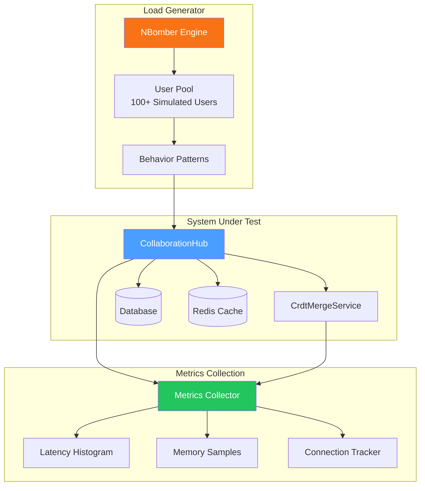

# LCS-DES-098d: Design Specification — Stress Tests

## 1. Metadata & Categorization

| Field | Value | Description |
| :--- | :--- | :--- |
| **Feature ID** | `TST-098d` | Sub-part of TST-098 |
| **Feature Name** | `100+ Concurrent User Stress Tests` | Performance and reliability under load |
| **Target Version** | `v0.9.8d` | Fourth sub-part of v0.9.8 |
| **Module Scope** | `Lexichord.Tests.Performance` | Test project |
| **Swimlane** | `Governance` | Part of Collaboration vertical |
| **License Tier** | `Core` | Testing available to all |
| **Feature Gate Key** | N/A | No gating for tests |
| **Author** | Lead Architect | |
| **Status** | `Draft` | |
| **Last Updated** | `2026-01-27` | |
| **Parent Document** | [LCS-DES-098-INDEX](./LCS-DES-098-INDEX.md) | |
| **Scope Breakdown** | [LCS-SBD-098 Section 3.4](./LCS-SBD-098.md#34-v098d-stress-tests) | |

---

## 2. Executive Summary

### 2.1 The Requirement

The collaboration system must reliably support 100+ concurrent users performing real-time editing, without degradation in performance, data integrity, or system stability. Without stress testing:

- Production load could overwhelm the system
- Memory leaks could cause crashes during extended operation
- Latency could degrade to unacceptable levels under load
- WebSocket connections could fail under concurrent access
- CRDT merge performance could bottleneck the system

> **Goal:** Validate system stability with 100+ concurrent users performing mixed collaborative operations for 30+ minutes, with P95 edit latency under 500ms and no memory leaks.

### 2.2 The Proposed Solution

Implement a comprehensive stress test suite that:

1. Simulates 100+ concurrent users with realistic behavior patterns
2. Validates edit latency meets SLA targets (P50 < 100ms, P95 < 500ms, P99 < 1000ms)
3. Monitors memory growth over sustained 30-minute tests
4. Tests WebSocket connection stability and throughput
5. Benchmarks CRDT merge performance at scale
6. Detects resource leaks (memory, connections, file handles)
7. Integrates with CI to prevent performance regressions

---

## 3. Architecture & Modular Strategy

### 3.1 Dependencies

#### 3.1.1 Systems Under Test

| Interface | Source Version | Purpose |
| :--- | :--- | :--- |
| `ICrdtMergeService` | v0.7.1b | CRDT merge performance |
| `ICollaborationHub` | v0.7.6a | WebSocket stress |
| `ISessionManager` | v0.7.5a | Session scaling |
| `IUserPresenceService` | v0.7.6b | Presence under load |
| `IDocumentRepository` | v0.7.1a | Storage performance |

#### 3.1.2 NuGet Packages

| Package | Version | Purpose |
| :--- | :--- | :--- |
| `xunit` | 2.9.x | Test framework |
| `FluentAssertions` | 6.x | Fluent assertions |
| `BenchmarkDotNet` | 0.14.x | Performance benchmarking |
| `NBomber` | 5.x | Load testing framework |

### 3.2 Licensing Behavior

No licensing required. Tests run in development/CI environments only.

---

## 4. Data Contract (The API)

### 4.1 Test Class Structure

```csharp
namespace Lexichord.Tests.Performance;

/// <summary>
/// Stress tests for collaborative editing at scale.
/// </summary>
[Trait("Category", "Performance")]
[Trait("Version", "v0.9.8d")]
public class CollaborationStressTests
{
    // Concurrent user simulation tests...
}

/// <summary>
/// Stress tests for WebSocket connections.
/// </summary>
[Trait("Category", "Performance")]
[Trait("Version", "v0.9.8d")]
public class WebSocketStressTests
{
    // Connection stability tests...
}

/// <summary>
/// BenchmarkDotNet benchmarks for CRDT operations.
/// </summary>
[MemoryDiagnoser]
[SimpleJob(RuntimeMoniker.Net90)]
[Trait("Category", "Benchmark")]
[Trait("Version", "v0.9.8d")]
public class CrdtScalabilityBenchmarks
{
    // CRDT performance benchmarks...
}

/// <summary>
/// Resource leak detection tests.
/// </summary>
[Trait("Category", "Performance")]
[Trait("Version", "v0.9.8d")]
public class ResourceLeakTests
{
    // Memory and connection leak tests...
}
```

---

## 5. Implementation Logic

### 5.1 Load Test Architecture



### 5.2 User Behavior Model

```text
SIMULATED USER BEHAVIOR:

┌─────────────────────────────────────────────────────────────┐
│  Action         │ Probability │ Think Time   │ Duration     │
├─────────────────┼─────────────┼──────────────┼──────────────┤
│  Edit (insert)  │    40%      │ 1-3 seconds  │ 50-200ms     │
│  Edit (delete)  │    15%      │ 1-3 seconds  │ 30-100ms     │
│  Format         │     5%      │ 2-5 seconds  │ 50-150ms     │
│  Read/Scroll    │    25%      │ 0.5-2 sec    │ immediate    │
│  Add Comment    │     8%      │ 5-10 seconds │ 100-300ms    │
│  Presence Upd   │     5%      │ continuous   │ 20-50ms      │
│  Idle           │     2%      │ 10-30 sec    │ -            │
└─────────────────┴─────────────┴──────────────┴──────────────┘

SESSION LIFECYCLE:
├── Join document (establish WebSocket)
├── Receive initial state sync
├── Perform random actions (weighted by probability)
├── Think time between actions
├── Occasionally disconnect/reconnect
└── Leave document (close WebSocket)
```

### 5.3 Performance Targets

```text
LATENCY TARGETS (at 100 concurrent users):
┌───────────────────────────────────────────────────┐
│  Metric              │ Target    │ CI Threshold   │
├──────────────────────┼───────────┼────────────────┤
│  Edit Latency P50    │ < 100ms   │ Fail if > 150ms│
│  Edit Latency P95    │ < 500ms   │ Fail if > 750ms│
│  Edit Latency P99    │ < 1000ms  │ Fail if > 1500ms│
│  Broadcast P50       │ < 50ms    │ Fail if > 100ms│
│  Broadcast P95       │ < 200ms   │ Fail if > 400ms│
│  Connect Time        │ < 500ms   │ Fail if > 1000ms│
│  CRDT Merge (1000ops)│ < 100ms   │ Fail if > 200ms│
└──────────────────────┴───────────┴────────────────┘

RESOURCE TARGETS (at 100 concurrent users):
┌───────────────────────────────────────────────────┐
│  Metric              │ Target    │ CI Threshold   │
├──────────────────────┼───────────┼────────────────┤
│  Memory Growth (30m) │ < 50%     │ Fail if > 75%  │
│  CPU Average         │ < 70%     │ Fail if > 90%  │
│  Connection Uptime   │ > 99%     │ Fail if < 98%  │
│  Message Queue Depth │ < 1000    │ Fail if > 5000 │
│  DB Connection Pool  │ < 80%     │ Fail if > 95%  │
└──────────────────────┴───────────┴────────────────┘
```

---

## 6. Test Scenarios

### 6.1 CollaborationStressTests

```csharp
[Trait("Category", "Performance")]
[Trait("Version", "v0.9.8d")]
public class CollaborationStressTests
{
    private readonly ICollaborationHub _hub;
    private readonly ICrdtMergeService _mergeService;
    private readonly TestMetricsCollector _metrics;

    public CollaborationStressTests()
    {
        var services = TestServiceProvider.CreateForStressTesting();
        _hub = services.GetRequiredService<ICollaborationHub>();
        _mergeService = services.GetRequiredService<ICrdtMergeService>();
        _metrics = new TestMetricsCollector();
    }

    #region Concurrent User Tests

    [Fact]
    public async Task ConcurrentEdits_100Users_AllEditsSucceed()
    {
        // Arrange
        const int userCount = 100;
        const int editsPerUser = 50;
        const int documentCount = 10;

        var users = await CreateSimulatedUsers(userCount);
        var documents = await CreateCollaborativeDocuments(documentCount);

        var editResults = new ConcurrentBag<EditResult>();
        var cts = new CancellationTokenSource(TimeSpan.FromMinutes(5));

        // Act - All users edit randomly across documents
        var tasks = users.Select(user => Task.Run(async () =>
        {
            var random = new Random();

            for (int i = 0; i < editsPerUser && !cts.Token.IsCancellationRequested; i++)
            {
                var doc = documents[random.Next(documentCount)];
                var sw = Stopwatch.StartNew();

                try
                {
                    await user.PerformRandomEdit(doc, cts.Token);
                    sw.Stop();

                    editResults.Add(new EditResult
                    {
                        Success = true,
                        LatencyMs = sw.ElapsedMilliseconds,
                        UserId = user.Id,
                        DocumentId = doc.Id
                    });
                }
                catch (Exception ex)
                {
                    editResults.Add(new EditResult
                    {
                        Success = false,
                        Error = ex.Message,
                        UserId = user.Id,
                        DocumentId = doc.Id
                    });
                }

                // Think time
                await Task.Delay(random.Next(100, 500), cts.Token);
            }
        }));

        await Task.WhenAll(tasks);

        // Assert
        var successRate = editResults.Count(r => r.Success) / (double)editResults.Count;
        successRate.Should().BeGreaterThan(0.99,
            "At least 99% of edits should succeed");

        // Verify all documents converged
        foreach (var doc in documents)
        {
            var states = await GetAllReplicaStates(doc.Id);
            states.Distinct().Should().HaveCount(1,
                $"Document {doc.Id} should have converged across all replicas");
        }
    }

    [Fact]
    public async Task ConcurrentEdits_100Users_MeetsLatencyTargets()
    {
        // Arrange
        const int userCount = 100;
        var latencies = new ConcurrentBag<long>();
        var cts = new CancellationTokenSource(TimeSpan.FromMinutes(2));

        var users = await CreateSimulatedUsers(userCount);
        var doc = await CreateCollaborativeDocument();

        // Act
        var tasks = users.Select(user => Task.Run(async () =>
        {
            var random = new Random();

            while (!cts.Token.IsCancellationRequested)
            {
                var sw = Stopwatch.StartNew();
                await user.InsertText(doc, random.Next(100), GenerateRandomText());
                sw.Stop();

                latencies.Add(sw.ElapsedMilliseconds);
                await Task.Delay(random.Next(200, 800), cts.Token);
            }
        }));

        try
        {
            await Task.WhenAll(tasks);
        }
        catch (OperationCanceledException) { }

        // Assert - Calculate percentiles
        var sorted = latencies.OrderBy(l => l).ToList();
        var p50 = sorted[(int)(sorted.Count * 0.50)];
        var p95 = sorted[(int)(sorted.Count * 0.95)];
        var p99 = sorted[(int)(sorted.Count * 0.99)];

        _metrics.Record("edit_latency_p50", p50);
        _metrics.Record("edit_latency_p95", p95);
        _metrics.Record("edit_latency_p99", p99);

        p50.Should().BeLessThan(100, "P50 edit latency should be under 100ms");
        p95.Should().BeLessThan(500, "P95 edit latency should be under 500ms");
        p99.Should().BeLessThan(1000, "P99 edit latency should be under 1000ms");
    }

    #endregion

    #region Sustained Load Tests

    [Fact]
    public async Task SustainedLoad_30Minutes_SystemStable()
    {
        // Arrange
        const int userCount = 50;
        const int durationMinutes = 30;
        var errors = new ConcurrentBag<Exception>();
        var memorySnapshots = new List<MemorySnapshot>();

        var users = await CreateSimulatedUsers(userCount);
        var documents = await CreateCollaborativeDocuments(5);
        var cts = new CancellationTokenSource(TimeSpan.FromMinutes(durationMinutes));

        // Start memory monitoring
        var monitorTask = Task.Run(async () =>
        {
            while (!cts.Token.IsCancellationRequested)
            {
                await Task.Delay(TimeSpan.FromMinutes(1), cts.Token);
                GC.Collect();
                memorySnapshots.Add(new MemorySnapshot
                {
                    Timestamp = DateTime.UtcNow,
                    TotalMemoryBytes = GC.GetTotalMemory(forceFullCollection: true),
                    Gen0Collections = GC.CollectionCount(0),
                    Gen1Collections = GC.CollectionCount(1),
                    Gen2Collections = GC.CollectionCount(2)
                });
            }
        });

        // Act - Sustained load
        var loadTasks = users.Select(user => Task.Run(async () =>
        {
            var random = new Random();

            while (!cts.Token.IsCancellationRequested)
            {
                try
                {
                    var doc = documents[random.Next(documents.Count)];
                    await user.PerformRandomAction(doc, cts.Token);
                    await Task.Delay(random.Next(1000, 5000), cts.Token);
                }
                catch (OperationCanceledException) { }
                catch (Exception ex)
                {
                    errors.Add(ex);
                }
            }
        }));

        await Task.WhenAll(loadTasks.Append(monitorTask).ToArray());

        // Assert - Error rate
        errors.Count.Should().BeLessThan(userCount * durationMinutes,
            "Error rate should be less than 1 per user per minute");

        // Assert - Memory stability
        var firstQuarter = memorySnapshots.Take(8).Average(s => s.TotalMemoryBytes);
        var lastQuarter = memorySnapshots.Skip(22).Average(s => s.TotalMemoryBytes);
        var growthFactor = lastQuarter / firstQuarter;

        growthFactor.Should().BeLessThan(1.5,
            "Memory should not grow more than 50% over sustained load");

        // Assert - All documents still accessible
        foreach (var doc in documents)
        {
            var state = await GetDocumentState(doc.Id);
            state.Should().NotBeNull();
        }
    }

    #endregion

    #region Spike Load Tests

    [Fact]
    public async Task SpikeLoad_50To150Users_HandlesGracefully()
    {
        // Arrange
        var baseUsers = await CreateSimulatedUsers(50);
        var spikeUsers = await CreateSimulatedUsers(100);
        var doc = await CreateCollaborativeDocument();

        var latencies = new ConcurrentBag<(DateTime Time, long LatencyMs)>();
        var cts = new CancellationTokenSource(TimeSpan.FromMinutes(3));

        // Act - Start with base load
        var baseTasks = StartContinuousLoad(baseUsers, doc, latencies, cts.Token);

        // After 30 seconds, add spike
        await Task.Delay(TimeSpan.FromSeconds(30));

        var spikeTasks = StartContinuousLoad(spikeUsers, doc, latencies, cts.Token);

        // Run for another 2 minutes
        await Task.Delay(TimeSpan.FromMinutes(2));
        cts.Cancel();

        try { await Task.WhenAll(baseTasks.Concat(spikeTasks)); }
        catch (OperationCanceledException) { }

        // Assert - Latency should recover after spike
        var afterSpike = latencies
            .Where(l => l.Time > DateTime.UtcNow.AddMinutes(-1))
            .Select(l => l.LatencyMs)
            .ToList();

        var p95AfterSpike = afterSpike.OrderBy(l => l).ElementAt((int)(afterSpike.Count * 0.95));
        p95AfterSpike.Should().BeLessThan(750,
            "System should recover to acceptable latency after spike");
    }

    #endregion

    #region Recovery Tests

    [Fact]
    public async Task Recovery_AfterOverload_ReturnsToNormal()
    {
        // Arrange - Intentionally overload the system
        const int overloadUsers = 200;
        var users = await CreateSimulatedUsers(overloadUsers);
        var doc = await CreateCollaborativeDocument();

        var overloadCts = new CancellationTokenSource(TimeSpan.FromSeconds(30));

        // Act - Overload phase
        var overloadTasks = users.Select(user => Task.Run(async () =>
        {
            while (!overloadCts.Token.IsCancellationRequested)
            {
                try
                {
                    await user.InsertText(doc, 0, "FLOOD");
                }
                catch { }
            }
        }));

        await Task.WhenAll(overloadTasks);

        // Recovery phase - measure normal operation
        var normalUsers = await CreateSimulatedUsers(50);
        var latencies = new ConcurrentBag<long>();
        var recoveryCts = new CancellationTokenSource(TimeSpan.FromMinutes(1));

        var recoveryTasks = normalUsers.Select(user => Task.Run(async () =>
        {
            var random = new Random();
            while (!recoveryCts.Token.IsCancellationRequested)
            {
                var sw = Stopwatch.StartNew();
                await user.InsertText(doc, random.Next(100), "Normal");
                sw.Stop();
                latencies.Add(sw.ElapsedMilliseconds);
                await Task.Delay(500, recoveryCts.Token);
            }
        }));

        try { await Task.WhenAll(recoveryTasks); }
        catch (OperationCanceledException) { }

        // Assert
        var p95 = latencies.OrderBy(l => l).ElementAt((int)(latencies.Count * 0.95));
        p95.Should().BeLessThan(500,
            "System should recover to normal latency after overload");
    }

    #endregion

    private Task<List<SimulatedUser>> CreateSimulatedUsers(int count) { /* ... */ }
    private Task<List<CollaborativeDocument>> CreateCollaborativeDocuments(int count) { /* ... */ }
    private Task<CollaborativeDocument> CreateCollaborativeDocument() { /* ... */ }
    private IEnumerable<Task> StartContinuousLoad(/* ... */) { /* ... */ }
    private Task<IReadOnlyList<string>> GetAllReplicaStates(string docId) { /* ... */ }
    private Task<DocumentState?> GetDocumentState(string docId) { /* ... */ }
}
```

### 6.2 WebSocketStressTests

```csharp
[Trait("Category", "Performance")]
[Trait("Version", "v0.9.8d")]
public class WebSocketStressTests
{
    private readonly ICollaborationHub _hub;

    public WebSocketStressTests()
    {
        _hub = TestServiceProvider.Create().GetRequiredService<ICollaborationHub>();
    }

    #region Connection Stability Tests

    [Fact]
    public async Task Connections_100Concurrent_AllMaintained()
    {
        // Arrange
        const int connectionCount = 100;
        var connections = new List<IWebSocketConnection>();
        var connectionTasks = new List<Task<IWebSocketConnection>>();

        // Act - Establish all connections
        for (int i = 0; i < connectionCount; i++)
        {
            connectionTasks.Add(_hub.ConnectAsync($"user-{i}", $"doc-{i % 10}"));
        }

        connections.AddRange(await Task.WhenAll(connectionTasks));

        // Hold connections open
        await Task.Delay(TimeSpan.FromSeconds(30));

        // Assert - All connections still alive
        var aliveCount = connections.Count(c => c.State == WebSocketState.Open);
        aliveCount.Should().Be(connectionCount,
            "All WebSocket connections should remain open");

        // Cleanup
        foreach (var conn in connections)
        {
            await conn.DisconnectAsync();
        }
    }

    [Fact]
    public async Task Connections_RapidConnectDisconnect_NoResourceLeak()
    {
        // Arrange
        const int iterations = 500;
        var initialHandles = GetOpenHandleCount();
        var exceptions = new ConcurrentBag<Exception>();

        // Act
        var tasks = Enumerable.Range(0, iterations).Select(async i =>
        {
            try
            {
                var conn = await _hub.ConnectAsync($"churn-{i}", "doc-1");
                await Task.Delay(Random.Shared.Next(50, 200));
                await conn.DisconnectAsync();
            }
            catch (Exception ex)
            {
                exceptions.Add(ex);
            }
        });

        await Task.WhenAll(tasks);

        // Allow cleanup
        await Task.Delay(TimeSpan.FromSeconds(5));
        GC.Collect();
        GC.WaitForPendingFinalizers();

        var finalHandles = GetOpenHandleCount();

        // Assert
        exceptions.Should().BeEmpty("No exceptions during connection churn");
        finalHandles.Should().BeLessOrEqualTo(initialHandles + 10,
            "Handle count should not grow significantly");
    }

    #endregion

    #region Broadcast Tests

    [Fact]
    public async Task Broadcast_100Recipients_CompletesQuickly()
    {
        // Arrange
        const int recipientCount = 100;
        var receivedCount = 0;
        var receiveLatch = new CountdownEvent(recipientCount);

        var connections = await EstablishConnections(recipientCount);
        foreach (var conn in connections)
        {
            conn.OnMessage += _ =>
            {
                Interlocked.Increment(ref receivedCount);
                receiveLatch.Signal();
            };
        }

        // Act
        var sw = Stopwatch.StartNew();
        await _hub.BroadcastAsync("test-doc", new TestMessage { Content = "Hello" });

        var completed = receiveLatch.Wait(TimeSpan.FromSeconds(5));
        sw.Stop();

        // Assert
        completed.Should().BeTrue("All recipients should receive within timeout");
        receivedCount.Should().Be(recipientCount);
        sw.ElapsedMilliseconds.Should().BeLessThan(2000,
            "Broadcast to 100 users should complete within 2 seconds");

        // Cleanup
        foreach (var conn in connections)
        {
            await conn.DisconnectAsync();
        }
    }

    [Fact]
    public async Task Broadcast_HighFrequency_NoMessageLoss()
    {
        // Arrange
        const int connectionCount = 50;
        const int messageCount = 100;
        var receivedMessages = new ConcurrentDictionary<string, ConcurrentBag<int>>();

        var connections = await EstablishConnections(connectionCount);
        foreach (var conn in connections)
        {
            receivedMessages[conn.UserId] = new ConcurrentBag<int>();
            conn.OnMessage += msg =>
            {
                if (msg is TestMessage tm)
                {
                    receivedMessages[conn.UserId].Add(tm.SequenceNumber);
                }
            };
        }

        // Act - Rapid-fire broadcasts
        for (int i = 0; i < messageCount; i++)
        {
            await _hub.BroadcastAsync("test-doc", new TestMessage
            {
                SequenceNumber = i,
                Content = $"Message {i}"
            });
        }

        // Wait for delivery
        await Task.Delay(TimeSpan.FromSeconds(10));

        // Assert - No message loss
        foreach (var (userId, messages) in receivedMessages)
        {
            messages.Count.Should().Be(messageCount,
                $"User {userId} should receive all {messageCount} messages");

            var missing = Enumerable.Range(0, messageCount)
                .Except(messages)
                .ToList();

            missing.Should().BeEmpty(
                $"User {userId} should not be missing any messages");
        }

        // Cleanup
        foreach (var conn in connections)
        {
            await conn.DisconnectAsync();
        }
    }

    #endregion

    #region Throughput Tests

    [Fact]
    public async Task Throughput_MeasureMaxMessagesPerSecond()
    {
        // Arrange
        const int connections = 50;
        const int durationSeconds = 30;
        var messagesSent = 0;
        var messagesReceived = 0;

        var conns = await EstablishConnections(connections);
        foreach (var conn in conns)
        {
            conn.OnMessage += _ => Interlocked.Increment(ref messagesReceived);
        }

        var cts = new CancellationTokenSource(TimeSpan.FromSeconds(durationSeconds));

        // Act - Send as fast as possible
        var sw = Stopwatch.StartNew();
        while (!cts.Token.IsCancellationRequested)
        {
            await _hub.BroadcastAsync("test-doc", new TestMessage());
            Interlocked.Increment(ref messagesSent);
        }
        sw.Stop();

        // Wait for last messages to arrive
        await Task.Delay(TimeSpan.FromSeconds(2));

        // Calculate throughput
        var messagesPerSecond = messagesSent / (sw.Elapsed.TotalSeconds);
        var deliveryRate = (double)messagesReceived / (messagesSent * connections);

        // Assert
        messagesPerSecond.Should().BeGreaterThan(100,
            "Should sustain > 100 broadcasts per second");
        deliveryRate.Should().BeGreaterThan(0.99,
            "Message delivery rate should be > 99%");

        // Cleanup
        foreach (var conn in conns)
        {
            await conn.DisconnectAsync();
        }
    }

    #endregion

    private Task<List<IWebSocketConnection>> EstablishConnections(int count) { /* ... */ }
    private int GetOpenHandleCount() { /* ... */ }
}
```

### 6.3 CrdtScalabilityBenchmarks

```csharp
[MemoryDiagnoser]
[SimpleJob(RuntimeMoniker.Net90)]
[Trait("Category", "Benchmark")]
[Trait("Version", "v0.9.8d")]
public class CrdtScalabilityBenchmarks
{
    private CrdtDocument _document = null!;
    private List<CrdtOperation> _operations = null!;

    [Params(10, 50, 100)]
    public int UserCount { get; set; }

    [Params(100, 500, 1000)]
    public int OperationsPerUser { get; set; }

    [GlobalSetup]
    public void Setup()
    {
        _document = CrdtDocument.Create("Initial content for benchmarking");
        _operations = GenerateOperations(UserCount, OperationsPerUser);
    }

    [Benchmark]
    public CrdtDocument MergeAllOperations_Sequential()
    {
        var doc = CrdtDocument.Create("Initial content");
        foreach (var op in _operations)
        {
            doc.Apply(op);
        }
        return doc;
    }

    [Benchmark]
    public CrdtDocument MergeAllOperations_Batched()
    {
        var doc = CrdtDocument.Create("Initial content");
        var batches = _operations.Chunk(100);

        foreach (var batch in batches)
        {
            doc.ApplyBatch(batch);
        }
        return doc;
    }

    [Benchmark]
    public async Task<CrdtDocument> MergeAllOperations_Parallel()
    {
        // Merge operations from each user in parallel, then merge branches
        var userOps = _operations.GroupBy(o => o.UserId).ToList();

        var branches = await Task.WhenAll(userOps.Select(g => Task.Run(() =>
        {
            var branch = CrdtDocument.Create("Initial content");
            foreach (var op in g)
            {
                branch.Apply(op);
            }
            return branch;
        })));

        // Merge all branches
        var result = branches[0];
        for (int i = 1; i < branches.Length; i++)
        {
            result = result.Merge(branches[i]);
        }

        return result;
    }

    [Benchmark]
    public int CalculateVectorClock()
    {
        var clock = new VectorClock();
        foreach (var op in _operations)
        {
            clock.Update(op.UserId, op.Timestamp);
        }
        return clock.GetTotal();
    }

    [Benchmark]
    public List<CrdtOperation> DetectConflicts()
    {
        var conflicts = new List<CrdtOperation>();
        var detector = new ConflictDetector();

        foreach (var op in _operations)
        {
            if (detector.IsConflicting(op))
            {
                conflicts.Add(op);
            }
            detector.Record(op);
        }

        return conflicts;
    }

    private List<CrdtOperation> GenerateOperations(int users, int opsPerUser)
    {
        var random = new Random(42);
        var ops = new List<CrdtOperation>();
        var clock = 0L;

        for (int user = 0; user < users; user++)
        {
            for (int i = 0; i < opsPerUser; i++)
            {
                ops.Add(CrdtOperation.Insert(
                    position: random.Next(1000),
                    text: new string('x', random.Next(1, 50)),
                    userId: $"user-{user}",
                    timestamp: clock++));
            }
        }

        return ops.OrderBy(_ => random.Next()).ToList();
    }
}
```

### 6.4 ResourceLeakTests

```csharp
[Trait("Category", "Performance")]
[Trait("Version", "v0.9.8d")]
public class ResourceLeakTests
{
    #region Memory Leak Tests

    [Fact]
    public async Task MemoryLeak_RepeatedDocumentCreation_NoGrowth()
    {
        // Arrange
        const int iterations = 1000;
        GC.Collect();
        var initialMemory = GC.GetTotalMemory(forceFullCollection: true);

        // Act
        for (int i = 0; i < iterations; i++)
        {
            var doc = CrdtDocument.Create($"Document {i}");
            for (int j = 0; j < 100; j++)
            {
                doc.Apply(CrdtOperation.Insert(j, $"Content {j}", "user", j));
            }
            // Document goes out of scope
        }

        // Force cleanup
        GC.Collect();
        GC.WaitForPendingFinalizers();
        GC.Collect();

        var finalMemory = GC.GetTotalMemory(forceFullCollection: true);

        // Assert
        var growth = (finalMemory - initialMemory) / (1024.0 * 1024.0);
        growth.Should().BeLessThan(50,
            "Memory growth should be < 50MB after creating 1000 documents");
    }

    [Fact]
    public async Task MemoryLeak_WebSocketConnections_NoGrowth()
    {
        // Arrange
        const int iterations = 100;
        GC.Collect();
        var initialMemory = GC.GetTotalMemory(forceFullCollection: true);

        var hub = CreateHub();

        // Act
        for (int i = 0; i < iterations; i++)
        {
            var connections = new List<IWebSocketConnection>();

            // Create 10 connections
            for (int j = 0; j < 10; j++)
            {
                connections.Add(await hub.ConnectAsync($"user-{i}-{j}", "doc-1"));
            }

            // Use them
            foreach (var conn in connections)
            {
                await conn.SendAsync(new TestMessage());
            }

            // Disconnect all
            foreach (var conn in connections)
            {
                await conn.DisconnectAsync();
            }
        }

        // Force cleanup
        GC.Collect();
        GC.WaitForPendingFinalizers();
        GC.Collect();

        var finalMemory = GC.GetTotalMemory(forceFullCollection: true);

        // Assert
        var growth = (finalMemory - initialMemory) / (1024.0 * 1024.0);
        growth.Should().BeLessThan(20,
            "Memory growth should be < 20MB after 1000 connection cycles");
    }

    #endregion

    #region Connection Leak Tests

    [Fact]
    public async Task ConnectionLeak_DatabasePool_ReturnsToPool()
    {
        // Arrange
        var pool = CreateConnectionPool(maxSize: 10);
        var initialAvailable = pool.AvailableConnections;

        // Act - Acquire and release many times
        for (int i = 0; i < 100; i++)
        {
            var connections = new List<IDbConnection>();

            for (int j = 0; j < 5; j++)
            {
                connections.Add(await pool.AcquireAsync());
            }

            foreach (var conn in connections)
            {
                pool.Release(conn);
            }
        }

        // Assert
        pool.AvailableConnections.Should().Be(initialAvailable,
            "All connections should return to pool");
    }

    [Fact]
    public async Task ConnectionLeak_HubDisconnect_FreesResources()
    {
        // Arrange
        var hub = CreateHub();
        var initialConnections = hub.ActiveConnectionCount;

        // Act
        var connections = new List<IWebSocketConnection>();
        for (int i = 0; i < 50; i++)
        {
            connections.Add(await hub.ConnectAsync($"user-{i}", "doc-1"));
        }

        hub.ActiveConnectionCount.Should().Be(initialConnections + 50);

        foreach (var conn in connections)
        {
            await conn.DisconnectAsync();
        }

        await Task.Delay(TimeSpan.FromSeconds(1)); // Allow cleanup

        // Assert
        hub.ActiveConnectionCount.Should().Be(initialConnections,
            "All connections should be cleaned up");
    }

    #endregion

    #region Event Handler Leak Tests

    [Fact]
    public void EventHandlerLeak_DocumentEvents_ProperlyUnsubscribed()
    {
        // Arrange
        var doc = CrdtDocument.Create("Test");
        WeakReference? weakHandler = null;

        void Subscribe()
        {
            var handler = new EventHandler<OperationAppliedEventArgs>((s, e) => { });
            weakHandler = new WeakReference(handler);
            doc.OperationApplied += handler;
            doc.OperationApplied -= handler;
        }

        // Act
        Subscribe();
        GC.Collect();
        GC.WaitForPendingFinalizers();
        GC.Collect();

        // Assert
        weakHandler!.IsAlive.Should().BeFalse(
            "Event handler should be garbage collected after unsubscribe");
    }

    #endregion

    private ICollaborationHub CreateHub() { /* ... */ }
    private IConnectionPool CreateConnectionPool(int maxSize) { /* ... */ }
}
```

### 6.5 Performance Baseline

```csharp
namespace Lexichord.Tests.Performance;

/// <summary>
/// Performance baseline thresholds for CI enforcement.
/// </summary>
public static class CollaborationBaseline
{
    public static class Latency
    {
        public const int EditP50MaxMs = 100;
        public const int EditP95MaxMs = 500;
        public const int EditP99MaxMs = 1000;
        public const int BroadcastP50MaxMs = 50;
        public const int BroadcastP95MaxMs = 200;
        public const int ConnectMaxMs = 500;
        public const int CrdtMerge1000OpsMaxMs = 100;
    }

    public static class Resources
    {
        public const double MemoryGrowthMaxPercent = 50;
        public const int CpuMaxPercent = 80;
        public const double ConnectionUptimeMinPercent = 99;
        public const int MessageQueueMaxDepth = 1000;
        public const double DbPoolUtilizationMaxPercent = 80;
    }

    public static class Scale
    {
        public const int MinConcurrentUsers = 100;
        public const int MinSustainedMinutes = 30;
        public const int MinBroadcastsPerSecond = 100;
        public const double MinSuccessRate = 0.99;
    }
}

/// <summary>
/// Tests that enforce baseline thresholds in CI.
/// </summary>
[Trait("Category", "Performance")]
[Trait("Version", "v0.9.8d")]
public class BaselineEnforcementTests
{
    [Fact]
    public async Task Baseline_EditLatencyP95_MeetsThreshold()
    {
        // Run abbreviated stress test
        var latencies = await RunQuickStressTest(users: 50, durationSeconds: 60);

        var p95 = CalculatePercentile(latencies, 0.95);

        p95.Should().BeLessThan(CollaborationBaseline.Latency.EditP95MaxMs,
            $"P95 edit latency ({p95}ms) exceeds threshold ({CollaborationBaseline.Latency.EditP95MaxMs}ms)");
    }

    [Fact]
    public async Task Baseline_MemoryGrowth_MeetsThreshold()
    {
        var (initialMemory, finalMemory) = await RunMemoryStressTest(durationMinutes: 5);

        var growthPercent = ((finalMemory - initialMemory) / (double)initialMemory) * 100;

        growthPercent.Should().BeLessThan(CollaborationBaseline.Resources.MemoryGrowthMaxPercent,
            $"Memory growth ({growthPercent:F1}%) exceeds threshold ({CollaborationBaseline.Resources.MemoryGrowthMaxPercent}%)");
    }

    [Fact]
    public async Task Baseline_CrdtMerge_MeetsThreshold()
    {
        var elapsed = await MeasureCrdtMerge(operationCount: 1000);

        elapsed.TotalMilliseconds.Should().BeLessThan(
            CollaborationBaseline.Latency.CrdtMerge1000OpsMaxMs,
            $"CRDT merge time ({elapsed.TotalMilliseconds}ms) exceeds threshold");
    }

    private Task<List<long>> RunQuickStressTest(int users, int durationSeconds) { /* ... */ }
    private Task<(long initial, long final)> RunMemoryStressTest(int durationMinutes) { /* ... */ }
    private Task<TimeSpan> MeasureCrdtMerge(int operationCount) { /* ... */ }
    private long CalculatePercentile(List<long> values, double percentile) { /* ... */ }
}
```

---

## 7. UI/UX Specifications

**Not applicable.** This is a test-only specification with no user-facing UI components.

---

## 8. Observability & Logging

| Level | Message Template |
| :--- | :--- |
| Info | `"Stress test started: {UserCount} users, {Duration} duration"` |
| Info | `"Stress test completed: {EditCount} edits, P95={P95}ms"` |
| Debug | `"User {UserId} edit latency: {LatencyMs}ms"` |
| Warning | `"Latency threshold exceeded: {Actual}ms > {Threshold}ms"` |
| Warning | `"Memory growth detected: {Growth}% over {Duration}"` |
| Error | `"Stress test failure: {Error}"` |

---

## 9. Security & Safety

| Risk | Level | Mitigation |
| :--- | :--- | :--- |
| Resource exhaustion | Medium | Test timeouts and cleanup |
| CI resource consumption | Medium | Separate CI stage |
| Test data persistence | Low | Use in-memory stores |

---

## 10. Acceptance Criteria

### 10.1 Functional Criteria

| # | Given | When | Then |
| :--- | :--- | :--- | :--- |
| 1 | 100 concurrent users | Editing for 5 minutes | All edits succeed (>99%) |
| 2 | 100 concurrent users | Measuring latency | P95 < 500ms |
| 3 | 50 users for 30 minutes | Monitoring memory | Growth < 50% |
| 4 | 100 WebSocket connections | Held for 30 seconds | All remain open |
| 5 | 100 recipients | Broadcasting message | All receive < 2s |
| 6 | 1000 connection cycles | Completing | No resource leak |
| 7 | 1000 CRDT operations | Merging | Complete < 100ms |
| 8 | Overload then recovery | Measuring | Latency returns to normal |

### 10.2 CI Criteria

| # | Given | When | Then |
| :--- | :--- | :--- | :--- |
| 9 | P95 latency > 750ms | CI runs tests | Build fails |
| 10 | Memory growth > 75% | CI runs tests | Build fails |
| 11 | All baselines met | CI runs tests | Build succeeds |

---

## 11. Deliverable Checklist

| # | Deliverable | Status |
| :--- | :--- | :--- |
| 1 | `CollaborationStressTests.cs` | [ ] |
| 2 | `WebSocketStressTests.cs` | [ ] |
| 3 | `CrdtScalabilityBenchmarks.cs` | [ ] |
| 4 | `ResourceLeakTests.cs` | [ ] |
| 5 | `BaselineEnforcementTests.cs` | [ ] |
| 6 | `CollaborationBaseline.cs` | [ ] |
| 7 | `SimulatedUser.cs` helper | [ ] |
| 8 | `TestMetricsCollector.cs` helper | [ ] |
| 9 | Test trait configuration | [ ] |
| 10 | CI filter for `Version=v0.9.8d` | [ ] |

---

## 12. Verification Commands

```bash
# Run all stress tests (requires dedicated resources)
dotnet test --filter "Version=v0.9.8d" --logger "console;verbosity=detailed"

# Run quick baseline checks (CI friendly)
dotnet test --filter "FullyQualifiedName~BaselineEnforcementTests"

# Run memory leak tests
dotnet test --filter "FullyQualifiedName~ResourceLeakTests"

# Run WebSocket stress tests
dotnet test --filter "FullyQualifiedName~WebSocketStressTests"

# Run BenchmarkDotNet (detailed profiling)
dotnet run --project tests/Lexichord.Tests.Performance -c Release -- --filter "*Crdt*"

# Run with custom duration (environment variable)
STRESS_DURATION_MINUTES=60 dotnet test --filter "FullyQualifiedName~SustainedLoad"

# Generate performance report
dotnet test --filter "Category=Performance" --logger "trx;LogFileName=perf-results.trx"
```

---

## Document History

| Version | Date | Author | Changes |
| :--- | :--- | :--- | :--- |
| 1.0 | 2026-01-27 | Lead Architect | Initial draft |
