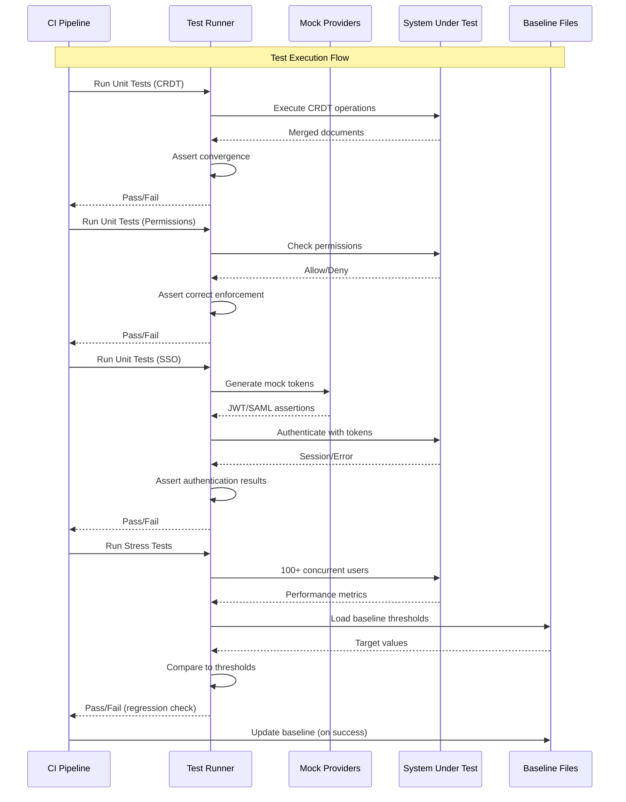

# LCS-SBD-098: Scope Breakdown — The Hardening (Collaboration)

## Document Control

| Field            | Value                                    |
| :--------------- | :--------------------------------------- |
| **Document ID**  | LCS-SBD-098                              |
| **Version**      | v0.9.8                                   |
| **Codename**     | The Hardening (Collaboration)            |
| **Status**       | Draft                                    |
| **Last Updated** | 2026-01-27                               |
| **Owner**        | Lead Architect                           |
| **Depends On**   | v0.9.1 (User Profiles), v0.9.2 (License Engine), v0.9.3 (Update Engine), v0.9.4 (Zen Mode), v0.9.5 (Startup Optimizer), v0.9.6 (PII Scrubber), v0.9.7 (Final Polish), v0.7.x (Collaboration Features), v0.8.x (Publisher) |

---

## 1. Executive Summary

### 1.1 The Vision

**v0.9.8** delivers the **Hardening (Collaboration)** — The Final Dress Rehearsal: comprehensive integration and stress tests for all collaboration features introduced in v0.7.x and refined throughout the v0.9.x release series. This release transforms Lexichord's multi-user capabilities from feature-complete into production-hardened systems with verified correctness under concurrent access, conflict resolution, and enterprise authentication scenarios.

While v0.7.x built the collaboration infrastructure (CRDT-based real-time editing, role-based permissions, and SSO integration), the Hardening phase ensures these systems operate correctly under real-world conditions. CI/CD pipelines will now guard against regressions in conflict resolution, permission enforcement, and authentication flows while validating system behavior under load with 100+ concurrent users.

### 1.2 Business Value

- **Conflict Resolution Confidence:** Mathematical verification that CRDT merge algorithms produce consistent, predictable results across all concurrent edit scenarios.
- **Security Assurance:** Comprehensive testing of permission hierarchies ensures no unauthorized access paths exist, critical for enterprise compliance.
- **Authentication Reliability:** Mock identity provider tests verify SSO integration handles edge cases (token expiry, provider outages, session invalidation).
- **Scale Validation:** Stress tests with 100+ concurrent users establish production capacity limits and identify bottlenecks before customer deployment.
- **Enterprise Readiness:** Documented test coverage and performance baselines enable enterprise procurement approval.
- **Foundation:** Testing patterns for all future collaboration features and scaling initiatives.

### 1.3 Success Criteria

This release succeeds when:

1. CRDT merge tests verify that concurrent edits from multiple users produce identical final documents regardless of operation ordering.
2. Permission tests assert that all 24 role hierarchy edge cases (4! permutations) enforce correct access control.
3. SSO tests validate authentication flows against mock OIDC, SAML 2.0, and OAuth 2.0 identity providers.
4. Stress tests confirm system stability with 100+ concurrent users performing mixed read/write operations for 30+ minutes.
5. All tests are integrated into CI/CD pipeline with automatic failure on regression.

### 1.4 License Gating

The Hardening is a **Core** feature. Testing infrastructure is available to all license tiers:

- Test suites run during development and CI/CD for all builds
- No runtime license checks required (test code, not production feature)
- Collaboration features being tested may have their own tier restrictions (Teams/Enterprise)
- Test results contribute to quality metrics across all license tiers

---

## 2. Dependencies on Prior Versions

| Component                  | Source Version | Usage in v0.9.8                                   |
| :------------------------- | :------------- | :------------------------------------------------ |
| `ICrdtDocument`            | v0.7.1a        | CRDT document structure under test                |
| `ICrdtMergeService`        | v0.7.1b        | Merge algorithm under test                        |
| `ICrdtOperationLog`        | v0.7.1c        | Operation sequencing under test                   |
| `IConflictResolver`        | v0.7.2a        | Conflict resolution strategies under test         |
| `IPermissionService`       | v0.7.3a        | Permission enforcement under test                 |
| `IRoleHierarchy`           | v0.7.3b        | Role hierarchy logic under test                   |
| `IAccessControlList`       | v0.7.3c        | ACL validation under test                         |
| `ISsoAuthenticationService`| v0.7.4a        | SSO authentication under test                     |
| `IOidcProvider`            | v0.7.4b        | OIDC token handling under test                    |
| `ISamlProvider`            | v0.7.4c        | SAML assertion handling under test                |
| `ISessionManager`          | v0.7.5a        | Session lifecycle under test                      |
| `ICollaborationHub`        | v0.7.6a        | Real-time sync under stress test                  |
| `IUserPresenceService`     | v0.7.6b        | Presence tracking under stress test               |
| `ISecureVault`             | v0.0.6a        | Token storage for SSO tests                       |
| `ILicenseContext`          | v0.0.4c        | License tier verification for gated features      |
| `IMediator`                | v0.0.7a        | Event publishing for test scenarios               |
| `BenchmarkDotNet`          | v0.3.8d        | Performance benchmark framework                   |

---

## 3. Sub-Part Specifications

### 3.1 v0.9.8a: CRDT Tests

| Field            | Value                                     |
| :--------------- | :---------------------------------------- |
| **Sub-Part ID**  | TST-098a                                  |
| **Title**        | CRDT Concurrent Edit Simulation Tests     |
| **Module**       | `Lexichord.Tests.Collaboration`           |
| **License Tier** | Core                                      |

**Goal:** Verify that CRDT merge algorithms correctly resolve concurrent edits from multiple users, producing identical final documents regardless of operation arrival order.

**Key Deliverables:**

- `CrdtMergeAccuracyTests.cs` with 50+ concurrent edit scenarios
- `CrdtOperationOrderingTests.cs` for operation sequencing verification
- `CrdtConflictResolutionTests.cs` for merge conflict handling
- `CrdtConvergenceTests.cs` proving eventual consistency
- Test fixtures for multi-user edit sequences
- Property-based tests using FsCheck for random operation generation
- Integration tests with `ICollaborationHub`

**Key Test Scenarios:**

```csharp
[Trait("Category", "Unit")]
[Trait("Version", "v0.9.8a")]
public class CrdtMergeAccuracyTests
{
    [Fact]
    public void Merge_ConcurrentInserts_ProducesConsistentResult()
    {
        // User A inserts "Hello" at position 0
        // User B inserts "World" at position 0 (concurrently)
        // Result should be deterministic regardless of arrival order

        var docA = CreateDocument();
        var docB = CreateDocument();

        var opA = docA.Insert(0, "Hello", userId: "A", timestamp: 100);
        var opB = docB.Insert(0, "World", userId: "B", timestamp: 100);

        // Apply in different orders
        docA.Merge(opB);
        docB.Merge(opA);

        docA.Content.Should().Be(docB.Content,
            "CRDT merge must be commutative");
    }

    [Theory]
    [InlineData(2, 10)]   // 2 users, 10 operations each
    [InlineData(5, 20)]   // 5 users, 20 operations each
    [InlineData(10, 50)]  // 10 users, 50 operations each
    public void Merge_MultiUserEdits_ConvergesIdentically(int userCount, int opsPerUser)
    {
        // Generate random operations from N users
        // Shuffle arrival order M times
        // Assert all permutations produce identical final document

        var operations = GenerateRandomOperations(userCount, opsPerUser);
        var permutations = GenerateOrderPermutations(operations, sampleCount: 100);

        var results = permutations.Select(perm =>
            ApplyOperationsToDocument(perm)).ToList();

        results.Should().AllBe(results.First(),
            "All operation orderings must produce identical documents");
    }

    [Theory]
    [InlineData("insert", "insert")]    // Concurrent inserts at same position
    [InlineData("insert", "delete")]    // Insert where another deletes
    [InlineData("delete", "delete")]    // Concurrent deletes of same range
    [InlineData("format", "delete")]    // Format applied to deleted text
    public void Merge_ConflictingOperations_ResolvesCorrectly(
        string opTypeA, string opTypeB)
    {
        var conflict = CreateConflict(opTypeA, opTypeB);
        var resolution = _mergeService.Resolve(conflict);

        resolution.Should().NotBeNull();
        resolution.ResultingDocument.IsValid.Should().BeTrue();
        resolution.Strategy.Should().Be(ExpectedStrategy(opTypeA, opTypeB));
    }
}
```

**CRDT Properties to Verify:**

```text
CRDT CORRECTNESS PROPERTIES:
├── Commutativity: merge(A, B) = merge(B, A)
├── Associativity: merge(merge(A, B), C) = merge(A, merge(B, C))
├── Idempotency: merge(A, A) = A
├── Convergence: All replicas eventually reach identical state
└── Intention Preservation: User intent is maintained after merge

CONFLICT SCENARIOS:
├── Same Position Inserts: Both users insert at character 5
│   └── Resolution: Deterministic ordering by (timestamp, userId)
├── Overlapping Deletes: User A deletes [5,10], User B deletes [8,15]
│   └── Resolution: Union of deleted ranges
├── Insert into Deleted: User A inserts at 7, User B deleted [5,10]
│   └── Resolution: Insert tombstoned, preserved in history
├── Concurrent Formatting: User A bolds [0,10], User B italicizes [5,15]
│   └── Resolution: Both formats applied to overlap
└── Delete Formatted: User A formats [5,10], User B deletes [5,10]
    └── Resolution: Format operation tombstoned with delete
```

**Dependencies:**

- v0.7.1a: `ICrdtDocument` (document structure under test)
- v0.7.1b: `ICrdtMergeService` (merge algorithm under test)
- v0.7.2a: `IConflictResolver` (conflict resolution under test)

---

### 3.2 v0.9.8b: Permission Tests

| Field            | Value                                     |
| :--------------- | :---------------------------------------- |
| **Sub-Part ID**  | TST-098b                                  |
| **Title**        | Permission Role Hierarchy Edge Cases      |
| **Module**       | `Lexichord.Tests.Collaboration`           |
| **License Tier** | Core                                      |

**Goal:** Verify that the permission system correctly enforces role hierarchies across all edge cases, preventing unauthorized access while allowing legitimate operations.

**Key Deliverables:**

- `RoleHierarchyTests.cs` with all 24 role permutation tests
- `PermissionInheritanceTests.cs` for cascading permission verification
- `AccessControlListTests.cs` for explicit grant/deny logic
- `PermissionEscalationTests.cs` for privilege escalation prevention
- `CrossTenantAccessTests.cs` for multi-tenant isolation
- Test fixtures for complex permission scenarios
- Security-focused negative tests for bypass attempts

**Key Test Scenarios:**

```csharp
[Trait("Category", "Unit")]
[Trait("Version", "v0.9.8b")]
public class RoleHierarchyTests
{
    // Role Hierarchy: Owner > Admin > Editor > Commenter > Viewer

    [Theory]
    [InlineData(Role.Owner, Role.Admin, true)]      // Owner can manage Admins
    [InlineData(Role.Owner, Role.Owner, false)]     // Cannot manage equal role
    [InlineData(Role.Admin, Role.Editor, true)]     // Admin can manage Editors
    [InlineData(Role.Admin, Role.Owner, false)]     // Admin cannot manage Owner
    [InlineData(Role.Editor, Role.Viewer, false)]   // Editor cannot manage roles
    [InlineData(Role.Viewer, Role.Viewer, false)]   // Viewer has no management
    public void CanManageRole_RespectsHierarchy(
        Role actorRole, Role targetRole, bool expected)
    {
        var actor = CreateUser(role: actorRole);
        var target = CreateUser(role: targetRole);

        var result = _permissionService.CanManageRole(actor, target);

        result.Should().Be(expected,
            $"{actorRole} managing {targetRole} should be {expected}");
    }

    [Theory]
    [InlineData(Role.Owner, Permission.Delete, true)]
    [InlineData(Role.Admin, Permission.Delete, true)]
    [InlineData(Role.Editor, Permission.Delete, false)]
    [InlineData(Role.Editor, Permission.Edit, true)]
    [InlineData(Role.Commenter, Permission.Edit, false)]
    [InlineData(Role.Commenter, Permission.Comment, true)]
    [InlineData(Role.Viewer, Permission.Comment, false)]
    [InlineData(Role.Viewer, Permission.Read, true)]
    public void HasPermission_EnforcesRoleCapabilities(
        Role role, Permission permission, bool expected)
    {
        var user = CreateUser(role: role);
        var document = CreateDocument();

        var result = _permissionService.HasPermission(user, document, permission);

        result.Should().Be(expected);
    }
}

[Trait("Category", "Unit")]
[Trait("Version", "v0.9.8b")]
public class PermissionEscalationTests
{
    [Fact]
    public void GrantPermission_CannotEscalateOwnRole()
    {
        var editor = CreateUser(role: Role.Editor);
        var document = CreateDocument();

        var act = () => _permissionService.Grant(
            editor, document, editor.Id, Role.Admin);

        act.Should().Throw<PermissionEscalationException>()
            .WithMessage("*cannot grant higher role*");
    }

    [Fact]
    public void GrantPermission_CannotEscalateAboveGrantor()
    {
        var admin = CreateUser(role: Role.Admin);
        var viewer = CreateUser(role: Role.Viewer);
        var document = CreateDocument();

        var act = () => _permissionService.Grant(
            admin, document, viewer.Id, Role.Owner);

        act.Should().Throw<PermissionEscalationException>();
    }

    [Theory]
    [InlineData("/../../../etc/passwd")]
    [InlineData("doc_123' OR '1'='1")]
    [InlineData("<script>alert('xss')</script>")]
    public void CheckPermission_RejectsInjectionAttempts(string maliciousId)
    {
        var user = CreateUser(role: Role.Viewer);

        var act = () => _permissionService.HasPermission(
            user, documentId: maliciousId, Permission.Read);

        act.Should().Throw<ArgumentException>();
    }
}

[Trait("Category", "Unit")]
[Trait("Version", "v0.9.8b")]
public class CrossTenantAccessTests
{
    [Fact]
    public void HasPermission_DeniesAccessToOtherTenantDocuments()
    {
        var tenantA = CreateTenant("tenant-a");
        var tenantB = CreateTenant("tenant-b");

        var userA = CreateUser(tenant: tenantA, role: Role.Owner);
        var docB = CreateDocument(tenant: tenantB);

        var result = _permissionService.HasPermission(
            userA, docB, Permission.Read);

        result.Should().BeFalse("Users must not access other tenant documents");
    }

    [Fact]
    public void HasPermission_AllowsCrossTenantForSuperAdmin()
    {
        var superAdmin = CreateSuperAdmin();
        var tenantDoc = CreateDocument(tenant: CreateTenant("any"));

        var result = _permissionService.HasPermission(
            superAdmin, tenantDoc, Permission.Read);

        result.Should().BeTrue("Super admins can access all tenants");
    }
}
```

**Permission Matrix to Test:**

```text
ROLE CAPABILITY MATRIX:
┌─────────────┬────────┬────────┬────────┬─────────┬────────┐
│ Permission  │ Owner  │ Admin  │ Editor │Commenter│ Viewer │
├─────────────┼────────┼────────┼────────┼─────────┼────────┤
│ Delete Doc  │   ✓    │   ✓    │   ✗    │    ✗    │   ✗    │
│ Manage Users│   ✓    │   ✓    │   ✗    │    ✗    │   ✗    │
│ Edit Content│   ✓    │   ✓    │   ✓    │    ✗    │   ✗    │
│ Add Comments│   ✓    │   ✓    │   ✓    │    ✓    │   ✗    │
│ View Content│   ✓    │   ✓    │   ✓    │    ✓    │   ✓    │
│ Share Doc   │   ✓    │   ✓    │   ✗    │    ✗    │   ✗    │
│ Export      │   ✓    │   ✓    │   ✓    │    ✗    │   ✗    │
│ View History│   ✓    │   ✓    │   ✓    │    ✓    │   ✓    │
└─────────────┴────────┴────────┴────────┴─────────┴────────┘

INHERITANCE RULES:
├── Document inherits workspace permissions
├── Folder inherits parent folder permissions
├── Explicit deny overrides inherited allow
├── Most specific permission wins
└── Role permissions cascade to lower roles

EDGE CASES:
├── User removed from workspace (revoke all doc access)
├── Role downgrade (immediate permission reduction)
├── Shared via link (anonymous viewer with token)
├── Document moved between folders (permission recalculation)
└── Workspace deleted (cascade delete all permissions)
```

**Dependencies:**

- v0.7.3a: `IPermissionService` (permission enforcement under test)
- v0.7.3b: `IRoleHierarchy` (role hierarchy under test)
- v0.7.3c: `IAccessControlList` (ACL validation under test)

---

### 3.3 v0.9.8c: SSO Tests

| Field            | Value                                     |
| :--------------- | :---------------------------------------- |
| **Sub-Part ID**  | TST-098c                                  |
| **Title**        | SSO Integration Tests with Mock Providers |
| **Module**       | `Lexichord.Tests.Collaboration`           |
| **License Tier** | Core                                      |

**Goal:** Verify that SSO authentication correctly handles all authentication flows, token lifecycle events, and identity provider edge cases using mock OIDC, SAML 2.0, and OAuth 2.0 providers.

**Key Deliverables:**

- `OidcAuthenticationTests.cs` with OIDC flow verification
- `SamlAuthenticationTests.cs` with SAML assertion handling
- `OAuth2AuthenticationTests.cs` with OAuth flow verification
- `TokenLifecycleTests.cs` for token refresh/expiry handling
- `SessionManagementTests.cs` for session invalidation
- `MockIdentityProvider` implementations for each protocol
- Test fixtures for JWT tokens, SAML assertions, and OAuth responses
- Negative tests for security vulnerabilities

**Key Test Scenarios:**

```csharp
[Trait("Category", "Unit")]
[Trait("Version", "v0.9.8c")]
public class OidcAuthenticationTests
{
    private readonly MockOidcProvider _mockProvider;
    private readonly ISsoAuthenticationService _sut;

    [Fact]
    public async Task Authenticate_ValidOidcToken_CreatesSession()
    {
        // Arrange
        var idToken = _mockProvider.GenerateIdToken(
            subject: "user-123",
            email: "user@example.com",
            roles: new[] { "editor" },
            expiresIn: TimeSpan.FromHours(1));

        // Act
        var result = await _sut.AuthenticateOidcAsync(idToken);

        // Assert
        result.IsSuccess.Should().BeTrue();
        result.Session.UserId.Should().Be("user-123");
        result.Session.Email.Should().Be("user@example.com");
        result.Session.ExpiresAt.Should().BeCloseTo(
            DateTime.UtcNow.AddHours(1), precision: TimeSpan.FromSeconds(5));
    }

    [Fact]
    public async Task Authenticate_ExpiredOidcToken_ReturnsError()
    {
        // Arrange
        var expiredToken = _mockProvider.GenerateIdToken(
            subject: "user-123",
            expiresIn: TimeSpan.FromHours(-1)); // Already expired

        // Act
        var result = await _sut.AuthenticateOidcAsync(expiredToken);

        // Assert
        result.IsSuccess.Should().BeFalse();
        result.Error.Should().Be(AuthenticationError.TokenExpired);
    }

    [Theory]
    [InlineData("invalid.token.here")]
    [InlineData("eyJhbGciOiJub25lIn0.eyJzdWIiOiIxMjM0NTY3ODkwIn0.")]  // alg=none attack
    [InlineData("")]
    [InlineData(null)]
    public async Task Authenticate_MalformedToken_ReturnsError(string token)
    {
        var result = await _sut.AuthenticateOidcAsync(token);

        result.IsSuccess.Should().BeFalse();
        result.Error.Should().BeOneOf(
            AuthenticationError.InvalidToken,
            AuthenticationError.MalformedToken);
    }

    [Fact]
    public async Task Authenticate_WrongAudience_ReturnsError()
    {
        // Token issued for different application
        var token = _mockProvider.GenerateIdToken(
            subject: "user-123",
            audience: "wrong-client-id");

        var result = await _sut.AuthenticateOidcAsync(token);

        result.IsSuccess.Should().BeFalse();
        result.Error.Should().Be(AuthenticationError.InvalidAudience);
    }

    [Fact]
    public async Task Authenticate_WrongIssuer_ReturnsError()
    {
        // Token from untrusted identity provider
        var token = _mockProvider.GenerateIdToken(
            subject: "user-123",
            issuer: "https://evil-idp.example.com");

        var result = await _sut.AuthenticateOidcAsync(token);

        result.IsSuccess.Should().BeFalse();
        result.Error.Should().Be(AuthenticationError.InvalidIssuer);
    }
}

[Trait("Category", "Unit")]
[Trait("Version", "v0.9.8c")]
public class SamlAuthenticationTests
{
    private readonly MockSamlProvider _mockProvider;
    private readonly ISsoAuthenticationService _sut;

    [Fact]
    public async Task Authenticate_ValidSamlAssertion_CreatesSession()
    {
        // Arrange
        var samlResponse = _mockProvider.GenerateSamlResponse(
            nameId: "user@example.com",
            attributes: new Dictionary<string, string>
            {
                ["firstName"] = "John",
                ["lastName"] = "Doe",
                ["role"] = "editor"
            });

        // Act
        var result = await _sut.AuthenticateSamlAsync(samlResponse);

        // Assert
        result.IsSuccess.Should().BeTrue();
        result.Session.Email.Should().Be("user@example.com");
    }

    [Fact]
    public async Task Authenticate_InvalidSignature_ReturnsError()
    {
        var tamperedResponse = _mockProvider.GenerateTamperedResponse();

        var result = await _sut.AuthenticateSamlAsync(tamperedResponse);

        result.IsSuccess.Should().BeFalse();
        result.Error.Should().Be(AuthenticationError.InvalidSignature);
    }

    [Fact]
    public async Task Authenticate_ReplayAttack_ReturnsError()
    {
        // Same assertion ID used twice
        var samlResponse = _mockProvider.GenerateSamlResponse(
            assertionId: "assertion-123");

        // First authentication succeeds
        await _sut.AuthenticateSamlAsync(samlResponse);

        // Replay attempt fails
        var result = await _sut.AuthenticateSamlAsync(samlResponse);

        result.IsSuccess.Should().BeFalse();
        result.Error.Should().Be(AuthenticationError.ReplayAttack);
    }
}

[Trait("Category", "Unit")]
[Trait("Version", "v0.9.8c")]
public class TokenLifecycleTests
{
    [Fact]
    public async Task RefreshToken_BeforeExpiry_ReturnsNewTokens()
    {
        // Arrange
        var session = await CreateAuthenticatedSession(
            accessTokenExpiry: TimeSpan.FromMinutes(5));

        // Act
        var result = await _sut.RefreshSessionAsync(session.RefreshToken);

        // Assert
        result.IsSuccess.Should().BeTrue();
        result.NewAccessToken.Should().NotBe(session.AccessToken);
        result.NewExpiresAt.Should().BeAfter(session.ExpiresAt);
    }

    [Fact]
    public async Task RefreshToken_AfterRefreshExpiry_ReturnsError()
    {
        // Arrange - refresh token expired
        var expiredRefreshToken = GenerateExpiredRefreshToken();

        // Act
        var result = await _sut.RefreshSessionAsync(expiredRefreshToken);

        // Assert
        result.IsSuccess.Should().BeFalse();
        result.Error.Should().Be(AuthenticationError.RefreshTokenExpired);
    }

    [Fact]
    public async Task RefreshToken_AfterRevocation_ReturnsError()
    {
        // Arrange
        var session = await CreateAuthenticatedSession();
        await _sut.RevokeSessionAsync(session.Id);

        // Act
        var result = await _sut.RefreshSessionAsync(session.RefreshToken);

        // Assert
        result.IsSuccess.Should().BeFalse();
        result.Error.Should().Be(AuthenticationError.SessionRevoked);
    }
}

[Trait("Category", "Unit")]
[Trait("Version", "v0.9.8c")]
public class ProviderOutageTests
{
    [Fact]
    public async Task Authenticate_ProviderTimeout_ReturnsError()
    {
        _mockProvider.ConfigureLatency(TimeSpan.FromSeconds(30));

        var result = await _sut.AuthenticateAsync(
            _validToken,
            timeout: TimeSpan.FromSeconds(5));

        result.IsSuccess.Should().BeFalse();
        result.Error.Should().Be(AuthenticationError.ProviderTimeout);
    }

    [Fact]
    public async Task Authenticate_ProviderUnavailable_UsesCachedKeys()
    {
        // Provider goes down after initial key fetch
        await _sut.AuthenticateAsync(_validToken); // Caches keys
        _mockProvider.GoOffline();

        // Should still work with cached keys
        var result = await _sut.AuthenticateAsync(_validToken);

        result.IsSuccess.Should().BeTrue();
    }

    [Fact]
    public async Task Authenticate_KeyRotation_FetchesNewKeys()
    {
        await _sut.AuthenticateAsync(_validToken);

        // Provider rotates keys
        var newToken = _mockProvider.RotateKeysAndGenerateToken();

        var result = await _sut.AuthenticateAsync(newToken);

        result.IsSuccess.Should().BeTrue();
    }
}
```

**SSO Protocols to Test:**

```text
OIDC TEST SCENARIOS:
├── Authorization Code Flow (standard web apps)
├── Authorization Code + PKCE Flow (native/SPA apps)
├── ID Token validation (signature, claims, expiry)
├── Access Token refresh flow
├── Logout with id_token_hint
└── UserInfo endpoint integration

SAML 2.0 TEST SCENARIOS:
├── SP-Initiated SSO (Lexichord starts auth)
├── IdP-Initiated SSO (IdP pushes assertion)
├── Assertion signature validation (XML DSig)
├── Assertion decryption (optional)
├── NameID format handling
├── Attribute statement mapping
├── Single Logout (SLO) request/response
└── Replay attack prevention (InResponseTo, NotOnOrAfter)

OAUTH 2.0 TEST SCENARIOS:
├── Authorization Code Grant
├── Refresh Token Grant
├── Token introspection
├── Token revocation
└── Scope enforcement

EDGE CASES:
├── Clock skew tolerance (±5 minutes)
├── Token just expired (grace period)
├── Multiple concurrent refresh attempts
├── Provider certificate rotation
├── Partial claim availability
└── Unicode in claim values
```

**Dependencies:**

- v0.7.4a: `ISsoAuthenticationService` (SSO authentication under test)
- v0.7.4b: `IOidcProvider` (OIDC handling under test)
- v0.7.4c: `ISamlProvider` (SAML handling under test)
- v0.0.6a: `ISecureVault` (token storage)

---

### 3.4 v0.9.8d: Stress Tests

| Field            | Value                                     |
| :--------------- | :---------------------------------------- |
| **Sub-Part ID**  | TST-098d                                  |
| **Title**        | 100+ Concurrent User Stress Tests         |
| **Module**       | `Lexichord.Tests.Performance`             |
| **License Tier** | Core                                      |

**Goal:** Validate system stability, performance, and correctness under load with 100+ concurrent users performing mixed collaborative operations for extended durations.

**Key Deliverables:**

- `CollaborationStressTests.cs` with concurrent user simulation
- `CrdtScalabilityBenchmarks.cs` for merge performance under load
- `WebSocketStressTests.cs` for real-time sync load testing
- `ResourceLeakTests.cs` for memory/connection leak detection
- `RecoveryTests.cs` for system behavior after overload
- Load test harness using NBomber or k6
- Performance baseline JSON files
- CI integration with performance regression detection

**Key Test Scenarios:**

```csharp
[Trait("Category", "Performance")]
[Trait("Version", "v0.9.8d")]
public class CollaborationStressTests
{
    [Fact]
    public async Task ConcurrentEdits_100Users_SystemRemainStable()
    {
        // Arrange
        const int userCount = 100;
        const int editsPerUser = 50;
        const int documentCount = 10;

        var users = Enumerable.Range(0, userCount)
            .Select(i => CreateSimulatedUser($"user-{i}"))
            .ToList();

        var documents = Enumerable.Range(0, documentCount)
            .Select(i => CreateCollaborativeDocument($"doc-{i}"))
            .ToList();

        var cts = new CancellationTokenSource(TimeSpan.FromMinutes(5));

        // Act - All users edit randomly across documents
        var tasks = users.Select(user =>
            SimulateUserBehavior(user, documents, editsPerUser, cts.Token));

        await Task.WhenAll(tasks);

        // Assert
        foreach (var doc in documents)
        {
            // All replicas should converge
            var states = await GetAllReplicaStates(doc.Id);
            states.Should().AllBe(states.First(),
                $"Document {doc.Id} should be consistent across all replicas");

            // No data loss
            var expectedEditCount = doc.EditLog.Count;
            expectedEditCount.Should().BeGreaterThan(0);
        }
    }

    [Fact]
    public async Task ConcurrentEdits_100Users_MeetsLatencyTargets()
    {
        // Arrange
        const int userCount = 100;
        var latencies = new ConcurrentBag<TimeSpan>();

        // Act
        var tasks = Enumerable.Range(0, userCount).Select(async i =>
        {
            var user = CreateSimulatedUser($"user-{i}");
            var doc = await JoinDocument("shared-doc");

            for (int edit = 0; edit < 20; edit++)
            {
                var sw = Stopwatch.StartNew();
                await doc.InsertAsync(edit, $"Text from user {i}", user);
                sw.Stop();
                latencies.Add(sw.Elapsed);

                await Task.Delay(Random.Shared.Next(100, 500));
            }
        });

        await Task.WhenAll(tasks);

        // Assert
        var p50 = latencies.OrderBy(l => l).ElementAt(latencies.Count / 2);
        var p95 = latencies.OrderBy(l => l).ElementAt((int)(latencies.Count * 0.95));
        var p99 = latencies.OrderBy(l => l).ElementAt((int)(latencies.Count * 0.99));

        p50.TotalMilliseconds.Should().BeLessThan(100,
            "P50 edit latency should be under 100ms");
        p95.TotalMilliseconds.Should().BeLessThan(500,
            "P95 edit latency should be under 500ms");
        p99.TotalMilliseconds.Should().BeLessThan(1000,
            "P99 edit latency should be under 1000ms");
    }

    [Fact]
    public async Task SustainedLoad_30Minutes_NoMemoryLeak()
    {
        // Arrange
        const int userCount = 50;
        const int durationMinutes = 30;
        var memorySnapshots = new List<long>();

        var cts = new CancellationTokenSource(TimeSpan.FromMinutes(durationMinutes));

        // Start load
        var loadTask = SimulateSustainedLoad(userCount, cts.Token);

        // Monitor memory every minute
        while (!cts.Token.IsCancellationRequested)
        {
            await Task.Delay(TimeSpan.FromMinutes(1));
            GC.Collect();
            memorySnapshots.Add(GC.GetTotalMemory(forceFullCollection: true));
        }

        await loadTask;

        // Assert - memory should stabilize, not grow linearly
        var firstQuarter = memorySnapshots.Take(8).Average();
        var lastQuarter = memorySnapshots.Skip(22).Average();

        var growthFactor = lastQuarter / firstQuarter;
        growthFactor.Should().BeLessThan(1.5,
            "Memory should not grow more than 50% over sustained load");
    }
}

[Trait("Category", "Performance")]
[Trait("Version", "v0.9.8d")]
public class WebSocketStressTests
{
    [Fact]
    public async Task Connections_100Concurrent_AllMaintained()
    {
        // Arrange
        const int connectionCount = 100;
        var connections = new List<IWebSocketConnection>();

        // Act - Establish all connections
        var connectTasks = Enumerable.Range(0, connectionCount)
            .Select(i => _hub.ConnectAsync($"user-{i}"));

        connections.AddRange(await Task.WhenAll(connectTasks));

        await Task.Delay(TimeSpan.FromSeconds(30));

        // Assert - All connections still alive
        var aliveCount = connections.Count(c => c.State == WebSocketState.Open);
        aliveCount.Should().Be(connectionCount);
    }

    [Fact]
    public async Task MessageBroadcast_100Recipients_CompletesQuickly()
    {
        // Arrange
        const int recipientCount = 100;
        var received = new ConcurrentDictionary<string, bool>();

        var connections = await EstablishConnections(recipientCount);
        foreach (var conn in connections)
        {
            conn.OnMessage += (msg) => received[conn.UserId] = true;
        }

        // Act - Broadcast message
        var sw = Stopwatch.StartNew();
        await _hub.BroadcastAsync("test-doc", new EditMessage { Text = "Hello" });

        // Wait for all to receive (with timeout)
        var timeout = TimeSpan.FromSeconds(5);
        while (received.Count < recipientCount && sw.Elapsed < timeout)
        {
            await Task.Delay(10);
        }
        sw.Stop();

        // Assert
        received.Count.Should().Be(recipientCount);
        sw.ElapsedMilliseconds.Should().BeLessThan(2000,
            "Broadcast to 100 users should complete within 2 seconds");
    }

    [Fact]
    public async Task ConnectionChurn_RapidConnectDisconnect_Stable()
    {
        // Simulate users rapidly joining/leaving
        const int churnOperations = 500;
        var exceptions = new ConcurrentBag<Exception>();

        var tasks = Enumerable.Range(0, churnOperations).Select(async i =>
        {
            try
            {
                var conn = await _hub.ConnectAsync($"churn-user-{i}");
                await Task.Delay(Random.Shared.Next(100, 1000));
                await conn.DisconnectAsync();
            }
            catch (Exception ex)
            {
                exceptions.Add(ex);
            }
        });

        await Task.WhenAll(tasks);

        // Assert
        exceptions.Should().BeEmpty("Connection churn should not cause errors");

        // Hub should be stable
        var hubStatus = await _hub.GetStatusAsync();
        hubStatus.IsHealthy.Should().BeTrue();
    }
}

[MemoryDiagnoser]
[SimpleJob(RuntimeMoniker.Net90)]
[Trait("Category", "Benchmark")]
[Trait("Version", "v0.9.8d")]
public class CrdtScalabilityBenchmarks
{
    [Params(10, 50, 100)]
    public int UserCount;

    [Params(100, 500, 1000)]
    public int OperationsPerUser;

    private List<CrdtOperation> _operations;

    [GlobalSetup]
    public void Setup()
    {
        _operations = GenerateOperations(UserCount, OperationsPerUser);
    }

    [Benchmark]
    public CrdtDocument MergeAllOperations()
    {
        var doc = new CrdtDocument();
        foreach (var op in _operations)
        {
            doc.Apply(op);
        }
        return doc;
    }

    [Benchmark]
    public CrdtDocument ParallelMerge()
    {
        // Merge operations from each user in parallel, then merge user branches
        var userBranches = _operations
            .GroupBy(o => o.UserId)
            .AsParallel()
            .Select(g => g.Aggregate(new CrdtDocument(), (doc, op) => { doc.Apply(op); return doc; }))
            .ToList();

        return userBranches.Aggregate((a, b) => a.Merge(b));
    }
}
```

**Performance Baseline Targets:**

| Metric | Target | Measurement |
| :--- | :--- | :--- |
| Concurrent users supported | 100+ | Load test |
| Edit latency (P50) | < 100ms | In-test timing |
| Edit latency (P95) | < 500ms | In-test timing |
| Edit latency (P99) | < 1000ms | In-test timing |
| Broadcast to 100 users | < 2000ms | In-test timing |
| WebSocket connection rate | 50/second | Connection test |
| Memory growth (30 min) | < 50% | Memory profiler |
| CRDT merge (100 users, 1000 ops) | < 5000ms | BenchmarkDotNet |
| Document convergence time | < 10 seconds | Convergence test |

**Load Test Patterns:**

```text
LOAD PROFILES:
├── Steady State: 100 users, constant 10 edits/user/minute
├── Spike: 50 → 150 users in 30 seconds
├── Soak: 100 users for 30 minutes
└── Chaos: Random connect/disconnect with random edits

USER BEHAVIOR MODEL:
├── Think time: 1-5 seconds between actions
├── Edit: 60% of actions
├── Read/Scroll: 30% of actions
├── Comment: 8% of actions
└── Presence update: 2% of actions

RESOURCE LIMITS TO VERIFY:
├── Memory: < 500MB per 100 users
├── CPU: < 80% sustained
├── Connections: < 1000 per hub instance
├── Database connections: < 50 pooled
└── Message queue depth: < 10,000 pending
```

**Dependencies:**

- v0.7.1b: `ICrdtMergeService` (merge performance target)
- v0.7.6a: `ICollaborationHub` (WebSocket stress target)
- v0.7.5a: `ISessionManager` (session scaling target)
- BenchmarkDotNet 0.14.x (performance framework)

---

## 4. Implementation Checklist

| #  | Sub-Part | Task                                                      | Est. Hours |
| :- | :------- | :-------------------------------------------------------- | :--------- |
| 1  | v0.9.8a  | Create `CrdtMergeAccuracyTests.cs`                        | 3          |
| 2  | v0.9.8a  | Create `CrdtOperationOrderingTests.cs`                    | 2          |
| 3  | v0.9.8a  | Create `CrdtConflictResolutionTests.cs`                   | 2          |
| 4  | v0.9.8a  | Create `CrdtConvergenceTests.cs`                          | 2          |
| 5  | v0.9.8a  | Create CRDT test fixtures                                 | 1.5        |
| 6  | v0.9.8a  | Property-based tests with FsCheck                         | 2          |
| 7  | v0.9.8b  | Create `RoleHierarchyTests.cs`                            | 2          |
| 8  | v0.9.8b  | Create `PermissionInheritanceTests.cs`                    | 2          |
| 9  | v0.9.8b  | Create `AccessControlListTests.cs`                        | 1.5        |
| 10 | v0.9.8b  | Create `PermissionEscalationTests.cs`                     | 2          |
| 11 | v0.9.8b  | Create `CrossTenantAccessTests.cs`                        | 1.5        |
| 12 | v0.9.8b  | Create permission test fixtures                           | 1          |
| 13 | v0.9.8c  | Create `MockOidcProvider`                                 | 2          |
| 14 | v0.9.8c  | Create `MockSamlProvider`                                 | 2          |
| 15 | v0.9.8c  | Create `OidcAuthenticationTests.cs`                       | 3          |
| 16 | v0.9.8c  | Create `SamlAuthenticationTests.cs`                       | 3          |
| 17 | v0.9.8c  | Create `TokenLifecycleTests.cs`                           | 2          |
| 18 | v0.9.8c  | Create `ProviderOutageTests.cs`                           | 1.5        |
| 19 | v0.9.8c  | Create SSO test fixtures (JWTs, SAML assertions)          | 2          |
| 20 | v0.9.8d  | Create `CollaborationStressTests.cs`                      | 4          |
| 21 | v0.9.8d  | Create `WebSocketStressTests.cs`                          | 3          |
| 22 | v0.9.8d  | Create `CrdtScalabilityBenchmarks.cs`                     | 2          |
| 23 | v0.9.8d  | Create `ResourceLeakTests.cs`                             | 2          |
| 24 | v0.9.8d  | Create load test harness                                  | 3          |
| 25 | v0.9.8d  | Create baseline JSON files                                | 1          |
| 26 | All      | Create test project structure                             | 1          |
| 27 | All      | Configure test categories and traits                      | 0.5        |
| 28 | All      | CI pipeline configuration                                 | 1.5        |
| **Total** |   |                                                           | **54 hours** |

---

## 5. Dependency Matrix

### 5.1 Required Interfaces (from earlier versions)

| Interface                  | Source Version | Purpose                              |
| :------------------------- | :------------- | :----------------------------------- |
| `ICrdtDocument`            | v0.7.1a        | CRDT document under test             |
| `ICrdtMergeService`        | v0.7.1b        | Merge algorithm under test           |
| `IConflictResolver`        | v0.7.2a        | Conflict resolution under test       |
| `IPermissionService`       | v0.7.3a        | Permission enforcement under test    |
| `IRoleHierarchy`           | v0.7.3b        | Role hierarchy under test            |
| `ISsoAuthenticationService`| v0.7.4a        | SSO authentication under test        |
| `IOidcProvider`            | v0.7.4b        | OIDC handling under test             |
| `ISamlProvider`            | v0.7.4c        | SAML handling under test             |
| `ICollaborationHub`        | v0.7.6a        | Real-time sync under test            |
| `ISessionManager`          | v0.7.5a        | Session management under test        |

### 5.2 New Records/DTOs (defined in v0.9.8)

| Record                     | Defined In | Purpose                                |
| :------------------------- | :--------- | :------------------------------------- |
| `CrdtTestOperation`        | v0.9.8a    | Test operation representation          |
| `PermissionTestCase`       | v0.9.8b    | Permission test scenario               |
| `MockIdToken`              | v0.9.8c    | Mock JWT token for testing             |
| `MockSamlAssertion`        | v0.9.8c    | Mock SAML assertion for testing        |
| `LoadTestMetrics`          | v0.9.8d    | Captured performance metrics           |
| `StressTestBaseline`       | v0.9.8d    | Performance baseline data              |

### 5.3 NuGet Packages

| Package          | Version | Purpose                    | New/Existing |
| :--------------- | :------ | :------------------------- | :----------- |
| `xunit`          | 2.9.x   | Test framework             | Existing     |
| `FluentAssertions` | 6.x   | Test assertions            | Existing     |
| `Moq`            | 4.x     | Mocking framework          | Existing     |
| `BenchmarkDotNet` | 0.14.x | Performance benchmarking   | Existing     |
| `FsCheck.Xunit`  | 2.x     | Property-based testing     | **New**      |
| `NBomber`        | 5.x     | Load testing framework     | **New**      |
| `IdentityModel`  | 6.x     | JWT/OIDC utilities         | **New**      |

---

## 6. Architecture Diagram

```mermaid
graph TB
    subgraph "Lexichord.Tests.Collaboration"
        subgraph "v0.9.8a: CRDT Tests"
            CT[CrdtMergeAccuracyTests]
            CO[CrdtOperationOrderingTests]
            CC[CrdtConflictResolutionTests]
            CV[CrdtConvergenceTests]
        end

        subgraph "v0.9.8b: Permission Tests"
            RH[RoleHierarchyTests]
            PI[PermissionInheritanceTests]
            AC[AccessControlListTests]
            PE[PermissionEscalationTests]
            XA[CrossTenantAccessTests]
        end

        subgraph "v0.9.8c: SSO Tests"
            OT[OidcAuthenticationTests]
            ST[SamlAuthenticationTests]
            TL[TokenLifecycleTests]
            PO[ProviderOutageTests]
        end
    end

    subgraph "Lexichord.Tests.Performance"
        subgraph "v0.9.8d: Stress Tests"
            CS[CollaborationStressTests]
            WS[WebSocketStressTests]
            SB[CrdtScalabilityBenchmarks]
            RL[ResourceLeakTests]
        end
    end

    subgraph "Mock Providers"
        MO[MockOidcProvider]
        MS[MockSamlProvider]
        ML[MockLoadGenerator]
    end

    subgraph "Systems Under Test (v0.7.x)"
        CRDT[CrdtMergeService<br/>v0.7.1b]
        PERM[PermissionService<br/>v0.7.3a]
        SSO[SsoAuthService<br/>v0.7.4a]
        HUB[CollaborationHub<br/>v0.7.6a]
    end

    CT --> CRDT
    CO --> CRDT
    CC --> CRDT
    CV --> CRDT

    RH --> PERM
    PI --> PERM
    AC --> PERM
    PE --> PERM
    XA --> PERM

    OT --> SSO
    ST --> SSO
    TL --> SSO
    PO --> SSO
    OT --> MO
    ST --> MS

    CS --> HUB
    WS --> HUB
    SB --> CRDT
    RL --> HUB
    CS --> ML

    style CT fill:#4a9eff,color:#fff
    style CO fill:#4a9eff,color:#fff
    style CC fill:#4a9eff,color:#fff
    style CV fill:#4a9eff,color:#fff
    style RH fill:#22c55e,color:#fff
    style PI fill:#22c55e,color:#fff
    style AC fill:#22c55e,color:#fff
    style PE fill:#22c55e,color:#fff
    style XA fill:#22c55e,color:#fff
    style OT fill:#a855f7,color:#fff
    style ST fill:#a855f7,color:#fff
    style TL fill:#a855f7,color:#fff
    style PO fill:#a855f7,color:#fff
    style CS fill:#f97316,color:#fff
    style WS fill:#f97316,color:#fff
    style SB fill:#f97316,color:#fff
    style RL fill:#f97316,color:#fff
```



---

## 7. Data Flow Diagram



---

## 8. Risks & Mitigations

| Risk | Impact | Probability | Mitigation |
| :--- | :----- | :---------- | :--------- |
| CRDT test order dependencies | High | Medium | Use random permutations, verify commutativity |
| Mock provider fidelity | Medium | Medium | Validate mocks against real IdPs in staging |
| Stress test flakiness | High | High | Use statistical assertions, multiple runs |
| Resource exhaustion in CI | High | Medium | Limit concurrent test execution, use test categories |
| Clock skew in SSO tests | Medium | Low | Use fixed timestamps in mocks |
| WebSocket test port conflicts | Medium | Medium | Use dynamic port allocation |
| Property-based test failures | Medium | Medium | Seed random generators, log failure cases |
| Load test affecting other CI jobs | Medium | Medium | Isolate load tests to separate pipeline stage |

---

## 9. Success Metrics

| Metric | Target | Measurement |
| :----- | :----- | :---------- |
| CRDT convergence | 100% | All permutations produce identical documents |
| Permission accuracy | 100% | All 24 role permutations enforced correctly |
| SSO protocol coverage | 100% | OIDC, SAML 2.0, OAuth 2.0 all tested |
| Concurrent user support | 100+ | Stress test completion |
| Edit latency P95 | < 500ms | In-test timing |
| Broadcast latency (100 users) | < 2000ms | In-test timing |
| Memory stability (30 min) | < 50% growth | Memory profiler |
| Test coverage (collaboration) | 85%+ | Code coverage tools |
| CI integration | 100% | All tests in pipeline |

---

## 10. What This Enables

After v0.9.8, Lexichord will support:

- **v1.0.0 (General Availability):** Production release with verified collaboration reliability for enterprise deployment.

- **v1.1.x (Scale):** Confidence to increase concurrent user limits based on established baselines.

- **v1.2.x (Advanced Collaboration):** Foundation for more complex collaboration features (real-time cursors, presence enhancements).

- **Future:** Continuous integration prevents regressions as collaboration features evolve. Performance baselines guide optimization efforts.

---

## 11. Decision Trees

### 11.1 Should a CRDT Test Fail CI?

```text
START: "CRDT test failed. Should CI fail?"
│
├── Is it a convergence test?
│   └── YES → FAIL CI (data integrity issue)
│
├── Is it a conflict resolution test?
│   └── YES → FAIL CI (merge correctness issue)
│
├── Is it a property-based test?
│   ├── Shrunk to minimal case?
│   │   └── YES → FAIL CI (reproducible bug)
│   └── Random flake?
│       └── Retry 3 times, fail if consistent
│
└── DEFAULT: FAIL CI
```

### 11.2 Should a Stress Test Fail CI?

```text
START: "Stress test metric exceeded threshold"
│
├── Is it P99 latency?
│   ├── Exceeded by > 50%?
│   │   └── YES → FAIL CI (severe regression)
│   └── Exceeded by < 50%?
│       └── WARNING only (minor variance)
│
├── Is it P95 latency?
│   ├── Exceeded by > 20%?
│   │   └── YES → FAIL CI (performance regression)
│   └── Exceeded by < 20%?
│       └── WARNING only
│
├── Is it memory growth?
│   └── > 50% growth → FAIL CI (memory leak)
│
├── Is it connection stability?
│   └── < 99% uptime → FAIL CI (reliability issue)
│
└── DEFAULT: WARNING only
```

---

## 12. User Stories

| ID    | Role            | Story                                                                                | Acceptance Criteria                    |
| :---- | :-------------- | :----------------------------------------------------------------------------------- | :------------------------------------- |
| US-01 | Developer       | As a developer, I want CRDT tests to catch merge regressions before merge.           | CI fails on convergence failure.       |
| US-02 | Developer       | As a developer, I want permission tests to verify all role combinations.             | All 24 permutations tested.            |
| US-03 | Security Eng    | As a security engineer, I want SSO tests against mock providers.                     | OIDC, SAML, OAuth all covered.         |
| US-04 | SRE             | As an SRE, I want stress tests to validate 100+ user support.                        | Load tests pass at 100 users.          |
| US-05 | Product Owner   | As a product owner, I want confidence in collaboration reliability.                  | All collaboration tests pass.          |
| US-06 | Enterprise User | As an enterprise user, I need verified security for compliance.                      | Test reports available for audit.      |

---

## 13. Use Cases

### UC-01: CI Pipeline Runs CRDT Tests

**Preconditions:**

- Developer pushes code to repository
- CI pipeline triggers

**Flow:**

1. CI checks out code.
2. CI runs `dotnet test --filter "Category=Unit&Version~v0.9.8a"`.
3. CRDT merge tests execute with random operation orderings.
4. Results verified for convergence.
5. CI reports pass/fail status.

**Postconditions:**

- Build marked as pass (all CRDT tests green) or fail (convergence failure detected).

---

### UC-02: Stress Test Validates Production Readiness

**Preconditions:**

- All unit tests pass
- Dedicated test environment available

**Flow:**

1. CI triggers stress test stage.
2. Load test harness spins up 100 simulated users.
3. Users perform mixed operations for 30 minutes.
4. Metrics collected (latency, throughput, memory).
5. Metrics compared to baseline thresholds.
6. Results stored for trend analysis.

**Postconditions:**

- Production readiness verified or issues identified.

---

## 14. Unit Testing Requirements

### 14.1 Test Organization

```csharp
// Test project structure
Lexichord.Tests.Collaboration/
├── Crdt/
│   ├── CrdtMergeAccuracyTests.cs
│   ├── CrdtOperationOrderingTests.cs
│   ├── CrdtConflictResolutionTests.cs
│   └── CrdtConvergenceTests.cs
├── Permissions/
│   ├── RoleHierarchyTests.cs
│   ├── PermissionInheritanceTests.cs
│   ├── AccessControlListTests.cs
│   ├── PermissionEscalationTests.cs
│   └── CrossTenantAccessTests.cs
├── Sso/
│   ├── OidcAuthenticationTests.cs
│   ├── SamlAuthenticationTests.cs
│   ├── TokenLifecycleTests.cs
│   └── ProviderOutageTests.cs
├── Mocks/
│   ├── MockOidcProvider.cs
│   ├── MockSamlProvider.cs
│   └── MockCollaborationHub.cs
└── TestFixtures/
    ├── CrdtOperationFixtures.cs
    ├── PermissionScenarios.cs
    └── SsoTokenFixtures.cs

Lexichord.Tests.Performance/
├── CollaborationStressTests.cs
├── WebSocketStressTests.cs
├── CrdtScalabilityBenchmarks.cs
├── ResourceLeakTests.cs
└── Baselines/
    └── collaboration-baseline.json
```

### 14.2 Test Trait Categories

```csharp
// Use traits for filtering
[Trait("Category", "Unit")]           // Accuracy/correctness tests
[Trait("Category", "Performance")]    // Threshold tests
[Trait("Category", "Benchmark")]      // BenchmarkDotNet
[Trait("Category", "Integration")]    // Multi-component tests

[Trait("Version", "v0.9.8a")]         // CRDT tests
[Trait("Version", "v0.9.8b")]         // Permission tests
[Trait("Version", "v0.9.8c")]         // SSO tests
[Trait("Version", "v0.9.8d")]         // Stress tests
```

---

## 15. Observability & Logging

| Level   | Source              | Message Template                                                       |
| :------ | :------------------ | :--------------------------------------------------------------------- |
| Info    | TestRunner          | `Running {TestCount} tests for v0.9.8`                                 |
| Debug   | CrdtTest            | `CRDT merge: {OperationCount} ops from {UserCount} users`              |
| Debug   | PermissionTest      | `Permission check: {Actor} → {Target} = {Result}`                      |
| Debug   | SsoTest             | `SSO auth: provider={Provider}, result={Result}`                       |
| Info    | StressTest          | `Stress test: {UserCount} users, {Duration}min, P95={P95}ms`           |
| Warning | Threshold           | `Performance threshold exceeded: {Actual}ms > {Expected}ms`            |
| Error   | Convergence         | `CRDT convergence failed: {DocA} != {DocB}`                            |

---

## 16. UI/UX Specifications

**Not applicable.** This is a testing-only release with no user-facing UI components.

---

## 17. Acceptance Criteria (QA)

| #   | Category            | Criterion                                                                    |
| :-- | :------------------ | :--------------------------------------------------------------------------- |
| 1   | **[CRDT]**          | Concurrent inserts from 2 users produce identical merged documents.          |
| 2   | **[CRDT]**          | 100 random operation orderings all converge to same state.                   |
| 3   | **[CRDT]**          | Conflict resolution handles all operation type combinations.                 |
| 4   | **[Permission]**    | Owner can manage Admin, Admin cannot manage Owner.                           |
| 5   | **[Permission]**    | Editor cannot escalate to Admin role.                                        |
| 6   | **[Permission]**    | Cross-tenant access denied for regular users.                                |
| 7   | **[SSO]**           | Valid OIDC token creates session successfully.                               |
| 8   | **[SSO]**           | Expired token returns appropriate error.                                     |
| 9   | **[SSO]**           | SAML replay attack detected and rejected.                                    |
| 10  | **[Stress]**        | 100 concurrent users sustained for 30 minutes.                               |
| 11  | **[Stress]**        | P95 edit latency < 500ms under load.                                         |
| 12  | **[Stress]**        | Memory growth < 50% over 30-minute test.                                     |
| 13  | **[CI]**            | Convergence failure fails CI build.                                          |
| 14  | **[CI]**            | Permission bypass fails CI build.                                            |
| 15  | **[CI]**            | > 20% performance regression fails CI build.                                 |

---

## 18. Verification Commands

```bash
# ═══════════════════════════════════════════════════════════════════════════
# v0.9.8 Verification
# ═══════════════════════════════════════════════════════════════════════════

# 1. Build test projects
dotnet build tests/Lexichord.Tests.Collaboration
dotnet build tests/Lexichord.Tests.Performance

# 2. Run CRDT tests (v0.9.8a)
dotnet test --filter "Category=Unit&Version=v0.9.8a" --logger "console;verbosity=detailed"

# 3. Run permission tests (v0.9.8b)
dotnet test --filter "Category=Unit&Version=v0.9.8b" --logger "console;verbosity=detailed"

# 4. Run SSO tests (v0.9.8c)
dotnet test --filter "Category=Unit&Version=v0.9.8c" --logger "console;verbosity=detailed"

# 5. Run stress tests (v0.9.8d) - requires dedicated resources
dotnet test --filter "Category=Performance&Version=v0.9.8d" --logger "console;verbosity=detailed"

# 6. Run BenchmarkDotNet (optional, for detailed analysis)
dotnet run --project tests/Lexichord.Tests.Performance -c Release -- --filter "*Crdt*"

# 7. Run all v0.9.8 tests
dotnet test --filter "Version~v0.9.8" --logger "trx;LogFileName=v098-results.trx"

# 8. Generate coverage report
dotnet test --collect:"XPlat Code Coverage" --results-directory ./coverage
```

---

## 19. Deliverable Checklist

| #  | Deliverable                                                    | Status |
| :- | :------------------------------------------------------------- | :----- |
| 1  | `CrdtMergeAccuracyTests.cs` with convergence tests             | [ ]    |
| 2  | `CrdtOperationOrderingTests.cs` with ordering tests            | [ ]    |
| 3  | `CrdtConflictResolutionTests.cs` with conflict tests           | [ ]    |
| 4  | `CrdtConvergenceTests.cs` with property-based tests            | [ ]    |
| 5  | `RoleHierarchyTests.cs` with all role permutations             | [ ]    |
| 6  | `PermissionInheritanceTests.cs` with inheritance tests         | [ ]    |
| 7  | `AccessControlListTests.cs` with ACL tests                     | [ ]    |
| 8  | `PermissionEscalationTests.cs` with security tests             | [ ]    |
| 9  | `CrossTenantAccessTests.cs` with isolation tests               | [ ]    |
| 10 | `MockOidcProvider.cs` implementation                           | [ ]    |
| 11 | `MockSamlProvider.cs` implementation                           | [ ]    |
| 12 | `OidcAuthenticationTests.cs` with OIDC flow tests              | [ ]    |
| 13 | `SamlAuthenticationTests.cs` with SAML flow tests              | [ ]    |
| 14 | `TokenLifecycleTests.cs` with token tests                      | [ ]    |
| 15 | `ProviderOutageTests.cs` with resilience tests                 | [ ]    |
| 16 | `CollaborationStressTests.cs` with load tests                  | [ ]    |
| 17 | `WebSocketStressTests.cs` with connection tests                | [ ]    |
| 18 | `CrdtScalabilityBenchmarks.cs` with benchmarks                 | [ ]    |
| 19 | `ResourceLeakTests.cs` with leak detection                     | [ ]    |
| 20 | `collaboration-baseline.json` baseline file                    | [ ]    |
| 21 | CI pipeline configuration for test categories                  | [ ]    |
| 22 | FsCheck.Xunit NuGet package added                              | [ ]    |
| 23 | NBomber NuGet package added                                    | [ ]    |
| 24 | IdentityModel NuGet package added                              | [ ]    |

---

## 20. Code Examples

### 20.1 Mock OIDC Provider

```csharp
namespace Lexichord.Tests.Collaboration.Mocks;

/// <summary>
/// Mock OIDC identity provider for testing SSO authentication flows.
/// Generates valid JWT tokens with configurable claims and expiry.
/// </summary>
public class MockOidcProvider : IOidcProvider
{
    private readonly RsaSecurityKey _signingKey;
    private readonly string _issuer;
    private readonly string _audience;
    private bool _isOnline = true;
    private TimeSpan _latency = TimeSpan.Zero;

    public MockOidcProvider(string issuer = "https://mock-idp.example.com",
                            string audience = "lexichord-client")
    {
        _issuer = issuer;
        _audience = audience;
        _signingKey = GenerateRsaKey();
    }

    /// <summary>
    /// Generate a valid ID token with specified claims.
    /// </summary>
    public string GenerateIdToken(
        string subject,
        string? email = null,
        string[]? roles = null,
        TimeSpan? expiresIn = null,
        string? audience = null,
        string? issuer = null)
    {
        var claims = new List<Claim>
        {
            new Claim(JwtRegisteredClaimNames.Sub, subject),
            new Claim(JwtRegisteredClaimNames.Iat,
                DateTimeOffset.UtcNow.ToUnixTimeSeconds().ToString()),
        };

        if (email != null)
            claims.Add(new Claim(JwtRegisteredClaimNames.Email, email));

        if (roles != null)
            claims.AddRange(roles.Select(r => new Claim("role", r)));

        var token = new JwtSecurityToken(
            issuer: issuer ?? _issuer,
            audience: audience ?? _audience,
            claims: claims,
            expires: DateTime.UtcNow.Add(expiresIn ?? TimeSpan.FromHours(1)),
            signingCredentials: new SigningCredentials(
                _signingKey, SecurityAlgorithms.RsaSha256));

        return new JwtSecurityTokenHandler().WriteToken(token);
    }

    /// <summary>
    /// Simulate provider going offline (for resilience tests).
    /// </summary>
    public void GoOffline() => _isOnline = false;

    /// <summary>
    /// Simulate network latency.
    /// </summary>
    public void ConfigureLatency(TimeSpan latency) => _latency = latency;

    /// <summary>
    /// Rotate signing keys and return a new token signed with new key.
    /// </summary>
    public string RotateKeysAndGenerateToken(string subject = "test-user")
    {
        _signingKey = GenerateRsaKey();
        return GenerateIdToken(subject);
    }

    public async Task<JsonWebKeySet> GetJwksAsync(CancellationToken ct)
    {
        if (!_isOnline)
            throw new HttpRequestException("Provider unavailable");

        await Task.Delay(_latency, ct);

        var jwk = JsonWebKeyConverter.ConvertFromRSASecurityKey(_signingKey);
        return new JsonWebKeySet { Keys = { jwk } };
    }

    private static RsaSecurityKey GenerateRsaKey()
    {
        var rsa = RSA.Create(2048);
        return new RsaSecurityKey(rsa) { KeyId = Guid.NewGuid().ToString() };
    }
}
```

### 20.2 CRDT Test Fixture

```csharp
namespace Lexichord.Tests.Collaboration.TestFixtures;

/// <summary>
/// Fixtures for generating CRDT operations for testing.
/// </summary>
public static class CrdtOperationFixtures
{
    /// <summary>
    /// Generate a sequence of random operations from multiple users.
    /// </summary>
    public static List<CrdtOperation> GenerateRandomOperations(
        int userCount,
        int opsPerUser,
        int seed = 42)
    {
        var random = new Random(seed);
        var operations = new List<CrdtOperation>();
        var clock = new LogicalClock();

        for (int user = 0; user < userCount; user++)
        {
            var userId = $"user-{user}";

            for (int op = 0; op < opsPerUser; op++)
            {
                var operation = GenerateRandomOperation(
                    userId, clock.Tick(), random);
                operations.Add(operation);
            }
        }

        return operations;
    }

    /// <summary>
    /// Generate all permutations of operation orderings (sampled).
    /// </summary>
    public static IEnumerable<List<CrdtOperation>> GenerateOrderPermutations(
        List<CrdtOperation> operations,
        int sampleCount = 100)
    {
        var random = new Random(42);

        for (int i = 0; i < sampleCount; i++)
        {
            yield return operations.OrderBy(_ => random.Next()).ToList();
        }
    }

    /// <summary>
    /// Create a specific conflict scenario for testing.
    /// </summary>
    public static ConflictScenario CreateConflict(
        string opTypeA,
        string opTypeB)
    {
        return (opTypeA, opTypeB) switch
        {
            ("insert", "insert") => new ConflictScenario
            {
                OperationA = CrdtOperation.Insert(0, "A", "user-a", 100),
                OperationB = CrdtOperation.Insert(0, "B", "user-b", 100),
                ExpectedStrategy = ConflictStrategy.DeterministicOrdering
            },
            ("insert", "delete") => new ConflictScenario
            {
                OperationA = CrdtOperation.Insert(5, "X", "user-a", 100),
                OperationB = CrdtOperation.Delete(3, 10, "user-b", 100),
                ExpectedStrategy = ConflictStrategy.TombstoneInsert
            },
            ("delete", "delete") => new ConflictScenario
            {
                OperationA = CrdtOperation.Delete(5, 10, "user-a", 100),
                OperationB = CrdtOperation.Delete(8, 15, "user-b", 100),
                ExpectedStrategy = ConflictStrategy.UnionDelete
            },
            ("format", "delete") => new ConflictScenario
            {
                OperationA = CrdtOperation.Format(5, 10, "bold", "user-a", 100),
                OperationB = CrdtOperation.Delete(5, 10, "user-b", 100),
                ExpectedStrategy = ConflictStrategy.TombstoneFormat
            },
            _ => throw new ArgumentException($"Unknown conflict type: {opTypeA}/{opTypeB}")
        };
    }

    private static CrdtOperation GenerateRandomOperation(
        string userId,
        long timestamp,
        Random random)
    {
        var opType = random.Next(4);
        return opType switch
        {
            0 => CrdtOperation.Insert(
                random.Next(100),
                GenerateRandomText(random),
                userId,
                timestamp),
            1 => CrdtOperation.Delete(
                random.Next(100),
                random.Next(1, 20),
                userId,
                timestamp),
            2 => CrdtOperation.Format(
                random.Next(100),
                random.Next(1, 20),
                RandomFormat(random),
                userId,
                timestamp),
            _ => CrdtOperation.Insert(0, "X", userId, timestamp)
        };
    }

    private static string GenerateRandomText(Random random)
    {
        var length = random.Next(1, 50);
        return new string(Enumerable.Range(0, length)
            .Select(_ => (char)random.Next('a', 'z' + 1))
            .ToArray());
    }

    private static string RandomFormat(Random random)
    {
        var formats = new[] { "bold", "italic", "underline", "strikethrough" };
        return formats[random.Next(formats.Length)];
    }
}

public record ConflictScenario
{
    public required CrdtOperation OperationA { get; init; }
    public required CrdtOperation OperationB { get; init; }
    public required ConflictStrategy ExpectedStrategy { get; init; }
}
```

### 20.3 Stress Test Baseline

```csharp
namespace Lexichord.Tests.Performance;

/// <summary>
/// Performance baseline thresholds for stress tests.
/// </summary>
public static class StressTestBaseline
{
    public static readonly CollaborationBaseline Collaboration = new()
    {
        MaxConcurrentUsers = 100,
        MinSustainedDurationMinutes = 30,

        Latency = new LatencyBaseline
        {
            P50MaxMs = 100,
            P95MaxMs = 500,
            P99MaxMs = 1000
        },

        Throughput = new ThroughputBaseline
        {
            MinEditsPerSecond = 500,
            MinBroadcastsPerSecond = 100
        },

        Resources = new ResourceBaseline
        {
            MaxMemoryGrowthPercent = 50,
            MaxCpuPercent = 80,
            MinConnectionUptimePercent = 99
        }
    };
}

public record CollaborationBaseline
{
    public int MaxConcurrentUsers { get; init; }
    public int MinSustainedDurationMinutes { get; init; }
    public LatencyBaseline Latency { get; init; } = new();
    public ThroughputBaseline Throughput { get; init; } = new();
    public ResourceBaseline Resources { get; init; } = new();
}

public record LatencyBaseline
{
    public int P50MaxMs { get; init; }
    public int P95MaxMs { get; init; }
    public int P99MaxMs { get; init; }
}

public record ThroughputBaseline
{
    public int MinEditsPerSecond { get; init; }
    public int MinBroadcastsPerSecond { get; init; }
}

public record ResourceBaseline
{
    public int MaxMemoryGrowthPercent { get; init; }
    public int MaxCpuPercent { get; init; }
    public int MinConnectionUptimePercent { get; init; }
}
```

---

## 21. Deferred Features

| Feature                         | Deferred To | Reason                                          |
| :------------------------------ | :---------- | :---------------------------------------------- |
| Chaos engineering tests         | v1.1.x      | Requires dedicated infrastructure               |
| Multi-region latency tests      | v1.2.x      | Requires geo-distributed test environment       |
| Real IdP integration tests      | v1.0.x      | Staging environment only, not CI                |
| Mutation testing                | v1.1.x      | Requires additional tooling                     |
| Load testing > 1000 users       | v1.2.x      | Requires significant infrastructure             |
| Mobile client stress tests      | v1.1.x      | Mobile client not yet available                 |

---

## 22. Changelog Entry

Upon completion of v0.9.8, the following entry will be added to `CHANGELOG.md`:

```markdown
## [0.9.8] - YYYY-MM-DD

### Added

- **CRDT Test Suite**: Comprehensive merge and convergence tests for collaboration
- **Permission Test Suite**: All 24 role hierarchy permutations tested
- **SSO Test Suite**: Mock OIDC, SAML 2.0, and OAuth providers with full flow coverage
- **Stress Test Suite**: 100+ concurrent user validation with 30-minute sustained load
- **Performance Baselines**: P50 < 100ms, P95 < 500ms, P99 < 1000ms established
- **CI Integration**: Automatic failure on convergence, permission, or performance regression

### Technical

- `CrdtMergeAccuracyTests` verifying all merge scenarios
- `RoleHierarchyTests` with complete permission matrix
- `OidcAuthenticationTests` with mock identity provider
- `SamlAuthenticationTests` with assertion validation
- `CollaborationStressTests` with 100+ user simulation
- `WebSocketStressTests` validating connection stability
- `MockOidcProvider` for SSO testing
- `MockSamlProvider` for SAML testing
- `CrdtOperationFixtures` for test data generation
- `StressTestBaseline` for performance thresholds

### Dependencies

- Added: FsCheck.Xunit 2.x for property-based testing
- Added: NBomber 5.x for load testing
- Added: IdentityModel 6.x for JWT/OIDC utilities
```
