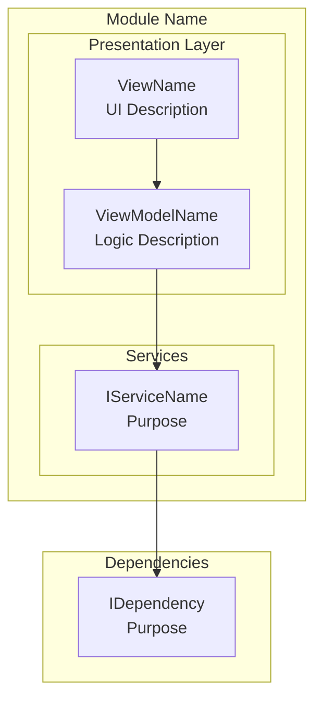
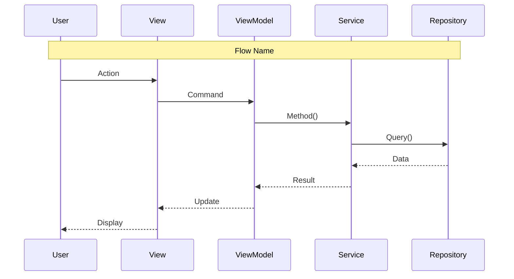

# LCS-SBD-0XX: Scope Breakdown — [Codename]

<!--
TEMPLATE USAGE:
1. Copy this file to docs/specs/vX.Y.x/vX.Y.Z/LCS-SBD-0XY.md
2. Replace all [bracketed placeholders] with actual content
3. Delete instructional comments (<!-- --> blocks) after use
4. See docs/workflows/WF-SBD-Drafting.md for detailed guidance

DOCUMENT COMPLEXITY GUIDELINES:
| Complexity | Sub-Parts | Required Sections | Optional Sections |
|:-----------|:----------|:------------------|:------------------|
| Simple     | 1-2       | 1-4, 10-12        | —                 |
| Medium     | 3-4       | 1-8, 10-12        | 9                 |
| Complex    | 5+        | All sections      | All advanced      |
-->

## Document Control

| Field            | Value                                    |
| :--------------- | :--------------------------------------- |
| **Document ID**  | LCS-SBD-0XX                              |
| **Version**      | vX.Y.Z                                   |
| **Codename**     | [The Descriptive Name]                   |
| **Status**       | Draft                                    |
| **Last Updated** | YYYY-MM-DD                               |
| **Owner**        | Lead Architect                           |
| **Depends On**   | [List prerequisite versions]             |

<!--
NUMBERING CONVENTION:
- Document ID: LCS-SBD-0XY where X = major version, Y = feature number
- Examples: LCS-SBD-011 (v0.1.1), LCS-SBD-025 (v0.2.5), LCS-SBD-031 (v0.3.1)
-->

---

## 1. Executive Summary

### 1.1 The Vision

<!-- 1-2 paragraphs: WHAT the feature does and WHY it matters -->

**vX.Y.Z** delivers the **[Codename]** — [one-sentence description of capability]. This release transforms [component] from [current state] into [future state], enabling [target users] to [key benefit].

[Optional second paragraph expanding on the vision]

### 1.2 Business Value

<!-- 4-6 tangible benefits -->

- **[Category]:** [Specific benefit statement]
- **User Experience:** [How users benefit]
- **Efficiency:** [Time/effort savings]
- **Quality Control:** [Reliability improvements]
- **Enterprise Ready:** [Scale/team features]
- **Foundation:** [What this enables for future versions]

### 1.3 Success Criteria

<!-- 3-5 measurable outcomes that determine release success -->

This release succeeds when:

1. [Component] [performs specific action] with [measurable outcome].
2. Users can [perform action] via [interface].
3. [Feature] validates [input] before [operation].
4. [Import/Export/Integration] enables [capability].
5. All UI respects license gating ([Tier]+ for [Feature]).

### 1.4 License Gating

<!-- Include if features are tier-restricted; delete if not applicable -->

The [Feature] is a **[Tier]** feature. Lower tiers will see:

- Read-only access to [component] (no edit capability)
- "[Upgrade to Tier]" prompt when attempting [action]
- [Feature] buttons disabled with upgrade tooltip

---

## 2. Dependencies on Prior Versions

<!-- Map each dependency to its source version and usage -->

| Component                | Source Version | Usage in vX.Y.Z                          |
| :----------------------- | :------------- | :--------------------------------------- |
| `IInterfaceName`         | vX.Y.Za        | [How it's used]                          |
| `EntityName`             | vX.Y.Zb        | [How it's used]                          |
| `EventName`              | vX.Y.Zc        | [How it's used]                          |
| `IConfigurationService`  | v0.0.3d        | [Configuration storage]                  |
| `Serilog`                | v0.0.3b        | [Logging operations]                     |

<!--
CATEGORIES TO CONSIDER:
- Repository interfaces (data access)
- Service interfaces (business logic)
- Entity models (data structures)
- Events (pub/sub communication)
- Infrastructure services (layout, licensing, configuration)
-->

---

## 3. Sub-Part Specifications

<!--
Each sub-part follows a consistent structure:
- Header table with metadata
- Goal statement (one sentence)
- Key Deliverables (5-8 bullet points)
- Key Interfaces (code block)
- Optional: UI Mockups, Logic descriptions, Storage paths
- Dependencies
-->

### 3.1 vX.Y.Za: [Sub-Part Title]

| Field            | Value                                     |
| :--------------- | :---------------------------------------- |
| **Sub-Part ID**  | INF-0XXa                                  |
| **Title**        | [Descriptive Title]                       |
| **Module**       | `Lexichord.[Module]`                      |
| **License Tier** | [Core/Writer/WriterPro/Teams/Enterprise]  |

**Goal:** [Verb] [what] to [achieve outcome].

<!-- Example goals:
- "Integrate `Library.Name` into the Host and establish the default configuration."
- "Create a [Component] tab using [Control] to list all items with sorting."
- "Implement a [process] that performs [operation] on [data]."
-->

**Key Deliverables:**

- `ClassName.axaml` with [UI control/component]
- `ViewModelName` with `ObservableCollection<T>`
- [Feature]: [specific behavior]
- [Integration]: [connection to other components]
- Unit tests for [component]

**Key Interfaces:**

```csharp
public interface IServiceName
{
    Task<ReturnType> MethodAsync(ParamType param, CancellationToken ct = default);
    void Method(ParamType param);
    event EventHandler<EventArgsType> EventName;
}
```

<!-- OPTIONAL: Include for UI components -->
**Key UI Components:**

```text
+------------------------------------------------------------------+
|  Window Title                                          [?] [_] [x]|
+------------------------------------------------------------------+
| [Button] [Button]  | [Dropdown v] | [Search...          ]        |
+------------------------------------------------------------------+
| Column A       | Column B        | Column C      | Column D      |
|----------------|-----------------|---------------|---------------|
| data           | data            | data          | data          |
+------------------------------------------------------------------+
| Status bar text                                                   |
+------------------------------------------------------------------+
```

<!-- OPTIONAL: Include for algorithmic sub-parts -->
**Filter/Processing Logic:**

```text
DISPLAY item IF:
  (condition_a is empty OR item.Property CONTAINS condition_a)
  AND (flag_b OR item.Status = expected_status)
  AND (filter_c is empty OR item.Category = filter_c)
```

<!-- OPTIONAL: Include for persistence-related features -->
**Storage Location:**

- Windows: `%APPDATA%/Lexichord/[path]/[file].json`
- macOS: `~/Library/Application Support/Lexichord/[path]/[file].json`
- Linux: `~/.config/Lexichord/[path]/[file].json`

**Dependencies:**

- vX.Y.Za: [Component] ([why needed])
- vX.Y.Zb: [Component] ([why needed])

---

### 3.2 vX.Y.Zb: [Sub-Part Title]

| Field            | Value                                     |
| :--------------- | :---------------------------------------- |
| **Sub-Part ID**  | INF-0XXb                                  |
| **Title**        | [Descriptive Title]                       |
| **Module**       | `Lexichord.[Module]`                      |
| **License Tier** | [Core/Writer/WriterPro/Teams/Enterprise]  |

**Goal:** [Verb] [what] to [achieve outcome].

**Key Deliverables:**

- [Deliverable 1]
- [Deliverable 2]
- [Deliverable 3]
- Unit tests for [component]

**Key Interfaces:**

```csharp
public interface IServiceName
{
    // Interface definition
}
```

**Dependencies:**

- vX.Y.Za: [Component] ([why needed])

---

<!-- Add additional sub-parts as needed: 3.3 vX.Y.Zc, 3.4 vX.Y.Zd, etc. -->

---

## 4. Implementation Checklist

<!--
TASK GRANULARITY GUIDELINES:
- Each task should be 0.5-4 hours
- Include unit tests as separate line items
- Group by sub-part ID
- End with integration tests and module registration
-->

| #  | Sub-Part | Task                                            | Est. Hours |
| :- | :------- | :---------------------------------------------- | :--------- |
| 1  | vX.Y.Za  | [Specific task description]                     | X          |
| 2  | vX.Y.Za  | [Specific task description]                     | X          |
| 3  | vX.Y.Za  | Unit tests for [component]                      | X          |
| 4  | vX.Y.Zb  | [Specific task description]                     | X          |
| 5  | vX.Y.Zb  | [Specific task description]                     | X          |
| 6  | vX.Y.Zb  | Unit tests for [component]                      | X          |
| 7  | All      | Integration tests for full [feature]            | X          |
| 8  | All      | DI registration in [Module]Module.cs            | X          |
| **Total** |   |                                                 | **XX hours** |

---

## 5. Dependency Matrix

<!-- Include for Medium/Complex documents -->

### 5.1 Required Interfaces (from earlier versions)

| Interface                | Source Version | Purpose                              |
| :----------------------- | :------------- | :----------------------------------- |
| `IInterfaceName`         | vX.Y.Za        | [Purpose]                            |
| `EntityName`             | vX.Y.Zb        | [Purpose]                            |

### 5.2 New Interfaces (defined in vX.Y.Z)

| Interface                   | Defined In | Module        | Purpose                 |
| :-------------------------- | :--------- | :------------ | :---------------------- |
| `INewInterface`             | vX.Y.Za    | Abstractions  | [Purpose]               |
| `INewService`               | vX.Y.Zb    | Modules.[X]   | [Purpose]               |

### 5.3 New Records/DTOs (defined in vX.Y.Z)

| Record            | Defined In | Purpose                                |
| :---------------- | :--------- | :------------------------------------- |
| `RecordName`      | vX.Y.Za    | [Purpose]                              |
| `DtoName`         | vX.Y.Zb    | [Purpose]                              |

### 5.4 NuGet Packages

| Package     | Version | Purpose                    | New/Existing |
| :---------- | :------ | :------------------------- | :----------- |
| `Package`   | X.Y.Z   | [Purpose]                  | New          |

---

## 6. Architecture Diagram

<!-- Include for Medium/Complex documents with multiple components -->



---

## 7. Data Flow Diagram

<!-- Include for features with complex workflows -->



---

## 8. Risks & Mitigations

<!--
COMMON RISK CATEGORIES:
- Third-party library compatibility
- Performance with large datasets
- Migration failures on existing data
- UI thread blocking
- License bypass vulnerabilities
- Data loss scenarios
-->

| Risk | Impact | Probability | Mitigation |
| :--- | :----- | :---------- | :--------- |
| [Specific risk description] | High/Medium/Low | High/Medium/Low | [Mitigation strategy] |
| [Performance concern] | Medium | Medium | [Optimization approach] |
| [Data integrity risk] | High | Low | [Validation strategy] |
| [UX concern] | Medium | Low | [Fallback behavior] |

---

## 9. Success Metrics

| Metric | Target | Measurement |
| :----- | :----- | :---------- |
| [Operation] time ([dataset size]) | < Xms | Stopwatch timing |
| [Response] time | < Xms | Debounce + refresh timing |
| [Batch operation] | < Xs | Progress dialog timing |
| Memory usage ([scenario]) | < XMB | Memory profiler |
| [Accuracy/completeness metric] | X% | [Measurement method] |

---

## 10. What This Enables

After vX.Y.Z, Lexichord will support:

- **vX.Y.Z+1:** [Next feature enabled by this work]
- **vX.Y.Z+2:** [Another dependent feature]
- **vX+1.x:** [Longer-term capability]
- **Future:** [Vision statement]

---

## 11. Decision Trees

<!-- Include for Complex documents with conditional logic -->

### 11.1 [Decision Name]

```text
START: "[Question being answered]"
│
├── [Condition check]?
│   ├── NO → [Action/Return]
│   └── YES → Continue
│
├── [Next condition]?
│   ├── NO → [Action/Return]
│   └── YES → Continue
│
└── [Final action]
```

---

## 12. User Stories

<!-- Include for Complex documents -->

| ID    | Role            | Story                                                       | Acceptance Criteria                    |
| :---- | :-------------- | :---------------------------------------------------------- | :------------------------------------- |
| US-01 | [User Type]     | As a [role], I want [feature] so that [benefit].            | [Measurable outcome]                   |
| US-02 | [User Type]     | As a [role], I want [feature] so that [benefit].            | [Measurable outcome]                   |

---

## 13. Use Cases

<!-- Include for Complex documents with multi-step user flows -->

### UC-01: [Use Case Name]

**Preconditions:**

- [Required state 1]
- [Required state 2]

**Flow:**

1. User [action].
2. System [response].
3. [Component] [behavior].
4. [Continue flow...]

**Postconditions:**

- [Expected end state]

---

## 14. Unit Testing Requirements

<!-- Include for Complex documents -->

### 14.1 [Component] Tests

```csharp
[Trait("Category", "Unit")]
public class ComponentTests
{
    [Theory]
    [InlineData("input1", "expected1")]
    [InlineData("input2", "expected2")]
    public void Method_Scenario_ExpectedBehavior(string input, string expected)
    {
        // Arrange
        var sut = new Component();

        // Act
        var result = sut.Method(input);

        // Assert
        result.Should().Be(expected);
    }
}
```

---

## 15. Observability & Logging

<!-- Include for Medium/Complex documents -->

| Level   | Source      | Message Template                                         |
| :------ | :---------- | :------------------------------------------------------- |
| Debug   | [Component] | `[Operation] starting: {Parameter}`                      |
| Info    | [Component] | `[Operation] completed: {Result} in {ElapsedMs}ms`       |
| Warning | [Component] | `[Operation] exceeded threshold: {Value}`                |
| Error   | [Component] | `[Operation] failed: {Error}`                            |

---

## 16. UI/UX Specifications

<!-- Include for features with significant UI components -->

### 16.1 [View] Layout

```text
┌──────────────────────────────────────────────────────────────────────────┐
│  [Title]                                           [Action] [Action]     │ ← Toolbar
├──────────────────────────────────────────────────────────────────────────┤
│  [Filter/Search area]                                                    │
├──────────────────────────────────────────────────────────────────────────┤
│  [Main content area]                                                     │
│                                                                          │
└──────────────────────────────────────────────────────────────────────────┘
│  [Status/Footer]                                                         │
└──────────────────────────────────────────────────────────────────────────┘
```

### 16.2 Component Styling Requirements

| Component           | Theme Resource             | Notes                            |
| :------------------ | :------------------------- | :------------------------------- |
| [Component]         | `Brush.Surface.X`          | [Notes]                          |
| Buttons (Primary)   | `LexButtonPrimary` theme   | [Usage]                          |
| Buttons (Secondary) | `LexButtonSecondary` theme | [Usage]                          |

---

## 17. Acceptance Criteria (QA)

<!-- Include for Medium/Complex documents -->

| #   | Category            | Criterion                                                    |
| :-- | :------------------ | :----------------------------------------------------------- |
| 1   | **[Category]**      | [Specific testable criterion]                                |
| 2   | **[Category]**      | [Specific testable criterion]                                |
| 3   | **[Validation]**    | [Specific testable criterion]                                |
| 4   | **[Performance]**   | [Specific testable criterion]                                |
| 5   | **[License Gate]**  | [Specific testable criterion]                                |
| 6   | **[Accessibility]** | [Specific testable criterion]                                |

---

## 18. Verification Commands

```bash
# ═══════════════════════════════════════════════════════════════════════════
# vX.Y.Z Verification
# ═══════════════════════════════════════════════════════════════════════════

# 1. Verify NuGet packages installed
dotnet list src/Lexichord.[Module] package | grep [PackageName]

# 2. Build solution
dotnet build

# 3. Run unit tests for vX.Y.Z components
dotnet test --filter "Category=Unit&FullyQualifiedName~[Component]"

# 4. Run all vX.Y.Z tests
dotnet test --filter "Category=Unit&FullyQualifiedName~vX.Y.Z"

# 5. Manual verification:
# a) [Manual test step 1]
# b) [Manual test step 2]
# c) [Manual test step 3]
```

---

## 19. Deliverable Checklist

| #  | Deliverable                                                    | Status |
| :- | :------------------------------------------------------------- | :----- |
| 1  | `FileName.axaml` with [component]                              | [ ]    |
| 2  | `ClassName` with [functionality]                               | [ ]    |
| 3  | [Feature] implementation                                       | [ ]    |
| 4  | Unit tests for [component]                                     | [ ]    |
| 5  | Integration tests for [workflow]                               | [ ]    |
| 6  | DI registration complete                                       | [ ]    |

---

## 20. Code Examples

<!-- Include for Complex documents; show key implementations -->

### 20.1 [Record/DTO Name]

```csharp
namespace Lexichord.[Module].Models;

/// <summary>
/// [Description of the record/DTO purpose].
/// </summary>
public record RecordName
{
    public Guid Id { get; init; }
    public required string RequiredProperty { get; init; }
    public string? OptionalProperty { get; init; }
    public SomeEnum EnumProperty { get; init; } = SomeEnum.Default;
}
```

### 20.2 [Interface Name]

```csharp
namespace Lexichord.Abstractions.Contracts;

/// <summary>
/// [Description of the interface purpose].
/// </summary>
public interface IServiceName
{
    /// <summary>
    /// [Method description].
    /// </summary>
    /// <param name="param">[Parameter description].</param>
    /// <param name="cancellationToken">Cancellation token.</param>
    /// <returns>[Return value description].</returns>
    Task<ReturnType> MethodAsync(
        ParamType param,
        CancellationToken cancellationToken = default);
}
```

---

## 21. Deferred Features

<!-- Document features explicitly OUT OF SCOPE -->

| Feature                      | Deferred To | Reason                                         |
| :--------------------------- | :---------- | :--------------------------------------------- |
| [Feature 1]                  | vX.Y.Z      | [Reason for deferral]                          |
| [Feature 2]                  | vX.Y.Z      | [Reason for deferral]                          |

---

## 22. Changelog Entry

<!-- Pre-write the CHANGELOG.md entry -->

Upon completion of vX.Y.Z, the following entry will be added to `CHANGELOG.md`:

```markdown
## [X.Y.Z] - YYYY-MM-DD

### Added

- **[Feature 1]**: [Description]
- **[Feature 2]**: [Description]

### Changed

- [Change description]

### Dependencies

- Added: [Package] X.Y.Z for [purpose]

### Technical

- `ClassName` for [purpose]
- `InterfaceName` abstraction for [purpose]
```

---

<!--
NAMING CONVENTIONS REFERENCE:

| Element        | Convention              | Example                  |
|:---------------|:------------------------|:-------------------------|
| Document ID    | LCS-SBD-0XY             | LCS-SBD-025              |
| Sub-Part ID    | INF-XXXa                | INF-025a                 |
| Version        | vX.Y.Za                 | v0.2.5a                  |
| Interface      | I[Noun]Service          | ITerminologyService      |
| View           | [Name]View.axaml        | LexiconView.axaml        |
| ViewModel      | [Name]ViewModel         | LexiconViewModel         |
| Event          | [Noun][Past]Event       | LexiconChangedEvent      |
| Validator      | [Entity]Validator       | StyleTermValidator       |
| DTO            | [Entity]Dto             | StyleTermDto             |
-->
