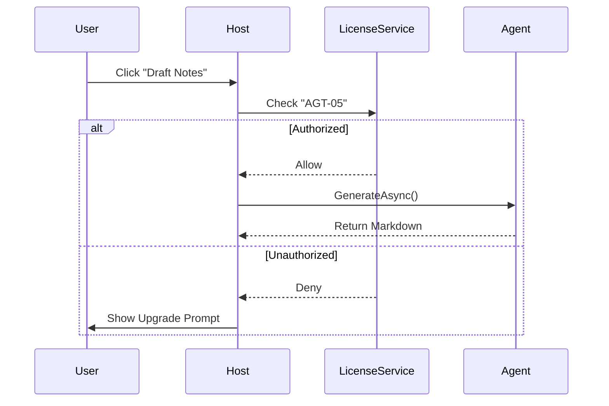

# LDS-01: Feature Design Specification

## 1. Metadata & Categorization
*This section allows for sorting and filtering features within the project management system.*

| Field | Value | Description |
| :--- | :--- | :--- |
| **Feature ID** | `[e.g., AGT-05]` | Matches the Roadmap ID. |
| **Feature Name** | `[e.g., Release Notes Agent]` | The internal display name. |
| **Target Version** | `[e.g., v0.8.0]` | The semantic version target. |
| **Module Scope** | `[e.g., Lexichord.Modules.Agents]` | The specific DLL/Project this code lives in. |
| **Swimlane** | `[Governance / Memory / Ensemble / Acoustics]` | The functional vertical. |
| **License Tier** | `[Core / Writer Pro / Teams / Enterprise]` | The minimum license required to load this. |
| **Feature Gate Key** | `[e.g., FeatureFlags.Agents.ReleaseNotes]` | The string key used in `ILicenseService`. |
| **Author** | `[Name]` | Primary Architect. |
| **Reviewer** | `[Name]` | Lead Architect / Peer. |
| **Status** | `[Draft / Review / Approved / Deprecated]` | Current lifecycle state. |
| **Last Updated** | `2026-01-26` | Date of last modification. |

---

## 2. Executive Summary
### 2.1 The Requirement
*What is the user problem?*
> Example: Writers currently spend 2-3 hours manually diffing Git tags to write changelogs. They need an automated way to draft these based on commit history.

### 2.2 The Proposed Solution
*High-level technical approach.*
> Example: Implement an Agent workflow that utilizes the `IGitService` to retrieve commit messages between two tags, feeds them into the `ReleaseNotesPrompt`, and outputs a Markdown formatted list.

---

## 3. Architecture & Modular Strategy
*Crucial for keeping the Monolith decoupled.*

### 3.1 Dependencies
*   **Upstream Modules:** (What must be loaded for this to work?)
    *   `Lexichord.Host` (Core services)
    *   `Lexichord.Modules.Git` (For history retrieval)
    *   `Lexichord.Modules.Style` (For formatting rules)
*   **NuGet Packages:**
    *   `[e.g., LibGit2Sharp]`
    *   `[e.g., SemanticVersioning]`

### 3.2 Licensing Behavior
*How does the application behave if the user is on a lower tier (e.g., Free Tier)?*
*   **Load Behavior:** (Choose one)
    *   [ ] **Hard Gate:** The Module DLL is not loaded at all.
    *   [x] **Soft Gate:** The Module loads, but the Service returns "NotAuthorized".
    *   [ ] **UI Gate:** The UI elements are hidden/disabled via `IsVisible="{Binding IsPro}"`.
*   **Fallback Experience:**
    *   > Example: The "Generate Release Notes" button appears but has a lock icon. Clicking it opens the "Upgrade to Teams" modal.

---

## 4. Data Contract (The API)
*Define the Interface that is exposed to the Host or other Plugins.*

```csharp
// Namespace: Lexichord.Modules.Agents.Abstractions
public interface IReleaseNotesGenerator
{
    /// <summary>
    /// Generates a changelog between two git references.
    /// </summary>
    /// <param name="repoPath">Local path to the repository.</param>
    /// <param name="startTag">The previous version tag.</param>
    /// <param name="endTag">The current version tag.</param>
    /// <returns>A markdown string of the generated notes.</returns>
    Task<GenerationResult> GenerateAsync(string repoPath, string startTag, string endTag);
}

public record GenerationResult(string Content, bool Success, string FailureReason);
```

---

## 5. Implementation Logic
### 5.1 Flow Diagram (Mermaid)


### 5.2 Key Algorithmic Logic
*Describe complex logic here (e.g., Prompt Engineering strategy).*
*   **Prompt Structure:** System Prompt must inject `StyleGuide.Tone` settings.
*   **Filtering:** Logic must ignore commits starting with `chore:`, `merge:`, or `ci:`.

---

## 6. Data Persistence (Database)
*Define changes to the PostgreSQL schema. Remember: Use FluentMigrator.*

*   **Migration ID:** `[YYYYMMDD_HHMM_Description]`
*   **Module Schema:** `[e.g., agent_workflows]`
*   **New Tables / Columns:**
    *   `release_drafts` (id, project_id, content, created_at)
*   **Vector Storage:**
    *   Will this feature generate embeddings? [Yes/No]

---

## 7. UI/UX Specifications
*Specifics for AvaloniaUI implementation.*

### 7.1 Visual Components
*   **Location:** Sidebar > Agents Tab > "Release Specialist".
*   **Controls:**
    *   Dropdown: `Start Tag` (populated via Git).
    *   Dropdown: `End Tag`.
    *   Button: `Draft (Generate)`.
*   **State Management:**
    *   Show `ProgressBar` ("Reading Git History...") -> "Consulting LLM..." -> "Formatting...".

### 7.2 Accessibility (A11y)
*   Ensure the Result Markdown Viewer is keyboard focusable.
*   Ensure Loading Spinner has `AutomationProperties.Name`.

---

## 8. Observability & Logging
*Define the Serilog events.*

*   **Metric:** `Agents.ReleaseNotes.GenerationTime` (Timer).
*   **Log (Info):** `[AGT] Started release note generation for repo {RepoName} range {Start}..{End}`.
*   **Log (Warn):** `[AGT] Repository not found at path {Path}`.
*   **Audit Log (Enterprise):** `User {Id} generated release notes. Tokens used: {Count}.`

---

## 9. Security & Safety
*   **PII Risk:** Low (Commit messages usually public).
*   **Injection Risk:** Git tags are user input—must be sanitized before being passed to `LibGit2Sharp` or the Prompt.
*   **Output Validation:** The AI output must be scanned for hallucinations (e.g., inventing breaking changes).

---

## 10. Acceptance Criteria (QA)
*These feed directly into LDS-02 (Test Plan).*

1.  **[Functional]** System generates a Markdown list from a repo with >100 commits.
2.  **[Licensing]** Feature is inaccessible when `License.Tier == Core`.
3.  **[Edge Case]** System handles a repo with *no* tags gracefully (returns error).
4.  **[Performance]** Generation takes < 30 seconds for a standard diff.