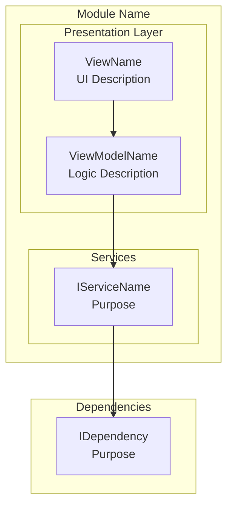
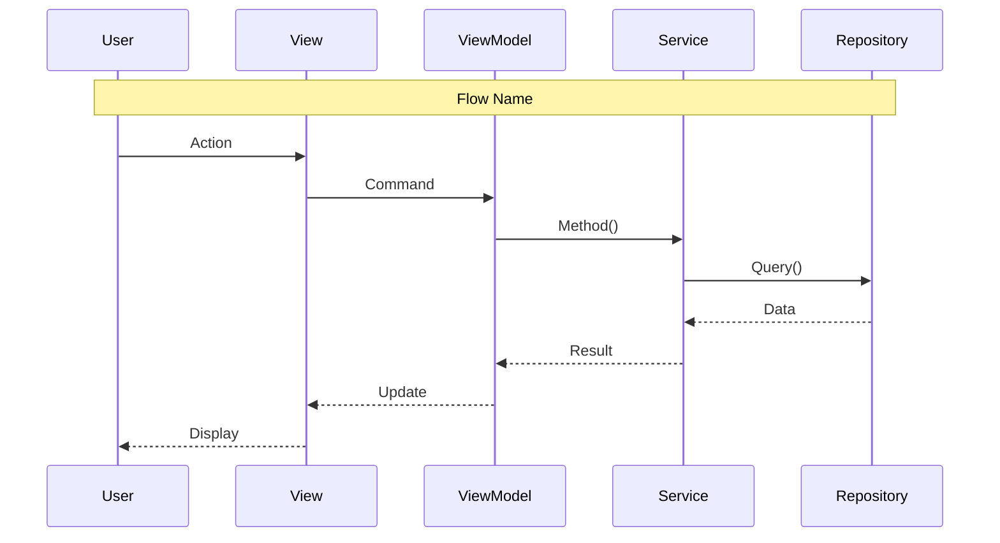

# Workflow: Drafting Scope Breakdown Documents (LCS-SBD)

This workflow describes how to create comprehensive Scope Breakdown Documents for Lexichord, based on patterns observed in existing specifications.

---

## Phase 1: Document Setup

### 1.1 Create Document Header

Every SBD begins with a standardized Document Control table:

```markdown
# LCS-SBD-XXX: Scope Breakdown — [Codename/Title]

## Document Control

| Field            | Value                                    |
| :--------------- | :--------------------------------------- |
| **Document ID**  | LCS-SBD-XXX                              |
| **Version**      | vX.Y.Z                                   |
| **Codename**     | [The Descriptive Name]                   |
| **Status**       | Draft                                    |
| **Last Updated** | YYYY-MM-DD                               |
| **Owner**        | Lead Architect                           |
| **Depends On**   | [List prerequisite versions]             |
```

**Numbering Convention:**
- Document ID follows pattern: `LCS-SBD-0XY` where X = major version, Y = feature number
- Examples: `LCS-SBD-011` (v0.1.1), `LCS-SBD-025` (v0.2.5), `LCS-SBD-031` (v0.3.1)

---

## Phase 2: Executive Summary

### 2.1 The Vision (1-2 paragraphs)

Describe **what** the feature does and **why** it matters. Use active, confident language:

```markdown
### 1.1 The Vision

**vX.Y.Z** delivers the **[Codename]** — [one-sentence description of capability].
This release transforms [component] from [current state] into [future state],
enabling [target users] to [key benefit].
```

### 2.2 Business Value (bullet list)

List 4-6 tangible benefits using this pattern:

```markdown
### 1.2 Business Value

- **[Category]:** [Specific benefit statement]
- **User Experience:** [How users benefit]
- **Efficiency:** [Time/effort savings]
- **Quality Control:** [Reliability improvements]
- **Enterprise Ready:** [Scale/team features]
```

### 2.3 Success Criteria (numbered list)

Define 3-5 measurable outcomes that determine if the release succeeded:

```markdown
### 1.3 The Success Criteria

This release succeeds when:

1. [Component] [performs specific action] with [measurable outcome].
2. Users can [perform action] via [interface].
3. [Feature] validates [input] before [operation].
4. [Import/Export/Integration] enables [capability].
```

### 2.4 License Gating (if applicable)

If features are tier-restricted, document the gating strategy:

```markdown
### 1.4 License Gating

The [Feature] is a **[Tier]** feature. Lower tiers will see:

- Read-only access to [component] (no edit capability)
- "[Upgrade to Tier]" prompt when attempting [action]
- [Feature] buttons disabled with upgrade tooltip
```

---

## Phase 3: Dependencies Section

### 3.1 Dependencies on Prior Versions

Create a table mapping each dependency to its source and usage:

```markdown
## 2. Dependencies on Prior Versions

| Component                | Source Version | Usage in vX.Y.Z                          |
| :----------------------- | :------------- | :--------------------------------------- |
| `IInterfaceName`         | vX.Y.Za        | [How it's used]                          |
| `EntityName`             | vX.Y.Zb        | [How it's used]                          |
| `EventName`              | vX.Y.Zc        | [How it's used]                          |
```

**Categories to consider:**
- Repository interfaces (data access)
- Service interfaces (business logic)
- Entity models (data structures)
- Events (pub/sub communication)
- Infrastructure services (layout, licensing, configuration)

---

## Phase 4: Sub-Part Specifications

This is the core of the document. Each sub-part follows a consistent structure.

### 4.1 Sub-Part Header Table

```markdown
### 3.X vX.Y.Za: [Sub-Part Title]

| Field            | Value                                     |
| :--------------- | :---------------------------------------- |
| **Sub-Part ID**  | INF-XXXa                                  |
| **Title**        | [Descriptive Title]                       |
| **Module**       | `Lexichord.[Module]`                      |
| **License Tier** | [Core/Writer/WriterPro/Teams/Enterprise]  |
```

### 4.2 Goal Statement

One sentence describing the sub-part's purpose:

```markdown
**Goal:** [Verb] [what] to [achieve outcome].
```

Examples:
- "Integrate `Dock.Avalonia` into the Host and establish the default docking layout."
- "Create a Lexicon tab using Avalonia.DataGrid to list all terms with sorting."
- "Implement a secondary scan loop that performs fuzzy matching on document words."

### 4.3 Key Deliverables (bullet list)

List 5-8 concrete outputs:

```markdown
**Key Deliverables:**
- `ClassName.axaml` with [UI control/component]
- `ViewModelName` with `ObservableCollection<T>`
- [Feature]: [specific behavior]
- [Integration]: [connection to other components]
- Unit tests for [component]
```

### 4.4 Key Interfaces (code block)

Include interface definitions when applicable:

```markdown
**Key Interfaces:**
```csharp
public interface IServiceName
{
    Task<ReturnType> MethodAsync(ParamType param);
    void Method(ParamType param);
    event EventHandler<EventArgsType> EventName;
}
```

### 4.5 UI Mockups (ASCII diagrams)

For UI components, include ASCII wireframes:

```markdown
**Key UI Components:**
```
+------------------------------------------------------------------+
|  Window Title                                          [?] [_] [x]|
+------------------------------------------------------------------+
| [Button] [Button]  | [Dropdown v] | [Search...          ]        |
+------------------------------------------------------------------+
| Column A       | Column B        | Column C      | Column D      |
|----------------|-----------------|---------------|---------------|
| data           | data            | data          | data          |
+------------------------------------------------------------------+
| Status bar text                                                   |
+------------------------------------------------------------------+
```

### 4.6 Logic/Flow Descriptions

For algorithmic sub-parts, include pseudocode or decision logic:

```markdown
**Filter Logic:**
```
DISPLAY item IF:
  (condition_a is empty OR item.Property CONTAINS condition_a)
  AND (flag_b OR item.Status = expected_status)
  AND (filter_c is empty OR item.Category = filter_c)
```

### 4.7 Storage/Path Information

For persistence-related features:

```markdown
**Storage Location:**
- Windows: `%APPDATA%/Lexichord/[path]/[file].json`
- macOS: `~/Library/Application Support/Lexichord/[path]/[file].json`
- Linux: `~/.config/Lexichord/[path]/[file].json`
```

### 4.8 Dependencies (per sub-part)

```markdown
**Dependencies:**
- vX.Y.Za: [Component] ([why needed])
- vX.Y.Zb: [Component] ([why needed])
```

---

## Phase 5: Implementation Checklist

Create a numbered task table with hour estimates:

```markdown
## 4. Implementation Checklist

| #  | Sub-Part | Task                                            | Est. Hours |
| :- | :------- | :---------------------------------------------- | :--------- |
| 1  | vX.Y.Za  | [Specific task description]                     | X          |
| 2  | vX.Y.Za  | [Specific task description]                     | X          |
| 3  | vX.Y.Zb  | [Specific task description]                     | X          |
| **Total** |   |                                                 | **XX hours** |
```

**Task Granularity Guidelines:**
- Each task should be 0.5-4 hours
- Include unit tests as separate line items
- Group by sub-part ID
- End with integration tests and module registration

---

## Phase 6: Architecture Diagrams (for complex features)

### 6.1 Component Diagram (Mermaid)

```markdown
## 5. Architecture Diagram



### 6.2 Sequence Diagram (for workflows)

```markdown
## 6. Data Flow Diagram



---

## Phase 7: Risk Assessment

```markdown
## 7. Risks & Mitigations

| Risk | Impact | Probability | Mitigation |
| :--- | :----- | :---------- | :--------- |
| [Specific risk description] | High/Medium/Low | High/Medium/Low | [Mitigation strategy] |
| [Performance concern] | Medium | Medium | [Optimization approach] |
| [Data integrity risk] | High | Low | [Validation strategy] |
| [UX concern] | Medium | Low | [Fallback behavior] |
```

**Common Risk Categories:**
- Third-party library compatibility
- Performance with large datasets
- Migration failures on existing data
- UI thread blocking
- License bypass vulnerabilities
- Data loss scenarios

---

## Phase 8: Success Metrics

```markdown
## 8. Success Metrics

| Metric | Target | Measurement |
| :----- | :----- | :---------- |
| [Operation] time ([dataset size]) | < Xms | Stopwatch timing |
| [Response] time | < Xms | Debounce + refresh timing |
| [Batch operation] | < Xs | Progress dialog timing |
| Memory usage ([scenario]) | < XMB | Memory profiler |
```

---

## Phase 9: Forward-Looking Section

```markdown
## 9. What This Enables

After vX.Y.Z, Lexichord will support:

- **vX.Y.Z+1:** [Next feature enabled by this work]
- **vX.Y.Z+2:** [Another dependent feature]
- **vX+1.x:** [Longer-term capability]
- **Future:** [Vision statement]
```

---

## Phase 10: Verification Section

### 10.1 Verification Commands

```markdown
## 10. Verification Commands

```bash
# 1. Build and run
dotnet build
dotnet run --project src/Lexichord.Host

# 2. Verify [component] appears
# Expected: [description of expected behavior]

# 3. Test [feature]
# [Step-by-step manual test instructions]

# 4. Run unit tests
dotnet test --filter "FullyQualifiedName~[Namespace]"

# 5. Run integration tests
dotnet test --filter "Category=Integration&FullyQualifiedName~[Namespace]"
```

### 10.2 Deliverable Checklist

```markdown
## 11. Deliverable Checklist

| #  | Deliverable                                                    | Status |
| :- | :------------------------------------------------------------- | :----- |
| 1  | `FileName.axaml` with [component]                              | [ ]    |
| 2  | `ClassName` with [functionality]                               | [ ]    |
| 3  | [Feature] implementation                                       | [ ]    |
| 4  | Unit tests for [component]                                     | [ ]    |
| 5  | Integration tests for [workflow]                               | [ ]    |
```

---

## Phase 11: Advanced Sections (as needed)

### 11.1 Decision Trees (for complex logic)

```markdown
## X. Decision Trees

### X.1 [Decision Name]

```text
START: "[Question being answered]"
│
├── [Condition check]?
│   ├── NO → [Action/Return]
│   └── YES → Continue
│
├── [Next condition]?
│   ├── NO → [Action/Return]
│   └── YES → Continue
│
└── [Final action]
```

### 11.2 User Stories

```markdown
## X. User Stories

| ID    | Role            | Story                                                       | Acceptance Criteria                    |
| :---- | :-------------- | :---------------------------------------------------------- | :------------------------------------- |
| US-01 | [User Type]     | As a [role], I want [feature] so that [benefit].            | [Measurable outcome]                   |
| US-02 | [User Type]     | As a [role], I want [feature] so that [benefit].            | [Measurable outcome]                   |
```

### 11.3 Use Cases

```markdown
## X. Use Cases

### UC-01: [Use Case Name]

**Preconditions:**
- [Required state 1]
- [Required state 2]

**Flow:**
1. User [action].
2. System [response].
3. [Component] [behavior].

**Postconditions:**
- [Expected end state]
```

### 11.4 Unit Testing Requirements

```markdown
## X. Unit Testing Requirements

### X.1 [Component] Tests

```csharp
[Trait("Category", "Unit")]
public class ComponentTests
{
    [Theory]
    [InlineData("input1", "expected1")]
    [InlineData("input2", "expected2")]
    public void Method_Scenario_ExpectedBehavior(string input, string expected)
    {
        // Arrange
        var sut = new Component();

        // Act
        var result = sut.Method(input);

        // Assert
        result.Should().Be(expected);
    }
}
```

### 11.5 Observability & Logging

```markdown
## X. Observability & Logging

| Level   | Source      | Message Template                                         |
| :------ | :---------- | :------------------------------------------------------- |
| Debug   | [Component] | `[Operation] starting: {Parameter}`                      |
| Info    | [Component] | `[Operation] completed: {Result} in {ElapsedMs}ms`       |
| Warning | [Component] | `[Operation] exceeded threshold: {Value}`                |
| Error   | [Component] | `[Operation] failed: {Error}`                            |
```

### 11.6 Acceptance Criteria (QA)

```markdown
## X. Acceptance Criteria (QA)

| #   | Category            | Criterion                                                    |
| :-- | :------------------ | :----------------------------------------------------------- |
| 1   | **[Category]**      | [Specific testable criterion]                                |
| 2   | **[Category]**      | [Specific testable criterion]                                |
```

---

## Document Complexity Guidelines

| Feature Complexity | Required Sections | Optional Sections |
|:-------------------|:------------------|:------------------|
| **Simple** (1-2 sub-parts) | 1-4, 7-8, 10-11 | — |
| **Medium** (3-4 sub-parts) | 1-8, 10-11 | 9 |
| **Complex** (5+ sub-parts) | All sections | Decision Trees, Use Cases, Unit Tests |

---

## Naming Conventions Summary

| Element | Convention | Example |
|:--------|:-----------|:--------|
| Document ID | `LCS-SBD-0XY` | `LCS-SBD-025` |
| Sub-Part ID | `INF-XXXa` | `INF-025a` |
| Version | `vX.Y.Za` | `v0.2.5a` |
| Interface | `I[Noun]Service` | `ITerminologyService` |
| View | `[Name]View.axaml` | `LexiconView.axaml` |
| ViewModel | `[Name]ViewModel` | `LexiconViewModel` |
| Event | `[Noun][Past]Event` | `LexiconChangedEvent` |
